# Database Scaling Strategies

> **Part of**: [Database System Design](../README.md) | **Related**: [NoSQL Databases](./nosql.md), [Relational Databases](./relational.md), [Data Consistency](./consistency.md)

## Introduction

Database scaling is the process of increasing database capacity to handle growing data volumes, user loads, and transaction rates. As applications grow, databases often become the primary bottleneck, making scaling strategies crucial for maintaining performance and availability.

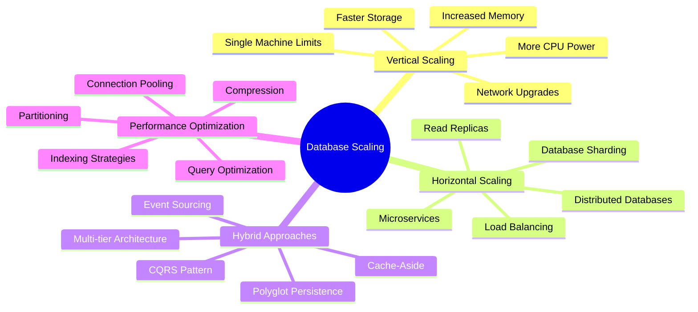

## Scaling Fundamentals

### The Scaling Challenge

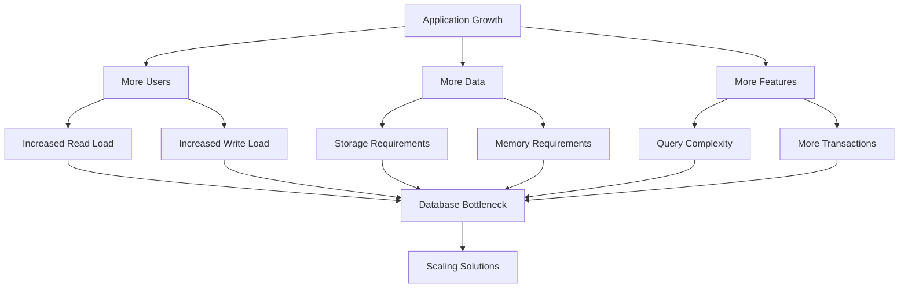

### Scaling Approaches Overview

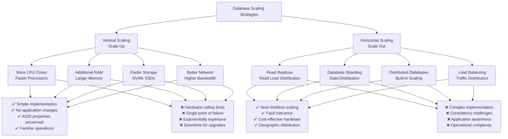

## Vertical Scaling (Scale-Up)

Vertical scaling involves increasing the computational resources of a single database server.

### Hardware Scaling Components

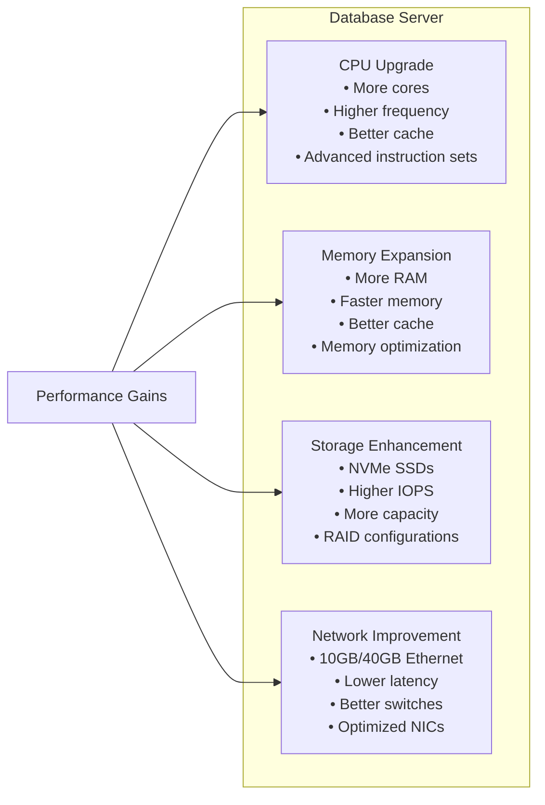

### Performance Impact Analysis

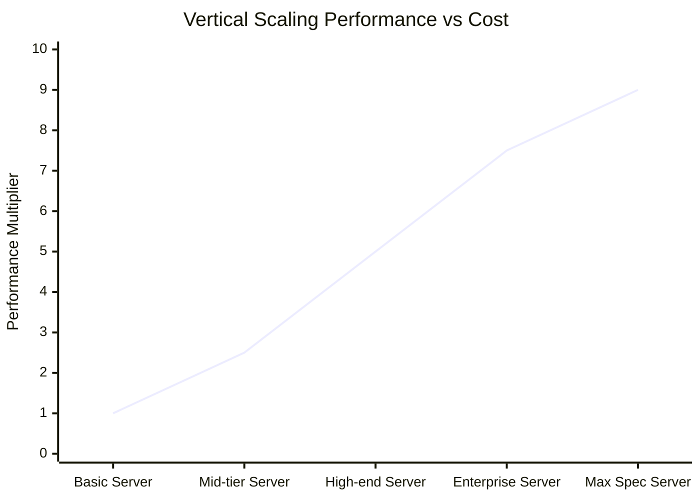

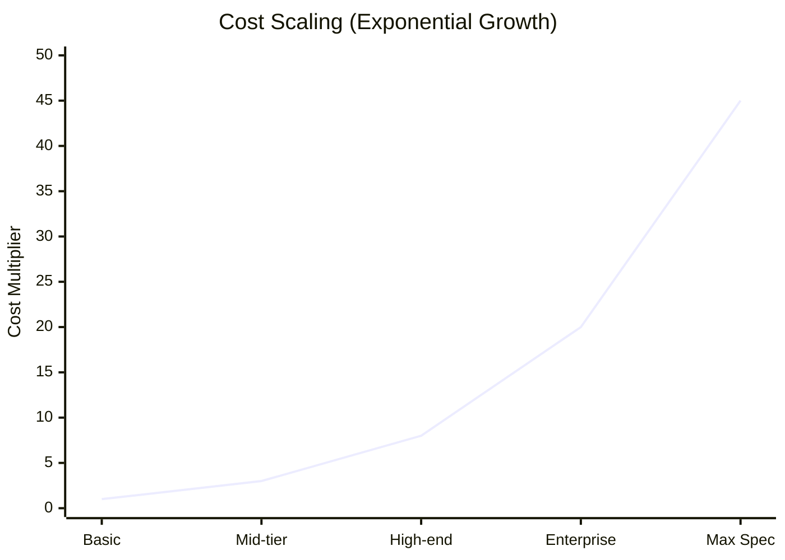

### Implementation Examples

#### PostgreSQL Vertical Scaling
```sql
-- Configuration optimizations for larger hardware
-- postgresql.conf

-- Memory settings
shared_buffers = '8GB'                    -- 25% of system RAM
effective_cache_size = '24GB'             -- 75% of system RAM
work_mem = '256MB'                        -- Per operation memory
maintenance_work_mem = '2GB'              -- For maintenance operations

-- Connection settings
max_connections = 200                     -- Balanced for server capacity
max_prepared_transactions = 0             -- Disable if not using 2PC

-- Checkpoint settings
checkpoint_completion_target = 0.9        -- Spread checkpoints
wal_buffers = '64MB'                      -- WAL buffer size
checkpoint_timeout = '15min'              -- Checkpoint frequency

-- Query planner settings
random_page_cost = 1.1                    -- SSD optimization
effective_io_concurrency = 200            -- Concurrent I/O operations
```

#### MySQL Vertical Scaling
```ini
# my.cnf configuration for high-end server

[mysqld]
# Memory allocation
innodb_buffer_pool_size = 20G           # 60-70% of available RAM
innodb_log_file_size = 2G               # Large log files for performance
innodb_log_buffer_size = 64M            # Log buffer size

# Connection handling
max_connections = 300                   # Connection limit
thread_cache_size = 50                 # Thread reuse

# Storage engine optimization
innodb_flush_log_at_trx_commit = 1     # Durability (1 for ACID)
innodb_file_per_table = 1              # Separate file per table
innodb_io_capacity = 2000              # I/O capacity for SSDs

# Query cache (if using older MySQL versions)
query_cache_size = 256M                # Query result caching
query_cache_type = 1                   # Enable query cache
```

### Advantages of Vertical Scaling

1. **Simplicity**: No architectural changes required
2. **ACID Compliance**: Maintains full transaction guarantees
3. **Consistency**: No distributed system complexity
4. **Tooling**: Existing tools and procedures work unchanged
5. **Development Speed**: No application modifications needed

### Limitations and Challenges

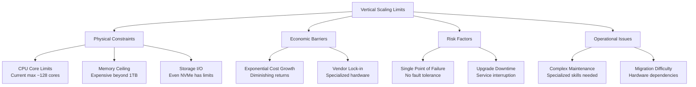

## Horizontal Scaling (Scale-Out)

Horizontal scaling distributes load and data across multiple database servers.

### Read Replicas

Read replicas distribute read queries across multiple database copies.

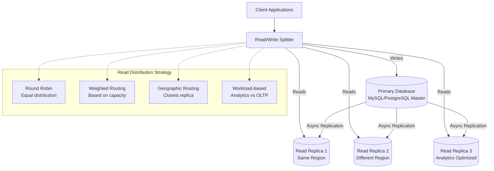

#### Implementation Example: PostgreSQL Streaming Replication
```bash
# Master configuration (postgresql.conf)
wal_level = replica
max_wal_senders = 3
checkpoint_segments = 32
archive_mode = on
archive_command = 'cp %p /archive/%f'

# pg_hba.conf on master
host replication replicator 192.168.1.100/32 md5
host replication replicator 192.168.1.101/32 md5

# Recovery configuration on replica (recovery.conf)
standby_mode = 'on'
primary_conninfo = 'host=master.db port=5432 user=replicator'
restore_command = 'cp /archive/%f %p'
archive_cleanup_command = 'pg_archivecleanup /archive %r'
```

#### Application-Level Read/Write Splitting
```python
import psycopg2
from psycopg2 import pool

class DatabaseManager:
    def __init__(self):
        # Connection pools
        self.write_pool = pool.SimpleConnectionPool(
            minconn=1, maxconn=20,
            host="master.db.example.com",
            database="myapp", user="app_user", password="..."
        )
        
        self.read_pools = [
            pool.SimpleConnectionPool(
                minconn=1, maxconn=10,
                host="replica1.db.example.com",
                database="myapp", user="readonly_user", password="..."
            ),
            pool.SimpleConnectionPool(
                minconn=1, maxconn=10,
                host="replica2.db.example.com", 
                database="myapp", user="readonly_user", password="..."
            )
        ]
        self.read_pool_index = 0
    
    def get_write_connection(self):
        return self.write_pool.getconn()
    
    def get_read_connection(self):
        # Round-robin read replica selection
        pool = self.read_pools[self.read_pool_index]
        self.read_pool_index = (self.read_pool_index + 1) % len(self.read_pools)
        return pool.getconn()
    
    def execute_write(self, query, params=None):
        conn = self.get_write_connection()
        try:
            with conn.cursor() as cursor:
                cursor.execute(query, params)
                conn.commit()
                return cursor.fetchall()
        finally:
            self.write_pool.putconn(conn)
    
    def execute_read(self, query, params=None):
        conn = self.get_read_connection()
        try:
            with conn.cursor() as cursor:
                cursor.execute(query, params)
                return cursor.fetchall()
        finally:
            # Return to appropriate pool
            for pool in self.read_pools:
                try:
                    pool.putconn(conn)
                    break
                except:
                    continue
```

### Database Sharding

Sharding partitions data across multiple databases, distributing both storage and query load.

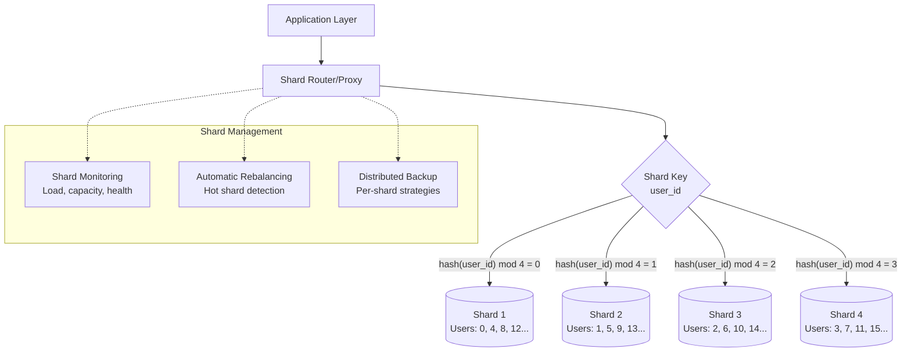

#### Sharding Strategies

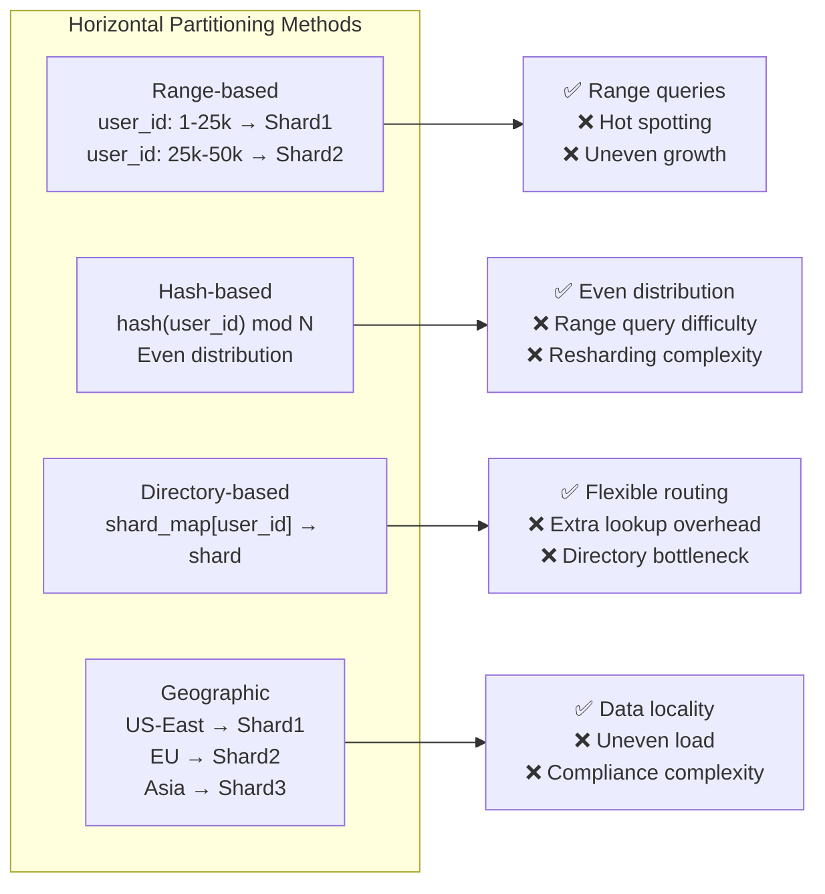

#### Sharding Implementation Example
```python
import hashlib
import psycopg2

class ShardedDatabase:
    def __init__(self, shard_configs):
        self.shards = {}
        self.shard_count = len(shard_configs)
        
        # Initialize connections to each shard
        for shard_id, config in shard_configs.items():
            self.shards[shard_id] = psycopg2.connect(**config)
    
    def get_shard_id(self, shard_key):
        # Hash-based sharding
        hash_value = int(hashlib.md5(str(shard_key).encode()).hexdigest(), 16)
        return hash_value % self.shard_count
    
    def execute_on_shard(self, shard_key, query, params=None):
        shard_id = self.get_shard_id(shard_key)
        conn = self.shards[shard_id]
        
        with conn.cursor() as cursor:
            cursor.execute(query, params)
            if query.strip().upper().startswith('SELECT'):
                return cursor.fetchall()
            else:
                conn.commit()
                return cursor.rowcount
    
    def execute_on_all_shards(self, query, params=None):
        """For operations that need to run on all shards"""
        results = []
        for shard_id, conn in self.shards.items():
            with conn.cursor() as cursor:
                cursor.execute(query, params)
                if query.strip().upper().startswith('SELECT'):
                    shard_results = cursor.fetchall()
                    results.extend([(shard_id, row) for row in shard_results])
                else:
                    conn.commit()
        return results
    
    def get_user(self, user_id):
        return self.execute_on_shard(
            user_id,
            "SELECT * FROM users WHERE user_id = %s",
            (user_id,)
        )
    
    def create_user(self, user_id, name, email):
        return self.execute_on_shard(
            user_id,
            "INSERT INTO users (user_id, name, email) VALUES (%s, %s, %s)",
            (user_id, name, email)
        )
    
    def get_user_count_all_shards(self):
        results = self.execute_on_all_shards("SELECT COUNT(*) FROM users")
        total = sum(count for shard_id, (count,) in results)
        return total

# Usage
shard_configs = {
    0: {"host": "shard0.db", "database": "app", "user": "app_user", "password": "..."},
    1: {"host": "shard1.db", "database": "app", "user": "app_user", "password": "..."},
    2: {"host": "shard2.db", "database": "app", "user": "app_user", "password": "..."},
    3: {"host": "shard3.db", "database": "app", "user": "app_user", "password": "..."}
}

db = ShardedDatabase(shard_configs)
```

### Challenges with Sharding

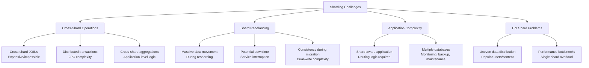

## Caching Strategies

Caching reduces database load by storing frequently accessed data in memory.

### Cache Architecture Patterns

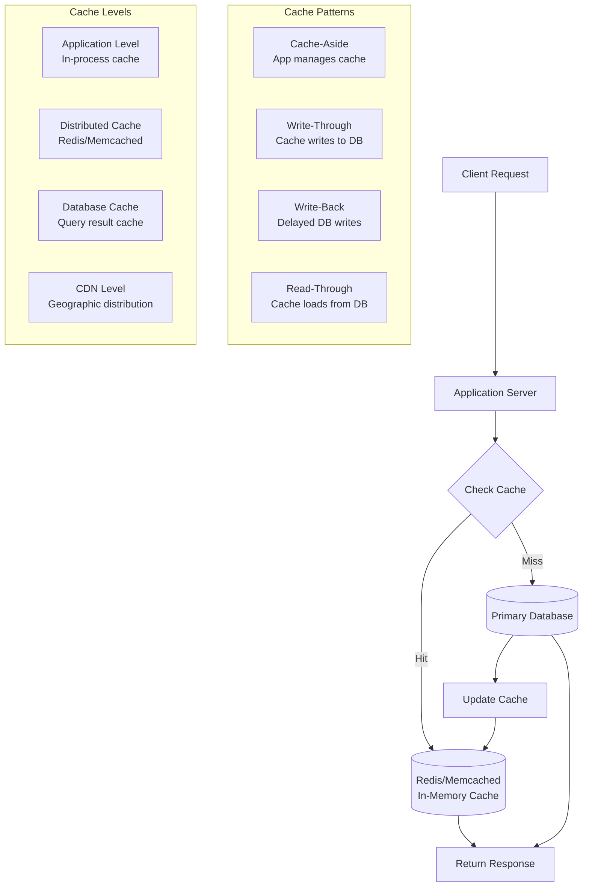

#### Redis Cluster Implementation
```python
import redis
import json
import hashlib
from functools import wraps

class CacheManager:
    def __init__(self, redis_cluster_nodes):
        self.redis_cluster = redis.RedisCluster(
            startup_nodes=redis_cluster_nodes,
            decode_responses=True,
            skip_full_coverage_check=True
        )
        self.default_ttl = 3600  # 1 hour
    
    def cache_key(self, prefix, *args):
        """Generate consistent cache key"""
        key_parts = [str(arg) for arg in args]
        key = f"{prefix}:{':'.join(key_parts)}"
        return hashlib.md5(key.encode()).hexdigest()[:16]
    
    def get(self, key):
        """Get value from cache"""
        try:
            value = self.redis_cluster.get(key)
            return json.loads(value) if value else None
        except Exception as e:
            print(f"Cache get error: {e}")
            return None
    
    def set(self, key, value, ttl=None):
        """Set value in cache"""
        try:
            ttl = ttl or self.default_ttl
            serialized = json.dumps(value)
            self.redis_cluster.setex(key, ttl, serialized)
            return True
        except Exception as e:
            print(f"Cache set error: {e}")
            return False
    
    def delete(self, key):
        """Delete key from cache"""
        try:
            return self.redis_cluster.delete(key)
        except Exception as e:
            print(f"Cache delete error: {e}")
            return False
    
    def cache_decorator(self, prefix, ttl=None):
        """Decorator for caching function results"""
        def decorator(func):
            @wraps(func)
            def wrapper(*args, **kwargs):
                # Generate cache key from function args
                cache_key = self.cache_key(prefix, *args, *kwargs.values())
                
                # Try to get from cache
                cached_result = self.get(cache_key)
                if cached_result is not None:
                    return cached_result
                
                # Execute function and cache result
                result = func(*args, **kwargs)
                self.set(cache_key, result, ttl)
                return result
            return wrapper
        return decorator

# Usage example
cache = CacheManager([
    {"host": "redis-node1", "port": 7000},
    {"host": "redis-node2", "port": 7000},
    {"host": "redis-node3", "port": 7000}
])

@cache.cache_decorator("user_profile", ttl=1800)
def get_user_profile(user_id):
    # This would normally query the database
    return database.execute(
        "SELECT * FROM users WHERE id = %s", (user_id,)
    )

@cache.cache_decorator("product_list", ttl=600)
def get_products_by_category(category, page=1, limit=20):
    return database.execute(
        "SELECT * FROM products WHERE category = %s LIMIT %s OFFSET %s",
        (category, limit, (page-1) * limit)
    )
```

### Cache Invalidation Strategies

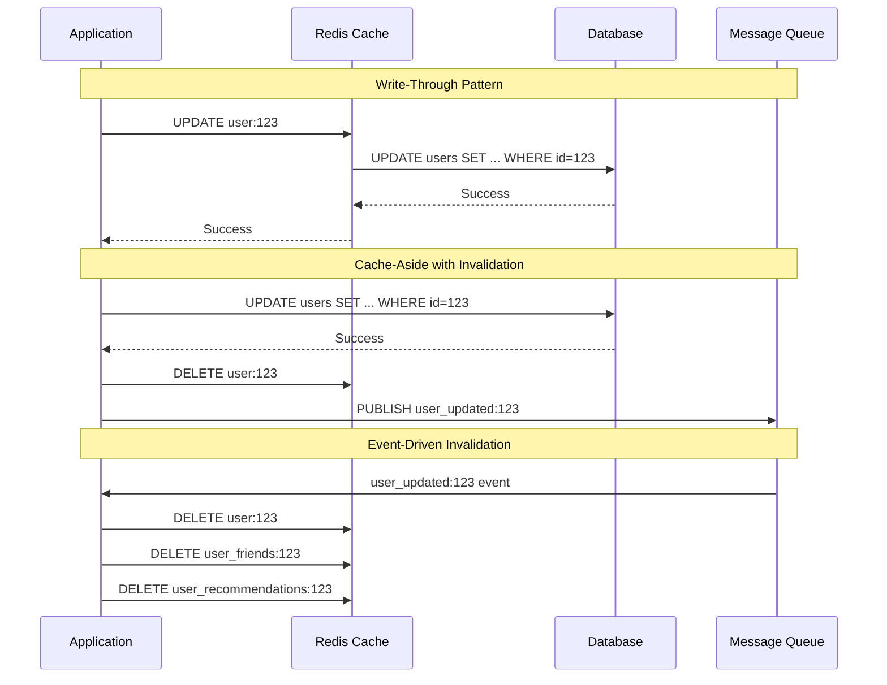

## Database Partitioning

Partitioning divides tables into smaller, more manageable pieces while maintaining logical unity.

### Partitioning Strategies

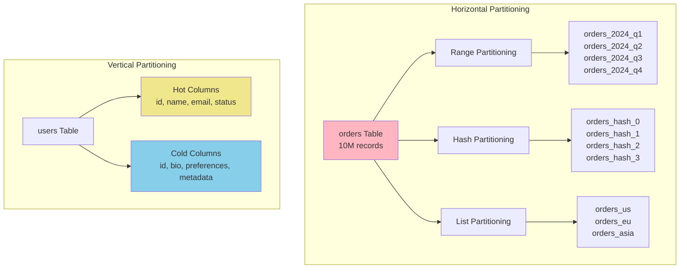

#### PostgreSQL Partitioning Example
```sql
-- Create partitioned table (PostgreSQL 10+)
CREATE TABLE orders (
    order_id BIGSERIAL,
    customer_id INTEGER,
    order_date DATE,
    amount DECIMAL(10,2),
    status VARCHAR(20),
    created_at TIMESTAMP DEFAULT NOW()
) PARTITION BY RANGE (order_date);

-- Create partitions for different date ranges
CREATE TABLE orders_2024_q1 PARTITION OF orders
    FOR VALUES FROM ('2024-01-01') TO ('2024-04-01');

CREATE TABLE orders_2024_q2 PARTITION OF orders
    FOR VALUES FROM ('2024-04-01') TO ('2024-07-01');

CREATE TABLE orders_2024_q3 PARTITION OF orders
    FOR VALUES FROM ('2024-07-01') TO ('2024-10-01');

CREATE TABLE orders_2024_q4 PARTITION OF orders
    FOR VALUES FROM ('2024-10-01') TO ('2025-01-01');

-- Indexes on partitioned table
CREATE INDEX idx_orders_customer_id ON orders (customer_id);
CREATE INDEX idx_orders_status ON orders (status);

-- Query will automatically use appropriate partition
SELECT * FROM orders 
WHERE order_date BETWEEN '2024-03-01' AND '2024-03-31'
  AND customer_id = 12345;
```

#### MySQL Partitioning Example
```sql
-- Hash partitioning in MySQL
CREATE TABLE user_sessions (
    session_id VARCHAR(128) PRIMARY KEY,
    user_id INTEGER,
    created_at TIMESTAMP,
    last_activity TIMESTAMP,
    data JSON
) 
PARTITION BY HASH(user_id)
PARTITIONS 8;

-- Range partitioning by date
CREATE TABLE user_activity_logs (
    log_id BIGINT AUTO_INCREMENT,
    user_id INTEGER,
    action VARCHAR(50),
    log_date DATE,
    details JSON,
    PRIMARY KEY (log_id, log_date)
)
PARTITION BY RANGE (YEAR(log_date)) (
    PARTITION p2022 VALUES LESS THAN (2023),
    PARTITION p2023 VALUES LESS THAN (2024),
    PARTITION p2024 VALUES LESS THAN (2025),
    PARTITION p_future VALUES LESS THAN MAXVALUE
);
```

## Connection Management and Pooling

Efficient connection management is crucial for database scalability.

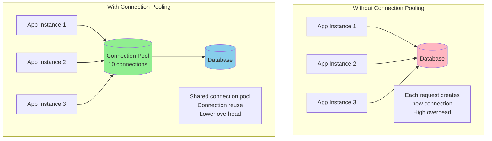

### Connection Pool Implementation

```python
import psycopg2
from psycopg2 import pool
from contextlib import contextmanager

class DatabaseConnectionPool:
    def __init__(self, minconn=1, maxconn=10, **db_config):
        """
        Initialize connection pool
        :param minconn: minimum connections in pool
        :param maxconn: maximum connections in pool
        :param db_config: dict with dbname, user, password, host, port
        """
        self.pool = psycopg2.pool.SimpleConnectionPool(minconn, maxconn, **db_config)
        if not self.pool:
            raise Exception("Failed to create connection pool")

    @contextmanager
    def get_connection(self):
        """
        Context manager to acquire and release connection
        """
        conn = self.pool.getconn()
        try:
            yield conn
        finally:
            self.pool.putconn(conn)

    def close_all(self):
        """
        Close all connections in the pool
        """
        self.pool.closeall()

if __name__ == "__main__":
    # Database credentials
    db_config = {
        "dbname": "mydb",
        "user": "myuser",
        "password": "mypassword",
        "host": "localhost",
        "port": 5432
    }

    db_pool = DatabaseConnectionPool(minconn=1, maxconn=5, **db_config)

    # Example query using the pool
    with db_pool.get_connection() as conn:
        with conn.cursor() as cur:
            cur.execute("SELECT NOW();")
            print(cur.fetchone())

    # Cleanup
    db_pool.close_all()
```

## Advanced Scaling Patterns

### CQRS (Command Query Responsibility Segregation)

CQRS separates read and write operations, allowing independent optimization of each.

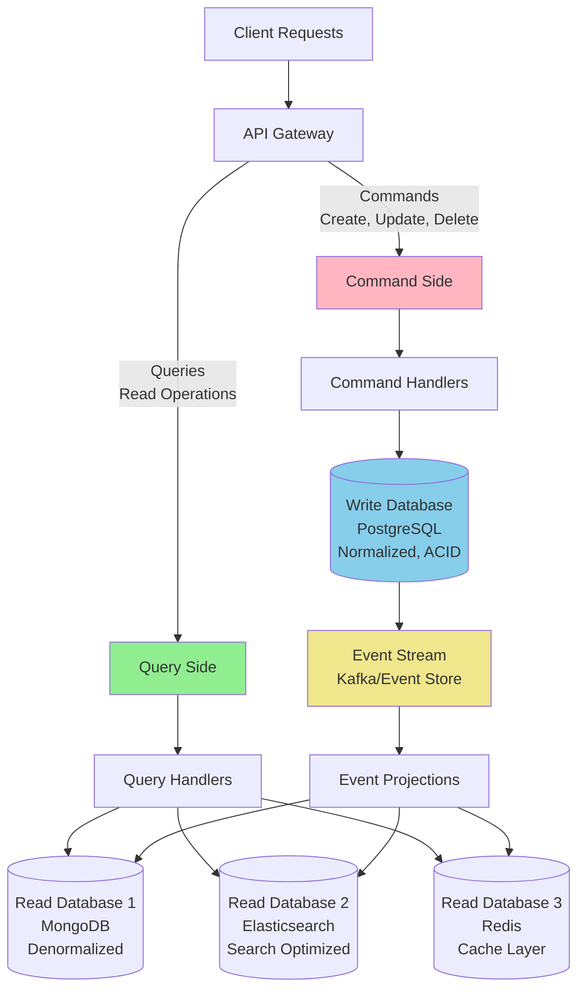

#### CQRS Implementation Example

```python
from abc import ABC, abstractmethod
from dataclasses import dataclass
from typing import List, Optional
import json
import uuid
from datetime import datetime

# Command side - Write operations
@dataclass
class Command:
    command_id: str
    timestamp: datetime
    user_id: str

@dataclass 
class CreateUserCommand(Command):
    name: str
    email: str

@dataclass
class UpdateUserCommand(Command):
    user_id: str
    name: Optional[str] = None
    email: Optional[str] = None

class CommandHandler(ABC):
    @abstractmethod
    def handle(self, command: Command):
        pass

class CreateUserCommandHandler(CommandHandler):
    def __init__(self, write_db, event_store):
        self.write_db = write_db
        self.event_store = event_store
    
    def handle(self, command: CreateUserCommand):
        # Validate command
        if not command.email or not command.name:
            raise ValueError("Name and email are required")
        
        # Write to main database
        user_id = str(uuid.uuid4())
        self.write_db.execute(
            "INSERT INTO users (id, name, email, created_at) VALUES (%s, %s, %s, %s)",
            (user_id, command.name, command.email, command.timestamp)
        )
        
        # Publish event
        event = {
            "event_type": "UserCreated",
            "user_id": user_id,
            "name": command.name,
            "email": command.email,
            "timestamp": command.timestamp.isoformat()
        }
        self.event_store.publish("user_events", event)
        
        return user_id

# Query side - Read operations  
class QueryHandler(ABC):
    @abstractmethod
    def handle(self, query):
        pass

class UserListQueryHandler(QueryHandler):
    def __init__(self, read_db):
        self.read_db = read_db
    
    def handle(self, page=1, limit=20, search=None):
        if search:
            # Use Elasticsearch for text search
            return self.read_db.search_users(search, page, limit)
        else:
            # Use MongoDB for simple queries
            return self.read_db.get_users(page, limit)

class UserProfileQueryHandler(QueryHandler):
    def __init__(self, cache, read_db):
        self.cache = cache
        self.read_db = read_db
    
    def handle(self, user_id):
        # Try cache first
        cached_profile = self.cache.get(f"user_profile:{user_id}")
        if cached_profile:
            return json.loads(cached_profile)
        
        # Fallback to read database
        profile = self.read_db.get_user_profile(user_id)
        if profile:
            self.cache.setex(f"user_profile:{user_id}", 3600, json.dumps(profile))
        
        return profile

# Event projection - Update read models
class EventProjector:
    def __init__(self, read_databases):
        self.mongodb = read_databases['mongodb']
        self.elasticsearch = read_databases['elasticsearch'] 
        self.cache = read_databases['cache']
    
    def handle_user_created_event(self, event):
        # Update MongoDB read model
        self.mongodb.users.insert_one({
            "user_id": event["user_id"],
            "name": event["name"],
            "email": event["email"],
            "created_at": event["timestamp"],
            "profile_complete": False,
            "last_activity": None
        })
        
        # Update Elasticsearch index
        self.elasticsearch.index(
            index="users",
            id=event["user_id"],
            body={
                "name": event["name"],
                "email": event["email"],
                "created_at": event["timestamp"]
            }
        )
        
        # Invalidate cache
        self.cache.delete(f"user_profile:{event['user_id']}")
```

### Event Sourcing

Event sourcing stores all changes as immutable events, providing complete audit trails and enabling temporal queries.

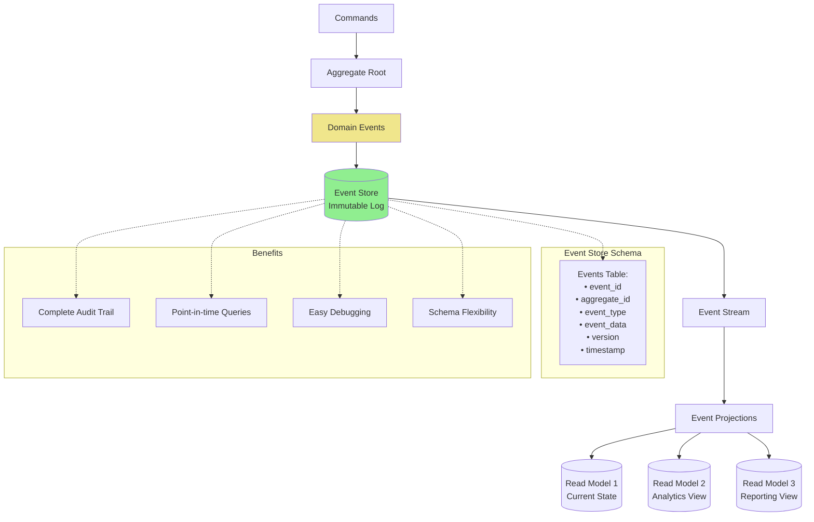

#### Event Sourcing Implementation

```python
from abc import ABC, abstractmethod
from dataclasses import dataclass, asdict
from typing import List, Dict, Any
import json
from datetime import datetime
import uuid

# Domain Events
@dataclass
class DomainEvent:
    event_id: str
    aggregate_id: str
    event_type: str
    event_data: Dict[str, Any]
    version: int
    timestamp: datetime

# Event Store
class EventStore:
    def __init__(self, database):
        self.db = database
        self._create_tables()
    
    def _create_tables(self):
        self.db.execute("""
            CREATE TABLE IF NOT EXISTS events (
                event_id VARCHAR(36) PRIMARY KEY,
                aggregate_id VARCHAR(36) NOT NULL,
                event_type VARCHAR(100) NOT NULL,
                event_data JSONB NOT NULL,
                version INTEGER NOT NULL,
                timestamp TIMESTAMP NOT NULL,
                UNIQUE(aggregate_id, version)
            )
        """)
        
        self.db.execute("""
            CREATE INDEX IF NOT EXISTS idx_events_aggregate 
            ON events(aggregate_id, version)
        """)
    
    def save_events(self, aggregate_id: str, events: List[DomainEvent], expected_version: int):
        with self.db.transaction():
            # Check for concurrency conflicts
            current_version = self.get_current_version(aggregate_id)
            if current_version != expected_version:
                raise ConcurrencyError(f"Expected version {expected_version}, got {current_version}")
            
            # Save events
            for i, event in enumerate(events):
                version = expected_version + i + 1
                self.db.execute("""
                    INSERT INTO events (event_id, aggregate_id, event_type, event_data, version, timestamp)
                    VALUES (%s, %s, %s, %s, %s, %s)
                """, (
                    event.event_id,
                    aggregate_id,
                    event.event_type,
                    json.dumps(event.event_data),
                    version,
                    event.timestamp
                ))
    
    def get_events(self, aggregate_id: str, from_version: int = 0) -> List[DomainEvent]:
        rows = self.db.execute("""
            SELECT event_id, aggregate_id, event_type, event_data, version, timestamp
            FROM events
            WHERE aggregate_id = %s AND version > %s
            ORDER BY version
        """, (aggregate_id, from_version))
        
        return [
            DomainEvent(
                event_id=row[0],
                aggregate_id=row[1],
                event_type=row[2],
                event_data=json.loads(row[3]),
                version=row[4],
                timestamp=row[5]
            )
            for row in rows
        ]
    
    def get_current_version(self, aggregate_id: str) -> int:
        result = self.db.execute("""
            SELECT MAX(version) FROM events WHERE aggregate_id = %s
        """, (aggregate_id,))
        return result[0][0] if result and result[0][0] else 0

# Aggregate Root
class UserAggregate:
    def __init__(self, user_id: str):
        self.user_id = user_id
        self.version = 0
        self.name = ""
        self.email = ""
        self.is_active = True
        self.pending_events: List[DomainEvent] = []
    
    def create_user(self, name: str, email: str):
        if self.version > 0:
            raise ValueError("User already exists")
        
        event = DomainEvent(
            event_id=str(uuid.uuid4()),
            aggregate_id=self.user_id,
            event_type="UserCreated",
            event_data={"name": name, "email": email},
            version=0,
            timestamp=datetime.utcnow()
        )
        
        self._apply_event(event)
        self.pending_events.append(event)
    
    def update_email(self, new_email: str):
        if not self.is_active:
            raise ValueError("Cannot update inactive user")
        
        if self.email == new_email:
            return  # No change needed
        
        event = DomainEvent(
            event_id=str(uuid.uuid4()),
            aggregate_id=self.user_id,
            event_type="UserEmailUpdated",
            event_data={"old_email": self.email, "new_email": new_email},
            version=0,  # Will be set by event store
            timestamp=datetime.utcnow()
        )
        
        self._apply_event(event)
        self.pending_events.append(event)
    
    def deactivate_user(self):
        if not self.is_active:
            return  # Already inactive
        
        event = DomainEvent(
            event_id=str(uuid.uuid4()),
            aggregate_id=self.user_id,
            event_type="UserDeactivated",
            event_data={},
            version=0,
            timestamp=datetime.utcnow()
        )
        
        self._apply_event(event)
        self.pending_events.append(event)
    
    def _apply_event(self, event: DomainEvent):
        if event.event_type == "UserCreated":
            self.name = event.event_data["name"]
            self.email = event.event_data["email"]
        elif event.event_type == "UserEmailUpdated":
            self.email = event.event_data["new_email"]
        elif event.event_type == "UserDeactivated":
            self.is_active = False
        
        self.version += 1
    
    def load_from_history(self, events: List[DomainEvent]):
        for event in events:
            self._apply_event(event)
        self.pending_events = []
    
    def get_pending_events(self) -> List[DomainEvent]:
        return self.pending_events.copy()
    
    def mark_events_committed(self):
        self.pending_events = []

# Repository
class UserRepository:
    def __init__(self, event_store: EventStore):
        self.event_store = event_store
    
    def get(self, user_id: str) -> UserAggregate:
        events = self.event_store.get_events(user_id)
        user = UserAggregate(user_id)
        user.load_from_history(events)
        return user
    
    def save(self, user: UserAggregate):
        pending_events = user.get_pending_events()
        if not pending_events:
            return
        
        expected_version = user.version - len(pending_events)
        self.event_store.save_events(user.user_id, pending_events, expected_version)
        user.mark_events_committed()
```

## NoSQL-Specific Scaling Strategies

### MongoDB Scaling

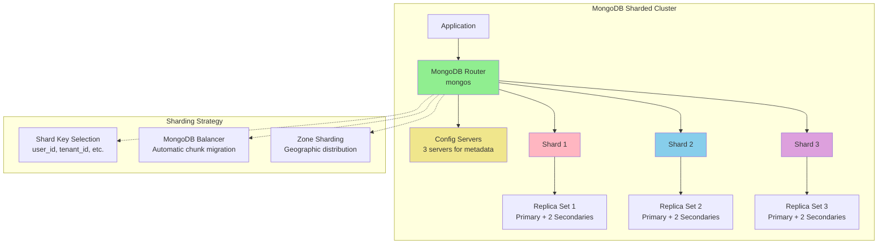

#### MongoDB Sharding Configuration

```javascript
// Enable sharding for database
sh.enableSharding("myapp")

// Create shard key index
db.users.createIndex({"user_id": 1})

// Shard collection by user_id
sh.shardCollection("myapp.users", {"user_id": 1})

// Create compound shard key for better distribution
db.orders.createIndex({"customer_id": 1, "order_date": 1})
sh.shardCollection("myapp.orders", {"customer_id": 1, "order_date": 1})

// Zone sharding for geographic distribution
sh.addShardToZone("shard-us", "US")
sh.addShardToZone("shard-eu", "EU")
sh.addShardToZone("shard-asia", "ASIA")

sh.updateZoneKeyRange(
    "myapp.users",
    {"user_id": MinKey, "region": "US"},
    {"user_id": MaxKey, "region": "US"},
    "US"
)

// Query optimization for sharded collections
db.users.find({"user_id": 12345}).explain("executionStats")
```

### Cassandra Scaling

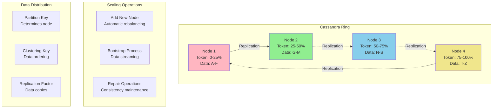

#### Adding Nodes to Cassandra

```bash
# Add new node to existing cluster
# cassandra.yaml configuration
cluster_name: 'MyCluster'
seed_provider:
    - class_name: org.apache.cassandra.locator.SimpleSeedProvider
      parameters:
          - seeds: "existing_node1,existing_node2"

# Start new node (it will automatically bootstrap)
sudo service cassandra start

# Monitor bootstrap progress
nodetool netstats

# Check cluster status
nodetool status

# Run repair after adding node
nodetool repair -pr

# Stream data optimization
# Adjust concurrent_reads and concurrent_writes
concurrent_reads: 32
concurrent_writes: 32
concurrent_counter_writes: 32
```

## Performance Monitoring and Optimization

### Database Metrics to Monitor

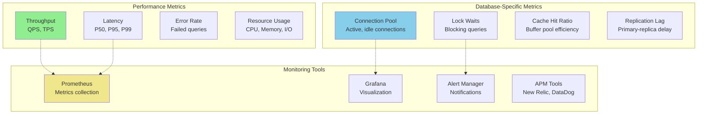

### Query Performance Optimization

```sql
-- PostgreSQL performance analysis
-- Enable query logging
ALTER SYSTEM SET log_statement = 'all';
ALTER SYSTEM SET log_min_duration_statement = 1000;  -- Log queries > 1s

-- Analyze slow queries
SELECT query, calls, total_time, mean_time, rows
FROM pg_stat_statements 
ORDER BY total_time DESC 
LIMIT 10;

-- Check index usage
SELECT schemaname, tablename, attname, n_distinct, correlation
FROM pg_stats
WHERE tablename = 'users';

-- Analyze query execution plan
EXPLAIN (ANALYZE, BUFFERS, FORMAT JSON) 
SELECT u.*, p.* FROM users u 
JOIN profiles p ON u.id = p.user_id 
WHERE u.created_at > '2024-01-01';
```

## Technology-Specific Scaling Solutions

### MySQL Scaling Solutions

```mermaid
graph TB
    MySQL[MySQL Scaling] --> MasterSlave[Master-Slave Replication]
    MySQL --> MasterMaster[Master-Master Replication]
    MySQL --> Cluster[MySQL Cluster/NDB]
    MySQL --> Proxy[MySQL Proxy/Router]
    MySQL --> Partitioning[Table Partitioning]
    
    MasterSlave --> AsyncRep[Asynchronous Replication<br/>Read scaling]
    MasterSlave --> SemiSync[Semi-sync Replication<br/>Better consistency]
    
    Cluster --> DataNodes[Data Nodes<br/>In-memory storage]
    Cluster --> Management[Management Nodes<br/>Cluster coordination]
    Cluster --> SQLNodes[SQL Nodes<br/>Query processing]
    
    Proxy --> ReadWriteSplit[Read/Write Splitting]
    Proxy --> LoadBalance[Load Balancing]
    Proxy --> FailOver[Automatic Failover]
    
    style MySQL fill:#90EE90
    style Cluster fill:#87CEEB
    style Proxy fill:#F0E68C
```

### PostgreSQL Scaling Solutions

```mermaid
graph TB
    PostgreSQL[PostgreSQL Scaling] --> Streaming[Streaming Replication]
    PostgreSQL --> LogicalRep[Logical Replication]
    PostgreSQL --> FDW[Foreign Data Wrappers]
    PostgreSQL --> Pooling[Connection Pooling]
    PostgreSQL --> Extensions[Scaling Extensions]
    
    Streaming --> HotStandby[Hot Standby<br/>Read replicas]
    Streaming --> Cascading[Cascading Replication<br/>Multi-tier]
    
    LogicalRep --> SelectiveRep[Selective Replication<br/>Table/column level]
    LogicalRep --> CrossVersion[Cross-version Support<br/>Upgrade flexibility]
    
    Extensions --> CitusData[Citus Data<br/>Distributed PostgreSQL]
    Extensions --> TimescaleDB[TimescaleDB<br/>Time-series optimization]
    Extensions --> PostGIS[PostGIS<br/>Geospatial scaling]
    
    Pooling --> PgBouncer[PgBouncer<br/>Lightweight pooler]
    Pooling --> PgPool[PgPool-II<br/>Advanced features]
    
    style PostgreSQL fill:#FFB6C1
    style Extensions fill:#87CEEB
    style LogicalRep fill:#90EE90
```

## Best Practices and Anti-Patterns

### Scaling Best Practices

```mermaid
graph LR
    subgraph "Design Principles"
        StartSimple[Start Simple<br/>Single database first]
        MeasureFirst[Measure Before Scaling<br/>Identify bottlenecks]
        IncrementalScale[Incremental Scaling<br/>Step-by-step approach]
        PlanForFailure[Plan for Failure<br/>Design resilient systems]
    end
    
    subgraph "Implementation Guidelines"
        CacheWisely[Cache Strategically<br/>Hot data, not all data]
        IndexProperly[Index Properly<br/>Query-driven indexing]
        PartitionLogically[Partition Logically<br/>Natural boundaries]
        MonitorEverything[Monitor Everything<br/>Comprehensive metrics]
    end
    
    subgraph "Operational Excellence"
        AutomateOperations[Automate Operations<br/>Scaling, backup, recovery]
        TestRegularly[Test Regularly<br/>Failover, performance]
        DocumentDecisions[Document Decisions<br/>Architecture rationale]
        TrainTeam[Train Team<br/>Operational knowledge]
    end
    
    style StartSimple fill:#90EE90
    style MeasureFirst fill:#87CEEB
    style CacheWisely fill:#F0E68C
    style MonitorEverything fill:#FFB6C1
```

### Common Anti-Patterns

```mermaid
graph TB
    AntiPatterns[Scaling Anti-Patterns] --> PrematureOpt[Premature Optimization]
    AntiPatterns --> OverEngineering[Over-Engineering]
    AntiPatterns --> IgnoreConsistency[Ignoring Consistency]
    AntiPatterns --> NoMonitoring[No Monitoring]
    
    PrematureOpt --> ShardTooEarly[Sharding too early<br/>Before actual need]
    PrematureOpt --> ComplexArch[Complex architecture<br/>Without justification]
    
    OverEngineering --> TooManyDB[Too many databases<br/>Polyglot complexity]
    OverEngineering --> MicroserviceOverkill[Microservice overkill<br/>Distributed monolith]
    
    IgnoreConsistency --> EventuallyInconsistent[Eventually inconsistent<br/>Without handling]
    IgnoreConsistency --> CrossShardTx[Cross-shard transactions<br/>Distributed complexity]
    
    NoMonitoring --> BlindScaling[Blind scaling<br/>Without metrics]
    NoMonitoring --> NoAlerting[No alerting<br/>Silent failures]
    
    style PrematureOpt fill:#FFB6C1
    style OverEngineering fill:#FF6B6B
    style IgnoreConsistency fill:#FFA500
    style NoMonitoring fill:#DC143C
```

## Related Topics

- **[NoSQL Databases](./nosql.md)**: NoSQL-specific scaling patterns and built-in horizontal scaling features
- **[Data Consistency](./consistency.md)**: Understanding consistency implications of different scaling approaches
- **[Relational Databases](./relational.md)**: Traditional RDBMS scaling limitations and solutions
- **[Case Studies](./case-studies.md)**: Real-world scaling implementations and architecture decisions

## Further Reading

### Books
- "Designing Data-Intensive Applications" by Martin Kleppmann
- "Building Scalable Web Sites" by Cal Henderson
- "High Performance MySQL" by Baron Schwartz, Peter Zaitsev, and Vadim Tkachenko
- "PostgreSQL: Up and Running" by Regina Obe and Leo Hsu

### Online Resources
-# Database Scaling Strategies

> **Part of**: [Database System Design](../README.md) | **Related**: [NoSQL Databases](./nosql.md), [Relational Databases](./relational.md), [Data Consistency](./consistency.md)

## Introduction

Database scaling is the process of increasing database capacity to handle growing data volumes, user loads, and transaction rates. As applications grow, databases often become the primary bottleneck, making scaling strategies crucial for maintaining performance and availability.

```mermaid
mindmap
  root((Database Scaling))
    Vertical Scaling
      More CPU Power
      Increased Memory
      Faster Storage
      Network Upgrades
      Single Machine Limits
    Horizontal Scaling
      Read Replicas
      Database Sharding
      Distributed Databases
      Load Balancing
      Microservices
    Hybrid Approaches
      Polyglot Persistence
      CQRS Pattern
      Event Sourcing
      Cache-Aside
      Multi-tier Architecture
    Performance Optimization
      Query Optimization
      Indexing Strategies
      Connection Pooling
      Compression
      Partitioning
```

## Scaling Fundamentals

### The Scaling Challenge

```mermaid
graph TB
    Growth[Application Growth] --> Users[More Users]
    Growth --> Data[More Data]
    Growth --> Features[More Features]
    
    Users --> ReadLoad[Increased Read Load]
    Users --> WriteLoad[Increased Write Load]
    Data --> Storage[Storage Requirements]
    Data --> Memory[Memory Requirements]
    Features --> Complexity[Query Complexity]
    Features --> Transactions[More Transactions]
    
    ReadLoad --> Bottleneck[Database Bottleneck]
    WriteLoad --> Bottleneck
    Storage --> Bottleneck
    Memory --> Bottleneck
    Complexity --> Bottleneck
    Transactions --> Bottleneck
    
    Bottleneck --> Solutions[Scaling Solutions]
    
    style Bottleneck fill:#FFB6C1
    style Solutions fill:#90EE90
```

### Scaling Approaches Overview

```mermaid
graph TD
    Scaling[Database Scaling Strategies] --> Vertical[Vertical Scaling<br/>Scale Up]
    Scaling --> Horizontal[Horizontal Scaling<br/>Scale Out]
    
    Vertical --> V1[More CPU Cores<br/>Faster Processors]
    Vertical --> V2[Additional RAM<br/>Larger Memory]
    Vertical --> V3[Faster Storage<br/>NVMe SSDs]
    Vertical --> V4[Better Network<br/>Higher Bandwidth]
    
    Horizontal --> H1[Read Replicas<br/>Read Load Distribution]
    Horizontal --> H2[Database Sharding<br/>Data Distribution]
    Horizontal --> H3[Distributed Databases<br/>Built-in Scaling]
    Horizontal --> H4[Load Balancing<br/>Traffic Distribution]
    
    V1 & V2 & V3 & V4 --> VP[✅ Simple implementation<br/>✅ No application changes<br/>✅ ACID properties preserved<br/>✅ Familiar operations]
    V1 & V2 & V3 & V4 --> VC[❌ Hardware ceiling limits<br/>❌ Single point of failure<br/>❌ Exponentially expensive<br/>❌ Downtime for upgrades]
    
    H1 & H2 & H3 & H4 --> HP[✅ Near-limitless scaling<br/>✅ Fault tolerance<br/>✅ Cost-effective hardware<br/>✅ Geographic distribution]
    H1 & H2 & H3 & H4 --> HC[❌ Complex implementation<br/>❌ Consistency challenges<br/>❌ Application awareness<br/>❌ Operational complexity]
    
    style Vertical fill:#FFB6C1
    style Horizontal fill:#87CEEB
    style VP fill:#90EE90
    style VC fill:#F0E68C
    style HP fill:#90EE90
    style HC fill:#F0E68C
```

## Vertical Scaling (Scale-Up)

Vertical scaling involves increasing the computational resources of a single database server.

### Hardware Scaling Components

```mermaid
graph LR
    subgraph "Database Server"
        CPU[CPU Upgrade<br/>• More cores<br/>• Higher frequency<br/>• Better cache<br/>• Advanced instruction sets]
        
        Memory[Memory Expansion<br/>• More RAM<br/>• Faster memory<br/>• Better cache<br/>• Memory optimization]
        
        Storage[Storage Enhancement<br/>• NVMe SSDs<br/>• Higher IOPS<br/>• More capacity<br/>• RAID configurations]
        
        Network[Network Improvement<br/>• 10GB/40GB Ethernet<br/>• Lower latency<br/>• Better switches<br/>• Optimized NICs]
    end
    
    Performance[Performance Gains] --> CPU
    Performance --> Memory  
    Performance --> Storage
    Performance --> Network
    
    style CPU fill:#FFB6C1
    style Memory fill:#90EE90
    style Storage fill:#87CEEB
    style Network fill:#F0E68C
```

### Performance Impact Analysis

```mermaid
xychart-beta
    title "Vertical Scaling Performance vs Cost"
    x-axis ["Basic Server", "Mid-tier Server", "High-end Server", "Enterprise Server", "Max Spec Server"]
    y-axis "Performance Multiplier" 0 --> 10
    line [1, 2.5, 5, 7.5, 9]

    
```

```mermaid
xychart-beta
    title "Cost Scaling (Exponential Growth)"
    x-axis ["Basic", "Mid-tier", "High-end", "Enterprise", "Max Spec"]
    y-axis "Cost Multiplier" 0 --> 50
    line [1, 3, 8, 20, 45]
```

### Implementation Examples

#### PostgreSQL Vertical Scaling
```sql
-- Configuration optimizations for larger hardware
-- postgresql.conf

-- Memory settings
shared_buffers = '8GB'                    -- 25% of system RAM
effective_cache_size = '24GB'             -- 75% of system RAM
work_mem = '256MB'                        -- Per operation memory
maintenance_work_mem = '2GB'              -- For maintenance operations

-- Connection settings
max_connections = 200                     -- Balanced for server capacity
max_prepared_transactions = 0             -- Disable if not using 2PC

-- Checkpoint settings
checkpoint_completion_target = 0.9        -- Spread checkpoints
wal_buffers = '64MB'                      -- WAL buffer size
checkpoint_timeout = '15min'              -- Checkpoint frequency

-- Query planner settings
random_page_cost = 1.1                    -- SSD optimization
effective_io_concurrency = 200            -- Concurrent I/O operations
```

#### MySQL Vertical Scaling
```ini
# my.cnf configuration for high-end server

[mysqld]
# Memory allocation
innodb_buffer_pool_size = 20G           # 60-70% of available RAM
innodb_log_file_size = 2G               # Large log files for performance
innodb_log_buffer_size = 64M            # Log buffer size

# Connection handling
max_connections = 300                   # Connection limit
thread_cache_size = 50                 # Thread reuse

# Storage engine optimization
innodb_flush_log_at_trx_commit = 1     # Durability (1 for ACID)
innodb_file_per_table = 1              # Separate file per table
innodb_io_capacity = 2000              # I/O capacity for SSDs

# Query cache (if using older MySQL versions)
query_cache_size = 256M                # Query result caching
query_cache_type = 1                   # Enable query cache
```

### Advantages of Vertical Scaling

1. **Simplicity**: No architectural changes required
2. **ACID Compliance**: Maintains full transaction guarantees
3. **Consistency**: No distributed system complexity
4. **Tooling**: Existing tools and procedures work unchanged
5. **Development Speed**: No application modifications needed

### Limitations and Challenges

```mermaid
graph TB
    Limits[Vertical Scaling Limits] --> Physical[Physical Constraints]
    Limits --> Economic[Economic Barriers]
    Limits --> Risk[Risk Factors]
    Limits --> Operational[Operational Issues]
    
    Physical --> CPU_Limit[CPU Core Limits<br/>Current max ~128 cores]
    Physical --> Memory_Limit[Memory Ceiling<br/>Expensive beyond 1TB]
    Physical --> Storage_Limit[Storage I/O<br/>Even NVMe has limits]
    
    Economic --> Cost_Curve[Exponential Cost Growth<br/>Diminishing returns]
    Economic --> Vendor_Lock[Vendor Lock-in<br/>Specialized hardware]
    
    Risk --> SPOF[Single Point of Failure<br/>No fault tolerance]
    Risk --> Downtime[Upgrade Downtime<br/>Service interruption]
    
    Operational --> Maintenance[Complex Maintenance<br/>Specialized skills needed]
    Operational --> Migration[Migration Difficulty<br/>Hardware dependencies]
    
    style Physical fill:#FFB6C1
    style Economic fill:#F0E68C
    style Risk fill:#FF6B6B
    style Operational fill:#87CEEB
```

## Horizontal Scaling (Scale-Out)

Horizontal scaling distributes load and data across multiple database servers.

### Read Replicas

Read replicas distribute read queries across multiple database copies.

```mermaid
graph TB
    Client[Client Applications] --> LoadBalancer[Read/Write Splitter]
    
    LoadBalancer -->|Writes| Master[(Primary Database<br/>MySQL/PostgreSQL Master)]
    LoadBalancer -->|Reads| ReadReplica1[(Read Replica 1<br/>Same Region)]
    LoadBalancer -->|Reads| ReadReplica2[(Read Replica 2<br/>Different Region)]
    LoadBalancer -->|Reads| ReadReplica3[(Read Replica 3<br/>Analytics Optimized)]
    
    Master -->|Async Replication| ReadReplica1
    Master -->|Async Replication| ReadReplica2
    Master -->|Async Replication| ReadReplica3
    
    subgraph "Read Distribution Strategy"
        RoundRobin[Round Robin<br/>Equal distribution]
        Weighted[Weighted Routing<br/>Based on capacity]
        Geographic[Geographic Routing<br/>Closest replica]
        Workload[Workload-based<br/>Analytics vs OLTP]
    end
    
    LoadBalancer -.-> RoundRobin
    LoadBalancer -.-> Weighted
    LoadBalancer -.-> Geographic
    LoadBalancer -.-> Workload
    
    style Master fill:#FFB6C1
    style ReadReplica1 fill:#90EE90
    style ReadReplica2 fill:#87CEEB
    style ReadReplica3 fill:#F0E68C
```

#### Implementation Example: PostgreSQL Streaming Replication
```bash
# Master configuration (postgresql.conf)
wal_level = replica
max_wal_senders = 3
checkpoint_segments = 32
archive_mode = on
archive_command = 'cp %p /archive/%f'

# pg_hba.conf on master
host replication replicator 192.168.1.100/32 md5
host replication replicator 192.168.1.101/32 md5

# Recovery configuration on replica (recovery.conf)
standby_mode = 'on'
primary_conninfo = 'host=master.db port=5432 user=replicator'
restore_command = 'cp /archive/%f %p'
archive_cleanup_command = 'pg_archivecleanup /archive %r'
```

#### Application-Level Read/Write Splitting
```python
import psycopg2
from psycopg2 import pool

class DatabaseManager:
    def __init__(self):
        # Connection pools
        self.write_pool = pool.SimpleConnectionPool(
            minconn=1, maxconn=20,
            host="master.db.example.com",
            database="myapp", user="app_user", password="..."
        )
        
        self.read_pools = [
            pool.SimpleConnectionPool(
                minconn=1, maxconn=10,
                host="replica1.db.example.com",
                database="myapp", user="readonly_user", password="..."
            ),
            pool.SimpleConnectionPool(
                minconn=1, maxconn=10,
                host="replica2.db.example.com", 
                database="myapp", user="readonly_user", password="..."
            )
        ]
        self.read_pool_index = 0
    
    def get_write_connection(self):
        return self.write_pool.getconn()
    
    def get_read_connection(self):
        # Round-robin read replica selection
        pool = self.read_pools[self.read_pool_index]
        self.read_pool_index = (self.read_pool_index + 1) % len(self.read_pools)
        return pool.getconn()
    
    def execute_write(self, query, params=None):
        conn = self.get_write_connection()
        try:
            with conn.cursor() as cursor:
                cursor.execute(query, params)
                conn.commit()
                return cursor.fetchall()
        finally:
            self.write_pool.putconn(conn)
    
    def execute_read(self, query, params=None):
        conn = self.get_read_connection()
        try:
            with conn.cursor() as cursor:
                cursor.execute(query, params)
                return cursor.fetchall()
        finally:
            # Return to appropriate pool
            for pool in self.read_pools:
                try:
                    pool.putconn(conn)
                    break
                except:
                    continue
```

### Database Sharding

Sharding partitions data across multiple databases, distributing both storage and query load.

```mermaid
graph TB
    Application[Application Layer] --> ShardRouter[Shard Router/Proxy]
    
    ShardRouter --> ShardKey{Shard Key<br/>user_id}
    
    ShardKey -->|"hash(user_id) mod 4 = 0"| Shard1[(Shard 1<br/>Users: 0, 4, 8, 12...)]
    ShardKey -->|"hash(user_id) mod 4 = 1"| Shard2[(Shard 2<br/>Users: 1, 5, 9, 13...)]
    ShardKey -->|"hash(user_id) mod 4 = 2"| Shard3[(Shard 3<br/>Users: 2, 6, 10, 14...)]
    ShardKey -->|"hash(user_id) mod 4 = 3"| Shard4[(Shard 4<br/>Users: 3, 7, 11, 15...)]
    
    subgraph "Shard Management"
        Monitoring[Shard Monitoring<br/>Load, capacity, health]
        Rebalancing[Automatic Rebalancing<br/>Hot shard detection]
        Backup[Distributed Backup<br/>Per-shard strategies]
    end
    
    ShardRouter -.-> Monitoring
    ShardRouter -.-> Rebalancing
    ShardRouter -.-> Backup
    
    style Shard1 fill:#FFB6C1
    style Shard2 fill:#90EE90
    style Shard3 fill:#87CEEB
    style Shard4 fill:#F0E68C
    style ShardRouter fill:#DDA0DD
```

#### Sharding Strategies

```mermaid
graph LR
    subgraph "Horizontal Partitioning Methods"
        Range["Range-based<br/>user_id: 1-25k -> Shard1<br/>user_id: 25k-50k -> Shard2"]
        Hash["Hash-based<br/>hash(user_id) mod N<br/>Even distribution"]
        Directory["Directory-based<br/>Lookup table<br/>shard_map[user_id] -> shard"]
        Geographic["Geographic<br/>US-East -> Shard1<br/>EU -> Shard2<br/>Asia -> Shard3"]
    end
    
    Range --> RangePros["✅ Range queries<br/>❌ Hot spotting<br/>❌ Uneven growth"]
    Hash --> HashPros["✅ Even distribution<br/>❌ Range query difficulty<br/>❌ Resharding complexity"]
    Directory --> DirPros["✅ Flexible routing<br/>❌ Extra lookup overhead<br/>❌ Directory bottleneck"]
    Geographic --> GeoPros["✅ Data locality<br/>❌ Uneven load<br/>❌ Compliance complexity"]
    
    style Range fill:#FFB6C1
    style Hash fill:#90EE90
    style Directory fill:#87CEEB
    style Geographic fill:#F0E68C

```

#### Sharding Implementation Example
```python
import hashlib
import psycopg2

class ShardedDatabase:
    def __init__(self, shard_configs):
        self.shards = {}
        self.shard_count = len(shard_configs)
        
        # Initialize connections to each shard
        for shard_id, config in shard_configs.items():
            self.shards[shard_id] = psycopg2.connect(**config)
    
    def get_shard_id(self, shard_key):
        # Hash-based sharding
        hash_value = int(hashlib.md5(str(shard_key).encode()).hexdigest(), 16)
        return hash_value % self.shard_count
    
    def execute_on_shard(self, shard_key, query, params=None):
        shard_id = self.get_shard_id(shard_key)
        conn = self.shards[shard_id]
        
        with conn.cursor() as cursor:
            cursor.execute(query, params)
            if query.strip().upper().startswith('SELECT'):
                return cursor.fetchall()
            else:
                conn.commit()
                return cursor.rowcount
    
    def execute_on_all_shards(self, query, params=None):
        """For operations that need to run on all shards"""
        results = []
        for shard_id, conn in self.shards.items():
            with conn.cursor() as cursor:
                cursor.execute(query, params)
                if query.strip().upper().startswith('SELECT'):
                    shard_results = cursor.fetchall()
                    results.extend([(shard_id, row) for row in shard_results])
                else:
                    conn.commit()
        return results
    
    def get_user(self, user_id):
        return self.execute_on_shard(
            user_id,
            "SELECT * FROM users WHERE user_id = %s",
            (user_id,)
        )
    
    def create_user(self, user_id, name, email):
        return self.execute_on_shard(
            user_id,
            "INSERT INTO users (user_id, name, email) VALUES (%s, %s, %s)",
            (user_id, name, email)
        )
    
    def get_user_count_all_shards(self):
        results = self.execute_on_all_shards("SELECT COUNT(*) FROM users")
        total = sum(count for shard_id, (count,) in results)
        return total

# Usage
shard_configs = {
    0: {"host": "shard0.db", "database": "app", "user": "app_user", "password": "..."},
    1: {"host": "shard1.db", "database": "app", "user": "app_user", "password": "..."},
    2: {"host": "shard2.db", "database": "app", "user": "app_user", "password": "..."},
    3: {"host": "shard3.db", "database": "app", "user": "app_user", "password": "..."}
}

db = ShardedDatabase(shard_configs)
```

### Challenges with Sharding

```mermaid
graph TB
    Challenges[Sharding Challenges] --> CrossShard[Cross-Shard Operations]
    Challenges --> Rebalancing[Shard Rebalancing]
    Challenges --> Complexity[Application Complexity]
    Challenges --> HotShards[Hot Shard Problems]
    
    CrossShard --> Joins[Cross-shard JOINs<br/>Expensive/impossible]
    CrossShard --> Transactions[Distributed transactions<br/>2PC complexity]
    CrossShard --> Aggregations[Cross-shard aggregations<br/>Application-level logic]
    
    Rebalancing --> DataMovement[Massive data movement<br/>During resharding]
    Rebalancing --> Downtime[Potential downtime<br/>Service interruption]
    Rebalancing --> ConsistencyIssues[Consistency during migration<br/>Dual-write complexity]
    
    Complexity --> ShardAwareness[Shard-aware application<br/>Routing logic required]
    Complexity --> OperationalOverhead[Multiple databases<br/>Monitoring, backup, maintenance]
    
    HotShards --> Uneven[Uneven data distribution<br/>Popular users/content]
    HotShards --> Performance[Performance bottlenecks<br/>Single shard overload]
    
    style CrossShard fill:#FFB6C1
    style Rebalancing fill:#F0E68C
    style Complexity fill:#87CEEB
    style HotShards fill:#FF6B6B
```

## Caching Strategies

Caching reduces database load by storing frequently accessed data in memory.

### Cache Architecture Patterns

```mermaid
graph TB
    Client[Client Request] --> AppServer[Application Server]
    
    AppServer --> CacheCheck{Check Cache}
    CacheCheck -->|Hit| Cache[(Redis/Memcached<br/>In-Memory Cache)]
    CacheCheck -->|Miss| Database[(Primary Database)]
    
    Database --> CacheUpdate[Update Cache]
    CacheUpdate --> Cache
    Cache --> Response[Return Response]
    Database --> Response
    
    subgraph "Cache Patterns"
        CacheAside[Cache-Aside<br/>App manages cache]
        WriteThrough[Write-Through<br/>Cache writes to DB]
        WriteBack[Write-Back<br/>Delayed DB writes]
        ReadThrough[Read-Through<br/>Cache loads from DB]
    end
    
    subgraph "Cache Levels"
        L1[Application Level<br/>In-process cache]
        L2[Distributed Cache<br/>Redis/Memcached]
        L3[Database Cache<br/>Query result cache]
        CDN[CDN Level<br/>Geographic distribution]
    end
    
    style Cache fill:#F0E68C
    style Database fill:#FFB6C1
    style CacheAside fill:#90EE90
```

#### Redis Cluster Implementation
```python
import redis
import json
import hashlib
from functools import wraps

class CacheManager:
    def __init__(self, redis_cluster_nodes):
        self.redis_cluster = redis.RedisCluster(
            startup_nodes=redis_cluster_nodes,
            decode_responses=True,
            skip_full_coverage_check=True
        )
        self.default_ttl = 3600  # 1 hour
    
    def cache_key(self, prefix, *args):
        """Generate consistent cache key"""
        key_parts = [str(arg) for arg in args]
        key = f"{prefix}:{':'.join(key_parts)}"
        return hashlib.md5(key.encode()).hexdigest()[:16]
    
    def get(self, key):
        """Get value from cache"""
        try:
            value = self.redis_cluster.get(key)
            return json.loads(value) if value else None
        except Exception as e:
            print(f"Cache get error: {e}")
            return None
    
    def set(self, key, value, ttl=None):
        """Set value in cache"""
        try:
            ttl = ttl or self.default_ttl
            serialized = json.dumps(value)
            self.redis_cluster.setex(key, ttl, serialized)
            return True
        except Exception as e:
            print(f"Cache set error: {e}")
            return False
    
    def delete(self, key):
        """Delete key from cache"""
        try:
            return self.redis_cluster.delete(key)
        except Exception as e:
            print(f"Cache delete error: {e}")
            return False
    
    def cache_decorator(self, prefix, ttl=None):
        """Decorator for caching function results"""
        def decorator(func):
            @wraps(func)
            def wrapper(*args, **kwargs):
                # Generate cache key from function args
                cache_key = self.cache_key(prefix, *args, *kwargs.values())
                
                # Try to get from cache
                cached_result = self.get(cache_key)
                if cached_result is not None:
                    return cached_result
                
                # Execute function and cache result
                result = func(*args, **kwargs)
                self.set(cache_key, result, ttl)
                return result
            return wrapper
        return decorator

# Usage example
cache = CacheManager([
    {"host": "redis-node1", "port": 7000},
    {"host": "redis-node2", "port": 7000},
    {"host": "redis-node3", "port": 7000}
])

@cache.cache_decorator("user_profile", ttl=1800)
def get_user_profile(user_id):
    # This would normally query the database
    return database.execute(
        "SELECT * FROM users WHERE id = %s", (user_id,)
    )

@cache.cache_decorator("product_list", ttl=600)
def get_products_by_category(category, page=1, limit=20):
    return database.execute(
        "SELECT * FROM products WHERE category = %s LIMIT %s OFFSET %s",
        (category, limit, (page-1) * limit)
    )
```

### Cache Invalidation Strategies

```mermaid
sequenceDiagram
    participant App as Application
    participant Cache as Redis Cache
    participant DB as Database
    participant Queue as Message Queue
    
    Note over App, Queue: Write-Through Pattern
    App->>Cache: UPDATE user:123
    Cache->>DB: UPDATE users SET ... WHERE id=123
    DB-->>Cache: Success
    Cache-->>App: Success
    
    Note over App, Queue: Cache-Aside with Invalidation
    App->>DB: UPDATE users SET ... WHERE id=123
    DB-->>App: Success
    App->>Cache: DELETE user:123
    App->>Queue: PUBLISH user_updated:123
    
    Note over App, Queue: Event-Driven Invalidation
    Queue->>App: user_updated:123 event
    App->>Cache: DELETE user:123
    App->>Cache: DELETE user_friends:123
    App->>Cache: DELETE user_recommendations:123
```

## Database Partitioning

Partitioning divides tables into smaller, more manageable pieces while maintaining logical unity.

### Partitioning Strategies

```mermaid
graph TB
    subgraph "Horizontal Partitioning"
        OrigTable[orders Table<br/>10M records] --> Range[Range Partitioning]
        OrigTable --> Hash[Hash Partitioning]
        OrigTable --> List[List Partitioning]
        
        Range --> RangeShards[orders_2024_q1<br/>orders_2024_q2<br/>orders_2024_q3<br/>orders_2024_q4]
        Hash --> HashShards[orders_hash_0<br/>orders_hash_1<br/>orders_hash_2<br/>orders_hash_3]
        List --> ListShards[orders_us<br/>orders_eu<br/>orders_asia]
    end
    
    subgraph "Vertical Partitioning"
        UserTable[users Table] --> Hot[Hot Columns<br/>id, name, email, status]
        UserTable --> Cold[Cold Columns<br/>id, bio, preferences, metadata]
    end
    
    style OrigTable fill:#FFB6C1
    style Hot fill:#F0E68C
    style Cold fill:#87CEEB
```

#### PostgreSQL Partitioning Example
```sql
-- Create partitioned table (PostgreSQL 10+)
CREATE TABLE orders (
    order_id BIGSERIAL,
    customer_id INTEGER,
    order_date DATE,
    amount DECIMAL(10,2),
    status VARCHAR(20),
    created_at TIMESTAMP DEFAULT NOW()
) PARTITION BY RANGE (order_date);

-- Create partitions for different date ranges
CREATE TABLE orders_2024_q1 PARTITION OF orders
    FOR VALUES FROM ('2024-01-01') TO ('2024-04-01');

CREATE TABLE orders_2024_q2 PARTITION OF orders
    FOR VALUES FROM ('2024-04-01') TO ('2024-07-01');

CREATE TABLE orders_2024_q3 PARTITION OF orders
    FOR VALUES FROM ('2024-07-01') TO ('2024-10-01');

CREATE TABLE orders_2024_q4 PARTITION OF orders
    FOR VALUES FROM ('2024-10-01') TO ('2025-01-01');

-- Indexes on partitioned table
CREATE INDEX idx_orders_customer_id ON orders (customer_id);
CREATE INDEX idx_orders_status ON orders (status);

-- Query will automatically use appropriate partition
SELECT * FROM orders 
WHERE order_date BETWEEN '2024-03-01' AND '2024-03-31'
  AND customer_id = 12345;
```

#### MySQL Partitioning Example
```sql
-- Hash partitioning in MySQL
CREATE TABLE user_sessions (
    session_id VARCHAR(128) PRIMARY KEY,
    user_id INTEGER,
    created_at TIMESTAMP,
    last_activity TIMESTAMP,
    data JSON
) 
PARTITION BY HASH(user_id)
PARTITIONS 8;

-- Range partitioning by date
CREATE TABLE user_activity_logs (
    log_id BIGINT AUTO_INCREMENT,
    user_id INTEGER,
    action VARCHAR(50),
    log_date DATE,
    details JSON,
    PRIMARY KEY (log_id, log_date)
)
PARTITION BY RANGE (YEAR(log_date)) (
    PARTITION p2022 VALUES LESS THAN (2023),
    PARTITION p2023 VALUES LESS THAN (2024),
    PARTITION p2024 VALUES LESS THAN (2025),
    PARTITION p_future VALUES LESS THAN MAXVALUE
);
```

## Connection Management and Pooling

Efficient connection management is crucial for database scalability.

```mermaid
graph TB
    subgraph "Without Connection Pooling"
        App1[App Instance 1] --> DB1[(Database)]
        App2[App Instance 2] --> DB1
        App3[App Instance 3] --> DB1
        Note1[Each request creates<br/>new connection<br/>High overhead]
    end
    
    subgraph "With Connection Pooling"
        AppPool1[App Instance 1] --> Pool[(Connection Pool<br/>10 connections)]
        AppPool2[App Instance 2] --> Pool
        AppPool3[App Instance 3] --> Pool
        Pool --> DB2[(Database)]
        Note2[Shared connection pool<br/>Connection reuse<br/>Lower overhead]
    end
    
    style DB1 fill:#FFB6C1
    style Pool fill:#90EE90
    style DB2 fill:#87CEEB
```

### Connection Pool Implementation

```python
import psycopg2
from psycopg2 import pool
import threading
import time
from contextlib import contextmanager

class DatabaseConnectionPool:
    def __init__(self, minconn=1, maxconn=20, **db_config):
        self.pool = psycopg2.pool.ThreadedConnectionPool(
            minconn=minconn,
            maxconn=maxconn,
            **db_config
        )
        self.lock = threading.Lock()
        self.stats = {
            'active_connections': 0,
            'total_requests': 0,
            'failed_requests': 0
        }
    
    @contextmanager
    def get_connection(self, timeout=30):
        conn = None
        start_time = time.time()
        
        try:
            # Get connection from pool
            conn = self.pool.getconn()
            if conn is None:
                raise Exception("Unable to get connection from pool")
            
            with self.lock:
                self.stats['active_connections'] += 1
                self.stats['total_requests'] += 1
            
            yield conn
            
        except Exception as e:
            with self.lock:
                self.stats['failed_requests'] += 1
            
            if conn:
                # Rollback any pending transaction
                try:
                    conn.rollback()
                except:
                    pass
            raise e
            
        finally:
            if conn:
                try:
                    # Return connection to pool
                    self.pool.putconn(conn)
                finally:
                    with self.lock:
                        self.stats['active_connections'] -= 1
    
    def execute_query(self, query, params=None, fetch=True):
        """Execute query with automatic connection management"""
        with self.get_connection() as conn:
            with conn.cursor() as cursor:
                cursor.execute(query, params)
                
                if fetch:
                    if query.strip().upper().startswith('SELECT'):
                        return cursor.fetchall()
                    else:
                        conn.commit()
                        return cursor.rowcount
                else:
                    conn.commit()
                    return cursor.rowcount
    
    def get_stats(self):
        """Return pool statistics"""
        with self.lock:
            pool_stats = {
                'available_connections': len(self.pool._pool),
                'used_connections': self.pool._maxconn - len(self.pool._pool),
                **self.stats
            }
        return pool_stats
    
    def close_all_connections(self):
        """Close all connections in pool"""
        self.pool.closeall()

# Usage example
db_pool = DatabaseConnectionPool(
    minconn=5,
    maxconn=50,
    host="database.example.com",
    database="myapp",
    user="app_user",
    password="secure_password"
)

# Execute queries
users = db_pool.execute_query(
    "SELECT * FROM users WHERE active = %s LIMIT %s",
    (True, 100)
)

# Update with transaction
db_pool.execute_query(
    "UPDATE users SET last_login = NOW() WHERE id = %s",
    (user_id,),
    fetch=False
)
```

### PgBouncer Configuration

```ini
# pgbouncer.ini - Connection pooler for PostgreSQL

[databases]
myapp = host=localhost port=5432 dbname=myapp
myapp_ro = host=replica.db port=5432 dbname=myapp

[pgbouncer]
# Connection limits
pool_mode = transaction          # session, transaction, statement
max_client_conn = 1000          # Maximum client connections
default_pool_size = 25          # Default pool size per database
min_pool_size = 5               # Minimum connections to maintain

# Connection handling
server_reset_query = DISCARD ALL
server_check_query = SELECT 1
server_check_delay = 30

# Timeouts
server_connect_timeout = 15
server_login_retry = 15
query_timeout = 0
query_wait_timeout = 120
client_idle_timeout = 0
server_idle_timeout = 600

# Logging
log_connections = 1
log_disconnections = 1
log_pooler_errors = 1

# Authentication
auth_type = md5
auth_file = /etc/pgbouncer/userlist.txt

# Administration
admin_users = pgbouncer_admin
stats_users = pgbouncer_stats
```

## Related Topics

- **[Data Consistency](./consistency.md)**: Understanding consistency models in NoSQL systems
- **[Scaling Strategies](./scaling_strategies.md)**: NoSQL-specific scaling patterns and techniques
- **[Case Studies](./case-studies/README.md)**: Real-world Database implementations and architecture decisions
- **[Relational Databases](./relational.md)**: Comparison with traditional SQL databases
- **[Nonrelational Databases](./nosql.md)**: Horizontal scalability

## Further Reading

### Books
- "NoSQL Distilled" by Pramod J. Sadalage and Martin Fowler
- "MongoDB: The Definitive Guide" by Kristina Chodorow
- "Cassandra: The Definitive Guide" by Jeff Carpenter and Eben Hewitt
- "Graph Databases" by Ian Robinson, Jim Webber, and Emil Eifrem

### Documentation
- [MongoDB Sharding Documentation](https://www.mongodb.com/docs/manual/sharding/) – Covers horizontal scaling through sharding in MongoDB.  
- [Cassandra Scalability & Architecture](https://cassandra.apache.org/doc/latest/architecture/index.html) – Official docs on how Cassandra achieves scaling with partitioning and replication.  
- [Redis Cluster Documentation](https://redis.io/docs/latest/operate/oss_and_stack/management/scaling/) – Official Redis guide on scaling with Redis Cluster and partitioning.  
- [Neo4j Causal Clustering](https://neo4j.com/docs/operations-manual/current/clustering/introduction/) – Scaling Neo4j with causal clustering for fault tolerance and performance.  
- [CockroachDB Horizontal Scaling](https://www.cockroachlabs.com/docs/stable/architecture-overview.html) – Documentation on CockroachDB’s distributed SQL scaling.  
- [AWS Database Scaling Documentation](https://docs.aws.amazon.com/whitepapers/latest/database-scaling/database-scaling.pdf) – Amazon’s whitepaper on database scaling strategies.  
- [Google Cloud Spanner Documentation](https://cloud.google.com/spanner/docs/overview) – Docs on how Cloud Spanner scales relational workloads globally.  
- [PostgreSQL Scaling & Replication](https://www.postgresql.org/docs/current/high-availability.html) – Covers replication and scaling strategies for PostgreSQL.  


### Online Resources
- [Sharding and Scaling Out](https://docs.mongodb.com/manual/sharding/) – MongoDB docs on sharding.
- [Cassandra Scaling Guide](https://cassandra.apache.org/doc/latest/operating/scaling.html)
- [Designing Data-Intensive Applications](https://dataintensive.net/) (book by Martin Kleppmann – highly recommended).
- [Scaling to Millions of Users](https://www.lecloud.net/tagged/scalability) – blog series on scaling architectures.
- [Database Scaling Patterns](https://highscalability.com/) – case studies of real-world systems.