# Infrastructure

## Overview

This directory contains comprehensive documentation and configurations for modern infrastructure practices, covering everything from cloud architecture to security, containerization to CI/CD pipelines. This guide focuses on infrastructure as code (IaC), automation, and best practices for building scalable, resilient, and secure systems.

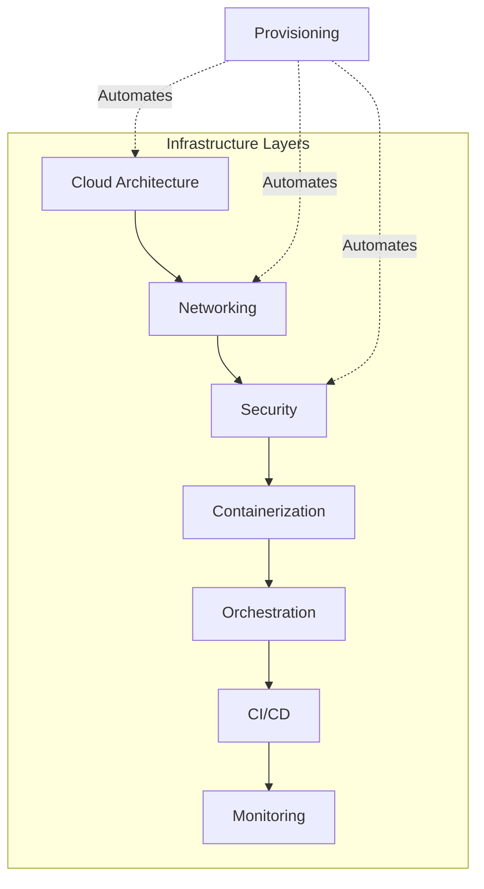

---

## Table of Contents

1. [Directory Structure](#directory-structure)
2. [Getting Started](#getting-started)
3. [Architecture](#architecture)
4. [Provisioning](#provisioning)
5. [Containerization](#containerization)
6. [CI/CD](#cicd)
7. [Networking](#networking)
8. [Security](#security)
9. [Monitoring & Logging](#monitoring--logging)
10. [Best Practices](#best-practices)
11. [Quick Reference](#quick-reference)

---

## Directory Structure

```
infrastructure/
├── architecture/               # Cloud and system architecture
│   ├── cloud-architecture.md      # Multi-cloud design patterns
│   ├── kubernetes-architecture.md # K8s architecture and patterns
│   └── diagrams/                  # Architecture diagrams
│
├── provisioning/              # Infrastructure as Code
│   ├── terraform/                 # Terraform configurations
│   ├── ansible/                   # Ansible playbooks
│   └── cloud-init/                # Cloud initialization scripts
│
├── containerization/          # Container orchestration
│   ├── docker-best-practices.md   # Docker optimization
│   ├── kubernetes-deployments.md  # K8s deployment patterns
│   ├── service-mesh-istio.md      # Service mesh architecture
│   └── helm-charts/               # Helm chart templates
│
├── ci-cd/                     # Continuous Integration/Delivery
│   ├── jenkins-pipelines.md       # Jenkins pipeline configs
│   ├── github-actions.md          # GitHub Actions workflows
│   ├── gitlab-ci.md               # GitLab CI/CD setup
│   └── deployment-strategies.md   # Blue-green, canary, etc.
│
├── networking/                # Network architecture
│   ├── vpc-design.md              # VPC and subnet design
│   ├── load-balancing.md          # Load balancer strategies
│   ├── dns-setup.md               # DNS configuration
│   └── firewall-rules.md          # Firewall and security groups
│
├── security/                  # Security infrastructure
│   ├── iam-roles-policies.md      # Identity and access management
│   ├── secrets-management.md      # Secrets and credentials
│   ├── network-security.md        # Network security layers
│   └── compliance.md              # Compliance frameworks
│
├── monitoring-logging/        # Observability
│   ├── prometheus-grafana.md      # Metrics monitoring
│   ├── loki-log-aggregation.md    # Log aggregation
│   ├── alerting-strategy.md       # Alert configuration
│   └── slos-slas.md               # Service level objectives
│
└── README.md                  # This file
```

---

## Getting Started

### Prerequisites

Before working with infrastructure code, ensure you have:

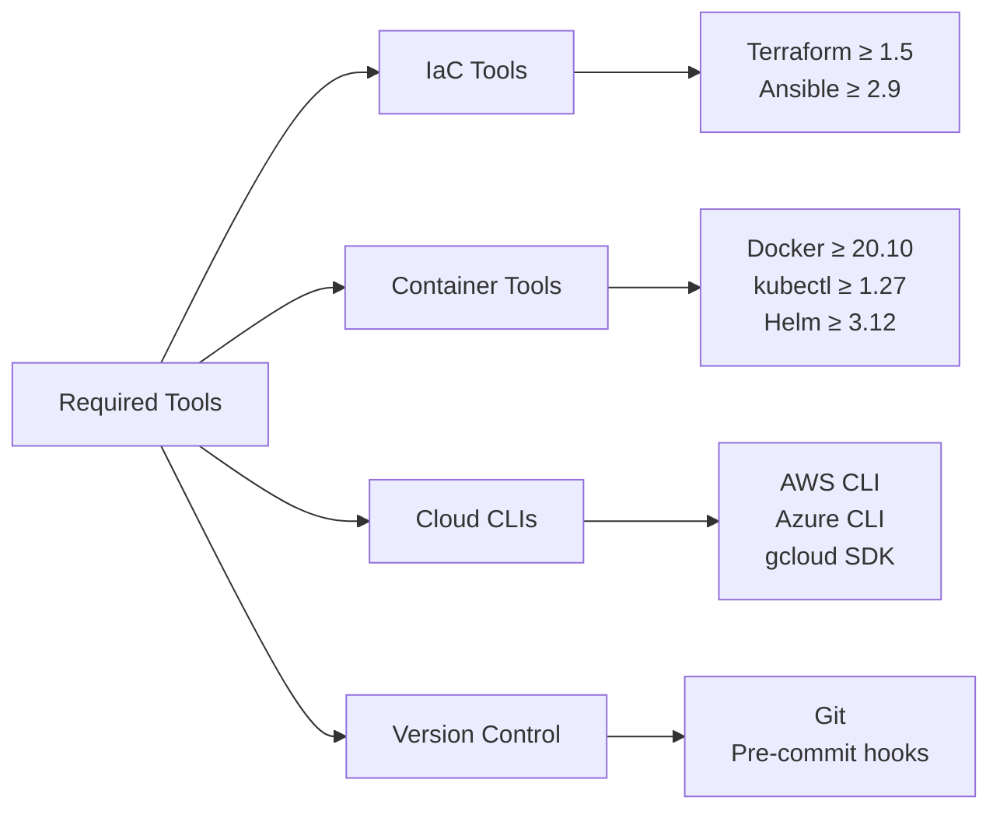

**Installation Quick Start:**
```bash
# Install Terraform
curl -fsSL https://apt.releases.hashicorp.com/gpg | sudo apt-key add -
sudo apt-add-repository "deb [arch=amd64] https://apt.releases.hashicorp.com $(lsb_release -cs) main"
sudo apt-get update && sudo apt-get install terraform

# Install kubectl
curl -LO "https://dl.k8s.io/release/$(curl -L -s https://dl.k8s.io/release/stable.txt)/bin/linux/amd64/kubectl"
sudo install -o root -g root -m 0755 kubectl /usr/local/bin/kubectl

# Install Helm
curl https://raw.githubusercontent.com/helm/helm/main/scripts/get-helm-3 | bash

# Install Docker
curl -fsSL https://get.docker.com -o get-docker.sh
sudo sh get-docker.sh
```

### Quick Start Guide

1. **Choose Your Cloud Provider** → See [architecture/cloud-architecture.md](architecture/cloud-architecture.md)
2. **Set Up IaC** → Start with [provisioning/terraform/](provisioning/terraform/)
3. **Configure Networking** → Review [networking/vpc-design.md](networking/vpc-design.md)
4. **Implement Security** → Follow [security/iam-roles-policies.md](security/iam-roles-policies.md)
5. **Deploy Containers** → Use [containerization/kubernetes-deployments.md](containerization/kubernetes-deployments.md)
6. **Set Up CI/CD** → Configure [ci-cd/github-actions.md](ci-cd/github-actions.md)
7. **Enable Monitoring** → Deploy [monitoring-logging/prometheus-grafana.md](monitoring-logging/prometheus-grafana.md)

---

## Architecture

### Cloud Architecture Patterns

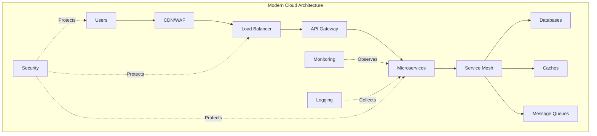

**Key Documents:**
- **[cloud-architecture.md](architecture/cloud-architecture.md)** - Multi-cloud design patterns, high availability, disaster recovery
- **[kubernetes-architecture.md](architecture/kubernetes-architecture.md)** - K8s cluster design, namespace strategy, workload patterns

**Architectural Principles:**
1. **Immutable Infrastructure** - Treat servers as disposable, not pets
2. **Infrastructure as Code** - Everything versioned and reproducible
3. **Defense in Depth** - Multiple security layers
4. **Fail Fast, Recover Faster** - Design for failure scenarios
5. **Observable by Default** - Built-in monitoring and logging

---

## Provisioning

### Infrastructure as Code Philosophy

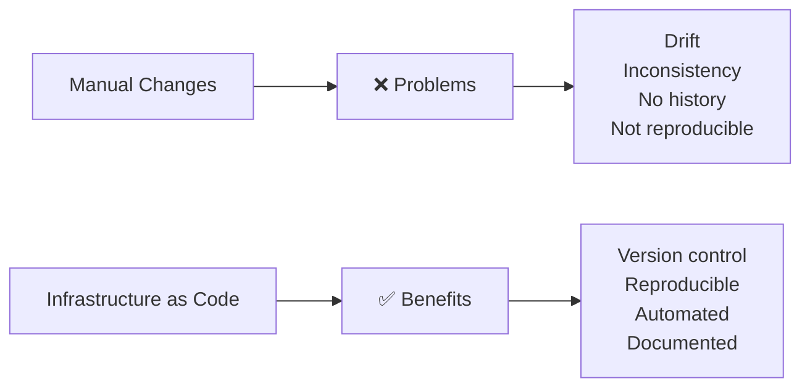

### Terraform

**Purpose:** Declarative infrastructure provisioning across multiple cloud providers.

**Key Concepts:**
- **Resources:** Cloud components (VMs, networks, databases)
- **Modules:** Reusable infrastructure patterns
- **State:** Current infrastructure snapshot
- **Providers:** Cloud platform integrations

**Directory:** [provisioning/terraform/](provisioning/terraform/)

**Example Workflow:**
```bash
# Initialize Terraform
terraform init

# Plan changes (dry run)
terraform plan

# Apply changes
terraform apply

# Destroy infrastructure
terraform destroy
```

**Best Practices:**
- Use remote state (S3, GCS, Terraform Cloud)
- Implement state locking
- Organize with modules
- Use workspaces for environments
- Tag all resources

### Ansible

**Purpose:** Configuration management and application deployment.

**Key Concepts:**
- **Playbooks:** Automation workflows
- **Roles:** Reusable configuration sets
- **Inventory:** Target server lists
- **Handlers:** Event-driven tasks

**Directory:** [provisioning/ansible/](provisioning/ansible/)

**Example Playbook:**
```yaml
- name: Configure web servers
  hosts: webservers
  roles:
    - common
    - nginx
    - monitoring-agent
```

### Cloud-Init

**Purpose:** Instance initialization and bootstrapping.

**Directory:** [provisioning/cloud-init/](provisioning/cloud-init/)

**Use Cases:**
- Initial package installation
- User and SSH key setup
- System configuration
- Service startup

**IaC Tool Comparison:**

| Tool | Best For | Strength | Use Case |
|------|----------|----------|----------|
| **Terraform** | Infrastructure provisioning | Multi-cloud, state management | Creating VPCs, VMs, databases |
| **Ansible** | Configuration management | Agentless, simple | Installing software, configuring services |
| **Cloud-Init** | Instance bootstrapping | Cloud-native, fast | Initial VM setup |

---

## Containerization

### Container Strategy

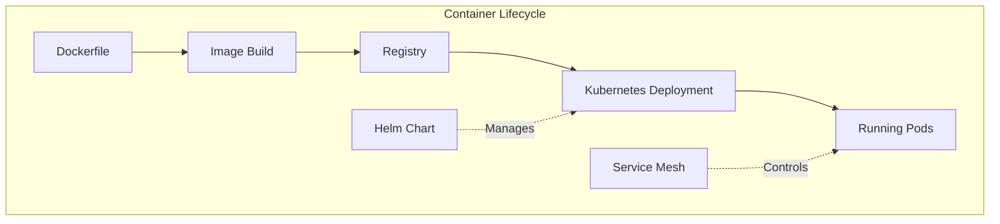

### Docker Best Practices

**Document:** [containerization/docker-best-practices.md](containerization/docker-best-practices.md)

**Key Topics:**
- Multi-stage builds for smaller images
- Layer caching optimization
- Security scanning
- Non-root user execution
- Health checks

**Dockerfile Example (Optimized):**
```dockerfile
# Multi-stage build
FROM golang:1.21-alpine AS builder
WORKDIR /app
COPY go.* ./
RUN go mod download
COPY . .
RUN CGO_ENABLED=0 go build -o main

# Minimal runtime image
FROM alpine:3.18
RUN apk --no-cache add ca-certificates
COPY --from=builder /app/main /main
USER nonroot:nonroot
EXPOSE 8080
HEALTHCHECK CMD wget --no-verbose --tries=1 --spider http://localhost:8080/health || exit 1
CMD ["/main"]
```

### Kubernetes Deployments

**Document:** [containerization/kubernetes-deployments.md](containerization/kubernetes-deployments.md)

**Deployment Patterns:**
- **Rolling Update** - Zero-downtime deployments
- **Blue-Green** - Instant rollback capability
- **Canary** - Gradual traffic shifting
- **A/B Testing** - Multiple versions simultaneously

**Resource Management:**
```yaml
resources:
  requests:
    memory: "128Mi"
    cpu: "100m"
  limits:
    memory: "256Mi"
    cpu: "200m"
```

### Service Mesh (Istio)

**Document:** [containerization/service-mesh-istio.md](containerization/service-mesh-istio.md)

**Capabilities:**
- Traffic management (routing, load balancing)
- Security (mTLS, authorization)
- Observability (metrics, traces, logs)
- Resilience (retries, circuit breakers)

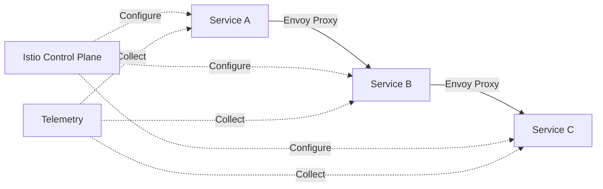

### Helm Charts

**Directory:** [containerization/helm-charts/](containerization/helm-charts/)

**Purpose:** Package manager for Kubernetes applications.

**Benefits:**
- Templated manifests
- Version management
- Dependency handling
- Rollback support

---

## CI/CD

### Pipeline Philosophy

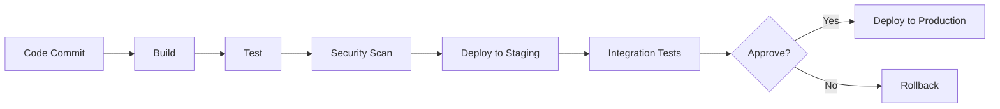

### CI/CD Tools

| Tool | Document | Best For |
|------|----------|----------|
| **Jenkins** | [jenkins-pipelines.md](ci-cd/jenkins-pipelines.md) | Enterprise, complex pipelines |
| **GitHub Actions** | [github-actions.md](ci-cd/github-actions.md) | GitHub repos, simple workflows |
| **GitLab CI** | [gitlab-ci.md](ci-cd/gitlab-ci.md) | GitLab repos, integrated DevOps |

### Deployment Strategies

**Document:** [ci-cd/deployment-strategies.md](ci-cd/deployment-strategies.md)

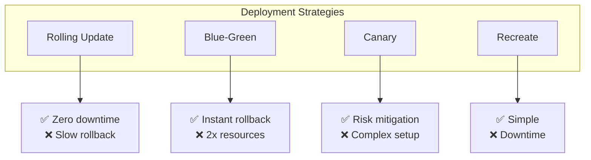

**Strategy Selection:**
- **Stateless services:** Rolling update or canary
- **Stateful services:** Blue-green
- **Development environments:** Recreate
- **High-risk changes:** Canary

---

## Networking

### Network Architecture Layers

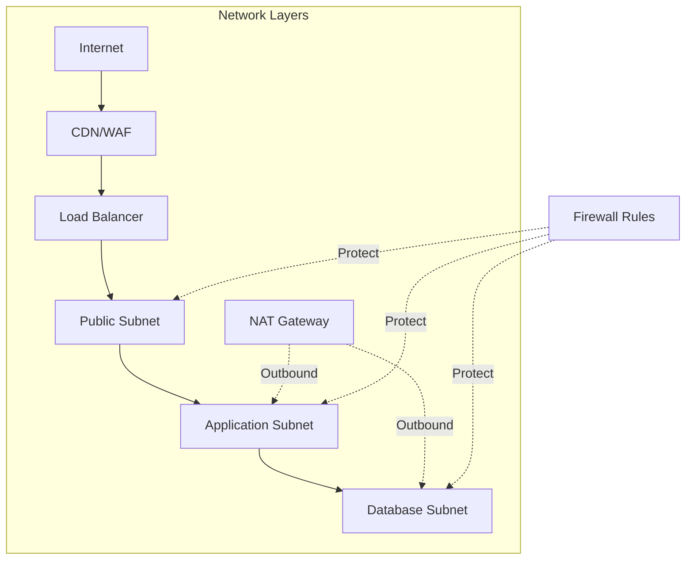

### Key Documents

- **[vpc-design.md](networking/vpc-design.md)** - VPC architecture, subnetting, CIDR planning
- **[load-balancing.md](networking/load-balancing.md)** - Layer 4/7 load balancing, health checks
- **[dns-setup.md](networking/dns-setup.md)** - DNS configuration, Route53, zone management
- **[firewall-rules.md](networking/firewall-rules.md)** - Security groups, NACLs, firewall policies

### Network Security Zones

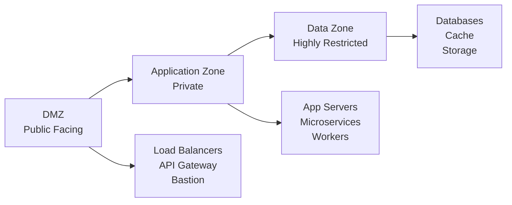

---

## Security

### Defense in Depth Strategy

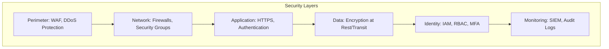

### Security Documents

- **[iam-roles-policies.md](security/iam-roles-policies.md)** - Identity and access management, least privilege
- **[secrets-management.md](security/secrets-management.md)** - Vault, KMS, secret rotation
- **[network-security.md](security/network-security.md)** - Zero trust, network segmentation
- **[compliance.md](security/compliance.md)** - SOC 2, GDPR, HIPAA, PCI-DSS

### Security Best Practices

**Principle of Least Privilege:**
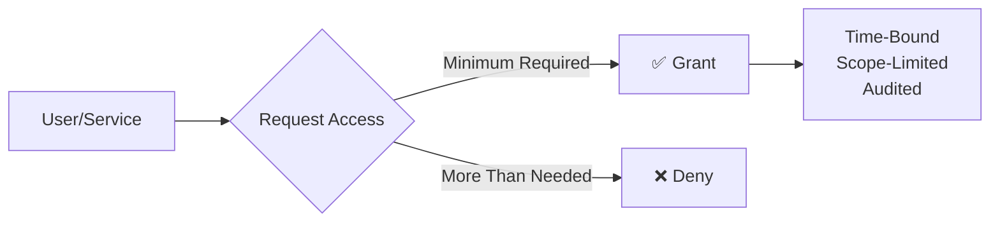

**Key Principles:**
1. **Encrypt Everything** - At rest and in transit
2. **Rotate Regularly** - Credentials, certificates, keys
3. **Audit Continuously** - All access and changes
4. **Fail Securely** - Default deny, fail closed
5. **Defense in Depth** - Multiple security layers

---

## Monitoring & Logging

### Observability Stack

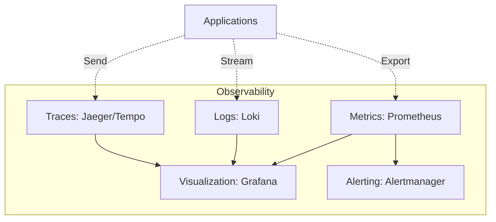

### Monitoring Documents

- **[prometheus-grafana.md](monitoring-logging/prometheus-grafana.md)** - Metrics collection and visualization
- **[loki-log-aggregation.md](monitoring-logging/loki-log-aggregation.md)** - Centralized logging
- **[alerting-strategy.md](monitoring-logging/alerting-strategy.md)** - Alert design and management
- **[slos-slas.md](monitoring-logging/slos-slas.md)** - Service level objectives

### The Four Golden Signals

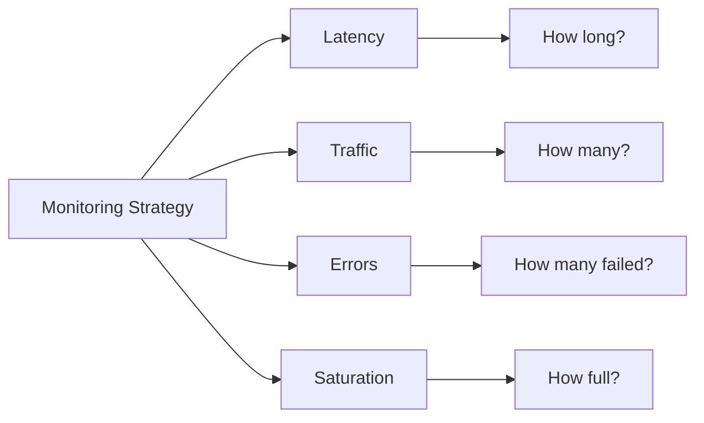

**What to Monitor:**
1. **Latency:** Request duration, response time
2. **Traffic:** Requests per second, throughput
3. **Errors:** Error rate, failed requests
4. **Saturation:** CPU, memory, disk, network utilization

**Reference:** See `../observability/12-best-practices.md` for detailed observability theory.

---

## Best Practices

### Infrastructure Principles

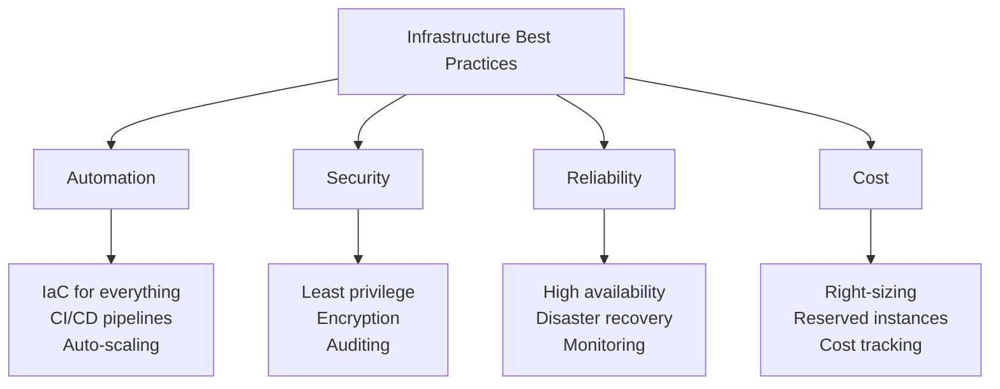

### 1. Infrastructure as Code

**Always:**
- ✅ Version control all infrastructure code
- ✅ Use modules for reusability
- ✅ Implement peer review for changes
- ✅ Test infrastructure changes in non-prod first
- ✅ Document infrastructure decisions

**Never:**
- ❌ Manual changes in production
- ❌ Hard-coded credentials
- ❌ Untagged resources
- ❌ Shared state files without locking

### 2. Security First

**Implement:**
- Principle of least privilege
- Network segmentation
- Encryption everywhere
- Regular security audits
- Automated compliance checks

**Zero Trust Model:**
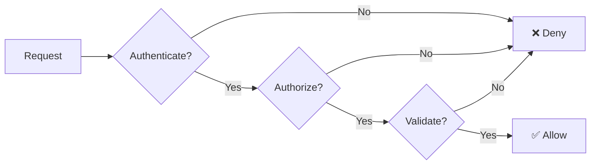

### 3. High Availability

**Design for Failure:**
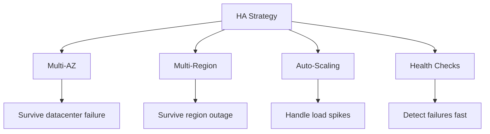

**Availability Tiers:**
| Tier | Uptime | Downtime/Year | Use Case |
|------|--------|---------------|----------|
| 99% | Two nines | 3.65 days | Development |
| 99.9% | Three nines | 8.76 hours | Standard production |
| 99.99% | Four nines | 52 minutes | Critical services |
| 99.999% | Five nines | 5 minutes | Mission critical |

### 4. Cost Optimization

**Strategies:**
- Right-size resources (don't over-provision)
- Use spot/preemptible instances for non-critical workloads
- Implement auto-scaling
- Schedule non-production environments (shut down nights/weekends)
- Use reserved instances for predictable workloads
- Monitor and alert on cost anomalies

### 5. Disaster Recovery

**RTO and RPO:**
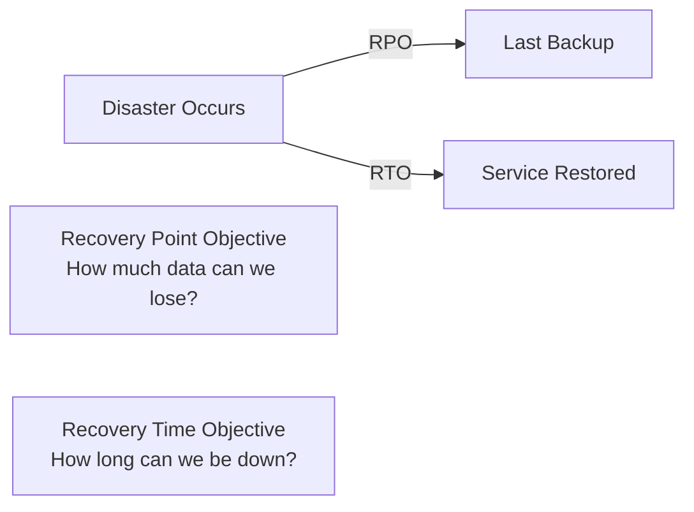

**DR Strategies:**
- **Backup & Restore:** Low cost, high RTO (hours)
- **Pilot Light:** Minimal footprint, medium RTO (30-60 min)
- **Warm Standby:** Scaled-down production, low RTO (10-30 min)
- **Multi-Site Active:** Full redundancy, lowest RTO (minutes)

---

## Quick Reference

### Common Commands

**Terraform:**
```bash
terraform init                    # Initialize
terraform plan                    # Preview changes
terraform apply                   # Apply changes
terraform destroy                 # Destroy infrastructure
terraform state list              # List resources
terraform output                  # Show outputs
```

**Kubernetes:**
```bash
kubectl get pods -n <namespace>   # List pods
kubectl describe pod <name>       # Pod details
kubectl logs <pod> -f             # Stream logs
kubectl apply -f manifest.yaml    # Apply configuration
kubectl rollout status deployment/<name>  # Check rollout
kubectl rollout undo deployment/<name>    # Rollback
```

**Docker:**
```bash
docker build -t <image>:<tag> .   # Build image
docker run -p 8080:8080 <image>   # Run container
docker ps                         # List containers
docker logs <container>           # View logs
docker exec -it <container> sh    # Shell into container
```

**Helm:**
```bash
helm install <name> <chart>       # Install chart
helm upgrade <name> <chart>       # Upgrade release
helm rollback <name> <revision>   # Rollback
helm list                         # List releases
```

### Troubleshooting Decision Tree

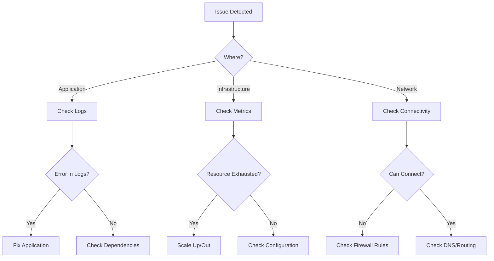

### Environment Checklist

**Before Production Deployment:**
- [ ] Infrastructure provisioned via IaC
- [ ] Security groups properly configured
- [ ] Secrets stored in secret manager
- [ ] Monitoring and alerting enabled
- [ ] Logging centralized
- [ ] Backups configured and tested
- [ ] Auto-scaling configured
- [ ] Health checks implemented
- [ ] SSL/TLS certificates installed
- [ ] DR plan documented and tested
- [ ] Runbooks created
- [ ] Cost alerts configured

---

## Integration with Other Docs

This infrastructure documentation integrates with:

- **[../observability/](../observability/)** - Monitoring, logging, tracing best practices
- **[../scalability/](../scalability/)** - Load balancing, caching, horizontal scaling
- **[../security/](../security/)** - Application security, authentication, encryption
- **[../microservices/](../microservices/)** - Service mesh, API gateway, service discovery
- **[../databases/](../databases/)** - Database deployment, replication, backups

---

## Contributing

### Adding New Documentation

When adding infrastructure documentation:

1. **Choose the right directory** based on the topic
2. **Use consistent formatting** (see existing docs)
3. **Include diagrams** using Mermaid
4. **Add cross-references** to related docs
5. **Provide examples** (code snippets, configurations)
6. **Update this README** with links to new content

### Documentation Standards

- Use Markdown for all documentation
- Include Mermaid diagrams for visual concepts
- Provide real-world examples
- Link to official documentation
- Keep content up to date

---

## Additional Resources

### Official Documentation
- **Terraform:** https://www.terraform.io/docs
- **Kubernetes:** https://kubernetes.io/docs
- **Docker:** https://docs.docker.com
- **AWS:** https://docs.aws.amazon.com
- **Azure:** https://docs.microsoft.com/azure
- **GCP:** https://cloud.google.com/docs

### Learning Paths
- **Infrastructure:** Architecture → Provisioning → Security
- **Containers:** Docker → Kubernetes → Service Mesh
- **Automation:** CI/CD → IaC → GitOps
- **Observability:** Metrics → Logs → Traces

### Best Practice Guides
- 12-Factor App: https://12factor.net
- Cloud Native: https://www.cncf.io
- SRE Book: https://sre.google/books/

---

## Maintainers


---

**Last Updated:** October 2025  
**Version:** 1.0