# Docker Best Practices

## Overview

Docker has revolutionized software deployment by enabling consistent, portable, and isolated application environments. However, building production-ready Docker images requires deep understanding of containerization principles, security implications, and optimization techniques. This guide provides comprehensive best practices for building, securing, and operating Docker containers at scale.

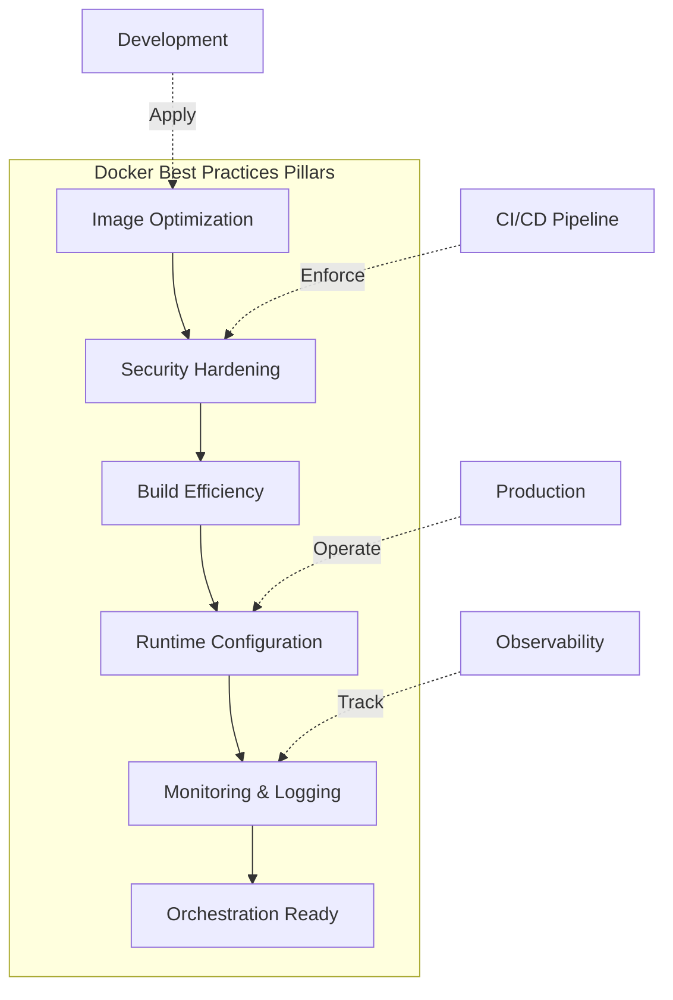
```mermaid
graph TB
    subgraph "Docker Best Practices Pillars"
        A[Image Optimization] --> B[Security Hardening]
        B --> C[Build Efficiency]
        C --> D[Runtime Configuration]
        D --> E[Monitoring & Logging]
        E --> F[Orchestration Ready]
    end
    
    G[Development] -.->|Apply| A
    H[CI/CD Pipeline] -.->|Enforce| B
    I[Production] -.->|Operate| D
    J[Observability] -.->|Track| E
```

---

## Table of Contents

1. [Image Architecture & Layering](#image-architecture--layering)
2. [Multi-Stage Builds](#multi-stage-builds)
3. [Base Image Selection](#base-image-selection)
4. [Layer Optimization](#layer-optimization)
5. [Security Best Practices](#security-best-practices)
6. [Build Optimization](#build-optimization)
7. [Runtime Configuration](#runtime-configuration)
8. [Health Checks & Signals](#health-checks--signals)
9. [Logging & Monitoring](#logging--monitoring)
10. [Networking & Storage](#networking--storage)
11. [Production Readiness](#production-readiness)
12. [Anti-Patterns to Avoid](#anti-patterns-to-avoid)

---

## Image Architecture & Layering

### Understanding Docker Image Layers

Docker images are built as a series of read-only layers, with each instruction in a Dockerfile creating a new layer. Understanding this architecture is fundamental to optimization.

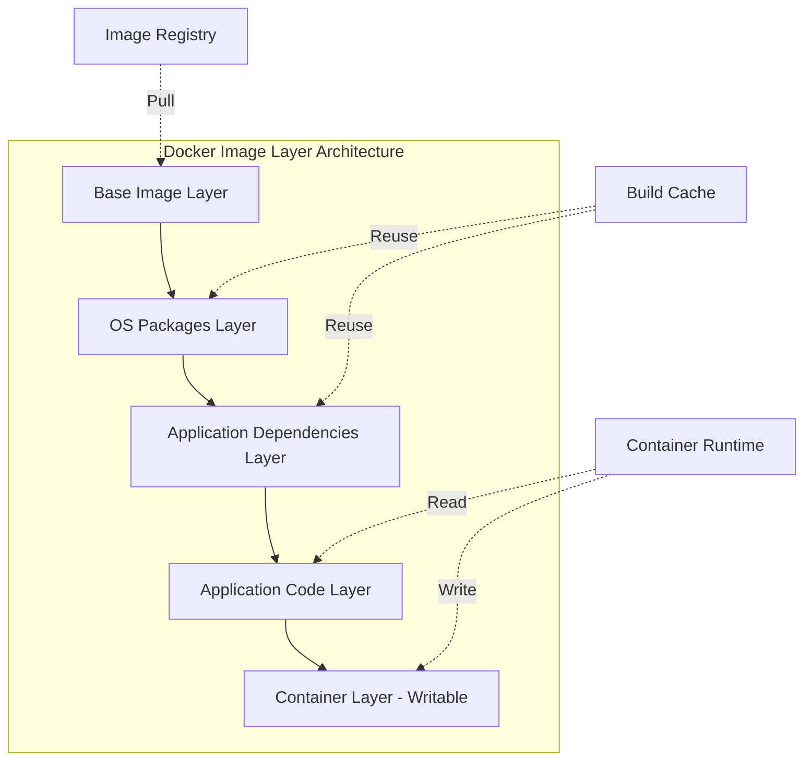
```mermaid
graph TB
    subgraph "Docker Image Layer Architecture"
        A[Base Image Layer] --> B[OS Packages Layer]
        B --> C[Application Dependencies Layer]
        C --> D[Application Code Layer]
        D --> E[Container Layer - Writable]
    end
    
    F[Image Registry] -.->|Pull| A
    G[Build Cache] -.->|Reuse| B
    G -.->|Reuse| C
    H[Container Runtime] -.->|Read| D
    H -.->|Write| E
```

**Key Concepts:**

1. **Layer Immutability**: Once created, layers never change
2. **Layer Sharing**: Multiple images can share identical layers
3. **Copy-on-Write**: Modifications create new layers, original stays unchanged
4. **Layer Caching**: Docker reuses unchanged layers during rebuilds

**Layer Size Impact:**

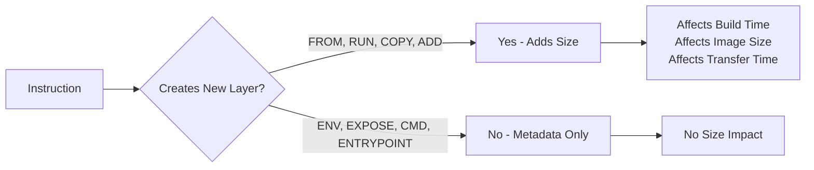
```mermaid
graph LR
    A[Instruction] --> B{Creates New Layer?}
    B -->|FROM, RUN, COPY, ADD| C[Yes - Adds Size]
    B -->|ENV, EXPOSE, CMD, ENTRYPOINT| D[No - Metadata Only]
    
    C --> E[Affects Build Time<br/>Affects Image Size<br/>Affects Transfer Time]
    D --> F[No Size Impact]
```

**Theoretical Foundation:**

The Union File System (UnionFS) allows Docker to stack multiple layers and present them as a single filesystem. When a container runs:

- **Lower layers** (image layers): Read-only
- **Upper layer** (container layer): Read-write
- **Merged view**: Application sees unified filesystem

This architecture enables:
- **Space efficiency**: Shared layers across images
- **Fast startup**: Only container layer needs initialization
- **Isolation**: Each container has independent writable layer

---

## Multi-Stage Builds

### The Problem: Bloated Images

Traditional Docker builds often include build tools, compilers, and development dependencies that aren't needed at runtime. Multi-stage builds solve this by separating build and runtime environments.

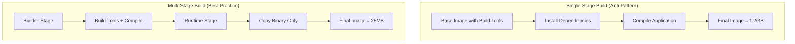
```mermaid
graph TB
    subgraph "Single-Stage Build (Anti-Pattern)"
        A1[Base Image with Build Tools] --> B1[Install Dependencies]
        B1 --> C1[Compile Application]
        C1 --> D1[Final Image = 1.2GB]
    end
    
    subgraph "Multi-Stage Build (Best Practice)"
        A2[Builder Stage] --> B2[Build Tools + Compile]
        B2 --> C2[Runtime Stage]
        C2 --> D2[Copy Binary Only]
        D2 --> E2[Final Image = 25MB]
    end
```

### Multi-Stage Architecture

**Stage Separation Strategy:**

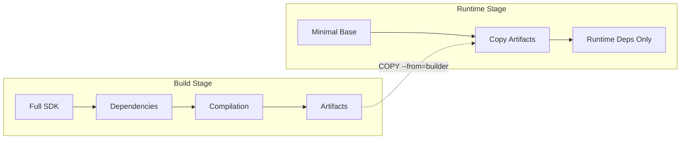
```mermaid
graph LR
    subgraph "Build Stage"
        A[Full SDK] --> B[Dependencies]
        B --> C[Compilation]
        C --> D[Artifacts]
    end
    
    subgraph "Runtime Stage"
        E[Minimal Base] --> F[Copy Artifacts]
        F --> G[Runtime Deps Only]
    end
    
    D -.->|COPY --from=builder| F
```

**Example Conceptual Flow:**

```dockerfile
# Stage 1: Build Environment (Heavy)
FROM node:18-alpine AS builder
# - Includes npm, build tools, dev dependencies
# - Size: ~180MB
# - Purpose: Compile, transpile, bundle

# Stage 2: Runtime Environment (Light)  
FROM node:18-alpine AS runtime
# - Only production dependencies
# - Only compiled artifacts
# - Size: ~50MB
# - Purpose: Execute application
```

**Benefits of Multi-Stage Builds:**

1. **Image Size Reduction**: 70-95% smaller final images
2. **Security**: No build tools in production images
3. **Build Caching**: Each stage cached independently
4. **Separation of Concerns**: Build vs runtime environments
5. **Parallel Builds**: Stages can build concurrently

**Stage Naming Strategy:**

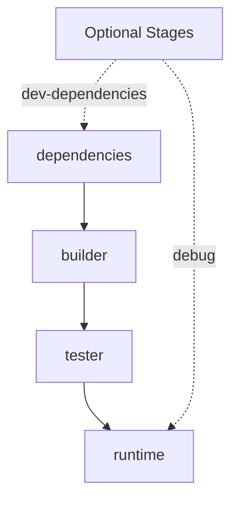
```mermaid
graph TB
    A[dependencies] --> B[builder]
    B --> C[tester]
    C --> D[runtime]
    
    E[Optional Stages] -.->|dev-dependencies| A
    E -.->|debug| D
    
 
```

**Cross-Stage Artifact Copying:**

The `COPY --from=<stage>` instruction is fundamental to multi-stage builds:

- **Selective copying**: Only needed files transferred
- **No layer pollution**: Build artifacts don't bloat final image
- **Cache efficiency**: Changes in builder don't invalidate runtime cache

**Advanced Multi-Stage Patterns:**

1. **Testing Stage**: Run tests in separate stage, fail build if tests fail
2. **Debug Stage**: Create debug variant with additional tools
3. **Platform-Specific Stages**: Different stages for different architectures
4. **Dependency Caching**: Separate stage for dependency installation

**Reference:** See `../architecture/cloud-architecture.md` for containerized deployment patterns.

---

## Base Image Selection

### Choosing the Right Foundation

Base image selection dramatically impacts image size, security surface, and compatibility. This decision requires balancing functionality, security, and size.

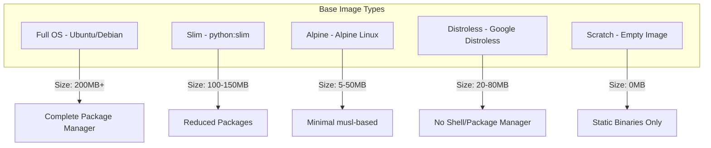
```mermaid
graph TB
    subgraph "Base Image Types"
        A[Full OS - Ubuntu/Debian]
        B[Slim - python:slim]
        C[Alpine - Alpine Linux]
        D[Distroless - Google Distroless]
        E[Scratch - Empty Image]
    end
    
    A -->|Size: 200MB+| F[Complete Package Manager]
    B -->|Size: 100-150MB| G[Reduced Packages]
    C -->|Size: 5-50MB| H[Minimal musl-based]
    D -->|Size: 20-80MB| I[No Shell/Package Manager]
    E -->|Size: 0MB| J[Static Binaries Only]
    
  
```

### Base Image Comparison Matrix

**Detailed Analysis:**

| Base Image | Size | Security Surface | Use Case | Pros | Cons |
|------------|------|------------------|----------|------|------|
| **Ubuntu/Debian** | 200-500MB | Large | Legacy apps, debugging | Full tooling, familiar | Bloated, slow updates |
| **Slim Variants** | 100-150MB | Medium | General purpose | Balance of size/function | Still includes unnecessary packages |
| **Alpine** | 5-50MB | Small | Size-critical apps | Tiny, fast pulls | musl libc compatibility issues |
| **Distroless** | 20-80MB | Very Small | Production apps | No shell/package manager | Debugging difficult |
| **Scratch** | 0MB | Minimal | Static binaries only | Ultimate security | No OS utilities |

### Alpine Linux Deep Dive

**Why Alpine is Popular:**

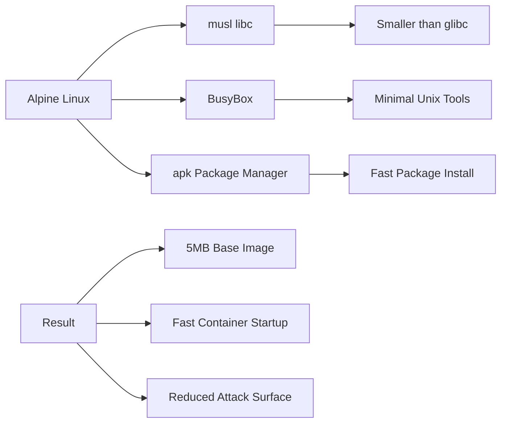
```mermaid
graph LR
    A[Alpine Linux] --> B[musl libc]
    A --> C[BusyBox]
    A --> D[apk Package Manager]
    
    B --> E[Smaller than glibc]
    C --> F[Minimal Unix Tools]
    D --> G[Fast Package Install]
    
    H[Result] --> I[5MB Base Image]
    H --> J[Fast Container Startup]
    H --> K[Reduced Attack Surface]
```

**Alpine Considerations:**

1. **musl libc vs glibc**: 
   - musl is smaller but less compatible
   - Some pre-compiled binaries expect glibc
   - May need recompilation from source

2. **apk vs apt/yum**:
   - Different package names
   - Smaller package repository
   - Faster package installation

3. **Binary Compatibility**:
   - Native Go binaries work perfectly
   - Python wheels may need compilation
   - Node native modules may fail

**When to Use Alpine:**

✅ **Good For:**
- Go applications (static compilation)
- Node.js applications (pure JavaScript)
- Python applications (if packages compile on Alpine)
- Microservices with minimal dependencies

❌ **Avoid For:**
- Complex native dependencies
- Applications requiring glibc
- When debugging tools are essential

### Distroless Images

**Philosophy:** Only include application and runtime dependencies, nothing else.

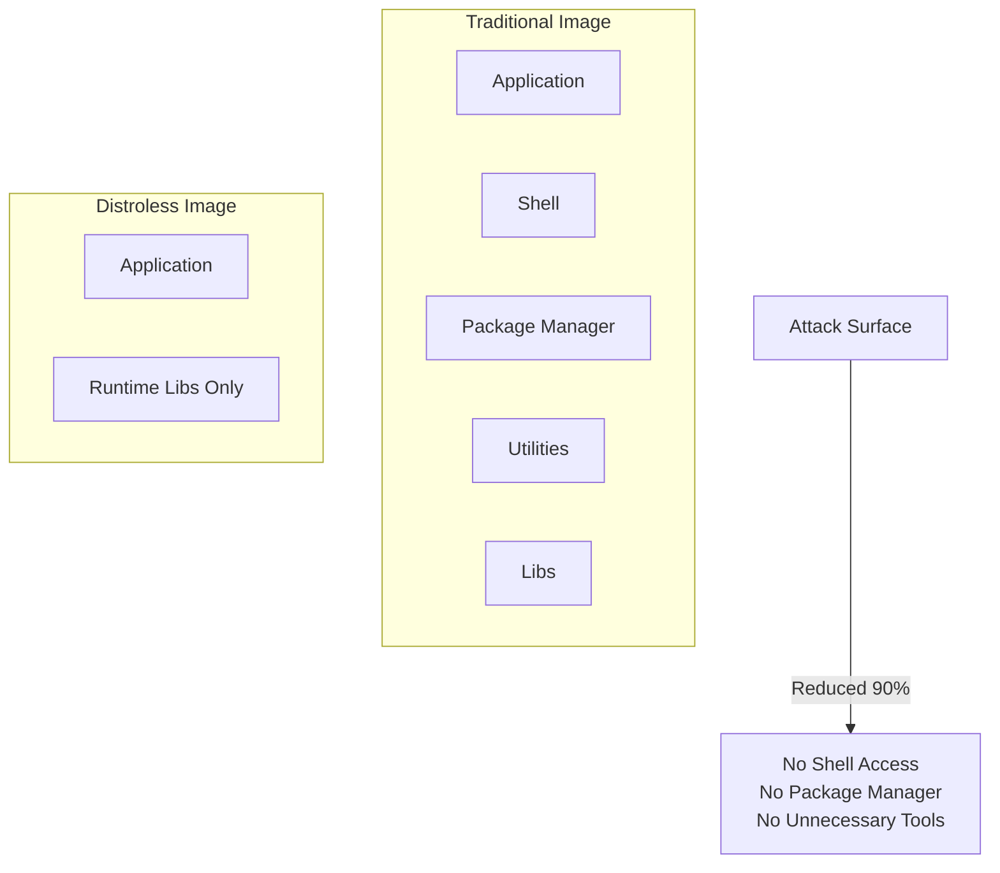
```mermaid
graph TB
    subgraph "Traditional Image"
        A[Application]
        B[Shell]
        C[Package Manager]
        D[Utilities]
        E[Libs]
    end
    
    subgraph "Distroless Image"
        F[Application]
        G[Runtime Libs Only]
    end
    
    H[Attack Surface] -->|Reduced 90%| I[No Shell Access<br/>No Package Manager<br/>No Unnecessary Tools]
```

**Distroless Benefits:**

1. **Security**: No shell means no shell exploits
2. **Compliance**: Easier to audit (fewer components)
3. **Size**: Smaller than traditional images
4. **Performance**: Faster startup (less to load)

**Distroless Debugging:**

Since distroless images have no shell, debugging requires:
- **Ephemeral Containers**: `kubectl debug` with debug tools
- **Debug Variants**: Google provides `:debug` tags with busybox
- **External Debugging**: Attach debugger from outside container

**Example Distroless Variants:**

- `gcr.io/distroless/static-debian11` - Static binaries (Go)
- `gcr.io/distroless/base-debian11` - glibc applications
- `gcr.io/distroless/python3-debian11` - Python applications
- `gcr.io/distroless/java17-debian11` - Java applications

### Scratch Images

**Use Case:** Statically compiled binaries with zero dependencies.

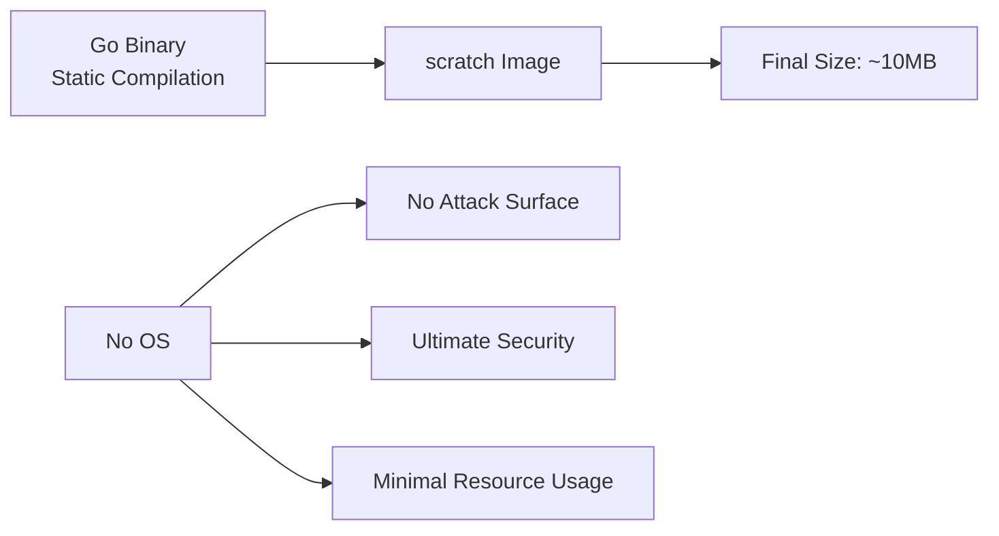
```mermaid
graph LR
    A[Go Binary<br/>Static Compilation] --> B[scratch Image]
    B --> C[Final Size: ~10MB]
    
    D[No OS] --> E[No Attack Surface]
    D --> F[Ultimate Security]
    D --> G[Minimal Resource Usage]
```

**Perfect for:**
- Go applications with `CGO_ENABLED=0`
- Rust binaries with static linking
- C/C++ with static compilation

**Limitations:**
- No shell for debugging
- No standard utilities
- Must include all certificates/timezone data manually

**Reference:** See `../security/network-security.md` for container security hardening.

---

## Layer Optimization

### Cache Efficiency Strategy

Docker layer caching is one of the most powerful optimization techniques. Understanding cache invalidation is critical.

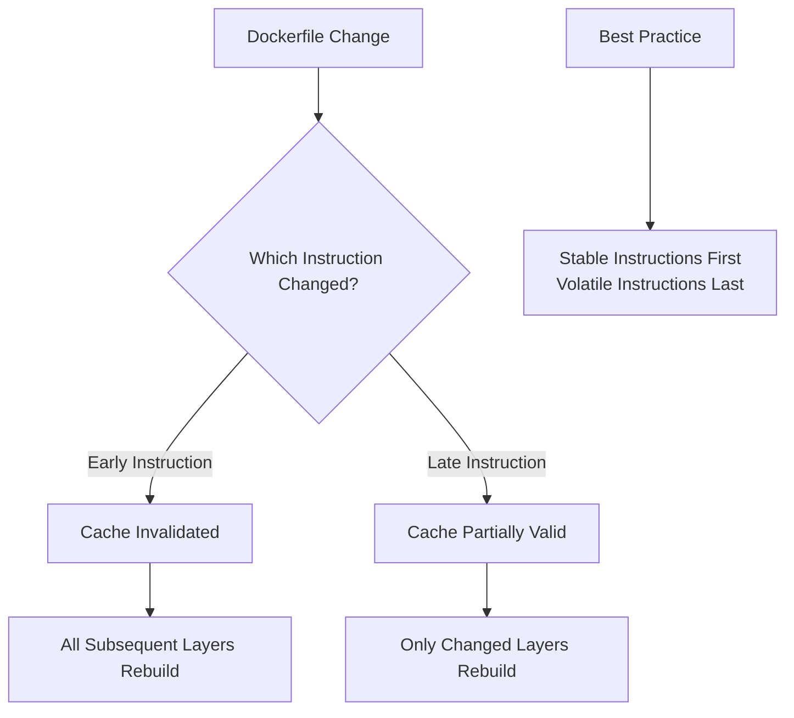
```mermaid
graph TB
    A[Dockerfile Change] --> B{Which Instruction Changed?}
    
    B -->|Early Instruction| C[Cache Invalidated]
    C --> D[All Subsequent Layers Rebuild]
    
    B -->|Late Instruction| E[Cache Partially Valid]
    E --> F[Only Changed Layers Rebuild]
    
    G[Best Practice] --> H[Stable Instructions First<br/>Volatile Instructions Last]
```

### Layer Ordering Strategy

**Optimal Dockerfile Structure:**

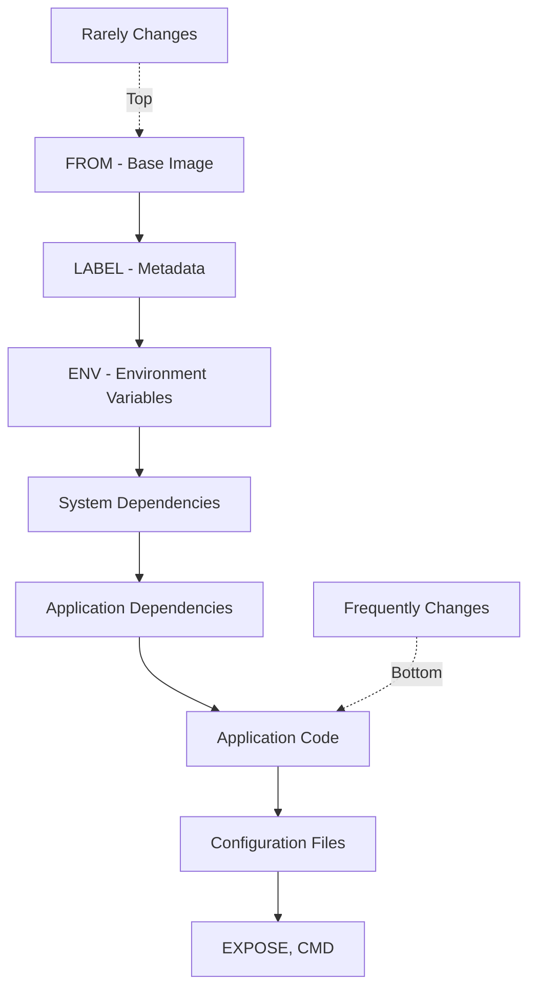
```mermaid
graph TB
    A[FROM - Base Image] --> B[LABEL - Metadata]
    B --> C[ENV - Environment Variables]
    C --> D[System Dependencies]
    D --> E[Application Dependencies]
    E --> F[Application Code]
    F --> G[Configuration Files]
    G --> H[EXPOSE, CMD]
    
    I[Rarely Changes] -.->|Top| A
    J[Frequently Changes] -.->|Bottom| F
    

```

**Rationale:**

1. **Base image** (FROM): Almost never changes
2. **System packages**: Change occasionally (security updates)
3. **Language runtime**: Change when upgrading versions
4. **Application dependencies**: Change moderately (package.json, requirements.txt)
5. **Application code**: Changes frequently (every commit)

**Dependency Layer Separation:**

```dockerfile
# ❌ BAD: Invalidates cache on any file change
COPY . /app
RUN npm install

# ✅ GOOD: Cache dependencies separately
COPY package*.json /app/
RUN npm ci --only=production
COPY . /app/
```

**Why This Works:**

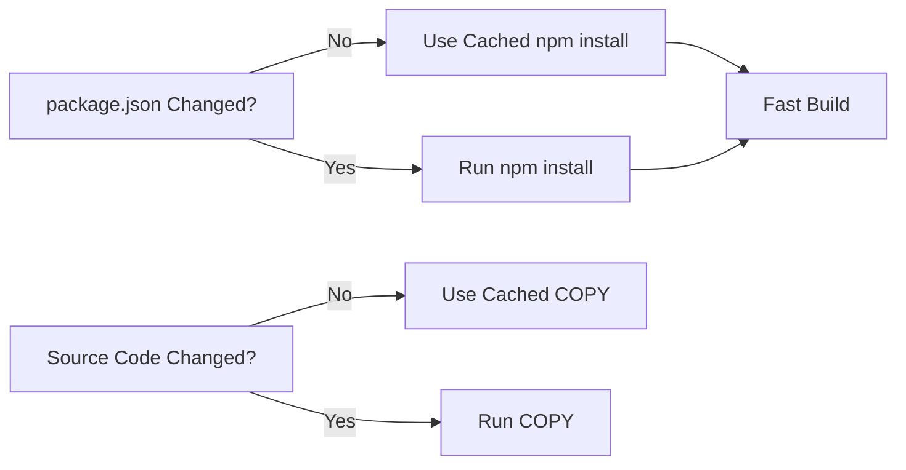
```mermaid
graph LR
    A[package.json Changed?] -->|No| B[Use Cached npm install]
    A -->|Yes| C[Run npm install]
    
    D[Source Code Changed?] -->|No| E[Use Cached COPY]
    D -->|Yes| F[Run COPY]
    
    B --> G[Fast Build]
    C --> G
```

### RUN Instruction Optimization

**Command Chaining:**

Each `RUN` instruction creates a new layer. Chain related commands to reduce layers:

```dockerfile
# ❌ BAD: Creates 3 layers
RUN apt-get update
RUN apt-get install -y curl
RUN rm -rf /var/lib/apt/lists/*

# ✅ GOOD: Creates 1 layer
RUN apt-get update \
    && apt-get install -y --no-install-recommends curl \
    && rm -rf /var/lib/apt/lists/*
```

**Why Chain Commands?**

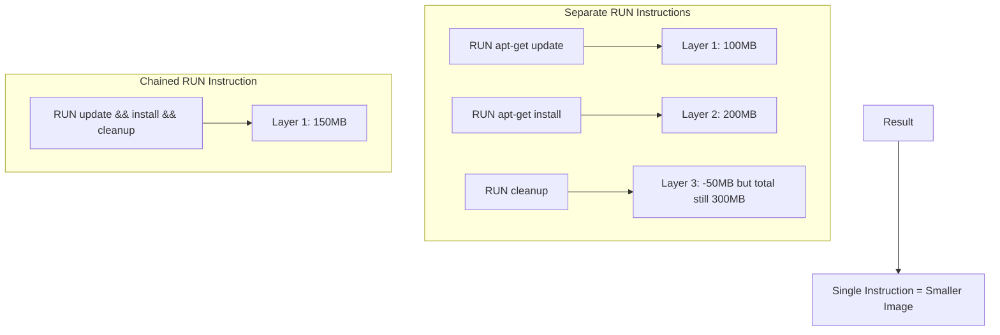
```mermaid
graph TB
    subgraph "Separate RUN Instructions"
        A1[RUN apt-get update] --> B1[Layer 1: 100MB]
        C1[RUN apt-get install] --> D1[Layer 2: 200MB]
        E1[RUN cleanup] --> F1[Layer 3: -50MB but total still 300MB]
    end
    
    subgraph "Chained RUN Instruction"
        A2[RUN update && install && cleanup] --> B2[Layer 1: 150MB]
    end
    
    G[Result] --> H[Single Instruction = Smaller Image]
```

**Layer Cleanup Must Happen in Same Layer:**

Critical concept: File deletion in a later layer doesn't reduce image size. The deleted files still exist in previous layers.

```dockerfile
# ❌ BAD: Downloads still in layer history
RUN wget https://large-file.tar.gz
RUN tar -xzf large-file.tar.gz
RUN rm large-file.tar.gz

# ✅ GOOD: Cleanup in same layer
RUN wget https://large-file.tar.gz \
    && tar -xzf large-file.tar.gz \
    && rm large-file.tar.gz
```

### COPY vs ADD

**Fundamental Difference:**

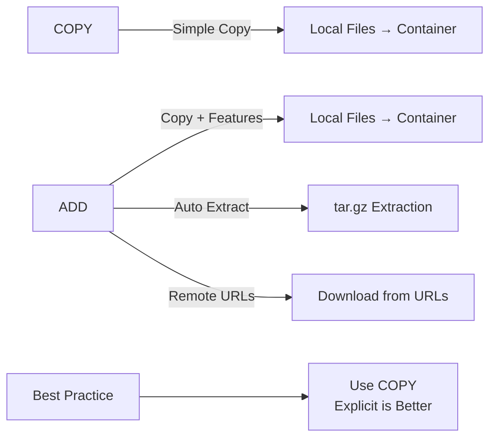
```mermaid
graph LR
    A[COPY] -->|Simple Copy| B[Local Files → Container]
    
    C[ADD] -->|Copy + Features| D[Local Files → Container]
    C -->|Auto Extract| E[tar.gz Extraction]
    C -->|Remote URLs| F[Download from URLs]
    
    G[Best Practice] --> H[Use COPY<br/>Explicit is Better]
```

**Why Prefer COPY:**

1. **Explicit behavior**: No hidden functionality
2. **Predictable caching**: Doesn't depend on URL content
3. **Better performance**: No extraction overhead
4. **Security**: No automatic URL downloads

**When to Use ADD:**

Only when you specifically need:
- Automatic tar extraction
- Remote URL downloads (though `RUN wget` is often clearer)

### .dockerignore File

Essential for preventing unnecessary files from bloating the build context.

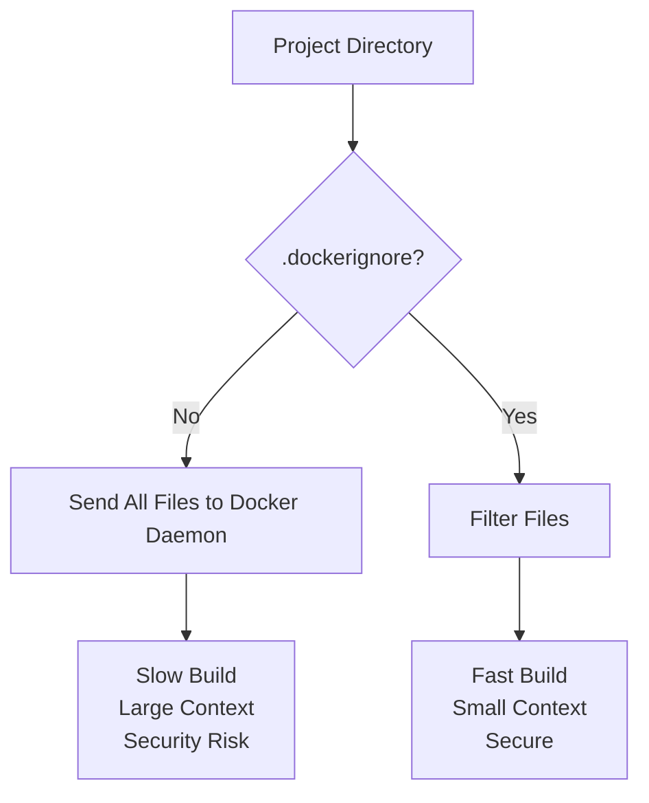
```mermaid
graph TB
    A[Project Directory] --> B{.dockerignore?}
    
    B -->|No| C[Send All Files to Docker Daemon]
    C --> D[Slow Build<br/>Large Context<br/>Security Risk]
    
    B -->|Yes| E[Filter Files]
    E --> F[Fast Build<br/>Small Context<br/>Secure]
```

**What to Exclude:**

```
# Version control
.git/
.gitignore

# Dependencies (install fresh in container)
node_modules/
venv/
__pycache__/

# Build artifacts
*.log
dist/
build/

# IDE files
.vscode/
.idea/

# Documentation
README.md
docs/

# CI/CD
.github/
.gitlab-ci.yml

# Sensitive files
.env
secrets/
```

**Reference:** See `../ci-cd/deployment-strategies.md` for build optimization in pipelines.

---

## Security Best Practices

### Security Layers in Container Design

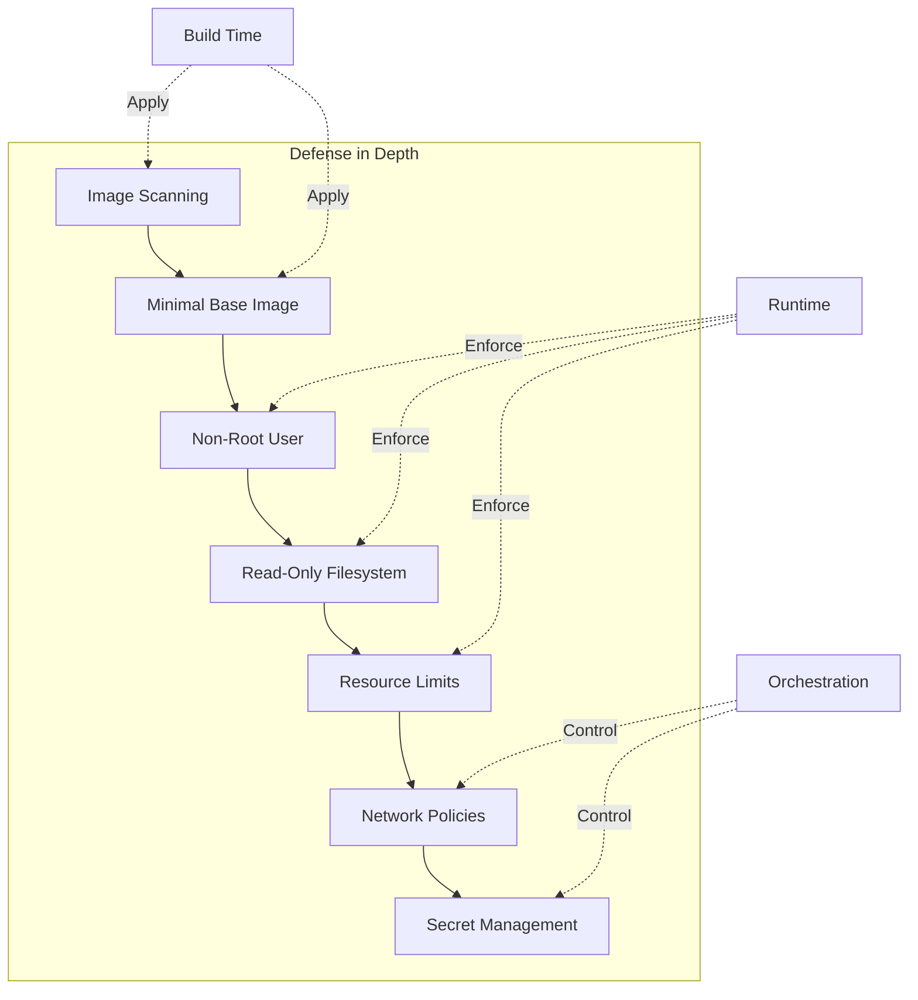
```mermaid
graph TB
    subgraph "Defense in Depth"
        A[Image Scanning] --> B[Minimal Base Image]
        B --> C[Non-Root User]
        C --> D[Read-Only Filesystem]
        D --> E[Resource Limits]
        E --> F[Network Policies]
        F --> G[Secret Management]
    end
    
    H[Build Time] -.->|Apply| A
    H -.->|Apply| B
    I[Runtime] -.->|Enforce| C
    I -.->|Enforce| D
    I -.->|Enforce| E
    J[Orchestration] -.->|Control| F
    J -.->|Control| G
```

### Non-Root User Execution

**The Problem:** Running as root violates the principle of least privilege.

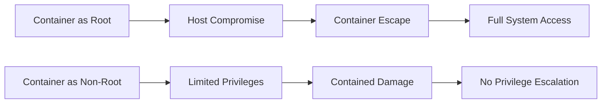
```mermaid
graph LR
    A[Container as Root] --> B[Host Compromise]
    B --> C[Container Escape]
    C --> D[Full System Access]
    
    E[Container as Non-Root] --> F[Limited Privileges]
    F --> G[Contained Damage]
    G --> H[No Privilege Escalation]
```

**Implementation Strategy:**

```dockerfile
# Create user and group
RUN groupadd -r appuser && useradd -r -g appuser appuser

# Set ownership of application files
RUN chown -R appuser:appuser /app

# Switch to non-root user
USER appuser

# Application runs with limited privileges
CMD ["./app"]
```

**Why This Matters:**

1. **Container Escape Mitigation**: If attacker escapes, they're non-root on host
2. **Privilege Escalation Prevention**: Can't gain elevated privileges
3. **Compliance**: Many security standards require non-root execution
4. **Best Practice**: Follows principle of least privilege

**Numeric UID Best Practice:**

```dockerfile
# Use numeric UID for better compatibility
USER 10001:10001
```

Benefits:
- Works across different base images
- No dependency on /etc/passwd
- Better for rootless containers

### Read-Only Root Filesystem

**Immutable Infrastructure Principle:**

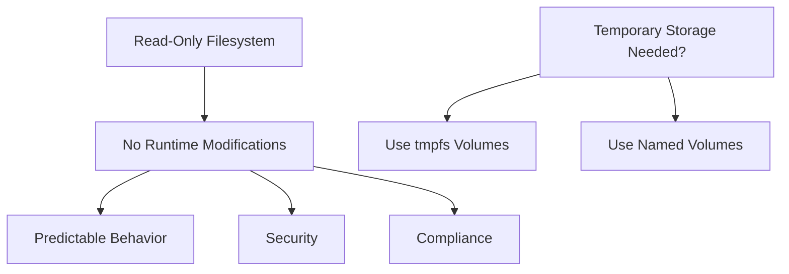
```mermaid
graph TB
    A[Read-Only Filesystem] --> B[No Runtime Modifications]
    B --> C[Predictable Behavior]
    B --> D[Security]
    B --> E[Compliance]
    
    F[Temporary Storage Needed?] --> G[Use tmpfs Volumes]
    F --> H[Use Named Volumes]
```

**Implementation:**

```dockerfile
# In Dockerfile - no special instruction needed
# Runtime enforcement in orchestration:
# Docker: --read-only flag
# Kubernetes: securityContext.readOnlyRootFilesystem: true
```

**Writable Directories:**

Applications often need temporary storage:

```yaml
# Kubernetes example
securityContext:
  readOnlyRootFilesystem: true
volumeMounts:
  - name: tmp
    mountPath: /tmp
  - name: cache
    mountPath: /app/cache
volumes:
  - name: tmp
    emptyDir: {}
  - name: cache
    emptyDir: {}
```

### Security Scanning

**Multi-Stage Scanning Strategy:**

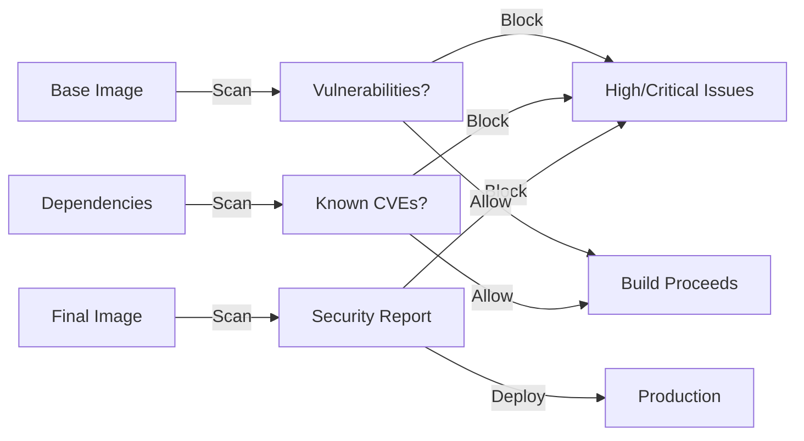
```mermaid
graph LR
    A[Base Image] -->|Scan| B[Vulnerabilities?]
    C[Dependencies] -->|Scan| D[Known CVEs?]
    E[Final Image] -->|Scan| F[Security Report]
    
    B -->|Block| G[High/Critical Issues]
    D -->|Block| G
    F -->|Block| G
    
    B -->|Allow| H[Build Proceeds]
    D -->|Allow| H
    F -->|Deploy| I[Production]
```

**Scanning Tools:**

1. **Trivy**: Comprehensive vulnerability scanner
2. **Snyk**: Developer-first security scanning
3. **Clair**: Container vulnerability analysis
4. **Anchore**: Policy-based compliance scanning

**When to Scan:**

```mermaid
graph TB
    A[Development] -->|Pre-commit| B[Local Scan]
    C[CI Pipeline] -->|Build Time| D[Automated Scan]
    E[Registry] -->|Push Time| F[Registry Scan]
    G[Runtime] -->|Continuous| H[Runtime Monitoring]
    
    I[Fail Build] -.->|Critical Issues| D
    J[Alert] -.->|Non-Critical| D
```

### Secret Management

**Never Include Secrets in Images:**

```mermaid
graph TB
    A[❌ Anti-Patterns] --> B[Hardcoded Secrets]
    A --> C[Environment Variables in Dockerfile]
    A --> D[Secrets in Source Code]
    
    E[✅ Best Practices] --> F[Runtime Injection]
    E --> G[Secret Managers]
    E --> H[Mounted Volumes]
    
    F --> I[Environment at Runtime]
    G --> J[Vault, AWS Secrets Manager]
    H --> K[Kubernetes Secrets]
```

**Why Secrets Don't Belong in Images:**

1. **Immutability**: Image layers are permanent
2. **Distribution**: Images pushed to registries expose secrets
3. **Rotation**: Can't rotate secrets without rebuilding
4. **Compliance**: Violates security standards

**Proper Secret Injection:**

```dockerfile
# ❌ NEVER DO THIS
ENV DATABASE_PASSWORD=super_secret_123

# ✅ DO THIS - Expect runtime injection
ENV DATABASE_PASSWORD=""

# Application should read from:
# - Environment variables (set at runtime)
# - Secret management service (Vault, AWS Secrets Manager)
# - Mounted secret files (Kubernetes secrets)
```

**Build-Time Secrets (BuildKit):**

For secrets needed during build (private repositories, etc.):

```dockerfile
# RUN with secret mount (doesn't persist in layers)
RUN --mount=type=secret,id=github_token \
    git clone https://$(cat /run/secrets/github_token)@github.com/private/repo
```

### Capability Dropping

**Linux Capabilities:** Fine-grained privileges instead of all-or-nothing root.

```mermaid
graph LR
    A[Traditional: Root or Non-Root] --> B[Too Coarse]
    
    C[Capabilities: Granular Privileges] --> D[CHOWN]
    C --> E[NET_BIND_SERVICE]
    C --> F[SYS_TIME]
    C --> G[...30+ More]
    
    H[Best Practice] --> I[Drop All<br/>Add Only Needed]
```

**Example:**

```yaml
# Kubernetes SecurityContext
securityContext:
  capabilities:
    drop:
      - ALL
    add:
      - NET_BIND_SERVICE  # Only if binding to port < 1024
```

**Common Capabilities to Drop:**

- `CHOWN` - Change file ownership
- `SETUID`/`SETGID` - Set user/group ID
- `SYS_ADMIN` - System administration
- `NET_ADMIN` - Network administration
- `SYS_TIME` - Set system time

**Reference:** See `../security/iam-roles-policies.md` for access control principles.

---

## Build Optimization

### Build Context Management

**Understanding Build Context:**

```mermaid
graph LR
    A[docker build .] --> B[Entire Directory Sent to Daemon]
    B --> C{Large Files?}
    
    C -->|Yes| D[Slow Build<br/>High Memory Usage<br/>Network Transfer]
    C -->|No| E[Fast Build]
    
    F[.dockerignore] -.->|Reduces| B
```

**Build Context Size Impact:**

- **Local builds**: Memory and CPU overhead
- **Remote builds**: Network transfer time
- **CI/CD**: Pipeline execution time
- **Caching**: Larger contexts harder to cache

### BuildKit Features

**Modern Build Engine Benefits:**

```mermaid
graph TB
    A[BuildKit] --> B[Parallel Stage Execution]
    A --> C[Automatic Build Cache]
    A --> D[Secret Mounting]
    A --> E[SSH Forwarding]
    A --> F[Remote Cache]
    
    B --> G[Faster Builds]
    C --> G
    D --> H[Secure Builds]
    E --> H
    F --> I[Distributed Teams]
```

**Enable BuildKit:**

```bash
# Environment variable
export DOCKER_BUILDKIT=1

# Or in daemon.json
{
  "features": {
    "buildkit": true
  }
}
```

**BuildKit Advanced Features:**

1. **Parallel Builds**: Independent stages build simultaneously
2. **Lazy Pulling**: Only pulls layers actually needed
3. **Build Secrets**: Temporary secret mounting
4. **Cache Mounts**: Persistent cache across builds
5. **SSH Forwarding**: Access private repositories

### Cache Mount Example

**Persistent Dependency Cache:**

```dockerfile
# Cache npm packages across builds
RUN --mount=type=cache,target=/root/.npm \
    npm ci --only=production

# Cache pip packages
RUN --mount=type=cache,target=/root/.cache/pip \
    pip install -r requirements.txt

# Cache Go modules
RUN --mount=type=cache,target=/go/pkg/mod \
    go mod download
```

**Benefits:**

```mermaid
graph LR
    A[First Build] --> B[Download Dependencies<br/>15 minutes]
    
    C[Subsequent Builds] --> D[Use Cached Dependencies<br/>30 seconds]
    
    E[Cache Mount] -.->|Enables| D
```

### Build Arguments (ARG)

**Dynamic Build Configuration:**

```dockerfile
ARG NODE_VERSION=18
FROM node:${NODE_VERSION}-alpine

ARG BUILD_ENV=production
RUN npm run build:${BUILD_ENV}
```

**ARG vs ENV:**

```mermaid
graph TB
    A[ARG] --> B[Build-Time Only]
    B --> C[Not in Final Image]
    B --> D[Can Have Default Values]
    
    E[ENV] --> F[Build + Runtime]
    F --> G[Persists in Image]
    F --> H[Available to Application]
```

**Best Practices:**

1. **Provide defaults**: `ARG NODE_VERSION=18`
2. **Document args**: Use labels or comments
3. **Don't use for secrets**: ARGs visible in `docker history`
4. **Version pinning**: Default to specific versions

### Buildx and Multi-Platform Images

**Building for Multiple Architectures:**

```mermaid
graph TB
    A[Source Code] --> B[docker buildx]
    
    B --> C[linux/amd64]
    B --> D[linux/arm64]
    B --> E[linux/arm/v7]
    
    C --> F[Multi-Arch Manifest]
    D --> F
    E --> F
    
    F --> G[Registry]
    H[Docker Pull] --> G
    G -->|Selects Correct Arch| I[Local Platform]
```

**Why Multi-Platform Matters:**

- **ARM servers**: AWS Graviton, Raspberry Pi
- **Apple Silicon**: M1/M2 Macs
- **Cloud cost optimization**: ARM often cheaper
- **Edge computing**: ARM-based devices

---

## Runtime Configuration

### Health Checks

**Container Health Monitoring:**

```mermaid
graph TB
    A[Health Check] --> B{Response?}
    
    B -->|Success| C[Healthy]
    B -->|Failure| D[Unhealthy]
    
    D --> E{Retries Exceeded?}
    E -->|No| B
    E -->|Yes| F[Restart Container]
    
    G[Orchestrator] -.->|Monitors| B
    G -.->|Acts on| F
```

**Health Check Types:**

1. **Command-based**: Execute command in container
2. **HTTP-based**: HTTP GET request
3. **TCP-based**: TCP socket connection
4. **gRPC-based**: gRPC health check protocol

**Implementation:**

```dockerfile
# HTTP health check
HEALTHCHECK --interval=30s --timeout=3s --start-period=40s --retries=3 \
    CMD wget --no-verbose --tries=1 --spider http://localhost:8080/health || exit 1

# Command health check
HEALTHCHECK --interval=30s --timeout=3s \
    CMD python -c "import sys; sys.exit(0 if check_health() else 1)"
```

**Health Check Parameters:**

- **interval**: How often to check
- **timeout**: How long to wait for response
- **start-period**: Grace period for startup
- **retries**: Failures before marking unhealthy

**Why Health Checks Matter:**

```mermaid
graph LR
    A[Without Health Check] --> B[Process Running]
    B --> C[Appears Healthy]
    C --> D[But May Be Deadlocked]
    
    E[With Health Check] --> F[Functional Verification]
    F --> G[Detects Application Issues]
    G --> H[Automatic Recovery]
```

### Signal Handling (SIGTERM)

**Graceful Shutdown Flow:**

```mermaid
sequenceDiagram
    participant O as Orchestrator
    participant C as Container
    participant A as Application
    
    O->>C: SIGTERM
    C->>A: Forward SIGTERM
    A->>A: Stop Accepting Requests
    A->>A: Complete In-Flight Requests
    A->>A: Close Connections
    A->>A: Cleanup Resources
    A->>C: Exit (0)
    C->>O: Container Stopped
    
    Note over O,A: Grace Period: 30s
    
    alt Timeout Exceeded
        O->>C: SIGKILL (Force Kill)
        C->>A: Immediate Termination
    end
```

**Why Proper Shutdown Matters:**

1. **Data Integrity**: Complete database transactions
2. **Connection Draining**: Finish in-flight requests
3. **Resource Cleanup**: Close file handles, sockets
4. **Zero Downtime**: Prevent dropped connections

**PID 1 Problem:**

```mermaid
graph TB
    A[Process in Container] --> B{Is PID 1?}
    
    B -->|Yes| C[Receives Signals Directly]
    B -->|No| D[Parent Process Handles]
    
    C --> E[Must Handle SIGTERM]
    C --> F[Must Reap Zombies]
    
    G[Common Issue] --> H[Shell Script as Entrypoint]
    H --> I[Shell Becomes PID 1]
    I --> J[Doesn't Forward Signals]
```

**Solutions:**

1. **exec form**: Use exec to replace shell with application
2. **tini/dumb-init**: Lightweight init system
3. **Application handles**: Code proper signal handling

```dockerfile
# ❌ BAD: Shell as PID 1
ENTRYPOINT ./app

# ✅ GOOD: exec form
ENTRYPOINT ["./app"]

# ✅ BETTER: tini for signal handling
RUN apk add --no-cache tini
ENTRYPOINT ["/sbin/tini", "--", "./app"]
```

### Resource Limits

**Container Resource Management:**

```mermaid
graph TB
    subgraph "Resource Types"
        A[CPU Limits]
        B[Memory Limits]
        C[Disk I/O]
        D[Network Bandwidth]
    end
    
    A --> E[Prevents CPU Starvation]
    B --> F[Prevents OOM Killer]
    C --> G[Fair Disk Access]
    D --> H[QoS Guarantees]
    
    I[No Limits] --> J[Noisy Neighbor Problem]
```

**Memory Limits:**

```dockerfile
# Docker run example
docker run --memory="256m" --memory-swap="512m" myapp

# Kubernetes example in deployment
resources:
  requests:
    memory: "128Mi"
  limits:
    memory: "256Mi"
```

**Memory Behavior Without Limits:**

```mermaid
graph LR
    A[Container Starts] --> B[Memory Usage Grows]
    B --> C[Consumes Host Memory]
    C --> D[OOM Killer Activates]
    D --> E[Random Process Killed]
    E --> F[System Instability]
```

**CPU Limits:**

- **CPU shares**: Relative weight (default 1024)
- **CPU quota**: Hard limit in microseconds
- **CPUs**: Number of CPUs to use

```dockerfile
# Allow up to 1.5 CPUs
docker run --cpus="1.5" myapp

# Kubernetes
resources:
  requests:
    cpu: "500m"  # 0.5 CPU guaranteed
  limits:
    cpu: "1000m" # Can burst to 1 CPU
```

**Requests vs Limits:**

```mermaid
graph TB
    A[Requests] --> B[Guaranteed Resources]
    A --> C[Scheduling Decision]
    A --> D[Minimum Available]
    
    E[Limits] --> F[Maximum Allowed]
    E --> G[Throttling Point]
    E --> H[Protection Boundary]
```

### Environment Variables

**Configuration Strategy:**

```mermaid
graph TB
    A[Configuration] --> B[Build Time]
    A --> C[Runtime]
    
    B --> D[ARG in Dockerfile]
    B --> E[Default ENV]
    
    C --> F[Environment Variables]
    C --> G[Config Files]
    C --> H[Secret Managers]
    
    I[12-Factor App] -.->|Recommends| F
```

**ENV Best Practices:**

```dockerfile
# Provide sensible defaults
ENV PORT=8080
ENV LOG_LEVEL=info
ENV WORKERS=4

# Allow runtime override
# docker run -e PORT=9000 myapp
```

**Configuration Hierarchy:**

```mermaid
graph LR
    A[Defaults in Code] --> B[Default ENV in Image]
    B --> C[Runtime ENV]
    C --> D[Config Files]
    D --> E[Command-Line Args]
    
    F[Lowest Priority] -.-> A
    G[Highest Priority] -.-> E
```

**Environment Variable Naming:**

- Use `UPPERCASE_WITH_UNDERSCORES`
- Prefix with app name: `MYAPP_DATABASE_URL`
- Be explicit: `DATABASE_HOST` not just `HOST`
- Document required vs optional variables

### Volume Mounts and Persistence

**Storage Types:**

```mermaid
graph TB
    subgraph "Container Storage"
        A[Container Layer] --> A1[Ephemeral<br/>Lost on Restart]
        B[Volume Mount] --> B1[Persistent<br/>Survives Restart]
        C[Bind Mount] --> C1[Host Directory<br/>Development Use]
        D[tmpfs Mount] --> D1[Memory-Based<br/>Temporary Data]
    end
```

**When to Use Each:**

1. **Volumes**: Production data (databases, uploads)
2. **Bind Mounts**: Development (source code hot-reload)
3. **tmpfs**: Temporary files, cache, sensitive data

**Volume Best Practices:**

```dockerfile
# Declare volume mount points
VOLUME ["/data", "/logs"]

# Application writes to these paths
# Orchestrator provides actual volumes
```

**Data Persistence Strategy:**

```mermaid
graph TB
    A[Application Data] --> B{Persistent?}
    
    B -->|Yes| C[External Volume]
    B -->|No| D[Container Layer]
    
    C --> E[Database Files]
    C --> F[User Uploads]
    C --> G[Application State]
    
    D --> H[Temporary Files]
    D --> I[Cache]
    D --> J[Build Artifacts]
```

**Reference:** See `../architecture/kubernetes-architecture.md` for StatefulSet volume management.

---

## Logging & Monitoring

### Logging Architecture

**Container Logging Philosophy:**

```mermaid
graph LR
    A[Application] -->|stdout/stderr| B[Container Runtime]
    B -->|Log Driver| C[Logging Backend]
    
    C --> D[JSON File]
    C --> E[Syslog]
    C --> F[Fluentd]
    C --> G[CloudWatch/Stackdriver]
```

**12-Factor Logging Principle:**

> Treat logs as event streams. Write to stdout/stderr, let infrastructure handle aggregation.

**Why stdout/stderr:**

1. **Simplicity**: No log rotation in container
2. **Portability**: Works across environments
3. **Observability**: Standard container log access
4. **Performance**: No disk I/O overhead

**Anti-Pattern - Writing to Log Files:**

```mermaid
graph TB
    A[❌ App Writes to Files] --> B[Disk Space Issues]
    A --> C[Log Rotation Complexity]
    A --> D[Volume Management]
    A --> E[Difficult Aggregation]
    
    F[✅ App Writes to stdout] --> G[Simple]
    F --> H[Scalable]
    F --> I[Standard Tools]
```

### Structured Logging

**JSON Logging Benefits:**

```mermaid
graph TB
    A[Structured Logs] --> B[Machine Readable]
    A --> C[Searchable]
    A --> D[Filterable]
    
    B --> E[Automated Analysis]
    C --> F[Quick Debugging]
    D --> G[Alert Conditions]
```

**Log Levels Strategy:**

```mermaid
graph LR
    A[ERROR] -->|Critical Issues| B[Immediate Action Required]
    C[WARN] -->|Potential Issues| D[Investigation Needed]
    E[INFO] -->|Key Events| F[Application Flow]
    G[DEBUG] -->|Detailed Info| H[Development Only]
```

**What to Log:**

✅ **Do Log:**
- Request/response metadata (method, path, status, duration)
- Important business events
- Errors with context (stack traces, request IDs)
- Performance metrics
- Security events (auth failures, access attempts)

❌ **Don't Log:**
- Passwords or secrets
- Personal identifiable information (PII)
- Credit card numbers
- Full request/response bodies (unless debugging)

### Monitoring Integration

**Observability Pillars:**

```mermaid
graph TB
    subgraph "Container Observability"
        A[Metrics] --> A1[Prometheus]
        B[Logs] --> B1[Loki/ELK]
        C[Traces] --> C1[Jaeger/Zipkin]
    end
    
    D[Application] -.->|Exports| A
    D -.->|Streams| B
    D -.->|Sends| C
    
    E[Grafana] --> A1
    E --> B1
    E --> C1
```

**Metrics Exposure:**

```dockerfile
# Expose Prometheus metrics endpoint
EXPOSE 8080 9090

# 8080: Application
# 9090: Metrics endpoint
```

**Health Check vs Metrics:**

```mermaid
graph TB
    A[Health Check] --> B[Binary State]
    B --> C[Healthy/Unhealthy]
    
    D[Metrics] --> E[Detailed Telemetry]
    E --> F[Request Rate<br/>Error Rate<br/>Duration<br/>Saturation]
```

**Container-Level Metrics:**

- **Resource usage**: CPU, memory, disk, network
- **Process metrics**: Thread count, file descriptors
- **Application metrics**: Request rate, latency, errors
- **Business metrics**: Transactions, user actions

**Reference:** See `../monitoring-logging/prometheus-grafana.md` for detailed monitoring setup.

---

## Networking & Storage

### Network Modes

**Docker Network Types:**

```mermaid
graph TB
    subgraph "Network Modes"
        A[Bridge] --> A1[Default<br/>Container-to-Container]
        B[Host] --> B1[Share Host Network<br/>High Performance]
        C[None] --> C1[No Network<br/>Isolated]
        D[Overlay] --> D1[Multi-Host<br/>Swarm/Kubernetes]
    end
```

**Network Mode Selection:**

| Mode | Use Case | Performance | Isolation |
|------|----------|-------------|-----------|
| **Bridge** | Standard apps | Good | High |
| **Host** | Network-intensive apps | Excellent | None |
| **None** | Security-critical isolation | N/A | Maximum |
| **Overlay** | Multi-host orchestration | Good | High |

**Service Discovery:**

```mermaid
graph LR
    A[Service A] -->|DNS Lookup| B[Service Name]
    B -->|Resolves to| C[Service B IPs]
    C --> D[Load Balanced]
    
    E[Container Orchestrator] -.->|Manages| B
```

### Port Exposure

**EXPOSE vs Publish:**

```dockerfile
# EXPOSE: Documents ports (doesn't publish)
EXPOSE 8080

# Publish at runtime
# docker run -p 8080:8080 myapp
```

**Port Mapping Strategy:**

```mermaid
graph LR
    A[Host:8080] -->|Maps to| B[Container:8080]
    
    C[Best Practice] --> D[Use Standard Ports in Container]
    C --> E[Map to Different Host Ports]
    
    D --> F[Container: 8080<br/>Host: Any Available]
```

**Security Consideration:**

```mermaid
graph TB
    A[Expose Only Necessary Ports] --> B[Attack Surface]
    
    C[Internal Service] --> D[Don't Expose Externally]
    E[Public API] --> F[Expose with Care]
    
    G[Use Reverse Proxy] --> H[SSL Termination]
    G --> I[Rate Limiting]
    G --> J[Authentication]
```

### DNS Configuration

**Container DNS Resolution:**

```mermaid
graph TB
    A[Container] -->|DNS Query| B[Docker DNS Server]
    B -->|Container Name| C[Internal Resolution]
    B -->|External Domain| D[Upstream DNS]
    
    E[Custom DNS] -.->|Override| B
```

**DNS Configuration:**

```dockerfile
# In Dockerfile - not common
# Better at runtime:
# docker run --dns=8.8.8.8 --dns-search=example.com myapp
```

### Storage Drivers

**Storage Driver Impact:**

```mermaid
graph TB
    subgraph "Storage Drivers"
        A[overlay2] --> A1[Best Performance<br/>Recommended]
        B[devicemapper] --> B1[Legacy<br/>Avoid]
        C[btrfs] --> C1[Advanced Features<br/>Specific Use Cases]
        D[zfs] --> D1[High Performance<br/>Complex Setup]
    end
```

**Driver Selection Considerations:**

- **overlay2**: Default, best for most use cases
- **File system compatibility**: Match host filesystem
- **Performance requirements**: Write-heavy vs read-heavy
- **Snapshot capabilities**: Needed for advanced features

**Reference:** See `../networking/vpc-design.md` for container networking in cloud environments.

---

## Production Readiness

### Production Checklist

**Pre-Production Validation:**

```mermaid
graph TB
    A[Production Ready?] --> B{Security}
    A --> C{Performance}
    A --> D{Observability}
    A --> E{Reliability}
    
    B --> B1[✓ Non-root user<br/>✓ No secrets in image<br/>✓ Security scanning<br/>✓ Read-only filesystem]
    
    C --> C1[✓ Resource limits<br/>✓ Multi-stage build<br/>✓ Layer optimization<br/>✓ Health checks]
    
    D --> D1[✓ Structured logging<br/>✓ Metrics endpoint<br/>✓ Trace integration<br/>✓ Error tracking]
    
    E --> E1[✓ Graceful shutdown<br/>✓ Auto-restart policy<br/>✓ Backup strategy<br/>✓ Rollback plan]
```

### Image Tagging Strategy

**Semantic Versioning for Images:**

```mermaid
graph TB
    A[Image Tags] --> B[Version Tags]
    A --> C[Environment Tags]
    A --> D[Git Tags]
    
    B --> B1[v1.2.3<br/>v1.2<br/>v1<br/>latest]
    C --> C1[prod<br/>staging<br/>dev]
    D --> D1[commit-abc123<br/>branch-main]
```

**Tag Best Practices:**

```bash
# ❌ BAD: Only using 'latest'
docker build -t myapp:latest .

# ✅ GOOD: Semantic versioning + metadata
docker build -t myapp:1.2.3 .
docker build -t myapp:1.2 .
docker build -t myapp:1 .
docker build -t myapp:latest .
docker build -t myapp:commit-abc123 .
```

**Why Multiple Tags:**

1. **Pin specific versions**: `myapp:1.2.3` never changes
2. **Auto-update minor**: `myapp:1.2` gets patches
3. **Auto-update major**: `myapp:1` gets features
4. **Development**: `myapp:latest` for bleeding edge
5. **Traceability**: `myapp:commit-abc123` links to source

**Tag Immutability:**

```mermaid
graph LR
    A[Never Overwrite Tags] --> B[v1.2.3 is Permanent]
    
    C[Exception: latest] --> D[Can Be Overwritten]
    
    E[Deployment] --> F[Use Specific Versions]
    E --> G[Not 'latest' in Production]
```

### Registry Best Practices

**Image Registry Architecture:**

```mermaid
graph TB
    A[Build Server] -->|Push| B[Private Registry]
    B -->|Pull| C[Production Cluster]
    B -->|Pull| D[Staging Cluster]
    
    E[Security Scanning] -.->|Scan| B
    F[Vulnerability DB] -.->|Update| E
    
    G[Access Control] -.->|Protect| B
```

**Registry Selection:**

- **Docker Hub**: Public images, free tier
- **Amazon ECR**: AWS-native, IAM integration
- **Google GCR**: GCP-native, automatic scanning
- **Azure ACR**: Azure-native, geo-replication
- **Harbor**: Self-hosted, policy-based
- **GitLab Registry**: CI/CD integrated

**Registry Security:**

```mermaid
graph TB
    A[Registry Security] --> B[Authentication]
    A --> C[Authorization]
    A --> D[Encryption]
    A --> E[Scanning]
    
    B --> B1[User Credentials<br/>Service Accounts]
    C --> C1[Role-Based Access<br/>Namespace Isolation]
    D --> D1[TLS in Transit<br/>Encryption at Rest]
    E --> E1[Vulnerability Scanning<br/>Policy Enforcement]
```

### Image Promotion Strategy

**Environment Progression:**

```mermaid
graph LR
    A[Build] --> B[Dev Registry]
    B -->|Tests Pass| C[Staging Registry]
    C -->|QA Approved| D[Prod Registry]
    
    E[Same Image SHA] -.->|Promoted| B
    E -.->|Promoted| C
    E -.->|Promoted| D
```

**Why Promote, Not Rebuild:**

1. **Consistency**: Exact same binary tested and deployed
2. **Speed**: No recompilation needed
3. **Traceability**: Clear promotion audit trail
4. **Rollback**: Easy to revert to previous image

### Backup and Disaster Recovery

**Container Backup Strategy:**

```mermaid
graph TB
    A[Backup Strategy] --> B[Images]
    A --> C[Volumes]
    A --> D[Configuration]
    
    B --> B1[Registry Replication<br/>Multi-Region Storage]
    C --> C1[Volume Snapshots<br/>Database Backups]
    D --> D1[Git Repository<br/>Config Management]
```

**Recovery Time Objectives:**

```mermaid
graph LR
    A[RTO = 5 min] --> B[Hot Standby<br/>Multi-Region Active]
    C[RTO = 1 hour] --> D[Warm Standby<br/>Scaled-Down Replica]
    E[RTO = 4 hours] --> F[Cold Backup<br/>Restore from Snapshot]
```

**Disaster Recovery Plan:**

1. **Image availability**: Multi-region registry replication
2. **Data backup**: Automated volume snapshots
3. **Configuration backup**: Infrastructure as code in Git
4. **Runbooks**: Documented recovery procedures
5. **Testing**: Regular DR drills

**Reference:** See `../devops-deployment/` for complete deployment strategies.

---

## Anti-Patterns to Avoid

### Common Mistakes

**1. Running as Root**

```mermaid
graph TB
    A[Root User] --> B[Security Risk]
    B --> C[Container Escape = Host Compromise]
    B --> D[No Privilege Isolation]
    B --> E[Compliance Violations]
    
    F[Solution] --> G[USER directive<br/>Numeric UID<br/>Capability dropping]
```

**2. Storing Data in Containers**

```mermaid
graph LR
    A[Data in Container] --> B[Container Restart]
    B --> C[Data Lost]
    
    D[Data in Volume] --> E[Container Restart]
    E --> F[Data Persists]
```

**3. Using 'latest' Tag in Production**

```mermaid
graph TB
    A[latest Tag] --> B[Unpredictable Behavior]
    B --> C[Different Versions Across Instances]
    B --> D[Difficult Rollback]
    B --> E[No Version Audit Trail]
    
    F[Semantic Version Tag] --> G[Predictable<br/>Traceable<br/>Rollback-able]
```

**4. Not Using .dockerignore**

```mermaid
graph LR
    A[No .dockerignore] --> B[Large Build Context]
    B --> C[Slow Builds]
    B --> D[Secrets Leaked]
    B --> E[Cache Invalidation]
```

**5. Installing Unnecessary Packages**

```mermaid
graph TB
    A[Bloated Image] --> B[Large Size]
    A --> C[More Vulnerabilities]
    A --> D[Slower Deployments]
    
    E[Minimal Image] --> F[Fast Deploys]
    E --> G[Fewer CVEs]
    E --> H[Lower Costs]
```

**6. Not Handling Signals Properly**

```mermaid
sequenceDiagram
    participant O as Orchestrator
    participant C as Container
    participant A as App (Ignoring SIGTERM)
    
    O->>C: SIGTERM
    C->>A: SIGTERM
    Note over A: Ignores signal
    Note over O: Wait 30 seconds
    O->>C: SIGKILL
    C->>A: Force killed
    Note over A: Connections dropped<br/>Data lost
```

**7. Hardcoding Configuration**

```mermaid
graph TB
    A[Hardcoded Config] --> B[Rebuild for Changes]
    A --> C[No Environment Portability]
    A --> D[Secrets in Image Layers]
    
    E[Runtime Config] --> F[Same Image, Multiple Envs]
    E --> G[Easy Updates]
    E --> H[Secure Secret Management]
```

**8. Not Setting Resource Limits**

```mermaid
graph LR
    A[No Limits] --> B[Memory Leak]
    B --> C[Consumes Host Memory]
    C --> D[OOM Killer]
    D --> E[Random Container Killed]
    
    F[With Limits] --> G[Controlled Resource Usage]
    G --> H[Predictable Behavior]
```

**9. Mixing Build and Runtime Dependencies**

```mermaid
graph TB
    A[Single Stage] --> B[Build Tools in Production]
    B --> C[400MB Image]
    
    D[Multi-Stage] --> E[Build Stage: Tools]
    D --> F[Runtime Stage: Binary Only]
    F --> G[20MB Image]
```

**10. Not Using Health Checks**

```mermaid
graph LR
    A[No Health Check] --> B[Process Running]
    B --> C[Receiving Traffic]
    C --> D[But Application Deadlocked]
    D --> E[User Errors]
    
    F[With Health Check] --> G[Functional Verification]
    G --> H[Auto-Recovery]
    H --> I[High Availability]
```

---

## Advanced Topics

### Rootless Containers

**Security through User Namespace Mapping:**

```mermaid
graph TB
    A[Rootless Docker] --> B[User Namespace]
    B --> C[Container Root = Unprivileged Host User]
    
    D[Benefits] --> E[No Root Daemon]
    D --> F[Limited Privilege Escalation]
    D --> G[Better Isolation]
    
    H[Limitations] --> I[Some Features Unavailable]
    H --> J[Complexity in Setup]
```

**When to Use Rootless:**

- **Shared systems**: Multi-tenant environments
- **High security requirements**: Defense in depth
- **Compliance**: Strict security policies
- **Development**: Developer workstations

### Init Systems in Containers

**Why Init Systems Matter:**

```mermaid
graph TB
    A[PID 1 Responsibilities] --> B[Signal Handling]
    A --> C[Zombie Reaping]
    A --> D[Process Cleanup]
    
    E[Application as PID 1] --> F[May Not Handle Properly]
    
    G[Init System] --> H[tini]
    G --> I[dumb-init]
    G --> J[s6-overlay]
    
    H --> K[Lightweight: 35KB]
    I --> L[Simple: Python-based]
    J --> M[Full-featured: Supervision]
```

**Zombie Process Problem:**

```mermaid
graph LR
    A[Child Process Exits] --> B[Becomes Zombie]
    B --> C{Parent Reaps?}
    
    C -->|Yes| D[Process Cleaned Up]
    C -->|No| E[Zombie Accumulates]
    
    E --> F[Resource Leak]
    F --> G[PID Exhaustion]
```

### Container Scanning in CI/CD

**Integrated Security Pipeline:**

```mermaid
graph LR
    A[Code Commit] --> B[Build Image]
    B --> C[Security Scan]
    
    C --> D{Vulnerabilities?}
    D -->|Critical| E[Block Deployment]
    D -->|High| F[Warn + Continue]
    D -->|None| G[Push to Registry]
    
    G --> H[Deploy]
```

**Scanning Integration Points:**

1. **Pre-commit**: Scan Dockerfile for best practices
2. **Build time**: Scan layers during build
3. **Registry**: Continuous scanning in registry
4. **Runtime**: Monitor running containers

### Image Signing and Verification

**Supply Chain Security:**

```mermaid
graph TB
    A[Build Image] --> B[Sign with Private Key]
    B --> C[Push to Registry]
    
    D[Deployment] --> E[Pull Image]
    E --> F[Verify Signature]
    
    F --> G{Valid?}
    G -->|Yes| H[Deploy]
    G -->|No| I[Reject]
    
    J[Content Trust] -.->|Docker Content Trust| B
    K[Notary] -.->|Signature Storage| C
```

**Why Sign Images:**

- **Authenticity**: Verify image source
- **Integrity**: Detect tampering
- **Non-repudiation**: Audit trail
- **Compliance**: Security requirements

**Reference:** See `../security/compliance.md` for container security standards.

---

## Integration with Orchestration

### Kubernetes-Specific Considerations

**Pod Design Patterns:**

```mermaid
graph TB
    subgraph "Multi-Container Patterns"
        A[Main Container]
        B[Sidecar] -.->|Enhance| A
        C[Ambassador] -.->|Proxy| A
        D[Adapter] -.->|Normalize| A
        E[Init Container] -.->|Initialize| A
    end
```

**Sidecar Pattern:**

- **Logging agent**: Ship logs to aggregator
- **Metrics exporter**: Export Prometheus metrics
- **Service mesh proxy**: Envoy for traffic management
- **Configuration sync**: Keep config up to date

**Init Container Use Cases:**

```mermaid
sequenceDiagram
    participant I as Init Container
    participant M as Main Container
    participant E as External Dependency
    
    I->>E: Check Database Ready
    E-->>I: Ready
    I->>I: Run Migrations
    I->>M: Exit Success
    M->>M: Start Application
```

**ConfigMap and Secret Injection:**

```mermaid
graph LR
    A[ConfigMap] -->|Volume Mount| B[Container]
    C[Secret] -->|Volume Mount| B
    
    D[Environment Variables] -->|Also Supported| B
    
    E[Best Practice] --> F[Volumes for Files]
    E --> G[Env Vars for Simple Values]
```

### Docker Compose to Kubernetes

**Development to Production Path:**

```mermaid
graph LR
    A[Docker Compose<br/>Development] --> B[Kompose]
    B --> C[Kubernetes Manifests]
    C --> D[Helm Charts]
    D --> E[Production Deployment]
    
    F[Local Dev] -.-> A
    G[Staging/Prod] -.-> E
```

**Compose Best Practices:**

- Use for local development only
- Keep compose files simple
- Don't rely on compose for production
- Use volumes for development hot-reload

**Reference:** See `../containerization/kubernetes-deployments.md` for Kubernetes deployment strategies.

---

## Performance Optimization

### Build Performance

**Optimization Techniques:**

```mermaid
graph TB
    A[Build Performance] --> B[Layer Caching]
    A --> C[BuildKit]
    A --> D[Multi-Stage]
    A --> E[.dockerignore]
    
    B --> F[Order Layers by Change Frequency]
    C --> G[Parallel Builds]
    D --> H[Smaller Final Image]
    E --> I[Smaller Build Context]
    
    J[Result] --> K[Faster CI/CD]
    J --> L[Better Developer Experience]
```

**Build Time Measurement:**

```bash
# Measure build time
time docker build --no-cache -t myapp .

# With BuildKit timing details
DOCKER_BUILDKIT=1 docker build --progress=plain -t myapp .
```

### Runtime Performance

**Container Overhead:**

```mermaid
graph TB
    A[Container Overhead] --> B[Minimal CPU Overhead<br/>~5%]
    A --> C[Memory Overhead<br/>~20-50MB Base]
    A --> D[I/O Overhead<br/>Depends on Storage Driver]
    
    E[Optimization] --> F[Use overlay2 Driver]
    E --> G[Pin to CPU Cores]
    E --> H[Use Host Networking for High Throughput]
```

**Performance Monitoring:**

- **cAdvisor**: Container metrics collection
- **Prometheus**: Time-series storage
- **Grafana**: Visualization
- **Profiling tools**: pprof, perf, flamegraphs

### Image Size Optimization Checklist

```mermaid
graph TB
    A[Size Optimization] --> B[✓ Alpine or Distroless Base]
    A --> C[✓ Multi-Stage Build]
    A --> D[✓ Minimize Layers]
    A --> E[✓ Clean up in Same Layer]
    A --> F[✓ Use .dockerignore]
    A --> G[✓ Compress where Possible]
    
    H[Target] --> I[<100MB for Microservices]
    H --> J[<50MB for Static Binaries]
```

---

## Troubleshooting Guide

### Common Issues and Solutions

**Build Failures:**

```mermaid
graph TB
    A[Build Failed] --> B{Error Type?}
    
    B -->|Cache| C[Clear Build Cache]
    B -->|Network| D[Check Proxy/DNS]
    B -->|Dependency| E[Update Base Image]
    B -->|Permission| F[Check File Permissions]
    
    C --> G[docker builder prune]
    D --> H[--network=host]
    E --> I[docker pull base:latest]
    F --> J[chmod/chown Issues]
```

**Runtime Issues:**

```mermaid
graph TB
    A[Container Crash] --> B{Exit Code?}
    
    B -->|0| C[Normal Exit]
    B -->|1| D[Application Error]
    B -->|137# Docker Best Practices

## Overview

Docker has revolutionized software deployment by enabling consistent, portable, and isolated application environments. However, building production-ready Docker images requires deep understanding of containerization principles, security implications, and optimization techniques. This guide provides comprehensive best practices for building, securing, and operating Docker containers at scale.

```mermaid
graph TB
    subgraph "Docker Best Practices Pillars"
        A[Image Optimization] --> B[Security Hardening]
        B --> C[Build Efficiency]
        C --> D[Runtime Configuration]
        D --> E[Monitoring & Logging]
        E --> F[Orchestration Ready]
    end
    
    G[Development] -.->|Apply| A
    H[CI/CD Pipeline] -.->|Enforce| B
    I[Production] -.->|Operate| D
    J[Observability] -.->|Track| E
```

---

## Table of Contents

1. [Image Architecture & Layering](#image-architecture--layering)
2. [Multi-Stage Builds](#multi-stage-builds)
3. [Base Image Selection](#base-image-selection)
4. [Layer Optimization](#layer-optimization)
5. [Security Best Practices](#security-best-practices)
6. [Build Optimization](#build-optimization)
7. [Runtime Configuration](#runtime-configuration)
8. [Health Checks & Signals](#health-checks--signals)
9. [Logging & Monitoring](#logging--monitoring)
10. [Networking & Storage](#networking--storage)
11. [Production Readiness](#production-readiness)
12. [Anti-Patterns to Avoid](#anti-patterns-to-avoid)

---

## Image Architecture & Layering

### Understanding Docker Image Layers

Docker images are built as a series of read-only layers, with each instruction in a Dockerfile creating a new layer. Understanding this architecture is fundamental to optimization.

```mermaid
graph TB
    subgraph "Docker Image Layer Architecture"
        A[Base Image Layer] --> B[OS Packages Layer]
        B --> C[Application Dependencies Layer]
        C --> D[Application Code Layer]
        D --> E[Container Layer - Writable]
    end
    
    F[Image Registry] -.->|Pull| A
    G[Build Cache] -.->|Reuse| B
    G -.->|Reuse| C
    H[Container Runtime] -.->|Read| D
    H -.->|Write| E
```

**Key Concepts:**

1. **Layer Immutability**: Once created, layers never change
2. **Layer Sharing**: Multiple images can share identical layers
3. **Copy-on-Write**: Modifications create new layers, original stays unchanged
4. **Layer Caching**: Docker reuses unchanged layers during rebuilds

**Layer Size Impact:**

```mermaid
graph LR
    A[Instruction] --> B{Creates New Layer?}
    B -->|FROM, RUN, COPY, ADD| C[Yes - Adds Size]
    B -->|ENV, EXPOSE, CMD, ENTRYPOINT| D[No - Metadata Only]
    
    C --> E[Affects Build Time<br/>Affects Image Size<br/>Affects Transfer Time]
    D --> F[No Size Impact]
```

**Theoretical Foundation:**

The Union File System (UnionFS) allows Docker to stack multiple layers and present them as a single filesystem. When a container runs:

- **Lower layers** (image layers): Read-only
- **Upper layer** (container layer): Read-write
- **Merged view**: Application sees unified filesystem

This architecture enables:
- **Space efficiency**: Shared layers across images
- **Fast startup**: Only container layer needs initialization
- **Isolation**: Each container has independent writable layer

---

## Multi-Stage Builds

### The Problem: Bloated Images

Traditional Docker builds often include build tools, compilers, and development dependencies that aren't needed at runtime. Multi-stage builds solve this by separating build and runtime environments.

```mermaid
graph TB
    subgraph "Single-Stage Build (Anti-Pattern)"
        A1[Base Image with Build Tools] --> B1[Install Dependencies]
        B1 --> C1[Compile Application]
        C1 --> D1[Final Image = 1.2GB]
    end
    
    subgraph "Multi-Stage Build (Best Practice)"
        A2[Builder Stage] --> B2[Build Tools + Compile]
        B2 --> C2[Runtime Stage]
        C2 --> D2[Copy Binary Only]
        D2 --> E2[Final Image = 25MB]
    end
```

### Multi-Stage Architecture

**Stage Separation Strategy:**

```mermaid
graph LR
    subgraph "Build Stage"
        A[Full SDK] --> B[Dependencies]
        B --> C[Compilation]
        C --> D[Artifacts]
    end
    
    subgraph "Runtime Stage"
        E[Minimal Base] --> F[Copy Artifacts]
        F --> G[Runtime Deps Only]
    end
    
    D -.->|COPY --from=builder| F
```

**Example Conceptual Flow:**

```dockerfile
# Stage 1: Build Environment (Heavy)
FROM node:18-alpine AS builder
# - Includes npm, build tools, dev dependencies
# - Size: ~180MB
# - Purpose: Compile, transpile, bundle

# Stage 2: Runtime Environment (Light)  
FROM node:18-alpine AS runtime
# - Only production dependencies
# - Only compiled artifacts
# - Size: ~50MB
# - Purpose: Execute application
```

**Benefits of Multi-Stage Builds:**

1. **Image Size Reduction**: 70-95% smaller final images
2. **Security**: No build tools in production images
3. **Build Caching**: Each stage cached independently
4. **Separation of Concerns**: Build vs runtime environments
5. **Parallel Builds**: Stages can build concurrently

**Stage Naming Strategy:**

```mermaid
graph TB
    A[dependencies] --> B[builder]
    B --> C[tester]
    C --> D[runtime]
    
    E[Optional Stages] -.->|dev-dependencies| A
    E -.->|debug| D
    
   
```

**Cross-Stage Artifact Copying:**

The `COPY --from=<stage>` instruction is fundamental to multi-stage builds:

- **Selective copying**: Only needed files transferred
- **No layer pollution**: Build artifacts don't bloat final image
- **Cache efficiency**: Changes in builder don't invalidate runtime cache

**Advanced Multi-Stage Patterns:**

1. **Testing Stage**: Run tests in separate stage, fail build if tests fail
2. **Debug Stage**: Create debug variant with additional tools
3. **Platform-Specific Stages**: Different stages for different architectures
4. **Dependency Caching**: Separate stage for dependency installation

**Reference:** See `../architecture/cloud-architecture.md` for containerized deployment patterns.

---

## Base Image Selection

### Choosing the Right Foundation

Base image selection dramatically impacts image size, security surface, and compatibility. This decision requires balancing functionality, security, and size.

```mermaid
graph TB
    subgraph "Base Image Types"
        A[Full OS - Ubuntu/Debian]
        B[Slim - python:slim]
        C[Alpine - Alpine Linux]
        D[Distroless - Google Distroless]
        E[Scratch - Empty Image]
    end
    
    A -->|Size: 200MB+| F[Complete Package Manager]
    B -->|Size: 100-150MB| G[Reduced Packages]
    C -->|Size: 5-50MB| H[Minimal musl-based]
    D -->|Size: 20-80MB| I[No Shell/Package Manager]
    E -->|Size: 0MB| J[Static Binaries Only]
    
    
```

### Base Image Comparison Matrix

**Detailed Analysis:**

| Base Image | Size | Security Surface | Use Case | Pros | Cons |
|------------|------|------------------|----------|------|------|
| **Ubuntu/Debian** | 200-500MB | Large | Legacy apps, debugging | Full tooling, familiar | Bloated, slow updates |
| **Slim Variants** | 100-150MB | Medium | General purpose | Balance of size/function | Still includes unnecessary packages |
| **Alpine** | 5-50MB | Small | Size-critical apps | Tiny, fast pulls | musl libc compatibility issues |
| **Distroless** | 20-80MB | Very Small | Production apps | No shell/package manager | Debugging difficult |
| **Scratch** | 0MB | Minimal | Static binaries only | Ultimate security | No OS utilities |

### Alpine Linux Deep Dive

**Why Alpine is Popular:**

```mermaid
graph LR
    A[Alpine Linux] --> B[musl libc]
    A --> C[BusyBox]
    A --> D[apk Package Manager]
    
    B --> E[Smaller than glibc]
    C --> F[Minimal Unix Tools]
    D --> G[Fast Package Install]
    
    H[Result] --> I[5MB Base Image]
    H --> J[Fast Container Startup]
    H --> K[Reduced Attack Surface]
```

**Alpine Considerations:**

1. **musl libc vs glibc**: 
   - musl is smaller but less compatible
   - Some pre-compiled binaries expect glibc
   - May need recompilation from source

2. **apk vs apt/yum**:
   - Different package names
   - Smaller package repository
   - Faster package installation

3. **Binary Compatibility**:
   - Native Go binaries work perfectly
   - Python wheels may need compilation
   - Node native modules may fail

**When to Use Alpine:**

✅ **Good For:**
- Go applications (static compilation)
- Node.js applications (pure JavaScript)
- Python applications (if packages compile on Alpine)
- Microservices with minimal dependencies

❌ **Avoid For:**
- Complex native dependencies
- Applications requiring glibc
- When debugging tools are essential

### Distroless Images

**Philosophy:** Only include application and runtime dependencies, nothing else.

```mermaid
graph TB
    subgraph "Traditional Image"
        A[Application]
        B[Shell]
        C[Package Manager]
        D[Utilities]
        E[Libs]
    end
    
    subgraph "Distroless Image"
        F[Application]
        G[Runtime Libs Only]
    end
    
    H[Attack Surface] -->|Reduced 90%| I[No Shell Access<br/>No Package Manager<br/>No Unnecessary Tools]
```

**Distroless Benefits:**

1. **Security**: No shell means no shell exploits
2. **Compliance**: Easier to audit (fewer components)
3. **Size**: Smaller than traditional images
4. **Performance**: Faster startup (less to load)

**Distroless Debugging:**

Since distroless images have no shell, debugging requires:
- **Ephemeral Containers**: `kubectl debug` with debug tools
- **Debug Variants**: Google provides `:debug` tags with busybox
- **External Debugging**: Attach debugger from outside container

**Example Distroless Variants:**

- `gcr.io/distroless/static-debian11` - Static binaries (Go)
- `gcr.io/distroless/base-debian11` - glibc applications
- `gcr.io/distroless/python3-debian11` - Python applications
- `gcr.io/distroless/java17-debian11` - Java applications

### Scratch Images

**Use Case:** Statically compiled binaries with zero dependencies.

```mermaid
graph LR
    A[Go Binary<br/>Static Compilation] --> B[scratch Image]
    B --> C[Final Size: ~10MB]
    
    D[No OS] --> E[No Attack Surface]
    D --> F[Ultimate Security]
    D --> G[Minimal Resource Usage]
```

**Perfect for:**
- Go applications with `CGO_ENABLED=0`
- Rust binaries with static linking
- C/C++ with static compilation

**Limitations:**
- No shell for debugging
- No standard utilities
- Must include all certificates/timezone data manually

**Reference:** See `../security/network-security.md` for container security hardening.

---

## Layer Optimization

### Cache Efficiency Strategy

Docker layer caching is one of the most powerful optimization techniques. Understanding cache invalidation is critical.

```mermaid
graph TB
    A[Dockerfile Change] --> B{Which Instruction Changed?}
    
    B -->|Early Instruction| C[Cache Invalidated]
    C --> D[All Subsequent Layers Rebuild]
    
    B -->|Late Instruction| E[Cache Partially Valid]
    E --> F[Only Changed Layers Rebuild]
    
    G[Best Practice] --> H[Stable Instructions First<br/>Volatile Instructions Last]
```

### Layer Ordering Strategy

**Optimal Dockerfile Structure:**

```mermaid
graph TB
    A[FROM - Base Image] --> B[LABEL - Metadata]
    B --> C[ENV - Environment Variables]
    C --> D[System Dependencies]
    D --> E[Application Dependencies]
    E --> F[Application Code]
    F --> G[Configuration Files]
    G --> H[EXPOSE, CMD]
    
    I[Rarely Changes] -.->|Top| A
    J[Frequently Changes] -.->|Bottom| F
    
 
```

**Rationale:**

1. **Base image** (FROM): Almost never changes
2. **System packages**: Change occasionally (security updates)
3. **Language runtime**: Change when upgrading versions
4. **Application dependencies**: Change moderately (package.json, requirements.txt)
5. **Application code**: Changes frequently (every commit)

**Dependency Layer Separation:**

```dockerfile
# ❌ BAD: Invalidates cache on any file change
COPY . /app
RUN npm install

# ✅ GOOD: Cache dependencies separately
COPY package*.json /app/
RUN npm ci --only=production
COPY . /app/
```

**Why This Works:**

```mermaid
graph LR
    A[package.json Changed?] -->|No| B[Use Cached npm install]
    A -->|Yes| C[Run npm install]
    
    D[Source Code Changed?] -->|No| E[Use Cached COPY]
    D -->|Yes| F[Run COPY]
    
    B --> G[Fast Build]
    C --> G
```

### RUN Instruction Optimization

**Command Chaining:**

Each `RUN` instruction creates a new layer. Chain related commands to reduce layers:

```dockerfile
# ❌ BAD: Creates 3 layers
RUN apt-get update
RUN apt-get install -y curl
RUN rm -rf /var/lib/apt/lists/*

# ✅ GOOD: Creates 1 layer
RUN apt-get update \
    && apt-get install -y --no-install-recommends curl \
    && rm -rf /var/lib/apt/lists/*
```

**Why Chain Commands?**

```mermaid
graph TB
    subgraph "Separate RUN Instructions"
        A1[RUN apt-get update] --> B1[Layer 1: 100MB]
        C1[RUN apt-get install] --> D1[Layer 2: 200MB]
        E1[RUN cleanup] --> F1[Layer 3: -50MB but total still 300MB]
    end
    
    subgraph "Chained RUN Instruction"
        A2[RUN update && install && cleanup] --> B2[Layer 1: 150MB]
    end
    
    G[Result] --> H[Single Instruction = Smaller Image]
```

**Layer Cleanup Must Happen in Same Layer:**

Critical concept: File deletion in a later layer doesn't reduce image size. The deleted files still exist in previous layers.

```dockerfile
# ❌ BAD: Downloads still in layer history
RUN wget https://large-file.tar.gz
RUN tar -xzf large-file.tar.gz
RUN rm large-file.tar.gz

# ✅ GOOD: Cleanup in same layer
RUN wget https://large-file.tar.gz \
    && tar -xzf large-file.tar.gz \
    && rm large-file.tar.gz
```

### COPY vs ADD

**Fundamental Difference:**

```mermaid
graph LR
    A[COPY] -->|Simple Copy| B[Local Files → Container]
    
    C[ADD] -->|Copy + Features| D[Local Files → Container]
    C -->|Auto Extract| E[tar.gz Extraction]
    C -->|Remote URLs| F[Download from URLs]
    
    G[Best Practice] --> H[Use COPY<br/>Explicit is Better]
```

**Why Prefer COPY:**

1. **Explicit behavior**: No hidden functionality
2. **Predictable caching**: Doesn't depend on URL content
3. **Better performance**: No extraction overhead
4. **Security**: No automatic URL downloads

**When to Use ADD:**

Only when you specifically need:
- Automatic tar extraction
- Remote URL downloads (though `RUN wget` is often clearer)

### .dockerignore File

Essential for preventing unnecessary files from bloating the build context.

```mermaid
graph TB
    A[Project Directory] --> B{.dockerignore?}
    
    B -->|No| C[Send All Files to Docker Daemon]
    C --> D[Slow Build<br/>Large Context<br/>Security Risk]
    
    B -->|Yes| E[Filter Files]
    E --> F[Fast Build<br/>Small Context<br/>Secure]
```

**What to Exclude:**

```
# Version control
.git/
.gitignore

# Dependencies (install fresh in container)
node_modules/
venv/
__pycache__/

# Build artifacts
*.log
dist/
build/

# IDE files
.vscode/
.idea/

# Documentation
README.md
docs/

# CI/CD
.github/
.gitlab-ci.yml

# Sensitive files
.env
secrets/
```

**Reference:** See `../ci-cd/deployment-strategies.md` for build optimization in pipelines.

---

## Security Best Practices

### Security Layers in Container Design

```mermaid
graph TB
    subgraph "Defense in Depth"
        A[Image Scanning] --> B[Minimal Base Image]
        B --> C[Non-Root User]
        C --> D[Read-Only Filesystem]
        D --> E[Resource Limits]
        E --> F[Network Policies]
        F --> G[Secret Management]
    end
    
    H[Build Time] -.->|Apply| A
    H -.->|Apply| B
    I[Runtime] -.->|Enforce| C
    I -.->|Enforce| D
    I -.->|Enforce| E
    J[Orchestration] -.->|Control| F
    J -.->|Control| G
```

### Non-Root User Execution

**The Problem:** Running as root violates the principle of least privilege.

```mermaid
graph LR
    A[Container as Root] --> B[Host Compromise]
    B --> C[Container Escape]
    C --> D[Full System Access]
    
    E[Container as Non-Root] --> F[Limited Privileges]
    F --> G[Contained Damage]
    G --> H[No Privilege Escalation]
```

**Implementation Strategy:**

```dockerfile
# Create user and group
RUN groupadd -r appuser && useradd -r -g appuser appuser

# Set ownership of application files
RUN chown -R appuser:appuser /app

# Switch to non-root user
USER appuser

# Application runs with limited privileges
CMD ["./app"]
```

**Why This Matters:**

1. **Container Escape Mitigation**: If attacker escapes, they're non-root on host
2. **Privilege Escalation Prevention**: Can't gain elevated privileges
3. **Compliance**: Many security standards require non-root execution
4. **Best Practice**: Follows principle of least privilege

**Numeric UID Best Practice:**

```dockerfile
# Use numeric UID for better compatibility
USER 10001:10001
```

Benefits:
- Works across different base images
- No dependency on /etc/passwd
- Better for rootless containers

### Read-Only Root Filesystem

**Immutable Infrastructure Principle:**

```mermaid
graph TB
    A[Read-Only Filesystem] --> B[No Runtime Modifications]
    B --> C[Predictable Behavior]
    B --> D[Security]
    B --> E[Compliance]
    
    F[Temporary Storage Needed?] --> G[Use tmpfs Volumes]
    F --> H[Use Named Volumes]
```

**Implementation:**

```dockerfile
# In Dockerfile - no special instruction needed
# Runtime enforcement in orchestration:
# Docker: --read-only flag
# Kubernetes: securityContext.readOnlyRootFilesystem: true
```

**Writable Directories:**

Applications often need temporary storage:

```yaml
# Kubernetes example
securityContext:
  readOnlyRootFilesystem: true
volumeMounts:
  - name: tmp
    mountPath: /tmp
  - name: cache
    mountPath: /app/cache
volumes:
  - name: tmp
    emptyDir: {}
  - name: cache
    emptyDir: {}
```

### Security Scanning

**Multi-Stage Scanning Strategy:**

```mermaid
graph LR
    A[Base Image] -->|Scan| B[Vulnerabilities?]
    C[Dependencies] -->|Scan| D[Known CVEs?]
    E[Final Image] -->|Scan| F[Security Report]
    
    B -->|Block| G[High/Critical Issues]
    D -->|Block| G
    F -->|Block| G
    
    B -->|Allow| H[Build Proceeds]
    D -->|Allow| H
    F -->|Deploy| I[Production]
```

**Scanning Tools:**

1. **Trivy**: Comprehensive vulnerability scanner
2. **Snyk**: Developer-first security scanning
3. **Clair**: Container vulnerability analysis
4. **Anchore**: Policy-based compliance scanning

**When to Scan:**

```mermaid
graph TB
    A[Development] -->|Pre-commit| B[Local Scan]
    C[CI Pipeline] -->|Build Time| D[Automated Scan]
    E[Registry] -->|Push Time| F[Registry Scan]
    G[Runtime] -->|Continuous| H[Runtime Monitoring]
    
    I[Fail Build] -.->|Critical Issues| D
    J[Alert] -.->|Non-Critical| D
```

### Secret Management

**Never Include Secrets in Images:**

```mermaid
graph TB
    A[❌ Anti-Patterns] --> B[Hardcoded Secrets]
    A --> C[Environment Variables in Dockerfile]
    A --> D[Secrets in Source Code]
    
    E[✅ Best Practices] --> F[Runtime Injection]
    E --> G[Secret Managers]
    E --> H[Mounted Volumes]
    
    F --> I[Environment at Runtime]
    G --> J[Vault, AWS Secrets Manager]
    H --> K[Kubernetes Secrets]
```

**Why Secrets Don't Belong in Images:**

1. **Immutability**: Image layers are permanent
2. **Distribution**: Images pushed to registries expose secrets
3. **Rotation**: Can't rotate secrets without rebuilding
4. **Compliance**: Violates security standards

**Proper Secret Injection:**

```dockerfile
# ❌ NEVER DO THIS
ENV DATABASE_PASSWORD=super_secret_123

# ✅ DO THIS - Expect runtime injection
ENV DATABASE_PASSWORD=""

# Application should read from:
# - Environment variables (set at runtime)
# - Secret management service (Vault, AWS Secrets Manager)
# - Mounted secret files (Kubernetes secrets)
```

**Build-Time Secrets (BuildKit):**

For secrets needed during build (private repositories, etc.):

```dockerfile
# RUN with secret mount (doesn't persist in layers)
RUN --mount=type=secret,id=github_token \
    git clone https://$(cat /run/secrets/github_token)@github.com/private/repo
```

### Capability Dropping

**Linux Capabilities:** Fine-grained privileges instead of all-or-nothing root.

```mermaid
graph LR
    A[Traditional: Root or Non-Root] --> B[Too Coarse]
    
    C[Capabilities: Granular Privileges] --> D[CHOWN]
    C --> E[NET_BIND_SERVICE]
    C --> F[SYS_TIME]
    C --> G[...30+ More]
    
    H[Best Practice] --> I[Drop All<br/>Add Only Needed]
```

**Example:**

```yaml
# Kubernetes SecurityContext
securityContext:
  capabilities:
    drop:
      - ALL
    add:
      - NET_BIND_SERVICE  # Only if binding to port < 1024
```

**Common Capabilities to Drop:**

- `CHOWN` - Change file ownership
- `SETUID`/`SETGID` - Set user/group ID
- `SYS_ADMIN` - System administration
- `NET_ADMIN` - Network administration
- `SYS_TIME` - Set system time

**Reference:** See `../security/iam-roles-policies.md` for access control principles.

---

## Build Optimization

### Build Context Management

**Understanding Build Context:**

```mermaid
graph LR
    A[docker build .] --> B[Entire Directory Sent to Daemon]
    B --> C{Large Files?}
    
    C -->|Yes| D[Slow Build<br/>High Memory Usage<br/>Network Transfer]
    C -->|No| E[Fast Build]
    
    F[.dockerignore] -.->|Reduces| B
```

**Build Context Size Impact:**

- **Local builds**: Memory and CPU overhead
- **Remote builds**: Network transfer time
- **CI/CD**: Pipeline execution time
- **Caching**: Larger contexts harder to cache

### BuildKit Features

**Modern Build Engine Benefits:**

```mermaid
graph TB
    A[BuildKit] --> B[Parallel Stage Execution]
    A --> C[Automatic Build Cache]
    A --> D[Secret Mounting]
    A --> E[SSH Forwarding]
    A --> F[Remote Cache]
    
    B --> G[Faster Builds]
    C --> G
    D --> H[Secure Builds]
    E --> H
    F --> I[Distributed Teams]
```

**Enable BuildKit:**

```bash
# Environment variable
export DOCKER_BUILDKIT=1

# Or in daemon.json
{
  "features": {
    "buildkit": true
  }
}
```

**BuildKit Advanced Features:**

1. **Parallel Builds**: Independent stages build simultaneously
2. **Lazy Pulling**: Only pulls layers actually needed
3. **Build Secrets**: Temporary secret mounting
4. **Cache Mounts**: Persistent cache across builds
5. **SSH Forwarding**: Access private repositories

### Cache Mount Example

**Persistent Dependency Cache:**

```dockerfile
# Cache npm packages across builds
RUN --mount=type=cache,target=/root/.npm \
    npm ci --only=production

# Cache pip packages
RUN --mount=type=cache,target=/root/.cache/pip \
    pip install -r requirements.txt

# Cache Go modules
RUN --mount=type=cache,target=/go/pkg/mod \
    go mod download
```

**Benefits:**

```mermaid
graph LR
    A[First Build] --> B[Download Dependencies<br/>15 minutes]
    
    C[Subsequent Builds] --> D[Use Cached Dependencies<br/>30 seconds]
    
    E[Cache Mount] -.->|Enables| D
```

### Build Arguments (ARG)

**Dynamic Build Configuration:**

```dockerfile
ARG NODE_VERSION=18
FROM node:${NODE_VERSION}-alpine

ARG BUILD_ENV=production
RUN npm run build:${BUILD_ENV}
```

**ARG vs ENV:**

```mermaid
graph TB
    A[ARG] --> B[Build-Time Only]
    B --> C[Not in Final Image]
    B --> D[Can Have Default Values]
    
    E[ENV] --> F[Build + Runtime]
    F --> G[Persists in Image]
    F --> H[Available to Application]
```

**Best Practices:**

1. **Provide defaults**: `ARG NODE_VERSION=18`
2. **Document args**: Use labels or comments
3. **Don't use for secrets**: ARGs visible in `docker history`
4. **Version pinning**: Default to specific versions

### Buildx and Multi-Platform Images

**Building for Multiple Architectures:**

```mermaid
graph TB
    A[Source Code] --> B[docker buildx]
    
    B --> C[linux/amd64]
    B --> D[linux/arm64]
    B --> E[linux/arm/v7]
    
    C --> F[Multi-Arch Manifest]
    D --> F
    E --> F
    
    F --> G[Registry]
    H[Docker Pull] --> G
    G -->|Selects Correct Arch| I[Local Platform]
```

**Why Multi-Platform Matters:**

- **ARM servers**: AWS Graviton, Raspberry Pi
- **Apple Silicon**: M1/M2 Macs
- **Cloud cost optimization**: ARM often cheaper
- **Edge computing**: ARM-based devices

---

## Runtime Configuration

### Health Checks

**Container Health Monitoring:**

```mermaid
graph TB
    A[Health Check] --> B{Response?}
    
    B -->|Success| C[Healthy]
    B -->|Failure| D[Unhealthy]
    
    D --> E{Retries Exceeded?}
    E -->|No| B
    E -->|Yes| F[Restart Container]
    
    G[Orchestrator] -.->|Monitors| B
    G -.->|Acts on| F
```

**Health Check Types:**

1. **Command-based**: Execute command in container
2. **HTTP-based**: HTTP GET request
3. **TCP-based**: TCP socket connection
4. **gRPC-based**: gRPC health check protocol

**Implementation:**

```dockerfile
# HTTP health check
HEALTHCHECK --interval=30s --timeout=3s --start-period=40s --retries=3 \
    CMD wget --no-verbose --tries=1 --spider http://localhost:8080/health || exit 1

# Command health check
HEALTHCHECK --interval=30s --timeout=3s \
    CMD python -c "import sys; sys.exit(0 if check_health() else 1)"
```

**Health Check Parameters:**

- **interval**: How often to check
- **timeout**: How long to wait for response
- **start-period**: Grace period for startup
- **retries**: Failures before marking unhealthy

**Why Health Checks Matter:**

```mermaid
graph LR
    A[Without Health Check] --> B[Process Running]
    B --> C[Appears Healthy]
    C --> D[But May Be Deadlocked]
    
    E[With Health Check] --> F[Functional Verification]
    F --> G[Detects Application Issues]
    G --> H[Automatic Recovery]
```

### Signal Handling (SIGTERM)

**Graceful Shutdown Flow:**

```mermaid
sequenceDiagram
    participant O as Orchestrator
    participant C as Container
    participant A as Application
    
    O->>C: SIGTERM
    C->>A: Forward SIGTERM
    A->>A: Stop Accepting Requests
    A->>A: Complete In-Flight Requests
    A->>A: Close Connections
    A->>A: Cleanup Resources
    A->>C: Exit (0)
    C->>O: Container Stopped
    
    Note over O,A: Grace Period: 30s
    
    alt Timeout Exceeded
        O->>C: SIGKILL (Force Kill)
        C->>A: Immediate Termination
    end
```

**Why Proper Shutdown Matters:**

1. **Data Integrity**: Complete database transactions
2. **Connection Draining**: Finish in-flight requests
3. **Resource Cleanup**: Close file handles, sockets
4. **Zero Downtime**: Prevent dropped connections

**PID 1 Problem:**

```mermaid
graph TB
    A[Process in Container] --> B{Is PID 1?}
    
    B -->|Yes| C[Receives Signals Directly]
    B -->|No| D[Parent Process Handles]
    
    C --> E[Must Handle SIGTERM]
    C --> F[Must Reap Zombies]
    
    G[Common Issue] --> H[Shell Script as Entrypoint]
    H --> I[Shell Becomes PID 1]
    I --> J[Doesn't Forward Signals]
```

**Solutions:**

1. **exec form**: Use exec to replace shell with application
2. **tini/dumb-init**: Lightweight init system
3. **Application handles**: Code proper signal handling

```dockerfile
# ❌ BAD: Shell as PID 1
ENTRYPOINT ./app

# ✅ GOOD: exec form
ENTRYPOINT ["./app"]

# ✅ BETTER: tini for signal handling
RUN apk add --no-cache tini
ENTRYPOINT ["/sbin/tini", "--", "./app"]
```

### Resource Limits

**Container Resource Management:**

```mermaid
graph TB
    subgraph "Resource Types"
        A[CPU Limits]
        B[Memory Limits]
        C[Disk I/O]
        D[Network Bandwidth]
    end
    
    A --> E[Prevents CPU Starvation]
    B --> F[Prevents OOM Killer]
    C --> G[Fair Disk Access]
    D --> H[QoS Guarantees]
    
    I[No Limits] --> J[Noisy Neighbor Problem]
```

**Memory Limits:**

```dockerfile
# Docker run example
docker run --memory="256m" --memory-swap="512m" myapp

# Kubernetes example in deployment
resources:
  requests:
    memory: "128Mi"
  limits:
    memory: "256Mi"
```

**Memory Behavior Without Limits:**

```mermaid
graph LR
    A[Container Starts] --> B[Memory Usage Grows]
    B --> C[Consumes Host Memory]
    C --> D[OOM Killer Activates]
    D --> E[Random Process Killed]
    E --> F[System Instability]
```

**CPU Limits:**

- **CPU shares**: Relative weight (default 1024)
- **CPU quota**: Hard limit in microseconds
- **CPUs**: Number of CPUs to use

```dockerfile
# Allow up to 1.5 CPUs
docker run --cpus="1.5" myapp

# Kubernetes
resources:
  requests:
    cpu: "500m"  # 0.5 CPU guaranteed
  limits:
    cpu: "1000m" # Can burst to 1 CPU
```

**Requests vs Limits:**

```mermaid
graph TB
    A[Requests] --> B[Guaranteed Resources]
    A --> C[Scheduling Decision]
    A --> D[Minimum Available]
    
    E[Limits] --> F[Maximum Allowed]
    E --> G[Throttling Point]
    E --> H[Protection Boundary]
```

### Environment Variables

**Configuration Strategy:**

```mermaid
graph TB
    A[Configuration] --> B[Build Time]
    A --> C[Runtime]
    
    B --> D[ARG in Dockerfile]
    B --> E[Default ENV]
    
    C --> F[Environment Variables]
    C --> G[Config Files]
    C --> H[Secret Managers]
    
    I[12-Factor App] -.->|Recommends| F
```

**ENV Best Practices:**

```dockerfile
# Provide sensible defaults
ENV PORT=8080
ENV LOG_LEVEL=info
ENV WORKERS=4

# Allow runtime override
# docker run -e PORT=9000 myapp
```

**Configuration Hierarchy:**

```mermaid
graph LR
    A[Defaults in Code] --> B[Default ENV in Image]
    B --> C[Runtime ENV]
    C --> D[Config Files]
    D --> E[Command-Line Args]
    
    F[Lowest Priority] -.-> A
    G[Highest Priority] -.-> E
```

**Environment Variable Naming:**

- Use `UPPERCASE_WITH_UNDERSCORES`
- Prefix with app name: `MYAPP_DATABASE_URL`
- Be explicit: `DATABASE_HOST` not just `HOST`
- Document required vs optional variables

### Volume Mounts and Persistence

**Storage Types:**

```mermaid
graph TB
    subgraph "Container Storage"
        A[Container Layer] --> A1[Ephemeral<br/>Lost on Restart]
        B[Volume Mount] --> B1[Persistent<br/>Survives Restart]
        C[Bind Mount] --> C1[Host Directory<br/>Development Use]
        D[tmpfs Mount] --> D1[Memory-Based<br/>Temporary Data]
    end
```

**When to Use Each:**

1. **Volumes**: Production data (databases, uploads)
2. **Bind Mounts**: Development (source code hot-reload)
3. **tmpfs**: Temporary files, cache, sensitive data

**Volume Best Practices:**

```dockerfile
# Declare volume mount points
VOLUME ["/data", "/logs"]

# Application writes to these paths
# Orchestrator provides actual volumes
```

**Data Persistence Strategy:**

```mermaid
graph TB
    A[Application Data] --> B{Persistent?}
    
    B -->|Yes| C[External Volume]
    B -->|No| D[Container Layer]
    
    C --> E[Database Files]
    C --> F[User Uploads]
    C --> G[Application State]
    
    D --> H[Temporary Files]
    D --> I[Cache]
    D --> J[Build Artifacts]
```

**Reference:** See `../architecture/kubernetes-architecture.md` for StatefulSet volume management.

---

## Logging & Monitoring

### Logging Architecture

**Container Logging Philosophy:**

```mermaid
graph LR
    A[Application] -->|stdout/stderr| B[Container Runtime]
    B -->|Log Driver| C[Logging Backend]
    
    C --> D[JSON File]
    C --> E[Syslog]
    C --> F[Fluentd]
    C --> G[CloudWatch/Stackdriver]
```

**12-Factor Logging Principle:**

> Treat logs as event streams. Write to stdout/stderr, let infrastructure handle aggregation.

**Why stdout/stderr:**

1. **Simplicity**: No log rotation in container
2. **Portability**: Works across environments
3. **Observability**: Standard container log access
4. **Performance**: No disk I/O overhead

**Anti-Pattern - Writing to Log Files:**

```mermaid
graph TB
    A[❌ App Writes to Files] --> B[Disk Space Issues]
    A --> C[Log Rotation Complexity]
    A --> D[Volume Management]
    A --> E[Difficult Aggregation]
    
    F[✅ App Writes to stdout] --> G[Simple]
    F --> H[Scalable]
    F --> I[Standard Tools]
```

### Structured Logging

**JSON Logging Benefits:**

```mermaid
graph TB
    A[Structured Logs] --> B[Machine Readable]
    A --> C[Searchable]
    A --> D[Filterable]
    
    B --> E[Automated Analysis]
    C --> F[Quick Debugging]
    D --> G[Alert Conditions]
```

**Log Levels Strategy:**

```mermaid
graph LR
    A[ERROR] -->|Critical Issues| B[Immediate Action Required]
    C[WARN] -->|Potential Issues| D[Investigation Needed]
    E[INFO] -->|Key Events| F[Application Flow]
    G[DEBUG] -->|Detailed Info| H[Development Only]
```

**What to Log:**

✅ **Do Log:**
- Request/response metadata (method, path, status, duration)
- Important business events
- Errors with context (stack traces, request IDs)
- Performance metrics
- Security events (auth failures, access attempts)

❌ **Don't Log:**
- Passwords or secrets
- Personal identifiable information (PII)
- Credit card numbers
- Full request/response bodies (unless debugging)

### Monitoring Integration

**Observability Pillars:**

```mermaid
graph TB
    subgraph "Container Observability"
        A[Metrics] --> A1[Prometheus]
        B[Logs] --> B1[Loki/ELK]
        C[Traces] --> C1[Jaeger/Zipkin]
    end
    
    D[Application] -.->|Exports| A
    D -.->|Streams| B
    D -.->|Sends| C
    
    E[Grafana] --> A1
    E --> B1
    E --> C1
```

**Metrics Exposure:**

```dockerfile
# Expose Prometheus metrics endpoint
EXPOSE 8080 9090

# 8080: Application
# 9090: Metrics endpoint
```

**Health Check vs Metrics:**

```mermaid
graph TB
    A[Health Check] --> B[Binary State]
    B --> C[Healthy/Unhealthy]
    
    D[Metrics] --> E[Detailed Telemetry]
    E --> F[Request Rate<br/>Error Rate<br/>Duration<br/>Saturation]
```

**Container-Level Metrics:**

- **Resource usage**: CPU, memory, disk, network
- **Process metrics**: Thread count, file descriptors
- **Application metrics**: Request rate, latency, errors
- **Business metrics**: Transactions, user actions

**Reference:** See `../monitoring-logging/prometheus-grafana.md` for detailed monitoring setup.

---

## Networking & Storage

### Network Modes

**Docker Network Types:**

```mermaid
graph TB
    subgraph "Network Modes"
        A[Bridge] --> A1[Default<br/>Container-to-Container]
        B[Host] --> B1[Share Host Network<br/>High Performance]
        C[None] --> C1[No Network<br/>Isolated]
        D[Overlay] --> D1[Multi-Host<br/>Swarm/Kubernetes]
    end
```

**Network Mode Selection:**

| Mode | Use Case | Performance | Isolation |
|------|----------|-------------|-----------|
| **Bridge** | Standard apps | Good | High |
| **Host** | Network-intensive apps | Excellent | None |
| **None** | Security-critical isolation | N/A | Maximum |
| **Overlay** | Multi-host orchestration | Good | High |

**Service Discovery:**

```mermaid
graph LR
    A[Service A] -->|DNS Lookup| B[Service Name]
    B -->|Resolves to| C[Service B IPs]
    C --> D[Load Balanced]
    
    E[Container Orchestrator] -.->|Manages| B
```

### Port Exposure

**EXPOSE vs Publish:**

```dockerfile
# EXPOSE: Documents ports (doesn't publish)
EXPOSE 8080

# Publish at runtime
# docker run -p 8080:8080 myapp
```

**Port Mapping Strategy:**

```mermaid
graph LR
    A[Host:8080] -->|Maps to| B[Container:8080]
    
    C[Best Practice] --> D[Use Standard Ports in Container]
    C --> E[Map to Different Host Ports]
    
    D --> F[Container: 8080<br/>Host: Any Available]
```

**Security Consideration:**

```mermaid
graph TB
    A[Expose Only Necessary Ports] --> B[Attack Surface]
    
    C[Internal Service] --> D[Don't Expose Externally]
    E[Public API] --> F[Expose with Care]
    
    G[Use Reverse Proxy] --> H[SSL Termination]
    G --> I[Rate Limiting]
    G --> J[Authentication]
```

### DNS Configuration

**Container DNS Resolution:**

```mermaid
graph TB
    A[Container] -->|DNS Query| B[Docker DNS Server]
    B -->|Container Name| C[Internal Resolution]
    B -->|External Domain| D[Upstream DNS]
    
    E[Custom DNS] -.->|Override| B
```

**DNS Configuration:**

```dockerfile
# In Dockerfile - not common
# Better at runtime:
# docker run --dns=8.8.8.8 --dns-search=example.com myapp
```

### Storage Drivers

**Storage Driver Impact:**

```mermaid
graph TB
    subgraph "Storage Drivers"
        A[overlay2] --> A1[Best Performance<br/>Recommended]
        B[devicemapper] --> B1[Legacy<br/>Avoid]
        C[btrfs] --> C1[Advanced Features<br/>Specific Use Cases]
        D[zfs] --> D1[High Performance<br/>Complex Setup]
    end
```

**Driver Selection Considerations:**

- **overlay2**: Default, best for most use cases
- **File system compatibility**: Match host filesystem
- **Performance requirements**: Write-heavy vs read-heavy
- **Snapshot capabilities**: Needed for advanced features

**Reference:** See `../networking/vpc-design.md` for container networking in cloud environments.

---

## Production Readiness

### Production Checklist

**Pre-Production Validation:**

```mermaid
graph TB
    A[Production Ready?] --> B{Security}
    A --> C{Performance}
    A --> D{Observability}
    A --> E{Reliability}
    
    B --> B1[✓ Non-root user<br/>✓ No secrets in image<br/>✓ Security scanning<br/>✓ Read-only filesystem]
    
    C --> C1[✓ Resource limits<br/>✓ Multi-stage build<br/>✓ Layer optimization<br/>✓ Health checks]
    
    D --> D1[✓ Structured logging<br/>✓ Metrics endpoint<br/>✓ Trace integration<br/>✓ Error tracking]
    
    E --> E1[✓ Graceful shutdown<br/>✓ Auto-restart policy<br/>✓ Backup strategy<br/>✓ Rollback plan]
```

### Image Tagging Strategy

**Semantic Versioning for Images:**

```mermaid
graph TB
    A[Image Tags] --> B[Version Tags]
    A --> C[Environment Tags]
    A --> D[Git Tags]
    
    B --> B1[v1.2.3<br/>v1.2<br/>v1<br/>latest]
    C --> C1[prod<br/>staging<br/>dev]
    D --> D1[commit-abc123<br/>branch-main]
```

**Tag Best Practices:**

```bash
# ❌ BAD: Only using 'latest'
docker build -t myapp:latest .

# ✅ GOOD: Semantic versioning + metadata
docker build -t myapp:1.2.3 .
docker build -t myapp:1.2 .
docker build -t myapp:1 .
docker build -t myapp:latest .
docker build -t myapp:commit-abc123 .
```

**Why Multiple Tags:**

1. **Pin specific versions**: `myapp:1.2.3` never changes
2. **Auto-update minor**: `myapp:1.2` gets patches
3. **Auto-update major**: `myapp:1` gets features
4. **Development**: `myapp:latest` for bleeding edge
5. **Traceability**: `myapp:commit-abc123` links to source

**Tag Immutability:**

```mermaid
graph LR
    A[Never Overwrite Tags] --> B[v1.2.3 is Permanent]
    
    C[Exception: latest] --> D[Can Be Overwritten]
    
    E[Deployment] --> F[Use Specific Versions]
    E --> G[Not 'latest' in Production]
```

### Registry Best Practices

**Image Registry Architecture:**

```mermaid
graph TB
    A[Build Server] -->|Push| B[Private Registry]
    B -->|Pull| C[Production Cluster]
    B -->|Pull| D[Staging Cluster]
    
    E[Security Scanning] -.->|Scan| B
    F[Vulnerability DB] -.->|Update| E
    
    G[Access Control] -.->|Protect| B
```

**Registry Selection:**

- **Docker Hub**: Public images, free tier
- **Amazon ECR**: AWS-native, IAM integration
- **Google GCR**: GCP-native, automatic scanning
- **Azure ACR**: Azure-native, geo-replication
- **Harbor**: Self-hosted, policy-based
- **GitLab Registry**: CI/CD integrated

**Registry Security:**

```mermaid
graph TB
    A[Registry Security] --> B[Authentication]
    A --> C[Authorization]
    A --> D[Encryption]
    A --> E[Scanning]
    
    B --> B1[User Credentials<br/>Service Accounts]
    C --> C1[Role-Based Access<br/>Namespace Isolation]
    D --> D1[TLS in Transit<br/>Encryption at Rest]
    E --> E1[Vulnerability Scanning<br/>Policy Enforcement]
```

### Image Promotion Strategy

**Environment Progression:**

```mermaid
graph LR
    A[Build] --> B[Dev Registry]
    B -->|Tests Pass| C[Staging Registry]
    C -->|QA Approved| D[Prod Registry]
    
    E[Same Image SHA] -.->|Promoted| B
    E -.->|Promoted| C
    E -.->|Promoted| D
```

**Why Promote, Not Rebuild:**

1. **Consistency**: Exact same binary tested and deployed
2. **Speed**: No recompilation needed
3. **Traceability**: Clear promotion audit trail
4. **Rollback**: Easy to revert to previous image

### Backup and Disaster Recovery

**Container Backup Strategy:**

```mermaid
graph TB
    A[Backup Strategy] --> B[Images]
    A --> C[Volumes]
    A --> D[Configuration]
    
    B --> B1[Registry Replication<br/>Multi-Region Storage]
    C --> C1[Volume Snapshots<br/>Database Backups]
    D --> D1[Git Repository<br/>Config Management]
```

**Recovery Time Objectives:**

```mermaid
graph LR
    A[RTO = 5 min] --> B[Hot Standby<br/>Multi-Region Active]
    C[RTO = 1 hour] --> D[Warm Standby<br/>Scaled-Down Replica]
    E[RTO = 4 hours] --> F[Cold Backup<br/>Restore from Snapshot]
```

**Disaster Recovery Plan:**

1. **Image availability**: Multi-region registry replication
2. **Data backup**: Automated volume snapshots
3. **Configuration backup**: Infrastructure as code in Git
4. **Runbooks**: Documented recovery procedures
5. **Testing**: Regular DR drills

**Reference:** See `../devops-deployment/` for complete deployment strategies.

---

## Anti-Patterns to Avoid

### Common Mistakes

**1. Running as Root**

```mermaid
graph TB
    A[Root User] --> B[Security Risk]
    B --> C[Container Escape = Host Compromise]
    B --> D[No Privilege Isolation]
    B --> E[Compliance Violations]
    
    F[Solution] --> G[USER directive<br/>Numeric UID<br/>Capability dropping]
```

**2. Storing Data in Containers**

```mermaid
graph LR
    A[Data in Container] --> B[Container Restart]
    B --> C[Data Lost]
    
    D[Data in Volume] --> E[Container Restart]
    E --> F[Data Persists]
```

**3. Using 'latest' Tag in Production**

```mermaid
graph TB
    A[latest Tag] --> B[Unpredictable Behavior]
    B --> C[Different Versions Across Instances]
    B --> D[Difficult Rollback]
    B --> E[No Version Audit Trail]
    
    F[Semantic Version Tag] --> G[Predictable<br/>Traceable<br/>Rollback-able]
```

**4. Not Using .dockerignore**

```mermaid
graph LR
    A[No .dockerignore] --> B[Large Build Context]
    B --> C[Slow Builds]
    B --> D[Secrets Leaked]
    B --> E[Cache Invalidation]
```

**5. Installing Unnecessary Packages**

```mermaid
graph TB
    A[Bloated Image] --> B[Large Size]
    A --> C[More Vulnerabilities]
    A --> D[Slower Deployments]
    
    E[Minimal Image] --> F[Fast Deploys]
    E --> G[Fewer CVEs]
    E --> H[Lower Costs]
```

**6. Not Handling Signals Properly**

```mermaid
sequenceDiagram
    participant O as Orchestrator
    participant C as Container
    participant A as App (Ignoring SIGTERM)
    
    O->>C: SIGTERM
    C->>A: SIGTERM
    Note over A: Ignores signal
    Note over O: Wait 30 seconds
    O->>C: SIGKILL
    C->>A: Force killed
    Note over A: Connections dropped<br/>Data lost
```

**7. Hardcoding Configuration**

```mermaid
graph TB
    A[Hardcoded Config] --> B[Rebuild for Changes]
    A --> C[No Environment Portability]
    A --> D[Secrets in Image Layers]
    
    E[Runtime Config] --> F[Same Image, Multiple Envs]
    E --> G[Easy Updates]
    E --> H[Secure Secret Management]
```

**8. Not Setting Resource Limits**

```mermaid
graph LR
    A[No Limits] --> B[Memory Leak]
    B --> C[Consumes Host Memory]
    C --> D[OOM Killer]
    D --> E[Random Container Killed]
    
    F[With Limits] --> G[Controlled Resource Usage]
    G --> H[Predictable Behavior]
```

**9. Mixing Build and Runtime Dependencies**

```mermaid
graph TB
    A[Single Stage] --> B[Build Tools in Production]
    B --> C[400MB Image]
    
    D[Multi-Stage] --> E[Build Stage: Tools]
    D --> F[Runtime Stage: Binary Only]
    F --> G[20MB Image]
```

**10. Not Using Health Checks**

```mermaid
graph LR
    A[No Health Check] --> B[Process Running]
    B --> C[Receiving Traffic]
    C --> D[But Application Deadlocked]
    D --> E[User Errors]
    
    F[With Health Check] --> G[Functional Verification]
    G --> H[Auto-Recovery]
    H --> I[High Availability]
```

---

## Advanced Topics

### Rootless Containers

**Security through User Namespace Mapping:**

```mermaid
graph TB
    A[Rootless Docker] --> B[User Namespace]
    B --> C[Container Root = Unprivileged Host User]
    
    D[Benefits] --> E[No Root Daemon]
    D --> F[Limited Privilege Escalation]
    D --> G[Better Isolation]
    
    H[Limitations] --> I[Some Features Unavailable]
    H --> J[Complexity in Setup]
```

**When to Use Rootless:**

- **Shared systems**: Multi-tenant environments
- **High security requirements**: Defense in depth
- **Compliance**: Strict security policies
- **Development**: Developer workstations

### Init Systems in Containers

**Why Init Systems Matter:**

```mermaid
graph TB
    A[PID 1 Responsibilities] --> B[Signal Handling]
    A --> C[Zombie Reaping]
    A --> D[Process Cleanup]
    
    E[Application as PID 1] --> F[May Not Handle Properly]
    
    G[Init System] --> H[tini]
    G --> I[dumb-init]
    G --> J[s6-overlay]
    
    H --> K[Lightweight: 35KB]
    I --> L[Simple: Python-based]
    J --> M[Full-featured: Supervision]
```

**Zombie Process Problem:**

```mermaid
graph LR
    A[Child Process Exits] --> B[Becomes Zombie]
    B --> C{Parent Reaps?}
    
    C -->|Yes| D[Process Cleaned Up]
    C -->|No| E[Zombie Accumulates]
    
    E --> F[Resource Leak]
    F --> G[PID Exhaustion]
```

### Container Scanning in CI/CD

**Integrated Security Pipeline:**

```mermaid
graph LR
    A[Code Commit] --> B[Build Image]
    B --> C[Security Scan]
    
    C --> D{Vulnerabilities?}
    D -->|Critical| E[Block Deployment]
    D -->|High| F[Warn + Continue]
    D -->|None| G[Push to Registry]
    
    G --> H[Deploy]
```

**Scanning Integration Points:**

1. **Pre-commit**: Scan Dockerfile for best practices
2. **Build time**: Scan layers during build
3. **Registry**: Continuous scanning in registry
4. **Runtime**: Monitor running containers

### Image Signing and Verification

**Supply Chain Security:**

```mermaid
graph TB
    A[Build Image] --> B[Sign with Private Key]
    B --> C[Push to Registry]
    
    D[Deployment] --> E[Pull Image]
    E --> F[Verify Signature]
    
    F --> G{Valid?}
    G -->|Yes| H[Deploy]
    G -->|No| I[Reject]
    
    J[Content Trust] -.->|Docker Content Trust| B
    K[Notary] -.->|Signature Storage| C
```

**Why Sign Images:**

- **Authenticity**: Verify image source
- **Integrity**: Detect tampering
- **Non-repudiation**: Audit trail
- **Compliance**: Security requirements

**Reference:** See `../security/compliance.md` for container security standards.

---

## Integration with Orchestration

### Kubernetes-Specific Considerations

**Pod Design Patterns:**

```mermaid
graph TB
    subgraph "Multi-Container Patterns"
        A[Main Container]
        B[Sidecar] -.->|Enhance| A
        C[Ambassador] -.->|Proxy| A
        D[Adapter] -.->|Normalize| A
        E[Init Container] -.->|Initialize| A
    end
```

**Sidecar Pattern:**

- **Logging agent**: Ship logs to aggregator
- **Metrics exporter**: Export Prometheus metrics
- **Service mesh proxy**: Envoy for traffic management
- **Configuration sync**: Keep config up to date

**Init Container Use Cases:**

```mermaid
sequenceDiagram
    participant I as Init Container
    participant M as Main Container
    participant E as External Dependency
    
    I->>E: Check Database Ready
    E-->>I: Ready
    I->>I: Run Migrations
    I->>M: Exit Success
    M->>M: Start Application
```

**ConfigMap and Secret Injection:**

```mermaid
graph LR
    A[ConfigMap] -->|Volume Mount| B[Container]
    C[Secret] -->|Volume Mount| B
    
    D[Environment Variables] -->|Also Supported| B
    
    E[Best Practice] --> F[Volumes for Files]
    E --> G[Env Vars for Simple Values]
```

### Docker Compose to Kubernetes

**Development to Production Path:**

```mermaid
graph LR
    A[Docker Compose<br/>Development] --> B[Kompose]
    B --> C[Kubernetes Manifests]
    C --> D[Helm Charts]
    D --> E[Production Deployment]
    
    F[Local Dev] -.-> A
    G[Staging/Prod] -.-> E
```

**Compose Best Practices:**

- Use for local development only
- Keep compose files simple
- Don't rely on compose for production
- Use volumes for development hot-reload

**Reference:** See `../containerization/kubernetes-deployments.md` for Kubernetes deployment strategies.

---

## Performance Optimization

### Build Performance

**Optimization Techniques:**

```mermaid
graph TB
    A[Build Performance] --> B[Layer Caching]
    A --> C[BuildKit]
    A --> D[Multi-Stage]
    A --> E[.dockerignore]
    
    B --> F[Order Layers by Change Frequency]
    C --> G[Parallel Builds]
    D --> H[Smaller Final Image]
    E --> I[Smaller Build Context]
    
    J[Result] --> K[Faster CI/CD]
    J --> L[Better Developer Experience]
```

**Build Time Measurement:**

```bash
# Measure build time
time docker build --no-cache -t myapp .

# With BuildKit timing details
DOCKER_BUILDKIT=1 docker build --progress=plain -t myapp .
```

### Runtime Performance

**Container Overhead:**

```mermaid
graph TB
    A[Container Overhead] --> B[Minimal CPU Overhead<br/>~5%]
    A --> C[Memory Overhead<br/>~20-50MB Base]
    A --> D[I/O Overhead<br/>Depends on Storage Driver]
    
    E[Optimization] --> F[Use overlay2 Driver]
    E --> G[Pin to CPU Cores]
    E --> H[Use Host Networking for High Throughput]
```

**Performance Monitoring:**

- **cAdvisor**: Container metrics collection
- **Prometheus**: Time-series storage
- **Grafana**: Visualization
- **Profiling tools**: pprof, perf, flamegraphs

### Image Size Optimization Checklist

```mermaid
graph TB
    A[Size Optimization] --> B[✓ Alpine or Distroless Base]
    A --> C[✓ Multi-Stage Build]
    A --> D[✓ Minimize Layers]
    A --> E[✓ Clean up in Same Layer]
    A --> F[✓ Use .dockerignore]
    A --> G[✓ Compress where Possible]
    
    H[Target] --> I[<100MB for Microservices]
    H --> J[<50MB for Static Binaries]
```

---

## Troubleshooting Guide

### Common Issues and Solutions

**Build Failures:**

```mermaid
graph TB
    A[Build Failed] --> B{Error Type?}
    
    B -->|Cache| C[Clear Build Cache]
    B -->|Network| D[Check Proxy/DNS]
    B -->|Dependency| E[Update Base Image]
    B -->|Permission| F[Check File Permissions]
    
    C --> G[docker builder prune]
    D --> H[--network=host]
    E --> I[docker pull base:latest]
    F --> J[chmod/chown Issues]
```

**Runtime Issues:**

```mermaid
graph TB
    A[Container Crash] --> B{Exit Code?}
    
    B -->|0| C[Normal Exit]
    B -->|1| D[Application Error]
    B -->|137| E[OOM Killed]
    B -->|143| F[SIGTERM Received]
    
    D --> G[Check Application Logs]
    E --> H[Increase Memory Limit]
    F --> I[Check Shutdown Handling]
```

**Debugging Commands:**

```bash
# View container logs
docker logs -f container_name

# Execute command in running container
docker exec -| E[OOM Killed]
    B -->|143| F[SIGTERM Received]
    
    D --> G[Check Application Logs]
    E --> H[Increase Memory Limit]
    F --> I[Check Shutdown Handling]
```