# System Design Interviews - Deep Dive Guide

## Table of Contents
1. [Overview](#overview)
2. [Detailed Interview Process](#detailed-interview-process)
3. [Fundamental Concepts Deep Dive](#fundamental-concepts-deep-dive)
4. [Complex System Design Patterns](#complex-system-design-patterns)
5. [Real-World System Designs](#real-world-system-designs)
6. [Advanced Scalability Techniques](#advanced-scalability-techniques)
7. [Performance Engineering](#performance-engineering)
8. [Reliability & Fault Tolerance](#reliability--fault-tolerance)
9. [Security Architecture](#security-architecture)
10. [Monitoring & Observability](#monitoring--observability)
11. [Trade-offs & Decision Making](#trade-offs--decision-making)
12. [Advanced Practice Questions](#advanced-practice-questions)

## Overview

System design interviews are the most challenging part of senior engineering interviews, requiring deep understanding of distributed systems, performance optimization, and real-world engineering trade-offs. This guide covers advanced concepts typically expected at senior+ levels.

### Senior-Level Expectations
- **Architectural Vision**: Ability to design systems handling millions/billions of requests
- **Deep Technical Knowledge**: Understanding of low-level details and their implications
- **Production Experience**: Knowledge of real-world operational challenges
- **Business Acumen**: Balancing technical and business requirements
- **Leadership Thinking**: Designing for team productivity and maintainability

## Detailed Interview Process

### Phase 1: Requirements Gathering (10-15 minutes)

#### Functional Requirements Framework
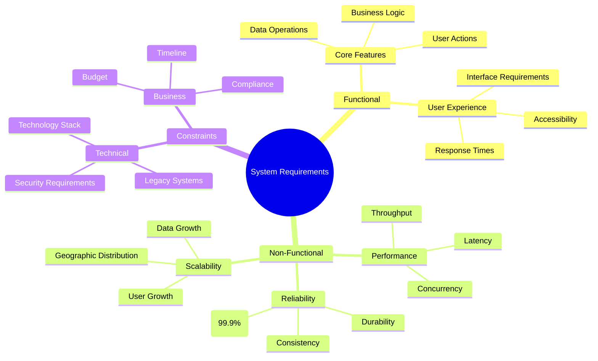
```mermaid
mindmap
  root((System Requirements))
    Functional
      Core Features
        User Actions
        Data Operations
        Business Logic
      User Experience
        Interface Requirements
        Response Times
        Accessibility
    Non-Functional
      Performance
        Throughput
        Latency
        Concurrency
      Reliability
        Availability (99.9%)
        Consistency
        Durability
      Scalability
        User Growth
        Data Growth
        Geographic Distribution
    Constraints
      Technical
        Legacy Systems
        Technology Stack
        Security Requirements
      Business
        Budget
        Timeline
        Compliance
```

#### Advanced Requirement Questions
- **Scale Estimation**: "What's the expected growth rate over 5 years?"
- **Geographic Distribution**: "Are users globally distributed? Any regulatory requirements?"
- **Data Sensitivity**: "What's the impact of data loss/corruption?"
- **Integration Requirements**: "What external systems need integration?"
- **Operational Constraints**: "What's the deployment model? Cloud vs on-premise?"

### Phase 2: Capacity Planning (15-20 minutes)

#### Detailed Capacity Estimation Framework

**Example: Social Media Platform**
```
Users:
- Total Users: 2 billion
- Daily Active Users (DAU): 500 million
- Peak concurrent users: 50 million (10% of DAU)

Content Generation:
- Posts per user per day: 0.5
- Daily posts: 250 million
- Peak posts per second: 250M / (24 * 3600) * 10 = ~29,000 posts/sec

Read Operations:
- Timeline views per user per day: 50
- Daily timeline views: 25 billion
- Peak reads per second: 25B / (24 * 3600) * 10 = ~2.9M reads/sec

Storage:
- Average post size: 500 bytes
- Daily storage: 250M * 500 bytes = 125 GB/day
- Annual storage: 125 GB * 365 = ~46 TB/year
- With replication (3x): 138 TB/year

Bandwidth:
- Peak ingress: 29K posts/sec * 500 bytes = ~14.5 MB/sec
- Peak egress: 2.9M reads/sec * 500 bytes = ~1.45 GB/sec
```

### Phase 3: High-Level Architecture (20-25 minutes)

#### Advanced System Architecture
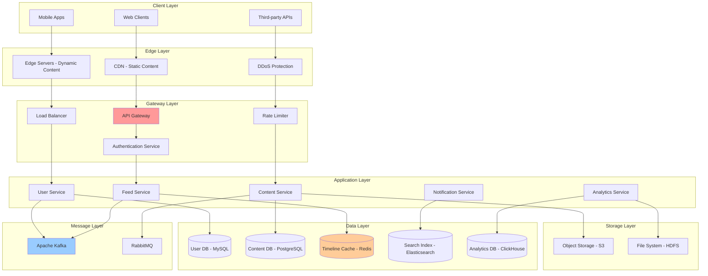
```mermaid
graph TB
    subgraph "Client Layer"
        A1[Web Clients]
        A2[Mobile Apps]
        A3[Third-party APIs]
    end
    
    subgraph "Edge Layer"
        B1[CDN - Static Content]
        B2[Edge Servers - Dynamic Content]
        B3[DDoS Protection]
    end
    
    subgraph "Gateway Layer"
        C1[API Gateway]
        C2[Load Balancer]
        C3[Rate Limiter]
        C4[Authentication Service]
    end
    
    subgraph "Application Layer"
        D1[User Service]
        D2[Content Service]
        D3[Feed Service]
        D4[Notification Service]
        D5[Analytics Service]
    end
    
    subgraph "Data Layer"
        E1[(User DB - MySQL)]
        E2[(Content DB - PostgreSQL)]
        E3[(Timeline Cache - Redis)]
        E4[(Search Index - Elasticsearch)]
        E5[(Analytics DB - ClickHouse)]
    end
    
    subgraph "Message Layer"
        F1[Apache Kafka]
        F2[RabbitMQ]
    end
    
    subgraph "Storage Layer"
        G1[Object Storage - S3]
        G2[File System - HDFS]
    end
    
    A1 --> B1
    A2 --> B2
    A3 --> B3
    
    B1 --> C1
    B2 --> C2
    B3 --> C3
    
    C1 --> C4
    C2 --> D1
    C3 --> D2
    C4 --> D3
    
    D1 --> E1
    D2 --> E2
    D3 --> E3
    D4 --> E4
    D5 --> E5
    
    D1 --> F1
    D2 --> F2
    D3 --> F1
    
    D2 --> G1
    D5 --> G2
    
    style C1 fill:#ff9999
    style F1 fill:#99ccff
    style E3 fill:#ffcc99
```

## Fundamental Concepts Deep Dive

### Database Architecture Patterns

#### Master-Slave Replication with Failover
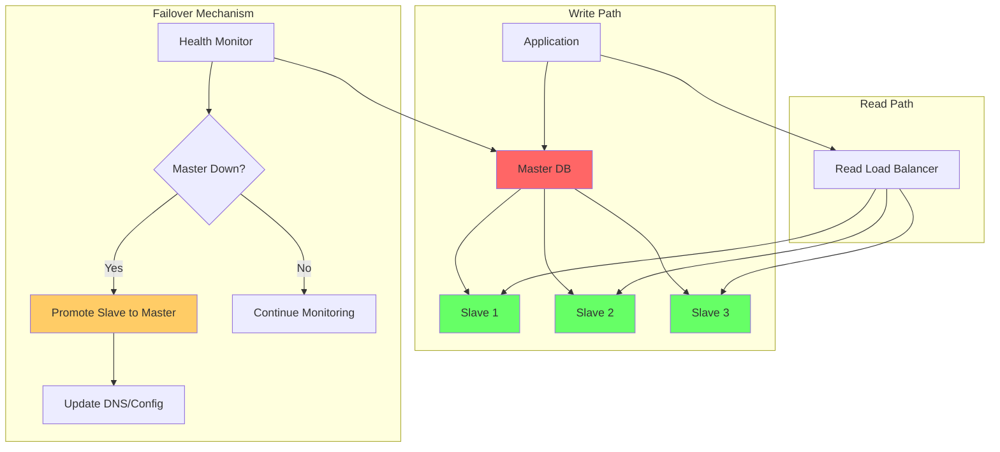
```mermaid
graph TD
    subgraph "Write Path"
        A[Application] --> B[Master DB]
        B --> C[Slave 1]
        B --> D[Slave 2]
        B --> E[Slave 3]
    end
    
    subgraph "Read Path"
        A --> F[Read Load Balancer]
        F --> C
        F --> D
        F --> E
    end
    
    subgraph "Failover Mechanism"
        G[Health Monitor] --> B
        G --> H{Master Down?}
        H -->|Yes| I[Promote Slave to Master]
        H -->|No| J[Continue Monitoring]
        I --> K[Update DNS/Config]
    end
    
    style B fill:#ff6666
    style C fill:#66ff66
    style D fill:#66ff66
    style E fill:#66ff66
    style I fill:#ffcc66
```

#### Advanced Sharding Strategies
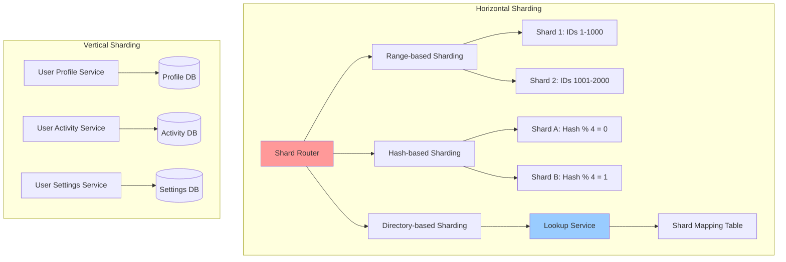
```mermaid
graph TB
    subgraph "Horizontal Sharding"
        A[Shard Router] --> B[Range-based Sharding]
        A --> C[Hash-based Sharding]
        A --> D[Directory-based Sharding]
        
        B --> E[Shard 1: IDs 1-1000]
        B --> F[Shard 2: IDs 1001-2000]
        
        C --> G[Shard A: Hash % 4 = 0]
        C --> H[Shard B: Hash % 4 = 1]
        
        D --> I[Lookup Service]
        I --> J[Shard Mapping Table]
    end
    
    subgraph "Vertical Sharding"
        K[User Profile Service] --> L[(Profile DB)]
        M[User Activity Service] --> N[(Activity DB)]
        O[User Settings Service] --> P[(Settings DB)]
    end
    
    style A fill:#ff9999
    style I fill:#99ccff
```

#### Database Per Service with Distributed Transactions
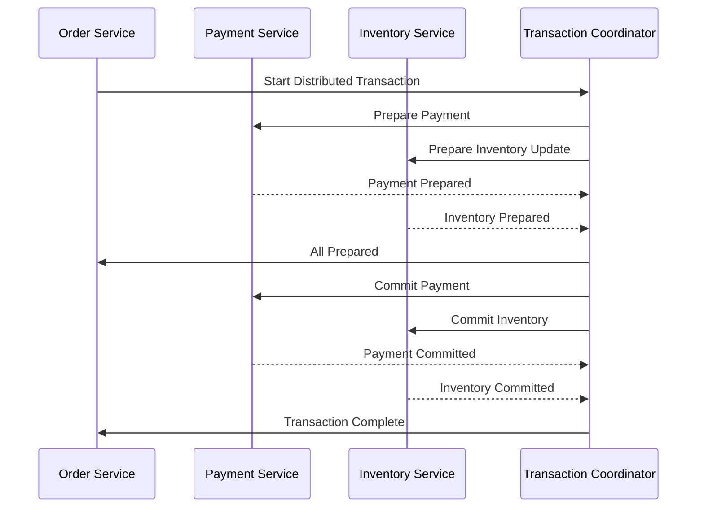
```mermaid
sequenceDiagram
    participant O as Order Service
    participant P as Payment Service
    participant I as Inventory Service
    participant TC as Transaction Coordinator
    
    O->>TC: Start Distributed Transaction
    TC->>P: Prepare Payment
    TC->>I: Prepare Inventory Update
    
    P-->>TC: Payment Prepared
    I-->>TC: Inventory Prepared
    
    TC->>O: All Prepared
    TC->>P: Commit Payment
    TC->>I: Commit Inventory
    
    P-->>TC: Payment Committed
    I-->>TC: Inventory Committed
    TC->>O: Transaction Complete
```

### Advanced Caching Strategies

#### Multi-Level Caching Architecture
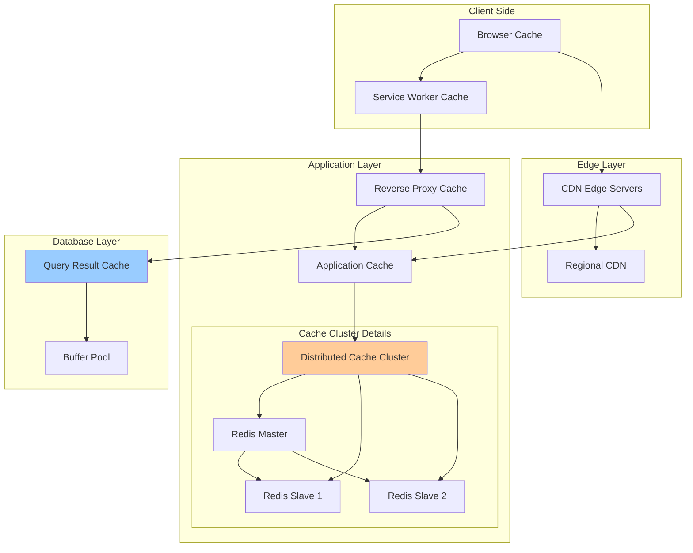
```mermaid
graph TD
    subgraph "Client Side"
        A[Browser Cache] --> B[Service Worker Cache]
    end
    
    subgraph "Edge Layer"
        C[CDN Edge Servers] --> D[Regional CDN]
    end
    
    subgraph "Application Layer"
        E[Reverse Proxy Cache] --> F[Application Cache]
        F --> G[Distributed Cache Cluster]
        
        subgraph "Cache Cluster Details"
            G --> G1[Redis Master]
            G --> G2[Redis Slave 1]
            G --> G3[Redis Slave 2]
            G1 --> G2
            G1 --> G3
        end
    end
    
    subgraph "Database Layer"
        H[Query Result Cache] --> I[Buffer Pool]
    end
    
    A --> C
    B --> E
    C --> F
    E --> H
    
    style G fill:#ffcc99
    style H fill:#99ccff
```

#### Cache Consistency Patterns
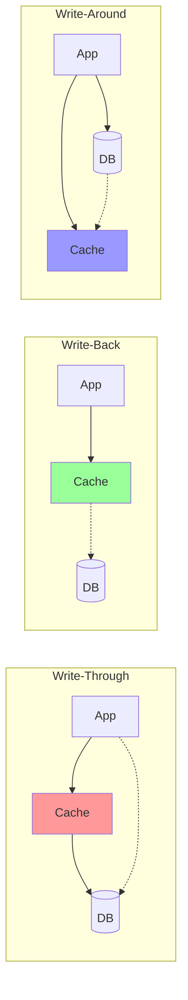
```mermaid
graph LR
    subgraph "Write-Through"
        A1[App] --> B1[Cache]
        B1 --> C1[(DB)]
        A1 -.-> C1
    end
    
    subgraph "Write-Back"
        A2[App] --> B2[Cache]
        B2 -.-> C2[(DB)]
    end
    
    subgraph "Write-Around"
        A3[App] --> C3[(DB)]
        A3 --> B3[Cache]
        C3 -.-> B3
    end
    
    style B1 fill:#ff9999
    style B2 fill:#99ff99
    style B3 fill:#9999ff
```

### Load Balancing Deep Dive

#### Advanced Load Balancing Algorithms
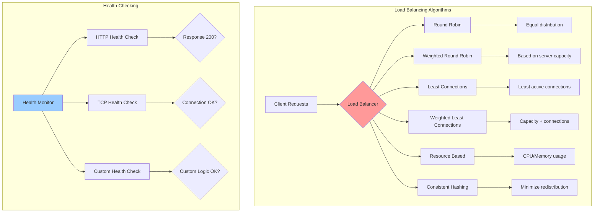
```mermaid
graph TD
    subgraph "Load Balancing Algorithms"
        A[Client Requests] --> B{Load Balancer}
        
        B --> C[Round Robin]
        B --> D[Weighted Round Robin]
        B --> E[Least Connections]
        B --> F[Weighted Least Connections]
        B --> G[Resource Based]
        B --> H[Consistent Hashing]
        
        C --> I[Equal distribution]
        D --> J[Based on server capacity]
        E --> K[Least active connections]
        F --> L[Capacity + connections]
        G --> M[CPU/Memory usage]
        H --> N[Minimize redistribution]
    end
    
    subgraph "Health Checking"
        O[Health Monitor] --> P[HTTP Health Check]
        O --> Q[TCP Health Check]
        O --> R[Custom Health Check]
        
        P --> S{Response 200?}
        Q --> T{Connection OK?}
        R --> U{Custom Logic OK?}
    end
    
    style B fill:#ff9999
    style O fill:#99ccff
```

#### Global Load Balancing with GeoDNS
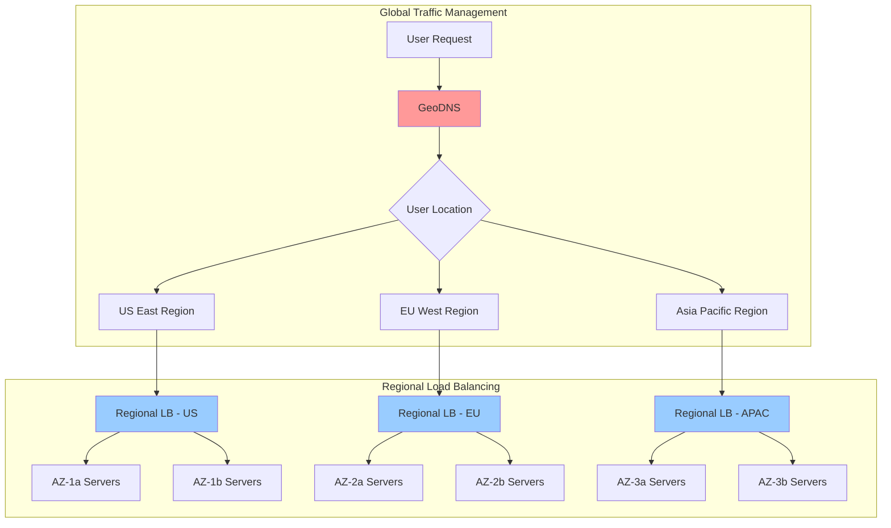
```mermaid
graph TB
    subgraph "Global Traffic Management"
        A[User Request] --> B[GeoDNS]
        B --> C{User Location}
        
        C --> D[US East Region]
        C --> E[EU West Region]
        C --> F[Asia Pacific Region]
    end
    
    subgraph "Regional Load Balancing"
        D --> G[Regional LB - US]
        E --> H[Regional LB - EU]
        F --> I[Regional LB - APAC]
        
        G --> J1[AZ-1a Servers]
        G --> J2[AZ-1b Servers]
        
        H --> K1[AZ-2a Servers]
        H --> K2[AZ-2b Servers]
        
        I --> L1[AZ-3a Servers]
        I --> L2[AZ-3b Servers]
    end
    
    style B fill:#ff9999
    style G fill:#99ccff
    style H fill:#99ccff
    style I fill:#99ccff
```

## Complex System Design Patterns

### Event Sourcing with CQRS
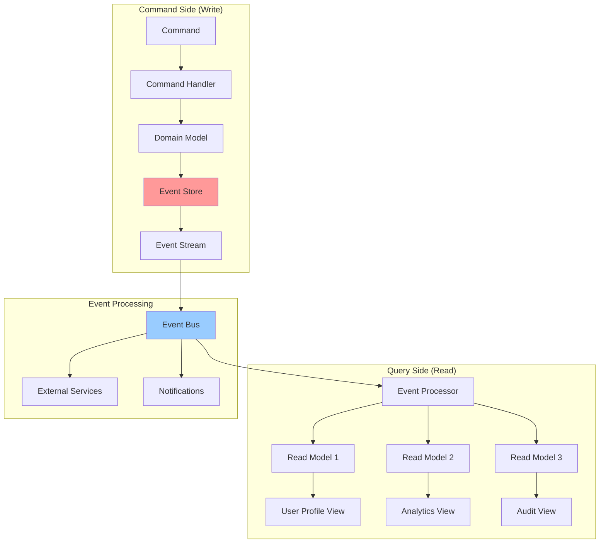
```mermaid
graph TB
    subgraph "Command Side (Write)"
        A[Command] --> B[Command Handler]
        B --> C[Domain Model]
        C --> D[Event Store]
        D --> E[Event Stream]
    end
    
    subgraph "Query Side (Read)"
        F[Event Processor] --> G[Read Model 1]
        F --> H[Read Model 2]
        F --> I[Read Model 3]
        
        G --> J[User Profile View]
        H --> K[Analytics View]
        I --> L[Audit View]
    end
    
    subgraph "Event Processing"
        E --> M[Event Bus]
        M --> F
        M --> N[External Services]
        M --> O[Notifications]
    end
    
    style D fill:#ff9999
    style M fill:#99ccff
```

### Saga Pattern for Distributed Transactions
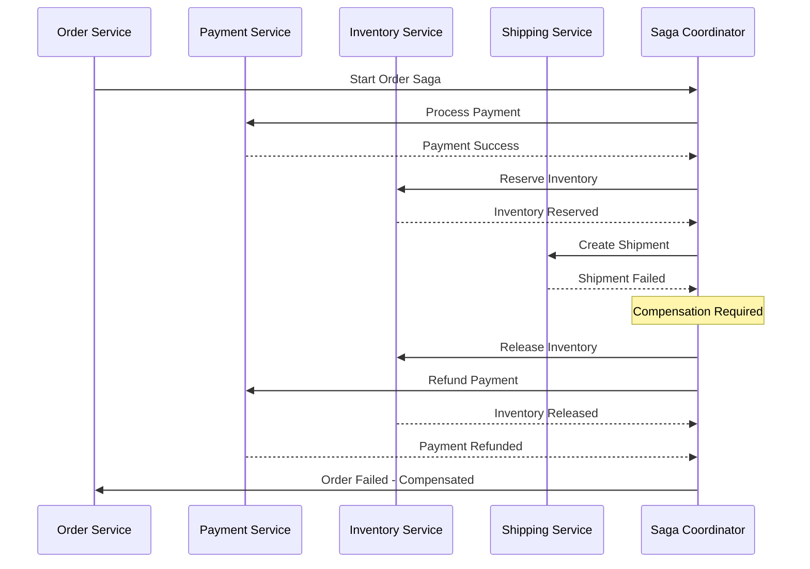
```mermaid
sequenceDiagram
    participant OS as Order Service
    participant PS as Payment Service
    participant IS as Inventory Service
    participant SS as Shipping Service
    participant SC as Saga Coordinator
    
    OS->>SC: Start Order Saga
    SC->>PS: Process Payment
    PS-->>SC: Payment Success
    
    SC->>IS: Reserve Inventory
    IS-->>SC: Inventory Reserved
    
    SC->>SS: Create Shipment
    SS-->>SC: Shipment Failed
    
    Note over SC: Compensation Required
    SC->>IS: Release Inventory
    SC->>PS: Refund Payment
    
    IS-->>SC: Inventory Released
    PS-->>SC: Payment Refunded
    SC->>OS: Order Failed - Compensated
```

### Circuit Breaker Pattern
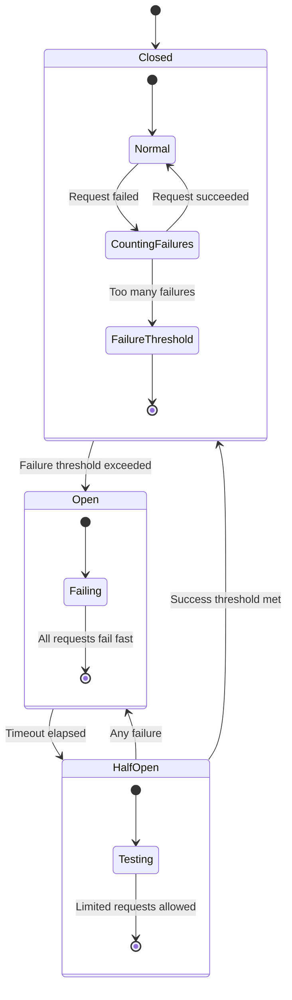
```mermaid
stateDiagram-v2
    [*] --> Closed
    Closed --> Open: Failure threshold exceeded
    Open --> HalfOpen: Timeout elapsed
    HalfOpen --> Closed: Success threshold met
    HalfOpen --> Open: Any failure
    
    state Closed {
        [*] --> Normal
        Normal --> CountingFailures: Request failed
        CountingFailures --> Normal: Request succeeded
        CountingFailures --> FailureThreshold: Too many failures
        FailureThreshold --> [*]
    }
    
    state Open {
        [*] --> Failing
        Failing --> [*]: All requests fail fast
    }
    
    state HalfOpen {
        [*] --> Testing
        Testing --> [*]: Limited requests allowed
    }
```

## Real-World System Designs

### Design Netflix Streaming Service

#### Architecture Overview
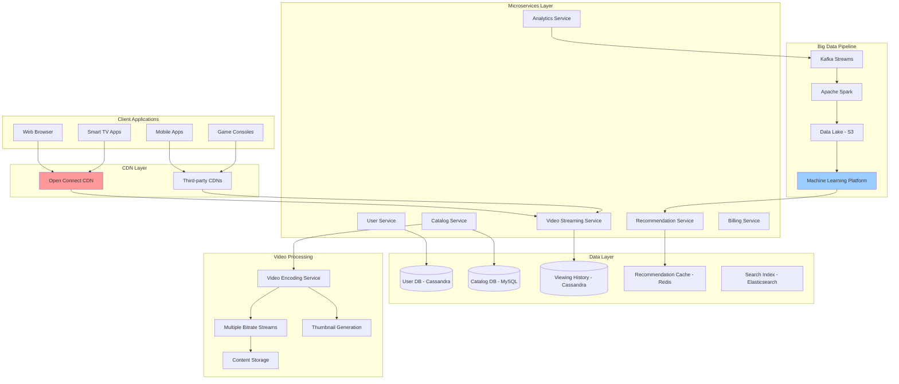
```mermaid
graph TB
    subgraph "Client Applications"
        A1[Web Browser]
        A2[Mobile Apps]
        A3[Smart TV Apps]
        A4[Game Consoles]
    end
    
    subgraph "CDN Layer"
        B1[Open Connect CDN]
        B2[Third-party CDNs]
    end
    
    subgraph "Microservices Layer"
        C1[User Service]
        C2[Catalog Service]
        C3[Recommendation Service]
        C4[Video Streaming Service]
        C5[Billing Service]
        C6[Analytics Service]
    end
    
    subgraph "Data Layer"
        D1[(User DB - Cassandra)]
        D2[(Catalog DB - MySQL)]
        D3[(Viewing History - Cassandra)]
        D4[Recommendation Cache - Redis]
        D5[Search Index - Elasticsearch]
    end
    
    subgraph "Big Data Pipeline"
        E1[Kafka Streams]
        E2[Apache Spark]
        E3[Data Lake - S3]
        E4[Machine Learning Platform]
    end
    
    subgraph "Video Processing"
        F1[Video Encoding Service]
        F2[Multiple Bitrate Streams]
        F3[Thumbnail Generation]
        F4[Content Storage]
    end
    
    A1 --> B1
    A2 --> B2
    A3 --> B1
    A4 --> B2
    
    B1 --> C4
    B2 --> C4
    
    C1 --> D1
    C2 --> D2
    C3 --> D4
    C4 --> D3
    C6 --> E1
    
    E1 --> E2
    E2 --> E3
    E3 --> E4
    E4 --> C3
    
    C2 --> F1
    F1 --> F2
    F1 --> F3
    F2 --> F4
    
    style B1 fill:#ff9999
    style E4 fill:#99ccff
```

#### Video Streaming Deep Dive
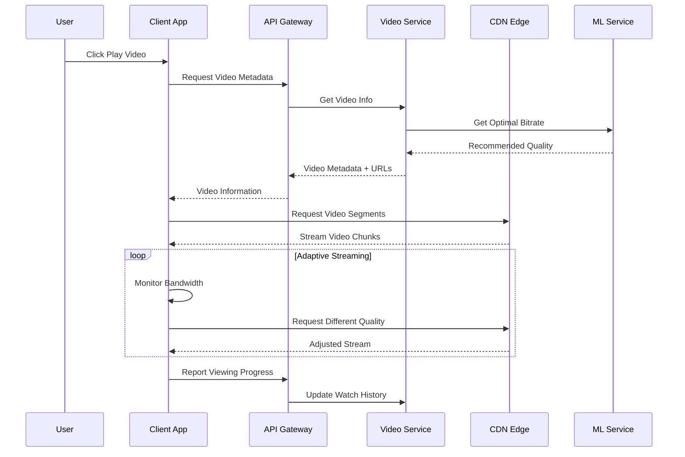
```mermaid
sequenceDiagram
    participant U as User
    participant C as Client App
    participant API as API Gateway
    participant VS as Video Service
    participant CDN as CDN Edge
    participant ML as ML Service
    
    U->>C: Click Play Video
    C->>API: Request Video Metadata
    API->>VS: Get Video Info
    VS->>ML: Get Optimal Bitrate
    ML-->>VS: Recommended Quality
    VS-->>API: Video Metadata + URLs
    API-->>C: Video Information
    
    C->>CDN: Request Video Segments
    CDN-->>C: Stream Video Chunks
    
    loop Adaptive Streaming
        C->>C: Monitor Bandwidth
        C->>CDN: Request Different Quality
        CDN-->>C: Adjusted Stream
    end
    
    C->>API: Report Viewing Progress
    API->>VS: Update Watch History
```

### Design Google Search Engine

#### Search Architecture
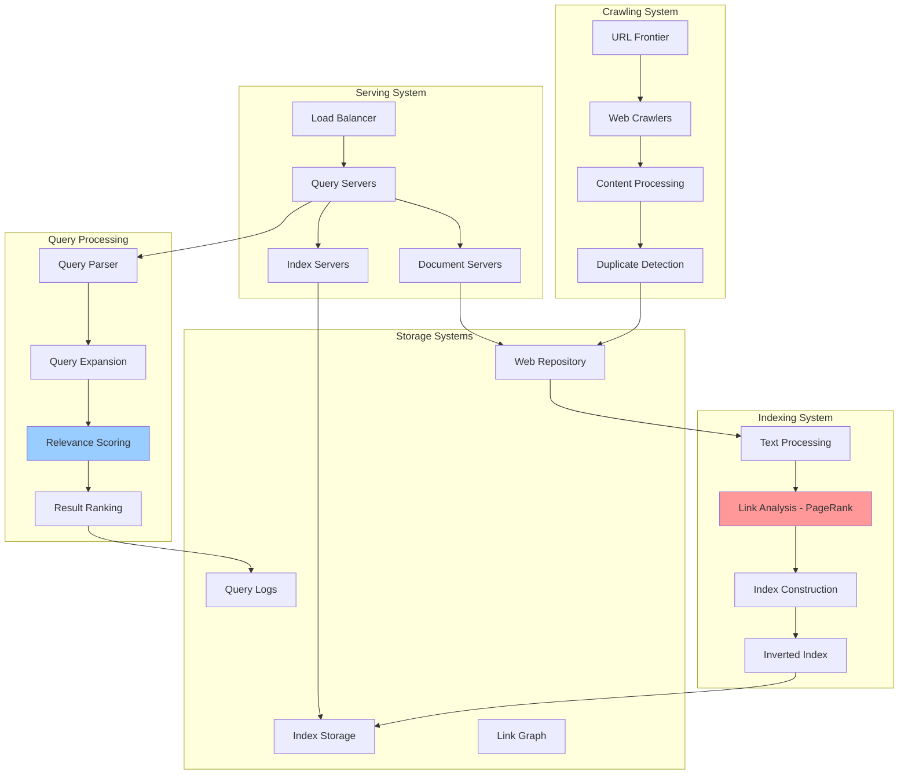
```mermaid
graph TB
    subgraph "Crawling System"
        A1[URL Frontier]
        A2[Web Crawlers]
        A3[Content Processing]
        A4[Duplicate Detection]
    end
    
    subgraph "Indexing System"
        B1[Text Processing]
        B2[Link Analysis - PageRank]
        B3[Index Construction]
        B4[Inverted Index]
    end
    
    subgraph "Query Processing"
        C1[Query Parser]
        C2[Query Expansion]
        C3[Relevance Scoring]
        C4[Result Ranking]
    end
    
    subgraph "Serving System"
        D1[Load Balancer]
        D2[Query Servers]
        D3[Index Servers]
        D4[Document Servers]
    end
    
    subgraph "Storage Systems"
        E1[Web Repository]
        E2[Index Storage]
        E3[Link Graph]
        E4[Query Logs]
    end
    
    A1 --> A2
    A2 --> A3
    A3 --> A4
    A4 --> E1
    
    E1 --> B1
    B1 --> B2
    B2 --> B3
    B3 --> B4
    B4 --> E2
    
    D1 --> D2
    D2 --> C1
    C1 --> C2
    C2 --> C3
    C3 --> C4
    
    D2 --> D3
    D3 --> E2
    D2 --> D4
    D4 --> E1
    
    C4 --> E4
    
    style B2 fill:#ff9999
    style C3 fill:#99ccff
```

#### PageRank Algorithm Flow
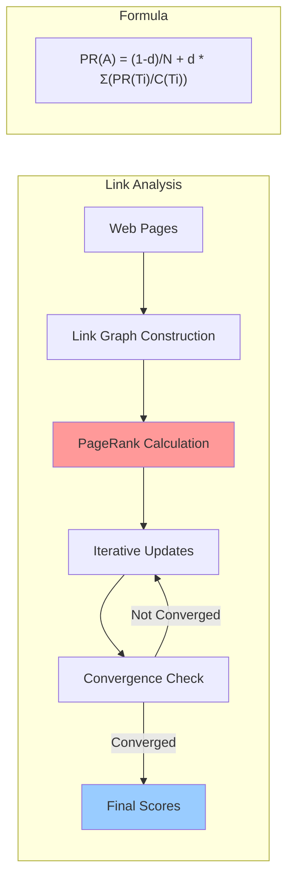
```mermaid
graph LR
    subgraph "Link Analysis"
        A[Web Pages] --> B[Link Graph Construction]
        B --> C[PageRank Calculation]
        C --> D[Iterative Updates]
        D --> E[Convergence Check]
        E -->|Not Converged| D
        E -->|Converged| F[Final Scores]
    end
    
    subgraph "Formula"
        G["PR(A) = (1-d)/N + d * Σ(PR(Ti)/C(Ti))"]
    end
    
    style C fill:#ff9999
    style F fill:#99ccff
```

### Design Uber Ride-Sharing Platform

#### Real-time Architecture
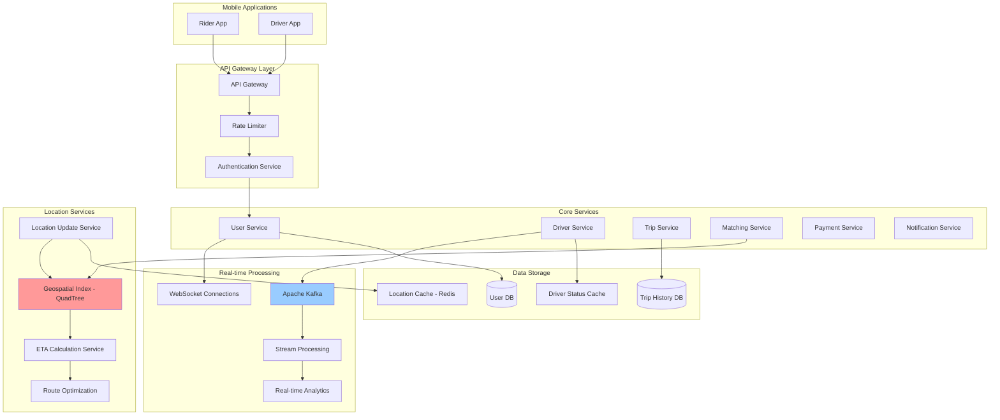
```mermaid
graph TB
    subgraph "Mobile Applications"
        A1[Rider App]
        A2[Driver App]
    end
    
    subgraph "API Gateway Layer"
        B1[API Gateway]
        B2[Rate Limiter]
        B3[Authentication Service]
    end
    
    subgraph "Core Services"
        C1[User Service]
        C2[Driver Service]
        C3[Trip Service]
        C4[Matching Service]
        C5[Payment Service]
        C6[Notification Service]
    end
    
    subgraph "Location Services"
        D1[Location Update Service]
        D2[Geospatial Index - QuadTree]
        D3[ETA Calculation Service]
        D4[Route Optimization]
    end
    
    subgraph "Real-time Processing"
        E1[WebSocket Connections]
        E2[Apache Kafka]
        E3[Stream Processing]
        E4[Real-time Analytics]
    end
    
    subgraph "Data Storage"
        F1[(User DB)]
        F2[(Trip History DB)]
        F3[Location Cache - Redis]
        F4[Driver Status Cache]
    end
    
    A1 --> B1
    A2 --> B1
    B1 --> B2
    B2 --> B3
    B3 --> C1
    
    C4 --> D2
    D1 --> D2
    D2 --> D3
    D3 --> D4
    
    C1 --> E1
    C2 --> E2
    E2 --> E3
    E3 --> E4
    
    C1 --> F1
    C3 --> F2
    D1 --> F3
    C2 --> F4
    
    style D2 fill:#ff9999
    style E2 fill:#99ccff
```

#### Driver-Rider Matching Algorithm
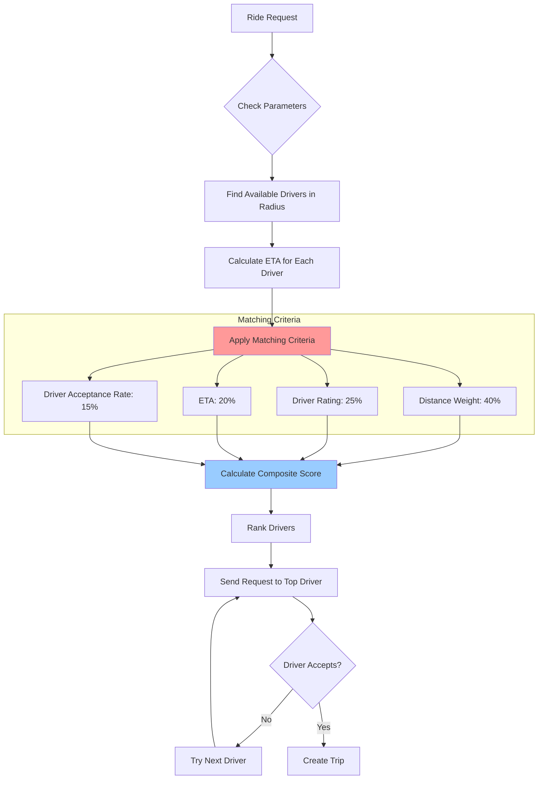
```mermaid
flowchart TD
    A[Ride Request] --> B{Check Parameters}
    B --> C[Find Available Drivers in Radius]
    C --> D[Calculate ETA for Each Driver]
    D --> E[Apply Matching Criteria]
    
    subgraph "Matching Criteria"
        E --> F[Distance Weight: 40%]
        E --> G[Driver Rating: 25%]
        E --> H[ETA: 20%]
        E --> I[Driver Acceptance Rate: 15%]
    end
    
    F --> J[Calculate Composite Score]
    G --> J
    H --> J
    I --> J
    
    J --> K[Rank Drivers]
    K --> L[Send Request to Top Driver]
    L --> M{Driver Accepts?}
    M -->|No| N[Try Next Driver]
    M -->|Yes| O[Create Trip]
    N --> L
    
    style E fill:#ff9999
    style J fill:#99ccff
```

## Advanced Scalability Techniques

### Database Scaling Strategies

#### Read Replicas with Lag Management
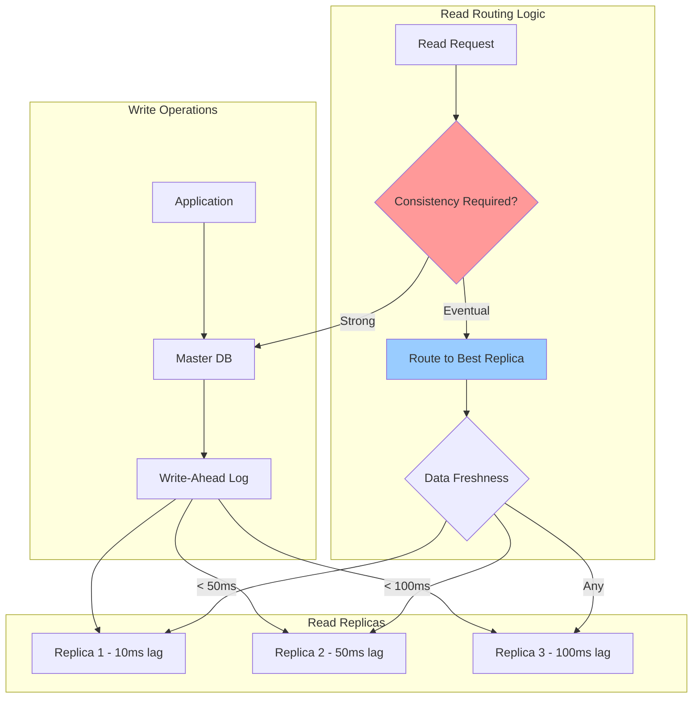
```mermaid
graph TB
    subgraph "Write Operations"
        A[Application] --> B[Master DB]
        B --> C[Write-Ahead Log]
    end
    
    subgraph "Read Replicas"
        C --> D[Replica 1 - 10ms lag]
        C --> E[Replica 2 - 50ms lag]
        C --> F[Replica 3 - 100ms lag]
    end
    
    subgraph "Read Routing Logic"
        G[Read Request] --> H{Consistency Required?}
        H -->|Strong| B
        H -->|Eventual| I[Route to Best Replica]
        
        I --> J{Data Freshness}
        J -->|< 50ms| D
        J -->|< 100ms| E
        J -->|Any| F
    end
    
    style H fill:#ff9999
    style I fill:#99ccff
```

#### Advanced Sharding with Consistent Hashing
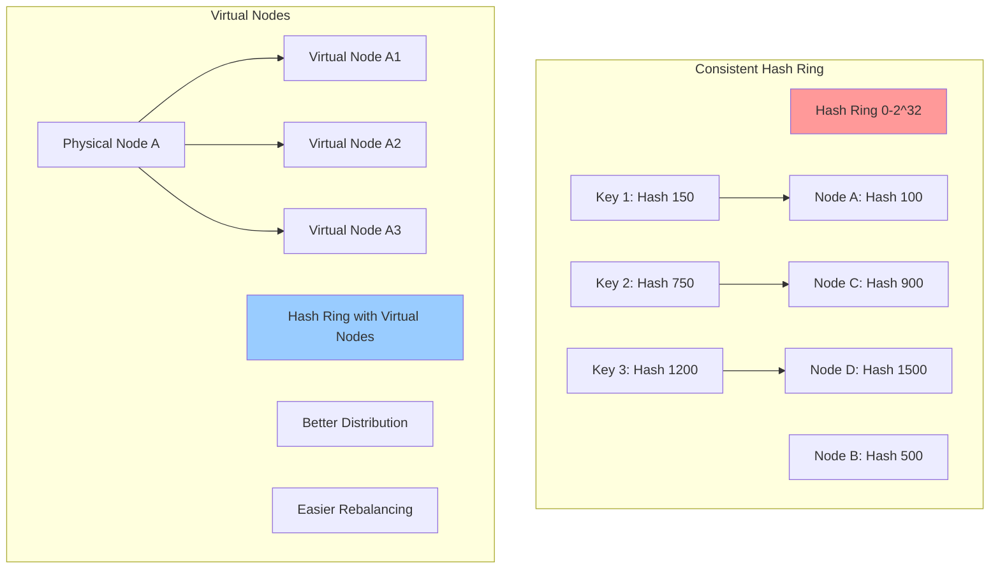
```mermaid
graph TD
    subgraph "Consistent Hash Ring"
        A[Hash Ring 0-2^32]
        B[Node A: Hash 100]
        C[Node B: Hash 500]
        D[Node C: Hash 900]
        E[Node D: Hash 1500]
        
        F[Key 1: Hash 150] --> B
        G[Key 2: Hash 750] --> D
        H[Key 3: Hash 1200] --> E
    end
    
    subgraph "Virtual Nodes"
        I[Physical Node A] --> J[Virtual Node A1]
        I --> K[Virtual Node A2]
        I --> L[Virtual Node A3]
        
        M[Hash Ring with Virtual Nodes]
        N[Better Distribution]
        O[Easier Rebalancing]
    end
    
    style A fill:#ff9999
    style M fill:#99ccff
```

### Microservices Communication Patterns

#### Service Mesh Architecture
```mermaid
graph TB
    subgraph "Service Mesh Control Plane"
        A[Pilot - Configuration]
        B[Citadel - Security]
        C[Galley - Configuration Validation]
        D[Telemetry - Observability]
    end
    
    subgraph "Data Plane"
        E[Service A] --> F[Envoy Proxy A]
        G[Service B] --> H[Envoy Proxy B]
        I[Service C] --> J[Envoy Proxy C]
        
        F <--> H
        H <--> J
        F <--> J
    end
    
    A --> F
    A --> H
    A --> J
    
    B --> F
    B --> H
    B --> J
    
    D --> F
    D --> H
    D --> J
    
    style A fill:#ff9999
    style F fill:#99ccff
    style H fill:#99ccff
    style J fill:#99ccff
```

#### Event-Driven Architecture with Event Streaming
```mermaid
graph TB
    subgraph "Event Producers"
        A[User Service]
        B[Order Service]
        C[Payment Service]
        D[Inventory Service]
    end
    
    subgraph "Event Streaming Platform"
        E[Apache Kafka]
        F[Topic: User Events]
        G[Topic: Order Events]
        H[Topic: Payment Events]
        I[Topic: Inventory Events]
    end
    
    subgraph "Event Consumers"
        J[Analytics Service]
        K[Notification Service]
        L[Audit Service]
        M[Machine Learning Pipeline]
    end
    
    subgraph "Stream Processing"
        N[Apache Flink]
        O[Event Aggregation]
        P[Complex Event Processing]
        Q[Real-time Analytics]
    end
    
    A --> F
    B --> G
    C --> H
    D --> I
    
    F --> E
    G --> E
    H --> E
    I --> E
    
    E --> J
    E --> K
    E --> L
    E --> M
    
    E --> N
    N --> O
    N --> P
    N --> Q
    
    style E fill:#ff9999
    style N fill:#99ccff
```

## Performance Engineering

### Performance Optimization Strategies

#### Application Performance Monitoring (APM)
```mermaid
graph TB
    subgraph "Application Layer"
        A[Application Code] --> B[APM Agent]
        B --> C[Performance Metrics]
        B --> D[Distributed Tracing]
        B --> E[Error Tracking]
    end
    
    subgraph "Infrastructure Layer"
        F[CPU Metrics]
        G[Memory Metrics]
        H[Network Metrics]
        I[Disk I/O Metrics]
    end
    
    subgraph "Database Layer"
        J[Query Performance]
        K[Connection Pool]
        L[Index Usage]
        M[Lock Contention]
    end
    
    subgraph "Monitoring Platform"
        N[Metrics Collector]
        O[Time Series Database]
        P[Dashboard - Grafana]
        Q[Alerting System]
    end
    
    C --> N
    D --> N
    E --> N
    F --> N
    G --> N
    H --> N
    I --> N
    J --> N
    K --> N
    L --> N
    M --> N
    
    N --> O
    O --> P
    O --> Q
    
    style N fill:#ff9999
    style P fill:#99ccff
```

#### Database Query Optimization
```mermaid
graph TB
    subgraph "Query Analysis"
        A[Slow Query Log] --> B[Query Analyzer]
        B --> C[Execution Plan Analysis]
        C --> D[Index Recommendations]
    end
    
    subgraph "Optimization Techniques"
        E[Index Optimization]
        F[Query Rewriting]
        G[Partitioning]
        H[Denormalization]
        I[Materialized Views]
    end
    
    subgraph "Performance Monitoring"
        J[Query Execution Time]
        K[Index Hit Ratio]
        L[Buffer Pool Usage]
        M[Lock Wait Time]
    end
    
    D --> E
    D --> F
    D --> G
    D --> H
    D --> I
    
    E --> J
    F --> K
    G --> L
    H --> M
    
    style B fill:#ff9999
    style E fill:#99ccff
```

### Caching Performance Patterns

#### Multi-Level Cache Hierarchy
```mermaid
graph TD
    subgraph "Cache Hierarchy"
        A[L1: Application Memory] --> B[L2: Local Redis]
        B --> C[L3: Distributed Cache Cluster]
        C --> D[L4: Database Query Cache]
        D --> E[(Database)]
    end
    
    subgraph "Cache Metrics"
        F[Hit Ratio by Level]
        G[Response Time]
        H[Cache Invalidation Rate]
        I[Memory Usage]
    end
    
    subgraph "Cache Strategies"
        J[Cache-Aside]
        K[Write-Through]
        L[Write-Behind]
        M[Refresh-Ahead]
    end
    
    A --> F
    B --> G
    C --> H
    D --> I
    
    style A fill:#ff9999
    style C fill:#99ccff
```

## Reliability & Fault Tolerance

### Distributed System Reliability Patterns

#### Bulkhead Pattern
```mermaid
graph TB
    subgraph "Monolithic Approach - Risk"
        A[Single Thread Pool] --> B[Service A]
        A --> C[Service B - Slow]
        A --> D[Service C]
        
        E[All Services Share Resources]
        F[One Slow Service Affects All]
    end
    
    subgraph "Bulkhead Pattern - Isolated"
        G[Thread Pool A] --> H[Service A]
        I[Thread Pool B] --> J[Service B - Slow]
        K[Thread Pool C] --> L[Service C]
        
        M[Isolated Resources]
        N[Failure Containment]
    end
    
    style A fill:#ff6666
    style G fill:#66ff66
    style I fill:#66ff66
    style K fill:#66ff66
```

#### Chaos Engineering Framework
```mermaid
graph TB
    subgraph "Chaos Engineering Process"
        A[Define Steady State] --> B[Hypothesis Formation]
        B --> C[Design Experiments]
        C --> D[Run Experiments in Production]
        D --> E[Monitor & Measure Impact]
        E --> F[Learn & Improve]
        F --> A
    end
    
    subgraph "Chaos Experiment Types"
        G[Network Failures]
        H[Server Failures]
        I[Database Failures]
        J[Dependency Failures]
        K[Resource Exhaustion]
        L[Security Breaches]
    end
    
    subgraph "Chaos Tools"
        M[Chaos Monkey - AWS EC2]
        N[Gremlin - Comprehensive]
        O[Litmus - Kubernetes]
        P[Chaos Toolkit - Open Source]
    end
    
    C --> G
    C --> H
    C --> I
    C --> J
    C --> K
    C --> L
    
    style A fill:#ff9999
    style D fill:#99ccff
```

### Disaster Recovery Strategies

#### Multi-Region Disaster Recovery
```mermaid
graph TB
    subgraph "Primary Region - US East"
        A[Application Servers] --> B[(Primary Database)]
        A --> C[Local Cache]
        A --> D[Message Queue]
    end
    
    subgraph "Secondary Region - US West"
        E[Standby Servers] --> F[(Replica Database)]
        E --> G[Local Cache]
        E --> H[Message Queue]
    end
    
    subgraph "Disaster Recovery Process"
        I[Health Monitor] --> J{Primary Region Down?}
        J -->|Yes| K[DNS Failover]
        J -->|No| L[Continue Monitoring]
        K --> M[Promote Secondary to Primary]
        M --> N[Update Database Roles]
        N --> O[Redirect Traffic]
    end
    
    subgraph "Data Replication"
        B --> P[Cross-Region Replication]
        P --> F
        D --> Q[Message Replication]
        Q --> H
    end
    
    style I fill:#ff9999
    style K fill:#99ccff
    style P fill:#ffcc99
```

#### Recovery Time & Point Objectives
```mermaid
graph LR
    subgraph "Business Impact Analysis"
        A[Critical Systems] --> B[RTO: 15 minutes]
        C[Important Systems] --> D[RTO: 1 hour]
        E[Standard Systems] --> F[RTO: 4 hours]
        
        A --> G[RPO: 1 minute]
        C --> H[RPO: 15 minutes]
        E --> I[RPO: 1 hour]
    end
    
    subgraph "Recovery Strategies"
        J[Hot Standby] --> B
        K[Warm Standby] --> D
        L[Cold Standby] --> F
        
        M[Continuous Replication] --> G
        N[Frequent Backups] --> H
        O[Daily Backups] --> I
    end
    
    style A fill:#ff6666
    style J fill:#ff9999
    style M fill:#99ccff
```

## Security Architecture

### Zero Trust Security Model
```mermaid
graph TB
    subgraph "Traditional Perimeter Security"
        A[External Network] --> B[Firewall]
        B --> C[Internal Network]
        C --> D[Trusted Resources]
    end
    
    subgraph "Zero Trust Architecture"
        E[User/Device] --> F[Identity Verification]
        F --> G[Policy Engine]
        G --> H[Conditional Access]
        H --> I[Micro-segmentation]
        I --> J[Protected Resources]
        
        K[Continuous Monitoring] --> G
        L[Risk Assessment] --> G
        M[Device Health] --> G
    end
    
    style B fill:#ff6666
    style G fill:#99ccff
    style I fill:#99ff99
```

### Authentication & Authorization Flow
```mermaid
sequenceDiagram
    participant U as User
    participant C as Client App
    participant AG as API Gateway
    participant AS as Auth Service
    participant RS as Resource Service
    participant DB as Database
    
    U->>C: Login Request
    C->>AS: Authenticate (username/password)
    AS->>DB: Verify Credentials
    DB-->>AS: User Details
    AS->>AS: Generate JWT Token
    AS-->>C: Access Token + Refresh Token
    
    C->>AG: API Request + Access Token
    AG->>AS: Validate Token
    AS-->>AG: Token Valid + User Claims
    AG->>AG: Check Authorization Rules
    AG->>RS: Forward Request + User Context
    RS-->>AG: Response
    AG-->>C: API Response
    
    Note over AS: Token Expiration
    C->>AS: Refresh Token Request
    AS-->>C: New Access Token
```

### Data Encryption Architecture
```mermaid
graph TB
    subgraph "Data at Rest Encryption"
        A[Application] --> B[Encryption Service]
        B --> C[Key Management Service]
        B --> D[Encrypted Database]
        B --> E[Encrypted File Storage]
    end
    
    subgraph "Data in Transit Encryption"
        F[Client] --> G[TLS/SSL]
        G --> H[Load Balancer]
        H --> I[Application Servers]
        I --> J[mTLS]
        J --> K[Microservices]
    end
    
    subgraph "Key Management"
        C --> L[Hardware Security Module]
        C --> M[Key Rotation Policy]
        C --> N[Access Control]
        C --> O[Audit Logging]
    end
    
    style C fill:#ff9999
    style G fill:#99ccff
    style L fill:#ffcc99
```

## Monitoring & Observability

### The Three Pillars of Observability

#### Comprehensive Monitoring Stack
```mermaid
graph TB
    subgraph "Metrics Collection"
        A[Application Metrics] --> B[Prometheus]
        C[Infrastructure Metrics] --> B
        D[Custom Business Metrics] --> B
        B --> E[Time Series Database]
    end
    
    subgraph "Logging Pipeline"
        F[Application Logs] --> G[Log Aggregator]
        H[System Logs] --> G
        I[Audit Logs] --> G
        G --> J[Elasticsearch]
        J --> K[Kibana Dashboard]
    end
    
    subgraph "Distributed Tracing"
        L[Request Tracing] --> M[Jaeger/Zipkin]
        M --> N[Trace Analytics]
        M --> O[Performance Insights]
    end
    
    subgraph "Alerting & Visualization"
        E --> P[Grafana]
        J --> P
        M --> P
        P --> Q[Alert Manager]
        Q --> R[PagerDuty/Slack]
    end
    
    style B fill:#ff9999
    style G fill:#99ccff
    style M fill:#ffcc99
```

#### Service Level Objectives (SLOs)
```mermaid
graph TD
    subgraph "SLI Definitions"
        A[Availability SLI] --> B[Uptime / Total Time]
        C[Latency SLI] --> D[Request Duration]
        E[Throughput SLI] --> F[Requests per Second]
        G[Error Rate SLI] --> H[Error / Total Requests]
    end
    
    subgraph "SLO Targets"
        B --> I[99.9% Availability]
        D --> J[95th percentile < 200ms]
        F --> K[> 1000 RPS sustained]
        H --> L[< 0.1% error rate]
    end
    
    subgraph "Error Budget Management"
        I --> M[Error Budget: 43.2 min/month]
        J --> N[Latency Budget: 5% requests]
        K --> O[Capacity Planning]
        L --> P[Quality Gates]
    end
    
    style I fill:#ff9999
    style M fill:#99ccff
```

#### Distributed Tracing Deep Dive
```mermaid
sequenceDiagram
    participant U as User
    participant AG as API Gateway
    participant US as User Service
    participant OS as Order Service
    participant PS as Payment Service
    participant DB as Database
    
    Note over U,DB: Trace ID: abc123
    
    U->>+AG: HTTP Request [Trace: abc123, Span: 1]
    AG->>+US: Get User Info [Trace: abc123, Span: 2, Parent: 1]
    US->>+DB: Query User [Trace: abc123, Span: 3, Parent: 2]
    DB-->>-US: User Data [Span: 3 ends]
    US-->>-AG: User Info [Span: 2 ends]
    
    AG->>+OS: Create Order [Trace: abc123, Span: 4, Parent: 1]
    OS->>+PS: Process Payment [Trace: abc123, Span: 5, Parent: 4]
    PS->>+DB: Payment Record [Trace: abc123, Span: 6, Parent: 5]
    DB-->>-PS: Success [Span: 6 ends]
    PS-->>-OS: Payment Success [Span: 5 ends]
    OS-->>-AG: Order Created [Span: 4 ends]
    AG-->>-U: Success Response [Span: 1 ends]
```

## Trade-offs & Decision Making

### CAP Theorem in Practice
```mermaid
graph TD
    subgraph "CAP Theorem"
        A[Consistency] --> B[All nodes see same data]
        C[Availability] --> D[System operational]
        E[Partition Tolerance] --> F[Works despite network failures]
        
        G[You can only guarantee 2 out of 3]
    end
    
    subgraph "Real-World Examples"
        H[CA Systems] --> I[Traditional RDBMS]
        J[CP Systems] --> K[MongoDB, HBase]
        L[AP Systems] --> M[Cassandra, DynamoDB]
        
        I --> N[ACID Compliance]
        K --> O[Strong Consistency]
        M --> P[Eventual Consistency]
    end
    
    subgraph "Decision Factors"
        Q[Business Requirements] --> R{Consistency Critical?}
        R -->|Yes| S[Choose CP]
        R -->|No| T[Choose AP]
        
        U[Network Reliability] --> V{Partitions Common?}
        V -->|Yes| W[Must have Partition Tolerance]
        V -->|No| X[Can choose CA]
    end
    
    style G fill:#ff9999
    style R fill:#99ccff
```

### Microservices vs Monolith Decision Matrix
```mermaid
graph TB
    subgraph "Factors Favoring Monolith"
        A[Small Team < 10 people]
        B[Simple Domain]
        C[Rapid Prototyping]
        D[Limited Infrastructure Experience]
        E[Strong ACID Requirements]
    end
    
    subgraph "Factors Favoring Microservices"
        F[Large Organization > 50 people]
        G[Complex Domain with Clear Boundaries]
        H[Independent Team Scaling]
        I[Technology Diversity Needs]
        J[Independent Deployment Requirements]
    end
    
    subgraph "Decision Matrix"
        K{Team Size}
        L{Domain Complexity}
        M{Infrastructure Maturity}
        N{Deployment Requirements}
        
        K -->|Small| A
        K -->|Large| F
        
        L -->|Simple| B
        L -->|Complex| G
        
        M -->|Low| D
        M -->|High| I
        
        N -->|Coupled| E
        N -->|Independent| J
    end
    
    style K fill:#ff9999
    style L fill:#99ccff
```

### Database Selection Criteria
```mermaid
graph TD
    subgraph "Relational Databases"
        A[PostgreSQL] --> B[Complex queries, ACID]
        C[MySQL] --> D[Read-heavy, proven scale]
        E[Oracle] --> F[Enterprise features]
    end
    
    subgraph "NoSQL Document"
        G[MongoDB] --> H[Flexible schema, JSON]
        I[CouchDB] --> J[Offline sync, replication]
    end
    
    subgraph "NoSQL Key-Value"
        K[Redis] --> L[Caching, real-time]
        M[DynamoDB] --> N[Serverless, managed]
    end
    
    subgraph "NoSQL Column"
        O[Cassandra] --> P[Time-series, write-heavy]
        Q[HBase] --> R[Hadoop ecosystem]
    end
    
    subgraph "Graph Databases"
        S[Neo4j] --> T[Relationship queries]
        U[Amazon Neptune] --> V[Managed graph]
    end
    
    subgraph "Decision Factors"
        W{Data Structure} --> X[Structured → SQL]
        W --> Y[Semi-structured → Document]
        W --> Z[Relationships → Graph]
        
        AA{Scale Requirements} --> AB[Read Scale → Replicas]
        AA --> AC[Write Scale → Sharding/NoSQL]
        
        AD{Consistency Needs} --> AE[Strong → SQL]
        AD --> AF[Eventual → NoSQL]
    end
    
    style W fill:#ff9999
    style AA fill:#99ccff
    style AD fill:#ffcc99
```

## Advanced Practice Questions

### System Design Interview Questions by Difficulty

#### Senior Level (L5/L6)
1. **Design a Global Content Delivery Network (CDN)**
   - Requirements: 100+ edge locations, 10TB/s bandwidth, smart caching
   - Focus: Geographic routing, cache invalidation, origin failover

2. **Design a Real-time Collaborative Editor (Google Docs)**
   - Requirements: Operational transforms, conflict resolution, 1M concurrent users
   - Focus: CRDT algorithms, WebSocket scaling, state synchronization

3. **Design a Distributed Job Scheduling System**
   - Requirements: Cron-like scheduling, fault tolerance, priority queues
   - Focus: Leader election, task distribution, failure recovery

4. **Design a Multi-tenant SaaS Platform**
   - Requirements: Data isolation, custom domains, billing integration
   - Focus: Tenant isolation strategies, resource allocation, customization

#### Principal/Staff Level (L7/L8)
1. **Design a Global Payment Processing System**
   - Requirements: PCI compliance, fraud detection, multi-currency
   - Focus: Regulatory compliance, risk management, settlement flows

2. **Design a Machine Learning Inference Platform**
   - Requirements: Model versioning, A/B testing, auto-scaling
   - Focus: Model lifecycle, feature stores, serving optimization

3. **Design a Blockchain-based Supply Chain System**
   - Requirements: Immutable records, multi-party consensus, scalability
   - Focus: Consensus mechanisms, privacy, interoperability

4. **Design a Global IoT Data Processing Platform**
   - Requirements: Billions of devices, real-time processing, edge computing
   - Focus: Data ingestion, edge processing, time-series optimization

### Advanced System Design Scenarios

#### High-Frequency Trading System
```mermaid
graph TB
    subgraph "Market Data Feed"
        A[Exchange APIs] --> B[Market Data Aggregator]
        B --> C[Low-Latency Network]
        C --> D[Trading Engine]
    end
    
    subgraph "Trading Engine Core"
        D --> E[Order Book Manager]
        E --> F[Risk Management]
        F --> G[Strategy Execution]
        G --> H[Order Management]
    end
    
    subgraph "Performance Optimizations"
        I[Kernel Bypass Networking]
        J[Custom Hardware - FPGAs]
        K[Co-location with Exchanges]
        L[Memory-mapped Files]
        M[Lock-free Data Structures]
    end
    
    subgraph "Risk & Compliance"
        N[Pre-trade Risk Checks]
        O[Position Limits]
        P[Regulatory Reporting]
        Q[Audit Trail]
    end
    
    D --> I
    E --> J
    F --> N
    G --> O
    H --> P
    
    style D fill:#ff9999
    style I fill:#99ccff
    style N fill:#ffcc99
```

#### Real-time Gaming Platform Architecture
```mermaid
graph TB
    subgraph "Client Layer"
        A[Game Clients] --> B[Connection Manager]
        B --> C[Load Balancer]
    end
    
    subgraph "Game Session Layer"
        C --> D[Session Manager]
        D --> E[Game Room Service]
        E --> F[State Synchronization]
    end
    
    subgraph "Real-time Communication"
        F --> G[WebSocket Gateway]
        G --> H[Message Broker]
        H --> I[UDP Game Protocol]
    end
    
    subgraph "Game Logic"
        J[Physics Engine]
        K[Anti-cheat System]
        L[Matchmaking Service]
        M[Leaderboard Service]
    end
    
    subgraph "Data Layer"
        N[(Game State Store)]
        O[(Player Statistics)]
        P[Session Cache]
    end
    
    E --> J
    F --> K
    D --> L
    M --> O
    F --> N
    G --> P
    
    style G fill:#ff9999
    style H fill:#99ccff
    style K fill:#ffcc99
```

### System Design Anti-Patterns

#### Common Mistakes to Avoid
```mermaid
mindmap
  root((Anti-Patterns))
    Over-Engineering
      Premature Optimization
      Gold Plating
      Analysis Paralysis
      Technology for Technology's Sake
    Under-Engineering
      Ignoring Non-Functional Requirements
      Single Points of Failure
      No Monitoring/Logging
      Inadequate Error Handling
    Architecture Issues
      Distributed Monolith
      Chatty Interfaces
      Shared Database Anti-pattern
      God Service/Object
    Performance Issues
      N+1 Query Problem
      Cache Stampede
      Synchronous Processing
      Blocking I/O Operations
    Reliability Issues
      Cascading Failures
      No Circuit Breakers
      Inadequate Timeout Handling
      Missing Health Checks
```

## Interview Success Strategies

### System Design Interview Framework

#### The SEDA Framework
```mermaid
graph LR
    A[Scope] --> B[Estimate]
    B --> C[Design]
    C --> D[Assess]
    
    subgraph "Scope (10 minutes)"
        A1[Clarify Requirements]
        A2[Define Use Cases]
        A3[Identify Constraints]
    end
    
    subgraph "Estimate (10 minutes)"
        B1[Calculate Scale]
        B2[Storage Requirements]
        B3[Bandwidth Needs]
    end
    
    subgraph "Design (25 minutes)"
        C1[High-level Architecture]
        C2[Detailed Components]
        C3[Data Model]
    end
    
    subgraph "Assess (10 minutes)"
        D1[Identify Bottlenecks]
        D2[Scale Solutions]
        D3[Trade-offs Discussion]
    end
    
    A --> A1
    B --> B1
    C --> C1
    D --> D1
    
    style A fill:#ff9999
    style C fill:#99ccff
```

#### Communication Best Practices
1. **Think Out Loud**: Verbalize your thought process
2. **Ask Questions**: Clarify ambiguous requirements
3. **Start Simple**: Begin with basic design, then add complexity
4. **Use Diagrams**: Visual representations are crucial
5. **Discuss Trade-offs**: Show understanding of engineering decisions
6. **Handle Pushback**: Be prepared to defend and modify your design

### Advanced Topics for Senior+ Interviews

#### Distributed Systems Consensus
```mermaid
sequenceDiagram
    participant L as Leader
    participant F1 as Follower 1
    participant F2 as Follower 2
    participant C as Client
    
    C->>L: Write Request
    L->>L: Append to Log
    L->>F1: Replicate Entry
    L->>F2: Replicate Entry
    
    F1-->>L: ACK
    F2-->>L: ACK
    
    Note over L: Majority ACK received
    L->>L: Commit Entry
    L-->>C: Success Response
    
    L->>F1: Commit Notification
    L->>F2: Commit Notification
```

#### Event Streaming Architecture Patterns
```mermaid
graph TB
    subgraph "Event Sourcing + CQRS"
        A[Command] --> B[Event Store]
        B --> C[Event Stream]
        C --> D[Read Model 1]
        C --> E[Read Model 2]
        C --> F[Read Model 3]
    end
    
    subgraph "Stream Processing"
        G[Raw Events] --> H[Stream Processor]
        H --> I[Aggregated Events]
        H --> J[Filtered Events]
        H --> K[Enriched Events]
    end
    
    subgraph "Event-Driven Microservices"
        L[Service A] --> M[Event Bus]
        N[Service B] --> M
        O[Service C] --> M
        
        M --> P[Event Handler A]
        M --> Q[Event Handler B]
        M --> R[Event Handler C]
    end
    
    style B fill:#ff9999
    style H fill:#99ccff
    style M fill:#ffcc99
```

## Resources for Continuous Learning

### Books (Advanced Level)
- **"Designing Data-Intensive Applications"** by Martin Kleppmann
- **"Building Microservices"** by Sam Newman  
- **"Site Reliability Engineering"** by Google SRE Team
- **"Distributed Systems: Concepts and Design"** by Coulouris
- **"System Design Interview – An insider's guide"** by Alex Xu

### Technical Papers
- **Google**: MapReduce, BigTable, Spanner
- **Amazon**: Dynamo, Aurora
- **Facebook**: TAO, Memcached
- **Netflix**: Chaos Engineering, Microservices
- **Uber**: Schemaless, Real-time Architecture

### Hands-on Learning Platforms
- **AWS Well-Architected Framework**
- **Google Cloud Architecture Center**
- **Microsoft Azure Architecture Patterns**
- **High Scalability Blog**
- **Engineering Blogs**: Netflix, Uber, Airbnb, LinkedIn

### Mock Interview Platforms
- **Pramp**: Free peer-to-peer practice
- **InterviewBit**: Comprehensive system design course
- **Educative.io**: Grokking the System Design Interview
- **LeetCode System Design**: Premium content

---

## Contributing Guidelines

### How to Contribute
1. **Add Real-world Examples**: Share architectures from actual companies
2. **Improve Diagrams**: Create better Mermaid visualizations
3. **Add Performance Metrics**: Include real numbers from production systems
4. **Case Studies**: Document lessons learned from production failures
5. **Interview Experiences**: Share actual interview questions and feedback

### Quality Standards
- All examples should be production-ready
- Include performance implications
- Discuss operational challenges
- Provide multiple solution approaches
- Consider security and compliance requirements

---

## Appendices

### A. Scale Estimation Reference

#### Common Scale Numbers
```
Typical System Scales:
- Small Startup: 1K-10K users
- Growing Company: 10K-100K users  
- Mid-size Company: 100K-1M users
- Large Company: 1M-10M users
- Tech Giant: 10M-1B+ users

Read/Write Ratios:
- Social Media: 100:1
- E-commerce: 10:1
- Banking: 1:1
- Analytics: 1000:1

Storage Growth:
- User data: 1KB-10KB per user
- Social posts: 1KB per post
- Images: 200KB average
- Videos: 100MB average
```

### B. Technology Decision Matrix

#### Database Selection Guide
| Use Case | Technology | Reasoning |
|----------|------------|-----------|
| OLTP with ACID | PostgreSQL | Strong consistency, complex queries |
| High-write volume | Cassandra | Write-optimized, eventual consistency |
| Real-time analytics | ClickHouse | Columnar, optimized for aggregations |
| Session storage | Redis | In-memory, fast access |
| Search functionality | Elasticsearch | Full-text search, analytics |
| Graph relationships | Neo4j | Optimized for traversals |

### C. Performance Benchmarks

#### Latency Numbers Every Engineer Should Know
```
L1 cache reference: 0.5 ns
Branch mispredict: 5 ns
L2 cache reference: 7 ns
Memory reference: 100 ns
Compress 1KB with Snappy: 10,000 ns
Send 1KB over 1 Gbps network: 10,000 ns
Read 4KB randomly from SSD: 150,000 ns
Read 1MB sequentially from memory: 250,000 ns
Round trip within same datacenter: 500,000 ns
Read 1MB sequentially from SSD: 1,000,000 ns
Disk seek: 10,000,000 ns
Read 1MB sequentially from disk: 30,000,000 ns
Send packet CA->Netherlands->CA: 150,000,000 ns
```

This comprehensive guide provides the depth needed for senior-level system design interviews, covering advanced concepts, real-world architectures, and practical engineering decisions that distinguish experienced engineers.