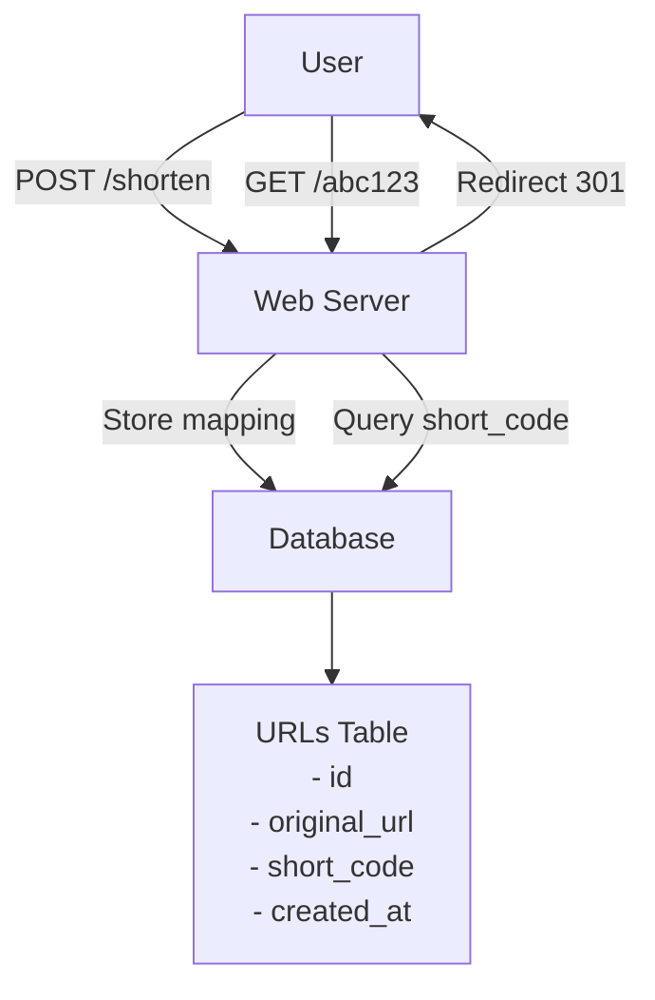
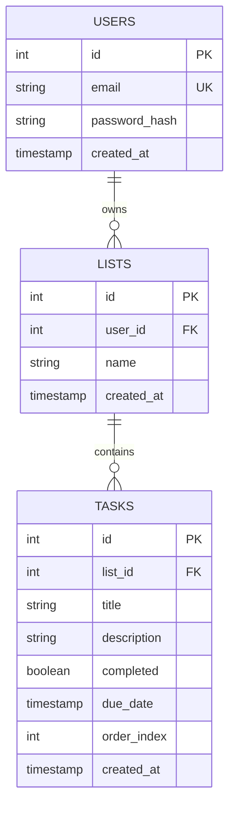
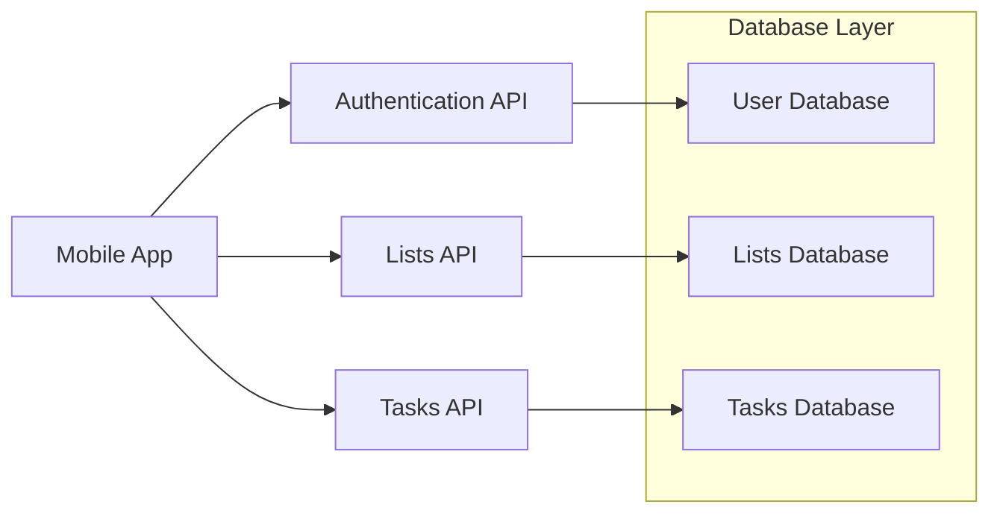
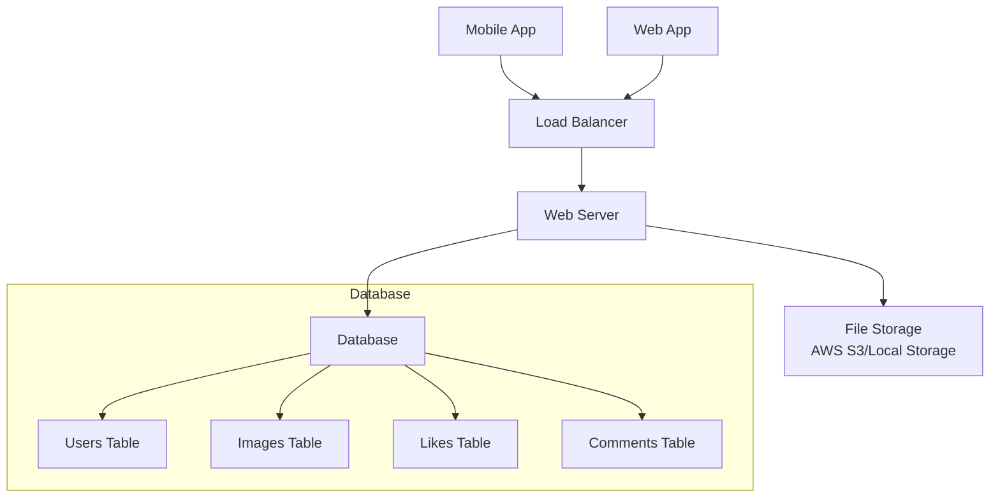
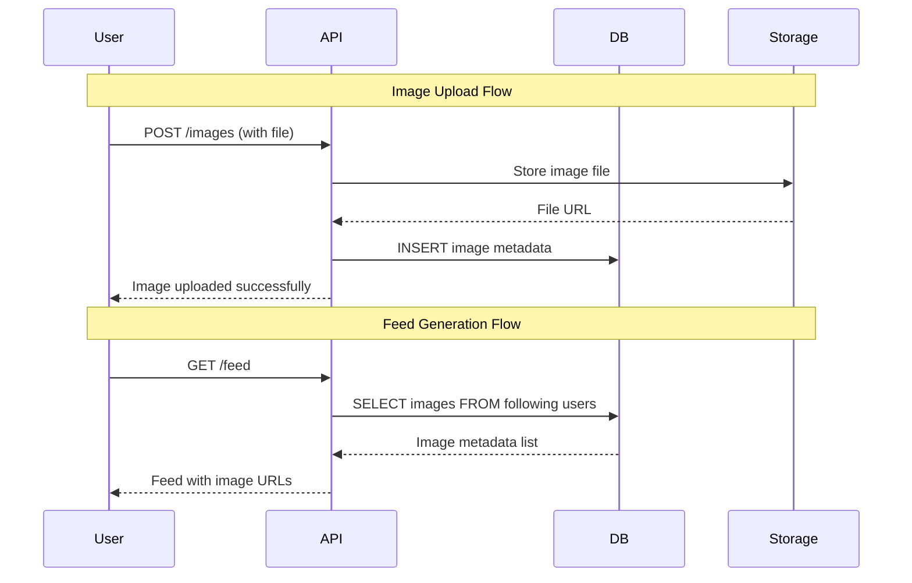
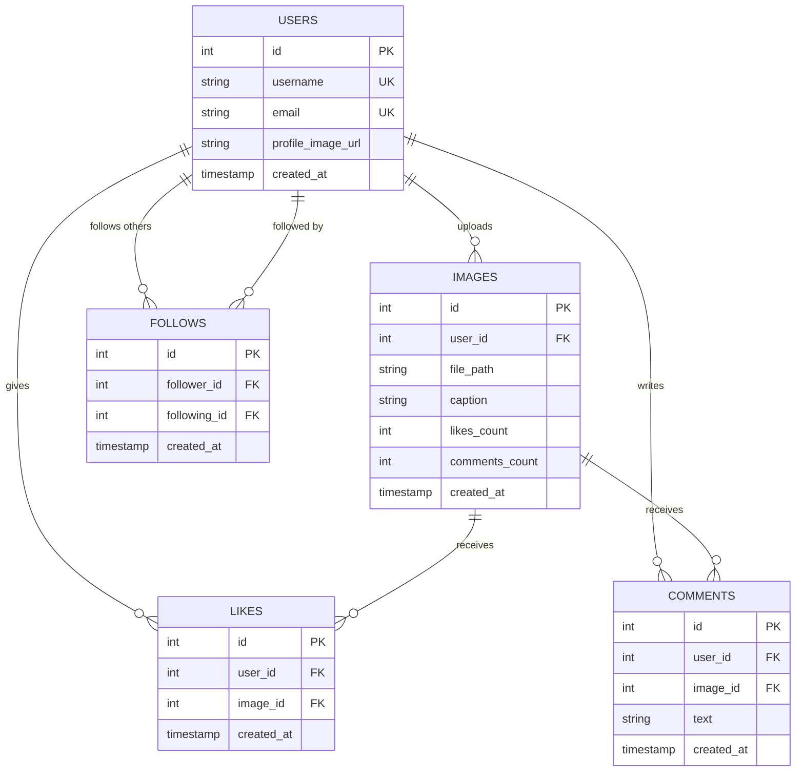
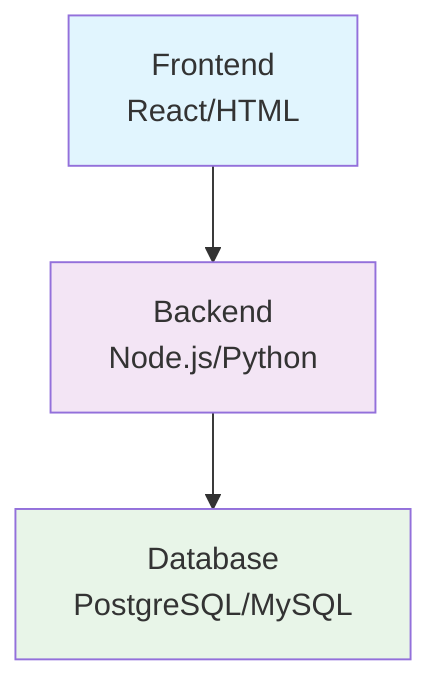
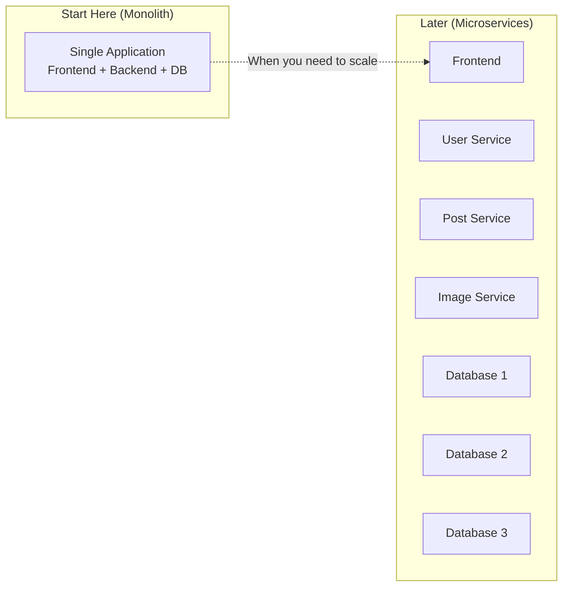
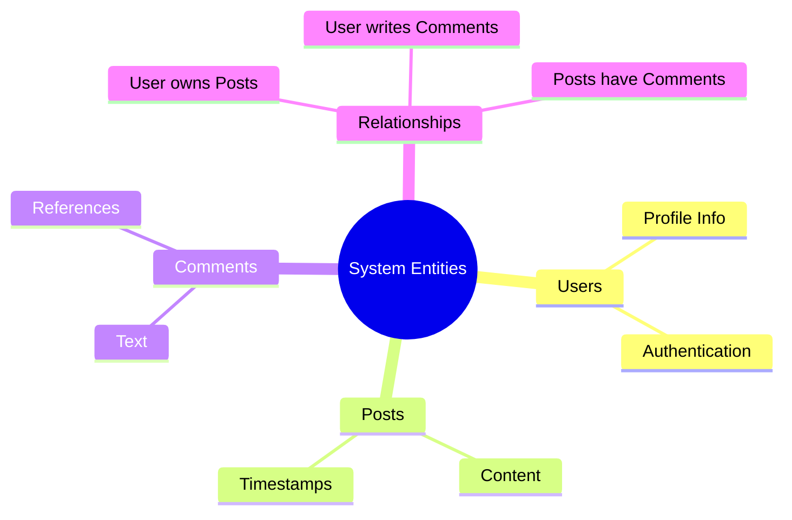
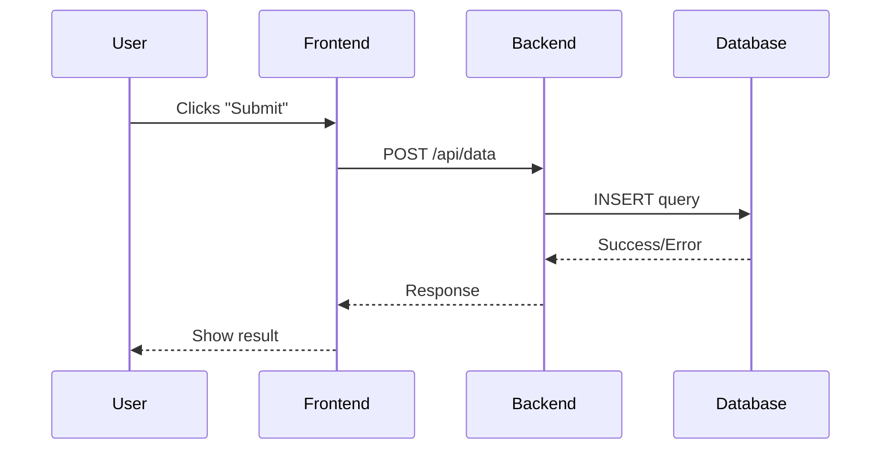

# Junior Engineer System Design Interview Guide

## Table of Contents

1. [Overview](#overview)
2. [Junior Level Expectations](#junior-level-expectations)
3. [Interview Approach](#interview-approach)
4. [Problem Categories](#problem-categories)
5. [Evaluation Framework](#evaluation-framework)
6. [Sample Interview Problems](#sample-interview-problems)
7. [Common Scenarios](#common-scenarios)
8. [Guidance Scripts](#guidance-scripts)
9. [Red Flags & Green Flags](#red-flags--green-flags)
10. [Post-Interview Assessment](#post-interview-assessment)

---

## Overview

### Purpose
This guide provides a structured approach for conducting system design interviews specifically for junior engineer candidates (0-3 years experience). It focuses on foundational concepts while maintaining appropriate expectations for early-career professionals.

### Key Principles
- **Educational Approach:** Treat the interview as a learning opportunity
- **Guided Discovery:** Provide hints and direction when candidates get stuck
- **Foundation Focus:** Emphasize basic concepts over complex distributed systems
- **Practical Application:** Connect concepts to real-world scenarios they might encounter

### Duration & Structure
- **Total Time:** 45-60 minutes
- **Problem Introduction:** 5 minutes
- **Requirements Clarification:** 8-10 minutes
- **Basic Architecture:** 15-20 minutes
- **Implementation Details:** 10-15 minutes
- **Simple Scaling Discussion:** 8-10 minutes
- **Wrap-up:** 5 minutes

---

## Junior Level Expectations

### What to Expect From Junior Candidates

#### Strong Indicators:
- Basic understanding of client-server architecture
- Familiarity with databases (SQL basics)
- Understanding of HTTP and REST APIs
- Knowledge of basic data structures
- Some exposure to web development concepts
- Ability to think through simple user flows

#### Reasonable Expectations:
- May need guidance on where to start
- Might not immediately think about scalability
- Basic understanding of caching concepts
- Simple database design capabilities
- Understanding of basic security principles (authentication)
- Can identify major components of a system

#### What NOT to Expect:
- Deep knowledge of distributed systems
- Complex scaling strategies
- Advanced database optimization
- Microservices architecture expertise
- Load balancing intricacies
- Complex caching strategies

---

## Interview Approach

### Interviewer Mindset
- **Collaborative Coach:** Guide rather than test
- **Patient Educator:** Allow time for thinking and provide hints
- **Encourager:** Celebrate good insights and logical thinking
- **Practical Focus:** Keep discussions grounded in implementation

### Guiding Principles
1. **Start Simple:** Begin with the most basic version
2. **Build Incrementally:** Add complexity gradually
3. **Explain Trade-offs:** Help them understand decisions
4. **Connect to Experience:** Relate to technologies they know
5. **Focus on Fundamentals:** Emphasize core concepts

### When to Provide Hints
- Candidate is completely stuck for >2 minutes
- They're going down an overly complex path
- They miss fundamental components
- They seem overwhelmed by the scope

---

## Problem Categories

### Category 1: CRUD Applications
**Complexity:** Low
**Focus:** Basic operations, simple data modeling
**Examples:** Library management, todo app, basic blog

**Key Learning Areas:**
- Database schema design
- REST API design
- Basic user authentication
- Simple validation

### Category 2: Content Sharing Platforms
**Complexity:** Low-Medium
**Focus:** File handling, user interactions
**Examples:** Image sharing, simple social posts, document storage

**Key Learning Areas:**
- File storage concepts
- User relationships (following/followers)
- Basic feed generation
- Content moderation basics

### Category 3: Real-time Features
**Complexity:** Medium
**Focus:** Event-driven architecture basics
**Examples:** Chat application, notification system, live comments

**Key Learning Areas:**
- WebSockets vs polling
- Message queuing concepts
- Event-driven thinking
- State management

### Category 4: E-commerce Basics
**Complexity:** Medium
**Focus:** Transaction handling, inventory management
**Examples:** Simple online store, booking system, marketplace basics

**Key Learning Areas:**
- Transaction concepts
- Inventory tracking
- Order processing
- Payment integration basics

---

## Evaluation Framework

### Core Competencies (Weighted Scoring)

#### 1. Problem Understanding (25%)
**Excellent (4):**
- Asks relevant clarifying questions
- Identifies key user flows
- Understands problem scope appropriately

**Good (3):**
- Asks some clarifying questions
- Identifies main use cases
- Generally understands the problem

**Needs Improvement (2):**
- Few clarifying questions
- Misses some key aspects
- Basic problem understanding

**Poor (1):**
- No clarifying questions
- Misunderstands core problem
- Unclear on requirements

#### 2. Basic Architecture (30%)
**Excellent (4):**
- Identifies all major components
- Shows clear data flow
- Logical component separation

**Good (3):**
- Identifies most components
- Generally good data flow
- Reasonable architecture

**Needs Improvement (2):**
- Misses some key components
- Unclear data flow
- Basic architectural thinking

**Poor (1):**
- Major components missing
- Confused architecture
- No clear structure

#### 3. Data Modeling (20%)
**Excellent (4):**
- Well-designed database schema
- Good understanding of relationships
- Considers data types appropriately

**Good (3):**
- Adequate schema design
- Basic relationships identified
- Some data modeling knowledge

**Needs Improvement (2):**
- Simple schema with issues
- Limited relationship understanding
- Basic data modeling

**Poor (1):**
- Poor schema design
- No understanding of relationships
- Lacks data modeling basics

#### 4. API Design (15%)
**Excellent (4):**
- Clean, RESTful API design
- Appropriate HTTP methods
- Good request/response structure

**Good (3):**
- Decent API design
- Mostly correct HTTP usage
- Understandable endpoints

**Needs Improvement (2):**
- Basic API design
- Some HTTP method confusion
- Simple endpoint structure

**Poor (1):**
- Poor API design
- Incorrect HTTP usage
- Unclear endpoints

#### 5. Communication & Learning (10%)
**Excellent (4):**
- Clear communication
- Asks good follow-up questions
- Shows learning from hints

**Good (3):**
- Generally clear communication
- Some good questions
- Responsive to guidance

**Needs Improvement (2):**
- Adequate communication
- Few questions
- Somewhat responsive to hints

**Poor (1):**
- Unclear communication
- No engagement
- Doesn't learn from guidance

---

## Sample Interview Problems

### Problem 1: URL Shortener (Recommended for First-Time Candidates)

#### Problem Statement
"Design a URL shortening service like bit.ly. Users should be able to submit long URLs and get back short URLs that redirect to the original."

#### System Architecture Diagram


#### Expected Flow:
1. **Requirements (5 minutes)**
   - What should happen when someone clicks a short URL?
   - How short should the URLs be?
   - Do we need user accounts?
   - Any analytics needed?

2. **Basic Architecture (15 minutes)**
   - Web server to handle requests
   - Database to store URL mappings
   - URL generation algorithm discussion

3. **Database Design (10 minutes)**
   - URLs table (id, original_url, short_code, created_at)
   - Optional: Users table if accounts are needed

4. **API Design (8 minutes)**
   ```mermaid
   sequenceDiagram
       participant User
       participant API
       participant Database
       
       User->>API: POST /shorten<br/>{url: "https://very-long-url.com"}
       API->>Database: INSERT short_code, original_url
       Database-->>API: Success
       API-->>User: {short_url: "bit.ly/abc123"}
       
       User->>API: GET /abc123
       API->>Database: SELECT original_url WHERE short_code='abc123'
       Database-->>API: "https://very-long-url.com"
       API-->>User: HTTP 301 Redirect
   ```

5. **Simple Improvements (7 minutes)**
   - What if we get popular? (caching)
   - How to make short codes unique?

#### Guidance Prompts:
- "What's the main thing our system needs to do?"
- "How would you store the mapping between short and long URLs?"
- "What happens if two people try to shorten the same URL?"

### Problem 2: Personal Todo Application

#### Problem Statement
"Design a todo application where users can create, update, and delete tasks. Users should be able to organize tasks into lists and mark them as complete."

#### Data Model Diagram


#### System Flow Diagram


#### Expected Flow:
1. **Requirements (5 minutes)**
   - User authentication needed?
   - Can tasks have due dates?
   - Should users share lists?
   - Mobile app or web?

2. **Data Modeling (12 minutes)**
   - Users table
   - Lists table (belongs to user)
   - Tasks table (belongs to list)
   - Relationships discussion

3. **API Design (15 minutes)**
   - Authentication endpoints
   - CRUD operations for lists
   - CRUD operations for tasks
   - Task completion endpoints

4. **Basic Features (10 minutes)**
   - How to handle task ordering
   - Search functionality
   - Basic filtering (completed/pending)

5. **Simple Scaling (8 minutes)**
   - What if users have thousands of tasks?
   - Database indexing basics

#### Guidance Prompts:
- "How would you organize the data for this application?"
- "What API endpoints would a mobile app need?"
- "How would you handle user authentication?"

### Problem 3: Basic Image Sharing Platform

#### Problem Statement
"Design a simple image sharing platform where users can upload photos, view them in a feed, and like/comment on images."

#### High-Level Architecture


#### Feed Generation Flow


#### Database Schema


#### Expected Flow:
1. **Requirements (6 minutes)**
   - Image size limits?
   - Public or private profiles?
   - How should the feed work?
   - Image formats supported?

2. **Architecture Overview (12 minutes)**
   - Web application server
   - File storage system
   - Database for metadata
   - Basic feed generation

3. **Data Modeling (12 minutes)**
   - Users table
   - Images table (user_id, file_path, caption, created_at)
   - Likes table (user_id, image_id)
   - Comments table (user_id, image_id, text)

4. **File Handling (8 minutes)**
   - Where to store image files
   - How to generate unique filenames
   - Basic image resizing concepts

5. **Feed Generation (7 minutes)**
   - Simple chronological feed
   - Following relationship basics
   - Basic pagination

#### Guidance Prompts:
- "Where would you store the actual image files?"
- "How would you create a feed of images for a user?"
- "What information do you need to store about each image?"

---

## Common Scenarios

### Scenario 1: Candidate Gets Overwhelmed
**Situation:** Candidate stares at whiteboard, unsure where to start

**Visual Aid - Basic System Components:**


**Response:**
"Let's start with the basics. If you were building this as a simple web application, what would be the main components you'd need? Think about it like a basic website you might have built before."

**Follow-up:**
- "You'd need a way for users to interact with it - that's your frontend"
- "You'd need somewhere to process requests - that's your backend"
- "You'd need somewhere to store data - that's your database"

### Scenario 2: Candidate Jumps to Complex Solutions
**Situation:** Junior candidate immediately discusses microservices or complex caching

**Visual Aid - Evolution from Simple to Complex:**


**Response:**
"Those are great advanced concepts! But let's start with a simpler version first. If you were the only developer building this, how would you structure it as one application?"

**Follow-up:**
- Guide them back to monolithic architecture
- Explain that starting simple is often the right approach
- "We can always break it apart later when needed"

### Scenario 3: Candidate Struggles with Database Design
**Situation:** Can't figure out table structure or relationships

**Visual Aid - Entity Relationship Thinking:**


**Response:**
"Let's think about what information we need to store. What are the main 'things' or 'entities' in this system?"

**Follow-up:**
- Help them identify entities (User, Post, Comment, etc.)
- "What information would you store about each user?"
- "How would you connect a post to the user who created it?"

### Scenario 4: Candidate Gives Minimal Answers
**Situation:** Short responses, not elaborating on solutions

**Visual Aid - User Flow Example:**


**Response:**
"That's a good start! Can you walk me through how that would work? Like, what would happen when a user clicks the button?"

**Follow-up:**
- Ask them to trace through user flows
- "What would the database query look like for that?"
- "How would you handle errors in that process?"

---

## Guidance Scripts

### Opening Script
"Hi [Name]! Today we're going to work on a system design problem together. This isn't about having all the right answers - I'm more interested in seeing how you think through problems and approach building systems. I'll be here to help guide you if you get stuck, so think of this as a collaborative exercise. Ready to get started?"

### Transitioning Between Phases
"Great work on the requirements! Now let's start sketching out what this system might look like at a high level. Don't worry about getting it perfect - we can always refine as we go."

### When Providing Hints
"You're on the right track! Let me give you a hint that might help..." or "Here's something that might be worth considering..."

### Encouraging Responses
"Excellent thinking!" "That's exactly the kind of trade-off consideration I like to see" "Good question - that shows you're thinking about the user experience"

### Wrapping Up
"You've done a great job thinking through this problem! In a real scenario, you'd continue iterating on this design. Do you have any questions about the approach we took or anything you'd like to explore further?"

---

## Red Flags & Green Flags

### Red Flags 🚩

#### Technical Red Flags:
- Cannot design basic database schema
- Doesn't understand HTTP methods
- No concept of client-server architecture
- Cannot explain basic data flow
- Completely unfamiliar with databases
- No understanding of authentication concepts

#### Process Red Flags:
- Doesn't ask any clarifying questions
- Cannot communicate their thinking
- Becomes frustrated with guidance
- Shows no curiosity or learning
- Completely rigid in their approach
- Cannot adapt to feedback

### Green Flags ✅

#### Technical Green Flags:
- Asks good clarifying questions
- Can design simple database schemas
- Understands basic REST principles
- Thinks about user experience
- Shows knowledge of basic web concepts
- Can trace through simple data flows

#### Process Green Flags:
- Communicates thinking clearly
- Responds well to hints and guidance
- Shows curiosity and asks follow-up questions
- Adapts approach based on feedback
- Thinks about edge cases (even simple ones)
- Demonstrates logical problem-solving

#### Exceptional Green Flags:
- Proactively considers error handling
- Thinks about data validation
- Shows awareness of security basics
- Considers user experience implications
- Demonstrates learning during the interview
- Connects concepts to previous experience

---

## Post-Interview Assessment

### Decision Framework

#### Strong Hire (Score: 3.5-4.0)
**Profile:** Exceeded expectations for junior level
- Demonstrated solid foundational knowledge
- Good problem-solving approach
- Clear communication and learning ability
- Would likely succeed with proper mentorship

**Example:** Candidate designed a well-structured system, asked thoughtful questions, and showed good understanding of basic concepts with minimal guidance.

#### Hire (Score: 2.5-3.4)
**Profile:** Met expectations for junior level
- Adequate foundational knowledge
- Reasonable problem-solving with guidance
- Can communicate basic ideas
- Would benefit from mentorship and training

**Example:** Candidate needed some guidance but demonstrated basic understanding and showed ability to learn during the interview.

#### No Hire (Score: 1.5-2.4)
**Profile:** Below expectations for junior level
- Significant gaps in foundational knowledge
- Required extensive guidance
- Communication challenges
- Would need substantial training

**Example:** Candidate struggled with basic concepts even with hints, showed limited understanding of fundamental web development principles.

#### Strong No Hire (Score: <1.5)
**Profile:** Well below expectations
- Major gaps in basic technical knowledge
- Cannot follow guidance or learn during interview
- Poor communication or attitude
- Not ready for junior developer role

### Feedback Template

```markdown
## Junior Engineer System Design Interview

**Candidate:** [Name]
**Interviewer:** [Your Name]  
**Date:** [Date]
**Problem Used:** [Problem Title]

### Scores
- Problem Understanding: [1-4] / 4
- Basic Architecture: [1-4] / 4  
- Data Modeling: [1-4] / 4
- API Design: [1-4] / 4
- Communication & Learning: [1-4] / 4
- **Weighted Average:** [Score] / 4

### Key Strengths
- [Specific examples of good responses]
- [Notable insights or questions]
- [Evidence of learning during interview]

### Areas for Development  
- [Specific technical gaps observed]
- [Concepts that needed significant guidance]
- [Skills that would benefit from mentorship]

### Interview Highlights
- **Best Moment:** [Specific example of strong performance]
- **Learning Moment:** [How they responded to guidance/hints]
- **Problem-Solving Approach:** [How they tackled challenges]

### Recommendation
- [ ] Strong Hire - Exceeded junior level expectations
- [ ] Hire - Met junior level expectations  
- [ ] No Hire - Below junior level expectations
- [ ] Strong No Hire - Well below expectations

### Mentorship Needs (if hired)
- [ ] Database design fundamentals
- [ ] API design best practices
- [ ] System architecture basics
- [ ] Communication and technical discussion
- [ ] Problem-solving methodology

### Additional Notes
[Any other relevant observations or specific examples]
```

### Calibration for Junior Interviews

#### Remember the Context:
- **Experience Level:** 0-3 years, often new graduates
- **Knowledge Scope:** Academic + limited professional experience
- **Learning Curve:** High potential for growth with guidance
- **Expectations:** Foundation over depth, potential over polish

#### Common Calibration Mistakes:
- Expecting senior-level system design knowledge
- Not providing enough guidance during the interview
- Focusing too much on specific technology knowledge
- Underestimating the importance of foundational concepts
- Not accounting for nervousness in junior candidates

---


*Version: 1.0*
*Owner: Ritahchanger*
*Next: [Senior Engineer Guide](./senior-guide.md)*