# Senior Engineer System Design Interview Guide

## Table of Contents

1. [Overview](#overview)
2. [Senior Level Expectations](#senior-level-expectations)
3. [Interview Approach](#interview-approach)
4. [Problem Categories](#problem-categories)
5. [Evaluation Framework](#evaluation-framework)
6. [Sample Interview Problems](#sample-interview-problems)
7. [Advanced Topics Deep Dive](#advanced-topics-deep-dive)
8. [Common Scenarios](#common-scenarios)
9. [Evaluation Rubric](#evaluation-rubric)
10. [Post-Interview Assessment](#post-interview-assessment)

---

## Overview

### Purpose
This guide provides a structured approach for conducting system design interviews specifically for senior engineer candidates (5+ years experience). It builds upon the foundational concepts covered in the [Junior Engineer Guide](./junior-guide.md) and focuses on advanced distributed systems, scalability, and architectural decision-making.

### Key Differences from Junior Interviews
- **Depth over Breadth:** Expect deep technical discussions
- **Trade-off Analysis:** Focus on architectural decisions and their implications
- **Production Experience:** Leverage real-world system building experience
- **Leadership Perspective:** Consider team and organizational impacts
- **Minimal Guidance:** Candidates should drive the conversation independently

### Duration & Structure
- **Total Time:** 60 minutes
- **Problem Introduction:** 5 minutes
- **Requirements & Constraints:** 10 minutes
- **High-Level Architecture:** 15 minutes
- **Deep Dive & Scaling:** 25 minutes
- **Wrap-up & Advanced Topics:** 5 minutes

---

## Senior Level Expectations

### What to Expect From Senior Candidates

#### Core Technical Competencies:
- Deep understanding of distributed systems principles
- Experience with microservices architecture and trade-offs
- Knowledge of database scaling strategies (sharding, replication, partitioning)
- Understanding of caching layers and strategies
- Experience with message queues and event-driven architectures
- Knowledge of load balancing and service discovery
- Understanding of CAP theorem and consistency models

#### Advanced Concepts:
- Circuit breaker and bulkhead patterns
- Distributed consensus algorithms (Raft, Paxos basics)
- Event sourcing and CQRS patterns
- Service mesh and API gateway patterns
- Observability (logging, monitoring, distributed tracing)
- Security at scale (OAuth, JWT, API security)
- Performance optimization techniques

#### System Design Capabilities:
- Can design systems handling millions of users
- Understands data partitioning strategies
- Can identify and resolve bottlenecks
- Knows when to use different consistency models
- Can design for disaster recovery
- Understands cost implications of architectural decisions

---

## Interview Approach

### Interviewer Mindset
- **Technical Peer:** Engage as an equal discussing complex problems
- **Challenge Appropriately:** Push on areas of expertise and experience
- **Evaluate Decision-Making:** Focus on reasoning behind choices
- **Real-World Context:** Connect to production system challenges

### Key Focus Areas
1. **Architectural Thinking:** How do they decompose complex problems?
2. **Scale Considerations:** Do they proactively think about bottlenecks?
3. **Trade-off Analysis:** Can they articulate pros/cons of decisions?
4. **Production Readiness:** Do they consider operational concerns?
5. **Team Impact:** How would they implement and communicate these systems?

### When to Deep Dive
- Candidate mentions specific technologies or patterns
- They make interesting architectural decisions
- You want to test depth in their areas of claimed expertise
- They propose solutions that seem over-engineered or under-engineered

---

## Problem Categories

### Category 1: High-Scale Web Services
**Complexity:** High
**Focus:** Massive scale, global distribution, complex caching
**Examples:** Social media platform, search engine, video streaming

**Key Challenges:**
- Handling billions of requests
- Global latency optimization
- Content delivery at scale
- Real-time features with scale

### Category 2: Distributed Data Systems
**Complexity:** Very High
**Focus:** Data consistency, partitioning, distributed transactions
**Examples:** Distributed database, analytics platform, financial system

**Key Challenges:**
- Data consistency across regions
- Distributed transactions
- Real-time analytics on big data
- Regulatory compliance

### Category 3: Event-Driven Architectures
**Complexity:** High
**Focus:** Asynchronous processing, event sourcing, workflow orchestration
**Examples:** Payment processing, order fulfillment, IoT data processing

**Key Challenges:**
- Event ordering and delivery guarantees
- Saga patterns for distributed transactions
- Dead letter queues and error handling
- Event schema evolution

### Category 4: Platform & Infrastructure
**Complexity:** Very High
**Focus:** Multi-tenancy, developer platforms, infrastructure abstraction
**Examples:** Cloud platform, CI/CD system, container orchestration

**Key Challenges:**
- Multi-tenant architecture
- Resource isolation and quotas
- API versioning and backwards compatibility
- Infrastructure as code

---

## Sample Interview Problems

### Problem 1: Design a Global Social Media Feed

#### Problem Statement
"Design the backend for a social media platform like Twitter/X that serves 500 million daily active users globally. Focus on the feed generation system that shows users posts from people they follow."

#### System Architecture Overview
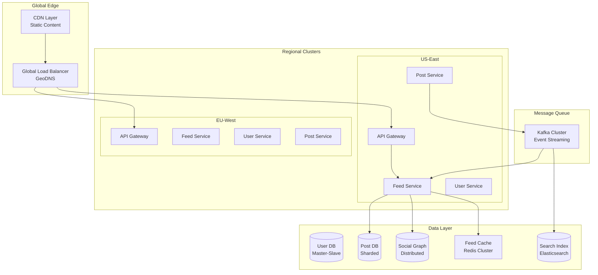

#### Expected Deep Dive Areas:

**1. Feed Generation Strategies (10 minutes)**
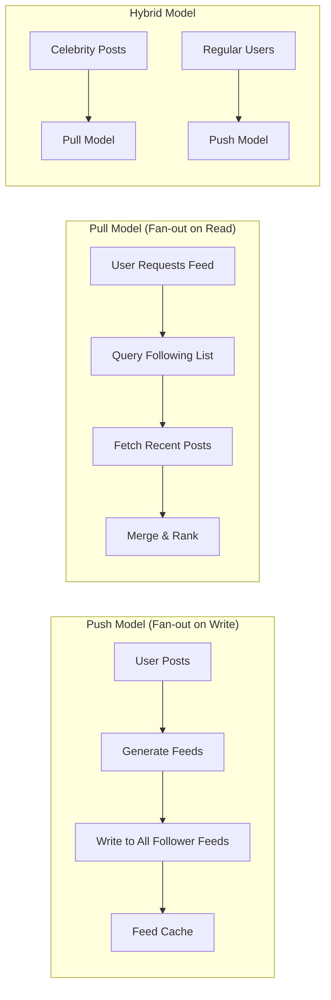

**Key Discussion Points:**
- Trade-offs between push/pull/hybrid models
- How to handle celebrities with millions of followers
- Timeline consistency vs performance
- Caching strategies at different layers

**2. Data Sharding Strategy (8 minutes)**
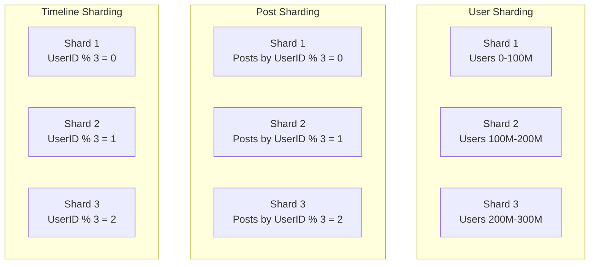

**3. Consistency and Availability (7 minutes)**
- CAP theorem application
- Eventual consistency for social graphs
- Strong consistency for financial operations (ads)
- Circuit breaker patterns for service failures

### Problem 2: Design a Distributed Payment Processing System

#### Problem Statement
"Design a payment processing system that can handle 100,000 transactions per second globally, ensuring strong consistency, fraud detection, and regulatory compliance across different regions."

#### High-Level Architecture
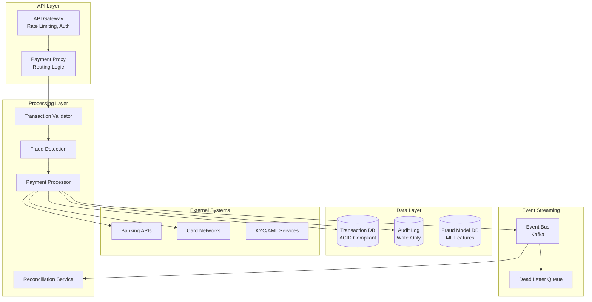

#### Transaction Flow Sequence
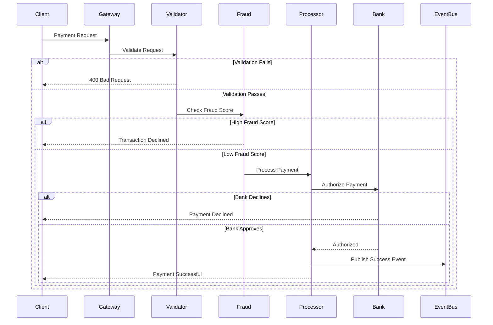

#### Expected Deep Dive Areas:

**1. ACID Guarantees & Distributed Transactions (10 minutes)**
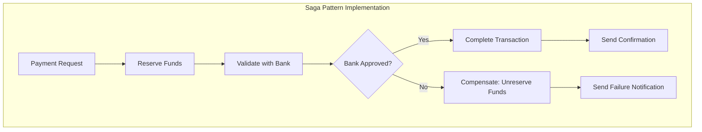

**2. Fraud Detection Pipeline (8 minutes)**
- Real-time ML model serving
- Feature engineering pipeline
- A/B testing for fraud models
- Feedback loops for model improvement

**3. Regulatory Compliance (7 minutes)**
- Data residency requirements
- Audit trail completeness
- PCI DSS compliance
- Cross-border transaction handling

### Problem 3: Design a Real-time Analytics Platform

#### Problem Statement
"Design a real-time analytics platform that can ingest 10 million events per second, provide sub-second query responses, and support both streaming and batch analytics for business intelligence."

#### System Architecture
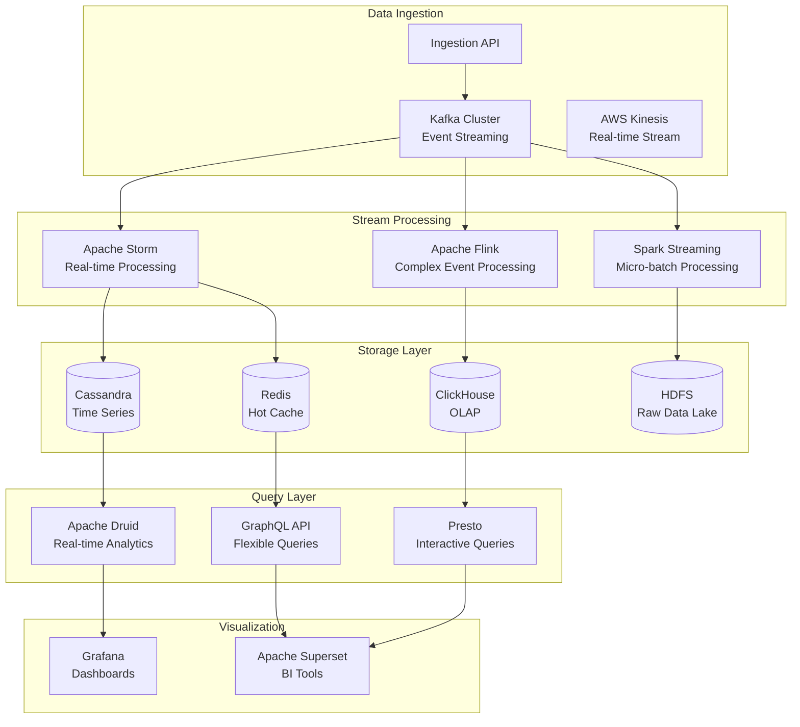

#### Data Pipeline Flow
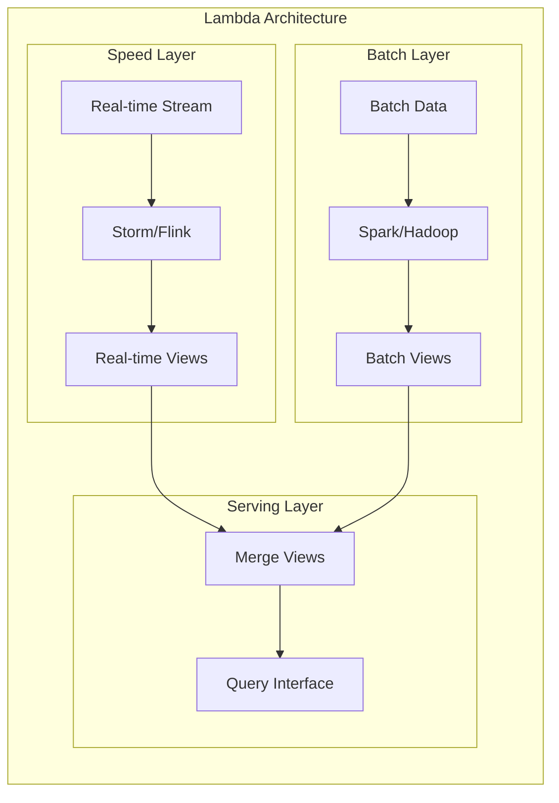

---

## Advanced Topics Deep Dive

### Distributed Systems Patterns

#### Circuit Breaker Pattern
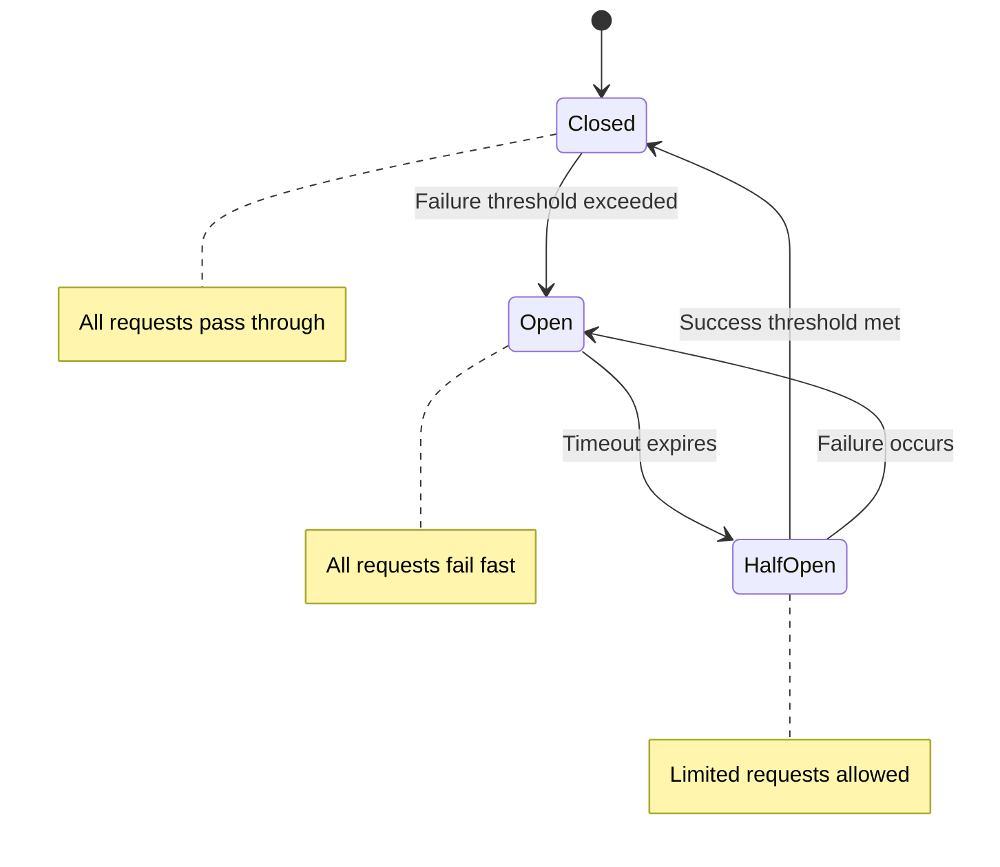

#### Saga Pattern for Distributed Transactions
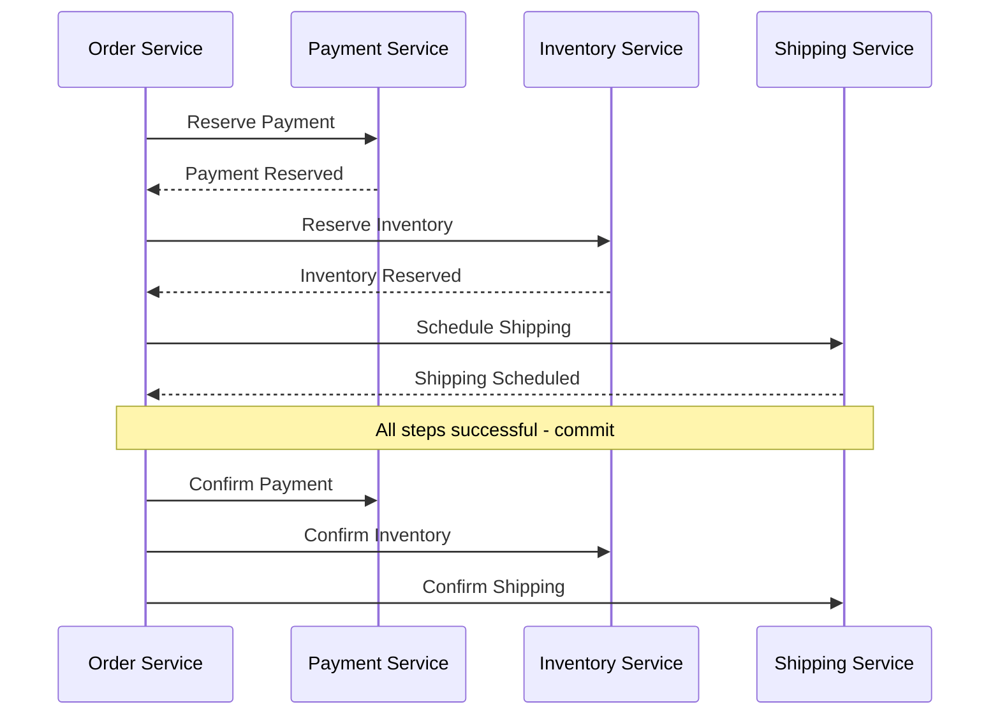

### Caching Strategies at Scale

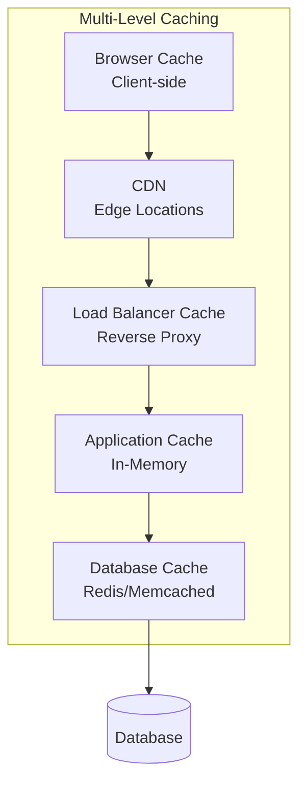

### Data Consistency Models

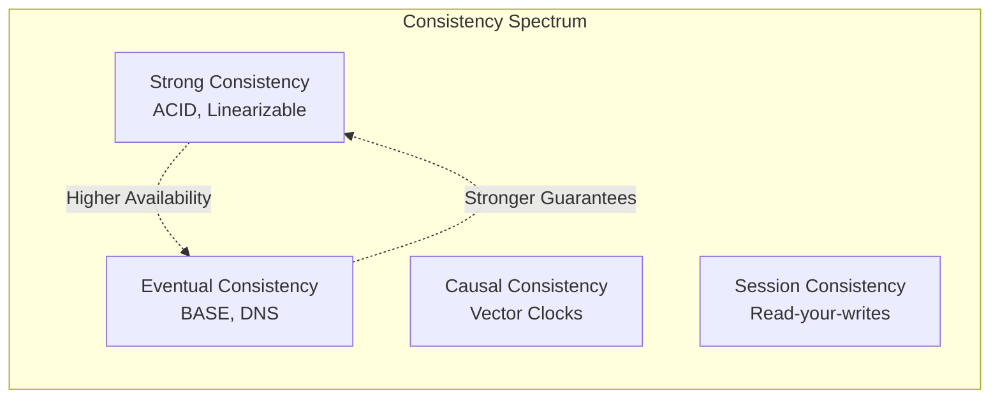

---

## Common Scenarios

### Scenario 1: Candidate Proposes Over-Engineered Solution
**Situation:** Candidate immediately jumps to complex microservices for a simple problem

**Response:**
"That's an interesting approach. Can you walk me through why you chose microservices for this scale? What are the trade-offs you're considering?"

**Follow-up Questions:**
- "How would you handle the operational complexity?"
- "What's your strategy for service discovery and inter-service communication?"
- "How would you ensure data consistency across services?"

### Scenario 2: Candidate Shows Deep Expertise in One Area
**Situation:** Candidate demonstrates strong knowledge in databases but weak in distributed systems

**Response:**
"I can see you have strong database expertise. Let's explore how this would work when we have multiple data centers and network partitions."

**Probe Areas:**
- How do they handle distributed consensus?
- Understanding of CAP theorem implications
- Network failure handling strategies

### Scenario 3: Candidate Gives Textbook Answers
**Situation:** Candidate recites theoretical concepts without practical considerations

**Response:**
"Those concepts are correct. In your experience building production systems, what challenges have you encountered with [specific concept]?"

**Follow-up:**
- "How did you debug performance issues in [their technology]?"
- "What monitoring and alerting did you set up?"
- "How did you handle the operational aspects?"

---

## Evaluation Rubric

### Technical Architecture (30%)

**Excellent (4):**
- Designs well-structured, scalable architecture
- Makes appropriate technology choices with clear reasoning
- Considers multiple architectural patterns and chooses appropriately
- Shows deep understanding of system trade-offs

**Good (3):**
- Solid architectural design with minor gaps
- Good technology choices with adequate reasoning
- Shows understanding of common patterns
- Considers most important trade-offs

**Needs Improvement (2):**
- Basic architecture with some significant issues
- Limited reasoning for technology choices
- Basic understanding of patterns
- Misses important trade-offs

**Poor (1):**
- Poorly designed architecture
- Inappropriate technology choices
- Little understanding of architectural patterns
- No consideration of trade-offs

### Scalability & Performance (25%)

**Excellent (4):**
- Proactively identifies bottlenecks and scaling challenges
- Proposes appropriate scaling strategies (horizontal, vertical, functional)
- Shows deep understanding of performance optimization
- Considers cost implications of scaling decisions

**Good (3):**
- Identifies most scaling challenges
- Proposes reasonable scaling strategies
- Good understanding of performance considerations
- Some awareness of cost implications

**Needs Improvement (2):**
- Identifies obvious bottlenecks
- Basic scaling strategies
- Limited performance optimization knowledge
- Little cost consideration

**Poor (1):**
- Misses key scalability issues
- Inappropriate or no scaling strategies
- Poor performance understanding
- No cost awareness

### Distributed Systems Knowledge (20%)

**Excellent (4):**
- Deep understanding of distributed systems principles
- Correctly applies concepts like CAP theorem, consensus, partitioning
- Shows experience with distributed system challenges
- Understands consistency models and their trade-offs

**Good (3):**
- Good understanding of distributed systems basics
- Correctly applies most concepts
- Shows some distributed system experience
- Understands common consistency models

**Needs Improvement (2):**
- Basic distributed systems knowledge
- Limited application of concepts
- Little hands-on distributed system experience
- Confused about consistency models

**Poor (1):**
- Poor distributed systems understanding
- Incorrect application of concepts
- No distributed system experience evident
- No understanding of consistency trade-offs

### Production Readiness (15%)

**Excellent (4):**
- Considers monitoring, alerting, and observability
- Plans for disaster recovery and fault tolerance
- Thinks about security, compliance, and operational concerns
- Shows experience with production system operations

**Good (3):**
- Considers most operational aspects
- Basic disaster recovery planning
- Good security awareness
- Some production experience evident

**Needs Improvement (2):**
- Limited operational thinking
- Basic fault tolerance considerations
- Some security awareness
- Little production experience

**Poor (1):**
- No operational considerations
- No fault tolerance planning
- Poor security awareness
- No production experience evident

### Communication & Leadership (10%)

**Excellent (4):**
- Clear, structured communication
- Explains complex concepts simply
- Shows collaborative approach
- Demonstrates technical leadership thinking

**Good (3):**
- Generally clear communication
- Can explain most concepts well
- Mostly collaborative
- Some leadership awareness

**Needs Improvement (2):**
- Adequate communication with some unclear areas
- Difficulty explaining complex concepts
- Somewhat collaborative
- Limited leadership thinking

**Poor (1):**
- Poor communication
- Cannot explain concepts clearly
- Not collaborative
- No leadership awareness

---

## Post-Interview Assessment

### Decision Framework

#### Strong Hire (Score: 3.5-4.0)
**Profile:** Exceptional senior candidate who exceeded expectations
- Demonstrates mastery of distributed systems and scalability
- Shows strong production experience and operational thinking
- Excellent communication and technical leadership potential
- Would be a strong technical contributor and mentor

**Example:** Candidate designed a comprehensive, scalable system with appropriate trade-offs, showed deep technical knowledge, and demonstrated clear thinking about production operations and team impact.

#### Hire (Score: 2.8-3.4)
**Profile:** Strong senior candidate who met expectations
- Good distributed systems knowledge with some depth
- Shows relevant production experience
- Clear communication and collaboration
- Would contribute effectively to senior-level projects

**Example:** Candidate designed a solid system with good scalability considerations, showed good technical depth in most areas, with minor gaps in some advanced topics.

#### No Hire (Score: 2.0-2.7)
**Profile:** Below senior level expectations
- Limited distributed systems knowledge
- Lacks depth in scalability considerations
- Some communication issues or gaps in production experience
- Would need significant mentoring for senior-level responsibilities

**Example:** Candidate showed basic understanding but struggled with advanced concepts, made questionable architectural decisions, or couldn't demonstrate sufficient production experience.

#### Strong No Hire (Score: <2.0)
**Profile:** Well below senior level expectations
- Major gaps in fundamental distributed systems concepts
- Poor architectural thinking and decision-making
- Communication issues or inability to collaborate effectively
- Not ready for senior engineer responsibilities

### Detailed Feedback Template

```markdown
## Senior Engineer System Design Interview

**Candidate:** [Name]
**Interviewer:** [Your Name]
**Date:** [Date]
**Problem Used:** [Problem Title]
**Years of Experience:** [Years]

### Scores (Weighted)
- Technical Architecture (30%): [1-4] / 4
- Scalability & Performance (25%): [1-4] / 4
- Distributed Systems Knowledge (20%): [1-4] / 4
- Production Readiness (15%): [1-4] / 4
- Communication & Leadership (10%): [1-4] / 4
- **Weighted Score:** [Score] / 4.0

### Technical Highlights
**Strongest Areas:**
- [Specific examples of exceptional performance]
- [Technologies/concepts they showed deep knowledge in]
- [Impressive architectural decisions or insights]

**Areas of Expertise Demonstrated:**
- [List specific technologies/patterns they discussed expertly]
- [Production experiences they shared]
- [Innovative solutions they proposed]

### Areas for Development
**Technical Gaps:**
- [Specific concepts they struggled with]
- [Missing knowledge areas for senior level]
- [Architectural decisions that were questionable]

**Communication/Process Issues:**
- [Any communication challenges observed]
- [Collaboration concerns if any]
- [Leadership readiness assessment]

### Deep Dive Performance
**Best Technical Discussion:**
[Describe the strongest technical conversation - specific problem they solved well, deep knowledge they demonstrated, or particularly good architectural reasoning]

**Most Concerning Gap:**
[Describe any significant technical gaps or concerning responses that impacted the evaluation]

### Production Experience Assessment
- [ ] Strong evidence of building large-scale systems
- [ ] Some production experience but limited scale
- [ ] Limited production experience
- [ ] No clear production experience

**Evidence:** [Specific examples they provided of production work]

### Collaboration & Leadership Indicators
- [ ] Natural technical leader - explains concepts clearly, collaborative
- [ ] Good collaborator - works well with others, clear communication
- [ ] Adequate collaboration - some communication challenges
- [ ] Poor collaboration - significant communication or teamwork concerns

### Recommendation
- [ ] Strong Hire - Exceptional senior candidate
- [ ] Hire - Strong senior candidate
- [ ] No Hire - Below senior level expectations
- [ ] Strong No Hire - Well below expectations

### Specific Role Fit
**Best suited for:**
- [ ] Senior IC with complex technical projects
- [ ] Tech lead role with system architecture responsibilities
- [ ] Senior IC with mentoring responsibilities
- [ ] Principal engineer track (if Strong Hire)

### Next Steps/Notes for Hiring Manager
[Any specific recommendations for role placement, team fit, or areas for the hiring manager to explore in subsequent interviews]

### Calibration Notes
[Compare to other recent senior candidates, note any edge cases or special considerations]
```

### Calibration Guidelines for Senior Level

#### Remember the Bar:
- **5+ years experience** with increasing complexity
- **Production system ownership** not just participation
- **Architectural decision-making** experience
- **Mentoring and technical leadership** capabilities
- **Business impact awareness** through technical choices

#### Common Calibration Mistakes:
- Expecting principal-level depth in all areas
- Not giving enough credit for practical experience over theoretical knowledge
- Over-weighting specific technology experience vs. general architecture skills
- Not accounting for different career paths (startup vs. big tech vs. consulting)
- Focusing too much on memorized patterns vs. problem-solving approach

---


*Version: 1.0*
*Owner: Engineering Team*
*Previous: [Junior Engineer Guide](./junior-guide.md)*