# Trade-offs and Decisions Guide for System Design Interviews

## Table of Contents

1. [Overview](#overview)
2. [Framework for Evaluating Trade-offs](#framework-for-evaluating-trade-offs)
3. [Common System Design Trade-offs](#common-system-design-trade-offs)
4. [Decision-Making Patterns](#decision-making-patterns)
5. [Technology Choice Trade-offs](#technology-choice-trade-offs)
6. [Architectural Pattern Trade-offs](#architectural-pattern-trade-offs)
7. [Scaling Decision Points](#scaling-decision-points)
8. [Evaluation Guidelines](#evaluation-guidelines)
9. [Common Scenarios & Responses](#common-scenarios--responses)
10. [Red Flags in Decision Making](#red-flags-in-decision-making)

---

## Overview

### Purpose
This guide helps interviewers evaluate how candidates approach trade-offs and make architectural decisions during system design interviews. Strong engineers understand that every technical decision involves trade-offs and can articulate the reasoning behind their choices.

### Why Trade-offs Matter
- **No Perfect Solutions:** Every architectural choice has pros and cons
- **Context Dependency:** The "right" decision depends on specific requirements and constraints
- **Evolution Over Time:** Decisions that work at one scale may not work at another
- **Business Impact:** Technical decisions directly affect user experience, costs, and team productivity

### Key Evaluation Areas
- **Problem Analysis:** How do they identify the core trade-offs?
- **Decision Framework:** What process do they use to make choices?
- **Justification:** Can they explain why they chose option A over option B?
- **Future Thinking:** Do they consider how decisions might need to evolve?

---

## Framework for Evaluating Trade-offs

### The Trade-off Evaluation Process

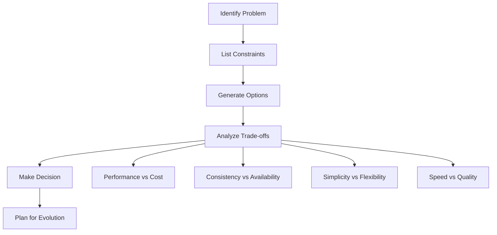

### Key Dimensions to Consider

#### 1. Performance vs. Cost
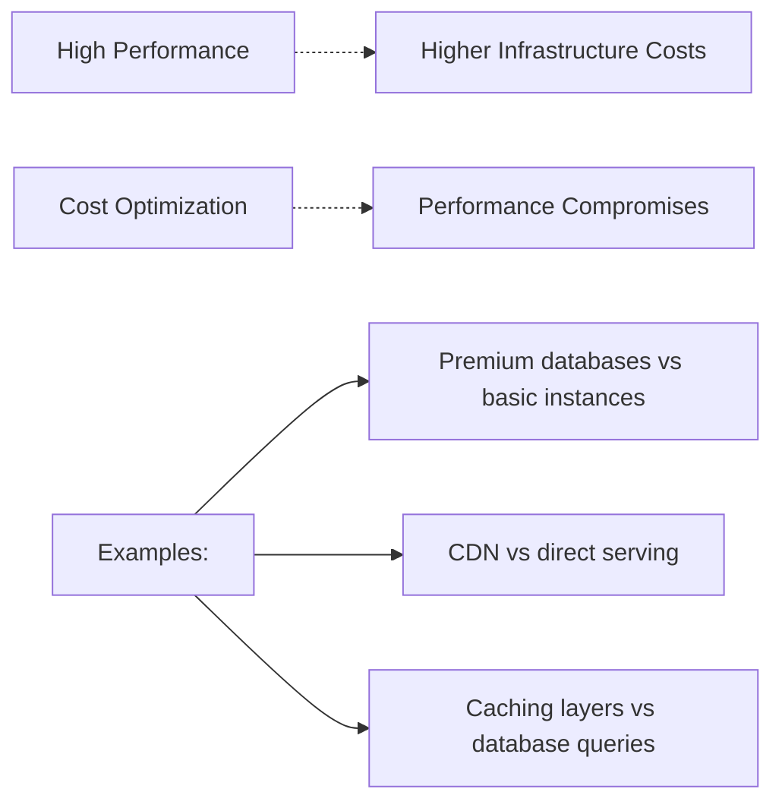

#### 2. Consistency vs. Availability (CAP Theorem)
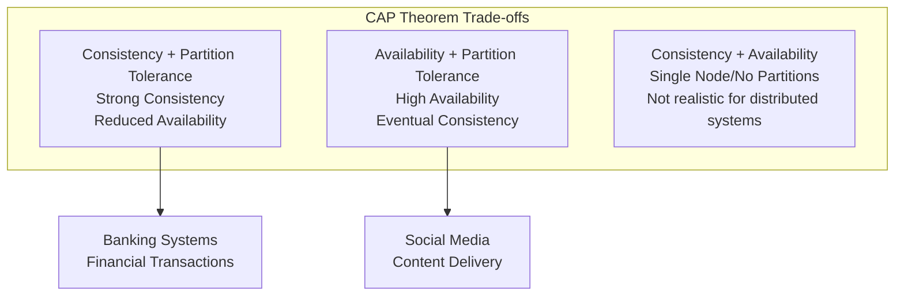

#### 3. Complexity vs. Maintainability
- **Higher Complexity:** More features, better performance, harder to maintain
- **Lower Complexity:** Easier to understand, limited functionality, easier to debug
- **Sweet Spot:** Balance between capability and maintainability

---

## Common System Design Trade-offs

### Database Choices

#### SQL vs NoSQL
```mermaid
comparison
    title Database Technology Trade-offs
    
    x-axis "Use Case Complexity" ["Simple" : "Complex"]
    y-axis "Scale Requirements" ["Low" : "High"]
    
    quadrant-1 "NoSQL Document"
        :  High scale, flexible schema
        :  MongoDB, CouchDB
    
    quadrant-2 "Distributed SQL"
        :  High scale, complex queries
        :  CockroachDB, Spanner
    
    quadrant-3 "Traditional SQL"  
        :  ACID, mature ecosystem
        :  PostgreSQL, MySQL
    
    quadrant-4 "Key-Value Stores"
        :  Simple, ultra-fast
        :  Redis, DynamoDB
```

**Decision Matrix:**

| Aspect | SQL (PostgreSQL) | NoSQL Document (MongoDB) | NoSQL Key-Value (Redis) |
|--------|------------------|---------------------------|------------------------|
| **ACID Compliance** | ✅ Full ACID | ⚠️ Limited | ❌ None |
| **Schema Flexibility** | ❌ Rigid schema | ✅ Flexible | ✅ Schema-less |
| **Query Complexity** | ✅ Complex joins, analytics | ⚠️ Limited joins | ❌ Simple key lookups |
| **Horizontal Scaling** | ❌ Difficult | ✅ Native sharding | ✅ Easy clustering |
| **Performance** | ⚠️ Good with optimization | ✅ Fast for simple queries | ✅ Extremely fast |
| **Operational Maturity** | ✅ Very mature | ⚠️ Growing | ✅ Mature |
| **Developer Expertise** | ✅ Widespread | ⚠️ Learning curve | ⚠️ Specialized use |

### Caching Strategies

#### Cache Patterns Comparison
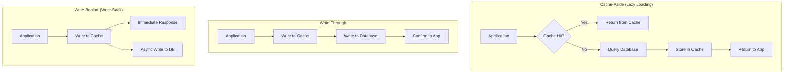

**Trade-off Analysis:**

| Pattern | Read Performance | Write Performance | Data Consistency | Complexity |
|---------|------------------|-------------------|------------------|------------|
| **Cache-Aside** | ⚠️ Cache miss penalty | ✅ Direct to DB | ✅ Eventually consistent | ✅ Simple |
| **Write-Through** | ✅ Always cached | ❌ Double write latency | ✅ Strong consistency | ⚠️ Moderate |
| **Write-Behind** | ✅ Always cached | ✅ Fast writes | ❌ Risk of data loss | ❌ Complex |

### Synchronous vs Asynchronous Processing

#### Processing Pattern Comparison
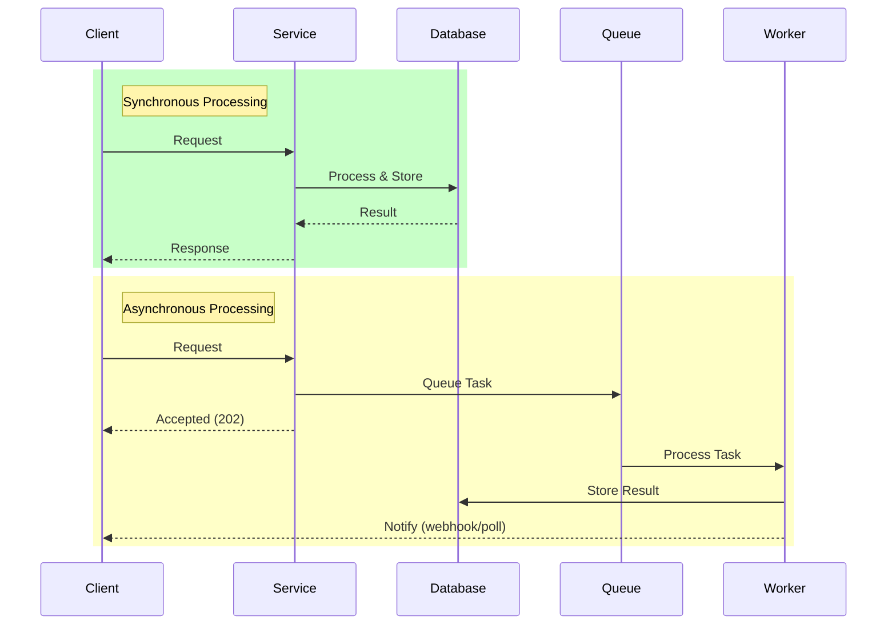

**When to Use Each:**

| Scenario | Synchronous | Asynchronous | Reasoning |
|----------|-------------|--------------|-----------|
| **User Registration** | ✅ Preferred | ⚠️ If complex validation | User expects immediate feedback |
| **Email Sending** | ❌ Blocks UI | ✅ Preferred | Can be processed later |
| **Payment Processing** | ✅ Required | ❌ Risk | User needs immediate confirmation |
| **Image Processing** | ❌ Slow | ✅ Preferred | CPU intensive, user can wait |
| **Real-time Chat** | ✅ Required | ❌ Defeats purpose | Immediate delivery expected |

---

## Decision-Making Patterns

### The Decision Tree Approach

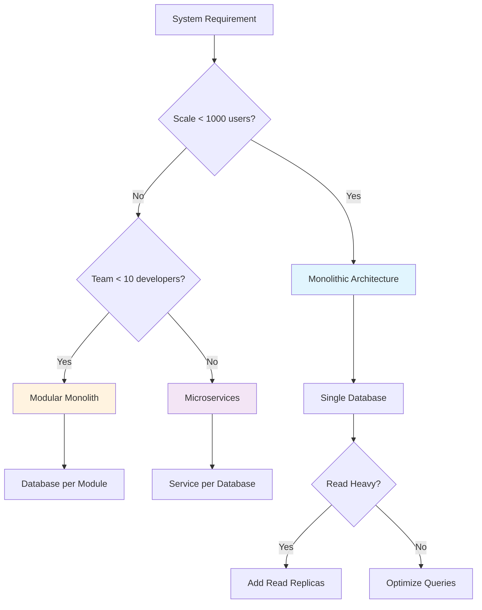

### Cost-Benefit Analysis Framework

#### Example: Adding a Caching Layer

**Benefits:**
- Reduced database load
- Faster response times
- Better user experience
- Lower database costs at scale

**Costs:**
- Additional infrastructure complexity
- Cache invalidation complexity
- Potential data inconsistency
- Increased operational overhead

**Decision Matrix:**
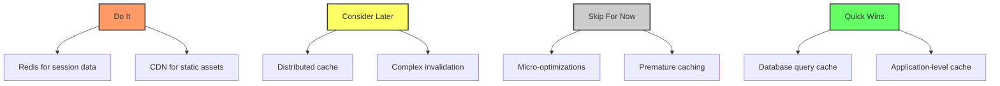

---

## Technology Choice Trade-offs

### Message Queue Selection

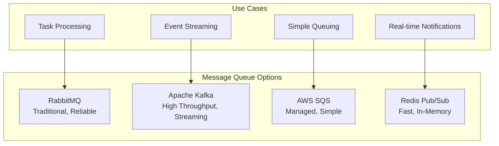

**Detailed Comparison:**

| Feature | RabbitMQ | Kafka | SQS | Redis Pub/Sub |
|---------|----------|-------|-----|---------------|
| **Throughput** | ⚠️ Medium | ✅ Very High | ⚠️ Medium | ✅ High |
| **Durability** | ✅ Persistent | ✅ Replicated | ✅ Managed | ❌ In-memory |
| **Ordering** | ✅ Per queue | ✅ Per partition | ⚠️ FIFO queues only | ❌ No guarantee |
| **Setup Complexity** | ⚠️ Moderate | ❌ Complex | ✅ Simple | ✅ Simple |
| **Operational Overhead** | ⚠️ Self-managed | ❌ High | ✅ None | ⚠️ Moderate |
| **Cost** | ⚠️ Infrastructure | ⚠️ Infrastructure | ⚠️ Per message | ✅ Low |

### Load Balancer Types

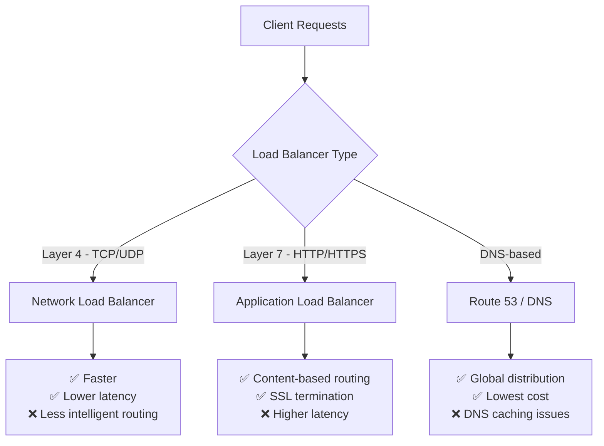

**Decision Framework:**
- **Layer 4:** High performance, simple routing, TCP/UDP traffic
- **Layer 7:** Content-based routing, HTTP features, SSL termination
- **DNS:** Global traffic management, cost-effective, but slower failover

---

## Architectural Pattern Trade-offs

### Monolith vs Microservices

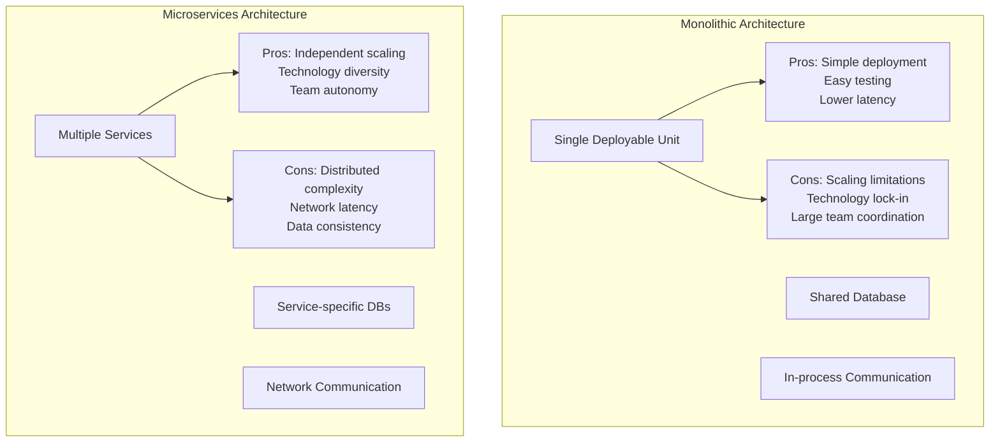

**Decision Matrix:**

| Factor | Monolith | Microservices | Recommended When |
|--------|----------|---------------|------------------|
| **Team Size** | < 10 developers | > 15 developers | Team coordination overhead |
| **System Complexity** | Low-Medium | High | Business domain complexity |
| **Deployment Frequency** | Weekly/Monthly | Daily/Multiple | Release velocity needs |
| **Performance Requirements** | Latency sensitive | Throughput focused | Network calls are acceptable |
| **Operational Maturity** | Basic monitoring | Advanced DevOps | Infrastructure automation exists |

### Event-Driven vs Request-Response

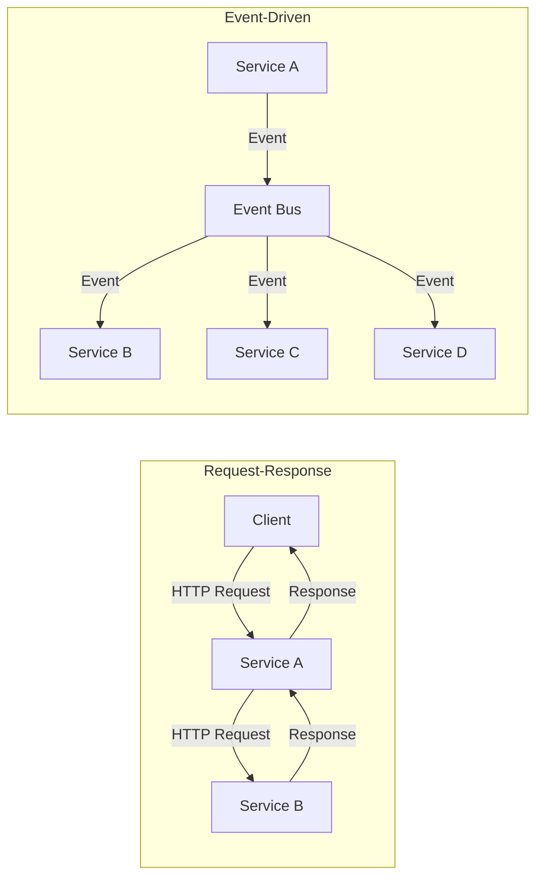

**Trade-off Analysis:**

| Aspect | Request-Response | Event-Driven |
|--------|------------------|--------------|
| **Coupling** | ❌ Tight coupling | ✅ Loose coupling |
| **Debugging** | ✅ Easy to trace | ❌ Complex flow tracking |
| **Reliability** | ⚠️ Chain of failures | ✅ Fault isolation |
| **Consistency** | ✅ Immediate consistency | ❌ Eventual consistency |
| **Scalability** | ❌ Synchronous bottlenecks | ✅ Asynchronous processing |
| **Complexity** | ✅ Simple to understand | ❌ Complex event flows |

---

## Scaling Decision Points

### Database Scaling Strategies

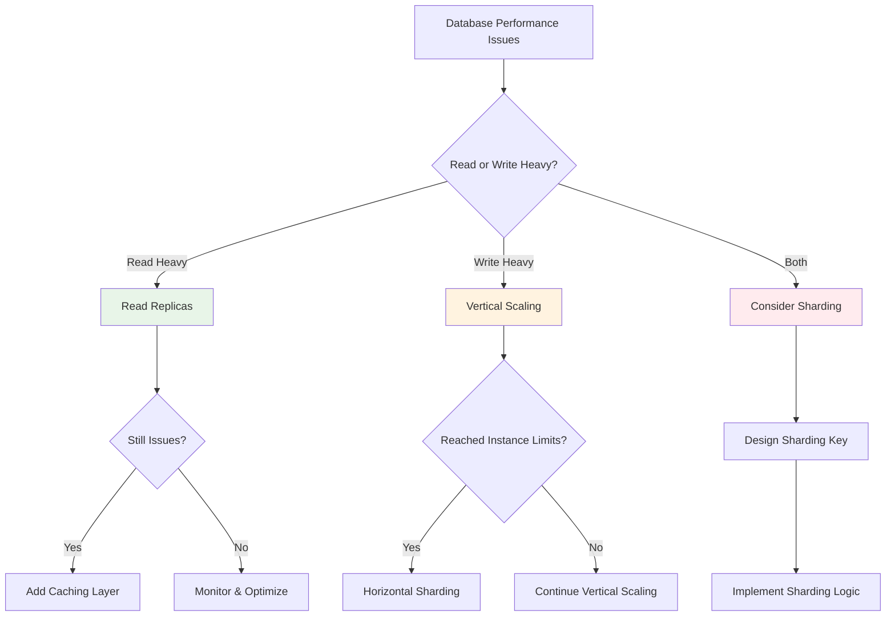

### Caching Layer Decisions

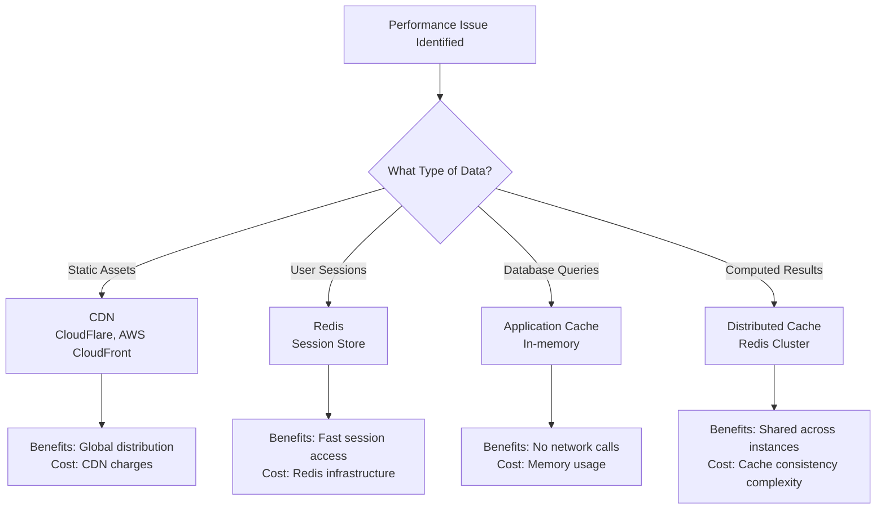

### Storage Strategy Evolution

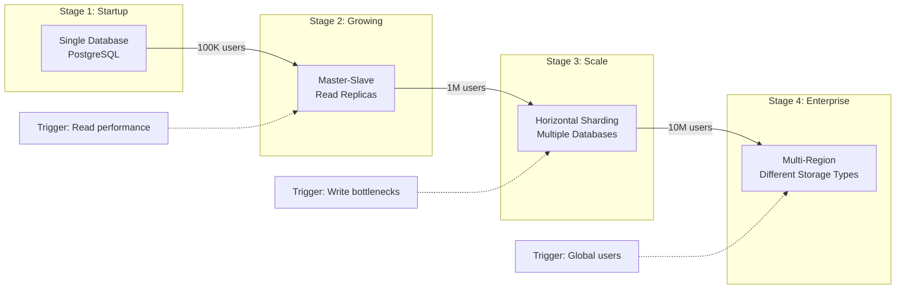

---

## Evaluation Guidelines

### How to Assess Trade-off Thinking

#### Strong Indicators (Green Flags)
- **Identifies Key Trade-offs:** Recognizes the main dimensions of the decision
- **Contextual Reasoning:** Explains why a choice makes sense for the given requirements
- **Considers Multiple Options:** Doesn't jump to the first solution
- **Future-Oriented:** Thinks about how decisions might evolve
- **Quantitative Thinking:** Uses numbers to support decisions when possible

#### Example of Strong Trade-off Analysis:
> "For this social media feed, I'm choosing a hybrid push/pull model. For users with < 1000 followers, I'll use push (fan-out on write) because it's faster for read-heavy workloads and our users read their feeds 10x more than they post. For celebrities with millions of followers, I'll use pull (fan-out on read) to avoid overwhelming our write capacity. This adds complexity but lets us handle both use cases efficiently."

#### Weak Indicators (Red Flags)
- **No Consideration of Alternatives:** Only presents one option
- **Vague Justification:** "It's better" without explaining why
- **Ignores Context:** Doesn't consider scale, team size, or constraints
- **No Evolution Thinking:** Doesn't consider how needs might change
- **Cargo Culting:** "Netflix uses it" without understanding why

#### Example of Weak Analysis:
> "I'll use microservices because they're more scalable."

### Interview Prompts to Elicit Trade-off Thinking

#### Good Prompting Questions:
- "What other approaches did you consider for this problem?"
- "What are the downsides of the approach you chose?"
- "How would your decision change if we had 10x the scale?"
- "What would you do differently if this was a startup vs. an established company?"
- "How would you validate that this decision was correct after implementation?"

#### Follow-up Probes:
- "Walk me through the pros and cons of X vs Y"
- "What metrics would you monitor to detect if this decision was wrong?"
- "How would you migrate from your current solution if requirements changed?"

---

## Common Scenarios & Responses

### Scenario 1: Candidate Chooses Overly Complex Solution

**Situation:** Junior candidate proposes microservices for a simple CRUD app

**Good Response:**
"I like that you're thinking about scalability. Can you walk me through why you chose microservices over a simpler approach? What are the trade-offs you're considering?"

**Follow-up:**
- "What's the operational overhead of this approach?"
- "How would you handle service communication failures?"
- "At what point would you consider breaking down a monolith?"

**What You're Looking For:**
- Recognition that complexity has costs
- Understanding of when complexity is justified
- Ability to start simple and evolve

### Scenario 2: Candidate Dismisses Important Trade-offs

**Situation:** Candidate chooses eventual consistency without acknowledging implications

**Good Response:**
"You mentioned using eventual consistency for this payment system. What are the implications of that choice for the user experience?"

**Follow-up:**
- "How would you handle cases where consistency matters?"
- "What would you do if a user sees inconsistent data?"
- "Are there parts of the system that need strong consistency?"

**What You're Looking For:**
- Understanding of consistency implications
- Recognition that different parts of a system have different needs
- Strategies for managing inconsistency

### Scenario 3: Candidate Shows Good Trade-off Reasoning

**Situation:** Candidate explains database choice with clear reasoning

**Example Response from Candidate:**
"I'm choosing PostgreSQL over MongoDB here because we have complex reporting requirements with joins across multiple entities. While MongoDB would give us more flexibility for the user profile data structure, the analytics team needs SQL for their existing tools. The trade-off is that we'll need to be more careful about schema migrations, but we can use JSON columns in PostgreSQL for semi-structured data where we need flexibility."

**Interviewer Response:**
"Excellent analysis! How would you handle the schema migration challenges you mentioned?"

### Scenario 4: Candidate Needs Guidance on Trade-offs

**Situation:** Candidate proposes solution but doesn't explain reasoning

**Guided Questions:**
1. "What other database options did you consider?"
2. "What are the advantages of your choice?"
3. "What challenges might you face with this approach?"
4. "How does this decision support your main requirements?"

**Escalation If Still Unclear:**
"Let me give you two options: SQL database with ACID guarantees but harder to scale, or NoSQL with easy scaling but eventual consistency. Which would you choose for this use case and why?"

---

## Red Flags in Decision Making

### Technical Red Flags

#### 1. Technology Buzzword Bingo
**Red Flag:** "Let's use Kubernetes, microservices, and GraphQL because they're modern"
**Why It's Bad:** Choosing technology for novelty rather than fit
**Better Approach:** Technology choices should solve specific problems

#### 2. No Consideration of Scale
**Red Flag:** Same architecture for 100 users and 100 million users
**Why It's Bad:** Ignores the fundamental principle that scale changes everything
**Better Approach:** Design for current scale, plan for future scale

#### 3. Ignoring Operational Complexity
**Red Flag:** Proposing complex distributed system without mentioning operations
**Why It's Bad:** Shows lack of production experience
**Better Approach:** Consider monitoring, debugging, deployment complexity

### Process Red Flags

#### 1. Single Solution Tunnel Vision
**Red Flag:** Only considers one approach without exploring alternatives
**Why It's Bad:** Shows lack of analytical thinking
**Better Approach:** "Let me consider a few options here..."

#### 2. Unable to Justify Decisions
**Red Flag:** "It's just better" or "Everyone uses it"
**Why It's Bad:** No understanding of underlying principles
**Better Approach:** Clear reasoning based on requirements and constraints

#### 3. No Evolution Thinking
**Red Flag:** Assumes initial design will never change
**Why It's Bad:** Real systems evolve; good architects plan for this
**Better Approach:** "We'd start with X and migrate to Y when Z happens"

### Evaluation Matrix for Trade-off Skills

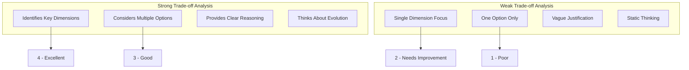

---

## Scoring Rubric for Trade-off Evaluation

### Excellent (4): Sophisticated Decision-Making
- **Identifies Core Trade-offs:** Recognizes 3-4 key dimensions of decision
- **Comparative Analysis:** Systematically compares multiple options
- **Contextual Reasoning:** Explains why choice fits specific requirements
- **Evolution Planning:** Considers how decision might need to change
- **Quantitative Support:** Uses numbers/metrics to support reasoning

**Example Quote:**
> "Given our read:write ratio of 100:1 and need for sub-100ms response times, I'm choosing read replicas over caching initially because our data changes frequently and cache invalidation would be complex. We'd add caching later when we hit 10K QPS based on our monitoring."

### Good (3): Solid Decision-Making
- **Identifies Main Trade-offs:** Recognizes 2-3 key decision factors
- **Some Comparison:** Considers at least one alternative
- **Basic Reasoning:** Explains choice with adequate justification
- **Some Future Thinking:** Mentions how solution might evolve
- **Generally Appropriate:** Makes reasonable choices for the context

### Needs Improvement (2): Limited Decision-Making
- **Basic Trade-off Awareness:** Recognizes 1-2 obvious trade-offs
- **Limited Options:** Considers few alternatives
- **Weak Justification:** Provides minimal reasoning for choices
- **Little Evolution Thinking:** Assumes static solution
- **Some Questionable Choices:** Makes some inappropriate decisions

### Poor (1): Inadequate Decision-Making
- **No Trade-off Recognition:** Doesn't identify key decision points
- **Single Option:** Only considers one approach
- **No Justification:** Cannot explain reasoning for choices
- **No Evolution Consideration:** No planning for change
- **Inappropriate Choices:** Makes several poor technology/architecture decisions

---
*Version: 1.0*
*Owner: @Ritahchanger*
*Related Documents:*
- *[Interview Process Guide](../engineer-interview-guide/interview-process.md)*
- *[Junior Engineer Guide](../engineer-interview-guide/junior-guide.md)*
- *[Senior Engineer Guide](../engineer-interview-guide/senior-guide.md)*