# Junior Level System Design Practice Questions

## Table of Contents

1. [Overview](#overview)
2. [Question Categories](#question-categories)
3. [Essential Questions (Must Practice)](#essential-questions-must-practice)
4. [Intermediate Questions](#intermediate-questions)
5. [Bonus Challenge Questions](#bonus-challenge-questions)
6. [Question Templates & Frameworks](#question-templates--frameworks)
7. [Evaluation Criteria](#evaluation-criteria)
8. [Progression to Senior Level](#progression-to-senior-level)

---

## Overview

### Purpose
This collection provides system design practice questions specifically tailored for junior engineers (0-3 years experience). These questions focus on fundamental concepts and gradually build complexity to prepare candidates for real interviews.

### How to Use This Guide
1. **Start with Essential Questions:** Master the basics before moving on
2. **Practice Out Loud:** Explain your thinking as you work through problems
3. **Time Yourself:** Aim for 45-60 minutes per question
4. **Review Solutions:** Compare your approach with the provided guidance
5. **Progress Gradually:** Move to intermediate questions once comfortable

### Connection to Other Guides
- **Interview Process:** See [Interview Process Guide](../engineer-interview-guide/interview-process.md) for complete process
- **Evaluation:** Reference [Junior Guide](../engineer-interview-guide/junior-guide.md) for evaluation criteria
- **Next Level:** Progress to [Senior Questions](./senior-questions.md) when ready
- **Trade-offs:** Use [Trade-offs Guide](../estimation-techniques/trade-offs-decisions.md) for decision-making

---

## Question Categories

### Category A: CRUD Applications (Foundation Level)
**Focus:** Basic operations, simple data modeling, REST APIs
**Time Allocation:** 45 minutes
**Skills Tested:** Database design, API design, basic architecture

### Category B: Content & File Management (Beginner+)
**Focus:** File handling, user interactions, basic relationships
**Time Allocation:** 50 minutes
**Skills Tested:** File storage, user relationships, basic scaling

### Category C: Real-time Features (Intermediate)
**Focus:** Event-driven thinking, basic messaging concepts
**Time Allocation:** 55 minutes
**Skills Tested:** WebSockets, event handling, state management

### Category D: E-commerce Basics (Intermediate+)
**Focus:** Transaction handling, inventory, order processing
**Time Allocation:** 60 minutes
**Skills Tested:** Transaction concepts, business logic, data consistency

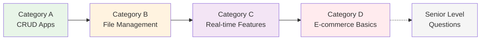

---

## Essential Questions (Must Practice)

### Question 1: URL Shortener Service (Like bit.ly)
**Difficulty:** ⭐⭐☆☆☆
**Time:** 45 minutes
**Category:** A - CRUD Applications

#### Problem Statement
Design a URL shortening service that allows users to:
- Submit long URLs and receive short URLs
- Click short URLs to redirect to original URLs
- View basic analytics (optional)

#### Expected Architecture
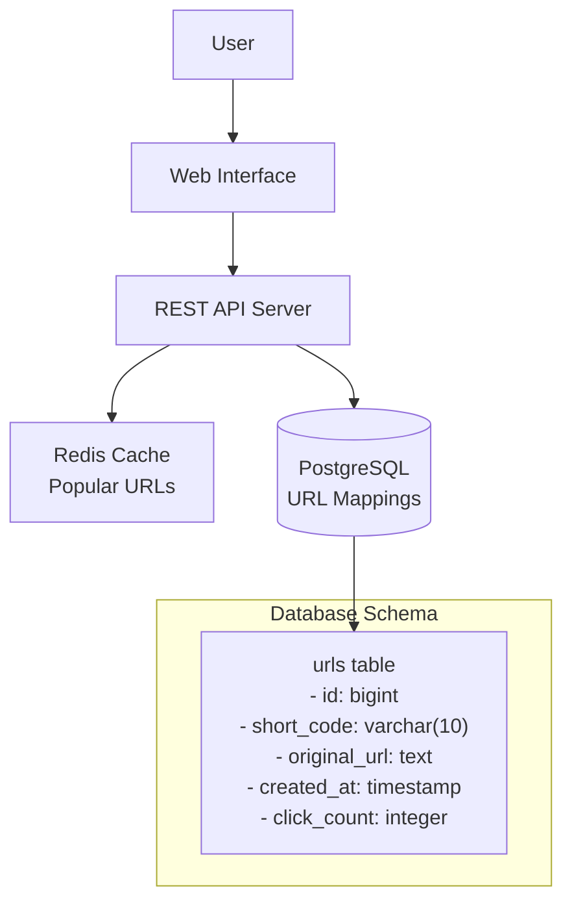

#### Key Discussion Points
1. **Short code generation:** Base62 encoding vs random strings
2. **Database design:** Primary key strategy, indexing
3. **Caching strategy:** Which URLs to cache and when
4. **API design:** POST /shorten, GET /{code} endpoints

#### Evaluation Focus
- Can design basic database schema
- Understands REST API principles
- Considers simple performance optimizations
- Thinks about user experience

---

### Question 2: Personal Task Management System
**Difficulty:** ⭐⭐☆☆☆
**Time:** 45 minutes
**Category:** A - CRUD Applications

#### Problem Statement
Design a personal todo/task management application where users can:
- Create, update, delete tasks
- Organize tasks into lists/projects
- Mark tasks as complete
- Set due dates and priorities

#### Expected Data Model
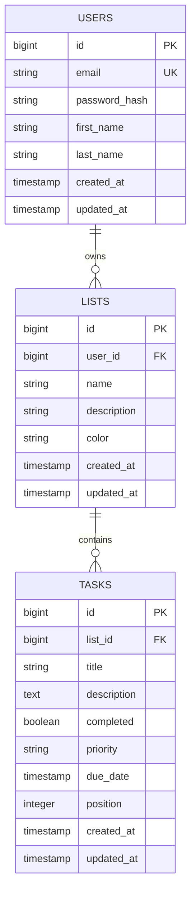

#### API Design Example
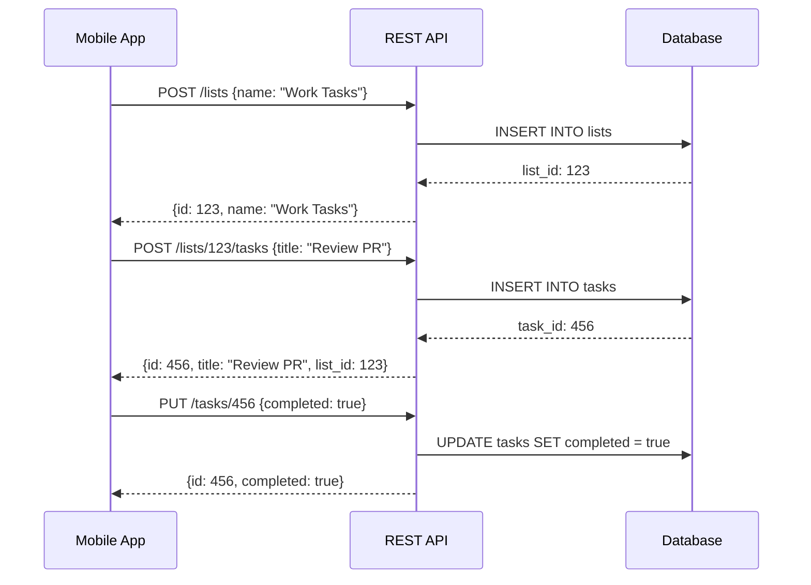

#### Key Discussion Points
1. **User authentication:** Session vs JWT tokens
2. **Task organization:** Lists vs tags vs categories
3. **Data relationships:** Foreign keys and referential integrity
4. **Mobile sync:** How to handle offline usage

---

### Question 3: Simple Blogging Platform
**Difficulty:** ⭐⭐⭐☆☆
**Time:** 50 minutes
**Category:** B - Content & File Management

#### Problem Statement
Design a basic blogging platform where users can:
- Create accounts and profiles
- Write and publish blog posts
- Add comments to posts
- Follow other users
- View a personalized feed

#### System Architecture
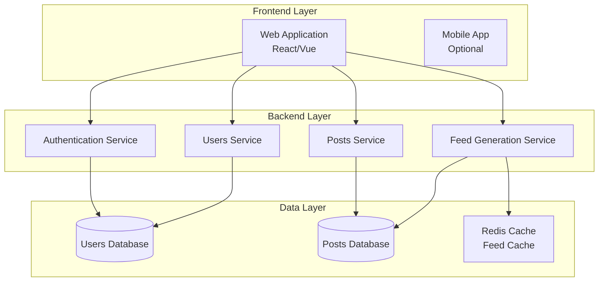

#### Database Schema
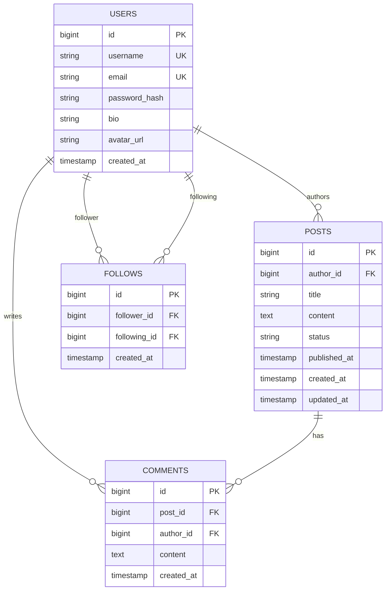

#### Feed Generation Strategy
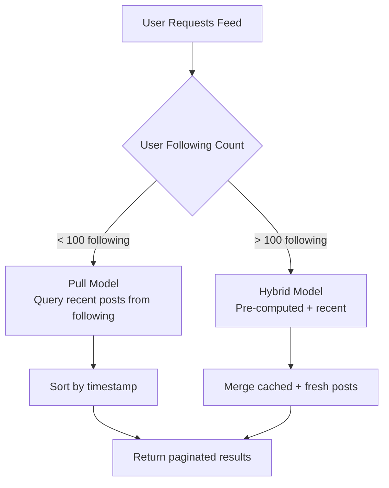

#### Key Discussion Points
1. **Feed generation:** Pull vs push models for different user types
2. **Content storage:** How to handle rich text and images
3. **User relationships:** Following/followers implementation
4. **Performance:** Caching strategies for popular posts

---

## Intermediate Questions

### Question 4: Image Sharing Platform (Like Instagram Basic)
**Difficulty:** ⭐⭐⭐☆☆
**Time:** 55 minutes
**Category:** B - Content & File Management

#### Problem Statement
Design an image sharing platform where users can:
- Upload and share photos with captions
- Like and comment on photos
- Follow other users
- View a timeline feed
- Basic image processing (resize, thumbnails)

#### High-Level Architecture
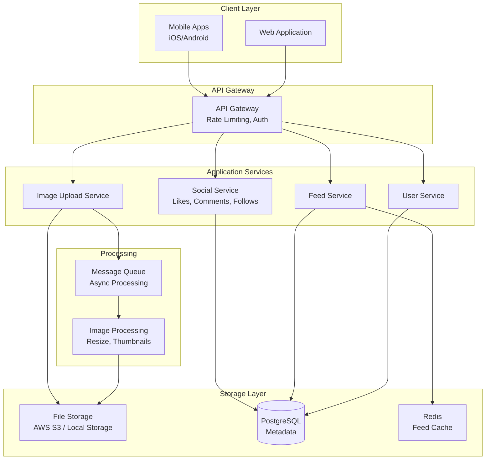

#### Image Upload Flow
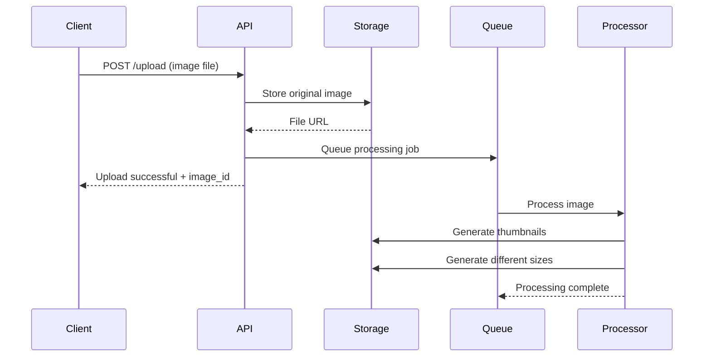

#### Key Discussion Points
1. **File storage:** Local vs cloud storage trade-offs
2. **Image processing:** Synchronous vs asynchronous processing
3. **CDN usage:** Serving images globally
4. **Database vs file system:** Metadata storage strategy

---

### Question 5: Real-time Chat Application
**Difficulty:** ⭐⭐⭐☆☆
**Time:** 55 minutes
**Category:** C - Real-time Features

#### Problem Statement
Design a real-time messaging application where users can:
- Send and receive messages instantly
- Create group chats
- See online/offline status
- Message history and search
- File sharing capabilities

#### Real-time Architecture
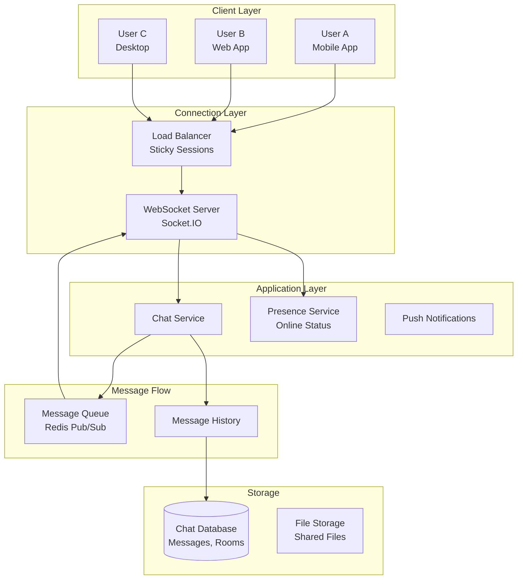

#### Message Flow Sequence
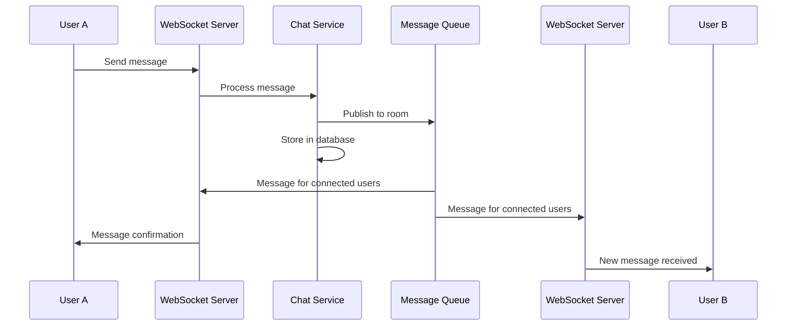

#### Key Discussion Points
1. **Real-time communication:** WebSockets vs polling vs Server-Sent Events
2. **Message delivery:** At-least-once vs exactly-once delivery
3. **Scaling connections:** Handling thousands of concurrent connections
4. **Message persistence:** Storage and retrieval of chat history

---

### Question 6: Simple E-commerce System
**Difficulty:** ⭐⭐⭐⭐☆
**Time:** 60 minutes
**Category:** D - E-commerce Basics

#### Problem Statement
Design a basic e-commerce platform where customers can:
- Browse products and categories
- Add items to shopping cart
- Complete purchases
- View order history
- Basic inventory management

#### E-commerce Architecture
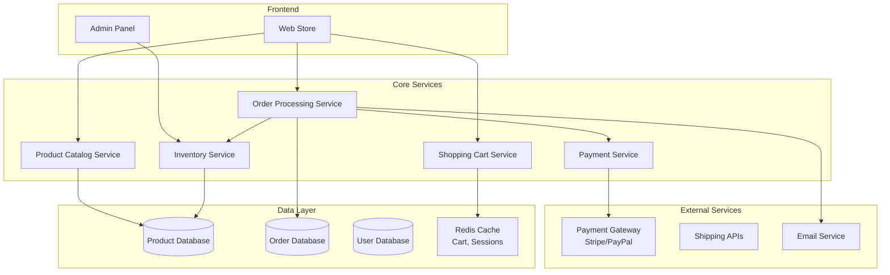

#### Order Processing Flow
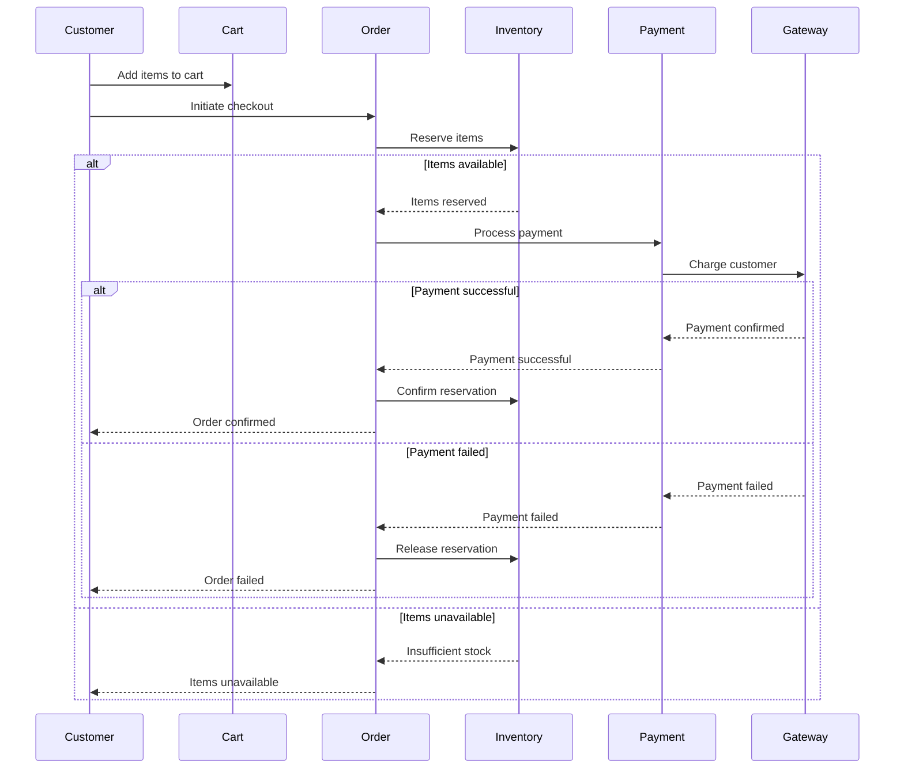

#### Key Discussion Points
1. **Inventory management:** How to handle concurrent purchases
2. **Payment processing:** PCI compliance and security
3. **Transaction consistency:** Ensuring data integrity across services
4. **Cart persistence:** Session-based vs user-based carts

---

## Bonus Challenge Questions

### Question 7: Event Booking System
**Difficulty:** ⭐⭐⭐⭐☆
**Time:** 60 minutes

Design a system for booking events (concerts, conferences, etc.) with:
- Event creation and management
- Ticket sales with seat selection
- Payment processing
- Waitlist management
- QR code ticket generation

### Question 8: Simple Social Media Feed
**Difficulty:** ⭐⭐⭐⭐☆
**Time:** 60 minutes

Design a basic social media platform with:
- User posts (text, images)
- Following/followers system
- Timeline generation
- Like and comment functionality
- Basic content moderation

### Question 9: File Storage and Sharing Service
**Difficulty:** ⭐⭐⭐☆☆
**Time:** 55 minutes

Design a file storage service (like Google Drive basic) with:
- File upload/download
- Folder organization
- File sharing with permissions
- Version control basics
- Storage optimization

---

## Question Templates & Frameworks

### Universal Question Framework
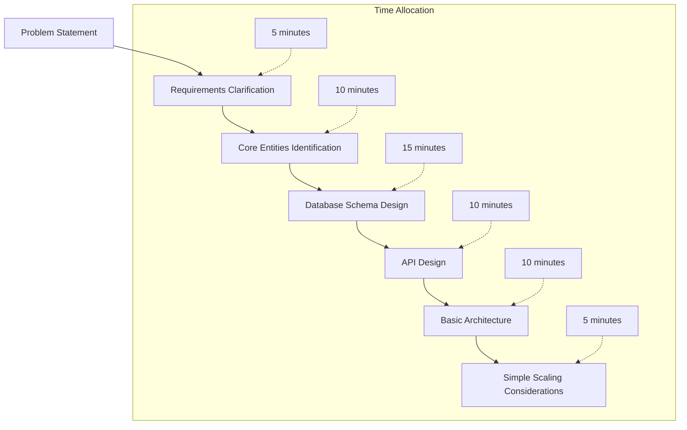

### Requirements Clarification Template
Always ask these questions:
1. **Scale:** How many users? How much data?
2. **Features:** What are the core vs nice-to-have features?
3. **Platform:** Web, mobile, or both?
4. **Authentication:** Do users need accounts?
5. **Real-time:** Any real-time features needed?
6. **Constraints:** Any technology preferences or limitations?

### Database Design Checklist
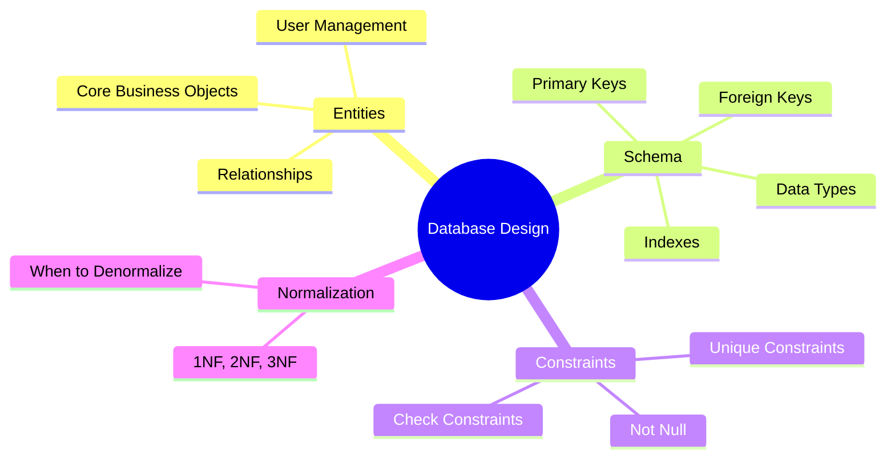

---

## Evaluation Criteria

### Junior Level Success Metrics

#### Essential Skills (Must Demonstrate)
- [ ] Can design basic database schema with proper relationships
- [ ] Understands REST API principles and HTTP methods
- [ ] Identifies major system components (frontend, backend, database)
- [ ] Considers basic user authentication
- [ ] Thinks about data validation

#### Good-to-Have Skills
- [ ] Considers basic performance optimizations (indexing, caching)
- [ ] Thinks about error handling
- [ ] Considers security basics (password hashing, input validation)
- [ ] Shows awareness of scalability concepts
- [ ] Can explain trade-offs in simple terms

#### Red Flags
- [ ] Cannot design basic database relationships
- [ ] No understanding of REST APIs
- [ ] Doesn't consider user authentication
- [ ] No awareness of data persistence
- [ ] Cannot explain their design choices

### Self-Assessment Questions
After each practice session, ask yourself:

1. **Requirements:** Did I ask clarifying questions about scale and features?
2. **Data Model:** Are my database relationships correct and normalized?
3. **API Design:** Are my endpoints RESTful and logically organized?
4. **Architecture:** Can I explain how data flows through my system?
5. **Trade-offs:** Did I consider alternatives and explain my choices?

---

## Progression to Senior Level

### When You're Ready for Senior Questions
You should consistently demonstrate these abilities across multiple junior questions:

#### Technical Readiness
- [ ] **Database Mastery:** Comfortable with complex schemas, joins, and basic optimization
- [ ] **API Design:** Can design comprehensive REST APIs with proper HTTP methods
- [ ] **Architecture Thinking:** Naturally separates concerns and identifies service boundaries
- [ ] **Basic Scaling:** Understands concepts like caching, read replicas, and load balancing
- [ ] **Trade-off Analysis:** Can compare options and explain decisions clearly

#### Process Readiness
- [ ] **Structured Approach:** Follows consistent methodology for solving problems
- [ ] **Communication:** Explains complex concepts clearly and handles questions well
- [ ] **Time Management:** Completes designs within time limits
- [ ] **Evolution Thinking:** Considers how systems might need to change over time

### Bridge Topics to Study
Before moving to senior questions, strengthen these areas:

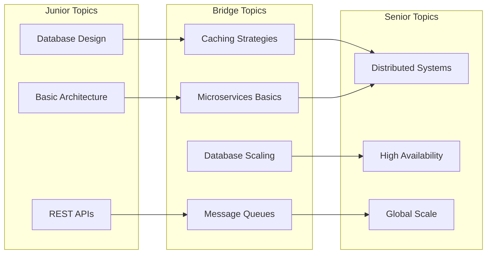

### Recommended Study Path
1. **Master all essential junior questions** (Questions 1-3)
2. **Complete intermediate questions** (Questions 4-6)
3. **Study bridge topics:**
   - Redis caching patterns
   - Database read replicas
   - Basic message queues (Redis pub/sub)
   - API gateway concepts
4. **Attempt bonus challenge questions**
5. **Move to [Senior Questions](./senior-questions.md)**

### Practice Schedule Recommendation
- **Week 1-2:** Essential questions (1-3), repeat until comfortable
- **Week 3-4:** Intermediate questions (4-6), focus on trade-offs
- **Week 5:** Bonus questions and review weak areas
- **Week 6:** Mock interviews and transition to senior level

---

*Version: 1.0*
*Owner: @codewithmunyao*
*Related Documents:*
- *[Senior Practice Questions](./senior-questions.md)*
- *[Junior Interview Guide](../engineer-interview-guide/junior-guide.md)*
- *[Trade-offs Decision Guide](../estimation-techniques/trade-offs-decisions.md)*