# Senior Level System Design Practice Questions

## Table of Contents

1. [Overview](#overview)
2. [Question Categories](#question-categories)
3. [Core Senior Questions](#core-senior-questions)
4. [Advanced Distributed Systems](#advanced-distributed-systems)
5. [Platform & Infrastructure Questions](#platform--infrastructure-questions)
6. [Specialized Domain Questions](#specialized-domain-questions)
7. [Question Framework & Approach](#question-framework--approach)
8. [Evaluation Criteria](#evaluation-criteria)
9. [Progression from Junior Level](#progression-from-junior-level)

---

## Overview

### Purpose
This collection provides system design practice questions specifically for senior engineers (5+ years experience). These questions focus on distributed systems, scalability, trade-off analysis, and architectural decision-making at enterprise scale.

### Key Differences from Junior Questions
- **Scale Complexity:** Systems serving millions/billions of users
- **Distributed Systems Focus:** Multi-region, high availability, consistency models
- **Production Considerations:** Monitoring, operations, disaster recovery
- **Business Context:** Cost optimization, team scaling, organizational impact
- **Deep Trade-offs:** Complex architectural decisions with multiple valid approaches

### Connection to Other Guides
- **Foundation:** Build upon [Junior Questions](./junior-questions.md) concepts
- **Evaluation:** Reference [Senior Interview Guide](../engineer-interview-guide/senior-guide.md)
- **Decision Making:** Use [Trade-offs Guide](../estimation-techniques/trade-offs-decisions.md) extensively
- **Process:** Follow [Interview Process](../engineer-interview-guide/interview-process.md) structure

---

## Question Categories

### Category S1: High-Scale Web Services
**Focus:** Global distribution, massive scale, complex caching
**Time:** 60 minutes
**Skills:** Distributed caching, CDNs, load balancing, database sharding

### Category S2: Distributed Data Systems
**Focus:** Data consistency, distributed transactions, analytics
**Time:** 60 minutes  
**Skills:** CAP theorem, eventual consistency, distributed consensus, ACID

### Category S3: Event-Driven Architectures
**Focus:** Asynchronous processing, event sourcing, workflow orchestration
**Time:** 60 minutes
**Skills:** Message queues, event streaming, saga patterns, CQRS

### Category S4: Platform & Infrastructure
**Focus:** Multi-tenancy, developer platforms, infrastructure abstraction
**Time:** 60 minutes
**Skills:** Container orchestration, service mesh, API gateways, observability

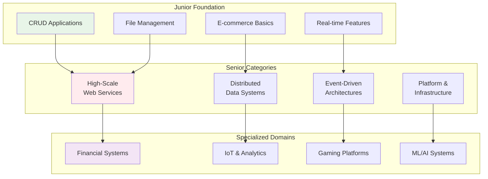

---

## Core Senior Questions

### Question 1: Design a Global Social Media Platform (Like Twitter/X)
**Difficulty:** ⭐⭐⭐⭐⭐
**Time:** 60 minutes
**Category:** S1 - High-Scale Web Services

#### Problem Statement
Design the backend for a global social media platform serving 500 million daily active users across multiple regions. Users can post tweets (280 characters), follow others, like/retweet content, and see personalized timelines.

**Scale Requirements:**
- 500M DAU, 2B total users
- 400M tweets per day
- 100B timeline requests per day
- Sub-200ms timeline load time globally
- 99.9% uptime requirement

#### Global Architecture Overview
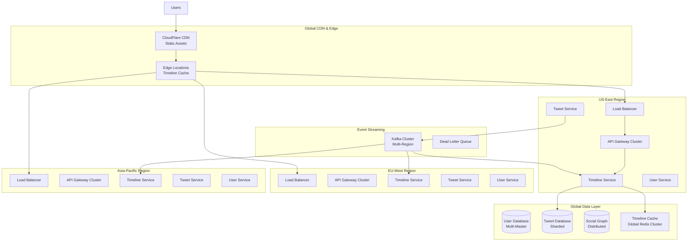

#### Feed Generation Strategy (Critical Design Decision)
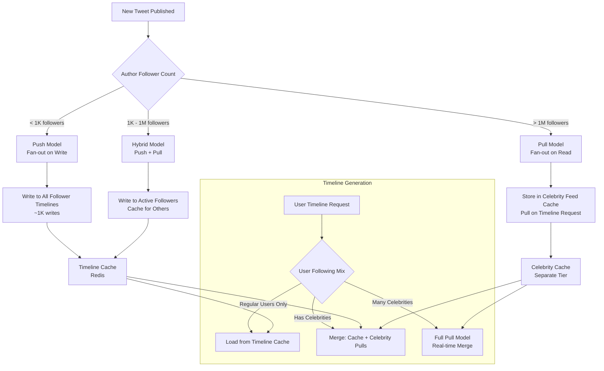

#### Database Sharding Strategy
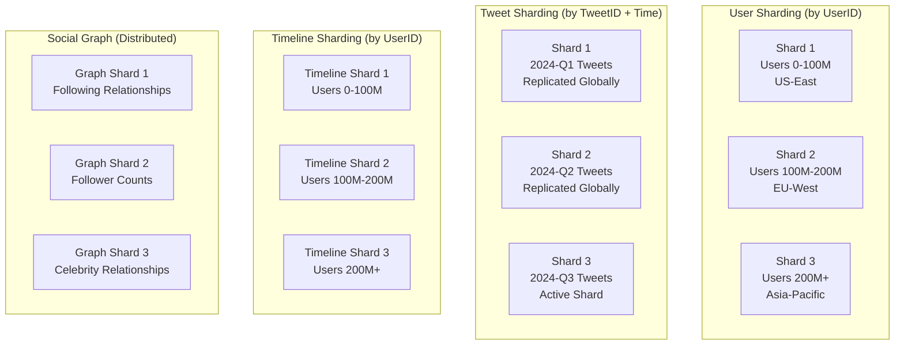

#### Critical Discussion Points
1. **Consistency vs Availability Trade-offs:**
   - Strong consistency for financial operations (ads)
   - Eventual consistency for social interactions
   - Regional consistency for user data

2. **Caching Strategy:**
   - 3-tier caching: CDN, Application, Database
   - Cache warming strategies for trending topics
   - Cache invalidation for timeline updates

3. **Global Distribution:**
   - Data residency requirements
   - Cross-region replication latency
   - Disaster recovery and failover

4. **Celebrity Problem:**
   - Handling users with millions of followers
   - Rate limiting and abuse prevention
   - Trending topic detection and handling

---

### Question 2: Design a Distributed Payment Processing System
**Difficulty:** ⭐⭐⭐⭐⭐
**Time:** 60 minutes
**Category:** S2 - Distributed Data Systems

#### Problem Statement
Design a payment processing system for a global e-commerce platform handling 100K transactions per second. Must ensure ACID properties, fraud detection, regulatory compliance, and support multiple payment methods across regions.

**Requirements:**
- 100K TPS globally
- 99.99% availability
- Strong consistency for financial data
- Real-time fraud detection
- PCI DSS compliance
- Support for 50+ countries with local regulations

#### High-Level Architecture
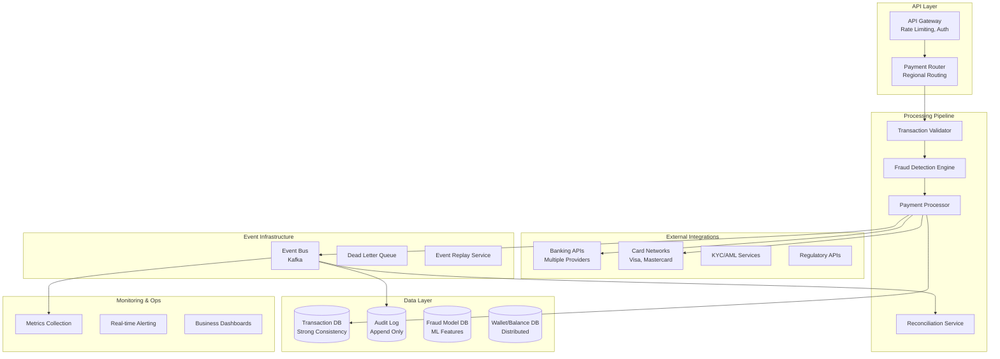

#### Distributed Transaction Flow (Saga Pattern)
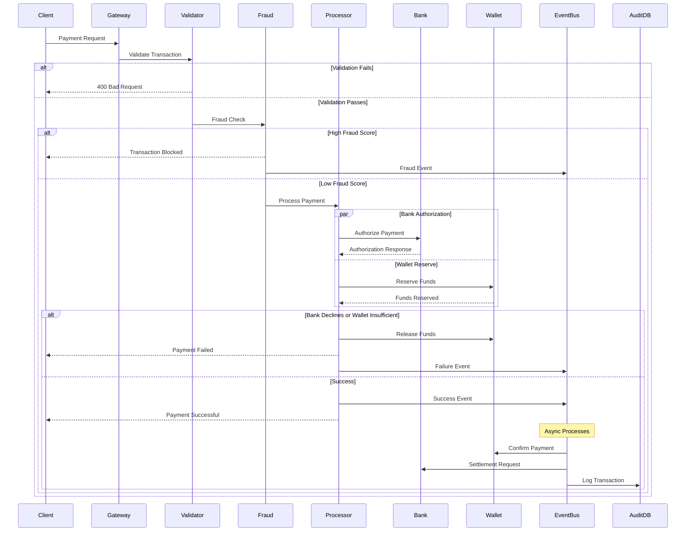

#### Fraud Detection Pipeline
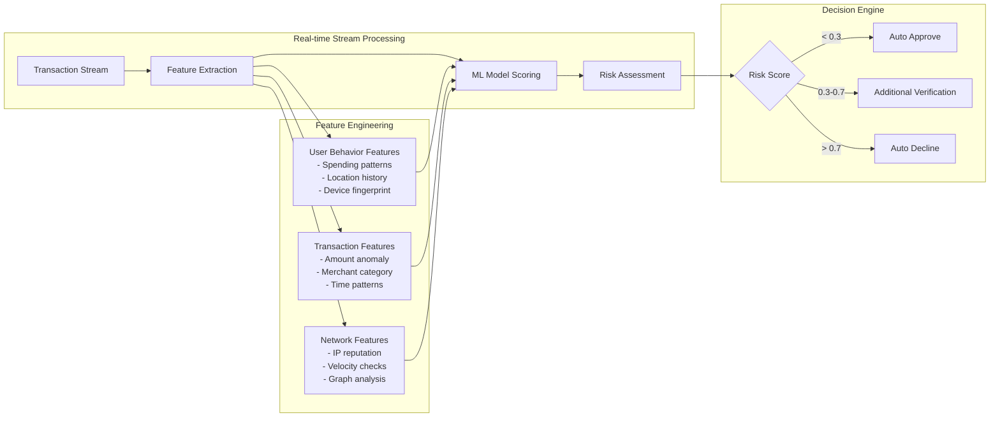

#### Critical Discussion Points
1. **ACID Compliance in Distributed System:**
   - Two-phase commit vs Saga pattern trade-offs
   - Eventual consistency for audit logs
   - Compensation transactions for failures

2. **Regulatory Compliance:**
   - Data residency requirements (GDPR, PCI DSS)
   - Audit trail completeness
   - Real-time regulatory reporting

3. **Scaling Strategies:**
   - Database sharding by region/currency
   - Read replicas for reporting
   - Event sourcing for audit requirements

---

### Question 3: Design a Real-time Analytics Platform
**Difficulty:** ⭐⭐⭐⭐⭐
**Time:** 60 minutes
**Category:** S3 - Event-Driven Architectures

#### Problem Statement
Design a real-time analytics platform that ingests 10 million events per second, provides sub-second query responses, and supports both streaming analytics and historical batch processing for business intelligence.

**Requirements:**
- 10M events/second ingestion
- Sub-second query latency for real-time dashboards
- Support for complex analytical queries on historical data
- Stream processing for alerts and real-time aggregations
- 99.9% uptime with data durability guarantees

#### Lambda Architecture Implementation
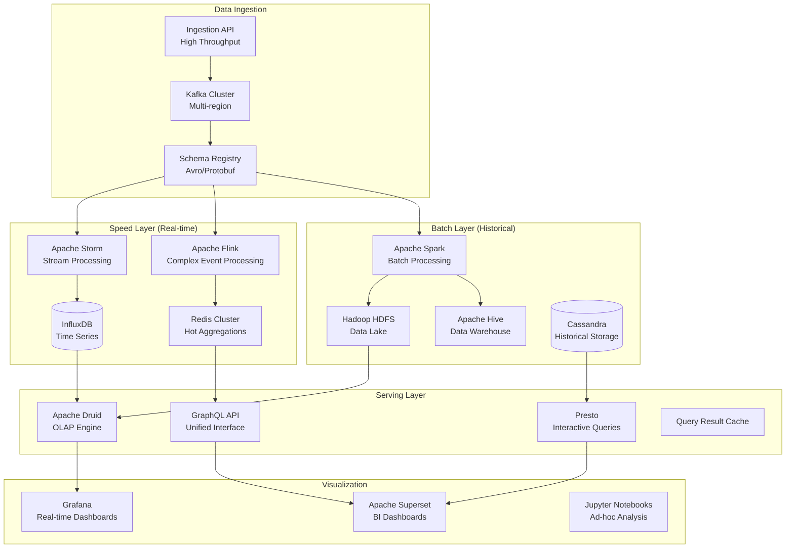

#### Stream Processing Architecture
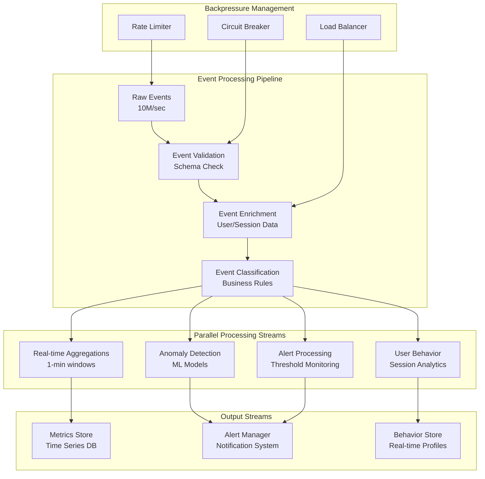

#### Data Storage Strategy
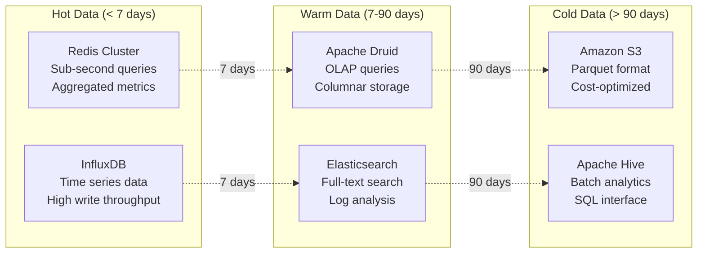

#### Critical Discussion Points
1. **Lambda vs Kappa Architecture:**
   - Trade-offs between batch and stream processing
   - Handling late-arriving data
   - Maintaining consistency between layers

2. **Scaling Event Processing:**
   - Kafka partitioning strategies
   - Stream processing parallelization
   - Backpressure handling mechanisms

3. **Query Performance:**
   - Pre-aggregation strategies
   - Caching layers at different levels
   - Query optimization techniques

---

## Advanced Distributed Systems

### Question 4: Design a Distributed Database (Like Cassandra)
**Difficulty:** ⭐⭐⭐⭐⭐
**Time:** 60 minutes
**Category:** S2 - Distributed Data Systems

#### Problem Statement
Design a distributed NoSQL database that provides high availability, partition tolerance, and horizontal scalability. Support eventual consistency with tunable consistency levels and handle network partitions gracefully.

#### Distributed Database Architecture
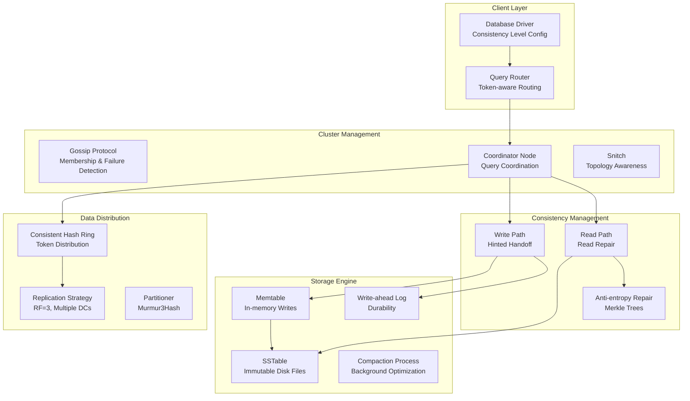

#### Consistency Levels & CAP Theorem
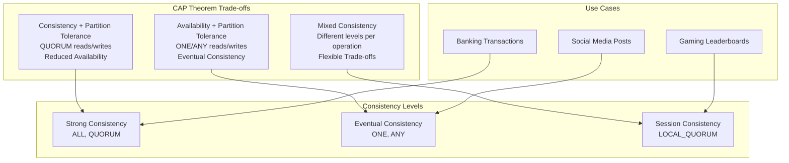

#### Critical Discussion Points
1. **Partitioning Strategy:**
   - Consistent hashing vs range partitioning
   - Handling hot partitions
   - Rebalancing strategies

2. **Failure Handling:**
   - Network partition detection
   - Node failure recovery
   - Data repair mechanisms

3. **Performance Optimization:**
   - Read/write path optimization
   - Compaction strategies
   - Bloom filters and caching

---

### Question 5: Design a Container Orchestration Platform (Like Kubernetes)
**Difficulty:** ⭐⭐⭐⭐⭐
**Time:** 60 minutes
**Category:** S4 - Platform & Infrastructure

#### Problem Statement
Design a container orchestration platform that can manage thousands of applications across hundreds of nodes, with features like service discovery, load balancing, auto-scaling, and rolling deployments.

#### Kubernetes-style Architecture
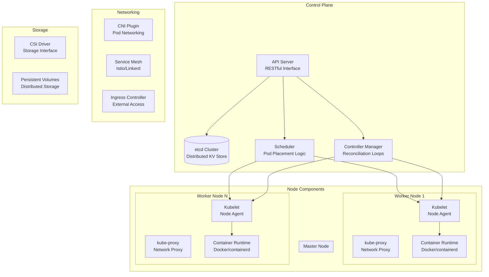

#### Pod Scheduling Algorithm
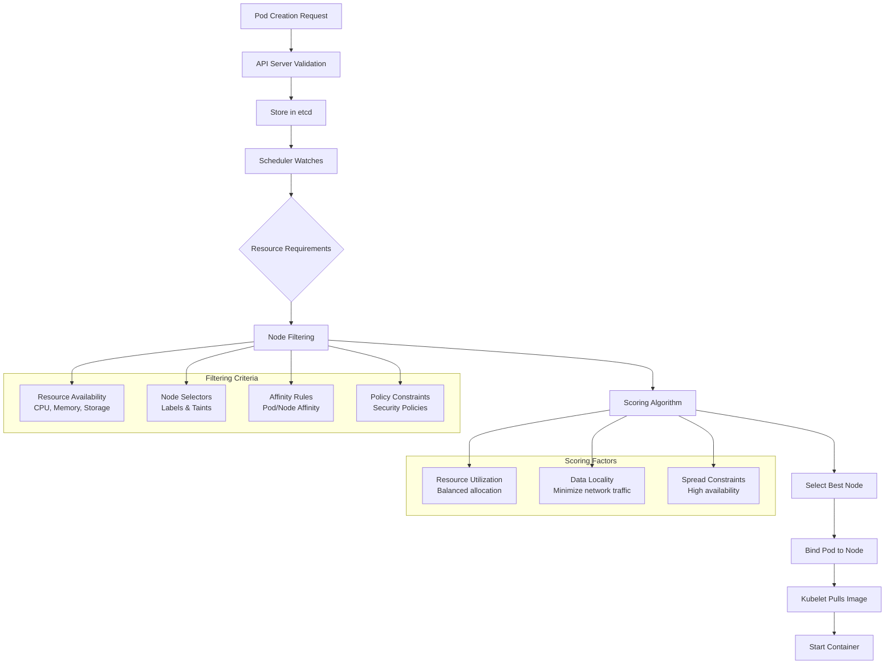

#### Critical Discussion Points
1. **Distributed Consensus:**
   - etcd raft consensus
   - Leader election mechanisms
   - Split-brain prevention

2. **Resource Management:**
   - Resource quotas and limits
   - Quality of Service classes
   - Multi-tenancy isolation

3. **Networking Complexity:**
   - Pod-to-pod communication
   - Service discovery and load balancing
   - Network policies and security

---

## Platform & Infrastructure Questions

### Question 6: Design a Multi-tenant SaaS Platform
**Difficulty:** ⭐⭐⭐⭐⭐
**Time:** 60 minutes
**Category:** S4 - Platform & Infrastructure

#### Problem Statement
Design a multi-tenant SaaS platform serving 10,000+ organizations with millions of users. Ensure data isolation, customization capabilities, resource quotas, and billing integration while maintaining performance and security.

#### Multi-tenant Architecture Strategies
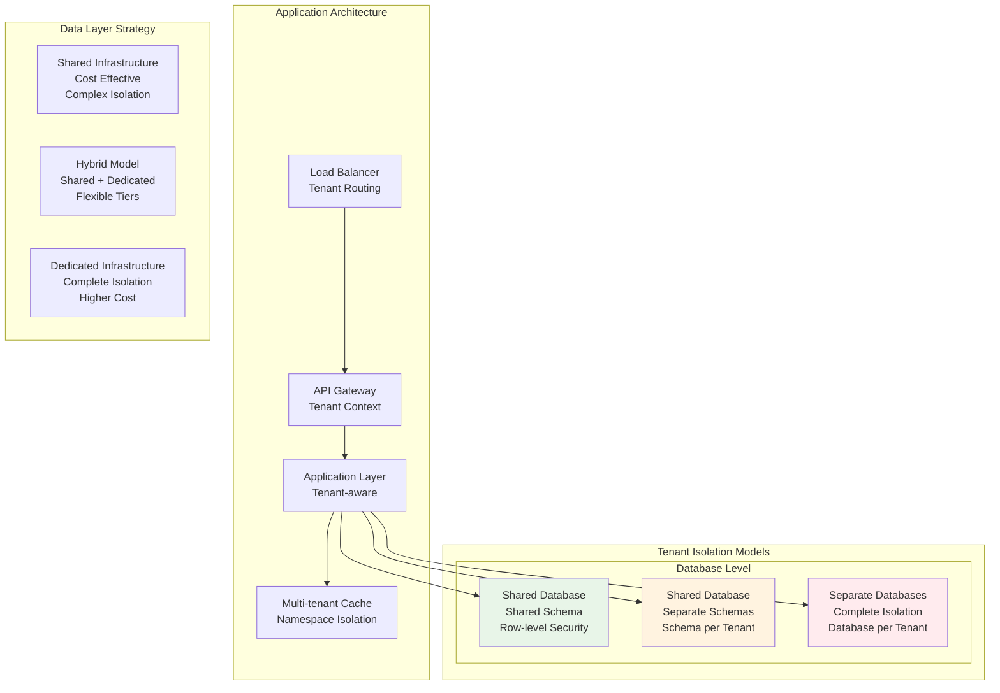

#### Tenant Context & Security
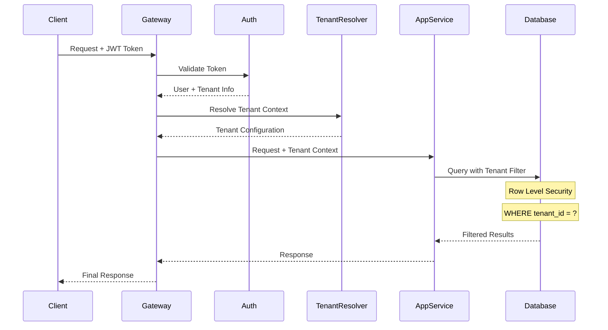

#### Critical Discussion Points
1. **Data Isolation Strategies:**
   - Trade-offs between shared vs dedicated resources
   - Cross-tenant data leakage prevention
   - Backup and disaster recovery per tenant

2. **Customization & Configuration:**
   - Feature flags per tenant
   - Custom workflows and business logic
   - Branding and UI customization

3. **Resource Management:**
   - Usage quotas and rate limiting
   - Performance isolation
   - Cost allocation and billing

---

## Specialized Domain Questions

### Question 7: Design a High-Frequency Trading System
**Difficulty:** ⭐⭐⭐⭐⭐
**Time:** 60 minutes
**Specialization:** Financial Systems

#### Problem Statement
Design a high-frequency trading system that can process market data feeds, execute algorithmic trading strategies, and place orders with microsecond latencies. Handle millions of market events per second with strict latency and reliability requirements.

#### Ultra-Low Latency Architecture
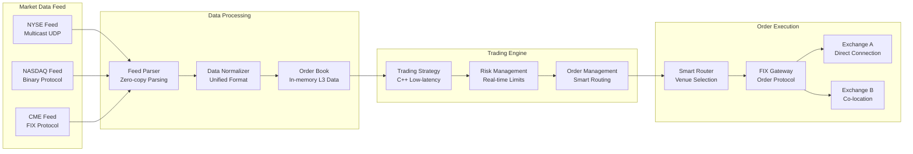

#### Ultra-Low Latency Optimizations
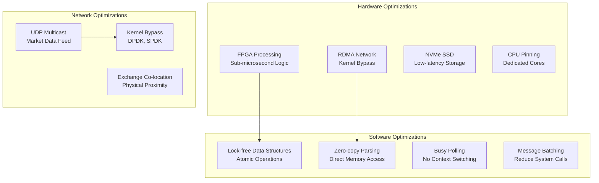

#### Risk Management System
```mermaid
flowchart LR
    subgraph "Pre-trade Risk Checks"
        A[Order Validation] --> B[Position Limits]
        B --> C[Capital Limits]
        C --> D[Concentration Risk]
        D --> E[Market Risk]
    end
    
    subgraph "Real-time Monitoring"
        F[P&L Monitoring] --> G[VaR Calculation]
        G --> H[Stress Testing]
        H --> I[Circuit Breakers]
    end
    
    subgraph "Post-trade Controls"
        J[Trade Reconciliation] --> K[Settlement Risk]
        K --> L[Counterparty Risk]
        L --> M[Regulatory Reporting]
    end
    
    E --> F
    I --> J
```

#### Critical Discussion Points
1. **Ultra-Low Latency Requirements:**
   - Hardware optimization (FPGA, custom hardware)
   - Network optimization (kernel bypass, DPDK)
   - Memory management (lock-free data structures)

2. **Risk Management:**
   - Real-time position tracking
   - Circuit breakers and kill switches
   - Regulatory compliance (MiFID II, Dodd-Frank)

3. **Market Data Processing:**
   - Order book reconstruction
   - Feed handler redundancy
   - Data normalization across exchanges

---

### Question 8: Design an IoT Data Processing Platform
**Difficulty:** ⭐⭐⭐⭐⭐
**Time:** 60 minutes
**Specialization:** IoT & Analytics

#### Problem Statement
Design an IoT platform handling data from 100 million devices, processing sensor readings, providing real-time analytics, device management, and supporting various protocols (MQTT, CoAP, HTTP).

#### IoT Platform Architecture
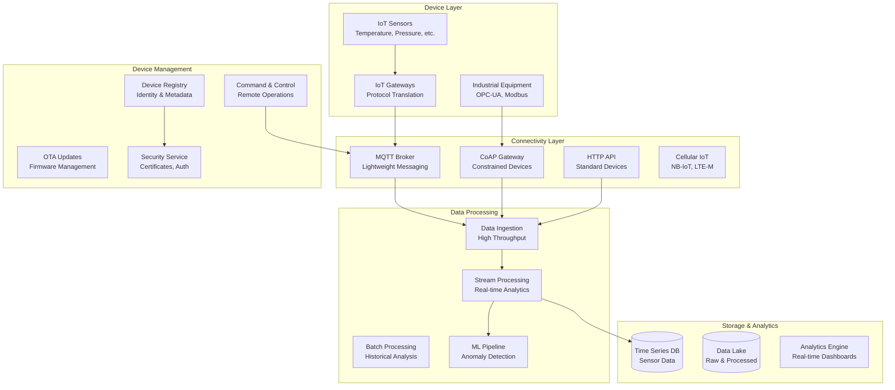

#### Data Processing Pipeline
```mermaid
flowchart LR
    subgraph "Edge Processing"
        A[Device Data] --> B[Edge Gateway<br/>Local Processing]
        B --> C[Data Filtering<br/>Reduce Bandwidth]
        C --> D[Local Analytics<br/>Immediate Response]
    end
    
    subgraph "Cloud Processing"
        E[Cloud Ingestion] --> F[Stream Processing<br/>Apache Kafka + Flink]
        F --> G[Real-time Analytics<br/>Windowing, Aggregation]
        G --> H[ML Processing<br/>Anomaly Detection]
    end
    
    subgraph "Data Storage Tiers"
        I[Hot Storage<br/>Recent data<br/>InfluxDB]
        J[Warm Storage<br/>Historical data<br/>Cassandra]
        K[Cold Storage<br/>Archive data<br/>S3/HDFS]
    end
    
    D --> E
    H --> I
    I -.->|30 days| J
    J -.->|1 year| K
```

#### Device Management & Security
```mermaid
graph TB
    subgraph "Device Lifecycle"
        Provision[Device Provisioning<br/>Certificate Installation]
        Register[Device Registration<br/>Identity Management]
        Activate[Device Activation<br/>Service Enrollment]
        Monitor[Device Monitoring<br/>Health & Status]
        Update[Firmware Updates<br/>OTA Deployment]
        Retire[Device Retirement<br/>Decommissioning]
    end
    
    subgraph "Security Framework"
        PKI[PKI Infrastructure<br/>Certificate Authority]
        Auth[Authentication<br/>Mutual TLS, JWT]
        Authz[Authorization<br/>Role-based Access]
        Encrypt[Data Encryption<br/>End-to-end Security]
    end
    
    Provision --> Register
    Register --> Activate
    Activate --> Monitor
    Monitor --> Update
    Update --> Retire
    
    PKI --> Auth
    Auth --> Authz
    Authz --> Encrypt
```

#### Critical Discussion Points
1. **Scale Challenges:**
   - 100M devices generating continuous data
   - Protocol diversity and gateway management
   - Network bandwidth optimization

2. **Edge vs Cloud Processing:**
   - Local processing for latency-critical applications
   - Bandwidth optimization strategies
   - Offline operation capabilities

3. **Device Management:**
   - Firmware update mechanisms at scale
   - Security certificate management
   - Device provisioning and decommissioning

---

### Question 9: Design a Multiplayer Gaming Platform
**Difficulty:** ⭐⭐⭐⭐⭐
**Time:** 60 minutes
**Specialization:** Gaming Systems

#### Problem Statement
Design a multiplayer gaming platform supporting 10 million concurrent players across different game types (real-time, turn-based, MMO). Handle matchmaking, real-time synchronization, anti-cheat, and global leaderboards.

#### Gaming Platform Architecture
```mermaid
graph TB
    subgraph "Client Layer"
        GameClient[Game Clients<br/>PC, Mobile, Console]
        SDK[Gaming SDK<br/>Client Libraries]
    end
    
    subgraph "Gateway & Load Balancing"
        CDN[Global CDN<br/>Game Assets, Updates]
        LB[Geographic Load Balancer<br/>Region Selection]
        Gateway[Game Gateway<br/>Connection Management]
    end
    
    subgraph "Game Services"
        Matchmaking[Matchmaking Service<br/>Player Matching]
        GameServer[Game Server Cluster<br/>Session Management]
        Sync[Real-time Sync<br/>State Synchronization]
        AntiCheat[Anti-cheat System<br/>Behavior Analysis]
    end
    
    subgraph "Platform Services"
        PlayerMgmt[Player Management<br/>Profiles, Authentication]
        Social[Social Features<br/>Friends, Chat, Guilds]
        Economy[Virtual Economy<br/>Items, Marketplace]
        Analytics[Game Analytics<br/>Player Behavior]
    end
    
    subgraph "Data Layer"
        PlayerDB[(Player Database<br/>Profiles, Progress)]
        GameDB[(Game State DB<br/>Session Data)]
        AnalyticsDB[(Analytics DB<br/>Events, Metrics)]
        Leaderboard[(Leaderboards<br/>Global Rankings)]
    end
    
    GameClient --> CDN
    GameClient --> Gateway
    Gateway --> Matchmaking
    Matchmaking --> GameServer
    GameServer --> Sync
    GameServer --> AntiCheat
    
    PlayerMgmt --> PlayerDB
    GameServer --> GameDB
    Analytics --> AnalyticsDB
    Social --> Leaderboard

```

#### Real-time Synchronization Strategies
```mermaid
graph TB
    subgraph "Authoritative Server Architecture"
        Client1[Player 1] --> Server[Game Server<br/>Authoritative State]
        Client2[Player 2] --> Server
        Client3[Player 3] --> Server
        ClientN[Player N] --> Server
        
        Server --> Client1
        Server --> Client2
        Server --> Client3
        Server --> ClientN
    end
    
    subgraph "State Synchronization"
        FullSync[Full State Sync<br/>Initial Game State]
        DeltaSync[Delta Sync<br/>State Changes Only]
        EventSync[Event-based Sync<br/>Player Actions]
        Prediction[Client Prediction<br/>Lag Compensation]
    end
    
    subgraph "Anti-cheat Integration"
        ServerValidation[Server Validation<br/>All Actions Verified]
        BehaviorAnalysis[Behavior Analysis<br/>Statistical Anomalies]
        Rollback[Rollback System<br/>Invalid State Recovery]
    end
    
    Server --> FullSync
    Server --> DeltaSync
    Server --> EventSync
    DeltaSync --> Prediction
    
    ServerValidation --> BehaviorAnalysis
    BehaviorAnalysis --> Rollback
```

#### Matchmaking System
```mermaid
flowchart TD
    A[Player Joins Queue] --> B[Skill Assessment]
    B --> C[Matchmaking Pool]
    C --> D{Pool Size Check}
    
    D -->|Sufficient Players| E[Skill-based Matching]
    D -->|Insufficient Players| F[Wait & Expand Criteria]
    
    E --> G[Latency Optimization]
    G --> H[Team Balancing]
    H --> I[Server Allocation]
    
    F --> J{Timeout Check}
    J -->|Within Timeout| C
    J -->|Timeout Exceeded| K[Relaxed Matching]
    K --> E
    
    I --> L[Game Session Start]

    subgraph MatchingCriteria["Matching Criteria"]
        M["Skill Rating ELO/MMR"]
        N["Geographic Location"]
        O["Connection Quality"]
        P["Game Mode Preferences"]
        Q["Language/Region"]
    end

    E --> M
    E --> N
    E --> O
    E --> P
    E --> Q
```

#### Critical Discussion Points
1. **Real-time Synchronization:**
   - Client-server vs peer-to-peer models
   - Lag compensation techniques
   - State consistency mechanisms

2. **Anti-cheat Systems:**
   - Server-side validation strategies
   - Behavioral pattern analysis
   - Machine learning for cheat detection

3. **Global Scale Challenges:**
   - Regional server deployment
   - Cross-region player interaction
   - Data consistency across regions

---

### Question 10: Design a Machine Learning Platform
**Difficulty:** ⭐⭐⭐⭐⭐
**Time:** 60 minutes
**Specialization:** ML/AI Systems

#### Problem Statement
Design an ML platform that supports the full ML lifecycle: data ingestion, feature engineering, model training, deployment, monitoring, and A/B testing. Support both batch and real-time inference with auto-scaling capabilities.

#### ML Platform Architecture
```mermaid
graph TB
    subgraph "Data Pipeline"
        DataSources[Data Sources<br/>Databases, APIs, Streams]
        Ingestion[Data Ingestion<br/>Batch + Streaming]
        DataLake[(Data Lake<br/>Raw Data Storage)]
        FeatureStore[Feature Store<br/>Engineered Features]
    end
    
    subgraph "ML Development"
        Notebooks[ML Notebooks<br/>Jupyter, Research]
        Experiments[Experiment Tracking<br/>MLflow, Weights & Biases]
        Training[Distributed Training<br/>TensorFlow, PyTorch]
        Registry[Model Registry<br/>Version Management]
    end
    
    subgraph "Model Serving"
        BatchInference[Batch Inference<br/>Scheduled Jobs]
        RealTimeInference[Real-time Inference<br/>Low-latency API]
        ABTesting[A/B Testing<br/>Model Comparison]
        ModelMonitoring[Model Monitoring<br/>Drift Detection]
    end
    
    subgraph "Infrastructure"
        Kubernetes[Kubernetes Cluster<br/>Container Orchestration]
        GPUCluster[GPU Cluster<br/>Training Workloads]
        AutoScaling[Auto-scaling<br/>Dynamic Resources]
        Storage[Distributed Storage<br/>Models, Artifacts]
    end
    
    DataSources --> Ingestion
    Ingestion --> DataLake
    DataLake --> FeatureStore
    
    FeatureStore --> Notebooks
    Notebooks --> Experiments
    Experiments --> Training
    Training --> Registry
    
    Registry --> BatchInference
    Registry --> RealTimeInference
    RealTimeInference --> ABTesting
    ABTesting --> ModelMonitoring
    
    Training --> GPUCluster
    RealTimeInference --> AutoScaling
```

#### Feature Store Architecture
```mermaid
graph TB
    subgraph "Feature Engineering Pipeline"
        Raw[Raw Data Sources] --> Transform[Transformation Jobs<br/>Spark, Airflow]
        Transform --> Validate[Data Validation<br/>Great Expectations]
        Validate --> Store[Feature Storage]
    end
    
    subgraph "Feature Storage"
        Online[Online Store<br/>Low-latency Serving<br/>Redis, DynamoDB]
        Offline[Offline Store<br/>Historical Features<br/>S3, BigQuery]
        Metadata[Feature Metadata<br/>Schema, Lineage]
    end
    
    subgraph "Feature Serving"
        Training[Training Pipeline] --> Offline
        Inference[Real-time Inference] --> Online
        Batch[Batch Inference] --> Offline
    end
    
    Store --> Online
    Store --> Offline
    Store --> Metadata
    
    Online --> Inference
    Offline --> Training
    Offline --> Batch
```

#### Model Deployment & Monitoring
```mermaid
sequenceDiagram
    participant Dev as ML Engineer
    participant Registry as Model Registry
    participant Deploy as Deployment Service
    participant Monitor as Monitoring System
    participant Alert as Alert Manager
    
    Dev->>Registry: Register New Model
    Registry->>Deploy: Trigger Deployment
    Deploy->>Deploy: Canary Deployment (5%)
    
    Deploy->>Monitor: Start Monitoring
    Monitor->>Monitor: Collect Metrics
    
    alt Model Performance Good
        Deploy->>Deploy: Scale to 50%
        Deploy->>Deploy: Scale to 100%
        Deploy->>Registry: Mark as Deployed
    else Performance Degraded
        Monitor->>Alert: Trigger Alert
        Alert->>Deploy: Initiate Rollback
        Deploy->>Registry: Rollback to Previous
    end
    
    Monitor->>Monitor: Continuous Drift Detection
    
    Note over Monitor: Data Drift, Concept Drift
    Note over Monitor: Model Performance Metrics
```

#### Critical Discussion Points
1. **Feature Engineering at Scale:**
   - Real-time feature computation
   - Feature versioning and lineage
   - Data quality and validation

2. **Model Deployment Strategies:**
   - Blue-green vs canary deployments
   - Multi-model serving optimization
   - A/B testing infrastructure

3. **Monitoring & Observability:**
   - Model drift detection
   - Performance degradation alerts
   - Explainability and bias detection

---

## Question Framework & Approach

### Senior-Level Interview Structure

#### Phase 1: Problem Understanding & Clarification (10 minutes)
**Key Activities:**
- **Scope Definition:** Clarify scale, requirements, and constraints
- **Stakeholder Identification:** Who are the users? What are their needs?
- **Success Metrics:** How do we measure system success?
- **Trade-off Priorities:** Performance, consistency, cost, complexity?

**Senior Expectations:**
- Asks insightful clarifying questions
- Identifies potential ambiguities early
- Demonstrates business understanding
- Considers multiple stakeholder perspectives

#### Phase 2: High-Level Design & Architecture (20 minutes)
**Key Activities:**
- **System Overview:** Draw the 30,000-foot view
- **Component Identification:** Major services and their responsibilities
- **Data Flow:** How information moves through the system
- **Integration Points:** External dependencies and APIs

**Senior Expectations:**
- Starts with simple, clear architecture
- Identifies key architectural patterns
- Considers multiple design approaches
- Explains design rationale clearly

#### Phase 3: Deep Dive & Scaling (20 minutes)
**Key Activities:**
- **Database Design:** Schema, partitioning, consistency
- **Scaling Strategies:** Horizontal vs vertical scaling approaches
- **Caching Layers:** Multi-level caching strategies
- **Performance Optimization:** Bottleneck identification and solutions

**Senior Expectations:**
- Demonstrates deep technical knowledge
- Considers multiple scaling approaches
- Understands trade-offs between solutions
- Plans for future growth and evolution

#### Phase 4: Operational Concerns (10 minutes)
**Key Activities:**
- **Monitoring & Alerting:** What metrics matter?
- **Disaster Recovery:** Backup, failover, data recovery
- **Security:** Authentication, authorization, data protection
- **Deployment:** CI/CD, rollback strategies

**Senior Expectations:**
- Thinks beyond just "making it work"
- Considers operational complexity
- Plans for failure scenarios
- Understands security implications

### Advanced Discussion Techniques

#### Trade-off Analysis Framework
```mermaid
graph TB
    subgraph "Decision Factors"
        Performance[Performance<br/>Latency, Throughput]
        Scalability[Scalability<br/>Growth, Load Handling]
        Consistency[Consistency<br/>Data Accuracy]
        Availability[Availability<br/>Uptime, Reliability]
        Cost[Cost<br/>Infrastructure, Development]
        Complexity[Complexity<br/>Operational, Technical]
    end
    
    subgraph "Trade-off Examples"
        A[Strong Consistency<br/>vs<br/>High Availability]
        B[Complex Caching<br/>vs<br/>Simple Architecture]
        C[Microservices<br/>vs<br/>Monolith]
        D[Real-time Processing<br/>vs<br/>Cost Efficiency]
    end
    
    Performance --> A
    Consistency --> A
    Availability --> A
    
    Performance --> B
    Complexity --> B
    
    Scalability --> C
    Complexity --> C
    
    Performance --> D
    Cost --> D
```

#### System Evolution Planning
**Questions to Explore:**
- How would you evolve this system from 1M to 100M users?
- What would you change if availability requirements increased to 99.99%?
- How would you adapt the architecture for global expansion?
- What would be the migration strategy from the current system?

---

## Evaluation Criteria

### Technical Competency Assessment

#### Distributed Systems Knowledge
**Expert Level (Senior+):**
- Understands CAP theorem implications deeply
- Can design consensus algorithms
- Handles network partitions gracefully
- Knows when to use different consistency models

**Proficient Level:**
- Understands basic distributed concepts
- Can apply standard patterns correctly
- Recognizes common failure modes
- Makes reasonable trade-off decisions

#### System Design Methodology
**Expert Level:**
- Follows structured approach consistently
- Asks all the right clarifying questions
- Considers multiple design alternatives
- Explains rationale for design decisions

**Proficient Level:**
- Has a general approach to system design
- Covers most important aspects
- Makes reasonable architectural decisions
- Can explain their thinking process

#### Scale & Performance
**Expert Level:**
- Accurately estimates system requirements
- Identifies bottlenecks proactively
- Designs for multiple orders of magnitude growth
- Optimizes for specific performance characteristics

**Proficient Level:**
- Understands basic scaling concepts
- Can identify obvious bottlenecks
- Plans for reasonable growth
- Applies standard performance optimizations

### Scoring Matrix

| **Criteria** | **Expert (5)** | **Proficient (4)** | **Competent (3)** | **Developing (2)** | **Novice (1)** |
|-------------|----------------|--------------------|--------------------|-------------------|-----------------|
| **Problem Analysis** | Identifies all nuances, edge cases | Covers key aspects, some edge cases | Basic understanding | Misses important aspects | Superficial analysis |
| **Architecture Design** | Multiple approaches, clear rationale | Solid approach, good reasoning | Basic architecture | Flawed architecture | No clear structure |
| **Distributed Systems** | Deep understanding, complex scenarios | Good grasp of concepts | Basic concepts | Limited understanding | Little to no knowledge |
| **Scalability Planning** | Multiple strategies, growth planning | Reasonable scaling approach | Basic scaling | Limited scaling thought | No scaling consideration |
| **Trade-off Analysis** | Comprehensive analysis, clear priorities | Good analysis, some trade-offs | Basic trade-offs | Limited consideration | No trade-off analysis |
| **Operational Readiness** | Production-ready thinking | Good operational awareness | Basic operations | Limited ops consideration | No operational thought |
| **Communication** | Clear, structured, engaging | Generally clear | Adequate communication | Sometimes unclear | Poor communication |

### Red Flags for Senior Candidates

#### Technical Red Flags
- **Over-engineering:** Adds unnecessary complexity without justification
- **Under-engineering:** Ignores obvious scaling or reliability issues
- **Pattern Misuse:** Applies design patterns inappropriately
- **Technology Bias:** Forces specific technologies without considering alternatives
- **No Trade-offs:** Doesn't acknowledge or discuss trade-offs

#### Process Red Flags
- **Jumps to Solution:** Doesn't clarify requirements first
- **Ignores Scale:** Doesn't consider the specified scale requirements
- **No Evolution Plan:** Doesn't think about how system grows over time
- **Missing Operations:** Forgets monitoring, deployment, disaster recovery
- **Poor Communication:** Can't explain decisions clearly

---

## Progression from Junior Level

### Capability Comparison Matrix

| **Aspect** | **Junior Engineer** | **Senior Engineer** |
|------------|---------------------|---------------------|
| **Problem Scope** | Single service, clear requirements | Multiple services, ambiguous requirements |
| **Scale Thinking** | Thousands of users | Millions/billions of users |
| **Architecture Patterns** | Standard patterns (MVC, REST) | Complex patterns (CQRS, Event Sourcing, Saga) |
| **Data Consistency** | ACID databases | Eventual consistency, distributed transactions |
| **Failure Handling** | Basic error handling | Circuit breakers, bulkheads, graceful degradation |
| **Performance** | Database optimization | Distributed caching, CDNs, multi-region |
| **Security** | Authentication/authorization | Zero-trust, end-to-end encryption, compliance |
| **Monitoring** | Basic logging | Distributed tracing, SLIs/SLOs, alerting strategies |
| **Business Context** | Technical requirements | Business impact, cost optimization, team scaling |

### Growth Path Recommendations

#### For Junior Engineers Preparing for Senior Interviews
1. **Study Distributed Systems:**
   - Read "Designing Data-Intensive Applications" by Martin Kleppmann
   - Understand CAP theorem, consistency models, consensus algorithms
   - Practice with distributed system simulators

2. **Real-world Experience:**
   - Work on systems with meaningful scale
   - Participate in architecture discussions
   - Learn from production incidents and post-mortems

3. **Business Understanding:**
   - Learn about cost implications of architectural decisions
   - Understand how technical choices affect user experience
   - Study successful and failed system architectures

4. **Practice Complex Scenarios:**
   - Start with junior questions, then add complexity
   - Practice explaining trade-offs clearly
   - Work through operational concerns systematically

#### Key Learning Resources

**Books:**
- "Designing Data-Intensive Applications" - Martin Kleppmann
- "Building Microservices" - Sam Newman
- "Site Reliability Engineering" - Google SRE Team
- "High Performance Browser Networking" - Ilya Grigorik

**Papers & Articles:**
- Google's distributed systems papers (MapReduce, BigTable, Spanner)
- Netflix tech blog on microservices architecture
- Uber's architecture evolution articles
- Facebook's system design posts

**Hands-on Practice:**
- AWS Well-Architected Framework
- System design interview prep platforms
- Open source distributed systems (Cassandra, Kafka, Kubernetes)
- Cloud provider architecture examples

---

## Conclusion

Senior-level system design interviews require demonstrating not just technical knowledge, but architectural thinking, business acumen, and the ability to handle complex trade-offs. The questions in this guide are designed to evaluate these capabilities through realistic, large-scale scenarios.

### Key Success Factors

1. **Structured Thinking:** Follow a consistent approach to problem-solving
2. **Deep Technical Knowledge:** Understand distributed systems concepts thoroughly
3. **Business Awareness:** Consider cost, team impact, and business requirements
4. **Communication Skills:** Explain complex concepts clearly and concisely
5. **Trade-off Analysis:** Identify and articulate important architectural decisions

### Continuous Improvement

The field of system architecture is constantly evolving. Stay current with:
- New architectural patterns and technologies
- Industry case studies and post-mortems
- Performance benchmarks and best practices
- Regulatory and compliance changes
- Emerging challenges in distributed systems

Remember: Senior system design interviews are conversations about solving real problems at scale. Approach them with curiosity, structured thinking, and genuine interest in building systems that work reliably for millions of users.

---

*Version: 1.0*
*Owner: @codewithmunyao*
*Related Documents:*
- *[Senior Interview Guide](../engineer-interview-guide/senior-guide.md)*
- *[Trade-offs Decision Guide](../estimation-techniques/trade-offs-decisions.md)*