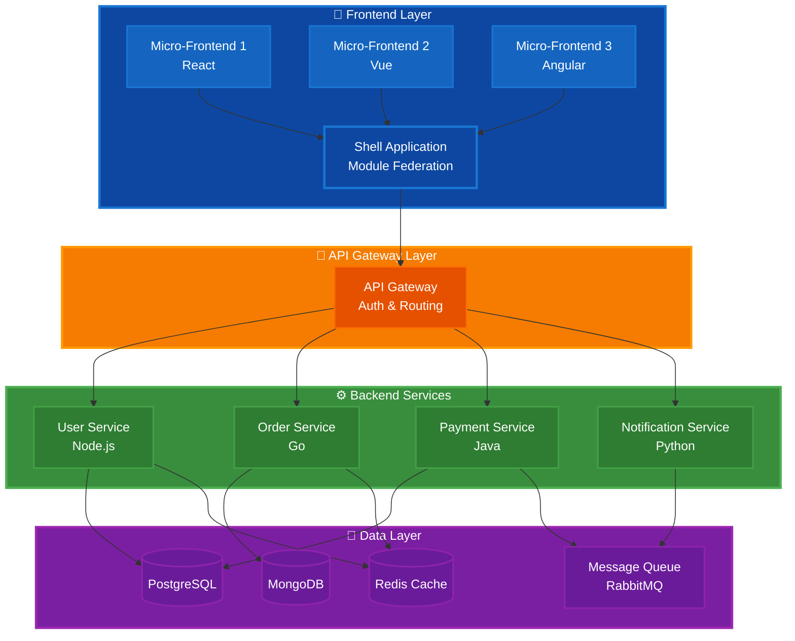
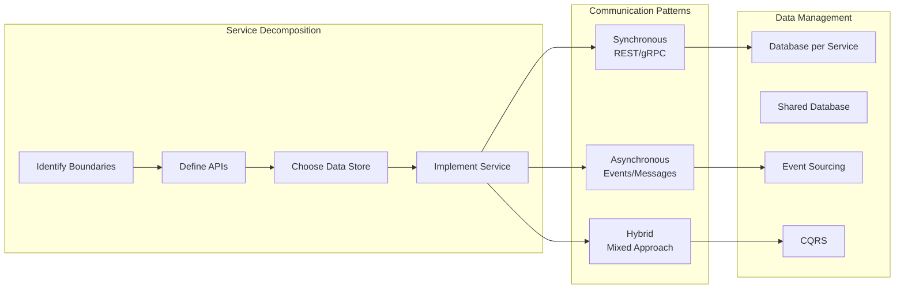
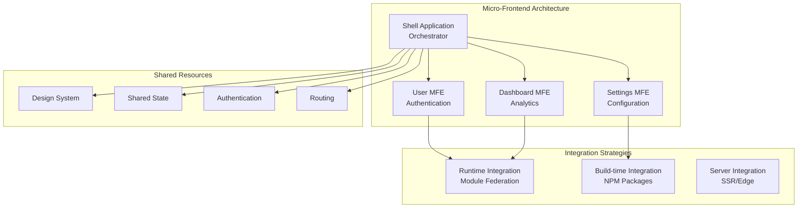
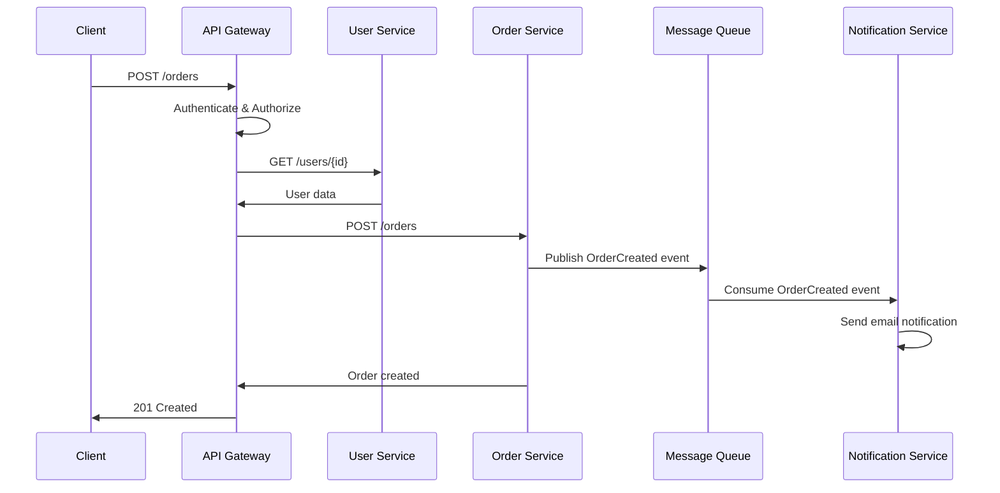

# Microservices Architecture Guide

A comprehensive guide to building, deploying, and maintaining microservices architectures for both backend and frontend systems.

## Table of Contents

- [Overview](#overview)
- [Architecture Diagram](#architecture-diagram)
- [Documentation Structure](#documentation-structure)
- [Backend Microservices](#backend-microservices)
- [Frontend Microservices](#frontend-microservices)
- [Getting Started](#getting-started)
- [Key Concepts](#key-concepts)
- [Quick Reference](#quick-reference)

---

## Overview

This repository contains comprehensive documentation for implementing microservices architecture across your application stack. It covers both backend service decomposition and frontend micro-frontend patterns.

### What You'll Learn

- **Backend**: Service boundaries, data patterns, communication protocols, deployment strategies
- **Frontend**: Module federation, micro-frontends, cross-framework integration, runtime composition
- **Cross-cutting**: Security, observability, resilience, performance optimization, testing strategies

### Architecture Philosophy



---

## Documentation Structure

### Backend Microservices (`/backend/docs/`)

| Document | Description | Key Topics |
|----------|-------------|------------|
| [01-introduction.md](./backend/docs/01-introduction.md) | Foundation concepts | Monolith vs Microservices, When to use, Trade-offs |
| [02-service-architecture.md](./backend/docs/02-service-architecture.md) | Service design patterns | Decomposition strategies, Boundaries, API design |
| [03-database-patterns.md](./backend/docs/03-database-patterns.md) | Data management | Database per service, Event sourcing, CQRS, Sagas |
| [04-communication.md](./backend/docs/04-communication.md) | Inter-service communication | REST, gRPC, Message queues, Event-driven |
| [05-deployment-strategies.md](./backend/docs/05-deployment-strategies.md) | Deployment & orchestration | Docker, Kubernetes, CI/CD, Blue-green deployments |
| [06-security.md](./backend/docs/06-security.md) | Security patterns | Authentication, Authorization, mTLS, API security |
| [07-observability.md](./backend/docs/07-observability.md) | Monitoring & logging | Distributed tracing, Metrics, Log aggregation |
| [08-resilience.md](./backend/docs/08-resilience.md) | Fault tolerance | Circuit breakers, Retries, Bulkheads, Timeouts |
| [09-performance-optimization.md](./backend/docs/09-performance-optimization.md) | Performance tuning | Caching, Load balancing, Database optimization |
| [10-testing.md](./backend/docs/10-testing.md) | Testing strategies | Unit, Integration, Contract, E2E testing |
| [11-tools-ecosystem.md](./backend/docs/11-tools-ecosystem.md) | Tools & frameworks | Service mesh, API gateways, Observability tools |
| [12-best-practises.md](./backend/docs/12-best-practises.md) | Best practices | Design principles, Common pitfalls, Checklists |

### Frontend Microservices (`/frontend/docs/`)

| Document | Description | Key Topics |
|----------|-------------|------------|
| [01-introduction.md](./frontend/docs/01-introduction.md) | Micro-frontend concepts | What are micro-frontends, Benefits, Architecture styles |
| [02-monorepo-setup.md](./frontend/docs/02-monorepo-setup.md) | Monorepo organization | Nx, Turborepo, Workspace structure, Versioning |
| [03-development-architecture.md](./frontend/docs/03-development-architecture.md) | Development patterns | Module federation, Component sharing, State management |
| [04-runtime-integration.md](./frontend/docs/04-runtime-integration.md) | Runtime composition | Shell application, Dynamic loading, Routing |
| [05-cross-framework.md](./frontend/docs/05-cross-framework.md) | Framework integration | React + Vue + Angular, Web components, Adaptors |
| [06-deployment-strategies.md](./frontend/docs/06-deployment-strategies.md) | Frontend deployment | Independent deployments, Versioning, Rollbacks |
| [07-performance-monitoring.md](./frontend/docs/07-performance-monitoring.md) | Performance tracking | Bundle analysis, Core Web Vitals, RUM |
| [08-security.md](./frontend/docs/08-security.md) | Frontend security | XSS prevention, CSP, Authentication, CORS |
| [09-testing.md](./frontend/docs/09-testing.md) | Frontend testing | Component tests, Integration, E2E, Visual regression |
| [10-tools-ecosystem.md](./frontend/docs/10-tools-ecosystem.md) | Frontend tools | Webpack Module Federation, Single-SPA, Vite |
| [11-advanced-patterns.md](./frontend/docs/11-advanced-patterns.md) | Advanced techniques | Server-side rendering, Edge rendering, Islands |
| [12-best-practises.md](./frontend/docs/12-best-practises.md) | Frontend best practices | Design systems, Performance, Accessibility |

---

## Backend Microservices

### Quick Start

```javascript
// Example: User Service (Node.js/Express)
const express = require('express');
const app = express();

// Health check endpoint
app.get('/health', (req, res) => {
  res.json({ status: 'healthy', service: 'user-service' });
});

// Business logic
app.get('/api/users/:id', async (req, res) => {
  try {
    const user = await userRepository.findById(req.params.id);
    res.json(user);
  } catch (error) {
    res.status(500).json({ error: error.message });
  }
});

app.listen(3000);
```

### Core Backend Concepts



**Deep Dive**: 
- Service boundaries → [02-service-architecture.md](./backend/docs/02-service-architecture.md)
- Communication patterns → [04-communication.md](./backend/docs/04-communication.md)
- Data patterns → [03-database-patterns.md](./backend/docs/03-database-patterns.md)

---

## Frontend Microservices

### Quick Start

```javascript
// Example: Module Federation Configuration (Webpack 5)
module.exports = {
  plugins: [
    new ModuleFederationPlugin({
      name: 'userApp',
      filename: 'remoteEntry.js',
      exposes: {
        './UserProfile': './src/components/UserProfile',
        './UserSettings': './src/components/UserSettings'
      },
      shared: {
        react: { singleton: true },
        'react-dom': { singleton: true }
      }
    })
  ]
};

// Shell Application: Consuming Remote Modules
import('userApp/UserProfile').then(module => {
  const UserProfile = module.default;
  // Render component
});
```

### Core Frontend Concepts



**Deep Dive**:
- Module Federation → [04-runtime-integration.md](./frontend/docs/04-runtime-integration.md)
- Monorepo setup → [02-monorepo-setup.md](./frontend/docs/02-monorepo-setup.md)
- Cross-framework patterns → [05-cross-framework.md](./frontend/docs/05-cross-framework.md)

---

## Getting Started

### Prerequisites

**Backend**:
- Docker & Docker Compose
- Kubernetes (Minikube/K3s for local development)
- Node.js 18+, Go 1.20+, or Java 17+ (depending on service language)
- Message broker (RabbitMQ/Kafka)
- Service mesh (Istio/Linkerd - optional)

**Frontend**:
- Node.js 18+
- Package manager (npm/yarn/pnpm)
- Webpack 5+ or Vite 4+ (for Module Federation)
- Monorepo tool (Nx/Turborepo - optional)

### Installation

```bash
# Clone repository
git clone <repository-url>
cd microservices

# Backend services
cd backend
docker-compose up -d  # Start infrastructure
npm run dev           # Start services in development

# Frontend micro-frontends
cd ../frontend
npm install           # Install dependencies
npm run dev           # Start shell and micro-frontends
```

### Project Structure

```
microservices/
├── backend/
│   ├── docs/                    # Backend documentation
│   ├── services/
│   │   ├── user-service/        # Individual services
│   │   ├── order-service/
│   │   └── payment-service/
│   ├── shared/                  # Shared libraries
│   ├── infrastructure/          # K8s manifests, Docker configs
│   └── docker-compose.yml
│
├── frontend/
│   ├── docs/                    # Frontend documentation
│   ├── apps/
│   │   ├── shell/               # Shell application
│   │   ├── user-mfe/            # User micro-frontend
│   │   ├── dashboard-mfe/       # Dashboard micro-frontend
│   │   └── settings-mfe/        # Settings micro-frontend
│   ├── packages/
│   │   ├── design-system/       # Shared UI components
│   │   └── utils/               # Shared utilities
│   └── package.json
│
└── README.md                    # This file
```

---

## Key Concepts

### Service Communication Flow



### Data Consistency Patterns

**Saga Pattern Example**:

```javascript
// Order Saga Orchestrator
class OrderSaga {
  async createOrder(orderData) {
    const sagaId = generateId();
    
    try {
      // Step 1: Reserve inventory
      await inventoryService.reserveItems(sagaId, orderData.items);
      
      // Step 2: Process payment
      await paymentService.processPayment(sagaId, orderData.payment);
      
      // Step 3: Create order
      const order = await orderService.createOrder(sagaId, orderData);
      
      // Step 4: Send confirmation
      await notificationService.sendConfirmation(sagaId, order);
      
      return order;
    } catch (error) {
      // Compensating transactions
      await this.compensate(sagaId, error);
      throw error;
    }
  }
  
  async compensate(sagaId, error) {
    await inventoryService.releaseReservation(sagaId);
    await paymentService.refund(sagaId);
    await orderService.cancelOrder(sagaId);
  }
}
```

**Read More**: [03-database-patterns.md](./backend/docs/03-database-patterns.md#saga-pattern)

### Circuit Breaker Pattern

```javascript
// Circuit Breaker Implementation
class CircuitBreaker {
  constructor(threshold = 5, timeout = 60000) {
    this.failureThreshold = threshold;
    this.timeout = timeout;
    this.failureCount = 0;
    this.state = 'CLOSED'; // CLOSED, OPEN, HALF_OPEN
    this.nextAttempt = Date.now();
  }
  
  async call(serviceFunction) {
    if (this.state === 'OPEN') {
      if (Date.now() < this.nextAttempt) {
        throw new Error('Circuit breaker is OPEN');
      }
      this.state = 'HALF_OPEN';
    }
    
    try {
      const result = await serviceFunction();
      this.onSuccess();
      return result;
    } catch (error) {
      this.onFailure();
      throw error;
    }
  }
  
  onSuccess() {
    this.failureCount = 0;
    this.state = 'CLOSED';
  }
  
  onFailure() {
    this.failureCount++;
    if (this.failureCount >= this.failureThreshold) {
      this.state = 'OPEN';
      this.nextAttempt = Date.now() + this.timeout;
    }
  }
}

// Usage
const paymentCircuitBreaker = new CircuitBreaker(5, 60000);
const result = await paymentCircuitBreaker.call(() => 
  paymentService.processPayment(amount)
);
```

**Read More**: [08-resilience.md](./backend/docs/08-resilience.md#circuit-breaker)

---

## Quick Reference

### Backend Patterns

| Pattern | Use Case | Documentation |
|---------|----------|---------------|
| **API Gateway** | Single entry point, routing, authentication | [02-service-architecture.md](./backend/docs/02-service-architecture.md) |
| **Service Mesh** | Service-to-service communication, observability | [11-tools-ecosystem.md](./backend/docs/11-tools-ecosystem.md) |
| **Event Sourcing** | Audit trail, temporal queries, CQRS | [03-database-patterns.md](./backend/docs/03-database-patterns.md) |
| **Saga Pattern** | Distributed transactions, data consistency | [03-database-patterns.md](./backend/docs/03-database-patterns.md) |
| **Circuit Breaker** | Fault tolerance, graceful degradation | [08-resilience.md](./backend/docs/08-resilience.md) |
| **Rate Limiting** | API protection, fair usage | [06-security.md](./backend/docs/06-security.md) |
| **Blue-Green Deployment** | Zero-downtime deployments | [05-deployment-strategies.md](./backend/docs/05-deployment-strategies.md) |

### Frontend Patterns

| Pattern | Use Case | Documentation |
|---------|----------|---------------|
| **Module Federation** | Runtime micro-frontend integration | [04-runtime-integration.md](./frontend/docs/04-runtime-integration.md) |
| **Shell Application** | Micro-frontend orchestration | [04-runtime-integration.md](./frontend/docs/04-runtime-integration.md) |
| **Design System** | Consistent UI across micro-frontends | [12-best-practises.md](./frontend/docs/12-best-practises.md) |
| **Shared State** | Cross-MFE state management | [03-development-architecture.md](./frontend/docs/03-development-architecture.md) |
| **Web Components** | Framework-agnostic components | [05-cross-framework.md](./frontend/docs/05-cross-framework.md) |
| **Independent Deployments** | Autonomous team deployments | [06-deployment-strategies.md](./frontend/docs/06-deployment-strategies.md) |
| **Performance Monitoring** | Bundle size, Core Web Vitals tracking | [07-performance-monitoring.md](./frontend/docs/07-performance-monitoring.md) |

### Common Commands

```bash
# Backend
docker-compose up -d              # Start infrastructure
kubectl apply -f k8s/             # Deploy to Kubernetes
npm run test:integration          # Run integration tests
npm run lint                      # Lint all services

# Frontend
npm run build                     # Build all micro-frontends
npm run dev                       # Start development servers
npm run test                      # Run unit tests
npm run test:e2e                  # Run E2E tests
npx nx graph                      # Visualize dependency graph
```

### Monitoring & Debugging

```bash
# View logs
kubectl logs -f deployment/user-service
docker-compose logs -f user-service

# Check service health
curl http://localhost:3000/health
kubectl get pods

# Access metrics
curl http://localhost:3000/metrics  # Prometheus format
open http://localhost:3001/grafana  # Grafana dashboard

# Distributed tracing
open http://localhost:16686         # Jaeger UI
```

---

## Learning Path

### For Backend Engineers

1. Start with [01-introduction.md](./backend/docs/01-introduction.md) - Understand microservices fundamentals
2. Read [02-service-architecture.md](./backend/docs/02-service-architecture.md) - Learn service decomposition
3. Study [03-database-patterns.md](./backend/docs/03-database-patterns.md) - Master data management
4. Explore [04-communication.md](./backend/docs/04-communication.md) - Inter-service communication
5. Implement [08-resilience.md](./backend/docs/08-resilience.md) patterns - Build fault-tolerant services
6. Setup [07-observability.md](./backend/docs/07-observability.md) - Monitor your services
7. Deploy with [05-deployment-strategies.md](./backend/docs/05-deployment-strategies.md) - Production deployment

### For Frontend Engineers

1. Start with [01-introduction.md](./frontend/docs/01-introduction.md) - Micro-frontend concepts
2. Setup [02-monorepo-setup.md](./frontend/docs/02-monorepo-setup.md) - Organize your codebase
3. Learn [04-runtime-integration.md](./frontend/docs/04-runtime-integration.md) - Module Federation
4. Explore [05-cross-framework.md](./frontend/docs/05-cross-framework.md) - Multi-framework integration
5. Optimize with [07-performance-monitoring.md](./frontend/docs/07-performance-monitoring.md) - Performance tracking
6. Secure with [08-security.md](./frontend/docs/08-security.md) - Frontend security
7. Deploy with [06-deployment-strategies.md](./frontend/docs/06-deployment-strategies.md) - Independent deployments

### For Architects

1. Review both [01-introduction.md](./backend/docs/01-introduction.md) files - Understand full stack
2. Study [02-service-architecture.md](./backend/docs/02-service-architecture.md) - Service boundaries
3. Master [03-database-patterns.md](./backend/docs/03-database-patterns.md) - Data architecture
4. Implement [06-security.md](./backend/docs/06-security.md) & [08-security.md](./frontend/docs/08-security.md) - Security strategy
5. Design [07-observability.md](./backend/docs/07-observability.md) - Monitoring architecture
6. Review all [12-best-practises.md](./backend/docs/12-best-practises.md) files - Best practices

---

## Decision Matrix

### When to Use Microservices

| Scenario | Microservices | Monolith |
|----------|---------------|----------|
| Team size > 20 engineers | ✅ | ❌ |
| Multiple domain areas | ✅ | ❌ |
| Need independent scaling | ✅ | ❌ |
| Polyglot requirements | ✅ | ❌ |
| Simple CRUD application | ❌ | ✅ |
| Startup/MVP | ❌ | ✅ |
| Limited DevOps resources | ❌ | ✅ |

**Detailed Analysis**: [01-introduction.md](./backend/docs/01-introduction.md#when-to-use-microservices)

---

## Contributing

Contributions are welcome! Please read our contribution guidelines:

1. Fork the repository
2. Create a feature branch
3. Make your changes
4. Add/update documentation
5. Submit a pull request

---

## Resources

### Official Documentation
- [Docker Documentation](https://docs.docker.com/)
- [Kubernetes Documentation](https://kubernetes.io/docs/)
- [Webpack Module Federation](https://webpack.js.org/concepts/module-federation/)
- [Nx Documentation](https://nx.dev/)

### Further Reading
- Martin Fowler - [Microservices Guide](https://martinfowler.com/microservices/)
- Sam Newman - Building Microservices
- Michael Geers - Micro Frontends in Action

---

## Support

For questions and support:
- Open an issue in the repository
- Check existing documentation in `/backend/docs/` and `/frontend/docs/`
- Review [12-best-practises.md](./backend/docs/12-best-practises.md) and [12-best-practises.md](./frontend/docs/12-best-practises.md)

---
