# Production-Ready Microservices Backend Architecture Guide

## Table of Contents
1. [Introduction](#introduction)
2. [Architecture Patterns](#architecture-patterns)
3. [Service Design Principles](#service-design-principles)
4. [Communication Strategies](#communication-strategies)
5. [Data Management](#data-management)
6. [Service Discovery & Configuration](#service-discovery--configuration)
7. [Resilience & Fault Tolerance](#resilience--fault-tolerance)
8. [Security Architecture](#security-architecture)
9. [Monitoring & Observability](#monitoring--observability)
10. [Testing Strategies](#testing-strategies)
11. [Deployment & Infrastructure](#deployment--infrastructure)
12. [Performance & Scalability](#performance--scalability)
13. [Governance & Best Practices](#governance--best-practices)

## Introduction

Microservices architecture is a distributed system design approach where applications are composed of small, independent services that communicate over well-defined APIs. This guide provides language-agnostic principles and patterns for building production-ready microservices.

### Key Characteristics
- **Independent Deployability**: Services can be deployed independently
- **Business Domain Focus**: Services align with business capabilities
- **Decentralized Governance**: Teams own their services end-to-end
- **Technology Diversity**: Freedom to choose appropriate tech stack
- **Failure Isolation**: Failures are contained within service boundaries

## Architecture Patterns

### 1. Overall System Architecture

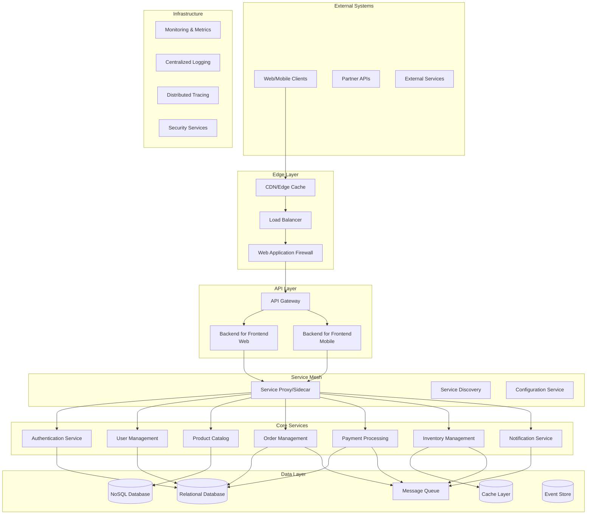

### 2. Service Decomposition Patterns

#### Domain-Driven Design (DDD)
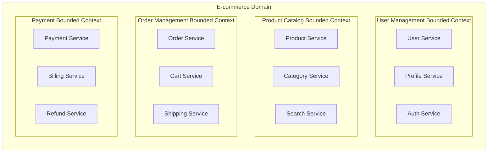

#### Strangler Fig Pattern (Legacy Migration)
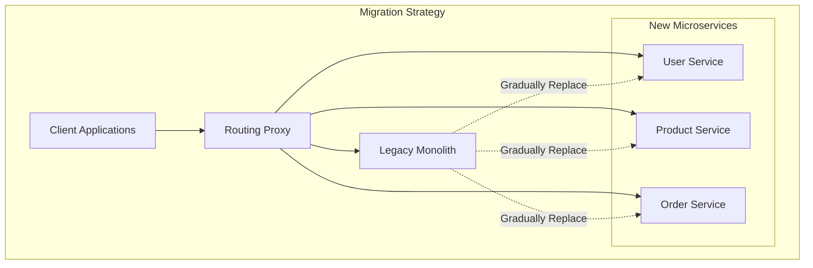

## Service Design Principles

### 1. Single Responsibility Principle
Each service should have one reason to change and should be responsible for a single business capability.

### 2. Service Boundaries
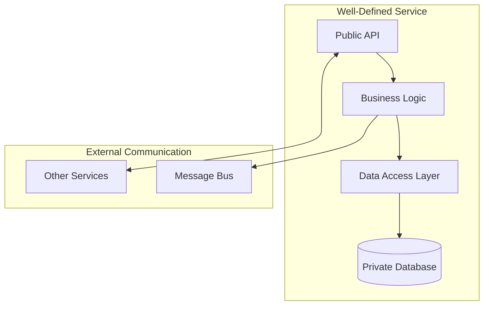

### 3. Data Ownership
- Each service owns its data exclusively
- No direct database access between services
- Data consistency through events and eventual consistency

### 4. API Design Principles
- **RESTful APIs**: For synchronous communication
- **Event-driven APIs**: For asynchronous communication
- **GraphQL**: For flexible data fetching
- **gRPC**: For high-performance inter-service communication

## Communication Strategies

### 1. Synchronous Communication

#### REST API
```http
# User Service API
GET    /users/{id}
POST   /users
PUT    /users/{id}
DELETE /users/{id}

# Product Service API
GET    /products?category={category}&page={page}
POST   /products
PUT    /products/{id}
DELETE /products/{id}
```

#### gRPC
```protobuf
// user.proto
syntax = "proto3";

service UserService {
  rpc GetUser(GetUserRequest) returns (User);
  rpc CreateUser(CreateUserRequest) returns (User);
  rpc UpdateUser(UpdateUserRequest) returns (User);
}

message User {
  int64 id = 1;
  string email = 2;
  string name = 3;
  int64 created_at = 4;
}
```

### 2. Asynchronous Communication

#### Event-Driven Architecture
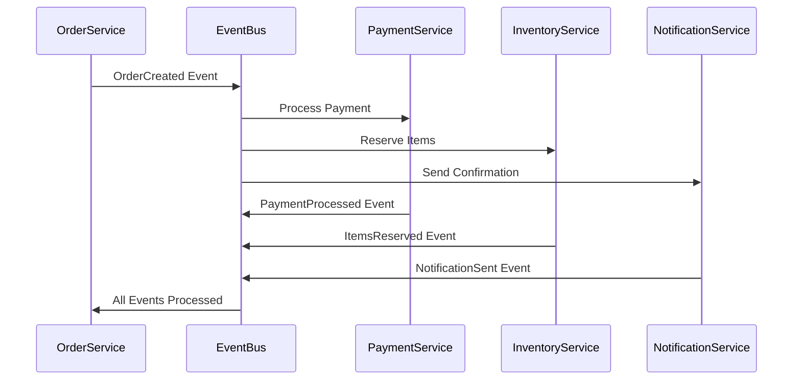

#### Message Queue Patterns

**Point-to-Point (Queue)**
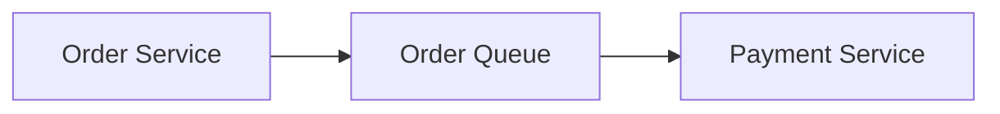

**Publish-Subscribe (Topic)**
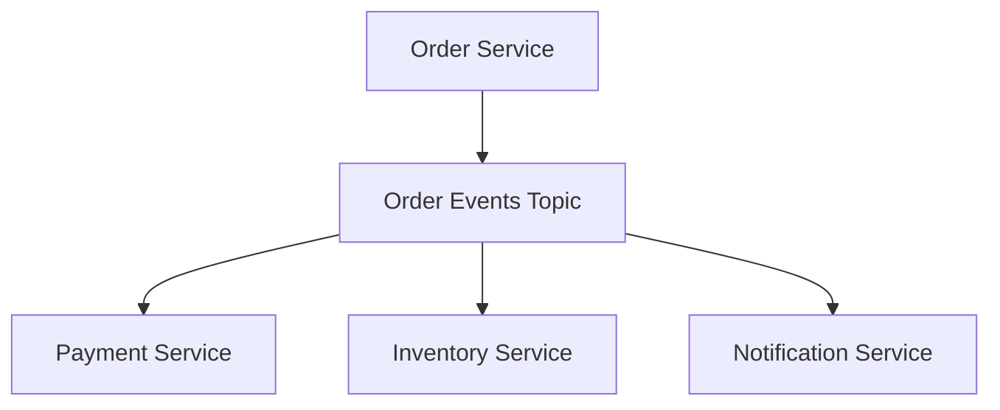

## Data Management

### 1. Database per Service Pattern
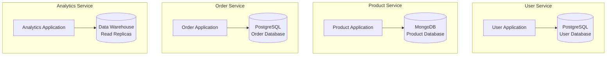

### 2. CQRS (Command Query Responsibility Segregation)
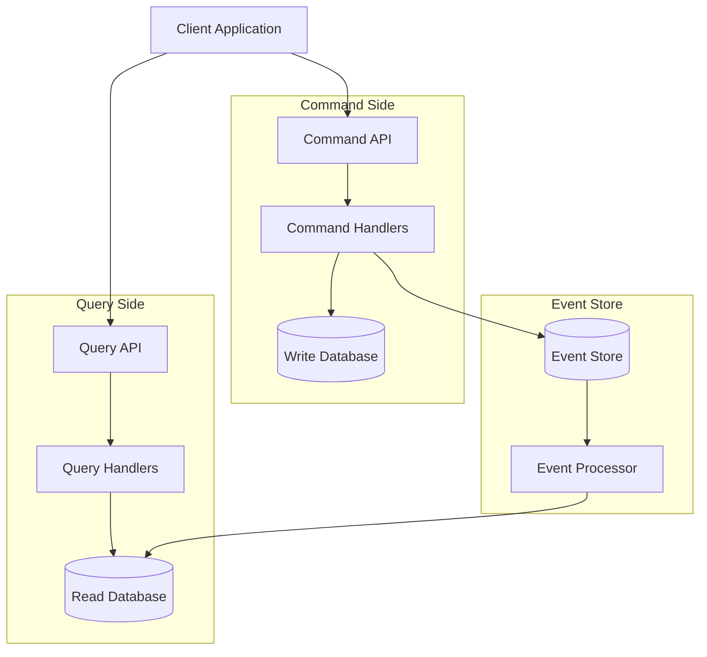

### 3. Saga Pattern for Distributed Transactions

#### Orchestration-based Saga
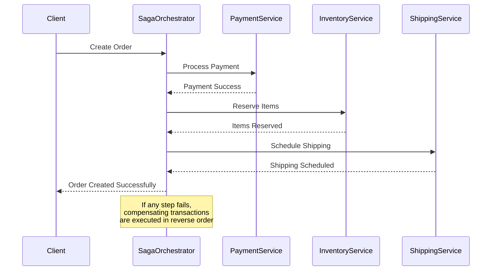

#### Choreography-based Saga
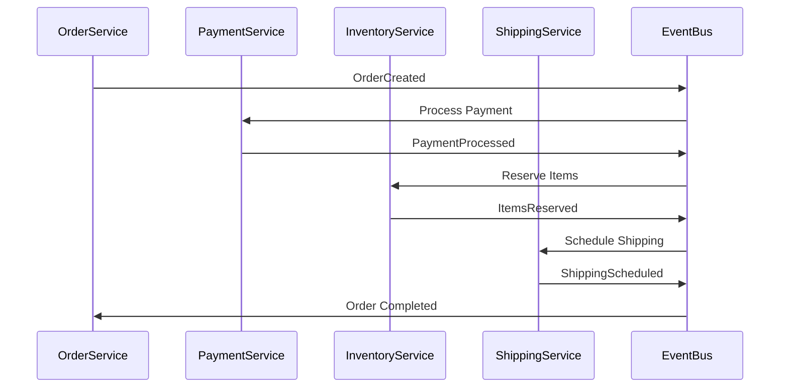

## Service Discovery & Configuration

### 1. Service Discovery Patterns

#### Client-Side Discovery
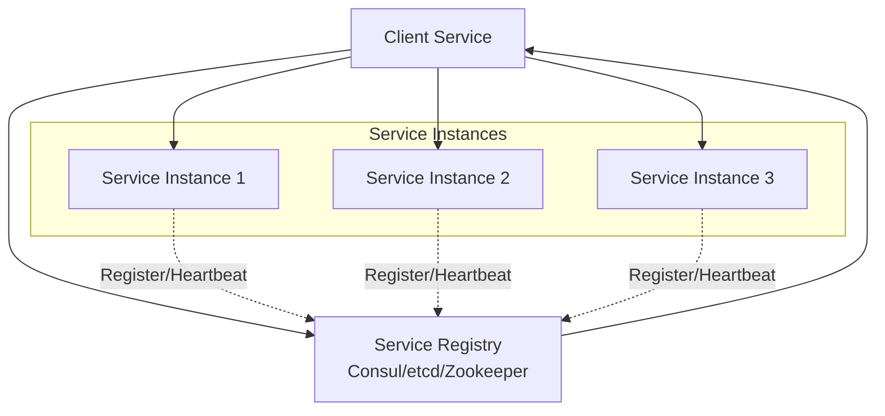

#### Server-Side Discovery (Service Mesh)
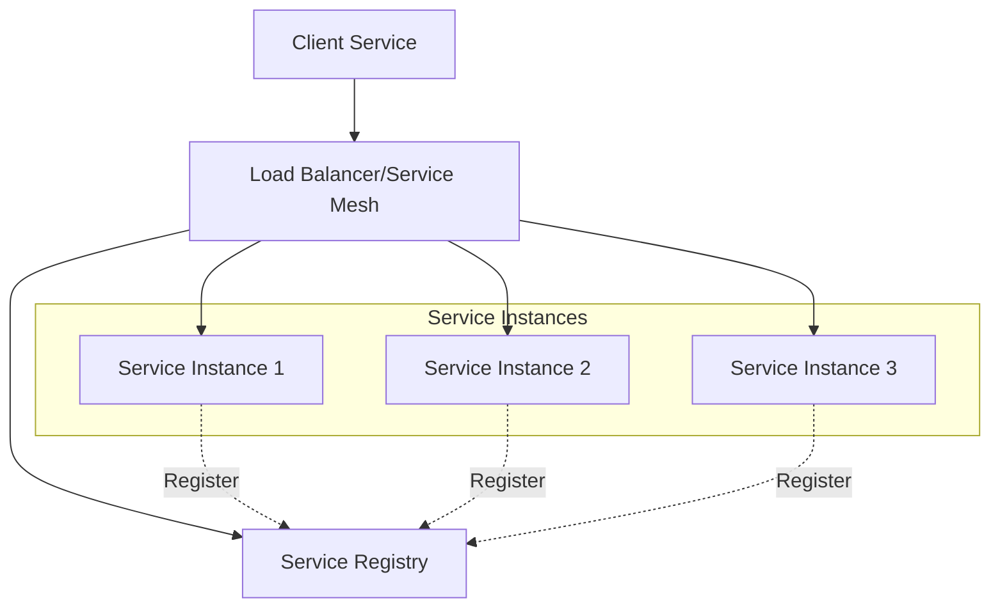

### 2. Configuration Management

#### Centralized Configuration
```yaml
# Configuration Service
services:
  user-service:
    database:
      host: user-db.example.com
      port: 5432
      name: users
    redis:
      host: redis.example.com
      port: 6379
    features:
      registration_enabled: true
      email_verification: true
    
  product-service:
    database:
      host: product-db.example.com
      port: 27017
      name: products
    elasticsearch:
      host: es.example.com
      port: 9200
```

## Resilience & Fault Tolerance

### 1. Circuit Breaker Pattern
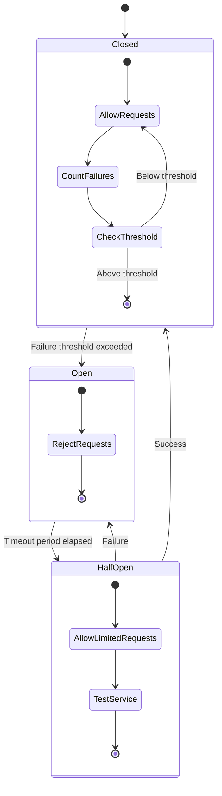

### 2. Retry Patterns

#### Exponential Backoff
```
Attempt 1: 0ms delay
Attempt 2: 100ms delay
Attempt 3: 200ms delay
Attempt 4: 400ms delay
Attempt 5: 800ms delay
```

#### Retry with Jitter
```
Attempt 1: 0ms + random(0, 50ms)
Attempt 2: 100ms + random(0, 100ms)
Attempt 3: 200ms + random(0, 200ms)
```

### 3. Bulkhead Pattern
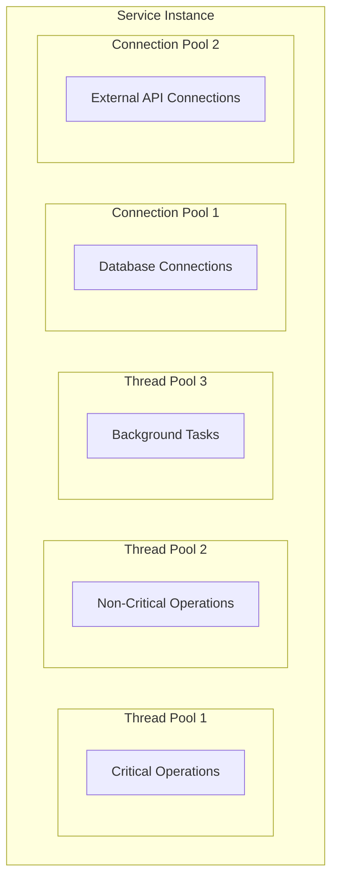

### 4. Timeout Patterns
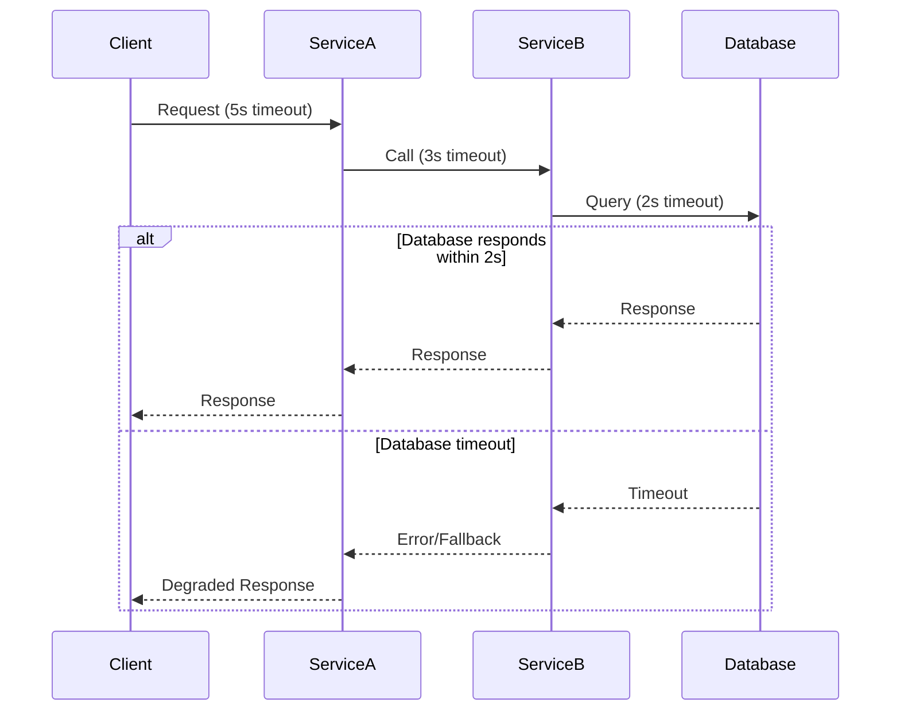

## Security Architecture

### 1. Authentication & Authorization

#### OAuth 2.0 / OpenID Connect Flow
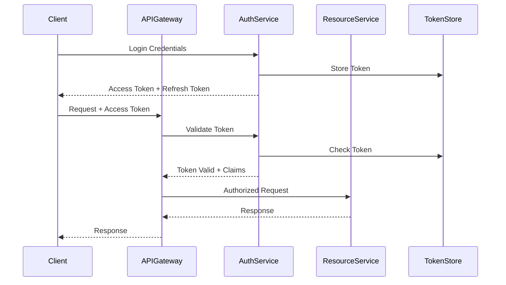

### 2. Service-to-Service Security

#### Mutual TLS (mTLS)
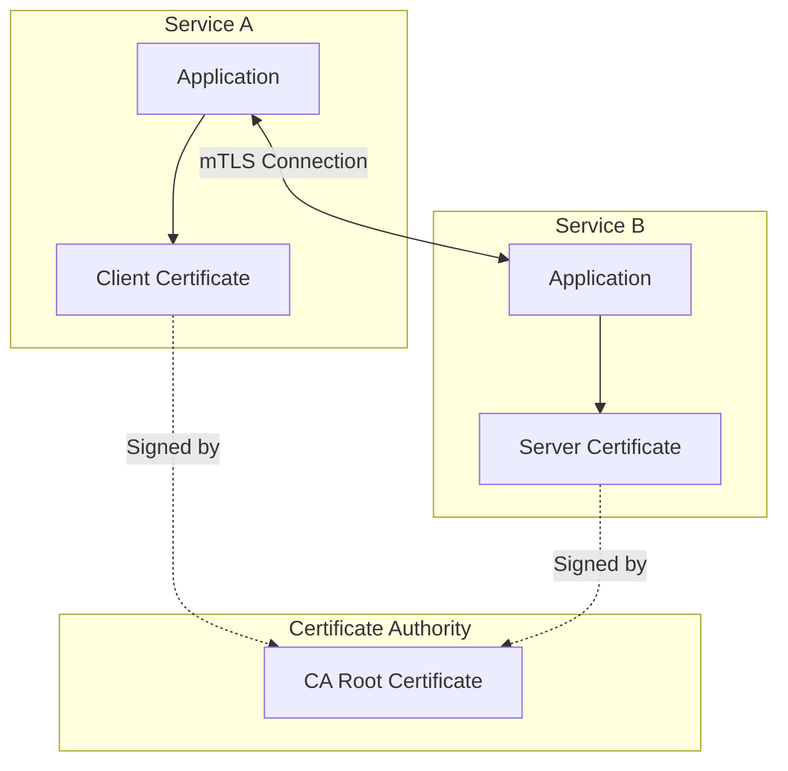

### 3. API Security Layers
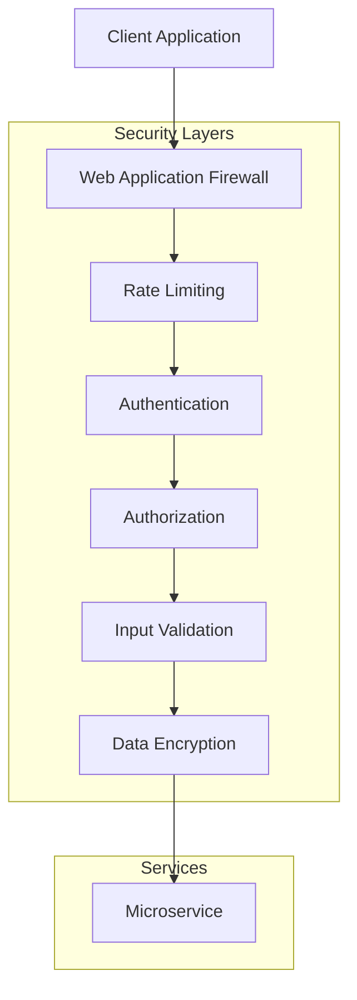

## Monitoring & Observability

### 1. Three Pillars of Observability

#### Metrics
```yaml
# Prometheus Metrics Examples
http_requests_total{service="user-service", method="GET", status="200"}
http_request_duration_seconds{service="user-service", method="POST"}
database_connections_active{service="user-service", database="postgresql"}
circuit_breaker_state{service="payment-service", dependency="bank-api"}
```

#### Logging
```json
{
  "timestamp": "2024-01-15T10:30:00Z",
  "service": "order-service",
  "level": "INFO",
  "traceId": "abc123def456",
  "spanId": "789xyz",
  "userId": "user123",
  "message": "Order created successfully",
  "orderId": "order456",
  "amount": 99.99
}
```

#### Distributed Tracing
```mermaid
gantt
    title Distributed Trace Example (ms scale)
    dateFormat X
    axisFormat %L ms

    section API Gateway
    Request received: milestone, 0, 0
    Auth validation: task, 0, 50
    Route request: task, 50, 100

    section User Service
    Get user profile: task, 100, 200
    Database query: task, 150, 180

    section Order Service
    Create order: task, 200, 400
    Validate inventory: task, 250, 350
    Save order: task, 350, 380

    section Payment Service
    Process payment: task, 400, 600
    Bank API call: task, 450, 580
```

### 2. Health Checks
```mermaid
graph TB
    subgraph "Health Check Layers"
        subgraph "Liveness Probe"
            Live[Process is running]
        end
        
        subgraph "Readiness Probe"
            Ready[Can accept traffic]
            DB[Database connection]
            Cache[Cache connection]
            Queue[Message queue connection]
            
            Ready --> DB
            Ready --> Cache
            Ready --> Queue
        end
        
        subgraph "Startup Probe"
            Startup[Service initialization complete]
        end
    end
    
    subgraph "Orchestrator"
        K8s[Kubernetes/Docker Swarm]
    end
    
    K8s --> Live
    K8s --> Ready
    K8s --> Startup
```

## Testing Strategies

### 1. Testing Pyramid
```mermaid
graph TB
    subgraph "Testing Pyramid"
        subgraph "E2E Tests"
            E2E[End-to-End Tests<br/>• Full system testing<br/>• User journey testing<br/>• Contract testing]
        end
        
        subgraph "Integration Tests"
            Integration[Integration Tests<br/>• Service-to-service testing<br/>• Database integration<br/>• Message queue testing]
        end
        
        subgraph "Unit Tests"
            Unit[Unit Tests<br/>• Business logic testing<br/>• Component testing<br/>• Mock dependencies]
        end
    end
    
    E2E -.->|Few| Integration
    Integration -.->|Some| Unit
    Unit -.->|Many| Unit
```

### 2. Contract Testing
```mermaid
sequenceDiagram
    participant ConsumerTest
    participant Pact
    participant ProviderTest
    participant PactBroker
    
    ConsumerTest->>Pact: Generate Contract
    Pact->>PactBroker: Publish Contract
    
    ProviderTest->>PactBroker: Fetch Contract
    ProviderTest->>ProviderTest: Verify Against Provider
    ProviderTest->>PactBroker: Publish Verification Result
    
    Note over PactBroker: Contract verified<br/>Safe to deploy
```

### 3. Chaos Engineering
```mermaid
graph TB
    subgraph "Chaos Experiments"
        ServiceFailure[Service Instance Failure]
        NetworkLatency[Network Latency Injection]
        CPUStress[CPU/Memory Stress]
        DatabaseFailure[Database Connection Loss]
        MessageLoss[Message Queue Failures]
    end
    
    subgraph "Monitoring"
        Metrics[System Metrics]
        Alerts[Alert Systems]
        Logs[Log Analysis]
        Tracing[Trace Analysis]
    end
    
    subgraph "Results"
        Resilience[Resilience Verification]
        Improvements[System Improvements]
        Documentation[Runbook Updates]
    end
    
    ServiceFailure --> Metrics
    NetworkLatency --> Metrics
    CPUStress --> Metrics
    DatabaseFailure --> Metrics
    MessageLoss --> Metrics
    
    Metrics --> Resilience
    Alerts --> Resilience
    Logs --> Resilience
    Tracing --> Resilience
    
    Resilience --> Improvements
    Resilience --> Documentation
```

## Deployment & Infrastructure

### 1. Containerization Strategy
```dockerfile
# Multi-stage Docker build
FROM node:18-alpine AS builder
WORKDIR /app
COPY package*.json ./
RUN npm ci --only=production

FROM node:18-alpine AS runtime
RUN addgroup -g 1001 -S nodejs
RUN adduser -S nodejs -u 1001
WORKDIR /app
COPY --from=builder --chown=nodejs:nodejs /app/node_modules ./node_modules
COPY --chown=nodejs:nodejs . .
USER nodejs
EXPOSE 3000
HEALTHCHECK --interval=30s --timeout=3s --start-period=5s --retries=3 \
  CMD curl -f http://localhost:3000/health || exit 1
CMD ["node", "dist/main.js"]
```

### 2. Kubernetes Deployment
```yaml
# Kubernetes Deployment
apiVersion: apps/v1
kind: Deployment
metadata:
  name: user-service
  labels:
    app: user-service
spec:
  replicas: 3
  selector:
    matchLabels:
      app: user-service
  template:
    metadata:
      labels:
        app: user-service
    spec:
      containers:
      - name: user-service
        image: user-service:v1.0.0
        ports:
        - containerPort: 3000
        env:
        - name: DATABASE_URL
          valueFrom:
            secretKeyRef:
              name: user-service-secrets
              key: database-url
        livenessProbe:
          httpGet:
            path: /health/live
            port: 3000
          initialDelaySeconds: 30
          periodSeconds: 10
        readinessProbe:
          httpGet:
            path: /health/ready
            port: 3000
          initialDelaySeconds: 5
          periodSeconds: 5
        resources:
          requests:
            memory: "256Mi"
            cpu: "250m"
          limits:
            memory: "512Mi"
            cpu: "500m"
```

### 3. CI/CD Pipeline
```mermaid
graph LR
    subgraph "Source Control"
        Git[Git Repository]
        PR[Pull Request]
    end
    
    subgraph "CI Pipeline"
        Build[Build & Test]
        Security[Security Scan]
        Quality[Quality Gate]
        Package[Package Image]
        Registry[Container Registry]
    end
    
    subgraph "CD Pipeline"
        Deploy[Deploy to Staging]
        E2ETest[E2E Tests]
        Production[Deploy to Production]
        Monitor[Monitor Deployment]
    end
    
    Git --> Build
    PR --> Build
    Build --> Security
    Security --> Quality
    Quality --> Package
    Package --> Registry
    
    Registry --> Deploy
    Deploy --> E2ETest
    E2ETest --> Production
    Production --> Monitor
```

## Performance & Scalability

### 1. Horizontal Scaling Patterns
```mermaid
graph TB
    subgraph "Load Balancer"
        LB[Load Balancer<br/>Round Robin/Weighted/Least Connections]
    end
    
    subgraph "Auto Scaling Group"
        subgraph "Instance Pool"
            Service1[Service Instance 1]
            Service2[Service Instance 2]
            Service3[Service Instance 3]
            ServiceN[Service Instance N]
        end
        
        subgraph "Scaling Metrics"
            CPU[CPU Usage]
            Memory[Memory Usage]
            RequestRate[Request Rate]
            ResponseTime[Response Time]
        end
    end
    
    subgraph "Database Layer"
        ReadReplicas[Read Replicas]
        WriteDB[Primary Database]
        Cache[Distributed Cache]
    end
    
    LB --> Service1
    LB --> Service2
    LB --> Service3
    LB --> ServiceN
    
    CPU -.->|Scale Up/Down| Service1
    Memory -.->|Scale Up/Down| Service2
    RequestRate -.->|Scale Up/Down| Service3
    ResponseTime -.->|Scale Up/Down| ServiceN
    
    Service1 --> ReadReplicas
    Service2 --> WriteDB
    Service3 --> Cache
```

### 2. Caching Strategies

#### Multi-Level Caching
```mermaid
graph TB
    Client[Client]
    CDN[CDN/Edge Cache]
    Gateway[API Gateway Cache]
    AppCache[Application Cache]
    Service[Service]
    DBCache[Database Query Cache]
    Database[(Database)]
    
    Client --> CDN
    CDN --> Gateway
    Gateway --> AppCache
    AppCache --> Service
    Service --> DBCache
    DBCache --> Database
    
    CDN -.->|Cache Miss| Gateway
    Gateway -.->|Cache Miss| AppCache
    AppCache -.->|Cache Miss| Service
    DBCache -.->|Cache Miss| Database
```

#### Cache Patterns
- **Cache-Aside**: Application manages cache
- **Write-Through**: Write to cache and database simultaneously
- **Write-Behind**: Write to cache first, database later
- **Refresh-Ahead**: Proactively refresh cache before expiration

### 3. Database Scaling
```mermaid
graph TB
    subgraph "Application Layer"
        App1[Service Instance 1]
        App2[Service Instance 2]
        App3[Service Instance 3]
    end
    
    subgraph "Database Layer"
        subgraph "Write Operations"
            Primary[(Primary Database)]
        end
        
        subgraph "Read Operations"
            Replica1[(Read Replica 1)]
            Replica2[(Read Replica 2)]
            Replica3[(Read Replica 3)]
        end
        
        subgraph "Sharding"
            Shard1[(Shard 1<br/>Users A-H)]
            Shard2[(Shard 2<br/>Users I-P)]
            Shard3[(Shard 3<br/>Users Q-Z)]
        end
    end
    
    App1 --> Primary
    App2 --> Replica1
    App3 --> Replica2
    
    Primary -.->|Replication| Replica1
    Primary -.->|Replication| Replica2
    Primary -.->|Replication| Replica3
    
    App1 -.->|Based on User ID| Shard1
    App2 -.->|Based on User ID| Shard2
    App3 -.->|Based on User ID| Shard3
```

## Governance & Best Practices

### 1. API Governance
```mermaid
graph TB
    subgraph "API Lifecycle"
        Design[API Design]
        Review[Design Review]
        Implement[Implementation]
        Test[Testing]
        Deploy[Deployment]
        Monitor[Monitoring]
        Deprecate[Deprecation]
        
        Design --> Review
        Review --> Implement
        Implement --> Test
        Test --> Deploy
        Deploy --> Monitor
        Monitor --> Design
        Monitor --> Deprecate
    end
    
    subgraph "Governance Tools"
        Standards[API Standards]
        Gateway[API Gateway]
        Catalog[API Catalog]
        Analytics[API Analytics]
        
        Standards -.-> Design
        Gateway -.-> Deploy
        Catalog -.-> Monitor
        Analytics -.-> Monitor
    end
```

### 2. Service Ownership Model
```mermaid
graph TB
    subgraph "Team Alpha"
        TeamA[Team Alpha]
        ServiceA[User Service]
        ServiceB[Auth Service]
        
        TeamA --> ServiceA
        TeamA --> ServiceB
    end
    
    subgraph "Team Beta"
        TeamB[Team Beta]
        ServiceC[Product Service]
        ServiceD[Inventory Service]
        
        TeamB --> ServiceC
        TeamB --> ServiceD
    end
    
    subgraph "Shared Responsibilities"
        Platform[Platform Team]
        Infrastructure[Infrastructure]
        Monitoring[Monitoring Tools]
        Security[Security Policies]
        
        Platform --> Infrastructure
        Platform --> Monitoring
        Platform --> Security
    end
    
    ServiceA -.->|Uses| Infrastructure
    ServiceB -.->|Uses| Infrastructure
    ServiceC -.->|Uses| Infrastructure
    ServiceD -.->|Uses| Infrastructure
```

### 3. Technology Standards Matrix

#### Service Implementation
| Language | Framework | Use Case | Pros | Cons |
|----------|-----------|----------|------|------|
| Java | Spring Boot | Enterprise apps | Mature ecosystem, performance | Heavy footprint |
| Python | FastAPI/Django | Data processing, ML | Rapid development, AI/ML libraries | Performance limitations |
| Node.js | Express/NestJS | I/O intensive apps | Fast development, JavaScript ecosystem | Single-threaded limitations |
| Go | Gin/Echo | High-performance services | Fast compilation, low resource usage | Smaller ecosystem |
| C# | ASP.NET Core | Enterprise applications | Strong typing, Microsoft ecosystem | Windows-centric (historically) |
| Rust | Actix/Rocket | System-level services | Memory safety, performance | Steep learning curve |

#### Message Brokers
| Technology | Use Case | Pros | Cons |
|------------|----------|------|------|
| RabbitMQ | Complex routing, reliability | Feature-rich, mature | Can be complex to configure |
| Apache Kafka | High-throughput streaming | Excellent performance, durability | Operational complexity |
| Redis Pub/Sub | Simple messaging, caching | Fast, simple setup | Limited persistence |
| AWS SQS/SNS | Cloud-native messaging | Managed service, scalable | Vendor lock-in |
| Google Pub/Sub | Cloud messaging | Global distribution | Vendor lock-in |

#### Databases
| Type | Technology | Use Case | Pros | Cons |
|------|------------|----------|------|------|
| Relational | PostgreSQL | ACID transactions, complex queries | ACID compliance, mature | Vertical scaling limitations |
| Document | MongoDB | Flexible schema, rapid development | Schema flexibility | Consistency challenges |
| Key-Value | Redis | Caching, session storage | High performance | Limited query capabilities |
| Graph | Neo4j | Relationship-heavy data | Excellent for graph queries | Specialized use case |
| Time-Series | InfluxDB | Metrics, IoT data | Optimized for time-based data | Specific use case |

### 4. Development Standards

#### Code Quality Standards
```yaml
# Example quality gates
quality_gates:
  code_coverage: 80%
  security_vulnerabilities: 0
  code_duplication: <5%
  technical_debt: <8hrs
  
code_standards:
  - Clean Code principles
  - SOLID principles
  - Domain-Driven Design
  - Test-Driven Development
  
documentation:
  - API documentation (OpenAPI/Swagger)
  - Architecture Decision Records (ADRs)
  - Runbooks for operations
  - README with setup instructions
```

#### Service Contract Standards
```yaml
# API versioning strategy
versioning:
  strategy: "semantic_versioning"
  format: "v{major}.{minor}.{patch}"
  compatibility:
    - backward_compatible_minor
    - breaking_changes_major_only
    
headers:
  required:
    - "X-Request-ID"
    - "X-Correlation-ID"
    - "Authorization"
  optional:
    - "X-User-ID"
    - "X-Client-Version"
    
error_format:
  structure:
    - error_code
    - error_message
    - error_details
    - timestamp
    - trace_id
```

### 5. Operational Excellence

#### SLA/SLO Framework
```mermaid
graph TB
    subgraph "Service Level Indicators (SLIs)"
        Availability[Availability: 99.9%]
        Latency[Latency: P95 < 500ms]
        Throughput[Throughput: 1000 RPS]
        ErrorRate[Error Rate: < 0.1%]
    end
    
    subgraph "Service Level Objectives (SLOs)"
        SLO1[Critical Services: 99.99%]
        SLO2[Standard Services: 99.9%]
        SLO3[Non-critical: 99.5%]
    end
    
    subgraph "Service Level Agreements (SLAs)"
        SLA1[Customer Commitment: 99.9%]
        SLA2[Internal Services: 99.5%]
    end
    
    subgraph "Error Budgets"
        Budget1[Monthly Error Budget]
        Budget2[Burn Rate Monitoring]
        Budget3[Alert Thresholds]
    end
    
    Availability --> SLO1
    Latency --> SLO2
    Throughput --> SLO3
    ErrorRate --> SLO1
    
    SLO1 --> SLA1
    SLO2 --> SLA2
    
    SLA1 --> Budget1
    SLA2 --> Budget2
    Budget1 --> Budget3
```

#### Incident Response Process
```mermaid
graph TB
    subgraph "Detection"
        Monitor[Monitoring Alert]
        User[User Report]
        Internal[Internal Discovery]
    end
    
    subgraph "Response"
        Triage[Incident Triage]
        Team[Response Team Assembly]
        Bridge[Communication Bridge]
        Investigation[Investigation]
    end
    
    subgraph "Resolution"
        Fix[Immediate Fix]
        Verify[Verification]
        Communication[Status Updates]
        Closure[Incident Closure]
    end
    
    subgraph "Learning"
        PostMortem[Post-Mortem]
        Actions[Action Items]
        Prevention[Prevention Measures]
    end
    
    Monitor --> Triage
    User --> Triage
    Internal --> Triage
    
    Triage --> Team
    Team --> Bridge
    Bridge --> Investigation
    
    Investigation --> Fix
    Fix --> Verify
    Verify --> Communication
    Communication --> Closure
    
    Closure --> PostMortem
    PostMortem --> Actions
    Actions --> Prevention
```

### 6. Migration Strategies

#### Monolith to Microservices Migration
```mermaid
graph TB
    subgraph "Phase 1: Strangler Fig"
        Monolith[Existing Monolith]
        Proxy[API Gateway/Proxy]
        NewService1[First Extracted Service]
        
        Proxy --> Monolith
        Proxy --> NewService1
    end
    
    subgraph "Phase 2: Incremental Extraction"
        Monolith2[Reduced Monolith]
        Proxy2[Enhanced Proxy]
        Service1[Service 1]
        Service2[Service 2]
        Service3[Service 3]
        
        Proxy2 --> Monolith2
        Proxy2 --> Service1
        Proxy2 --> Service2
        Proxy2 --> Service3
    end
    
    subgraph "Phase 3: Full Migration"
        Gateway[API Gateway]
        MicroA[Microservice A]
        MicroB[Microservice B]
        MicroC[Microservice C]
        MicroD[Microservice D]
        
        Gateway --> MicroA
        Gateway --> MicroB
        Gateway --> MicroC
        Gateway --> MicroD
    end
    
    Monolith -.->|Extract functionality| Monolith2
    Monolith2 -.->|Complete extraction| Gateway
```

#### Data Migration Strategy
```mermaid
sequenceDiagram
    participant OldSystem
    participant MigrationService
    participant NewService
    participant OldDB
    participant NewDB
    
    Note over MigrationService: Phase 1: Dual Write
    OldSystem->>OldDB: Write data
    OldSystem->>MigrationService: Replicate write
    MigrationService->>NewDB: Write to new DB
    
    Note over MigrationService: Phase 2: Data Sync
    MigrationService->>OldDB: Read existing data
    MigrationService->>NewDB: Migrate historical data
    
    Note over MigrationService: Phase 3: Read Migration
    OldSystem->>NewService: Read from new service
    NewService->>NewDB: Query new database
    NewService-->>OldSystem: Return data
    
    Note over MigrationService: Phase 4: Complete Migration
    NewService->>NewDB: All operations
    OldDB-->>OldDB: Decommission
```

### 7. Cost Optimization

#### Resource Optimization Strategies
```mermaid
graph TB
    subgraph "Compute Optimization"
        AutoScale[Auto-scaling]
        RightSize[Right-sizing Instances]
        SpotInstances[Spot/Preemptible Instances]
        Scheduling[Workload Scheduling]
    end
    
    subgraph "Storage Optimization"
        Tiering[Data Tiering]
        Compression[Data Compression]
        Archival[Cold Storage Archival]
        Cleanup[Automated Cleanup]
    end
    
    subgraph "Network Optimization"
        CDN[Content Delivery Network]
        Caching[Strategic Caching]
        Compression[Response Compression]
        RegionOptimization[Multi-region Optimization]
    end
    
    subgraph "Service Optimization"
        Consolidation[Service Consolidation]
        SharedServices[Shared Infrastructure]
        ResourceSharing[Resource Pooling]
        EfficiencyMetrics[Efficiency Monitoring]
    end
    
    AutoScale --> RightSize
    Tiering --> Compression
    CDN --> Caching
    Consolidation --> SharedServices
```

### 8. Documentation Standards

#### Architecture Documentation
```mermaid
graph TB
    subgraph "Documentation Hierarchy"
        SystemOverview[System Overview]
        ServiceCatalog[Service Catalog]
        APISpecs[API Specifications]
        Runbooks[Operational Runbooks]
        ADRs[Architecture Decision Records]
        
        SystemOverview --> ServiceCatalog
        ServiceCatalog --> APISpecs
        APISpecs --> Runbooks
        SystemOverview --> ADRs
    end
    
    subgraph "Documentation Tools"
        Wiki[Internal Wiki]
        GitDocs[Git-based Docs]
        APIPortal[Developer Portal]
        DiagramTool[Diagram Tools]
        
        Wiki --> SystemOverview
        GitDocs --> ADRs
        APIPortal --> APISpecs
        DiagramTool --> SystemOverview
    end
```

#### ADR Template Example
```markdown
# ADR-001: Message Queue Selection

## Status
Accepted

## Context
We need to implement asynchronous communication between microservices
for order processing workflow. The system needs to handle:
- High message throughput (10k+ messages/second)
- Guaranteed message delivery
- Message ordering for certain operations
- Dead letter queue handling

## Decision
We will use Apache Kafka as our primary message broker.

## Consequences
### Positive
- High throughput and low latency
- Excellent durability and replication
- Strong ecosystem and community support
- Horizontal scalability

### Negative
- Increased operational complexity
- Steep learning curve for the team
- Additional infrastructure to maintain

## Alternatives Considered
- RabbitMQ: Good features but lower throughput
- Redis Pub/Sub: Simple but limited persistence
- AWS SQS: Managed but vendor lock-in concerns
```

### 9. Team Structure and Conway's Law

#### Team Topology
```mermaid
graph TB
    subgraph "Stream-Aligned Teams"
        TeamA[User Domain Team]
        TeamB[Product Domain Team]
        TeamC[Order Domain Team]
        TeamD[Payment Domain Team]
    end
    
    subgraph "Enabling Teams"
        PlatformTeam[Platform Engineering Team]
        SecurityTeam[Security Team]
        DataTeam[Data Engineering Team]
    end
    
    subgraph "Complicated Subsystem Teams"
        MLTeam[ML/AI Team]
        SearchTeam[Search Engineering Team]
    end
    
    subgraph "Platform Team Services"
        CI[CI/CD Pipeline]
        Monitoring[Monitoring Platform]
        Security[Security Services]
        Infra[Infrastructure as Code]
    end
    
    PlatformTeam --> CI
    PlatformTeam --> Monitoring
    PlatformTeam --> Infra
    SecurityTeam --> Security
    
    TeamA -.->|Uses| CI
    TeamB -.->|Uses| CI
    TeamC -.->|Uses| Monitoring
    TeamD -.->|Uses| Security
    
    MLTeam -.->|Provides| TeamB
    SearchTeam -.->|Provides| TeamB
```

### 10. Disaster Recovery and Business Continuity

#### Multi-Region Deployment
```mermaid
graph TB
    subgraph "Region 1 (Primary)"
        LB1[Load Balancer]
        Services1[Service Instances]
        DB1[(Primary Database)]
        Cache1[Cache Cluster]
    end
    
    subgraph "Region 2 (Secondary)"
        LB2[Load Balancer]
        Services2[Service Instances]
        DB2[(Replica Database)]
        Cache2[Cache Cluster]
    end
    
    subgraph "Global DNS"
        DNS[DNS Failover]
        HealthCheck[Health Monitoring]
    end
    
    subgraph "Data Replication"
        AsyncRepl[Async Replication]
        Backup[Backup Services]
    end
    
    DNS --> LB1
    DNS -.->|Failover| LB2
    
    LB1 --> Services1
    LB2 --> Services2
    
    Services1 --> DB1
    Services2 --> DB2
    
    DB1 -->|Replicate| AsyncRepl
    AsyncRepl --> DB2
    
    HealthCheck --> DNS
    Backup --> DB1
    Backup --> DB2
```

#### RTO/RPO Strategy
```mermaid
flowchart LR
    subgraph "RTO Timeline"
        A[Incident Occurs<br/>T+0min] 
        B[Detection<br/>T+5min]
        C[Assessment<br/>T+15min]
        D[Failover Decision<br/>T+25min]
        E[DNS Failover<br/>T+30min]
        F[Services Online<br/>T+40min]
        G[Full Recovery<br/>T+60min]
        
        A --> B --> C --> D --> E --> F --> G
    end
    
    subgraph "RPO Targets"
        H[Critical Data<br/>RPO: 15min]
        I[User Data<br/>RPO: 1hr]
        J[Analytics Data<br/>RPO: 24hr]
    end
    
    style A fill:#ff6b6b
    style G fill:#51cf66
```

## Conclusion

This comprehensive guide provides the foundation for building production-ready microservices architecture. Key takeaways:

### Success Factors
1. **Start Simple**: Begin with a modular monolith, then extract services
2. **Domain-Driven Design**: Align services with business domains
3. **DevOps Culture**: Implement CI/CD, monitoring, and automation from day one
4. **Team Ownership**: Each team owns their services end-to-end
5. **Incremental Migration**: Migrate gradually using patterns like Strangler Fig

### Common Pitfalls to Avoid
1. **Premature Decomposition**: Don't start with microservices for new projects
2. **Distributed Monolith**: Avoid tight coupling between services
3. **Data Inconsistency**: Plan for eventual consistency from the beginning
4. **Monitoring Gaps**: Implement observability before scaling
5. **Network Reliability**: Don't ignore network failures and latency

### Technology Selection Criteria
- **Team Expertise**: Choose technologies your team knows well
- **Business Requirements**: Align technology choices with business needs
- **Operational Complexity**: Consider the operational overhead
- **Ecosystem Maturity**: Prefer mature technologies with good community support
- **Vendor Lock-in**: Balance convenience with flexibility

### Continuous Improvement
- Regular architecture reviews
- Performance optimization cycles
- Security assessments
- Team skill development
- Technology stack evolution

Remember: Microservices are a means to an end, not the end goal. Focus on delivering business value while maintaining system reliability, scalability, and maintainability.