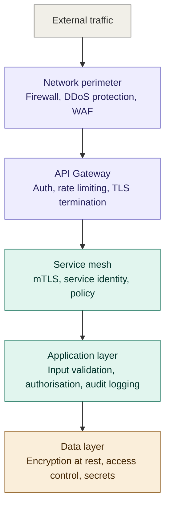
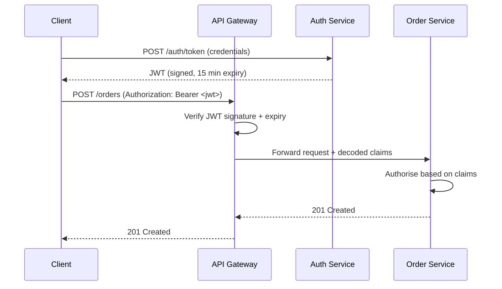
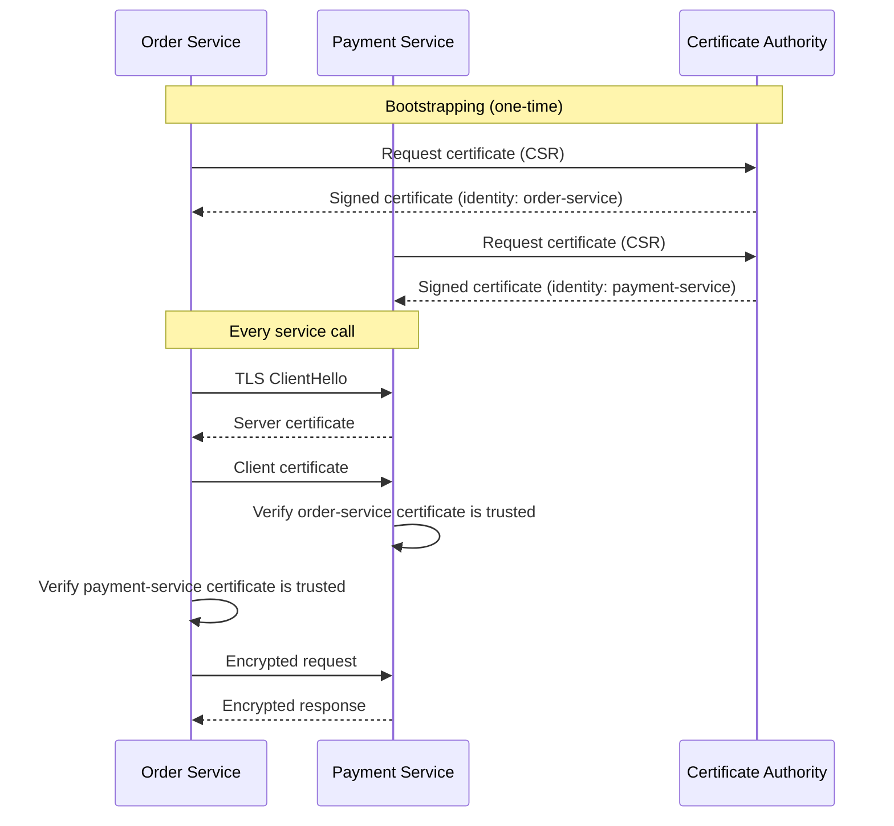
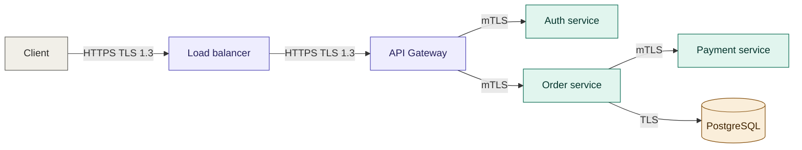

# 06 — Security

## Table of Contents

- [Security Principles](#security-principles)
- [Authentication](#authentication)
- [Authorisation](#authorisation)
- [Service-to-Service Security](#service-to-service-security)
- [API Security](#api-security)
- [Secrets Management](#secrets-management)
- [Network Security](#network-security)
- [Container and Runtime Security](#container-and-runtime-security)
- [Security Scanning in CI/CD](#security-scanning-in-cicd)
- [Compliance Considerations](#compliance-considerations)
- [Summary & Next Steps](#summary--next-steps)

---

## Security Principles

Microservices expand the attack surface compared to a monolith. More network hops, more services, more credentials, more entry points. The response is **defence in depth** — multiple independent layers of security so that a compromise of any single layer does not give an attacker full access.

### The Four Layers



### Zero Trust Model

In a monolith, once inside the network you could trust internal calls. In microservices, **trust nothing by default** — even traffic from inside the cluster.

- Every service call must carry a verifiable identity
- Every request must be authorised, not just authenticated
- Credentials are short-lived and rotated automatically
- All traffic is encrypted, including internal service-to-service

---

## Authentication

Authentication answers: *who is making this request?*

### JWT — JSON Web Tokens

JWTs are the standard mechanism for propagating identity across service boundaries. The API Gateway validates the token and passes claims downstream. Internal services trust claims without re-validating the signature on every hop.



**JWT structure:**

```
Header.Payload.Signature

Header:  { "alg": "RS256", "typ": "JWT", "kid": "key-2024-01" }
Payload: {
  "sub":   "usr_01HQTM7K",       // subject — user ID
  "email": "alice@example.com",
  "roles": ["customer"],
  "iss":   "https://auth.example.com",  // issuer
  "aud":   ["api.example.com"],          // audience
  "iat":   1705312200,           // issued at
  "exp":   1705313100            // expires (15 min)
}
Signature: RS256(base64(header) + "." + base64(payload), privateKey)
```

**Server-side validation:**

```typescript
import jwt from 'jsonwebtoken';
import jwksClient from 'jwks-rsa';

// Fetch public keys from the auth server's JWKS endpoint
const client = jwksClient({
  jwksUri: 'https://auth.example.com/.well-known/jwks.json',
  cache: true,
  cacheMaxEntries: 5,
  cacheMaxAge: 600_000, // 10 minutes
});

async function verifyToken(token: string): Promise<JwtPayload> {
  const decoded = jwt.decode(token, { complete: true });
  if (!decoded || typeof decoded === 'string') {
    throw new UnauthorisedError('Invalid token format');
  }

  // Fetch the signing key that matches the key ID in the header
  const key = await client.getSigningKey(decoded.header.kid);
  const publicKey = key.getPublicKey();

  return jwt.verify(token, publicKey, {
    algorithms: ['RS256'],
    issuer: 'https://auth.example.com',
    audience: 'api.example.com',
  }) as JwtPayload;
}

// Express middleware
export async function authMiddleware(
  req: Request,
  res: Response,
  next: NextFunction,
): Promise<void> {
  const authHeader = req.headers.authorization;
  if (!authHeader?.startsWith('Bearer ')) {
    res.status(401).json({ error: 'Missing or malformed Authorization header' });
    return;
  }

  try {
    const token = authHeader.slice(7);
    const claims = await verifyToken(token);
    req.user = claims;
    next();
  } catch (err) {
    if (err instanceof jwt.TokenExpiredError) {
      res.status(401).json({ error: 'Token expired' });
    } else {
      res.status(401).json({ error: 'Invalid token' });
    }
  }
}
```

### Token Best Practices

| Practice | Rationale |
|----------|-----------|
| Short expiry (15 min) for access tokens | Limits the window if a token is stolen |
| Long-lived refresh tokens (7–30 days) stored in HttpOnly cookies | Prevents JavaScript access to the refresh token |
| Use RS256 (asymmetric) not HS256 (symmetric) | Services can verify without sharing a secret |
| Include `kid` (key ID) in header | Enables key rotation without downtime |
| Validate `iss`, `aud`, `exp` on every request | Prevents token reuse across services or environments |
| Maintain a token revocation list (Redis) | Allows immediate logout before expiry |

### Token Revocation

```typescript
// On logout — add token ID to revocation list
async function logout(tokenId: string, expiresIn: number): Promise<void> {
  await redis.setex(`revoked:${tokenId}`, expiresIn, '1');
}

// In the auth middleware — check revocation before trusting the token
const isRevoked = await redis.exists(`revoked:${claims.jti}`);
if (isRevoked) {
  throw new UnauthorisedError('Token has been revoked');
}
```

---

## Authorisation

Authorisation answers: *is this identity allowed to perform this action?*

### RBAC — Role-Based Access Control

Permissions are granted to roles; roles are assigned to users.

```typescript
// Roles and permissions defined centrally
const permissions = {
  customer: ['orders:read:own', 'orders:create', 'profile:read:own'],
  support:  ['orders:read:any', 'users:read:any'],
  admin:    ['orders:*', 'users:*', 'products:*'],
} as const;

// Middleware factory — require a specific permission
function requirePermission(permission: string) {
  return (req: Request, res: Response, next: NextFunction) => {
    const userRoles = req.user.roles as string[];
    const userPermissions = userRoles.flatMap(role => permissions[role] ?? []);

    const allowed = userPermissions.some(p =>
      p === permission ||
      p === permission.replace(/:[^:]+$/, ':*') || // wildcard match
      p.endsWith(':*') && permission.startsWith(p.slice(0, -2))
    );

    if (!allowed) {
      res.status(403).json({ error: 'Insufficient permissions' });
      return;
    }
    next();
  };
}

// Usage on routes
router.get('/orders',        requirePermission('orders:read:any'), listOrders);
router.get('/orders/:id',    requirePermission('orders:read:own'), getOrder);
router.delete('/orders/:id', requirePermission('orders:*'),        deleteOrder);
```

### ABAC — Attribute-Based Access Control

More expressive than RBAC — decisions are based on attributes of the user, resource, and environment.

```typescript
// Policy engine — Open Policy Agent (OPA) integration
async function isAuthorised(input: {
  user: { id: string; roles: string[] };
  action: string;
  resource: { type: string; ownerId?: string };
}): Promise<boolean> {
  const response = await fetch('http://opa:8181/v1/data/authz/allow', {
    method: 'POST',
    headers: { 'Content-Type': 'application/json' },
    body: JSON.stringify({ input }),
  });
  const { result } = await response.json();
  return result === true;
}

// OPA policy (Rego)
// package authz
// allow {
//   input.user.roles[_] == "admin"
// }
// allow {
//   input.action == "orders:read"
//   input.resource.ownerId == input.user.id
// }
```

Use OPA for complex, cross-service authorisation policies that need to be consistent and auditable.

---

## Service-to-Service Security

Internal service calls are not inherently trusted. A compromised service should not be able to impersonate any other service.

### mTLS — Mutual TLS

In regular TLS, only the server presents a certificate. In mTLS, both sides present certificates — the server verifies the client's identity, and the client verifies the server's identity.



When using a **service mesh** (Istio, Linkerd), mTLS is transparent — the sidecar proxies handle certificate rotation and enforcement automatically. Without a mesh, use SPIFFE/SPIRE for workload identity.

### Service Tokens (Alternative to mTLS)

For environments without a service mesh, services authenticate with short-lived tokens issued by a central auth service.

```typescript
// Service authenticating as itself
class ServiceAuthClient {
  private token: string | null = null;
  private tokenExpiry: number = 0;

  async getToken(): Promise<string> {
    if (this.token && Date.now() < this.tokenExpiry - 30_000) {
      return this.token;
    }

    const response = await fetch('http://auth-service/internal/token', {
      method: 'POST',
      headers: { 'Content-Type': 'application/json' },
      body: JSON.stringify({
        clientId:     process.env.SERVICE_CLIENT_ID,
        clientSecret: process.env.SERVICE_CLIENT_SECRET,
        audience:     'internal-services',
      }),
    });

    const { access_token, expires_in } = await response.json();
    this.token = access_token;
    this.tokenExpiry = Date.now() + expires_in * 1000;
    return this.token;
  }

  async callService(url: string, options: RequestInit = {}): Promise<Response> {
    const token = await this.getToken();
    return fetch(url, {
      ...options,
      headers: {
        ...options.headers,
        Authorization: `Bearer ${token}`,
      },
    });
  }
}
```

---

## API Security

### Input Validation

Every input from outside the service is untrusted. Validate and sanitise at the service boundary — before it reaches business logic or the database.

```typescript
import { z } from 'zod';

const createOrderSchema = z.object({
  userId: z.string().uuid(),
  items: z.array(z.object({
    productId: z.string().uuid(),
    quantity:  z.number().int().positive().max(100),
  })).min(1).max(50),
  shippingAddressId: z.string().uuid(),
  couponCode: z.string().regex(/^[A-Z0-9]{6,12}$/).optional(),
});

export async function createOrder(req: Request, res: Response): Promise<void> {
  const result = createOrderSchema.safeParse(req.body);

  if (!result.success) {
    res.status(422).json({
      error: {
        code: 'VALIDATION_ERROR',
        message: 'Request validation failed',
        details: result.error.errors.map(e => ({
          field: e.path.join('.'),
          message: e.message,
        })),
      },
    });
    return;
  }

  const order = await orderService.create(result.data);
  res.status(201).json(order);
}
```

### Rate Limiting

Protect services from abuse and unintentional overload.

```typescript
import rateLimit from 'express-rate-limit';
import RedisStore from 'rate-limit-redis';

// Tiered rate limits — stricter for unauthenticated, looser for trusted clients
const publicApiLimiter = rateLimit({
  windowMs: 60_000,        // 1 minute
  max: 60,                 // 60 req/min for unauthenticated
  store: new RedisStore({ client: redis }),
  keyGenerator: (req) => req.ip!,
  handler: (_req, res) => {
    res.status(429).json({
      error: { code: 'RATE_LIMIT_EXCEEDED', message: 'Too many requests' },
    });
  },
});

const authenticatedLimiter = rateLimit({
  windowMs: 60_000,
  max: 600,                // 600 req/min for authenticated users
  store: new RedisStore({ client: redis }),
  keyGenerator: (req) => req.user?.sub ?? req.ip!,
});

app.use('/api/public', publicApiLimiter);
app.use('/api/v1',     authMiddleware, authenticatedLimiter);
```

### SQL Injection Prevention

Never interpolate user input into SQL strings. Always use parameterised queries.

```typescript
// NEVER do this
const result = await db.query(
  `SELECT * FROM orders WHERE user_id = '${userId}'` // SQL injection
);

// Always use parameterised queries
const result = await db.query(
  'SELECT * FROM orders WHERE user_id = $1',
  [userId]  // driver handles escaping
);

// With an ORM — the ORM parameterises for you
const orders = await prisma.order.findMany({
  where: { userId },  // safe
});
```

### Security Headers

```typescript
import helmet from 'helmet';

app.use(helmet({
  contentSecurityPolicy: {
    directives: {
      defaultSrc: ["'none'"],
      scriptSrc:  ["'self'"],
      connectSrc: ["'self'"],
    },
  },
  hsts: {
    maxAge: 31_536_000,        // 1 year
    includeSubDomains: true,
    preload: true,
  },
  noSniff: true,               // X-Content-Type-Options: nosniff
  frameguard: { action: 'deny' }, // X-Frame-Options: DENY
  referrerPolicy: { policy: 'strict-origin-when-cross-origin' },
}));
```

### CORS

Only allow the origins you explicitly trust. Never use `*` for authenticated APIs.

```typescript
import cors from 'cors';

const allowedOrigins = [
  'https://app.example.com',
  'https://admin.example.com',
  ...(process.env.NODE_ENV !== 'production'
    ? ['http://localhost:3000']
    : []),
];

app.use(cors({
  origin: (origin, callback) => {
    if (!origin || allowedOrigins.includes(origin)) {
      callback(null, true);
    } else {
      callback(new Error(`CORS: origin ${origin} not allowed`));
    }
  },
  credentials: true,
  methods: ['GET', 'POST', 'PUT', 'PATCH', 'DELETE'],
  allowedHeaders: ['Content-Type', 'Authorization', 'X-Request-ID'],
}));
```

---

## Secrets Management

### The Rules

1. **Never commit secrets to source control** — not even in `.env` files, not even in private repos
2. **Never log secrets** — sanitise log output before writing
3. **Rotate regularly** — all credentials should have automated rotation
4. **Principle of least privilege** — every service gets only the secrets it needs

### HashiCorp Vault

The production-grade solution for dynamic, short-lived secrets.

```typescript
import vault from 'node-vault';

const vaultClient = vault({
  apiVersion: 'v1',
  endpoint: process.env.VAULT_ADDR,
  token: process.env.VAULT_TOKEN, // or use AppRole / Kubernetes auth
});

// Fetch a database credential — Vault generates a unique user per request
async function getDatabaseCredentials(): Promise<{ username: string; password: string }> {
  const result = await vaultClient.read('database/creds/order-service-role');
  return {
    username: result.data.username,
    password: result.data.password,
    // These credentials expire in 1 hour — Vault rotates them automatically
  };
}

// Dynamic secret rotation pattern — reconnect on expiry
class DatabasePool {
  private pool: Pool | null = null;
  private credentialExpiry: number = 0;

  async getPool(): Promise<Pool> {
    if (this.pool && Date.now() < this.credentialExpiry - 60_000) {
      return this.pool;
    }

    const { username, password } = await getDatabaseCredentials();
    this.pool = new Pool({
      host:     process.env.DB_HOST,
      database: process.env.DB_NAME,
      user:     username,
      password: password,
    });
    this.credentialExpiry = Date.now() + 3_600_000; // 1 hour
    return this.pool;
  }
}
```

### Kubernetes Secrets + Sealed Secrets

For teams not running Vault, encrypt secrets before committing to Git with Bitnami Sealed Secrets:

```bash
# Encrypt a secret for the cluster's public key
kubeseal --format=yaml < secret.yaml > sealed-secret.yaml

# Now safe to commit sealed-secret.yaml — only the cluster controller can decrypt it
git add sealed-secret.yaml
git commit -m "Add order-service database sealed secret"
```

---

## Network Security

### Network Policies

Kubernetes NetworkPolicies restrict which pods can communicate with which. By default, all pods can reach all other pods — lock this down.

```yaml
# Allow order-service to only talk to: payment-service, user-service, and its own database
apiVersion: networking.k8s.io/v1
kind: NetworkPolicy
metadata:
  name: order-service-egress
  namespace: production
spec:
  podSelector:
    matchLabels:
      app: order-service
  policyTypes:
    - Egress
  egress:
    - to:
        - podSelector:
            matchLabels:
              app: payment-service
      ports:
        - port: 3000
    - to:
        - podSelector:
            matchLabels:
              app: user-service
      ports:
        - port: 3000
    - to:
        - podSelector:
            matchLabels:
              app: order-postgres
      ports:
        - port: 5432

---
# Deny all ingress by default — only allow explicitly permitted sources
apiVersion: networking.k8s.io/v1
kind: NetworkPolicy
metadata:
  name: order-service-ingress
  namespace: production
spec:
  podSelector:
    matchLabels:
      app: order-service
  policyTypes:
    - Ingress
  ingress:
    - from:
        - podSelector:
            matchLabels:
              app: api-gateway
      ports:
        - port: 3000
```

### TLS Everywhere

All traffic — internal and external — must be encrypted.



Minimum TLS version: **TLS 1.2** (TLS 1.3 preferred). Disable SSLv3, TLS 1.0, TLS 1.1 entirely.

---

## Container and Runtime Security

### Secure Container Defaults

```dockerfile
# Run as non-root — never as root or UID 0
RUN addgroup -g 1001 -S appgroup && \
    adduser  -u 1001 -S appuser -G appgroup
USER appuser

# Use distroless or minimal base images
FROM gcr.io/distroless/nodejs20-debian12
# No shell, no package manager, massively reduced attack surface
```

### Kubernetes Security Context

```yaml
spec:
  template:
    spec:
      securityContext:
        runAsNonRoot: true
        runAsUser: 1001
        fsGroup: 1001
        seccompProfile:
          type: RuntimeDefault     # restricts syscalls to known-safe set
      containers:
        - name: order-service
          securityContext:
            allowPrivilegeEscalation: false
            readOnlyRootFilesystem: true  # container cannot write to its own filesystem
            capabilities:
              drop: ["ALL"]              # drop all Linux capabilities
          volumeMounts:
            - mountPath: /tmp           # mount a writable /tmp if the app needs it
              name: tmp-volume
      volumes:
        - name: tmp-volume
          emptyDir: {}
```

### Image Scanning

Scan images for known CVEs before pushing to the registry and before deploying to production.

```yaml
# In your CI pipeline (GitHub Actions)
- name: Scan image with Trivy
  uses: aquasecurity/trivy-action@master
  with:
    image-ref: registry.example.com/order-service:${{ github.sha }}
    format: 'sarif'
    output: 'trivy-results.sarif'
    severity: 'HIGH,CRITICAL'
    exit-code: '1'   # fail the pipeline on HIGH or CRITICAL findings
```

---

## Security Scanning in CI/CD

Security gates belong in the pipeline, not as a post-deployment afterthought.

```mermaid
flowchart LR
    A[git push] --> B[SAST\nstatic analysis]
    B --> C[Dependency scan\nSCA / CVEs]
    C --> D[Build image]
    D --> E[Container scan\nTrivy / Snyk]
    E --> F[Deploy staging]
    F --> G[DAST\ndynamic testing]
    G --> H[Deploy production]

    style A fill:#F1EFE8,stroke:#5F5E5A,color:#2C2C2A
    style B fill:#EEEDFE,stroke:#534AB7,color:#26215C
    style C fill:#EEEDFE,stroke:#534AB7,color:#26215C
    style D fill:#E1F5EE,stroke:#0F6E56,color:#04342C
    style E fill:#E1F5EE,stroke:#0F6E56,color:#04342C
    style F fill:#FAEEDA,stroke:#854F0B,color:#412402
    style G fill:#FAEEDA,stroke:#854F0B,color:#412402
    style H fill:#EAF3DE,stroke:#3B6D11,color:#173404
```



| Stage | Tool examples | What it catches |
|-------|--------------|----------------|
| SAST | ESLint security plugins, Semgrep, SonarQube | Hardcoded secrets, injection patterns, insecure APIs in source |
| SCA | `npm audit`, Snyk, Dependabot | Known CVEs in dependencies |
| Container scan | Trivy, Grype, Snyk Container | CVEs in base image and installed packages |
| DAST | OWASP ZAP, Burp Suite | Runtime vulnerabilities: XSS, SQLi, auth bypasses |
| Secrets scan | GitLeaks, TruffleHog | Accidentally committed credentials |

---

## Compliance Considerations

### Audit Logging

Every security-relevant action must be logged with enough context to reconstruct what happened, who did it, and when.

```typescript
interface AuditEvent {
  timestamp:    string;      // ISO 8601
  traceId:      string;      // correlates to distributed trace
  userId:       string;      // who performed the action
  serviceId:    string;      // which service generated the log
  action:       string;      // e.g. "order.created", "payment.failed"
  resourceType: string;      // "order", "user", etc.
  resourceId:   string;      // ID of the affected resource
  outcome:      'success' | 'failure';
  ipAddress:    string;
  userAgent?:   string;
  metadata?:    Record<string, unknown>;
}

async function auditLog(event: Omit<AuditEvent, 'timestamp' | 'serviceId'>): Promise<void> {
  const entry: AuditEvent = {
    ...event,
    timestamp: new Date().toISOString(),
    serviceId: process.env.SERVICE_NAME!,
  };

  // Write to a tamper-evident, append-only audit store
  await auditQueue.publish('audit.events', entry);
}

// Usage
await auditLog({
  traceId:      req.headers['x-trace-id'] as string,
  userId:       req.user.sub,
  action:       'order.deleted',
  resourceType: 'order',
  resourceId:   orderId,
  outcome:      'success',
  ipAddress:    req.ip!,
});
```

### Data Classification and Handling

| Classification | Examples | Requirements |
|---------------|----------|-------------|
| Public | Product names, pricing | No special handling |
| Internal | Order IDs, usage metrics | Access control, no public exposure |
| Confidential | Email addresses, names | Encrypted at rest, access logged |
| Restricted | Payment card data, passwords, SSNs | PCI-DSS / GDPR compliant handling, never logged |

Never log restricted or confidential data. Sanitise log output explicitly.

```typescript
// Sanitise before logging
function sanitiseForLog(data: Record<string, unknown>): Record<string, unknown> {
  const sensitiveFields = ['password', 'cardNumber', 'cvv', 'ssn', 'token', 'secret'];
  return Object.fromEntries(
    Object.entries(data).map(([k, v]) => [
      k,
      sensitiveFields.some(f => k.toLowerCase().includes(f)) ? '[REDACTED]' : v,
    ])
  );
}

logger.info({ order: sanitiseForLog(orderData) }, 'Order created');
```

---

## Summary & Next Steps

Security in microservices is not a single control — it is a stack of overlapping layers. JWT at the gateway, mTLS between services, RBAC in application code, network policies in Kubernetes, secrets in Vault, CVE scanning in CI. Any single layer can be bypassed; the combination makes a breach much harder and limits blast radius when one does occur.

The most common gaps in practice are: services that skip JWT validation on internal calls, secrets hardcoded in environment variable files committed to Git, and missing network policies that allow any pod to reach any other pod.

### Recommended Reading Order

| Step | Document | What you'll learn |
|------|----------|------------------|
| Next | [07-observability.md](./07-observability.md) | Distributed tracing, metrics, and log aggregation |
| Also | [08-resilience.md](./08-resilience.md) | Circuit breakers and fault tolerance |
| Also | [05-deployment-strategies.md](./05-deployment-strategies.md) | Secrets management in Kubernetes deployments |

---

*Part of the [Microservices Architecture Guide](../../README.md)*  
*Previous: [05-deployment-strategies.md](./05-deployment-strategies.md)*  
*Next: [07-observability.md](./07-observability.md)*