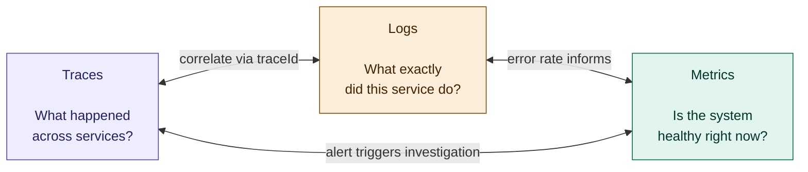
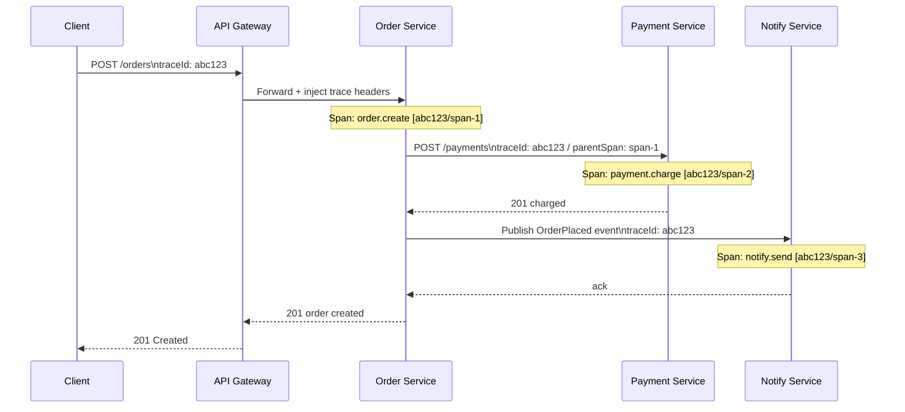
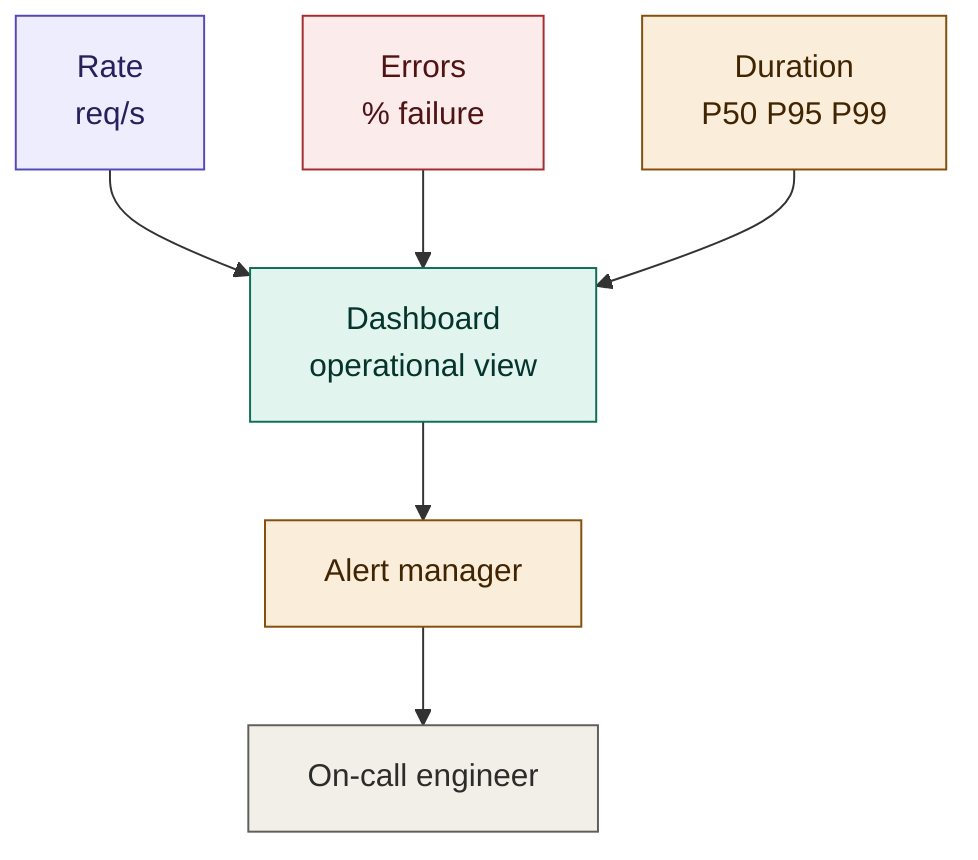
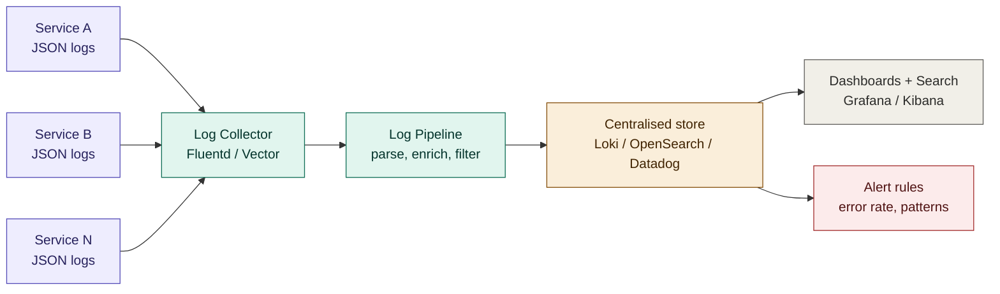
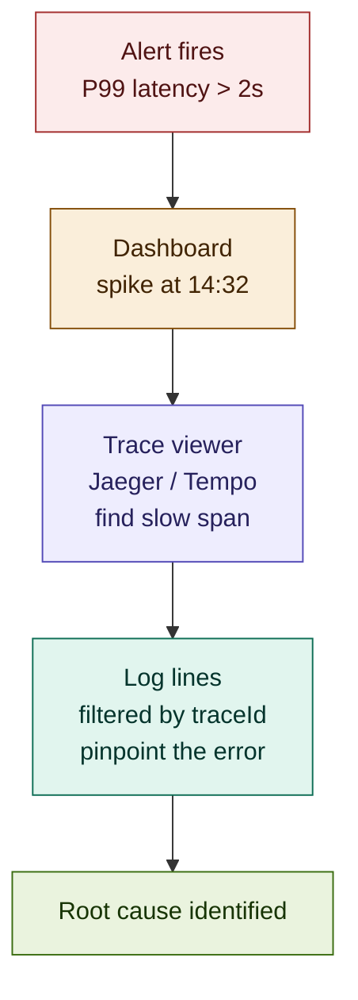
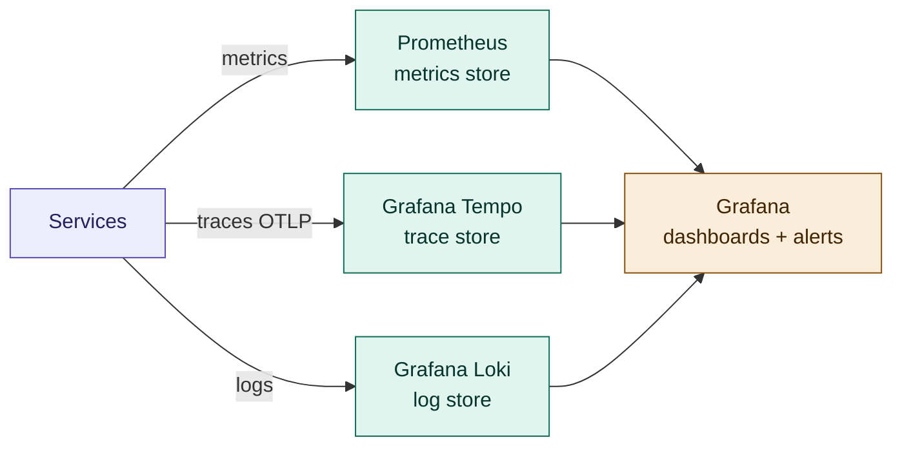

# 07 — Observability

## Table of Contents

- [The Three Pillars](#the-three-pillars)
- [Distributed Tracing](#distributed-tracing)
- [Metrics](#metrics)
- [Logging](#logging)
- [The Correlation Triangle](#the-correlation-triangle)
- [Health Checks and SLOs](#health-checks-and-slos)
- [Alerting](#alerting)
- [Dashboards](#dashboards)
- [Tooling Reference](#tooling-reference)
- [Summary & Next Steps](#summary--next-steps)

---

## The Three Pillars

Observability is the ability to understand the internal state of a system from its external outputs. In a distributed system with dozens of services, you cannot SSH into every box and tail logs — you need structured, correlated signals that surface the right information automatically.

The three pillars are complementary. Each answers a different question:



| Pillar | Question answered | Cardinality | Storage cost |
|--------|------------------|-------------|-------------|
| **Traces** | Why is this request slow or failing? | High (one per request) | High — sample aggressively |
| **Metrics** | Is the service healthy? What are the trends? | Low (aggregated) | Low — keep forever |
| **Logs** | What exactly happened inside this service? | Medium (per event) | Medium — rotate/archive |

---

## Distributed Tracing

A distributed trace tracks a single request as it travels through multiple services, recording the time spent and what happened at each hop. Without tracing, debugging a slow or failing request in a microservices system is guesswork.

### How Tracing Works



Every span records:
- Service name and operation name
- Start time and duration
- HTTP status / error flag
- Key attributes (user ID, order ID, DB query, etc.)
- Parent span ID — links it into the trace tree

### OpenTelemetry — The Standard

OpenTelemetry (OTel) is the vendor-neutral standard for instrumentation. Instrument once, export to any backend (Jaeger, Zipkin, Tempo, Datadog, Honeycomb).

```typescript
// instrumentation.ts — initialise BEFORE importing your application code
import { NodeSDK } from '@opentelemetry/sdk-node';
import { OTLPTraceExporter } from '@opentelemetry/exporter-trace-otlp-http';
import { Resource } from '@opentelemetry/resources';
import { SemanticResourceAttributes } from '@opentelemetry/semantic-conventions';
import { getNodeAutoInstrumentations } from '@opentelemetry/auto-instrumentations-node';

const sdk = new NodeSDK({
  resource: new Resource({
    [SemanticResourceAttributes.SERVICE_NAME]:    process.env.SERVICE_NAME!,
    [SemanticResourceAttributes.SERVICE_VERSION]: process.env.SERVICE_VERSION!,
    [SemanticResourceAttributes.DEPLOYMENT_ENVIRONMENT]: process.env.NODE_ENV!,
  }),
  traceExporter: new OTLPTraceExporter({
    url: process.env.OTEL_EXPORTER_OTLP_ENDPOINT, // e.g. http://otel-collector:4318/v1/traces
  }),
  instrumentations: [
    getNodeAutoInstrumentations({
      // Automatically instruments: HTTP, Express, gRPC, PostgreSQL, Redis, fetch
      '@opentelemetry/instrumentation-fs': { enabled: false }, // noisy — disable
    }),
  ],
});

sdk.start();
process.on('SIGTERM', () => sdk.shutdown());
```

```typescript
// server.ts — auto-instrumentation handles HTTP spans; add custom spans for business logic
import { trace, context, SpanStatusCode } from '@opentelemetry/api';

const tracer = trace.getTracer('order-service');

async function createOrder(orderData: CreateOrderDTO): Promise<Order> {
  // Start a custom span for a business operation
  return tracer.startActiveSpan('order.create', async (span) => {
    try {
      span.setAttributes({
        'order.user_id':    orderData.userId,
        'order.item_count': orderData.items.length,
        'order.currency':   orderData.currency,
      });

      const order = await orderRepository.create(orderData);

      span.setAttributes({ 'order.id': order.id });
      span.setStatus({ code: SpanStatusCode.OK });

      return order;
    } catch (err) {
      span.setStatus({ code: SpanStatusCode.ERROR, message: (err as Error).message });
      span.recordException(err as Error);
      throw err;
    } finally {
      span.end();
    }
  });
}
```

### Propagating Trace Context

Trace context must be forwarded in every outbound call — HTTP headers for REST/gRPC, message headers for async events.

```typescript
// HTTP — OTel auto-instrumentation handles this automatically for fetch/axios/got
// Manual propagation if needed:
import { propagation, context } from '@opentelemetry/api';
import { W3CTraceContextPropagator } from '@opentelemetry/core';

const headers: Record<string, string> = {};
propagation.inject(context.active(), headers);
// headers now contains: { 'traceparent': '00-abc123...-span1-01' }

await fetch('http://payment-service/api/v1/payments', {
  headers: { ...headers, 'Content-Type': 'application/json' },
  body: JSON.stringify(payload),
});
```

```typescript
// Async events — propagate trace context in message headers
await producer.send({
  topic: 'orders.placed',
  messages: [{
    key: order.id,
    value: JSON.stringify(event),
    headers: {
      'traceparent': getCurrentTraceParent(), // W3C Trace Context header
      'tracestate':  getCurrentTraceState(),
    },
  }],
});

// Consumer — restore trace context from message headers
consumer.run({
  eachMessage: async ({ message }) => {
    const parentContext = propagation.extract(
      context.active(),
      message.headers ?? {}
    );
    context.with(parentContext, async () => {
      await handleOrderPlaced(JSON.parse(message.value!.toString()));
    });
  },
});
```

### Sampling Strategy

Tracing every request at high throughput is expensive. Sample intelligently:

```typescript
import { ParentBasedSampler, TraceIdRatioBased } from '@opentelemetry/sdk-trace-base';

// Head-based sampling: 10% of traces
const sampler = new ParentBasedSampler({
  root: new TraceIdRatioBased(0.1), // 10% sample rate
});

// Always sample errors and slow requests — tail-based sampling
// (requires a trace collector like Grafana Tempo with tail sampling processor)
```

| Strategy | When to use |
|----------|------------|
| Head-based (ratio) | Low-cost default; 1–10% in high-throughput services |
| Always sample errors | Catch all failure cases regardless of rate |
| Always sample slow spans | Catch P99 latency issues that ratio sampling would miss |
| Tail-based sampling | Best results — decide after seeing the full trace; needs a collector |

---

## Metrics

Metrics are numeric measurements aggregated over time. They answer "is the system healthy right now?" and power alerting and dashboards. Because they are aggregated, they are cheap to store and fast to query.

### The RED Method

For every service, instrument these three metric categories:

| Metric | Description | Alert threshold example |
|--------|-------------|------------------------|
| **Rate** | Requests per second | Alert if drops >20% vs baseline |
| **Errors** | Error rate (%) | Alert if >1% of requests fail |
| **Duration** | P50 / P95 / P99 latency | Alert if P99 > SLO threshold |



### USE Method (for infrastructure)

For databases, queues, and host resources:

- **Utilisation** — how busy is the resource? (CPU %, disk I/O %)
- **Saturation** — how much is work queued? (run queue depth, connection pool wait)
- **Errors** — hardware or OS errors

### Prometheus Instrumentation

```typescript
import { Counter, Histogram, Gauge, Registry } from 'prom-client';

const registry = new Registry();

// Rate — count every request
const httpRequestsTotal = new Counter({
  name: 'http_requests_total',
  help: 'Total number of HTTP requests',
  labelNames: ['method', 'route', 'status_code'],
  registers: [registry],
});

// Duration — histogram for latency percentiles
const httpRequestDuration = new Histogram({
  name: 'http_request_duration_seconds',
  help: 'HTTP request duration in seconds',
  labelNames: ['method', 'route', 'status_code'],
  buckets: [0.005, 0.01, 0.025, 0.05, 0.1, 0.25, 0.5, 1, 2.5, 5],
  registers: [registry],
});

// Gauge — current state (active connections, queue depth)
const activeConnections = new Gauge({
  name: 'active_database_connections',
  help: 'Number of active database connections',
  registers: [registry],
});

// Middleware — instrument every HTTP request
app.use((req: Request, res: Response, next: NextFunction) => {
  const start = Date.now();

  res.on('finish', () => {
    const duration = (Date.now() - start) / 1000;
    const route = req.route?.path ?? req.path;
    const labels = {
      method:      req.method,
      route,
      status_code: res.statusCode.toString(),
    };

    httpRequestsTotal.inc(labels);
    httpRequestDuration.observe(labels, duration);
  });

  next();
});

// Expose metrics endpoint for Prometheus scraping
app.get('/metrics', async (_req, res) => {
  res.set('Content-Type', registry.contentType);
  res.end(await registry.metrics());
});
```

### Business Metrics

Instrument domain-level metrics alongside technical ones. They give context that pure infrastructure metrics cannot.

```typescript
// Business metrics — what matters to the product
const ordersCreated = new Counter({
  name: 'orders_created_total',
  help: 'Total orders successfully created',
  labelNames: ['plan', 'channel'],
  registers: [registry],
});

const orderValue = new Histogram({
  name: 'order_value_usd',
  help: 'Order value in USD',
  buckets: [5, 10, 25, 50, 100, 250, 500, 1000],
  registers: [registry],
});

const paymentFailureRate = new Counter({
  name: 'payment_failures_total',
  help: 'Total payment failures',
  labelNames: ['failure_reason', 'provider'],
  registers: [registry],
});

// Usage — emit alongside the operation
const order = await orderService.create(orderData);
ordersCreated.inc({ plan: user.plan, channel: req.headers['x-channel'] ?? 'web' });
orderValue.observe(order.totalAmount);
```

---

## Logging

Logs are the narrative of what happened inside a service. In microservices, logs must be structured (machine-parseable JSON), correlated (carry `traceId` and `spanId`), and centralised (aggregated from all services into a single searchable store).

### Structured Logging

```typescript
import pino from 'pino';

const logger = pino({
  level: process.env.LOG_LEVEL ?? 'info',
  base: {
    service: process.env.SERVICE_NAME,
    version: process.env.SERVICE_VERSION,
    env:     process.env.NODE_ENV,
  },
  // Production: JSON output piped to log aggregator
  // Development: pretty-print with pino-pretty
  transport: process.env.NODE_ENV !== 'production'
    ? { target: 'pino-pretty', options: { colorize: true } }
    : undefined,
});

export { logger };
```

```typescript
// Request-scoped logger — automatically includes traceId on every log line
app.use((req: Request, _res: Response, next: NextFunction) => {
  const traceId = req.headers['x-trace-id'] as string
    ?? trace.getActiveSpan()?.spanContext().traceId;

  req.log = logger.child({
    traceId,
    requestId: req.headers['x-request-id'],
    userId:    req.user?.sub,
  });

  next();
});

// Usage in a handler
async function createOrder(req: Request, res: Response): Promise<void> {
  req.log.info({ itemCount: req.body.items.length }, 'Creating order');

  try {
    const order = await orderService.create(req.body);
    req.log.info({ orderId: order.id }, 'Order created successfully');
    res.status(201).json(order);
  } catch (err) {
    req.log.error({ err }, 'Failed to create order');
    res.status(500).json({ error: 'Internal server error' });
  }
}
```

### Log Levels — Use Them Correctly

| Level | When to use | Example |
|-------|------------|---------|
| `error` | Unhandled exceptions, operation failures that require attention | DB connection lost, payment declined |
| `warn` | Recoverable issues, deprecated usage, approaching limits | Retry attempt 2/3, cache miss rate high |
| `info` | Normal business events, state transitions | Order created, user logged in, job completed |
| `debug` | Detailed flow, intermediate values — off in production | SQL query executed, cache hit/miss |
| `trace` | Extremely verbose — only for deep debugging | Every function entry/exit, full request/response body |

Production log level: `info`. Never `debug` or `trace` in production — the volume is unmanageable and sensitive data leaks.

### Log Aggregation Pipeline



**Loki + Promtail** (Grafana stack — lightweight, label-based):

```yaml
# promtail-config.yaml — scrapes container logs from Kubernetes
server:
  http_listen_port: 9080

clients:
  - url: http://loki:3100/loki/api/v1/push

scrape_configs:
  - job_name: kubernetes-pods
    kubernetes_sd_configs:
      - role: pod
    pipeline_stages:
      - docker: {}               # parse Docker log format
      - json:                    # parse the JSON log line
          expressions:
            level:   level
            traceId: traceId
            service: service
      - labels:                  # promote fields to Loki labels (indexed)
          level:
          service:
      - timestamp:
          source: time
          format: RFC3339Nano
```

**Querying logs in Grafana / LogQL:**

```logql
# All errors from the order-service in the last 1 hour
{service="order-service"} |= "level=error" | json | line_format "{{.msg}}"

# Link logs to a specific trace
{service="order-service"} | json | traceId="abc123def456"

# Error rate over time
rate({service="order-service"} |= "error" [5m])
```

---

## The Correlation Triangle

The real power of observability comes from correlating all three pillars. A single `traceId` threads through traces, logs, and metrics so you can jump from an alert to the relevant trace to the specific log lines in one click.



The `traceId` must appear in:

1. Every log line emitted during a request
2. Every trace span
3. The HTTP response as `X-Trace-ID` header (for client-side debugging)
4. Error responses in the API payload

```typescript
// Middleware that threads traceId through everything
app.use((req: Request, res: Response, next: NextFunction) => {
  const traceId = trace.getActiveSpan()?.spanContext().traceId
    ?? req.headers['x-trace-id'] as string
    ?? crypto.randomUUID();

  // Set on the active span so it appears in the trace backend
  trace.getActiveSpan()?.setAttribute('trace.id', traceId);

  // Set on the request for downstream use
  req.traceId = traceId;

  // Return in the response so clients can reference it in support requests
  res.setHeader('X-Trace-ID', traceId);

  next();
});
```

---

## Health Checks and SLOs

### SLIs, SLOs, and SLAs

| Term | Definition | Example |
|------|-----------|---------|
| **SLI** (Service Level Indicator) | The metric being measured | P99 request latency |
| **SLO** (Service Level Objective) | The target for the SLI | P99 latency < 500ms over 30 days |
| **SLA** (Service Level Agreement) | The contractual commitment | 99.9% uptime, or credits apply |
| **Error budget** | How much you can fail and still meet the SLO | 0.1% of requests = 43 min/month |

### Defining SLOs

```yaml
# slo.yaml — defines the SLO for the order service
service: order-service
slos:
  - name: availability
    description: "99.9% of order creation requests succeed"
    sli:
      metric: http_requests_total
      filter: 'route="/api/v1/orders", method="POST"'
      good: 'status_code=~"2.."'
      total: 'status_code=~"[2-5].."'
    target: 0.999
    window: 30d

  - name: latency
    description: "95% of order creation requests complete in < 500ms"
    sli:
      metric: http_request_duration_seconds_bucket
      filter: 'route="/api/v1/orders", method="POST"'
      threshold: 0.5
    target: 0.95
    window: 30d
```

### Error Budget Burn Rate Alerting

Don't alert on instantaneous spikes — alert on error budget consumption rate.

```yaml
# Prometheus alerting rules
groups:
  - name: order-service-slo
    rules:
      # Fast burn: consuming budget 14x faster than allowed — page immediately
      - alert: OrderServiceHighErrorBudgetBurn
        expr: |
          (
            rate(http_requests_total{service="order-service",status_code=~"5.."}[1h])
            /
            rate(http_requests_total{service="order-service"}[1h])
          ) > 0.014   # 14x the 0.1% error budget rate
        for: 5m
        labels:
          severity: critical
        annotations:
          summary: "Order service burning error budget at 14x rate"
          runbook: "https://runbooks.example.com/order-service/high-error-rate"

      # Slow burn: consuming budget 2x faster — ticket, don't page
      - alert: OrderServiceMediumErrorBudgetBurn
        expr: |
          (
            rate(http_requests_total{service="order-service",status_code=~"5.."}[6h])
            /
            rate(http_requests_total{service="order-service"}[6h])
          ) > 0.002
        for: 30m
        labels:
          severity: warning
```

---

## Alerting

### Alert Design Principles

Good alerts are actionable. Bad alerts are noise. Noise causes alert fatigue — engineers stop responding, and real incidents get missed.

| Principle | Bad alert | Good alert |
|-----------|-----------|------------|
| Alert on symptoms, not causes | CPU > 80% | P99 latency > SLO |
| Include runbook links | "High error rate" | "High error rate — [runbook link]" |
| Set appropriate severity | Page for everything | Critical = wake someone up; Warning = ticket |
| Avoid flapping | Threshold with no `for:` clause | `for: 5m` — sustained before firing |
| Alert on trends, not spikes | Instant threshold | Rate over window, error budget burn |

### Runbook Template

Every alert must link to a runbook. A runbook is a document that tells the on-call engineer what to do.

```markdown
# Runbook: OrderServiceHighErrorRate

## Alert
`OrderServiceHighErrorBudgetBurn` — severity: critical

## Impact
Order creation is failing for a percentage of users.
Every minute this fires, we consume error budget.

## Immediate steps
1. Check the Grafana dashboard: https://grafana.example.com/d/order-service
2. Check recent deployments: `kubectl rollout history deployment/order-service -n production`
3. Check error logs: `{service="order-service"} | json | level="error" | last 30m`
4. Check downstream dependencies (payment-service, user-service) for elevated errors

## Triage
- If correlated with a recent deployment → roll back: `kubectl rollout undo deployment/order-service -n production`
- If payment-service is the root cause → open incident, escalate to payments team
- If database errors → check connection pool metrics, check PostgreSQL slow query log

## Escalation
- Payment-service issues: #payments-oncall Slack
- Database issues: #infrastructure-oncall Slack
- If blast radius > 10% of users: declare incident in #incidents
```

---

## Dashboards

### The Service Overview Dashboard

Every service should have one canonical dashboard with these panels:

```
┌─────────────────────┬─────────────────────┬─────────────────────┐
│  Request rate       │  Error rate (%)      │  P99 latency (ms)   │
│  req/s over time    │  5xx / total         │  vs SLO threshold   │
├─────────────────────┼─────────────────────┼─────────────────────┤
│  Error budget       │  Downstream errors   │  Apdex score        │
│  remaining (%)      │  per dependency      │  satisfaction ratio │
├─────────────────────┴─────────────────────┴─────────────────────┤
│  Recent deployments (annotations on all time-series charts)      │
├─────────────────────┬─────────────────────┬─────────────────────┤
│  CPU utilisation    │  Memory utilisation  │  Pod count / HPA    │
├─────────────────────┼─────────────────────┼─────────────────────┤
│  DB connection pool │  Cache hit rate      │  Queue lag (if any) │
└─────────────────────┴─────────────────────┴─────────────────────┘
```

### Grafana Dashboard as Code

Store dashboards in Git, not just in Grafana's UI — otherwise they get lost.

```json
{
  "title": "Order Service Overview",
  "uid": "order-service-overview",
  "panels": [
    {
      "title": "Request rate",
      "type": "timeseries",
      "targets": [
        {
          "expr": "rate(http_requests_total{service='order-service'}[5m])",
          "legendFormat": "{{method}} {{route}}"
        }
      ]
    },
    {
      "title": "Error rate",
      "type": "timeseries",
      "targets": [
        {
          "expr": "rate(http_requests_total{service='order-service',status_code=~'5..'}[5m]) / rate(http_requests_total{service='order-service'}[5m])",
          "legendFormat": "error rate"
        }
      ],
      "fieldConfig": {
        "defaults": {
          "thresholds": {
            "steps": [
              { "color": "green", "value": 0 },
              { "color": "yellow", "value": 0.005 },
              { "color": "red",    "value": 0.01 }
            ]
          }
        }
      }
    },
    {
      "title": "P99 latency",
      "type": "timeseries",
      "targets": [
        {
          "expr": "histogram_quantile(0.99, rate(http_request_duration_seconds_bucket{service='order-service'}[5m]))",
          "legendFormat": "P99"
        },
        {
          "expr": "histogram_quantile(0.95, rate(http_request_duration_seconds_bucket{service='order-service'}[5m]))",
          "legendFormat": "P95"
        },
        {
          "expr": "histogram_quantile(0.50, rate(http_request_duration_seconds_bucket{service='order-service'}[5m]))",
          "legendFormat": "P50"
        }
      ]
    }
  ]
}
```

---

## Tooling Reference

### The Grafana OSS Stack (Self-Hosted)



| Component | Role | Alternative |
|-----------|------|------------|
| **Prometheus** | Metrics scraping and storage | Victoria Metrics (more scalable) |
| **Grafana Tempo** | Distributed trace storage | Jaeger, Zipkin |
| **Grafana Loki** | Log aggregation | OpenSearch, Elasticsearch |
| **Grafana** | Dashboards and alerting | — |
| **OpenTelemetry Collector** | Receives, processes, and routes telemetry | — |
| **Alertmanager** | Alert routing, grouping, silencing | PagerDuty, OpsGenie |

### OpenTelemetry Collector

The collector is the recommended deployment pattern — services export to the collector, which fans out to multiple backends. This decouples service instrumentation from backend choice.

```yaml
# otel-collector-config.yaml
receivers:
  otlp:
    protocols:
      grpc:
        endpoint: 0.0.0.0:4317
      http:
        endpoint: 0.0.0.0:4318

processors:
  batch:
    timeout: 1s
    send_batch_size: 1024
  memory_limiter:
    check_interval: 1s
    limit_mib: 512
  tail_sampling:                         # sample-after-the-fact based on trace outcome
    decision_wait: 10s
    policies:
      - name: errors-policy
        type: status_code
        status_code: { status_codes: [ERROR] }
      - name: slow-traces-policy
        type: latency
        latency: { threshold_ms: 1000 }
      - name: probabilistic-policy
        type: probabilistic
        probabilistic: { sampling_percentage: 10 }

exporters:
  prometheus:
    endpoint: "0.0.0.0:8889"
  otlp/tempo:
    endpoint: http://tempo:4317
    tls:
      insecure: true
  loki:
    endpoint: http://loki:3100/loki/api/v1/push

service:
  pipelines:
    traces:
      receivers:  [otlp]
      processors: [memory_limiter, tail_sampling, batch]
      exporters:  [otlp/tempo]
    metrics:
      receivers:  [otlp]
      processors: [memory_limiter, batch]
      exporters:  [prometheus]
    logs:
      receivers:  [otlp]
      processors: [memory_limiter, batch]
      exporters:  [loki]
```

### Managed Alternatives

If you prefer not to operate the stack yourself:

| Need | Managed option |
|------|---------------|
| All-in-one APM | Datadog, Dynatrace, New Relic |
| Traces only | Honeycomb, Lightstep |
| Logs only | Papertrail, Logtail, Datadog Logs |
| Metrics only | Grafana Cloud, Datadog Metrics |
| Open source cloud | Grafana Cloud (free tier available) |

---

## Summary & Next Steps

Observability is not optional in microservices — it is a prerequisite for operating them. Start with structured logging and a `traceId` on every request. Add Prometheus metrics with RED method instrumentation. Add distributed tracing with OpenTelemetry. Wire the three together so any alert leads you directly to the trace and log lines that explain it.

The most common mistakes: logs that don't carry `traceId`, metrics that only measure infrastructure (not service health), and alerts that fire on CPU rather than user-visible symptoms. Fix these before writing complex business logic — debugging a service you cannot observe is orders of magnitude harder than any feature work.

### Recommended Reading Order

| Step | Document | What you'll learn |
|------|----------|------------------|
| Next | [08-resilience.md](./08-resilience.md) | Circuit breakers, retries, bulkheads — observability shows you where you need them |
| Also | [09-performance-optimization.md](./09-performance-optimization.md) | Using traces and metrics to find and fix bottlenecks |
| Also | [06-security.md](./06-security.md) | Audit logging and security event correlation |

---

*Part of the [Microservices Architecture Guide](../../README.md)*  
*Previous: [06-security.md](./06-security.md)*  
*Next: [08-resilience.md](./08-resilience.md)*