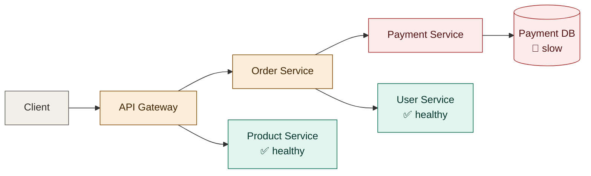
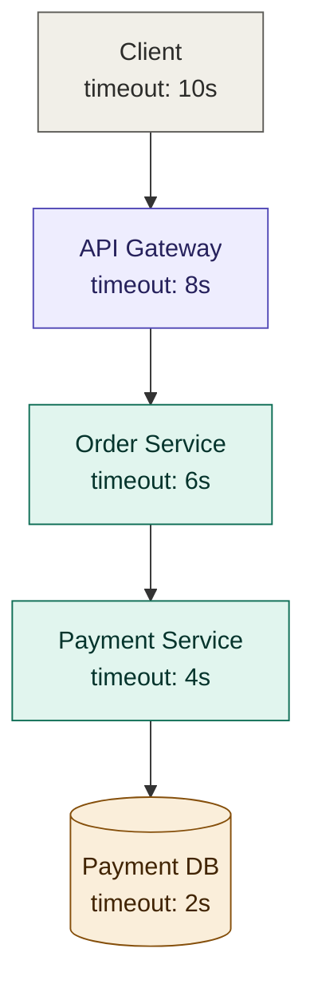
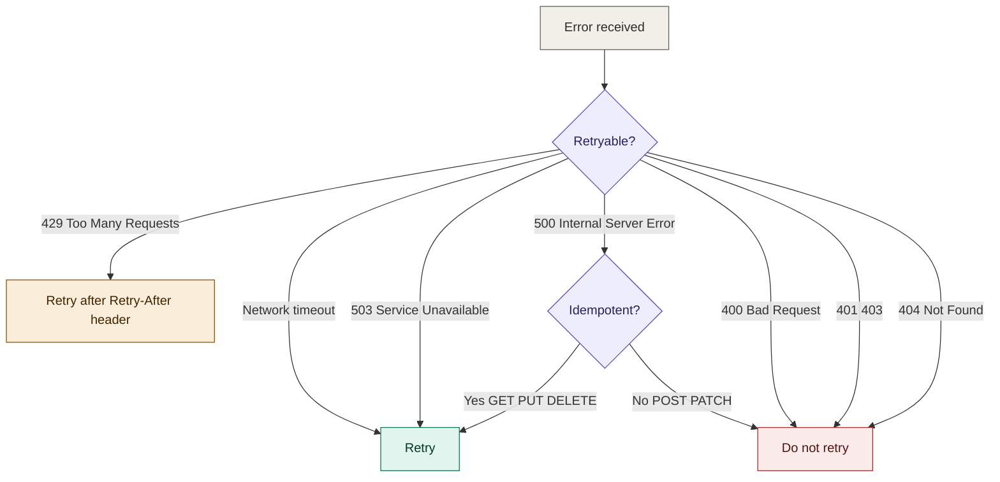
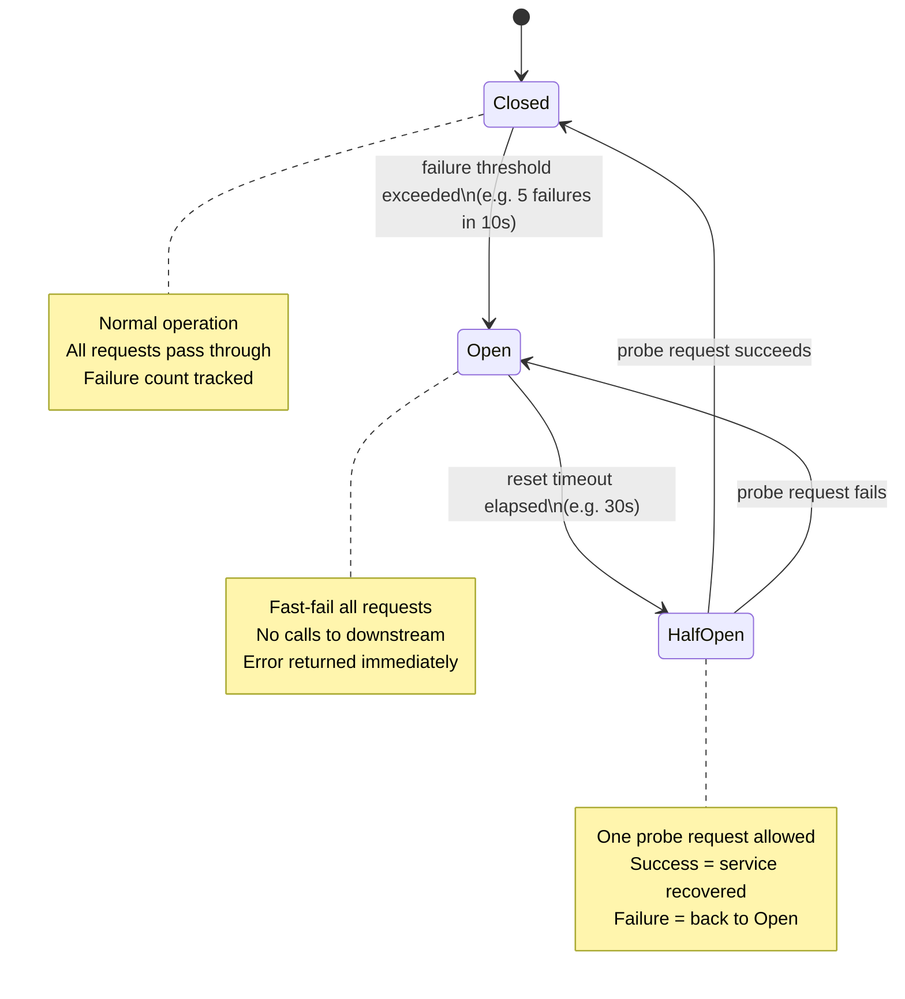
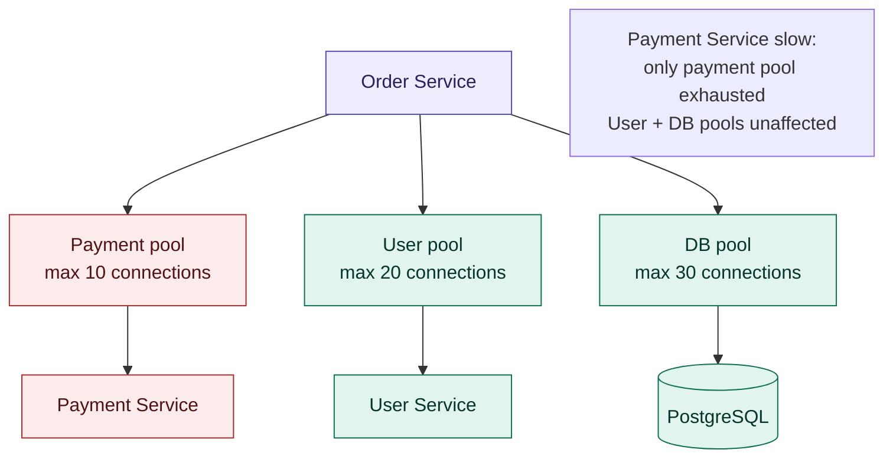
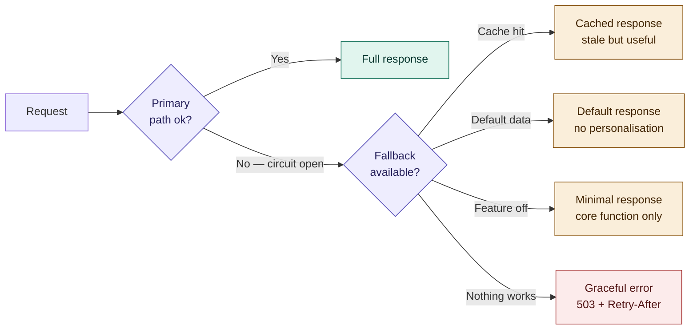
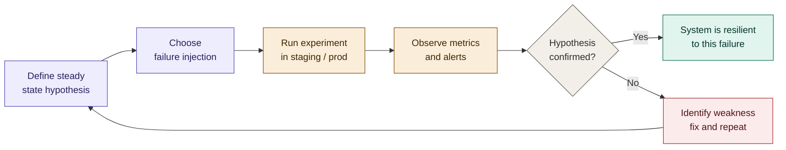
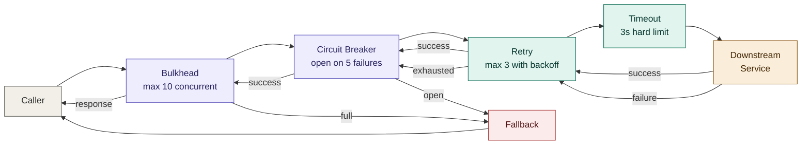

# 08 — Resilience

## Table of Contents

- [Why Resilience Matters](#why-resilience-matters)
- [Timeouts](#timeouts)
- [Retries](#retries)
- [Circuit Breaker](#circuit-breaker)
- [Bulkhead](#bulkhead)
- [Rate Limiting and Backpressure](#rate-limiting-and-backpressure)
- [Fallbacks and Graceful Degradation](#fallbacks-and-graceful-degradation)
- [Health Checks and Self-Healing](#health-checks-and-self-healing)
- [Chaos Engineering](#chaos-engineering)
- [Resilience Patterns Combined](#resilience-patterns-combined)
- [Summary & Next Steps](#summary--next-steps)

---

## Why Resilience Matters

In a monolith, a single slow database query blocks one thread. In microservices, a single slow downstream service can block every thread in every upstream service — a cascading failure that takes down the entire system.



Without resilience patterns, a slow Payment DB cascades upward: Payment Service threads fill up, Order Service threads fill waiting for Payment Service, the API Gateway fills up, and the entire system stalls — even Product Service calls that never touch payments become slow because the gateway thread pool is exhausted.

Resilience is not about preventing failures — it is about **containing** them. The goal is to ensure that when one component fails, the failure is isolated to that component and does not spread.

### Failure Taxonomy

| Failure type | Example | Primary defence |
|-------------|---------|----------------|
| Slow downstream | Payment Service responds in 30s | Timeouts |
| Transient error | Network blip, brief 503 | Retries with backoff |
| Persistent failure | Downstream service is down | Circuit breaker |
| Resource exhaustion | Thread pool / connection pool full | Bulkhead |
| Overload | Traffic spike | Rate limiting, backpressure |
| Partial failure | 10% of requests fail | Circuit breaker, fallback |

---

## Timeouts

The most basic and most commonly forgotten resilience pattern. Every outbound network call must have an explicit timeout. Without one, you are one slow downstream away from a complete thread pool exhaustion.

### Timeout Hierarchy

Set timeouts at every layer, and ensure inner timeouts are shorter than outer timeouts. If the outer timeout fires first, the inner operation keeps running but the caller has already given up — leaking resources.



### Implementation

```typescript
// Timeout wrapper using AbortController
async function withTimeout<T>(
  fn: (signal: AbortSignal) => Promise<T>,
  timeoutMs: number,
  operationName: string,
): Promise<T> {
  const controller = new AbortController();
  const timer = setTimeout(() => controller.abort(), timeoutMs);

  try {
    return await fn(controller.signal);
  } catch (err) {
    if (controller.signal.aborted) {
      throw new TimeoutError(`${operationName} timed out after ${timeoutMs}ms`);
    }
    throw err;
  } finally {
    clearTimeout(timer);
  }
}

// Usage
const user = await withTimeout(
  (signal) =>
    fetch(`http://user-service/api/v1/users/${userId}`, { signal }).then(r => r.json()),
  3000,
  'user-service.getUser',
);
```

```typescript
// Database query timeout — never rely on the default
const result = await db.query({
  text: 'SELECT * FROM orders WHERE user_id = $1',
  values: [userId],
  // PostgreSQL: set_local statement_timeout applies per query
});

// With pg pool — set a statement timeout globally
const pool = new Pool({
  connectionString: process.env.DATABASE_URL,
  statement_timeout: 5000,       // 5s max for any single statement
  query_timeout: 5000,
  connectionTimeoutMillis: 2000, // 2s to acquire a connection from the pool
  idleTimeoutMillis: 30000,
});
```

### Timeout Guidelines

| Call type | Recommended timeout |
|-----------|-------------------|
| Internal service (same region) | 1–3s |
| Internal service (cross-region) | 3–5s |
| External API | 5–10s |
| Database query (simple) | 1–3s |
| Database query (complex report) | 10–30s |
| Message broker publish | 1–2s |

These are starting points. Base final values on the P99 of the actual operation measured in production — see [07-observability.md](./07-observability.md).

---

## Retries

Retries recover from **transient** failures — brief network blips, momentary service restarts, short-lived 503s. They must never be applied blindly: retrying a non-idempotent operation on a failed call can cause duplicate actions (double charges, duplicate orders).

### What to Retry and What Not To



### Exponential Backoff with Jitter

Never retry immediately — the downstream is likely still overwhelmed. Use exponential backoff so retry intervals grow with each attempt, and add random jitter so a fleet of services doesn't all retry at the same moment (the "thundering herd" problem).

```typescript
interface RetryOptions {
  maxAttempts:   number;
  baseDelayMs:   number;
  maxDelayMs:    number;
  jitterFactor:  number;           // 0–1: fraction of delay to randomise
  isRetryable:   (err: unknown) => boolean;
}

async function withRetry<T>(
  fn:      () => Promise<T>,
  options: RetryOptions,
): Promise<T> {
  const { maxAttempts, baseDelayMs, maxDelayMs, jitterFactor, isRetryable } = options;
  let lastError: unknown;

  for (let attempt = 1; attempt <= maxAttempts; attempt++) {
    try {
      return await fn();
    } catch (err) {
      lastError = err;

      if (attempt === maxAttempts || !isRetryable(err)) {
        throw err;
      }

      // Exponential backoff: 100ms, 200ms, 400ms, 800ms, ...
      const exponentialDelay = Math.min(
        baseDelayMs * Math.pow(2, attempt - 1),
        maxDelayMs,
      );

      // Full jitter — uniform random in [0, exponentialDelay * jitterFactor]
      const jitter = Math.random() * exponentialDelay * jitterFactor;
      const delay  = exponentialDelay + jitter;

      logger.warn(
        { attempt, maxAttempts, delayMs: Math.round(delay), err },
        'Retrying after transient error',
      );

      await sleep(delay);
    }
  }

  throw lastError;
}

// Classify which errors are retryable
function isRetryable(err: unknown): boolean {
  if (err instanceof TimeoutError)          return true;
  if (err instanceof NetworkError)          return true;
  if (err instanceof HttpError) {
    return [429, 503, 502, 504].includes(err.status);
  }
  return false;
}

// Usage
const order = await withRetry(
  () => orderService.create(orderData),
  {
    maxAttempts:  3,
    baseDelayMs:  100,
    maxDelayMs:   5000,
    jitterFactor: 0.5,
    isRetryable,
  },
);
```

### Idempotency Keys

Make POST operations safe to retry by sending an idempotency key. The server de-duplicates using the key — see [04-communication.md](./04-communication.md#idempotency).

```typescript
// Always generate the key before the first attempt, then reuse it across retries
const idempotencyKey = crypto.randomUUID();

const response = await withRetry(
  () =>
    fetch('http://payment-service/api/v1/payments', {
      method: 'POST',
      headers: {
        'Idempotency-Key': idempotencyKey, // same key on every retry
        'Content-Type':    'application/json',
      },
      body: JSON.stringify(payload),
    }),
  { maxAttempts: 3, baseDelayMs: 200, maxDelayMs: 3000, jitterFactor: 0.5, isRetryable },
);
```

---

## Circuit Breaker

The circuit breaker stops calling a service that is clearly failing, preventing resource exhaustion in the caller and giving the downstream time to recover. It is the single most impactful resilience pattern in a microservices system.

### State Machine



### Implementation

```typescript
type CircuitState = 'CLOSED' | 'OPEN' | 'HALF_OPEN';

interface CircuitBreakerOptions {
  failureThreshold:  number;  // failures before opening
  successThreshold:  number;  // successes in HALF_OPEN before closing
  timeoutMs:         number;  // how long to stay OPEN before testing
  volumeThreshold:   number;  // minimum calls before tripping (avoid false positives)
}

class CircuitBreaker {
  private state:          CircuitState = 'CLOSED';
  private failureCount:   number       = 0;
  private successCount:   number       = 0;
  private totalCount:     number       = 0;
  private nextAttemptAt:  number       = 0;

  constructor(
    private readonly name:    string,
    private readonly options: CircuitBreakerOptions,
  ) {}

  async call<T>(fn: () => Promise<T>): Promise<T> {
    if (this.state === 'OPEN') {
      if (Date.now() < this.nextAttemptAt) {
        // Fast-fail — do not even attempt the call
        throw new CircuitOpenError(
          `Circuit '${this.name}' is OPEN — downstream may be unhealthy`,
        );
      }
      // Transition to HALF_OPEN for a probe
      this.transitionTo('HALF_OPEN');
    }

    try {
      const result = await fn();
      this.onSuccess();
      return result;
    } catch (err) {
      this.onFailure();
      throw err;
    }
  }

  private onSuccess(): void {
    this.totalCount++;
    if (this.state === 'HALF_OPEN') {
      this.successCount++;
      if (this.successCount >= this.options.successThreshold) {
        this.transitionTo('CLOSED');
      }
    } else {
      // Gradually decay failure count on success
      this.failureCount = Math.max(0, this.failureCount - 1);
    }
  }

  private onFailure(): void {
    this.totalCount++;
    this.failureCount++;

    if (this.state === 'HALF_OPEN') {
      // Single failure in HALF_OPEN sends us back to OPEN
      this.transitionTo('OPEN');
      return;
    }

    if (
      this.totalCount >= this.options.volumeThreshold &&
      this.failureCount >= this.options.failureThreshold
    ) {
      this.transitionTo('OPEN');
    }
  }

  private transitionTo(next: CircuitState): void {
    logger.warn(
      { circuit: this.name, from: this.state, to: next },
      'Circuit breaker state transition',
    );

    this.state = next;

    if (next === 'OPEN') {
      this.nextAttemptAt = Date.now() + this.options.timeoutMs;
      this.failureCount  = 0;
      this.successCount  = 0;
      this.totalCount    = 0;
    } else if (next === 'CLOSED') {
      this.failureCount  = 0;
      this.successCount  = 0;
      this.totalCount    = 0;
    } else if (next === 'HALF_OPEN') {
      this.successCount  = 0;
    }
  }

  getState(): CircuitState { return this.state; }
}

// Registry — one circuit breaker per downstream dependency
const circuits = {
  paymentService: new CircuitBreaker('payment-service', {
    failureThreshold: 5,
    successThreshold: 2,
    timeoutMs:        30_000,
    volumeThreshold:  10,
  }),
  userService: new CircuitBreaker('user-service', {
    failureThreshold: 5,
    successThreshold: 2,
    timeoutMs:        20_000,
    volumeThreshold:  10,
  }),
};

// Usage — wrap every downstream call
const payment = await circuits.paymentService.call(() =>
  paymentClient.charge(orderId, amount),
);
```

### Circuit Breaker Metrics

Expose circuit state as a metric so dashboards and alerts can track it:

```typescript
const circuitState = new Gauge({
  name:       'circuit_breaker_state',
  help:       'Circuit breaker state: 0=CLOSED, 1=HALF_OPEN, 2=OPEN',
  labelNames: ['circuit'],
});

// Update periodically
setInterval(() => {
  for (const [name, circuit] of Object.entries(circuits)) {
    const stateValue = { CLOSED: 0, HALF_OPEN: 1, OPEN: 2 }[circuit.getState()];
    circuitState.set({ circuit: name }, stateValue);
  }
}, 5000);
```

### Production Libraries

Implementing a circuit breaker from scratch is instructive but unnecessary in production. Use a battle-tested library:

| Language | Library |
|----------|---------|
| Node.js | `opossum` |
| Java | Resilience4j |
| Go | `gobreaker` |
| Python | `pybreaker` |
| Any | Istio / Linkerd (service mesh — no code changes) |

```typescript
// opossum — production circuit breaker for Node.js
import CircuitBreaker from 'opossum';

const paymentBreaker = new CircuitBreaker(paymentClient.charge, {
  timeout:              3000,   // 3s — mark as failure if call takes longer
  errorThresholdPercentage: 50, // open when 50% of calls fail
  resetTimeout:        30000,   // 30s in OPEN before trying HALF_OPEN
  volumeThreshold:        10,   // minimum calls before tripping
});

paymentBreaker.fallback(() => ({ status: 'queued', message: 'Payment will be retried' }));

paymentBreaker.on('open',     () => logger.warn('Payment circuit OPEN'));
paymentBreaker.on('halfOpen', () => logger.info('Payment circuit HALF_OPEN'));
paymentBreaker.on('close',    () => logger.info('Payment circuit CLOSED'));

const result = await paymentBreaker.fire(orderId, amount);
```

---

## Bulkhead

A bulkhead isolates resources allocated to different downstream dependencies. If one downstream is slow and exhausts its connection pool, it cannot steal threads or connections allocated to other downstreams. Named after ship bulkheads that contain flooding to one compartment.



### Connection Pool Bulkhead

```typescript
import { Pool } from 'pg';
import got from 'got';

// Separate connection pool per external service / database
const paymentServicePool = got.extend({
  prefixUrl: 'http://payment-service',
  timeout:   { request: 3000 },
  // HTTP/2 connection pool — max concurrent requests
  http2: true,
});

const userServicePool = got.extend({
  prefixUrl: 'http://user-service',
  timeout:   { request: 2000 },
  http2: true,
});

// Each database gets its own pool
const ordersDb = new Pool({
  connectionString: process.env.ORDERS_DB_URL,
  max:              20,    // order service owns these connections
  idleTimeoutMillis: 30_000,
});

const analyticsDb = new Pool({
  connectionString: process.env.ANALYTICS_DB_URL,
  max:              5,     // analytics gets a small separate pool
  idleTimeoutMillis: 10_000,
});
```

### Thread Pool Bulkhead (Semaphore-Based)

```typescript
class Semaphore {
  private permits:     number;
  private waitQueue:   Array<() => void> = [];

  constructor(permits: number) {
    this.permits = permits;
  }

  async acquire(): Promise<void> {
    if (this.permits > 0) {
      this.permits--;
      return;
    }
    // Queue the waiter
    await new Promise<void>((resolve) => this.waitQueue.push(resolve));
  }

  release(): void {
    const next = this.waitQueue.shift();
    if (next) {
      next(); // hand permit to the next waiter
    } else {
      this.permits++;
    }
  }

  async run<T>(fn: () => Promise<T>): Promise<T> {
    await this.acquire();
    try {
      return await fn();
    } finally {
      this.release();
    }
  }
}

// Limit concurrent calls to each downstream
const paymentSemaphore  = new Semaphore(10); // max 10 concurrent payment calls
const userSemaphore     = new Semaphore(20); // max 20 concurrent user calls

// If payment service is slow, it blocks at most 10 concurrent callers
const result = await paymentSemaphore.run(() =>
  paymentClient.charge(orderId, amount),
);
```

---

## Rate Limiting and Backpressure

### Rate Limiting (Inbound)

Protect your service from being overwhelmed by too many requests. See [06-security.md](./06-security.md) for token-bucket implementation. From a resilience perspective, rate limiting is about **self-preservation**:

```typescript
import Bottleneck from 'bottleneck';

// Outbound rate limiter — throttle how fast this service calls a downstream
// Useful when the downstream has strict API quotas
const externalApiLimiter = new Bottleneck({
  maxConcurrent: 5,          // max 5 in-flight requests
  minTime:       200,        // minimum 200ms between requests (5 req/s)
  reservoir:     100,        // token bucket: 100 tokens
  reservoirRefreshAmount:  100,
  reservoirRefreshInterval: 60_000, // refill 100 tokens every minute
});

const result = await externalApiLimiter.schedule(() =>
  externalApi.fetchData(params),
);
```

### Backpressure

When a service cannot keep up with incoming load, it must signal this upstream rather than silently queue requests until memory is exhausted.

```typescript
// Detect overload — queue depth growing beyond threshold
class LoadShedder {
  private queueDepth = 0;
  private readonly maxQueueDepth: number;

  constructor(maxQueueDepth: number) {
    this.maxQueueDepth = maxQueueDepth;
  }

  middleware() {
    return (req: Request, res: Response, next: NextFunction) => {
      if (this.queueDepth >= this.maxQueueDepth) {
        // Shed load — tell caller to back off
        res.status(503)
          .setHeader('Retry-After', '5')
          .json({
            error: {
              code:    'SERVICE_OVERLOADED',
              message: 'Service is temporarily overloaded. Retry after 5 seconds.',
            },
          });
        return;
      }

      this.queueDepth++;
      res.on('finish', () => { this.queueDepth--; });
      next();
    };
  }
}

const loadShedder = new LoadShedder(1000);
app.use(loadShedder.middleware());
```

---

## Fallbacks and Graceful Degradation

When a dependency is unavailable, degrade gracefully — serve a reduced but functional experience rather than an error page.



### Fallback Hierarchy

```typescript
async function getProductRecommendations(userId: string): Promise<Product[]> {
  // Try 1: personalised recommendations from ML service
  try {
    return await circuits.recommendationService.call(() =>
      recommendationService.getForUser(userId),
    );
  } catch (err) {
    logger.warn({ err, userId }, 'Recommendation service unavailable — trying cache');
  }

  // Try 2: cached recommendations from a previous call
  const cached = await redis.get(`recommendations:${userId}`);
  if (cached) {
    return JSON.parse(cached);
  }

  // Try 3: generic bestsellers — no personalisation but still useful
  try {
    return await productService.getBestsellers({ limit: 10 });
  } catch (err) {
    logger.warn({ err }, 'Bestsellers also unavailable — returning empty');
  }

  // Try 4: empty — the page renders without a recommendations section
  return [];
}
```

### Stale-While-Revalidate Cache

Serve from cache immediately, revalidate in the background. Combines low latency with reasonable freshness:

```typescript
async function getWithSWR<T>(
  key:        string,
  fetchFn:    () => Promise<T>,
  ttlSeconds: number,
  staleTTL:   number = ttlSeconds * 2,
): Promise<T> {
  const raw = await redis.get(key);

  if (raw) {
    const { value, expiresAt } = JSON.parse(raw) as { value: T; expiresAt: number };

    // If fresh, return immediately
    if (Date.now() < expiresAt) {
      return value;
    }

    // If stale but within staleTTL, return stale data and revalidate in background
    if (Date.now() < expiresAt + staleTTL * 1000) {
      // Fire-and-forget revalidation
      fetchFn()
        .then(fresh =>
          redis.setex(key, ttlSeconds, JSON.stringify({ value: fresh, expiresAt: Date.now() + ttlSeconds * 1000 }))
        )
        .catch(err => logger.warn({ err, key }, 'SWR background revalidation failed'));

      return value; // return stale immediately
    }
  }

  // No cache or expired beyond stale window — fetch synchronously
  const fresh = await fetchFn();
  await redis.setex(
    key,
    ttlSeconds,
    JSON.stringify({ value: fresh, expiresAt: Date.now() + ttlSeconds * 1000 }),
  );
  return fresh;
}

// Usage
const user = await getWithSWR(
  `user:${userId}`,
  () => userService.getById(userId),
  300,   // fresh for 5 minutes
  600,   // stale-but-usable for another 10 minutes
);
```

---

## Health Checks and Self-Healing

Kubernetes self-healing only works if health checks are implemented correctly. See [05-deployment-strategies.md](./05-deployment-strategies.md#health-checks-and-readiness) for probe configuration. From a resilience perspective:

- **Liveness probe failure** → pod restarts automatically — self-heals stuck processes
- **Readiness probe failure** → pod removed from load balancer — prevents bad pods from serving traffic
- **Pod Disruption Budgets** → ensure minimum availability during node maintenance

### Detecting and Recovering from Degraded State

```typescript
// Health check that detects degraded but not fully broken state
app.get('/ready', async (_req, res) => {
  const checks = await Promise.allSettled([
    checkDatabase(),
    checkCache(),
    checkMessageBroker(),
  ]);

  const results = {
    database:      checks[0].status === 'fulfilled' ? 'ok' : 'degraded',
    cache:         checks[1].status === 'fulfilled' ? 'ok' : 'degraded',
    messageBroker: checks[2].status === 'fulfilled' ? 'ok' : 'degraded',
  };

  // Only mark not-ready if the database is down (critical dependency)
  // Cache and broker failures are handled by fallbacks
  const isReady = results.database === 'ok';

  res.status(isReady ? 200 : 503).json({
    status:  isReady ? 'ready' : 'not ready',
    checks:  results,
    version: process.env.SERVICE_VERSION,
  });
});
```

---

## Chaos Engineering

Chaos engineering is the practice of deliberately injecting failures into a system to find weaknesses before they manifest in production. The circuit breakers, retries, and fallbacks you write only prove themselves under real failure conditions.

### The Chaos Experiment Process



### Example Experiments

| Experiment | How to inject | Expected behaviour |
|-----------|--------------|-------------------|
| Payment service latency | Add 2s delay to all payment calls | Circuit opens after threshold; orders degraded to "payment pending" |
| User service unavailable | Kill all user service pods | Order service falls back to cached user data |
| Database connection loss | Block DB port on network | Readiness probe fails; traffic rerouted to healthy replicas |
| Memory pressure | Consume 90% of pod memory | OOMKilled; replacement pod starts; HPA scales out |
| Kafka broker down | Stop Kafka container | Producers buffer; consumers catch up when broker recovers |

### Chaos Tools

```bash
# Chaos Mesh — Kubernetes-native chaos injection
kubectl apply -f - <<EOF
apiVersion: chaos-mesh.org/v1alpha1
kind: NetworkChaos
metadata:
  name: payment-service-delay
  namespace: staging
spec:
  action: delay
  mode: all
  selector:
    namespaces: [staging]
    labelSelectors:
      app: payment-service
  delay:
    latency: "2000ms"
    jitter:  "500ms"
  duration: "5m"
EOF

# Litmus Chaos — experiment library for Kubernetes
# Toxiproxy — local TCP proxy with controllable failure injection
toxiproxy-cli toxic add payment-proxy \
  --type latency \
  --attribute latency=2000 \
  --attribute jitter=500
```

**Start small**: run chaos experiments in staging, against one service at a time, during business hours when the team is watching. Graduate to production only after building confidence with Game Days — scheduled chaos practice sessions.

---

## Resilience Patterns Combined

In practice, patterns are layered. A single downstream call should pass through multiple defences:



The order matters:

1. **Bulkhead** sits outermost — limits concurrent callers before they even try
2. **Circuit Breaker** fast-fails when the downstream is known-bad
3. **Retry** handles transient errors on individual attempts
4. **Timeout** ensures a single attempt never blocks indefinitely

```typescript
// Composing all patterns together
class ResilientClient {
  constructor(
    private readonly name:     string,
    private readonly breaker:  CircuitBreaker,
    private readonly semaphore: Semaphore,
  ) {}

  async call<T>(fn: () => Promise<T>, fallback?: () => T | Promise<T>): Promise<T> {
    try {
      // 1. Bulkhead — limit concurrency
      return await this.semaphore.run(async () => {
        // 2. Circuit breaker — fast-fail if open
        return await this.breaker.call(async () => {
          // 3. Retry with backoff
          return await withRetry(
            async () => {
              // 4. Timeout — hard limit on each attempt
              return await withTimeout(fn, 3000, this.name);
            },
            {
              maxAttempts:  3,
              baseDelayMs:  100,
              maxDelayMs:   2000,
              jitterFactor: 0.5,
              isRetryable,
            },
          );
        });
      });
    } catch (err) {
      if (fallback) {
        logger.warn({ err, service: this.name }, 'Using fallback after resilience exhausted');
        return fallback();
      }
      throw err;
    }
  }
}

// Instantiate once per downstream
const paymentClient = new ResilientClient(
  'payment-service',
  new CircuitBreaker('payment-service', {
    failureThreshold: 5,
    successThreshold: 2,
    timeoutMs:        30_000,
    volumeThreshold:  10,
  }),
  new Semaphore(10),
);

// Usage — clean call site, all resilience is encapsulated
const result = await paymentClient.call(
  () => paymentService.charge(orderId, amount),
  () => ({ status: 'pending', message: 'Payment will be processed shortly' }),
);
```

---

## Summary & Next Steps

Resilience is engineered, not hoped for. Every service-to-service call must pass through at minimum a timeout and a retry. High-value calls should also have a circuit breaker and a bulkhead. Every dependency should have a defined fallback behaviour — even if that fallback is a clean 503 with a `Retry-After` header.

The patterns in order of impact and ease of adoption:

1. **Timeouts** — lowest effort, highest immediate impact. Add them today.
2. **Retries with backoff** — recovers from transient failures automatically.
3. **Circuit breaker** — prevents cascading failures. Non-optional for production.
4. **Bulkhead** — prevents one slow dependency from starving others.
5. **Fallbacks** — keeps the service partially functional under failure.
6. **Chaos engineering** — validates that everything above actually works.

### Recommended Reading Order

| Step | Document | What you'll learn |
|------|----------|------------------|
| Next | [09-performance-optimization.md](./09-performance-optimization.md) | Caching, load balancing, and DB tuning |
| Also | [07-observability.md](./07-observability.md) | Circuit state metrics, retry dashboards, latency percentiles |
| Also | [04-communication.md](./04-communication.md) | Idempotency keys, timeout hierarchy, async patterns |

---

*Part of the [Microservices Architecture Guide](../../README.md)*  
*Previous: [07-observability.md](./07-observability.md)*  
*Next: [09-performance-optimization.md](./09-performance-optimization.md)*