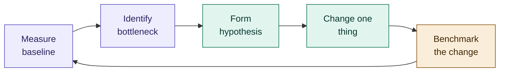
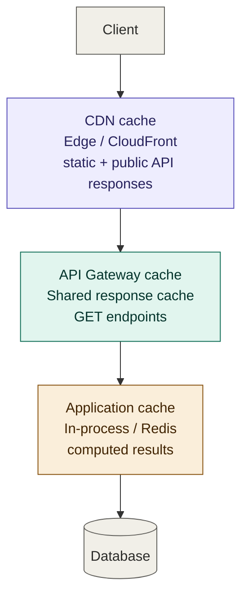
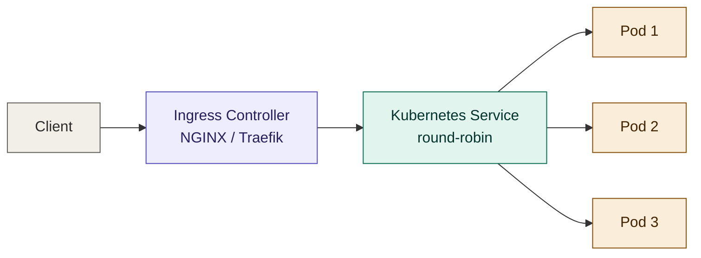
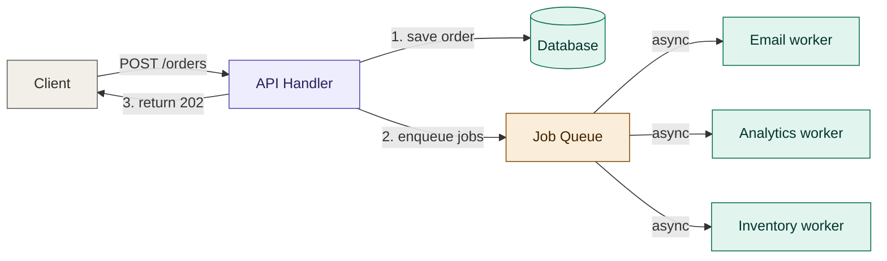
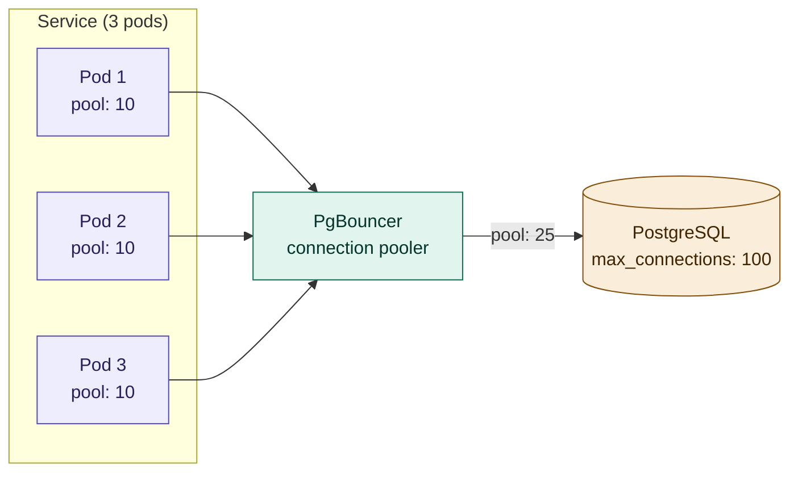
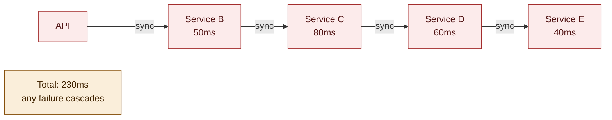

# 09 — Performance Optimization

## Table of Contents

- [Performance Mindset](#performance-mindset)
- [Caching Strategies](#caching-strategies)
- [Database Optimization](#database-optimization)
- [Load Balancing](#load-balancing)
- [Asynchronous Processing](#asynchronous-processing)
- [Connection Pooling](#connection-pooling)
- [Payload Optimization](#payload-optimization)
- [Horizontal Scaling and Autoscaling](#horizontal-scaling-and-autoscaling)
- [Profiling and Benchmarking](#profiling-and-benchmarking)
- [Performance Anti-patterns](#performance-anti-patterns)
- [Summary & Next Steps](#summary--next-steps)

---

## Performance Mindset

The cardinal rule of performance optimization: **measure first, optimise second**. Guessing where bottlenecks are is almost always wrong. Use distributed traces and metrics (see [07-observability.md](./07-observability.md)) to find the actual slow paths before changing anything.

### The Optimization Loop



Change one thing at a time. If you change three things simultaneously and performance improves, you don't know which one helped — or if two of the three hurt and one helped enough to mask them.

### Where Time Actually Goes

In a typical microservice request, time is spent:

| Layer | Typical share | Optimization levers |
|-------|-------------|-------------------|
| Network round trips | 20–40% | Reduce hops, async where possible, HTTP/2 |
| Database queries | 30–60% | Indexes, query tuning, connection pooling, caching |
| Serialisation / deserialisation | 5–15% | Payload pruning, binary formats (gRPC/Protobuf) |
| Business logic (CPU) | 5–20% | Algorithmic improvements, async I/O, worker threads |
| External API calls | 10–40% | Caching, parallel calls, circuit breaker + fallback |

For most services, the database is the dominant bottleneck. Cache it before rewriting the application.

---

## Caching Strategies

Caching is the highest-leverage performance improvement available in most microservices. A cache hit costs microseconds; a database query costs milliseconds.

### Cache Taxonomy



### Cache-Aside (Lazy Loading)

The most common pattern. The application checks the cache first; on a miss, it fetches from the database and populates the cache.

```typescript
async function getUser(userId: string): Promise<User> {
  const cacheKey = `user:${userId}`;

  // 1. Check cache
  const cached = await redis.get(cacheKey);
  if (cached) {
    return JSON.parse(cached);
  }

  // 2. Cache miss — fetch from database
  const user = await userRepository.findById(userId);
  if (!user) throw new NotFoundError(`User ${userId} not found`);

  // 3. Populate cache with TTL
  await redis.setex(cacheKey, 300, JSON.stringify(user)); // 5 min TTL

  return user;
}

// Invalidate on write
async function updateUser(userId: string, data: UpdateUserDTO): Promise<User> {
  const user = await userRepository.update(userId, data);
  await redis.del(`user:${userId}`); // invalidate immediately
  return user;
}
```

### Write-Through Cache

Write to the cache and the database simultaneously. Reads are always fast; consistency is guaranteed.

```typescript
async function updateUserProfile(
  userId: string,
  data:   UpdateProfileDTO,
): Promise<User> {
  // Write to DB and cache in the same operation
  const user = await userRepository.update(userId, data);

  // Update cache immediately after successful write
  await redis.setex(`user:${userId}`, 300, JSON.stringify(user));

  return user;
}
```

Use write-through when read-after-write consistency matters to the user experience (e.g. profile settings).

### Cache Stampede Prevention

When a popular cache key expires, many concurrent requests can hit the database simultaneously — the stampede. Prevent it with probabilistic early expiration or a mutex lock.

```typescript
import Redlock from 'redlock';

const redlock = new Redlock([redis], { retryCount: 0 }); // don't queue — fail fast

async function getPopularProduct(productId: string): Promise<Product> {
  const cacheKey = `product:${productId}`;
  const lockKey  = `lock:product:${productId}`;

  const cached = await redis.get(cacheKey);
  if (cached) return JSON.parse(cached);

  // Only one process recomputes — others wait or return stale
  try {
    const lock = await redlock.acquire([lockKey], 5000); // 5s lock TTL

    try {
      // Double-check after acquiring lock — another process may have populated it
      const recheck = await redis.get(cacheKey);
      if (recheck) return JSON.parse(recheck);

      const product = await productRepository.findById(productId);
      await redis.setex(cacheKey, 600, JSON.stringify(product));
      return product;
    } finally {
      await lock.release();
    }
  } catch {
    // Lock not acquired — another process is fetching, hit DB as fallback
    return productRepository.findById(productId);
  }
}
```

### Cache Strategies by Data Type

| Data type | Strategy | TTL | Invalidation |
|-----------|---------|-----|-------------|
| User profile | Cache-aside | 5 min | On update |
| Product catalogue | Write-through | 10 min | On product change |
| Session data | Write-through | Session lifetime | On logout |
| API rate limit counters | In-cache only (Redis) | Window duration | Automatic expiry |
| Computed aggregates (dashboards) | Cache-aside | 1–5 min | Time-based only |
| Reference data (countries, currencies) | Warm on startup | 24 h | Deploy-time refresh |
| Auth tokens | Write-through | Token lifetime | On revocation |

### Multi-Level Caching

```typescript
class MultiLevelCache {
  private local = new Map<string, { value: unknown; expiresAt: number }>();

  constructor(
    private redis:    RedisClient,
    private localTTL: number = 5_000,   // 5s in-process cache
    private redisTTL: number = 300,     // 5 min in Redis
  ) {}

  async get<T>(key: string): Promise<T | null> {
    // L1: in-process (microseconds)
    const local = this.local.get(key);
    if (local && Date.now() < local.expiresAt) {
      return local.value as T;
    }

    // L2: Redis (sub-millisecond)
    const remote = await this.redis.get(key);
    if (remote) {
      const value = JSON.parse(remote) as T;
      // Backfill L1
      this.local.set(key, { value, expiresAt: Date.now() + this.localTTL });
      return value;
    }

    return null;
  }

  async set<T>(key: string, value: T): Promise<void> {
    this.local.set(key, { value, expiresAt: Date.now() + this.localTTL });
    await this.redis.setex(key, this.redisTTL, JSON.stringify(value));
  }

  del(key: string): Promise<void> {
    this.local.delete(key);
    return this.redis.del(key).then(() => undefined);
  }
}
```

---

## Database Optimization

### Indexing Strategy

The most impactful single database optimization. A missing index on a high-frequency query can be the difference between a 2ms and a 2000ms response.

```sql
-- Find slow queries in PostgreSQL
SELECT
  query,
  calls,
  round(total_exec_time::numeric, 2)        AS total_ms,
  round(mean_exec_time::numeric, 2)         AS mean_ms,
  round(stddev_exec_time::numeric, 2)       AS stddev_ms,
  round((100 * total_exec_time /
    sum(total_exec_time) OVER ())::numeric, 2) AS pct_total
FROM pg_stat_statements
ORDER BY total_exec_time DESC
LIMIT 20;

-- Find missing indexes — tables with sequential scans on large tables
SELECT
  schemaname,
  tablename,
  seq_scan,
  seq_tup_read,
  idx_scan,
  n_live_tup
FROM pg_stat_user_tables
WHERE seq_scan > idx_scan
  AND n_live_tup > 10000
ORDER BY seq_tup_read DESC;
```

```sql
-- Composite index for common query patterns
-- Query: WHERE user_id = $1 AND status = $2 ORDER BY created_at DESC
CREATE INDEX CONCURRENTLY idx_orders_user_status_created
  ON orders (user_id, status, created_at DESC);

-- Partial index — index only the active subset (much smaller, much faster)
-- Query: WHERE status = 'pending' AND created_at < NOW() - INTERVAL '1 hour'
CREATE INDEX CONCURRENTLY idx_orders_pending_stale
  ON orders (created_at)
  WHERE status = 'pending';

-- Covering index — includes all columns the query needs, avoiding a table heap fetch
CREATE INDEX CONCURRENTLY idx_orders_user_covering
  ON orders (user_id)
  INCLUDE (id, status, total_amount, created_at);
```

### N+1 Query Problem

The most common query anti-pattern. Fetching a list of N records and then issuing N additional queries to fetch related data.

```typescript
// BAD — N+1: 1 query to get orders + N queries to get user for each order
const orders = await db.query('SELECT * FROM orders LIMIT 100');
for (const order of orders.rows) {
  const user = await db.query('SELECT * FROM users WHERE id = $1', [order.user_id]);
  order.user = user.rows[0];
}

// GOOD — 2 queries total regardless of N
const orders = await db.query('SELECT * FROM orders LIMIT 100');
const userIds = [...new Set(orders.rows.map(o => o.user_id))];
const users   = await db.query(
  'SELECT * FROM users WHERE id = ANY($1)',
  [userIds],
);
const userMap = new Map(users.rows.map(u => [u.id, u]));
for (const order of orders.rows) {
  order.user = userMap.get(order.user_id);
}

// BEST — single JOIN query
const result = await db.query(`
  SELECT
    o.*,
    u.id   AS user_id,
    u.name AS user_name,
    u.email AS user_email
  FROM orders o
  JOIN users u ON u.id = o.user_id
  LIMIT 100
`);
```

### Read Replicas

Route read-heavy queries to read replicas, freeing the primary for writes.

```typescript
import { Pool } from 'pg';

// Separate pools for primary (writes) and replicas (reads)
const primaryPool = new Pool({ connectionString: process.env.PRIMARY_DB_URL });
const replicaPool = new Pool({ connectionString: process.env.REPLICA_DB_URL });

class OrderRepository {
  // Writes always go to primary
  async create(data: CreateOrderDTO): Promise<Order> {
    const result = await primaryPool.query(
      'INSERT INTO orders (...) VALUES (...) RETURNING *',
      [...],
    );
    return result.rows[0];
  }

  // Reads go to replica
  async findByUser(userId: string): Promise<Order[]> {
    const result = await replicaPool.query(
      'SELECT * FROM orders WHERE user_id = $1 ORDER BY created_at DESC',
      [userId],
    );
    return result.rows;
  }

  // After a write, short-circuit to primary for read-after-write consistency
  async findById(id: string, useReplica = true): Promise<Order | null> {
    const pool   = useReplica ? replicaPool : primaryPool;
    const result = await pool.query(
      'SELECT * FROM orders WHERE id = $1',
      [id],
    );
    return result.rows[0] ?? null;
  }
}
```

### Query Optimization Patterns

```sql
-- Use EXPLAIN ANALYZE to understand query plans
EXPLAIN (ANALYZE, BUFFERS, FORMAT TEXT)
SELECT * FROM orders
WHERE user_id = 'usr_123'
  AND status = 'pending'
ORDER BY created_at DESC
LIMIT 20;

-- Paginate with keyset pagination instead of OFFSET for large datasets
-- OFFSET scans and discards rows — keyset is O(log N) always

-- BAD: OFFSET gets slower as page number increases
SELECT * FROM orders ORDER BY created_at DESC LIMIT 20 OFFSET 10000;

-- GOOD: keyset pagination — always fast
SELECT * FROM orders
WHERE created_at < $1  -- cursor from last seen row
ORDER BY created_at DESC
LIMIT 20;

-- Batch inserts instead of individual inserts
INSERT INTO order_events (order_id, event_type, payload, created_at)
SELECT
  unnest($1::uuid[])   AS order_id,
  unnest($2::text[])   AS event_type,
  unnest($3::jsonb[])  AS payload,
  NOW()
;
```

### Connection Pool Sizing

```
Optimal pool size ≈ (core_count * 2) + effective_spindle_count

For a 4-core machine with SSD: (4 * 2) + 1 = ~9 connections per service instance

With 3 service instances: 3 * 9 = 27 total connections to the database
```

```typescript
const pool = new Pool({
  max:              10,      // max connections per instance
  min:               2,      // keep at least 2 warm
  idleTimeoutMillis: 10_000, // close idle connections after 10s
  connectionTimeoutMillis: 3_000, // fail fast if pool is exhausted
});

// Monitor pool health
setInterval(async () => {
  poolMetrics.set({ state: 'total' },   pool.totalCount);
  poolMetrics.set({ state: 'idle' },    pool.idleCount);
  poolMetrics.set({ state: 'waiting' }, pool.waitingCount);
}, 5000);
```

---

## Load Balancing

### Kubernetes Service Load Balancing

By default, Kubernetes Services use round-robin DNS load balancing. For fine-grained control, use a service mesh or an Ingress controller.



### Load Balancing Algorithms

| Algorithm | How it works | Best for |
|-----------|-------------|---------|
| Round-robin | Distributes requests in sequence | Uniform, stateless services |
| Least connections | Routes to pod with fewest active requests | Services with variable request duration |
| IP hash | Routes same client IP to same pod | Session-sticky requirements |
| Weighted round-robin | More traffic to larger / faster pods | Mixed pod sizes |
| Random with two choices | Pick 2 at random, choose the less loaded | Large clusters, avoids thundering herd |

```yaml
# Istio VirtualService — least connections load balancing
apiVersion: networking.istio.io/v1beta1
kind: DestinationRule
metadata:
  name: order-service
spec:
  host: order-service
  trafficPolicy:
    loadBalancer:
      simple: LEAST_CONN
    connectionPool:
      tcp:
        maxConnections: 100
      http:
        http2MaxRequests:        1000
        maxRequestsPerConnection: 10
        h2UpgradePolicy:         UPGRADE
```

---

## Asynchronous Processing

Moving work off the critical path is one of the most effective performance techniques. Any operation that does not need to complete before returning a response to the caller should be async.



### Job Queues with BullMQ

```typescript
import { Queue, Worker, QueueEvents } from 'bullmq';

const connection = { host: process.env.REDIS_HOST, port: 6379 };

// Producer — enqueue work immediately after the DB write
const emailQueue     = new Queue('email-notifications', { connection });
const analyticsQueue = new Queue('analytics-events',   { connection });

async function createOrder(data: CreateOrderDTO): Promise<Order> {
  const order = await orderRepository.create(data);

  // Enqueue async jobs — don't wait for them
  await Promise.all([
    emailQueue.add('order-confirmation', { orderId: order.id, userId: order.userId }),
    analyticsQueue.add('order-created',  { orderId: order.id, amount: order.total }),
  ]);

  return order; // returns in ~10ms — email sending is async
}

// Consumer — separate process / pod
const emailWorker = new Worker(
  'email-notifications',
  async (job) => {
    const { orderId, userId } = job.data;
    const user  = await userService.getById(userId);
    const order = await orderService.getById(orderId);
    await emailService.sendOrderConfirmation(user.email, order);
  },
  {
    connection,
    concurrency: 10,            // process 10 jobs in parallel
    limiter:     { max: 100, duration: 60_000 }, // max 100 emails/min
  },
);

emailWorker.on('failed', (job, err) => {
  logger.error({ jobId: job?.id, err }, 'Email job failed');
});
```

### Parallel Calls

When a handler needs data from multiple independent services, fetch them in parallel rather than sequentially.

```typescript
// BAD — sequential: total time = T(user) + T(orders) + T(products)
const user     = await userService.getById(userId);
const orders   = await orderService.getByUser(userId);
const products = await productService.getRecommendations(userId);

// GOOD — parallel: total time = max(T(user), T(orders), T(products))
const [user, orders, products] = await Promise.all([
  userService.getById(userId),
  orderService.getByUser(userId),
  productService.getRecommendations(userId),
]);

// BEST — parallel with individual error handling
// One failing call doesn't fail the whole response
const [userResult, ordersResult, productsResult] = await Promise.allSettled([
  userService.getById(userId),
  orderService.getByUser(userId),
  productService.getRecommendations(userId),
]);

const user     = userResult.status    === 'fulfilled' ? userResult.value    : null;
const orders   = ordersResult.status  === 'fulfilled' ? ordersResult.value  : [];
const products = productsResult.status === 'fulfilled' ? productsResult.value : [];
```

---

## Connection Pooling

Every service needs connection pools for databases, caches, and HTTP clients. An under-configured pool causes request queuing; an over-configured pool overwhelms the database.



### PgBouncer — Database Connection Pooler

With many service instances each holding connection pools, the total connection count to PostgreSQL can exhaust `max_connections`. PgBouncer multiplexes many application connections into a smaller number of real database connections.

```ini
# pgbouncer.ini
[databases]
orders = host=postgres-primary port=5432 dbname=orders

[pgbouncer]
pool_mode          = transaction   # reuse connection between transactions
max_client_conn    = 1000          # total application connections accepted
default_pool_size  = 25            # real DB connections per database
min_pool_size      = 5
server_idle_timeout = 600
log_connections    = 0             # reduce logging overhead in production
log_disconnections = 0
```

---

## Payload Optimization

Reducing the size of data transferred over the network reduces latency and bandwidth cost.

### Response Shaping — Return Only What Is Needed

```typescript
// BAD — returns entire user object including internal fields
const user = await userRepository.findById(userId);
res.json(user); // 847 bytes

// GOOD — return only what the client needs
res.json({
  id:          user.id,
  name:        user.displayName,
  avatarUrl:   user.avatarUrl,
  memberSince: user.createdAt,
}); // 124 bytes — 85% smaller
```

### Sparse Fieldsets (Inspired by JSON:API)

```typescript
// Client requests only the fields it needs
// GET /api/v1/orders?fields=id,status,totalAmount,createdAt

function applyFieldset<T extends object>(
  data:   T,
  fields: string | undefined,
): Partial<T> {
  if (!fields) return data;

  const allowed = new Set(fields.split(',').map(f => f.trim()));
  return Object.fromEntries(
    Object.entries(data).filter(([key]) => allowed.has(key)),
  ) as Partial<T>;
}

app.get('/api/v1/orders/:id', async (req, res) => {
  const order  = await orderService.getById(req.params.id);
  const shaped = applyFieldset(order, req.query.fields as string | undefined);
  res.json(shaped);
});
```

### Compression

```typescript
import compression from 'compression';

app.use(compression({
  level:     6,       // zlib compression level 1-9 (6 is a good default)
  threshold: 1024,    // only compress responses > 1KB
  filter:    (req, res) => {
    // Don't compress Server-Sent Events or streaming responses
    if (req.headers['accept'] === 'text/event-stream') return false;
    return compression.filter(req, res);
  },
}));
```

Compression savings by content type:
- JSON API responses: 60–80% size reduction
- HTML: 70–80%
- Already-compressed (images, video, zip): < 1% — skip it

### HTTP/2 and Multiplexing

HTTP/2 sends multiple requests over a single TCP connection, eliminating the per-request connection overhead of HTTP/1.1.

```typescript
import spdy from 'spdy'; // HTTP/2 for Node.js
import fs from 'fs';

const server = spdy.createServer(
  {
    key:  fs.readFileSync('./certs/server.key'),
    cert: fs.readFileSync('./certs/server.crt'),
  },
  app,
);

server.listen(443);
```

In practice, HTTP/2 is usually handled by your Ingress controller or load balancer rather than the application itself.

---

## Horizontal Scaling and Autoscaling

Scale out (more pods) before scaling up (bigger pods). More small pods give better fault isolation, cheaper rollbacks, and more granular resource control.

### Horizontal Pod Autoscaler

```yaml
# Scale based on CPU and custom metrics
apiVersion: autoscaling/v2
kind: HorizontalPodAutoscaler
metadata:
  name: order-service
spec:
  scaleTargetRef:
    apiVersion: apps/v1
    kind: Deployment
    name: order-service
  minReplicas: 3
  maxReplicas: 50
  metrics:
    # CPU — scale out when average CPU > 70%
    - type: Resource
      resource:
        name: cpu
        target:
          type:               AverageValue
          averageUtilization: 70

    # Custom metric — scale on request queue depth
    - type: Pods
      pods:
        metric:
          name: http_requests_per_second
        target:
          type:         AverageValue
          averageValue: "100"  # scale out if any pod handles > 100 req/s

  behavior:
    scaleUp:
      stabilizationWindowSeconds: 30     # react quickly to spikes
      policies:
        - type:          Pods
          value:         4               # add up to 4 pods at a time
          periodSeconds: 60
    scaleDown:
      stabilizationWindowSeconds: 300    # wait 5 min before scaling down
      policies:
        - type:          Pods
          value:         1               # remove 1 pod at a time
          periodSeconds: 60
```

### KEDA — Event-Driven Autoscaling

Scale based on queue depth, Kafka lag, or any external metric rather than CPU.

```yaml
# Scale order workers based on Kafka consumer lag
apiVersion: keda.sh/v1alpha1
kind: ScaledObject
metadata:
  name: order-worker-scaler
spec:
  scaleTargetRef:
    name: order-worker
  minReplicaCount: 1
  maxReplicaCount: 30
  triggers:
    - type: kafka
      metadata:
        bootstrapServers: kafka:9092
        consumerGroup:    order-workers
        topic:            orders.placed
        lagThreshold:     "50"    # scale out when lag > 50 messages per partition
```

---

## Profiling and Benchmarking

### Node.js CPU Profiling

```typescript
// Enable the built-in V8 profiler
import { Session } from 'inspector';
import { writeFileSync } from 'fs';

async function profileFor(durationMs: number): Promise<void> {
  const session = new Session();
  session.connect();

  await new Promise<void>((res, rej) => {
    session.post('Profiler.enable', () => {
      session.post('Profiler.start', () => {
        setTimeout(() => {
          session.post('Profiler.stop', (_err, { profile }) => {
            writeFileSync('profile.cpuprofile', JSON.stringify(profile));
            session.disconnect();
            res();
          });
        }, durationMs);
      });
    });
  });
}

// Open profile.cpuprofile in Chrome DevTools → Performance tab
```

### Load Testing with k6

```javascript
// load-test.js
import http from 'k6/http';
import { check, sleep } from 'k6';
import { Rate } from 'k6/metrics';

const errorRate = new Rate('errors');

export const options = {
  stages: [
    { duration: '1m',  target: 50  }, // ramp up to 50 VUs
    { duration: '5m',  target: 50  }, // hold at 50
    { duration: '2m',  target: 200 }, // spike to 200
    { duration: '5m',  target: 200 }, // hold spike
    { duration: '2m',  target: 0   }, // ramp down
  ],
  thresholds: {
    http_req_duration: ['p(95)<500'], // 95% of requests under 500ms
    errors:            ['rate<0.01'], // error rate under 1%
  },
};

export default function () {
  const res = http.post(
    'https://staging.example.com/api/v1/orders',
    JSON.stringify({
      userId:  'usr_benchmark',
      items:   [{ productId: 'prod_123', quantity: 1 }],
    }),
    { headers: { 'Content-Type': 'application/json', Authorization: `Bearer ${__ENV.TOKEN}` } },
  );

  check(res, {
    'status is 201': (r) => r.status === 201,
    'response time < 500ms': (r) => r.timings.duration < 500,
  });

  errorRate.add(res.status >= 400);
  sleep(1);
}
```

```bash
# Run the load test
k6 run --env TOKEN=your-jwt load-test.js

# Output includes: p50, p90, p95, p99, req/s, error rate
```

### Memory Leak Detection

```typescript
// Track memory growth over time
setInterval(() => {
  const mem = process.memoryUsage();
  memoryGauge.set({ type: 'heapUsed' },  mem.heapUsed);
  memoryGauge.set({ type: 'heapTotal' }, mem.heapTotal);
  memoryGauge.set({ type: 'rss' },       mem.rss);
  memoryGauge.set({ type: 'external' },  mem.external);
}, 10_000);

// Alert if heap grows > 80% of limit
// kubectl set memory limit: --limits=memory=512Mi
// Alert threshold: heapUsed / heapTotal > 0.8
```

---

## Performance Anti-patterns

### Synchronous Chains (Service Fan-out)



Fix: run independent calls in parallel with `Promise.all`. Push non-critical work to async queues.

### Unbounded Queries

```typescript
// NEVER — returns every row in the table
const all = await db.query('SELECT * FROM orders');

// ALWAYS — paginate and filter
const page = await db.query(
  'SELECT * FROM orders WHERE user_id = $1 ORDER BY created_at DESC LIMIT $2 OFFSET $3',
  [userId, 20, offset],
);
```

### Large Payload Pass-through

Services that fetch an entire object from a database and pass it to other services "just in case" — most of the data is discarded by the consumer. Transmit only what is needed.

### Polling Instead of Push

```typescript
// BAD — polling wastes resources, adds latency
setInterval(async () => {
  const newOrders = await checkForNewOrders(); // hammers DB every second
}, 1000);

// GOOD — event-driven push
eventBus.subscribe('orders.created', async (event) => {
  await processNewOrder(event.data);
});
```

### Missing Indexes on Foreign Keys

PostgreSQL (unlike MySQL) does not automatically create indexes on foreign key columns. Every un-indexed foreign key is a full table scan on JOIN.

```sql
-- Check for foreign keys without indexes
SELECT
  tc.table_name,
  kcu.column_name,
  'CREATE INDEX CONCURRENTLY idx_' || tc.table_name || '_' || kcu.column_name ||
    ' ON ' || tc.table_name || '(' || kcu.column_name || ');' AS suggested_index
FROM information_schema.table_constraints tc
JOIN information_schema.key_column_usage kcu
  ON tc.constraint_name = kcu.constraint_name
LEFT JOIN pg_indexes pi
  ON pi.tablename  = tc.table_name
  AND pi.indexdef LIKE '%' || kcu.column_name || '%'
WHERE tc.constraint_type = 'FOREIGN KEY'
  AND pi.indexname IS NULL;
```

---

## Summary & Next Steps

Performance optimization follows a strict order: measure, find the bottleneck, change one thing, measure again. The most impactful levers, roughly in order:

1. **Caching** — a Redis cache hit costs ~0.1ms; a PostgreSQL query costs 1–100ms. Add caching before anything else.
2. **Database indexes** — a missing index on a hot query is almost always the largest single improvement available.
3. **N+1 elimination** — batch queries and use JOINs where appropriate.
4. **Async offloading** — move non-critical work (email, analytics, notifications) off the request path.
5. **Parallel calls** — independent service calls should always run in parallel.
6. **Connection pool tuning** — right-size pools; add PgBouncer for high pod-count deployments.
7. **Autoscaling** — let Kubernetes handle traffic spikes; tune HPA stabilisation windows to avoid flapping.

### Recommended Reading Order

| Step | Document | What you'll learn |
|------|----------|------------------|
| Next | [10-testing.md](./10-testing.md) | Unit, integration, contract, and performance testing |
| Also | [07-observability.md](./07-observability.md) | Finding bottlenecks with distributed traces and metrics |
| Also | [08-resilience.md](./08-resilience.md) | Bulkheads and circuit breakers to protect the DB under load |
| Also | [03-database-patterns.md](./03-database-patterns.md) | CQRS read models as an alternative to caching |

---

*Part of the [Microservices Architecture Guide](../../README.md)*  
*Previous: [08-resilience.md](./08-resilience.md)*  
*Next: [10-testing.md](./10-testing.md)*