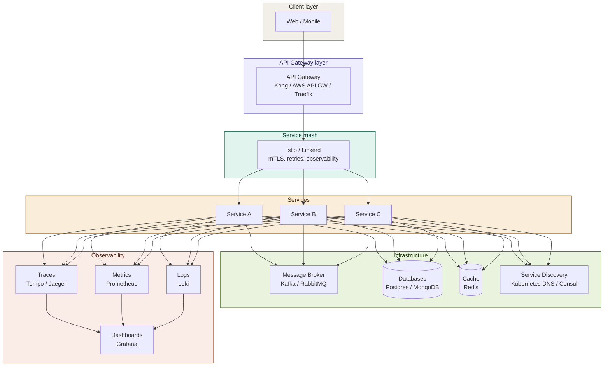
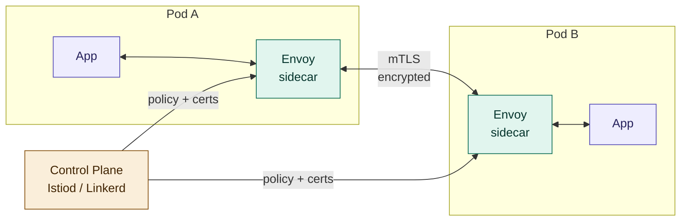
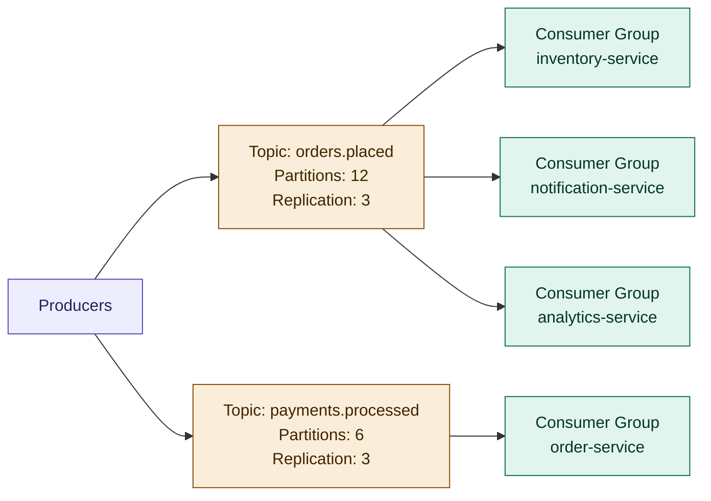
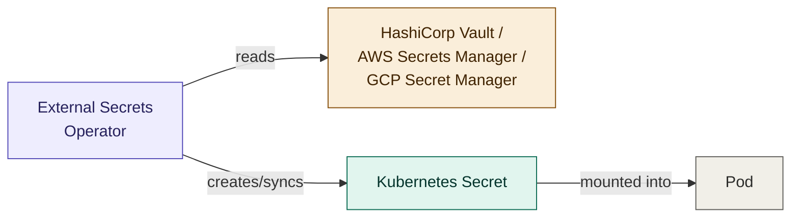
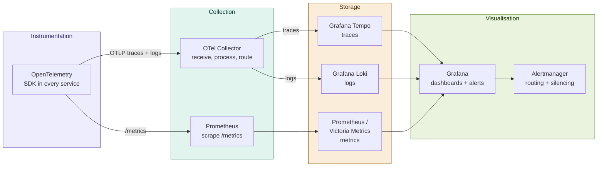
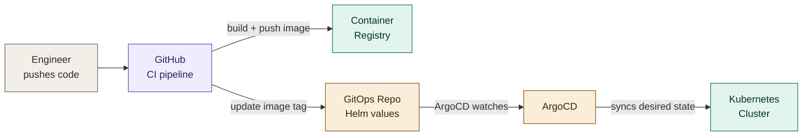
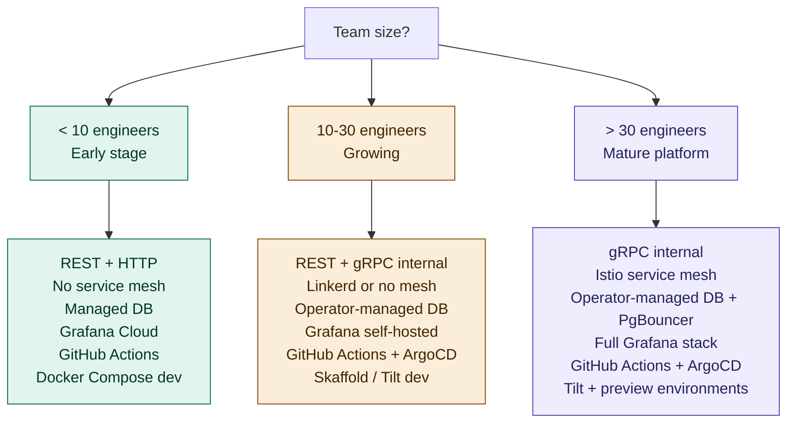

# 11 — Tools Ecosystem

## Table of Contents

- [Overview](#overview)
- [API Gateways](#api-gateways)
- [Service Mesh](#service-mesh)
- [Message Brokers](#message-brokers)
- [Service Discovery and Configuration](#service-discovery-and-configuration)
- [Observability Stack](#observability-stack)
- [CI/CD Tooling](#cicd-tooling)
- [Container and Orchestration](#container-and-orchestration)
- [Databases and Storage](#databases-and-storage)
- [Security Tooling](#security-tooling)
- [Developer Experience](#developer-experience)
- [Choosing Your Stack](#choosing-your-stack)
- [Summary & Next Steps](#summary--next-steps)

---

## Overview

A microservices platform is more than application code — it is an ecosystem of infrastructure tools that handle the cross-cutting concerns that would otherwise be re-implemented in every service. Choosing the right tools at the right time is as important as writing good application code.



The golden rule for tool adoption: **solve the problem you have now, not the problem you might have at 100x scale**. Each tool in this list adds operational complexity. Adopt tools progressively as the pain of not having them outweighs the cost of running them.

---

## API Gateways

The API Gateway is the single entry point for external traffic. It handles authentication, routing, rate limiting, and TLS termination so that individual services do not have to.

### Comparison

| Tool                    | Type                             | Best for                                                    | Hosting                        |
| ----------------------- | -------------------------------- | ----------------------------------------------------------- | ------------------------------ |
| **Kong**                | Reverse proxy + plugin framework | Feature-rich, plugin ecosystem, enterprise support          | Self-hosted or Kong Cloud      |
| **Traefik**             | Dynamic reverse proxy            | Kubernetes-native, automatic service discovery, lightweight | Self-hosted                    |
| **AWS API Gateway**     | Managed gateway                  | AWS-native teams, serverless backends                       | Fully managed                  |
| **Nginx**               | Web server / reverse proxy       | High performance, simple routing, custom config             | Self-hosted                    |
| **Envoy**               | L7 proxy                         | Service mesh data plane, programmable                       | Self-hosted (usually via mesh) |
| **Google Cloud Apigee** | API management platform          | Enterprise API programs, monetisation, analytics            | Managed                        |

### Kong Configuration Example

```yaml
# kong.yaml — declarative configuration
_format_version: "3.0"

services:
  - name: order-service
    url: http://order-service.production.svc.cluster.local:80
    routes:
      - name: order-routes
        paths: ["/api/v1/orders"]
        methods: ["GET", "POST", "PUT", "PATCH", "DELETE"]
    plugins:
      - name: jwt
        config:
          secret_is_base64: false
          claims_to_verify: [exp, nbf]
      - name: rate-limiting
        config:
          minute: 60
          hour: 1000
          policy: redis
          redis_host: redis
          redis_port: 6379
      - name: request-transformer
        config:
          add:
            headers:
              - "X-Gateway-Version:2"
      - name: prometheus
        config:
          status_code_metrics: true
          latency_metrics: true
          bandwidth_metrics: true

  - name: user-service
    url: http://user-service.production.svc.cluster.local:80
    routes:
      - name: user-routes
        paths: ["/api/v1/users"]
    plugins:
      - name: jwt
      - name: rate-limiting
        config:
          minute: 100

plugins:
  - name: correlation-id # inject X-Request-ID on every request
    config:
      header_name: X-Request-ID
      generator: uuid
      echo_downstream: true
```

### Traefik with Kubernetes IngressRoute

```yaml
# ingressroute.yaml
apiVersion: traefik.io/v1alpha1
kind: IngressRoute
metadata:
  name: order-service-ingress
  namespace: production
spec:
  entryPoints: [websecure]
  routes:
    - match: Host(`api.example.com`) && PathPrefix(`/api/v1/orders`)
      kind: Rule
      middlewares:
        - name: jwt-auth
        - name: rate-limit
        - name: compress
      services:
        - name: order-service
          port: 80
  tls:
    certResolver: letsencrypt

---
apiVersion: traefik.io/v1alpha1
kind: Middleware
metadata:
  name: rate-limit
  namespace: production
spec:
  rateLimit:
    average: 100
    burst: 200
    period: 1m
    sourceCriterion:
      requestHeaderName: Authorization
```

---

## Service Mesh

A service mesh manages all service-to-service communication at the infrastructure level, providing mTLS, retries, circuit breaking, and distributed tracing without any changes to application code.



### Istio vs Linkerd

| Capability              | Istio                                    | Linkerd                                   |
| ----------------------- | ---------------------------------------- | ----------------------------------------- |
| mTLS                    | Yes — automatic                          | Yes — automatic                           |
| Traffic management      | Rich (VirtualService, DestinationRule)   | Basic (ServiceProfile)                    |
| Observability           | Built-in metrics, tracing, access logs   | Built-in metrics and tracing              |
| Circuit breaking        | Yes                                      | Yes (via retries)                         |
| Canary deployments      | Yes (weight-based routing)               | Yes (SMI-based)                           |
| Operational complexity  | High                                     | Low–Medium                                |
| Control plane resources | ~1GB RAM                                 | ~200MB RAM                                |
| Learning curve          | Steep                                    | Moderate                                  |
| Best for                | Feature-rich, complex traffic management | Simplicity, low overhead, fast onboarding |

### Istio Traffic Management

```yaml
# Virtual service — canary routing
apiVersion: networking.istio.io/v1beta1
kind: VirtualService
metadata:
  name: order-service
spec:
  hosts: [order-service]
  http:
    - route:
        - destination:
            host: order-service
            subset: stable
          weight: 90
        - destination:
            host: order-service
            subset: canary
          weight: 10
      retries:
        attempts: 3
        perTryTimeout: 2s
        retryOn: "5xx,reset,connect-failure,retriable-4xx"
      timeout: 8s

---
# Destination rule — circuit breaker
apiVersion: networking.istio.io/v1beta1
kind: DestinationRule
metadata:
  name: order-service
spec:
  host: order-service
  subsets:
    - name: stable
      labels:
        track: stable
    - name: canary
      labels:
        track: canary
  trafficPolicy:
    connectionPool:
      tcp:
        maxConnections: 100
      http:
        http2MaxRequests: 1000
        maxRequestsPerConnection: 10
    outlierDetection: # circuit breaker
      consecutive5xxErrors: 5
      interval: 10s
      baseEjectionTime: 30s
      maxEjectionPercent: 50
```

---

## Message Brokers

See [04-communication.md](./04-communication.md) for when to use messaging vs REST/gRPC. This section covers operational tooling for running brokers in production.

### Apache Kafka



**Key Kafka operational parameters:**

```yaml
# kafka-config.yaml — production settings
broker:
  num.partitions: 12 # default partitions per topic
  default.replication.factor: 3 # keep 3 copies — tolerate 1 broker failure
  min.insync.replicas: 2 # require 2 acks before commit (safety)
  log.retention.hours: 168 # retain messages for 7 days
  log.segment.bytes: 1073741824 # 1GB segments
  compression.type: lz4 # compress on the broker for storage savings

producer:
  acks: all # wait for all ISR acks — no data loss
  retries: 2147483647 # retry indefinitely (idempotent)
  enable.idempotence: true # exactly-once producer semantics
  max.in.flight.requests.per.connection: 5

consumer:
  enable.auto.commit: false # manual commits — control exactly when offset advances
  auto.offset.reset: earliest # new consumer groups start from the beginning
  max.poll.records: 500 # batch size per poll
  session.timeout.ms: 45000
```

**Kafka on Kubernetes with Strimzi:**

```yaml
apiVersion: kafka.strimzi.io/v1beta2
kind: Kafka
metadata:
  name: production-kafka
spec:
  kafka:
    version: 3.7.0
    replicas: 3
    config:
      offsets.topic.replication.factor: 3
      transaction.state.log.replication.factor: 3
      min.insync.replicas: 2
      default.replication.factor: 3
    storage:
      type: persistent-claim
      size: 200Gi
      class: fast-ssd
    resources:
      requests: { memory: 4Gi, cpu: "1" }
      limits: { memory: 8Gi, cpu: "4" }
  zookeeper: # or use KRaft mode in Kafka 3.6+
    replicas: 3
    storage:
      type: persistent-claim
      size: 10Gi
```

### RabbitMQ

```yaml
# rabbitmq-config — production topology
exchanges:
  - name: orders
    type: topic # route by routing key pattern
    durable: true

queues:
  - name: inventory-service
    durable: true
    arguments:
      x-dead-letter-exchange: dlx
      x-dead-letter-routing-key: inventory-service.dead
      x-message-ttl: 86400000 # 24h TTL
      x-queue-type: quorum # replicated, durable — preferred in 3.8+

  - name: inventory-service.dead # dead letter queue
    durable: true

bindings:
  - exchange: orders
    queue: inventory-service
    routing_key: orders.placed # only receive placed orders
```

### Schema Registry

For Kafka, always use a Schema Registry (Confluent or Apicurio) to enforce message schema evolution and prevent consumers from breaking on incompatible schema changes.

```typescript
import { SchemaRegistry, SchemaType } from "@kafkajs/confluent-schema-registry";

const registry = new SchemaRegistry({ host: "http://schema-registry:8081" });

// Producer — register and encode
const schemaId = await registry.getLatestSchemaId("orders.placed-value");
const encoded = await registry.encode(schemaId, {
  orderId: order.id,
  userId: order.userId,
  amount: order.total,
  currency: order.currency,
});

await producer.send({
  topic: "orders.placed",
  messages: [{ key: order.id, value: encoded }],
});

// Consumer — decode
const decoded = await registry.decode(message.value);
```

---

## Service Discovery and Configuration

### Kubernetes DNS — Zero Config Service Discovery

In Kubernetes, every Service gets a stable DNS name automatically:

```
service-name.namespace.svc.cluster.local

# Examples
order-service.production.svc.cluster.local
payment-service.production.svc.cluster.local:3000
postgres.production.svc.cluster.local:5432
```

Services call each other by DNS name — no service registry configuration needed. This covers the vast majority of microservices deployments.

### Consul — Multi-Cluster and Non-Kubernetes

For workloads spanning Kubernetes and non-Kubernetes environments (VMs, bare metal, multi-cloud), Consul provides service registration, health checking, and KV-based configuration.

```hcl
# consul service registration
service {
  name    = "order-service"
  id      = "order-service-01"
  port    = 3000
  tags    = ["production", "v1.4.2"]

  check {
    http     = "http://localhost:3000/health"
    interval = "10s"
    timeout  = "3s"
  }

  meta {
    version = "1.4.2"
    region  = "us-east-1"
  }
}
```

### External Secrets Operator — Secrets from Vault/Cloud



```yaml
apiVersion: external-secrets.io/v1beta1
kind: ExternalSecret
metadata:
  name: order-service-secrets
  namespace: production
spec:
  refreshInterval: 1h
  secretStoreRef:
    name: vault-secret-store
    kind: ClusterSecretStore
  target:
    name: order-service-secrets
    creationPolicy: Owner
  data:
    - secretKey: DATABASE_URL
      remoteRef:
        key: production/order-service
        property: database_url
    - secretKey: JWT_SECRET
      remoteRef:
        key: production/order-service
        property: jwt_secret
```

---

## Observability Stack

See [07-observability.md](./07-observability.md) for implementation patterns. This section covers tool selection and integration.

### The Grafana OSS Stack



### Managed Observability Options

| Need           | Open source self-hosted | Managed cloud                     |
| -------------- | ----------------------- | --------------------------------- |
| Traces         | Jaeger, Grafana Tempo   | Datadog, Honeycomb, Lightstep     |
| Metrics        | Prometheus + Grafana    | Grafana Cloud, Datadog, New Relic |
| Logs           | Loki + Grafana          | Datadog, Papertrail, Logtail      |
| All-in-one APM | Grafana stack           | Datadog, Dynatrace, New Relic     |
| Error tracking | —                       | Sentry, Rollbar, Bugsnag          |

**Decision guide:**

- Team < 10 engineers or < 20 services: use a managed solution (Grafana Cloud free tier, Datadog). Operational overhead of self-hosted Prometheus + Loki + Tempo is not justified.
- Team > 20 engineers with a dedicated platform team: self-hosted gives cost control and data sovereignty.
- Regulated industries (PCI, HIPAA): check data residency requirements before choosing a managed provider.

### Sentry — Error Tracking

```typescript
import * as Sentry from "@sentry/node";

Sentry.init({
  dsn: process.env.SENTRY_DSN,
  environment: process.env.NODE_ENV,
  release: process.env.SERVICE_VERSION,
  tracesSampleRate: 0.1, // 10% of transactions
  integrations: [
    new Sentry.Integrations.Http({ tracing: true }),
    new Sentry.Integrations.Express({ app }),
  ],
  beforeSend(event) {
    // Strip sensitive data before sending to Sentry
    if (event.request?.data) {
      delete event.request.data.password;
      delete event.request.data.cardNumber;
    }
    return event;
  },
});

// Capture errors with context
try {
  await processOrder(order);
} catch (err) {
  Sentry.withScope((scope) => {
    scope.setTag("service", "order-service");
    scope.setUser({ id: order.userId });
    scope.setExtra("orderId", order.id);
    Sentry.captureException(err);
  });
  throw err;
}
```

---

## CI/CD Tooling

### Pipeline Platforms

| Tool               | Type                       | Best for                                  |
| ------------------ | -------------------------- | ----------------------------------------- |
| **GitHub Actions** | Cloud-native CI/CD         | GitHub repositories, rich marketplace     |
| **GitLab CI**      | Integrated DevOps platform | GitLab repositories, self-hosted option   |
| **ArgoCD**         | GitOps continuous delivery | Kubernetes deployments, declarative state |
| **Flux**           | GitOps toolkit             | Kubernetes, Helm and Kustomize native     |
| **Tekton**         | Kubernetes-native CI/CD    | Cloud-native pipelines, no vendor lock-in |
| **Jenkins**        | Self-hosted automation     | Legacy environments, plugin ecosystem     |

### ArgoCD — GitOps Workflow



```yaml
# argocd-application.yaml
apiVersion: argoproj.io/v1alpha1
kind: Application
metadata:
  name: order-service
  namespace: argocd
spec:
  project: production
  source:
    repoURL: https://github.com/org/gitops
    targetRevision: main
    path: apps/order-service/production
    helm:
      valueFiles: [values-production.yaml]
  destination:
    server: https://kubernetes.default.svc
    namespace: production
  syncPolicy:
    automated:
      prune: true # delete resources removed from git
      selfHeal: true # revert manual kubectl changes
    syncOptions:
      - CreateNamespace=true
      - ServerSideApply=true
  ignoreDifferences: # don't flag HPA-managed replica counts as drift
    - group: apps
      kind: Deployment
      jsonPointers: [/spec/replicas]
```

### Image Security Scanning in CI

```yaml
# GitHub Actions — Trivy scan before push
- name: Build image
  run: docker build -t $IMAGE_TAG .

- name: Scan for vulnerabilities
  uses: aquasecurity/trivy-action@master
  with:
    image-ref: ${{ env.IMAGE_TAG }}
    format: sarif
    output: trivy-results.sarif
    severity: HIGH,CRITICAL
    exit-code: "1" # block the pipeline on HIGH/CRITICAL

- name: Upload SARIF to GitHub Security
  uses: github/codeql-action/upload-sarif@v3
  if: always() # upload even if scan fails
  with:
    sarif_file: trivy-results.sarif

- name: Push image
  if: success() # only push clean images
  run: docker push $IMAGE_TAG
```

---

## Container and Orchestration

### Kubernetes Distributions

| Distribution                     | When to use                                                |
| -------------------------------- | ---------------------------------------------------------- |
| **Vanilla Kubernetes (kubeadm)** | Full control, on-premise or bare metal                     |
| **EKS (AWS)**                    | AWS-native, managed control plane, IAM integration         |
| **GKE (GCP)**                    | Best managed Kubernetes, Autopilot mode reduces ops burden |
| **AKS (Azure)**                  | Azure-native, good Windows container support               |
| **k3s**                          | Edge, IoT, dev environments — lightweight                  |
| **k3d**                          | Local development — k3s in Docker                          |
| **kind**                         | CI environments — Kubernetes in Docker                     |

### Essential Kubernetes Operators

| Operator                       | What it manages                                      |
| ------------------------------ | ---------------------------------------------------- |
| **Strimzi**                    | Apache Kafka clusters                                |
| **CloudNativePG**              | PostgreSQL clusters with HA and backup               |
| **Redis Operator (Spotahome)** | Redis Sentinel and Cluster                           |
| **Cert-Manager**               | TLS certificate lifecycle (Let's Encrypt, Vault PKI) |
| **External Secrets Operator**  | Secret synchronisation from Vault/AWS/GCP            |
| **KEDA**                       | Event-driven autoscaling beyond CPU/memory           |
| **Chaos Mesh**                 | Chaos engineering experiments                        |

### Cert-Manager — Automatic TLS

```yaml
# ClusterIssuer — Let's Encrypt production
apiVersion: cert-manager.io/v1
kind: ClusterIssuer
metadata:
  name: letsencrypt-prod
spec:
  acme:
    server: https://acme-v02.api.letsencrypt.org/directory
    email: ops@example.com
    privateKeySecretRef:
      name: letsencrypt-prod
    solvers:
      - http01:
          ingress:
            class: nginx

---
# Certificate — auto-renews before expiry
apiVersion: cert-manager.io/v1
kind: Certificate
metadata:
  name: api-example-com
  namespace: production
spec:
  secretName: api-example-com-tls
  issuerRef:
    name: letsencrypt-prod
    kind: ClusterIssuer
  dnsNames:
    - api.example.com
    - admin.example.com
```

---

## Databases and Storage

### Database Operators for Kubernetes

```yaml
# CloudNativePG — PostgreSQL cluster with automatic failover
apiVersion: postgresql.cnpg.io/v1
kind: Cluster
metadata:
  name: orders-postgres
  namespace: production
spec:
  instances: 3
  imageName: ghcr.io/cloudnative-pg/postgresql:16

  postgresql:
    parameters:
      max_connections: "200"
      shared_buffers: "256MB"
      effective_cache_size: "768MB"
      work_mem: "4MB"
      checkpoint_completion_target: "0.9"
      wal_buffers: "16MB"
      statement_timeout: "30000" # 30s

  storage:
    size: 100Gi
    storageClass: fast-ssd

  backup:
    retentionPolicy: "30d"
    barmanObjectStore:
      destinationPath: s3://backups/orders-postgres
      s3Credentials:
        accessKeyId:
          name: aws-creds
          key: ACCESS_KEY_ID
        secretAccessKey:
          name: aws-creds
          key: SECRET_ACCESS_KEY

  monitoring:
    enablePodMonitor: true # exposes metrics to Prometheus
```

### Recommended Database per Use Case

| Use case                              | Recommended                | Why                                  |
| ------------------------------------- | -------------------------- | ------------------------------------ |
| Transactional data, financial records | PostgreSQL                 | ACID, mature, extensions             |
| Document store, flexible schema       | MongoDB                    | Native JSON, horizontal scale        |
| Session / cache / rate limiting       | Redis                      | Sub-ms reads, TTL, pub/sub           |
| Event log, high-throughput writes     | Cassandra / ScyllaDB       | Write-optimised, partition tolerance |
| Full-text search, analytics           | Elasticsearch / OpenSearch | Inverted index, aggregations         |
| Time-series metrics                   | TimescaleDB / InfluxDB     | Compression, time-range queries      |
| Graph data, recommendations           | Neo4j                      | Relationship traversal               |
| Data warehouse, OLAP                  | ClickHouse                 | Columnar, extremely fast aggregation |

---

## Security Tooling

| Category                     | Tool                                       | Purpose                                                      |
| ---------------------------- | ------------------------------------------ | ------------------------------------------------------------ |
| Secrets management           | HashiCorp Vault                            | Dynamic secrets, PKI, encryption as a service                |
| Secrets in GitOps            | Sealed Secrets / External Secrets Operator | Safe secret storage in Git                                   |
| mTLS / workload identity     | SPIFFE/SPIRE                               | Workload identity without a service mesh                     |
| Container image scanning     | Trivy, Grype, Snyk Container               | CVE detection in images                                      |
| Source code scanning         | Semgrep, SonarQube                         | SAST — detect vulnerabilities in source                      |
| Dependency scanning          | `npm audit`, Snyk, Dependabot              | Known CVEs in dependencies                                   |
| Kubernetes admission control | OPA Gatekeeper, Kyverno                    | Policy enforcement (no root, resource limits required, etc.) |
| Runtime security             | Falco                                      | Detect anomalous container behaviour at runtime              |
| Secret scanning              | GitLeaks, TruffleHog                       | Detect secrets committed to source control                   |

### OPA Gatekeeper — Policy as Code

```yaml
# Require all containers to set resource limits
apiVersion: constraints.gatekeeper.sh/v1beta1
kind: K8sRequiredResources
metadata:
  name: require-resource-limits
spec:
  match:
    kinds:
      - apiGroups: [apps]
        kinds: [Deployment]
  parameters:
    limits: [cpu, memory]
    requests: [cpu, memory]

---
# Deny containers running as root
apiVersion: constraints.gatekeeper.sh/v1beta1
kind: K8sPSPAllowedUsers
metadata:
  name: deny-root-containers
spec:
  match:
    kinds:
      - apiGroups: [""]
        kinds: [Pod]
  parameters:
    runAsUser:
      rule: MustRunAsNonRoot
```

### Falco — Runtime Threat Detection

```yaml
# falco-rules.yaml — detect suspicious container activity
- rule: Shell spawned in container
  desc: A shell was spawned inside a running container
  condition: >
    spawned_process
    and container
    and shell_procs
    and not user_known_shell_spawn_activities
  output: >
    Shell spawned in container
    (user=%user.name container=%container.name image=%container.image.repository
    shell=%proc.name parent=%proc.pname cmdline=%proc.cmdline)
  priority: WARNING
  tags: [container, shell, mitre_execution]

- rule: Unexpected outbound connection
  desc: A container made a connection to an unexpected external IP
  condition: >
    outbound
    and container
    and not allowed_external_destinations
  output: >
    Unexpected outbound connection from container
    (container=%container.name image=%container.image.repository
    dest=%fd.rip:%fd.rport)
  priority: WARNING
```

---

## Developer Experience

Good developer experience reduces friction, catches problems early, and lets engineers focus on business logic rather than infrastructure plumbing.

### Local Development Stack

```yaml
# docker-compose.dev.yml — full local environment in one command
version: "3.9"
services:
  postgres:
    image: postgres:16-alpine
    environment:
      POSTGRES_DB: orders_dev
      POSTGRES_USER: dev
      POSTGRES_PASSWORD: dev
    ports: ["5432:5432"]
    volumes:
      - postgres-data:/var/lib/postgresql/data

  redis:
    image: redis:7-alpine
    ports: ["6379:6379"]

  kafka:
    image: confluentinc/cp-kafka:7.6.0
    environment:
      KAFKA_BROKER_ID: 1
      KAFKA_ZOOKEEPER_CONNECT: zookeeper:2181
      KAFKA_ADVERTISED_LISTENERS: PLAINTEXT://kafka:9092,PLAINTEXT_HOST://localhost:29092
      KAFKA_LISTENER_SECURITY_PROTOCOL_MAP: PLAINTEXT:PLAINTEXT,PLAINTEXT_HOST:PLAINTEXT
      KAFKA_OFFSETS_TOPIC_REPLICATION_FACTOR: 1
    ports: ["29092:29092"]
    depends_on: [zookeeper]

  zookeeper:
    image: confluentinc/cp-zookeeper:7.6.0
    environment:
      ZOOKEEPER_CLIENT_PORT: 2181

  kafka-ui:
    image: provectuslabs/kafka-ui:latest
    ports: ["8080:8080"]
    environment:
      KAFKA_CLUSTERS_0_BOOTSTRAPSERVERS: kafka:9092

volumes:
  postgres-data:
```

### Skaffold — Kubernetes-Native Development Loop

```yaml
# skaffold.yaml — hot reload directly into a local cluster
apiVersion: skaffold/v4beta6
kind: Config
metadata:
  name: order-service

build:
  artifacts:
    - image: order-service
      docker:
        dockerfile: Dockerfile
        target: runtime
      sync:
        manual:
          - src: "src/**/*.ts"
            dest: /app/src # sync TS files without rebuilding the image

deploy:
  helm:
    releases:
      - name: order-service
        chartPath: ./helm/order-service
        valuesFiles: [./helm/values-dev.yaml]

portForward:
  - resourceType: service
    resourceName: order-service
    port: 3000
    localPort: 3000
```

```bash
# Start the development loop — watches for changes and syncs/rebuilds automatically
skaffold dev
```

### Tilt — Multi-Service Local Development

```python
# Tiltfile — orchestrate multiple services locally
docker_build('order-service',   './services/order-service')
docker_build('payment-service', './services/payment-service')
docker_build('user-service',    './services/user-service')

k8s_yaml(['k8s/order-service.yaml', 'k8s/payment-service.yaml', 'k8s/user-service.yaml'])

k8s_resource('order-service',   port_forwards='3001:3000', labels=['backend'])
k8s_resource('payment-service', port_forwards='3002:3000', labels=['backend'])
k8s_resource('user-service',    port_forwards='3003:3000', labels=['backend'])
```

### API Documentation with Scalar / Swagger

```typescript
import { OpenAPIV3 } from "openapi-types";
import { generateOpenAPI } from "./openapi";
import scalarFastify from "@scalar/fastify-api-reference";

// Auto-generate OpenAPI spec from route definitions
app.register(scalarFastify, {
  routePrefix: "/docs",
  configuration: {
    spec: { content: generateOpenAPI() },
    theme: "purple",
  },
});

// Or serve a static spec
app.get("/openapi.json", (_req, res) => {
  res.json(openApiSpec);
});
```

---

## Choosing Your Stack

The right tools depend on your team size, operational maturity, and cloud provider. This matrix gives a pragmatic starting point for each stage.



### Adoption Order

Tools to adopt in roughly this order as you grow:

1. **Docker + Kubernetes** — containerise first, everything else runs on top
2. **GitHub Actions / GitLab CI** — automate build and test from day one
3. **Prometheus + Grafana** — basic metrics and dashboards before you need complex tracing
4. **ArgoCD or Flux** — GitOps pays off quickly once you have more than two environments
5. **Cert-Manager** — automatic TLS is non-negotiable for production
6. **External Secrets Operator** — secret management before you scale past 5 services
7. **OpenTelemetry + Tempo** — distributed tracing becomes essential beyond 5–6 services
8. **Pact Broker** — contract testing before you have more than 3 teams deploying independently
9. **Linkerd or Istio** — service mesh when mTLS enforcement and traffic management are needed
10. **KEDA** — event-driven autoscaling when CPU-based HPA isn't granular enough

---

## Summary & Next Steps

The tools in this document are the supporting cast — they exist to handle infrastructure concerns so that services can focus on business logic. The trap to avoid is adopting tools for their own sake or because they are fashionable. Every tool has an operational cost. Adopt each one when the cost of not having it exceeds the cost of running it.

The highest-value tools to get right early: CI/CD automation, basic metrics (Prometheus + Grafana), and contract testing (Pact). These three alone will significantly improve the team's ability to move fast safely.

### Recommended Reading Order

| Step | Document                                       | What you'll learn                                  |
| ---- | ---------------------------------------------- | -------------------------------------------------- |
| Next | [12-best-practises.md](./12-best-practises.md) | Design principles, checklists, and common pitfalls |
| Also | [04-communication.md](./04-communication.md)   | When to use Kafka vs RabbitMQ, REST vs gRPC        |
| Also | [06-security.md](./06-security.md)             | Security tooling integration — Vault, Falco, OPA   |
| Also | [07-observability.md](./07-observability.md)   | Implementing the observability stack               |

---

_Part of the [Microservices Architecture Guide](../../README.md)_  
_Previous: [10-testing.md](./10-testing.md)_  
_Next: [12-best-practises.md](./12-best-practises.md)_
