# Observability Best Practices - Theory & Principles

## Overview

This guide focuses on the theoretical foundations and strategic principles of observability in distributed systems. It emphasizes **why** these practices matter rather than **how** to implement them.

**Related Documentation:**

- [Introduction to Observability](01-introduction.md) - Core concepts
- [Logging](02-logging.md) - Log management fundamentals
- [Metrics](03-metrics.md) - Metrics theory and types
- [Tracing](04-tracing.md) - Distributed tracing concepts
- [Log Aggregation](05-log-aggregation.md) - Centralized logging
- [Metrics Collection](06-metrics-collection.md) - Collection strategies
- [Distributed Tracing](07-distributed-tracing.md) - Trace propagation
- [Alerting and Monitoring](08-alerting-and-monitoring.md) - Alert design
- [Visualization Dashboards](09-visualization-dashboards.md) - Dashboard principles
- [Service Level Objectives](10-service-level-objectives.md) - SLO framework
- [Tools Ecosystem](11-tools-ecosystem.md) - Tool selection

---

## Table of Contents

1. [Foundational Principles](#foundational-principles)
2. [The Three Pillars Strategy](#the-three-pillars-strategy)
3. [Data Cardinality Theory](#data-cardinality-theory)
4. [Sampling Strategies](#sampling-strategies)
5. [Context Propagation](#context-propagation)
6. [Alerting Philosophy](#alerting-philosophy)
7. [Cost vs Coverage Tradeoffs](#cost-vs-coverage-tradeoffs)
8. [Observability Maturity Model](#observability-maturity-model)
9. [Anti-Patterns to Avoid](#anti-patterns-to-avoid)
10. [Cultural Best Practices](#cultural-best-practices)

---

## Foundational Principles

### 1. Start with User Impact, Not Infrastructure

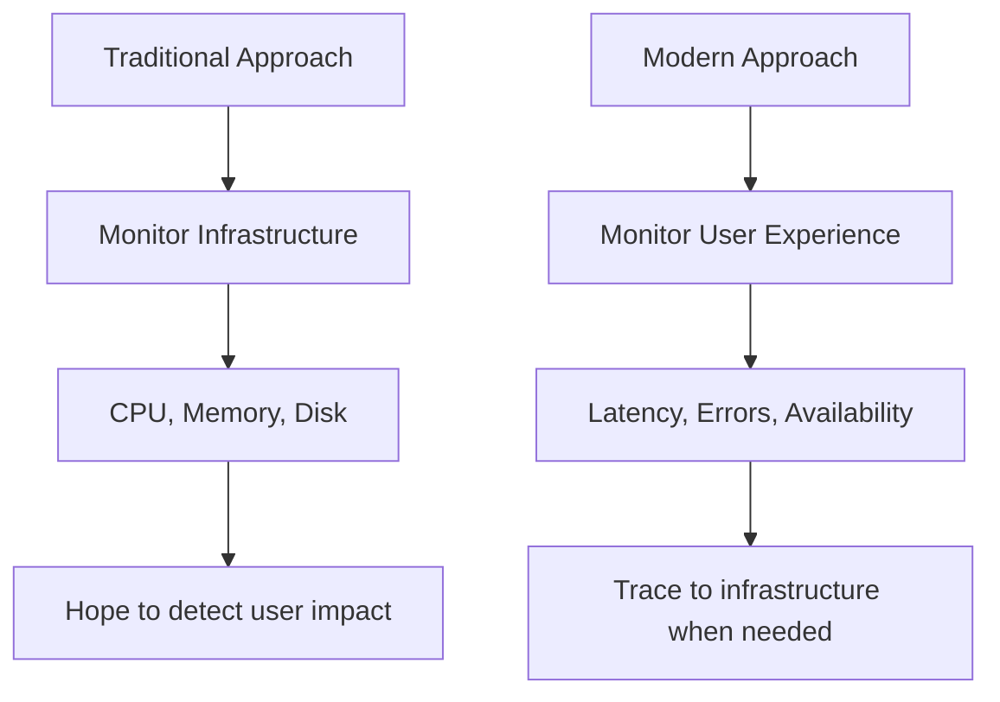

**Theory:** Infrastructure metrics are **leading indicators**, but user experience metrics are **actual outcomes**. A server at 90% CPU might be fine if requests complete quickly. Conversely, 20% CPU usage means nothing if all requests are failing.

**Key Insight:** Users don't care about your CPU usage—they care about whether their requests succeed and how fast. See [Service Level Objectives](10-service-level-objectives.md) for measuring what matters to users.

### 2. Observability is Not Monitoring

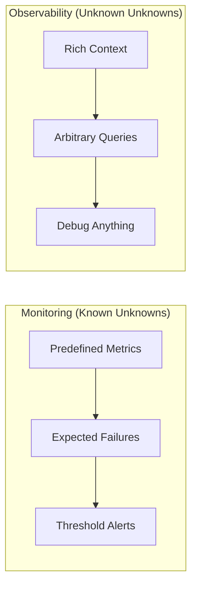

**Monitoring** answers: "Is this specific thing broken?"  
**Observability** answers: "Why is anything broken?"

**Theory:** Monitoring requires you to predict failure modes in advance. Observability provides the raw material to investigate **any** question about system behavior, including ones you never anticipated.

**Reference:** [Introduction to Observability](01-introduction.md) explains this distinction in depth.

### 3. The Principle of Intentionality

Every piece of telemetry should answer:

1. **What question does this answer?**
2. **What action would we take based on this data?**
3. **Who will use this information?**

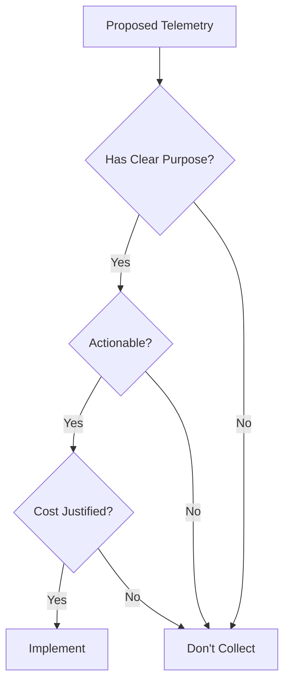

**Anti-Pattern:** "Let's log everything and figure it out later" leads to:

- Storage costs that scale faster than value
- Signal-to-noise ratio degradation
- Analysis paralysis when debugging

**See:** [Introduction](01-introduction.md) for the difference between signal and noise.

---

## The Three Pillars Strategy

### Understanding the Complementary Nature

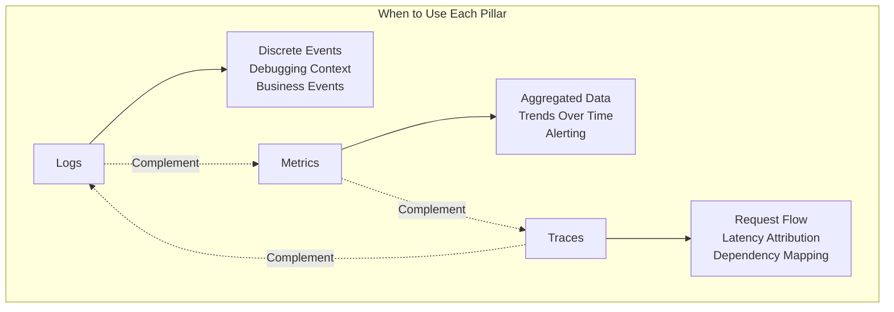

### Logs: The "What Happened" Pillar

**Theory:** Logs capture **discrete events** with full context. They're best for:

- Understanding the sequence of events leading to a problem
- Debugging specific instances (e.g., "why did order #12345 fail?")
- Audit trails and compliance
- Business event tracking

**Strength:** High cardinality, rich context  
**Weakness:** Expensive to store and query at scale

**When to use:** Investigating specific incidents, debugging edge cases, compliance requirements

**Reference:** [Logging](02-logging.md) and [Log Aggregation](05-log-aggregation.md)

### Metrics: The "How Much" Pillar

**Theory:** Metrics capture **aggregated statistics** over time. They're best for:

- Identifying trends and patterns
- Real-time alerting
- Capacity planning
- System health at a glance

**Strength:** Efficient storage, fast queries, excellent for alerting  
**Weakness:** Low cardinality, loses individual event context

**When to use:** Dashboards, alerts, performance tracking, trend analysis

**Reference:** [Metrics](03-metrics.md) and [Metrics Collection](06-metrics-collection.md)

### Traces: The "How It Flows" Pillar

**Theory:** Traces capture **request execution paths** across services. They're best for:

- Understanding latency contributions
- Mapping service dependencies
- Identifying bottlenecks in distributed systems
- Visualizing request flow

**Strength:** Shows causality and timing relationships  
**Weakness:** Sampling required at scale, complex to implement

**When to use:** Performance optimization, understanding distributed system behavior, dependency analysis

**Reference:** [Tracing](04-tracing.md) and [Distributed Tracing](07-distributed-tracing.md)

### The Unified Strategy

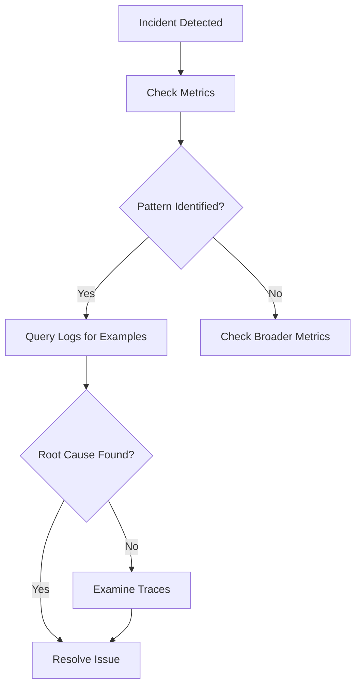

**Theory:** Each pillar serves a different investigation stage:

1. **Metrics** detect the problem (error rate spike)
2. **Logs** provide examples (actual error messages)
3. **Traces** show the flow (which service is slow)

---

## Data Cardinality Theory

### What is Cardinality?

**Cardinality** = The number of unique values a dimension can have

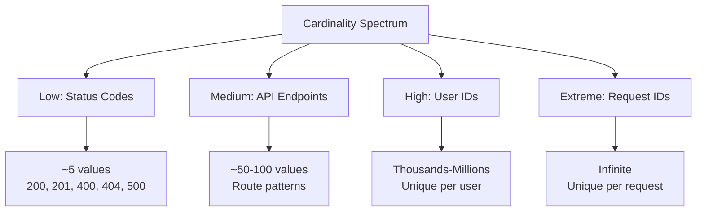

### The Cardinality Explosion Problem

**Theory:** Total metric series = Product of all label cardinalities

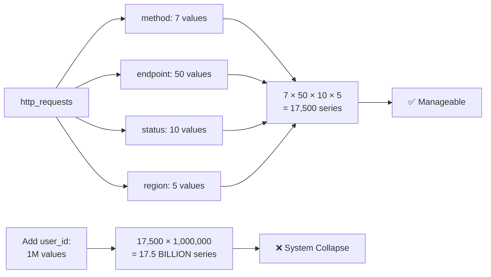

**Consequences of High Cardinality:**

- Metrics systems run out of memory
- Query performance degrades exponentially
- Storage costs explode
- Alerting becomes unreliable

### Cardinality Management Strategies

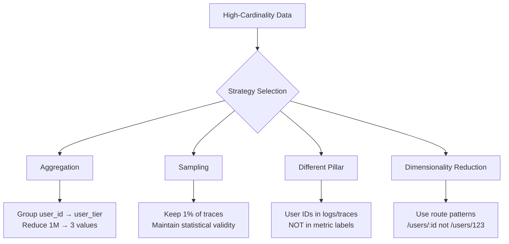

**Golden Rule:**

- **Metrics:** Low-cardinality dimensions only (< 100 values per label)
- **Logs:** Medium cardinality acceptable (use log aggregation)
- **Traces:** High cardinality in span attributes (sampling handles volume)

**Reference:** [Metrics Collection](06-metrics-collection.md) for practical cardinality management.

---

## Sampling Strategies

### Why Sample?

**Theory:** At scale, collecting 100% of telemetry is:

1. **Economically unfeasible** - Storage and processing costs grow linearly with volume
2. **Statistically unnecessary** - A representative sample provides same insights
3. **Operationally burdensome** - Network bandwidth, agent overhead

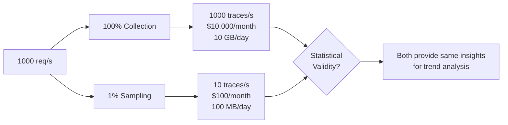

### Sampling Strategies Comparison

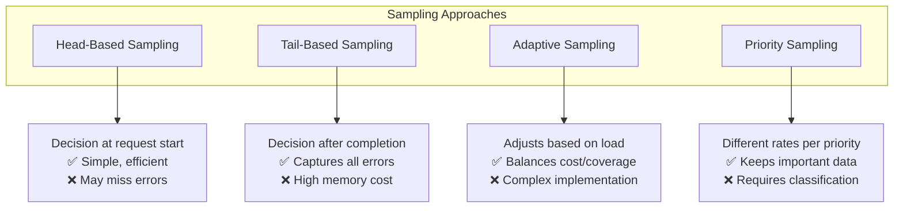

### Intelligent Sampling Theory

**Priority-Based Sampling Hierarchy:**

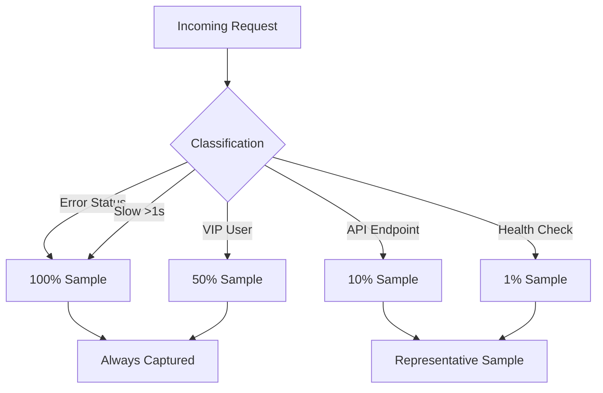

**Key Principles:**

1. **Always sample important signals** (errors, slow requests)
2. **Never sample uniformly** - different request types have different value
3. **Sample at the edge** - Make decision early to reduce system load
4. **Maintain statistical validity** - Even 1% provides insight for high-volume endpoints

**Reference:** [Distributed Tracing](07-distributed-tracing.md) for sampling implementation patterns.

---

## Context Propagation

### The Context Problem

**Theory:** In distributed systems, each service processes requests independently. Without context propagation, it's impossible to:

- Correlate logs across services
- Build complete request traces
- Attribute latency to specific services
- Debug cross-service issues

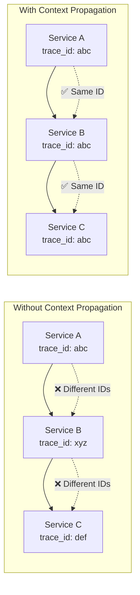

### W3C Trace Context Standard

**Theory:** A standardized way to propagate context across services and vendors.

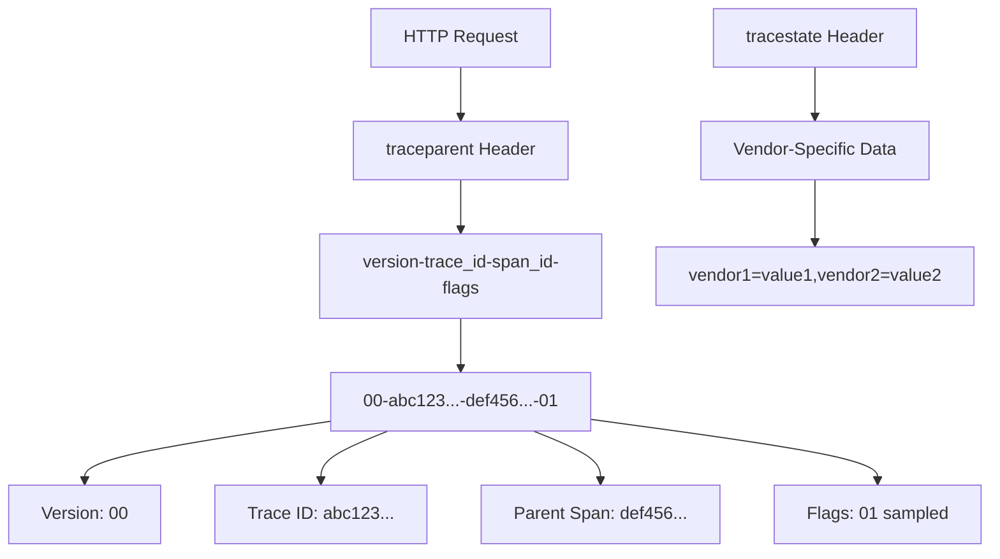

**Key Concepts:**

1. **Trace ID:** Unique identifier for the entire request flow (constant across all services)
2. **Span ID:** Unique identifier for the current operation (changes per service/operation)
3. **Parent Span ID:** Links child spans to their parent
4. **Flags:** Indicates sampling decision, debug mode, etc.

**Benefits of Standardization:**

- Multi-vendor support (send to Jaeger, Datadog, etc. simultaneously)
- Language-agnostic (works across polyglot architectures)
- Future-proof (vendor lock-in avoidance)

**Reference:** [Distributed Tracing](07-distributed-tracing.md) for propagation patterns and [Tracing](04-tracing.md) for span relationships.

### Baggage vs Context

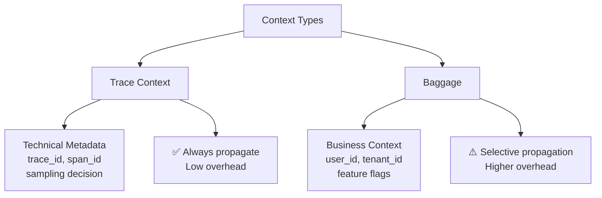

**Theory:**

- **Trace Context:** Technical necessity for observability infrastructure
- **Baggage:** Optional business context that ALL downstream services can access

**Baggage Use Cases:**

- User tier (for dynamic sampling)
- Tenant ID (for multi-tenancy filtering)
- Feature flags (for A/B testing correlation)
- Experiment ID (for tracking experimental features)

**Warning:** Baggage is propagated with EVERY request. Keep it minimal to avoid network overhead.

---

## Alerting Philosophy

### Alert on Symptoms, Not Causes

**Theory:** Causes are implementation details; symptoms are user impact.

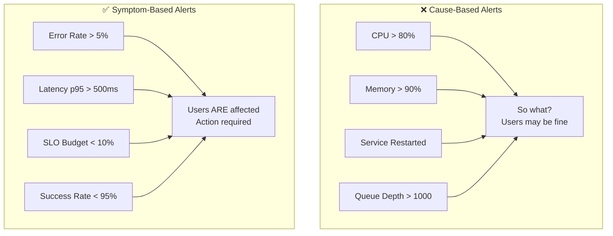

**Why This Matters:**

1. **CPU at 80% doesn't mean problems** - Modern systems often run hot efficiently
2. **Low CPU doesn't mean no problems** - A deadlock uses 0% CPU but breaks everything
3. **Symptoms guarantee user impact** - If error rate is high, users ARE experiencing issues

**Reference:** [Alerting and Monitoring](08-alerting-and-monitoring.md) for alert design patterns.

### The Alert Hierarchy

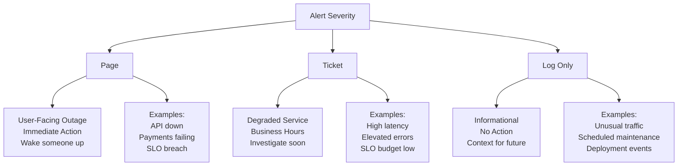

**Theory:** Alert fatigue is real. Every non-actionable alert reduces trust in the system.

**Criteria for Page-Worthy Alert:**

1. ✅ Affects users NOW
2. ✅ Requires human intervention
3. ✅ Cannot wait until morning
4. ✅ Has a clear runbook

If any criterion is false → downgrade to ticket or log.

### Alert Design Pattern: Rate of Change

**Theory:** Absolute thresholds are fragile; rate of change is robust.

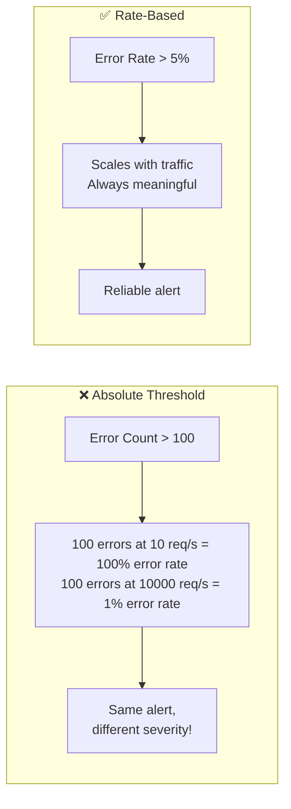

**Best Practices:**

- Use **rates** not counts: `rate(errors[5m]) / rate(requests[5m])`
- Use **percentiles** not averages: `p95 latency` not `avg latency`
- Use **windows** not snapshots: `errors over last 5 minutes` not `current errors`

---

## Cost vs Coverage Tradeoffs

### The Observability Cost Pyramid

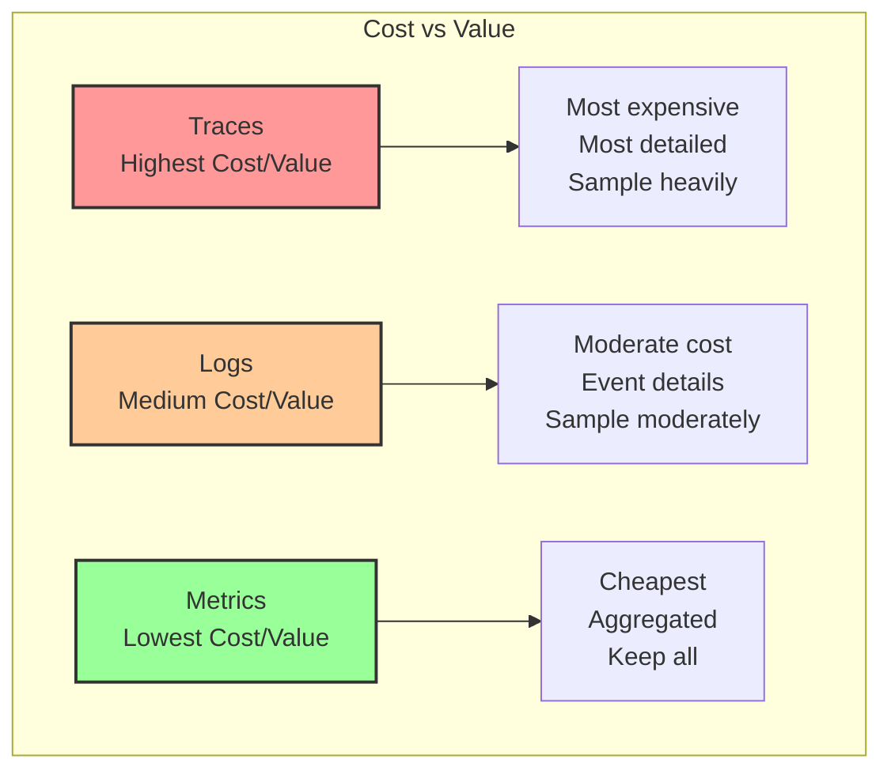

**Theory:** Different telemetry types have different cost profiles:

| Type    | Storage Cost | Query Cost | Network Cost | Value Density       |
| ------- | ------------ | ---------- | ------------ | ------------------- |
| Metrics | Low          | Very Low   | Low          | High (aggregated)   |
| Logs    | Medium-High  | Medium     | Medium       | Medium (events)     |
| Traces  | Very High    | High       | High         | Very High (context) |

### Smart Coverage Strategy

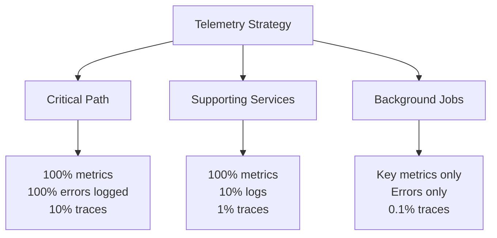

**Principle:** Allocate observability budget based on business impact.

**Critical Path (Checkout, Payment):**

- Maximum observability
- Lower sampling rates
- Invest in complete visibility

**Supporting Services (User Profile, Recommendations):**

- Balanced observability
- Standard sampling
- Good coverage without excess

**Background Jobs (Email, Reports):**

- Minimal observability
- High sampling
- Enough to debug issues

**Reference:** [Introduction](01-introduction.md) for balancing signal vs noise.

### Retention Strategy

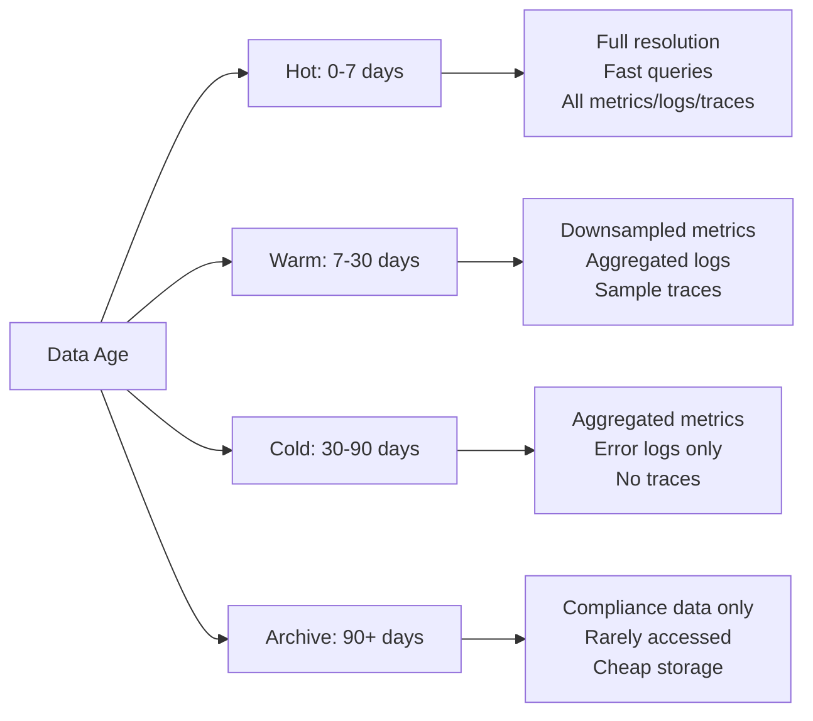

**Theory:** Most debugging happens on recent data. Age data gradually to reduce costs.

**Typical Retention:**

- **Metrics:** 1 year (downsampled after 30 days)
- **Logs:** 30-90 days (errors longer than debug)
- **Traces:** 7-30 days (sample more aggressively over time)

---

## Observability Maturity Model

### Five Levels of Maturity

```mermaid
graph TB
    A[Level 0: None] --> B[Level 1: Reactive]
    B --> C[Level 2: Proactive]
    C --> D[Level 3: Predictive]
    D --> E[Level 4: Autonomous]

    A --> A1[No monitoring<br/>Learn about issues<br/>from users]
    B --> B1[Basic monitoring<br/>Manual dashboards<br/>Reactive alerts]
    C --> C1[Comprehensive telemetry<br/>SLO-based alerts<br/>Runbooks]
    D --> D1[Anomaly detection<br/>Capacity forecasting<br/>Trend analysis]
    E --> E1[Self-healing<br/>AI-driven insights<br/>Automatic optimization]


```

### Level 1: Reactive (Most Organizations)

**Characteristics:**

- Manual monitoring
- Alerts fire after user reports
- No standardization
- Each service differs

**Challenges:**

- High MTTR (Mean Time To Resolution)
- User-discovered incidents
- Inconsistent practices

### Level 2: Proactive (Target for Most)

**Characteristics:**

- Automated telemetry collection
- Standardized instrumentation
- SLO-based alerting
- Shared dashboards
- Runbooks for common issues

**Benefits:**

- Detect issues before users
- Faster debugging
- Consistent practices

**Reference:** [Service Level Objectives](10-service-level-objectives.md) for SLO implementation.

### Level 3: Predictive (Advanced)

**Characteristics:**

- Anomaly detection
- Capacity forecasting
- Trend analysis
- Predictive alerting

**Benefits:**

- Prevent issues before they happen
- Optimized resource allocation
- Proactive scaling

### Level 4: Autonomous (Cutting Edge)

**Characteristics:**

- Self-healing systems
- AI-driven root cause analysis
- Automatic remediation
- Continuous optimization

**Benefits:**

- Minimal human intervention
- Sub-minute recovery
- Continuous improvement

**Reality Check:** Most organizations should target Level 2, with selective Level 3 capabilities for critical systems.

---

## Anti-Patterns to Avoid

### 1. Logging Without Structure

```mermaid
graph LR
    A[Unstructured Log] --> B["2025-10-13 User john logged in"]
    A --> C[Cannot Filter<br/>Cannot Aggregate<br/>Cannot Alert]

    D[Structured Log] --> E[JSON with fields:<br/>timestamp, user_id,<br/>event, ip_address]
    D --> F[Searchable<br/>Aggregatable<br/>Alertable]
```

**Why It's Bad:**

- Cannot programmatically query
- Manual log parsing required
- No automated alerting possible
- Doesn't scale

**Reference:** [Logging](02-logging.md) for structured logging principles.

### 2. Alert Fatigue

```mermaid
graph TD
    A[Too Many Alerts] --> B[Engineers Ignore Alerts]
    B --> C[Real Issues Missed]
    C --> D[Outages Occur]
    D --> E[Add More Alerts]
    E --> A
```

**Theory:** Alert fatigue is a vicious cycle. Every false positive erodes trust.

**Solution:** Ruthlessly prune non-actionable alerts. Better to have 5 reliable alerts than 50 noisy ones.

**Reference:** [Alerting and Monitoring](08-alerting-and-monitoring.md)

### 3. Metrics Without Context

```mermaid
graph LR
    A[Error Rate Spike] --> B{Context Available?}
    B -->|No| C[Which service?<br/>Which endpoint?<br/>Which user segment?<br/>❌ Cannot Debug]
    B -->|Yes| D[Service: payment<br/>Endpoint: /charge<br/>Error: timeout<br/>✅ Actionable]

```

**Problem:** Metrics without labels are useless for debugging.

**Solution:** Add relevant dimensions (service, endpoint, status) but avoid high cardinality (user_id, request_id).

### 4. Dashboard Sprawl

```mermaid
graph TD
    A[Dashboard Creation] --> B[New Dashboard for Each Issue]
    B --> C[100+ Dashboards]
    C --> D[Nobody Knows Which to Use]
    D --> E[Create Another Dashboard]
    E --> B

```

**Theory:** More dashboards ≠ better observability. Leads to:

- Analysis paralysis
- Outdated dashboards
- Duplicate information
- Maintenance burden

**Solution:** Create purpose-driven dashboards:

- **Service Health Dashboard:** Golden signals for each service
- **Business Metrics Dashboard:** KPIs and business outcomes
- **Incident Response Dashboard:** Quick debugging view
- **Capacity Planning Dashboard:** Resource trends

**Reference:** [Visualization Dashboards](09-visualization-dashboards.md) for dashboard design principles.

### 5. Ignoring the Cost of Observability

```mermaid
graph LR
    A[Full Instrumentation] --> B[Collect Everything]
    B --> C[Store Forever]
    C --> D[Never Sample]
    D --> E[Monthly Bill: $$]
    E --> F[Management: Turn It Off]
    F --> G[No Observability]
```

**Theory:** Observability has real costs. Ignoring them leads to unsustainable systems.

**Better Approach:**

1. Start with critical paths
2. Implement sampling
3. Set retention policies
4. Monitor observability costs as a metric
5. Balance coverage vs budget

### 6. Not Correlating Across Pillars

```mermaid
graph TB
    subgraph "Siloed Approach ❌"
        A1[Metrics System]
        B1[Logging System]
        C1[Tracing System]

        A1 -.->|No Connection| B1
        B1 -.->|No Connection| C1
        C1 -.->|No Connection| A1
    end

    subgraph "Unified Approach ✅"
        A2[Metrics]
        B2[Logs]
        C2[Traces]

        A2 -->|trace_id| B2
        B2 -->|trace_id| C2
        C2 -->|trace_id| A2

        D[Correlation ID]
        D --> A2
        D --> B2
        D --> C2
    end
```

**Problem:** Each pillar in isolation makes debugging harder.

**Solution:** Use correlation IDs (trace_id) across all telemetry. See one metric spike → jump to related logs → jump to related traces.

**Reference:** [Distributed Tracing](07-distributed-tracing.md) for correlation strategies.

### 7. Over-Instrumenting Hot Paths

```mermaid
graph TD
    A[Hot Path: 10,000 req/s] --> B{Instrumentation}
    B -->|Heavy| C[Detailed spans<br/>Full logs<br/>All metrics]
    B -->|Smart| D[Sampled traces<br/>Structured logs<br/>Aggregated metrics]

    C --> E[Performance Impact<br/>Network saturation<br/>High costs]
    D --> F[Minimal overhead<br/>Sustainable<br/>Actionable data]
```

**Theory:** Instrumentation itself has overhead. On hot paths (high throughput), excessive telemetry can:

- Degrade application performance
- Saturate network bandwidth
- Overwhelm telemetry backends
- Increase costs dramatically

**Solution:** Aggressive sampling on hot paths, full instrumentation on error paths.

---

## Cultural Best Practices

### 1. Observability as Code

**Theory:** Treat observability configuration like application code.

```mermaid
graph LR
    A[Observability Config] --> B[Version Control]
    B --> C[Code Review]
    C --> D[CI/CD Pipeline]
    D --> E[Automated Testing]
    E --> F[Production]

```

**Benefits:**

- **Consistency:** Same standards across all services
- **Auditability:** Track changes over time
- **Reusability:** Share dashboards, alerts, runbooks
- **Automation:** Deploy observability with services

**What to Version Control:**

- Dashboard definitions
- Alert rules
- SLO configurations
- Instrumentation libraries
- Runbooks

### 2. Shift Left on Observability

**Theory:** Build observability from day one, not after production issues.

```mermaid
graph LR
    A[Design] --> B[Development]
    B --> C[Testing]
    C --> D[Staging]
    D --> E[Production]

    A --> A1[Plan SLOs<br/>Design metrics]
    B --> B1[Add instrumentation<br/>Test telemetry]
    C --> C1[Validate dashboards<br/>Test alerts]
    D --> D1[Production-like observability<br/>Chaos testing]
    E --> E1[Monitor & improve]


```

**Definition of Done Includes:**

- [ ] Service instrumented with traces, logs, metrics
- [ ] Health check endpoint implemented
- [ ] Dashboard created
- [ ] Alerts configured
- [ ] Runbook documented
- [ ] SLOs defined

**Reference:** [Service Level Objectives](10-service-level-objectives.md) for early SLO definition.

### 3. Shared Ownership of Observability

```mermaid
graph TB
    A[Observability Ownership] --> B[Platform Team]
    A --> C[Development Teams]

    B --> B1[Provide:<br/>- Infrastructure<br/>- Standards<br/>- Tools<br/>- Training]

    C --> C1[Responsible for:<br/>- Instrumentation<br/>- Dashboards<br/>- Alerts<br/>- Runbooks]

    B1 -.->|Enable| C1
    C1 -.->|Feedback| B1
```

**Theory:** Centralized observability platforms + decentralized instrumentation = scalable observability culture.

**Platform Team Provides:**

- Observability infrastructure (Prometheus, Jaeger, ELK)
- Standard libraries and SDKs
- Best practices and templates
- Training and documentation

**Development Teams Own:**

- Service-specific instrumentation
- Business metric definition
- Alert creation and tuning
- Incident response

### 4. Runbooks for Every Alert

**Theory:** An alert without a runbook is a cry for help with no guidance.

```mermaid
graph TD
    A[Alert Fires] --> B{Runbook Exists?}
    B -->|Yes| C[Follow Clear Steps]
    C --> D[Quick Resolution]

    B -->|No| E[Panic<br/>Trial & Error]
    E --> F[Slow Resolution]
    F --> G[Create Runbook<br/>for Next Time]

```

**Runbook Template:**

```markdown
# Alert: High Error Rate on Payment Service

## Severity: P1 (Page)

## Description

Error rate on /api/v1/payments/charge endpoint exceeds 5% for 5 minutes.

## Impact

Users cannot complete purchases. Revenue impact: $X/minute.

## Likely Causes

1. Payment gateway timeout (60% of cases)
2. Database connection exhaustion (30%)
3. Rate limiting from payment provider (10%)

## Investigation Steps

1. Check payment gateway status page
2. Query recent errors: `service:payment level:error | top 10 by error_type`
3. Check database connection pool: `db_connections_active / db_connections_max`
4. Review recent deployments

## Resolution Steps

1. If gateway timeout: Enable circuit breaker, use backup gateway
2. If DB connections: Increase pool size, restart stuck connections
3. If rate limited: Implement request queuing

## Prevention

- Implement circuit breaker (JIRA-123)
- Add connection pool monitoring (JIRA-456)
- Set up rate limit headroom alerts (JIRA-789)

## Related

- Dashboard: https://grafana.company.com/d/payment-service
- Logs: https://kibana.company.com/app/payments
- On-call: payments-team@company.com
```

**Reference:** [Alerting and Monitoring](08-alerting-and-monitoring.md)

### 5. Regular Observability Reviews

**Theory:** Observability needs maintenance. Regular reviews prevent rot.

```mermaid
graph LR
    A[Monthly Review] --> B[Alert Effectiveness]
    A --> C[Dashboard Usage]
    A --> D[Cost Analysis]
    A --> E[Coverage Gaps]

    B --> F[Actions:<br/>Tune thresholds<br/>Remove noise]
    C --> G[Actions:<br/>Deprecate unused<br/>Improve popular]
    D --> H[Actions:<br/>Adjust sampling<br/>Optimize retention]
    E --> I[Actions:<br/>Add missing metrics<br/>Improve coverage]


```

**Review Checklist:**

- [ ] Alert signal-to-noise ratio (goal: >90% actionable)
- [ ] Dashboard usage (deprecate unused)
- [ ] Observability costs vs budget
- [ ] MTTR trends (is it improving?)
- [ ] Coverage gaps (what's not monitored?)
- [ ] Runbook accuracy (are they up to date?)

### 6. Learn from Every Incident

**Theory:** Every incident is a learning opportunity for observability improvement.

```mermaid
graph TD
    A[Incident Occurs] --> B[Resolve Incident]
    B --> C[Post-Mortem]
    C --> D{Observability Gaps?}

    D -->|Yes| E[Add Missing Metrics]
    D -->|Yes| F[Improve Dashboards]
    D -->|Yes| G[Create New Alerts]
    D -->|Yes| H[Update Runbooks]

    E --> I[Deploy Improvements]
    F --> I
    G --> I
    H --> I

    I --> J[Better Prepared<br/>for Next Time]

```

**Post-Mortem Observability Questions:**

1. How did we discover the incident? (User report vs automated alert)
2. What telemetry helped debug it?
3. What telemetry was missing?
4. How long did it take to identify root cause?
5. What would have made debugging faster?

**Action Items Should Include Observability Improvements:**

- Add missing metrics
- Create/update alerts
- Improve dashboard
- Document in runbook

---

## Advanced Theoretical Concepts

### 1. The Observer Effect

**Theory:** Observability instrumentation itself affects system behavior.

```mermaid
graph TB
    A[Instrumentation] --> B[Overhead]

    B --> C[CPU Cost<br/>Trace serialization<br/>Metric collection]
    B --> D[Memory Cost<br/>Span storage<br/>Context propagation]
    B --> E[Network Cost<br/>Telemetry transmission<br/>Bandwidth usage]

    C --> F[Slower Performance]
    D --> F
    E --> F

    F --> G[Heisenberg Uncertainty:<br/>Observing changes behavior]

  
```

**Mitigation Strategies:**

- Use efficient instrumentation libraries (OpenTelemetry)
- Implement sampling aggressively
- Batch telemetry transmission
- Use asynchronous exports
- Monitor observability overhead as a metric

**Paradox:** You need observability to measure observability's overhead!

### 2. Correlation vs Causation in Metrics

**Theory:** Metrics show correlation, not causation. Traces show causation.

```mermaid
graph LR
    A[Metrics Show] --> B[CPU increased<br/>AND<br/>Latency increased]
    B --> C[Correlation:<br/>They happened together]

    D[Traces Show] --> E[HTTP request<br/>→ Database query<br/>→ Slow response]
    E --> F[Causation:<br/>DB caused slowness]

    C -.->|Cannot Determine| G[Which caused which?]
    F -->|Can Determine| H[Root cause identified]

```

**Implication:** Metrics are great for "what" and "when", traces are essential for "why".

**Reference:** [Tracing](04-tracing.md) for understanding causality.

### 3. The Signal-to-Noise Ratio

**Theory:** More data ≠ more insight. Signal-to-noise ratio matters more than volume.

```mermaid
graph TB
    A[Telemetry Volume] --> B{Quality Filter}

    B -->|High Signal| C[Actionable Insights<br/>Quick Debugging<br/>Effective Alerts]
    B -->|High Noise| D[Alert Fatigue<br/>Analysis Paralysis<br/>Hidden Issues]

    E[More Data] -.->|Without Filter| D
    E -.->|With Intentionality| C

```

**Maximizing Signal-to-Noise:**

1. **Intentional Collection:** Only collect what has a purpose
2. **Smart Sampling:** Keep important signals, sample routine
3. **Noise Reduction:** Filter out expected patterns
4. **Aggregation:** Summarize where detail isn't needed

### 4. The CAP Theorem for Observability

**Theory:** You can't simultaneously optimize for all three:

- **Completeness:** Capture everything
- **Affordability:** Keep costs reasonable
- **Performance:** Minimal overhead

```mermaid
graph TD
    A[Observability Tradeoffs] --> B[Complete + Affordable]
    A --> C[Complete + Performant]
    A --> D[Affordable + Performant]

    B --> B1[Must sacrifice:<br/>Performance<br/>Accept overhead]
    C --> C1[Must sacrifice:<br/>Affordability<br/>High costs]
    D --> D1[Must sacrifice:<br/>Completeness<br/>Sample heavily]

```

**Practical Choice:** Most systems choose Affordable + Performant = Strategic Sampling

### 5. Observability vs Debuggability

**Theory:** Observability enables debugging, but they're not the same.

```mermaid
graph LR
    A[System Design] --> B[Debuggability]
    A --> C[Observability]

    B --> B1[Code structure<br/>Error handling<br/>Logging points]

    C --> C1[Data collection<br/>Correlation<br/>Analysis tools]

    B1 -.->|Enhances| C1
    C1 -.->|Relies on| B1


```

**Key Difference:**

- **Debuggability:** Design quality (clear error messages, structured code)
- **Observability:** Operational capability (telemetry infrastructure)

**Best Practice:** Both are needed. Great instrumentation of bad code is still hard to debug.

---

## Implementation Roadmap

### Phase 1: Foundation (Months 1-3)

```mermaid
graph LR
    A[Phase 1] --> B[Choose Tools]
    A --> C[Standardize]
    A --> D[Quick Wins]

    B --> B1[Metrics: Prometheus<br/>Logs: ELK/Loki<br/>Traces: Jaeger/Tempo]
    C --> C1[Logging standards<br/>Naming conventions<br/>Label schemas]
    D --> D1[Critical service metrics<br/>Error logging<br/>Basic dashboards]

```

**Goals:**

- [ ] Deploy observability infrastructure
- [ ] Establish standards document
- [ ] Instrument 1-2 critical services
- [ ] Create basic dashboards
- [ ] Set up initial alerts

**Reference:** [Tools Ecosystem](11-tools-ecosystem.md) for tool selection.

### Phase 2: Expansion (Months 4-6)

```mermaid
graph LR
    A[Phase 2] --> B[Broader Coverage]
    A --> C[Improve Quality]
    A --> D[Team Enablement]

    B --> B1[All critical services<br/>Distributed tracing<br/>Log aggregation]
    C --> C1[SLO definition<br/>Alert tuning<br/>Runbook creation]
    D --> D1[Training sessions<br/>Template sharing<br/>Best practices docs]

  
```

**Goals:**

- [ ] Instrument all critical services
- [ ] Implement distributed tracing
- [ ] Define initial SLOs
- [ ] Create runbooks for common issues
- [ ] Train all teams on standards

**Reference:** [Service Level Objectives](10-service-level-objectives.md)

### Phase 3: Optimization (Months 7-12)

```mermaid
graph LR
    A[Phase 3] --> B[Cost Optimization]
    A --> C[Advanced Features]
    A --> D[Automation]

    B --> B1[Smart sampling<br/>Retention policies<br/>Cost monitoring]
    C --> C1[Anomaly detection<br/>Predictive alerts<br/>Advanced dashboards]
    D --> D1[Auto-remediation<br/>Synthetic monitoring<br/>Chaos engineering]

```

**Goals:**

- [ ] Implement sampling strategies
- [ ] Reduce costs by 30-50%
- [ ] Add anomaly detection
- [ ] Automate common responses
- [ ] Measure and improve MTTR

### Phase 4: Maturity (Year 2+)

```mermaid
graph LR
    A[Phase 4] --> B[Continuous Improvement]
    A --> C[Advanced Capabilities]
    A --> D[Culture]

    B --> B1[Regular reviews<br/>Incident learnings<br/>Metric refinement]
    C --> C1[AI/ML insights<br/>Capacity forecasting<br/>Self-healing]
    D --> D1[Observability-first<br/>Shared ownership<br/>Innovation]

```

---

## Key Takeaways

### The 10 Most Important Principles

1. **Start with Users, Not Infrastructure**  
   Monitor user experience first, infrastructure second.

2. **Three Pillars Work Together**  
   Logs, metrics, and traces complement each other—use all three.

3. **Control Cardinality Ruthlessly**  
   High-cardinality labels destroy metrics systems.

4. **Sample Intelligently**  
   Keep important signals, sample routine ones.

5. **Correlate Everything**  
   Use trace_id across all telemetry for unified debugging.

6. **Alert on Symptoms**  
   User impact matters, not CPU percentages.

7. **Balance Cost vs Coverage**  
   More telemetry isn't always better—be strategic.

8. **Make It Actionable**  
   Every alert needs a runbook, every metric needs a purpose.

9. **Build It In From Day One**  
   Observability is not an afterthought—it's part of the definition of done.

10. **Learn and Improve Continuously**  
    Every incident should improve your observability.

### Quick Reference: When to Use Each Pillar

| Scenario                            | Use         | Why                              |
| ----------------------------------- | ----------- | -------------------------------- |
| "Is the system healthy?"            | **Metrics** | Aggregated view, fast queries    |
| "Why did order #12345 fail?"        | **Logs**    | Specific event details           |
| "Where is the latency?"             | **Traces**  | Request flow, timing attribution |
| "What's the error rate trend?"      | **Metrics** | Time-series analysis             |
| "What error message did users see?" | **Logs**    | Exact error context              |
| "Which service is the bottleneck?"  | **Traces**  | Span duration comparison         |

### Common Mistakes and Solutions

| Mistake                  | Solution                        | Reference                                        |
| ------------------------ | ------------------------------- | ------------------------------------------------ |
| High-cardinality metrics | Use aggregation, move to logs   | [Metrics Collection](06-metrics-collection.md)   |
| Alert fatigue            | Alert on symptoms, add runbooks | [Alerting](08-alerting-and-monitoring.md)        |
| Missing context          | Add correlation IDs             | [Distributed Tracing](07-distributed-tracing.md) |
| Dashboard chaos          | Purpose-driven dashboards       | [Visualization](09-visualization-dashboards.md)  |
| Cost explosion           | Implement sampling, retention   | This document                                    |
| No actionable data       | Define SLOs first               | [SLOs](10-service-level-objectives.md)           |

---

## Conclusion

Observability is not about collecting data—it's about building systems that explain themselves. The goal is not maximum telemetry, but **maximum insight with minimum overhead**.

**Remember:**

- Observability is a journey, not a destination
- Start small, iterate continuously
- Focus on business impact, not technical metrics
- Balance coverage with cost
- Build a culture of ownership

**Next Steps:**

1. Review [Introduction to Observability](01-introduction.md) for core concepts
2. Define SLOs using [Service Level Objectives](10-service-level-objectives.md)
3. Choose tools from [Tools Ecosystem](11-tools-ecosystem.md)
4. Implement gradually following the roadmap above

---

## Additional Resources

### Documentation References

- **[01-introduction.md](01-introduction.md)** - Core observability concepts
- **[02-logging.md](02-logging.md)** - Logging fundamentals and patterns
- **[03-metrics.md](03-metrics.md)** - Metric types and design
- **[04-tracing.md](04-tracing.md)** - Distributed tracing theory
- **[05-log-aggregation.md](05-log-aggregation.md)** - Centralized logging strategies
- **[06-metrics-collection.md](06-metrics-collection.md)** - Collection and cardinality
- **[07-distributed-tracing.md](07-distributed-tracing.md)** - Trace propagation and sampling
- **[08-alerting-and-monitoring.md](08-alerting-and-monitoring.md)** - Alert design and management
- **[09-visualization-dashboards.md](09-visualization-dashboards.md)** - Dashboard best practices
- **[10-service-level-objectives.md](10-service-level-objectives.md)** - SLO/SLI/SLA framework
- **[11-tools-ecosystem.md](11-tools-ecosystem.md)** - Tool selection and comparison

### Further Reading

- Google's SRE Book - Site Reliability Engineering
- Charity Majors - Observability Engineering
- OpenTelemetry Documentation
- Prometheus Best Practices
- The Twelve-Factor App - Logs as Event Streams

---

**Last Updated:** October 2025  
**Version:** 1.0  
**Maintainer:** Platform Engineering Team
