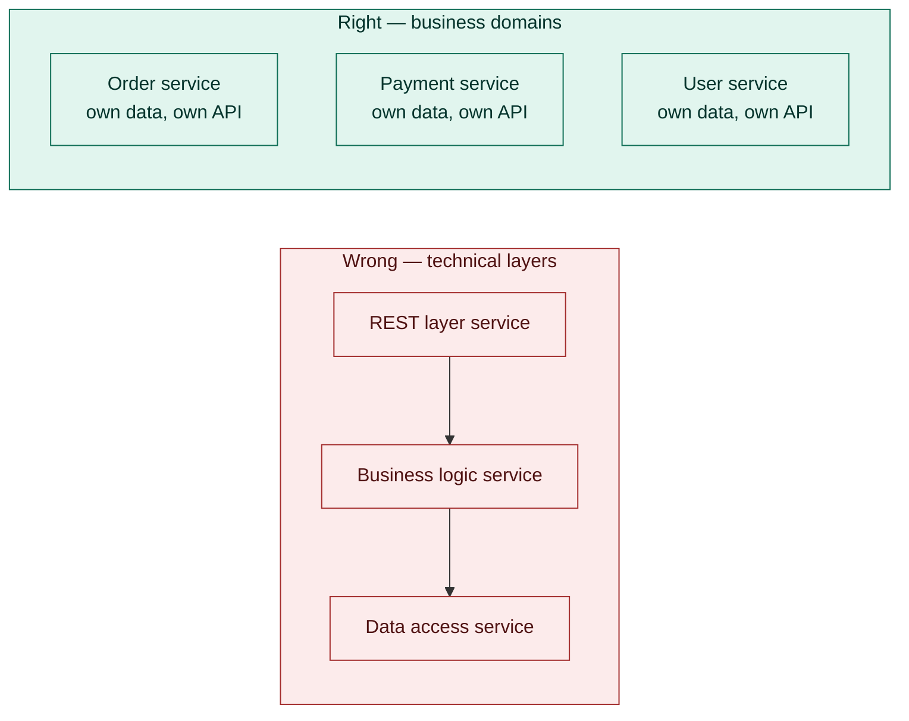
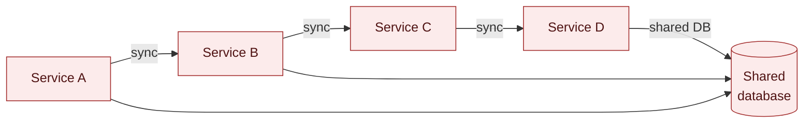
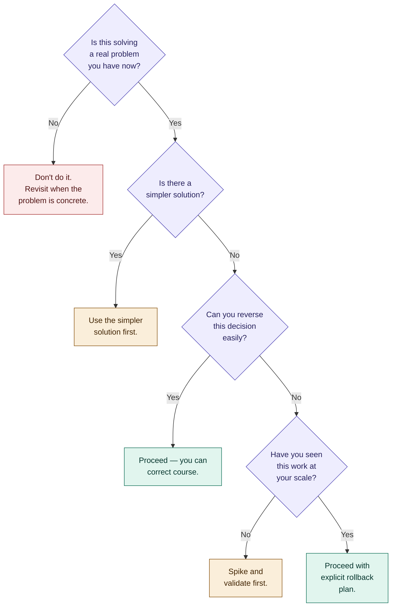

# 12 — Best Practices

## Table of Contents

- [Design Principles](#design-principles)
- [Service Design Checklist](#service-design-checklist)
- [API Design Checklist](#api-design-checklist)
- [Data Management Checklist](#data-management-checklist)
- [Communication Checklist](#communication-checklist)
- [Resilience Checklist](#resilience-checklist)
- [Security Checklist](#security-checklist)
- [Observability Checklist](#observability-checklist)
- [Deployment Checklist](#deployment-checklist)
- [Testing Checklist](#testing-checklist)
- [Common Pitfalls](#common-pitfalls)
- [Decision Framework](#decision-framework)
- [Maturity Model](#maturity-model)

---

## Design Principles

These principles underpin every decision in a well-run microservices system. When facing a hard architectural choice, come back to these first.

### 1. Model Around Business Domains, Not Technical Layers


```mermaid
flowchart LR
    subgraph Wrong["Wrong — technical layers"]
        direction TB
        RL[REST layer service]
        BL[Business logic service]
        DL[Data access service]
        RL --> BL --> DL
    end

    subgraph Right["Right — business domains"]
        direction TB
        OS[Order service\nown data, own API]
        PS[Payment service\nown data, own API]
        US[User service\nown data, own API]
    end

    style Wrong fill:#FCEBEB,stroke:#A32D2D,color:#501313
    style Right fill:#E1F5EE,stroke:#0F6E56,color:#04342C
    style RL fill:#FCEBEB,stroke:#A32D2D,color:#501313
    style BL fill:#FCEBEB,stroke:#A32D2D,color:#501313
    style DL fill:#FCEBEB,stroke:#A32D2D,color:#501313
    style OS fill:#E1F5EE,stroke:#0F6E56,color:#04342C
    style PS fill:#E1F5EE,stroke:#0F6E56,color:#04342C
    style US fill:#E1F5EE,stroke:#0F6E56,color:#04342C
```

Services aligned to business domains change together, are owned by one team, and have naturally low coupling. Services aligned to technical layers change together constantly, are owned by everyone and therefore no one, and have maximum coupling.

### 2. Design for Failure at Every Level

Every network call will fail eventually. Every dependency will be unavailable at some point. Build every service as if every downstream is unreliable — because it is.

```
Every outbound call must have:   timeout + retry + circuit breaker + fallback
Every inbound operation must:    validate + sanitise + authorise + rate-limit
Every deployment must support:   rollback in under 5 minutes
```

### 3. Prefer Eventual Consistency Over Distributed Locking

Distributed locks are a source of subtle bugs, deadlocks, and performance bottlenecks. Design workflows so that services can reach a consistent state independently over time, rather than requiring synchronous coordination.

```
Preferred: publish an event → consumers react → system converges
Avoid:     acquire lock → call service B → call service C → release lock
```

### 4. Automate Everything That Runs More Than Once

If you run it manually more than once, it will eventually be run wrong. CI/CD, database migrations, secret rotation, TLS renewal, scaling decisions — all of it must be automated.

### 5. Treat Your API as a Product

Your API will be consumed by other teams. Breaking it without warning is a production incident for them. Version explicitly. Deprecate gradually. Communicate changes. Provide migration guides. Maintain backwards compatibility for at least one version back.

### 6. Own Your Service End to End

The team that writes a service should run it in production. You build it, you run it. This creates direct accountability for reliability, performance, and security. It also ensures that operational concerns are considered during development, not bolted on afterwards.

### 7. Start Simple — Complexity Is Earned

Do not adopt microservices, service meshes, event sourcing, CQRS, sagas, and distributed tracing simultaneously. Each adds complexity. Each is justified by specific pain. Start with the simplest thing that works. Add complexity when you can articulate the specific problem it solves.

---

## Service Design Checklist

Use this before declaring a service ready for production.

### Boundaries and Ownership

- [ ] The service has a single, clearly stated purpose that can be described in one sentence
- [ ] The service is owned by exactly one team with a named on-call rotation
- [ ] The service boundary aligns with a business domain or bounded context, not a technical layer
- [ ] No other service has direct access to this service's database
- [ ] The service can be deployed independently without coordinating with other services
- [ ] A runbook exists and is linked from the service README

### Structure and Code Quality

- [ ] Directory structure follows the canonical layout (`cmd/`, `internal/api/`, `internal/domain/`, `internal/service/`, `internal/repository/`)
- [ ] Dependencies flow inward only — domain layer has no framework imports
- [ ] Configuration is loaded from environment variables and validated at startup
- [ ] The service fails fast on missing required configuration (does not start with invalid config)
- [ ] All secrets are injected via environment variables, never hardcoded or in config files
- [ ] The service README covers: purpose, API endpoints, dependencies, how to run locally, how to deploy

### API Surface

- [ ] All endpoints versioned under `/api/v1/`
- [ ] Error responses follow the standard schema with `code`, `message`, `traceId`
- [ ] All list endpoints paginated (cursor or keyset — not unbounded)
- [ ] All mutating endpoints require explicit `Content-Type: application/json`
- [ ] Health endpoint at `GET /health` returns 200 trivially (no dependency checks)
- [ ] Readiness endpoint at `GET /ready` checks critical dependencies, returns 503 when not ready
- [ ] Metrics endpoint at `GET /metrics` returns Prometheus format

---

## API Design Checklist

- [ ] Resources are nouns, not verbs (`/orders` not `/createOrder`)
- [ ] HTTP methods map correctly to operations (GET reads, POST creates, PUT replaces, PATCH updates, DELETE removes)
- [ ] Status codes are used correctly and consistently across all endpoints
- [ ] `400` for client input errors, `422` for semantic validation failures, `404` for not found, `409` for conflicts
- [ ] `5xx` errors never expose internal stack traces or system details to the caller
- [ ] All endpoints that return collections support pagination
- [ ] `X-Request-ID` and `X-Correlation-ID` headers are accepted and propagated
- [ ] `Retry-After` header is set on `429` and `503` responses
- [ ] `Idempotency-Key` is honoured on all mutating endpoints
- [ ] CORS is configured to allow only explicitly trusted origins — never `*` on authenticated endpoints
- [ ] OpenAPI specification is generated from code (not hand-maintained) and kept in sync
- [ ] Breaking changes bump the version (`v2`); backwards-compatible changes do not
- [ ] Deprecation timeline is at least 90 days for internal APIs, 12 months for external APIs

---

## Data Management Checklist

- [ ] Every service has its own database — no shared database between services
- [ ] Cross-service data access goes via API call, never direct database query
- [ ] The service uses the database technology best suited to its access patterns, not the default choice
- [ ] All database migrations are versioned, tested, and run automatically in the deployment pipeline
- [ ] Migrations are backwards compatible — old and new service versions can run against the migrated schema simultaneously
- [ ] No `SELECT *` queries — columns are always explicitly listed
- [ ] All list queries have explicit `LIMIT` — no unbounded queries
- [ ] Foreign key columns have explicit indexes (PostgreSQL does not create them automatically)
- [ ] `EXPLAIN ANALYZE` has been run on every query that will be called more than 100 times per second
- [ ] Read-heavy queries that cross service boundaries are backed by a local read cache or CQRS projection
- [ ] Database credentials are rotated automatically — no static long-lived passwords
- [ ] Backups are taken automatically, tested regularly by restoring to a test environment

---

## Communication Checklist

### Synchronous (REST / gRPC)

- [ ] Every outbound HTTP/gRPC call has an explicit timeout
- [ ] Timeouts are shorter on inner calls than outer calls — inner timeout < outer timeout
- [ ] Retries are applied only to idempotent operations or with an idempotency key
- [ ] Retries use exponential backoff with jitter — never immediate retry
- [ ] Retries are NOT applied to `4xx` client errors
- [ ] `X-Request-ID` and `X-Correlation-ID` are forwarded on every outbound call

### Asynchronous (Events / Queues)

- [ ] Events are self-contained — consumers do not need to call back to get the data they need
- [ ] Events follow the CloudEvents specification for the envelope fields (`id`, `source`, `type`, `time`)
- [ ] Every consumer is idempotent — processing the same event twice produces the same result
- [ ] Events are published via the Outbox Pattern — publish and DB write in the same transaction
- [ ] A Dead Letter Queue exists for every consumer queue
- [ ] Failed events in the DLQ are monitored and alerted on
- [ ] Consumer group IDs are unique per service and stable across deployments
- [ ] Event schema is registered in a Schema Registry with compatibility rules enforced

---

## Resilience Checklist

- [ ] Every service-to-service call is wrapped with a timeout
- [ ] Every service-to-service call uses retry with exponential backoff and jitter for transient errors
- [ ] A circuit breaker is configured for every critical downstream dependency
- [ ] Circuit breaker state is exposed as a Prometheus metric
- [ ] Each downstream dependency has its own connection pool — no shared pool across dependencies (bulkhead)
- [ ] Every endpoint that depends on an unavailable service has a defined fallback behaviour
- [ ] The fallback is tested in CI — not just asserted to exist
- [ ] Load shedding is implemented — the service returns `503` with `Retry-After` when overloaded
- [ ] Chaos experiments have been run against the service: kill the dependency, add latency, exhaust the connection pool
- [ ] The service degrades gracefully — a partial failure returns reduced functionality, not a 500

---

## Security Checklist

### Authentication and Authorisation

- [ ] Every endpoint (except `/health`, `/ready`, `/metrics`) requires a valid JWT
- [ ] JWT is validated: signature (RS256), expiry (`exp`), issuer (`iss`), audience (`aud`)
- [ ] Authorisation is enforced at the service level — do not rely solely on the API Gateway
- [ ] Permissions are checked per-resource, not just per-endpoint (user can only see their own orders)
- [ ] Internal service-to-service calls carry a service identity token or use mTLS
- [ ] Token revocation is implemented via a Redis revocation list checked on every request

### Input and Data

- [ ] All input is validated with a schema library (Zod, Joi, class-validator) before entering domain logic
- [ ] All database queries use parameterised statements — no string interpolation
- [ ] Sensitive fields (`password`, `cardNumber`, `ssn`, `token`) are never logged
- [ ] Log output is sanitised before writing
- [ ] Secrets are never written to logs, even in debug mode

### Infrastructure

- [ ] Container runs as a non-root user with a specific UID
- [ ] Container filesystem is read-only (`readOnlyRootFilesystem: true`)
- [ ] All Linux capabilities are dropped (`drop: ["ALL"]`)
- [ ] Network policies restrict ingress and egress to only the explicitly required peers
- [ ] Container image is scanned for CVEs in CI — pipeline fails on HIGH or CRITICAL findings
- [ ] All traffic is encrypted in transit — no plaintext HTTP between services in production
- [ ] Security headers are set: `Strict-Transport-Security`, `X-Content-Type-Options`, `X-Frame-Options`

---

## Observability Checklist

- [ ] Every request produces a structured JSON log line with at minimum: `level`, `time`, `service`, `traceId`, `requestId`, `message`
- [ ] `traceId` is present on every log line for the duration of a request
- [ ] `traceId` is returned to the caller in the `X-Trace-ID` response header
- [ ] `traceId` is included in all error responses in the API payload
- [ ] OpenTelemetry SDK is initialised — automatic instrumentation for HTTP, DB, and cache calls
- [ ] Custom spans are added for significant business operations (`order.create`, `payment.charge`)
- [ ] RED metrics are exposed: `http_requests_total`, `http_request_duration_seconds`, error rate
- [ ] Business metrics are exposed alongside technical metrics: `orders_created_total`, `payment_failures_total`
- [ ] An SLO is defined for the service: availability target and latency target
- [ ] Alerting rules are configured for SLO burn rate — not just for raw error count
- [ ] Every alert has a runbook linked in the annotation
- [ ] A Grafana dashboard exists for the service showing RED metrics, error budget, and infrastructure health

---

## Deployment Checklist

### Container Image

- [ ] Multi-stage Dockerfile — build stage and slim runtime stage
- [ ] Image tagged with git SHA — no `:latest` in production
- [ ] Base image is minimal (Alpine, Distroless) and pinned to a specific digest
- [ ] Image scanned for vulnerabilities in CI before push
- [ ] Non-root user defined in Dockerfile

### Kubernetes Manifest

- [ ] `resources.requests` and `resources.limits` set on every container
- [ ] `livenessProbe` configured — checks process health only, no dependency checks
- [ ] `readinessProbe` configured — checks critical dependencies, returns 503 when not ready
- [ ] `terminationGracePeriodSeconds` set to allow in-flight requests to complete
- [ ] `preStop` hook adds a sleep to allow load balancer to drain connections before SIGTERM
- [ ] `PodDisruptionBudget` configured — maintains minimum availability during node maintenance
- [ ] `HorizontalPodAutoscaler` configured with appropriate min/max replicas and metrics
- [ ] `NetworkPolicy` restricts ingress and egress to only explicitly required peers
- [ ] Deployment strategy is `RollingUpdate` with `maxUnavailable: 0` for zero-downtime deployments

### CI/CD Pipeline

- [ ] Pipeline is triggered per-service — changes to service A do not trigger service B's pipeline
- [ ] Unit tests run and must pass before any image is built
- [ ] Integration tests run against real infrastructure (Testcontainers or CI services)
- [ ] Contract tests verify API compatibility — `can-i-deploy` gates the production deployment
- [ ] Staging deployment happens automatically on merge to main
- [ ] Production deployment requires explicit approval (or is triggered by a tag/release)
- [ ] Rollback can be completed in under 5 minutes via `kubectl rollout undo` or `helm rollback`
- [ ] Deployment is annotated in Grafana so dashboards show where deployments happened

---

## Testing Checklist

- [ ] Unit tests cover all domain logic and business rules
- [ ] Unit tests run in under 30 seconds total
- [ ] Integration tests run against a real database and broker (Testcontainers or CI services)
- [ ] Integration tests cover the full HTTP layer including authentication, validation, and error cases
- [ ] Contract tests (Pact) exist for every API boundary this service consumes or provides
- [ ] E2E tests cover the two or three most critical user journeys only
- [ ] Test factories produce deterministic, readable test data (no random data outside of IDs)
- [ ] Each test is independent — tests do not share state or depend on execution order
- [ ] Flaky tests are treated as bugs — fixed or deleted immediately
- [ ] Coverage thresholds are enforced in CI (≥ 80% line and branch coverage on domain code)
- [ ] Performance tests validate the service meets its latency SLO under realistic load
- [ ] Performance tests run before every major release and weekly in staging

---

## Common Pitfalls

These are the most frequently encountered mistakes. Each has burned real teams.

### Distributed Monolith


```mermaid
flowchart LR
    A[Service A] -->|sync| B[Service B]
    B -->|sync| C[Service C]
    C -->|sync| D[Service D]
    D -->|shared DB| DB[(Shared\ndatabase)]
    A --> DB
    B --> DB

    style A fill:#FCEBEB,stroke:#A32D2D,color:#501313
    style B fill:#FCEBEB,stroke:#A32D2D,color:#501313
    style C fill:#FCEBEB,stroke:#A32D2D,color:#501313
    style D fill:#FCEBEB,stroke:#A32D2D,color:#501313
    style DB fill:#FCEBEB,stroke:#A32D2D,color:#501313
```

**Symptoms**: Services must be deployed together. A failure in Service D brings down A, B, and C. Schema migrations require coordinating all four teams. This is a monolith with network overhead added.

**Fix**: Enforce database-per-service as a hard rule. Replace synchronous chains with async events where the caller does not need an immediate response. Apply the Strangler Fig pattern to migrate the shared database incrementally.

---

### Premature Decomposition

Splitting a system into microservices before the domain is well understood locks in the wrong boundaries. Incorrect service cuts are harder to fix than a monolith because data is now split across services.

**Symptoms**: Services call each other constantly (chatty). Changing one business concept requires changing three services. No team feels ownership over any complete workflow.

**Fix**: Start as a well-structured modular monolith. Extract services only when a boundary proves stable and a team clearly owns it.

---

### No Observability from Day One

Adding distributed tracing and structured logging to an existing system is expensive and disruptive. Doing it before the system is in production is a fraction of the effort.

**Symptoms**: A production incident occurs. No one can tell which service is slow. Logs from different services cannot be correlated. The incident takes hours to resolve because investigation is manual.

**Fix**: Add OpenTelemetry SDK initialisation, structured logging with `traceId`, and RED metrics to the service template. Every new service inherits them for free.

---

### Skipping Contract Tests

Teams assume their API is stable and skip contract tests. Then one team changes a response field, another team's consumer breaks in production, and the root cause takes hours to identify.

**Symptoms**: Integration breaks discovered in E2E tests or production. Teams are afraid to change their APIs. Releases require manual coordination across teams to check compatibility.

**Fix**: Introduce Pact from the first cross-team API dependency. Gate every deployment with `can-i-deploy`. This catches breaking changes before they reach staging.

---

### Synchronous Everything

Every operation — including sending emails, updating analytics, notifying third-party webhooks — is done synchronously in the request path. The critical path becomes as slow as the slowest dependency.

**Symptoms**: Order creation takes 800ms because it synchronously calls five other services. A slow email provider causes order creation to time out.

**Fix**: Identify every operation in the request path that does not need to complete before returning to the caller. Move it to an async queue. The request path should contain only: validate, save, enqueue, return.

---

### No Runbooks

Alerts fire. The on-call engineer has no idea what to do. They spend 40 minutes figuring out what the alert means, where to look, and what actions to take. This happens every time the alert fires.

**Symptoms**: MTTR (Mean Time To Resolve) is high. Engineers dread on-call. The same incident repeats because the fix was ad hoc and not documented.

**Fix**: Every alert must have a runbook. The runbook answers: what does this alert mean, what is the user impact, what are the immediate triage steps, what are the escalation paths? Write the runbook when you write the alert rule, not during an incident.

---

### Over-Engineering at the Start

Adopting a service mesh, CQRS, event sourcing, a schema registry, a distributed tracing backend, and a secrets manager before the team has shipped a single endpoint to production.

**Symptoms**: The team spends three months on infrastructure and has not delivered any business value. When something breaks, no one fully understands the full stack. Developers are frustrated.

**Fix**: Start with the minimum viable platform — Kubernetes, a CI pipeline, Prometheus, and structured logging. Add each tool when the pain of not having it is concrete and measurable. Earn complexity; do not pre-purchase it.

---

## Decision Framework

When facing a significant architectural decision, work through these questions in order.


```mermaid
flowchart TD
    Q1{Is this solving\na real problem\nyou have now?}
    Q1 -->|No| Stop1[Don't do it.\nRevisit when the\nproblem is concrete.]
    Q1 -->|Yes| Q2{Is there a\nsimpler solution?}
    Q2 -->|Yes| Stop2[Use the simpler\nsolution first.]
    Q2 -->|No| Q3{Can you reverse\nthis decision\neasily?}
    Q3 -->|Yes| Go1[Proceed — you can\ncorrect course.]
    Q3 -->|No| Q4{Have you seen\nthis work at\nyour scale?}
    Q4 -->|No| Caution[Spike and\nvalidate first.]
    Q4 -->|Yes| Go2[Proceed with\nexplicit rollback\nplan.]

    style Stop1 fill:#FCEBEB,stroke:#A32D2D,color:#501313
    style Stop2 fill:#FAEEDA,stroke:#854F0B,color:#412402
    style Go1 fill:#E1F5EE,stroke:#0F6E56,color:#04342C
    style Caution fill:#FAEEDA,stroke:#854F0B,color:#412402
    style Go2 fill:#E1F5EE,stroke:#0F6E56,color:#04342C
    style Q1 fill:#EEEDFE,stroke:#534AB7,color:#26215C
    style Q2 fill:#EEEDFE,stroke:#534AB7,color:#26215C
    style Q3 fill:#EEEDFE,stroke:#534AB7,color:#26215C
    style Q4 fill:#EEEDFE,stroke:#534AB7,color:#26215C
```

### Specific Decisions

**Should we split this service?**
Split if: the service is owned by more than one team, its parts scale at very different rates, or parts of it need to be deployed on different schedules. Do not split because it is large — a large, well-structured service is better than two poorly-bounded small ones.

**Should we use async or sync communication?**
Default to async for anything that does not need to block the caller. Use sync when the caller must act on the response before continuing. Do not use sync just because it is easier to implement.

**Should we add a cache?**
Add a cache when the same data is read much more frequently than it changes AND the read latency without a cache is measurable. Do not add a cache speculatively. Cache invalidation is subtle — only pay that cost when the benefit is real.

**Should we use CQRS / Event Sourcing?**
Use CQRS when read and write workloads are genuinely different in scale or shape. Use Event Sourcing when you need a complete audit trail or temporal queries. Do not use either as a default pattern — they add significant complexity that is only justified by specific requirements.

---

## Maturity Model

Use this to identify where the team is and what to focus on next.


```mermaid
flowchart LR
    L1[Level 1\nFunctional] --> L2[Level 2\nOperational]
    L2 --> L3[Level 3\nReliable]
    L3 --> L4[Level 4\nOptimised]

    style L1 fill:#FCEBEB,stroke:#A32D2D,color:#501313
    style L2 fill:#FAEEDA,stroke:#854F0B,color:#412402
    style L3 fill:#E1F5EE,stroke:#0F6E56,color:#04342C
    style L4 fill:#EEEDFE,stroke:#534AB7,color:#26215C
```

### Level 1 — Functional

The service works. It delivers business value.

- Services decomposed by business domain
- CI pipeline: build, test, deploy
- Basic structured logging
- Health and readiness endpoints
- Manual deployment process documented

**Next step**: Add metrics and automated deployments.

---

### Level 2 — Operational

The service can be operated by an on-call engineer who did not write it.

- Prometheus metrics exposed (RED method)
- Grafana dashboard per service
- Alerting rules with runbooks
- Automated deployment via ArgoCD or equivalent
- Rollback procedure documented and practised
- On-call rotation established

**Next step**: Add distributed tracing and improve reliability patterns.

---

### Level 3 — Reliable

The service fails gracefully and recovers automatically.

- Distributed tracing with correlated `traceId` across logs, traces, and errors
- Circuit breakers on all downstream dependencies
- Retry with exponential backoff and jitter
- Bulkhead isolation per downstream
- Contract tests gating every deployment (`can-i-deploy`)
- SLOs defined with error budget alerting
- Chaos experiments run in staging
- Database automated backup and restore tested

**Next step**: Optimise performance and developer experience.

---

### Level 4 — Optimised

The service is a well-oiled machine. Changes are safe, fast, and low-drama.

- All Level 3 capabilities operating smoothly
- Multi-level caching where appropriate
- Autoscaling tuned and validated under load tests
- Feature flags decoupling deployment from release
- DORA metrics tracked: deployment frequency, lead time, MTTR, change failure rate
- Zero-downtime deployments validated — rollback in under 5 minutes
- Performance tests run weekly in staging with SLO thresholds
- Developer productivity tooling: Skaffold/Tilt, preview environments, generated API docs

---

## Summary

Microservices architecture is not a destination — it is an ongoing practice of refining boundaries, improving reliability, and reducing operational friction. The best microservices teams share a few traits:

They have **strong opinions about service ownership** — every service has a clear owner, a runbook, and an on-call rotation.

They have **deep respect for API contracts** — breaking changes are treated as incidents, not features. Contract tests run on every commit.

They **automate aggressively** — deployment, secret rotation, TLS renewal, alerting, chaos experiments. If it happens more than once, it is automated.

They **measure before optimising** — traces and metrics inform every performance decision. Guessing is not a strategy.

They **earn complexity** — each tool, each pattern, each abstraction is adopted because a specific pain made it necessary. Not because it is fashionable.

The documents in this guide give you the patterns and the tooling. The practice is yours.

---

### Full Documentation Index

| Document                                                           | Description                                                   |
| ------------------------------------------------------------------ | ------------------------------------------------------------- |
| [01-introduction.md](./01-introduction.md)                         | What microservices are, monolith vs microservices, trade-offs |
| [02-service-architecture.md](./02-service-architecture.md)         | Decomposition strategies, API design, service templates       |
| [03-database-patterns.md](./03-database-patterns.md)               | Database per service, sagas, CQRS, event sourcing, outbox     |
| [04-communication.md](./04-communication.md)                       | REST, gRPC, async messaging, Kafka, RabbitMQ                  |
| [05-deployment-strategies.md](./05-deployment-strategies.md)       | Docker, Kubernetes, CI/CD, blue-green, canary                 |
| [06-security.md](./06-security.md)                                 | JWT, mTLS, RBAC, secrets management, network policy           |
| [07-observability.md](./07-observability.md)                       | Distributed tracing, metrics, logging, SLOs, alerting         |
| [08-resilience.md](./08-resilience.md)                             | Timeouts, retries, circuit breakers, bulkheads, chaos         |
| [09-performance-optimization.md](./09-performance-optimization.md) | Caching, DB indexing, async offloading, autoscaling           |
| [10-testing.md](./10-testing.md)                                   | Unit, integration, contract, E2E, performance testing         |
| [11-tools-ecosystem.md](./11-tools-ecosystem.md)                   | API gateways, service mesh, brokers, observability stack      |
| [12-best-practises.md](./12-best-practises.md)                     | Principles, checklists, pitfalls, decision framework          |

---

_Part of the [Microservices Architecture Guide](../../README.md)_  
_Previous: [11-tools-ecosystem.md](./11-tools-ecosystem.md)_
