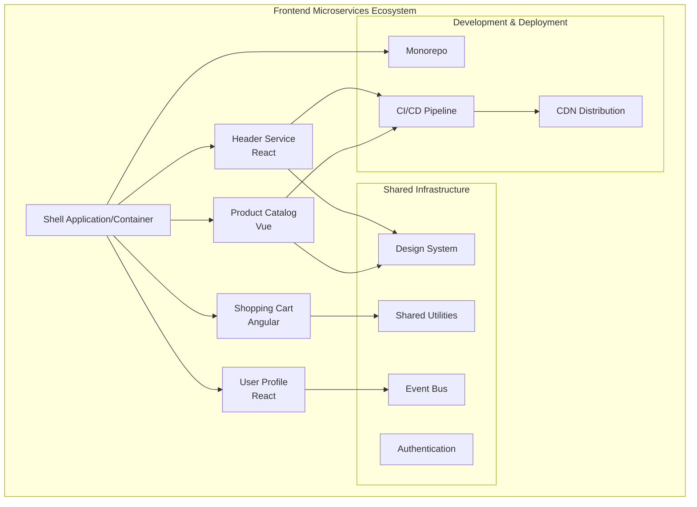

# Frontend Microservices: Complete Guide

A comprehensive guide to implementing frontend microservices architecture, covering everything from development setup to production deployment strategies.

## 📚 Documentation Structure

This guide is organized into focused sections for better navigation and maintenance:

### Core Concepts
- **[Introduction & Architecture](docs/01-introduction.md)** - Overview, benefits, and core architectural patterns
- **[Monorepo Setup](docs/02-monorepo-setup.md)** - Repository structure, tools, and management strategies

### Development & Integration
- **[Development Architecture](docs/03-development-architecture.md)** - Local development, module federation, and communication patterns
- **[Runtime Integration](docs/04-runtime-integration.md)** - Integration patterns, module federation, and state management
- **[Cross-Framework Integration](docs/05-cross-framework.md)** - Multi-framework support and web components

### Deployment & Operations
- **[Deployment Strategies](docs/06-deployment-strategies.md)** - CI/CD, containerization, and versioning strategies
- **[Performance & Monitoring](docs/07-performance-monitoring.md)** - Observability, analytics, and optimization
- **[Security Architecture](docs/08-security.md)** - Authentication, authorization, and security best practices

### Advanced Topics
- **[Testing Strategies](docs/09-testing.md)** - Unit, integration, contract, and E2E testing approaches
- **[Tools Ecosystem](docs/10-tools-ecosystem.md)** - Comprehensive tooling guide and recommendations
- **[Advanced Patterns](docs/11-advanced-patterns.md)** - PWA integration, multi-tenancy, and accessibility
- **[Best Practices](docs/12-best-practices.md)** - Guidelines, common pitfalls, and solutions

### Reference
- **[Examples & Templates](examples/)** - Complete working examples and starter templates
- **[API Reference](docs/13-api-reference.md)** - Configuration schemas and API documentation
- **[Troubleshooting Guide](docs/14-troubleshooting.md)** - Common issues and solutions
- **[Migration Guides](docs/15-migration.md)** - Moving from monoliths to micro frontends

## 🚀 Quick Start

```bash
# Clone the template repository
git clone https://github.com/your-org/frontend-microservices-template.git
cd frontend-microservices-template

# Install dependencies
npm install

# Start development environment
npm run dev:all

# Build all services
npm run build:all

# Run tests
npm run test:all
```

## 📖 Learning Path

### Beginner (Weeks 1-2)
1. Read [Introduction & Architecture](docs/01-introduction.md)
2. Set up your first [Monorepo](docs/02-monorepo-setup.md)
3. Follow the [Quick Start Guide](examples/quick-start/)

### Intermediate (Weeks 3-4)
1. Implement [Development Architecture](docs/03-development-architecture.md)
2. Master [Runtime Integration](docs/04-runtime-integration.md)
3. Set up [Testing Strategies](docs/09-testing.md)

### Advanced (Weeks 5-6)
1. Configure [Deployment Strategies](docs/06-deployment-strategies.md)
2. Implement [Security Architecture](docs/08-security.md)
3. Optimize with [Performance Monitoring](docs/07-performance-monitoring.md)

### Expert (Week 7+)
1. Explore [Advanced Patterns](docs/11-advanced-patterns.md)
2. Master [Cross-Framework Integration](docs/05-cross-framework.md)
3. Build production systems using [Best Practices](docs/12-best-practices.md)

## 🛠️ Architecture Overview



## 🎯 Key Benefits

- **Independent Development**: Teams can work autonomously on different parts
- **Technology Diversity**: Mix and match frameworks as needed
- **Scalable Teams**: Easy to scale development teams and assign ownership
- **Incremental Upgrades**: Update parts without affecting the whole application
- **Fault Isolation**: Failures in one service don't crash the entire app

## 📊 When to Use Micro Frontends

### ✅ Good Fit
- Large applications with multiple teams
- Different parts have different technical requirements
- Need for independent deployments
- Legacy system modernization
- Organizational scaling challenges

### ❌ Not Recommended
- Small teams or simple applications
- Tight coupling between features
- Limited development resources
- Performance-critical applications with strict budgets

## 🔧 Technology Stack

| Category | Primary Choice | Alternatives |
|----------|---------------|--------------|
| **Module Federation** | Webpack 5 | Vite Federation, Single-SPA |
| **Monorepo** | NX | Lerna, Rush, Yarn Workspaces |
| **Build Tools** | Vite, Webpack | Rollup, Parcel |
| **Testing** | Jest, Cypress | Vitest, Playwright |
| **Deployment** | Docker + K8s | AWS ECS, Vercel |

## 🤝 Contributing

We welcome contributions! Please see our [Contributing Guide](CONTRIBUTING.md) for details.

1. Fork the repository
2. Create a feature branch
3. Make your changes
4. Add tests and documentation
5. Submit a pull request

## 📝 Examples

Check out our [examples directory](examples/) for:
- [Basic Module Federation Setup](examples/basic-setup/)
- [React + Vue Integration](examples/react-vue/)
- [Full-Stack Example](examples/full-stack/)
- [Testing Examples](examples/testing/)
- [Deployment Configurations](examples/deployment/)

## 🆘 Support

- **Documentation Issues**: [File an issue](https://github.com/your-org/frontend-microservices-guide/issues)
- **Questions**: [Discussions](https://github.com/your-org/frontend-microservices-guide/discussions)
- **Community**: [Discord Server](https://discord.gg/microfrontends)

## 📄 License

This project is licensed under the MIT License - see the [LICENSE](LICENSE) file for details.

---

## 📚 Additional Resources

- [Micro Frontends by Cam Jackson](https://martinfowler.com/articles/micro-frontends.html)
- [Building Micro Frontends Book](https://www.buildingmicrofrontends.com/)
- [Module Federation Examples](https://github.com/module-federation/module-federation-examples)
- [Frontend Architecture Patterns](https://frontendmastery.com/posts/frontend-architecture-patterns/)

---
