# Introduction & Architecture

## What are Frontend Microservices?

Frontend microservices (also known as Micro Frontends) is an architectural pattern that extends the microservices concept to frontend development. It involves breaking down a monolithic frontend application into smaller, more manageable pieces that can be developed, tested, and deployed independently.

## Core Principles

### 1. **Be Technology Agnostic**
Teams should be free to choose their own technology stack without being forced into framework decisions made by other teams.

### 2. **Isolate Team Code**
Don't share a runtime between teams. Build independent apps that are self-contained.

### 3. **Establish Team Prefixes**
Agree on naming conventions where isolation is not possible. Namespace CSS, events, and local storage.

### 4. **Favor Native Browser Features**
Use browser APIs over building custom APIs. Use events for communication, not building a shared library.

### 5. **Build a Resilient Site**
Your feature should be useful even if JavaScript fails or hasn't executed yet.

## Architecture Patterns

### 1. Horizontal Split (Page-Based)
In a horizontal split, the application is divided by pages or routes.
Each micro frontend owns one or more entire pages, rather than sharing the same view or layout area.
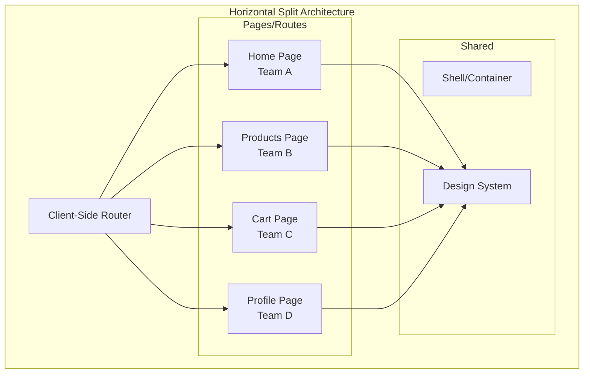

### 2. Vertical Split (Feature-Based)
In a vertical split, a single page is composed of multiple micro frontends (components) stacked vertically or in layout sections.
Each MFE owns a feature or a UI fragment rather than an entire page.
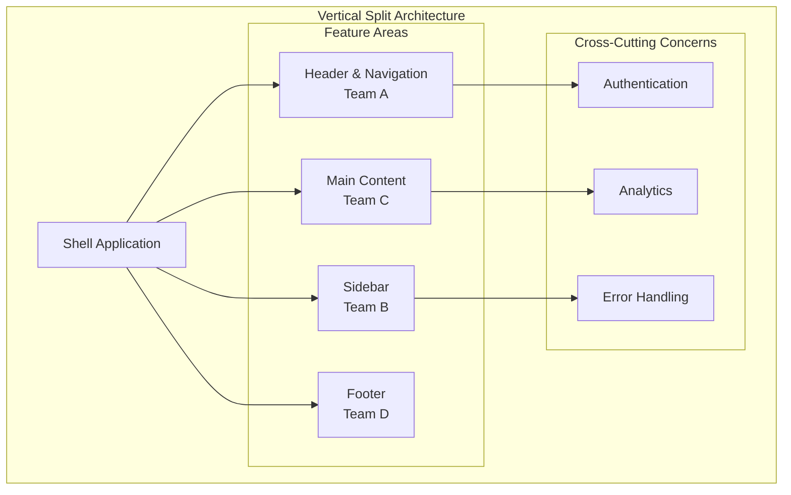

### 3. Hybrid Split
A hybrid split combines:

Horizontal split → Entire pages handled by separate MFEs (page-level ownership).

Vertical split → Individual components or sections on those pages handled by different MFEs (component-level ownership).

Essentially, some MFEs own full pages, while others provide smaller components integrated into those pages.
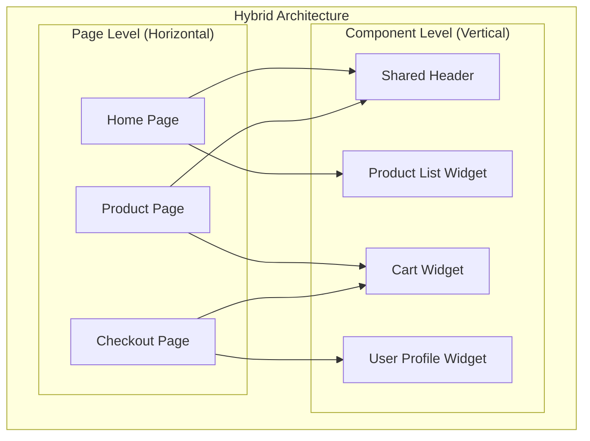

## Integration Approaches

### Build-Time Integration
In Build-Time Integration, all micro frontends are compiled together during build into a single deployable bundle.

Essentially, it’s a monolithic assembly at build-time, even if development is modular.

The shell app and all MFEs are compiled and bundled together.
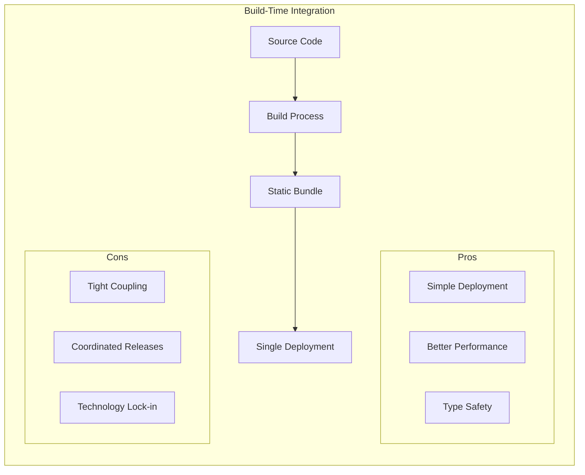

**Use Cases:**
- Small teams
- Shared technology stack
- Performance-critical applications
- Simple deployment requirements

### Run-Time Integration
In Runtime Integration, micro frontends are loaded dynamically in the browser at runtime rather than being bundled together at build time.

This allows each MFE to be developed, deployed, and updated independently.

Often paired with Module Federation, Single-SPA, or import maps.
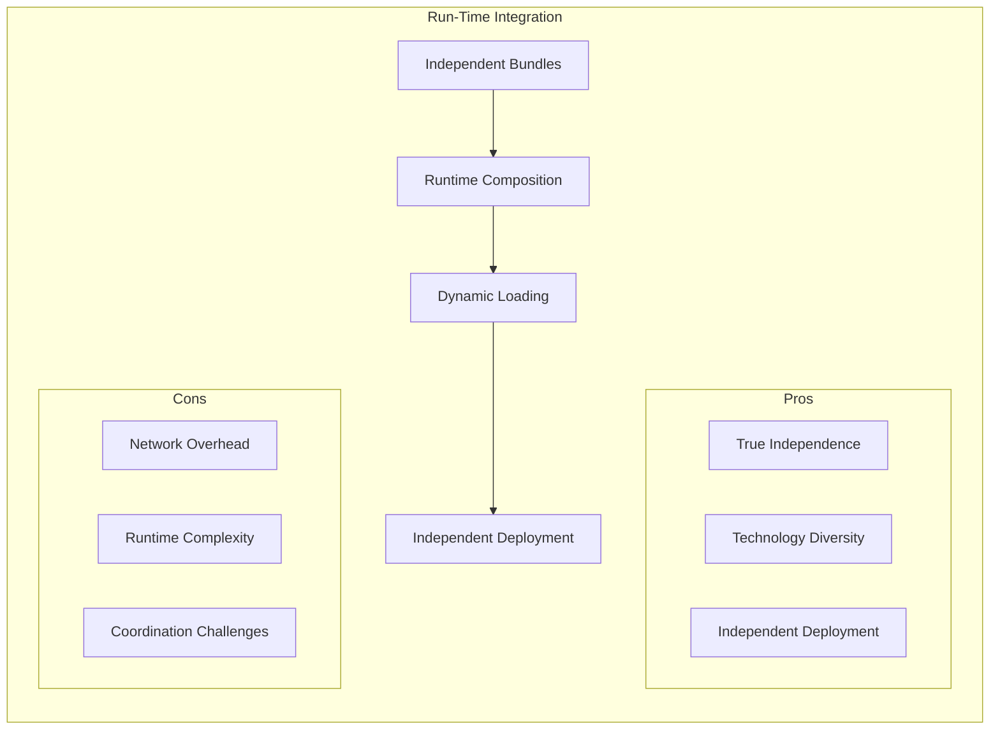

**Use Cases:**
- Large teams
- Different technology requirements
- Independent deployment needs
- Complex business domains

## Communication Patterns

### 1. Event-Driven Communication

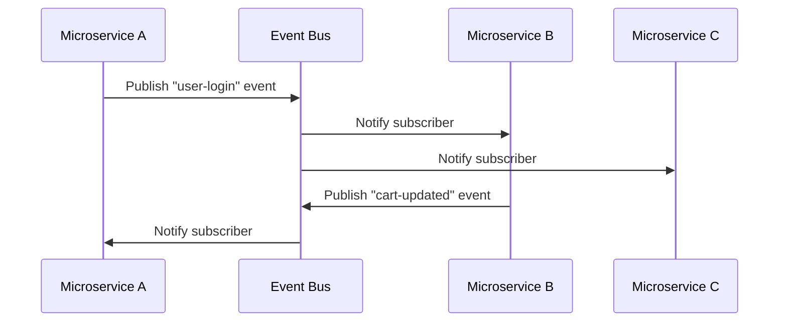

### 2. Shared State Management

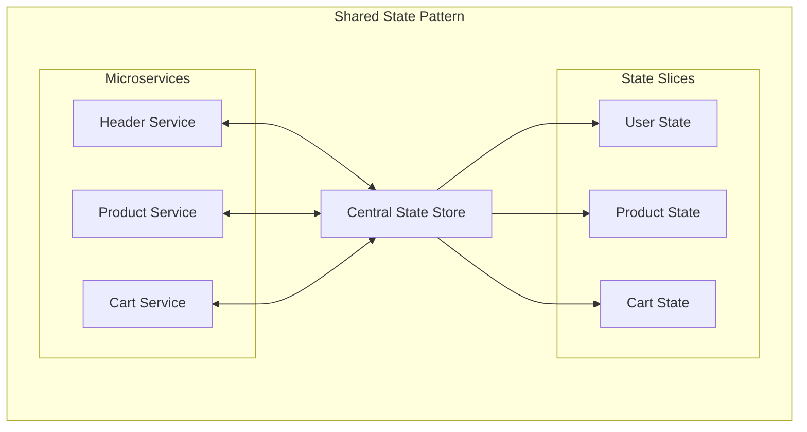

### 3. URL-Based Communication

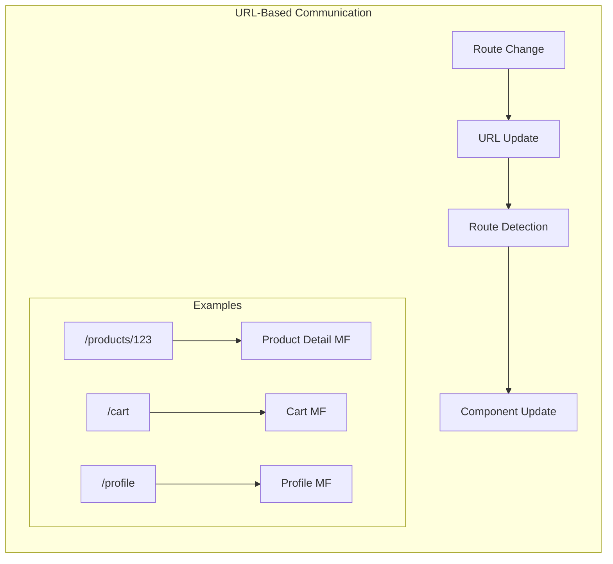

## Team Organization Models

### 1. Cross-Functional Teams

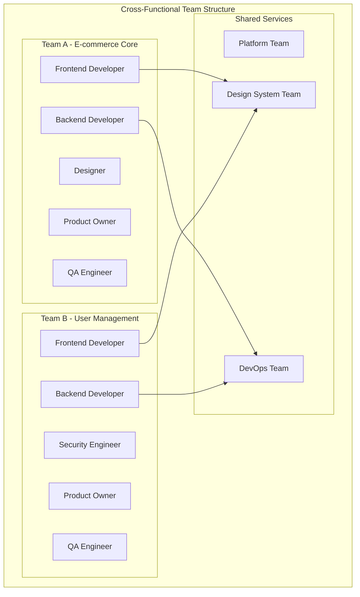

### 2. Domain-Driven Teams

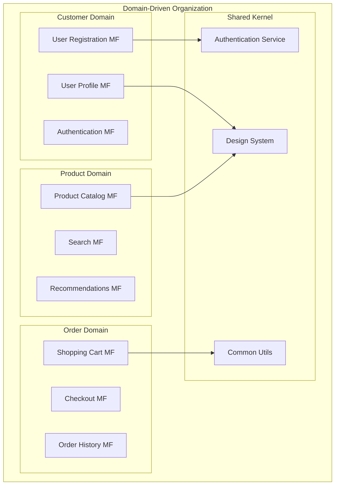

## Benefits & Trade-offs

### Benefits

| Benefit | Description | Impact |
|---------|-------------|---------|
| **Independent Development** | Teams work autonomously | Faster development cycles |
| **Technology Diversity** | Choose best tools for the job | Innovation and flexibility |
| **Fault Isolation** | Failures don't cascade | Better reliability |
| **Scalable Teams** | Add teams without coordination | Organizational scalability |
| **Incremental Migration** | Modernize piece by piece | Reduced risk |

### Trade-offs

| Challenge | Description | Mitigation |
|-----------|-------------|------------|
| **Complexity** | More moving parts | Good tooling and practices |
| **Performance** | Network overhead | Caching and optimization |
| **Consistency** | UI/UX fragmentation | Design system and guidelines |
| **Testing** | Integration complexity | Contract testing and E2E |
| **Governance** | Coordination overhead | Clear standards and tooling |

## Decision Framework

### When to Choose Micro Frontends

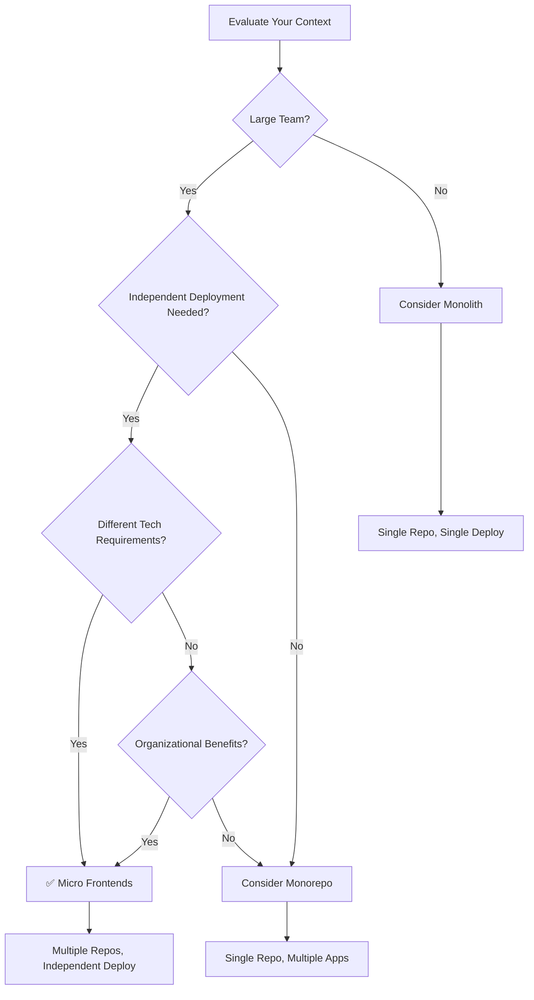

### Assessment Criteria

Rate each criterion from 1-5 (5 being highest need/complexity):

- **Team Size**: Number of developers working on frontend
- **Team Distribution**: Geographic and organizational spread
- **Technology Diversity**: Need for different frameworks/tools
- **Domain Complexity**: Business domain complexity
- **Deployment Independence**: Need for separate release cycles
- **Performance Requirements**: Strict performance budgets
- **Legacy Integration**: Existing system constraints

**Score Interpretation:**
- **20-25**: Strong candidate for micro frontends
- **15-19**: Consider hybrid approaches
- **10-14**: Evaluate monorepo solutions
- **< 10**: Stick with monolithic frontend

## Getting Started Checklist

- [ ] **Assess your context** using the decision framework
- [ ] **Define boundaries** based on business domains
- [ ] **Choose integration approach** (build-time vs runtime)
- [ ] **Select technology stack** and tooling
- [ ] **Establish team structure** and ownership
- [ ] **Create governance guidelines** and standards
- [ ] **Set up development environment** and workflow
- [ ] **Implement monitoring** and observability
- [ ] **Plan migration strategy** if coming from monolith

## Next Steps

1. **[Set up your Monorepo](02-monorepo-setup.md)** - Configure development environment
2. **[Development Architecture](03-development-architecture.md)** - Local development setup
3. **[Runtime Integration](04-runtime-integration.md)** - Module federation and communication

---

[← Back to Main](../README.md) | [Next: Monorepo Setup →](02-monorepo-setup.md)