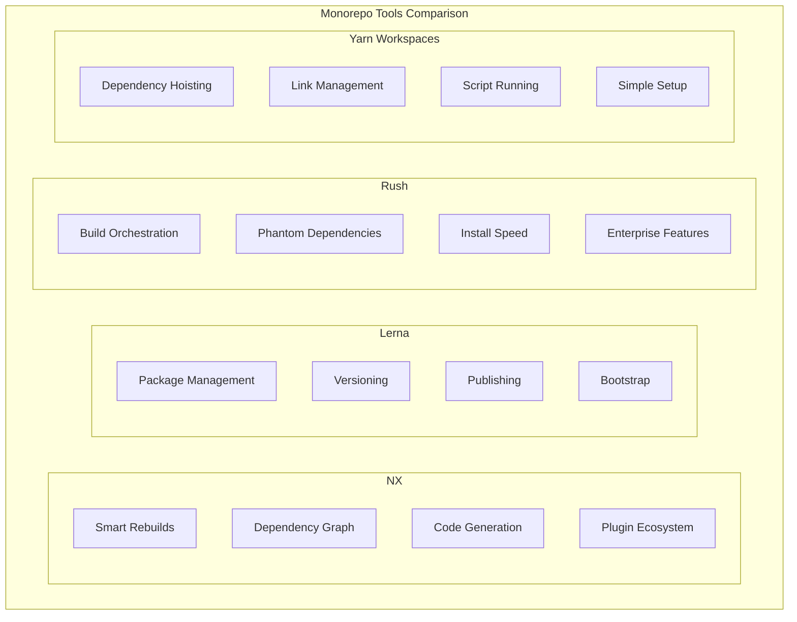
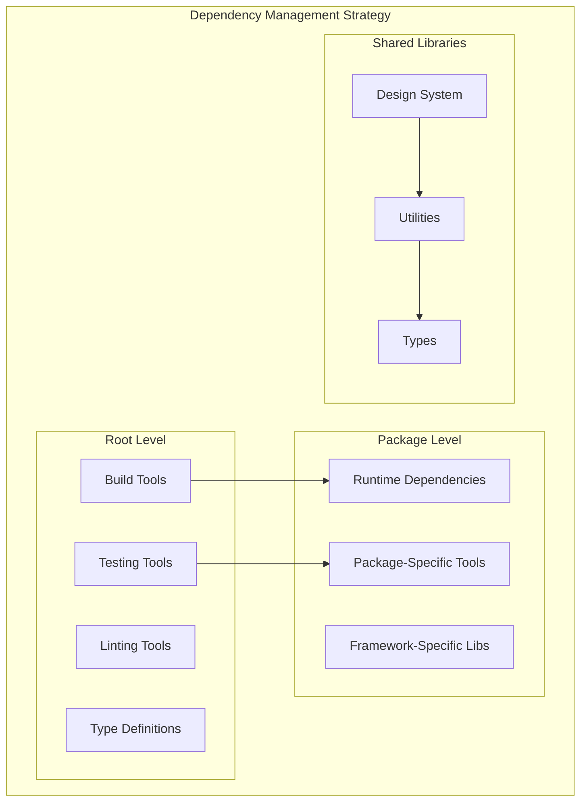
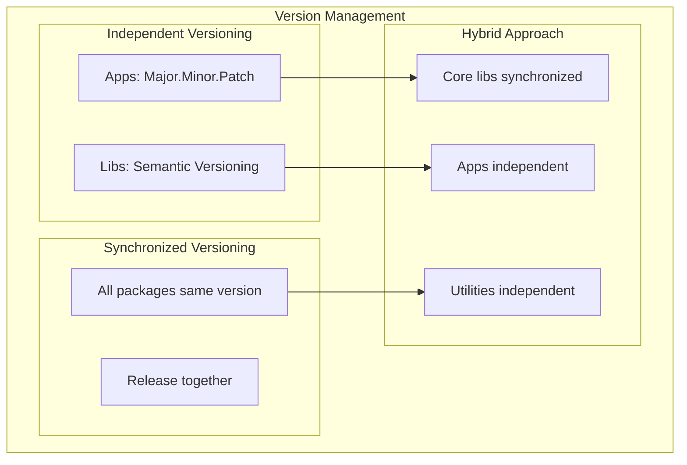

# Monorepo Setup and Management

## Why Monorepos for Micro Frontends?

Monorepos provide an excellent foundation for micro frontend development by offering:

- **Shared tooling and configuration**
- **Coordinated dependency management**
- **Cross-service refactoring capabilities**
- **Unified CI/CD pipelines**
- **Code sharing and reuse**

## Repository Structure

### Recommended Structure

```
frontend-microservices/
├── apps/                          # Application packages
│   ├── shell/                     # Main container application
│   │   ├── src/
│   │   ├── webpack.config.js
│   │   ├── package.json
│   │   └── README.md
│   ├── header-service/            # Header microservice
│   ├── product-catalog/           # Product catalog microservice
│   ├── shopping-cart/             # Shopping cart microservice
│   └── user-profile/              # User profile microservice
├── libs/                          # Shared libraries
│   ├── design-system/             # UI component library
│   │   ├── src/
│   │   │   ├── components/
│   │   │   ├── tokens/
│   │   │   └── index.ts
│   │   ├── storybook/
│   │   └── package.json
│   ├── shared-utils/              # Common utilities
│   ├── event-bus/                 # Communication layer
│   ├── auth-client/               # Authentication utilities
│   └── types/                     # TypeScript definitions
├── tools/                         # Development and build tools
│   ├── webpack-configs/           # Shared webpack configurations
│   ├── eslint-config/             # Shared linting rules
│   ├── jest-config/               # Testing configuration
│   ├── build-scripts/             # Custom build scripts
│   └── deployment/                # Deployment utilities
├── docs/                          # Documentation
├── examples/                      # Example implementations
├── .github/                       # GitHub workflows
├── package.json                   # Root package.json
├── nx.json                        # NX configuration
├── workspace.json                 # Workspace configuration
├── lerna.json                     # Lerna configuration (if used)
├── tsconfig.base.json             # Base TypeScript config
└── README.md
```

### Package Structure Template

```
package-template/
├── src/
│   ├── components/                # React components
│   ├── hooks/                     # Custom hooks
│   ├── services/                  # Business logic
│   ├── types/                     # TypeScript types
│   ├── utils/                     # Utility functions
│   ├── __tests__/                 # Test files
│   ├── App.tsx                    # Main component
│   ├── bootstrap.tsx              # Module federation bootstrap
│   └── index.ts                   # Public API exports
├── public/
│   ├── index.html
│   └── favicon.ico
├── webpack.config.js              # Webpack configuration
├── jest.config.js                 # Jest configuration
├── tsconfig.json                  # TypeScript configuration
├── package.json                   # Package configuration
└── README.md                      # Package documentation
```

## Tool Comparison

### Monorepo Management Tools



### Detailed Comparison

| Feature | NX | Lerna | Rush | Yarn Workspaces |
|---------|-------|--------|------|-----------------|
| **Learning Curve** | Medium | Low | High | Low |
| **Build Performance** | Excellent | Good | Excellent | Basic |
| **Dependency Graph** | ✅ | ❌ | ✅ | ❌ |
| **Code Generation** | ✅ | ❌ | ❌ | ❌ |
| **Caching** | ✅ | ❌ | ✅ | ❌ |
| **Plugin Ecosystem** | Rich | Limited | Limited | None |
| **Enterprise Ready** | ✅ | ✅ | ✅ | ✅ |
| **Best For** | Complex builds | Package publishing | Large enterprises | Simple setups |

## NX Setup (Recommended)

### Initial Setup

```bash
# Create new NX workspace
npx create-nx-workspace@latest frontend-microservices \
  --preset=react-monorepo \
  --packageManager=npm

cd frontend-microservices

# Install additional dependencies
npm install --save-dev @nrwl/webpack @nrwl/storybook
```

### Workspace Configuration

```json
{
  "version": 2,
  "projects": {
    "shell": "apps/shell",
    "header-service": "apps/header-service",
    "product-catalog": "apps/product-catalog",
    "shopping-cart": "apps/shopping-cart",
    "design-system": "libs/design-system",
    "shared-utils": "libs/shared-utils"
  },
  "targetDefaults": {
    "build": {
      "dependsOn": ["^build"],
      "cache": true,
      "inputs": [
        "production",
        "^production"
      ]
    },
    "test": {
      "cache": true,
      "inputs": [
        "default",
        "^production",
        "{workspaceRoot}/jest.preset.js"
      ]
    },
    "lint": {
      "cache": true,
      "inputs": [
        "default",
        "{workspaceRoot}/.eslintrc.json"
      ]
    }
  },
  "namedInputs": {
    "default": [
      "{projectRoot}/**/*",
      "!{projectRoot}/**/?(*.)+(spec|test).[jt]s?(x)?(.snap)",
      "!{projectRoot}/tsconfig.spec.json",
      "!{projectRoot}/jest.config.[jt]s",
      "!{projectRoot}/.eslintrc.json"
    ],
    "production": [
      "default",
      "!{projectRoot}/**/?(*.)+(spec|test).[jt]s?(x)?(.snap)",
      "!{projectRoot}/tsconfig.spec.json",
      "!{projectRoot}/jest.config.[jt]s",
      "!{projectRoot}/.eslintrc.json",
      "!{projectRoot}/**/*.stories.@(js|jsx|ts|tsx|mdx)",
      "!{projectRoot}/.storybook/**/*",
      "!{projectRoot}/src/test-setup.ts"
    ]
  },
  "generators": {
    "@nrwl/react": {
      "application": {
        "style": "scss",
        "linter": "eslint",
        "bundler": "webpack"
      },
      "component": {
        "style": "scss"
      },
      "library": {
        "style": "scss",
        "linter": "eslint"
      }
    }
  },
  "defaultProject": "shell"
}
```

### Generate Applications and Libraries

```bash
# Generate shell application
nx g @nrwl/react:app shell --routing=true

# Generate microservice applications
nx g @nrwl/react:app header-service --routing=false
nx g @nrwl/react:app product-catalog --routing=true
nx g @nrwl/react:app shopping-cart --routing=false

# Generate shared libraries
nx g @nrwl/react:lib design-system --publishable --importPath=@myorg/design-system
nx g @nrwl/workspace:lib shared-utils --publishable --importPath=@myorg/shared-utils
nx g @nrwl/workspace:lib event-bus --publishable --importPath=@myorg/event-bus
```

## Alternative: Lerna + Yarn Workspaces

### Setup

```bash
# Initialize repository
git init frontend-microservices
cd frontend-microservices

# Initialize Lerna
npx lerna init

# Configure package.json for workspaces
```

### Package.json Configuration

```json
{
  "name": "frontend-microservices-monorepo",
  "private": true,
  "workspaces": [
    "apps/*",
    "libs/*"
  ],
  "devDependencies": {
    "lerna": "^7.1.4",
    "concurrently": "^8.2.0"
  },
  "scripts": {
    "bootstrap": "lerna bootstrap --use-workspaces",
    "build": "lerna run build",
    "test": "lerna run test",
    "dev": "concurrently \"lerna run dev --scope=shell\" \"lerna run dev --scope=header-service\"",
    "clean": "lerna clean",
    "reset": "npm run clean && rm -rf node_modules && npm install && npm run bootstrap"
  }
}
```

### Lerna Configuration

```json
{
  "version": "independent",
  "npmClient": "npm",
  "useWorkspaces": true,
  "packages": [
    "apps/*",
    "libs/*"
  ],
  "command": {
    "publish": {
      "conventionalCommits": true,
      "message": "chore(release): publish",
      "registry": "https://registry.npmjs.org/"
    },
    "bootstrap": {
      "ignore": "component-*",
      "npmClientArgs": ["--no-package-lock"]
    }
  }
}
```

## Dependency Management

### Shared Dependencies Strategy



### Package.json Best Practices

```json
{
  "name": "@myorg/header-service",
  "version": "1.0.0",
  "private": true,
  "dependencies": {
    "react": "^18.2.0",
    "react-dom": "^18.2.0",
    "@myorg/design-system": "*",
    "@myorg/event-bus": "*"
  },
  "devDependencies": {
    "@types/react": "^18.2.14",
    "@types/react-dom": "^18.2.6",
    "typescript": "^5.1.6"
  },
  "peerDependencies": {
    "react": ">=18.0.0",
    "react-dom": ">=18.0.0"
  },
  "scripts": {
    "build": "webpack --mode production",
    "dev": "webpack serve --mode development",
    "test": "jest",
    "type-check": "tsc --noEmit",
    "lint": "eslint src --ext .ts,.tsx",
    "storybook": "start-storybook -p 6006"
  },
  "module": "dist/index.esm.js",
  "main": "dist/index.js",
  "types": "dist/index.d.ts",
  "files": [
    "dist"
  ]
}
```

## Shared Configuration

### TypeScript Configuration

**tsconfig.base.json** (Root level)
```json
{
  "compileOnSave": false,
  "compilerOptions": {
    "rootDir": ".",
    "sourceMap": true,
    "declaration": false,
    "moduleResolution": "node",
    "emitDecoratorMetadata": true,
    "experimentalDecorators": true,
    "importHelpers": true,
    "target": "es2015",
    "module": "esnext",
    "lib": ["es2020", "dom"],
    "skipLibCheck": true,
    "skipDefaultLibCheck": true,
    "baseUrl": ".",
    "paths": {
      "@myorg/design-system": ["libs/design-system/src/index.ts"],
      "@myorg/shared-utils": ["libs/shared-utils/src/index.ts"],
      "@myorg/event-bus": ["libs/event-bus/src/index.ts"],
      "@myorg/types": ["libs/types/src/index.ts"]
    }
  },
  "exclude": ["node_modules", "tmp"]
}
```

### ESLint Configuration

**.eslintrc.json** (Root level)
```json
{
  "root": true,
  "ignorePatterns": ["**/*"],
  "plugins": ["@nrwl/nx"],
  "overrides": [
    {
      "files": ["*.ts", "*.tsx", "*.js", "*.jsx"],
      "rules": {
        "@nrwl/nx/enforce-module-boundaries": [
          "error",
          {
            "enforceBuildableLibDependency": true,
            "allow": [],
            "depConstraints": [
              {
                "sourceTag": "*",
                "onlyDependOnLibsWithTags": ["*"]
              },
              {
                "sourceTag": "scope:shell",
                "onlyDependOnLibsWithTags": ["scope:shared"]
              },
              {
                "sourceTag": "scope:microservice",
                "onlyDependOnLibsWithTags": ["scope:shared"]
              }
            ]
          }
        ]
      }
    },
    {
      "files": ["*.ts", "*.tsx"],
      "extends": ["@nrwl/nx/typescript"],
      "rules": {}
    },
    {
      "files": ["*.js", "*.jsx"],
      "extends": ["@nrwl/nx/javascript"],
      "rules": {}
    }
  ]
}
```

### Jest Configuration

**jest.preset.js** (Root level)
```javascript
const nxPreset = require('@nrwl/jest/preset').default;

module.exports = {
  ...nxPreset,
  testMatch: [
    '<rootDir>/apps/**/*.(test|spec).{js,ts,tsx}',
    '<rootDir>/libs/**/*.(test|spec).{js,ts,tsx}'
  ],
  collectCoverageFrom: [
    'apps/**/*.{ts,tsx}',
    'libs/**/*.{ts,tsx}',
    '!**/*.d.ts',
    '!**/node_modules/**',
    '!**/*.stories.{js,ts,tsx}'
  ],
  coverageReporters: ['text', 'html', 'lcov'],
  setupFilesAfterEnv: ['<rootDir>/test-setup.ts']
};
```

## Build Scripts

### Development Scripts

```bash
#!/bin/bash
# scripts/dev.sh

echo "🚀 Starting development environment..."

# Start shared libraries in watch mode
nx run-many --target=build:watch --projects=design-system,shared-utils,event-bus &

# Wait for shared libraries to build
sleep 5

# Start applications concurrently
concurrently \
  "nx serve shell --port=3000" \
  "nx serve header-service --port=3001" \
  "nx serve product-catalog --port=3002" \
  "nx serve shopping-cart --port=3003"
```

### Build Scripts

```bash
#!/bin/bash
# scripts/build.sh

echo "🔨 Building all packages..."

# Build shared libraries first
nx run-many --target=build --projects=design-system,shared-utils,event-bus --parallel=3

# Build applications
nx run-many --target=build --projects=shell,header-service,product-catalog,shopping-cart --parallel=2

echo "✅ Build complete!"
```

### Test Scripts

```bash
#!/bin/bash
# scripts/test.sh

echo "🧪 Running tests..."

# Run unit tests
nx run-many --target=test --all --parallel=3 --coverage

# Run integration tests
nx run-many --target=e2e --projects=shell-e2e --parallel=1

# Generate test reports
nx run-many --target=test --all --codeCoverage --outputPath=coverage
```

## Version Management

### Semantic Versioning Strategy



### Release Configuration

**release.config.js**
```javascript
module.exports = {
  branches: ['main', 'next'],
  plugins: [
    '@semantic-release/commit-analyzer',
    '@semantic-release/release-notes-generator',
    '@semantic-release/changelog',
    '@semantic-release/npm',
    '@semantic-release/github',
    [
      '@semantic-release/git',
      {
        assets: ['CHANGELOG.md', 'package.json', 'package-lock.json'],
        message: 'chore(release): ${nextRelease.version} [skip ci]\n\n${nextRelease.notes}'
      }
    ]
  ]
};
```

## Development Workflow

### Branch Strategy

```
main (production)
├── develop (integration)
├── feature/header-improvements
├── feature/cart-optimization
├── hotfix/security-patch
└── release/v2.1.0
```

### Commit Convention

```
feat(header): add user avatar component
fix(cart): resolve quantity update bug
docs(readme): update setup instructions
chore(deps): upgrade react to 18.2.0
style(button): improve hover effects
refactor(utils): simplify date formatting
test(cart): add unit tests for calculations
```

### Pull Request Template

```markdown
## Description
Brief description of changes

## Type of Change
- [ ] Bug fix (non-breaking change)
- [ ] New feature (non-breaking change)
- [ ] Breaking change
- [ ] Documentation update

## Testing
- [ ] Unit tests pass
- [ ] Integration tests pass
- [ ] Manual testing completed

## Checklist
- [ ] Code follows style guidelines
- [ ] Self-review completed
- [ ] Documentation updated
- [ ] No console errors/warnings
```

## Troubleshooting

### Common Issues

#### Dependency Resolution
```bash
# Clear all node_modules
nx reset

# Reinstall dependencies
npm install

# Bootstrap packages (if using Lerna)
npm run bootstrap
```

#### Build Cache Issues
```bash
# Clear NX cache
nx reset

# Clear individual package builds
rm -rf apps/*/dist libs/*/dist

# Rebuild everything
npm run build
```

#### TypeScript Path Issues
```bash
# Verify TypeScript configuration
nx run-many --target=type-check --all

# Update path mappings in tsconfig.base.json
# Restart TypeScript language server in IDE
```

### Performance Optimization

#### Build Performance
```javascript
// webpack.config.js optimization
module.exports = {
  optimization: {
    splitChunks: {
      chunks: 'all',
      cacheGroups: {
        vendor: {
          test: /[\\/]node_modules[\\/]/,
          name: 'vendors',
          chunks: 'all',
        },
        shared: {
          test: /[\\/]libs[\\/]/,
          name: 'shared',
          chunks: 'all',
        }
      }
    }
  }
};
```

#### Development Performance
```bash
# Use faster builds in development
export NODE_ENV=development
export DISABLE_SOURCE_MAPS=true

# Parallel execution
nx run-many --target=build --all --parallel=4
```

## Next Steps

1. **Set up Module Federation** - Configure webpack module federation for runtime integration
2. **Implement Shared Libraries** - Create design system and utility libraries
3. **Configure CI/CD** - Set up automated testing and deployment pipelines
4. **Add Monitoring** - Implement logging and error tracking
5. **Security Setup** - Configure authentication and authorization

---

For more advanced topics, see:
- [Development Architecture](03-development-architecture.md)
- [Runtime Integration](04-runtime-integration.md)
- [Deployment Strategies](06-deployment-strategies.md)