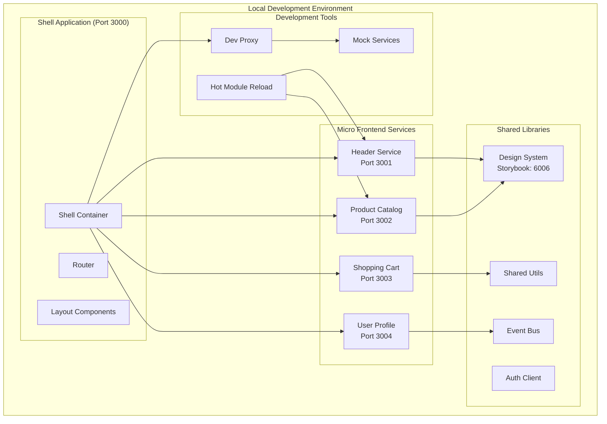
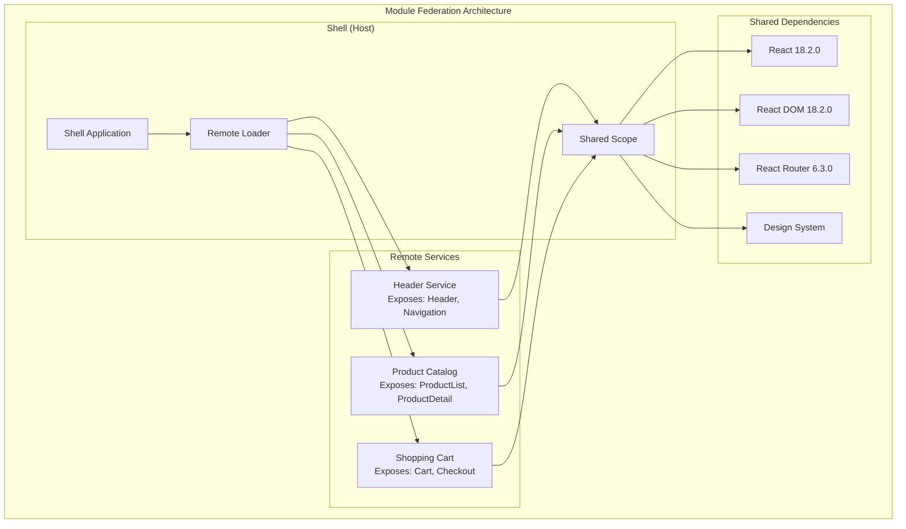
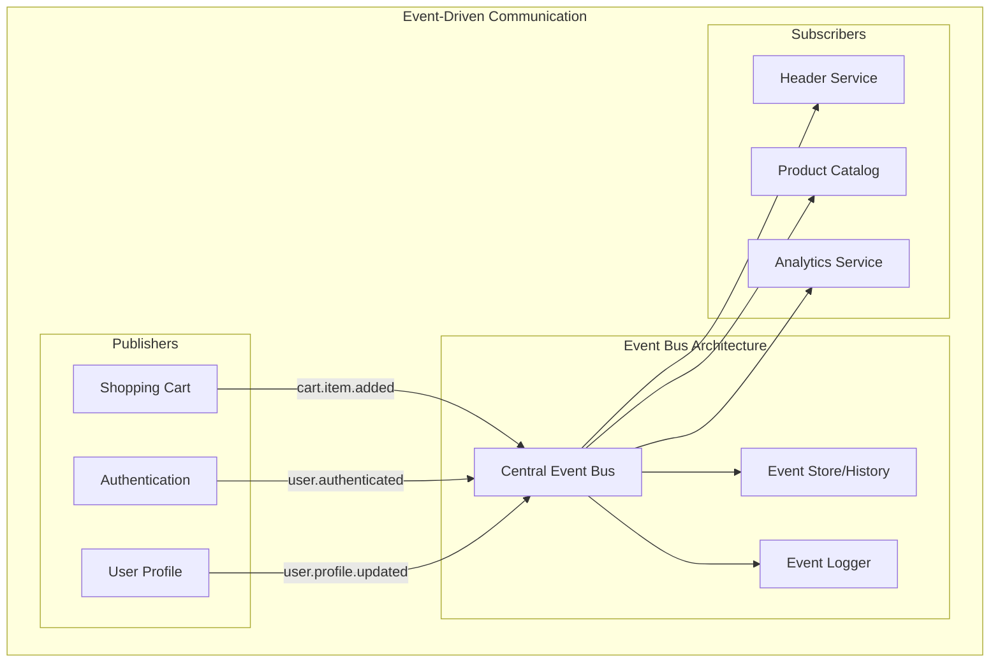

# Development Architecture

## Overview

Development architecture for micro frontends focuses on enabling independent development while maintaining integration capabilities. This guide covers local development setup, module federation configuration, and communication patterns between services.

## Local Development Environment

### Architecture Diagram



### Development Server Configuration

#### Shell Application (Container)

**apps/shell/webpack.config.js**
```javascript
const ModuleFederationPlugin = require('@module-federation/webpack');
const path = require('path');

module.exports = {
  mode: 'development',
  devServer: {
    port: 3000,
    hot: true,
    historyApiFallback: true,
    headers: {
      'Access-Control-Allow-Origin': '*',
      'Access-Control-Allow-Methods': 'GET, POST, PUT, DELETE, PATCH, OPTIONS',
      'Access-Control-Allow-Headers': 'X-Requested-With, content-type, Authorization'
    },
    proxy: {
      '/api': {
        target: 'http://localhost:8080',
        changeOrigin: true,
        pathRewrite: {
          '^/api': ''
        }
      }
    }
  },
  plugins: [
    new ModuleFederationPlugin({
      name: 'shell',
      remotes: {
        'header-service': process.env.NODE_ENV === 'development' 
          ? 'header_service@http://localhost:3001/remoteEntry.js'
          : 'header_service@/header-service/remoteEntry.js',
        'product-catalog': process.env.NODE_ENV === 'development'
          ? 'product_catalog@http://localhost:3002/remoteEntry.js' 
          : 'product_catalog@/product-catalog/remoteEntry.js',
        'shopping-cart': process.env.NODE_ENV === 'development'
          ? 'shopping_cart@http://localhost:3003/remoteEntry.js'
          : 'shopping_cart@/shopping-cart/remoteEntry.js',
        'user-profile': process.env.NODE_ENV === 'development'
          ? 'user_profile@http://localhost:3004/remoteEntry.js'
          : 'user_profile@/user-profile/remoteEntry.js'
      },
      shared: {
        react: { 
          singleton: true,
          requiredVersion: '^18.2.0',
          eager: true 
        },
        'react-dom': { 
          singleton: true,
          requiredVersion: '^18.2.0',
          eager: true 
        },
        'react-router-dom': {
          singleton: true,
          requiredVersion: '^6.3.0'
        },
        '@myorg/design-system': {
          singleton: true,
          requiredVersion: false
        },
        '@myorg/event-bus': {
          singleton: true,
          requiredVersion: false
        }
      }
    })
  ],
  resolve: {
    alias: {
      '@': path.resolve(__dirname, 'src'),
      '@myorg/design-system': path.resolve(__dirname, '../../libs/design-system/src'),
      '@myorg/shared-utils': path.resolve(__dirname, '../../libs/shared-utils/src')
    }
  }
};
```

#### Micro Frontend Service Configuration

**apps/header-service/webpack.config.js**
```javascript
const ModuleFederationPlugin = require('@module-federation/webpack');
const path = require('path');

module.exports = {
  mode: 'development',
  devServer: {
    port: 3001,
    hot: true,
    headers: {
      'Access-Control-Allow-Origin': '*'
    }
  },
  plugins: [
    new ModuleFederationPlugin({
      name: 'header_service',
      filename: 'remoteEntry.js',
      exposes: {
        './Header': './src/components/Header',
        './Navigation': './src/components/Navigation',
        './UserMenu': './src/components/UserMenu'
      },
      shared: {
        react: { 
          singleton: true,
          requiredVersion: '^18.2.0'
        },
        'react-dom': { 
          singleton: true,
          requiredVersion: '^18.2.0'
        },
        '@myorg/design-system': {
          singleton: true,
          requiredVersion: false
        },
        '@myorg/event-bus': {
          singleton: true,
          requiredVersion: false
        }
      }
    })
  ],
  resolve: {
    alias: {
      '@': path.resolve(__dirname, 'src'),
      '@myorg/design-system': path.resolve(__dirname, '../../libs/design-system/src'),
      '@myorg/event-bus': path.resolve(__dirname, '../../libs/event-bus/src')
    }
  }
};
```

### Development Startup Scripts

**package.json** (Root)
```json
{
  "scripts": {
    "dev": "concurrently \"npm run dev:libs\" \"npm run dev:services\"",
    "dev:libs": "concurrently \"nx run design-system:storybook\" \"nx run shared-utils:build:watch\"",
    "dev:services": "concurrently \"nx serve shell\" \"nx serve header-service\" \"nx serve product-catalog\" \"nx serve shopping-cart\" \"nx serve user-profile\"",
    "dev:shell": "nx serve shell",
    "dev:header": "nx serve header-service",
    "dev:catalog": "nx serve product-catalog",
    "dev:cart": "nx serve shopping-cart",
    "dev:profile": "nx serve user-profile",
    "dev:storybook": "nx run design-system:storybook"
  }
}
```

**scripts/dev-environment.sh**
```bash
#!/bin/bash

echo "🚀 Starting Micro Frontend Development Environment"

# Function to check if port is available
check_port() {
    if lsof -Pi :$1 -sTCP:LISTEN -t >/dev/null ; then
        echo "Port $1 is already in use"
        exit 1
    fi
}

# Check required ports
check_port 3000  # Shell
check_port 3001  # Header Service
check_port 3002  # Product Catalog
check_port 3003  # Shopping Cart
check_port 3004  # User Profile
check_port 6006  # Storybook

# Start shared libraries in watch mode
echo "📚 Building shared libraries..."
nx run-many --target=build:watch --projects=design-system,shared-utils,event-bus &

# Wait for initial build
sleep 5

# Start Storybook for design system
echo "📖 Starting Storybook..."
nx run design-system:storybook &

# Start all services
echo "🔧 Starting micro frontend services..."
concurrently \
  --prefix "[{name}]" \
  --names "shell,header,catalog,cart,profile" \
  --prefix-colors "cyan,magenta,yellow,green,blue" \
  "nx serve shell --port=3000" \
  "nx serve header-service --port=3001" \
  "nx serve product-catalog --port=3002" \
  "nx serve shopping-cart --port=3003" \
  "nx serve user-profile --port=3004"
```

## Module Federation Deep Dive

### Federation Architecture



### Advanced Federation Patterns

#### Dynamic Remote Loading

**src/utils/dynamicRemoteLoader.ts**
```typescript
interface RemoteConfig {
  name: string;
  url: string;
  scope: string;
  module: string;
}

class DynamicRemoteLoader {
  private loadedRemotes = new Map<string, any>();
  
  async loadRemote(config: RemoteConfig): Promise<any> {
    const { name, url, scope, module } = config;
    
    // Check if already loaded
    if (this.loadedRemotes.has(name)) {
      return this.loadedRemotes.get(name);
    }
    
    try {
      // Load remote entry script
      await this.loadScript(url);
      
      // Initialize shared scope
      // @ts-ignore
      await __webpack_init_sharing__('default');
      
      // Get container
      // @ts-ignore
      const container = window[scope];
      
      // Initialize container
      // @ts-ignore
      await container.init(__webpack_share_scopes__.default);
      
      // Get factory
      const factory = await container.get(module);
      const Module = factory();
      
      this.loadedRemotes.set(name, Module);
      return Module;
      
    } catch (error) {
      console.error(`Failed to load remote ${name}:`, error);
      throw error;
    }
  }
  
  private loadScript(url: string): Promise<void> {
    return new Promise((resolve, reject) => {
      const script = document.createElement('script');
      script.type = 'text/javascript';
      script.async = true;
      script.src = url;
      
      script.onload = () => resolve();
      script.onerror = () => reject(new Error(`Failed to load script: ${url}`));
      
      document.head.appendChild(script);
    });
  }
}

export const remoteLoader = new DynamicRemoteLoader();
```

#### Error Boundaries for Remote Components

**src/components/RemoteComponentWrapper.tsx**
```typescript
import React, { Suspense, lazy, ErrorInfo, ReactNode } from 'react';
import { remoteLoader } from '../utils/dynamicRemoteLoader';

interface RemoteComponentProps {
  remoteName: string;
  componentName: string;
  fallback?: ReactNode;
  props?: Record<string, any>;
}

interface ErrorBoundaryState {
  hasError: boolean;
  error?: Error;
}

class RemoteErrorBoundary extends React.Component<
  { children: ReactNode; fallback?: ReactNode },
  ErrorBoundaryState
> {
  constructor(props: any) {
    super(props);
    this.state = { hasError: false };
  }

  static getDerivedStateFromError(error: Error): ErrorBoundaryState {
    return { hasError: true, error };
  }

  componentDidCatch(error: Error, errorInfo: ErrorInfo) {
    console.error('Remote component error:', error, errorInfo);
    
    // Send to error reporting service
    if (process.env.NODE_ENV === 'production') {
      // reportError(error, { context: 'remote-component', ...errorInfo });
    }
  }

  render() {
    if (this.state.hasError) {
      return this.props.fallback || (
        <div className="error-boundary">
          <h3>Something went wrong loading this component</h3>
          <button onClick={() => this.setState({ hasError: false })}>
            Try Again
          </button>
        </div>
      );
    }

    return this.props.children;
  }
}

const RemoteComponent: React.FC<RemoteComponentProps> = ({
  remoteName,
  componentName,
  fallback,
  props = {}
}) => {
  const LazyComponent = lazy(() => 
    remoteLoader.loadRemote({
      name: remoteName,
      url: `/${remoteName}/remoteEntry.js`,
      scope: remoteName.replace('-', '_'),
      module: `./${componentName}`
    })
  );

  return (
    <RemoteErrorBoundary fallback={fallback}>
      <Suspense fallback={fallback || <div>Loading...</div>}>
        <LazyComponent {...props} />
      </Suspense>
    </RemoteErrorBoundary>
  );
};

export default RemoteComponent;
```

### Federation Configuration Management

**config/federation.config.js**
```javascript
const federationConfig = {
  development: {
    remotes: {
      'header-service': 'header_service@http://localhost:3001/remoteEntry.js',
      'product-catalog': 'product_catalog@http://localhost:3002/remoteEntry.js',
      'shopping-cart': 'shopping_cart@http://localhost:3003/remoteEntry.js',
      'user-profile': 'user_profile@http://localhost:3004/remoteEntry.js'
    }
  },
  
  staging: {
    remotes: {
      'header-service': 'header_service@https://staging-cdn.example.com/header-service/remoteEntry.js',
      'product-catalog': 'product_catalog@https://staging-cdn.example.com/product-catalog/remoteEntry.js',
      'shopping-cart': 'shopping_cart@https://staging-cdn.example.com/shopping-cart/remoteEntry.js',
      'user-profile': 'user_profile@https://staging-cdn.example.com/user-profile/remoteEntry.js'
    }
  },
  
  production: {
    remotes: {
      'header-service': 'header_service@https://cdn.example.com/header-service/remoteEntry.js',
      'product-catalog': 'product_catalog@https://cdn.example.com/product-catalog/remoteEntry.js',
      'shopping-cart': 'shopping_cart@https://cdn.example.com/shopping-cart/remoteEntry.js',
      'user-profile': 'user_profile@https://cdn.example.com/user-profile/remoteEntry.js'
    }
  }
};

module.exports = federationConfig[process.env.NODE_ENV || 'development'];
```

## Communication Patterns

### Event-Driven Communication



#### Event Bus Implementation

**libs/event-bus/src/EventBus.ts**
```typescript
type EventCallback<T = any> = (data: T) => void;
type EventUnsubscribe = () => void;

interface EventData {
  type: string;
  payload: any;
  timestamp: number;
  source: string;
  correlationId?: string;
}

class EventBus {
  private listeners = new Map<string, Set<EventCallback>>();
  private eventHistory: EventData[] = [];
  private maxHistorySize = 100;
  
  // Subscribe to events
  subscribe<T = any>(
    eventType: string, 
    callback: EventCallback<T>,
    options: { once?: boolean } = {}
  ): EventUnsubscribe {
    if (!this.listeners.has(eventType)) {
      this.listeners.set(eventType, new Set());
    }
    
    const wrappedCallback = options.once 
      ? (data: T) => {
          callback(data);
          this.unsubscribe(eventType, wrappedCallback);
        }
      : callback;
    
    this.listeners.get(eventType)!.add(wrappedCallback);
    
    return () => this.unsubscribe(eventType, wrappedCallback);
  }
  
  // Publish events
  publish<T = any>(
    eventType: string, 
    payload: T, 
    options: { source?: string; correlationId?: string } = {}
  ): void {
    const eventData: EventData = {
      type: eventType,
      payload,
      timestamp: Date.now(),
      source: options.source || 'unknown',
      correlationId: options.correlationId
    };
    
    // Store in history
    this.eventHistory.push(eventData);
    if (this.eventHistory.length > this.maxHistorySize) {
      this.eventHistory.shift();
    }
    
    // Notify subscribers
    const listeners = this.listeners.get(eventType);
    if (listeners) {
      listeners.forEach(callback => {
        try {
          callback(payload);
        } catch (error) {
          console.error(`Error in event listener for ${eventType}:`, error);
        }
      });
    }
    
    // Log event
    this.logEvent(eventData);
  }
  
  // Unsubscribe from events
  private unsubscribe(eventType: string, callback: EventCallback): void {
    const listeners = this.listeners.get(eventType);
    if (listeners) {
      listeners.delete(callback);
      if (listeners.size === 0) {
        this.listeners.delete(eventType);
      }
    }
  }
  
  // Get event history
  getHistory(eventType?: string): EventData[] {
    return eventType 
      ? this.eventHistory.filter(event => event.type === eventType)
      : [...this.eventHistory];
  }
  
  // Clear event history
  clearHistory(): void {
    this.eventHistory = [];
  }
  
  private logEvent(eventData: EventData): void {
    if (process.env.NODE_ENV === 'development') {
      console.group(`🔄 Event: ${eventData.type}`);
      console.log('Payload:', eventData.payload);
      console.log('Source:', eventData.source);
      console.log('Timestamp:', new Date(eventData.timestamp).toISOString());
      if (eventData.correlationId) {
        console.log('Correlation ID:', eventData.correlationId);
      }
      console.groupEnd();
    }
  }
}

// Create global instance
export const eventBus = new EventBus();

// Event type definitions
export interface EventTypes {
  // Authentication events
  'auth.login': { user: any; token: string };
  'auth.logout': { userId: string };
  'auth.token.refresh': { token: string };
  
  // Cart events
  'cart.item.added': { item: any; quantity: number };
  'cart.item.removed': { itemId: string };
  'cart.item.updated': { itemId: string; quantity: number };
  'cart.cleared': { userId: string };
  
  // User events
  'user.profile.updated': { userId: string; changes: any };
  'user.preferences.changed': { userId: string; preferences: any };
  
  // Navigation events
  'navigation.route.changed': { from: string; to: string };
  'navigation.back': {};
  
  // UI events
  'ui.modal.opened': { modalId: string };
  'ui.modal.closed': { modalId: string };
  'ui.notification.show': { type: 'success' | 'error' | 'warning'; message: string };
}

// Typed event publisher
export const publishEvent = <K extends keyof EventTypes>(
  type: K,
  payload: EventTypes[K],
  options?: { source?: string; correlationId?: string }
) => {
  eventBus.publish(type, payload, options);
};

// Typed event subscriber
export const subscribeToEvent = <K extends keyof EventTypes>(
  type: K,
  callback: (data: EventTypes[K]) => void,
  options?: { once?: boolean }
) => {
  return eventBus.subscribe(type, callback, options);
};
```

#### React Hook for Event Bus

**libs/event-bus/src/useEventBus.ts**
```typescript
import { useEffect, useRef, useCallback } from 'react';
import { eventBus, EventTypes, publishEvent, subscribeToEvent } from './EventBus';

export function useEventBus() {
  const unsubscribeRefs = useRef<(() => void)[]>([]);
  
  const subscribe = useCallback(<K extends keyof EventTypes>(
    eventType: K,
    callback: (data: EventTypes[K]) => void,
    options?: { once?: boolean }
  ) => {
    const unsubscribe = subscribeToEvent(eventType, callback, options);
    unsubscribeRefs.current.push(unsubscribe);
    return unsubscribe;
  }, []);
  
  const publish = useCallback(<K extends keyof EventTypes>(
    eventType: K,
    payload: EventTypes[K],
    options?: { source?: string; correlationId?: string }
  ) => {
    publishEvent(eventType, payload, options);
  }, []);
  
  useEffect(() => {
    return () => {
      // Cleanup all subscriptions on unmount
      unsubscribeRefs.current.forEach(unsubscribe => unsubscribe());
      unsubscribeRefs.current = [];
    };
  }, []);
  
  return { subscribe, publish };
}

// Specific hooks for common patterns
export function useEventSubscription<K extends keyof EventTypes>(
  eventType: K,
  callback: (data: EventTypes[K]) => void,
  deps: React.DependencyList = []
) {
  useEffect(() => {
    const unsubscribe = subscribeToEvent(eventType, callback);
    return unsubscribe;
  }, deps); // eslint-disable-line react-hooks/exhaustive-deps
}
```

### State Sharing Patterns

#### Shared State Store

**libs/shared-state/src/SharedStateStore.ts**
```typescript
import { eventBus } from '@myorg/event-bus';

interface StateChangeEvent<T = any> {
  key: string;
  value: T;
  previousValue: T;
  timestamp: number;
}

class SharedStateStore {
  private state = new Map<string, any>();
  private subscribers = new Map<string, Set<(value: any) => void>>();
  
  // Get state value
  get<T = any>(key: string): T | undefined {
    return this.state.get(key);
  }
  
  // Set state value
  set<T = any>(key: string, value: T): void {
    const previousValue = this.state.get(key);
    this.state.set(key, value);
    
    // Notify subscribers
    const keySubscribers = this.subscribers.get(key);
    if (keySubscribers) {
      keySubscribers.forEach(callback => callback(value));
    }
    
    // Publish global state change event
    eventBus.publish('state.changed', {
      key,
      value,
      previousValue,
      timestamp: Date.now()
    } as StateChangeEvent);
  }
  
  // Subscribe to state changes
  subscribe<T = any>(key: string, callback: (value: T) => void): () => void {
    if (!this.subscribers.has(key)) {
      this.subscribers.set(key, new Set());
    }
    
    this.subscribers.get(key)!.add(callback);
    
    // Call immediately with current value
    const currentValue = this.state.get(key);
    if (currentValue !== undefined) {
      callback(currentValue);
    }
    
    return () => {
      const keySubscribers = this.subscribers.get(key);
      if (keySubscribers) {
        keySubscribers.delete(callback);
        if (keySubscribers.size === 0) {
          this.subscribers.delete(key);
        }
      }
    };
  }
  
  // Remove state
  remove(key: string): void {
    const previousValue = this.state.get(key);
    this.state.delete(key);
    
    eventBus.publish('state.removed', {
      key,
      previousValue,
      timestamp: Date.now()
    });
  }
  
  // Get all state keys
  keys(): string[] {
    return Array.from(this.state.keys());
  }
  
  // Clear all state
  clear(): void {
    this.state.clear();
    this.subscribers.clear();
    
    eventBus.publish('state.cleared', {
      timestamp: Date.now()
    });
  }
}

export const sharedState = new SharedStateStore();

// React hook for shared state
export function useSharedState<T = any>(
  key: string,
  defaultValue?: T
): [T | undefined, (value: T) => void] {
  const [value, setValue] = React.useState<T | undefined>(() => 
    sharedState.get(key) ?? defaultValue
  );
  
  React.useEffect(() => {
    return sharedState.subscribe(key, setValue);
  }, [key]);
  
  const setSharedValue = React.useCallback((newValue: T) => {
    sharedState.set(key, newValue);
  }, [key]);
  
  return [value, setSharedValue];
}
```

### Cross-Service Communication Examples

#### Shopping Cart Integration

**apps/shopping-cart/src/hooks/useCartEvents.ts**
```typescript
import { useEventBus } from '@myorg/event-bus';
import { useEffect } from 'react';
import { cartService } from '../services/cartService';

export function useCartEvents() {
  const { publish, subscribe } = useEventBus();
  
  useEffect(() => {
    // Listen for product added from catalog
    const unsubscribeAdd = subscribe('cart.item.added', (data) => {
      cartService.addItem(data.item, data.quantity);
      
      // Publish confirmation
      publish('ui.notification.show', {
        type: 'success',
        message: `${data.item.name} added to cart`
      });
    });
    
    // Listen for authentication changes
    const unsubscribeAuth = subscribe('auth.logout', () => {
      cartService.clearCart();
      publish('cart.cleared', { userId: 'anonymous' });
    });
    
    return () => {
      unsubscribeAdd();
      unsubscribeAuth();
    };
  }, [subscribe, publish]);
  
  const addToCart = (item: any, quantity: number = 1) => {
    publish('cart.item.added', { item, quantity }, {
      source: 'shopping-cart'
    });
  };
  
  const removeFromCart = (itemId: string) => {
    publish('cart.item.removed', { itemId }, {
      source: 'shopping-cart'
    });
  };
  
  return {
    addToCart,
    removeFromCart
  };
}
```

#### Header Service User Updates

**apps/header-service/src/components/UserMenu.tsx**
```typescript
import React, { useState, useEffect } from 'react';
import { useEventSubscription } from '@myorg/event-bus';

export const UserMenu: React.FC = () => {
  const [user, setUser] = useState(null);
  const [cartItemCount, setCartItemCount] = useState(0);
  
  // Listen for authentication events
  useEventSubscription('auth.login', (data) => {
    setUser(data.user);
  });
  
  useEventSubscription('auth.logout', () => {
    setUser(null);
    setCartItemCount(0);
  });
  
  // Listen for cart updates
  useEventSubscription('cart.item.added', () => {
    setCartItemCount(prev => prev + 1);
  });
  
  useEventSubscription('cart.item.removed', () => {
    setCartItemCount(prev => Math.max(0, prev - 1));
  });
  
  useEventSubscription('cart.cleared', () => {
    setCartItemCount(0);
  });
  
  return (
    <div className="user-menu">
      {user ? (
        <div className="user-info">
          <span>Welcome, {user.name}</span>
          <div className="cart-indicator">
            Cart ({cartItemCount})
          </div>
        </div>
      ) : (
        <button>Sign In</button>
      )}
    </div>
  );
};
```

## Development Tools & Debugging

### Federation Debug Tools

**src/utils/federationDebugger.ts**
```typescript
interface FederationInfo {
  remotes: { [key: string]: any };
  shared: { [key: string]: any };
  loadedModules: string[];
}

class FederationDebugger {
  getFederationInfo(): FederationInfo {
    // @ts-ignore
    const container = window.__webpack_require__?.cache || {};
    // @ts-ignore
    const shared = window.__webpack_share_scopes__ || {};
    
    return {
      remotes: this.getRemoteInfo(),
      shared: shared.default || {},
      loadedModules: Object.keys(container)
    };
  }
  
  private getRemoteInfo() {
    const remotes: any = {};
    
    // @ts-ignore
    if (window.__webpack_require__) {
      // @ts-ignore
      const federatedModules = window.__webpack_require__.federatedModules || {};
      
      Object.keys(federatedModules).forEach(key => {
        remotes[key] = {
          loaded: true,
          url: federatedModules[key]?.remoteEntry
        };
      });
    }
    
    return remotes;
  }
  
  logFederationStatus(): void {
    const info = this.getFederationInfo();
    
    console.group('🔗 Module Federation Status');
    console.log('Remotes:', info.remotes);
    console.log('Shared Dependencies:', Object.keys(info.shared));
    console.log('Loaded Modules:', info.loadedModules.length);
    console.groupEnd();
  }
  
  checkSharedDependencies(): void {
    const info = this.getFederationInfo();
    
    console.group('📦 Shared Dependencies Analysis');
    Object.entries(info.shared).forEach(([name, config]: [string, any]) => {
      console.log(`${name}:`, {
        version: config.version || 'unknown',
        singleton: config.singleton,
        eager: config.eager,
        loaded: !!config.loaded
      });
    });
    console.groupEnd();
  }
}

export const federationDebugger = new FederationDebugger();

// Add to window for debugging
if (process.env.NODE_ENV === 'development') {
  (window as any).federationDebugger = federationDebugger;
}
```

### Event Bus Debugger

**libs/event-bus/src/EventBusDebugger.ts**
```typescript
import { eventBus } from './EventBus';

class EventBusDebugger {
  private isDebugging = false;
  
  startDebugging(): void {
    if (this.isDebugging) return;
    
    this.isDebugging = true;
    
    // Override publish method to add debugging
    const originalPublish = eventBus.publish.bind(eventBus);
    
    eventBus.publish = (eventType: string, payload: any, options: any = {}) => {
      console.group(`📡 Event Published: ${eventType}`);
      console.log('Payload:', payload);
      console.log('Options:', options);
      console.log('Timestamp:', new Date().toISOString());
      console.groupEnd();
      
      return originalPublish(eventType, payload, options);
    };
    
    console.log('🔧 Event Bus debugging enabled');
  }
  
  stopDebugging(): void {
    this.isDebugging = false;
    console.log('🔧 Event Bus debugging disabled');
  }
  
  getEventStats(): any {
    const history = eventBus.getHistory();
    const stats: any = {};
    
    history.forEach(event => {
      if (!stats[event.type]) {
        stats[event.type] = {
          count: 0,
          sources: new Set(),
          lastTimestamp: 0
        };
      }
      
      stats[event.type].count++;
      stats[event.type].sources.add(event.source);
      stats[event.type].lastTimestamp = Math.max(
        stats[event.type].lastTimestamp,
        event.timestamp
      );
    });
    
    // Convert sets to arrays for logging
    Object.keys(stats).forEach(key => {
      stats[key].sources = Array.from(stats[key].sources);
    });
    
    return stats;
  }
  
  logEventStats(): void {
    const stats = this.getEventStats();
    
    console.group('📊 Event Bus Statistics');
    console.table(stats);
    console.groupEnd();
  }
}

export const eventBusDebugger = new EventBusDebugger();

// Add to window for debugging
if (process.env.NODE_ENV === 'development') {
  (window as any).eventBusDebugger = eventBusDebugger;
}
```

### React DevTools Integration

**src/utils/devtools.ts**
```typescript
interface DevToolsConfig {
  enableRedux: boolean;
  enableReactQuery: boolean;
  enableFederation: boolean;
}

class DevToolsManager {
  private config: DevToolsConfig = {
    enableRedux: false,
    enableReactQuery: false,
    enableFederation: true
  };
  
  init(config?: Partial<DevToolsConfig>): void {
    if (process.env.NODE_ENV !== 'development') return;
    
    this.config = { ...this.config, ...config };
    
    // Initialize federation debugging
    if (this.config.enableFederation) {
      this.initFederationDevTools();
    }
    
    // Add global debugging utilities
    this.addGlobalUtils();
  }
  
  private initFederationDevTools(): void {
    // Add federation info to React DevTools
    if (typeof window !== 'undefined') {
      (window as any).__REACT_DEVTOOLS_GLOBAL_HOOK__?.onCommitFiberRoot = 
        new Proxy((window as any).__REACT_DEVTOOLS_GLOBAL_HOOK__?.onCommitFiberRoot || (() => {}), {
          apply: (target, thisArg, args) => {
            const result = target.apply(thisArg, args);
            
            // Add federation context to React DevTools
            if (args[1]?.current?.stateNode) {
              args[1].current.stateNode.__federationInfo = federationDebugger.getFederationInfo();
            }
            
            return result;
          }
        });
    }
  }
  
  private addGlobalUtils(): void {
    (window as any).__MF_DEBUG__ = {
      federation: federationDebugger,
      eventBus: eventBusDebugger,
      version: process.env.REACT_APP_VERSION || 'unknown'
    };
  }
}

export const devToolsManager = new DevToolsManager();
```

## Hot Module Replacement (HMR)

### HMR Configuration

**webpack.config.js** (HMR setup)
```javascript
module.exports = {
  // ... other config
  devServer: {
    hot: true,
    liveReload: false, // Disable live reload to use HMR only
    // ... other devServer config
  },
  
  plugins: [
    new webpack.HotModuleReplacementPlugin(),
    // ... other plugins
  ],
  
  optimization: {
    runtimeChunk: 'single',
  }
};
```

### HMR for Remote Components

**src/components/HMRWrapper.tsx**
```typescript
import React, { useEffect, useState } from 'react';

interface HMRWrapperProps {
  children: React.ReactNode;
  remoteKey: string;
}

const HMRWrapper: React.FC<HMRWrapperProps> = ({ children, remoteKey }) => {
  const [key, setKey] = useState(0);
  
  useEffect(() => {
    if (process.env.NODE_ENV === 'development' && module.hot) {
      // Listen for HMR updates
      const handleHMR = () => {
        console.log(`🔄 HMR: Reloading remote component ${remoteKey}`);
        setKey(prev => prev + 1);
      };
      
      module.hot.accept(`../remotes/${remoteKey}`, handleHMR);
      
      return () => {
        if (module.hot) {
          module.hot.dispose(() => {
            console.log(`🗑️ HMR: Disposing ${remoteKey}`);
          });
        }
      };
    }
  }, [remoteKey]);
  
  return <div key={key}>{children}</div>;
};

export default HMRWrapper;
```

## Performance Monitoring

### Development Performance Metrics

**src/utils/performanceMonitor.ts**
```typescript
interface PerformanceMetric {
  name: string;
  value: number;
  timestamp: number;
  type: 'federation' | 'render' | 'network' | 'bundle';
}

class DevelopmentPerformanceMonitor {
  private metrics: PerformanceMetric[] = [];
  
  startTiming(name: string): () => void {
    const startTime = performance.now();
    
    return () => {
      const endTime = performance.now();
      this.addMetric({
        name,
        value: endTime - startTime,
        timestamp: Date.now(),
        type: 'render'
      });
    };
  }
  
  measureRemoteLoad(remoteName: string, loadTime: number): void {
    this.addMetric({
      name: `remote-load-${remoteName}`,
      value: loadTime,
      timestamp: Date.now(),
      type: 'federation'
    });
  }
  
  measureBundleSize(bundleName: string, size: number): void {
    this.addMetric({
      name: `bundle-size-${bundleName}`,
      value: size,
      timestamp: Date.now(),
      type: 'bundle'
    });
  }
  
  private addMetric(metric: PerformanceMetric): void {
    this.metrics.push(metric);
    
    // Log in development
    if (process.env.NODE_ENV === 'development') {
      console.log(`⚡ Performance: ${metric.name} - ${metric.value.toFixed(2)}ms`);
    }
    
    // Keep only last 100 metrics
    if (this.metrics.length > 100) {
      this.metrics.shift();
    }
  }
  
  getMetrics(type?: string): PerformanceMetric[] {
    return type 
      ? this.metrics.filter(m => m.type === type)
      : [...this.metrics];
  }
  
  getAverageMetric(name: string): number {
    const relevantMetrics = this.metrics.filter(m => m.name === name);
    if (relevantMetrics.length === 0) return 0;
    
    const sum = relevantMetrics.reduce((acc, m) => acc + m.value, 0);
    return sum / relevantMetrics.length;
  }
  
  logSummary(): void {
    const groups = this.metrics.reduce((acc, metric) => {
      if (!acc[metric.type]) acc[metric.type] = [];
      acc[metric.type].push(metric);
      return acc;
    }, {} as { [key: string]: PerformanceMetric[] });
    
    console.group('📊 Performance Summary');
    Object.entries(groups).forEach(([type, metrics]) => {
      console.group(`${type.toUpperCase()}`);
      metrics.forEach(metric => {
        console.log(`${metric.name}: ${metric.value.toFixed(2)}ms`);
      });
      console.groupEnd();
    });
    console.groupEnd();
  }
}

export const performanceMonitor = new DevelopmentPerformanceMonitor();

// React hook for performance monitoring
export function usePerformanceMonitoring(name: string) {
  useEffect(() => {
    const endTiming = performanceMonitor.startTiming(name);
    return endTiming;
  }, [name]);
}
```

## Testing in Development

### Development Testing Utilities

**src/utils/testUtils.ts**
```typescript
import { render, RenderOptions } from '@testing-library/react';
import { ReactElement } from 'react';
import { eventBus } from '@myorg/event-bus';

// Mock remote components for testing
export const mockRemoteComponent = (componentName: string) => {
  return function MockComponent(props: any) {
    return (
      <div data-testid={`mock-${componentName.toLowerCase()}`}>
        Mock {componentName}
        <pre>{JSON.stringify(props, null, 2)}</pre>
      </div>
    );
  };
};

// Test wrapper with event bus
const TestWrapper: React.FC<{ children: React.ReactNode }> = ({ children }) => {
  useEffect(() => {
    // Clear event bus before each test
    eventBus.clearHistory();
  }, []);
  
  return <>{children}</>;
};

// Custom render function
const customRender = (
  ui: ReactElement,
  options?: Omit<RenderOptions, 'wrapper'>
) => render(ui, { wrapper: TestWrapper, ...options });

export * from '@testing-library/react';
export { customRender as render };

// Event testing utilities
export const waitForEvent = (eventType: string, timeout = 1000): Promise<any> => {
  return new Promise((resolve, reject) => {
    const timer = setTimeout(() => {
      reject(new Error(`Event ${eventType} not received within ${timeout}ms`));
    }, timeout);
    
    const unsubscribe = eventBus.subscribe(eventType, (data) => {
      clearTimeout(timer);
      unsubscribe();
      resolve(data);
    });
  });
};

export const triggerEvent = (eventType: string, payload: any) => {
  eventBus.publish(eventType, payload, { source: 'test' });
};
```

### Integration Testing Setup

**src/tests/integration/remoteComponentIntegration.test.tsx**
```typescript
import React from 'react';
import { render, screen, waitFor } from '../../utils/testUtils';
import RemoteComponent from '../../components/RemoteComponentWrapper';
import { remoteLoader } from '../../utils/dynamicRemoteLoader';

// Mock the remote loader
jest.mock('../../utils/dynamicRemoteLoader');
const mockRemoteLoader = remoteLoader as jest.Mocked<typeof remoteLoader>;

describe('Remote Component Integration', () => {
  beforeEach(() => {
    jest.clearAllMocks();
  });
  
  it('should load and render remote component successfully', async () => {
    // Mock successful remote loading
    mockRemoteLoader.loadRemote.mockResolvedValue(() => 
      React.createElement('div', { 'data-testid': 'remote-component' }, 'Remote Content')
    );
    
    render(
      <RemoteComponent
        remoteName="header-service"
        componentName="Header"
        fallback={<div>Loading...</div>}
      />
    );
    
    // Should show fallback initially
    expect(screen.getByText('Loading...')).toBeInTheDocument();
    
    // Should load remote component
    await waitFor(() => {
      expect(screen.getByTestId('remote-component')).toBeInTheDocument();
    });
    
    expect(mockRemoteLoader.loadRemote).toHaveBeenCalledWith({
      name: 'header-service',
      url: '/header-service/remoteEntry.js',
      scope: 'header_service',
      module: './Header'
    });
  });
  
  it('should show error boundary on remote loading failure', async () => {
    // Mock failed remote loading
    mockRemoteLoader.loadRemote.mockRejectedValue(new Error('Failed to load'));
    
    render(
      <RemoteComponent
        remoteName="header-service"
        componentName="Header"
        fallback={<div>Loading...</div>}
      />
    );
    
    // Should show error boundary
    await waitFor(() => {
      expect(screen.getByText('Something went wrong loading this component')).toBeInTheDocument();
    });
  });
});
```

## Troubleshooting Development Issues

### Common Development Problems

#### CORS Issues
```javascript
// webpack.config.js devServer configuration
devServer: {
  headers: {
    'Access-Control-Allow-Origin': '*',
    'Access-Control-Allow-Methods': 'GET, POST, PUT, DELETE, PATCH, OPTIONS',
    'Access-Control-Allow-Headers': 'X-Requested-With, content-type, Authorization'
  }
}
```

#### Shared Dependencies Conflicts
```bash
# Check shared dependency versions
npm ls react react-dom

# Force resolution in package.json
{
  "overrides": {
    "react": "^18.2.0",
    "react-dom": "^18.2.0"
  }
}
```

#### Module Federation Loading Issues
```javascript
// Debug federation loading
const debugFederation = () => {
  console.log('Federation containers:', Object.keys(window).filter(key => key.includes('webpack')));
  console.log('Shared scope:', window.__webpack_share_scopes__);
};
```

### Development Checklist

#### Daily Development Startup
- [ ] All ports available (3000-3004, 6006)
- [ ] Shared libraries building successfully
- [ ] All remote services accessible
- [ ] Event bus communication working
- [ ] Hot module replacement functioning
- [ ] Storybook running for design system

#### Pre-commit Checklist
- [ ] All tests passing
- [ ] No TypeScript errors
- [ ] Linting passing
- [ ] Bundle sizes reasonable
- [ ] Performance metrics acceptable
- [ ] Event communication documented

## Next Steps

After setting up your development architecture:

1. **Implement Runtime Integration** - Configure production-ready module federation
2. **Set up Testing Strategies** - Comprehensive testing across services
3. **Configure Performance Monitoring** - Real-time performance tracking
4. **Implement Security Architecture** - Authentication and authorization
5. **Plan Deployment Strategies** - CI/CD and containerization

---

For more information, see:
- [Runtime Integration](04-runtime-integration.md)
- [Testing Strategies](09-testing.md)
- [Performance & Monitoring](07-performance-monitoring.md)
- [Security Architecture](08-security.md)