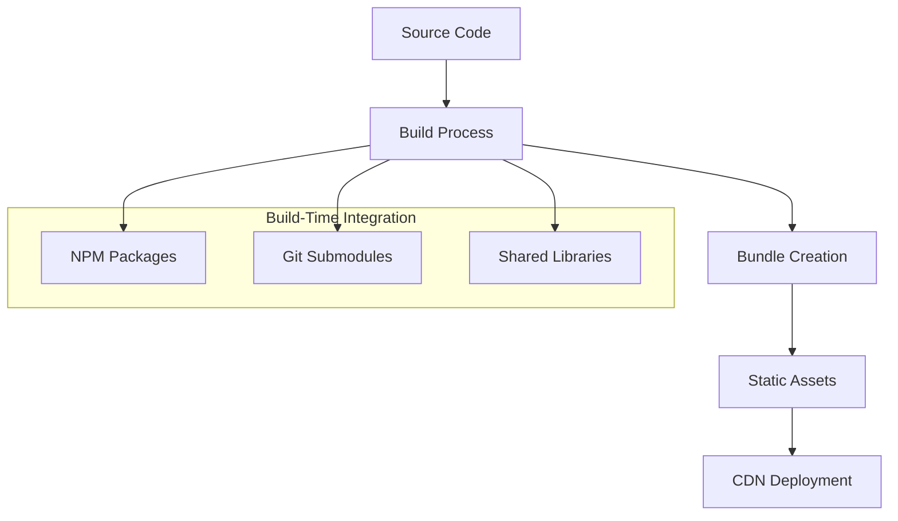
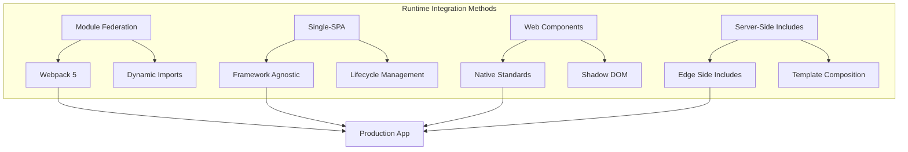
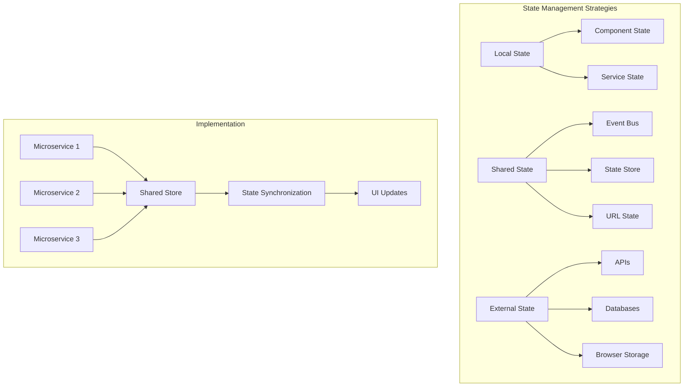

## Runtime Integration Patterns {#runtime-integration}

### 1. Build-Time Integration



### 2. Runtime Integration



### Module Federation Implementation

```typescript
// Shell application component
import React, { Suspense } from 'react';

const HeaderService = React.lazy(() => import('headerService/Header'));
const ProductCatalog = React.lazy(() => import('productCatalog/ProductList'));

function App() {
  return (
    <div className="app">
      <Suspense fallback={<div>Loading header...</div>}>
        <HeaderService />
      </Suspense>
      
      <main>
        <Suspense fallback={<div>Loading products...</div>}>
          <ProductCatalog />
        </Suspense>
      </main>
    </div>
  );
}

export default App;
```

### State Management Across Microservices




---

For more information, see:
- [Cross framework](05-cross-framework.md)
- [Deployment strategies](06-deployment-strategies.md)
- [Performance & Monitoring](07-performance-monitoring.md)