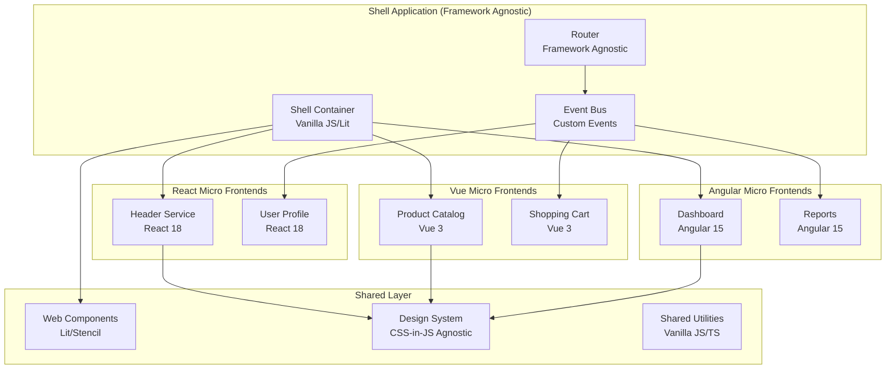

# Cross-Framework Integration

This document covers strategies for integrating multiple frontend frameworks within a micro frontend architecture, including React, Vue, Angular, and framework-agnostic approaches using Web Components.

## Table of Contents
1. [Multi-Framework Architecture](#multi-framework-architecture)
2. [Framework-Agnostic Integration](#framework-agnostic-integration)
3. [Web Components as Universal Interface](#web-components-as-universal-interface)
4. [State Management Across Frameworks](#state-management-across-frameworks)
5. [Communication Patterns](#communication-patterns)
6. [Styling Consistency](#styling-consistency)
7. [Build Tools & Module Federation](#build-tools--module-federation)
8. [Testing Cross-Framework Integration](#testing-cross-framework-integration)
9. [Performance Considerations](#performance-considerations)
10. [Migration Strategies](#migration-strategies)

## Multi-Framework Architecture

### Architecture Overview



### Framework Compatibility Matrix

| Feature | React | Vue | Angular | Svelte | Vanilla |
|---------|-------|-----|---------|--------|---------|
| **Module Federation** | ✅ Full | ✅ Full | ✅ Full | ⚠️ Limited | ✅ Full |
| **Web Components** | ⚠️ Events | ✅ Native | ✅ Full | ✅ Good | ✅ Native |
| **SSR Support** | ✅ Full | ✅ Full | ✅ Full | ✅ Kit | ❌ N/A |
| **Bundle Size** | Medium | Small | Large | Smallest | Minimal |
| **Learning Curve** | Medium | Low | High | Low | Minimal |

## Framework-Agnostic Integration

### Universal Shell Container

```javascript
// shell/universal-shell.js
class UniversalShell {
  constructor() {
    this.mountedApps = new Map();
    this.eventBus = new EventTarget();
    this.router = new UniversalRouter();
    this.styleManager = new StyleManager();
  }

  async mountMicroFrontend(config) {
    const { name, element, framework, remoteEntry, props = {} } = config;
    
    try {
      // Load the remote module
      const module = await this.loadRemoteModule(remoteEntry);
      
      // Framework-specific mounting logic
      let unmount;
      switch (framework) {
        case 'react':
          unmount = await this.mountReact(module, element, props);
          break;
        case 'vue':
          unmount = await this.mountVue(module, element, props);
          break;
        case 'angular':
          unmount = await this.mountAngular(module, element, props);
          break;
        case 'web-component':
          unmount = await this.mountWebComponent(module, element, props);
          break;
        default:
          throw new Error(`Unsupported framework: ${framework}`);
      }

      this.mountedApps.set(name, {
        unmount,
        framework,
        element,
        props
      });

      this.notifyMountComplete(name);
    } catch (error) {
      console.error(`Failed to mount ${name}:`, error);
      this.showFallbackUI(element, name);
    }
  }

  async mountReact(module, element, props) {
    const { createRoot } = await import('react-dom/client');
    const { createElement } = await import('react');
    
    const root = createRoot(element);
    root.render(createElement(module.default, props));
    
    return () => root.unmount();
  }

  async mountVue(module, element, props) {
    const { createApp } = await import('vue');
    
    const app = createApp(module.default, props);
    app.mount(element);
    
    return () => app.unmount();
  }

  async mountAngular(module, element, props) {
    const { platformBrowserDynamic } = await import('@angular/platform-browser-dynamic');
    
    // Create Angular module with injected props
    const moduleRef = await platformBrowserDynamic().bootstrapModule(
      module.AngularModule,
      { ngZone: 'noop' }
    );
    
    // Mount to specific element
    const componentRef = moduleRef.injector.get(module.ComponentFactory)
      .create(moduleRef.injector, [], element);
    
    // Set props
    Object.assign(componentRef.instance, props);
    componentRef.changeDetectorRef.detectChanges();
    
    return () => {
      componentRef.destroy();
      moduleRef.destroy();
    };
  }

  async mountWebComponent(module, element, props) {
    // Register web component if not already registered
    if (!customElements.get(module.tagName)) {
      customElements.define(module.tagName, module.default);
    }
    
    // Create and configure element
    const webComponent = document.createElement(module.tagName);
    Object.assign(webComponent, props);
    element.appendChild(webComponent);
    
    return () => element.removeChild(webComponent);
  }

  async loadRemoteModule(remoteEntry) {
    // Dynamic import with error handling and retry logic
    let retries = 3;
    while (retries > 0) {
      try {
        return await import(remoteEntry);
      } catch (error) {
        retries--;
        if (retries === 0) throw error;
        await this.delay(1000);
      }
    }
  }
}
```

### Universal Router

```javascript
// routing/universal-router.js
class UniversalRouter {
  constructor() {
    this.routes = new Map();
    this.currentRoute = null;
    this.middlewares = [];
    
    // Listen to browser navigation
    window.addEventListener('popstate', (event) => {
      this.navigate(window.location.pathname, false);
    });
  }

  addRoute(path, config) {
    this.routes.set(path, {
      ...config,
      regex: this.pathToRegex(path)
    });
  }

  async navigate(path, pushState = true) {
    if (pushState) {
      history.pushState({}, '', path);
    }

    // Run middlewares
    for (const middleware of this.middlewares) {
      const result = await middleware(path, this.currentRoute);
      if (result === false) return; // Middleware blocked navigation
    }

    const route = this.matchRoute(path);
    if (route) {
      await this.activateRoute(route, path);
      this.currentRoute = { ...route, path };
    } else {
      this.handle404(path);
    }
  }

  matchRoute(path) {
    for (const [routePath, config] of this.routes) {
      const match = path.match(config.regex);
      if (match) {
        return {
          ...config,
          params: this.extractParams(routePath, match)
        };
      }
    }
    return null;
  }

  async activateRoute(route, path) {
    // Unmount current micro frontend
    if (this.currentRoute && this.currentRoute.microFrontend) {
      await this.unmountMicroFrontend(this.currentRoute.microFrontend);
    }

    // Mount new micro frontend
    if (route.microFrontend) {
      await this.mountMicroFrontend(route.microFrontend, route.params);
    }

    // Update active navigation
    this.updateActiveNavigation(path);
  }

  pathToRegex(path) {
    return new RegExp(
      '^' + path.replace(/:\w+/g, '([^/]+)').replace(/\*/g, '.*') + '$'
    );
  }
}
```

## Web Components as Universal Interface

### Base Web Component

```javascript
// components/base-web-component.js
import { LitElement, html, css } from 'lit';

export class BaseMicroFrontendComponent extends LitElement {
  static properties = {
    // Common props all micro frontends might need
    user: { type: Object },
    theme: { type: String },
    locale: { type: String },
    apiEndpoint: { type: String }
  };

  constructor() {
    super();
    this.eventBus = window.microFrontendEventBus;
    this.setupEventListeners();
  }

  setupEventListeners() {
    // Listen to global events
    this.eventBus?.addEventListener('theme-changed', this.handleThemeChange.bind(this));
    this.eventBus?.addEventListener('user-updated', this.handleUserUpdate.bind(this));
    this.eventBus?.addEventListener('locale-changed', this.handleLocaleChange.bind(this));
  }

  handleThemeChange(event) {
    this.theme = event.detail.theme;
  }

  handleUserUpdate(event) {
    this.user = event.detail.user;
  }

  handleLocaleChange(event) {
    this.locale = event.detail.locale;
    this.requestUpdate();
  }

  // Emit events to communicate with other micro frontends
  emit(eventName, detail) {
    this.eventBus?.dispatchEvent(new CustomEvent(eventName, { 
      detail,
      bubbles: true 
    }));
  }

  // Common styles that can be shared across micro frontends
  static styles = css`
    :host {
      display: block;
      font-family: var(--font-family, -apple-system, BlinkMacSystemFont, 'Segoe UI', Roboto, sans-serif);
      color: var(--text-color, #333);
      background-color: var(--bg-color, #fff);
    }

    :host([hidden]) {
      display: none;
    }

    .loading {
      display: flex;
      align-items: center;
      justify-content: center;
      min-height: 200px;
    }

    .error {
      color: var(--error-color, #d32f2f);
      padding: 16px;
      border: 1px solid var(--error-border, #ffcdd2);
      border-radius: 4px;
      background-color: var(--error-bg, #ffebee);
    }
  `;
}
```

### React-to-WebComponent Wrapper

```javascript
// wrappers/react-to-webcomponent.js
import React from 'react';
import { createRoot } from 'react-dom/client';
import { BaseMicroFrontendComponent } from './base-web-component.js';

export function createReactWebComponent(ReactComponent, tagName) {
  class ReactWebComponent extends BaseMicroFrontendComponent {
    constructor() {
      super();
      this.root = null;
    }

    connectedCallback() {
      super.connectedCallback();
      this.root = createRoot(this);
      this.render();
    }

    disconnectedCallback() {
      if (this.root) {
        this.root.unmount();
      }
    }

    updated(changedProperties) {
      this.render();
    }

    render() {
      if (this.root) {
        const props = {
          user: this.user,
          theme: this.theme,
          locale: this.locale,
          apiEndpoint: this.apiEndpoint,
          // Event communication helpers
          emit: this.emit.bind(this),
          eventBus: this.eventBus
        };

        this.root.render(React.createElement(ReactComponent, props));
      }
    }

    // Lit render method (returns empty since React handles rendering)
    render() {
      return html`<slot></slot>`;
    }
  }

  customElements.define(tagName, ReactWebComponent);
  return ReactWebComponent;
}

// Usage example:
// createReactWebComponent(HeaderComponent, 'mf-header');
```

### Vue-to-WebComponent Wrapper

```javascript
// wrappers/vue-to-webcomponent.js
import { createApp } from 'vue';
import { BaseMicroFrontendComponent } from './base-web-component.js';

export function createVueWebComponent(VueComponent, tagName) {
  class VueWebComponent extends BaseMicroFrontendComponent {
    constructor() {
      super();
      this.vueApp = null;
    }

    connectedCallback() {
      super.connectedCallback();
      this.mountVueApp();
    }

    disconnectedCallback() {
      if (this.vueApp) {
        this.vueApp.unmount();
      }
    }

    updated(changedProperties) {
      if (this.vueApp && changedProperties.size > 0) {
        // Update reactive props
        Object.keys(this.vueApp._instance.props).forEach(key => {
          if (changedProperties.has(key)) {
            this.vueApp._instance.props[key] = this[key];
          }
        });
      }
    }

    mountVueApp() {
      const container = document.createElement('div');
      this.appendChild(container);

      this.vueApp = createApp(VueComponent, {
        user: this.user,
        theme: this.theme,
        locale: this.locale,
        apiEndpoint: this.apiEndpoint,
        emit: this.emit.bind(this),
        eventBus: this.eventBus
      });

      this.vueApp.mount(container);
    }

    render() {
      return html`<slot></slot>`;
    }
  }

  customElements.define(tagName, VueWebComponent);
  return VueWebComponent;
}
```

## State Management Across Frameworks

### Universal State Manager

```javascript
// state/universal-state-manager.js
class UniversalStateManager {
  constructor() {
    this.state = {};
    this.subscribers = new Map();
    this.middlewares = [];
    this.eventBus = new EventTarget();
  }

  // Subscribe to state changes
  subscribe(key, callback, framework) {
    if (!this.subscribers.has(key)) {
      this.subscribers.set(key, []);
    }
    
    const subscription = { callback, framework, id: Math.random().toString(36) };
    this.subscribers.get(key).push(subscription);
    
    return () => {
      const subscribers = this.subscribers.get(key);
      const index = subscribers.findIndex(sub => sub.id === subscription.id);
      if (index > -1) subscribers.splice(index, 1);
    };
  }

  // Set state value
  setState(key, value) {
    const previousValue = this.state[key];
    
    // Run middlewares
    for (const middleware of this.middlewares) {
      value = middleware(key, value, previousValue);
    }
    
    this.state[key] = value;
    this.notifySubscribers(key, value, previousValue);
  }

  // Get state value
  getState(key) {
    return this.state[key];
  }

  // Notify all subscribers of a key
  notifySubscribers(key, value, previousValue) {
    const subscribers = this.subscribers.get(key) || [];
    
    subscribers.forEach(({ callback, framework }) => {
      try {
        // Framework-specific state updates
        switch (framework) {
          case 'react':
            // React state updates are handled by the callback
            callback(value, previousValue);
            break;
          case 'vue':
            // Vue reactivity
            callback(value, previousValue);
            break;
          case 'angular':
            // Angular zone
            if (window.Zone && window.Zone.current) {
              window.Zone.current.run(() => callback(value, previousValue));
            } else {
              callback(value, previousValue);
            }
            break;
          default:
            callback(value, previousValue);
        }
      } catch (error) {
        console.error(`Error in state subscriber for key ${key}:`, error);
      }
    });

    // Emit global event
    this.eventBus.dispatchEvent(new CustomEvent('state-changed', {
      detail: { key, value, previousValue }
    }));
  }

  // Add middleware
  addMiddleware(middleware) {
    this.middlewares.push(middleware);
  }
}

// Create global instance
window.universalState = new UniversalStateManager();

// Framework-specific hooks and composables
export const createReactStateHook = () => {
  const [state, setState] = React.useState({});
  
  React.useEffect(() => {
    const unsubscribes = [];
    
    // Subscribe to specific keys as needed
    const subscribeToKey = (key) => {
      const unsubscribe = window.universalState.subscribe(key, (value) => {
        setState(prev => ({ ...prev, [key]: value }));
      }, 'react');
      unsubscribes.push(unsubscribe);
    };
    
    return () => {
      unsubscribes.forEach(unsub => unsub());
    };
  }, []);
  
  return {
    state,
    setState: (key, value) => window.universalState.setState(key, value),
    getState: (key) => window.universalState.getState(key)
  };
};

export const createVueStateComposable = () => {
  const state = Vue.reactive({});
  
  const subscribeToKey = (key) => {
    return window.universalState.subscribe(key, (value) => {
      state[key] = value;
    }, 'vue');
  };
  
  return {
    state,
    subscribeToKey,
    setState: (key, value) => window.universalState.setState(key, value),
    getState: (key) => window.universalState.getState(key)
  };
};
```

### Event-Driven State Synchronization

```javascript
// state/event-driven-sync.js
class EventDrivenStateSync {
  constructor() {
    this.eventBus = window.microFrontendEventBus || new EventTarget();
    this.stateCache = new Map();
    this.setupEventListeners();
  }

  setupEventListeners() {
    // User authentication events
    this.eventBus.addEventListener('user-login', this.handleUserLogin.bind(this));
    this.eventBus.addEventListener('user-logout', this.handleUserLogout.bind(this));
    
    // Shopping cart events
    this.eventBus.addEventListener('cart-item-added', this.handleCartUpdate.bind(this));
    this.eventBus.addEventListener('cart-item-removed', this.handleCartUpdate.bind(this));
    
    // Theme and preferences
    this.eventBus.addEventListener('theme-changed', this.handleThemeChange.bind(this));
    this.eventBus.addEventListener('locale-changed', this.handleLocaleChange.bind(this));
  }

  handleUserLogin(event) {
    const { user, token } = event.detail;
    
    // Update state across all frameworks
    window.universalState.setState('currentUser', user);
    window.universalState.setState('authToken', token);
    
    // Trigger dependent updates
    this.refreshUserDependentData(user);
  }

  handleUserLogout() {
    window.universalState.setState('currentUser', null);
    window.universalState.setState('authToken', null);
    window.universalState.setState('shoppingCart', []);
    
    // Clear sensitive data
    this.clearSensitiveState();
  }

  handleCartUpdate(event) {
    const { cart, item, action } = event.detail;
    
    window.universalState.setState('shoppingCart', cart);
    window.universalState.setState('cartItemCount', cart.length);
    
    // Update cart total
    const total = cart.reduce((sum, item) => sum + (item.price * item.quantity), 0);
    window.universalState.setState('cartTotal', total);
  }

  async refreshUserDependentData(user) {
    try {
      // Fetch user-specific data that multiple micro frontends might need
      const [preferences, permissions, notifications] = await Promise.all([
        this.fetchUserPreferences(user.id),
        this.fetchUserPermissions(user.id),
        this.fetchUserNotifications(user.id)
      ]);

      window.universalState.setState('userPreferences', preferences);
      window.universalState.setState('userPermissions', permissions);
      window.universalState.setState('notifications', notifications);
    } catch (error) {
      console.error('Failed to refresh user-dependent data:', error);
    }
  }
}
```

## Communication Patterns

### Custom Event System

```javascript
// communication/event-system.js
class MicroFrontendEventSystem {
  constructor() {
    this.eventBus = new EventTarget();
    this.eventHistory = [];
    this.maxHistorySize = 100;
    this.eventValidators = new Map();
  }

  // Register event validator
  addEventValidator(eventType, validator) {
    this.eventValidators.set(eventType, validator);
  }

  // Emit event with validation and history tracking
  emit(eventType, detail, options = {}) {
    const event = {
      type: eventType,
      detail,
      timestamp: Date.now(),
      source: options.source || 'unknown',
      id: Math.random().toString(36)
    };

    // Validate event if validator exists
    const validator = this.eventValidators.get(eventType);
    if (validator && !validator(detail)) {
      console.warn(`Invalid event data for ${eventType}:`, detail);
      return false;
    }

    // Add to history
    this.eventHistory.push(event);
    if (this.eventHistory.length > this.maxHistorySize) {
      this.eventHistory.shift();
    }

    // Emit the event
    const customEvent = new CustomEvent(eventType, {
      detail: {
        ...detail,
        _meta: {
          timestamp: event.timestamp,
          source: event.source,
          id: event.id
        }
      },
      bubbles: options.bubbles !== false,
      cancelable: options.cancelable !== false
    });

    this.eventBus.dispatchEvent(customEvent);
    
    // Log for debugging
    if (options.debug) {
      console.log(`Event emitted: ${eventType}`, event);
    }

    return true;
  }

  // Listen to events with automatic cleanup
  on(eventType, callback, options = {}) {
    const wrappedCallback = (event) => {
      try {
        callback(event.detail, event);
      } catch (error) {
        console.error(`Error in event handler for ${eventType}:`, error);
      }
    };

    this.eventBus.addEventListener(eventType, wrappedCallback, options);

    // Return unsubscribe function
    return () => {
      this.eventBus.removeEventListener(eventType, wrappedCallback, options);
    };
  }

  // Get event history
  getEventHistory(filter) {
    if (!filter) return this.eventHistory;
    
    return this.eventHistory.filter(event => {
      if (filter.type && event.type !== filter.type) return false;
      if (filter.source && event.source !== filter.source) return false;
      if (filter.since && event.timestamp < filter.since) return false;
      return true;
    });
  }
}

// Create global event system
window.microFrontendEventBus = new MicroFrontendEventSystem();

// Framework-specific wrappers
export const useEventBus = () => {
  const [events, setEvents] = React.useState([]);
  const eventBus = window.microFrontendEventBus;

  const emit = React.useCallback((eventType, detail, options) => {
    return eventBus.emit(eventType, detail, { ...options, source: 'react' });
  }, [eventBus]);

  const on = React.useCallback((eventType, callback, deps = []) => {
    React.useEffect(() => {
      const unsubscribe = eventBus.on(eventType, callback);
      return unsubscribe;
    }, deps);
  }, [eventBus]);

  return { emit, on, eventBus };
};
```

### Message Passing Protocol

```javascript
// communication/message-protocol.js
class MessageProtocol {
  constructor() {
    this.channels = new Map();
    this.messageQueue = [];
    this.messageHandlers = new Map();
  }

  // Create a communication channel between micro frontends
  createChannel(channelName, participants = []) {
    const channel = {
      name: channelName,
      participants: new Set(participants),
      messages: [],
      middleware: []
    };

    this.channels.set(channelName, channel);
    return channel;
  }

  // Send message through a channel
  sendMessage(channelName, message, sender) {
    const channel = this.channels.get(channelName);
    if (!channel) {
      console.warn(`Channel ${channelName} not found`);
      return false;
    }

    const enhancedMessage = {
      ...message,
      sender,
      timestamp: Date.now(),
      id: Math.random().toString(36),
      channel: channelName
    };

    // Apply middleware
    let processedMessage = enhancedMessage;
    for (const middleware of channel.middleware) {
      processedMessage = middleware(processedMessage);
      if (!processedMessage) return false; // Middleware blocked message
    }

    // Add to channel history
    channel.messages.push(processedMessage);

    // Deliver to participants
    channel.participants.forEach(participant => {
      if (participant !== sender) {
        this.deliverMessage(participant, processedMessage);
      }
    });

    return true;
  }

  // Register message handler for a micro frontend
  registerHandler(microFrontendId, handler) {
    this.messageHandlers.set(microFrontendId, handler);
  }

  // Deliver message to specific micro frontend
  deliverMessage(microFrontendId, message) {
    const handler = this.messageHandlers.get(microFrontendId);
    if (handler) {
      try {
        handler(message);
      } catch (error) {
        console.error(`Error delivering message to ${microFrontendId}:`, error);
      }
    } else {
      // Queue message if handler not ready
      this.messageQueue.push({ microFrontendId, message });
    }
  }

  // Process queued messages when handler becomes available
  processQueuedMessages(microFrontendId) {
    const queuedMessages = this.messageQueue.filter(
      item => item.microFrontendId === microFrontendId
    );

    queuedMessages.forEach(({ message }) => {
      this.deliverMessage(microFrontendId, message);
    });

    // Remove processed messages from queue
    this.messageQueue = this.messageQueue.filter(
      item => item.microFrontendId !== microFrontendId
    );
  }
}

// Usage example:
const protocol = new MessageProtocol();

// Create channels for different types of communication
protocol.createChannel('user-actions', ['header', 'profile', 'cart']);
protocol.createChannel('shopping-flow', ['catalog', 'cart', 'checkout']);

// Send messages
protocol.sendMessage('user-actions', {
  type: 'USER_LOGGED_IN',
  user: { id: 123, name: 'John Doe' }
}, 'header');
```

## Styling Consistency

### CSS-in-JS Framework Agnostic

```javascript
// styling/universal-styles.js
class UniversalStyleManager {
  constructor() {
    this.themes = new Map();
    this.currentTheme = 'default';
    this.styleSheets = new Map();
    this.cssVariables = new Map();
  }

  // Register a theme
  registerTheme(name, theme) {
    this.themes.set(name, theme);
    this.updateCSSVariables(name === this.currentTheme ? theme : null);
  }

  // Switch theme
  switchTheme(themeName) {
    const theme = this.themes.get(themeName);
    if (!theme) {
      console.warn(`Theme ${themeName} not found`);
      return;
    }

    this.currentTheme = themeName;
    this.updateCSSVariables(theme);
    
    // Notify all micro frontends
    window.microFrontendEventBus?.emit('theme-changed', {
      theme: themeName,
      variables: theme
    });
  }

  // Update CSS custom properties
  updateCSSVariables(theme) {
    const root = document.documentElement;
    
    if (theme) {
      Object.entries(theme).forEach(([key, value]) => {
        root.style.setProperty(`--${key}`, value);
        this.cssVariables.set(key, value);
      });
    }
  }

  // Create framework-agnostic styled components
  createStyledComponent(tagName, styles) {
    class StyledComponent extends HTMLElement {
      constructor() {
        super();
        this.attachShadow({ mode: 'open' });
        this.render();
      }

      connectedCallback() {
        this.setupThemeListener();
      }

      setupThemeListener() {
        window.microFrontendEventBus?.on('theme-changed', () => {
          this.render();
        });
      }

      render() {
        const currentTheme = this.themes.get(this.currentTheme) || {};
        const compiledStyles = this.compileStyles(styles, currentTheme);
        
        this.shadowRoot.innerHTML = `
          <style>${compiledStyles}</style>
          <slot></slot>
        `;
      }

      compileStyles(styles, theme) {
        return styles.replace(/\$\{([^}]+)\}/g, (match, key) => {
          return theme[key] || `var(--${key})`;
        });
      }
    }

    customElements.define(tagName, StyledComponent);
    return StyledComponent;
  }
}

// Design system tokens
export const designTokens = {
  // Color palette
  colors: {
    primary: {
      50: '#f0f9ff',
      100: '#e0f2fe',
      200: '#bae6fd',
      300: '#7dd3fc',
      400: '#38bdf8',
      500: '#0ea5e9',
      600: '#0284c7',
      700: '#0369a1',
      800: '#075985',
      900: '#0c4a6e'
    },
    gray: {
      50: '#f9fafb',
      100: '#f3f4f6',
      200: '#e5e7eb',
      300: '#d1d5db',
      400: '#9ca3af',
      500: '#6b7280',
      600: '#4b5563',
      700: '#374151',
      800: '#1f2937',
      900: '#111827'
    },
    semantic: {
      success: '#10b981',
      warning: '#f59e0b',
      error: '#ef4444',
      info: '#3b82f6'
    }
  },

  // Typography
  typography: {
    fonts: {
      sans: '-apple-system, BlinkMacSystemFont, "Segoe UI", Roboto, "Helvetica Neue", Arial, sans-serif',
      serif: 'Georgia, Cambria, "Times New Roman", Times, serif',
      mono: 'Menlo, Monaco, Consolas, "Liberation Mono", "Courier New", monospace'
    },
    sizes: {
      xs: '0.75rem',
      sm: '0.875rem',
      base: '1rem',
      lg: '1.125rem',
      xl: '1.25rem',
      '2xl': '1.5rem',
      '3xl': '1.875rem',
      '4xl': '2.25rem',
      '5xl': '3rem',
      '6xl': '3.75rem'
    },
    weights: {
      thin: '100',
      light: '300',
      normal: '400',
      medium: '500',
      semibold: '600',
      bold: '700',
      extrabold: '800',
      black: '900'
    },
    lineHeights: {
      tight: '1.25',
      normal: '1.5',
      relaxed: '1.75'
    }
  },

  // Spacing
  spacing: {
    0: '0',
    1: '0.25rem',
    2: '0.5rem',
    3: '0.75rem',
    4: '1rem',
    5: '1.25rem',
    6: '1.5rem',
    8: '2rem',
    10: '2.5rem',
    12: '3rem',
    16: '4rem',
    20: '5rem',
    24: '6rem',
    32: '8rem'
  },

  // Borders
  borders: {
    width: {
      0: '0',
      1: '1px',
      2: '2px',
      4: '4px',
      8: '8px'
    },
    radius: {
      none: '0',
      sm: '0.125rem',
      md: '0.375rem',
      lg: '0.5rem',
      xl: '0.75rem',
      '2xl': '1rem',
      full: '9999px'
    }
  },

  // Shadows
  shadows: {
    sm: '0 1px 2px 0 rgba(0, 0, 0, 0.05)',
    md: '0 4px 6px -1px rgba(0, 0, 0, 0.1), 0 2px 4px -1px rgba(0, 0, 0, 0.06)',
    lg: '0 10px 15px -3px rgba(0, 0, 0, 0.1), 0 4px 6px -2px rgba(0, 0, 0, 0.05)',
    xl: '0 20px 25px -5px rgba(0, 0, 0, 0.1), 0 10px 10px -5px rgba(0, 0, 0, 0.04)',
    '2xl': '0 25px 50px -12px rgba(0, 0, 0, 0.25)',
    inner: 'inset 0 2px 4px 0 rgba(0, 0, 0, 0.06)'
  },

  // Breakpoints
  breakpoints: {
    sm: '640px',
    md: '768px',
    lg: '1024px',
    xl: '1280px',
    '2xl': '1536px'
  },

  // Z-index layers
  zIndex: {
    hide: -1,
    auto: 'auto',
    base: 0,
    docked: 10,
    dropdown: 1000,
    sticky: 1100,
    banner: 1200,
    overlay: 1300,
    modal: 1400,
    popover: 1500,
    skipLink: 1600,
    toast: 1700,
    tooltip: 1800
  }
};

// Theme definitions
export const themes = {
  light: {
    'primary-color': designTokens.colors.primary[500],
    'secondary-color': designTokens.colors.gray[600],
    'background-color': '#ffffff',
    'surface-color': designTokens.colors.gray[50],
    'text-color': designTokens.colors.gray[900],
    'text-secondary': designTokens.colors.gray[600],
    'border-color': designTokens.colors.gray[200],
    'error-color': designTokens.colors.semantic.error,
    'success-color': designTokens.colors.semantic.success,
    'warning-color': designTokens.colors.semantic.warning,
    'info-color': designTokens.colors.semantic.info
  },
  dark: {
    'primary-color': designTokens.colors.primary[400],
    'secondary-color': designTokens.colors.gray[400],
    'background-color': designTokens.colors.gray[900],
    'surface-color': designTokens.colors.gray[800],
    'text-color': designTokens.colors.gray[100],
    'text-secondary': designTokens.colors.gray[400],
    'border-color': designTokens.colors.gray[700],
    'error-color': '#fca5a5',
    'success-color': '#6ee7b7',
    'warning-color': '#fcd34d',
    'info-color': '#93c5fd'
  }
};

// Create style manager instance
export const styleManager = new UniversalStyleManager();

// Register themes
Object.entries(themes).forEach(([name, theme]) => {
  styleManager.registerTheme(name, theme);
});
```

### CSS Custom Properties Generator

```javascript
// styling/css-custom-properties.js
export function generateCSSCustomProperties(tokens) {
  let css = ':root {\n';
  
  // Recursively process token object
  function processTokens(obj, prefix = '') {
    for (const [key, value] of Object.entries(obj)) {
      const cssVar = `${prefix}${prefix ? '-' : ''}${key}`;
      
      if (typeof value === 'object' && value !== null) {
        processTokens(value, cssVar);
      } else {
        css += `  --${cssVar}: ${value};\n`;
      }
    }
  }
  
  processTokens(tokens);
  css += '}\n';
  
  return css;
}

// Framework-specific style utilities
export const reactStyleUtils = {
  useTheme: () => {
    const [theme, setTheme] = React.useState(styleManager.currentTheme);
    
    React.useEffect(() => {
      const unsubscribe = window.microFrontendEventBus?.on('theme-changed', (event) => {
        setTheme(event.theme);
      });
      return unsubscribe;
    }, []);
    
    return {
      theme,
      setTheme: (newTheme) => styleManager.switchTheme(newTheme),
      tokens: designTokens
    };
  },
  
  styled: (component, styles) => {
    return React.forwardRef((props, ref) => {
      const computedStyles = typeof styles === 'function' ? styles(props) : styles;
      return React.createElement(component, {
        ...props,
        ref,
        style: { ...computedStyles, ...props.style }
      });
    });
  }
};

export const vueStyleUtils = {
  useTheme: () => {
    const theme = Vue.ref(styleManager.currentTheme);
    
    Vue.onMounted(() => {
      const unsubscribe = window.microFrontendEventBus?.on('theme-changed', (event) => {
        theme.value = event.theme;
      });
      
      Vue.onUnmounted(() => {
        unsubscribe?.();
      });
    });
    
    return {
      theme,
      setTheme: (newTheme) => styleManager.switchTheme(newTheme),
      tokens: designTokens
    };
  }
};
```

## Build Tools & Module Federation

### Webpack Module Federation Configuration

```javascript
// webpack/module-federation.config.js
const ModuleFederationPlugin = require('@module-federation/webpack');
const path = require('path');

// Shell application configuration
const shellConfig = {
  mode: 'development',
  entry: './src/index',
  devServer: {
    port: 3000,
  },
  plugins: [
    new ModuleFederationPlugin({
      name: 'shell',
      remotes: {
        reactHeader: 'reactHeader@http://localhost:3001/remoteEntry.js',
        vueProducts: 'vueProducts@http://localhost:3002/remoteEntry.js',
        angularDashboard: 'angularDashboard@http://localhost:3003/remoteEntry.js',
      },
      shared: {
        // Share common dependencies
        'design-tokens': {
          singleton: true,
          eager: true
        },
        'event-bus': {
          singleton: true,
          eager: true
        }
      },
    }),
  ],
};

// React micro frontend configuration
const reactMicroFrontendConfig = {
  mode: 'development',
  entry: './src/index',
  devServer: {
    port: 3001,
  },
  plugins: [
    new ModuleFederationPlugin({
      name: 'reactHeader',
      filename: 'remoteEntry.js',
      exposes: {
        './Header': './src/Header',
        './Profile': './src/Profile',
      },
      shared: {
        react: {
          singleton: true,
          requiredVersion: '^18.0.0'
        },
        'react-dom': {
          singleton: true,
          requiredVersion: '^18.0.0'
        },
        'design-tokens': {
          singleton: true,
          eager: true
        }
      },
    }),
  ],
};

// Vue micro frontend configuration
const vueMicroFrontendConfig = {
  mode: 'development',
  entry: './src/main.js',
  devServer: {
    port: 3002,
  },
  plugins: [
    new ModuleFederationPlugin({
      name: 'vueProducts',
      filename: 'remoteEntry.js',
      exposes: {
        './ProductCatalog': './src/components/ProductCatalog.vue',
        './ShoppingCart': './src/components/ShoppingCart.vue',
      },
      shared: {
        vue: {
          singleton: true,
          requiredVersion: '^3.0.0'
        },
        'design-tokens': {
          singleton: true,
          eager: true
        }
      },
    }),
  ],
};

// Angular micro frontend configuration
const angularMicroFrontendConfig = {
  mode: 'development',
  entry: './src/main.ts',
  devServer: {
    port: 3003,
  },
  plugins: [
    new ModuleFederationPlugin({
      name: 'angularDashboard',
      filename: 'remoteEntry.js',
      exposes: {
        './Dashboard': './src/app/dashboard/dashboard.module.ts',
        './Reports': './src/app/reports/reports.module.ts',
      },
      shared: {
        '@angular/core': {
          singleton: true,
          requiredVersion: '^15.0.0'
        },
        '@angular/common': {
          singleton: true,
          requiredVersion: '^15.0.0'
        },
        'design-tokens': {
          singleton: true,
          eager: true
        }
      },
    }),
  ],
};

module.exports = {
  shell: shellConfig,
  reactMicroFrontend: reactMicroFrontendConfig,
  vueMicroFrontend: vueMicroFrontendConfig,
  angularMicroFrontend: angularMicroFrontendConfig
};
```

### Vite Module Federation Setup

```javascript
// vite/federation.config.js
import { defineConfig } from 'vite';
import { federation } from '@originjs/vite-plugin-federation';

// Shell configuration
export const shellConfig = defineConfig({
  plugins: [
    federation({
      name: 'shell',
      remotes: {
        reactHeader: 'http://localhost:3001/assets/remoteEntry.js',
        vueProducts: 'http://localhost:3002/assets/remoteEntry.js',
      },
      shared: ['design-tokens', 'event-bus']
    })
  ],
  build: {
    target: 'esnext',
    minify: false,
    cssCodeSplit: false
  }
});

// React micro frontend configuration
export const reactConfig = defineConfig({
  plugins: [
    federation({
      name: 'reactHeader',
      filename: 'remoteEntry.js',
      exposes: {
        './Header': './src/Header.jsx',
        './Profile': './src/Profile.jsx'
      },
      shared: ['react', 'react-dom', 'design-tokens']
    })
  ],
  build: {
    target: 'esnext',
    minify: false,
    cssCodeSplit: false
  }
});

// Vue micro frontend configuration
export const vueConfig = defineConfig({
  plugins: [
    federation({
      name: 'vueProducts',
      filename: 'remoteEntry.js',
      exposes: {
        './ProductCatalog': './src/components/ProductCatalog.vue',
        './ShoppingCart': './src/components/ShoppingCart.vue'
      },
      shared: ['vue', 'design-tokens']
    })
  ],
  build: {
    target: 'esnext',
    minify: false,
    cssCodeSplit: false
  }
});
```

### Build Script Orchestration

```javascript
// scripts/build-orchestrator.js
const { spawn } = require('child_process');
const path = require('path');

class BuildOrchestrator {
  constructor() {
    this.microFrontends = [
      { name: 'shell', path: './shell', port: 3000 },
      { name: 'react-header', path: './react-header', port: 3001 },
      { name: 'vue-products', path: './vue-products', port: 3002 },
      { name: 'angular-dashboard', path: './angular-dashboard', port: 3003 }
    ];
    this.processes = new Map();
  }

  async buildAll() {
    console.log('🚀 Building all micro frontends...');
    
    const buildPromises = this.microFrontends.map(mf => this.buildMicroFrontend(mf));
    
    try {
      await Promise.all(buildPromises);
      console.log('✅ All micro frontends built successfully');
    } catch (error) {
      console.error('❌ Build failed:', error);
      process.exit(1);
    }
  }

  async buildMicroFrontend(microFrontend) {
    return new Promise((resolve, reject) => {
      console.log(`📦 Building ${microFrontend.name}...`);
      
      const buildProcess = spawn('npm', ['run', 'build'], {
        cwd: path.resolve(microFrontend.path),
        stdio: 'pipe'
      });

      let output = '';
      buildProcess.stdout.on('data', (data) => {
        output += data.toString();
      });

      buildProcess.stderr.on('data', (data) => {
        output += data.toString();
      });

      buildProcess.on('close', (code) => {
        if (code === 0) {
          console.log(`✅ ${microFrontend.name} built successfully`);
          resolve();
        } else {
          console.error(`❌ ${microFrontend.name} build failed:`);
          console.error(output);
          reject(new Error(`Build failed for ${microFrontend.name}`));
        }
      });
    });
  }

  async startDevelopment() {
    console.log('🔧 Starting development servers...');
    
    for (const mf of this.microFrontends) {
      await this.startMicroFrontend(mf);
    }

    // Setup graceful shutdown
    process.on('SIGINT', () => {
      this.stopAll();
    });
  }

  async startMicroFrontend(microFrontend) {
    return new Promise((resolve) => {
      console.log(`🌐 Starting ${microFrontend.name} on port ${microFrontend.port}...`);
      
      const devProcess = spawn('npm', ['run', 'dev'], {
        cwd: path.resolve(microFrontend.path),
        stdio: 'pipe',
        env: { ...process.env, PORT: microFrontend.port.toString() }
      });

      this.processes.set(microFrontend.name, devProcess);

      devProcess.stdout.on('data', (data) => {
        const output = data.toString();
        if (output.includes('ready') || output.includes('compiled') || output.includes('localhost')) {
          console.log(`✅ ${microFrontend.name} ready on http://localhost:${microFrontend.port}`);
          resolve();
        }
      });

      devProcess.stderr.on('data', (data) => {
        console.error(`${microFrontend.name} error:`, data.toString());
      });

      // Resolve after a timeout if no ready message
      setTimeout(resolve, 5000);
    });
  }

  stopAll() {
    console.log('🛑 Stopping all development servers...');
    
    for (const [name, process] of this.processes) {
      process.kill('SIGINT');
      console.log(`✅ Stopped ${name}`);
    }
    
    process.exit(0);
  }
}

// CLI interface
const command = process.argv[2];
const orchestrator = new BuildOrchestrator();

switch (command) {
  case 'build':
    orchestrator.buildAll();
    break;
  case 'dev':
    orchestrator.startDevelopment();
    break;
  default:
    console.log('Usage: node build-orchestrator.js [build|dev]');
}
```

## Testing Cross-Framework Integration

### Integration Test Suite

```javascript
// tests/integration/cross-framework.test.js
import { test, expect } from '@playwright/test';

test.describe('Cross-Framework Integration', () => {
  test.beforeEach(async ({ page }) => {
    await page.goto('http://localhost:3000');
    await page.waitForLoadState('networkidle');
  });

  test('should load all micro frontends', async ({ page }) => {
    // Check React header
    const reactHeader = page.locator('[data-testid="react-header"]');
    await expect(reactHeader).toBeVisible();

    // Check Vue product catalog
    const vueProducts = page.locator('[data-testid="vue-products"]');
    await expect(vueProducts).toBeVisible();

    // Check Angular dashboard
    const angularDashboard = page.locator('[data-testid="angular-dashboard"]');
    await expect(angularDashboard).toBeVisible();
  });

  test('should communicate between micro frontends', async ({ page }) => {
    // Login from React header
    await page.click('[data-testid="login-button"]');
    await page.fill('[data-testid="username"]', 'testuser');
    await page.fill('[data-testid="password"]', 'password');
    await page.click('[data-testid="submit-login"]');

    // Check if Vue products updated with user info
    const userGreeting = page.locator('[data-testid="user-greeting"]');
    await expect(userGreeting).toContainText('Welcome, testuser');

    // Check if Angular dashboard shows user data
    const dashboardUser = page.locator('[data-testid="dashboard-user"]');
    await expect(dashboardUser).toContainText('testuser');
  });

  test('should maintain theme consistency', async ({ page }) => {
    // Switch to dark theme
    await page.click('[data-testid="theme-toggle"]');

    // Check React component theme
    const reactComponent = page.locator('[data-testid="react-header"]');
    await expect(reactComponent).toHaveCSS('background-color', 'rgb(31, 41, 55)');

    // Check Vue component theme
    const vueComponent = page.locator('[data-testid="vue-products"]');
    await expect(vueComponent).toHaveCSS('background-color', 'rgb(31, 41, 55)');

    // Check Angular component theme
    const angularComponent = page.locator('[data-testid="angular-dashboard"]');
    await expect(angularComponent).toHaveCSS('background-color', 'rgb(31, 41, 55)');
  });

  test('should handle routing between micro frontends', async ({ page }) => {
    // Navigate to products page (Vue)
    await page.click('[data-testid="nav-products"]');
    await expect(page.locator('[data-testid="product-list"]')).toBeVisible();
    expect(page.url()).toContain('/products');

    // Navigate to dashboard page (Angular)
    await page.click('[data-testid="nav-dashboard"]');
    await expect(page.locator('[data-testid="dashboard-content"]')).toBeVisible();
    expect(page.url()).toContain('/dashboard');

    // Navigate to profile page (React)
    await page.click('[data-testid="nav-profile"]');
    await expect(page.locator('[data-testid="profile-form"]')).toBeVisible();
    expect(page.url()).toContain('/profile');
  });

  test('should handle error boundaries gracefully', async ({ page }) => {
    // Simulate network failure
    await page.route('**/api/products', route => route.abort());

    // Navigate to products page
    await page.click('[data-testid="nav-products"]');

    // Check error fallback UI
    const errorFallback = page.locator('[data-testid="error-fallback"]');
    await expect(errorFallback).toBeVisible();
    await expect(errorFallback).toContainText('Something went wrong');
  });
});
```

### Unit Testing Utilities

```javascript
// tests/utils/cross-framework-testing.js
export class CrossFrameworkTestUtils {
  constructor() {
    this.mockEventBus = new EventTarget();
    this.mockState = new Map();
  }

  setupMockEnvironment() {
    // Mock global event bus
    global.microFrontendEventBus = this.mockEventBus;
    
    // Mock universal state
    global.universalState = {
      setState: (key, value) => this.mockState.set(key, value),
      getState: (key) => this.mockState.get(key),
      subscribe: jest.fn()
    };

    // Mock style manager
    global.styleManager = {
      switchTheme: jest.fn(),
      currentTheme: 'light'
    };
  }

  createMockMicroFrontend(name, framework) {
    const mockElement = document.createElement('div');
    mockElement.setAttribute('data-testid', `${name}-mock`);
    
    return {
      name,
      framework,
      element: mockElement,
      mount: jest.fn().mockResolvedValue(() => {}),
      unmount: jest.fn(),
      emit: (event, data) => {
        this.mockEventBus.dispatchEvent(new CustomEvent(event, { detail: data }));
      }
    };
  }

  simulateEvent(eventType, detail) {
    this.mockEventBus.dispatchEvent(new CustomEvent(eventType, { detail }));
  }

  expectEventEmitted(eventType, expectedDetail) {
    return new Promise((resolve, reject) => {
      const timeout = setTimeout(() => {
        reject(new Error(`Event ${eventType} was not emitted within timeout`));
      }, 1000);

      this.mockEventBus.addEventListener(eventType, (event) => {
        clearTimeout(timeout);
        if (expectedDetail) {
          expect(event.detail).toEqual(expectedDetail);
        }
        resolve(event.detail);
      }, { once: true });
    });
  }

  teardown() {
    this.mockState.clear();
    // Remove all event listeners
    this.mockEventBus = new EventTarget();
  }
}

// Framework-specific testing utilities
export const reactTestUtils = {
  renderWithMockContext: (Component, props = {}) => {
    const mockEventBus = new EventTarget();
    const mockState = { user: null, theme: 'light' };

    return render(
      <Component
        {...props}
        eventBus={mockEventBus}
        state={mockState}
      />
    );
  },

  mockUseEventBus: () => ({
    emit: jest.fn(),
    on: jest.fn(),
    eventBus: new EventTarget()
  })
};

export const vueTestUtils = {
  createMockApp: (component, props = {}) => {
    return mount(component, {
      props,
      global: {
        provide: {
          eventBus: new EventTarget(),
          universalState: {
            state: { user: null, theme: 'light' }
          }
        }
      }
    });
  }
};
```

## Performance Considerations

### Bundle Optimization

```javascript
// optimization/bundle-analyzer.js
class BundleAnalyzer {
  constructor() {
    this.bundleData = new Map();
    this.performanceMetrics = new Map();
  }

  analyzeBundleSize(microFrontendName, bundlePath) {
    const fs = require('fs');
    const path = require('path');
    
    const stats = fs.statSync(bundlePath);
    const sizeInKB = stats.size / 1024;
    
    this.bundleData.set(microFrontendName, {
      size: sizeInKB,
      path: bundlePath,
      lastModified: stats.mtime
    });

    return sizeInKB;
  }

  generateReport() {
    const report = {
      totalSize: 0,
      microFrontends: [],
      recommendations: []
    };

    for (const [name, data] of this.bundleData) {
      report.totalSize += data.size;
      report.microFrontends.push({
        name,
        size: `${data.size.toFixed(2)} KB`,
        lastModified: data.lastModified
      });

      // Add recommendations based on size
      if (data.size > 500) {
        report.recommendations.push({
          microFrontend: name,
          issue: 'Large bundle size',
          suggestion: 'Consider code splitting and lazy loading'
        });
      }
    }

    return report;
  }
}

// Performance monitoring
export class PerformanceMonitor {
  constructor() {
    this.metrics = new Map();
    this.observers = [];
  }

  startMonitoring() {
    // Monitor micro frontend loading times
    const observer = new PerformanceObserver((list) => {
      for (const entry of list.getEntries()) {
        if (entry.name.includes('micro-frontend')) {
          this.recordMetric('load-time', entry.name, entry.duration);
        }
      }
    });
    
    observer.observe({ entryTypes: ['measure', 'navigation'] });
    this.observers.push(observer);

    // Monitor memory usage
    if ('memory' in performance) {
      setInterval(() => {
        this.recordMetric('memory', 'heap-used', performance.memory.usedJSHeapSize);
        this.recordMetric('memory', 'heap-total', performance.memory.totalJSHeapSize);
      }, 5000);
    }

    // Monitor frame rate
    this.monitorFrameRate();
  }

  monitorFrameRate() {
    let fps = 0;
    let lastTime = performance.now();

    const measureFPS = (currentTime) => {
      fps++;
      
      if (currentTime >= lastTime + 1000) {
        this.recordMetric('performance', 'fps', fps);
        fps = 0;
        lastTime = currentTime;
      }
      
      requestAnimationFrame(measureFPS);
    };
    
    requestAnimationFrame(measureFPS);
  }

  recordMetric(category, name, value) {
    if (!this.metrics.has(category)) {
      this.metrics.set(category, new Map());
    }
    
    const categoryMetrics = this.metrics.get(category);
    if (!categoryMetrics.has(name)) {
      categoryMetrics.set(name, []);
    }
    
    categoryMetrics.get(name).push({
      value,
      timestamp: Date.now()
    });
  }

  getMetrics(category, name) {
    return this.metrics.get(category)?.get(name) || [];
  }

  generatePerformanceReport() {
    const report = {
      loadTimes: {},
      memoryUsage: {},
      frameRate: {},
      recommendations: []
    };

    // Analyze load times
    const loadMetrics = this.metrics.get('load-time') || new Map();
    for (const [mfName, values] of loadMetrics) {
      const avgLoadTime = values.reduce((sum, v) => sum + v.value, 0) / values.length;
      report.loadTimes[mfName] = `${avgLoadTime.toFixed(2)}ms`;
      
      if (avgLoadTime > 1000) {
        report.recommendations.push({
          microFrontend: mfName,
          issue: 'Slow loading time',
          suggestion: 'Implement lazy loading or reduce bundle size'
        });
      }
    }

    // Analyze memory usage
    const memoryMetrics = this.metrics.get('memory') || new Map();
    const heapUsed = memoryMetrics.get('heap-used') || [];
    if (heapUsed.length > 0) {
      const avgMemory = heapUsed.reduce((sum, v) => sum + v.value, 0) / heapUsed.length;
      report.memoryUsage.average = `${(avgMemory / 1048576).toFixed(2)} MB`;
      
      if (avgMemory > 50 * 1048576) { // 50MB threshold
        report.recommendations.push({
          issue: 'High memory usage',
          suggestion: 'Check for memory leaks in micro frontends'
        });
      }
    }

    // Analyze frame rate
    const fpsMetrics = this.metrics.get('performance') || new Map();
    const fpsValues = fpsMetrics.get('fps') || [];
    if (fpsValues.length > 0) {
      const avgFPS = fpsValues.reduce((sum, v) => sum + v.value, 0) / fpsValues.length;
      report.frameRate.average = `${avgFPS.toFixed(1)} FPS`;
      
      if (avgFPS < 30) {
        report.recommendations.push({
          issue: 'Low frame rate',
          suggestion: 'Optimize animations and reduce DOM operations'
        });
      }
    }

    return report;
  }

  stopMonitoring() {
    this.observers.forEach(observer => observer.disconnect());
    this.observers = [];
  }
}
```

### Lazy Loading Implementation

```javascript
// optimization/lazy-loading.js
export class LazyMicroFrontendLoader {
  constructor() {
    this.loadedMicroFrontends = new Set();
    this.loadingPromises = new Map();
    this.intersectionObserver = null;
    this.setupIntersectionObserver();
  }

  setupIntersectionObserver() {
    this.intersectionObserver = new IntersectionObserver((entries) => {
      entries.forEach((entry) => {
        if (entry.isIntersecting) {
          const microFrontendName = entry.target.dataset.microFrontend;
          if (microFrontendName) {
            this.loadMicroFrontend(microFrontendName, entry.target);
          }
        }
      });
    }, {
      rootMargin: '50px',
      threshold: 0.1
    });
  }

  async loadMicroFrontend(name, element) {
    // Prevent duplicate loading
    if (this.loadedMicroFrontends.has(name)) {
      return;
    }

    // Return existing promise if already loading
    if (this.loadingPromises.has(name)) {
      return this.loadingPromises.get(name);
    }

    const loadingPromise = this.performLoad(name, element);
    this.loadingPromises.set(name, loadingPromise);

    try {
      await loadingPromise;
      this.loadedMicroFrontends.add(name);
      this.loadingPromises.delete(name);
    } catch (error) {
      this.loadingPromises.delete(name);
      throw error;
    }
  }

  async performLoad(name, element) {
    // Show loading state
    this.showLoadingState(element);

    try {
      // Dynamic import with retry logic
      const module = await this.importWithRetry(this.getMicroFrontendURL(name));
      
      // Mount the micro frontend
      await this.mountMicroFrontend(module, element, name);
      
      // Hide loading state
      this.hideLoadingState(element);
      
      // Stop observing this element
      this.intersectionObserver.unobserve(element);
      
    } catch (error) {
      this.showErrorState(element, error);
      throw error;
    }
  }

  async importWithRetry(url, maxRetries = 3, delay = 1000) {
    for (let attempt = 1; attempt <= maxRetries; attempt++) {
      try {
        return await import(url);
      } catch (error) {
        if (attempt === maxRetries) {
          throw new Error(`Failed to load ${url} after ${maxRetries} attempts: ${error.message}`);
        }
        
        // Exponential backoff
        await new Promise(resolve => setTimeout(resolve, delay * Math.pow(2, attempt - 1)));
      }
    }
  }

  getMicroFrontendURL(name) {
    const config = {
      'react-header': 'http://localhost:3001/remoteEntry.js',
      'vue-products': 'http://localhost:3002/remoteEntry.js',
      'angular-dashboard': 'http://localhost:3003/remoteEntry.js'
    };
    
    return config[name] || null;
  }

  showLoadingState(element) {
    element.innerHTML = `
      <div class="micro-frontend-loading">
        <div class="loading-spinner"></div>
        <p>Loading component...</p>
      </div>
    `;
  }

  showErrorState(element, error) {
    element.innerHTML = `
      <div class="micro-frontend-error">
        <h3>Failed to load component</h3>
        <p>${error.message}</p>
        <button onclick="location.reload()">Retry</button>
      </div>
    `;
  }

  hideLoadingState(element) {
    const loadingElement = element.querySelector('.micro-frontend-loading');
    if (loadingElement) {
      loadingElement.remove();
    }
  }

  observeElement(element) {
    this.intersectionObserver.observe(element);
  }

  // Preload critical micro frontends
  async preloadCritical(criticalMicroFrontends) {
    const preloadPromises = criticalMicroFrontends.map(async (name) => {
      try {
        const url = this.getMicroFrontendURL(name);
        if (url) {
          await this.importWithRetry(url);
          this.loadedMicroFrontends.add(name);
        }
      } catch (error) {
        console.warn(`Failed to preload ${name}:`, error);
      }
    });

    await Promise.allSettled(preloadPromises);
  }
}
```

## Migration Strategies

### Gradual Migration Framework

```javascript
// migration/migration-strategy.js
export class MigrationStrategy {
  constructor() {
    this.migrationPlan = new Map();
    this.migrationStatus = new Map();
    this.rollbackPoints = new Map();
  }

  createMigrationPlan(config) {
    const {
      source,
      target,
      components,
      timeline,
      rollbackStrategy
    } = config;

    const plan = {
      id: this.generateMigrationId(),
      source,
      target,
      components: components.map(comp => ({
        ...comp,
        status: 'pending',
        estimatedEffort: this.estimateEffort(comp),
        dependencies: comp.dependencies || []
      })),
      phases: this.createMigrationPhases(components),
      timeline,
      rollbackStrategy,
      createdAt: new Date(),
      status: 'planned'
    };

    this.migrationPlan.set(plan.id, plan);
    return plan;
  }

  createMigrationPhases(components) {
    // Group components by dependencies and complexity
    const phases = [];
    const processed = new Set();
    
    // Phase 1: Independent, low-complexity components
    const phase1 = components.filter(comp => 
      !comp.dependencies.length && 
      comp.complexity === 'low' &&
      !processed.has(comp.name)
    );
    
    if (phase1.length > 0) {
      phases.push({
        id: 1,
        name: 'Foundation Components',
        components: phase1.map(c => c.name),
        description: 'Migrate independent, low-complexity components',
        estimatedDuration: '2-3 weeks'
      });
      phase1.forEach(c => processed.add(c.name));
    }

    // Phase 2: Components with minimal dependencies
    const phase2 = components.filter(comp =>
      comp.dependencies.length <= 2 &&
      comp.complexity !== 'high' &&
      !processed.has(comp.name)
    );

    if (phase2.length > 0) {
      phases.push({
        id: 2,
        name: 'Core Components',
        components: phase2.map(c => c.name),
        description: 'Migrate components with minimal dependencies',
        estimatedDuration: '3-4 weeks'
      });
      phase2.forEach(c => processed.add(c.name));
    }

    // Phase 3: Complex or highly dependent components
    const phase3 = components.filter(comp => !processed.has(comp.name));

    if (phase3.length > 0) {
      phases.push({
        id: 3,
        name: 'Complex Components',
        components: phase3.map(c => c.name),
        description: 'Migrate complex components with many dependencies',
        estimatedDuration: '4-6 weeks'
      });
    }

    return phases;
  }

  async executeMigration(migrationId, phaseId) {
    const plan = this.migrationPlan.get(migrationId);
    if (!plan) {
      throw new Error(`Migration plan ${migrationId} not found`);
    }

    const phase = plan.phases.find(p => p.id === phaseId);
    if (!phase) {
      throw new Error(`Phase ${phaseId} not found in migration plan`);
    }

    // Create rollback point
    await this.createRollbackPoint(migrationId, phaseId);

    try {
      // Execute migration for each component in the phase
      for (const componentName of phase.components) {
        await this.migrateComponent(plan, componentName);
      }

      // Update phase status
      phase.status = 'completed';
      this.updateMigrationStatus(migrationId, 'in-progress');

    } catch (error) {
      // Rollback on failure
      await this.rollback(migrationId, phaseId);
      throw error;
    }
  }

  async migrateComponent(plan, componentName) {
    const component = plan.components.find(c => c.name === componentName);
    if (!component) {
      throw new Error(`Component ${componentName} not found in migration plan`);
    }

    component.status = 'migrating';
    
    try {
      // 1. Create new component in target framework
      await this.createTargetComponent(component, plan.target);
      
      // 2. Set up parallel running (canary deployment)
      await this.setupCanaryDeployment(component);
      
      // 3. Gradually shift traffic
      await this.shiftTraffic(component);
      
      // 4. Validate migration
      await this.validateMigration(component);
      
      // 5. Clean up old component
      await this.cleanupSource(component, plan.source);
      
      component.status = 'completed';
      component.completedAt = new Date();
      
    } catch (error) {
      component.status = 'failed';
      component.error = error.message;
      throw error;
    }
  }

  async createTargetComponent(component, targetFramework) {
    const generators = {
      react: this.generateReactComponent,
      vue: this.generateVueComponent,
      angular: this.generateAngularComponent,
      'web-component': this.generateWebComponent
    };

    const generator = generators[targetFramework];
    if (!generator) {
      throw new Error(`No generator available for ${targetFramework}`);
    }

    return await generator.call(this, component);
  }

  async generateReactComponent(component) {
    // Analyze source component and generate React equivalent
    const sourceCode = await this.analyzeSourceComponent(component);
    const reactCode = await this.transpileToReact(sourceCode);
    
    // Create React component files
    await this.createComponentFiles(component.name, 'react', reactCode);
    
    // Set up testing
    await this.createComponentTests(component.name, 'react');
    
    return reactCode;
  }

  async generateVueComponent(component) {
    const sourceCode = await this.analyzeSourceComponent(component);
    const vueCode = await this.transpileToVue(sourceCode);
    
    await this.createComponentFiles(component.name, 'vue', vueCode);
    await this.createComponentTests(component.name, 'vue');
    
    return vueCode;
  }

  async setupCanaryDeployment(component) {
    // Create feature flag for gradual rollout
    const featureFlag = `migrate-${component.name.toLowerCase()}`;
    
    await this.createFeatureFlag(featureFlag, {
      enabled: false,
      rolloutPercentage: 0,
      description: `Migration of ${component.name} component`
    });

    component.featureFlag = featureFlag;
    
    // Set up monitoring for both versions
    await this.setupMigrationMonitoring(component);
  }

  async shiftTraffic(component) {
    const rolloutSteps = [5, 15, 30, 50, 75, 100];
    
    for (const percentage of rolloutSteps) {
      // Update feature flag
      await this.updateFeatureFlag(component.featureFlag, {
        rolloutPercentage: percentage
      });

      // Wait for metrics
      await this.wait(30000); // 30 seconds
      
      // Check metrics
      const metrics = await this.getMigrationMetrics(component);
      
      if (metrics.errorRate > 0.01 || metrics.performanceDegradation > 0.2) {
        // Rollback if issues detected
        await this.updateFeatureFlag(component.featureFlag, {
          rolloutPercentage: percentage - (rolloutSteps[rolloutSteps.indexOf(percentage) - 1] || 0)
        });
        throw new Error(`Migration metrics exceeded thresholds at ${percentage}% rollout`);
      }
    }
  }

  async validateMigration(component) {
    // Run comprehensive validation
    const validations = [
      this.validateFunctionality(component),
      this.validatePerformance(component),
      this.validateAccessibility(component),
      this.validateIntegration(component)
    ];

    const results = await Promise.allSettled(validations);
    const failures = results.filter(r => r.status === 'rejected');

    if (failures.length > 0) {
      throw new Error(`Migration validation failed: ${failures.map(f => f.reason).join(', ')}`);
    }
  }

  async createRollbackPoint(migrationId, phaseId) {
    const rollbackData = {
      migrationId,
      phaseId,
      timestamp: new Date(),
      codeSnapshot: await this.createCodeSnapshot(),
      databaseSnapshot: await this.createDatabaseSnapshot(),
      configSnapshot: await this.createConfigSnapshot()
    };

    this.rollbackPoints.set(`${migrationId}-${phaseId}`, rollbackData);
  }

  async rollback(migrationId, phaseId) {
    const rollbackPoint = this.rollbackPoints.get(`${migrationId}-${phaseId}`);
    if (!rollbackPoint) {
      throw new Error('No rollback point found');
    }

    try {
      // Restore code
      await this.restoreCodeSnapshot(rollbackPoint.codeSnapshot);
      
      // Restore database
      await this.restoreDatabaseSnapshot(rollbackPoint.databaseSnapshot);
      
      // Restore configuration
      await this.restoreConfigSnapshot(rollbackPoint.configSnapshot);
      
      // Update migration status
      const plan = this.migrationPlan.get(migrationId);
      const phase = plan.phases.find(p => p.id === phaseId);
      phase.status = 'rolled-back';
      
    } catch (error) {
      throw new Error(`Rollback failed: ${error.message}`);
    }
  }

  generateMigrationReport(migrationId) {
    const plan = this.migrationPlan.get(migrationId);
    if (!plan) {
      throw new Error('Migration plan not found');
    }

    const completedComponents = plan.components.filter(c => c.status === 'completed');
    const failedComponents = plan.components.filter(c => c.status === 'failed');
    const totalEffort = plan.components.reduce((sum, c) => sum + c.estimatedEffort, 0);
    const completedEffort = completedComponents.reduce((sum, c) => sum + c.estimatedEffort, 0);

    return {
      migrationId,
      source: plan.source,
      target: plan.target,
      progress: {
        percentage: Math.round((completedComponents.length / plan.components.length) * 100),
        effortPercentage: Math.round((completedEffort / totalEffort) * 100),
        componentsCompleted: completedComponents.length,
        componentsTotal: plan.components.length,
        componentsFailed: failedComponents.length
      },
      phases: plan.phases.map(phase => ({
        id: phase.id,
        name: phase.name,
        status: phase.status || 'pending',
        components: phase.components.length
      })),
      timeline: {
        started: plan.createdAt,
        estimatedCompletion: this.calculateEstimatedCompletion(plan),
        actualCompletion: plan.status === 'completed' ? plan.completedAt : null
      },
      issues: failedComponents.map(c => ({
        component: c.name,
        error: c.error,
        failedAt: c.failedAt
      }))
    };
  }

  // Helper methods
  estimateEffort(component) {
    const baseEffort = {
      low: 2,      // 2 days
      medium: 5,   // 5 days
      high: 10     // 10 days
    };

    let effort = baseEffort[component.complexity] || 5;
    
    // Add effort for dependencies
    effort += component.dependencies.length * 0.5;
    
    // Add effort for custom logic
    if (component.hasCustomLogic) effort *= 1.5;
    
    // Add effort for complex state management
    if (component.hasComplexState) effort *= 1.3;

    return Math.ceil(effort);
  }

  generateMigrationId() {
    return `migration-${Date.now()}-${Math.random().toString(36).substr(2, 9)}`;
  }

  wait(ms) {
    return new Promise(resolve => setTimeout(resolve, ms));
  }
}

// Usage example
const migrationStrategy = new MigrationStrategy();

// Create migration plan
const plan = migrationStrategy.createMigrationPlan({
  source: 'angular',
  target: 'react',
  components: [
    {
      name: 'UserProfile',
      complexity: 'medium',
      dependencies: ['UserService', 'AuthService'],
      hasCustomLogic: true,
      hasComplexState: false
    },
    {
      name: 'ProductCatalog',
      complexity: 'high',
      dependencies: ['ProductService', 'FilterService', 'SearchService'],
      hasCustomLogic: true,
      hasComplexState: true
    }
  ],
  timeline: '3 months',
  rollbackStrategy: 'feature-flag'
});

// Execute migration phase by phase
// await migrationStrategy.executeMigration(plan.id, 1);
```

## Best Practices & Guidelines

### Development Guidelines

```markdown
## Cross-Framework Development Guidelines

### 1. Naming Conventions
- Use consistent naming across all frameworks
- Prefix micro frontend specific events with `mf-`
- Use kebab-case for custom elements and data attributes
- Follow framework-specific conventions within each micro frontend

### 2. State Management
- Keep shared state minimal and well-defined
- Use event-driven patterns for loose coupling
- Avoid direct state mutations from other micro frontends
- Implement proper error boundaries for state failures

### 3. Communication Patterns
- Prefer custom events over direct function calls
- Document all inter-micro frontend communications
- Use typed event contracts when possible
- Implement timeout handling for async communications

### 4. Styling
- Use CSS custom properties for theme consistency
- Scope styles to avoid conflicts
- Define design system tokens centrally
- Test theme switching across all frameworks

### 5. Performance
- Implement lazy loading for non-critical micro frontends
- Monitor bundle sizes regularly
- Use code splitting within micro frontends
- Optimize shared dependencies

### 6. Testing
- Write integration tests for cross-framework scenarios
- Test error boundaries and fallback states
- Validate performance metrics regularly
- Test accessibility across all frameworks

### 7. Security
- Validate all cross-framework data exchanges
- Implement CSP headers appropriately
- Sanitize dynamic content
- Use secure communication channels

### 8. Deployment
- Use feature flags for gradual rollouts
- Implement automated rollback mechanisms
- Monitor micro frontend health separately
- Version micro frontends independently
```

This comprehensive guide provides a complete framework for implementing cross-framework integration in micro frontend architectures. It covers all major aspects from technical implementation to migration strategies, ensuring successful integration across React, Vue, Angular, and other frameworks while maintaining performance, consistency, and developer experience.