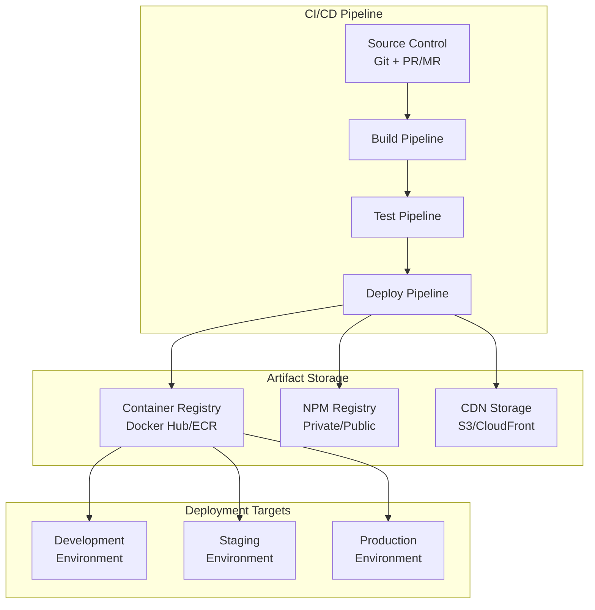

# Deployment Strategies for Frontend Microservices

This document outlines comprehensive deployment strategies for frontend microservices, covering CI/CD pipelines, containerization, versioning, and production deployment patterns.

## Table of Contents
1. [Deployment Architecture](#deployment-architecture)
2. [CI/CD Pipeline Design](#cicd-pipeline-design)
3. [Containerization Strategy](#containerization-strategy)
4. [Versioning & Release Management](#versioning--release-management)
5. [Environment Management](#environment-management)
6. [Rollback Strategies](#rollback-strategies)
7. [Blue-Green & Canary Deployments](#blue-green--canary-deployments)
8. [CDN & Edge Distribution](#cdn--edge-distribution)

## Deployment Architecture

### Overview

Frontend microservices require a deployment strategy that balances independence with coordination. Each service should be deployable independently while maintaining overall system coherence.



### Deployment Models

#### 1. Independent Deployment
Each microservice has its own deployment pipeline and can be released independently.

**Advantages:**
- True team autonomy
- Faster release cycles
- Isolated risk

**Challenges:**
- Integration complexity
- Version coordination
- Breaking changes management

#### 2. Orchestrated Deployment
Coordinated deployment of multiple services with dependency management.

**Advantages:**
- Better integration testing
- Coordinated releases
- Reduced breaking changes

**Challenges:**
- Slower release cycles
- Team dependencies
- Complex coordination

#### 3. Hybrid Approach
Critical services use orchestrated deployment, while others deploy independently.

## CI/CD Pipeline Design

### Pipeline Structure

```yaml
# .github/workflows/microservice-deploy.yml
name: Microservice Deployment

on:
  push:
    branches: [main, develop]
    paths: 
      - 'apps/header-service/**'
      - 'libs/shared/**'

jobs:
  detect-changes:
    runs-on: ubuntu-latest
    outputs:
      header-service: ${{ steps.changes.outputs.header-service }}
      shared-libs: ${{ steps.changes.outputs.shared-libs }}
    steps:
      - uses: actions/checkout@v3
      - uses: dorny/paths-filter@v2
        id: changes
        with:
          filters: |
            header-service:
              - 'apps/header-service/**'
            shared-libs:
              - 'libs/shared/**'

  build-and-test:
    needs: detect-changes
    if: needs.detect-changes.outputs.header-service == 'true'
    runs-on: ubuntu-latest
    steps:
      - uses: actions/checkout@v3
      - uses: actions/setup-node@v3
        with:
          node-version: '18'
          cache: 'npm'
      
      - name: Install dependencies
        run: npm ci
      
      - name: Lint
        run: npm run lint:header-service
      
      - name: Test
        run: npm run test:header-service -- --coverage
      
      - name: Build
        run: npm run build:header-service
        env:
          NODE_ENV: production
      
      - name: Upload artifacts
        uses: actions/upload-artifact@v3
        with:
          name: header-service-build
          path: dist/apps/header-service/

  security-scan:
    needs: build-and-test
    runs-on: ubuntu-latest
    steps:
      - uses: actions/checkout@v3
      - name: Run security audit
        run: npm audit --audit-level moderate
      
      - name: Run Snyk test
        uses: snyk/actions/node@master
        env:
          SNYK_TOKEN: ${{ secrets.SNYK_TOKEN }}

  deploy-staging:
    needs: [build-and-test, security-scan]
    if: github.ref == 'refs/heads/develop'
    runs-on: ubuntu-latest
    environment: staging
    steps:
      - name: Deploy to staging
        run: |
          # Deploy logic here
          echo "Deploying to staging environment"
      
      - name: Run smoke tests
        run: npm run test:e2e:staging

  deploy-production:
    needs: [build-and-test, security-scan]
    if: github.ref == 'refs/heads/main'
    runs-on: ubuntu-latest
    environment: production
    steps:
      - name: Deploy to production
        run: |
          # Production deployment logic
          echo "Deploying to production environment"
      
      - name: Run health checks
        run: npm run health-check:production
```

### Pipeline Components

#### 1. Change Detection
Automatically detect which services have changed to optimize build times.

```bash
# Using NX for affected services
npx nx affected:build --base=origin/main

# Custom change detection script
#!/bin/bash
CHANGED_APPS=$(git diff --name-only origin/main...HEAD | grep "^apps/" | cut -d'/' -f2 | sort -u)
for app in $CHANGED_APPS; do
  echo "Building $app"
  npm run build:$app
done
```

#### 2. Build Optimization
Implement efficient build strategies for faster deployments.

```javascript
// webpack.config.js - Module Federation with build optimization
const ModuleFederationPlugin = require('@module-federation/webpack');

module.exports = {
  mode: 'production',
  optimization: {
    splitChunks: {
      chunks: 'async',
      cacheGroups: {
        vendor: {
          test: /[\\/]node_modules[\\/]/,
          name: 'vendors',
          chunks: 'all',
        },
        shared: {
          name: 'shared',
          chunks: 'all',
          enforce: true,
          test: /[\\/]libs[\\/]shared[\\/]/,
        },
      },
    },
  },
  plugins: [
    new ModuleFederationPlugin({
      name: 'headerService',
      filename: 'remoteEntry.js',
      exposes: {
        './HeaderComponent': './src/HeaderComponent',
      },
      shared: {
        react: { singleton: true, eager: true },
        'react-dom': { singleton: true, eager: true },
      },
    }),
  ],
};
```

#### 3. Testing Strategy
Comprehensive testing at each pipeline stage.

```json
{
  "scripts": {
    "test:unit": "jest --coverage",
    "test:integration": "cypress run --spec 'cypress/integration/**/*'",
    "test:contract": "pact-broker can-i-deploy --pacticipant header-service",
    "test:e2e": "playwright test",
    "test:visual": "chromatic --project-token=$CHROMATIC_TOKEN"
  }
}
```

## Containerization Strategy

### Dockerfile Best Practices

```dockerfile
# Multi-stage build for production optimization
FROM node:18-alpine AS builder

WORKDIR /app

# Copy package files
COPY package*.json ./
COPY apps/header-service/package*.json ./apps/header-service/

# Install dependencies
RUN npm ci --only=production && npm cache clean --force

# Copy source code
COPY apps/header-service/ ./apps/header-service/
COPY libs/shared/ ./libs/shared/

# Build the application
RUN npm run build:header-service

# Production stage
FROM nginx:alpine AS production

# Copy custom nginx config
COPY apps/header-service/nginx.conf /etc/nginx/conf.d/default.conf

# Copy built application
COPY --from=builder /app/dist/apps/header-service /usr/share/nginx/html

# Add health check
HEALTHCHECK --interval=30s --timeout=3s --start-period=5s --retries=3 \
  CMD curl -f http://localhost/ || exit 1

EXPOSE 80

CMD ["nginx", "-g", "daemon off;"]
```

### Kubernetes Deployment

```yaml
# k8s/header-service-deployment.yml
apiVersion: apps/v1
kind: Deployment
metadata:
  name: header-service
  labels:
    app: header-service
    version: v1.2.3
spec:
  replicas: 3
  selector:
    matchLabels:
      app: header-service
  template:
    metadata:
      labels:
        app: header-service
        version: v1.2.3
    spec:
      containers:
      - name: header-service
        image: your-registry/header-service:1.2.3
        ports:
        - containerPort: 80
        env:
        - name: NODE_ENV
          value: "production"
        - name: API_URL
          valueFrom:
            configMapKeyRef:
              name: app-config
              key: api-url
        resources:
          requests:
            memory: "128Mi"
            cpu: "100m"
          limits:
            memory: "256Mi"
            cpu: "200m"
        livenessProbe:
          httpGet:
            path: /health
            port: 80
          initialDelaySeconds: 30
          periodSeconds: 10
        readinessProbe:
          httpGet:
            path: /ready
            port: 80
          initialDelaySeconds: 5
          periodSeconds: 5
---
apiVersion: v1
kind: Service
metadata:
  name: header-service
spec:
  selector:
    app: header-service
  ports:
    - protocol: TCP
      port: 80
      targetPort: 80
  type: ClusterIP
```

## Versioning & Release Management

### Semantic Versioning Strategy

```json
{
  "name": "@company/header-service",
  "version": "1.2.3",
  "scripts": {
    "version:patch": "npm version patch",
    "version:minor": "npm version minor", 
    "version:major": "npm version major",
    "release": "semantic-release"
  },
  "release": {
    "branches": ["main"],
    "plugins": [
      "@semantic-release/commit-analyzer",
      "@semantic-release/release-notes-generator",
      "@semantic-release/changelog",
      "@semantic-release/npm",
      "@semantic-release/github"
    ]
  }
}
```

### Module Federation Version Management

```javascript
// Dynamic version loading with fallbacks
const loadRemoteModule = async (scope, module, version = 'latest') => {
  try {
    // Try specific version first
    const specificVersion = await import(`${scope}@${version}/${module}`);
    return specificVersion;
  } catch (error) {
    console.warn(`Failed to load ${scope}@${version}, falling back to latest`);
    // Fallback to latest stable version
    return import(`${scope}@latest/${module}`);
  }
};

// Version compatibility matrix
const COMPATIBILITY_MATRIX = {
  'header-service': {
    '1.x': ['shell-app@2.x', 'shell-app@3.x'],
    '2.x': ['shell-app@3.x', 'shell-app@4.x']
  }
};
```

### Release Coordination

```bash
#!/bin/bash
# release-coordinator.sh
set -e

echo "Starting coordinated release process..."

# Check all services are ready for release
services=("header-service" "product-catalog" "shopping-cart")

for service in "${services[@]}"; do
  echo "Checking $service readiness..."
  
  # Run health checks
  npm run health-check:$service
  
  # Verify tests pass
  npm run test:$service
  
  # Check for breaking changes
  npm run breaking-change-check:$service
done

echo "All services ready. Proceeding with release..."

# Deploy in dependency order
npm run deploy:shared-libs
sleep 30

npm run deploy:header-service
sleep 15

npm run deploy:product-catalog
sleep 15

npm run deploy:shopping-cart

echo "Coordinated release completed successfully!"
```

## Environment Management

### Environment Configuration

```javascript
// config/environments.js
const environments = {
  development: {
    apiUrl: 'http://localhost:3001',
    moduleUrls: {
      headerService: 'http://localhost:4001/remoteEntry.js',
      productCatalog: 'http://localhost:4002/remoteEntry.js',
    },
    logLevel: 'debug',
    enableDevTools: true,
  },
  
  staging: {
    apiUrl: 'https://api-staging.company.com',
    moduleUrls: {
      headerService: 'https://cdn-staging.company.com/header-service/remoteEntry.js',
      productCatalog: 'https://cdn-staging.company.com/product-catalog/remoteEntry.js',
    },
    logLevel: 'info',
    enableDevTools: false,
  },
  
  production: {
    apiUrl: 'https://api.company.com',
    moduleUrls: {
      headerService: 'https://cdn.company.com/header-service/remoteEntry.js',
      productCatalog: 'https://cdn.company.com/product-catalog/remoteEntry.js',
    },
    logLevel: 'error',
    enableDevTools: false,
    enableAnalytics: true,
  },
};

export const getConfig = () => {
  const env = process.env.NODE_ENV || 'development';
  return environments[env];
};
```

### Infrastructure as Code

```yaml
# terraform/main.tf for AWS deployment
provider "aws" {
  region = var.aws_region
}

# S3 bucket for static assets
resource "aws_s3_bucket" "frontend_assets" {
  bucket = "${var.project_name}-frontend-assets-${var.environment}"
}

# CloudFront distribution
resource "aws_cloudfront_distribution" "frontend_cdn" {
  origin {
    domain_name = aws_s3_bucket.frontend_assets.bucket_regional_domain_name
    origin_id   = "S3-${aws_s3_bucket.frontend_assets.id}"

    s3_origin_config {
      origin_access_identity = aws_cloudfront_origin_access_identity.oai.cloudfront_access_identity_path
    }
  }

  enabled             = true
  default_root_object = "index.html"

  default_cache_behavior {
    allowed_methods  = ["DELETE", "GET", "HEAD", "OPTIONS", "PATCH", "POST", "PUT"]
    cached_methods   = ["GET", "HEAD"]
    target_origin_id = "S3-${aws_s3_bucket.frontend_assets.id}"

    forwarded_values {
      query_string = false
      cookies {
        forward = "none"
      }
    }

    viewer_protocol_policy = "redirect-to-https"
  }

  # Cache behavior for micro frontend modules
  ordered_cache_behavior {
    path_pattern     = "/modules/*"
    allowed_methods  = ["GET", "HEAD", "OPTIONS"]
    cached_methods   = ["GET", "HEAD"]
    target_origin_id = "S3-${aws_s3_bucket.frontend_assets.id}"

    forwarded_values {
      query_string = false
      headers      = ["Origin"]
      cookies {
        forward = "none"
      }
    }

    min_ttl                = 0
    default_ttl            = 86400
    max_ttl                = 31536000
    compress               = true
    viewer_protocol_policy = "redirect-to-https"
  }

  restrictions {
    geo_restriction {
      restriction_type = "none"
    }
  }

  tags = {
    Name        = "${var.project_name}-cdn-${var.environment}"
    Environment = var.environment
  }

  viewer_certificate {
    cloudfront_default_certificate = true
  }
}
```

## Rollback Strategies

### Automated Rollback Triggers

```javascript
// deployment/rollback-monitor.js
class RollbackMonitor {
  constructor(config) {
    this.config = config;
    this.metrics = new MetricsCollector();
    this.alerting = new AlertingService();
  }

  async monitorDeployment(deploymentId) {
    const startTime = Date.now();
    const timeout = this.config.monitoringWindow || 300000; // 5 minutes
    
    while (Date.now() - startTime < timeout) {
      const healthCheck = await this.performHealthCheck();
      const errorRate = await this.getErrorRate();
      const responseTime = await this.getAverageResponseTime();
      
      if (this.shouldRollback(healthCheck, errorRate, responseTime)) {
        await this.initiateRollback(deploymentId);
        return;
      }
      
      await this.sleep(10000); // Check every 10 seconds
    }
  }

  shouldRollback(healthCheck, errorRate, responseTime) {
    return (
      !healthCheck.healthy ||
      errorRate > this.config.maxErrorRate ||
      responseTime > this.config.maxResponseTime
    );
  }

  async initiateRollback(deploymentId) {
    console.log(`Initiating rollback for deployment ${deploymentId}`);
    
    // Get previous stable version
    const previousVersion = await this.getPreviousStableVersion();
    
    // Rollback deployment
    await this.deployVersion(previousVersion);
    
    // Send alerts
    await this.alerting.sendCriticalAlert({
      message: `Automatic rollback initiated for deployment ${deploymentId}`,
      version: previousVersion,
      timestamp: new Date().toISOString()
    });
  }
}
```

### Manual Rollback Process

```bash
#!/bin/bash
# scripts/rollback.sh

SERVICE_NAME=$1
TARGET_VERSION=$2

if [ -z "$SERVICE_NAME" ] || [ -z "$TARGET_VERSION" ]; then
    echo "Usage: ./rollback.sh <service-name> <target-version>"
    exit 1
fi

echo "Rolling back $SERVICE_NAME to version $TARGET_VERSION"

# Update Kubernetes deployment
kubectl set image deployment/$SERVICE_NAME $SERVICE_NAME=your-registry/$SERVICE_NAME:$TARGET_VERSION

# Wait for rollout to complete
kubectl rollout status deployment/$SERVICE_NAME --timeout=300s

# Verify deployment
kubectl get pods -l app=$SERVICE_NAME

echo "Rollback completed for $SERVICE_NAME"

# Update CDN if needed
if [ "$UPDATE_CDN" = "true" ]; then
    echo "Updating CDN configuration..."
    aws s3 sync ./dist/$SERVICE_NAME s3://your-cdn-bucket/$SERVICE_NAME/$TARGET_VERSION/
    aws cloudfront create-invalidation --distribution-id $CLOUDFRONT_DISTRIBUTION_ID --paths "/$SERVICE_NAME/*"
fi
```

## Blue-Green & Canary Deployments

### Blue-Green Deployment

```yaml
# Blue-Green deployment with Kubernetes
apiVersion: argoproj.io/v1alpha1
kind: Rollout
metadata:
  name: header-service
spec:
  replicas: 5
  strategy:
    blueGreen:
      activeService: header-service-active
      previewService: header-service-preview
      autoPromotionEnabled: false
      scaleDownDelaySeconds: 30
  selector:
    matchLabels:
      app: header-service
  template:
    metadata:
      labels:
        app: header-service
    spec:
      containers:
      - name: header-service
        image: your-registry/header-service:latest
        ports:
        - containerPort: 80
```

### Canary Deployment

```javascript
// Load balancer configuration for canary deployment
const canaryConfig = {
  routes: [
    {
      match: { prefix: "/" },
      route: {
        weightedClusters: {
          clusters: [
            {
              name: "header-service-stable",
              weight: 90
            },
            {
              name: "header-service-canary", 
              weight: 10
            }
          ]
        }
      }
    }
  ]
};

// Gradual traffic shifting
const trafficShiftingSchedule = [
  { version: 'canary', percentage: 5, duration: '10m' },
  { version: 'canary', percentage: 25, duration: '20m' },
  { version: 'canary', percentage: 50, duration: '30m' },
  { version: 'canary', percentage: 100, duration: 'stable' }
];
```

## CDN & Edge Distribution

### CDN Configuration

```javascript
// CDN optimization for micro frontends
const cdnConfig = {
  origins: [
    {
      domainName: 'your-app.s3.amazonaws.com',
      originPath: '/production',
      customHeaders: {
        'X-Micro-Frontend': 'true'
      }
    }
  ],
  
  cacheBehaviors: [
    {
      pathPattern: '/static/*',
      ttl: 31536000, // 1 year for static assets
      compress: true,
      headers: ['Accept-Encoding']
    },
    {
      pathPattern: '/modules/*/remoteEntry.js',
      ttl: 3600, // 1 hour for remote entries
      compress: true,
      headers: ['Origin', 'Access-Control-Request-Method']
    },
    {
      pathPattern: '/modules/*/*.js',
      ttl: 86400, // 1 day for module chunks
      compress: true
    }
  ],

  customErrorPages: [
    {
      errorCode: 404,
      responsePagePath: '/404.html',
      responseCode: 404
    }
  ]
};
```

### Edge Computing Integration

```javascript
// CloudFlare Worker for dynamic module loading
export default {
  async fetch(request, env, ctx) {
    const url = new URL(request.url);
    
    // Handle module federation requests
    if (url.pathname.startsWith('/modules/')) {
      const [, , serviceName, ...rest] = url.pathname.split('/');
      
      // Route to appropriate service version
      const version = await env.KV.get(`${serviceName}:version`) || 'latest';
      const targetUrl = `https://cdn.company.com/${serviceName}/${version}/${rest.join('/')}`;
      
      // Add CORS headers for cross-origin requests
      const response = await fetch(targetUrl);
      const newResponse = new Response(response.body, response);
      
      newResponse.headers.set('Access-Control-Allow-Origin', '*');
      newResponse.headers.set('Access-Control-Allow-Methods', 'GET, POST, OPTIONS');
      newResponse.headers.set('Cache-Control', 'public, max-age=3600');
      
      return newResponse;
    }
    
    return fetch(request);
  }
};
```

## Monitoring & Observability

### Deployment Metrics

```javascript
// deployment/metrics.js
class DeploymentMetrics {
  constructor() {
    this.prometheus = new PrometheusMetrics();
  }

  trackDeployment(serviceName, version, environment) {
    this.prometheus.increment('deployments_total', {
      service: serviceName,
      version,
      environment
    });
    
    this.prometheus.gauge('deployment_timestamp', Date.now(), {
      service: serviceName,
      version,
      environment
    });
  }

  trackDeploymentDuration(serviceName, duration) {
    this.prometheus.histogram('deployment_duration_seconds', duration, {
      service: serviceName
    });
  }

  trackRollback(serviceName, fromVersion, toVersion, reason) {
    this.prometheus.increment('rollbacks_total', {
      service: serviceName,
      from_version: fromVersion,
      to_version: toVersion,
      reason
    });
  }
}
```

## Best Practices Summary

### Do's
- Implement comprehensive health checks at every stage
- Use feature flags for safe deployments
- Maintain deployment documentation and runbooks
- Practice disaster recovery scenarios regularly
- Monitor key metrics during and after deployments
- Use infrastructure as code for consistency
- Implement proper secret management

### Don'ts
- Deploy all services simultaneously without testing
- Skip security scans in the pipeline  
- Ignore performance regression testing
- Deploy without proper rollback plans
- Use production data in testing environments
- Hardcode configuration values
- Skip dependency version validation

### Performance Considerations
- Minimize bundle sizes through proper code splitting
- Use CDN effectively for static assets
- Implement proper caching strategies
- Monitor Core Web Vitals during deployments
- Consider edge computing for dynamic content
- Optimize container images for faster startup times

This comprehensive deployment strategy ensures reliable, scalable, and maintainable deployments for frontend microservices architecture.


- [Next Performance monitoring](07-performance-monitoring.md)