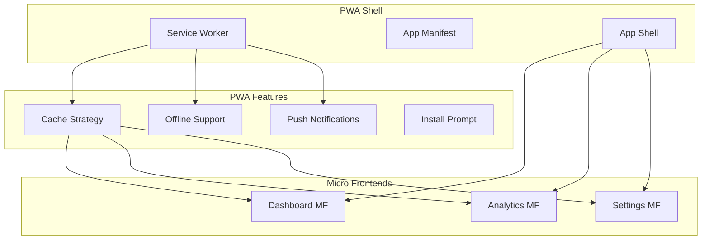
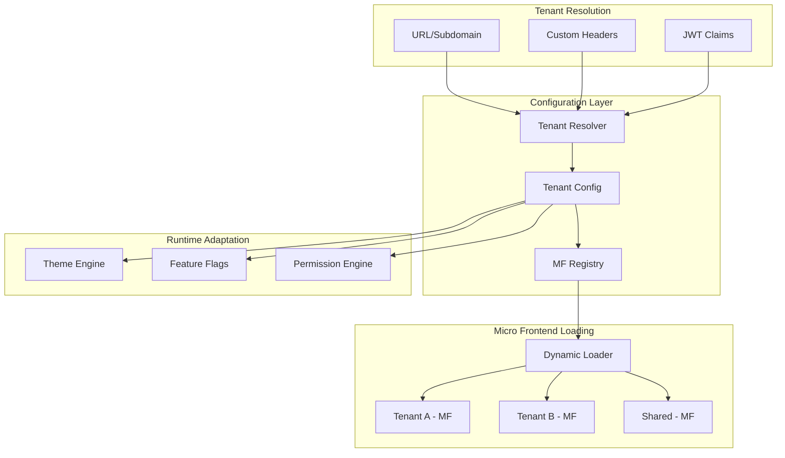
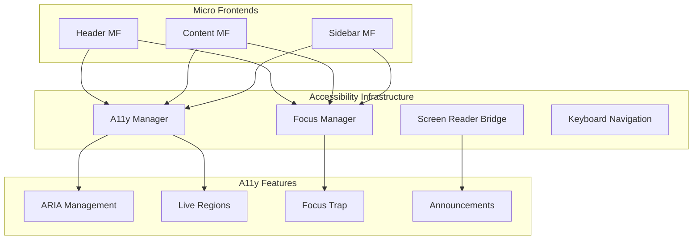
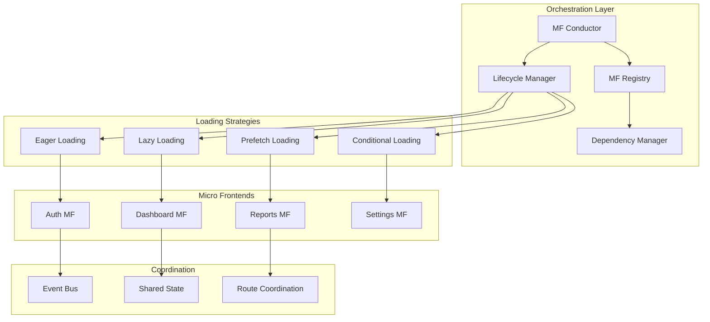

# 11. Advanced Patterns

This section covers sophisticated architectural patterns and implementation strategies for complex frontend microservice scenarios.

## Table of Contents

- [Progressive Web App (PWA) Integration](#progressive-web-app-pwa-integration)
- [Multi-Tenancy Architecture](#multi-tenancy-architecture)
- [Accessibility-First Design](#accessibility-first-design)
- [Micro Frontend Orchestration](#micro-frontend-orchestration)
- [Advanced State Management Patterns](#advanced-state-management-patterns)
- [Event-Driven Architecture](#event-driven-architecture)
- [Federated Design Systems](#federated-design-systems)
- [Advanced Routing Patterns](#advanced-routing-patterns)
- [Performance Optimization Patterns](#performance-optimization-patterns)

## Progressive Web App (PWA) Integration

### Architecture Overview



### Service Worker Strategy for Micro Frontends

```javascript
// sw-strategy.js
class MicroFrontendCacheStrategy {
  constructor() {
    this.strategies = new Map();
    this.setupCacheStrategies();
  }

  setupCacheStrategies() {
    // Shell application - Cache First
    this.strategies.set('shell', {
      strategy: 'CacheFirst',
      maxEntries: 50,
      maxAgeSeconds: 86400 * 30 // 30 days
    });

    // Micro frontends - Stale While Revalidate
    this.strategies.set('microfrontends', {
      strategy: 'StaleWhileRevalidate',
      maxEntries: 100,
      maxAgeSeconds: 86400 * 7 // 7 days
    });

    // API calls - Network First
    this.strategies.set('api', {
      strategy: 'NetworkFirst',
      maxEntries: 200,
      networkTimeoutSeconds: 3
    });
  }

  async handleRequest(request) {
    const url = new URL(request.url);
    const strategy = this.getStrategy(url);
    return this.executeStrategy(strategy, request);
  }

  getStrategy(url) {
    if (url.pathname.includes('/mf/')) {
      return this.strategies.get('microfrontends');
    }
    if (url.pathname.includes('/api/')) {
      return this.strategies.get('api');
    }
    return this.strategies.get('shell');
  }
}
```

### Offline-First Micro Frontend Pattern

```javascript
// offline-mf-pattern.js
class OfflineMicroFrontend {
  constructor(config) {
    this.config = config;
    this.fallbackContent = new Map();
    this.setupOfflineHandling();
  }

  setupOfflineHandling() {
    window.addEventListener('online', this.handleOnline.bind(this));
    window.addEventListener('offline', this.handleOffline.bind(this));
  }

  async loadMicroFrontend(name, fallback = true) {
    try {
      const module = await this.loadFromNetwork(name);
      this.cacheMicroFrontend(name, module);
      return module;
    } catch (error) {
      if (fallback) {
        return this.loadFromCache(name) || this.loadFallbackContent(name);
      }
      throw error;
    }
  }

  loadFallbackContent(name) {
    return {
      render: () => `
        <div class="offline-fallback">
          <h3>Content Unavailable</h3>
          <p>The ${name} service is currently unavailable offline.</p>
          <button onclick="window.location.reload()">Retry</button>
        </div>
      `
    };
  }
}
```

## Multi-Tenancy Architecture

### Tenant-Aware Micro Frontend Loading



### Tenant-Specific Configuration

```javascript
// tenant-config.js
class TenantConfigManager {
  constructor() {
    this.configCache = new Map();
    this.defaultConfig = this.loadDefaultConfig();
  }

  async resolveTenant(request) {
    const subdomain = this.extractSubdomain(request);
    const customHeader = request.headers.get('X-Tenant-ID');
    const tokenClaims = this.extractTokenClaims(request);

    return subdomain || customHeader || tokenClaims.tenantId || 'default';
  }

  async getTenantConfig(tenantId) {
    if (this.configCache.has(tenantId)) {
      return this.configCache.get(tenantId);
    }

    const config = await this.fetchTenantConfig(tenantId);
    const mergedConfig = this.mergeWithDefaults(config);
    
    this.configCache.set(tenantId, mergedConfig);
    return mergedConfig;
  }

  mergeWithDefaults(tenantConfig) {
    return {
      ...this.defaultConfig,
      ...tenantConfig,
      microFrontends: {
        ...this.defaultConfig.microFrontends,
        ...tenantConfig.microFrontends
      },
      theme: {
        ...this.defaultConfig.theme,
        ...tenantConfig.theme
      },
      features: {
        ...this.defaultConfig.features,
        ...tenantConfig.features
      }
    };
  }
}

// tenant-aware-loader.js
class TenantAwareMicroFrontendLoader {
  constructor(configManager) {
    this.configManager = configManager;
    this.loadedMicroFrontends = new Map();
  }

  async loadMicroFrontend(name, tenantId) {
    const config = await this.configManager.getTenantConfig(tenantId);
    const mfConfig = config.microFrontends[name];

    if (!mfConfig || !mfConfig.enabled) {
      throw new Error(`Micro frontend ${name} not available for tenant ${tenantId}`);
    }

    const cacheKey = `${tenantId}-${name}-${mfConfig.version}`;
    
    if (this.loadedMicroFrontends.has(cacheKey)) {
      return this.loadedMicroFrontends.get(cacheKey);
    }

    const module = await this.dynamicImport(mfConfig.url);
    const wrappedModule = this.wrapWithTenantContext(module, config);
    
    this.loadedMicroFrontends.set(cacheKey, wrappedModule);
    return wrappedModule;
  }

  wrapWithTenantContext(module, tenantConfig) {
    return {
      ...module,
      render: (container, props) => {
        const contextProps = {
          ...props,
          tenantConfig,
          theme: tenantConfig.theme,
          permissions: tenantConfig.permissions
        };
        return module.render(container, contextProps);
      }
    };
  }
}
```

## Accessibility-First Design

### Accessible Micro Frontend Architecture



### Accessibility Manager Implementation

```javascript
// a11y-manager.js
class AccessibilityManager {
  constructor() {
    this.microFrontends = new Map();
    this.focusManager = new FocusManager();
    this.announcer = new LiveRegionAnnouncer();
    this.setupGlobalA11yFeatures();
  }

  registerMicroFrontend(name, element, config = {}) {
    const a11yConfig = {
      hasSkipLink: config.hasSkipLink || false,
      landmark: config.landmark || 'region',
      label: config.label || name,
      describedBy: config.describedBy,
      focusable: config.focusable || true,
      ...config
    };

    this.microFrontends.set(name, {
      element,
      config: a11yConfig
    });

    this.setupMicroFrontendA11y(element, a11yConfig);
  }

  setupMicroFrontendA11y(element, config) {
    // Set ARIA attributes
    element.setAttribute('role', config.landmark);
    element.setAttribute('aria-label', config.label);
    
    if (config.describedBy) {
      element.setAttribute('aria-describedby', config.describedBy);
    }

    // Add skip link if configured
    if (config.hasSkipLink) {
      this.addSkipLink(element, config.label);
    }

    // Setup focus management
    if (config.focusable) {
      this.focusManager.registerFocusableRegion(element);
    }

    // Setup keyboard navigation
    this.setupKeyboardNavigation(element);
  }

  addSkipLink(element, label) {
    const skipLink = document.createElement('a');
    skipLink.href = `#${element.id}`;
    skipLink.className = 'skip-link';
    skipLink.textContent = `Skip to ${label}`;
    skipLink.addEventListener('click', (e) => {
      e.preventDefault();
      this.focusManager.focusElement(element);
    });

    const skipContainer = document.querySelector('.skip-links') || this.createSkipContainer();
    skipContainer.appendChild(skipLink);
  }

  announceRouteChange(routeName, isError = false) {
    const message = isError 
      ? `Navigation failed. Please try again.`
      : `Navigated to ${routeName}`;
    
    this.announcer.announce(message, isError ? 'assertive' : 'polite');
  }

  setupKeyboardNavigation(element) {
    element.addEventListener('keydown', (e) => {
      switch (e.key) {
        case 'F6':
          e.preventDefault();
          this.focusManager.moveToNextRegion();
          break;
        case 'Escape':
          this.focusManager.moveFocusToMain();
          break;
      }
    });
  }
}

// focus-manager.js
class FocusManager {
  constructor() {
    this.focusableRegions = [];
    this.currentRegionIndex = -1;
    this.focusHistory = [];
  }

  registerFocusableRegion(element) {
    if (!element.id) {
      element.id = `region-${this.focusableRegions.length}`;
    }

    this.focusableRegions.push({
      element,
      id: element.id,
      focusable: this.getFocusableElements(element)
    });
  }

  moveToNextRegion() {
    this.currentRegionIndex = (this.currentRegionIndex + 1) % this.focusableRegions.length;
    const region = this.focusableRegions[this.currentRegionIndex];
    this.focusElement(region.element);
  }

  focusElement(element) {
    if (element.tabIndex === -1) {
      element.tabIndex = 0;
    }
    element.focus();
    this.focusHistory.push(element);
  }

  getFocusableElements(container) {
    const focusableSelector = [
      'button:not([disabled])',
      'input:not([disabled])',
      'select:not([disabled])',
      'textarea:not([disabled])',
      'a[href]',
      '[tabindex]:not([tabindex="-1"])'
    ].join(',');

    return Array.from(container.querySelectorAll(focusableSelector));
  }
}

// live-region-announcer.js
class LiveRegionAnnouncer {
  constructor() {
    this.politeRegion = this.createLiveRegion('polite');
    this.assertiveRegion = this.createLiveRegion('assertive');
  }

  createLiveRegion(politeness) {
    const region = document.createElement('div');
    region.setAttribute('aria-live', politeness);
    region.setAttribute('aria-atomic', 'true');
    region.className = 'sr-only';
    document.body.appendChild(region);
    return region;
  }

  announce(message, politeness = 'polite') {
    const region = politeness === 'assertive' ? this.assertiveRegion : this.politeRegion;
    
    // Clear and set message
    region.textContent = '';
    setTimeout(() => {
      region.textContent = message;
    }, 100);

    // Clear after announcement
    setTimeout(() => {
      region.textContent = '';
    }, 1000);
  }
}
```

## Micro Frontend Orchestration

### Advanced Orchestration Patterns



### Sophisticated Orchestration Implementation

```javascript
// mf-conductor.js
class MicroFrontendConductor {
  constructor(config) {
    this.config = config;
    this.registry = new MicroFrontendRegistry();
    this.lifecycle = new LifecycleManager();
    this.dependencyManager = new DependencyManager();
    this.eventBus = new EventBus();
    this.loadingStrategies = new Map();
    
    this.setupLoadingStrategies();
    this.setupOrchestration();
  }

  setupLoadingStrategies() {
    this.loadingStrategies.set('eager', new EagerLoadingStrategy());
    this.loadingStrategies.set('lazy', new LazyLoadingStrategy());
    this.loadingStrategies.set('prefetch', new PrefetchLoadingStrategy());
    this.loadingStrategies.set('conditional', new ConditionalLoadingStrategy());
  }

  async orchestrate() {
    // 1. Resolve dependencies
    const dependencyGraph = await this.dependencyManager.buildDependencyGraph();
    
    // 2. Load micro frontends in correct order
    const loadingPlan = this.createLoadingPlan(dependencyGraph);
    
    // 3. Execute loading plan
    for (const phase of loadingPlan) {
      await this.executeLoadingPhase(phase);
    }

    // 4. Setup inter-MF communication
    this.setupCommunication();
    
    // 5. Start lifecycle monitoring
    this.lifecycle.startMonitoring();
  }

  createLoadingPlan(dependencyGraph) {
    const plan = [];
    const visited = new Set();
    
    // Group by loading strategy and dependencies
    const phases = new Map();
    
    for (const mfConfig of this.config.microFrontends) {
      const dependencies = dependencyGraph.get(mfConfig.name) || [];
      const phase = this.calculatePhase(dependencies, mfConfig.loadingStrategy);
      
      if (!phases.has(phase)) {
        phases.set(phase, []);
      }
      phases.get(phase).push(mfConfig);
    }

    // Sort phases and create execution plan
    const sortedPhases = Array.from(phases.keys()).sort((a, b) => a - b);
    
    for (const phaseNumber of sortedPhases) {
      plan.push({
        phase: phaseNumber,
        microFrontends: phases.get(phaseNumber)
      });
    }

    return plan;
  }

  async executeLoadingPhase(phase) {
    const promises = phase.microFrontends.map(async (mfConfig) => {
      const strategy = this.loadingStrategies.get(mfConfig.loadingStrategy);
      
      try {
        const loadResult = await strategy.load(mfConfig);
        await this.lifecycle.register(mfConfig.name, loadResult);
        
        this.eventBus.emit('mf:loaded', {
          name: mfConfig.name,
          phase: phase.phase
        });
        
        return loadResult;
      } catch (error) {
        this.eventBus.emit('mf:load-error', {
          name: mfConfig.name,
          error,
          phase: phase.phase
        });
        throw error;
      }
    });

    await Promise.all(promises);
  }
}

// loading-strategies.js
class LoadingStrategy {
  async load(config) {
    throw new Error('Must implement load method');
  }
}

class EagerLoadingStrategy extends LoadingStrategy {
  async load(config) {
    const module = await import(config.url);
    return {
      module,
      strategy: 'eager',
      loadedAt: Date.now()
    };
  }
}

class LazyLoadingStrategy extends LoadingStrategy {
  constructor() {
    super();
    this.intersectionObserver = this.setupIntersectionObserver();
  }

  async load(config) {
    return new Promise((resolve) => {
      const placeholder = document.querySelector(config.placeholder);
      
      if (placeholder) {
        this.intersectionObserver.observe(placeholder);
        
        placeholder.addEventListener('mf:load-requested', async () => {
          const module = await import(config.url);
          resolve({
            module,
            strategy: 'lazy',
            loadedAt: Date.now()
          });
        });
      }
    });
  }

  setupIntersectionObserver() {
    return new IntersectionObserver((entries) => {
      entries.forEach((entry) => {
        if (entry.isIntersecting) {
          entry.target.dispatchEvent(new CustomEvent('mf:load-requested'));
          this.intersectionObserver.unobserve(entry.target);
        }
      });
    });
  }
}

class ConditionalLoadingStrategy extends LoadingStrategy {
  async load(config) {
    const conditions = config.conditions || [];
    
    for (const condition of conditions) {
      const result = await this.evaluateCondition(condition);
      if (!result) {
        throw new Error(`Condition not met: ${condition.type}`);
      }
    }

    const module = await import(config.url);
    return {
      module,
      strategy: 'conditional',
      loadedAt: Date.now(),
      conditions: conditions.map(c => c.type)
    };
  }

  async evaluateCondition(condition) {
    switch (condition.type) {
      case 'feature-flag':
        return this.checkFeatureFlag(condition.flag);
      case 'user-permission':
        return this.checkUserPermission(condition.permission);
      case 'device-capability':
        return this.checkDeviceCapability(condition.capability);
      case 'network-condition':
        return this.checkNetworkCondition(condition.network);
      default:
        return true;
    }
  }
}
```

## Event-Driven Architecture

### Advanced Event Bus Implementation

```javascript
// advanced-event-bus.js
class AdvancedEventBus {
  constructor() {
    this.subscribers = new Map();
    this.eventHistory = [];
    this.middleware = [];
    this.eventSchemas = new Map();
    this.retryPolicies = new Map();
  }

  // Schema validation for events
  registerEventSchema(eventType, schema) {
    this.eventSchemas.set(eventType, schema);
  }

  // Middleware for event processing
  use(middleware) {
    this.middleware.push(middleware);
  }

  async emit(eventType, payload, options = {}) {
    const event = {
      type: eventType,
      payload,
      timestamp: Date.now(),
      id: this.generateEventId(),
      source: options.source || 'unknown',
      version: options.version || '1.0.0'
    };

    // Validate against schema if available
    if (this.eventSchemas.has(eventType)) {
      this.validateEvent(event);
    }

    // Process through middleware
    const processedEvent = await this.processMiddleware(event);

    // Store in history
    this.eventHistory.push(processedEvent);
    
    // Deliver to subscribers
    await this.deliverEvent(processedEvent, options);

    return processedEvent.id;
  }

  async deliverEvent(event, options) {
    const subscribers = this.subscribers.get(event.type) || [];
    
    const deliveryPromises = subscribers.map(async (subscriber) => {
      try {
        await this.deliverToSubscriber(subscriber, event, options);
      } catch (error) {
        await this.handleDeliveryError(subscriber, event, error, options);
      }
    });

    await Promise.allSettled(deliveryPromises);
  }

  async deliverToSubscriber(subscriber, event, options) {
    const maxRetries = subscriber.retryPolicy?.maxRetries || 3;
    let attempt = 0;

    while (attempt <= maxRetries) {
      try {
        await subscriber.handler(event.payload, event);
        return;
      } catch (error) {
        attempt++;
        if (attempt > maxRetries) {
          throw error;
        }
        
        const delay = this.calculateRetryDelay(subscriber.retryPolicy, attempt);
        await this.sleep(delay);
      }
    }
  }

  // Event replay for new micro frontends
  replayEvents(subscriber, filter = {}) {
    const relevantEvents = this.eventHistory.filter(event => {
      if (filter.since && event.timestamp < filter.since) return false;
      if (filter.types && !filter.types.includes(event.type)) return false;
      if (filter.source && event.source !== filter.source) return false;
      return true;
    });

    return relevantEvents.map(event => 
      subscriber.handler(event.payload, event)
    );
  }
}

// Event-driven micro frontend coordination
class EventDrivenCoordinator {
  constructor(eventBus) {
    this.eventBus = eventBus;
    this.setupEventSchemas();
    this.setupMiddleware();
  }

  setupEventSchemas() {
    // User events
    this.eventBus.registerEventSchema('user:authenticated', {
      type: 'object',
      properties: {
        userId: { type: 'string' },
        permissions: { type: 'array' },
        sessionId: { type: 'string' }
      },
      required: ['userId', 'sessionId']
    });

    // Navigation events
    this.eventBus.registerEventSchema('navigation:changed', {
      type: 'object',
      properties: {
        from: { type: 'string' },
        to: { type: 'string' },
        params: { type: 'object' }
      },
      required: ['to']
    });
  }

  setupMiddleware() {
    // Logging middleware
    this.eventBus.use(async (event, next) => {
      console.log(`[Event] ${event.type}`, event);
      await next();
    });

    // Performance monitoring
    this.eventBus.use(async (event, next) => {
      const start = performance.now();
      await next();
      const duration = performance.now() - start;
      
      if (duration > 100) {
        console.warn(`Slow event processing: ${event.type} took ${duration}ms`);
      }
    });
  }
}
```

This advanced patterns documentation covers sophisticated implementations for PWA integration, multi-tenancy, accessibility, orchestration, and event-driven architecture. Each pattern includes practical code examples and architectural diagrams to guide implementation.

Would you like me to continue with the Best Practices document (#12)?

- [Next Frontend Development Best Practises](12-best-practises.md)