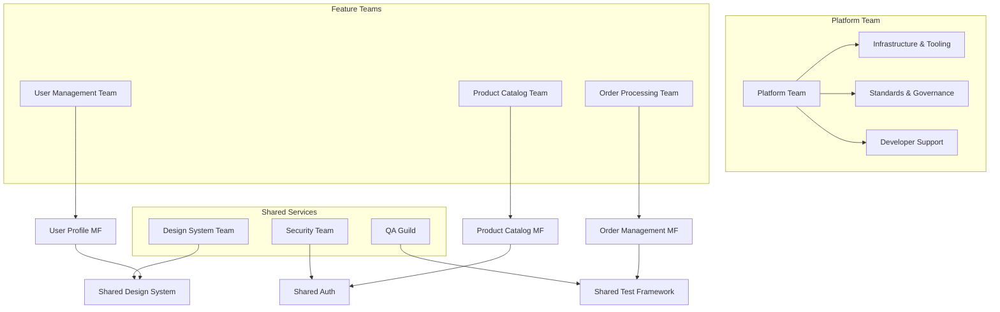
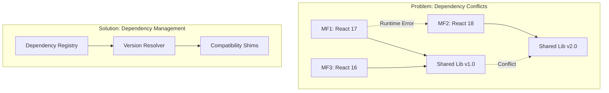
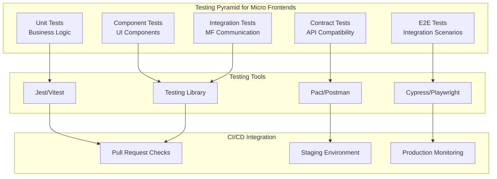

# 12. Best Practices

This comprehensive guide outlines proven best practices, common pitfalls, and strategic solutions for implementing successful frontend microservice architectures.

## Table of Contents

- [Architectural Design Principles](#architectural-design-principles)
- [Development Guidelines](#development-guidelines)
- [Team Organization & Governance](#team-organization--governance)
- [Performance Best Practices](#performance-best-practices)
- [Security Guidelines](#security-guidelines)
- [Monitoring & Observability](#monitoring--observability)
- [Common Pitfalls & Solutions](#common-pitfalls--solutions)
- [Migration Strategies](#migration-strategies)
- [Quality Assurance](#quality-assurance)

## Architectural Design Principles

### 1. Domain-Driven Design (DDD) Alignment

```javascript
// comprehensive-testing-strategy.js
class MicroFrontendTestingStrategy {
  constructor() {
    this.testSuites = new Map();
    this.contractTests = new Map();
    this.e2eScenarios = [];
  }

  // Unit Testing for Micro Frontends
  setupUnitTests(microFrontend) {
    return {
      framework: 'jest',
      config: {
        testMatch: ['**/__tests__/**/*.test.js'],
        collectCoverageFrom: [
          'src/**/*.{js,jsx,ts,tsx}',
          '!src/**/*.d.ts',
          '!src/**/index.{js,ts}'
        ],
        coverageThreshold: {
          global: {
            branches: 80,
            functions: 80,
            lines: 80,
            statements: 80
          }
        },
        setupFilesAfterEnv: ['<rootDir>/src/setupTests.js'],
        moduleNameMapping: {
          '^@/(.*)mermaid
graph TB
    subgraph "Business Domains"
        UserMgmt[User Management]
        ProductCatalog[Product Catalog]
        OrderMgmt[Order Management]
        Analytics[Analytics & Reporting]
    end
    
    subgraph "Micro Frontend Boundaries"
        UserMF[User Profile MF]
        ProductMF[Product Listing MF]
        CartMF[Shopping Cart MF]
        OrderMF[Order History MF]
        AnalyticsMF[Analytics Dashboard MF]
    end
    
    subgraph "Shared Boundaries"
        DesignSystem[Design System]
        AuthService[Authentication]
        NotificationService[Notifications]
    end
    
    UserMgmt --> UserMF
    ProductCatalog --> ProductMF
    ProductCatalog --> CartMF
    OrderMgmt --> OrderMF
    Analytics --> AnalyticsMF
    
    UserMF --> DesignSystem
    ProductMF --> DesignSystem
    CartMF --> AuthService
    OrderMF --> NotificationService
```

**Best Practices:**

- **Single Responsibility**: Each micro frontend should own one specific business domain
- **Bounded Contexts**: Align micro frontend boundaries with bounded contexts from DDD
- **Business Capability Focus**: Organize around business capabilities, not technical layers
- **Domain Expert Ownership**: Each team should include domain experts

```javascript
// Good: Domain-aligned micro frontend
const UserProfileMicroFrontend = {
  domain: 'user-management',
  responsibilities: [
    'user-profile-display',
    'profile-editing',
    'preference-management',
    'privacy-settings'
  ],
  ownedData: ['user-profiles', 'user-preferences'],
  exposedAPIs: ['getUserProfile', 'updateUserProfile']
};

// Bad: Technology-aligned micro frontend
const DatabaseMicroFrontend = {
  responsibilities: [
    'all-crud-operations',
    'data-validation',
    'caching-layer'
  ]
};
```

### 2. Loose Coupling & High Cohesion

**Implementation Guidelines:**

```javascript
// micro-frontend-interface.js
class MicroFrontendInterface {
  constructor(name) {
    this.name = name;
    this.exposedMethods = new Map();
    this.subscribedEvents = new Set();
    this.publishedEvents = new Set();
  }

  // Define clear contracts
  exposeMethod(methodName, handler, schema) {
    this.exposedMethods.set(methodName, {
      handler,
      inputSchema: schema.input,
      outputSchema: schema.output,
      version: schema.version
    });
  }

  // Version-aware method calls
  async callMethod(targetMF, methodName, params, options = {}) {
    const version = options.version || 'latest';
    const target = this.registry.getMicroFrontend(targetMF);
    
    if (!target) {
      throw new Error(`Micro frontend ${targetMF} not found`);
    }

    return target.invokeMethod(methodName, params, { version, caller: this.name });
  }
}

// Contract definition example
const userProfileContract = {
  methods: {
    getUserProfile: {
      input: { userId: 'string' },
      output: { profile: 'UserProfile', lastUpdated: 'timestamp' },
      version: '1.2.0'
    },
    updateProfile: {
      input: { userId: 'string', updates: 'ProfileUpdates' },
      output: { success: 'boolean', profile: 'UserProfile' },
      version: '1.2.0'
    }
  },
  events: {
    publishes: ['profile:updated', 'profile:deleted'],
    subscribes: ['auth:user-logged-in', 'auth:user-logged-out']
  }
};
```

### 3. Independent Deployability

**Deployment Strategy Framework:**

```javascript
// deployment-config.js
const deploymentStrategy = {
  // Blue-Green deployment for critical micro frontends
  blueGreen: {
    microFrontends: ['user-auth', 'payment-processing'],
    rollbackThreshold: '5%', // Error rate threshold
    healthCheckUrl: '/health',
    warmupTime: '2m'
  },
  
  // Canary deployment for feature micro frontends
  canary: {
    microFrontends: ['product-recommendations', 'analytics-dashboard'],
    trafficSplitSteps: [5, 25, 50, 100], // Percentage steps
    evaluationPeriod: '10m',
    successMetrics: ['error_rate < 0.1%', 'response_time < 200ms']
  },
  
  // Rolling deployment for non-critical micro frontends
  rolling: {
    microFrontends: ['footer', 'sidebar-navigation'],
    maxUnavailable: 1,
    maxSurge: 1
  }
};
```

## Development Guidelines

### 1. Code Organization & Structure

**Recommended Project Structure:**

```
micro-frontends/
├── packages/
│   ├── shell-app/                 # Container application
│   │   ├── src/
│   │   ├── webpack.config.js
│   │   └── package.json
│   ├── user-profile-mf/          # Domain micro frontend
│   │   ├── src/
│   │   │   ├── components/
│   │   │   ├── services/
│   │   │   ├── types/
│   │   │   └── index.ts          # Module federation entry
│   │   ├── webpack.config.js
│   │   └── package.json
│   └── shared/                   # Shared libraries
│       ├── design-system/
│       ├── utils/
│       └── types/
├── tools/                        # Build and development tools
├── docs/
└── package.json                  # Root package.json
```

### 2. Module Federation Best Practices

```javascript
// webpack.config.js - Producer (Micro Frontend)
const ModuleFederationPlugin = require('@module-federation/webpack');

module.exports = {
  mode: 'production',
  entry: './src/index.ts',
  plugins: [
    new ModuleFederationPlugin({
      name: 'userProfileMF',
      filename: 'remoteEntry.js',
      exposes: {
        './UserProfile': './src/components/UserProfile',
        './UserSettings': './src/components/UserSettings'
      },
      shared: {
        react: {
          singleton: true,
          requiredVersion: '^18.0.0',
          eager: false
        },
        '@company/design-system': {
          singleton: true,
          requiredVersion: '^2.0.0'
        }
      }
    })
  ]
};

// webpack.config.js - Consumer (Shell Application)
module.exports = {
  plugins: [
    new ModuleFederationPlugin({
      name: 'shell',
      remotes: {
        userProfileMF: `userProfileMF@${process.env.USER_PROFILE_MF_URL}/remoteEntry.js`,
        productCatalogMF: `productCatalogMF@${process.env.PRODUCT_CATALOG_MF_URL}/remoteEntry.js`
      },
      shared: {
        react: { singleton: true, eager: true },
        'react-dom': { singleton: true, eager: true },
        '@company/design-system': { singleton: true, eager: true }
      }
    })
  ]
};
```

### 3. Error Handling & Resilience

```javascript
// resilient-micro-frontend-loader.js
class ResilientMicroFrontendLoader {
  constructor(options = {}) {
    this.retryAttempts = options.retryAttempts || 3;
    this.fallbackComponents = options.fallbackComponents || new Map();
    this.circuitBreaker = new CircuitBreaker(options.circuitBreakerConfig);
    this.healthChecker = new HealthChecker();
  }

  async loadMicroFrontend(name, config) {
    return this.circuitBreaker.execute(async () => {
      let lastError;
      
      for (let attempt = 1; attempt <= this.retryAttempts; attempt++) {
        try {
          // Health check before loading
          if (config.healthCheck) {
            await this.healthChecker.check(config.healthCheck);
          }

          const module = await this.dynamicImport(config.url);
          
          // Validate module interface
          this.validateModuleInterface(module, config.expectedInterface);
          
          return module;
        } catch (error) {
          lastError = error;
          
          // Log attempt
          console.warn(`Failed to load ${name}, attempt ${attempt}/${this.retryAttempts}:`, error);
          
          // Exponential backoff
          if (attempt < this.retryAttempts) {
            await this.sleep(Math.pow(2, attempt) * 1000);
          }
        }
      }

      // All attempts failed, try fallback
      const fallback = this.fallbackComponents.get(name);
      if (fallback) {
        console.warn(`Using fallback for ${name}`);
        return fallback;
      }

      throw new Error(`Failed to load micro frontend ${name} after ${this.retryAttempts} attempts: ${lastError.message}`);
    });
  }

  validateModuleInterface(module, expectedInterface) {
    if (!expectedInterface) return;

    const missing = expectedInterface.filter(method => !(method in module));
    if (missing.length > 0) {
      throw new Error(`Module missing required methods: ${missing.join(', ')}`);
    }
  }
}

// Circuit breaker implementation
class CircuitBreaker {
  constructor(options = {}) {
    this.failureThreshold = options.failureThreshold || 5;
    this.recoveryTimeout = options.recoveryTimeout || 60000;
    this.state = 'CLOSED'; // CLOSED, OPEN, HALF_OPEN
    this.failures = 0;
    this.nextAttempt = Date.now();
  }

  async execute(operation) {
    if (this.state === 'OPEN') {
      if (Date.now() < this.nextAttempt) {
        throw new Error('Circuit breaker is OPEN');
      }
      this.state = 'HALF_OPEN';
    }

    try {
      const result = await operation();
      this.onSuccess();
      return result;
    } catch (error) {
      this.onFailure();
      throw error;
    }
  }

  onSuccess() {
    this.failures = 0;
    this.state = 'CLOSED';
  }

  onFailure() {
    this.failures++;
    if (this.failures >= this.failureThreshold) {
      this.state = 'OPEN';
      this.nextAttempt = Date.now() + this.recoveryTimeout;
    }
  }
}
```

## Team Organization & Governance

### 1. Team Structure Best Practices



**Team Responsibility Matrix:**

```javascript
const teamResponsibilities = {
  platformTeam: {
    responsibilities: [
      'micro-frontend-infrastructure',
      'build-and-deployment-tools',
      'shared-libraries-governance',
      'cross-cutting-concerns',
      'developer-experience-tools'
    ],
    deliverables: [
      'module-federation-setup',
      'ci-cd-pipelines',
      'monitoring-dashboards',
      'developer-guidelines'
    ]
  },
  
  featureTeams: {
    responsibilities: [
      'business-feature-development',
      'domain-specific-logic',
      'micro-frontend-implementation',
      'domain-data-ownership',
      'user-experience-within-domain'
    ],
    deliverables: [
      'micro-frontend-modules',
      'domain-apis',
      'feature-documentation',
      'domain-specific-tests'
    ]
  },
  
  designSystemTeam: {
    responsibilities: [
      'component-library-maintenance',
      'design-token-management',
      'accessibility-standards',
      'cross-platform-consistency'
    ],
    deliverables: [
      'component-library-releases',
      'design-guidelines',
      'accessibility-audits'
    ]
  }
};
```

### 2. Governance Framework

```javascript
// governance-rules.js
const governanceRules = {
  // Mandatory standards all micro frontends must follow
  mandatoryStandards: {
    accessibility: {
      level: 'AA',
      tools: ['axe-core', 'lighthouse'],
      gatekeeper: 'automated-testing'
    },
    
    performance: {
      budgets: {
        javascript: '150kb',
        css: '50kb',
        fonts: '100kb'
      },
      metrics: {
        fcp: '< 2.5s',
        lcp: '< 2.5s',
        fid: '< 100ms',
        cls: '< 0.1'
      },
      gatekeeper: 'performance-testing'
    },
    
    security: {
      csp: 'mandatory',
      dependencies: 'vulnerability-scan',
      authentication: 'shared-auth-service',
      gatekeeper: 'security-review'
    }
  },
  
  // Recommended practices with flexibility
  recommendedPractices: {
    testing: {
      coverage: '>= 80%',
      types: ['unit', 'integration', 'e2e'],
      tools: ['jest', 'testing-library', 'cypress']
    },
    
    documentation: {
      api: 'openapi-spec',
      components: 'storybook',
      architecture: 'adr-records'
    }
  },
  
  // Review gates for releases
  releaseGates: [
    {
      gate: 'automated-tests',
      requirement: 'all-tests-pass',
      blocking: true
    },
    {
      gate: 'security-scan',
      requirement: 'no-high-vulnerabilities',
      blocking: true
    },
    {
      gate: 'performance-budget',
      requirement: 'within-budget',
      blocking: true
    },
    {
      gate: 'accessibility-audit',
      requirement: 'aa-compliance',
      blocking: true
    },
    {
      gate: 'architecture-review',
      requirement: 'approved-by-architect',
      blocking: false // Warning only
    }
  ]
};
```

## Performance Best Practices

### 1. Loading & Bundling Strategies

```javascript
// performance-optimizer.js
class MicroFrontendPerformanceOptimizer {
  constructor() {
    this.loadingStrategies = new Map();
    this.bundleAnalyzer = new BundleAnalyzer();
    this.performanceMonitor = new PerformanceMonitor();
  }

  optimizeLoading(microFrontends) {
    return microFrontends.map(mf => {
      const strategy = this.determineOptimalLoadingStrategy(mf);
      return {
        ...mf,
        loadingStrategy: strategy,
        optimizations: this.generateOptimizations(mf, strategy)
      };
    });
  }

  determineOptimalLoadingStrategy(mf) {
    const analysis = this.bundleAnalyzer.analyze(mf);
    
    // Critical path micro frontends
    if (mf.critical && analysis.size < 50000) {
      return 'eager-inline';
    }
    
    // Above-the-fold content
    if (mf.aboveTheFold && analysis.loadTime < 1000) {
      return 'eager';
    }
    
    // Interactive but not immediately visible
    if (mf.interactive && !mf.aboveTheFold) {
      return 'prefetch';
    }
    
    // Large or rarely used
    if (analysis.size > 200000 || mf.usage < 0.3) {
      return 'lazy';
    }
    
    return 'default';
  }

  generateOptimizations(mf, strategy) {
    const optimizations = [];
    
    // Bundle splitting recommendations
    if (mf.bundleSize > 100000) {
      optimizations.push({
        type: 'bundle-split',
        recommendation: 'Split large dependencies into separate chunks',
        implementation: 'webpack-split-chunks-plugin'
      });
    }
    
    // Tree shaking opportunities
    const unusedExports = this.bundleAnalyzer.findUnusedExports(mf);
    if (unusedExports.length > 0) {
      optimizations.push({
        type: 'tree-shaking',
        recommendation: `Remove unused exports: ${unusedExports.join(', ')}`,
        savings: `~${unusedExports.length * 5}kb`
      });
    }
    
    // Code splitting recommendations
    if (mf.routes && mf.routes.length > 3) {
      optimizations.push({
        type: 'route-splitting',
        recommendation: 'Implement route-based code splitting',
        implementation: 'react-lazy-suspense'
      });
    }
    
    return optimizations;
  }
}

// Resource preloading strategy
const preloadingStrategy = {
  // DNS prefetch for external resources
  dnsPrefetch: [
    'https://cdn.company.com',
    'https://api.company.com',
    'https://analytics.company.com'
  ],
  
  // Preload critical micro frontend bundles
  preload: [
    { href: '/mf/shell/main.js', as: 'script' },
    { href: '/mf/auth/main.js', as: 'script' },
    { href: '/shared/design-system.css', as: 'style' }
  ],
  
  // Prefetch likely-to-be-used micro frontends
  prefetch: [
    { href: '/mf/user-profile/main.js', as: 'script' },
    { href: '/mf/dashboard/main.js', as: 'script' }
  ]
};
```

### 2. Caching Strategies

```javascript
// caching-strategy.js
class MicroFrontendCachingStrategy {
  constructor() {
    this.cacheStrategies = {
      shell: {
        strategy: 'cache-first',
        maxAge: 86400 * 7, // 7 days
        revalidate: 'stale-while-revalidate'
      },
      
      microFrontends: {
        strategy: 'stale-while-revalidate',
        maxAge: 86400 * 1, // 1 day
        revalidate: 'background-sync'
      },
      
      sharedLibraries: {
        strategy: 'cache-first',
        maxAge: 86400 * 30, // 30 days
        immutable: true
      },
      
      api: {
        strategy: 'network-first',
        maxAge: 300, // 5 minutes
        staleWhileRevalidate: true
      }
    };
  }

  generateServiceWorkerCacheRules() {
    return `
      // Cache Shell Application (Long-term cache)
      workbox.routing.registerRoute(
        /\\/shell\\/.*/,
        new workbox.strategies.CacheFirst({
          cacheName: 'shell-cache',
          plugins: [{
            cacheKeyWillBeUsed: async ({request}) => {
              return \`\${request.url}?v=\${SHELL_VERSION}\`;
            }
          }]
        })
      );

      // Cache Micro Frontends (Stale while revalidate)
      workbox.routing.registerRoute(
        /\\/mf\\/.*/,
        new workbox.strategies.StaleWhileRevalidate({
          cacheName: 'microfrontend-cache',
          plugins: [{
            cacheWillUpdate: async ({response}) => {
              return response.status === 200;
            }
          }]
        })
      );

      // Cache Shared Libraries (Immutable)
      workbox.routing.registerRoute(
        /\\/shared\\/.*\\.(js|css)$/,
        new workbox.strategies.CacheFirst({
          cacheName: 'shared-libraries',
          plugins: [{
            cacheableResponse: {
              statuses: [0, 200]
            }
          }]
        })
      );
    `;
  }
}
```

## Security Guidelines

### 1. Content Security Policy (CSP) for Micro Frontends

```javascript
// csp-generator.js
class CSPGenerator {
  constructor() {
    this.basePolicy = {
      'default-src': ["'self'"],
      'script-src': ["'self'"],
      'style-src': ["'self'", "'unsafe-inline'"],
      'img-src': ["'self'", 'data:', 'https:'],
      'font-src': ["'self'", 'https:'],
      'connect-src': ["'self'"],
      'frame-ancestors': ["'none'"],
      'base-uri': ["'self'"],
      'form-action': ["'self'"]
    };
  }

  generateMicroFrontendCSP(microFrontends, environment) {
    const policy = { ...this.basePolicy };
    
    // Add micro frontend sources
    microFrontends.forEach(mf => {
      const domain = this.extractDomain(mf.url);
      
      policy['script-src'].push(domain);
      policy['style-src'].push(domain);
      policy['connect-src'].push(`${domain}/api`);
    });
    
    // Environment-specific additions
    if (environment === 'development') {
      policy['script-src'].push("'unsafe-eval'"); // For webpack HMR
      policy['connect-src'].push('ws:', 'wss:'); // For dev server
    }
    
    // Convert to CSP header format
    return Object.entries(policy)
      .map(([directive, sources]) => `${directive} ${sources.join(' ')}`)
      .join('; ');
  }

  // Nonce-based CSP for dynamic scripts
  generateNonceBasedCSP(nonce) {
    return {
      ...this.basePolicy,
      'script-src': ["'self'", `'nonce-${nonce}'`],
      'style-src': ["'self'", `'nonce-${nonce}'`]
    };
  }
}
```

### 2. Secure Communication Patterns

```javascript
// secure-communication.js
class SecureMicroFrontendCommunication {
  constructor(options = {}) {
    this.encryptionKey = options.encryptionKey;
    this.allowedOrigins = new Set(options.allowedOrigins || []);
    this.messageValidators = new Map();
    this.rateLimiter = new RateLimiter(options.rateLimit);
  }

  // Secure postMessage implementation
  async sendSecureMessage(targetWindow, message, targetOrigin) {
    // Validate target origin
    if (!this.allowedOrigins.has(targetOrigin)) {
      throw new Error(`Origin ${targetOrigin} not allowed`);
    }
    
    // Rate limiting
    await this.rateLimiter.checkLimit(targetOrigin);
    
    // Encrypt sensitive data
    const encryptedMessage = await this.encryptMessage(message);
    
    // Add integrity check
    const messageWithHash = {
      ...encryptedMessage,
      timestamp: Date.now(),
      hash: await this.calculateHash(encryptedMessage)
    };
    
    targetWindow.postMessage(messageWithHash, targetOrigin);
  }

  // Secure message receiver
  setupSecureMessageReceiver(messageHandler) {
    window.addEventListener('message', async (event) => {
      try {
        // Validate origin
        if (!this.allowedOrigins.has(event.origin)) {
          console.warn(`Rejected message from unauthorized origin: ${event.origin}`);
          return;
        }
        
        // Validate message structure and integrity
        const isValid = await this.validateMessage(event.data);
        if (!isValid) {
          console.warn('Invalid message received');
          return;
        }
        
        // Decrypt and process
        const decryptedMessage = await this.decryptMessage(event.data);
        await messageHandler(decryptedMessage, event);
        
      } catch (error) {
        console.error('Error processing secure message:', error);
      }
    });
  }

  async encryptMessage(message) {
    if (!this.encryptionKey || !message.sensitive) {
      return message;
    }
    
    // Encrypt sensitive fields
    const encrypted = { ...message };
    for (const field of message.sensitive) {
      if (message[field]) {
        encrypted[field] = await this.encrypt(message[field]);
      }
    }
    
    return encrypted;
  }
}
```

## Common Pitfalls & Solutions

### 1. Dependency Hell



**Solution Implementation:**

```javascript
// dependency-resolver.js
class DependencyResolver {
  constructor() {
    this.registry = new Map();
    this.compatibilityMatrix = new Map();
    this.shims = new Map();
  }

  registerMicroFrontend(name, dependencies) {
    this.registry.set(name, {
      dependencies,
      resolved: new Map(),
      shims: []
    });
  }

  async resolveDependencies() {
    const conflicts = this.detectConflicts();
    
    if (conflicts.length > 0) {
      return this.resolveConflicts(conflicts);
    }
    
    return { success: true, resolutions: this.registry };
  }

  detectConflicts() {
    const conflicts = [];
    const allDependencies = new Map();
    
    // Collect all dependencies
    for (const [mfName, config] of this.registry) {
      for (const [depName, version] of Object.entries(config.dependencies)) {
        if (!allDependencies.has(depName)) {
          allDependencies.set(depName, new Set());
        }
        allDependencies.get(depName).add({ mfName, version });
      }
    }
    
    // Find conflicts
    for (const [depName, versions] of allDependencies) {
      if (versions.size > 1) {
        conflicts.push({
          dependency: depName,
          versions: Array.from(versions)
        });
      }
    }
    
    return conflicts;
  }

  async resolveConflicts(conflicts) {
    const resolutions = [];
    
    for (const conflict of conflicts) {
      const resolution = await this.resolveConflict(conflict);
      resolutions.push(resolution);
    }
    
    return { success: true, resolutions, conflicts };
  }

  async resolveConflict(conflict) {
    const { dependency, versions } = conflict;
    
    // Strategy 1: Find compatible version
    const compatibleVersion = this.findCompatibleVersion(versions);
    if (compatibleVersion) {
      return {
        strategy: 'version-upgrade',
        dependency,
        resolution: compatibleVersion
      };
    }
    
    // Strategy 2: Use shims for compatibility
    const shimAvailable = this.shims.has(dependency);
    if (shimAvailable) {
      return {
        strategy: 'compatibility-shim',
        dependency,
        shim: this.shims.get(dependency)
      };
    }
    
    // Strategy 3: Isolate dependencies
    return {
      strategy: 'isolation',
      dependency,
      isolation: 'separate-contexts'
    };
  }
}
```

### 2. State Management Anti-Patterns

```javascript
// anti-patterns.js - What NOT to do

// ❌ Anti-pattern: Global shared state
const globalState = {
  user: null,
  products: [],
  cart: [],
  // This becomes unmanageable quickly
};

// ❌ Anti-pattern: Direct DOM manipulation across MFs
function updateOtherMicroFrontend() {
  const otherMFElement = document.querySelector('#other-mf');
  otherMFElement.innerHTML = 'Updated from another MF'; // DON'T DO THIS
}

// ❌ Anti-pattern: Tight coupling through shared modules
import { updateUserProfile } from '../user-profile-mf/services'; // DON'T DO THIS

// ✅ Better approach: Event-driven communication
class ProperStateManagement {
  constructor() {
    this.localState = new Map();
    this.eventBus = new EventBus();
    this.sharedState = new SharedStateManager();
  }

  // ✅ Proper: Domain-specific state management
  manageLocalState(domain, state) {
    this.localState.set(domain, state);
    
    // Emit events for interested parties
    this.eventBus.emit(`${domain}:state-changed`, {
      domain,
      changes: state
    });
  }

  // ✅ Proper: Controlled shared state
  updateSharedState(key, value, options = {}) {
    const oldValue = this.sharedState.get(key);
    this.sharedState.set(key, value, {
      ttl: options.ttl || 300000, // 5 minutes default
      scope: options.scope || 'global',
      notify: options.notify !== false
    });
    
    if (options.notify !== false) {
      this.eventBus.emit('shared-state:updated', {
        key,
        oldValue,
        newValue: value,
        scope: options.scope
      });
    }
  }
}
```

### 3. Performance Anti-Patterns

```javascript
// performance-anti-patterns.js

// ❌ Anti-pattern: Loading all micro frontends eagerly
const badLoader = {
  async loadAll() {
    // This loads everything upfront, killing performance
    const promises = microFrontends.map(mf => import(mf.url));
    return Promise.all(promises);
  }
};

// ❌ Anti-pattern: No bundle analysis
const badBundleConfig = {
  // No optimization, everything in one bundle
  optimization: false,
  splitChunks: false
};

// ✅ Better approach: Strategic loading
class PerformantLoader {
  constructor() {
    this.loadingQueue = new PriorityQueue();
    this.observer = new IntersectionObserver(this.handleIntersection.bind(this));
  }

  async loadStrategically() {
    // Load critical path first
    await this.loadCriticalPath();
    
    // Prefetch likely-to-be-used
    this.prefetchLikelyMicroFrontends();
    
    // Setup lazy loading for others
    this.setupLazyLoading();
  }

  async loadCriticalPath() {
    const critical = this.microFrontends.filter(mf => mf.critical);
    const promises = critical.map(mf => this.loadWithPriority(mf, 'high'));
    return Promise.allSettled(promises);
  }
}

// ✅ Better approach: Bundle optimization
const optimizedBundleConfig = {
  optimization: {
    splitChunks: {
      chunks: 'async',
      cacheGroups: {
        vendor: {
          test: /[\\/]node_modules[\\/]/,
          name: 'vendors',
          chunks: 'all',
        },
        shared: {
          test: /[\\/]shared[\\/]/,
          name: 'shared',
          chunks: 'all',
          minChunks: 2,
        },
      },
    },
  },
};
```

## Quality Assurance

### 1. Testing Strategy Framework



```: '<rootDir>/src/$1',
          '^@shared/(.*)mermaid
graph TB
    subgraph "Business Domains"
        UserMgmt[User Management]
        ProductCatalog[Product Catalog]
        OrderMgmt[Order Management]
        Analytics[Analytics & Reporting]
    end
    
    subgraph "Micro Frontend Boundaries"
        UserMF[User Profile MF]
        ProductMF[Product Listing MF]
        CartMF[Shopping Cart MF]
        OrderMF[Order History MF]
        AnalyticsMF[Analytics Dashboard MF]
    end
    
    subgraph "Shared Boundaries"
        DesignSystem[Design System]
        AuthService[Authentication]
        NotificationService[Notifications]
    end
    
    UserMgmt --> UserMF
    ProductCatalog --> ProductMF
    ProductCatalog --> CartMF
    OrderMgmt --> OrderMF
    Analytics --> AnalyticsMF
    
    UserMF --> DesignSystem
    ProductMF --> DesignSystem
    CartMF --> AuthService
    OrderMF --> NotificationService
```

**Best Practices:**

- **Single Responsibility**: Each micro frontend should own one specific business domain
- **Bounded Contexts**: Align micro frontend boundaries with bounded contexts from DDD
- **Business Capability Focus**: Organize around business capabilities, not technical layers
- **Domain Expert Ownership**: Each team should include domain experts

```javascript
// Good: Domain-aligned micro frontend
const UserProfileMicroFrontend = {
  domain: 'user-management',
  responsibilities: [
    'user-profile-display',
    'profile-editing',
    'preference-management',
    'privacy-settings'
  ],
  ownedData: ['user-profiles', 'user-preferences'],
  exposedAPIs: ['getUserProfile', 'updateUserProfile']
};

// Bad: Technology-aligned micro frontend
const DatabaseMicroFrontend = {
  responsibilities: [
    'all-crud-operations',
    'data-validation',
    'caching-layer'
  ]
};
```

### 2. Loose Coupling & High Cohesion

**Implementation Guidelines:**

```javascript
// micro-frontend-interface.js
class MicroFrontendInterface {
  constructor(name) {
    this.name = name;
    this.exposedMethods = new Map();
    this.subscribedEvents = new Set();
    this.publishedEvents = new Set();
  }

  // Define clear contracts
  exposeMethod(methodName, handler, schema) {
    this.exposedMethods.set(methodName, {
      handler,
      inputSchema: schema.input,
      outputSchema: schema.output,
      version: schema.version
    });
  }

  // Version-aware method calls
  async callMethod(targetMF, methodName, params, options = {}) {
    const version = options.version || 'latest';
    const target = this.registry.getMicroFrontend(targetMF);
    
    if (!target) {
      throw new Error(`Micro frontend ${targetMF} not found`);
    }

    return target.invokeMethod(methodName, params, { version, caller: this.name });
  }
}

// Contract definition example
const userProfileContract = {
  methods: {
    getUserProfile: {
      input: { userId: 'string' },
      output: { profile: 'UserProfile', lastUpdated: 'timestamp' },
      version: '1.2.0'
    },
    updateProfile: {
      input: { userId: 'string', updates: 'ProfileUpdates' },
      output: { success: 'boolean', profile: 'UserProfile' },
      version: '1.2.0'
    }
  },
  events: {
    publishes: ['profile:updated', 'profile:deleted'],
    subscribes: ['auth:user-logged-in', 'auth:user-logged-out']
  }
};
```

### 3. Independent Deployability

**Deployment Strategy Framework:**

```javascript
// deployment-config.js
const deploymentStrategy = {
  // Blue-Green deployment for critical micro frontends
  blueGreen: {
    microFrontends: ['user-auth', 'payment-processing'],
    rollbackThreshold: '5%', // Error rate threshold
    healthCheckUrl: '/health',
    warmupTime: '2m'
  },
  
  // Canary deployment for feature micro frontends
  canary: {
    microFrontends: ['product-recommendations', 'analytics-dashboard'],
    trafficSplitSteps: [5, 25, 50, 100], // Percentage steps
    evaluationPeriod: '10m',
    successMetrics: ['error_rate < 0.1%', 'response_time < 200ms']
  },
  
  // Rolling deployment for non-critical micro frontends
  rolling: {
    microFrontends: ['footer', 'sidebar-navigation'],
    maxUnavailable: 1,
    maxSurge: 1
  }
};
```

## Development Guidelines

### 1. Code Organization & Structure

**Recommended Project Structure:**

```
micro-frontends/
├── packages/
│   ├── shell-app/                 # Container application
│   │   ├── src/
│   │   ├── webpack.config.js
│   │   └── package.json
│   ├── user-profile-mf/          # Domain micro frontend
│   │   ├── src/
│   │   │   ├── components/
│   │   │   ├── services/
│   │   │   ├── types/
│   │   │   └── index.ts          # Module federation entry
│   │   ├── webpack.config.js
│   │   └── package.json
│   └── shared/                   # Shared libraries
│       ├── design-system/
│       ├── utils/
│       └── types/
├── tools/                        # Build and development tools
├── docs/
└── package.json                  # Root package.json
```

### 2. Module Federation Best Practices

```javascript
// webpack.config.js - Producer (Micro Frontend)
const ModuleFederationPlugin = require('@module-federation/webpack');

module.exports = {
  mode: 'production',
  entry: './src/index.ts',
  plugins: [
    new ModuleFederationPlugin({
      name: 'userProfileMF',
      filename: 'remoteEntry.js',
      exposes: {
        './UserProfile': './src/components/UserProfile',
        './UserSettings': './src/components/UserSettings'
      },
      shared: {
        react: {
          singleton: true,
          requiredVersion: '^18.0.0',
          eager: false
        },
        '@company/design-system': {
          singleton: true,
          requiredVersion: '^2.0.0'
        }
      }
    })
  ]
};

// webpack.config.js - Consumer (Shell Application)
module.exports = {
  plugins: [
    new ModuleFederationPlugin({
      name: 'shell',
      remotes: {
        userProfileMF: `userProfileMF@${process.env.USER_PROFILE_MF_URL}/remoteEntry.js`,
        productCatalogMF: `productCatalogMF@${process.env.PRODUCT_CATALOG_MF_URL}/remoteEntry.js`
      },
      shared: {
        react: { singleton: true, eager: true },
        'react-dom': { singleton: true, eager: true },
        '@company/design-system': { singleton: true, eager: true }
      }
    })
  ]
};
```

### 3. Error Handling & Resilience

```javascript
// resilient-micro-frontend-loader.js
class ResilientMicroFrontendLoader {
  constructor(options = {}) {
    this.retryAttempts = options.retryAttempts || 3;
    this.fallbackComponents = options.fallbackComponents || new Map();
    this.circuitBreaker = new CircuitBreaker(options.circuitBreakerConfig);
    this.healthChecker = new HealthChecker();
  }

  async loadMicroFrontend(name, config) {
    return this.circuitBreaker.execute(async () => {
      let lastError;
      
      for (let attempt = 1; attempt <= this.retryAttempts; attempt++) {
        try {
          // Health check before loading
          if (config.healthCheck) {
            await this.healthChecker.check(config.healthCheck);
          }

          const module = await this.dynamicImport(config.url);
          
          // Validate module interface
          this.validateModuleInterface(module, config.expectedInterface);
          
          return module;
        } catch (error) {
          lastError = error;
          
          // Log attempt
          console.warn(`Failed to load ${name}, attempt ${attempt}/${this.retryAttempts}:`, error);
          
          // Exponential backoff
          if (attempt < this.retryAttempts) {
            await this.sleep(Math.pow(2, attempt) * 1000);
          }
        }
      }

      // All attempts failed, try fallback
      const fallback = this.fallbackComponents.get(name);
      if (fallback) {
        console.warn(`Using fallback for ${name}`);
        return fallback;
      }

      throw new Error(`Failed to load micro frontend ${name} after ${this.retryAttempts} attempts: ${lastError.message}`);
    });
  }

  validateModuleInterface(module, expectedInterface) {
    if (!expectedInterface) return;

    const missing = expectedInterface.filter(method => !(method in module));
    if (missing.length > 0) {
      throw new Error(`Module missing required methods: ${missing.join(', ')}`);
    }
  }
}

// Circuit breaker implementation
class CircuitBreaker {
  constructor(options = {}) {
    this.failureThreshold = options.failureThreshold || 5;
    this.recoveryTimeout = options.recoveryTimeout || 60000;
    this.state = 'CLOSED'; // CLOSED, OPEN, HALF_OPEN
    this.failures = 0;
    this.nextAttempt = Date.now();
  }

  async execute(operation) {
    if (this.state === 'OPEN') {
      if (Date.now() < this.nextAttempt) {
        throw new Error('Circuit breaker is OPEN');
      }
      this.state = 'HALF_OPEN';
    }

    try {
      const result = await operation();
      this.onSuccess();
      return result;
    } catch (error) {
      this.onFailure();
      throw error;
    }
  }

  onSuccess() {
    this.failures = 0;
    this.state = 'CLOSED';
  }

  onFailure() {
    this.failures++;
    if (this.failures >= this.failureThreshold) {
      this.state = 'OPEN';
      this.nextAttempt = Date.now() + this.recoveryTimeout;
    }
  }
}
```

## Team Organization & Governance

### 1. Team Structure Best Practices


**Team Responsibility Matrix:**

```javascript
const teamResponsibilities = {
  platformTeam: {
    responsibilities: [
      'micro-frontend-infrastructure',
      'build-and-deployment-tools',
      'shared-libraries-governance',
      'cross-cutting-concerns',
      'developer-experience-tools'
    ],
    deliverables: [
      'module-federation-setup',
      'ci-cd-pipelines',
      'monitoring-dashboards',
      'developer-guidelines'
    ]
  },
  
  featureTeams: {
    responsibilities: [
      'business-feature-development',
      'domain-specific-logic',
      'micro-frontend-implementation',
      'domain-data-ownership',
      'user-experience-within-domain'
    ],
    deliverables: [
      'micro-frontend-modules',
      'domain-apis',
      'feature-documentation',
      'domain-specific-tests'
    ]
  },
  
  designSystemTeam: {
    responsibilities: [
      'component-library-maintenance',
      'design-token-management',
      'accessibility-standards',
      'cross-platform-consistency'
    ],
    deliverables: [
      'component-library-releases',
      'design-guidelines',
      'accessibility-audits'
    ]
  }
};
```

### 2. Governance Framework

```javascript
// governance-rules.js
const governanceRules = {
  // Mandatory standards all micro frontends must follow
  mandatoryStandards: {
    accessibility: {
      level: 'AA',
      tools: ['axe-core', 'lighthouse'],
      gatekeeper: 'automated-testing'
    },
    
    performance: {
      budgets: {
        javascript: '150kb',
        css: '50kb',
        fonts: '100kb'
      },
      metrics: {
        fcp: '< 2.5s',
        lcp: '< 2.5s',
        fid: '< 100ms',
        cls: '< 0.1'
      },
      gatekeeper: 'performance-testing'
    },
    
    security: {
      csp: 'mandatory',
      dependencies: 'vulnerability-scan',
      authentication: 'shared-auth-service',
      gatekeeper: 'security-review'
    }
  },
  
  // Recommended practices with flexibility
  recommendedPractices: {
    testing: {
      coverage: '>= 80%',
      types: ['unit', 'integration', 'e2e'],
      tools: ['jest', 'testing-library', 'cypress']
    },
    
    documentation: {
      api: 'openapi-spec',
      components: 'storybook',
      architecture: 'adr-records'
    }
  },
  
  // Review gates for releases
  releaseGates: [
    {
      gate: 'automated-tests',
      requirement: 'all-tests-pass',
      blocking: true
    },
    {
      gate: 'security-scan',
      requirement: 'no-high-vulnerabilities',
      blocking: true
    },
    {
      gate: 'performance-budget',
      requirement: 'within-budget',
      blocking: true
    },
    {
      gate: 'accessibility-audit',
      requirement: 'aa-compliance',
      blocking: true
    },
    {
      gate: 'architecture-review',
      requirement: 'approved-by-architect',
      blocking: false // Warning only
    }
  ]
};
```

## Performance Best Practices

### 1. Loading & Bundling Strategies

```javascript
// performance-optimizer.js
class MicroFrontendPerformanceOptimizer {
  constructor() {
    this.loadingStrategies = new Map();
    this.bundleAnalyzer = new BundleAnalyzer();
    this.performanceMonitor = new PerformanceMonitor();
  }

  optimizeLoading(microFrontends) {
    return microFrontends.map(mf => {
      const strategy = this.determineOptimalLoadingStrategy(mf);
      return {
        ...mf,
        loadingStrategy: strategy,
        optimizations: this.generateOptimizations(mf, strategy)
      };
    });
  }

  determineOptimalLoadingStrategy(mf) {
    const analysis = this.bundleAnalyzer.analyze(mf);
    
    // Critical path micro frontends
    if (mf.critical && analysis.size < 50000) {
      return 'eager-inline';
    }
    
    // Above-the-fold content
    if (mf.aboveTheFold && analysis.loadTime < 1000) {
      return 'eager';
    }
    
    // Interactive but not immediately visible
    if (mf.interactive && !mf.aboveTheFold) {
      return 'prefetch';
    }
    
    // Large or rarely used
    if (analysis.size > 200000 || mf.usage < 0.3) {
      return 'lazy';
    }
    
    return 'default';
  }

  generateOptimizations(mf, strategy) {
    const optimizations = [];
    
    // Bundle splitting recommendations
    if (mf.bundleSize > 100000) {
      optimizations.push({
        type: 'bundle-split',
        recommendation: 'Split large dependencies into separate chunks',
        implementation: 'webpack-split-chunks-plugin'
      });
    }
    
    // Tree shaking opportunities
    const unusedExports = this.bundleAnalyzer.findUnusedExports(mf);
    if (unusedExports.length > 0) {
      optimizations.push({
        type: 'tree-shaking',
        recommendation: `Remove unused exports: ${unusedExports.join(', ')}`,
        savings: `~${unusedExports.length * 5}kb`
      });
    }
    
    // Code splitting recommendations
    if (mf.routes && mf.routes.length > 3) {
      optimizations.push({
        type: 'route-splitting',
        recommendation: 'Implement route-based code splitting',
        implementation: 'react-lazy-suspense'
      });
    }
    
    return optimizations;
  }
}

// Resource preloading strategy
const preloadingStrategy = {
  // DNS prefetch for external resources
  dnsPrefetch: [
    'https://cdn.company.com',
    'https://api.company.com',
    'https://analytics.company.com'
  ],
  
  // Preload critical micro frontend bundles
  preload: [
    { href: '/mf/shell/main.js', as: 'script' },
    { href: '/mf/auth/main.js', as: 'script' },
    { href: '/shared/design-system.css', as: 'style' }
  ],
  
  // Prefetch likely-to-be-used micro frontends
  prefetch: [
    { href: '/mf/user-profile/main.js', as: 'script' },
    { href: '/mf/dashboard/main.js', as: 'script' }
  ]
};
```

### 2. Caching Strategies

```javascript
// caching-strategy.js
class MicroFrontendCachingStrategy {
  constructor() {
    this.cacheStrategies = {
      shell: {
        strategy: 'cache-first',
        maxAge: 86400 * 7, // 7 days
        revalidate: 'stale-while-revalidate'
      },
      
      microFrontends: {
        strategy: 'stale-while-revalidate',
        maxAge: 86400 * 1, // 1 day
        revalidate: 'background-sync'
      },
      
      sharedLibraries: {
        strategy: 'cache-first',
        maxAge: 86400 * 30, // 30 days
        immutable: true
      },
      
      api: {
        strategy: 'network-first',
        maxAge: 300, // 5 minutes
        staleWhileRevalidate: true
      }
    };
  }

  generateServiceWorkerCacheRules() {
    return `
      // Cache Shell Application (Long-term cache)
      workbox.routing.registerRoute(
        /\\/shell\\/.*/,
        new workbox.strategies.CacheFirst({
          cacheName: 'shell-cache',
          plugins: [{
            cacheKeyWillBeUsed: async ({request}) => {
              return \`\${request.url}?v=\${SHELL_VERSION}\`;
            }
          }]
        })
      );

      // Cache Micro Frontends (Stale while revalidate)
      workbox.routing.registerRoute(
        /\\/mf\\/.*/,
        new workbox.strategies.StaleWhileRevalidate({
          cacheName: 'microfrontend-cache',
          plugins: [{
            cacheWillUpdate: async ({response}) => {
              return response.status === 200;
            }
          }]
        })
      );

      // Cache Shared Libraries (Immutable)
      workbox.routing.registerRoute(
        /\\/shared\\/.*\\.(js|css)$/,
        new workbox.strategies.CacheFirst({
          cacheName: 'shared-libraries',
          plugins: [{
            cacheableResponse: {
              statuses: [0, 200]
            }
          }]
        })
      );
    `;
  }
}
```

## Security Guidelines

### 1. Content Security Policy (CSP) for Micro Frontends

```javascript
// csp-generator.js
class CSPGenerator {
  constructor() {
    this.basePolicy = {
      'default-src': ["'self'"],
      'script-src': ["'self'"],
      'style-src': ["'self'", "'unsafe-inline'"],
      'img-src': ["'self'", 'data:', 'https:'],
      'font-src': ["'self'", 'https:'],
      'connect-src': ["'self'"],
      'frame-ancestors': ["'none'"],
      'base-uri': ["'self'"],
      'form-action': ["'self'"]
    };
  }

  generateMicroFrontendCSP(microFrontends, environment) {
    const policy = { ...this.basePolicy };
    
    // Add micro frontend sources
    microFrontends.forEach(mf => {
      const domain = this.extractDomain(mf.url);
      
      policy['script-src'].push(domain);
      policy['style-src'].push(domain);
      policy['connect-src'].push(`${domain}/api`);
    });
    
    // Environment-specific additions
    if (environment === 'development') {
      policy['script-src'].push("'unsafe-eval'"); // For webpack HMR
      policy['connect-src'].push('ws:', 'wss:'); // For dev server
    }
    
    // Convert to CSP header format
    return Object.entries(policy)
      .map(([directive, sources]) => `${directive} ${sources.join(' ')}`)
      .join('; ');
  }

  // Nonce-based CSP for dynamic scripts
  generateNonceBasedCSP(nonce) {
    return {
      ...this.basePolicy,
      'script-src': ["'self'", `'nonce-${nonce}'`],
      'style-src': ["'self'", `'nonce-${nonce}'`]
    };
  }
}
```

### 2. Secure Communication Patterns

```javascript
// secure-communication.js
class SecureMicroFrontendCommunication {
  constructor(options = {}) {
    this.encryptionKey = options.encryptionKey;
    this.allowedOrigins = new Set(options.allowedOrigins || []);
    this.messageValidators = new Map();
    this.rateLimiter = new RateLimiter(options.rateLimit);
  }

  // Secure postMessage implementation
  async sendSecureMessage(targetWindow, message, targetOrigin) {
    // Validate target origin
    if (!this.allowedOrigins.has(targetOrigin)) {
      throw new Error(`Origin ${targetOrigin} not allowed`);
    }
    
    // Rate limiting
    await this.rateLimiter.checkLimit(targetOrigin);
    
    // Encrypt sensitive data
    const encryptedMessage = await this.encryptMessage(message);
    
    // Add integrity check
    const messageWithHash = {
      ...encryptedMessage,
      timestamp: Date.now(),
      hash: await this.calculateHash(encryptedMessage)
    };
    
    targetWindow.postMessage(messageWithHash, targetOrigin);
  }

  // Secure message receiver
  setupSecureMessageReceiver(messageHandler) {
    window.addEventListener('message', async (event) => {
      try {
        // Validate origin
        if (!this.allowedOrigins.has(event.origin)) {
          console.warn(`Rejected message from unauthorized origin: ${event.origin}`);
          return;
        }
        
        // Validate message structure and integrity
        const isValid = await this.validateMessage(event.data);
        if (!isValid) {
          console.warn('Invalid message received');
          return;
        }
        
        // Decrypt and process
        const decryptedMessage = await this.decryptMessage(event.data);
        await messageHandler(decryptedMessage, event);
        
      } catch (error) {
        console.error('Error processing secure message:', error);
      }
    });
  }

  async encryptMessage(message) {
    if (!this.encryptionKey || !message.sensitive) {
      return message;
    }
    
    // Encrypt sensitive fields
    const encrypted = { ...message };
    for (const field of message.sensitive) {
      if (message[field]) {
        encrypted[field] = await this.encrypt(message[field]);
      }
    }
    
    return encrypted;
  }
}
```

## Common Pitfalls & Solutions

### 1. Dependency Hell


**Solution Implementation:**

```javascript
// dependency-resolver.js
class DependencyResolver {
  constructor() {
    this.registry = new Map();
    this.compatibilityMatrix = new Map();
    this.shims = new Map();
  }

  registerMicroFrontend(name, dependencies) {
    this.registry.set(name, {
      dependencies,
      resolved: new Map(),
      shims: []
    });
  }

  async resolveDependencies() {
    const conflicts = this.detectConflicts();
    
    if (conflicts.length > 0) {
      return this.resolveConflicts(conflicts);
    }
    
    return { success: true, resolutions: this.registry };
  }

  detectConflicts() {
    const conflicts = [];
    const allDependencies = new Map();
    
    // Collect all dependencies
    for (const [mfName, config] of this.registry) {
      for (const [depName, version] of Object.entries(config.dependencies)) {
        if (!allDependencies.has(depName)) {
          allDependencies.set(depName, new Set());
        }
        allDependencies.get(depName).add({ mfName, version });
      }
    }
    
    // Find conflicts
    for (const [depName, versions] of allDependencies) {
      if (versions.size > 1) {
        conflicts.push({
          dependency: depName,
          versions: Array.from(versions)
        });
      }
    }
    
    return conflicts;
  }

  async resolveConflicts(conflicts) {
    const resolutions = [];
    
    for (const conflict of conflicts) {
      const resolution = await this.resolveConflict(conflict);
      resolutions.push(resolution);
    }
    
    return { success: true, resolutions, conflicts };
  }

  async resolveConflict(conflict) {
    const { dependency, versions } = conflict;
    
    // Strategy 1: Find compatible version
    const compatibleVersion = this.findCompatibleVersion(versions);
    if (compatibleVersion) {
      return {
        strategy: 'version-upgrade',
        dependency,
        resolution: compatibleVersion
      };
    }
    
    // Strategy 2: Use shims for compatibility
    const shimAvailable = this.shims.has(dependency);
    if (shimAvailable) {
      return {
        strategy: 'compatibility-shim',
        dependency,
        shim: this.shims.get(dependency)
      };
    }
    
    // Strategy 3: Isolate dependencies
    return {
      strategy: 'isolation',
      dependency,
      isolation: 'separate-contexts'
    };
  }
}
```

### 2. State Management Anti-Patterns

```javascript
// anti-patterns.js - What NOT to do

// ❌ Anti-pattern: Global shared state
const globalState = {
  user: null,
  products: [],
  cart: [],
  // This becomes unmanageable quickly
};

// ❌ Anti-pattern: Direct DOM manipulation across MFs
function updateOtherMicroFrontend() {
  const otherMFElement = document.querySelector('#other-mf');
  otherMFElement.innerHTML = 'Updated from another MF'; // DON'T DO THIS
}

// ❌ Anti-pattern: Tight coupling through shared modules
import { updateUserProfile } from '../user-profile-mf/services'; // DON'T DO THIS

// ✅ Better approach: Event-driven communication
class ProperStateManagement {
  constructor() {
    this.localState = new Map();
    this.eventBus = new EventBus();
    this.sharedState = new SharedStateManager();
  }

  // ✅ Proper: Domain-specific state management
  manageLocalState(domain, state) {
    this.localState.set(domain, state);
    
    // Emit events for interested parties
    this.eventBus.emit(`${domain}:state-changed`, {
      domain,
      changes: state
    });
  }

  // ✅ Proper: Controlled shared state
  updateSharedState(key, value, options = {}) {
    const oldValue = this.sharedState.get(key);
    this.sharedState.set(key, value, {
      ttl: options.ttl || 300000, // 5 minutes default
      scope: options.scope || 'global',
      notify: options.notify !== false
    });
    
    if (options.notify !== false) {
      this.eventBus.emit('shared-state:updated', {
        key,
        oldValue,
        newValue: value,
        scope: options.scope
      });
    }
  }
}
```

### 3. Performance Anti-Patterns

```javascript
// performance-anti-patterns.js

// ❌ Anti-pattern: Loading all micro frontends eagerly
const badLoader = {
  async loadAll() {
    // This loads everything upfront, killing performance
    const promises = microFrontends.map(mf => import(mf.url));
    return Promise.all(promises);
  }
};

// ❌ Anti-pattern: No bundle analysis
const badBundleConfig = {
  // No optimization, everything in one bundle
  optimization: false,
  splitChunks: false
};

// ✅ Better approach: Strategic loading
class PerformantLoader {
  constructor() {
    this.loadingQueue = new PriorityQueue();
    this.observer = new IntersectionObserver(this.handleIntersection.bind(this));
  }

  async loadStrategically() {
    // Load critical path first
    await this.loadCriticalPath();
    
    // Prefetch likely-to-be-used
    this.prefetchLikelyMicroFrontends();
    
    // Setup lazy loading for others
    this.setupLazyLoading();
  }

  async loadCriticalPath() {
    const critical = this.microFrontends.filter(mf => mf.critical);
    const promises = critical.map(mf => this.loadWithPriority(mf, 'high'));
    return Promise.allSettled(promises);
  }
}

// ✅ Better approach: Bundle optimization
const optimizedBundleConfig = {
  optimization: {
    splitChunks: {
      chunks: 'async',
      cacheGroups: {
        vendor: {
          test: /[\\/]node_modules[\\/]/,
          name: 'vendors',
          chunks: 'all',
        },
        shared: {
          test: /[\\/]shared[\\/]/,
          name: 'shared',
          chunks: 'all',
          minChunks: 2,
        },
      },
    },
  },
};
```

## Quality Assurance

### 1. Testing Strategy Framework


```: '<rootDir>/../shared/$1'
        }
      }
    };
  }

  // Contract Testing Implementation
  setupContractTests(producer, consumer) {
    return `
      // producer.contract.test.js
      const { Pact } = require('@pact-foundation/pact');
      
      describe('${producer.name} Contract Tests', () => {
        let provider;
        
        beforeAll(() => {
          provider = new Pact({
            consumer: '${consumer.name}',
            provider: '${producer.name}',
            port: 1234,
            log: path.resolve(process.cwd(), 'logs', 'pact.log'),
            dir: path.resolve(process.cwd(), 'pacts'),
            logLevel: 'INFO'
          });
          
          return provider.setup();
        });
        
        afterAll(() => provider.finalize());
        
        describe('User Profile API', () => {
          beforeEach(() => {
            const interaction = {
              state: 'user exists',
              uponReceiving: 'a request for user profile',
              withRequest: {
                method: 'GET',
                path: '/api/user/123',
                headers: {
                  'Authorization': 'Bearer token123'
                }
              },
              willRespondWith: {
                status: 200,
                headers: { 'Content-Type': 'application/json' },
                body: {
                  id: 123,
                  name: 'John Doe',
                  email: 'john@example.com'
                }
              }
            };
            
            return provider.addInteraction(interaction);
          });
          
          test('should get user profile', async () => {
            const api = new UserProfileAPI('http://localhost:1234');
            const user = await api.getUser(123);
            
            expect(user.id).toBe(123);
            expect(user.name).toBe('John Doe');
          });
        });
      });
    `;
  }

  // Integration Testing for MF Communication
  setupIntegrationTests() {
    return `
      // integration.test.js
      import { render, screen, fireEvent, waitFor } from '@testing-library/react';
      import { EventBus } from '@shared/event-bus';
      import UserProfileMF from '../src/UserProfile';
      import ShoppingCartMF from '../src/ShoppingCart';
      
      describe('Micro Frontend Integration', () => {
        let eventBus;
        
        beforeEach(() => {
          eventBus = new EventBus();
        });
        
        test('user profile updates should notify shopping cart', async () => {
          const { container: profileContainer } = render(
            <UserProfileMF eventBus={eventBus} />
          );
          
          const { container: cartContainer } = render(
            <ShoppingCartMF eventBus={eventBus} />
          );
          
          // Update user profile
          const updateButton = screen.getByText('Update Profile');
          fireEvent.click(updateButton);
          
          // Verify cart receives the update
          await waitFor(() => {
            expect(screen.getByText('Profile Updated')).toBeInTheDocument();
          });
        });
        
        test('should handle micro frontend loading failures gracefully', async () => {
          const failingLoader = jest.fn().mockRejectedValue(new Error('Network error'));
          
          render(
            <MicroFrontendContainer 
              loader={failingLoader}
              fallback={<div>Service Unavailable</div>}
            />
          );
          
          await waitFor(() => {
            expect(screen.getByText('Service Unavailable')).toBeInTheDocument();
          });
        });
      });
    `;
  }

  // E2E Testing Scenarios
  setupE2ETests() {
    return `
      // e2e/user-journey.spec.js
      describe('Complete User Journey', () => {
        test('user can complete purchase flow across micro frontends', () => {
          cy.visit('/');
          
          // Authentication MF
          cy.get('[data-testid="login-button"]').click();
          cy.get('[data-testid="username"]').type('testuser');
          cy.get('[data-testid="password"]').type('password');
          cy.get('[data-testid="submit"]').click();
          
          // Product Catalog MF
          cy.get('[data-testid="product-search"]').type('laptop');
          cy.get('[data-testid="search-button"]').click();
          cy.get('[data-testid="product-item"]').first().click();
          cy.get('[data-testid="add-to-cart"]').click();
          
          // Shopping Cart MF
          cy.get('[data-testid="cart-icon"]').click();
          cy.get('[data-testid="checkout-button"]').click();
          
          // Payment MF
          cy.get('[data-testid="payment-method"]').select('credit-card');
          cy.get('[data-testid="card-number"]').type('4111111111111111');
          cy.get('[data-testid="submit-payment"]').click();
          
          // Verify success across all MFs
          cy.get('[data-testid="order-confirmation"]').should('be.visible');
          cy.get('[data-testid="cart-count"]').should('contain', '0');
        });
        
        test('micro frontend failures do not break entire application', () => {
          // Simulate MF failure
          cy.intercept('GET', '/mf/product-catalog/remoteEntry.js', {
            statusCode: 500
          });
          
          cy.visit('/');
          
          // Shell should still load
          cy.get('[data-testid="header"]').should('be.visible');
          cy.get('[data-testid="navigation"]').should('be.visible');
          
          // Fallback should be shown for failed MF
          cy.get('[data-testid="product-catalog-fallback"]').should('be.visible');
          
          // Other MFs should still work
          cy.get('[data-testid="user-profile"]').should('be.visible');
        });
      });
    `;
  }
}
```

### 2. Monitoring & Observability Implementation

```javascript
// monitoring-strategy.js
class MicroFrontendMonitoring {
  constructor(config) {
    this.config = config;
    this.metrics = new MetricsCollector();
    this.logger = new StructuredLogger();
    this.tracer = new DistributedTracer();
    this.errorTracker = new ErrorTracker();
  }

  setupComprehensiveMonitoring() {
    this.setupPerformanceMonitoring();
    this.setupErrorTracking();
    this.setupUserExperienceMonitoring();
    this.setupBusinessMetrics();
    this.setupDistributedTracing();
  }

  setupPerformanceMonitoring() {
    // Web Vitals tracking
    const observer = new PerformanceObserver((list) => {
      list.getEntries().forEach((entry) => {
        this.metrics.record({
          name: entry.name,
          value: entry.value,
          type: 'web-vital',
          microFrontend: this.getCurrentMicroFrontend(),
          timestamp: Date.now()
        });
      });
    });
    
    observer.observe({ entryTypes: ['measure', 'navigation', 'paint'] });

    // Micro frontend specific metrics
    this.metrics.recordCustom('mf.loading.time', {
      onMicroFrontendLoaded: (name, loadTime) => {
        this.metrics.record({
          name: 'mf.loading.duration',
          value: loadTime,
          tags: { microFrontend: name },
          type: 'performance'
        });
      }
    });

    // Bundle size tracking
    this.trackBundleSizes();
  }

  setupErrorTracking() {
    // Global error handler
    window.addEventListener('error', (event) => {
      this.errorTracker.captureError({
        message: event.message,
        filename: event.filename,
        lineno: event.lineno,
        colno: event.colno,
        error: event.error,
        microFrontend: this.getCurrentMicroFrontend(),
        userAgent: navigator.userAgent,
        url: window.location.href,
        timestamp: Date.now()
      });
    });

    // Unhandled promise rejections
    window.addEventListener('unhandledrejection', (event) => {
      this.errorTracker.captureError({
        message: 'Unhandled Promise Rejection',
        reason: event.reason,
        microFrontend: this.getCurrentMicroFrontend(),
        type: 'unhandled-promise'
      });
    });

    // Module federation specific errors
    this.setupModuleFederationErrorTracking();
  }

  setupUserExperienceMonitoring() {
    // User interaction tracking
    const interactionObserver = new PerformanceObserver((list) => {
      list.getEntries().forEach((entry) => {
        if (entry.processingStart - entry.startTime > 100) {
          this.metrics.record({
            name: 'interaction.slow',
            value: entry.processingStart - entry.startTime,
            type: 'ux',
            microFrontend: this.getCurrentMicroFrontend()
          });
        }
      });
    });
    
    interactionObserver.observe({ type: 'first-input', buffered: true });

    // Rage click detection
    this.setupRageClickDetection();
    
    // Dead click detection
    this.setupDeadClickDetection();
  }

  setupBusinessMetrics() {
    // Conversion funnel tracking
    this.trackConversionFunnel([
      'user.registered',
      'product.viewed',
      'cart.added',
      'checkout.initiated',
      'payment.completed'
    ]);

    // Feature usage analytics
    this.trackFeatureUsage();
    
    // A/B test metrics
    this.setupABTestTracking();
  }

  setupDistributedTracing() {
    // Trace micro frontend interactions
    this.tracer.startTrace('user-session');
    
    // Correlate traces across micro frontends
    window.addEventListener('mf:interaction', (event) => {
      const span = this.tracer.createSpan({
        name: event.detail.action,
        microFrontend: event.detail.source,
        parentTraceId: this.tracer.getCurrentTraceId()
      });
      
      span.setAttributes({
        'mf.name': event.detail.source,
        'mf.version': event.detail.version,
        'user.id': this.getCurrentUserId()
      });
    });
  }

  // Dashboard configuration
  createMonitoringDashboard() {
    return {
      panels: [
        {
          title: 'Micro Frontend Health',
          type: 'status-grid',
          metrics: [
            'mf.availability',
            'mf.error.rate',
            'mf.loading.success.rate'
          ]
        },
        {
          title: 'Performance Metrics',
          type: 'time-series',
          metrics: [
            'web-vitals.lcp',
            'web-vitals.fid',
            'web-vitals.cls',
            'mf.loading.duration'
          ]
        },
        {
          title: 'User Experience',
          type: 'heatmap',
          metrics: [
            'interaction.slow',
            'rage.clicks',
            'dead.clicks'
          ]
        },
        {
          title: 'Business Metrics',
          type: 'conversion-funnel',
          metrics: [
            'conversion.rates',
            'feature.adoption',
            'user.engagement'
          ]
        }
      ],
      alerts: [
        {
          condition: 'error.rate > 5%',
          severity: 'critical',
          notification: 'slack-team-channel'
        },
        {
          condition: 'loading.time > 3s',
          severity: 'warning',
          notification: 'email-team-lead'
        }
      ]
    };
  }
}
```

### 3. Migration Strategy Framework

```javascript
// migration-strategy.js
class LegacyMigrationStrategy {
  constructor(legacyApp, targetArchitecture) {
    this.legacyApp = legacyApp;
    this.targetArchitecture = targetArchitecture;
    this.migrationPlan = null;
    this.migrationState = new Map();
  }

  async createMigrationPlan() {
    // Analyze legacy application
    const analysis = await this.analyzeLegacyApplication();
    
    // Identify micro frontend boundaries
    const boundaries = this.identifyMicroFrontendBoundaries(analysis);
    
    // Create migration phases
    const phases = this.createMigrationPhases(boundaries);
    
    // Generate migration plan
    this.migrationPlan = {
      analysis,
      boundaries,
      phases,
      timeline: this.estimateTimeline(phases),
      risks: this.identifyRisks(phases)
    };

    return this.migrationPlan;
  }

  // Strangler Fig Pattern Implementation
  implementStranglerFig(routeConfig) {
    return `
      // strangler-router.js
      class StranglerRouter {
        constructor() {
          this.routes = new Map();
          this.featureFlags = new FeatureFlags();
        }
        
        addRoute(path, config) {
          this.routes.set(path, {
            legacy: config.legacy,
            microFrontend: config.microFrontend,
            migrationPercentage: config.migrationPercentage || 0,
            criteria: config.criteria || {}
          });
        }
        
        async routeRequest(path, user) {
          const route = this.routes.get(path);
          if (!route) return this.handleLegacy(path);
          
          // Check migration criteria
          const shouldUseMicroFrontend = await this.shouldUseMicroFrontend(route, user);
          
          if (shouldUseMicroFrontend) {
            try {
              return await this.loadMicroFrontend(route.microFrontend);
            } catch (error) {
              console.error('MF failed, falling back to legacy:', error);
              return this.handleLegacy(path);
            }
          }
          
          return this.handleLegacy(path);
        }
        
        async shouldUseMicroFrontend(route, user) {
          // Feature flag check
          const flagEnabled = await this.featureFlags.isEnabled(
            \`mf-\${route.microFrontend.name}\`,
            user
          );
          
          if (!flagEnabled) return false;
          
          // Percentage rollout
          const userBucket = this.getUserBucket(user.id);
          if (userBucket > route.migrationPercentage) return false;
          
          // Custom criteria
          return this.evaluateCriteria(route.criteria, user);
        }
      }
    `;
  }

  // Progressive Migration Phases
  createMigrationPhases(boundaries) {
    return [
      {
        phase: 1,
        name: 'Foundation & Infrastructure',
        duration: '4-6 weeks',
        deliverables: [
          'module-federation-setup',
          'shared-infrastructure',
          'monitoring-implementation',
          'ci-cd-pipeline'
        ],
        risks: ['low'],
        dependencies: []
      },
      {
        phase: 2,
        name: 'Pilot Micro Frontend',
        duration: '6-8 weeks',
        deliverables: [
          'first-micro-frontend',
          'integration-patterns',
          'testing-strategy',
          'rollback-procedures'
        ],
        risks: ['medium'],
        dependencies: [1]
      },
      {
        phase: 3,
        name: 'Core Features Migration',
        duration: '12-16 weeks',
        deliverables: [
          'authentication-mf',
          'user-management-mf',
          'main-navigation-mf'
        ],
        risks: ['high'],
        dependencies: [2]
      },
      {
        phase: 4,
        name: 'Feature Micro Frontends',
        duration: '16-20 weeks',
        deliverables: [
          'product-catalog-mf',
          'shopping-cart-mf',
          'checkout-mf'
        ],
        risks: ['medium'],
        dependencies: [3]
      },
      {
        phase: 5,
        name: 'Legacy Decommissioning',
        duration: '4-6 weeks',
        deliverables: [
          'traffic-migration',
          'legacy-shutdown',
          'cleanup-procedures'
        ],
        risks: ['high'],
        dependencies: [4]
      }
    ];
  }

  // Risk Mitigation Strategies
  createRiskMitigationPlan() {
    return {
      technical: {
        risks: [
          'dependency-conflicts',
          'performance-degradation',
          'integration-failures'
        ],
        mitigations: [
          'comprehensive-testing',
          'gradual-rollout',
          'feature-flags',
          'monitoring-alerts'
        ]
      },
      
      organizational: {
        risks: [
          'team-resistance',
          'skill-gaps',
          'coordination-challenges'
        ],
        mitigations: [
          'training-programs',
          'clear-communication',
          'cross-team-collaboration',
          'success-metrics'
        ]
      },
      
      business: {
        risks: [
          'user-experience-disruption',
          'timeline-delays',
          'budget-overruns'
        ],
        mitigations: [
          'user-testing',
          'phased-approach',
          'contingency-planning',
          'regular-reviews'
        ]
      }
    };
  }
}
```

## Conclusion

This comprehensive best practices guide provides a solid foundation for implementing successful frontend microservice architectures. Key takeaways include:

### Critical Success Factors

1. **Domain-Driven Design**: Align micro frontend boundaries with business domains
2. **Team Autonomy**: Enable teams to work independently while maintaining consistency
3. **Gradual Migration**: Use proven patterns like Strangler Fig for legacy modernization
4. **Comprehensive Testing**: Implement testing at all levels of the testing pyramid
5. **Continuous Monitoring**: Establish observability from day one
6. **Performance First**: Make performance a first-class concern, not an afterthought

### Implementation Checklist

- [ ] Define clear micro frontend boundaries based on business domains
- [ ] Set up module federation infrastructure
- [ ] Implement comprehensive testing strategy
- [ ] Establish monitoring and observability
- [ ] Create governance framework
- [ ] Plan migration strategy for legacy applications
- [ ] Set up CI/CD pipelines with quality gates
- [ ] Implement security best practices
- [ ] Create team structure and responsibilities
- [ ] Document architectural decisions and patterns

### Avoiding Common Pitfalls

1. **Start Small**: Begin with a pilot project to learn and iterate
2. **Invest in Platform**: Build shared infrastructure and tooling
3. **Plan for Failure**: Implement circuit breakers and fallbacks
4. **Monitor Everything**: You can't improve what you don't measure
5. **Maintain Standards**: Governance prevents architectural drift
6. **Team Communication**: Regular sync between teams is crucial
7. **User Experience**: Never compromise on user experience for technical convenience

By following these best practices and learning from common pitfalls, organizations can successfully implement micro frontend architectures that scale with their business needs while maintaining development velocity and system reliability.```mermaid
graph TB
    subgraph "Business Domains"
        UserMgmt[User Management]
        ProductCatalog[Product Catalog]
        OrderMgmt[Order Management]
        Analytics[Analytics & Reporting]
    end
    
    subgraph "Micro Frontend Boundaries"
        UserMF[User Profile MF]
        ProductMF[Product Listing MF]
        CartMF[Shopping Cart MF]
        OrderMF[Order History MF]
        AnalyticsMF[Analytics Dashboard MF]
    end
    
    subgraph "Shared Boundaries"
        DesignSystem[Design System]
        AuthService[Authentication]
        NotificationService[Notifications]
    end
    
    UserMgmt --> UserMF
    ProductCatalog --> ProductMF
    ProductCatalog --> CartMF
    OrderMgmt --> OrderMF
    Analytics --> AnalyticsMF
    
    UserMF --> DesignSystem
    ProductMF --> DesignSystem
    CartMF --> AuthService
    OrderMF --> NotificationService
```

**Best Practices:**

- **Single Responsibility**: Each micro frontend should own one specific business domain
- **Bounded Contexts**: Align micro frontend boundaries with bounded contexts from DDD
- **Business Capability Focus**: Organize around business capabilities, not technical layers
- **Domain Expert Ownership**: Each team should include domain experts

```javascript
// Good: Domain-aligned micro frontend
const UserProfileMicroFrontend = {
  domain: 'user-management',
  responsibilities: [
    'user-profile-display',
    'profile-editing',
    'preference-management',
    'privacy-settings'
  ],
  ownedData: ['user-profiles', 'user-preferences'],
  exposedAPIs: ['getUserProfile', 'updateUserProfile']
};

// Bad: Technology-aligned micro frontend
const DatabaseMicroFrontend = {
  responsibilities: [
    'all-crud-operations',
    'data-validation',
    'caching-layer'
  ]
};
```

### 2. Loose Coupling & High Cohesion

**Implementation Guidelines:**

```javascript
// micro-frontend-interface.js
class MicroFrontendInterface {
  constructor(name) {
    this.name = name;
    this.exposedMethods = new Map();
    this.subscribedEvents = new Set();
    this.publishedEvents = new Set();
  }

  // Define clear contracts
  exposeMethod(methodName, handler, schema) {
    this.exposedMethods.set(methodName, {
      handler,
      inputSchema: schema.input,
      outputSchema: schema.output,
      version: schema.version
    });
  }

  // Version-aware method calls
  async callMethod(targetMF, methodName, params, options = {}) {
    const version = options.version || 'latest';
    const target = this.registry.getMicroFrontend(targetMF);
    
    if (!target) {
      throw new Error(`Micro frontend ${targetMF} not found`);
    }

    return target.invokeMethod(methodName, params, { version, caller: this.name });
  }
}

// Contract definition example
const userProfileContract = {
  methods: {
    getUserProfile: {
      input: { userId: 'string' },
      output: { profile: 'UserProfile', lastUpdated: 'timestamp' },
      version: '1.2.0'
    },
    updateProfile: {
      input: { userId: 'string', updates: 'ProfileUpdates' },
      output: { success: 'boolean', profile: 'UserProfile' },
      version: '1.2.0'
    }
  },
  events: {
    publishes: ['profile:updated', 'profile:deleted'],
    subscribes: ['auth:user-logged-in', 'auth:user-logged-out']
  }
};
```

### 3. Independent Deployability

**Deployment Strategy Framework:**

```javascript
// deployment-config.js
const deploymentStrategy = {
  // Blue-Green deployment for critical micro frontends
  blueGreen: {
    microFrontends: ['user-auth', 'payment-processing'],
    rollbackThreshold: '5%', // Error rate threshold
    healthCheckUrl: '/health',
    warmupTime: '2m'
  },
  
  // Canary deployment for feature micro frontends
  canary: {
    microFrontends: ['product-recommendations', 'analytics-dashboard'],
    trafficSplitSteps: [5, 25, 50, 100], // Percentage steps
    evaluationPeriod: '10m',
    successMetrics: ['error_rate < 0.1%', 'response_time < 200ms']
  },
  
  // Rolling deployment for non-critical micro frontends
  rolling: {
    microFrontends: ['footer', 'sidebar-navigation'],
    maxUnavailable: 1,
    maxSurge: 1
  }
};
```

## Development Guidelines

### 1. Code Organization & Structure

**Recommended Project Structure:**

```
micro-frontends/
├── packages/
│   ├── shell-app/                 # Container application
│   │   ├── src/
│   │   ├── webpack.config.js
│   │   └── package.json
│   ├── user-profile-mf/          # Domain micro frontend
│   │   ├── src/
│   │   │   ├── components/
│   │   │   ├── services/
│   │   │   ├── types/
│   │   │   └── index.ts          # Module federation entry
│   │   ├── webpack.config.js
│   │   └── package.json
│   └── shared/                   # Shared libraries
│       ├── design-system/
│       ├── utils/
│       └── types/
├── tools/                        # Build and development tools
├── docs/
└── package.json                  # Root package.json
```

### 2. Module Federation Best Practices

```javascript
// webpack.config.js - Producer (Micro Frontend)
const ModuleFederationPlugin = require('@module-federation/webpack');

module.exports = {
  mode: 'production',
  entry: './src/index.ts',
  plugins: [
    new ModuleFederationPlugin({
      name: 'userProfileMF',
      filename: 'remoteEntry.js',
      exposes: {
        './UserProfile': './src/components/UserProfile',
        './UserSettings': './src/components/UserSettings'
      },
      shared: {
        react: {
          singleton: true,
          requiredVersion: '^18.0.0',
          eager: false
        },
        '@company/design-system': {
          singleton: true,
          requiredVersion: '^2.0.0'
        }
      }
    })
  ]
};

// webpack.config.js - Consumer (Shell Application)
module.exports = {
  plugins: [
    new ModuleFederationPlugin({
      name: 'shell',
      remotes: {
        userProfileMF: `userProfileMF@${process.env.USER_PROFILE_MF_URL}/remoteEntry.js`,
        productCatalogMF: `productCatalogMF@${process.env.PRODUCT_CATALOG_MF_URL}/remoteEntry.js`
      },
      shared: {
        react: { singleton: true, eager: true },
        'react-dom': { singleton: true, eager: true },
        '@company/design-system': { singleton: true, eager: true }
      }
    })
  ]
};
```

### 3. Error Handling & Resilience

```javascript
// resilient-micro-frontend-loader.js
class ResilientMicroFrontendLoader {
  constructor(options = {}) {
    this.retryAttempts = options.retryAttempts || 3;
    this.fallbackComponents = options.fallbackComponents || new Map();
    this.circuitBreaker = new CircuitBreaker(options.circuitBreakerConfig);
    this.healthChecker = new HealthChecker();
  }

  async loadMicroFrontend(name, config) {
    return this.circuitBreaker.execute(async () => {
      let lastError;
      
      for (let attempt = 1; attempt <= this.retryAttempts; attempt++) {
        try {
          // Health check before loading
          if (config.healthCheck) {
            await this.healthChecker.check(config.healthCheck);
          }

          const module = await this.dynamicImport(config.url);
          
          // Validate module interface
          this.validateModuleInterface(module, config.expectedInterface);
          
          return module;
        } catch (error) {
          lastError = error;
          
          // Log attempt
          console.warn(`Failed to load ${name}, attempt ${attempt}/${this.retryAttempts}:`, error);
          
          // Exponential backoff
          if (attempt < this.retryAttempts) {
            await this.sleep(Math.pow(2, attempt) * 1000);
          }
        }
      }

      // All attempts failed, try fallback
      const fallback = this.fallbackComponents.get(name);
      if (fallback) {
        console.warn(`Using fallback for ${name}`);
        return fallback;
      }

      throw new Error(`Failed to load micro frontend ${name} after ${this.retryAttempts} attempts: ${lastError.message}`);
    });
  }

  validateModuleInterface(module, expectedInterface) {
    if (!expectedInterface) return;

    const missing = expectedInterface.filter(method => !(method in module));
    if (missing.length > 0) {
      throw new Error(`Module missing required methods: ${missing.join(', ')}`);
    }
  }
}

// Circuit breaker implementation
class CircuitBreaker {
  constructor(options = {}) {
    this.failureThreshold = options.failureThreshold || 5;
    this.recoveryTimeout = options.recoveryTimeout || 60000;
    this.state = 'CLOSED'; // CLOSED, OPEN, HALF_OPEN
    this.failures = 0;
    this.nextAttempt = Date.now();
  }

  async execute(operation) {
    if (this.state === 'OPEN') {
      if (Date.now() < this.nextAttempt) {
        throw new Error('Circuit breaker is OPEN');
      }
      this.state = 'HALF_OPEN';
    }

    try {
      const result = await operation();
      this.onSuccess();
      return result;
    } catch (error) {
      this.onFailure();
      throw error;
    }
  }

  onSuccess() {
    this.failures = 0;
    this.state = 'CLOSED';
  }

  onFailure() {
    this.failures++;
    if (this.failures >= this.failureThreshold) {
      this.state = 'OPEN';
      this.nextAttempt = Date.now() + this.recoveryTimeout;
    }
  }
}
```

## Team Organization & Governance

### 1. Team Structure Best Practices


**Team Responsibility Matrix:**

```javascript
const teamResponsibilities = {
  platformTeam: {
    responsibilities: [
      'micro-frontend-infrastructure',
      'build-and-deployment-tools',
      'shared-libraries-governance',
      'cross-cutting-concerns',
      'developer-experience-tools'
    ],
    deliverables: [
      'module-federation-setup',
      'ci-cd-pipelines',
      'monitoring-dashboards',
      'developer-guidelines'
    ]
  },
  
  featureTeams: {
    responsibilities: [
      'business-feature-development',
      'domain-specific-logic',
      'micro-frontend-implementation',
      'domain-data-ownership',
      'user-experience-within-domain'
    ],
    deliverables: [
      'micro-frontend-modules',
      'domain-apis',
      'feature-documentation',
      'domain-specific-tests'
    ]
  },
  
  designSystemTeam: {
    responsibilities: [
      'component-library-maintenance',
      'design-token-management',
      'accessibility-standards',
      'cross-platform-consistency'
    ],
    deliverables: [
      'component-library-releases',
      'design-guidelines',
      'accessibility-audits'
    ]
  }
};
```

### 2. Governance Framework

```javascript
// governance-rules.js
const governanceRules = {
  // Mandatory standards all micro frontends must follow
  mandatoryStandards: {
    accessibility: {
      level: 'AA',
      tools: ['axe-core', 'lighthouse'],
      gatekeeper: 'automated-testing'
    },
    
    performance: {
      budgets: {
        javascript: '150kb',
        css: '50kb',
        fonts: '100kb'
      },
      metrics: {
        fcp: '< 2.5s',
        lcp: '< 2.5s',
        fid: '< 100ms',
        cls: '< 0.1'
      },
      gatekeeper: 'performance-testing'
    },
    
    security: {
      csp: 'mandatory',
      dependencies: 'vulnerability-scan',
      authentication: 'shared-auth-service',
      gatekeeper: 'security-review'
    }
  },
  
  // Recommended practices with flexibility
  recommendedPractices: {
    testing: {
      coverage: '>= 80%',
      types: ['unit', 'integration', 'e2e'],
      tools: ['jest', 'testing-library', 'cypress']
    },
    
    documentation: {
      api: 'openapi-spec',
      components: 'storybook',
      architecture: 'adr-records'
    }
  },
  
  // Review gates for releases
  releaseGates: [
    {
      gate: 'automated-tests',
      requirement: 'all-tests-pass',
      blocking: true
    },
    {
      gate: 'security-scan',
      requirement: 'no-high-vulnerabilities',
      blocking: true
    },
    {
      gate: 'performance-budget',
      requirement: 'within-budget',
      blocking: true
    },
    {
      gate: 'accessibility-audit',
      requirement: 'aa-compliance',
      blocking: true
    },
    {
      gate: 'architecture-review',
      requirement: 'approved-by-architect',
      blocking: false // Warning only
    }
  ]
};
```

## Performance Best Practices

### 1. Loading & Bundling Strategies

```javascript
// performance-optimizer.js
class MicroFrontendPerformanceOptimizer {
  constructor() {
    this.loadingStrategies = new Map();
    this.bundleAnalyzer = new BundleAnalyzer();
    this.performanceMonitor = new PerformanceMonitor();
  }

  optimizeLoading(microFrontends) {
    return microFrontends.map(mf => {
      const strategy = this.determineOptimalLoadingStrategy(mf);
      return {
        ...mf,
        loadingStrategy: strategy,
        optimizations: this.generateOptimizations(mf, strategy)
      };
    });
  }

  determineOptimalLoadingStrategy(mf) {
    const analysis = this.bundleAnalyzer.analyze(mf);
    
    // Critical path micro frontends
    if (mf.critical && analysis.size < 50000) {
      return 'eager-inline';
    }
    
    // Above-the-fold content
    if (mf.aboveTheFold && analysis.loadTime < 1000) {
      return 'eager';
    }
    
    // Interactive but not immediately visible
    if (mf.interactive && !mf.aboveTheFold) {
      return 'prefetch';
    }
    
    // Large or rarely used
    if (analysis.size > 200000 || mf.usage < 0.3) {
      return 'lazy';
    }
    
    return 'default';
  }

  generateOptimizations(mf, strategy) {
    const optimizations = [];
    
    // Bundle splitting recommendations
    if (mf.bundleSize > 100000) {
      optimizations.push({
        type: 'bundle-split',
        recommendation: 'Split large dependencies into separate chunks',
        implementation: 'webpack-split-chunks-plugin'
      });
    }
    
    // Tree shaking opportunities
    const unusedExports = this.bundleAnalyzer.findUnusedExports(mf);
    if (unusedExports.length > 0) {
      optimizations.push({
        type: 'tree-shaking',
        recommendation: `Remove unused exports: ${unusedExports.join(', ')}`,
        savings: `~${unusedExports.length * 5}kb`
      });
    }
    
    // Code splitting recommendations
    if (mf.routes && mf.routes.length > 3) {
      optimizations.push({
        type: 'route-splitting',
        recommendation: 'Implement route-based code splitting',
        implementation: 'react-lazy-suspense'
      });
    }
    
    return optimizations;
  }
}

// Resource preloading strategy
const preloadingStrategy = {
  // DNS prefetch for external resources
  dnsPrefetch: [
    'https://cdn.company.com',
    'https://api.company.com',
    'https://analytics.company.com'
  ],
  
  // Preload critical micro frontend bundles
  preload: [
    { href: '/mf/shell/main.js', as: 'script' },
    { href: '/mf/auth/main.js', as: 'script' },
    { href: '/shared/design-system.css', as: 'style' }
  ],
  
  // Prefetch likely-to-be-used micro frontends
  prefetch: [
    { href: '/mf/user-profile/main.js', as: 'script' },
    { href: '/mf/dashboard/main.js', as: 'script' }
  ]
};
```

### 2. Caching Strategies

```javascript
// caching-strategy.js
class MicroFrontendCachingStrategy {
  constructor() {
    this.cacheStrategies = {
      shell: {
        strategy: 'cache-first',
        maxAge: 86400 * 7, // 7 days
        revalidate: 'stale-while-revalidate'
      },
      
      microFrontends: {
        strategy: 'stale-while-revalidate',
        maxAge: 86400 * 1, // 1 day
        revalidate: 'background-sync'
      },
      
      sharedLibraries: {
        strategy: 'cache-first',
        maxAge: 86400 * 30, // 30 days
        immutable: true
      },
      
      api: {
        strategy: 'network-first',
        maxAge: 300, // 5 minutes
        staleWhileRevalidate: true
      }
    };
  }

  generateServiceWorkerCacheRules() {
    return `
      // Cache Shell Application (Long-term cache)
      workbox.routing.registerRoute(
        /\\/shell\\/.*/,
        new workbox.strategies.CacheFirst({
          cacheName: 'shell-cache',
          plugins: [{
            cacheKeyWillBeUsed: async ({request}) => {
              return \`\${request.url}?v=\${SHELL_VERSION}\`;
            }
          }]
        })
      );

      // Cache Micro Frontends (Stale while revalidate)
      workbox.routing.registerRoute(
        /\\/mf\\/.*/,
        new workbox.strategies.StaleWhileRevalidate({
          cacheName: 'microfrontend-cache',
          plugins: [{
            cacheWillUpdate: async ({response}) => {
              return response.status === 200;
            }
          }]
        })
      );

      // Cache Shared Libraries (Immutable)
      workbox.routing.registerRoute(
        /\\/shared\\/.*\\.(js|css)$/,
        new workbox.strategies.CacheFirst({
          cacheName: 'shared-libraries',
          plugins: [{
            cacheableResponse: {
              statuses: [0, 200]
            }
          }]
        })
      );
    `;
  }
}
```

## Security Guidelines

### 1. Content Security Policy (CSP) for Micro Frontends

```javascript
// csp-generator.js
class CSPGenerator {
  constructor() {
    this.basePolicy = {
      'default-src': ["'self'"],
      'script-src': ["'self'"],
      'style-src': ["'self'", "'unsafe-inline'"],
      'img-src': ["'self'", 'data:', 'https:'],
      'font-src': ["'self'", 'https:'],
      'connect-src': ["'self'"],
      'frame-ancestors': ["'none'"],
      'base-uri': ["'self'"],
      'form-action': ["'self'"]
    };
  }

  generateMicroFrontendCSP(microFrontends, environment) {
    const policy = { ...this.basePolicy };
    
    // Add micro frontend sources
    microFrontends.forEach(mf => {
      const domain = this.extractDomain(mf.url);
      
      policy['script-src'].push(domain);
      policy['style-src'].push(domain);
      policy['connect-src'].push(`${domain}/api`);
    });
    
    // Environment-specific additions
    if (environment === 'development') {
      policy['script-src'].push("'unsafe-eval'"); // For webpack HMR
      policy['connect-src'].push('ws:', 'wss:'); // For dev server
    }
    
    // Convert to CSP header format
    return Object.entries(policy)
      .map(([directive, sources]) => `${directive} ${sources.join(' ')}`)
      .join('; ');
  }

  // Nonce-based CSP for dynamic scripts
  generateNonceBasedCSP(nonce) {
    return {
      ...this.basePolicy,
      'script-src': ["'self'", `'nonce-${nonce}'`],
      'style-src': ["'self'", `'nonce-${nonce}'`]
    };
  }
}
```

### 2. Secure Communication Patterns

```javascript
// secure-communication.js
class SecureMicroFrontendCommunication {
  constructor(options = {}) {
    this.encryptionKey = options.encryptionKey;
    this.allowedOrigins = new Set(options.allowedOrigins || []);
    this.messageValidators = new Map();
    this.rateLimiter = new RateLimiter(options.rateLimit);
  }

  // Secure postMessage implementation
  async sendSecureMessage(targetWindow, message, targetOrigin) {
    // Validate target origin
    if (!this.allowedOrigins.has(targetOrigin)) {
      throw new Error(`Origin ${targetOrigin} not allowed`);
    }
    
    // Rate limiting
    await this.rateLimiter.checkLimit(targetOrigin);
    
    // Encrypt sensitive data
    const encryptedMessage = await this.encryptMessage(message);
    
    // Add integrity check
    const messageWithHash = {
      ...encryptedMessage,
      timestamp: Date.now(),
      hash: await this.calculateHash(encryptedMessage)
    };
    
    targetWindow.postMessage(messageWithHash, targetOrigin);
  }

  // Secure message receiver
  setupSecureMessageReceiver(messageHandler) {
    window.addEventListener('message', async (event) => {
      try {
        // Validate origin
        if (!this.allowedOrigins.has(event.origin)) {
          console.warn(`Rejected message from unauthorized origin: ${event.origin}`);
          return;
        }
        
        // Validate message structure and integrity
        const isValid = await this.validateMessage(event.data);
        if (!isValid) {
          console.warn('Invalid message received');
          return;
        }
        
        // Decrypt and process
        const decryptedMessage = await this.decryptMessage(event.data);
        await messageHandler(decryptedMessage, event);
        
      } catch (error) {
        console.error('Error processing secure message:', error);
      }
    });
  }

  async encryptMessage(message) {
    if (!this.encryptionKey || !message.sensitive) {
      return message;
    }
    
    // Encrypt sensitive fields
    const encrypted = { ...message };
    for (const field of message.sensitive) {
      if (message[field]) {
        encrypted[field] = await this.encrypt(message[field]);
      }
    }
    
    return encrypted;
  }
}
```

## Common Pitfalls & Solutions

### 1. Dependency Hell


**Solution Implementation:**

```javascript
// dependency-resolver.js
class DependencyResolver {
  constructor() {
    this.registry = new Map();
    this.compatibilityMatrix = new Map();
    this.shims = new Map();
  }

  registerMicroFrontend(name, dependencies) {
    this.registry.set(name, {
      dependencies,
      resolved: new Map(),
      shims: []
    });
  }

  async resolveDependencies() {
    const conflicts = this.detectConflicts();
    
    if (conflicts.length > 0) {
      return this.resolveConflicts(conflicts);
    }
    
    return { success: true, resolutions: this.registry };
  }

  detectConflicts() {
    const conflicts = [];
    const allDependencies = new Map();
    
    // Collect all dependencies
    for (const [mfName, config] of this.registry) {
      for (const [depName, version] of Object.entries(config.dependencies)) {
        if (!allDependencies.has(depName)) {
          allDependencies.set(depName, new Set());
        }
        allDependencies.get(depName).add({ mfName, version });
      }
    }
    
    // Find conflicts
    for (const [depName, versions] of allDependencies) {
      if (versions.size > 1) {
        conflicts.push({
          dependency: depName,
          versions: Array.from(versions)
        });
      }
    }
    
    return conflicts;
  }

  async resolveConflicts(conflicts) {
    const resolutions = [];
    
    for (const conflict of conflicts) {
      const resolution = await this.resolveConflict(conflict);
      resolutions.push(resolution);
    }
    
    return { success: true, resolutions, conflicts };
  }

  async resolveConflict(conflict) {
    const { dependency, versions } = conflict;
    
    // Strategy 1: Find compatible version
    const compatibleVersion = this.findCompatibleVersion(versions);
    if (compatibleVersion) {
      return {
        strategy: 'version-upgrade',
        dependency,
        resolution: compatibleVersion
      };
    }
    
    // Strategy 2: Use shims for compatibility
    const shimAvailable = this.shims.has(dependency);
    if (shimAvailable) {
      return {
        strategy: 'compatibility-shim',
        dependency,
        shim: this.shims.get(dependency)
      };
    }
    
    // Strategy 3: Isolate dependencies
    return {
      strategy: 'isolation',
      dependency,
      isolation: 'separate-contexts'
    };
  }
}
```

### 2. State Management Anti-Patterns

```javascript
// anti-patterns.js - What NOT to do

// ❌ Anti-pattern: Global shared state
const globalState = {
  user: null,
  products: [],
  cart: [],
  // This becomes unmanageable quickly
};

// ❌ Anti-pattern: Direct DOM manipulation across MFs
function updateOtherMicroFrontend() {
  const otherMFElement = document.querySelector('#other-mf');
  otherMFElement.innerHTML = 'Updated from another MF'; // DON'T DO THIS
}

// ❌ Anti-pattern: Tight coupling through shared modules
import { updateUserProfile } from '../user-profile-mf/services'; // DON'T DO THIS

// ✅ Better approach: Event-driven communication
class ProperStateManagement {
  constructor() {
    this.localState = new Map();
    this.eventBus = new EventBus();
    this.sharedState = new SharedStateManager();
  }

  // ✅ Proper: Domain-specific state management
  manageLocalState(domain, state) {
    this.localState.set(domain, state);
    
    // Emit events for interested parties
    this.eventBus.emit(`${domain}:state-changed`, {
      domain,
      changes: state
    });
  }

  // ✅ Proper: Controlled shared state
  updateSharedState(key, value, options = {}) {
    const oldValue = this.sharedState.get(key);
    this.sharedState.set(key, value, {
      ttl: options.ttl || 300000, // 5 minutes default
      scope: options.scope || 'global',
      notify: options.notify !== false
    });
    
    if (options.notify !== false) {
      this.eventBus.emit('shared-state:updated', {
        key,
        oldValue,
        newValue: value,
        scope: options.scope
      });
    }
  }
}
```

### 3. Performance Anti-Patterns

```javascript
// performance-anti-patterns.js

// ❌ Anti-pattern: Loading all micro frontends eagerly
const badLoader = {
  async loadAll() {
    // This loads everything upfront, killing performance
    const promises = microFrontends.map(mf => import(mf.url));
    return Promise.all(promises);
  }
};

// ❌ Anti-pattern: No bundle analysis
const badBundleConfig = {
  // No optimization, everything in one bundle
  optimization: false,
  splitChunks: false
};

// ✅ Better approach: Strategic loading
class PerformantLoader {
  constructor() {
    this.loadingQueue = new PriorityQueue();
    this.observer = new IntersectionObserver(this.handleIntersection.bind(this));
  }

  async loadStrategically() {
    // Load critical path first
    await this.loadCriticalPath();
    
    // Prefetch likely-to-be-used
    this.prefetchLikelyMicroFrontends();
    
    // Setup lazy loading for others
    this.setupLazyLoading();
  }

  async loadCriticalPath() {
    const critical = this.microFrontends.filter(mf => mf.critical);
    const promises = critical.map(mf => this.loadWithPriority(mf, 'high'));
    return Promise.allSettled(promises);
  }
}

// ✅ Better approach: Bundle optimization
const optimizedBundleConfig = {
  optimization: {
    splitChunks: {
      chunks: 'async',
      cacheGroups: {
        vendor: {
          test: /[\\/]node_modules[\\/]/,
          name: 'vendors',
          chunks: 'all',
        },
        shared: {
          test: /[\\/]shared[\\/]/,
          name: 'shared',
          chunks: 'all',
          minChunks: 2,
        },
      },
    },
  },
};
```
