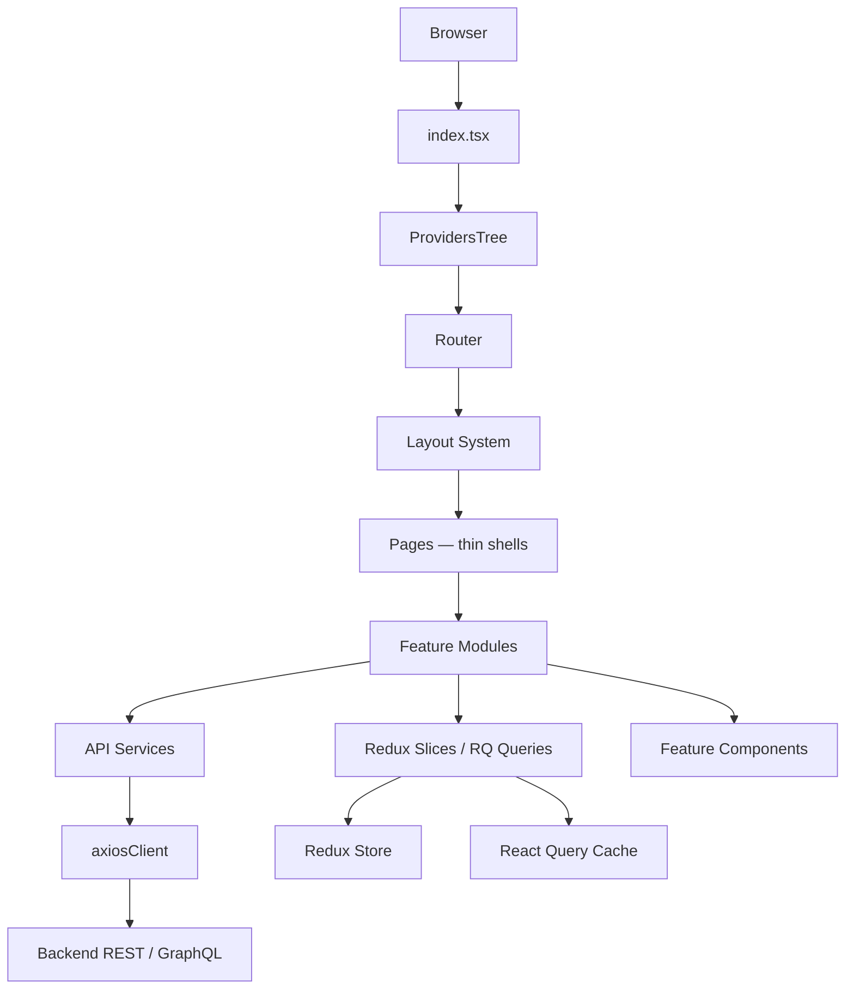
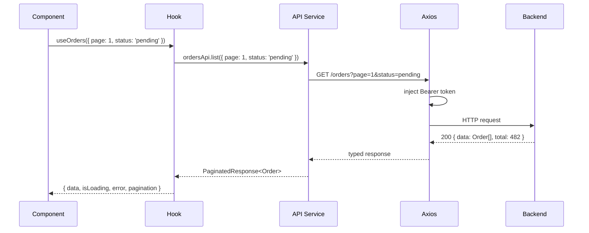
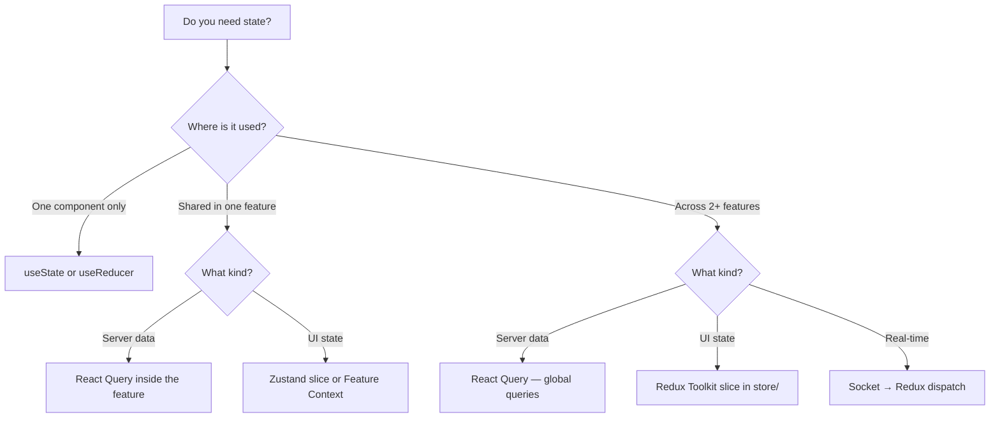

# Production React App Structure — Scale to 50 Million Users

> A battle-tested, opinionated folder structure for React applications built to scale.
> Assumes **TypeScript strict mode**, **React 18+**, **Redux Toolkit + React Query**,
> **Vite or Next.js**, and a REST or GraphQL backend.

---

## Table of Contents

1. [Architecture Philosophy](#1-architecture-philosophy)
2. [Full Project Tree](#2-full-project-tree)
3. [Feature Module Deep Dive](#3-feature-module-deep-dive)
4. [State Management Architecture](#4-state-management-architecture)
5. [API Layer Architecture](#5-api-layer-architecture)
6. [Providers System](#6-providers-system)
7. [Routing & Guards](#7-routing--guards)
8. [Layout System](#8-layout-system)
9. [Styles & Design Tokens](#9-styles--design-tokens)
10. [Testing Architecture](#10-testing-architecture)
11. [Shared Components](#11-shared-components)
12. [TypeScript Strategy](#12-typescript-strategy)
13. [Performance & Code Splitting](#13-performance--code-splitting)
14. [Environment & Config](#14-environment--config)
15. [Scaling Checklist](#15-scaling-checklist)

---

## 1. Architecture Philosophy

At 50 million users, the codebase is not just a technical artefact — it is a
**sociotechnical system**. Poor structure does not just slow down developers; it
creates bugs that affect millions of people and deployments that require coordination
across dozens of engineers.

The four non-negotiable properties of a system at this scale:

**1. Feature isolation** — every business domain owns its own state, API calls,
types, and UI. A bug in notifications cannot cascade into auth. A new engineer
on the payments team should never need to understand the analytics feature.

**2. Unidirectional data flow** — data enters through the API layer, flows through
state management, and is consumed by components. Nothing goes backwards. No
component reaches into another feature's store directly.

**3. Explicit contracts** — TypeScript interfaces define the shape of every API
response, Redux slice, and component prop. The compiler is your first line of
defence against regressions.

**4. Test colocation** — tests live next to the code they test. A file without a
test file next to it is a file that will not be tested. Co-location makes this
impossible to ignore.



> **The folder structure is the architecture.** If a new engineer cannot understand
> the system by reading the directory tree, the structure is wrong.

---

## 2. Full Project Tree

```
my-app/
│
├── public/                         # Static assets served as-is
│   ├── favicon.ico
│   ├── robots.txt
│   └── manifest.json
│
├── src/
│   │
│   ├── api/                        # ── HTTP LAYER ──────────────────────────────
│   │   ├── client/
│   │   │   ├── axiosClient.ts      # Singleton axios instance — interceptors, retries
│   │   │   ├── graphqlClient.ts    # Optional: Apollo / urql client setup
│   │   │   └── queryClient.ts      # React Query global QueryClient config
│   │   ├── endpoints.ts            # All URL path constants in ONE place
│   │   ├── socket/
│   │   │   ├── socketClient.ts     # Socket.io singleton — connect/disconnect logic
│   │   │   ├── socketMiddleware.ts # Redux middleware that bridges socket ↔ store
│   │   │   └── socketEvents.ts     # All event name constants (type-safe)
│   │   └── services/               # Domain-scoped API wrappers (no raw axios here)
│   │       ├── auth.service.ts
│   │       ├── user.service.ts
│   │       ├── product.service.ts
│   │       ├── order.service.ts
│   │       ├── notification.service.ts
│   │       └── upload.service.ts
│   │
│   ├── app/                        # ── APP BOOTSTRAP ────────────────────────────
│   │   ├── App.tsx                 # Root component — composes ProvidersTree + Router
│   │   ├── ProvidersTree.tsx       # All context providers nested in correct order
│   │   ├── router.tsx              # createBrowserRouter / createHashRouter config
│   │   └── ErrorBoundary.tsx       # Root-level error boundary with Sentry integration
│   │
│   ├── assets/                     # ── STATIC ASSETS ────────────────────────────
│   │   ├── images/
│   │   ├── icons/                  # SVG icons only — import as React components
│   │   ├── fonts/                  # Self-hosted fonts (woff2)
│   │   └── lottie/                 # Lottie animation JSON files
│   │
│   ├── components/                 # ── SHARED UI PRIMITIVES ─────────────────────
│   │   │                           # Domain-agnostic, zero business logic
│   │   ├── ui/                     # Headless primitives (Button, Input, Modal...)
│   │   │   ├── Button/
│   │   │   │   ├── Button.tsx
│   │   │   │   ├── Button.test.tsx
│   │   │   │   ├── Button.stories.tsx
│   │   │   │   └── index.ts
│   │   │   ├── Input/
│   │   │   ├── Select/
│   │   │   ├── Checkbox/
│   │   │   ├── Modal/
│   │   │   ├── Drawer/
│   │   │   ├── Tooltip/
│   │   │   ├── Popover/
│   │   │   ├── Badge/
│   │   │   ├── Avatar/
│   │   │   ├── Spinner/
│   │   │   ├── Skeleton/
│   │   │   └── index.ts            # Re-export barrel
│   │   │
│   │   ├── layout/                 # Layout primitives (not to be confused with /layout)
│   │   │   ├── Stack/              # Vertical/horizontal flex stack
│   │   │   ├── Grid/               # CSS grid wrapper
│   │   │   ├── Container/          # Max-width centering container
│   │   │   ├── Divider/
│   │   │   └── index.ts
│   │   │
│   │   ├── feedback/               # User-facing feedback components
│   │   │   ├── Toast/
│   │   │   ├── Alert/
│   │   │   ├── EmptyState/
│   │   │   ├── ErrorState/
│   │   │   └── index.ts
│   │   │
│   │   ├── data-display/           # Pure display, no side-effects
│   │   │   ├── Table/
│   │   │   │   ├── Table.tsx
│   │   │   │   ├── Table.test.tsx
│   │   │   │   ├── TableHeader.tsx
│   │   │   │   ├── TableRow.tsx
│   │   │   │   ├── TableCell.tsx
│   │   │   │   └── index.ts
│   │   │   ├── DataGrid/
│   │   │   ├── Chart/
│   │   │   ├── Stat/               # KPI stat card
│   │   │   ├── Tag/
│   │   │   └── index.ts
│   │   │
│   │   └── navigation/
│   │       ├── Breadcrumb/
│   │       ├── Tabs/
│   │       ├── Pagination/
│   │       ├── Stepper/
│   │       └── index.ts
│   │
│   ├── features/                   # ── FEATURE MODULES ──────────────────────────
│   │   │                           # One folder per business domain. This is the heart.
│   │   │
│   │   ├── auth/
│   │   │   ├── api/
│   │   │   │   └── auth.api.ts     # Auth-specific API calls using axiosClient
│   │   │   ├── components/
│   │   │   │   ├── LoginForm/
│   │   │   │   │   ├── LoginForm.tsx
│   │   │   │   │   ├── LoginForm.test.tsx
│   │   │   │   │   └── index.ts
│   │   │   │   ├── RegisterForm/
│   │   │   │   ├── OTPInput/
│   │   │   │   ├── ForgotPasswordForm/
│   │   │   │   └── index.ts
│   │   │   ├── hooks/
│   │   │   │   ├── useAuth.ts      # Primary auth hook — current user, isLoading
│   │   │   │   ├── useLogin.ts     # Mutation hook for login
│   │   │   │   ├── useLogout.ts
│   │   │   │   ├── usePermissions.ts  # RBAC helpers
│   │   │   │   └── index.ts
│   │   │   ├── store/
│   │   │   │   ├── auth.slice.ts   # Redux slice: user, token, sessionExpiry
│   │   │   │   └── auth.selectors.ts  # Memoized selectors
│   │   │   ├── types/
│   │   │   │   └── auth.types.ts   # LoginPayload, AuthUser, TokenResponse, etc.
│   │   │   ├── utils/
│   │   │   │   ├── tokenStorage.ts # localStorage / cookie abstraction
│   │   │   │   └── permissions.ts  # Role → permission mapping
│   │   │   └── index.ts            # Public API: only export what other features need
│   │   │
│   │   ├── dashboard/
│   │   │   ├── api/
│   │   │   │   └── dashboard.api.ts
│   │   │   ├── components/
│   │   │   │   ├── KPICards/
│   │   │   │   ├── RevenueChart/
│   │   │   │   ├── RecentActivity/
│   │   │   │   └── index.ts
│   │   │   ├── hooks/
│   │   │   │   ├── useDashboardStats.ts  # React Query: GET /dashboard/stats
│   │   │   │   └── index.ts
│   │   │   ├── store/
│   │   │   │   ├── dashboard.slice.ts
│   │   │   │   └── dashboard.selectors.ts
│   │   │   ├── types/
│   │   │   │   └── dashboard.types.ts
│   │   │   └── index.ts
│   │   │
│   │   ├── users/
│   │   │   ├── api/
│   │   │   │   └── users.api.ts
│   │   │   ├── components/
│   │   │   │   ├── UserTable/
│   │   │   │   ├── UserCard/
│   │   │   │   ├── UserForm/
│   │   │   │   ├── UserAvatar/
│   │   │   │   └── index.ts
│   │   │   ├── hooks/
│   │   │   │   ├── useUsers.ts         # RQ: paginated user list
│   │   │   │   ├── useUser.ts          # RQ: single user by id
│   │   │   │   ├── useCreateUser.ts    # RQ mutation
│   │   │   │   ├── useUpdateUser.ts
│   │   │   │   └── index.ts
│   │   │   ├── store/
│   │   │   │   ├── users.slice.ts
│   │   │   │   └── users.selectors.ts
│   │   │   ├── types/
│   │   │   │   └── users.types.ts
│   │   │   └── index.ts
│   │   │
│   │   ├── products/
│   │   │   ├── api/
│   │   │   ├── components/
│   │   │   ├── hooks/
│   │   │   ├── store/
│   │   │   ├── types/
│   │   │   └── index.ts
│   │   │
│   │   ├── orders/
│   │   │   ├── api/
│   │   │   ├── components/
│   │   │   ├── hooks/
│   │   │   ├── store/
│   │   │   ├── types/
│   │   │   └── index.ts
│   │   │
│   │   ├── notifications/
│   │   │   ├── api/
│   │   │   │   └── notifications.api.ts
│   │   │   ├── components/
│   │   │   │   ├── NotificationBell/
│   │   │   │   ├── NotificationList/
│   │   │   │   ├── NotificationItem/
│   │   │   │   └── index.ts
│   │   │   ├── hooks/
│   │   │   │   ├── useNotifications.ts
│   │   │   │   └── index.ts
│   │   │   ├── store/
│   │   │   │   ├── notifications.slice.ts
│   │   │   │   └── notifications.selectors.ts
│   │   │   ├── socket/
│   │   │   │   └── notifications.socket.ts  # Socket listeners scoped to this feature
│   │   │   ├── types/
│   │   │   │   └── notifications.types.ts
│   │   │   └── index.ts
│   │   │
│   │   ├── payments/
│   │   │   ├── api/
│   │   │   ├── components/
│   │   │   │   ├── PaymentForm/
│   │   │   │   ├── PaymentHistory/
│   │   │   │   └── index.ts
│   │   │   ├── hooks/
│   │   │   ├── store/
│   │   │   ├── types/
│   │   │   └── index.ts
│   │   │
│   │   ├── analytics/
│   │   │   ├── api/
│   │   │   ├── components/
│   │   │   ├── hooks/
│   │   │   ├── store/
│   │   │   ├── types/
│   │   │   └── index.ts
│   │   │
│   │   └── admin/
│   │       ├── api/
│   │       ├── components/
│   │       ├── hooks/
│   │       ├── store/
│   │       ├── types/
│   │       └── index.ts
│   │
│   ├── hooks/                      # ── GLOBAL HOOKS ─────────────────────────────
│   │   │                           # Hooks not tied to any one feature
│   │   ├── useDebounce.ts
│   │   ├── useThrottle.ts
│   │   ├── usePagination.ts
│   │   ├── useIntersectionObserver.ts
│   │   ├── useLocalStorage.ts
│   │   ├── useSessionStorage.ts
│   │   ├── useMediaQuery.ts        # Responsive breakpoint detection
│   │   ├── useOnClickOutside.ts
│   │   ├── useKeyboard.ts          # Keyboard shortcut bindings
│   │   ├── useWebSocket.ts         # Generic WS hook (feature sockets extend this)
│   │   ├── useScrollPosition.ts
│   │   ├── useWindowSize.ts
│   │   ├── useCopyToClipboard.ts
│   │   ├── useNetworkStatus.ts     # Online/offline detection
│   │   └── index.ts
│   │
│   ├── layout/                     # ── LAYOUT SYSTEM ────────────────────────────
│   │   ├── AdminLayout/
│   │   │   ├── AdminLayout.tsx
│   │   │   ├── AdminLayout.test.tsx
│   │   │   ├── AdminSidebar.tsx
│   │   │   ├── AdminNavbar.tsx
│   │   │   ├── AdminFooter.tsx
│   │   │   └── index.ts
│   │   ├── UserLayout/
│   │   │   ├── UserLayout.tsx
│   │   │   ├── UserNavbar.tsx
│   │   │   ├── UserSidebar.tsx
│   │   │   └── index.ts
│   │   ├── AuthLayout/             # Centered, no nav — for login/register pages
│   │   │   ├── AuthLayout.tsx
│   │   │   └── index.ts
│   │   ├── GuestLayout/
│   │   │   ├── GuestLayout.tsx
│   │   │   └── index.ts
│   │   └── WriterLayout/
│   │       ├── WriterLayout.tsx
│   │       └── index.ts
│   │
│   ├── pages/                      # ── PAGES (THIN SHELLS) ──────────────────────
│   │   │                           # NO business logic here. Import + compose features.
│   │   ├── auth/
│   │   │   ├── LoginPage.tsx
│   │   │   ├── RegisterPage.tsx
│   │   │   └── ForgotPasswordPage.tsx
│   │   ├── dashboard/
│   │   │   └── DashboardPage.tsx
│   │   ├── users/
│   │   │   ├── UsersPage.tsx
│   │   │   └── UserDetailPage.tsx
│   │   ├── products/
│   │   │   ├── ProductsPage.tsx
│   │   │   └── ProductDetailPage.tsx
│   │   ├── orders/
│   │   │   ├── OrdersPage.tsx
│   │   │   └── OrderDetailPage.tsx
│   │   ├── payments/
│   │   │   └── PaymentsPage.tsx
│   │   ├── admin/
│   │   │   ├── AdminDashboardPage.tsx
│   │   │   └── AdminSettingsPage.tsx
│   │   ├── errors/
│   │   │   ├── NotFoundPage.tsx
│   │   │   ├── ForbiddenPage.tsx
│   │   │   └── ServerErrorPage.tsx
│   │   └── index.ts
│   │
│   ├── providers/                  # ── CONTEXT PROVIDERS ────────────────────────
│   │   ├── ThemeProvider.tsx       # Light/dark mode + CSS variable injection
│   │   ├── AuthProvider.tsx        # Bootstraps session on app load
│   │   ├── ToastProvider.tsx       # Global toast notification system
│   │   ├── QueryProvider.tsx       # React Query QueryClientProvider wrapper
│   │   ├── StoreProvider.tsx       # Redux Provider wrapper
│   │   ├── SocketProvider.tsx      # Socket.io connection lifecycle
│   │   ├── I18nProvider.tsx        # Internationalisation (i18next)
│   │   ├── AnalyticsProvider.tsx   # Analytics init (Segment, Mixpanel, etc.)
│   │   └── FeatureFlagProvider.tsx # LaunchDarkly / GrowthBook integration
│   │
│   ├── routes/                     # ── ROUTING ──────────────────────────────────
│   │   ├── ProtectedRoute.tsx      # Redirect unauthenticated users → /login
│   │   ├── RoleRoute.tsx           # Redirect users without required role → /403
│   │   ├── GuestRoute.tsx          # Redirect authenticated users → /dashboard
│   │   ├── lazyRoutes.ts           # All React.lazy() imports in one place
│   │   └── index.ts                # Full route tree with nested routes
│   │
│   ├── store/                      # ── REDUX STORE ──────────────────────────────
│   │   ├── index.ts                # configureStore — combines all reducers
│   │   ├── rootReducer.ts          # combineReducers — imports from each feature
│   │   ├── store.types.ts          # RootState, AppDispatch, AppThunk types
│   │   ├── middleware/
│   │   │   ├── loggerMiddleware.ts # Dev-only request/action logger
│   │   │   ├── errorMiddleware.ts  # Global error handling middleware
│   │   │   └── socketMiddleware.ts # Bridges socket events into dispatched actions
│   │   └── enhancers/
│   │       └── sentryEnhancer.ts   # Sentry Redux integration
│   │
│   ├── styles/                     # ── STYLES ───────────────────────────────────
│   │   ├── tokens/
│   │   │   ├── colors.ts           # Design token: colour palette
│   │   │   ├── typography.ts       # Font families, sizes, weights, line-heights
│   │   │   ├── spacing.ts          # 4px-based spacing scale
│   │   │   ├── breakpoints.ts      # sm/md/lg/xl/2xl breakpoints
│   │   │   ├── shadows.ts          # Box shadow tokens
│   │   │   ├── radii.ts            # Border radius tokens
│   │   │   ├── zIndex.ts           # Z-index scale (modal, drawer, toast, etc.)
│   │   │   └── index.ts
│   │   ├── themes/
│   │   │   ├── light.theme.ts      # Light mode CSS variable values
│   │   │   ├── dark.theme.ts       # Dark mode CSS variable values
│   │   │   └── index.ts
│   │   ├── global.css              # Reset, root variables, font-face, body defaults
│   │   ├── animations.css          # Keyframe animations (fade, slide, spin)
│   │   └── utilities.css           # Atomic utility classes (sr-only, truncate, etc.)
│   │
│   ├── types/                      # ── GLOBAL TYPES ─────────────────────────────
│   │   ├── api.types.ts            # ApiResponse<T>, PaginatedResponse<T>, ApiError
│   │   ├── common.types.ts         # ID, Timestamp, Nullable<T>, Maybe<T>
│   │   ├── env.types.ts            # import.meta.env shape (Vite) or process.env
│   │   ├── route.types.ts          # Route params and query string types
│   │   └── index.ts
│   │
│   ├── utils/                      # ── PURE UTILITIES ───────────────────────────
│   │   ├── formatters/
│   │   │   ├── date.formatter.ts
│   │   │   ├── currency.formatter.ts
│   │   │   ├── number.formatter.ts
│   │   │   └── string.formatter.ts
│   │   ├── validators/
│   │   │   ├── email.validator.ts
│   │   │   ├── phone.validator.ts
│   │   │   └── password.validator.ts
│   │   ├── helpers/
│   │   │   ├── array.helpers.ts    # groupBy, chunk, sortBy, unique, etc.
│   │   │   ├── object.helpers.ts   # pick, omit, deepClone, deepMerge
│   │   │   ├── url.helpers.ts      # queryStringify, parseQuery
│   │   │   └── crypto.helpers.ts   # UUID generation, hash functions
│   │   ├── constants/
│   │   │   ├── app.constants.ts    # App name, version, feature flags fallbacks
│   │   │   ├── regex.constants.ts  # Compiled regex patterns
│   │   │   └── http.constants.ts   # HTTP status codes, timeout values
│   │   └── index.ts
│   │
│   └── index.tsx                   # App entry point — mounts <App/> to #root
│
├── tests/                          # ── TEST INFRASTRUCTURE ──────────────────────
│   ├── __mocks__/
│   │   ├── fileMock.ts             # Mock for image/svg imports
│   │   ├── server.ts               # MSW setup — exported for tests
│   │   └── handlers/               # MSW request handlers per domain
│   │       ├── auth.handlers.ts
│   │       ├── users.handlers.ts
│   │       └── index.ts
│   ├── setup/
│   │   ├── setupTests.ts           # Global test setup — runs before every suite
│   │   ├── customMatchers.ts       # jest-dom + custom expect extensions
│   │   └── testUtils.tsx           # Custom render() with providers pre-wrapped
│   └── e2e/                        # End-to-end tests (Playwright)
│       ├── auth/
│       │   ├── login.spec.ts
│       │   └── registration.spec.ts
│       ├── orders/
│       │   └── checkout-flow.spec.ts
│       └── playwright.config.ts
│
├── scripts/                        # ── BUILD SCRIPTS ────────────────────────────
│   ├── generate-feature.ts         # Scaffold a new feature module from template
│   ├── check-circular-deps.ts      # Detect circular import chains
│   └── bundle-analysis.ts          # Run and open bundle analyser
│
├── .env.example                    # Template — commit this, never .env files
├── .env.local                      # Local dev overrides — gitignored
├── .env.staging                    # Staging environment — gitignored
├── .env.production                 # Production — never committed
├── vite.config.ts                  # (or next.config.ts)
├── tsconfig.json
├── tsconfig.paths.json             # Path aliases: @features, @components, @hooks...
├── tailwind.config.ts              # (if using Tailwind)
├── jest.config.ts                  # Unit/integration test config
├── playwright.config.ts            # E2E test config
├── eslint.config.ts
├── .prettierrc
└── package.json
```

---

## 3. Feature Module Deep Dive

Every feature follows an identical internal contract. This consistency is what makes
the codebase navigable at scale — any engineer can open any feature and know where
everything is.

### Internal feature contract

```
features/orders/
├── api/
│   └── orders.api.ts           # Raw API calls — returns typed responses
├── components/
│   ├── OrderTable/
│   │   ├── OrderTable.tsx      # Component — calls hooks only, never API directly
│   │   ├── OrderTable.test.tsx # Co-located test
│   │   └── index.ts
│   ├── OrderDetail/
│   │   ├── OrderDetail.tsx
│   │   ├── OrderDetail.test.tsx
│   │   └── index.ts
│   └── index.ts
├── hooks/
│   ├── useOrders.ts            # React Query: list + pagination
│   ├── useOrders.test.ts       # Hook test using renderHook
│   ├── useOrder.ts             # React Query: single order by id
│   ├── useCreateOrder.ts       # React Query mutation
│   ├── useUpdateOrder.ts
│   ├── useCancelOrder.ts
│   └── index.ts
├── store/
│   ├── orders.slice.ts         # Redux slice: UI state (selectedIds, filters, sort)
│   ├── orders.selectors.ts     # Memoized selectors using createSelector
│   └── orders.thunks.ts        # Complex async logic (if needed alongside RQ)
├── types/
│   └── orders.types.ts         # Order, OrderItem, OrderStatus, CreateOrderPayload
├── utils/
│   └── order.helpers.ts        # Feature-specific pure functions
└── index.ts                    # PUBLIC API — barrel export of only what others need
```

### The public API pattern

The `index.ts` at the root of every feature is a deliberate contract with the rest
of the codebase. It exports only what other features or pages legitimately need:

```typescript
// features/orders/index.ts

// Components that pages or other features may render
export { OrderTable } from "./components/OrderTable";
export { OrderDetail } from "./components/OrderDetail";

// Hooks that pages or other features may call
export { useOrders } from "./hooks/useOrders";
export { useOrder } from "./hooks/useOrder";

// Types that cross feature boundaries (e.g. used in the cart feature)
export type { Order, OrderStatus } from "./types/orders.types";

// DO NOT export: internal api calls, slice internals, private utils
```

Any import that bypasses this barrel — `import something from 'features/orders/store/orders.slice'`
from another feature — is an architecture violation. Enforce it with ESLint's
`no-restricted-imports` rule.

### The data flow inside a feature



**The rule:** Components never touch the API layer. They call a hook. The hook
handles caching, loading state, and error state. The component renders.

---

## 4. State Management Architecture

At 50M users, premature state globalisation is the biggest architectural risk.
The decision tree for where state lives:



### Redux slice structure

```typescript
// features/orders/store/orders.slice.ts

import { createSlice, PayloadAction } from "@reduxjs/toolkit";
import type { OrderStatus } from "../types/orders.types";

interface OrdersUiState {
  selectedIds: string[];
  statusFilter: OrderStatus | "all";
  sortField: "createdAt" | "total" | "status";
  sortDirection: "asc" | "desc";
  isExportModalOpen: boolean;
}

const initialState: OrdersUiState = {
  selectedIds: [],
  statusFilter: "all",
  sortField: "createdAt",
  sortDirection: "desc",
  isExportModalOpen: false,
};

export const ordersSlice = createSlice({
  name: "orders",
  initialState,
  reducers: {
    selectOrder(state, action: PayloadAction<string>) {
      state.selectedIds.push(action.payload);
    },
    deselectOrder(state, action: PayloadAction<string>) {
      state.selectedIds = state.selectedIds.filter(
        (id) => id !== action.payload,
      );
    },
    clearSelection(state) {
      state.selectedIds = [];
    },
    setStatusFilter(state, action: PayloadAction<OrderStatus | "all">) {
      state.statusFilter = action.payload;
      state.selectedIds = []; // clear selection when filter changes
    },
    openExportModal(state) {
      state.isExportModalOpen = true;
    },
    closeExportModal(state) {
      state.isExportModalOpen = false;
    },
  },
});

export const ordersActions = ordersSlice.actions;
export const ordersReducer = ordersSlice.reducer;
```

### Selectors

```typescript
// features/orders/store/orders.selectors.ts

import { createSelector } from "@reduxjs/toolkit";
import type { RootState } from "@store/store.types";

const selectOrdersState = (state: RootState) => state.orders;

export const selectSelectedOrderIds = createSelector(
  selectOrdersState,
  (state) => state.selectedIds,
);

export const selectOrderStatusFilter = createSelector(
  selectOrdersState,
  (state) => state.statusFilter,
);

export const selectHasSelectedOrders = createSelector(
  selectSelectedOrderIds,
  (ids) => ids.length > 0,
);
```

### Root store assembly

```typescript
// store/rootReducer.ts

import { combineReducers } from "@reduxjs/toolkit";
import { authReducer } from "@features/auth/store/auth.slice";
import { dashboardReducer } from "@features/dashboard/store/dashboard.slice";
import { ordersReducer } from "@features/orders/store/orders.slice";
import { usersReducer } from "@features/users/store/users.slice";
import { notificationsReducer } from "@features/notifications/store/notifications.slice";
import { paymentsReducer } from "@features/payments/store/payments.slice";

export const rootReducer = combineReducers({
  auth: authReducer,
  dashboard: dashboardReducer,
  orders: ordersReducer,
  users: usersReducer,
  notifications: notificationsReducer,
  payments: paymentsReducer,
});
```

---

## 5. API Layer Architecture

### axiosClient — the only HTTP singleton

```typescript
// api/client/axiosClient.ts

import axios, {
  AxiosError,
  AxiosInstance,
  InternalAxiosRequestConfig,
} from "axios";
import { store } from "@store";
import { authActions } from "@features/auth/store/auth.slice";
import { API_BASE_URL, REQUEST_TIMEOUT } from "@utils/constants/http.constants";

const axiosClient: AxiosInstance = axios.create({
  baseURL: API_BASE_URL,
  timeout: REQUEST_TIMEOUT,
  headers: {
    "Content-Type": "application/json",
    Accept: "application/json",
  },
});

// ── REQUEST INTERCEPTOR ─────────────────────────────────────────────────────
axiosClient.interceptors.request.use(
  (config: InternalAxiosRequestConfig) => {
    const token = store.getState().auth.accessToken;
    if (token) {
      config.headers.Authorization = `Bearer ${token}`;
    }
    return config;
  },
  (error) => Promise.reject(error),
);

// ── RESPONSE INTERCEPTOR ────────────────────────────────────────────────────
axiosClient.interceptors.response.use(
  (response) => response.data, // Unwrap: services receive data directly
  async (error: AxiosError) => {
    const originalRequest = error.config as InternalAxiosRequestConfig & {
      _retry?: boolean;
    };

    if (error.response?.status === 401 && !originalRequest._retry) {
      originalRequest._retry = true;
      try {
        // Attempt token refresh
        const { data } = await axios.post(`${API_BASE_URL}/auth/refresh`);
        store.dispatch(authActions.setToken(data.accessToken));
        originalRequest.headers.Authorization = `Bearer ${data.accessToken}`;
        return axiosClient(originalRequest);
      } catch {
        store.dispatch(authActions.logout());
        window.location.href = "/login";
      }
    }

    // Normalise error shape for all consumers
    const apiError = {
      message: (error.response?.data as any)?.message ?? error.message,
      statusCode: error.response?.status,
      errors: (error.response?.data as any)?.errors ?? {},
    };

    return Promise.reject(apiError);
  },
);

export { axiosClient };
```

### API service pattern

```typescript
// api/services/order.service.ts

import { axiosClient } from "@api/client/axiosClient";
import { ENDPOINTS } from "@api/endpoints";
import type {
  Order,
  CreateOrderPayload,
  PaginatedResponse,
  OrderListParams,
} from "@types";

export const orderService = {
  list: (params: OrderListParams): Promise<PaginatedResponse<Order>> =>
    axiosClient.get(ENDPOINTS.ORDERS.LIST, { params }),

  getById: (id: string): Promise<Order> =>
    axiosClient.get(ENDPOINTS.ORDERS.BY_ID(id)),

  create: (payload: CreateOrderPayload): Promise<Order> =>
    axiosClient.post(ENDPOINTS.ORDERS.LIST, payload),

  update: (id: string, payload: Partial<CreateOrderPayload>): Promise<Order> =>
    axiosClient.patch(ENDPOINTS.ORDERS.BY_ID(id), payload),

  cancel: (id: string): Promise<void> =>
    axiosClient.post(ENDPOINTS.ORDERS.CANCEL(id)),

  exportCsv: (params: OrderListParams): Promise<Blob> =>
    axiosClient.get(ENDPOINTS.ORDERS.EXPORT, { params, responseType: "blob" }),
};
```

### Centralized endpoints

```typescript
// api/endpoints.ts

const BASE = "/api/v1";

export const ENDPOINTS = {
  AUTH: {
    LOGIN: `${BASE}/auth/login`,
    LOGOUT: `${BASE}/auth/logout`,
    REFRESH: `${BASE}/auth/refresh`,
    REGISTER: `${BASE}/auth/register`,
    ME: `${BASE}/auth/me`,
  },
  USERS: {
    LIST: `${BASE}/users`,
    BY_ID: (id: string) => `${BASE}/users/${id}`,
    AVATAR: (id: string) => `${BASE}/users/${id}/avatar`,
  },
  ORDERS: {
    LIST: `${BASE}/orders`,
    BY_ID: (id: string) => `${BASE}/orders/${id}`,
    CANCEL: (id: string) => `${BASE}/orders/${id}/cancel`,
    EXPORT: `${BASE}/orders/export`,
  },
  NOTIFICATIONS: {
    LIST: `${BASE}/notifications`,
    MARK_READ: (id: string) => `${BASE}/notifications/${id}/read`,
    MARK_ALL_READ: `${BASE}/notifications/read-all`,
  },
} as const;
```

---

## 6. Providers System

The providers stack is ordered deliberately. The wrong order causes providers to
lack access to context they depend on.

```typescript
// app/ProvidersTree.tsx

import React from 'react';
import { StoreProvider } from '@providers/StoreProvider';
import { QueryProvider } from '@providers/QueryProvider';
import { ThemeProvider } from '@providers/ThemeProvider';
import { AuthProvider } from '@providers/AuthProvider';
import { SocketProvider } from '@providers/SocketProvider';
import { ToastProvider } from '@providers/ToastProvider';
import { I18nProvider } from '@providers/I18nProvider';
import { AnalyticsProvider } from '@providers/AnalyticsProvider';
import { FeatureFlagProvider } from '@providers/FeatureFlagProvider';
import { ErrorBoundary } from './ErrorBoundary';

interface ProvidersTreeProps {
  children: React.ReactNode;
}

/**
 * Provider order is load-bearing. Do not reorder without checking dependencies.
 *
 * 1. StoreProvider       — Redux store must be outermost (AuthProvider reads from store)
 * 2. QueryProvider       — React Query client (used by AuthProvider to bootstrap session)
 * 3. I18nProvider        — Language must be ready before UI renders
 * 4. ThemeProvider       — Injects CSS variables. Must wrap all UI.
 * 5. AuthProvider        — Reads store, fires /auth/me on mount
 * 6. FeatureFlagProvider — May depend on auth user for targeting
 * 7. SocketProvider      — Opens WS connection only after auth is resolved
 * 8. AnalyticsProvider   — Identifies user after auth is resolved
 * 9. ToastProvider       — Global toast state. Must be inside ErrorBoundary.
 * 10. ErrorBoundary      — Innermost: catches rendering errors in the app tree
 */
export const ProvidersTree: React.FC<ProvidersTreeProps> = ({ children }) => (
  <StoreProvider>
    <QueryProvider>
      <I18nProvider>
        <ThemeProvider>
          <AuthProvider>
            <FeatureFlagProvider>
              <SocketProvider>
                <AnalyticsProvider>
                  <ToastProvider>
                    <ErrorBoundary>
                      {children}
                    </ErrorBoundary>
                  </ToastProvider>
                </AnalyticsProvider>
              </SocketProvider>
            </FeatureFlagProvider>
          </AuthProvider>
        </ThemeProvider>
      </I18nProvider>
    </QueryProvider>
  </StoreProvider>
);
```

---

## 7. Routing & Guards

```typescript
// routes/index.ts

import { createBrowserRouter, Outlet } from 'react-router-dom';
import { AdminLayout, UserLayout, AuthLayout, GuestLayout } from '@layout';
import { ProtectedRoute, RoleRoute, GuestRoute } from '@routes';
import { lazyRoutes } from './lazyRoutes';

export const router = createBrowserRouter([
  // ── GUEST ROUTES ─────────────────────────────────────────────────────────
  {
    element: <GuestRoute><GuestLayout><Outlet /></GuestLayout></GuestRoute>,
    children: [
      { path: '/login',          element: <lazyRoutes.LoginPage /> },
      { path: '/register',       element: <lazyRoutes.RegisterPage /> },
      { path: '/forgot-password',element: <lazyRoutes.ForgotPasswordPage /> },
    ],
  },

  // ── USER ROUTES ───────────────────────────────────────────────────────────
  {
    element: <ProtectedRoute><UserLayout><Outlet /></UserLayout></ProtectedRoute>,
    children: [
      { path: '/dashboard',       element: <lazyRoutes.DashboardPage /> },
      { path: '/orders',          element: <lazyRoutes.OrdersPage /> },
      { path: '/orders/:id',      element: <lazyRoutes.OrderDetailPage /> },
      { path: '/products',        element: <lazyRoutes.ProductsPage /> },
      { path: '/products/:id',    element: <lazyRoutes.ProductDetailPage /> },
      { path: '/payments',        element: <lazyRoutes.PaymentsPage /> },
      { path: '/profile',         element: <lazyRoutes.ProfilePage /> },
    ],
  },

  // ── ADMIN ROUTES ──────────────────────────────────────────────────────────
  {
    element: (
      <ProtectedRoute>
        <RoleRoute allowedRoles={['admin', 'super_admin']}>
          <AdminLayout><Outlet /></AdminLayout>
        </RoleRoute>
      </ProtectedRoute>
    ),
    children: [
      { path: '/admin',               element: <lazyRoutes.AdminDashboardPage /> },
      { path: '/admin/users',         element: <lazyRoutes.UsersPage /> },
      { path: '/admin/users/:id',     element: <lazyRoutes.UserDetailPage /> },
      { path: '/admin/analytics',     element: <lazyRoutes.AnalyticsPage /> },
      { path: '/admin/settings',      element: <lazyRoutes.AdminSettingsPage /> },
    ],
  },

  // ── ERROR ROUTES ──────────────────────────────────────────────────────────
  { path: '/403', element: <lazyRoutes.ForbiddenPage /> },
  { path: '/500', element: <lazyRoutes.ServerErrorPage /> },
  { path: '*',    element: <lazyRoutes.NotFoundPage /> },
]);
```

```typescript
// routes/lazyRoutes.ts

import { lazy } from "react";

// ALL page-level imports are lazy. Bundle is split per route automatically.
export const lazyRoutes = {
  LoginPage: lazy(() => import("@pages/auth/LoginPage")),
  RegisterPage: lazy(() => import("@pages/auth/RegisterPage")),
  ForgotPasswordPage: lazy(() => import("@pages/auth/ForgotPasswordPage")),
  DashboardPage: lazy(() => import("@pages/dashboard/DashboardPage")),
  OrdersPage: lazy(() => import("@pages/orders/OrdersPage")),
  OrderDetailPage: lazy(() => import("@pages/orders/OrderDetailPage")),
  ProductsPage: lazy(() => import("@pages/products/ProductsPage")),
  ProductDetailPage: lazy(() => import("@pages/products/ProductDetailPage")),
  PaymentsPage: lazy(() => import("@pages/payments/PaymentsPage")),
  UsersPage: lazy(() => import("@pages/users/UsersPage")),
  UserDetailPage: lazy(() => import("@pages/users/UserDetailPage")),
  AdminDashboardPage: lazy(() => import("@pages/admin/AdminDashboardPage")),
  AdminSettingsPage: lazy(() => import("@pages/admin/AdminSettingsPage")),
  AnalyticsPage: lazy(() => import("@pages/analytics/AnalyticsPage")),
  NotFoundPage: lazy(() => import("@pages/errors/NotFoundPage")),
  ForbiddenPage: lazy(() => import("@pages/errors/ForbiddenPage")),
  ServerErrorPage: lazy(() => import("@pages/errors/ServerErrorPage")),
};
```

---

## 8. Layout System

```typescript
// layout/AdminLayout/AdminLayout.tsx

import React, { Suspense } from 'react';
import { Outlet } from 'react-router-dom';
import { AdminNavbar } from './AdminNavbar';
import { AdminSidebar } from './AdminSidebar';
import { AdminFooter } from './AdminFooter';
import { Spinner } from '@components/ui/Spinner';
import styles from './AdminLayout.module.css';

export const AdminLayout: React.FC = () => (
  <div className={styles.root}>
    <AdminSidebar />
    <div className={styles.main}>
      <AdminNavbar />
      <main className={styles.content}>
        <Suspense fallback={<Spinner size="lg" />}>
          <Outlet />
        </Suspense>
      </main>
      <AdminFooter />
    </div>
  </div>
);
```

Each layout has its own CSS module. The layout knows nothing about the feature
being rendered inside it. The `<Suspense>` boundary inside every layout means
lazy-loaded pages show a spinner contained within the layout — not a blank
full-screen flash.

---

## 9. Styles & Design Tokens

### Token structure

```typescript
// styles/tokens/colors.ts

export const colors = {
  // Brand
  primary: {
    50: "#EFF6FF",
    100: "#DBEAFE",
    200: "#BFDBFE",
    300: "#93C5FD",
    400: "#60A5FA",
    500: "#3B82F6",
    600: "#2563EB",
    700: "#1D4ED8",
    800: "#1E40AF",
    900: "#1E3A8A",
  },
  // Neutral
  gray: {
    /* ... */
  },
  // Semantic
  success: { light: "#D1FAE5", DEFAULT: "#10B981", dark: "#065F46" },
  warning: { light: "#FEF3C7", DEFAULT: "#F59E0B", dark: "#92400E" },
  danger: { light: "#FEE2E2", DEFAULT: "#EF4444", dark: "#991B1B" },
  info: { light: "#DBEAFE", DEFAULT: "#3B82F6", dark: "#1E3A8A" },
} as const;

export type ColorToken = typeof colors;
```

```typescript
// styles/tokens/zIndex.ts

export const zIndex = {
  hide: -1,
  base: 0,
  raised: 1,
  dropdown: 1000,
  sticky: 1100,
  overlay: 1200,
  modal: 1300,
  popover: 1400,
  toast: 1500,
  tooltip: 1600,
} as const;
```

### Theme injection

```typescript
// providers/ThemeProvider.tsx

import React, { createContext, useContext, useEffect, useState } from 'react';
import { lightTheme } from '@styles/themes/light.theme';
import { darkTheme } from '@styles/themes/dark.theme';

type Theme = 'light' | 'dark' | 'system';

const ThemeContext = createContext<{
  theme: Theme;
  resolvedTheme: 'light' | 'dark';
  setTheme: (theme: Theme) => void;
}>({ theme: 'system', resolvedTheme: 'light', setTheme: () => {} });

export const useTheme = () => useContext(ThemeContext);

export const ThemeProvider: React.FC<{ children: React.ReactNode }> = ({ children }) => {
  const [theme, setTheme] = useState<Theme>(
    () => (localStorage.getItem('theme') as Theme) ?? 'system'
  );

  const prefersDark = window.matchMedia('(prefers-color-scheme: dark)').matches;
  const resolvedTheme = theme === 'system' ? (prefersDark ? 'dark' : 'light') : theme;

  useEffect(() => {
    const root = document.documentElement;
    const tokens = resolvedTheme === 'dark' ? darkTheme : lightTheme;
    Object.entries(tokens).forEach(([key, value]) => {
      root.style.setProperty(key, value);
    });
    root.setAttribute('data-theme', resolvedTheme);
    localStorage.setItem('theme', theme);
  }, [theme, resolvedTheme]);

  return (
    <ThemeContext.Provider value={{ theme, resolvedTheme, setTheme }}>
      {children}
    </ThemeContext.Provider>
  );
};
```

---

## 10. Testing Architecture

### The three test categories

**Unit tests** — pure functions, hooks in isolation, Redux slices. Co-located with source.

**Integration tests** — components with their hooks and MSW-mocked API. Co-located with source.

**E2E tests** — full user journeys in a real browser. Live in `tests/e2e/`.

### Co-location rule: visual representation

```
src/
├── features/
│   └── orders/
│       ├── components/
│       │   ├── OrderTable/
│       │   │   ├── OrderTable.tsx
│       │   │   └── OrderTable.test.tsx     ← integration test: renders + MSW
│       │   └── OrderDetail/
│       │       ├── OrderDetail.tsx
│       │       └── OrderDetail.test.tsx
│       ├── hooks/
│       │   ├── useOrders.ts
│       │   └── useOrders.test.ts           ← hook test: renderHook + MSW
│       └── store/
│           ├── orders.slice.ts
│           └── orders.slice.test.ts        ← Redux unit test
│
├── utils/
│   └── formatters/
│       ├── currency.formatter.ts
│       └── currency.formatter.test.ts      ← pure unit test
│
└── tests/
    └── e2e/
        └── orders/
            └── checkout-flow.spec.ts       ← E2E (Playwright)
```

### Custom test render utility

```typescript
// tests/setup/testUtils.tsx

import React from 'react';
import { render, RenderOptions } from '@testing-library/react';
import { configureStore } from '@reduxjs/toolkit';
import { Provider } from 'react-redux';
import { QueryClient, QueryClientProvider } from '@tanstack/react-query';
import { MemoryRouter } from 'react-router-dom';
import { rootReducer } from '@store/rootReducer';
import type { RootState } from '@store/store.types';

interface RenderWithProvidersOptions extends Omit<RenderOptions, 'wrapper'> {
  preloadedState?: Partial<RootState>;
  route?: string;
}

function renderWithProviders(
  ui: React.ReactElement,
  {
    preloadedState = {},
    route = '/',
    ...renderOptions
  }: RenderWithProvidersOptions = {}
) {
  const store = configureStore({
    reducer: rootReducer,
    preloadedState,
  });

  const queryClient = new QueryClient({
    defaultOptions: {
      queries: { retry: false },      // Never retry in tests
      mutations: { retry: false },
    },
  });

  function Wrapper({ children }: { children: React.ReactNode }) {
    return (
      <Provider store={store}>
        <QueryClientProvider client={queryClient}>
          <MemoryRouter initialEntries={[route]}>
            {children}
          </MemoryRouter>
        </QueryClientProvider>
      </Provider>
    );
  }

  return {
    store,
    queryClient,
    ...render(ui, { wrapper: Wrapper, ...renderOptions }),
  };
}

export * from '@testing-library/react';
export { renderWithProviders };
```

### MSW handler example

```typescript
// tests/__mocks__/handlers/orders.handlers.ts

import { http, HttpResponse } from "msw";
import { ENDPOINTS } from "@api/endpoints";
import type { Order } from "@features/orders/types/orders.types";

const mockOrder: Order = {
  id: "ord-1",
  status: "pending",
  total: 129.99,
  createdAt: "2025-01-15T10:00:00Z",
  items: [
    { productId: "prod-1", name: "Widget Pro", quantity: 2, unitPrice: 64.99 },
  ],
};

export const ordersHandlers = [
  http.get(ENDPOINTS.ORDERS.LIST, () =>
    HttpResponse.json({
      data: [mockOrder],
      total: 1,
      page: 1,
      pageSize: 20,
    }),
  ),

  http.get(ENDPOINTS.ORDERS.BY_ID(":id"), ({ params }) =>
    HttpResponse.json({ ...mockOrder, id: params.id as string }),
  ),

  http.post(ENDPOINTS.ORDERS.LIST, async ({ request }) => {
    const body = (await request.json()) as Partial<Order>;
    return HttpResponse.json(
      { ...mockOrder, ...body, id: "ord-new" },
      { status: 201 },
    );
  }),

  http.post(ENDPOINTS.ORDERS.CANCEL(":id"), () =>
    HttpResponse.json({ success: true }),
  ),
];
```

### Redux slice unit test

```typescript
// features/orders/store/orders.slice.test.ts

import { ordersReducer, ordersActions } from "./orders.slice";

describe("ordersSlice", () => {
  const initialState = {
    selectedIds: [],
    statusFilter: "all" as const,
    sortField: "createdAt" as const,
    sortDirection: "desc" as const,
    isExportModalOpen: false,
  };

  it("should select an order", () => {
    const state = ordersReducer(
      initialState,
      ordersActions.selectOrder("ord-1"),
    );
    expect(state.selectedIds).toContain("ord-1");
  });

  it("should deselect an order", () => {
    const withSelected = { ...initialState, selectedIds: ["ord-1", "ord-2"] };
    const state = ordersReducer(
      withSelected,
      ordersActions.deselectOrder("ord-1"),
    );
    expect(state.selectedIds).not.toContain("ord-1");
    expect(state.selectedIds).toContain("ord-2");
  });

  it("should clear selection when filter changes", () => {
    const withSelected = { ...initialState, selectedIds: ["ord-1"] };
    const state = ordersReducer(
      withSelected,
      ordersActions.setStatusFilter("pending"),
    );
    expect(state.selectedIds).toHaveLength(0);
    expect(state.statusFilter).toBe("pending");
  });
});
```

---

## 11. Shared Components

Components in `components/` have three rules:

1. Zero business logic — no API calls, no Redux selectors, no feature knowledge
2. Fully generic — accept all variants via props
3. Always tested and Storybook'd — no exceptions at this scale

```typescript
// components/ui/Button/Button.tsx

import React from 'react';
import { Spinner } from '@components/ui/Spinner';
import styles from './Button.module.css';

type ButtonVariant = 'primary' | 'secondary' | 'ghost' | 'danger';
type ButtonSize = 'sm' | 'md' | 'lg';

interface ButtonProps extends React.ButtonHTMLAttributes<HTMLButtonElement> {
  variant?: ButtonVariant;
  size?: ButtonSize;
  isLoading?: boolean;
  leftIcon?: React.ReactNode;
  rightIcon?: React.ReactNode;
  fullWidth?: boolean;
}

export const Button: React.FC<ButtonProps> = ({
  variant = 'primary',
  size = 'md',
  isLoading = false,
  leftIcon,
  rightIcon,
  fullWidth = false,
  children,
  disabled,
  className,
  ...rest
}) => (
  <button
    className={[
      styles.base,
      styles[variant],
      styles[size],
      fullWidth ? styles.fullWidth : '',
      className ?? '',
    ].join(' ')}
    disabled={disabled || isLoading}
    aria-busy={isLoading}
    {...rest}
  >
    {isLoading ? (
      <Spinner size="sm" />
    ) : (
      <>
        {leftIcon && <span className={styles.leftIcon}>{leftIcon}</span>}
        {children}
        {rightIcon && <span className={styles.rightIcon}>{rightIcon}</span>}
      </>
    )}
  </button>
);
```

---

## 12. TypeScript Strategy

### Global type definitions

```typescript
// types/api.types.ts

export interface ApiResponse<T> {
  data: T;
  message: string;
  statusCode: number;
}

export interface PaginatedResponse<T> {
  data: T[];
  total: number;
  page: number;
  pageSize: number;
  totalPages: number;
}

export interface ApiError {
  message: string;
  statusCode: number;
  errors: Record<string, string[]>; // Field-level validation errors
}

// types/common.types.ts

export type ID = string;
export type Timestamp = string; // ISO 8601
export type Nullable<T> = T | null;
export type Maybe<T> = T | undefined;
export type Optional<T, K extends keyof T> = Omit<T, K> & Partial<Pick<T, K>>;
```

### Path aliases

```json
// tsconfig.paths.json

{
  "compilerOptions": {
    "baseUrl": ".",
    "paths": {
      "@api/*": ["src/api/*"],
      "@app/*": ["src/app/*"],
      "@assets/*": ["src/assets/*"],
      "@components/*": ["src/components/*"],
      "@features/*": ["src/features/*"],
      "@hooks/*": ["src/hooks/*"],
      "@layout/*": ["src/layout/*"],
      "@pages/*": ["src/pages/*"],
      "@providers/*": ["src/providers/*"],
      "@routes/*": ["src/routes/*"],
      "@store/*": ["src/store/*"],
      "@styles/*": ["src/styles/*"],
      "@types/*": ["src/types/*"],
      "@utils/*": ["src/utils/*"],
      "@tests/*": ["tests/*"]
    }
  }
}
```

### Strict mode configuration

```json
// tsconfig.json

{
  "compilerOptions": {
    "strict": true,
    "noImplicitAny": true,
    "noImplicitReturns": true,
    "noFallthroughCasesInSwitch": true,
    "noUnusedLocals": true,
    "noUnusedParameters": true,
    "exactOptionalPropertyTypes": true,
    "forceConsistentCasingInFileNames": true,
    "skipLibCheck": true
  }
}
```

---

## 13. Performance & Code Splitting

At 50M users, initial bundle size directly affects revenue. Every millisecond of
TTI (Time to Interactive) has a measurable impact on conversion.

### Code splitting strategy

- Every page is lazy-loaded (done in `lazyRoutes.ts`)
- Heavy feature components (charts, rich text editors, PDF viewers) are
  additionally lazy-loaded inside their feature
- Third-party libraries with large footprints (moment, lodash, chart.js) are
  imported selectively or replaced with lighter alternatives

### React Query configuration for scale

```typescript
// api/client/queryClient.ts

import { QueryClient } from "@tanstack/react-query";

export const queryClient = new QueryClient({
  defaultOptions: {
    queries: {
      staleTime: 1000 * 60 * 5, // 5 minutes — reduces redundant refetches
      gcTime: 1000 * 60 * 10, // 10 minutes — keep cache after unmount
      retry: (failureCount, error: any) => {
        if (error?.statusCode === 404) return false; // Never retry 404
        if (error?.statusCode === 401) return false; // Never retry 401
        return failureCount < 2;
      },
      refetchOnWindowFocus: false, // Disable on prod — too aggressive for large apps
      networkMode: "online",
    },
    mutations: {
      retry: 0,
    },
  },
});
```

### Virtualisation for large lists

Any list that could exceed ~100 items must use virtualisation. Never render
all rows. Use `@tanstack/react-virtual` or `react-window` inside the feature
component. The API enforces pagination server-side; the UI enforces virtual
rendering client-side.

---

## 14. Environment & Config

```bash
# .env.example — commit this file

# App
VITE_APP_NAME=MyApp
VITE_APP_VERSION=1.0.0
VITE_APP_ENV=development             # development | staging | production

# API
VITE_API_BASE_URL=http://localhost:8000/api/v1
VITE_WS_URL=ws://localhost:8000

# Auth
VITE_SESSION_TIMEOUT_MS=1800000      # 30 minutes

# Feature flags
VITE_FEATURE_FLAG_KEY=your-key-here  # LaunchDarkly / GrowthBook

# Analytics
VITE_SEGMENT_WRITE_KEY=
VITE_SENTRY_DSN=

# Third-party
VITE_STRIPE_PUBLIC_KEY=
VITE_GOOGLE_MAPS_API_KEY=
```

```typescript
// types/env.types.ts

/// <reference types="vite/client" />

interface ImportMetaEnv {
  readonly VITE_APP_NAME: string;
  readonly VITE_APP_ENV: "development" | "staging" | "production";
  readonly VITE_API_BASE_URL: string;
  readonly VITE_WS_URL: string;
  readonly VITE_SESSION_TIMEOUT_MS: string;
  readonly VITE_SENTRY_DSN: string;
  readonly VITE_STRIPE_PUBLIC_KEY: string;
}

interface ImportMeta {
  readonly env: ImportMetaEnv;
}
```

---

## 15. Scaling Checklist

### Code architecture

- [ ] Every feature has an `index.ts` public API barrel — cross-feature imports use only these
- [ ] No feature imports from another feature's internals (ESLint `no-restricted-imports`)
- [ ] All components are in the correct layer (feature vs. shared)
- [ ] No API calls in components — all go through hooks
- [ ] Redux slices hold UI state only — server data lives in React Query
- [ ] All selectors are memoized with `createSelector`
- [ ] `axiosClient` is the only HTTP singleton — no raw `fetch` or `axios` outside it

### TypeScript

- [ ] `strict: true` with zero `any` in `api/`, `store/`, and `features/`
- [ ] All API response shapes are typed in `api.types.ts` or feature `types/`
- [ ] All Redux state shapes are explicitly typed
- [ ] Path aliases configured and used everywhere

### Testing

- [ ] Every component has a co-located `.test.tsx`
- [ ] Every custom hook has a co-located `.test.ts`
- [ ] Every Redux slice has a co-located `.test.ts`
- [ ] Every pure utility function has a co-located `.test.ts`
- [ ] MSW handlers cover all API endpoints used in feature tests
- [ ] E2E tests cover all critical user journeys (auth, checkout, core CRUD)
- [ ] Test coverage gate at 80% enforced in CI

### Performance

- [ ] All page-level components are `React.lazy()` — zero eager page imports
- [ ] Bundle analyser runs in CI — no single chunk over 200kb gzipped
- [ ] Lists over 100 items use virtual scrolling
- [ ] Images served via CDN with correct `srcSet` and `loading="lazy"`
- [ ] Lighthouse CI runs on every PR — LCP < 2.5s, CLS < 0.1, FCP < 1.8s

### Operations

- [ ] `.env.example` committed with every variable documented
- [ ] Sentry error boundaries wrap every feature
- [ ] Feature flags used for all new functionality
- [ ] All third-party API keys in environment variables — none hardcoded

### Production bar

| Area           | Minimum         | 50M Users                                             |
| -------------- | --------------- | ----------------------------------------------------- |
| TypeScript     | Enabled         | `strict`, zero `any` in API layer                     |
| Testing        | Some unit tests | 80%+ coverage, contract tests, full E2E suite         |
| Bundle         | Builds          | <150kb initial JS gzipped, lazy-split per route       |
| Error handling | try/catch       | Error boundaries per feature + Sentry                 |
| Observability  | Console.log     | Structured logs, distributed tracing, Sentry          |
| Caching        | No cache        | RQ staleTime strategy, CDN, server-side cache headers |
| Accessibility  | Renders         | WCAG AA, axe-core in CI                               |
| i18n           | English only    | i18next, all strings externalised                     |
| Security       | HTTPS           | CSP headers, dependency scanning, token rotation      |
| Performance    | Dev parity      | Lighthouse CI, Core Web Vitals in RUM                 |

---

## Conclusion

This structure is not a template to copy blindly — it is a set of hard-won
conventions that encode specific decisions about ownership, coupling, and testing.

Every rule in this document exists because the alternative caused a real problem
at scale. The feature isolation prevents cascade failures. The public API barrel
prevents spaghetti imports. The co-located tests ensure coverage does not rot.
The lazy routes keep initial load times competitive.

**The folder structure should tell the story of the business, not the story of
the technology.** When someone new joins and asks "where is the checkout code?"
the answer should be `features/orders/` — not "well, it's spread across a few
places."

If the answer is ever "it's spread across a few places," the structure needs
to change before the team does.
