# Frontend Microservices: From Monorepos to Production

A comprehensive guide to implementing frontend microservices architecture, covering everything from development setup to production deployment strategies.

## Table of Contents

1. [Introduction to Frontend Microservices](#introduction)
2. [Monorepo Setup and Management](#monorepo-setup)
3. [Development Architecture](#development-architecture)
4. [Runtime Integration Patterns](#runtime-integration)
5. [Deployment Strategies](#deployment-strategies)
6. [Tools and Technologies](#tools-and-technologies)
7. [Best Practices](#best-practices)
8. [Common Pitfalls and Solutions](#common-pitfalls)

## Introduction to Frontend Microservices {#introduction}

Frontend microservices (also known as Micro Frontends) is an architectural pattern that extends the microservices concept to frontend development. It involves breaking down a monolithic frontend application into smaller, more manageable pieces that can be developed, tested, and deployed independently.

### Key Benefits

- **Independent Development**: Teams can work on different parts of the application autonomously
- **Technology Diversity**: Different microservices can use different frameworks/libraries
- **Scalable Teams**: Easier to scale development teams and assign ownership
- **Incremental Upgrades**: Update parts of the application without affecting the whole
- **Fault Isolation**: Failures in one microservice don't crash the entire application

### Architecture Overview

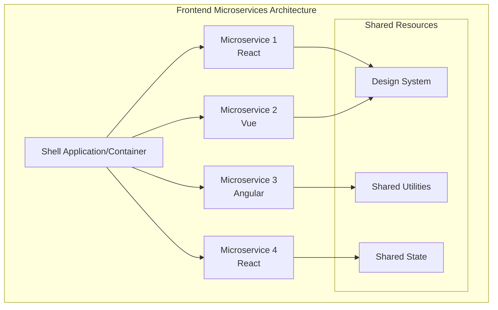

## Monorepo Setup and Management {#monorepo-setup}

### Repository Structure

A well-organized monorepo is crucial for managing multiple frontend microservices:

```
frontend-microservices/
├── packages/
│   ├── shell/                 # Container application
│   ├── header-service/        # Navigation microservice
│   ├── product-catalog/       # Product listing microservice
│   ├── shopping-cart/         # Cart microservice
│   ├── user-profile/          # User management microservice
│   └── shared/
│       ├── design-system/     # Shared UI components
│       ├── utils/            # Common utilities
│       └── types/            # TypeScript definitions
├── tools/
│   ├── build-scripts/
│   ├── webpack-configs/
│   └── deployment/
├── docs/
├── package.json
├── lerna.json
└── nx.json
```

### Monorepo Tools Comparison

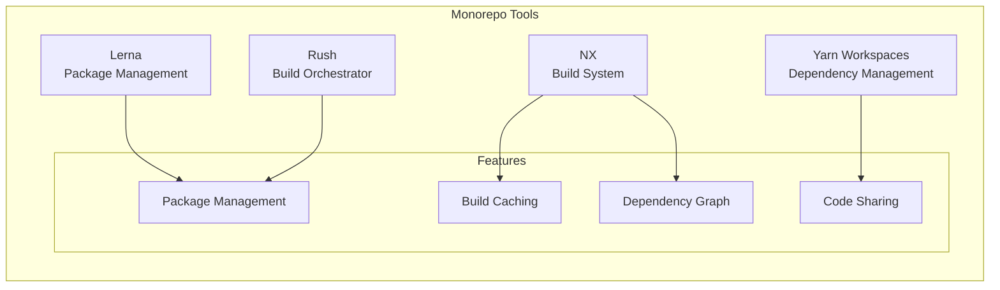

### Sample Package.json Configuration

```json
{
  "name": "frontend-microservices-monorepo",
  "private": true,
  "workspaces": [
    "packages/*"
  ],
  "scripts": {
    "build:all": "nx run-many --target=build --all",
    "test:all": "nx run-many --target=test --all",
    "dev:shell": "nx serve shell",
    "dev:all": "concurrently \"nx serve shell\" \"nx serve header-service\" \"nx serve product-catalog\""
  },
  "devDependencies": {
    "@nrwl/nx": "^16.0.0",
    "lerna": "^7.0.0",
    "concurrently": "^8.0.0"
  }
}
```

## Development Architecture {#development-architecture}

### Local Development Setup

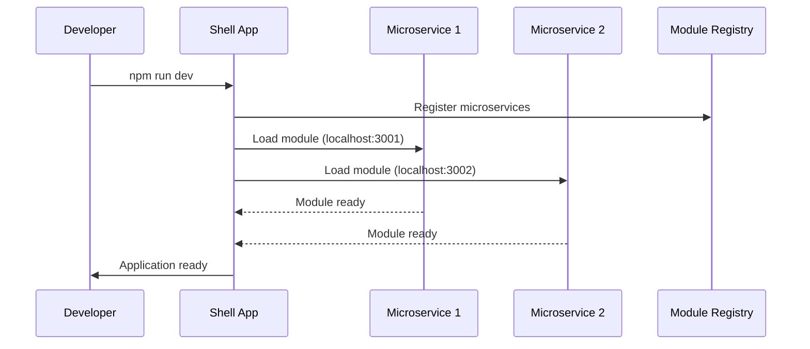

### Module Federation Configuration

Using Webpack Module Federation for runtime integration:

```javascript
// webpack.config.js for Shell Application
const ModuleFederationPlugin = require('@module-federation/webpack');

module.exports = {
  plugins: [
    new ModuleFederationPlugin({
      name: 'shell',
      remotes: {
        headerService: 'headerService@http://localhost:3001/remoteEntry.js',
        productCatalog: 'productCatalog@http://localhost:3002/remoteEntry.js',
        shoppingCart: 'shoppingCart@http://localhost:3003/remoteEntry.js',
      },
      shared: {
        react: { singleton: true },
        'react-dom': { singleton: true },
      },
    }),
  ],
};

// webpack.config.js for Microservice
module.exports = {
  plugins: [
    new ModuleFederationPlugin({
      name: 'headerService',
      filename: 'remoteEntry.js',
      exposes: {
        './Header': './src/Header',
        './Navigation': './src/Navigation',
      },
      shared: {
        react: { singleton: true },
        'react-dom': { singleton: true },
      },
    }),
  ],
};
```

### Communication Patterns

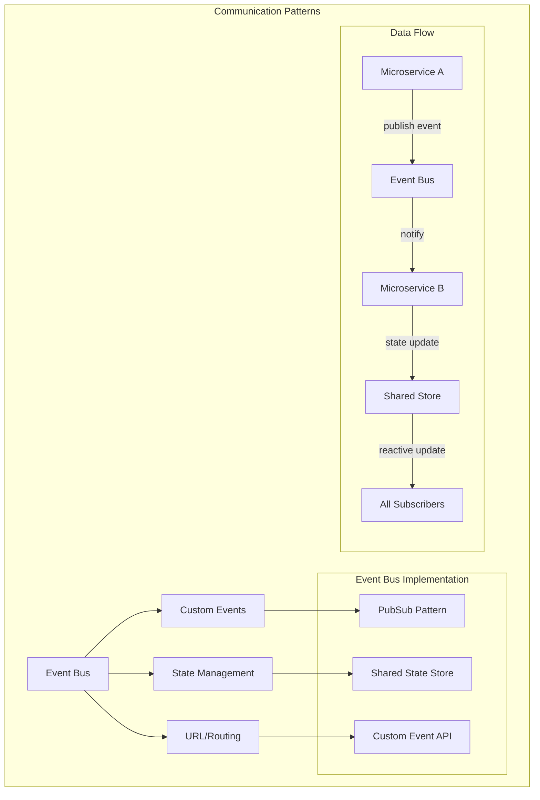

## Runtime Integration Patterns {#runtime-integration}

### 1. Build-Time Integration

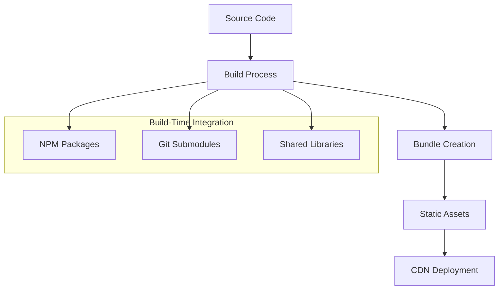

### 2. Runtime Integration

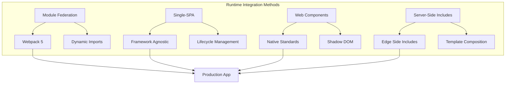

### Module Federation Implementation

```typescript
// Shell application component
import React, { Suspense } from 'react';

const HeaderService = React.lazy(() => import('headerService/Header'));
const ProductCatalog = React.lazy(() => import('productCatalog/ProductList'));

function App() {
  return (
    <div className="app">
      <Suspense fallback={<div>Loading header...</div>}>
        <HeaderService />
      </Suspense>
      
      <main>
        <Suspense fallback={<div>Loading products...</div>}>
          <ProductCatalog />
        </Suspense>
      </main>
    </div>
  );
}

export default App;
```

### State Management Across Microservices

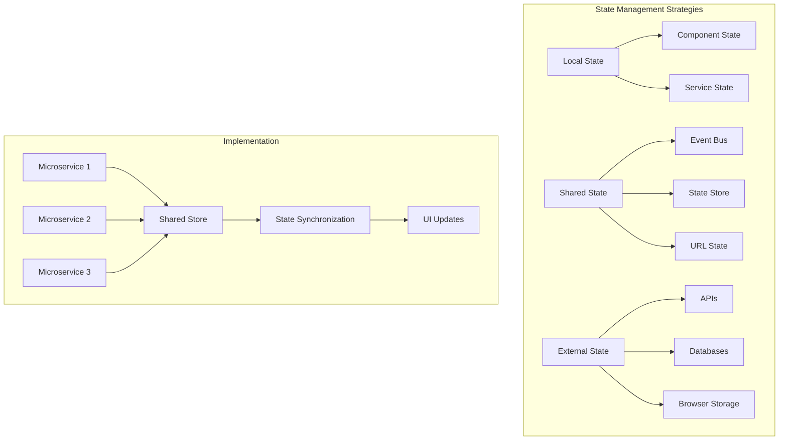

## Deployment Strategies {#deployment-strategies}

### 1. Independent Deployment

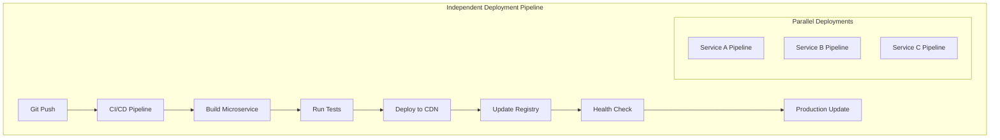

### 2. Versioned Deployments

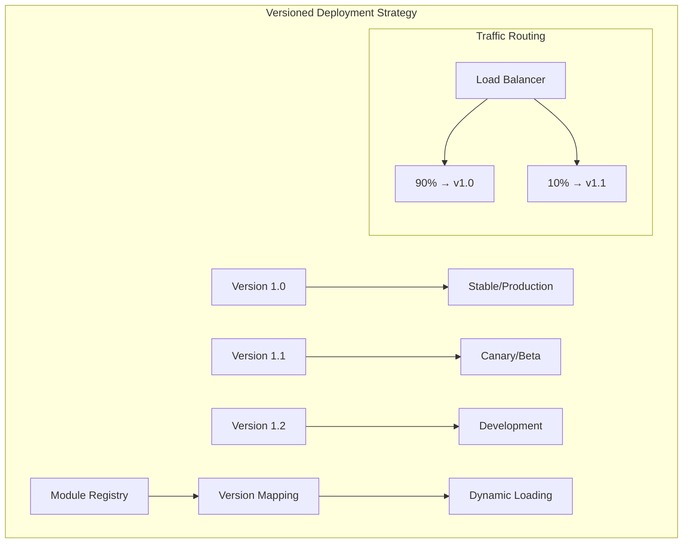

### Container-Based Deployment

```yaml
# docker-compose.yml
version: '3.8'
services:
  shell-app:
    build: ./packages/shell
    ports:
      - "3000:3000"
    environment:
      - MODULE_REGISTRY_URL=http://registry:8080

  header-service:
    build: ./packages/header-service
    ports:
      - "3001:3001"
    
  product-catalog:
    build: ./packages/product-catalog
    ports:
      - "3002:3002"
    
  module-registry:
    build: ./tools/module-registry
    ports:
      - "8080:8080"
    volumes:
      - ./config:/app/config

  nginx:
    image: nginx:alpine
    ports:
      - "80:80"
    volumes:
      - ./nginx.conf:/etc/nginx/nginx.conf
    depends_on:
      - shell-app
      - header-service
      - product-catalog
```

### CI/CD Pipeline Configuration

```yaml
# .github/workflows/deploy-microservice.yml
name: Deploy Microservice

on:
  push:
    branches: [main]
    paths: ['packages/*/']

jobs:
  detect-changes:
    runs-on: ubuntu-latest
    outputs:
      changed-services: ${{ steps.changes.outputs.changes }}
    steps:
      - uses: actions/checkout@v2
      - uses: dorny/paths-filter@v2
        id: changes
        with:
          filters: |
            header-service:
              - 'packages/header-service/**'
            product-catalog:
              - 'packages/product-catalog/**'

  deploy:
    needs: detect-changes
    if: ${{ needs.detect-changes.outputs.changed-services != '[]' }}
    strategy:
      matrix:
        service: ${{ fromJSON(needs.detect-changes.outputs.changed-services) }}
    runs-on: ubuntu-latest
    steps:
      - uses: actions/checkout@v2
      - name: Build and Deploy ${{ matrix.service }}
        run: |
          cd packages/${{ matrix.service }}
          npm ci
          npm run build
          npm run deploy
```

## Tools and Technologies {#tools-and-technologies}

### Essential Tools Ecosystem

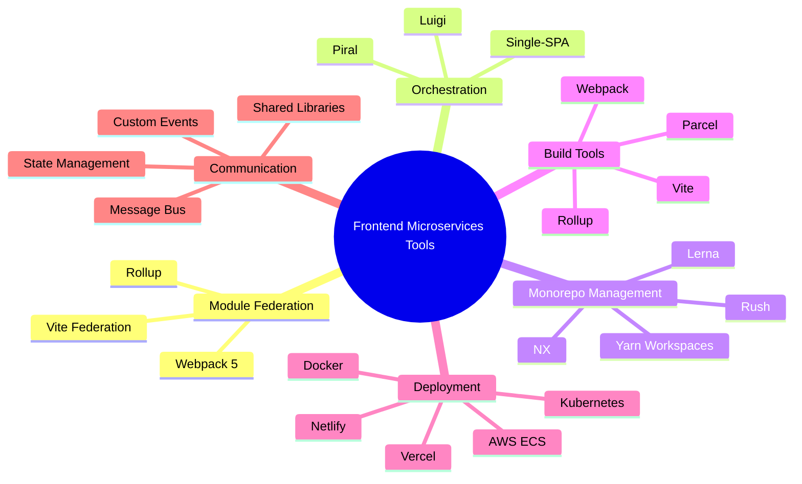

### Technology Stack Recommendations

| Category | Recommended Tools | Alternative Options |
|----------|-------------------|-------------------|
| **Module Federation** | Webpack 5 Module Federation | Vite Federation Plugin |
| **Monorepo Management** | NX | Lerna, Rush, Yarn Workspaces |
| **Orchestration** | Single-SPA | Luigi, Piral |
| **State Management** | Zustand, Redux Toolkit | MobX, Recoil |
| **Build Tools** | Vite, Webpack 5 | Rollup, Parcel |
| **Testing** | Jest, Cypress | Vitest, Playwright |
| **Deployment** | Docker + Kubernetes | AWS ECS, Vercel |

### Sample Tool Configuration

```javascript
// nx.json - NX Configuration
{
  "version": 2,
  "projects": {
    "shell": "packages/shell",
    "header-service": "packages/header-service",
    "product-catalog": "packages/product-catalog"
  },
  "targetDefaults": {
    "build": {
      "cache": true,
      "dependsOn": ["^build"]
    },
    "test": {
      "cache": true
    }
  },
  "cacheDirectory": "tmp/nx-cache"
}

// Module Registry Service
const moduleRegistry = {
  services: {
    'header-service': {
      url: process.env.NODE_ENV === 'production' 
        ? 'https://cdn.example.com/header-service/latest/remoteEntry.js'
        : 'http://localhost:3001/remoteEntry.js',
      version: '1.2.3'
    },
    'product-catalog': {
      url: process.env.NODE_ENV === 'production'
        ? 'https://cdn.example.com/product-catalog/latest/remoteEntry.js'
        : 'http://localhost:3002/remoteEntry.js',
      version: '2.1.0'
    }
  }
};
```

## Best Practices {#best-practices}

### 1. Design Principles

- **Domain-Driven Design**: Align microservices with business domains
- **Loose Coupling**: Minimize dependencies between services
- **High Cohesion**: Keep related functionality together
- **Independent Deployability**: Each service should be deployable independently
- **Technology Agnostic**: Don't force a single technology stack

### 2. Development Guidelines

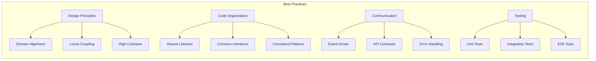

### 3. Performance Optimization

- **Bundle Splitting**: Use dynamic imports and code splitting
- **Caching Strategies**: Implement proper caching for modules
- **Lazy Loading**: Load microservices only when needed
- **Resource Sharing**: Share common dependencies to reduce bundle size
- **CDN Usage**: Deploy static assets to CDN for faster loading

### 4. Security Considerations

- **Authentication**: Implement shared authentication mechanisms
- **Authorization**: Handle permissions across microservices
- **Content Security Policy**: Configure CSP for remote modules
- **HTTPS**: Always use HTTPS in production
- **Input Validation**: Validate data at service boundaries

## Common Pitfalls and Solutions {#common-pitfalls}

### Problem-Solution Matrix

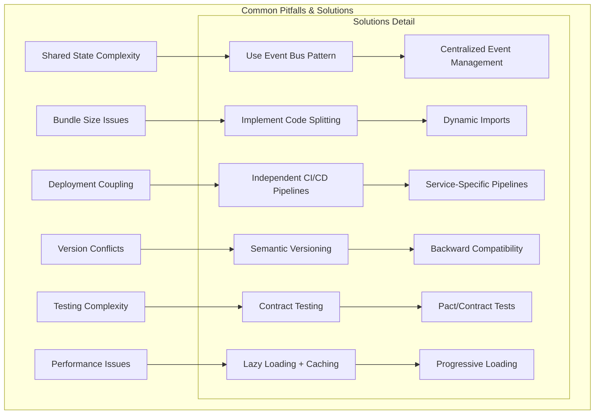

### Troubleshooting Guide

| Problem | Symptoms | Solution |
|---------|----------|----------|
| **Module Loading Failures** | Blank pages, console errors | Check module URLs, CORS settings |
| **State Synchronization Issues** | Inconsistent UI state | Implement proper event bus pattern |
| **Build Time Increases** | Slow CI/CD pipelines | Use build caching and parallel builds |
| **Runtime Errors** | JavaScript errors in production | Implement error boundaries and fallbacks |
| **Performance Degradation** | Slow page loads | Optimize bundle sizes and implement lazy loading |

### Error Boundary Implementation

```typescript
// Error boundary for microservice loading
import React, { Component, ErrorInfo, ReactNode } from 'react';

interface Props {
  children: ReactNode;
  fallback?: ReactNode;
  serviceName: string;
}

interface State {
  hasError: boolean;
  error?: Error;
}

class MicroserviceErrorBoundary extends Component<Props, State> {
  public state: State = {
    hasError: false,
  };

  public static getDerivedStateFromError(error: Error): State {
    return { hasError: true, error };
  }

  public componentDidCatch(error: Error, errorInfo: ErrorInfo) {
    console.error(`Microservice ${this.props.serviceName} failed to load:`, error, errorInfo);
    
    // Report error to monitoring service
    this.reportError(error, errorInfo);
  }

  private reportError = (error: Error, errorInfo: ErrorInfo) => {
    // Implement error reporting logic
  };

  public render() {
    if (this.state.hasError) {
      return this.props.fallback || (
        <div className="microservice-error">
          <h3>Service temporarily unavailable</h3>
          <p>The {this.props.serviceName} service is currently experiencing issues.</p>
          <button onClick={() => window.location.reload()}>
            Retry
          </button>
        </div>
      );
    }

    return this.props.children;
  }
}

export default MicroserviceErrorBoundary;
```

## Getting Started

### Quick Start Template

```bash
# Clone the template repository
git clone https://github.com/your-org/frontend-microservices-template.git
cd frontend-microservices-template

# Install dependencies
npm install

# Start development environment
npm run dev:all

# Build all services
npm run build:all

# Run tests
npm run test:all
```

### Learning Path

1. **Week 1**: Understand microservices concepts and set up monorepo
2. **Week 2**: Implement basic module federation
3. **Week 3**: Add state management and communication patterns
4. **Week 4**: Set up CI/CD pipelines and deployment strategies
5. **Week 5**: Implement monitoring, error handling, and optimization

## Advanced Topics {#advanced-topics}

### Cross-Framework Integration

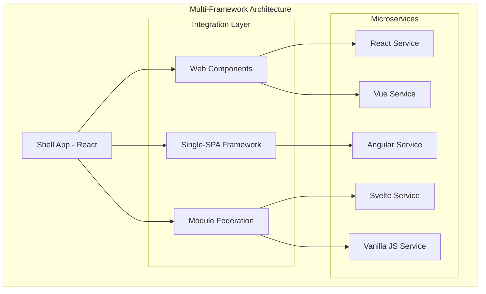

### Micro Frontend Patterns

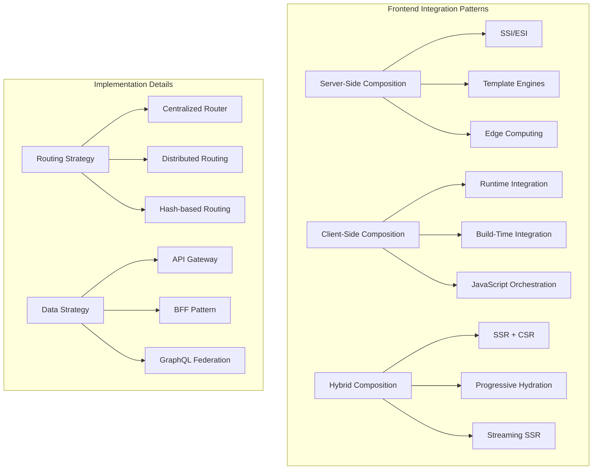

### Micro Frontend Governance

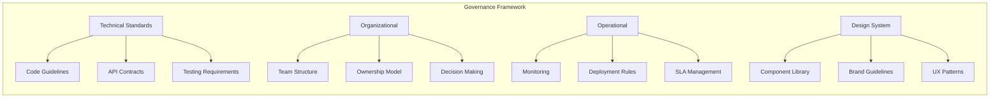

### Performance Monitoring & Observability

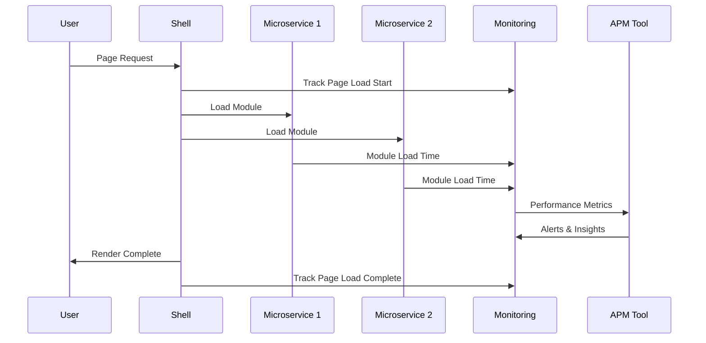

### Security Architecture

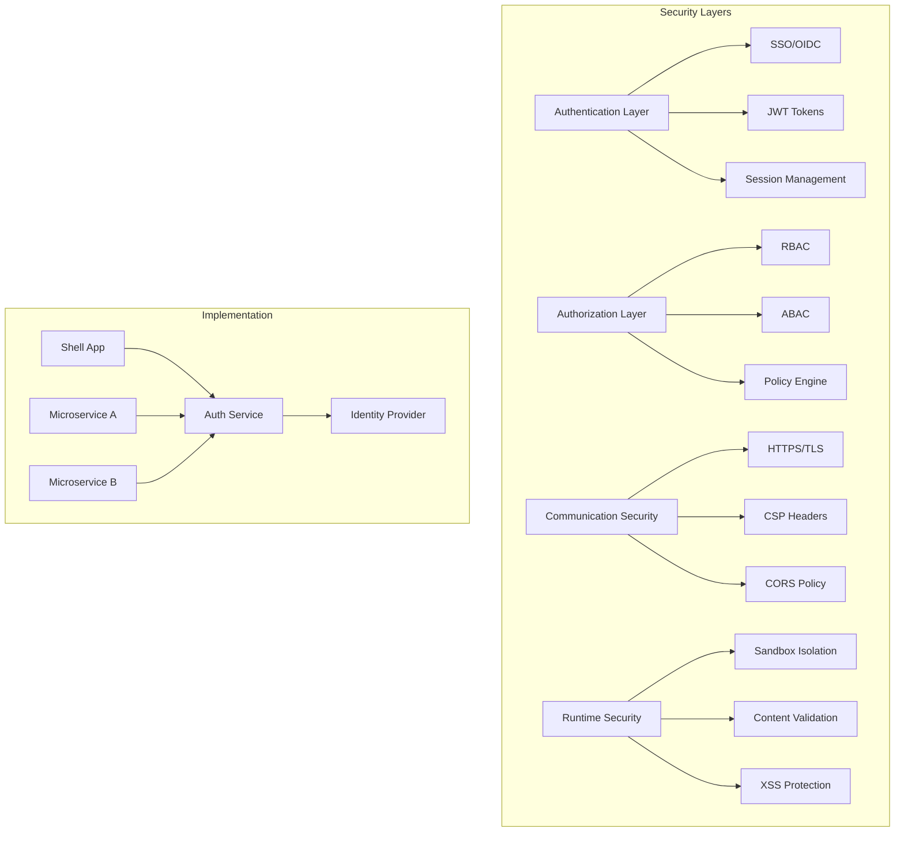

### Advanced State Management Patterns

```typescript
// Cross-Microservice State Management
interface GlobalState {
  user: UserState;
  theme: ThemeState;
  navigation: NavigationState;
  notifications: NotificationState;
}

class MicroFrontendStore {
  private eventBus: EventEmitter;
  private stores: Map<string, any> = new Map();
  
  constructor() {
    this.eventBus = new EventEmitter();
    this.setupGlobalStateSync();
  }
  
  // Subscribe to cross-service state changes
  subscribe(service: string, callback: Function) {
    this.eventBus.on(`${service}:stateChange`, callback);
  }
  
  // Publish state changes to other services
  publish(service: string, state: any) {
    this.stores.set(service, state);
    this.eventBus.emit(`${service}:stateChange`, state);
  }
  
  // Setup bidirectional state synchronization
  private setupGlobalStateSync() {
    // Implement state synchronization logic
  }
}
```

### Testing Strategies Deep Dive

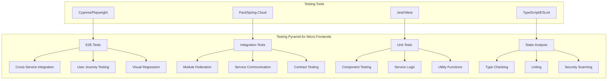

### Contract Testing Implementation

```typescript
// Consumer Contract Test (Shell App)
describe('Header Service Contract', () => {
  let provider: Pact;
  
  beforeAll(() => {
    provider = new Pact({
      consumer: 'shell-app',
      provider: 'header-service',
      port: 1234,
    });
    return provider.setup();
  });
  
  it('should provide navigation items', async () => {
    await provider
      .given('user is authenticated')
      .uponReceiving('a request for navigation items')
      .withRequest({
        method: 'GET',
        path: '/api/navigation',
        headers: { Authorization: 'Bearer token' }
      })
      .willRespondWith({
        status: 200,
        headers: { 'Content-Type': 'application/json' },
        body: {
          items: Matchers.eachLike({
            id: Matchers.string(),
            label: Matchers.string(),
            url: Matchers.string()
          })
        }
      });
      
    const client = new HeaderServiceClient('http://localhost:1234');
    const navigation = await client.getNavigation('token');
    expect(navigation.items).toHaveLength(3);
  });
});
```

### Micro Frontend Analytics

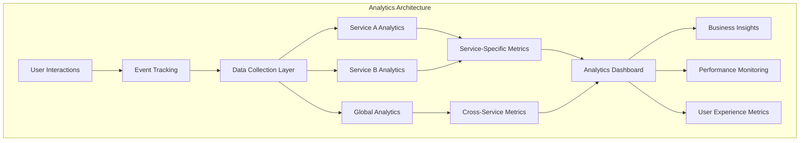

### Progressive Web App Integration

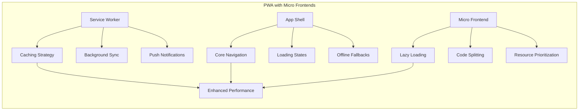

### Edge Computing & CDN Strategy

```mermaid
graph TB
    subgraph "Global Distribution Architecture"
        A[Origin Server] --> B[Primary CDN]
        B --> C[Edge Locations]
        
        subgraph "Edge Services"
            D[Static Assets]
            E[Dynamic Content]
            F[API Responses]
            G[Module Registry]
        end
        
        C --> D
        C --> E
        C --> F
        C --> G
        
        subgraph "Regional Optimization"
            H[US East] --> I[Low Latency]
            J[EU West] --> I
            K[APAC] --> I
        end
    end
```

### Accessibility in Micro Frontends

```typescript
// Accessibility Manager for Micro Frontends
class MicroFrontendA11yManager {
  private services: Map<string, A11yContext> = new Map();
  
  registerService(serviceId: string, context: A11yContext) {
    this.services.set(serviceId, context);
    this.setupA11yBridge(serviceId, context);
  }
  
  private setupA11yBridge(serviceId: string, context: A11yContext) {
    // Manage focus across micro frontends
    this.manageFocus(serviceId, context);
    
    // Coordinate screen reader announcements
    this.manageScreenReaderAnnouncements(serviceId);
    
    // Handle keyboard navigation
    this.setupKeyboardNavigation(serviceId);
  }
  
  private manageFocus(serviceId: string, context: A11yContext) {
    context.onFocusChange = (element: HTMLElement) => {
      // Notify other services about focus changes
      this.broadcastFocusChange(serviceId, element);
    };
  }
}
```

### Multi-Tenant Architecture

```mermaid
graph TB
    subgraph "Multi-Tenant Micro Frontends"
        A[Tenant Router] --> B[Tenant A Config]
        A --> C[Tenant B Config]
        A --> D[Tenant C Config]
        
        B --> E[Branded Shell A]
        C --> F[Branded Shell B]
        D --> G[Branded Shell C]
        
        subgraph "Shared Services"
            H[Auth Service]
            I[Common Components]
            J[Shared Logic]
        end
        
        E --> H
        F --> H
        G --> H
        
        E --> I
        F --> I
        G --> I
    end
```

### Development Experience (DX) Tools

```mermaid
flowchart LR
    subgraph "Developer Experience Tools"
        A[CLI Tools] --> A1[Service Generator]
        A --> A2[Build Scripts]
        A --> A3[Dev Server]
        
        B[IDE Integration] --> B1[VSCode Extension]
        B --> B2[IntelliSense]
        B --> B3[Debugging Tools]
        
        C[Local Development] --> C1[Hot Reload]
        C --> C2[Service Mocking]
        C --> C3[Dependency Graph]
        
        D[Documentation] --> D1[Auto-generated Docs]
        D --> D2[API Specs]
        D --> D3[Architecture Diagrams]
    end
```

## Emerging Patterns & Future Trends

### Server Components Integration

```typescript
// Next.js App Router with Micro Frontend Server Components
// app/layout.tsx
import { HeaderService } from '@/microfrontends/header';
import { Suspense } from 'react';

export default function RootLayout({
  children,
}: {
  children: React.ReactNode;
}) {
  return (
    <html>
      <body>
        <Suspense fallback={<HeaderSkeleton />}>
          <HeaderService />
        </Suspense>
        <main>{children}</main>
      </body>
    </html>
  );
}
```

### AI-Powered Micro Frontend Optimization

```mermaid
graph TB
    subgraph "AI-Enhanced Micro Frontends"
        A[Performance AI] --> A1[Load Prediction]
        A --> A2[Resource Optimization]
        A --> A3[Caching Strategy]
        
        B[User Experience AI] --> B1[Personalization]
        B --> B2[A/B Testing]
        B --> B3[Content Optimization]
        
        C[Development AI] --> C1[Code Generation]
        C --> C2[Bug Detection]
        C --> C3[Architecture Suggestions]
        
        D[Operations AI] --> D1[Anomaly Detection]
        D --> D2[Auto Scaling]
        D --> D3[Incident Response]
    end
```

## Resources and Further Reading

- [Webpack Module Federation Documentation](https://webpack.js.org/concepts/module-federation/)
- [Single-SPA Framework](https://single-spa.js.org/)
- [Micro Frontends by Cam Jackson](https://martinfowler.com/articles/micro-frontends.html)
- [Building Micro Frontends - Book by Luca Mezzalira](https://www.buildingmicrofrontends.com/)
- [NX Monorepo Documentation](https://nx.dev/)
- [Module Federation Examples Repository](https://github.com/module-federation/module-federation-examples)
- [Micro Frontend Testing Strategies](https://testing-library.com/docs/react-testing-library/intro/)
- [Web Components Standards](https://developer.mozilla.org/en-US/docs/Web/Web_Components)
- [Frontend Architecture Patterns](https://frontendmastery.com/posts/frontend-architecture-patterns/)
- [Micro Frontend Security Best Practices](https://owasp.org/www-project-top-ten/)

---

## Contributing

We welcome contributions to improve this guide! Please:

1. Fork the repository
2. Create a feature branch
3. Make your changes
4. Add or update relevant documentation
5. Submit a pull request

## License

This project is licensed under the MIT License - see the [LICENSE](LICENSE) file for details.

---

*Last updated: September 2025*