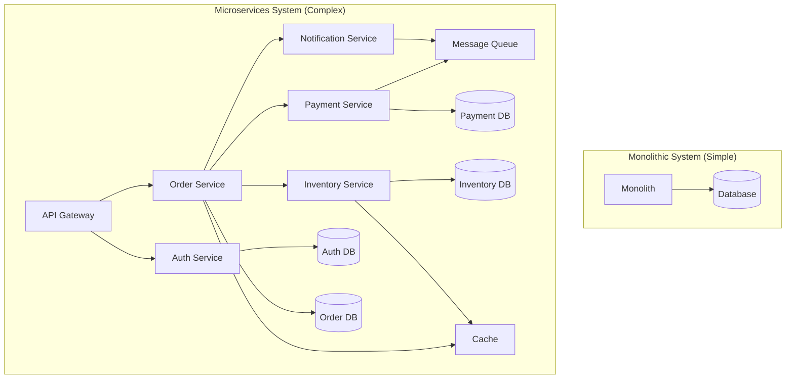
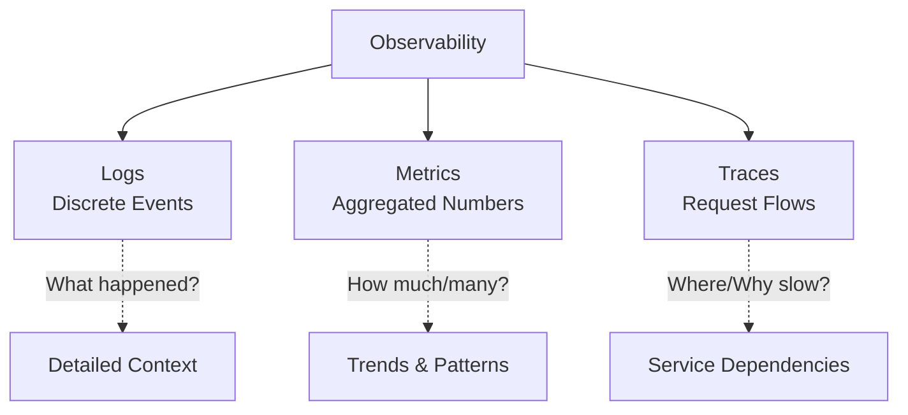
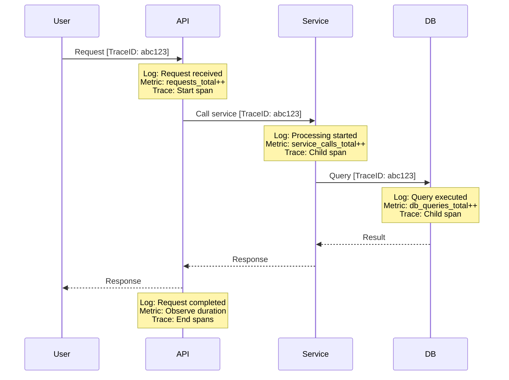
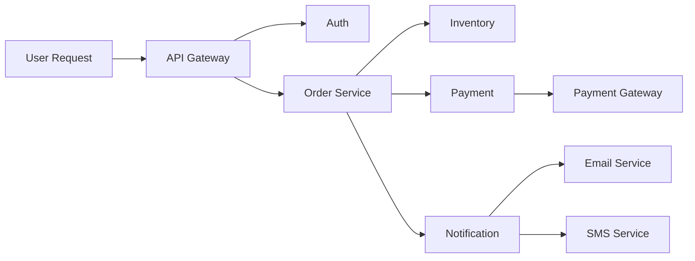

# Introduction to Observability

## Table of Contents
- [What is Observability?](#what-is-observability)
- [Observability vs Monitoring](#observability-vs-monitoring)
- [Why Observability Matters](#why-observability-matters)
- [The Three Pillars](#the-three-pillars)
- [Observability in Distributed Systems](#observability-in-distributed-systems)
- [Key Concepts](#key-concepts)
- [Getting Started](#getting-started)

## What is Observability?

**Observability** is a measure of how well you can understand the internal state of a system by examining its external outputs. In software engineering, it refers to the ability to ask arbitrary questions about your system's behavior without having to predict those questions in advance or deploy new code.

### Definition

> A system is observable if you can determine its internal state by examining its outputs (logs, metrics, traces) without needing to ship new code or add new instrumentation.

### Core Principle

The key difference between traditional monitoring and observability is that observability enables you to explore and understand **unknown unknowns** - problems you didn't anticipate and couldn't have predicted.

```javascript
// Traditional Monitoring: Pre-defined checks
function checkSystemHealth() {
  const cpuUsage = getCPUUsage();
  const memoryUsage = getMemoryUsage();
  
  if (cpuUsage > 80) {
    alert('High CPU usage');
  }
  if (memoryUsage > 90) {
    alert('High memory usage');
  }
}

// Observability: Rich context for exploration
function instrumentRequest(req, res, next) {
  const trace = startTrace({
    requestId: req.id,
    userId: req.user?.id,
    endpoint: req.path,
    method: req.method,
    headers: sanitizeHeaders(req.headers),
    timestamp: Date.now()
  });
  
  // Rich context allows asking questions later:
  // "Why are requests from this user slow?"
  // "What changed in the last hour?"
  // "Which endpoints are affected?"
  
  res.on('finish', () => {
    trace.end({
      statusCode: res.statusCode,
      duration: Date.now() - trace.startTime,
      responseSize: res.get('content-length')
    });
  });
  
  next();
}
```

## Observability vs Monitoring

While related, observability and monitoring serve different purposes:

| Aspect | Monitoring | Observability |
|--------|-----------|---------------|
| **Purpose** | Detect known problems | Investigate unknown problems |
| **Questions** | "Is the system working?" | "Why is the system behaving this way?" |
| **Approach** | Pre-defined dashboards and alerts | Ad-hoc queries and exploration |
| **Scope** | Known failure modes | Unknown and emergent behaviors |
| **Implementation** | Metrics and thresholds | Logs, metrics, traces with high cardinality |
| **Use Case** | Operational health checks | Debugging and root cause analysis |

### Monitoring Example

```javascript
// Monitoring: Fixed metrics
const metrics = {
  requestCount: new Counter('http_requests_total'),
  errorCount: new Counter('http_errors_total'),
  latency: new Histogram('http_request_duration_seconds')
};

app.use((req, res, next) => {
  const start = Date.now();
  
  res.on('finish', () => {
    metrics.requestCount.inc();
    if (res.statusCode >= 400) {
      metrics.errorCount.inc();
    }
    metrics.latency.observe((Date.now() - start) / 1000);
  });
  
  next();
});

// Can answer: "How many errors occurred?"
// Cannot answer: "Which users experienced errors?" without adding new metrics
```

### Observability Example

```javascript
// Observability: Rich, high-cardinality data
const logger = require('pino')();
const tracer = require('@opentelemetry/api').trace.getTracer('api');

app.use((req, res, next) => {
  const span = tracer.startSpan('http_request', {
    attributes: {
      'http.method': req.method,
      'http.url': req.url,
      'http.user_agent': req.get('user-agent'),
      'user.id': req.user?.id,
      'user.tier': req.user?.tier,
      'request.id': req.id,
      'client.ip': req.ip
    }
  });
  
  res.on('finish', () => {
    span.setAttributes({
      'http.status_code': res.statusCode,
      'http.response_size': res.get('content-length')
    });
    
    logger.info({
      event: 'http_request_completed',
      traceId: span.spanContext().traceId,
      ...span.attributes
    });
    
    span.end();
  });
  
  next();
});

// Can answer any question:
// "Which premium users had slow requests in the last hour?"
// "What's the error rate for mobile clients on the /checkout endpoint?"
// "Show me all requests from this IP that resulted in 5xx errors"
```

## Why Observability Matters

### Modern System Complexity



### Key Challenges in Modern Systems

1. **Distributed Architecture**: Requests span multiple services
2. **Dynamic Infrastructure**: Auto-scaling, containers, serverless
3. **High Cardinality**: Millions of unique combinations of dimensions
4. **Emergent Behaviors**: Complex interactions create unexpected issues
5. **Rapid Changes**: Frequent deployments introduce new failure modes

### Real-World Scenarios

```javascript
// Scenario: Investigating a production incident
// Question: "Why are checkout requests slow for users in EU region?"

// Without Observability: Limited information
{
  avgResponseTime: 2500, // ms
  errorRate: 0.05, // 5%
  endpoint: '/checkout'
}
// Result: Need to deploy new instrumentation and wait for the issue to recur

// With Observability: Rich context
async function investigateSlowCheckouts() {
  // Query traces with high-cardinality dimensions
  const slowTraces = await queryTraces({
    service: 'checkout-service',
    duration: { $gt: 2000 },
    'user.region': 'EU',
    timeRange: 'last_1h'
  });
  
  // Discover: EU users hit a different payment gateway
  const analysis = analyzeTraces(slowTraces);
  console.log({
    totalRequests: 1247,
    affectedUsers: 342,
    averageDuration: 2834,
    commonAttributes: {
      'payment.gateway': 'stripe-eu',
      'payment.gateway.latency': 2200, // Bottleneck found!
      'cache.hit': false
    }
  });
  
  // Root cause: EU payment gateway having issues
  // Action: Route EU traffic to backup gateway
}
```

## The Three Pillars

Observability is built on three fundamental data types:



### 1. Logs

**Definition**: Timestamped records of discrete events that occurred in the system.

**Characteristics**:
- High granularity
- Rich context
- Unstructured or structured
- High volume

**Use Cases**:
- Debugging specific errors
- Audit trails
- Security events
- Understanding exact sequence of events

```javascript
// Structured logging example
logger.info({
  event: 'payment_processed',
  timestamp: '2025-10-06T10:30:45.123Z',
  traceId: 'abc123',
  userId: 'user_789',
  orderId: 'order_456',
  amount: 99.99,
  currency: 'USD',
  paymentMethod: 'credit_card',
  gateway: 'stripe',
  duration: 245,
  status: 'success'
});
```

### 2. Metrics

**Definition**: Numerical measurements aggregated over time intervals.

**Characteristics**:
- Low cardinality (limited dimensions)
- Efficient storage
- Mathematical operations
- Time-series data

**Use Cases**:
- Dashboards
- Alerting on thresholds
- Capacity planning
- Performance trending

```javascript
// Metrics example
const metrics = {
  // Counter: Monotonically increasing value
  paymentsTotal: new Counter({
    name: 'payments_processed_total',
    help: 'Total payments processed',
    labelNames: ['status', 'gateway']
  }),
  
  // Gauge: Value that can go up or down
  activeConnections: new Gauge({
    name: 'active_connections',
    help: 'Number of active connections'
  }),
  
  // Histogram: Distribution of values
  paymentDuration: new Histogram({
    name: 'payment_duration_seconds',
    help: 'Payment processing duration',
    buckets: [0.1, 0.5, 1, 2, 5, 10]
  })
};

// Recording metrics
metrics.paymentsTotal.inc({ status: 'success', gateway: 'stripe' });
metrics.activeConnections.set(42);
metrics.paymentDuration.observe(0.245);
```

### 3. Traces

**Definition**: Records of the path of a request as it moves through distributed services.

**Characteristics**:
- Shows service dependencies
- Captures timing information
- Links related operations
- Provides distributed context

**Use Cases**:
- Understanding request flows
- Identifying bottlenecks
- Service dependency mapping
- Latency attribution

```javascript
// Distributed tracing example
const { trace, context } = require('@opentelemetry/api');

async function processPayment(orderId, amount) {
  const tracer = trace.getTracer('payment-service');
  
  // Start parent span
  const parentSpan = tracer.startSpan('process_payment', {
    attributes: {
      'order.id': orderId,
      'payment.amount': amount
    }
  });
  
  try {
    // Child span for validation
    const validationSpan = tracer.startSpan('validate_payment', {
      parent: parentSpan
    });
    await validatePayment(orderId);
    validationSpan.end();
    
    // Child span for external call
    const gatewaySpan = tracer.startSpan('call_payment_gateway', {
      parent: parentSpan,
      attributes: {
        'gateway.name': 'stripe',
        'gateway.endpoint': '/v1/charges'
      }
    });
    const result = await callStripe(amount);
    gatewaySpan.setAttributes({
      'gateway.response_time': result.duration,
      'gateway.transaction_id': result.transactionId
    });
    gatewaySpan.end();
    
    parentSpan.setStatus({ code: 0 }); // Success
    return result;
  } catch (error) {
    parentSpan.setStatus({
      code: 2, // Error
      message: error.message
    });
    throw error;
  } finally {
    parentSpan.end();
  }
}
```

### How the Pillars Work Together



## Observability in Distributed Systems

### Challenges

1. **Request Fan-out**: A single user request triggers multiple service calls



2. **Asynchronous Operations**: Events processed out-of-order

```javascript
// Correlating async operations
const { trace, context, propagation } = require('@opentelemetry/api');

// Producer: Publish message with trace context
async function publishOrderEvent(orderId) {
  const span = trace.getTracer('order-service').startSpan('publish_order_event');
  
  const carrier = {};
  propagation.inject(context.active(), carrier);
  
  await messageQueue.publish({
    topic: 'orders',
    payload: { orderId },
    headers: carrier // Propagate trace context
  });
  
  span.end();
}

// Consumer: Continue trace from message
async function processOrderEvent(message) {
  const extractedContext = propagation.extract(context.active(), message.headers);
  const span = trace.getTracer('notification-service').startSpan(
    'process_order_event',
    undefined,
    extractedContext // Link to original trace
  );
  
  // Processing logic
  
  span.end();
}
```

3. **Dynamic Infrastructure**: Services scale up/down automatically

```javascript
// Service discovery with observability
class ServiceRegistry {
  constructor() {
    this.services = new Map();
    this.metrics = {
      activeInstances: new Gauge({
        name: 'service_instances_active',
        labelNames: ['service']
      })
    };
  }
  
  registerInstance(serviceName, instance) {
    if (!this.services.has(serviceName)) {
      this.services.set(serviceName, new Set());
    }
    
    this.services.get(serviceName).add(instance);
    this.metrics.activeInstances.set(
      { service: serviceName },
      this.services.get(serviceName).size
    );
    
    logger.info({
      event: 'service_registered',
      service: serviceName,
      instance: instance.id,
      totalInstances: this.services.get(serviceName).size
    });
  }
  
  deregisterInstance(serviceName, instance) {
    this.services.get(serviceName)?.delete(instance);
    this.metrics.activeInstances.set(
      { service: serviceName },
      this.services.get(serviceName)?.size || 0
    );
    
    logger.info({
      event: 'service_deregistered',
      service: serviceName,
      instance: instance.id,
      remainingInstances: this.services.get(serviceName)?.size || 0
    });
  }
}
```

## Key Concepts

### Cardinality

**Definition**: The number of unique combinations of dimension values in your data.

```javascript
// Low cardinality (Good for metrics)
metrics.requests.inc({ 
  status: 'success', // 2 values: success, error
  method: 'GET'      // 4 values: GET, POST, PUT, DELETE
}); 
// Total combinations: 2 × 4 = 8

// High cardinality (Bad for metrics, good for logs/traces)
metrics.requests.inc({
  status: 'success',
  userId: 'user_12345',    // Millions of values
  requestId: 'req_67890'   // Infinite values
});
// Total combinations: 2 × millions × infinite = Explosion!

// Use traces for high cardinality
span.setAttributes({
  'user.id': 'user_12345',
  'request.id': 'req_67890',
  'user.email': 'user@example.com',
  'user.ip': '192.168.1.1'
  // No limit on dimensions
});
```

### Correlation

**Definition**: Linking related observability data across the three pillars.

```javascript
const traceId = generateTraceId();
const spanId = generateSpanId();

// Add trace context to all three pillars
function handleRequest(req, res) {
  // Trace
  const span = tracer.startSpan('handle_request', {
    traceId,
    spanId
  });
  
  // Log
  logger.info({
    event: 'request_started',
    traceId,
    spanId,
    path: req.path
  });
  
  // Metric
  metrics.requests.inc({
    endpoint: req.path
  });
  
  // Now you can:
  // 1. See metric spike
  // 2. Query logs with traceId
  // 3. View full trace in tracing UI
}
```

### Sampling

**Definition**: Reducing data volume by recording only a subset of events.

```javascript
// Probabilistic sampling
class ProbabilitySampler {
  constructor(probability = 0.1) {
    this.probability = probability;
  }
  
  shouldSample() {
    return Math.random() < this.probability;
  }
}

// Head-based sampling (decide at request start)
function handleRequest(req, res) {
  const sampler = new ProbabilitySampler(0.1); // 10% sample rate
  
  if (sampler.shouldSample() || req.path.includes('/checkout')) {
    // Always sample important endpoints
    const span = tracer.startSpan('handle_request');
    // ... full instrumentation
    span.end();
  }
}

// Tail-based sampling (decide after completion)
function smartSampler(trace) {
  // Always keep traces that:
  return (
    trace.hasError ||                    // Had errors
    trace.duration > 1000 ||             // Were slow
    trace.statusCode >= 400 ||           // Had client/server errors
    trace.attributes['user.tier'] === 'premium' // Premium users
  );
}
```

## Getting Started

### Step 1: Instrument Your Application

```javascript
// Basic instrumentation setup
const { NodeTracerProvider } = require('@opentelemetry/sdk-trace-node');
const { registerInstrumentations } = require('@opentelemetry/instrumentation');
const { HttpInstrumentation } = require('@opentelemetry/instrumentation-http');
const { ExpressInstrumentation } = require('@opentelemetry/instrumentation-express');
const pino = require('pino');
const client = require('prom-client');

// Initialize tracing
const provider = new NodeTracerProvider();
provider.register();

registerInstrumentations({
  instrumentations: [
    new HttpInstrumentation(),
    new ExpressInstrumentation()
  ]
});

// Initialize logging
const logger = pino({
  level: 'info',
  formatters: {
    level: (label) => ({ level: label })
  }
});

// Initialize metrics
const register = new client.Registry();
client.collectDefaultMetrics({ register });
```

### Step 2: Add Context to Your Code

```javascript
const express = require('express');
const app = express();

app.use((req, res, next) => {
  // Add correlation ID
  req.id = req.get('x-request-id') || generateId();
  res.setHeader('x-request-id', req.id);
  
  // Add trace context
  const span = tracer.startActiveSpan('http_request');
  req.span = span;
  
  // Log request
  logger.info({
    event: 'request_received',
    requestId: req.id,
    traceId: span.spanContext().traceId,
    method: req.method,
    path: req.path
  });
  
  next();
});

app.get('/api/users/:id', async (req, res) => {
  const userId = req.params.id;
  
  try {
    const user = await getUserFromDatabase(userId);
    
    logger.info({
      event: 'user_fetched',
      requestId: req.id,
      userId
    });
    
    res.json(user);
  } catch (error) {
    logger.error({
      event: 'user_fetch_failed',
      requestId: req.id,
      userId,
      error: error.message
    });
    
    req.span.recordException(error);
    res.status(500).json({ error: 'Internal server error' });
  } finally {
    req.span.end();
  }
});
```

### Step 3: Set Up Collection and Storage

See related documentation:
- [Log Aggregation](./05-log-aggregation.md)
- [Metrics Collection](./06-metrics-collection.md)
- [Distributed Tracing](./07-distributed-tracing.md)

### Step 4: Build Dashboards and Alerts

See related documentation:
- [Visualization and Dashboards](./09-visualization-dashboards.md)
- [Alerting and Monitoring](./08-alerting-and-monitoring.md)

## Next Steps

Continue your observability journey:

1. **[Logging](./02-logging.md)** - Deep dive into structured logging practices
2. **[Metrics](./03-metrics.md)** - Learn about metric types and collection
3. **[Tracing](./04-tracing.md)** - Understand distributed tracing fundamentals
4. **[Tools Ecosystem](./11-tools-ecosystem.md)** - Explore available tools and platforms
5. **[Best Practices](./12-best-practises.md)** - Learn industry best practices

## Summary

Observability is essential for understanding modern distributed systems. By instrumenting your applications with logs, metrics, and traces, you gain the ability to:

- **Debug production issues** without reproducing them locally
- **Understand system behavior** under real-world conditions
- **Proactively identify problems** before users are affected
- **Make data-driven decisions** about architecture and performance
- **Reduce mean time to resolution (MTTR)** for incidents

The key is to start simple, instrument incrementally, and build a culture of observability within your team.

---

**Related Documentation:**
- [README](./README.md) - Overview of observability topics
- [Microservices](../microservices/) - Observability in microservices architecture
- [API Gateways](../api-gateways/) - Gateway-level observability patterns