# Logging

## Table of Contents
- [Introduction](#introduction)
- [Log Levels](#log-levels)
- [Structured vs Unstructured Logging](#structured-vs-unstructured-logging)
- [Context Propagation](#context-propagation)
- [Log Sampling](#log-sampling)
- [Best Practices](#best-practices)
- [Security and Compliance](#security-and-compliance)
- [Performance Considerations](#performance-considerations)
- [Log Lifecycle](#log-lifecycle)
- [Common Patterns](#common-patterns)

## Introduction

Logging is the practice of recording discrete events that occur within a system. Unlike metrics that provide aggregated numerical data, logs capture individual occurrences with complete context, making them essential for debugging, auditing, and understanding system behavior.

### Purpose of Logging

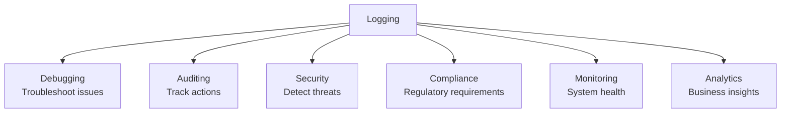

### Characteristics of Logs

1. **Discrete Events**: Each log represents a single point-in-time occurrence
2. **High Cardinality**: Can contain unlimited unique attributes
3. **Rich Context**: Includes detailed information about what happened
4. **Sequential**: Logs form a timeline of system events
5. **Immutable**: Once written, logs should not be modified

### Types of Logs

| Type | Purpose | Examples | Retention |
|------|---------|----------|-----------|
| **Application Logs** | Business logic events | User actions, transactions | 7-30 days |
| **System Logs** | OS and infrastructure | CPU usage, disk I/O | 30-90 days |
| **Access Logs** | Request/response records | HTTP requests, API calls | 30-90 days |
| **Audit Logs** | Security and compliance | Login attempts, data changes | 1-7 years |
| **Error Logs** | Failures and exceptions | Stack traces, errors | 90 days - 1 year |
| **Debug Logs** | Detailed troubleshooting | Variable states, flow control | 1-7 days |

## Log Levels

Log levels categorize the severity and importance of logged events. Proper use of log levels ensures that critical information is not buried in noise.

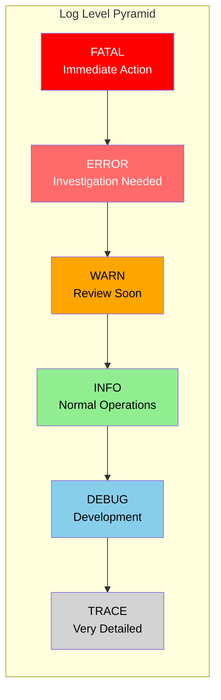

### Level Definitions

#### FATAL/CRITICAL
**When to use**: System is completely unusable and requires immediate intervention

**Characteristics**:
- Application cannot continue
- Data loss or corruption risk
- Service completely unavailable
- Requires immediate on-call response

**Examples**:
- Database connection pool exhausted
- Critical configuration missing
- Out of memory errors
- Disk space completely full

**Volume**: Very rare (should trigger pages)

---

#### ERROR
**When to use**: Something failed but the system continues operating

**Characteristics**:
- Request failed but system healthy
- Recoverable errors
- External service failures
- User-facing errors

**Examples**:
- Payment gateway timeout
- Failed to send email
- Invalid API response from third party
- Database query timeout on single request

**Volume**: Should be monitored but not constant

---

#### WARN
**When to use**: Potentially problematic situations that deserve attention

**Characteristics**:
- Degraded performance
- Deprecated feature usage
- Approaching limits
- Fallback mechanisms activated

**Examples**:
- Cache miss rate above threshold
- API response time above SLA
- Using deprecated API version
- Connection pool 80% utilized
- Retry logic activated

**Volume**: Should be reviewed regularly

---

#### INFO
**When to use**: Important business events and normal operations

**Characteristics**:
- Significant business events
- State changes
- Lifecycle events
- User actions

**Examples**:
- User registration
- Order completed
- Service startup/shutdown
- Configuration changes
- Scheduled job execution

**Volume**: Default production level

---

#### DEBUG
**When to use**: Detailed information useful for diagnosing issues

**Characteristics**:
- Internal state information
- Intermediate calculations
- Decision points
- Algorithm details

**Examples**:
- Discount calculation steps
- Cache hit/miss details
- Query parameters
- Function entry/exit
- Conditional branch taken

**Volume**: High - typically disabled in production

---

#### TRACE
**When to use**: Very fine-grained information for deep debugging

**Characteristics**:
- Execution flow details
- Loop iterations
- Variable values at each step
- Very high verbosity

**Examples**:
- Each item in batch processing
- Every step of algorithm execution
- All variable states
- Complete request/response payloads

**Volume**: Extremely high - rarely enabled

### Log Level Decision Tree

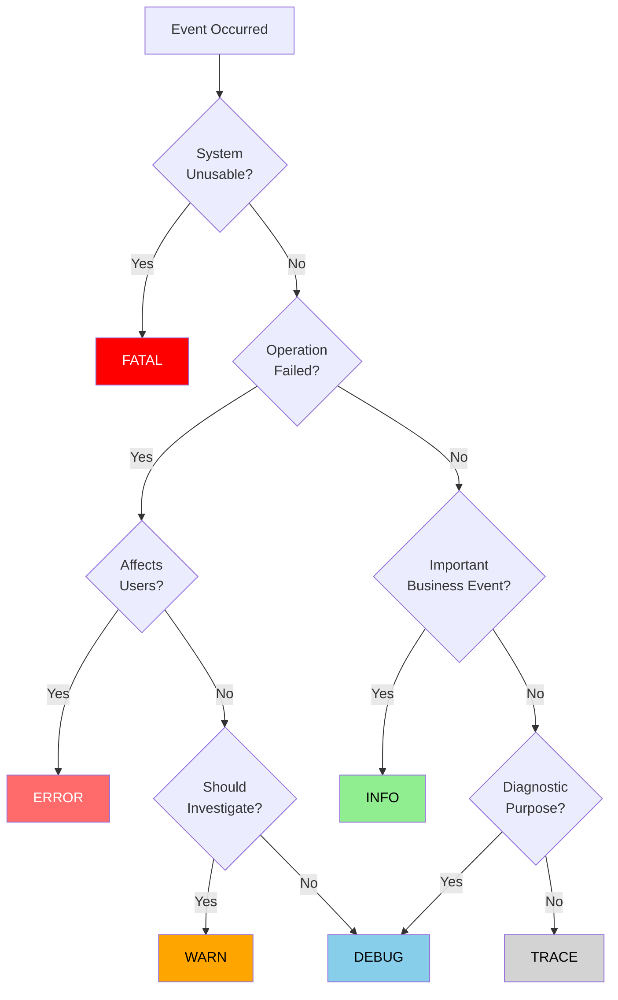

## Structured vs Unstructured Logging

### Unstructured Logging

Plain text logs that are human-readable but difficult to parse programmatically.

**Format**: Free-form text strings

**Advantages**:
- Easy to write
- Human-readable
- Simple to implement
- No schema required

**Disadvantages**:
- Difficult to parse
- Hard to query efficiently
- Inconsistent formats
- No type safety
- Limited aggregation capabilities

**Example**:
```
2025-10-06 10:30:45 INFO User john@example.com logged in from 192.168.1.1
2025-10-06 10:31:12 ERROR Failed to process payment for order #12345 - timeout
```

**Parsing Challenge**: Requires complex regular expressions and string manipulation.

### Structured Logging

Logs formatted as key-value pairs or JSON objects that are machine-readable.

**Format**: JSON, key-value pairs, or structured formats

**Advantages**:
- Easy to parse and query
- Consistent schema
- Type-safe fields
- Efficient indexing
- Powerful aggregations
- Machine-readable

**Disadvantages**:
- More verbose
- Requires schema design
- Storage overhead
- Less human-readable in raw form

**Example**:
```json
{
  "timestamp": "2025-10-06T10:30:45.123Z",
  "level": "INFO",
  "event": "user_login",
  "user": {
    "email": "john@example.com",
    "id": "user_123"
  },
  "ip": "192.168.1.1",
  "userAgent": "Mozilla/5.0..."
}
```

**Query Capability**: Simple field-based queries like `event="user_login" AND user.id="user_123"`

### Comparison

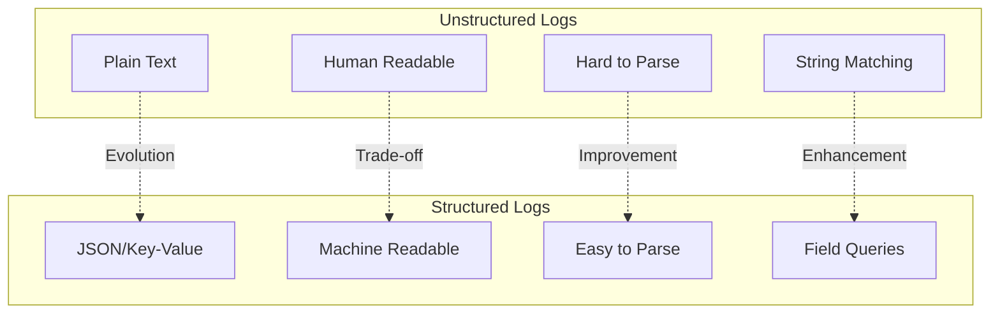

### When to Use Each

| Scenario | Recommendation | Reason |
|----------|---------------|---------|
| Modern distributed systems | **Structured** | Need correlation, aggregation, analysis |
| Simple applications | Either | Complexity may not justify structured |
| High-volume systems | **Structured** | Efficient parsing and indexing |
| Compliance requirements | **Structured** | Consistent audit trail |
| Development/debugging | Either | Human readability matters |
| Production systems | **Structured** | Operational requirements |

## Context Propagation

Context propagation ensures that related logs across different services and components can be correlated and traced back to originating requests.

### Why Context Matters

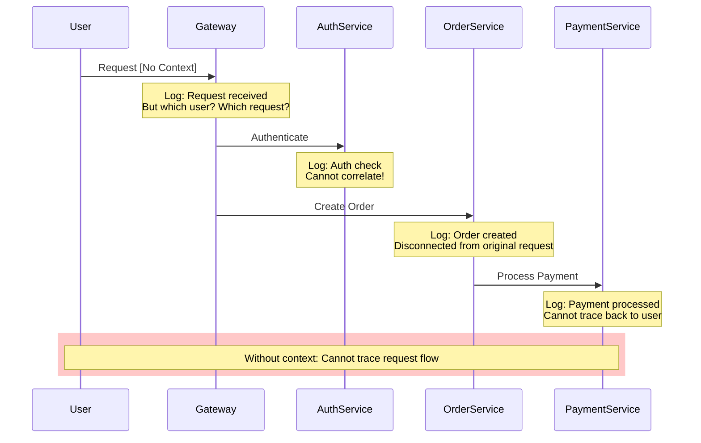

### With Context Propagation

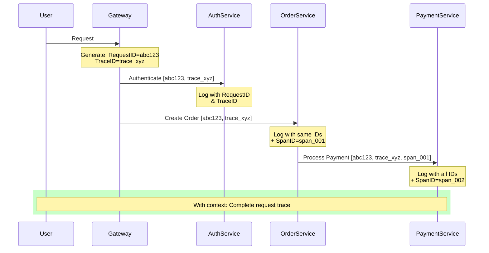

### Types of Context

#### 1. Request Context
- **Request ID**: Unique identifier for each request
- **Session ID**: User session identifier
- **User ID**: Authenticated user
- **Client ID**: Calling application
- **API Version**: Version of API used

#### 2. Trace Context
- **Trace ID**: Unique ID for entire distributed transaction
- **Span ID**: Identifier for specific operation
- **Parent Span ID**: Link to calling operation
- **Sampling Decision**: Whether to record full trace

#### 3. Business Context
- **Order ID**: Business entity being processed
- **Transaction ID**: Business transaction
- **Customer ID**: Customer affected
- **Product ID**: Product involved

#### 4. Technical Context
- **Service Name**: Which service generated log
- **Host/Instance**: Physical/virtual machine
- **Environment**: Production, staging, dev
- **Version**: Application version

### Context Propagation Mechanisms

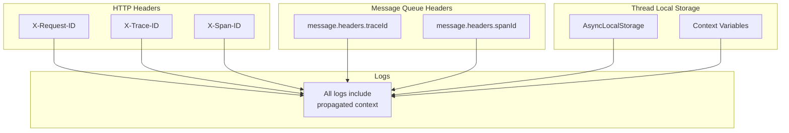

## Log Sampling

Log sampling reduces the volume of logs by recording only a subset of events while maintaining statistical significance.

### Why Sample Logs?

**Challenges with Full Logging**:
- **Storage Costs**: Terabytes of logs daily
- **Processing Overhead**: CPU/memory impact
- **Network Bandwidth**: Shipping logs to central systems
- **Analysis Complexity**: Signal vs noise
- **Diminishing Returns**: Not all logs provide value

### Sampling Strategies

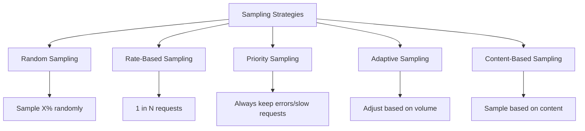

#### 1. Random Sampling

**Method**: Randomly select a percentage of logs to keep

**Advantages**:
- Simple to implement
- Unbiased
- Predictable volume reduction

**Disadvantages**:
- May miss important events
- No guarantee of capturing specific scenarios

**Use Case**: High-volume, low-criticality logs

**Formula**: `sample_rate = desired_logs / total_logs`

---

#### 2. Rate-Based Sampling

**Method**: Keep 1 out of every N events

**Advantages**:
- Even more predictable than random
- Maintains temporal distribution
- Simple implementation

**Disadvantages**:
- May create patterns in sampling
- Still may miss critical events

**Use Case**: Regular health checks, routine operations

---

#### 3. Priority/Importance Sampling

**Method**: Always keep important events, sample less critical ones

**Rules**:
- **Always log**: Errors, security events, business-critical events
- **High sample rate**: Warnings, slow operations
- **Low sample rate**: Info, debug messages
- **Never log**: Trace (unless debugging)

**Advantages**:
- Preserves critical information
- Reduces noise
- Maintains incident investigation capability

**Disadvantages**:
- Requires careful classification
- More complex logic

**Use Case**: Production systems needing cost optimization

---

#### 4. Adaptive Sampling

**Method**: Dynamically adjust sampling rate based on conditions

**Conditions**:
- **High traffic**: Increase sampling (log less)
- **Errors detected**: Decrease sampling (log more)
- **Specific users**: Sample more for VIP users
- **Time of day**: Higher sampling during low traffic

**Advantages**:
- Optimizes cost and value
- Responds to system conditions
- Captures issues when they occur

**Disadvantages**:
- Complex to implement
- May miss gradual issues
- Requires monitoring of sampling itself

**Use Case**: Large-scale systems with variable load

---

#### 5. Content-Based Sampling

**Method**: Sample based on log content or attributes

**Examples**:
- Log all requests for premium users
- Always log specific endpoints (e.g., /checkout)
- Sample more for new feature flags
- Log more from specific geographic regions

**Advantages**:
- Business-aware sampling
- Targeted data collection
- Flexible and precise

**Disadvantages**:
- Requires content inspection
- Performance overhead
- Complex configuration

**Use Case**: A/B testing, feature rollouts, targeted analysis

### Sampling Decision Flow

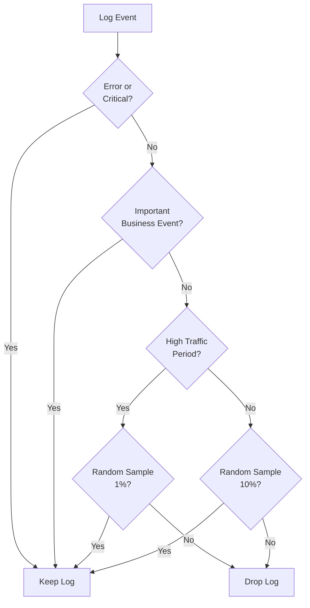

### Sampling Best Practices

1. **Never sample errors**: Always log failures
2. **Sample consistently**: Use trace ID for consistent sampling across services
3. **Monitor sample rates**: Track what percentage is being logged
4. **Document sampling**: Make strategy explicit
5. **Preserve metadata**: Even sampled-out logs should update counters
6. **Emergency override**: Ability to temporarily disable sampling

## Best Practices

### 1. Use Consistent Structure

**Principle**: All logs should follow a consistent schema

**Benefits**:
- Easier parsing
- Simpler querying
- Better tooling
- Team consistency

**Common Fields**:
- `timestamp`: ISO 8601 format
- `level`: Log severity
- `service`: Service name
- `event`: Event type identifier
- `traceId`: Distributed trace ID
- `message`: Human-readable description

### 2. Log at Boundaries

**Where to log**:
- **Entry points**: API requests, message consumption
- **Exit points**: External API calls, database queries
- **State changes**: Order status, user registration
- **Errors**: All exceptions and failures
- **Business events**: Transactions, critical operations

**Don't log**:
- Inside tight loops (use aggregation)
- Every function call (too noisy)
- Sensitive data (see security section)
- Redundant information

### 3. Include Sufficient Context

**Essential context**:
- **Who**: User ID, session ID
- **What**: Action performed, entity affected
- **When**: Timestamp (automatically added)
- **Where**: Service, host, environment
- **Why**: Business reason, trigger
- **How**: Method, protocol, version

**Example comparison**:

**Insufficient**:
```
Order created
```

**Sufficient**:
```json
{
  "event": "order_created",
  "orderId": "order_12345",
  "userId": "user_789",
  "items": 3,
  "totalAmount": 99.99,
  "currency": "USD",
  "shippingMethod": "express",
  "paymentMethod": "credit_card",
  "source": "mobile_app",
  "promoCode": "SAVE10"
}
```

### 4. Make Logs Actionable

**Questions to ask**:
- Can someone debug the issue with this log?
- Does this log trigger an action?
- Is the message clear and specific?

**Actionable log characteristics**:
- Specific error messages
- Include error codes
- Suggest remediation
- Reference documentation
- Include correlation IDs

**Example**:

**Not actionable**:
```
Payment failed
```

**Actionable**:
```json
{
  "event": "payment_failed",
  "orderId": "order_12345",
  "errorCode": "INSUFFICIENT_FUNDS",
  "errorMessage": "Customer's card was declined due to insufficient funds",
  "gateway": "stripe",
  "gatewayErrorCode": "card_declined",
  "retryable": false,
  "suggestedAction": "Ask customer to use different payment method",
  "documentationUrl": "https://docs.example.com/errors/insufficient_funds"
}
```

### 5. Avoid Log Spam

**Common causes**:
- Logging in loops
- Excessive debug logging in production
- Duplicate logs for same event
- Logging expected conditions

**Solutions**:
- Use appropriate log levels
- Aggregate repeated events
- Implement rate limiting
- Use metrics instead of logs for counts

### 6. Performance Considerations

**Logging overhead**:
- I/O operations are expensive
- String concatenation costs CPU
- Serialization takes time
- Network transmission has latency

**Optimization strategies**:
- **Lazy evaluation**: Don't build log message if it won't be logged
- **Async logging**: Write logs asynchronously
- **Batching**: Group logs before sending
- **Buffering**: Use in-memory buffers
- **Sampling**: As discussed earlier

### 7. Handle Errors in Logging

**Principle**: Logging should never crash your application

**Strategies**:
- Catch and suppress logging errors
- Fallback to console/stdout
- Monitor logging system health
- Circuit breaker for log shipper
- Local buffer for transient failures

## Security and Compliance

### What NOT to Log

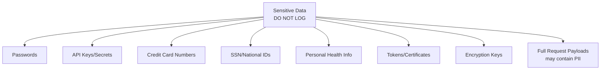

### Data Sanitization

**Techniques**:

1. **Redaction**: Replace sensitive data with placeholder
   - Password: `[REDACTED]`
   - Credit card: `**** **** **** 1234`

2. **Masking**: Partially hide data
   - Email: `j***@example.com`
   - Phone: `***-***-1234`

3. **Hashing**: One-way transformation
   - User ID: Hash for correlation without revealing identity

4. **Tokenization**: Replace with non-sensitive token
   - Credit card → Token ID

5. **Truncation**: Remove excess detail
   - IP address: `192.168.*.* ` (network only)

### Compliance Requirements

| Regulation | Key Requirements | Log Retention |
|------------|------------------|---------------|
| **GDPR** | Right to be forgotten, data minimization | 30-90 days typical |
| **PCI-DSS** | No card data in logs, audit trail | 1 year minimum |
| **HIPAA** | No PHI in logs, access controls | 6 years |
| **SOX** | Financial transaction logs, tamper-proof | 7 years |
| **SOC 2** | Security event logging, monitoring | Varies |

### Audit Logging Requirements

**What to log**:
- Authentication attempts (success/failure)
- Authorization decisions
- Data access (especially sensitive data)
- Data modifications
- Configuration changes
- Administrative actions
- Security events

**Audit log characteristics**:
- **Immutable**: Cannot be modified or deleted
- **Complete**: All required events logged
- **Accurate**: Reliable timestamps
- **Protected**: Access controlled
- **Timestamped**: Precise time information
- **Attributable**: Clear actor identification

## Log Lifecycle

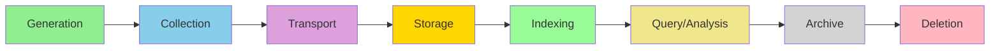

### 1. Generation
- Application produces logs
- Structured format
- Appropriate level
- Rich context

### 2. Collection
- Log aggregation agents
- Collect from multiple sources
- Initial filtering/sampling

### 3. Transport
- Ship logs to central system
- Buffering for reliability
- Compression for efficiency
- Encryption for security

### 4. Storage
- Time-series databases
- Object storage (S3, etc.)
- Hot/warm/cold tiers
- Retention policies

### 5. Indexing
- Full-text search indices
- Field-based indices
- Time-based partitioning

### 6. Query/Analysis
- Search and filter
- Aggregations and analytics
- Dashboard visualization
- Alert evaluation

### 7. Archive
- Move to cheaper storage
- Compress older logs
- Reduced access frequency

### 8. Deletion
- Compliance-driven deletion
- Cost-driven cleanup
- Retention policy enforcement

## Common Patterns

### Pattern 1: Request Tracing

**Purpose**: Track a request through the entire system

**Implementation**:
- Generate request ID at entry point
- Propagate through all services
- Include in all logs
- Link to distributed traces

**Benefits**:
- Complete request visibility
- Easy debugging
- Performance analysis

### Pattern 2: Correlation with Metrics

**Purpose**: Link aggregate metrics to specific log events

**Implementation**:
- Use same labels/tags in logs and metrics
- Include metric names in logs
- Reference trace IDs in both

**Benefits**:
- Drill from dashboard to logs
- Understand metric anomalies
- Root cause analysis

### Pattern 3: Aggregated Logging

**Purpose**: Reduce volume of repetitive logs

**Implementation**:
- Count occurrences instead of logging each
- Periodically flush aggregated counts
- Log first and last occurrence

**Benefits**:
- Reduced log volume
- Still captures important information
- Prevents log storms

### Pattern 4: Contextual Logging

**Purpose**: Automatically include context in all logs

**Implementation**:
- Thread-local storage for context
- Middleware to set context
- Automatic context injection

**Benefits**:
- Consistent context
- Less boilerplate
- Easier correlation

### Pattern 5: Lazy Logging

**Purpose**: Avoid overhead of logs that won't be written

**Implementation**:
- Check log level before building message
- Use lambda/closure for expensive operations
- Defer serialization until needed

**Benefits**:
- Better performance
- Lower CPU usage
- Reduced garbage collection

## Summary

Effective logging is a balance of:

- **Completeness**: Log enough to debug issues
- **Signal-to-noise**: Avoid overwhelming with useless logs
- **Performance**: Minimize overhead
- **Cost**: Manage storage and processing expenses
- **Security**: Protect sensitive information
- **Compliance**: Meet regulatory requirements

**Key Takeaways**:

1. Use **structured logging** for modern systems
2. Choose **appropriate log levels** to control verbosity
3. Include **rich context** for correlation
4. Implement **sampling** to control costs
5. **Never log sensitive data** without sanitization
6. Make logs **actionable** and clear
7. Consider **log lifecycle** from generation to deletion

## Related Documentation

- [Introduction](./01-introduction.md) - Observability fundamentals
- [Metrics](./03-metrics.md) - Complementary observability pillar
- [Log Aggregation](./05-log-aggregation.md) - Centralized log collection
- [Distributed Tracing](./07-distributed-tracing.md) - Correlating logs with traces
- [Best Practices](./12-best-practises.md) - Overall observability best practices
- [Tools Ecosystem](./11-tools-ecosystem.md) - Logging tools and platforms

## Next Steps

Continue to [Metrics](./03-metrics.md) to learn about the second pillar of observability.