# Metrics

## Table of Contents
- [Introduction](#introduction)
- [Types of Metrics](#types-of-metrics)
- [Metric Methodologies](#metric-methodologies)
- [Metric Dimensions and Cardinality](#metric-dimensions-and-cardinality)
- [Aggregation and Statistical Functions](#aggregation-and-statistical-functions)
- [Time Series Data](#time-series-data)
- [Metric Design Principles](#metric-design-principles)
- [Common Pitfalls](#common-pitfalls)
- [Metric Storage](#metric-storage)
- [Best Practices](#best-practices)

## Introduction

Metrics are numerical measurements collected over time that provide quantitative insight into system behavior. Unlike logs which capture discrete events, metrics aggregate data to show trends, patterns, and statistical properties of your system.

### Purpose of Metrics

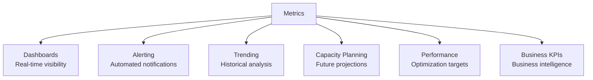

### Characteristics of Metrics

| Characteristic | Description | Example |
|----------------|-------------|---------|
| **Numerical** | Always quantitative values | 234 requests, 1.5 seconds |
| **Aggregated** | Summarize multiple events | Average, sum, percentile |
| **Time-series** | Recorded at regular intervals | Every 15 seconds |
| **Low Cardinality** | Limited unique combinations | Status codes, not user IDs |
| **Efficient Storage** | Compact, fixed-size data | Much smaller than logs |
| **Fast Queries** | Optimized for time-range queries | Last 24 hours |

### Metrics vs Logs vs Traces

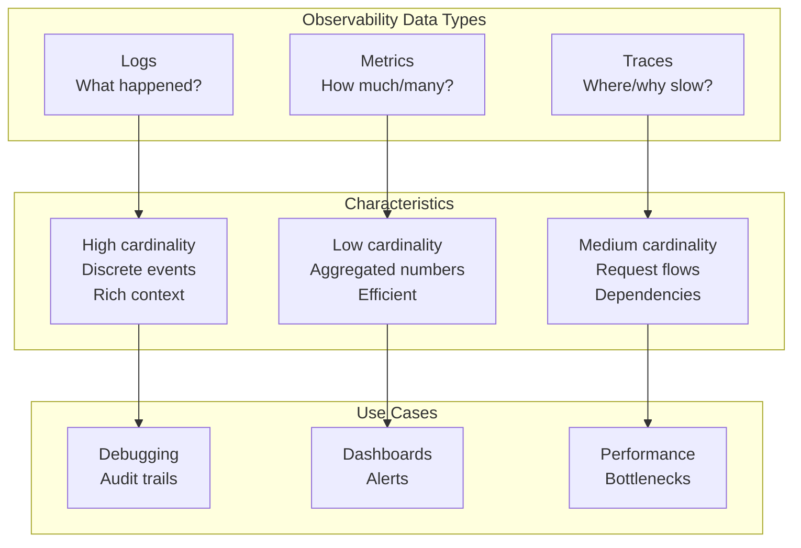

## Types of Metrics

Understanding metric types is fundamental to choosing the right measurement approach for different scenarios.

### 1. Counter

**Definition**: A monotonically increasing value that only goes up (or resets to zero).

**Characteristics**:
- Always increases
- Resets on service restart
- Represents cumulative totals
- Rate of change is meaningful

**Use Cases**:
- Total requests processed
- Total errors occurred
- Total bytes transferred
- Total items sold
- Total cache misses

**Visual Representation**:
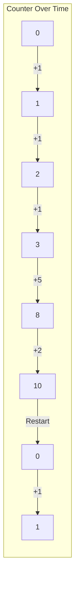

**What You Query**:
- **Rate**: Change per second (most useful)
- **Delta**: Change over time window
- **Derivative**: How fast it's changing

**Example Analysis**:
- Counter value: 10,000 total requests (not very useful)
- Rate: 50 requests/second (very useful!)
- Rate change: Went from 50 to 150 req/s (spike detected)

**Important Note**: Always query counters as rates, not absolute values.

---

### 2. Gauge

**Definition**: A value that can go up or down, representing a measurement at a point in time.

**Characteristics**:
- Can increase or decrease
- Represents current state
- Snapshot of a value
- No rate calculation needed

**Use Cases**:
- Active connections
- Memory usage
- CPU utilization
- Queue depth
- Temperature
- Number of active users

**Visual Representation**:
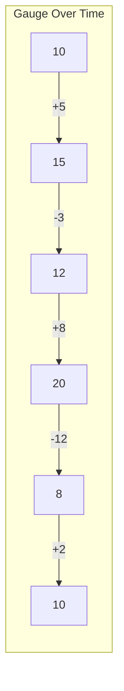

**What You Query**:
- **Current value**: What's the value right now?
- **Average**: Mean over time period
- **Min/Max**: Extremes during period
- **Percentiles**: Distribution of values

**Example Analysis**:
- Current memory usage: 2.5 GB
- Average memory usage (24h): 2.1 GB
- Peak memory usage (24h): 3.8 GB

---

### 3. Histogram

**Definition**: Samples observations and counts them in configurable buckets, tracking distribution of values.

**Characteristics**:
- Records multiple observations
- Pre-defined bucket boundaries
- Cumulative buckets
- Calculates quantiles
- Fixed memory overhead

**Use Cases**:
- Request duration distribution
- Response size distribution
- Database query times
- Payment amounts
- File sizes

**Visual Representation**:
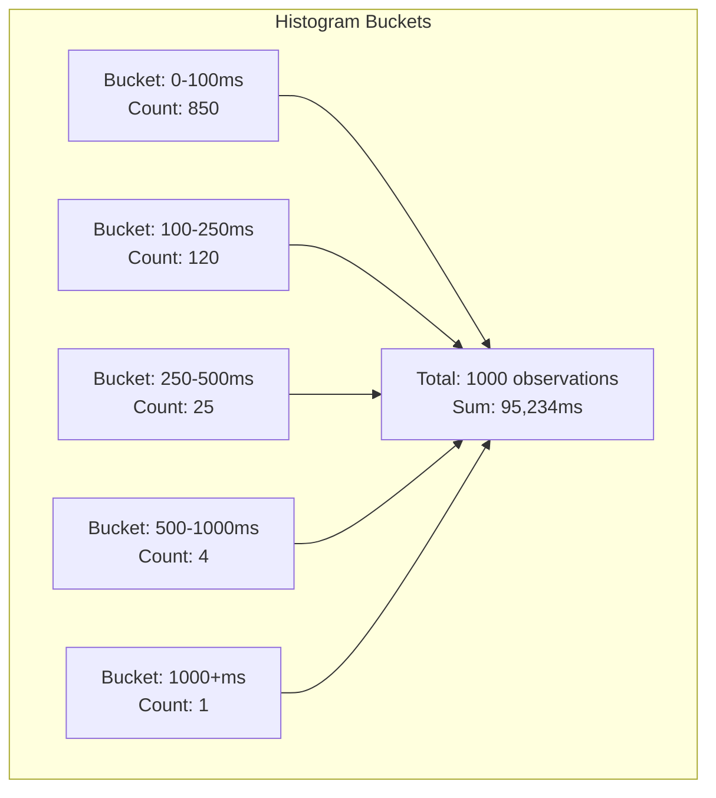

**What You Get**:
- **Sum**: Total of all observations
- **Count**: Number of observations
- **Buckets**: Count per bucket
- **Quantiles**: Approximate percentiles (p50, p95, p99)
- **Average**: Sum / Count

**Bucket Configuration Example**:
```
Buckets: [0.1, 0.25, 0.5, 1.0, 2.5, 5.0, 10.0] seconds
```

**Example Analysis**:
- p50 (median): 95ms
- p95: 380ms
- p99: 850ms
- Average: 125ms

**Advantages**:
- Fixed memory per histogram
- Quantiles calculated efficiently
- Aggregatable across instances

**Disadvantages**:
- Quantiles are approximate
- Need to choose buckets upfront
- Cannot calculate exact percentiles

---

### 4. Summary

**Definition**: Similar to histogram but calculates exact quantiles over a sliding time window.

**Characteristics**:
- Exact percentile calculation
- Sliding time window
- Higher memory usage
- Not aggregatable across instances

**Use Cases**:
- When exact percentiles needed
- Single-instance metrics
- SLA tracking requiring precision

**Visual Representation**:
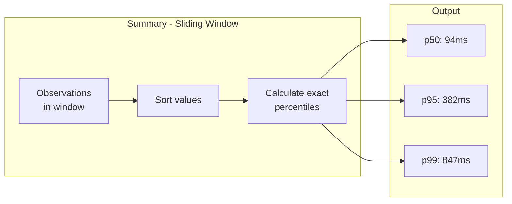

**Comparison with Histogram**:

| Aspect | Histogram | Summary |
|--------|-----------|---------|
| **Quantile Accuracy** | Approximate | Exact |
| **Memory Usage** | Fixed | Grows with observations |
| **Aggregation** | Possible | Not possible |
| **Bucket Definition** | Required | Not required |
| **Use Case** | Distributed systems | Single instance |

---

### Choosing the Right Type

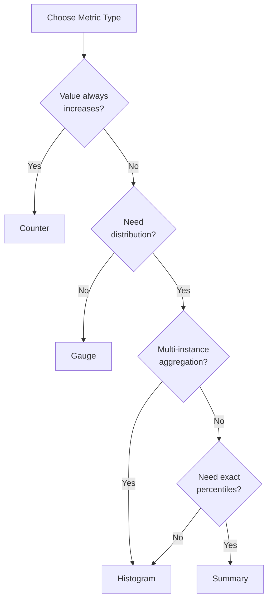

## Metric Methodologies

Established frameworks for selecting meaningful metrics.

### RED Method (Request-based services)

**Purpose**: Monitor request-driven services like web servers, APIs

**Components**:

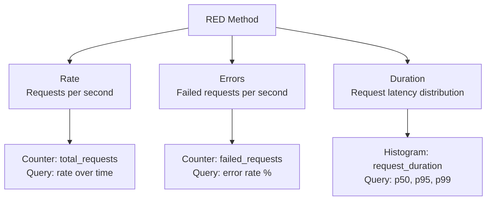

**1. Rate** (R)
- **What**: Throughput of requests
- **Metric Type**: Counter → Rate
- **Examples**:
  - HTTP requests per second
  - API calls per minute
  - Messages processed per second

**2. Errors** (E)
- **What**: Failed requests
- **Metric Type**: Counter → Error rate
- **Examples**:
  - HTTP 5xx responses per second
  - Failed API calls
  - Exception rate

**3. Duration** (D)
- **What**: Request latency
- **Metric Type**: Histogram
- **Examples**:
  - Request processing time (p50, p95, p99)
  - Database query duration
  - API response time

**When to Use**: Web services, APIs, microservices, load balancers

---

### USE Method (Resource-based monitoring)

**Purpose**: Monitor physical resources like servers, databases, storage

**Components**:

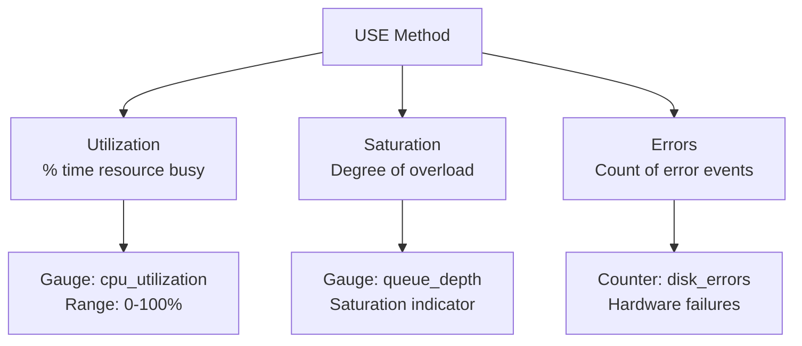

**1. Utilization** (U)
- **What**: % of time resource was busy
- **Metric Type**: Gauge (0-100%)
- **Examples**:
  - CPU utilization
  - Memory usage %
  - Disk usage %
  - Network bandwidth used

**2. Saturation** (S)
- **What**: Degree of overload (queued work)
- **Metric Type**: Gauge
- **Examples**:
  - CPU run queue length
  - Memory swap usage
  - Disk I/O wait
  - TCP connection backlog

**3. Errors** (E)
- **What**: Error events
- **Metric Type**: Counter
- **Examples**:
  - Disk errors
  - Network packet drops
  - Memory allocation failures

**When to Use**: Infrastructure monitoring, capacity planning, hardware monitoring

---

### Four Golden Signals (Google SRE)

**Purpose**: Core metrics for any user-facing system

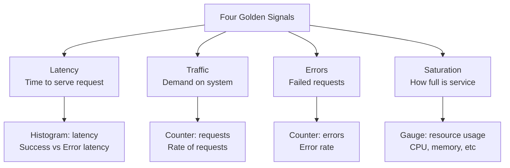

**1. Latency**
- Time taken to serve a request
- **Important**: Separate successful vs failed request latency
- Fast failures can hide problems

**2. Traffic**
- Demand placed on system
- Requests per second, transactions per second

**3. Errors**
- Rate of failed requests
- Explicit failures (5xx) and implicit (wrong content)

**4. Saturation**
- How "full" the service is
- CPU, memory, I/O, connection pools

**When to Use**: Production services, SLO monitoring

---

### Choosing a Methodology

| Scenario | Recommended Method | Reason |
|----------|-------------------|---------|
| Web API | RED | Request-centric |
| Database Server | USE | Resource-centric |
| Microservices | RED | Service-to-service calls |
| Infrastructure | USE | Hardware monitoring |
| General Production | Four Golden Signals | Comprehensive |
| Mixed Workload | Combine RED + USE | Cover all bases |

## Metric Dimensions and Cardinality

### What are Dimensions?

**Dimensions** (also called labels or tags) are key-value pairs that add context to metrics.

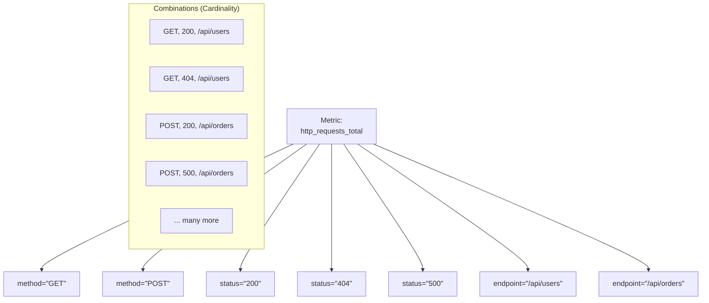

**Example**:
```
http_requests_total{method="GET", status="200", endpoint="/api/users"} = 1534
http_requests_total{method="POST", status="500", endpoint="/api/orders"} = 12
```

### Cardinality

**Definition**: The number of unique time series created by combining all dimension values.

**Formula**: 
```
Cardinality = Values(Dimension1) × Values(Dimension2) × ... × Values(DimensionN)
```

**Example**:
```
Metric: http_requests_total
Dimensions:
- method: 4 values (GET, POST, PUT, DELETE)
- status: 10 values (200, 201, 400, 401, 404, 500, etc.)
- endpoint: 50 values (different API endpoints)

Cardinality = 4 × 10 × 50 = 2,000 time series
```

### Cardinality Explosion Problem

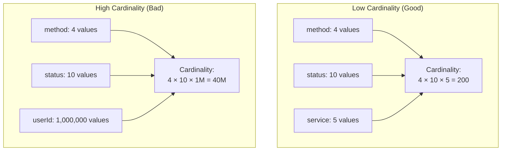

**High Cardinality Dimensions** (Avoid in metrics):
- User IDs
- Session IDs
- Request IDs
- Email addresses
- IP addresses
- Timestamps
- Unique identifiers

**Low Cardinality Dimensions** (Good for metrics):
- HTTP methods (GET, POST, PUT, DELETE)
- Status codes (200, 404, 500)
- Service names
- Deployment environments (prod, staging, dev)
- Regions/Availability zones
- Instance types

### Impact of High Cardinality

| Impact | Description | Example |
|--------|-------------|---------|
| **Storage** | Each time series needs storage | 40M series × 8 bytes = 320 MB per scrape |
| **Memory** | Active series kept in memory | Out of memory errors |
| **Query Speed** | More series = slower queries | Timeouts on dashboards |
| **Costs** | Proportional to cardinality | $$$$ on metric platforms |
| **System Load** | Processing overhead | CPU exhaustion |

### Managing Cardinality

**Strategy 1: Use Logs Instead**
```
❌ Bad (Metric):
requests_total{userId="user_12345"}

✅ Good (Log):
{
  "event": "request",
  "userId": "user_12345"
}
```

**Strategy 2: Aggregate High-Cardinality Data**
```
❌ Bad:
requests_total{endpoint="/api/users/123"}
requests_total{endpoint="/api/users/456"}

✅ Good:
requests_total{endpoint="/api/users/:id"}
```

**Strategy 3: Drop Unnecessary Dimensions**
```
❌ Bad:
requests_total{method="GET", protocol="HTTP/1.1", scheme="https"}

✅ Good:
requests_total{method="GET"}
```

**Strategy 4: Use Separate Metrics for High-Value Data**
```
✅ Low cardinality for all:
requests_total{method="GET", status="200"}

✅ Separate high-cardinality metric with sampling:
premium_user_requests{userId="premium_123"} // Only for premium users
```

## Aggregation and Statistical Functions

### Common Aggregation Functions

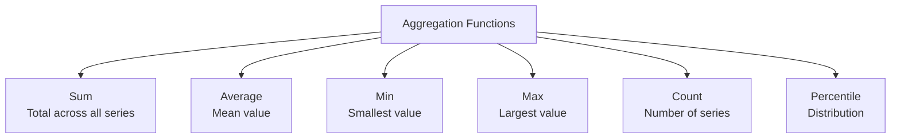

#### 1. Sum
**Purpose**: Total across all time series

**Use Cases**:
- Total requests across all servers
- Total bytes transferred
- Total errors system-wide

**Example**:
```
Query: sum(http_requests_total)
Server1: 1000 req/s
Server2: 1500 req/s
Server3: 2000 req/s
Result: 4500 req/s (total)
```

#### 2. Average
**Purpose**: Mean value across time series

**Use Cases**:
- Average CPU across cluster
- Average response time across instances
- Average queue depth

**Example**:
```
Query: avg(cpu_utilization)
Server1: 60%
Server2: 70%
Server3: 80%
Result: 70% (average)
```

#### 3. Min/Max
**Purpose**: Extremes across time series

**Use Cases**:
- Highest memory usage in cluster
- Lowest disk space remaining
- Peak traffic seen

**Example**:
```
Query: max(memory_usage_bytes)
Server1: 2 GB
Server2: 4 GB
Server3: 3 GB
Result: 4 GB (maximum)
```

#### 4. Count
**Purpose**: Number of time series

**Use Cases**:
- Number of active instances
- Number of endpoints reporting
- Cluster size

#### 5. Percentiles
**Purpose**: Distribution analysis

**Common Percentiles**:
- **p50 (median)**: Middle value
- **p90**: 90% of values below this
- **p95**: 95% of values below this
- **p99**: 99% of values below this
- **p99.9**: 99.9% of values below this

**Why Percentiles Matter**:

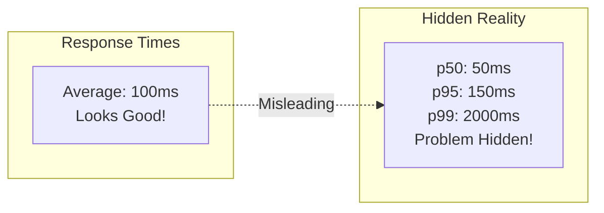

**Percentile Interpretation**:
```
p95 = 250ms means:
- 95% of requests completed in ≤250ms
- 5% of requests took >250ms
```

### Temporal Aggregations

**Rate**: Change over time
```
rate(counter[5m]) = Change in counter over last 5 minutes / 5 minutes
```

**Increase**: Total change
```
increase(counter[1h]) = counter_now - counter_1h_ago
```

**Delta**: Change in gauge
```
delta(gauge[5m]) = gauge_now - gauge_5m_ago
```

**Moving Average**: Smoothed values
```
avg_over_time(metric[5m]) = Average of all values in last 5 minutes
```

## Time Series Data

### What is Time Series Data?

**Definition**: Data points indexed in time order, each consisting of:
- **Timestamp**: When measurement taken
- **Value**: The measurement
- **Labels**: Dimensions/context

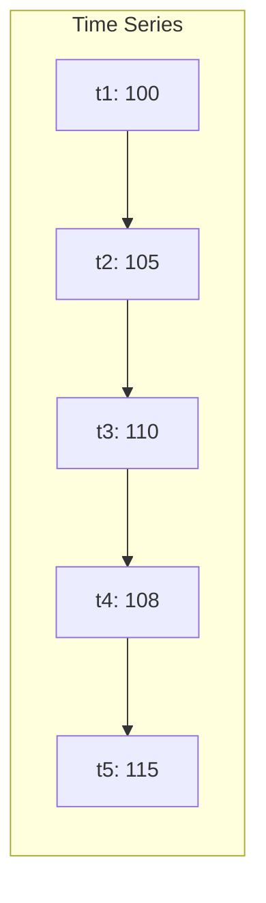

### Time Series Characteristics

1. **Regular Intervals**: Data collected at consistent periods (10s, 30s, 1m)
2. **Immutable**: Historical data doesn't change
3. **Append-Only**: New data always added at the end
4. **Time-Ordered**: Sorted by timestamp
5. **Indexed by Time**: Fast time-range queries

### Storage Optimization

**Compression Techniques**:

1. **Delta-of-Delta Encoding**
   - Store differences between differences
   - Highly effective for monotonic data

2. **Downsampling**
   - Reduce resolution for old data
   - Keep hourly instead of per-second

3. **Retention Policies**
   - High resolution: 7 days
   - Medium resolution: 30 days
   - Low resolution: 1 year

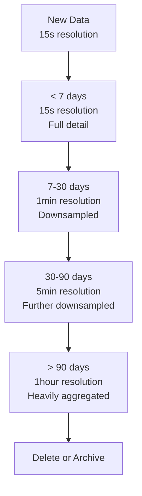

## Metric Design Principles

### 1. Name Metrics Clearly

**Convention**: `<namespace>_<name>_<unit>`

**Examples**:
```
✅ Good:
http_requests_total (counter)
http_request_duration_seconds (histogram)
database_connections_active (gauge)
cache_hits_total (counter)

❌ Bad:
requests (unclear what it measures)
time (no unit)
errors (no context)
```

### 2. Include Units in Name

**Common Units**:
- `_seconds`: Time duration
- `_bytes`: Memory/storage
- `_total`: Counter suffix
- `_ratio`: 0-1 value
- `_percent`: 0-100 value

### 3. Be Consistent

**Pattern**:
```
http_requests_total
http_request_duration_seconds
http_requests_failed_total
```

Not:
```
total_http_requests
request_duration_http_seconds
http_failed_requests
```

### 4. Use Appropriate Types

| Measurement | Type | Example |
|-------------|------|---------|
| Count of events | Counter | requests_total |
| Current value | Gauge | memory_usage_bytes |
| Distribution | Histogram | request_duration_seconds |
| Percentage | Gauge | cpu_utilization_percent |

### 5. Design for Aggregation

**Aggregatable**:
```
✅ Can sum across instances:
http_requests_total{instance="server1"}
http_requests_total{instance="server2"}
→ Total = sum(http_requests_total)
```

**Not Aggregatable**:
```
❌ Cannot average averages:
avg_response_time{instance="server1"} = 100ms (from 1000 requests)
avg_response_time{instance="server2"} = 200ms (from 10 requests)
→ Overall average ≠ (100 + 200) / 2
```

**Solution**: Use histograms for latency, sum/count for rates.

## Common Pitfalls

### 1. Averaging Averages

**Problem**: Averages of averages are mathematically incorrect

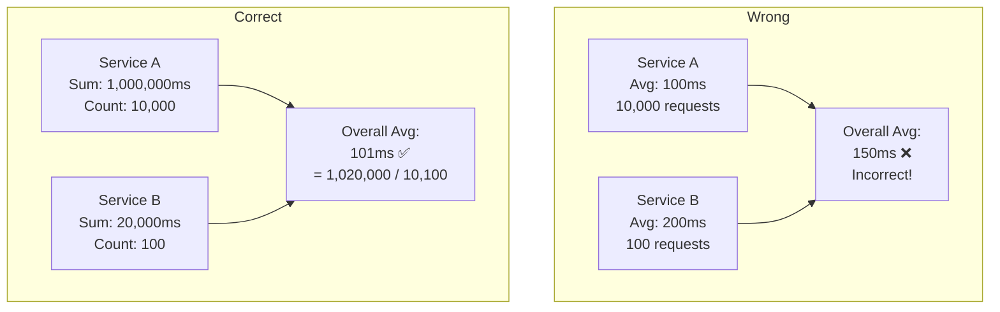

**Solution**: Store sum and count, calculate average at query time.

### 2. Counter Resets

**Problem**: Counters reset to zero on restart

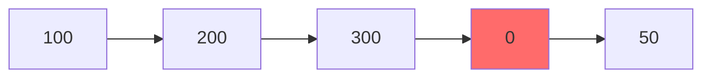

**Solution**: Use rate() function which handles resets automatically.

### 3. High Cardinality Labels

**Problem**: Using unique IDs as labels

```
❌ http_requests_total{userId="user_12345"}
Creates millions of time series!
```

**Solution**: Use logs for high-cardinality data.

### 4. Missing Time Ranges

**Problem**: Queries without time context

```
❌ rate(counter)  // Over what time period?
✅ rate(counter[5m])  // Over last 5 minutes
```

### 5. Percentage Calculations

**Problem**: Storing percentages instead of counts

```
❌ error_percentage = 5%  // Cannot aggregate
✅ errors_total = 50, requests_total = 1000
   → error_percentage = errors_total / requests_total * 100
```

## Metric Storage

### Time Series Databases (TSDB)

**Purpose**: Specialized databases optimized for time-series data

**Popular TSDBs**:

| Database | Best For | Characteristics |
|----------|----------|-----------------|
| **Prometheus** | Pull-based metrics | Self-contained, PromQL, service discovery |
| **InfluxDB** | High write throughput | Push-based, SQL-like query |
| **TimescaleDB** | PostgreSQL users | SQL interface, relational model |
| **VictoriaMetrics** | Large scale | Prometheus-compatible, highly efficient |
| **M3DB** | Distributed systems | Uber-scale, distributed |

### Storage Architecture

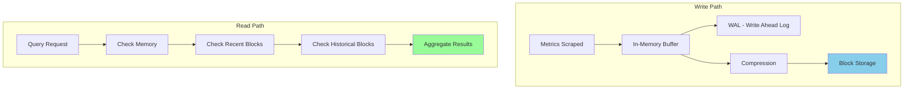

### Storage Costs

**Factors Affecting Storage**:
1. **Cardinality**: Number of unique time series
2. **Scrape Interval**: How often metrics collected
3. **Retention Period**: How long data kept
4. **Compression Ratio**: Efficiency of encoding

**Cost Formula**:
```
Storage = Cardinality × Scrape_Rate × Retention × Bytes_Per_Sample

Example:
- Cardinality: 10,000 time series
- Scrape interval: 15 seconds (4 per minute)
- Retention: 30 days
- Bytes per sample: ~2 bytes (with compression)

Storage = 10,000 × 4 × 60 × 24 × 30 × 2 = ~345 GB
```

### Retention Strategies

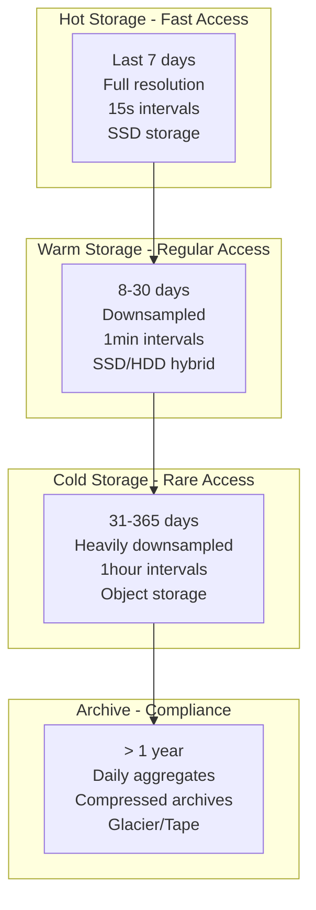

## Best Practices

### 1. Start with the Essentials

**Golden Rule**: Measure what matters to users first

**Priority Order**:
1. **User-facing metrics** (latency, errors, availability)
2. **Business metrics** (conversions, transactions, revenue)
3. **System metrics** (CPU, memory, disk)
4. **Application metrics** (cache hits, queue depth)
5. **Detailed diagnostics** (specific function timings)

### 2. Use Standard Methodologies

```mermaid
graph TB
    Start[Choose Methodology]
    
    Start --> Q1{Service Type?}
    Q1 -->|Request-based| RED[Use RED Method]
    Q1 -->|Resource-based| USE[Use USE Method]
    Q1 -->|General service| Golden[Use Four Golden Signals]
    
    RED --> Implement[Implement Core Metrics]
    USE --> Implement
    Golden --> Implement
    
    Implement --> Expand[Expand as Needed]
    
```

**Don't**: Start by instrumenting everything

**Do**: Pick a methodology and implement it systematically

### 3. Name Metrics Consistently

**Naming Convention Template**:
```
<namespace>_<subsystem>_<name>_<unit>_<suffix>

Examples:
http_server_requests_total
http_server_request_duration_seconds
database_query_duration_seconds
cache_operations_total
memory_usage_bytes
```

**Suffixes**:
- `_total`: Counters
- `_seconds`, `_bytes`: Units
- `_ratio`: 0-1 value
- `_percent`: 0-100 value
- `_count`: Current count (gauge)

### 4. Keep Cardinality Under Control

**Cardinality Budget**:
```
✅ Good Practice:
Total unique time series per service: < 10,000
Label value combinations per metric: < 1,000

⚠️ Warning Zone:
Total unique time series: 10,000 - 100,000
Need optimization

❌ Danger Zone:
Total unique time series: > 100,000
System instability, high costs
```

**Cardinality Review Checklist**:
- [ ] No user IDs or session IDs as labels
- [ ] No unbounded string values (URLs with IDs)
- [ ] Limited number of label values per dimension
- [ ] Regular cardinality monitoring
- [ ] Alerts on cardinality growth

### 5. Design for Aggregation

**Aggregatable Metrics**:
```
✅ Use Counters and Histograms:
requests_total → Can sum across instances
request_duration_seconds (histogram) → Can calculate percentiles

❌ Avoid Pre-aggregated Values:
average_response_time → Cannot correctly aggregate
```

**Example - Correct Approach**:
```
Metric: http_request_duration_seconds (histogram)

Instance 1:
- Count: 1000
- Sum: 150 seconds
- Buckets: [<0.1: 800, <0.5: 950, <1: 990, <5: 1000]

Instance 2:
- Count: 500
- Sum: 100 seconds
- Buckets: [<0.1: 300, <0.5: 450, <1: 490, <5: 500]

Aggregated (sum):
- Count: 1500
- Sum: 250 seconds
- Average: 250/1500 = 0.167 seconds
- Buckets: [<0.1: 1100, <0.5: 1400, <1: 1480, <5: 1500]
- p95: Calculated from aggregated buckets
```

### 6. Set Appropriate Scrape Intervals

**Guidelines**:

| Metric Type | Scrape Interval | Reason |
|-------------|----------------|---------|
| **High-frequency** | 5-15 seconds | Request rates, active connections |
| **Standard** | 30-60 seconds | Most application metrics |
| **Resource metrics** | 60 seconds | CPU, memory, disk |
| **Batch jobs** | On completion | Job-specific metrics |
| **Business metrics** | 5 minutes | Daily/hourly aggregates |

**Trade-offs**:
- **Shorter intervals**: Better granularity, higher storage costs
- **Longer intervals**: Lower costs, might miss spikes

### 7. Use Histograms for Latency

**Why not averages?**

```mermaid
graph TB
    subgraph "Average Hides Problems"
        A1[90% requests: 50ms]
        A2[10% requests: 2000ms]
        A3[Average: 245ms<br/>Looks acceptable]
        A4[Reality: 10% users<br/>have terrible experience]
    end
    
    A1 --> A3
    A2 --> A3
    A3 --> A4
    
    subgraph "Histogram Reveals Truth"
        H1[p50: 50ms - Good]
        H2[p95: 90ms - Good]
        H3[p99: 1800ms - Bad!]
        H4[Reality: We have<br/>a latency problem]
    end
    
    H1 --> H4
    H2 --> H4
    H3 --> H4

```

**Always track**:
- p50 (median): Typical user experience
- p95: Most users' experience
- p99: Worst-case for 1% of users
- p99.9: Worst-case scenarios

### 8. Monitor Error Rates, Not Just Counts

**Problem with Counts**:
```
errors_total = 100 errors/minute

Is this good or bad?
- If 1,000 requests/min → 10% error rate (BAD!)
- If 100,000 requests/min → 0.1% error rate (Acceptable)
```

**Solution - Calculate Rates**:
```
Error Rate = errors_total / requests_total × 100

Query:
rate(errors_total[5m]) / rate(requests_total[5m]) × 100

Set alerts on percentage, not absolute counts
```

### 9. Add Context with Labels

**Good Label Choices**:
```
✅ Limited cardinality:
- method: GET, POST, PUT, DELETE
- status_code: 200, 201, 400, 404, 500
- service: auth, orders, payments
- environment: prod, staging, dev
- region: us-east, eu-west, ap-south

❌ High cardinality (use logs instead):
- user_id
- order_id
- session_id
- request_id
```

**Label Best Practices**:
```
1. Keep labels consistent across related metrics
2. Use snake_case for label names
3. Limit to 5-10 labels per metric
4. Document what labels mean
5. Don't duplicate information (e.g., environment in metric name AND label)
```

### 10. Set Up Alerts on Metrics

**Alert Design Principles**:

```mermaid
graph TB
    A[Alert Design]
    
    A --> S[Symptom-based<br/>User impact]
    A --> W[Window<br/>Time duration]
    A --> T[Threshold<br/>Acceptable level]
    A --> A1[Actionable<br/>Clear remediation]
    
    S --> Ex1[High error rate<br/>Slow responses]
    W --> Ex2[Last 5 minutes<br/>Consistent over time]
    T --> Ex3[p95 latency > 500ms<br/>Error rate > 1%]
    A1 --> Ex4[Runbook link<br/>On-call notification]
    
```

**Examples**:

```
✅ Good Alerts:

1. High Error Rate:
   rate(errors_total[5m]) / rate(requests_total[5m]) > 0.01
   "More than 1% of requests failing for 5 minutes"

2. High Latency:
   histogram_quantile(0.95, rate(request_duration_seconds[5m])) > 0.5
   "p95 latency above 500ms for 5 minutes"

3. Saturation:
   avg(cpu_utilization) > 80
   "Average CPU above 80% for 5 minutes"

❌ Bad Alerts:

1. errors_total > 10
   "10 errors occurred" - No context of rate

2. avg(response_time) > 100
   "Average above 100ms" - Misses outliers

3. disk_usage_bytes > 1000000000
   "Disk usage high" - Not percentage-based
```

### 11. Document Your Metrics

**Metric Documentation Should Include**:

1. **Name**: The metric identifier
2. **Type**: Counter, Gauge, Histogram, Summary
3. **Description**: What it measures
4. **Unit**: Seconds, bytes, count, etc.
5. **Labels**: Available dimensions
6. **Cardinality**: Expected number of series
7. **Usage**: What queries/alerts use it
8. **Owner**: Team responsible

**Example Documentation**:
```yaml
http_request_duration_seconds:
  type: histogram
  description: "HTTP request latency in seconds"
  unit: seconds
  labels:
    - method: HTTP method (GET, POST, PUT, DELETE)
    - endpoint: API endpoint pattern (/api/users/:id)
    - status_code: HTTP status code (200, 404, 500)
  cardinality: ~500 series
  usage:
    - Dashboard: API Performance
    - Alert: High p95 Latency
  owner: platform-team
  buckets: [0.1, 0.25, 0.5, 1.0, 2.5, 5.0, 10.0]
```

### 12. Monitor Your Monitoring

**Meta-metrics to track**:

```mermaid
graph TB
    MM[Monitor the Monitoring System]
    
    MM --> M1[Scrape Success Rate<br/>Are metrics being collected?]
    MM --> M2[Scrape Duration<br/>Is collection slow?]
    MM --> M3[Time Series Count<br/>Cardinality growth]
    MM --> M4[Storage Usage<br/>Disk space consumption]
    MM --> M5[Query Performance<br/>Dashboard load times]
    MM --> M6[Alert Firing Rate<br/>Alert fatigue check]
    
    style MM fill:#FFD700
```

**Key Meta-Metrics**:
1. **up**: Is the target reachable? (0 or 1)
2. **scrape_duration_seconds**: How long to scrape
3. **scrape_samples_scraped**: Number of samples collected
4. **prometheus_tsdb_symbol_table_size_bytes**: Memory usage
5. **prometheus_rule_evaluation_duration_seconds**: Alert evaluation time

### 13. Use Recording Rules for Complex Queries

**Problem**: Complex queries are expensive to run repeatedly

**Solution**: Pre-calculate and store results

**Example**:
```
❌ Expensive query run every time dashboard loads:
rate(http_requests_total[5m]) / 
  on(instance) group_left 
  rate(http_requests_total{status=~"5.."}[5m])

✅ Recording rule calculates every minute:
recording_rule_name: http:requests:error_rate
expression: rate(http_requests_total{status=~"5.."}[5m]) / 
            rate(http_requests_total[5m])

Dashboard uses pre-calculated: http:requests:error_rate
```

**Benefits**:
- Faster dashboard loads
- Consistent calculations
- Reduced query load
- Simplified alert expressions

### 14. Test Your Metrics

**What to test**:

```mermaid
graph TB
    T[Metric Testing]
    
    T --> T1[Correctness<br/>Values accurate?]
    T --> T2[Cardinality<br/>Not exploding?]
    T --> T3[Performance<br/>Collection overhead?]
    T --> T4[Alerts<br/>Fire correctly?]
    T --> T5[Dashboards<br/>Load quickly?]
```

**Testing Strategies**:

1. **Unit Tests**: Verify metrics are recorded correctly
2. **Load Tests**: Check behavior under high traffic
3. **Cardinality Tests**: Monitor time series growth
4. **Alert Tests**: Trigger conditions and verify firing
5. **Dashboard Tests**: Check query performance

## Summary

Metrics provide quantitative insights into system behavior through efficient, aggregated numerical data.

**Key Principles**:

1. **Choose the Right Type**:
   - Counter for cumulative values
   - Gauge for point-in-time values
   - Histogram for distributions
   - Summary for exact quantiles (rarely)

2. **Apply Methodologies**:
   - RED for request-based services
   - USE for resources
   - Four Golden Signals for comprehensive monitoring

3. **Control Cardinality**:
   - Avoid high-cardinality labels
   - Use logs for unique identifiers
   - Monitor time series growth

4. **Design for Aggregation**:
   - Use counters and histograms
   - Avoid pre-aggregated values
   - Enable cross-instance summation

5. **Follow Naming Conventions**:
   - Consistent patterns
   - Include units
   - Use appropriate suffixes

6. **Focus on User Impact**:
   - Latency percentiles
   - Error rates (not counts)
   - Availability metrics

**Metrics vs Other Pillars**:

| Aspect | Metrics | Logs | Traces |
|--------|---------|------|--------|
| **Best For** | Trends, alerts | Debugging | Request flows |
| **Cardinality** | Low | High | Medium |
| **Storage** | Very efficient | Expensive | Moderate |
| **Query Speed** | Very fast | Slower | Fast |
| **Granularity** | Aggregated | Individual events | Per request |

**Remember**: Metrics tell you WHAT is happening and HOW MUCH, but logs and traces tell you WHY.

## Common Anti-Patterns

### ❌ Anti-Pattern 1: Metric Explosion
**Problem**: Creating too many metrics
**Solution**: Start minimal, add based on need

### ❌ Anti-Pattern 2: Using Metrics as Logs
**Problem**: Trying to capture every detail in metrics
**Solution**: Use logs for high-cardinality data

### ❌ Anti-Pattern 3: Ignoring Cardinality
**Problem**: Adding labels without considering combinations
**Solution**: Calculate and monitor cardinality

### ❌ Anti-Pattern 4: Missing Context
**Problem**: Generic metric names
**Solution**: Clear, descriptive names with units

### ❌ Anti-Pattern 5: Alert Fatigue
**Problem**: Too many non-actionable alerts
**Solution**: Alert on user impact, not internal metrics

## Practical Implementation Checklist

### Starting Out
- [ ] Choose a metric collection system (Prometheus, InfluxDB, etc.)
- [ ] Implement RED or USE method for core service
- [ ] Set up basic dashboards (latency, errors, traffic)
- [ ] Configure alerts for critical issues
- [ ] Document your metrics

### Growing
- [ ] Add business metrics
- [ ] Implement recording rules for common queries
- [ ] Set up cardinality monitoring
- [ ] Create runbooks for common alerts
- [ ] Review and optimize expensive queries

### Mature
- [ ] Multi-cluster aggregation
- [ ] Long-term storage strategy
- [ ] Automated anomaly detection
- [ ] Cost optimization
- [ ] Regular metric reviews and cleanup

## Related Documentation

- [Introduction](./01-introduction.md) - Observability fundamentals
- [Logging](./02-logging.md) - The first pillar
- [Tracing](./04-tracing.md) - The third pillar
- [Metrics Collection](./06-metrics-collection.md) - Implementation details
- [Alerting and Monitoring](./08-alerting-and-monitoring.md) - Using metrics for alerts
- [Service Level Objectives](./10-service-level-objectives.md) - SLIs based on metrics
- [Tools Ecosystem](./11-tools-ecosystem.md) - Metric platforms and tools

## Next Steps

Continue to [Tracing](./04-tracing.md) to learn about the third pillar of observability and how to track requests through distributed systems.