# DISTRIBUTED TRACING

## Table of Contents
- [Introduction](#introduction)
- [Core Concepts](#core-concepts)
- [Trace Anatomy](#trace-anatomy)
- [Context Propagation](#context-propagation)
- [Sampling Strategies](#sampling-strategies)
- [Trace Analysis](#trace-analysis)
- [Performance Overhead](#performance-overhead)
- [Tracing Patterns](#tracing-patterns)
- [Best Practices](#best-practices)
- [Common Challenges](#common-challenges)

## Introduction

Tracing, specifically distributed tracing, is the practice of tracking a request's journey through a distributed system. It connects all the operations (spans) that occur as a request flows through multiple services, providing end-to-end visibility into system behavior.

### Why Tracing Matters

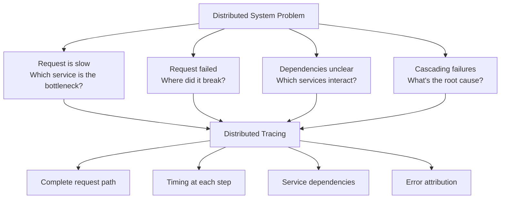

### The Distributed System Challenge

**Without Tracing**:
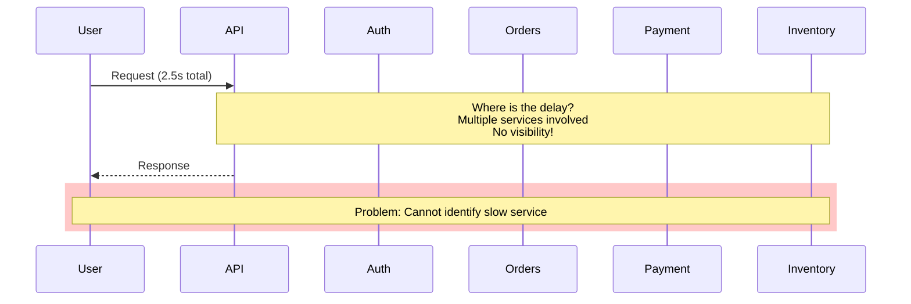

**With Tracing**:
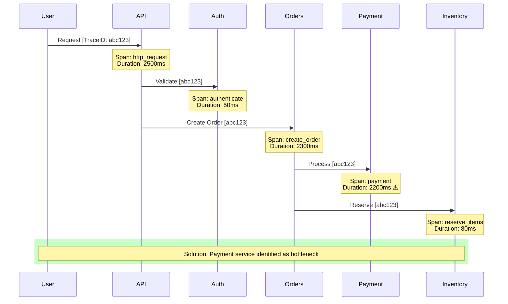

### Characteristics of Traces

| Characteristic | Description | Benefit |
|----------------|-------------|---------|
| **End-to-End** | Complete request journey | Full visibility |
| **Causal** | Shows cause-and-effect | Understand dependencies |
| **Timed** | Precise timing data | Identify bottlenecks |
| **Contextual** | Rich metadata | Debug with context |
| **Distributed** | Across service boundaries | Multi-service visibility |
| **Sampled** | Not all requests traced | Cost efficiency |

## Core Concepts

### Trace

**Definition**: A complete record of a transaction as it moves through a distributed system.

**Components**:
- Unique trace ID
- Collection of spans
- Start and end time
- Overall duration

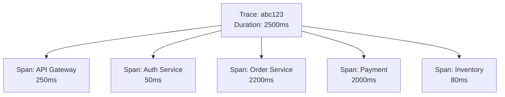

### Span

**Definition**: A single unit of work within a trace, representing an operation.

**Span Attributes**:
- **Span ID**: Unique identifier for this span
- **Trace ID**: Parent trace identifier
- **Parent Span ID**: Link to calling span (if any)
- **Operation Name**: What operation this represents
- **Start Time**: When operation began
- **Duration**: How long operation took
- **Status**: Success, error, or unknown
- **Tags/Attributes**: Key-value metadata
- **Logs/Events**: Timestamped events within the span

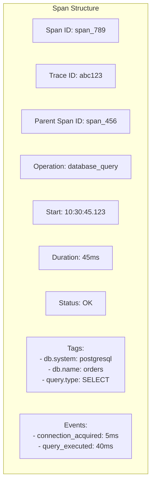

### Span Context

**Definition**: The propagated information that links spans together across service boundaries.

**Contains**:
- Trace ID
- Span ID (becomes parent span ID in child)
- Sampling decision
- Trace state (vendor-specific data)

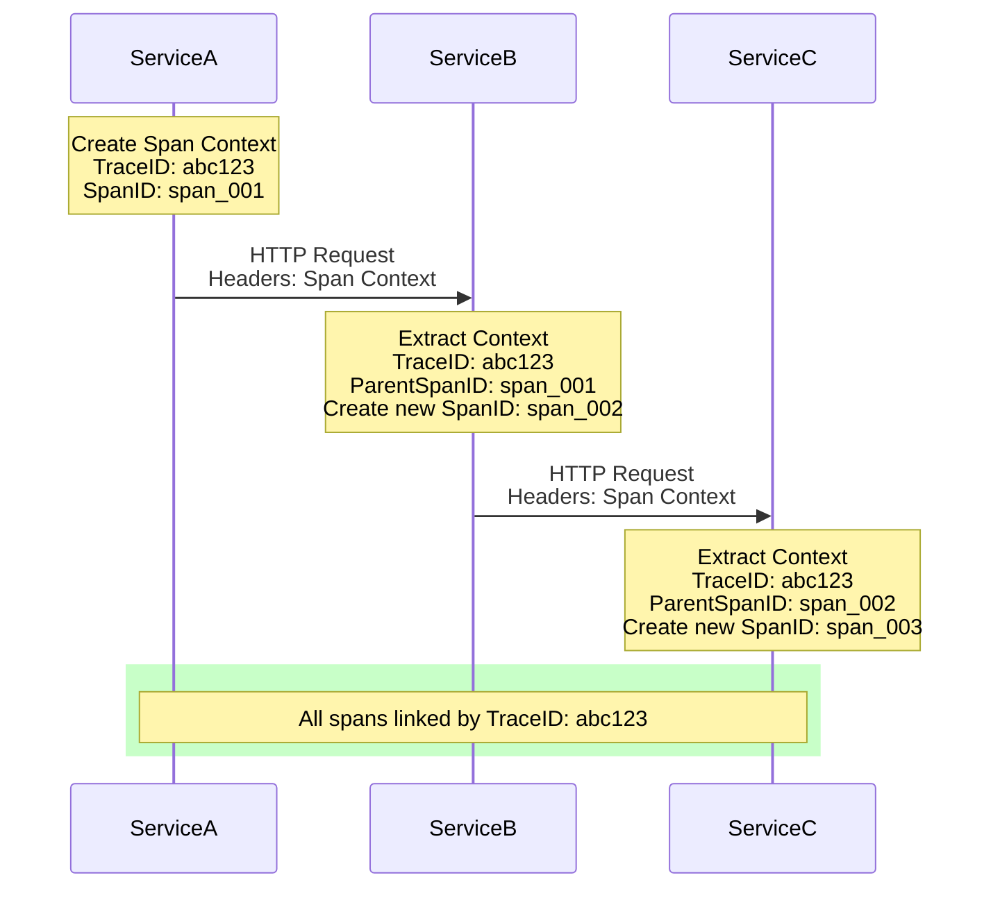

## Trace Anatomy

### Hierarchical Structure

Traces form a tree structure where spans have parent-child relationships.

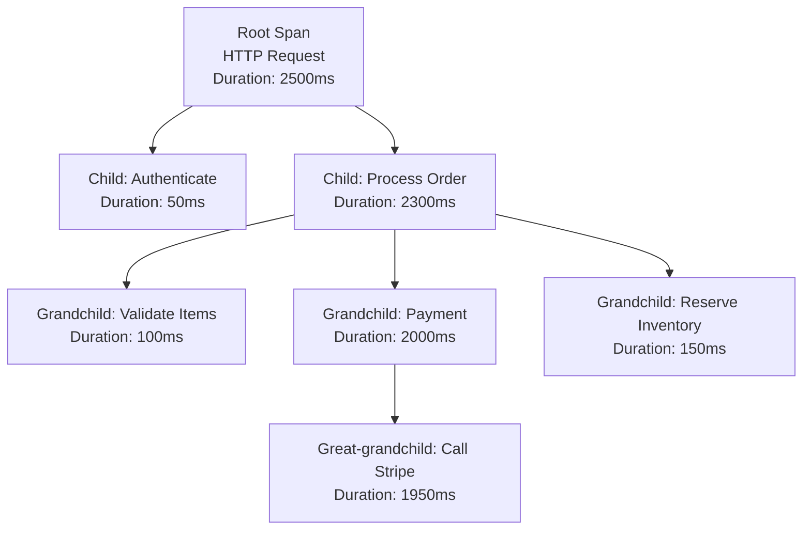

### Span Relationships

**Types of Relationships**:

1. **ChildOf**: Standard parent-child (synchronous)
   - Child starts after parent
   - Parent waits for child to complete
   - Most common relationship

2. **FollowsFrom**: Asynchronous relationship
   - Parent doesn't wait for child
   - Used for fire-and-forget operations
   - Queue message processing

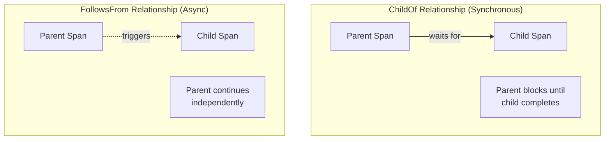

### Timeline View

Traces are often visualized as timelines showing parallel and sequential operations.

```mermaid
gantt
    title Request Trace Timeline
    dateFormat X
    axisFormat %L ms
    
    section API Gateway
    HTTP Request           :0, 2500
    
    section Auth Service
    Authenticate           :100, 150
    
    section Order Service
    Process Order          :200, 2400
    
    section Payment
    Payment Call           :300, 2250
    
    section Inventory
    Reserve Items          :400, 550
```

**Key Observations from Timeline**:
- API Gateway: 2500ms total (entire request)
- Authentication: 50ms (fast)
- Payment: 1950ms (bottleneck! ⚠️)
- Inventory: 150ms (during payment, parallel)

## Context Propagation

Context propagation is the mechanism by which trace information is passed between services and operations.

### Why Propagation Matters

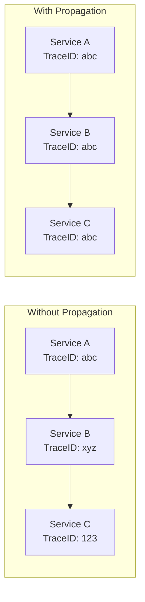

### Propagation Mechanisms

#### 1. HTTP Headers

**Most Common Method**: Inject trace context into HTTP headers

**W3C Trace Context Standard**:
```
traceparent: 00-{trace-id}-{parent-span-id}-{trace-flags}
tracestate: vendor-specific-data

Example:
traceparent: 00-4bf92f3577b34da6a3ce929d0e0e4736-00f067aa0ba902b7-01
```

**Legacy Headers** (still widely used):
```
X-B3-TraceId: 4bf92f3577b34da6a3ce929d0e0e4736
X-B3-SpanId: 00f067aa0ba902b7
X-B3-ParentSpanId: 05e3ac9a4f6e3b90
X-B3-Sampled: 1
```

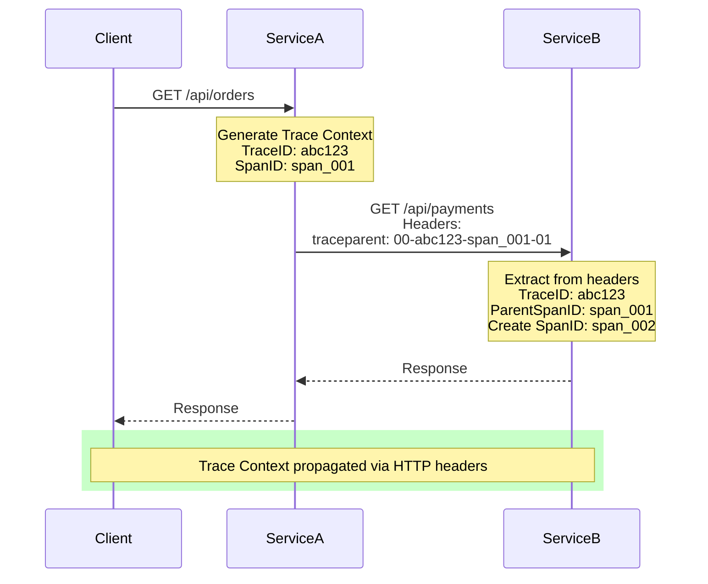

#### 2. Message Queue Metadata

**Method**: Embed trace context in message headers/properties

**Example Structure**:
```
Message {
  body: { orderId: "12345", amount: 99.99 },
  headers: {
    traceparent: "00-abc123-span_001-01",
    content-type: "application/json"
  }
}
```

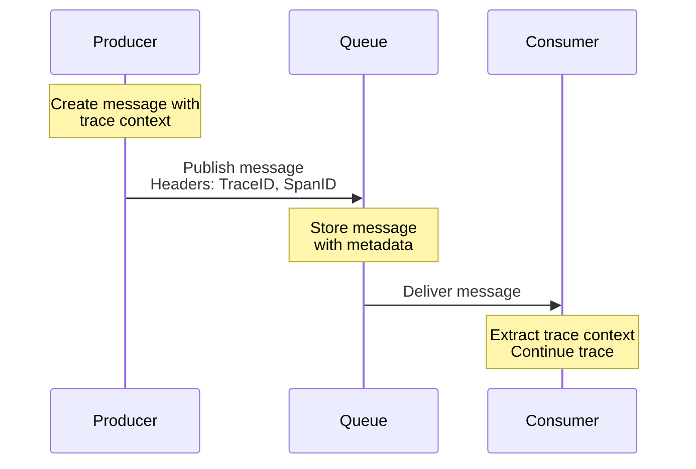

#### 3. RPC Frameworks

**Method**: Built-in context propagation in gRPC, Thrift, etc.

**gRPC Metadata**:
- Automatic context injection
- Binary or text-based
- Framework handles serialization

#### 4. In-Process Context

**Method**: Thread-local or async-local storage

**Use Case**: Propagate within a single service across function calls

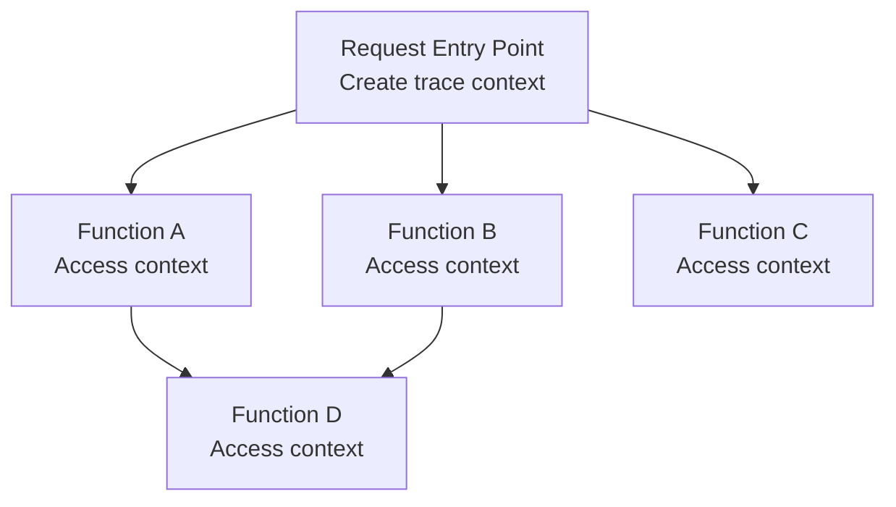

### Propagation Best Practices

1. **Always Propagate**: Never drop trace context
2. **Use Standards**: Prefer W3C Trace Context
3. **Validate Context**: Check format before using
4. **Generate if Missing**: Create new trace if no context received
5. **Preserve State**: Forward vendor-specific data
6. **Log Correlation**: Include trace ID in logs

## Sampling Strategies

Sampling determines which requests are traced. Tracing everything is expensive; sampling reduces overhead while maintaining visibility.

### Why Sample?

**Challenges with 100% Tracing**:
- **Performance Overhead**: CPU, memory, network
- **Storage Costs**: Terabytes of trace data daily
- **Data Processing**: Overwhelming amount of data
- **Signal vs Noise**: Important traces buried

```mermaid
graph TB
    subgraph "100% Tracing"
        T1[1,000,000 requests/day]
        T2[1,000,000 traces stored]
        T3[Cost: $$$$$<br/>Overhead: High]
    end
    
    subgraph "1% Sampling"
        S1[1,000,000 requests/day]
        S2[10,000 traces stored]
        S3[Cost: $<br/>Overhead: Low]
    end
    
    T1 --> T2 --> T3
    S1 --> S2 --> S3
```

### Sampling Types

#### 1. Head-Based Sampling

**Decision Point**: At the beginning of the request

**Characteristics**:
- Decision made before request execution
- Consistent across entire trace
- Simple to implement
- Cannot consider request outcome

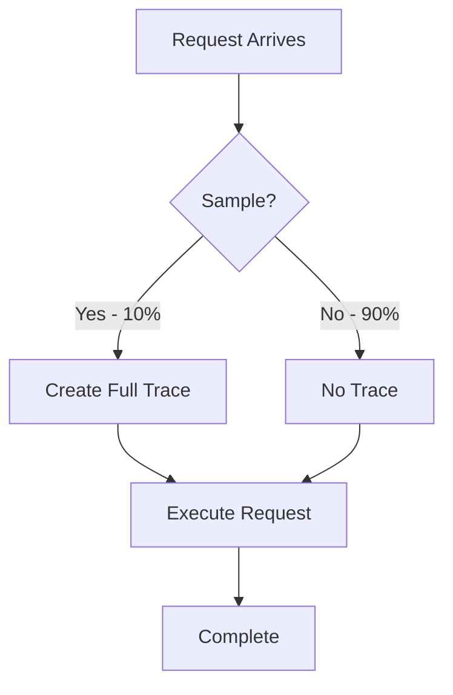

**Strategies**:

**A. Probabilistic (Random)**
```
Sample Rate: 10%
Decision: if random() < 0.10 then trace

Pros:
- Unbiased
- Simple
- Predictable volume

Cons:
- May miss important events
- Fixed rate regardless of value
```

**B. Rate-Limiting**
```
Sample: First N requests per second

Example: 100 traces/second maximum

Pros:
- Predictable costs
- Prevents trace storms

Cons:
- May miss spikes
- Not statistically representative
```

**C. Deterministic**
```
Sample: Based on trace ID hash

Example: if hash(traceId) % 100 < 10 then trace

Pros:
- Consistent for same trace ID
- Reproducible

Cons:
- May create sampling bias
```

#### 2. Tail-Based Sampling

**Decision Point**: After request completes

**Characteristics**:
- Decision based on request outcome
- Requires buffering all spans
- Complex to implement (distributed decision)
- Can prioritize interesting traces

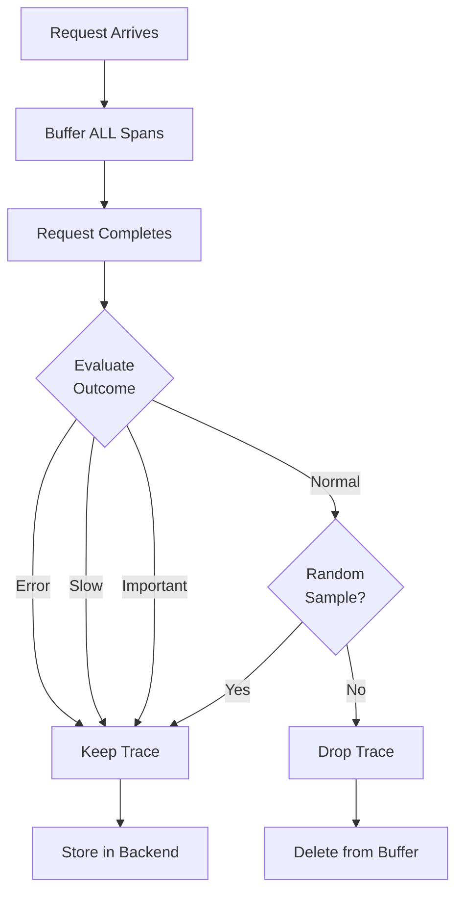

**Decision Rules**:
```
Always keep if:
- Request resulted in error (status >= 400)
- Duration > threshold (e.g., > 2 seconds)
- Specific endpoint (e.g., /checkout)
- Premium user
- Contains specific tag

Otherwise:
- Sample at low rate (1%)
```

**Pros**:
- Keep all important traces
- Capture failures automatically
- Performance issues detected
- Business-aware sampling

**Cons**:
- Requires buffering (memory/cost)
- Complex distributed coordination
- Delayed decision (latency in reporting)
- Higher infrastructure cost

#### 3. Hybrid Sampling

**Combination**: Use both head and tail-based

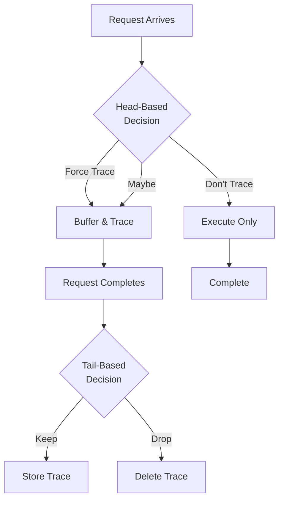

**Strategy Example**:
1. **Head**: Always trace errors endpoint (100%)
2. **Head**: Trace payment endpoint (50%)
3. **Head**: Trace everything else (1%)
4. **Tail**: Keep all errors and slow requests
5. **Tail**: Sample normal requests (10% of the 1%)

**Final Sampling Rates**:
- Errors endpoint: 100%
- Payment errors: 100% (from 50% head sample)
- Payment slow: 100% (from 50% head sample)
- Payment normal: 5% (50% head × 10% tail)
- Other errors: 100% (from 1% head sample)
- Other normal: 0.1% (1% head × 10% tail)

#### 4. Adaptive Sampling

**Dynamic Adjustment**: Change sample rate based on system conditions

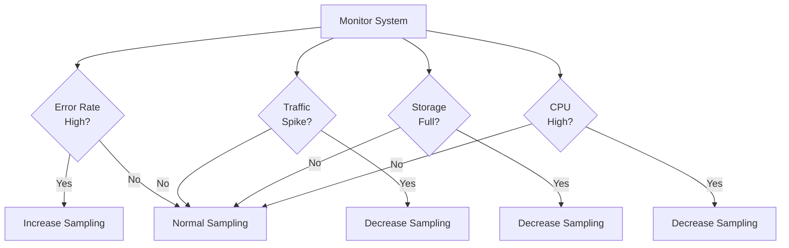

**Adaptive Rules**:
```
Normal conditions: 1% sampling
Error rate > 5%: Increase to 10%
Traffic > 2x normal: Decrease to 0.5%
Storage > 90%: Decrease to 0.1%
New deployment: Increase to 20% for 1 hour
```

### Sampling Best Practices

1. **Always Sample Errors**: Never drop failed requests
2. **Sample Slow Requests**: Keep traces above latency threshold
3. **Consistent Sampling**: Same trace ID → same decision across services
4. **Document Rates**: Make sampling strategy explicit
5. **Monitor Coverage**: Ensure getting representative sample
6. **Business-Aware**: Sample important operations more
7. **Adjust Over Time**: Review and optimize sampling rates

## Trace Analysis

### Identifying Bottlenecks

**Critical Path Analysis**: Find the longest path through the trace

```mermaid
gantt
    title Critical Path (Red) - Bottleneck Identified
    dateFormat X
    axisFormat %L ms
    
    section Gateway
    HTTP Request           :crit, 0, 2500
    
    section Auth
    Authenticate           :done, 100, 150
    
    section Orders
    Create Order           :crit, 200, 2400
    
    section Payment
    Payment Gateway        :crit, 300, 2300
    
    section Inventory
    Reserve Items          :done, 500, 650
```

**Analysis**:
- **Critical Path**: Gateway → Orders → Payment (2300ms)
- **Bottleneck**: Payment gateway (2000ms / 2500ms = 80% of total time)
- **Optimization Target**: Payment service integration

### Service Dependency Mapping

Traces reveal actual service dependencies and communication patterns.

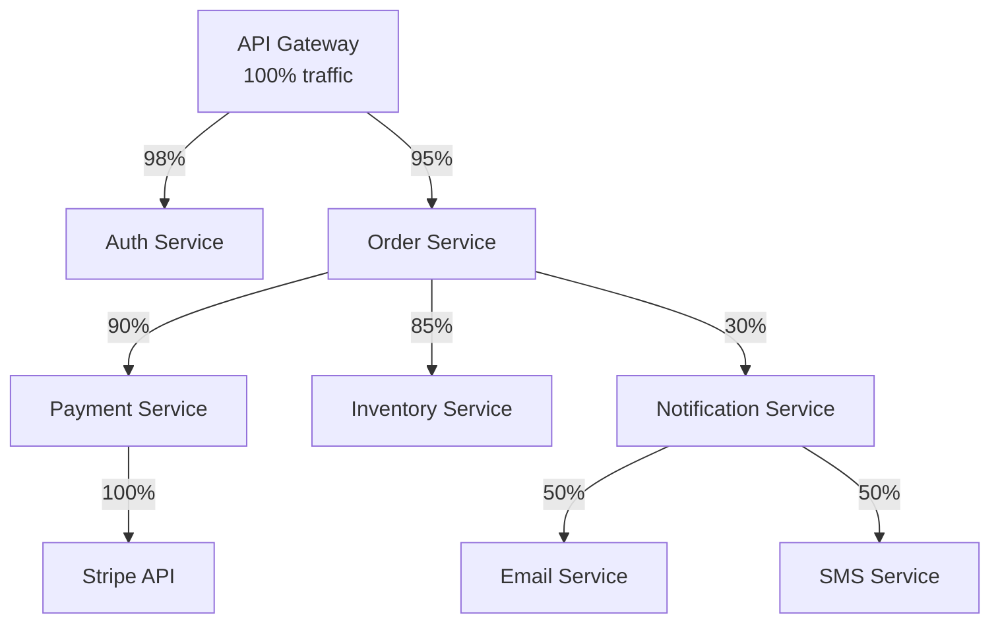

**Insights**:
- Payment service is critical dependency (90% of orders)
- Stripe is single point of failure
- Notification is fire-and-forget (async)
- Auth is called for almost all requests

### Error Attribution

Determine where in the trace errors originated.

```mermaid
graph TB
    Root[API Request<br/>Status: Error]
    
    Root --> S1[Auth<br/>Status: OK ✓]
    Root --> S2[Orders<br/>Status: Error ✗]
    
    S2 --> S3[Validate<br/>Status: OK ✓]
    S2 --> S4[Payment<br/>Status: Error ✗]
    S2 --> S5[Inventory<br/>Status: Not Called]
    
    S4 --> S6[Stripe API<br/>Status: Error ✗<br/>Error: card_declined]
    
    
```

**Root Cause**: Stripe API returned `card_declined` error
**Propagation**: Error bubbled up through Payment → Orders → API

### Latency Distribution Analysis

Compare trace durations to identify patterns.

```mermaid
graph TB
    subgraph "Latency Buckets"
        B1[< 100ms<br/>Count: 8,500<br/>85%]
        B2[100-500ms<br/>Count: 1,200<br/>12%]
        B3[500-1000ms<br/>Count: 250<br/>2.5%]
        B4[> 1000ms<br/>Count: 50<br/>0.5%]
    end
    
    Analysis[Analysis]
    
    B1 --> Analysis
    B2 --> Analysis
    B3 --> Analysis
    B4 --> Analysis
    
    Analysis --> I1[Most requests fast]
    Analysis --> I2[Small % very slow]
    Analysis --> I3[Investigate >1s traces]
    
    
```

**Action**: Deep dive into the 50 traces > 1000ms to find common patterns

## Performance Overhead

Tracing has inherent costs that must be managed.

### Sources of Overhead

```mermaid
graph TB
    Overhead[Tracing Overhead]
    
    Overhead --> CPU[CPU Cost]
    Overhead --> Mem[Memory Cost]
    Overhead --> Net[Network Cost]
    Overhead --> Lat[Latency Cost]
    
    CPU --> CPU1[Span creation<br/>Context propagation<br/>Serialization]
    Mem --> Mem1[Span buffering<br/>Context storage<br/>Tag data]
    Net --> Net1[Header transmission<br/>Span export]
    Lat --> Lat1[Additional processing<br/>Export delays]
    
    
```

### Overhead Measurements

| Operation | Overhead | Impact |
|-----------|----------|--------|
| **Create Span** | 1-5 μs | Negligible |
| **Add Tags** | 0.5-2 μs per tag | Low |
| **Context Propagation** | 2-10 μs | Low |
| **Serialize Span** | 10-50 μs | Low-Medium |
| **Export Span** | Async | Low (if async) |
| **Full Request** | 0.1-1% latency | Acceptable |

### Minimizing Overhead

**1. Asynchronous Export**
```
Don't: Export spans synchronously during request
Do: Buffer spans and export in background
```

**2. Sampling**
```
Don't: Trace every request
Do: Sample at appropriate rate (1-10%)
```

**3. Selective Instrumentation**
```
Don't: Trace every function call
Do: Trace service boundaries and critical paths
```

**4. Efficient Serialization**
```
Don't: Use verbose formats
Do: Use binary protocols (Protocol Buffers)
```

**5. Tag Minimization**
```
Don't: Add hundreds of tags per span
Do: Include only essential metadata
```

### Overhead Budget

```mermaid
graph LR
    Budget[Acceptable Overhead:<br/>< 1% latency<br/>< 5% CPU<br/>< 100MB memory]
    
    Budget --> M1[Measure Actual]
    M1 --> C{Within<br/>Budget?}
    
    C -->|Yes| OK[Continue]
    C -->|No| Optimize[Optimize]
    
    Optimize --> O1[Reduce sampling]
    Optimize --> O2[Fewer tags]
    Optimize --> O3[Selective instrumentation]
    
    O1 --> M1
    O2 --> M1
    O3 --> M1
    
   
```

## Tracing Patterns

### Pattern 1: Database Query Tracing

**Purpose**: Track database operations within a trace

```mermaid
graph TB
    HTTP[HTTP Request Span<br/>Duration: 250ms]
    
    HTTP --> DB1[DB Query: SELECT users<br/>Duration: 45ms]
    HTTP --> Logic[Business Logic<br/>Duration: 10ms]
    HTTP --> DB2[DB Query: INSERT order<br/>Duration: 80ms]
    HTTP --> DB3[DB Query: UPDATE inventory<br/>Duration: 100ms]

```

**Tags to Include**:
- `db.system`: postgresql, mysql, mongodb
- `db.name`: Database name
- `db.statement`: SQL query (sanitized)
- `db.operation`: SELECT, INSERT, UPDATE
- `db.rows_affected`: Number of rows

### Pattern 2: Cache Operation Tracing

**Purpose**: Understand cache hit/miss patterns

```mermaid
graph TB
    Request[API Request]
    
    Request --> Cache{Check Cache}
    Cache -->|Hit| Return[Return Cached<br/>Duration: 5ms]
    Cache -->|Miss| DB[Query Database<br/>Duration: 100ms]
    
    DB --> Store[Store in Cache<br/>Duration: 3ms]
    Store --> Return2[Return Result]
    
```

**Tags to Include**:
- `cache.hit`: true/false
- `cache.key`: Cache key (sanitized)
- `cache.ttl`: Time to live
- `cache.size`: Size of cached data

### Pattern 3: External API Tracing

**Purpose**: Track third-party service calls

```mermaid
graph TB
    Service[Your Service]
    
    Service --> Prepare[Prepare Request<br/>Duration: 5ms]
    Prepare --> Call[HTTP Call to Stripe<br/>Duration: 2000ms]
    Call --> Process[Process Response<br/>Duration: 10ms]
    
    style Call fill:#ff6b6b
```

**Tags to Include**:
- `http.method`: GET, POST
- `http.url`: API endpoint
- `http.status_code`: Response status
- `peer.service`: stripe, twilio, etc.
- `retry.count`: Number of retries

### Pattern 4: Async Operation Tracing

**Purpose**: Trace fire-and-forget operations

```mermaid
graph TB
    Request[HTTP Request<br/>Duration: 100ms]
    
    Request --> Sync[Synchronous Work<br/>Duration: 95ms]
    Request -.->|Triggers| Async[Async Job<br/>Duration: 5000ms]
    
    Async -.-> Email[Send Email<br/>Duration: 3000ms]
    Async -.-> SMS[Send SMS<br/>Duration: 2000ms]
    
```

**Relationship**: Use `FollowsFrom` reference type

### Pattern 5: Batch Processing Tracing

**Purpose**: Trace batch jobs and bulk operations

```mermaid
graph TB
    Batch[Batch Job Span<br/>Duration: 3600s]
    
    Batch --> Item1[Process Item 1<br/>Duration: 2s]
    Batch --> Item2[Process Item 2<br/>Duration: 1.5s]
    Batch --> Item3[Process Item 3<br/>Duration: 3s]
    Batch --> ItemN[... 10,000 items ...]

```

**Strategy**: Don't trace every item (cardinality explosion)
- Trace batch job as single span
- Sample individual items (e.g., 1%)
- Log summary statistics
- Trace failures

## Best Practices

### 1. Trace at Service Boundaries

**Focus on**:
- HTTP requests/responses
- RPC calls
- Database queries
- Cache operations
- Message queue operations
- External API calls

**Don't trace**:
- Every function call
- Internal loops
- Getter/setter methods
- Utility functions

```mermaid
graph TB
    subgraph "Service A"
        Entry[Entry Point ✓<br/>Create span]
        Internal1[Internal Function ✗<br/>No span]
        Internal2[Internal Function ✗<br/>No span]
        Exit[Exit Point ✓<br/>End span]
    end
    
    subgraph "Service B"
        Entry2[Entry Point ✓<br/>New span]
    end
    
    Entry --> Internal1 --> Internal2 --> Exit
    Exit --> Entry2
    
```

### 2. Use Meaningful Span Names

**Good Span Names**:
```
✅ http_request
✅ database_query
✅ stripe_charge
✅ send_email
✅ cache_lookup
✅ serialize_response
```

**Bad Span Names**:
```
❌ process (too generic)
❌ handle_request_123 (includes unique ID)
❌ /api/users/12345 (includes user ID)
❌ function_A (unclear purpose)
```

**Naming Convention**:
```
<operation>_<target>

Examples:
- query_database
- call_payment_api
- validate_token
- fetch_from_cache
```

### 3. Add Rich Context with Tags

**Essential Tags**:

| Category | Tag Examples |
|----------|--------------|
| **HTTP** | `http.method`, `http.status_code`, `http.url` |
| **Database** | `db.system`, `db.operation`, `db.statement` |
| **Service** | `service.name`, `service.version`, `environment` |
| **User** | `user.id`, `user.tier`, `session.id` |
| **Business** | `order.id`, `transaction.amount`, `product.id` |
| **Error** | `error`, `error.message`, `error.stack` |

**Tag Best Practices**:
```
✅ Do:
- Use standard tag names (OpenTelemetry semantic conventions)
- Include meaningful business context
- Sanitize sensitive data
- Use consistent naming (snake_case)

❌ Don't:
- Include PII (passwords, credit cards, SSNs)
- Create high-cardinality tags (unique IDs as tag values)
- Duplicate information across tags
- Use tags for large data (use events/logs instead)
```

### 4. Separate Errors from Failures

**Error**: Something went wrong, but it's handled
**Failure**: Unrecoverable issue

```mermaid
graph TB
    Request[Request Arrives]
    
    Request --> Try{Execute}
    Try -->|Success| OK[Span Status: OK<br/>No error tag]
    Try -->|Expected Error| Handled[Span Status: OK<br/>error: false<br/>error_handled: true<br/>error_type: validation]
    Try -->|Unexpected Error| Failed[Span Status: ERROR<br/>error: true<br/>error.message<br/>error.stack]
    
    style OK fill:#90EE90
    style Handled fill:#FFEB3B
    style Failed fill:#ff6b6b
```

**Example**:
```
Expected (Not a failure):
- User validation error (400 Bad Request)
- Cache miss (handled gracefully)
- Rate limit hit (expected behavior)
- Empty search results

Unexpected (Failure):
- Database connection lost
- Out of memory
- Uncaught exception
- Third-party service down
```

### 5. Correlate with Logs and Metrics

**The Power of Correlation**:

```mermaid
graph TB
    Trace[Trace: abc123<br/>Request slow]
    
    Trace --> Logs[Query Logs<br/>traceId: abc123]
    Trace --> Metrics[Check Metrics<br/>at same timestamp]
    
    Logs --> L1[ERROR: Database timeout<br/>traceId: abc123]
    Metrics --> M1[Database latency spike<br/>p95: 5000ms]
    
    L1 --> RCA[Root Cause:<br/>Database performance issue]
    M1 --> RCA
    
   
```

**Implementation**:
```
Ensure all three pillars share:
- Trace ID
- Span ID (for logs)
- Service name
- Timestamp

Log entry:
{
  "level": "error",
  "message": "Database query timeout",
  "traceId": "abc123",
  "spanId": "span_789",
  "service": "order-service",
  "timestamp": "2025-10-06T10:30:45Z"
}

Metric labels:
database_query_duration_seconds{
  service="order-service",
  operation="SELECT"
}
```

### 6. Set Appropriate Sampling Rates

**Sampling Recommendations**:

| Traffic Level | Sample Rate | Reasoning |
|---------------|-------------|-----------|
| **< 100 req/s** | 10-100% | Low volume, can afford more traces |
| **100-1000 req/s** | 1-10% | Moderate volume, balance cost/visibility |
| **> 1000 req/s** | 0.1-1% | High volume, focus on errors |
| **Critical paths** | 10-100% | Always important |
| **Errors** | 100% | Always trace failures |
| **Slow requests** | 100% | Always trace performance issues |

### 7. Monitor Trace Quality

**Quality Metrics to Track**:

```mermaid
graph TB
    Quality[Trace Quality Monitoring]
    
    Quality --> M1[Completeness<br/>All spans present?]
    Quality --> M2[Timing<br/>Spans within parent?]
    Quality --> M3[Context<br/>Propagation working?]
    Quality --> M4[Coverage<br/>Services instrumented?]
    
    M1 --> A1[Alert on orphaned spans]
    M2 --> A2[Alert on timing anomalies]
    M3 --> A3[Alert on broken traces]
    M4 --> A4[Track instrumentation %]
    
```

**Key Quality Indicators**:
- **Orphaned Spans**: Spans with no parent (broken propagation)
- **Timing Issues**: Child spans longer than parent
- **Incomplete Traces**: Missing expected spans
- **Broken Context**: Trace IDs not propagating
- **High Error Rate**: More than expected trace errors

### 8. Document Your Instrumentation

**Documentation Should Include**:

```markdown
# Tracing Documentation

## Instrumented Services
- [x] API Gateway
- [x] Auth Service
- [x] Order Service
- [x] Payment Service
- [ ] Notification Service (planned)

## Span Naming Convention
Pattern: <verb>_<noun>
Examples: query_database, call_stripe, send_email

## Standard Tags
- service.name: Service identifier
- service.version: Deployment version
- environment: prod/staging/dev
- user.id: Authenticated user (if applicable)
- order.id: Order identifier (if applicable)

## Sampling Strategy
- All services: 1% baseline
- /checkout endpoint: 10%
- /admin/* endpoints: 100%
- Errors: 100%
- Latency > 2s: 100%

## Critical Traces
Always traced:
- Payment processing
- Order creation
- User registration
- Admin actions
```

### 9. Use Standard Conventions

**OpenTelemetry Semantic Conventions**:

Follow standardized naming for interoperability:

**HTTP Spans**:
```
Span name: HTTP <method>
Tags:
- http.method: GET, POST, etc.
- http.url: Full URL
- http.status_code: 200, 404, 500
- http.user_agent: Client user agent
```

**Database Spans**:
```
Span name: <operation> <database>.<table>
Tags:
- db.system: postgresql, mysql, mongodb
- db.name: Database name
- db.statement: SQL query (sanitized)
- db.operation: SELECT, INSERT, UPDATE, DELETE
```

**Messaging Spans**:
```
Span name: <destination> send|receive
Tags:
- messaging.system: kafka, rabbitmq, sqs
- messaging.destination: Queue/topic name
- messaging.operation: send, receive, process
```

### 10. Plan for Scale

**Scalability Considerations**:

```mermaid
graph TB
    Scale[Scaling Tracing System]
    
    Scale --> C1[Collection]
    Scale --> C2[Transport]
    Scale --> C3[Storage]
    Scale --> C4[Query]
    
    C1 --> S1[Distributed agents<br/>Buffer locally]
    C2 --> S2[Batch export<br/>Compression]
    C3 --> S3[Time-based partitioning<br/>Retention policies]
    C4 --> S4[Index optimization<br/>Pre-aggregation]
    
    style Scale fill:#FFD700
```

**Growth Planning**:
```
Current: 10,000 req/s × 1% sampling = 100 traces/s
Growth: 100,000 req/s × 1% sampling = 1,000 traces/s

Storage needs:
- Average trace size: 10 KB
- Traces per day: 1,000 × 86,400 = 86.4M traces
- Storage per day: 864 GB
- 30-day retention: 25.9 TB

Plan for:
- Storage costs
- Query performance
- Retention strategy
- Downsampling older data
```

## Common Challenges

### Challenge 1: Context Loss

**Problem**: Trace context not propagated, resulting in broken traces

```mermaid
graph LR
    ServiceA[Service A<br/>TraceID: abc]
    ServiceB[Service B<br/>TraceID: ???]
    ServiceC[Service C<br/>TraceID: xyz]
    
    ServiceA -->|Context Lost| ServiceB
    ServiceB -->|New Trace Started| ServiceC
    
    style ServiceB fill:#ff6b6b,color:#fff
```

**Causes**:
- Middleware not installed
- Non-HTTP communication (gRPC, message queues)
- Custom transport protocols
- Thread pool boundaries
- Async operations

**Solutions**:
- Audit all service boundaries
- Implement context propagation for all transports
- Use instrumentation libraries
- Test propagation in integration tests
- Monitor orphaned spans

### Challenge 2: Clock Skew

**Problem**: Different server clocks cause timing issues

```mermaid
gantt
    title Clock Skew Problem
    dateFormat X
    axisFormat %L ms
    
    section Server 1 (Fast)
    Parent Span    :0, 1000
    
    section Server 2 (Slow)
    Child Span     :1100, 1600
```

**Impact**:
- Child appears to start after parent ends
- Incorrect duration calculations
- Confusing waterfall views

**Solutions**:
- Use NTP to synchronize clocks
- Calculate durations locally (don't rely on absolute timestamps)
- Accept small skew tolerances
- Focus on relative timings within a service

### Challenge 3: Cardinality Explosion

**Problem**: Too many unique span names or tag combinations

```
❌ Bad:
Span name: GET /api/users/12345
Span name: GET /api/users/67890
... millions of unique span names

Tags: userId="user_12345"
Tags: userId="user_67890"
... millions of unique tag values
```

**Impact**:
- Storage explosion
- Slow queries
- High costs
- System instability

**Solutions**:
- Parameterize URLs: `GET /api/users/:id`
- Limit tag values
- Use logs for high-cardinality data
- Monitor cardinality metrics

### Challenge 4: Incomplete Traces

**Problem**: Missing spans in traces

```mermaid
graph TB
    Root[Root Span<br/>Present ✓]
    
    Root --> C1[Span A<br/>Present ✓]
    Root --> C2[Span B<br/>MISSING ✗]
    Root --> C3[Span C<br/>Present ✓]
    
    style C2 fill:#ff6b6b,color:#fff
```

**Causes**:
- Service crashes before span exported
- Network issues during export
- Sampling inconsistency
- Buffer overflow

**Solutions**:
- Implement buffering and retry
- Use persistent queues for critical spans
- Monitor span export success rate
- Alert on incomplete traces

### Challenge 5: Performance Impact

**Problem**: Tracing overhead affects application performance

**Symptoms**:
- Increased latency
- Higher CPU usage
- Memory pressure
- Network bandwidth consumption

**Solutions**:
- Reduce sampling rate
- Minimize tags per span
- Use asynchronous export
- Batch span exports
- Optimize instrumentation
- Remove unnecessary spans

**Monitoring Overhead**:
```
Track these metrics:
- span_creation_duration_seconds
- span_export_duration_seconds
- span_buffer_size
- span_export_errors_total
- instrumentation_cpu_usage_percent
```

### Challenge 6: Alert Fatigue

**Problem**: Too many trace-based alerts

**Causes**:
- Alerting on every error trace
- Low thresholds
- Sampling causing intermittent alerts
- No aggregation

**Solutions**:
- Alert on error rate, not count
- Use time windows (5 minutes minimum)
- Set appropriate thresholds
- Group similar errors
- Implement alert suppression

```
❌ Bad Alert:
"1 trace with error detected"

✅ Good Alert:
"Error rate > 5% for 5 minutes (127 errors / 2543 requests)"
```

### Challenge 7: Cross-Organization Tracing

**Problem**: Tracing across organizational boundaries

**Scenario**:
```
Your Service → Partner API → Third-party Service
```

**Challenges**:
- Different tracing systems
- Privacy concerns
- No context propagation
- Limited visibility

**Solutions**:
- Use standard formats (W3C Trace Context)
- Sanitize sensitive data
- Negotiate trace propagation with partners
- Accept partial visibility
- Measure at boundaries

## Summary

Distributed tracing provides end-to-end visibility into request flows across microservices and distributed systems.

**Key Concepts**:

1. **Traces and Spans**:
   - Trace = complete request journey
   - Span = single operation
   - Hierarchical parent-child relationships

2. **Context Propagation**:
   - Critical for linking spans
   - Use standard formats (W3C Trace Context)
   - Propagate via HTTP headers, message metadata

3. **Sampling**:
   - Head-based: Decision at start
   - Tail-based: Decision after completion
   - Hybrid: Combination approach
   - Adaptive: Dynamic adjustment

4. **Analysis**:
   - Identify bottlenecks
   - Map dependencies
   - Attribute errors
   - Understand latency distribution

**Benefits**:

```mermaid
graph TB
    Tracing[Distributed Tracing]
    
    Tracing --> B1[Understand<br/>Request Flow]
    Tracing --> B2[Identify<br/>Bottlenecks]
    Tracing --> B3[Debug<br/>Failures]
    Tracing --> B4[Measure<br/>Latency]
    Tracing --> B5[Map<br/>Dependencies]
    Tracing --> B6[Optimize<br/>Performance]
    
    style Tracing fill:#FFD700
    style B1 fill:#90EE90
    style B2 fill:#90EE90
    style B3 fill:#90EE90
    style B4 fill:#90EE90
    style B5 fill:#90EE90
    style B6 fill:#90EE90
```

**Tracing Complements Other Pillars**:

| Pillar | Question Answered | Data Type |
|--------|-------------------|-----------|
| **Logs** | What happened? | Discrete events |
| **Metrics** | How much? | Aggregated numbers |
| **Traces** | Where and why? | Request paths |

**Remember**: 
- Trace at service boundaries, not everywhere
- Use meaningful span names and tags
- Sample intelligently
- Correlate with logs and metrics
- Monitor trace quality
- Manage overhead carefully

## Related Documentation

- [Introduction](./01-introduction.md) - Observability fundamentals
- [Logging](./02-logging.md) - First pillar, complements tracing
- [Metrics](./03-metrics.md) - Second pillar, shows aggregates
- [Distributed Tracing](./07-distributed-tracing.md) - Implementation details
- [Log Aggregation](./05-log-aggregation.md) - Correlating logs with traces
- [Alerting and Monitoring](./08-alerting-and-monitoring.md) - Trace-based alerts
- [Tools Ecosystem](./11-tools-ecosystem.md) - Tracing platforms

## Next Steps

1. Continue to [Log Aggregation](./05-log-aggregation.md) for centralized logging strategies
2. Review [Distributed Tracing](./07-distributed-tracing.md) for implementation patterns
3. Learn about [OpenTelemetry](https://opentelemetry.io/) - the standard for distributed tracing
4. Explore tracing tools like Jaeger, Zipkin, or commercial solutions