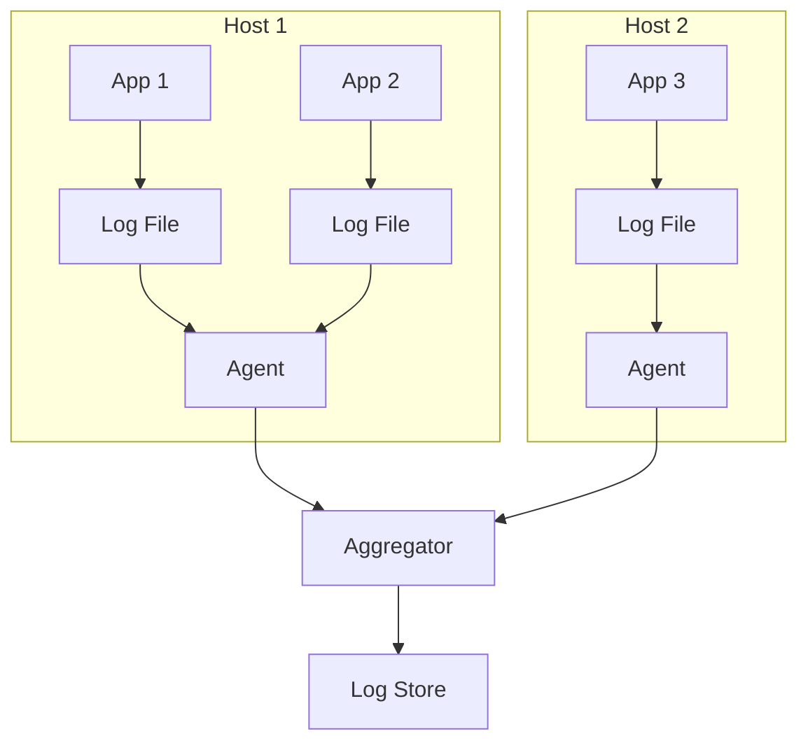
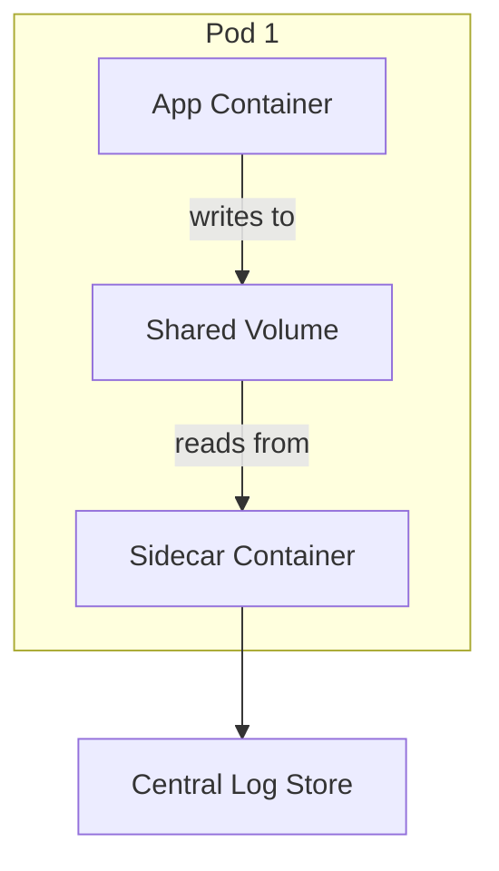
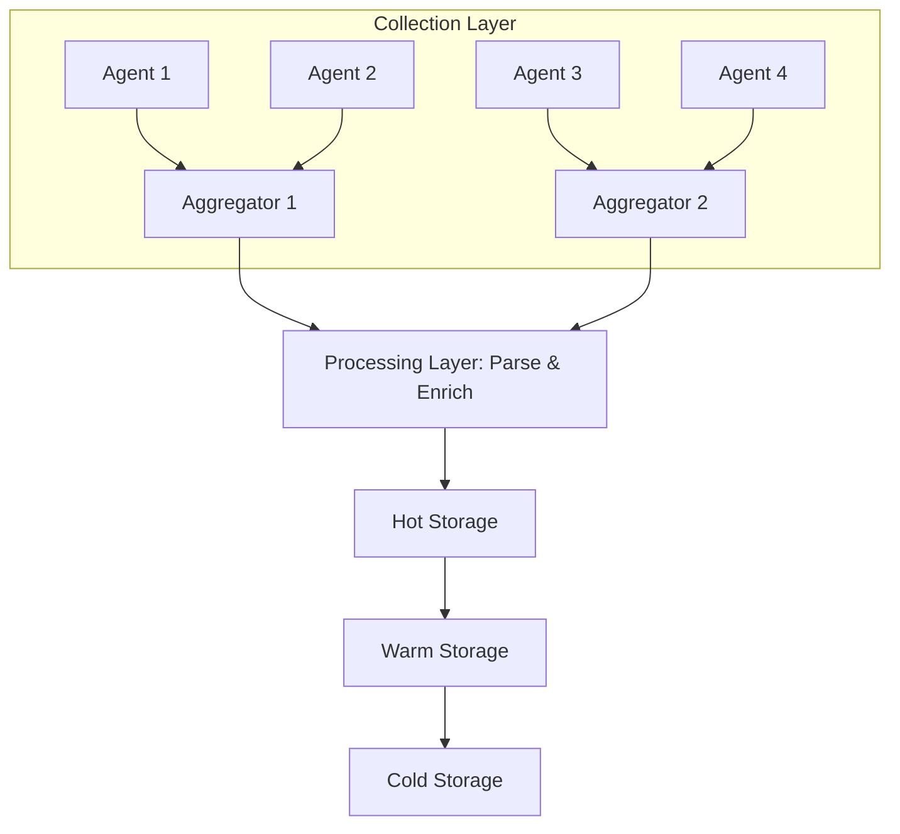
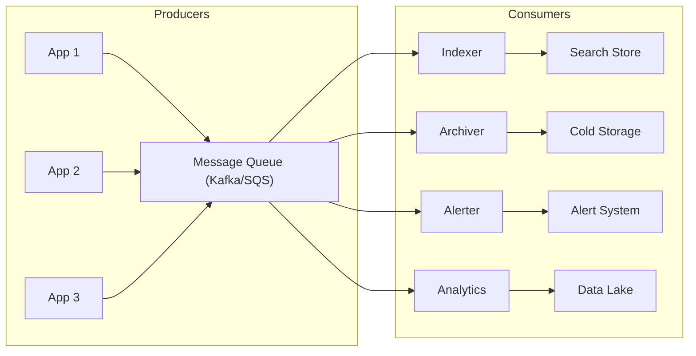
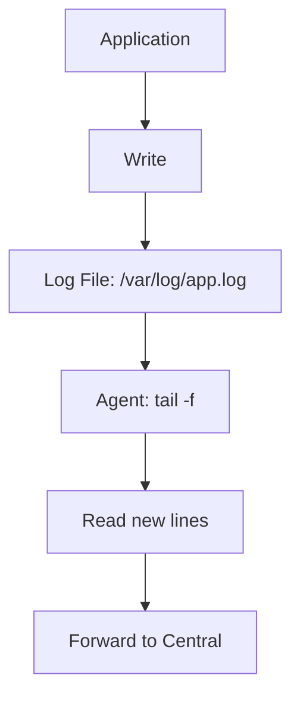
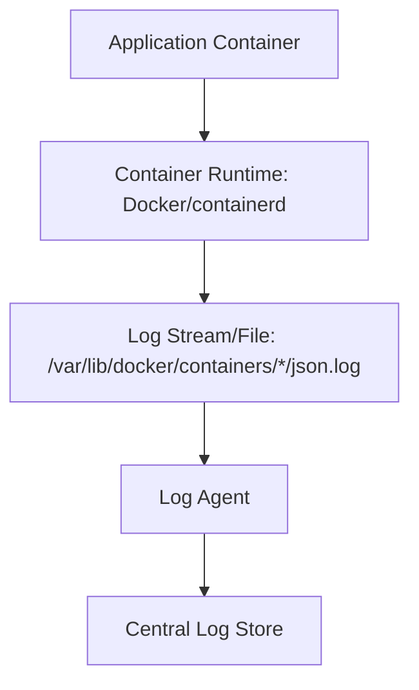
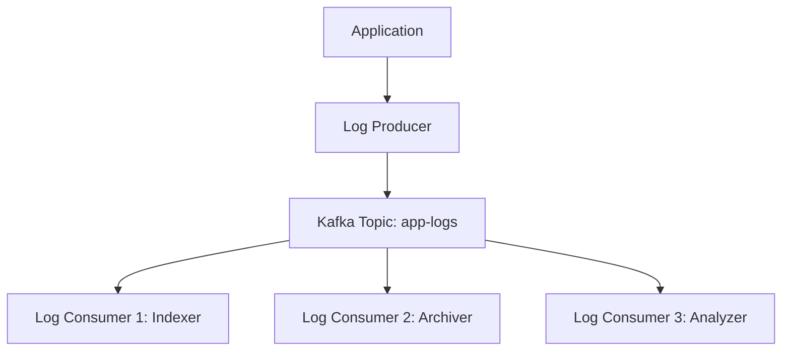
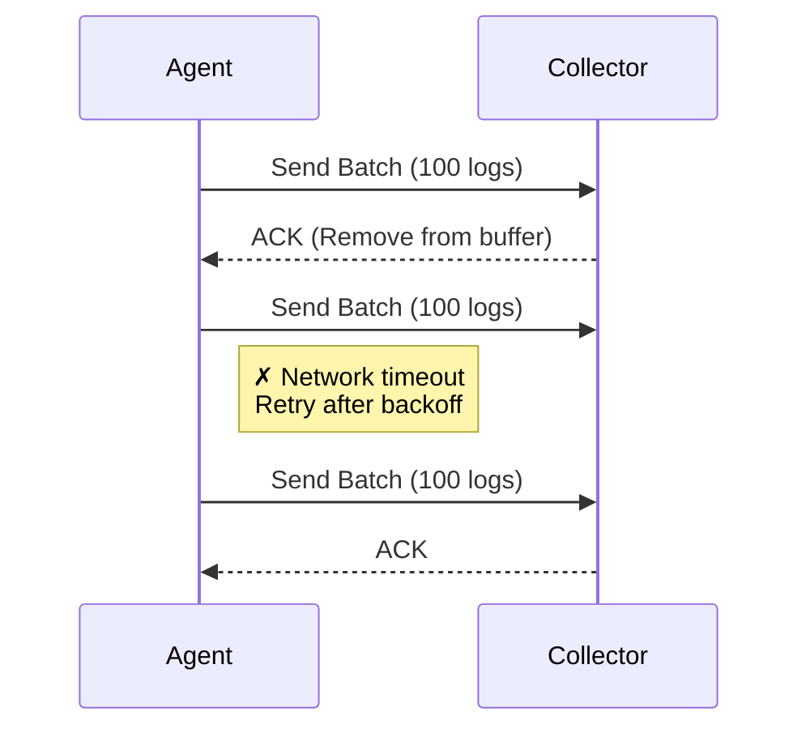

# Log Aggregation

## Table of Contents
- [Introduction](#introduction)
- [Architecture Patterns](#architecture-patterns)
- [Collection Methods](#collection-methods)
- [Transport Mechanisms](#transport-mechanisms)
- [Storage Strategies](#storage-strategies)
- [Indexing and Search](#indexing-and-search)
- [Retention Policies](#retention-policies)
- [Scaling Considerations](#scaling-considerations)
- [Security and Compliance](#security-and-compliance)
- [Best Practices](#best-practices)
- [Implementation Examples](#implementation-examples)
- [Troubleshooting](#troubleshooting)

---

## Introduction

Log aggregation is the process of collecting, transporting, storing, and making searchable logs from multiple sources in a centralized location. In distributed systems, logs are generated across hundreds or thousands of instances, making centralization essential for effective monitoring and troubleshooting.

### Why Log Aggregation?

**Without Aggregation (Problems)**:
- Must SSH to each instance individually
- Manual searching across servers
- No correlation between related logs
- Logs lost when instances terminate
- Difficult to get system-wide view

**With Aggregation (Benefits)**:
- All logs in centralized location
- Search across entire infrastructure
- Correlate logs from different services
- Persist logs beyond instance lifetime
- Enable system-wide analysis

### Benefits of Centralized Logging

| Benefit | Description | Example |
|---------|-------------|---------|
| **Single Source of Truth** | All logs in one place | Query across all services simultaneously |
| **Correlation** | Link related logs together | Trace a request across 10 microservices |
| **Persistence** | Survive instance termination | Auto-scaling doesn't lose historical logs |
| **Search** | Powerful query capabilities | Find specific errors in seconds |
| **Analysis** | Aggregate and analyze patterns | Identify error rate trends over time |
| **Alerting** | Real-time notifications | Alert when error threshold exceeded |
| **Compliance** | Audit trail preservation | Meet regulatory requirements (SOX, HIPAA) |

### Key Challenges Addressed

**Volume Challenge**:
- Modern systems generate terabytes of logs daily
- Need efficient storage and processing
- Cost optimization required

**Velocity Challenge**:
- Millions of log entries per second
- Real-time processing requirements
- Low-latency search needs

**Variety Challenge**:
- Multiple log formats (JSON, plain text, binary)
- Different log levels and structures
- Various sources (applications, infrastructure, security)

**Distribution Challenge**:
- Hundreds of sources across regions
- Network reliability concerns
- Coordination complexity

**Reliability Challenge**:
- No log loss tolerated
- Durability requirements
- Fault tolerance needed

**Performance Challenge**:
- Real-time search capabilities
- Sub-second query response
- Concurrent user support

---

## Architecture Patterns

### Pattern 1: Direct-to-Store

**Description**: Applications write logs directly to a central log store without intermediaries.

**Architecture**:
```mermaid

```

**Characteristics**:
- Simplest possible architecture
- No intermediate components
- Direct network connection required
- Application handles all retry logic
- Tight coupling to storage backend

**Pros**:
- ✅ Simple to set up and understand
- ✅ Lowest latency possible
- ✅ Fewer components to maintain
- ✅ Lower operational complexity
- ✅ Direct feedback on success/failure

**Cons**:
- ❌ Application tightly coupled to log storage
- ❌ Network issues directly affect application
- ❌ No buffering for traffic spikes
- ❌ Difficult to change log backend
- ❌ Application must handle backpressure

**Use Cases**:
- Small deployments (< 10 services)
- Trusted network environments
- Low log volume scenarios
- Rapid prototyping
- Development environments

**Example Configuration** (Elasticsearch direct):
```json
{
  "log_destination": "https://elasticsearch.internal:9200",
  "index": "app-logs",
  "retry_attempts": 3,
  "timeout_ms": 5000
}
```

---

### Pattern 2: Agent-Based Collection

**Description**: Log collection agents run on each host, reading logs from files or streams and forwarding to central aggregators.

**Architecture**:


**Popular Agents**:
- **Fluentd**: Ruby-based, plugin ecosystem
- **Filebeat**: Lightweight, Elastic Stack
- **Logstash**: Feature-rich, heavy
- **Fluent Bit**: C-based, minimal footprint
- **Vector**: Rust-based, high performance

**Characteristics**:
- One agent per host (or container)
- Reads from log files or stdout
- Local buffering and batching
- Handles network failures gracefully
- Can transform/filter logs locally
- Decouples application from infrastructure

**Pros**:
- ✅ Application decoupled from log infrastructure
- ✅ Built-in retry and buffering mechanisms
- ✅ Can aggregate multiple apps per host
- ✅ Survives application restarts
- ✅ Local preprocessing capabilities
- ✅ Reduced network connections
- ✅ Well-established pattern

**Cons**:
- ❌ Additional component to manage and monitor
- ❌ Resource overhead per host (CPU, memory)
- ❌ Configuration complexity increases
- ❌ Agent failures can lose logs
- ❌ Version management across fleet

**Use Cases**:
- Production deployments
- Multiple applications per host
- Need for reliability and buffering
- Existing file-based logging
- Traditional VM-based infrastructure

**Agent Configuration Example** (Fluentd):
```conf
<source>
  @type tail
  path /var/log/app/*.log
  pos_file /var/log/fluentd/app.pos
  tag app.logs
  format json
</source>

<match app.logs>
  @type forward
  <server>
    host aggregator.internal
    port 24224
  </server>
  <buffer>
    @type file
    path /var/log/fluentd/buffer
    flush_interval 10s
    retry_max_times 5
  </buffer>
</match>
```

---

### Pattern 3: Sidecar Pattern

**Description**: A log collector container runs alongside the application container in the same pod, sharing resources and lifecycle.

**Architecture** (Kubernetes):


**Characteristics**:
- One log collector per application instance
- Shares pod lifecycle with application
- Isolated log processing per app
- Kubernetes/container native pattern
- Independent scaling per application

**Pros**:
- ✅ Perfect application isolation
- ✅ Independent scaling with application
- ✅ No host-level agent needed
- ✅ Per-application log configuration
- ✅ Failure isolation (app crash doesn't affect other logs)
- ✅ Cloud-native best practice

**Cons**:
- ❌ Higher resource overhead (extra container per pod)
- ❌ More containers to manage
- ❌ Increased scheduling complexity
- ❌ Potential resource contention in pod
- ❌ Not suitable for VM-based deployments

**Use Cases**:
- Kubernetes environments
- Multi-tenant systems requiring isolation
- Applications with unique logging needs
- Services with different log formats
- Microservices architectures

**Kubernetes Manifest Example**:
```yaml
apiVersion: v1
kind: Pod
metadata:
  name: app-with-logging
spec:
  containers:
  - name: app
    image: my-app:1.0
    volumeMounts:
    - name: log-volume
      mountPath: /var/log/app
  - name: log-shipper
    image: fluent/fluent-bit:2.0
    volumeMounts:
    - name: log-volume
      mountPath: /var/log/app
      readOnly: true
    - name: config
      mountPath: /fluent-bit/etc/
  volumes:
  - name: log-volume
    emptyDir: {}
  - name: config
    configMap:
      name: fluent-bit-config
```

---

### Pattern 4: Centralized Aggregation Pipeline

**Description**: Multi-tier architecture with distinct collection, aggregation, processing, and storage layers for maximum scalability.

**Architecture**:


**Layers Explained**:

**1. Collection Layer**:
- Agents on each host
- Initial buffering
- Basic filtering
- Format normalization

**2. Aggregation Layer**:
- Receives from multiple agents
- Load balancing
- Protocol translation
- Buffer management

**3. Processing Layer**:
- Log parsing and enrichment
- Field extraction
- Data transformation
- Filtering and sampling
- Anomaly detection

**4. Storage Layer**:
- Hot: Recent logs (fast SSD)
- Warm: Older logs (standard storage)
- Cold: Archive (object storage)

**Characteristics**:
- Separation of concerns
- Each layer scales independently
- Complex but highly flexible
- Suitable for large enterprises

**Pros**:
- ✅ Highly scalable (100TB+/day)
- ✅ Independent layer scaling
- ✅ Advanced processing capabilities
- ✅ Failure isolation between layers
- ✅ Easy to add new features
- ✅ Performance optimization per layer

**Cons**:
- ❌ Complex architecture to manage
- ❌ Higher operational overhead
- ❌ More potential failure points
- ❌ Increased end-to-end latency
- ❌ Requires significant expertise
- ❌ Higher infrastructure costs

**Use Cases**:
- Large-scale deployments (1000+ hosts)
- High volume (terabytes per day)
- Complex log processing requirements
- Enterprise environments
- Compliance-heavy industries

**Processing Pipeline Example**:
```yaml
# Aggregator configuration
aggregator:
  inputs:
    - type: tcp
      port: 5140
      workers: 4
  outputs:
    - type: kafka
      brokers: ["kafka1:9092", "kafka2:9092"]
      topic: raw-logs
      compression: snappy

# Processor configuration
processor:
  inputs:
    - type: kafka
      brokers: ["kafka1:9092", "kafka2:9092"]
      topic: raw-logs
      consumer_group: log-processor
  
  transforms:
    - parse_json
    - extract_fields
    - enrich_geoip
    - filter_sensitive_data
  
  outputs:
    - type: elasticsearch
      hosts: ["es1:9200", "es2:9200"]
      index: "logs-%{+YYYY.MM.dd}"
      bulk_size: 1000
```

---

### Pattern 5: Message Queue-Based

**Description**: Logs are published to a message queue or streaming platform, enabling multiple consumers to process logs independently.

**Architecture**:


**Message Queue Options**:

| Platform | Best For | Throughput | Durability |
|----------|----------|------------|------------|
| **Apache Kafka** | High throughput, replay | Very High | Excellent |
| **RabbitMQ** | Flexible routing | Medium | Good |
| **AWS Kinesis** | AWS integration | High | Excellent |
| **Google Pub/Sub** | GCP integration | High | Excellent |
| **Azure Event Hubs** | Azure integration | High | Excellent |

**Characteristics**:
- Pub/sub or queue-based messaging
- Decoupled producers and consumers
- Durable message storage
- Multiple consumption patterns
- Built-in buffering for traffic spikes

**Pros**:
- ✅ Excellent buffering capability
- ✅ Decoupled architecture
- ✅ Multiple consumers (fan-out)
- ✅ Handles traffic spikes naturally
- ✅ Message replay capability
- ✅ Guaranteed ordering (per partition)
- ✅ High availability built-in

**Cons**:
- ❌ Additional infrastructure required
- ❌ Operational complexity (cluster management)
- ❌ Potential message loss if misconfigured
- ❌ Ordering challenges across partitions
- ❌ Learning curve for team
- ❌ Additional costs

**Use Cases**:
- Variable load patterns
- Multiple log consumers needed
- Real-time stream processing
- High availability requirements
- Event-driven architectures
- Data lake ingestion

**Kafka Configuration Example**:
```properties
# Producer configuration
bootstrap.servers=kafka1:9092,kafka2:9092,kafka3:9092
topic=application-logs
compression.type=snappy
acks=1
batch.size=16384
linger.ms=10

# Consumer configuration
group.id=log-indexer-group
auto.offset.reset=earliest
enable.auto.commit=false
max.poll.records=500
```

---

## Collection Methods

### Method 1: File-Based Collection

**How It Works**:
1. Application writes logs to files on disk
2. Log agent monitors files for changes (tail)
3. Agent reads new log lines as they appear
4. Agent forwards logs to central system
5. Agent tracks file position to handle restarts

**Process Flow**:


**Technical Details**:

**File Watching Mechanisms**:
- **inotify** (Linux): Kernel-level file monitoring
- **Polling**: Check file modifications periodically
- **File position tracking**: Store offset in state file

**Log Rotation Handling**:
```
Current:    app.log        (active, agent tracking position 1000)
Rotated:    app.log.1      (rotated file)
New:        app.log        (new file, agent detects and switches)
Compressed: app.log.1.gz   (archived)
```

**Characteristics**:
- Traditional and well-understood approach
- Requires disk I/O (write then read)
- Reliable and battle-tested
- File system dependency

**Pros**:
- ✅ Complete decoupling from application
- ✅ Survives application crashes
- ✅ Log rotation naturally supported
- ✅ Can reprocess old logs
- ✅ Buffer during network outages
- ✅ Works with legacy applications

**Cons**:
- ❌ Disk I/O overhead (write + read)
- ❌ Latency from file write/read cycle
- ❌ Disk space required for buffering
- ❌ Log rotation complexity
- ❌ File permission issues
- ❌ Not ideal for containers (ephemeral storage)

**Best For**:
- Traditional VM-based deployments
- Applications that already log to files
- Long-term log retention needs
- Legacy system integration
- High reliability requirements

**Agent Configuration Example** (Filebeat):
```yaml
filebeat.inputs:
- type: log
  enabled: true
  paths:
    - /var/log/app/*.log
  
  # Multi-line pattern for stack traces
  multiline.pattern: '^[[:space:]]'
  multiline.negate: false
  multiline.match: after
  
  # Fields to add
  fields:
    service: payment-api
    environment: production
  
  # Exclude lines
  exclude_lines: ['^DEBUG']

output.logstash:
  hosts: ["logstash:5044"]
  compression_level: 3
  bulk_max_size: 2048
```

---

### Method 2: Stdout/Stderr Collection

**How It Works**:
1. Application writes logs to stdout/stderr
2. Container runtime captures output
3. Runtime writes to JSON file (Docker) or streams
4. Log agent reads from runtime's log source
5. Agent forwards to central system

**Process Flow**:


**Docker Log Format**:
```json
{
  "log": "2025-10-06T10:30:45.123Z INFO Payment processed successfully\n",
  "stream": "stdout",
  "time": "2025-10-06T10:30:45.123456789Z"
}
```

**Kubernetes Log Location**:
```
/var/log/pods/<namespace>_<pod-name>_<pod-uid>/<container-name>/*.log
```

**Characteristics**:
- Cloud-native, container-first approach
- No file management in application
- Container runtime handles capture
- Automatic log association with containers

**Pros**:
- ✅ Simplest for applications (just print)
- ✅ No disk I/O in application container
- ✅ Automatic metadata (container ID, pod, namespace)
- ✅ Works with ephemeral containers
- ✅ Cloud platform integration
- ✅ Twelve-factor app compliant

**Cons**:
- ❌ Limited to container environments
- ❌ Potential log loss if runtime fails
- ❌ Less control over log format (runtime wraps)
- ❌ Difficult to handle multi-line logs
- ❌ Performance overhead from JSON wrapping
- ❌ Limited buffering in runtime

**Best For**:
- Containerized applications (Docker/Kubernetes)
- Cloud-native microservices
- Twelve-factor applications
- Stateless services
- Development and CI/CD environments

**Kubernetes DaemonSet Example**:
```yaml
apiVersion: apps/v1
kind: DaemonSet
metadata:
  name: fluentd
  namespace: kube-system
spec:
  selector:
    matchLabels:
      name: fluentd
  template:
    metadata:
      labels:
        name: fluentd
    spec:
      containers:
      - name: fluentd
        image: fluent/fluentd-kubernetes-daemonset:v1-debian-elasticsearch
        env:
        - name: FLUENT_ELASTICSEARCH_HOST
          value: "elasticsearch.logging.svc"
        - name: FLUENT_ELASTICSEARCH_PORT
          value: "9200"
        volumeMounts:
        - name: varlog
          mountPath: /var/log
        - name: varlibdockercontainers
          mountPath: /var/lib/docker/containers
          readOnly: true
      volumes:
      - name: varlog
        hostPath:
          path: /var/log
      - name: varlibdockercontainers
        hostPath:
          path: /var/lib/docker/containers
```

---

### Method 3: Direct Network Shipping

**How It Works**:
Application uses SDK or library to send logs directly over the network to a collector.

**Process Flow**:
```
[Application with Logging SDK]
    ↓ (UDP/TCP/HTTP/gRPC)
[Network]
    ↓
[Log Collector/Endpoint]
    ↓
[Central Log Store]
```

**Protocols**:

**1. Syslog** (UDP 514 / TCP 514):
```python
import logging
import logging.handlers

handler = logging.handlers.SysLogHandler(
    address=('logserver.internal', 514),
    socktype=socket.SOCK_STREAM  # TCP
)
logger.addHandler(handler)
logger.info("Application started")
```

**2. HTTP/HTTPS** (REST API):
```javascript
fetch('https://logs.example.com/api/logs', {
  method: 'POST',
  headers: { 'Content-Type': 'application/json' },
  body: JSON.stringify({
    timestamp: new Date().toISOString(),
    level: 'ERROR',
    message: 'Payment failed',
    service: 'payment-api'
  })
});
```

**3. gRPC** (Binary Protocol):
```protobuf
service LogService {
  rpc SendLog(LogEntry) returns (LogResponse);
  rpc StreamLogs(stream LogEntry) returns (LogResponse);
}

message LogEntry {
  int64 timestamp = 1;
  string level = 2;
  string message = 3;
  map<string, string> attributes = 4;
}
```

**Characteristics**:
- Application has SDK/library for logging
- Direct network connection to log service
- Application responsible for retry logic
- Real-time log delivery

**Pros**:
- ✅ Lowest possible latency
- ✅ No intermediate files or agents
- ✅ Direct control over delivery
- ✅ Rich metadata easy to include
- ✅ Structured logging natural
- ✅ Protocol-level features (compression, encryption)

**Cons**:
- ❌ Network dependency impacts application
- ❌ Application must handle all failures
- ❌ Potential log loss on network issues
- ❌ Tight coupling to log infrastructure
- ❌ SDK version management required
- ❌ Limited buffering in application

**Best For**:
- Low-latency logging requirements
- Cloud services with built-in logging (AWS CloudWatch)
- Managed logging services (Datadog, New Relic)
- Applications that need immediate log delivery
- Services with reliable networks

**Cloud Platform Examples**:

**AWS CloudWatch Logs**:
```python
import boto3

client = boto3.client('logs', region_name='us-east-1')

response = client.put_log_events(
    logGroupName='/aws/application/payment-service',
    logStreamName='instance-i-1234567890',
    logEvents=[
        {
            'timestamp': int(time.time() * 1000),
            'message': 'Payment processed successfully'
        }
    ]
)
```

**Google Cloud Logging**:
```python
from google.cloud import logging

client = logging.Client()
logger = client.logger('payment-service')

logger.log_struct({
    'message': 'Payment processed',
    'severity': 'INFO',
    'amount': 99.99,
    'currency': 'USD'
})
```

---

### Method 4: Streaming Collection

**How It Works**:
Logs are published to a streaming platform (Kafka, Kinesis) and consumed by log processors.

**Architecture**:


**Kafka Example**:
```python
from kafka import KafkaProducer
import json

producer = KafkaProducer(
    bootstrap_servers=['kafka1:9092', 'kafka2:9092'],
    value_serializer=lambda v: json.dumps(v).encode('utf-8'),
    compression_type='snappy',
    acks='all'  # Wait for all replicas
)

# Send log
log_entry = {
    'timestamp': '2025-10-06T10:30:45Z',
    'level': 'ERROR',
    'service': 'payment-api',
    'message': 'Payment gateway timeout',
    'trace_id': 'abc123'
}

producer.send('application-logs', value=log_entry)
producer.flush()
```

**AWS Kinesis Example**:
```python
import boto3
import json

kinesis = boto3.client('kinesis', region_name='us-east-1')

response = kinesis.put_record(
    StreamName='application-logs',
    Data=json.dumps(log_entry),
    PartitionKey=log_entry['service']
)
```

**Characteristics**:
- Logs treated as event stream
- Durable message storage (retention period)
- Multiple consumers can process same logs
- Pub/sub or queue-based patterns

**Pros**:
- ✅ Excellent buffering (days of retention)
- ✅ Multiple independent consumers
- ✅ Replay capability (reprocess old logs)
- ✅ Decoupled producers and consumers
- ✅ Guaranteed ordering (per partition)
- ✅ Handles massive scale
- ✅ Built-in high availability

**Cons**:
- ❌ Infrastructure complexity (clusters)
- ❌ Additional operational burden
- ❌ Learning curve required
- ❌ Cost of running message platform
- ❌ Latency from buffering
- ❌ Ordering limited to partitions

**Best For**:
- High-volume logging (millions/second)
- Multiple log consumers required
- Real-time stream processing
- Event-driven architectures
- Data lake ingestion
- Analytics pipelines

**Stream Processing Example** (Kafka Streams):
```java
StreamsBuilder builder = new StreamsBuilder();

KStream<String, LogEntry> logs = builder.stream("application-logs");

// Filter ERROR logs
KStream<String, LogEntry> errors = logs.filter(
    (key, log) -> log.getLevel().equals("ERROR")
);

// Send to different topic
errors.to("error-logs");

// Aggregate error counts by service
KTable<String, Long> errorCounts = errors
    .groupBy((key, log) -> log.getService())
    .count();

errorCounts.toStream().to("error-metrics");
```

---

## Transport Mechanisms

### Reliable Transport Principles

Reliable log transport ensures logs are delivered without loss despite network failures, service restarts, and traffic spikes.

**Core Principles**:

**1. Buffering**: Absorb traffic spikes
**2. Retry Logic**: Handle transient failures
**3. Batching**: Improve efficiency
**4. Compression**: Reduce bandwidth
**5. Acknowledgment**: Confirm delivery
**6. Back-pressure**: Handle slow consumers

---

### Transport Patterns

#### Pattern 1: Push-Based Transport

**Description**: Log agents actively push logs to central collectors.

**Sequence**:


**Characteristics**:
- Agent initiates all connections
- Agent controls send rate
- Agent responsible for retries
- Outbound connections from agents

**Pros**:
- ✅ Simple firewall rules (outbound only)
- ✅ Agent controls flow rate
- ✅ Works well with NAT
- ✅ No inbound ports needed on agents
- ✅ Collector addresses can change

**Cons**:
- ❌ Agents need collector discovery
- ❌ Potential DDoS on collectors
- ❌ Harder to implement back-pressure
- ❌ Collectors must handle all agent connections

**Configuration Example**:
```yaml
# Filebeat push configuration
output.elasticsearch:
  hosts: ["https://es1:9200", "https://es2:9200"]
  
  # Load balancing
  loadbalance: true
  
  # Retry settings
  max_retries: 3
  backoff.init: 1s
  backoff.max: 60s
  
  # Bulk settings
  bulk_max_size: 50
  timeout: 90
  
  # Compression
  compression_level: 3
```

---

#### Pattern 2: Pull-Based Transport

**Description**: Central collectors pull logs from agents periodically.

**Sequence**:
```
Collector                      Agent
  |                              |
  |------- Request logs -------->|
  |<---- Send available logs ----|
  |------------ ACK ------------>|
  |                              |
  |  (Wait poll interval: 5s)   |
  |                              |
  |------- Request logs -------->|
  |<---- Send available logs ----|
```

**Characteristics**:
- Collector initiates connections
- Collector controls pull rate
- Agents buffer until pulled
- Inbound connections to agents

**Pros**:
- ✅ Collector controls load precisely
- ✅ Easy to implement back-pressure
- ✅ Service discovery integration natural
- ✅ Can dynamically adjust poll rate
- ✅ Simpler agent implementation

**Cons**:
- ❌ Requires inbound firewall rules to agents
- ❌ Higher latency (limited by poll interval)
- ❌ More collector→agent connections
- ❌ Agents need reachability
- ❌ Not suitable for NAT environments

**Use Cases**:
- Internal infrastructure (no NAT)
- When collector needs rate control
- Integration with service mesh
- Prometheus-style scraping

**Configuration Example** (Prometheus-style):
```yaml
# Collector configuration
scrape_configs:
  - job_name: 'application-logs'
    scrape_interval: 5s
    scrape_timeout: 3s
    
    # Service discovery
    kubernetes_sd_configs:
      - role: pod
        namespaces:
          names: ['default', 'production']
    
    # Relabeling
    relabel_configs:
      - source_labels: [__meta_kubernetes_pod_annotation_prometheus_io_scrape]
        action: keep
        regex: true
```

---

#### Pattern 3: Hybrid Transport

**Description**: Combination of push and pull at different layers.

**Architecture**:
```
[Agents] --push--> [Aggregators] <--pull-- [Central System]
```

**Example Workflow**:
1. Agents push to regional aggregators (low latency)
2. Aggregators buffer and batch logs
3. Central system pulls from aggregators (controlled rate)

**Benefits**:
- ✅ Low latency at edge (push)
- ✅ Controlled load at core (pull)
- ✅ Regional buffering
- ✅ Flexible architecture

---

### Transport Optimization Techniques

#### 1. Batching

**Purpose**: Group multiple log entries before sending to reduce overhead.

**Without Batching**:
```
Log 1 → [Network Send] → 100 bytes payload + 200 bytes overhead = 300 bytes
Log 2 → [Network Send] → 100 bytes payload + 200 bytes overhead = 300 bytes
Log 3 → [Network Send] → 100 bytes payload + 200 bytes overhead = 300 bytes
Total: 300 bytes payload + 600 bytes overhead = 900 bytes
```

**With Batching** (batch size: 3):
```
Log 1 ┐
Log 2 ├→ [Batch] → [Network Send] → 300 bytes payload + 200 bytes overhead = 500 bytes
Log 3 ┘
Savings: 44% reduction in total bytes
```

**Batching Configuration**:

| Parameter | Typical Value | Description |
|-----------|---------------|-------------|
| **batch_size** | 100-1000 logs | Number of logs per batch |
| **batch_timeout** | 5-10 seconds | Max wait before sending incomplete batch |
| **max_batch_bytes** | 1-10 MB | Size limit per batch |
| **batch_workers** | 2-8 threads | Parallel batch processors |

**Benefits**:
- Reduced network calls (10-100x fewer)
- Lower latency overhead
- Better throughput
- More efficient resource usage

**Trade-offs**:
- Increased delivery latency (up to batch_timeout)
- Memory overhead for buffering
- Potential larger data loss if failure occurs

**Example Configuration** (Logstash):
```ruby
output {
  elasticsearch {
    hosts => ["es1:9200", "es2:9200"]
    index => "logs-%{+YYYY.MM.dd}"
    
    # Batching configuration
    flush_size => 500        # Send after 500 events
    idle_flush_time => 10    # Or after 10 seconds
  }
}
```

---

#### 2. Compression

**Purpose**: Reduce network bandwidth and transmission time.

**Compression Comparison**:

| Algorithm | Ratio | Speed | CPU Usage | Best For |
|-----------|-------|-------|-----------|----------|
| **None** | 1:1 | Fastest | None | Low latency, unlimited bandwidth |
| **LZ4** | 2-3:1 | Very Fast | Very Low | Real-time systems |
| **Snappy** | 2-3:1 | Very Fast | Very Low | High throughput |
| **Gzip** | 5-10:1 | Medium | Medium | General purpose |
| **Zstd** | 3-5:1 | Fast | Low-Medium | Modern systems |
| **Bzip2** | 8-15:1 | Slow | High | Archival, batch processing |

**Example Compression Results**:
```
Original JSON log: 1000 bytes
{
  "timestamp": "2025-10-06T10:30:45.123Z",
  "level": "ERROR",
  "service": "payment-api",
  "message": "Payment gateway connection timeout after 30 seconds",
  "metadata": {...}
}

Compressed:
- LZ4:     400 bytes (2.5x reduction)
- Snappy:  380 bytes (2.6x reduction)
- Gzip:    150 bytes (6.7x reduction)
- Zstd:    200 bytes (5.0x reduction)
```

**Network Impact**:
```
Without Compression:
10,000 logs/sec × 1 KB/log = 10 MB/sec = 80 Mbps

With Gzip (6x compression):
10,000 logs/sec × 167 bytes/log = 1.67 MB/sec = 13.3 Mbps
Savings: 83% bandwidth reduction
```

**Configuration Examples**:

**Fluentd**:
```conf
<match **>
  @type forward
  compress gzip
  
  <server>
    host aggregator.internal
    port 24224
  </server>
</match>
```

**Kafka**:
```properties
compression.type=snappy
```

**Best Practices**:
- Use **LZ4/Snappy** for real-time, low-latency requirements
- Use **Gzip** for general purpose, bandwidth-limited networks
- Use **Zstd** for modern systems seeking balance
- Avoid compression for very small logs (< 100 bytes)
- Consider CPU availability on agents

---

#### 3. Acknowledgment Strategies

**Strategy 1: Fire-and-Forget (At-Most-Once)**

**Description**: Send logs without waiting for confirmation.

```
Agent                    Collector
  |                          |
  |------ Send logs -------->|
  |  (Discard immediately)   |
  |                          |
```

**Characteristics**:
- No acknowledgment required
- Fastest delivery
- Potential log loss

**When to Use**:
- Non-critical logs (debug, trace)
- Development environments
- High-volume, low-value logs
- Extreme performance requirements

**Configuration**:
```yaml
output:
  type: udp
  host: collector.internal
  port: 5140
  ack_required: false
```

---

**Strategy 2: Acknowledged Delivery (At-Least-Once)**

**Description**: Retry until acknowledgment received.

```
Agent                    Collector
  |                          |
  |------ Send logs -------->|
  |                          |- Process
  |<------- ACK -------------|
  |  (Remove from buffer)    |
  |                          |
  |------ Send logs -------->|
  |  ✗ No ACK (timeout)      |
  |  (Retry #1)              |
  |------ Send logs -------->|
  |<------- ACK -------------|
```

**Characteristics**:
- Reliable delivery guaranteed
- Possible duplicate logs
- Retry logic required

**Retry Configuration**:
```yaml
output:
  retry:
    enabled: true
    max_attempts: 5
    initial_interval: 1s
    max_interval: 60s
    multiplier: 2        # Exponential backoff
    randomization: 0.5   # Jitter
```

**Retry Schedule Example**:
```
Attempt 1: Wait 1 second
Attempt 2: Wait 2 seconds  (1s × 2)
Attempt 3: Wait 4 seconds  (2s × 2)
Attempt 4: Wait 8 seconds  (4s × 2)
Attempt 5: Wait 16 seconds (8s × 2)
Failed: Drop or dead-letter queue
```

**When to Use**:
- Production systems
- Critical logs (errors, security events)
- Compliance requirements
- Default choice for most systems

---

**Strategy 3: Exactly-Once Delivery**

**Description**: Prevent duplicates through deduplication.

```
Agent                                Collector
  |                                      |
  |-- Send logs (ID: abc123) ---------->|- Check if ID exists
  |                                      |- Store with ID
  |<------------- ACK ------------------|
  |                                      |
  |  (Network failure, retry)           |
  |-- Send logs (ID: abc123) ---------->|- ID exists, skip
  |<------ ACK (already processed) -----|
```

**Implementation Methods**:

**1. Idempotency Keys**:
```json
{
  "log_id": "uuid-or-hash-of-content",
  "timestamp": "2025-10-06T10:30:45Z",
  "message": "Payment processed"
}
```

**2. Sequence Numbers**:
```
Agent-001, Sequence 1
Agent-001, Sequence 2
Agent-001, Sequence 3
(Gap detected: Sequence 2 missing, request resend)
```

**3. Content Hashing**:
```python
import hashlib
import json

def generate_log_id(log_entry):
    content = json.dumps(log_entry, sort_keys=True)
    return hashlib.sha256(content.encode()).hexdigest()
```

**Characteristics**:
- No duplicates guaranteed
- Complex implementation
- Higher overhead

**When to Use**:
- Critical financial transactions
- Audit logs requiring exact counts
- Compliance with strict regulations
- When duplicate detection is essential

**Trade-offs**:
- Increased latency (deduplication check)
- Storage overhead (tracking seen IDs)
- Complexity in distributed systems
- Rarely needed for typical logging

---

#### 4. Back-pressure Handling

**Problem**: Collector slower than log generation rate.

**Without Back-pressure**:
```
Agent Buffer: [==============================] (100% full)
              ↓ (drops new logs)
           [Lost logs]
```

**With Back-pressure**:
```
Agent Buffer: [==============================] (100% full)
              ↓ (signals application)
           [Application slows down or uses circuit breaker]
```

**Back-pressure Strategies**:

**1. Buffer and Block**:
```python
class BufferedLogger:
    def __init__(self, max_buffer_size=10000):
        self.buffer = Queue(maxsize=max_buffer_size)
    
    def log(self, message):
        try:
            # Block if buffer full (back-pressure)
            self.buffer.put(message, timeout=5)
        except QueueFull:
            # Handle: drop, alert, or degrade
            self.handle_overflow(message)
```

**2. Sampling Under Load**:
```python
class AdaptiveSampler:
    def should_sample(self, log_level):
        buffer_usage = self.get_buffer_usage()
        
        if buffer_usage < 0.5:
            return True  # Log everything
        elif buffer_usage < 0.8:
            # Sample INFO logs at 50%
            return log_level >= INFO or random() < 0.5
        else:
            # Only ERROR and above
            return log_level >= ERROR
```

**3. Circuit Breaker**:
```python
class LogCircuitBreaker:
    def __init__(self):
        self.state = "CLOSED"  # CLOSED, OPEN, HALF_OPEN
        self.failure_count = 0
        self.threshold = 5
    
    def send_logs(self, logs):
        if self.state == "OPEN":
            # Don't attempt to send
            self.buffer_locally(logs)
            return
        
        try:
            self.collector.send(logs)
            self.on_success()
        except Exception:
            self.on_failure()
    
    def on_failure(self):
        self.failure_count += 1
        if self.failure_count >= self.threshold:
            self.state = "OPEN"  # Stop trying
            self.schedule_retry()  # Try again later
```

**4. Rate Limiting**:
```yaml
rate_limit:
  enabled: true
  max_events_per_second: 10000
  burst_size: 5000
  strategy: token_bucket
```

---

## Storage Strategies

### Storage Tier Architecture

**Hot Tier** (0-7 days):
- **Purpose**: Recent logs, frequent access
- **Storage**: NVMe SSD
- **Indexing**: Full text + all fields
- **Query Speed**: < 100ms
- **Cost**: $$
- **Compression**: None or light (LZ4)

**Warm Tier** (8-30 days):
- **Purpose**: Older logs, occasional access
- **Storage**: SATA SSD or fast HDD
- **Indexing**: Partial (key fields only)
- **Query Speed**: 1-5 seconds
- **Cost**: $
- **Compression**: Medium (Snappy/Gzip)

**Cold Tier** (31-90 days):
- **Purpose**: Archive, rare access
- **Storage**: Object storage (S3, GCS)
- **Indexing**: Minimal or none
- **Query Speed**: 10-60 seconds
- **Cost**: $
- **Compression**: High (Gzip/Zstd)

**Archive Tier** (90+ days):
- **Purpose**: Compliance, long-term retention
- **Storage**: Glacier, tape
- **Indexing**: None (restore needed)
- **Query Speed**: Hours to days
- **Cost**: ¢
- **Compression**: Maximum (Bzip2)

**Automatic Lifecycle Transition**:
```
Day 0:  [Create in Hot]
Day 7:  [Move to Warm] (automated)
Day 30: [Move to Cold] (automated)
Day 90: [Move to Archive] (automated)
Day 365: [Delete] (if policy allows)
```

---

### Storage Models

#### 1. Time-Series Storage

**Index Structure**:
```
logs-2025-10-06  (today, 1.2 GB)
logs-2025-10-05  (yesterday, 1.5 GB)
logs-2025-10-04  (2 days ago, 1.3 GB)
logs-2025-10-03  (3 days ago, 1.4 GB)
...
logs-2025-09-06  (30 days ago, 1.1 GB)
```

**Query Examples**:
```
# Fast: Query single day
GET logs-2025-10-06/_search
{
  "query": { "match": { "level": "ERROR" } }
}

# Medium: Query last 7 days (7 indices)
GET logs-2025-10-*/_search
{
  "query": {
    "bool": {
      "must": [
        { "range": { "timestamp": { "gte": "now-7d" } } },
        { "match": { "level": "ERROR" } }
      ]
    }
  }
}

# Slow: Query last 30 days (30 indices)
GET logs-2025-*/_search
{
  "query": { "match": { "service": "payment-api" } }
}
```

**Advantages**:
- ✅ Simple retention (delete old indices)
- ✅ Efficient time-range queries
- ✅ Easy to optimize hot data
- ✅ Parallel query across dates
- ✅ Clear data lifecycle

**Disadvantages**:
- ❌ Many small indices if hourly/daily
- ❌ Cross-date queries slower
- ❌ Index overhead per time period

**Best For**:
- Time-based analysis common
- Simple retention requirements
- Most log aggregation systems

---

#### 2. Service-Based Storage

**Index Structure**:
```
logs-api-gateway     (5 GB)
logs-auth-service    (2 GB)
logs-order-service   (8 GB)
logs-payment-service (12 GB)
logs-shipping-service (3 GB)
```

**Query Examples**:
```
# Very Fast: Single service query
GET logs-payment-service/_search
{
  "query": { "match": { "level": "ERROR" } }
}

# Slow: Cross-service query (scatter-gather)
GET logs-*/_search
{
  "query": {
    "bool": {
      "must": [
        { "match": { "trace_id": "abc123" } }
      ]
    }
  }
}
```

**Advantages**:
- ✅ Fast service-specific queries
- ✅ Independent retention per service
- ✅ Service isolation
- ✅ Easy capacity planning per service

**Disadvantages**:
- ❌ Cross-service queries complex
- ❌ Difficult time-based cleanup
- ❌ Index proliferation with many services

**Best For**:
- Service-focused queries common
- Different retention per service
- Strong service boundaries

---

#### 3. Hybrid Storage (Time + Service)

**Index Structure**:
```
logs-api-gateway-2025-10-06
logs-api-gateway-2025-10-05
logs-auth-service-2025-10-06
logs-auth-service-2025-10-05
logs-payment-service-2025-10-06
logs-payment-service-2025-10-05
```

**Query Examples**:
```
# Very Fast: Specific service and date
GET logs-payment-service-2025-10-06/_search

# Fast: Service across dates
GET logs-payment-service-*/_search

# Medium: All services today
GET logs-*-2025-10-06/_search

# Slow: All services, all dates
GET logs-*/_search
```

**Advantages**:
- ✅ Best of both worlds
- ✅ Fast service + time queries
- ✅ Flexible retention policies
- ✅ Excellent query optimization

**Disadvantages**:
- ❌ More indices to manage
- ❌ Complex index template setup
- ❌ Higher operational overhead

**Best For**:
- Large-scale production systems
- Need flexibility in queries
- When you can handle complexity

**Implementation (Elasticsearch)**:
```json
PUT _index_template/logs-template
{
  "index_patterns": ["logs-*"],
  "template": {
    "settings": {
      "number_of_shards": 3,
      "number_of_replicas": 1,
      "index.lifecycle.name": "logs-policy"
    },
    "mappings": {
      "properties": {
        "timestamp": { "type": "date" },
        "level": { "type": "keyword" },
        "service": { "type": "keyword" },
        "message": { "type": "text" },
        "trace_id": { "type": "keyword" }
      }
    }
  }
}
```

---

### Storage Optimization Techniques

#### 1. Index Lifecycle Management (ILM)

**Elasticsearch ILM Policy**:
```json
PUT _ilm/policy/logs-policy
{
  "policy": {
    "phases": {
      "hot": {
        "actions": {
          "rollover": {
            "max_size": "50GB",
            "max_age": "1d"
          }
        }
      },
      "warm": {
        "min_age": "7d",
        "actions": {
          "forcemerge": {
            "max_num_segments": 1
          },
          "shrink": {
            "number_of_shards": 1
          }
        }
      },
      "cold": {
        "min_age": "30d",
        "actions": {
          "freeze": {},
          "allocate": {
            "require": {
              "data": "cold"
            }
          }
        }
      },
      "delete": {
        "min_age": "90d",
        "actions": {
          "delete": {}
        }
      }
    }
  }
}
```

**Phases Explained**:

**Hot Phase**: Active writing and frequent queries
- Rollover when size or age limit reached
- Keep on fast storage (SSD)
- Multiple shards for write performance

**Warm Phase**: Older data, occasional queries
- Force merge to optimize (fewer segments)
- Shrink shards (reduce overhead)
- Can move to slower storage

**Cold Phase**: Archive, rare queries
- Freeze index (reduce heap usage)
- Move to cold storage nodes
- Searchable but slower

**Delete Phase**: Remove old data
- Automatic cleanup
- Free up storage
- Comply with retention policy

---

#### 2. Data Compression

**Field-Level Compression**:
```json
{
  "mappings": {
    "properties": {
      "message": {
        "type": "text",
        "index_options": "offsets",
        "store": true
      },
      "large_field": {
        "type": "text",
        "store": true,
        "compression": "best_compression"
      }
    }
  }
}
```

**Block Compression** (Elasticsearch):
```json
{
  "settings": {
    "index.codec": "best_compression"
  }
}
```

**Compression Results**:
```
Standard compression:  10 GB → 2 GB (5x)
Best compression:      10 GB → 1.2 GB (8.3x)

Trade-off:
- Write speed: 10-20% slower
- Query speed: 5-15% slower
- Storage cost: 60-70% savings
```

---

#### 3. Field Indexing Optimization

**Disable Indexing for Unused Fields**:
```json
{
  "mappings": {
    "properties": {
      "timestamp": {
        "type": "date",
        "index": true  // Frequently queried
      },
      "level": {
        "type": "keyword",
        "index": true  // Frequently filtered
      },
      "stack_trace": {
        "type": "text",
        "index": false,  // Never queried, only displayed
        "store": true
      },
      "request_body": {
        "type": "text",
        "index": false,
        "doc_values": false  // Don't need sorting/aggregation
      }
    }
  }
}
```

**Storage Savings**:
```
Indexed field:     100 MB data → 130 MB stored (30% overhead)
Non-indexed field: 100 MB data → 105 MB stored (5% overhead)

For rarely queried fields: 25% storage reduction
```

---

#### 4. Sampling Strategy

**Level-Based Sampling**:
```python
class SamplingLogger:
    def __init__(self):
        self.sample_rates = {
            "FATAL": 1.0,    # 100% - Always log
            "ERROR": 1.0,    # 100% - Always log
            "WARN": 1.0,     # 100% - Always log
            "INFO": 0.1,     # 10% - Sample
            "DEBUG": 0.01,   # 1% - Heavy sample
            "TRACE": 0.001   # 0.1% - Very heavy sample
        }
    
    def should_log(self, level):
        return random.random() < self.sample_rates.get(level, 1.0)
```

**Intelligent Sampling**:
```python
class IntelligentSampler:
    def should_log(self, log_entry):
        # Always log errors
        if log_entry.level in ["ERROR", "FATAL"]:
            return True
        
        # Always log first occurrence
        if self.is_first_occurrence(log_entry):
            return True
        
        # Sample by request volume
        if log_entry.endpoint == "/health":
            return random.random() < 0.01  # 1% of health checks
        
        # Sample repeated messages
        if self.is_repetitive(log_entry):
            return random.random() < 0.1  # 10% of repeats
        
        # Default sampling
        return random.random() < 0.1
```

**Storage Impact**:
```
Without sampling: 1 TB/day
With sampling:    100 GB/day (90% reduction)

Cost savings: $1000/month → $100/month
```

---

## Indexing and Search

### Indexing Fundamentals

#### Inverted Index Structure

**Example Log Entries**:
```
Doc1: "User login failed for admin"
Doc2: "Payment failed due to timeout"
Doc3: "User admin logged in successfully"
```

**Inverted Index**:
```
Term: "user"    → [Doc1, Doc3]
Term: "login"   → [Doc1, Doc3]
Term: "failed"  → [Doc1, Doc2]
Term: "admin"   → [Doc1, Doc3]
Term: "payment" → [Doc2]
Term: "timeout" → [Doc2]
```

**Query Process**:
```
Query: "admin failed"

Step 1: Look up terms
  "admin"  → [Doc1, Doc3]
  "failed" → [Doc1, Doc2]

Step 2: Intersection (AND)
  Result: [Doc1]

Step 3: Return Doc1
```

---

### Index Types

#### 1. Full-Text Index

**Purpose**: Search within log messages.

**Configuration**:
```json
{
  "mappings": {
    "properties": {
      "message": {
        "type": "text",
        "analyzer": "standard",
        "fields": {
          "keyword": {
            "type": "keyword",
            "ignore_above": 256
          }
        }
      }
    }
  }
}
```

**Query Examples**:
```json
// Fuzzy search
{
  "query": {
    "match": {
      "message": {
        "query": "conection timeout",
        "fuzziness": "AUTO"
      }
    }
  }
}

// Phrase search
{
  "query": {
    "match_phrase": {
      "message": "payment gateway timeout"
    }
  }
}

// Wildcard search
{
  "query": {
    "wildcard": {
      "message": "*timeout*"
    }
  }
}
```

---

#### 2. Field Index (Keyword)

**Purpose**: Exact matching, filtering, aggregations.

**Configuration**:
```json
{
  "mappings": {
    "properties": {
      "level": {
        "type": "keyword"
      },
      "service": {
        "type": "keyword"
      },
      "status_code": {
        "type": "integer"
      }
    }
  }
}
```

**Query Examples**:
```json
// Exact match
{
  "query": {
    "term": {
      "level": "ERROR"
    }
  }
}

// Multiple values
{
  "query": {
    "terms": {
      "service": ["payment-api", "order-api"]
    }
  }
}

// Range query
{
  "query": {
    "range": {
      "status_code": {
        "gte": 400,
        "lt": 500
      }
    }
  }
}
```

---

### Search Optimization

#### 1. Query Optimization Patterns

**Bad Query** (Slow):
```json
{
  "query": {
    "bool": {
      "must": [
        {
          "match": {
            "message": "error"  // Full text scan
          }
        }
      ]
    }
  },
  "size": 10000  // Large result set
}
```

**Good Query** (Fast):
```json
{
  "query": {
    "bool": {
      "filter": [  // Use filter for exact matches
        {
          "term": {
            "level": "ERROR"  // Indexed field
          }
        },
        {
          "range": {
            "timestamp": {
              "gte": "now-1h"  // Limit time range
            }
          }
        }
      ],
      "must": [
        {
          "match": {
            "message": "error"
          }
        }
      ]
    }
  },
  "size": 100,  // Reasonable result set
  "from": 0,
  "_source": ["timestamp", "level", "message"]  // Only needed fields
}
```

**Performance Improvement**: 10-100x faster

---

#### 2. Aggregation Optimization

**Example**: Error count by service in last 24 hours

**Unoptimized**:
```json
{
  "query": {
    "match_all": {}  // Scans everything
  },
  "aggs": {
    "errors_by_service": {
      "terms": {
        "field": "service",
        "size": 1000
      }
    }
  }
}
```

**Optimized**:
```json
{
  "query": {
    "bool": {
      "filter": [
        {
          "term": {
            "level": "ERROR"  // Pre-filter
          }
        },
        {
          "range": {
            "timestamp": {
              "gte": "now-24h"  // Time limit
            }
          }
        }
      ]
    }
  },
  "aggs": {
    "errors_by_service": {
      "terms": {
        "field": "service",
        "size": 10  // Limit results
      }
    }
  },
  "size": 0  // Don't return documents, only aggregation
}
```

---

#### 3. Query Caching

**Types of Caches**:

**1. Query Result Cache**: Cache entire query results
```
Cache Key: hash(query + index + time_range)
Cache TTL: 60 seconds
Hit Rate: 40-60% for dashboard queries
```

**2. Filter Cache**: Cache filter results
```
Cached:
  { "term": { "level": "ERROR" } }
  { "range": { "timestamp": { "gte": "now-1h" } } }

Not Cached:
  { "match": { "message": "error" } }  // Text queries
```

**3. Field Data Cache**: Cache field values for aggregations
```
Used for:
  - Sorting
  - Aggregations
  - Script fields

Memory intensive: Monitor heap usage
```

**Cache Configuration** (Elasticsearch):
```yaml
indices.queries.cache.size: 10%  # % of heap
indices.requests.cache.size: 2%   # Shard request cache
```

---

##

@log_performance
def process_payment(amount, currency):
    # Payment processing logic
    return payment_result
```

---

### 5. Alert-Friendly Logging

**Design Logs for Alerting**:
```python
class AlertableLogger:
    def __init__(self):
        self.logger = logging.getLogger(__name__)
    
    def log_with_alert_context(self, level, message, alert_context=None):
        """Log with structured data for alerting"""
        
        log_data = {
            'message': message,
            'timestamp': datetime.utcnow().isoformat(),
            'severity': level,
            
            # Alert context
            'alert': alert_context or {},
            
            # Common dimensions for alerting
            'dimensions': {
                'service': os.getenv('SERVICE_NAME'),
                'environment': os.getenv('ENVIRONMENT'),
                'region': os.getenv('AWS_REGION'),
                'host': socket.gethostname()
            }
        }
        
        self.logger.log(level, json.dumps(log_data))
    
    def alert_on_threshold(self, metric_name, value, threshold):
        """Log when metric exceeds threshold"""
        if value > threshold:
            self.log_with_alert_context(
                logging.ERROR,
                f"{metric_name} exceeded threshold",
                alert_context={
                    'metric': metric_name,
                    'value': value,
                    'threshold': threshold,
                    'exceeded_by': value - threshold,
                    'action_required': True,
                    'runbook': f'https://docs.company.com/runbooks/{metric_name}'
                }
            )

# Usage
logger = AlertableLogger()
logger.alert_on_threshold('error_rate', 15.5, threshold=10)
```

---

### 6. Log Sampling Strategy

**Intelligent Sampling**:
```python
class IntelligentLogSampler:
    def __init__(self):
        self.sample_rates = {}
        self.error_buffer = []
        self.buffer_size = 100
    
    def should_log(self, log_entry):
        """Determine if log should be recorded"""
        
        # Always log errors and above
        if log_entry['level'] in ['ERROR', 'FATAL', 'CRITICAL']:
            return True
        
        # Always log first occurrence of pattern
        log_signature = self._get_signature(log_entry)
        if not self._is_seen(log_signature):
            self._mark_seen(log_signature)
            return True
        
        # Sample based on endpoint
        endpoint = log_entry.get('endpoint', '')
        
        # Health checks: 1%
        if endpoint == '/health':
            return random.random() < 0.01
        
        # High-traffic endpoints: 10%
        if endpoint in ['/api/popular', '/api/feed']:
            return random.random() < 0.10
        
        # Default: 50%
        return random.random() < 0.50
    
    def _get_signature(self, log_entry):
        """Generate signature for deduplication"""
        return f"{log_entry['level']}:{log_entry.get('message', '')[:50]}"
    
    def _is_seen(self, signature):
        """Check if signature seen recently"""
        return signature in self.sample_rates
    
    def _mark_seen(self, signature):
        """Mark signature as seen"""
        self.sample_rates[signature] = datetime.utcnow()
        
        # Clean old signatures
        cutoff = datetime.utcnow() - timedelta(minutes=5)
        self.sample_rates = {
            k: v for k, v in self.sample_rates.items()
            if v > cutoff
        }
```

---

### 7. Multi-Environment Configuration

**Environment-Specific Settings**:
```yaml
# logging-config.yaml
environments:
  development:
    log_level: DEBUG
    output: stdout
    sampling_rate: 1.0  # 100%
    retention_days: 7
    enable_debug_logs: true
    
  staging:
    log_level: INFO
    output: aggregator
    sampling_rate: 0.5  # 50%
    retention_days: 30
    enable_debug_logs: true
    aggregator_endpoint: "https://logs-staging.company.com"
    
  production:
    log_level: WARN
    output: aggregator
    sampling_rate: 0.1  # 10% (except errors)
    retention_days: 90
    enable_debug_logs: false
    aggregator_endpoint: "https://logs.company.com"
    alert_on_errors: true
    pii_masking: enabled
```

**Load Configuration**:
```python
import yaml
import os

class LogConfig:
    def __init__(self):
        env = os.getenv('ENVIRONMENT', 'development')
        
        with open('logging-config.yaml') as f:
            config = yaml.safe_load(f)
        
        self.config = config['environments'][env]
    
    def get_logger(self):
        """Get configured logger for environment"""
        logger = logging.getLogger(__name__)
        logger.setLevel(self.config['log_level'])
        
        if self.config['output'] == 'stdout':
            handler = logging.StreamHandler()
        else:
            handler = self._get_aggregator_handler()
        
        formatter = logging.Formatter(
            '%(asctime)s - %(name)s - %(levelname)s - %(message)s'
        )
        handler.setFormatter(formatter)
        logger.addHandler(handler)
        
        return logger
```

---

## Implementation Examples

### Complete Fluentd Configuration

```conf
# fluentd.conf - Production-ready configuration

# Input: Tail application logs
<source>
  @type tail
  path /var/log/app/*.log
  pos_file /var/log/fluentd/app.pos
  tag app.logs
  
  <parse>
    @type json
    time_key timestamp
    time_format %Y-%m-%dT%H:%M:%S.%L%z
    keep_time_key true
  </parse>
  
  # Read from end on first run
  read_from_head false
  
  # Refresh interval
  refresh_interval 60s
</source>

# Input: System logs
<source>
  @type tail
  path /var/log/syslog
  pos_file /var/log/fluentd/syslog.pos
  tag system.logs
  
  <parse>
    @type syslog
  </parse>
</source>

# Filter: Add metadata
<filter app.logs>
  @type record_transformer
  enable_ruby true
  
  <record>
    hostname ${hostname}
    environment ${ENV['ENVIRONMENT']}
    service ${ENV['SERVICE_NAME']}
    version ${ENV['APP_VERSION']}
  </record>
</filter>

# Filter: Mask PII
<filter app.logs>
  @type record_modifier
  <record>
    message ${record["message"].gsub(/\b[A-Za-z0-9._%+-]+@[A-Za-z0-9.-]+\.[A-Z|a-z]{2,}\b/, '[EMAIL_REDACTED]')}
  </record>
</filter>

# Filter: Sample INFO logs
<filter app.logs>
  @type sampling
  sample_rate 10
  <rule>
    exclude level /ERROR|FATAL/
  </rule>
</filter>

# Output: Forward to aggregator with retry
<match app.logs>
  @type forward
  
  # Compression
  compress gzip
  
  # Servers
  <server>
    host aggregator1.internal
    port 24224
    weight 60
  </server>
  <server>
    host aggregator2.internal
    port 24224
    weight 40
  </server>
  
  # Buffer
  <buffer>
    @type file
    path /var/log/fluentd/buffer/app
    
    # Flush settings
    flush_mode interval
    flush_interval 10s
    flush_at_shutdown true
    
    # Retry settings
    retry_type exponential_backoff
    retry_timeout 1h
    retry_max_interval 30s
    retry_forever false
    
    # Chunk settings
    chunk_limit_size 5M
    total_limit_size 1G
    overflow_action drop_oldest_chunk
  </buffer>
  
  # Secondary output (failover)
  <secondary>
    @type file
    path /var/log/fluentd/failed/${tag}
    compress gzip
  </secondary>
</match>

# Output: System logs to separate destination
<match system.logs>
  @type elasticsearch
  host elasticsearch.internal
  port 9200
  
  index_name system-logs-%Y%m%d
  type_name _doc
  
  # Bulk settings
  flush_interval 10s
  bulk_message_request_threshold 1000
  
  # Authentication
  user elastic
  password ${ELASTIC_PASSWORD}
  
  <buffer>
    @type file
    path /var/log/fluentd/buffer/system
    flush_mode interval
    flush_interval 10s
  </buffer>
</match>
```

---

### Complete Elasticsearch Setup

```yaml
# elasticsearch.yml - Production configuration

# Cluster name
cluster.name: production-logs-cluster

# Node configuration
node.name: es-node-01
node.roles: [master, data_hot, data_warm, ingest]

# Network
network.host: 0.0.0.0
http.port: 9200
transport.port: 9300

# Discovery
discovery.seed_hosts: 
  - es-node-01.internal:9300
  - es-node-02.internal:9300
  - es-node-03.internal:9300

cluster.initial_master_nodes:
  - es-node-01
  - es-node-02
  - es-node-03

# Paths
path.data: /var/lib/elasticsearch
path.logs: /var/log/elasticsearch

# Memory
bootstrap.memory_lock: true

# Security
xpack.security.enabled: true
xpack.security.transport.ssl.enabled: true
xpack.security.transport.ssl.verification_mode: certificate
xpack.security.transport.ssl.keystore.path: certs/elastic-certificates.p12
xpack.security.transport.ssl.truststore.path: certs/elastic-certificates.p12

xpack.security.http.ssl.enabled: true
xpack.security.http.ssl.keystore.path: certs/elastic-certificates.p12
xpack.security.http.ssl.truststore.path: certs/elastic-certificates.p12

# Monitoring
xpack.monitoring.enabled: true
xpack.monitoring.collection.enabled: true

# Index settings
action.auto_create_index: +logs-*,-*

# Circuit breakers
indices.breaker.total.limit: 85%
indices.breaker.request.limit: 60%
indices.breaker.fielddata.limit: 40%
```

---

### Kubernetes Deployment Example

```yaml
# log-aggregation-stack.yaml

---
# Namespace
apiVersion: v1
kind: Namespace
metadata:
  name: logging

---
# ConfigMap for Fluentd
apiVersion: v1
kind: ConfigMap
metadata:
  name: fluentd-config
  namespace: logging
data:
  fluent.conf: |
    <source>
      @type tail
      path /var/log/containers/*.log
      pos_file /var/log/fluentd-containers.log.pos
      tag kubernetes.*
      read_from_head true
      <parse>
        @type json
        time_format %Y-%m-%dT%H:%M:%S.%NZ
      </parse>
    </source>

    <filter kubernetes.**>
      @type kubernetes_metadata
      @id filter_kube_metadata
    </filter>

    <match kubernetes.**>
      @type elasticsearch
      @id out_es
      @log_level info
      include_tag_key true
      host elasticsearch.logging.svc
      port 9200
      scheme https
      ssl_verify false
      user elastic
      password ${ELASTIC_PASSWORD}
      logstash_format true
      logstash_prefix logs
      <buffer>
        @type file
        path /var/log/fluentd-buffers/kubernetes.system.buffer
        flush_mode interval
        retry_type exponential_backoff
        flush_thread_count 2
        flush_interval 5s
        retry_forever false
        retry_max_interval 30
        chunk_limit_size 2M
        total_limit_size 500M
        overflow_action drop_oldest_chunk
      </buffer>
    </match>

---
# DaemonSet for Fluentd
apiVersion: apps/v1
kind: DaemonSet
metadata:
  name: fluentd
  namespace: logging
  labels:
    app: fluentd
spec:
  selector:
    matchLabels:
      app: fluentd
  template:
    metadata:
      labels:
        app: fluentd
    spec:
      serviceAccountName: fluentd
      containers:
      - name: fluentd
        image: fluent/fluentd-kubernetes-daemonset:v1-debian-elasticsearch
        env:
        - name: FLUENT_ELASTICSEARCH_HOST
          value: "elasticsearch.logging.svc"
        - name: FLUENT_ELASTICSEARCH_PORT
          value: "9200"
        - name: FLUENT_ELASTICSEARCH_SCHEME
          value: "https"
        - name: FLUENT_ELASTICSEARCH_USER
          value: "elastic"
        - name: FLUENT_ELASTICSEARCH_PASSWORD
          valueFrom:
            secretKeyRef:
              name: elastic-credentials
              key: password
        resources:
          limits:
            memory: 512Mi
            cpu: 500m
          requests:
            memory: 256Mi
            cpu: 100m
        volumeMounts:
        - name: varlog
          mountPath: /var/log
        - name: varlibdockercontainers
          mountPath: /var/lib/docker/containers
          readOnly: true
        - name: config
          mountPath: /fluentd/etc/fluent.conf
          subPath: fluent.conf
      volumes:
      - name: varlog
        hostPath:
          path: /var/log
      - name: varlibdockercontainers
        hostPath:
          path: /var/lib/docker/containers
      - name: config
        configMap:
          name: fluentd-config

---
# ServiceAccount for Fluentd
apiVersion: v1
kind: ServiceAccount
metadata:
  name: fluentd
  namespace: logging

---
# ClusterRole for Fluentd
apiVersion: rbac.authorization.k8s.io/v1
kind: ClusterRole
metadata:
  name: fluentd
rules:
- apiGroups:
  - ""
  resources:
  - pods
  - namespaces
  verbs:
  - get
  - list
  - watch

---
# ClusterRoleBinding
apiVersion: rbac.authorization.k8s.io/v1
kind: ClusterRoleBinding
metadata:
  name: fluentd
roleRef:
  kind: ClusterRole
  name: fluentd
  apiGroup: rbac.authorization.k8s.io
subjects:
- kind: ServiceAccount
  name: fluentd
  namespace: logging

---
# Elasticsearch StatefulSet
apiVersion: apps/v1
kind: StatefulSet
metadata:
  name: elasticsearch
  namespace: logging
spec:
  serviceName: elasticsearch
  replicas: 3
  selector:
    matchLabels:
      app: elasticsearch
  template:
    metadata:
      labels:
        app: elasticsearch
    spec:
      containers:
      - name: elasticsearch
        image: docker.elastic.co/elasticsearch/elasticsearch:8.10.0
        env:
        - name: cluster.name
          value: "kubernetes-logs"
        - name: node.name
          valueFrom:
            fieldRef:
              fieldPath: metadata.name
        - name: discovery.seed_hosts
          value: "elasticsearch-0.elasticsearch,elasticsearch-1.elasticsearch,elasticsearch-2.elasticsearch"
        - name: cluster.initial_master_nodes
          value: "elasticsearch-0,elasticsearch-1,elasticsearch-2"
        - name: ES_JAVA_OPTS
          value: "-Xms4g -Xmx4g"
        ports:
        - containerPort: 9200
          name: rest
        - containerPort: 9300
          name: inter-node
        volumeMounts:
        - name: data
          mountPath: /usr/share/elasticsearch/data
        resources:
          limits:
            memory: 8Gi
            cpu: 2000m
          requests:
            memory: 4Gi
            cpu: 1000m
      initContainers:
      - name: fix-permissions
        image: busybox
        command: ["sh", "-c", "chown -R 1000:1000 /usr/share/elasticsearch/data"]
        securityContext:
          privileged: true
        volumeMounts:
        - name: data
          mountPath: /usr/share/elasticsearch/data
      - name: increase-vm-max-map
        image: busybox
        command: ["sysctl", "-w", "vm.max_map_count=262144"]
        securityContext:
          privileged: true
  volumeClaimTemplates:
  - metadata:
      name: data
    spec:
      accessModes: [ "ReadWriteOnce" ]
      storageClassName: fast-ssd
      resources:
        requests:
          storage: 100Gi

---
# Elasticsearch Service
apiVersion: v1
kind: Service
metadata:
  name: elasticsearch
  namespace: logging
spec:
  clusterIP: None
  selector:
    app: elasticsearch
  ports:
  - port: 9200
    name: rest
  - port: 9300
    name: inter-node

---
# Kibana Deployment
apiVersion: apps/v1
kind: Deployment
metadata:
  name: kibana
  namespace: logging
spec:
  replicas: 1
  selector:
    matchLabels:
      app: kibana
  template:
    metadata:
      labels:
        app: kibana
    spec:
      containers:
      - name: kibana
        image: docker.elastic.co/kibana/kibana:8.10.0
        env:
        - name: ELASTICSEARCH_HOSTS
          value: "https://elasticsearch.logging.svc:9200"
        - name: ELASTICSEARCH_USERNAME
          value: "elastic"
        - name: ELASTICSEARCH_PASSWORD
          valueFrom:
            secretKeyRef:
              name: elastic-credentials
              key: password
        ports:
        - containerPort: 5601
        resources:
          limits:
            memory: 2Gi
            cpu: 1000m
          requests:
            memory: 1Gi
            cpu: 500m

---
# Kibana Service
apiVersion: v1
kind: Service
metadata:
  name: kibana
  namespace: logging
spec:
  type: LoadBalancer
  selector:
    app: kibana
  ports:
  - port: 5601
    targetPort: 5601
```

---

## Troubleshooting

### Common Issues and Solutions

#### Issue 1: Log Loss

**Symptoms**:
- Missing logs in central store
- Gaps in log timeline
- Incomplete transactions

**Diagnosis**:
```bash
# Check agent buffer status
tail -f /var/log/fluentd/fluentd.log | grep -i "buffer"

# Check agent retry status
grep "retry" /var/log/fluentd/fluentd.log

# Check network connectivity
telnet aggregator.internal 24224

# Verify disk space for buffer
df -h /var/log/fluentd/buffer/
```

**Solutions**:
1. **Increase buffer size**:
```conf
<buffer>
  total_limit_size 2G  # Increase from 1G
  chunk_limit_size 10M
</buffer>
```

2. **Enable secondary output**:
```conf
<secondary>
  @type file
  path /var/log/fluentd/backup/${tag}
  compress gzip
</secondary>
```

3. **Check file descriptor limits**:
```bash
# Increase limits
ulimit -n 65536
echo "fluentd soft nofile 65536" >> /etc/security/limits.conf
echo "fluentd hard nofile 65536" >> /etc/security/limits.conf
```

---

#### Issue 2: High Latency

**Symptoms**:
- Slow log queries
- Dashboard loading delays
- Timeout errors

**Diagnosis**:
```bash
# Check query performance
curl -X GET "localhost:9200/_cat/thread_pool?v&h=name,active,queue,rejected"

# Check node stats
curl -X GET "localhost:9200/_nodes/stats"

# Check slow queries
curl -X GET "localhost:9200/_cat/indices?v&s=search.query_time_in_millis:desc"

# Monitor JVM heap
curl -X GET "localhost:9200/_cat/nodes?v&h=heap.percent,ram.percent,cpu"
```

**Solutions**:
1. **Optimize queries**:
```json
{
  "query": {
    "bool": {
      "filter": [  // Use filters instead of queries
        {"range": {"timestamp": {"gte": "now-1h"}}},
        {"term": {"level": "ERROR"}}
      ]
    }
  },
  "size": 100,  // Limit results
  "timeout": "5s"  // Add timeout
}
```

2. **Increase resources**:
```yaml
# Increase heap size
ES_JAVA_OPTS="-Xms8g -Xmx8g"

# Add more nodes
kubectl scale statefulset elasticsearch --replicas=5
```

3. **Enable caching**:
```yaml
indices.queries.cache.size: 15%
indices.requests.cache.size: 3%
```

---

#### Issue 3: Storage Exhaustion

**Symptoms**:
- Disk full errors
- Cannot create new indices
- Write rejections

**Diagnosis**:
```bash
# Check disk usage
curl -X GET "localhost:9200/_cat/allocation?v"

# Check index sizes
curl -X GET "localhost:9200/_cat/indices?v&s=store.size:desc"

# Check cluster health
curl -X GET "localhost:9200/_cluster/health?pretty"
```

**Solutions**:
1. **Delete old indices**:
```bash
# Delete indices older than 90 days
curl -X DELETE "localhost:9200/logs-*-$(date -d '90 days ago' +%Y.%m.%d)"
```

2. **Force merge old indices**:
```bash
curl -X POST "localhost:9200/logs-2025-09-*/_forcemerge?max_num_segments=1"
```

3. **Enable compression**:
```json
PUT logs-*/_settings
{
  "index.codec": "best_compression"
}
```

4. **Implement ILM**:
```json
PUT _ilm/policy/cleanup-policy
{
  "policy": {
    "phases": {
      "delete": {
        "min_age": "30d",
        "actions": {
          "delete": {}
        }
      }
    }
  }
}
```

---

#### Issue 4: Memory Pressure

**Symptoms**:
- OutOfMemory errors
- GC pauses
- Slow performance

**Diagnosis**:
```bash
# Check heap usage
curl -X GET "localhost:9200/_nodes/stats/jvm?pretty"

# Check field data cache
curl -X GET "localhost:9200/_nodes/stats/indices/fielddata?pretty"

# Check circuit breakers
curl -X GET "localhost:9200/_nodes/stats/breaker?pretty"
```

**Solutions**:
1. **Increase heap**:
```yaml
ES_JAVA_OPTS="-Xms16g -Xmx16g"  # 50% of available RAM
```

2. **Clear field data cache**:
```bash
curl -X POST "localhost:9200/_cache/clear?fielddata=true"
```

3. **Reduce field data usage**:
```json
PUT logs-*/_mapping
{
  "properties": {
    "large_field": {
      "type": "text",
      "fielddata": false,  // Disable field data
      "index": false        // Don't index if not needed
    }
  }
}
```

---

## Monitoring and Observability

### Key Metrics to Track

#### 1. Ingestion Metrics

```yaml
metrics:
  ingestion_rate:
    description: "Logs ingested per second"
    unit: "logs/sec"
    alert_threshold: 100000
    
  ingestion_lag:
    description: "Time delay between log generation and indexing"
    unit: "seconds"
    alert_threshold: 60
    
  failed_ingestion:
    description: "Failed log ingestion attempts"
    unit: "count"
    alert_threshold: 100
    
  buffer_usage:
    description: "Agent buffer utilization"
    unit: "percentage"
    alert_threshold: 80
```

#### 2. Storage Metrics

```yaml
metrics:
  disk_usage:
    description: "Disk space used by indices"
    unit: "GB"
    alert_threshold: 80%  # of total
    
  index_count:
    description: "Number of active indices"
    unit: "count"
    alert_threshold: 1000
    
  shard_count:
    description: "Total shards across cluster"
    unit: "count"
    alert_threshold: 10000
```

#### 3. Query Metrics

```yaml
metrics:
  query_latency_p95:
    description: "95th percentile query latency"
    unit: "milliseconds"
    alert_threshold: 5000
    
  query_rate:
    description: "Queries per second"
    unit: "qps"
    alert_threshold: 1000
    
  query_errors:
    description: "Failed queries"
    unit: "count"
    alert_threshold: 10
```

---

### Grafana Dashboard Example

```json
{
  "dashboard": {
    "title": "Log Aggregation Overview",
    "panels": [
      {
        "title": "Ingestion Rate",
        "targets": [
          {
            "expr": "rate(logs_ingested_total[5m])",
            "legendFormat": "{{service}}"
          }
        ],
        "type": "graph"
      },
      {
        "title": "Error Rate",
        "targets": [
          {
            "expr": "sum(rate(logs_total{level=\"ERROR\"}[5m])) by (service)",
            "legendFormat": "{{service}}"
          }
        ],
        "type": "graph"
      },
      {
        "title": "Storage Usage",
        "targets": [
          {
            "expr": "elasticsearch_indices_store_size_bytes",
            "legendFormat": "{{index}}"
          }
        ],
        "type": "graph"
      },
      {
        "title": "Query Latency",
        "targets": [
          {
            "expr": "histogram_quantile(0.95, rate(elasticsearch_query_latency_seconds_bucket[5m]))",
            "legendFormat": "p95"
          }
        ],
        "type": "graph"
      }
    ]
  }
}
```

---

## Conclusion

Log aggregation is a critical component of modern observability systems. Key takeaways:

### Critical Success Factors

1. **Architecture**: Choose the right pattern for your scale
2. **Reliability**: Implement robust retry and buffering
3. **Performance**: Optimize for write and read operations
4. **Cost**: Balance retention with storage costs
5. **Security**: Protect sensitive data and ensure compliance
6. **Scalability**: Plan for growth from day one

### Implementation Checklist

```
✅ Define logging standards
✅ Choose collection method
✅ Configure agents/sidecars
✅ Set up central storage
✅ Implement retention policies
✅ Configure security (TLS, RBAC)
✅ Enable PII masking
✅ Set up monitoring
✅ Create dashboards
✅ Configure alerting
✅ Document runbooks
✅ Test disaster recovery
```

### Next Steps

1. Start with a pilot project
2. Iterate and improve based on feedback
3. Gradually expand coverage
4. Continuously optimize costs
5. Regular security audits
6. Team training and documentation

---

## Additional Resources

### Documentation
- [Elasticsearch Documentation](https://www.elastic.co/guide/index.html)
- [Fluentd Documentation](https://docs.fluentd.org/)
- [Kubernetes Logging Architecture](https://kubernetes.io/docs/concepts/cluster-administration/logging/)

### Tools
- **Log Collectors**: Fluentd, Filebeat, Logstash, Fluent Bit
- **Storage**: Elasticsearch, Loki, Splunk, CloudWatch
- **Visualization**: Kibana, Grafana, Datadog
- **Analysis**: Splunk, Sumo Logic, New Relic

### Community
- CNCF Logging Working Group
- Elasticsearch Community Forums
- Fluentd Slack Channel

---

**Document Version**: 1.0  
**Last Updated**: October 6, 2025  
**Author**: System Design Documentation Team  audit_logs:
    hot: 30 days
    warm: 90 days
    cold: 365 days
    archive: 7 years  # Compliance
    delete: never     # Or per compliance
  
  security_logs:
    hot: 30 days
    warm: 90 days
    cold: 1 year
    archive: 7 years
    delete: never
  
  debug_logs:
    hot: 3 days
    delete: 7 days    # Short retention
```

---

#### Policy 3: Enterprise with Compliance
```yaml
retention_policy:
  by_log_level:
    FATAL:
      hot: 30 days
      warm: 90 days
      cold: 1 year
      archive: 7 years
    
    ERROR:
      hot: 14 days
      warm: 60 days
      cold: 180 days
      delete: 1 year
    
    WARN:
      hot: 7 days
      warm: 30 days
      cold: 90 days
      delete: 180 days
    
    INFO:
      hot: 3 days
      warm: 14 days
      delete: 30 days
    
    DEBUG:
      hot: 1 day
      delete: 7 days
  
  by_category:
    financial_transactions:
      hot: 90 days
      archive: 7 years
      encryption: required
    
    user_authentication:
      hot: 30 days
      cold: 90 days
      archive: 2 years
    
    system_health:
      hot: 7 days
      delete: 30 days
```

---

### Lifecycle Automation

#### Elasticsearch ILM Complete Example
```json
PUT _ilm/policy/comprehensive-logs-policy
{
  "policy": {
    "phases": {
      "hot": {
        "min_age": "0ms",
        "actions": {
          "rollover": {
            "max_primary_shard_size": "50GB",
            "max_age": "1d",
            "max_docs": 50000000
          },
          "set_priority": {
            "priority": 100
          }
        }
      },
      "warm": {
        "min_age": "7d",
        "actions": {
          "set_priority": {
            "priority": 50
          },
          "forcemerge": {
            "max_num_segments": 1
          },
          "shrink": {
            "number_of_shards": 1
          },
          "allocate": {
            "number_of_replicas": 1,
            "require": {
              "data": "warm"
            }
          }
        }
      },
      "cold": {
        "min_age": "30d",
        "actions": {
          "set_priority": {
            "priority": 0
          },
          "freeze": {},
          "allocate": {
            "number_of_replicas": 0,
            "require": {
              "data": "cold"
            }
          },
          "searchable_snapshot": {
            "snapshot_repository": "found-snapshots"
          }
        }
      },
      "delete": {
        "min_age": "90d",
        "actions": {
          "wait_for_snapshot": {
            "policy": "daily-snapshots"
          },
          "delete": {}
        }
      }
    }
  }
}
```

---

#### Custom Retention Script
```python
#!/usr/bin/env python3
"""
Automated log retention management script
"""
import boto3
from datetime import datetime, timedelta

class LogRetentionManager:
    def __init__(self):
        self.s3 = boto3.client('s3')
        self.bucket = 'company-logs'
    
    def apply_retention_policy(self):
        """Apply retention policies to stored logs"""
        
        policies = {
            'error-logs/': 90,      # 90 days
            'access-logs/': 30,     # 30 days
            'debug-logs/': 7,       # 7 days
            'audit-logs/': 2555,    # 7 years
        }
        
        for prefix, retention_days in policies.items():
            self.cleanup_old_logs(prefix, retention_days)
    
    def cleanup_old_logs(self, prefix, retention_days):
        """Delete logs older than retention period"""
        
        cutoff_date = datetime.now() - timedelta(days=retention_days)
        
        paginator = self.s3.get_paginator('list_objects_v2')
        pages = paginator.paginate(Bucket=self.bucket, Prefix=prefix)
        
        deleted_count = 0
        for page in pages:
            if 'Contents' not in page:
                continue
            
            for obj in page['Contents']:
                if obj['LastModified'].replace(tzinfo=None) < cutoff_date:
                    self.s3.delete_object(
                        Bucket=self.bucket,
                        Key=obj['Key']
                    )
                    deleted_count += 1
        
        print(f"Deleted {deleted_count} objects from {prefix}")
    
    def transition_to_glacier(self, prefix, days_threshold):
        """Transition old logs to Glacier for archival"""
        
        lifecycle_config = {
            'Rules': [
                {
                    'Id': f'Archive-{prefix}',
                    'Prefix': prefix,
                    'Status': 'Enabled',
                    'Transitions': [
                        {
                            'Days': days_threshold,
                            'StorageClass': 'GLACIER'
                        }
                    ]
                }
            ]
        }
        
        self.s3.put_bucket_lifecycle_configuration(
            Bucket=self.bucket,
            LifecycleConfiguration=lifecycle_config
        )

# Run daily via cron
if __name__ == '__main__':
    manager = LogRetentionManager()
    manager.apply_retention_policy()
```

---

### Cost Optimization

**Storage Cost Comparison**:

| Tier | Storage Type | Cost/GB/Month | 1TB/Month Cost |
|------|--------------|---------------|----------------|
| **Hot** | NVMe SSD | $0.30 | $300 |
| **Warm** | SATA SSD | $0.10 | $100 |
| **Cold** | S3 Standard | $0.023 | $23 |
| **Archive** | S3 Glacier | $0.004 | $4 |

**Example Cost Savings**:
```
Scenario: 10 TB logs generated per month

Without tiering (all hot):
10 TB × $0.30 = $3,000/month

With tiering:
- Hot (7 days):    2.3 TB × $0.30 = $690
- Warm (23 days):  7.7 TB × $0.10 = $770
- Cold (60 days):  20 TB × $0.023 = $460
- Archive (1 year): 120 TB × $0.004 = $480
Total: $2,400/month

Annual savings: $7,200
```

---

## Scaling Considerations

### Capacity Planning

#### 1. Ingestion Rate Planning

**Calculate Required Capacity**:
```
Inputs:
- Number of services: 100
- Instances per service: 10
- Logs per instance per second: 50
- Average log size: 500 bytes

Calculations:
Total logs/sec = 100 × 10 × 50 = 50,000 logs/sec
Total bytes/sec = 50,000 × 500 = 25 MB/sec
Total bytes/day = 25 MB/sec × 86,400 = 2.16 TB/day

With compression (5x): 432 GB/day
Monthly: ~13 TB/month
Yearly: ~158 TB/year
```

**Headroom Calculation**:
```
Peak capacity needed = Average × Peak multiplier × Safety margin
                     = 50,000 × 3 × 1.5
                     = 225,000 logs/sec

Storage needed = 13 TB/month × 1.5 safety margin = 19.5 TB/month
```

---

#### 2. Storage Capacity Planning

**Hot Storage Sizing**:
```
Daily ingestion: 2.16 TB/day compressed
Retention: 7 days
Replication: 2x
Index overhead: 30%

Required storage:
= 2.16 TB × 7 days × 2 replicas × 1.3 overhead
= 39.3 TB

Provisioned storage: 50 TB (headroom)
```

**Total Storage Across Tiers**:
```
Hot (7 days):     50 TB
Warm (23 days):   150 TB
Cold (60 days):   300 TB
Archive (1 year): 2 PB
Total: 2.5 PB
```

---

#### 3. Query Capacity Planning

**Concurrent Users**: 50
**Avg queries per user per day**: 100
**Total queries per day**: 5,000
**Peak queries per second**: 10 QPS

**Query Response Time SLA**:
```
Simple queries (single index): < 100ms
Complex queries (multiple indices): < 1s
Aggregations: < 5s
Dashboard refresh: < 3s
```

**Resource Requirements**:
```
CPU: 2 cores per 10 QPS = 2 cores baseline
Memory: 32 GB per node minimum (64 GB recommended)
Network: 10 Gbps minimum for large clusters
```

---

### Horizontal Scaling Patterns

#### 1. Sharding Strategy

**Index Sharding**:
```
Daily log volume: 2.16 TB
Target shard size: 30 GB
Number of shards = 2,160 GB / 30 GB = 72 shards

Recommendation: 
- Use 64 shards (power of 2)
- Distribute across 8 nodes = 8 shards per node
```

**Shard Allocation Example**:
```
Node 1: [Shard 1-8]
Node 2: [Shard 9-16]
Node 3: [Shard 17-24]
Node 4: [Shard 25-32]
Node 5: [Shard 33-40]
Node 6: [Shard 41-48]
Node 7: [Shard 49-56]
Node 8: [Shard 57-64]
```

**Routing Strategy**:
```python
def get_shard_id(log_entry):
    """Route log to shard based on service"""
    service = log_entry.get('service')
    return hash(service) % NUM_SHARDS
```

---

#### 2. Node Roles and Separation

**Cluster Architecture**:
```
Master Nodes (3):
  - Cluster management
  - No data storage
  - Light CPU, moderate memory
  - Config: 4 CPU, 8 GB RAM

Data Nodes - Hot (6):
  - Recent data storage
  - Active indexing
  - High CPU, high memory, NVMe SSD
  - Config: 16 CPU, 64 GB RAM, 1 TB NVMe

Data Nodes - Warm (4):
  - Older data storage
  - Occasional queries
  - Moderate CPU, moderate memory, SATA SSD
  - Config: 8 CPU, 32 GB RAM, 4 TB SATA

Data Nodes - Cold (2):
  - Archive storage
  - Rare queries
  - Low CPU, low memory, HDD
  - Config: 4 CPU, 16 GB RAM, 12 TB HDD

Coordinating Nodes (3):
  - Query routing
  - Result aggregation
  - No data storage
  - Config: 8 CPU, 16 GB RAM

Ingest Nodes (3):
  - Log parsing and enrichment
  - No data storage
  - High CPU, moderate memory
  - Config: 16 CPU, 32 GB RAM
```

---

#### 3. Auto-Scaling Configuration

**Kubernetes HPA Example**:
```yaml
apiVersion: autoscaling/v2
kind: HorizontalPodAutoscaler
metadata:
  name: log-aggregator-hpa
spec:
  scaleTargetRef:
    apiVersion: apps/v1
    kind: Deployment
    name: log-aggregator
  minReplicas: 3
  maxReplicas: 20
  metrics:
  - type: Resource
    resource:
      name: cpu
      target:
        type: Utilization
        averageUtilization: 70
  - type: Resource
    resource:
      name: memory
      target:
        type: Utilization
        averageUtilization: 80
  - type: Pods
    pods:
      metric:
        name: log_ingestion_rate
      target:
        type: AverageValue
        averageValue: "10000"  # 10k logs/sec per pod
  behavior:
    scaleUp:
      stabilizationWindowSeconds: 60
      policies:
      - type: Percent
        value: 50
        periodSeconds: 60
    scaleDown:
      stabilizationWindowSeconds: 300
      policies:
      - type: Percent
        value: 10
        periodSeconds: 60
```

---

### Performance Optimization

#### 1. Write Performance

**Bulk Indexing**:
```python
from elasticsearch import Elasticsearch, helpers

es = Elasticsearch(['http://es-node1:9200'])

def bulk_index_logs(logs):
    """Bulk index logs for better performance"""
    
    actions = [
        {
            '_index': f'logs-{log["service"]}-{log["date"]}',
            '_source': log
        }
        for log in logs
    ]
    
    # Bulk index with optimal settings
    helpers.bulk(
        es,
        actions,
        chunk_size=1000,      # Docs per request
        request_timeout=30,    # Seconds
        max_retries=3,
        initial_backoff=2
    )

# Batch logs before indexing
batch = []
for log in log_stream:
    batch.append(log)
    
    if len(batch) >= 1000:
        bulk_index_logs(batch)
        batch = []
```

**Write Performance Tips**:
- Use bulk API (10-100x faster)
- Disable replicas during bulk import
- Increase refresh interval temporarily
- Use multiple indexing threads
- Optimize shard count

**Configuration**:
```json
{
  "settings": {
    "index.refresh_interval": "30s",  // Increase from default 1s
    "index.number_of_replicas": 0,     // Disable during bulk load
    "index.translog.durability": "async",
    "index.translog.sync_interval": "30s"
  }
}
```

---

#### 2. Query Performance

**Query Optimization Checklist**:

```
✅ Use filters instead of queries where possible
✅ Limit query to specific indices (date range)
✅ Use field caching for frequently accessed fields
✅ Enable query result caching
✅ Limit result set size (pagination)
✅ Use aggregations over full results
✅ Pre-calculate complex queries (materialized views)
✅ Use routing for targeted queries
```

**Example - Optimized Dashboard Query**:
```json
{
  "query": {
    "bool": {
      "filter": [
        {
          "range": {
            "timestamp": {
              "gte": "now-1h",
              "format": "epoch_millis"
            }
          }
        },
        {
          "term": {
            "level": "ERROR"
          }
        }
      ]
    }
  },
  "aggs": {
    "errors_over_time": {
      "date_histogram": {
        "field": "timestamp",
        "fixed_interval": "1m",
        "min_doc_count": 0
      },
      "aggs": {
        "by_service": {
          "terms": {
            "field": "service",
            "size": 10
          }
        }
      }
    }
  },
  "size": 0,  // Don't return documents
  "timeout": "5s"  // Query timeout
}
```

---

#### 3. Network Optimization

**Compression in Transit**:
```yaml
# Enable compression for all communications
elasticsearch.yml:
  http.compression: true
  http.compression_level: 3
  transport.compress: true
```

**Connection Pooling**:
```python
from elasticsearch import Elasticsearch

# Configure connection pool
es = Elasticsearch(
    ['http://es1:9200', 'http://es2:9200', 'http://es3:9200'],
    
    # Connection pool settings
    maxsize=25,              # Max connections per node
    timeout=30,              # Request timeout
    retry_on_timeout=True,
    max_retries=3,
    
    # Connection reuse
    http_compress=True,      # Compress requests
    verify_certs=False       # In dev only
)
```

---

## Security and Compliance

### Security Best Practices

#### 1. Transport Encryption

**TLS/SSL Configuration**:
```yaml
# Elasticsearch
xpack.security.transport.ssl.enabled: true
xpack.security.transport.ssl.verification_mode: certificate
xpack.security.transport.ssl.keystore.path: elastic-certificates.p12
xpack.security.transport.ssl.truststore.path: elastic-certificates.p12

xpack.security.http.ssl.enabled: true
xpack.security.http.ssl.keystore.path: elastic-certificates.p12
xpack.security.http.ssl.truststore.path: elastic-certificates.p12
```

**Agent Configuration** (Filebeat):
```yaml
output.elasticsearch:
  hosts: ["https://es1:9200", "https://es2:9200"]
  protocol: "https"
  
  # SSL settings
  ssl.certificate_authorities: ["/etc/pki/root/ca.pem"]
  ssl.certificate: "/etc/pki/client/cert.pem"
  ssl.key: "/etc/pki/client/cert.key"
  ssl.verification_mode: "full"
```

---

#### 2. Authentication and Authorization

**Role-Based Access Control** (Elasticsearch):
```json
// Read-only role for developers
PUT /_security/role/logs_reader
{
  "cluster": ["monitor"],
  "indices": [
    {
      "names": ["logs-*"],
      "privileges": ["read", "view_index_metadata"]
    }
  ]
}

// Write role for log collectors
PUT /_security/role/logs_writer
{
  "cluster": ["monitor"],
  "indices": [
    {
      "names": ["logs-*"],
      "privileges": ["create_index", "write", "delete_index"]
    }
  ]
}

// Admin role for operations team
PUT /_security/role/logs_admin
{
  "cluster": ["all"],
  "indices": [
    {
      "names": ["logs-*"],
      "privileges": ["all"]
    }
  ]
}

// Create user
PUT /_security/user/log_collector
{
  "password": "secure_password_here",
  "roles": ["logs_writer"],
  "full_name": "Log Collector Service",
  "email": "logs@company.com"
}
```

---

#### 3. Data Masking and PII Protection

**Field-Level Security**:
```json
PUT /_security/role/restricted_logs_reader
{
  "indices": [
    {
      "names": ["logs-*"],
      "privileges": ["read"],
      "field_security": {
        "grant": ["timestamp", "level", "service", "message"],
        "except": ["user.email", "user.ssn", "credit_card"]
      }
    }
  ]
}
```

**Data Masking Pipeline**:
```python
import re
import hashlib

class DataMasker:
    def __init__(self):
        self.patterns = {
            'email': r'\b[A-Za-z0-9._%+-]+@[A-Za-z0-9.-]+\.[A-Z|a-z]{2,}\b',
            'ssn': r'\b\d{3}-\d{2}-\d{4}\b',
            'credit_card': r'\b\d{4}[- ]?\d{4}[- ]?\d{4}[- ]?\d{4}\b',
            'phone': r'\b\d{3}[-.]?\d{3}[-.]?\d{4}\b',
            'ip_address': r'\b\d{1,3}\.\d{1,3}\.\d{1,3}\.\d{1,3}\b'
        }
    
    def mask_log(self, log_entry):
        """Mask sensitive data in log entry"""
        message = log_entry.get('message', '')
        
        # Mask email addresses
        message = re.sub(
            self.patterns['email'],
            lambda m: self.hash_value(m.group()),
            message
        )
        
        # Mask credit card numbers
        message = re.sub(
            self.patterns['credit_card'],
            'XXXX-XXXX-XXXX-XXXX',
            message
        )
        
        # Mask SSN
        message = re.sub(
            self.patterns['ssn'],
            'XXX-XX-XXXX',
            message
        )
        
        log_entry['message'] = message
        return log_entry
    
    def hash_value(self, value):
        """Hash sensitive value for anonymization"""
        return hashlib.sha256(value.encode()).hexdigest()[:12]

# Use in pipeline
masker = DataMasker()
masked_log = masker.mask_log(raw_log)
```

**Ingest Pipeline** (Elasticsearch):
```json
PUT _ingest/pipeline/mask_pii
{
  "description": "Mask PII data in logs",
  "processors": [
    {
      "gsub": {
        "field": "message",
        "pattern": "\\b[A-Za-z0-9._%+-]+@[A-Za-z0-9.-]+\\.[A-Z|a-z]{2,}\\b",
        "replacement": "[EMAIL_REDACTED]"
      }
    },
    {
      "gsub": {
        "field": "message",
        "pattern": "\\b\\d{3}-\\d{2}-\\d{4}\\b",
        "replacement": "[SSN_REDACTED]"
      }
    },
    {
      "gsub": {
        "field": "message",
        "pattern": "\\b\\d{4}[- ]?\\d{4}[- ]?\\d{4}[- ]?\\d{4}\\b",
        "replacement": "[CARD_REDACTED]"
      }
    }
  ]
}

// Use pipeline when indexing
PUT logs-2025-10-06/_doc/1?pipeline=mask_pii
{
  "message": "Payment failed for user john@example.com card 1234-5678-9012-3456"
}
```

---

#### 4. Audit Logging

**Enable Audit Trail**:
```yaml
# Elasticsearch audit logging
xpack.security.audit.enabled: true
xpack.security.audit.logfile.events.include:
  - access_denied
  - access_granted
  - anonymous_access_denied
  - authentication_failed
  - authentication_success
  - connection_denied
  - connection_granted

xpack.security.audit.logfile.events.emit_request_body: true
```

**Custom Audit Logger**:
```python
import logging
from datetime import datetime

class AuditLogger:
    def __init__(self):
        self.logger = logging.getLogger('audit')
        self.logger.setLevel(logging.INFO)
        
        # Send to separate audit log store
        handler = logging.handlers.SysLogHandler(
            address=('audit-logs.internal', 514)
        )
        self.logger.addHandler(handler)
    
    def log_access(self, user, action, resource, success):
        """Log access attempt"""
        audit_entry = {
            'timestamp': datetime.utcnow().isoformat(),
            'user': user,
            'action': action,
            'resource': resource,
            'success': success,
            'ip_address': self.get_client_ip()
        }
        
        self.logger.info(json.dumps(audit_entry))
    
    def log_data_access(self, user, query, result_count):
        """Log data access for compliance"""
        audit_entry = {
            'timestamp': datetime.utcnow().isoformat(),
            'user': user,
            'action': 'DATA_ACCESS',
            'query': query,
            'result_count': result_count
        }
        
        self.logger.info(json.dumps(audit_entry))
```

---

### Compliance Requirements

#### GDPR Compliance

**Requirements**:
1. Right to erasure (delete user data)
2. Data minimization (collect only necessary data)
3. Purpose limitation (use data only for stated purpose)
4. Storage limitation (don't keep data longer than needed)

**Implementation**:
```python
class GDPRCompliantLogger:
    def __init__(self):
        self.es = Elasticsearch(['http://es:9200'])
    
    def delete_user_data(self, user_id):
        """Delete all logs containing user data (GDPR Right to Erasure)"""
        
        # Delete by query
        self.es.delete_by_query(
            index='logs-*',
            body={
                'query': {
                    'bool': {
                        'should': [
                            {'term': {'user_id': user_id}},
                            {'match': {'message': user_id}}
                        ]
                    }
                }
            }
        )
    
    def anonymize_user_data(self, user_id):
        """Anonymize instead of delete (preserve statistics)"""
        
        anonymous_id = hashlib.sha256(user_id.encode()).hexdigest()[:16]
        
        self.es.update_by_query(
            index='logs-*',
            body={
                'query': {'term': {'user_id': user_id}},
                'script': {
                    'source': 'ctx._source.user_id = params.anonymous_id',
                    'params': {'anonymous_id': anonymous_id}
                }
            }
        )
```

---

#### SOX Compliance

**Requirements**:
1. Immutable audit trail
2. 7-year retention for financial records
3. Access controls and monitoring
4. Regular audits

**Implementation**:
```yaml
# Immutable index settings
PUT logs-financial-transactions
{
  "settings": {
    "index.blocks.write": false,
    "index.blocks.delete": true,  // Prevent deletion
    "index.lifecycle.name": "sox-compliant-policy"
  }
}

# ILM policy for 7-year retention
PUT _ilm/policy/sox-compliant-policy
{
  "policy": {
    "phases": {
      "hot": {
        "actions": {
          "rollover": {
            "max_age": "30d"
          }
        }
      },
      "warm": {
        "min_age": "90d",
        "actions": {
          "readonly": {}
        }
      },
      "cold": {
        "min_age": "365d",
        "actions": {
          "searchable_snapshot": {
            "snapshot_repository": "sox-archive"
          }
        }
      },
      "delete": {
        "min_age": "2555d",  // 7 years
        "actions": {
          "delete": {}
        }
      }
    }
  }
}
```

---

## Best Practices

### 1. Logging Standards

**Structured Logging**:
```json
// Good - Structured
{
  "timestamp": "2025-10-06T10:30:45.123Z",
  "level": "ERROR",
  "service": "payment-api",
  "version": "1.2.3",
  "environment": "production",
  "trace_id": "abc123def456",
  "span_id": "span789",
  "user_id": "user_12345",
  "message": "Payment processing failed",
  "error": {
    "type": "GatewayTimeoutException",
    "message": "Gateway did not respond within 30s",
    "stack_trace": "..."
  },
  "context": {
    "amount": 99.99,
    "currency": "USD",
    "payment_method": "credit_card",
    "gateway": "stripe"
  }
}

// Bad - Unstructured
{
  "message": "ERROR: Payment of $99.99 USD failed for user_12345 via Stripe - GatewayTimeoutException"
}
```

---

### 2. Correlation IDs

**Implement Across Services**:
```python
import uuid
from flask import Flask, request, g

app = Flask(__name__)

@app.before_request
def before_request():
    # Get or generate correlation ID
    correlation_id = request.headers.get('X-Correlation-ID')
    if not correlation_id:
        correlation_id = str(uuid.uuid4())
    
    g.correlation_id = correlation_id
    g.logger = logging.LoggerAdapter(
        app.logger,
        {'correlation_id': correlation_id}
    )

@app.route('/api/payment')
def process_payment():
    g.logger.info("Processing payment", extra={
        'amount': 99.99,
        'currency': 'USD'
    })
    
    # Pass correlation ID to downstream services
    response = requests.post(
        'http://payment-gateway/charge',
        headers={'X-Correlation-ID': g.correlation_id},
        json={'amount': 99.99}
    )
    
    return response.json()
```

---

### 3. Error Context

**Include Rich Context**:
```python
try:
    result = process_payment(amount=99.99, currency='USD')
except Exception as e:
    logger.error(
        "Payment processing failed",
        extra={
            # Error details
            'error_type': type(e).__name__,
            'error_message': str(e),
            'stack_trace': traceback.format_exc(),
            
            # Context
            'amount': amount,
            'currency': currency,
            'user_id': user_id,
            'payment_method': payment_method,
            
            # System state
            'gateway_status': get_gateway_status(),
            'retry_count': retry_count,
            
            # Identifiers
            'transaction_id': transaction_id,
            'correlation_id': correlation_id
        }
    )
```

---

### 4. Performance Monitoring

**Log Performance Metrics**:
```python
import time
from functools import wraps

def log_performance(func):
    @wraps(func)
    def wrapper(*args, **kwargs):
        start_time = time.time()
        
        try:
            result = func(*args, **kwargs)
            success = True
            return result
        except Exception as e:
            success = False
            raise
        finally:
            duration_ms = (time.time() - start_time) * 1000
            
            logger.info(
                f"Function {func.__name__} completed",
                extra={
                    'function': func.__name__,
                    'duration_ms': duration_ms,
                    'success': success
                }
            )
    
    return wrapper

@log_performance# Log Aggregation

## Table of Contents
- [Introduction](#introduction)
- [Architecture Patterns](#architecture-patterns)
- [Collection Methods](#collection-methods)
- [Transport Mechanisms](#transport-mechanisms)
- [Storage Strategies](#storage-strategies)
- [Indexing and Search](#indexing-and-search)
- [Retention Policies](#retention-policies)
- [Scaling Considerations](#scaling-considerations)
- [Security and Compliance](#security-and-compliance)
- [Best Practices](#best-practices)
- [Implementation Examples](#implementation-examples)
- [Troubleshooting](#troubleshooting)

---

## Retention Policies

### Designing Retention Policies

**Key Factors to Consider**:

1. **Compliance Requirements**
   - GDPR: User data retention limits
   - SOX: 7 years for financial records
   - HIPAA: 6 years for healthcare
   - PCI-DSS: 1 year minimum

2. **Business Needs**
   - Troubleshooting window (30-90 days typical)
   - Analytics and trend analysis
   - Historical comparison
   - Capacity planning data

3. **Cost Constraints**
   - Storage costs (exponential with retention)
   - Query performance impact
   - Backup and replication costs

4. **Technical Limitations**
   - Storage capacity
   - Index performance degradation
   - Query speed with large datasets

**Log Value Decay Model**:
```
Value = 100% * (0.5 ^ (days / half_life))

Where half_life = 7 days for typical logs

Day 0:  100% value
Day 7:  50% value
Day 14: 25% value
Day 30: 6% value
Day 90: 0.4% value
```

---

### Retention Policy Examples

#### Policy 1: Development Environment
```yaml
retention_policy:
  application_logs:
    hot: 3 days
    delete: 7 days
  
  debug_logs:
    hot: 1 day
    delete: 3 days
  
  audit_logs:
    hot: 7 days
    delete: 30 days
```

---

#### Policy 2: Production Environment
```yaml
retention_policy:
  error_logs:
    hot: 14 days     # Fast access for recent issues
    warm: 30 days    # Investigation window
    cold: 90 days    # Historical analysis
    delete: 1 year   # Final cleanup
  
  application_logs:
    hot: 7 days
    warm: 23 days
    cold: 60 days
    delete: 180 days
  
  access_logs:
    hot: 3 days
    warm: 14 days
    cold: 30 days
    delete: 90 days
  
  audit_logs:
    hot: 30 days
    warm: 90 days Introduction

Log aggregation is the process of collecting, transporting, storing, and making searchable logs from multiple sources in a centralized location. In distributed systems, logs are generated across hundreds or thousands of instances, making centralization essential for effective monitoring and troubleshooting.

### Why Log Aggregation?

**Without Aggregation (Problems)**:
- Must SSH to each instance individually
- Manual searching across servers
- No correlation between related logs
- Logs lost when instances terminate
- Difficult to get system-wide view

**With Aggregation (Benefits)**:
- All logs in centralized location
- Search across entire infrastructure
- Correlate logs from different services
- Persist logs beyond instance lifetime
- Enable system-wide analysis

### Benefits of Centralized Logging

| Benefit | Description | Example |
|---------|-------------|---------|
| **Single Source of Truth** | All logs in one place | Query across all services simultaneously |
| **Correlation** | Link related logs together | Trace a request across 10 microservices |
| **Persistence** | Survive instance termination | Auto-scaling doesn't lose historical logs |
| **Search** | Powerful query capabilities | Find specific errors in seconds |
| **Analysis** | Aggregate and analyze patterns | Identify error rate trends over time |
| **Alerting** | Real-time notifications | Alert when error threshold exceeded |
| **Compliance** | Audit trail preservation | Meet regulatory requirements (SOX, HIPAA) |

### Key Challenges Addressed

**Volume Challenge**:
- Modern systems generate terabytes of logs daily
- Need efficient storage and processing
- Cost optimization required

**Velocity Challenge**:
- Millions of log entries per second
- Real-time processing requirements
- Low-latency search needs

**Variety Challenge**:
- Multiple log formats (JSON, plain text, binary)
- Different log levels and structures
- Various sources (applications, infrastructure, security)

**Distribution Challenge**:
- Hundreds of sources across regions
- Network reliability concerns
- Coordination complexity

**Reliability Challenge**:
- No log loss tolerated
- Durability requirements
- Fault tolerance needed

**Performance Challenge**:
- Real-time search capabilities
- Sub-second query response
- Concurrent user support

---

## Architecture Patterns

### Pattern 1: Direct-to-Store

**Description**: Applications write logs directly to a central log store without intermediaries.

**Architecture**:
```
[App Instance 1] ──→ [Central Log Store]
[App Instance 2] ──→ [Central Log Store]
[App Instance 3] ──→ [Central Log Store]
```

**Characteristics**:
- Simplest possible architecture
- No intermediate components
- Direct network connection required
- Application handles all retry logic
- Tight coupling to storage backend

**Pros**:
- ✅ Simple to set up and understand
- ✅ Lowest latency possible
- ✅ Fewer components to maintain
- ✅ Lower operational complexity
- ✅ Direct feedback on success/failure

**Cons**:
- ❌ Application tightly coupled to log storage
- ❌ Network issues directly affect application
- ❌ No buffering for traffic spikes
- ❌ Difficult to change log backend
- ❌ Application must handle backpressure

**Use Cases**:
- Small deployments (< 10 services)
- Trusted network environments
- Low log volume scenarios
- Rapid prototyping
- Development environments

**Example Configuration** (Elasticsearch direct):
```json
{
  "log_destination": "https://elasticsearch.internal:9200",
  "index": "app-logs",
  "retry_attempts": 3,
  "timeout_ms": 5000
}
```

---

### Pattern 2: Agent-Based Collection

**Description**: Log collection agents run on each host, reading logs from files or streams and forwarding to central aggregators.

**Architecture**:
```
Host 1:
  [App 1] → [Log File] → [Agent] ──→
  [App 2] → [Log File] → [Agent] ──→
                                      [Aggregator] → [Log Store]
Host 2:                              ↗
  [App 3] → [Log File] → [Agent] ──→
```

**Popular Agents**:
- **Fluentd**: Ruby-based, plugin ecosystem
- **Filebeat**: Lightweight, Elastic Stack
- **Logstash**: Feature-rich, heavy
- **Fluent Bit**: C-based, minimal footprint
- **Vector**: Rust-based, high performance

**Characteristics**:
- One agent per host (or container)
- Reads from log files or stdout
- Local buffering and batching
- Handles network failures gracefully
- Can transform/filter logs locally
- Decouples application from infrastructure

**Pros**:
- ✅ Application decoupled from log infrastructure
- ✅ Built-in retry and buffering mechanisms
- ✅ Can aggregate multiple apps per host
- ✅ Survives application restarts
- ✅ Local preprocessing capabilities
- ✅ Reduced network connections
- ✅ Well-established pattern

**Cons**:
- ❌ Additional component to manage and monitor
- ❌ Resource overhead per host (CPU, memory)
- ❌ Configuration complexity increases
- ❌ Agent failures can lose logs
- ❌ Version management across fleet

**Use Cases**:
- Production deployments
- Multiple applications per host
- Need for reliability and buffering
- Existing file-based logging
- Traditional VM-based infrastructure

**Agent Configuration Example** (Fluentd):
```conf
<source>
  @type tail
  path /var/log/app/*.log
  pos_file /var/log/fluentd/app.pos
  tag app.logs
  format json
</source>

<match app.logs>
  @type forward
  <server>
    host aggregator.internal
    port 24224
  </server>
  <buffer>
    @type file
    path /var/log/fluentd/buffer
    flush_interval 10s
    retry_max_times 5
  </buffer>
</match>
```

---

### Pattern 3: Sidecar Pattern

**Description**: A log collector container runs alongside the application container in the same pod, sharing resources and lifecycle.

**Architecture** (Kubernetes):
```
Pod 1:
  ┌─────────────────────────┐
  │ [App Container]         │
  │   ↓ (writes to)         │
  │ [Shared Volume]         │
  │   ↓ (reads from)        │
  │ [Sidecar Container]     │──→ [Central Log Store]
  └─────────────────────────┘
```

**Characteristics**:
- One log collector per application instance
- Shares pod lifecycle with application
- Isolated log processing per app
- Kubernetes/container native pattern
- Independent scaling per application

**Pros**:
- ✅ Perfect application isolation
- ✅ Independent scaling with application
- ✅ No host-level agent needed
- ✅ Per-application log configuration
- ✅ Failure isolation (app crash doesn't affect other logs)
- ✅ Cloud-native best practice

**Cons**:
- ❌ Higher resource overhead (extra container per pod)
- ❌ More containers to manage
- ❌ Increased scheduling complexity
- ❌ Potential resource contention in pod
- ❌ Not suitable for VM-based deployments

**Use Cases**:
- Kubernetes environments
- Multi-tenant systems requiring isolation
- Applications with unique logging needs
- Services with different log formats
- Microservices architectures

**Kubernetes Manifest Example**:
```yaml
apiVersion: v1
kind: Pod
metadata:
  name: app-with-logging
spec:
  containers:
  - name: app
    image: my-app:1.0
    volumeMounts:
    - name: log-volume
      mountPath: /var/log/app
  - name: log-shipper
    image: fluent/fluent-bit:2.0
    volumeMounts:
    - name: log-volume
      mountPath: /var/log/app
      readOnly: true
    - name: config
      mountPath: /fluent-bit/etc/
  volumes:
  - name: log-volume
    emptyDir: {}
  - name: config
    configMap:
      name: fluent-bit-config
```

---

### Pattern 4: Centralized Aggregation Pipeline

**Description**: Multi-tier architecture with distinct collection, aggregation, processing, and storage layers for maximum scalability.

**Architecture**:
```
Collection Layer:
  [Agent 1] ──→
  [Agent 2] ──→  [Aggregator 1] ──→
  [Agent 3] ──→                    [Processing Layer] ──→ [Hot Storage]
  [Agent 4] ──→  [Aggregator 2] ──→  (Parse, Enrich)         ↓
                                                          [Warm Storage]
                                                               ↓
                                                          [Cold Storage]
```

**Layers Explained**:

**1. Collection Layer**:
- Agents on each host
- Initial buffering
- Basic filtering
- Format normalization

**2. Aggregation Layer**:
- Receives from multiple agents
- Load balancing
- Protocol translation
- Buffer management

**3. Processing Layer**:
- Log parsing and enrichment
- Field extraction
- Data transformation
- Filtering and sampling
- Anomaly detection

**4. Storage Layer**:
- Hot: Recent logs (fast SSD)
- Warm: Older logs (standard storage)
- Cold: Archive (object storage)

**Characteristics**:
- Separation of concerns
- Each layer scales independently
- Complex but highly flexible
- Suitable for large enterprises

**Pros**:
- ✅ Highly scalable (100TB+/day)
- ✅ Independent layer scaling
- ✅ Advanced processing capabilities
- ✅ Failure isolation between layers
- ✅ Easy to add new features
- ✅ Performance optimization per layer

**Cons**:
- ❌ Complex architecture to manage
- ❌ Higher operational overhead
- ❌ More potential failure points
- ❌ Increased end-to-end latency
- ❌ Requires significant expertise
- ❌ Higher infrastructure costs

**Use Cases**:
- Large-scale deployments (1000+ hosts)
- High volume (terabytes per day)
- Complex log processing requirements
- Enterprise environments
- Compliance-heavy industries

**Processing Pipeline Example**:
```yaml
# Aggregator configuration
aggregator:
  inputs:
    - type: tcp
      port: 5140
      workers: 4
  outputs:
    - type: kafka
      brokers: ["kafka1:9092", "kafka2:9092"]
      topic: raw-logs
      compression: snappy

# Processor configuration
processor:
  inputs:
    - type: kafka
      brokers: ["kafka1:9092", "kafka2:9092"]
      topic: raw-logs
      consumer_group: log-processor
  
  transforms:
    - parse_json
    - extract_fields
    - enrich_geoip
    - filter_sensitive_data
  
  outputs:
    - type: elasticsearch
      hosts: ["es1:9200", "es2:9200"]
      index: "logs-%{+YYYY.MM.dd}"
      bulk_size: 1000
```

---

### Pattern 5: Message Queue-Based

**Description**: Logs are published to a message queue or streaming platform, enabling multiple consumers to process logs independently.

**Architecture**:
```
Producers:                   Consumers:
[App 1] ──→                 ──→ [Indexer] → [Search Store]
[App 2] ──→ [Message Queue] ──→ [Archiver] → [Cold Storage]
[App 3] ──→   (Kafka/SQS)   ──→ [Alerter] → [Alert System]
                            ──→ [Analytics] → [Data Lake]
```

**Message Queue Options**:

| Platform | Best For | Throughput | Durability |
|----------|----------|------------|------------|
| **Apache Kafka** | High throughput, replay | Very High | Excellent |
| **RabbitMQ** | Flexible routing | Medium | Good |
| **AWS Kinesis** | AWS integration | High | Excellent |
| **Google Pub/Sub** | GCP integration | High | Excellent |
| **Azure Event Hubs** | Azure integration | High | Excellent |

**Characteristics**:
- Pub/sub or queue-based messaging
- Decoupled producers and consumers
- Durable message storage
- Multiple consumption patterns
- Built-in buffering for traffic spikes

**Pros**:
- ✅ Excellent buffering capability
- ✅ Decoupled architecture
- ✅ Multiple consumers (fan-out)
- ✅ Handles traffic spikes naturally
- ✅ Message replay capability
- ✅ Guaranteed ordering (per partition)
- ✅ High availability built-in

**Cons**:
- ❌ Additional infrastructure required
- ❌ Operational complexity (cluster management)
- ❌ Potential message loss if misconfigured
- ❌ Ordering challenges across partitions
- ❌ Learning curve for team
- ❌ Additional costs

**Use Cases**:
- Variable load patterns
- Multiple log consumers needed
- Real-time stream processing
- High availability requirements
- Event-driven architectures
- Data lake ingestion

**Kafka Configuration Example**:
```properties
# Producer configuration
bootstrap.servers=kafka1:9092,kafka2:9092,kafka3:9092
topic=application-logs
compression.type=snappy
acks=1
batch.size=16384
linger.ms=10

# Consumer configuration
group.id=log-indexer-group
auto.offset.reset=earliest
enable.auto.commit=false
max.poll.records=500
```

---

## Collection Methods

### Method 1: File-Based Collection

**How It Works**:
1. Application writes logs to files on disk
2. Log agent monitors files for changes (tail)
3. Agent reads new log lines as they appear
4. Agent forwards logs to central system
5. Agent tracks file position to handle restarts

**Process Flow**:
```
[Application] → [Write] → [Log File: /var/log/app.log]
                              ↓
                          [Agent: tail -f]
                              ↓
                          [Read new lines]
                              ↓
                          [Forward to Central]
```

**Technical Details**:

**File Watching Mechanisms**:
- **inotify** (Linux): Kernel-level file monitoring
- **Polling**: Check file modifications periodically
- **File position tracking**: Store offset in state file

**Log Rotation Handling**:
```
Current:    app.log        (active, agent tracking position 1000)
Rotated:    app.log.1      (rotated file)
New:        app.log        (new file, agent detects and switches)
Compressed: app.log.1.gz   (archived)
```

**Characteristics**:
- Traditional and well-understood approach
- Requires disk I/O (write then read)
- Reliable and battle-tested
- File system dependency

**Pros**:
- ✅ Complete decoupling from application
- ✅ Survives application crashes
- ✅ Log rotation naturally supported
- ✅ Can reprocess old logs
- ✅ Buffer during network outages
- ✅ Works with legacy applications

**Cons**:
- ❌ Disk I/O overhead (write + read)
- ❌ Latency from file write/read cycle
- ❌ Disk space required for buffering
- ❌ Log rotation complexity
- ❌ File permission issues
- ❌ Not ideal for containers (ephemeral storage)

**Best For**:
- Traditional VM-based deployments
- Applications that already log to files
- Long-term log retention needs
- Legacy system integration
- High reliability requirements

**Agent Configuration Example** (Filebeat):
```yaml
filebeat.inputs:
- type: log
  enabled: true
  paths:
    - /var/log/app/*.log
  
  # Multi-line pattern for stack traces
  multiline.pattern: '^[[:space:]]'
  multiline.negate: false
  multiline.match: after
  
  # Fields to add
  fields:
    service: payment-api
    environment: production
  
  # Exclude lines
  exclude_lines: ['^DEBUG']

output.logstash:
  hosts: ["logstash:5044"]
  compression_level: 3
  bulk_max_size: 2048
```

---

### Method 2: Stdout/Stderr Collection

**How It Works**:
1. Application writes logs to stdout/stderr
2. Container runtime captures output
3. Runtime writes to JSON file (Docker) or streams
4. Log agent reads from runtime's log source
5. Agent forwards to central system

**Process Flow**:
```
[Application Container]
    ↓ (stdout/stderr)
[Container Runtime: Docker/containerd]
    ↓ (capture)
[Log Stream/File: /var/lib/docker/containers/*/json.log]
    ↓ (read)
[Log Agent]
    ↓ (forward)
[Central Log Store]
```

**Docker Log Format**:
```json
{
  "log": "2025-10-06T10:30:45.123Z INFO Payment processed successfully\n",
  "stream": "stdout",
  "time": "2025-10-06T10:30:45.123456789Z"
}
```

**Kubernetes Log Location**:
```
/var/log/pods/<namespace>_<pod-name>_<pod-uid>/<container-name>/*.log
```

**Characteristics**:
- Cloud-native, container-first approach
- No file management in application
- Container runtime handles capture
- Automatic log association with containers

**Pros**:
- ✅ Simplest for applications (just print)
- ✅ No disk I/O in application container
- ✅ Automatic metadata (container ID, pod, namespace)
- ✅ Works with ephemeral containers
- ✅ Cloud platform integration
- ✅ Twelve-factor app compliant

**Cons**:
- ❌ Limited to container environments
- ❌ Potential log loss if runtime fails
- ❌ Less control over log format (runtime wraps)
- ❌ Difficult to handle multi-line logs
- ❌ Performance overhead from JSON wrapping
- ❌ Limited buffering in runtime

**Best For**:
- Containerized applications (Docker/Kubernetes)
- Cloud-native microservices
- Twelve-factor applications
- Stateless services
- Development and CI/CD environments

**Kubernetes DaemonSet Example**:
```yaml
apiVersion: apps/v1
kind: DaemonSet
metadata:
  name: fluentd
  namespace: kube-system
spec:
  selector:
    matchLabels:
      name: fluentd
  template:
    metadata:
      labels:
        name: fluentd
    spec:
      containers:
      - name: fluentd
        image: fluent/fluentd-kubernetes-daemonset:v1-debian-elasticsearch
        env:
        - name: FLUENT_ELASTICSEARCH_HOST
          value: "elasticsearch.logging.svc"
        - name: FLUENT_ELASTICSEARCH_PORT
          value: "9200"
        volumeMounts:
        - name: varlog
          mountPath: /var/log
        - name: varlibdockercontainers
          mountPath: /var/lib/docker/containers
          readOnly: true
      volumes:
      - name: varlog
        hostPath:
          path: /var/log
      - name: varlibdockercontainers
        hostPath:
          path: /var/lib/docker/containers
```

---

### Method 3: Direct Network Shipping

**How It Works**:
Application uses SDK or library to send logs directly over the network to a collector.

**Process Flow**:
```
[Application with Logging SDK]
    ↓ (UDP/TCP/HTTP/gRPC)
[Network]
    ↓
[Log Collector/Endpoint]
    ↓
[Central Log Store]
```

**Protocols**:

**1. Syslog** (UDP 514 / TCP 514):
```python
import logging
import logging.handlers

handler = logging.handlers.SysLogHandler(
    address=('logserver.internal', 514),
    socktype=socket.SOCK_STREAM  # TCP
)
logger.addHandler(handler)
logger.info("Application started")
```

**2. HTTP/HTTPS** (REST API):
```javascript
fetch('https://logs.example.com/api/logs', {
  method: 'POST',
  headers: { 'Content-Type': 'application/json' },
  body: JSON.stringify({
    timestamp: new Date().toISOString(),
    level: 'ERROR',
    message: 'Payment failed',
    service: 'payment-api'
  })
});
```

**3. gRPC** (Binary Protocol):
```protobuf
service LogService {
  rpc SendLog(LogEntry) returns (LogResponse);
  rpc StreamLogs(stream LogEntry) returns (LogResponse);
}

message LogEntry {
  int64 timestamp = 1;
  string level = 2;
  string message = 3;
  map<string, string> attributes = 4;
}
```

**Characteristics**:
- Application has SDK/library for logging
- Direct network connection to log service
- Application responsible for retry logic
- Real-time log delivery

**Pros**:
- ✅ Lowest possible latency
- ✅ No intermediate files or agents
- ✅ Direct control over delivery
- ✅ Rich metadata easy to include
- ✅ Structured logging natural
- ✅ Protocol-level features (compression, encryption)

**Cons**:
- ❌ Network dependency impacts application
- ❌ Application must handle all failures
- ❌ Potential log loss on network issues
- ❌ Tight coupling to log infrastructure
- ❌ SDK version management required
- ❌ Limited buffering in application

**Best For**:
- Low-latency logging requirements
- Cloud services with built-in logging (AWS CloudWatch)
- Managed logging services (Datadog, New Relic)
- Applications that need immediate log delivery
- Services with reliable networks

**Cloud Platform Examples**:

**AWS CloudWatch Logs**:
```python
import boto3

client = boto3.client('logs', region_name='us-east-1')

response = client.put_log_events(
    logGroupName='/aws/application/payment-service',
    logStreamName='instance-i-1234567890',
    logEvents=[
        {
            'timestamp': int(time.time() * 1000),
            'message': 'Payment processed successfully'
        }
    ]
)
```

**Google Cloud Logging**:
```python
from google.cloud import logging

client = logging.Client()
logger = client.logger('payment-service')

logger.log_struct({
    'message': 'Payment processed',
    'severity': 'INFO',
    'amount': 99.99,
    'currency': 'USD'
})
```

---

### Method 4: Streaming Collection

**How It Works**:
Logs are published to a streaming platform (Kafka, Kinesis) and consumed by log processors.

**Architecture**:
```
[Application] → [Log Producer] → [Kafka Topic: app-logs]
                                       ↓ (subscribe)
                                  [Log Consumer 1: Indexer]
                                  [Log Consumer 2: Archiver]
                                  [Log Consumer 3: Analyzer]
```

**Kafka Example**:
```python
from kafka import KafkaProducer
import json

producer = KafkaProducer(
    bootstrap_servers=['kafka1:9092', 'kafka2:9092'],
    value_serializer=lambda v: json.dumps(v).encode('utf-8'),
    compression_type='snappy',
    acks='all'  # Wait for all replicas
)

# Send log
log_entry = {
    'timestamp': '2025-10-06T10:30:45Z',
    'level': 'ERROR',
    'service': 'payment-api',
    'message': 'Payment gateway timeout',
    'trace_id': 'abc123'
}

producer.send('application-logs', value=log_entry)
producer.flush()
```

**AWS Kinesis Example**:
```python
import boto3
import json

kinesis = boto3.client('kinesis', region_name='us-east-1')

response = kinesis.put_record(
    StreamName='application-logs',
    Data=json.dumps(log_entry),
    PartitionKey=log_entry['service']
)
```

**Characteristics**:
- Logs treated as event stream
- Durable message storage (retention period)
- Multiple consumers can process same logs
- Pub/sub or queue-based patterns

**Pros**:
- ✅ Excellent buffering (days of retention)
- ✅ Multiple independent consumers
- ✅ Replay capability (reprocess old logs)
- ✅ Decoupled producers and consumers
- ✅ Guaranteed ordering (per partition)
- ✅ Handles massive scale
- ✅ Built-in high availability

**Cons**:
- ❌ Infrastructure complexity (clusters)
- ❌ Additional operational burden
- ❌ Learning curve required
- ❌ Cost of running message platform
- ❌ Latency from buffering
- ❌ Ordering limited to partitions

**Best For**:
- High-volume logging (millions/second)
- Multiple log consumers required
- Real-time stream processing
- Event-driven architectures
- Data lake ingestion
- Analytics pipelines

**Stream Processing Example** (Kafka Streams):
```java
StreamsBuilder builder = new StreamsBuilder();

KStream<String, LogEntry> logs = builder.stream("application-logs");

// Filter ERROR logs
KStream<String, LogEntry> errors = logs.filter(
    (key, log) -> log.getLevel().equals("ERROR")
);

// Send to different topic
errors.to("error-logs");

// Aggregate error counts by service
KTable<String, Long> errorCounts = errors
    .groupBy((key, log) -> log.getService())
    .count();

errorCounts.toStream().to("error-metrics");
```

---

## Transport Mechanisms

### Reliable Transport Principles

Reliable log transport ensures logs are delivered without loss despite network failures, service restarts, and traffic spikes.

**Core Principles**:

**1. Buffering**: Absorb traffic spikes
**2. Retry Logic**: Handle transient failures
**3. Batching**: Improve efficiency
**4. Compression**: Reduce bandwidth
**5. Acknowledgment**: Confirm delivery
**6. Back-pressure**: Handle slow consumers

---

### Transport Patterns

#### Pattern 1: Push-Based Transport

**Description**: Log agents actively push logs to central collectors.

**Sequence**:
```
Agent                          Collector
  |                                |
  |------ Send Batch (100 logs) -->|
  |<------------- ACK --------------|
  |  (Remove from buffer)          |
  |                                |
  |------ Send Batch (100 logs) -->|
  |  ✗ Network timeout             |
  |  (Retry after backoff)         |
  |------ Send Batch (100 logs) -->|
  |<------------- ACK --------------|
```

**Characteristics**:
- Agent initiates all connections
- Agent controls send rate
- Agent responsible for retries
- Outbound connections from agents

**Pros**:
- ✅ Simple firewall rules (outbound only)
- ✅ Agent controls flow rate
- ✅ Works well with NAT
- ✅ No inbound ports needed on agents
- ✅ Collector addresses can change

**Cons**:
- ❌ Agents need collector discovery
- ❌ Potential DDoS on collectors
- ❌ Harder to implement back-pressure
- ❌ Collectors must handle all agent connections

**Configuration Example**:
```yaml
# Filebeat push configuration
output.elasticsearch:
  hosts: ["https://es1:9200", "https://es2:9200"]
  
  # Load balancing
  loadbalance: true
  
  # Retry settings
  max_retries: 3
  backoff.init: 1s
  backoff.max: 60s
  
  # Bulk settings
  bulk_max_size: 50
  timeout: 90
  
  # Compression
  compression_level: 3
```

---

#### Pattern 2: Pull-Based Transport

**Description**: Central collectors pull logs from agents periodically.

**Sequence**:
```
Collector                      Agent
  |                              |
  |------- Request logs -------->|
  |<---- Send available logs ----|
  |------------ ACK ------------>|
  |                              |
  |  (Wait poll interval: 5s)   |
  |                              |
  |------- Request logs -------->|
  |<---- Send available logs ----|
```

**Characteristics**:
- Collector initiates connections
- Collector controls pull rate
- Agents buffer until pulled
- Inbound connections to agents

**Pros**:
- ✅ Collector controls load precisely
- ✅ Easy to implement back-pressure
- ✅ Service discovery integration natural
- ✅ Can dynamically adjust poll rate
- ✅ Simpler agent implementation

**Cons**:
- ❌ Requires inbound firewall rules to agents
- ❌ Higher latency (limited by poll interval)
- ❌ More collector→agent connections
- ❌ Agents need reachability
- ❌ Not suitable for NAT environments

**Use Cases**:
- Internal infrastructure (no NAT)
- When collector needs rate control
- Integration with service mesh
- Prometheus-style scraping

**Configuration Example** (Prometheus-style):
```yaml
# Collector configuration
scrape_configs:
  - job_name: 'application-logs'
    scrape_interval: 5s
    scrape_timeout: 3s
    
    # Service discovery
    kubernetes_sd_configs:
      - role: pod
        namespaces:
          names: ['default', 'production']
    
    # Relabeling
    relabel_configs:
      - source_labels: [__meta_kubernetes_pod_annotation_prometheus_io_scrape]
        action: keep
        regex: true
```

---

#### Pattern 3: Hybrid Transport

**Description**: Combination of push and pull at different layers.

**Architecture**:
```
[Agents] --push--> [Aggregators] <--pull-- [Central System]
```

**Example Workflow**:
1. Agents push to regional aggregators (low latency)
2. Aggregators buffer and batch logs
3. Central system pulls from aggregators (controlled rate)

**Benefits**:
- ✅ Low latency at edge (push)
- ✅ Controlled load at core (pull)
- ✅ Regional buffering
- ✅ Flexible architecture

---

### Transport Optimization Techniques

#### 1. Batching

**Purpose**: Group multiple log entries before sending to reduce overhead.

**Without Batching**:
```
Log 1 → [Network Send] → 100 bytes payload + 200 bytes overhead = 300 bytes
Log 2 → [Network Send] → 100 bytes payload + 200 bytes overhead = 300 bytes
Log 3 → [Network Send] → 100 bytes payload + 200 bytes overhead = 300 bytes
Total: 300 bytes payload + 600 bytes overhead = 900 bytes
```

**With Batching** (batch size: 3):
```
Log 1 ┐
Log 2 ├→ [Batch] → [Network Send] → 300 bytes payload + 200 bytes overhead = 500 bytes
Log 3 ┘
Savings: 44% reduction in total bytes
```

**Batching Configuration**:

| Parameter | Typical Value | Description |
|-----------|---------------|-------------|
| **batch_size** | 100-1000 logs | Number of logs per batch |
| **batch_timeout** | 5-10 seconds | Max wait before sending incomplete batch |
| **max_batch_bytes** | 1-10 MB | Size limit per batch |
| **batch_workers** | 2-8 threads | Parallel batch processors |

**Benefits**:
- Reduced network calls (10-100x fewer)
- Lower latency overhead
- Better throughput
- More efficient resource usage

**Trade-offs**:
- Increased delivery latency (up to batch_timeout)
- Memory overhead for buffering
- Potential larger data loss if failure occurs

**Example Configuration** (Logstash):
```ruby
output {
  elasticsearch {
    hosts => ["es1:9200", "es2:9200"]
    index => "logs-%{+YYYY.MM.dd}"
    
    # Batching configuration
    flush_size => 500        # Send after 500 events
    idle_flush_time => 10    # Or after 10 seconds
  }
}
```

---

#### 2. Compression

**Purpose**: Reduce network bandwidth and transmission time.

**Compression Comparison**:

| Algorithm | Ratio | Speed | CPU Usage | Best For |
|-----------|-------|-------|-----------|----------|
| **None** | 1:1 | Fastest | None | Low latency, unlimited bandwidth |
| **LZ4** | 2-3:1 | Very Fast | Very Low | Real-time systems |
| **Snappy** | 2-3:1 | Very Fast | Very Low | High throughput |
| **Gzip** | 5-10:1 | Medium | Medium | General purpose |
| **Zstd** | 3-5:1 | Fast | Low-Medium | Modern systems |
| **Bzip2** | 8-15:1 | Slow | High | Archival, batch processing |

**Example Compression Results**:
```
Original JSON log: 1000 bytes
{
  "timestamp": "2025-10-06T10:30:45.123Z",
  "level": "ERROR",
  "service": "payment-api",
  "message": "Payment gateway connection timeout after 30 seconds",
  "metadata": {...}
}

Compressed:
- LZ4:     400 bytes (2.5x reduction)
- Snappy:  380 bytes (2.6x reduction)
- Gzip:    150 bytes (6.7x reduction)
- Zstd:    200 bytes (5.0x reduction)
```

**Network Impact**:
```
Without Compression:
10,000 logs/sec × 1 KB/log = 10 MB/sec = 80 Mbps

With Gzip (6x compression):
10,000 logs/sec × 167 bytes/log = 1.67 MB/sec = 13.3 Mbps
Savings: 83% bandwidth reduction
```

**Configuration Examples**:

**Fluentd**:
```conf
<match **>
  @type forward
  compress gzip
  
  <server>
    host aggregator.internal
    port 24224
  </server>
</match>
```

**Kafka**:
```properties
compression.type=snappy
```

**Best Practices**:
- Use **LZ4/Snappy** for real-time, low-latency requirements
- Use **Gzip** for general purpose, bandwidth-limited networks
- Use **Zstd** for modern systems seeking balance
- Avoid compression for very small logs (< 100 bytes)
- Consider CPU availability on agents

---

#### 3. Acknowledgment Strategies

**Strategy 1: Fire-and-Forget (At-Most-Once)**

**Description**: Send logs without waiting for confirmation.

```
Agent                    Collector
  |                          |
  |------ Send logs -------->|
  |  (Discard immediately)   |
  |                          |
```

**Characteristics**:
- No acknowledgment required
- Fastest delivery
- Potential log loss

**When to Use**:
- Non-critical logs (debug, trace)
- Development environments
- High-volume, low-value logs
- Extreme performance requirements

**Configuration**:
```yaml
output:
  type: udp
  host: collector.internal
  port: 5140
  ack_required: false
```

---

**Strategy 2: Acknowledged Delivery (At-Least-Once)**

**Description**: Retry until acknowledgment received.

```
Agent                    Collector
  |                          |
  |------ Send logs -------->|
  |                          |- Process
  |<------- ACK -------------|
  |  (Remove from buffer)    |
  |                          |
  |------ Send logs -------->|
  |  ✗ No ACK (timeout)      |
  |  (Retry #1)              |
  |------ Send logs -------->|
  |<------- ACK -------------|
```

**Characteristics**:
- Reliable delivery guaranteed
- Possible duplicate logs
- Retry logic required

**Retry Configuration**:
```yaml
output:
  retry:
    enabled: true
    max_attempts: 5
    initial_interval: 1s
    max_interval: 60s
    multiplier: 2        # Exponential backoff
    randomization: 0.5   # Jitter
```

**Retry Schedule Example**:
```
Attempt 1: Wait 1 second
Attempt 2: Wait 2 seconds  (1s × 2)
Attempt 3: Wait 4 seconds  (2s × 2)
Attempt 4: Wait 8 seconds  (4s × 2)
Attempt 5: Wait 16 seconds (8s × 2)
Failed: Drop or dead-letter queue
```

**When to Use**:
- Production systems
- Critical logs (errors, security events)
- Compliance requirements
- Default choice for most systems

---

**Strategy 3: Exactly-Once Delivery**

**Description**: Prevent duplicates through deduplication.

```
Agent                                Collector
  |                                      |
  |-- Send logs (ID: abc123) ---------->|- Check if ID exists
  |                                      |- Store with ID
  |<------------- ACK ------------------|
  |                                      |
  |  (Network failure, retry)           |
  |-- Send logs (ID: abc123) ---------->|- ID exists, skip
  |<------ ACK (already processed) -----|
```

**Implementation Methods**:

**1. Idempotency Keys**:
```json
{
  "log_id": "uuid-or-hash-of-content",
  "timestamp": "2025-10-06T10:30:45Z",
  "message": "Payment processed"
}
```

**2. Sequence Numbers**:
```
Agent-001, Sequence 1
Agent-001, Sequence 2
Agent-001, Sequence 3
(Gap detected: Sequence 2 missing, request resend)
```

**3. Content Hashing**:
```python
import hashlib
import json

def generate_log_id(log_entry):
    content = json.dumps(log_entry, sort_keys=True)
    return hashlib.sha256(content.encode()).hexdigest()
```

**Characteristics**:
- No duplicates guaranteed
- Complex implementation
- Higher overhead

**When to Use**:
- Critical financial transactions
- Audit logs requiring exact counts
- Compliance with strict regulations
- When duplicate detection is essential

**Trade-offs**:
- Increased latency (deduplication check)
- Storage overhead (tracking seen IDs)
- Complexity in distributed systems
- Rarely needed for typical logging

---

#### 4. Back-pressure Handling

**Problem**: Collector slower than log generation rate.

**Without Back-pressure**:
```
Agent Buffer: [==============================] (100% full)
              ↓ (drops new logs)
           [Lost logs]
```

**With Back-pressure**:
```
Agent Buffer: [==============================] (100% full)
              ↓ (signals application)
           [Application slows down or uses circuit breaker]
```

**Back-pressure Strategies**:

**1. Buffer and Block**:
```python
class BufferedLogger:
    def __init__(self, max_buffer_size=10000):
        self.buffer = Queue(maxsize=max_buffer_size)
    
    def log(self, message):
        try:
            # Block if buffer full (back-pressure)
            self.buffer.put(message, timeout=5)
        except QueueFull:
            # Handle: drop, alert, or degrade
            self.handle_overflow(message)
```

**2. Sampling Under Load**:
```python
class AdaptiveSampler:
    def should_sample(self, log_level):
        buffer_usage = self.get_buffer_usage()
        
        if buffer_usage < 0.5:
            return True  # Log everything
        elif buffer_usage < 0.8:
            # Sample INFO logs at 50%
            return log_level >= INFO or random() < 0.5
        else:
            # Only ERROR and above
            return log_level >= ERROR
```

**3. Circuit Breaker**:
```python
class LogCircuitBreaker:
    def __init__(self):
        self.state = "CLOSED"  # CLOSED, OPEN, HALF_OPEN
        self.failure_count = 0
        self.threshold = 5
    
    def send_logs(self, logs):
        if self.state == "OPEN":
            # Don't attempt to send
            self.buffer_locally(logs)
            return
        
        try:
            self.collector.send(logs)
            self.on_success()
        except Exception:
            self.on_failure()
    
    def on_failure(self):
        self.failure_count += 1
        if self.failure_count >= self.threshold:
            self.state = "OPEN"  # Stop trying
            self.schedule_retry()  # Try again later
```

**4. Rate Limiting**:
```yaml
rate_limit:
  enabled: true
  max_events_per_second: 10000
  burst_size: 5000
  strategy: token_bucket
```

---

## Storage Strategies

### Storage Tier Architecture

**Hot Tier** (0-7 days):
- **Purpose**: Recent logs, frequent access
- **Storage**: NVMe SSD
- **Indexing**: Full text + all fields
- **Query Speed**: < 100ms
- **Cost**: $$
- **Compression**: None or light (LZ4)

**Warm Tier** (8-30 days):
- **Purpose**: Older logs, occasional access
- **Storage**: SATA SSD or fast HDD
- **Indexing**: Partial (key fields only)
- **Query Speed**: 1-5 seconds
- **Cost**: $
- **Compression**: Medium (Snappy/Gzip)

**Cold Tier** (31-90 days):
- **Purpose**: Archive, rare access
- **Storage**: Object storage (S3, GCS)
- **Indexing**: Minimal or none
- **Query Speed**: 10-60 seconds
- **Cost**: $
- **Compression**: High (Gzip/Zstd)

**Archive Tier** (90+ days):
- **Purpose**: Compliance, long-term retention
- **Storage**: Glacier, tape
- **Indexing**: None (restore needed)
- **Query Speed**: Hours to days
- **Cost**: ¢
- **Compression**: Maximum (Bzip2)

**Automatic Lifecycle Transition**:
```
Day 0:  [Create in Hot]
Day 7:  [Move to Warm] (automated)
Day 30: [Move to Cold] (automated)
Day 90: [Move to Archive] (automated)
Day 365: [Delete] (if policy allows)
```

---

### Storage Models

#### 1. Time-Series Storage

**Index Structure**:
```
logs-2025-10-06  (today, 1.2 GB)
logs-2025-10-05  (yesterday, 1.5 GB)
logs-2025-10-04  (2 days ago, 1.3 GB)
logs-2025-10-03  (3 days ago, 1.4 GB)
...
logs-2025-09-06  (30 days ago, 1.1 GB)
```

**Query Examples**:
```
# Fast: Query single day
GET logs-2025-10-06/_search
{
  "query": { "match": { "level": "ERROR" } }
}

# Medium: Query last 7 days (7 indices)
GET logs-2025-10-*/_search
{
  "query": {
    "bool": {
      "must": [
        { "range": { "timestamp": { "gte": "now-7d" } } },
        { "match": { "level": "ERROR" } }
      ]
    }
  }
}

# Slow: Query last 30 days (30 indices)
GET logs-2025-*/_search
{
  "query": { "match": { "service": "payment-api" } }
}
```

**Advantages**:
- ✅ Simple retention (delete old indices)
- ✅ Efficient time-range queries
- ✅ Easy to optimize hot data
- ✅ Parallel query across dates
- ✅ Clear data lifecycle

**Disadvantages**:
- ❌ Many small indices if hourly/daily
- ❌ Cross-date queries slower
- ❌ Index overhead per time period

**Best For**:
- Time-based analysis common
- Simple retention requirements
- Most log aggregation systems

---

#### 2. Service-Based Storage

**Index Structure**:
```
logs-api-gateway     (5 GB)
logs-auth-service    (2 GB)
logs-order-service   (8 GB)
logs-payment-service (12 GB)
logs-shipping-service (3 GB)
```

**Query Examples**:
```
# Very Fast: Single service query
GET logs-payment-service/_search
{
  "query": { "match": { "level": "ERROR" } }
}

# Slow: Cross-service query (scatter-gather)
GET logs-*/_search
{
  "query": {
    "bool": {
      "must": [
        { "match": { "trace_id": "abc123" } }
      ]
    }
  }
}
```

**Advantages**:
- ✅ Fast service-specific queries
- ✅ Independent retention per service
- ✅ Service isolation
- ✅ Easy capacity planning per service

**Disadvantages**:
- ❌ Cross-service queries complex
- ❌ Difficult time-based cleanup
- ❌ Index proliferation with many services

**Best For**:
- Service-focused queries common
- Different retention per service
- Strong service boundaries

---

#### 3. Hybrid Storage (Time + Service)

**Index Structure**:
```
logs-api-gateway-2025-10-06
logs-api-gateway-2025-10-05
logs-auth-service-2025-10-06
logs-auth-service-2025-10-05
logs-payment-service-2025-10-06
logs-payment-service-2025-10-05
```

**Query Examples**:
```
# Very Fast: Specific service and date
GET logs-payment-service-2025-10-06/_search

# Fast: Service across dates
GET logs-payment-service-*/_search

# Medium: All services today
GET logs-*-2025-10-06/_search

# Slow: All services, all dates
GET logs-*/_search
```

**Advantages**:
- ✅ Best of both worlds
- ✅ Fast service + time queries
- ✅ Flexible retention policies
- ✅ Excellent query optimization

**Disadvantages**:
- ❌ More indices to manage
- ❌ Complex index template setup
- ❌ Higher operational overhead

**Best For**:
- Large-scale production systems
- Need flexibility in queries
- When you can handle complexity

**Implementation (Elasticsearch)**:
```json
PUT _index_template/logs-template
{
  "index_patterns": ["logs-*"],
  "template": {
    "settings": {
      "number_of_shards": 3,
      "number_of_replicas": 1,
      "index.lifecycle.name": "logs-policy"
    },
    "mappings": {
      "properties": {
        "timestamp": { "type": "date" },
        "level": { "type": "keyword" },
        "service": { "type": "keyword" },
        "message": { "type": "text" },
        "trace_id": { "type": "keyword" }
      }
    }
  }
}
```

---

### Storage Optimization Techniques

#### 1. Index Lifecycle Management (ILM)

**Elasticsearch ILM Policy**:
```json
PUT _ilm/policy/logs-policy
{
  "policy": {
    "phases": {
      "hot": {
        "actions": {
          "rollover": {
            "max_size": "50GB",
            "max_age": "1d"
          }
        }
      },
      "warm": {
        "min_age": "7d",
        "actions": {
          "forcemerge": {
            "max_num_segments": 1
          },
          "shrink": {
            "number_of_shards": 1
          }
        }
      },
      "cold": {
        "min_age": "30d",
        "actions": {
          "freeze": {},
          "allocate": {
            "require": {
              "data": "cold"
            }
          }
        }
      },
      "delete": {
        "min_age": "90d",
        "actions": {
          "delete": {}
        }
      }
    }
  }
}
```

**Phases Explained**:

**Hot Phase**: Active writing and frequent queries
- Rollover when size or age limit reached
- Keep on fast storage (SSD)
- Multiple shards for write performance

**Warm Phase**: Older data, occasional queries
- Force merge to optimize (fewer segments)
- Shrink shards (reduce overhead)
- Can move to slower storage

**Cold Phase**: Archive, rare queries
- Freeze index (reduce heap usage)
- Move to cold storage nodes
- Searchable but slower

**Delete Phase**: Remove old data
- Automatic cleanup
- Free up storage
- Comply with retention policy

---

#### 2. Data Compression

**Field-Level Compression**:
```json
{
  "mappings": {
    "properties": {
      "message": {
        "type": "text",
        "index_options": "offsets",
        "store": true
      },
      "large_field": {
        "type": "text",
        "store": true,
        "compression": "best_compression"
      }
    }
  }
}
```

**Block Compression** (Elasticsearch):
```json
{
  "settings": {
    "index.codec": "best_compression"
  }
}
```

**Compression Results**:
```
Standard compression:  10 GB → 2 GB (5x)
Best compression:      10 GB → 1.2 GB (8.3x)

Trade-off:
- Write speed: 10-20% slower
- Query speed: 5-15% slower
- Storage cost: 60-70% savings
```

---

#### 3. Field Indexing Optimization

**Disable Indexing for Unused Fields**:
```json
{
  "mappings": {
    "properties": {
      "timestamp": {
        "type": "date",
        "index": true  // Frequently queried
      },
      "level": {
        "type": "keyword",
        "index": true  // Frequently filtered
      },
      "stack_trace": {
        "type": "text",
        "index": false,  // Never queried, only displayed
        "store": true
      },
      "request_body": {
        "type": "text",
        "index": false,
        "doc_values": false  // Don't need sorting/aggregation
      }
    }
  }
}
```

**Storage Savings**:
```
Indexed field:     100 MB data → 130 MB stored (30% overhead)
Non-indexed field: 100 MB data → 105 MB stored (5% overhead)

For rarely queried fields: 25% storage reduction
```

---

#### 4. Sampling Strategy

**Level-Based Sampling**:
```python
class SamplingLogger:
    def __init__(self):
        self.sample_rates = {
            "FATAL": 1.0,    # 100% - Always log
            "ERROR": 1.0,    # 100% - Always log
            "WARN": 1.0,     # 100% - Always log
            "INFO": 0.1,     # 10% - Sample
            "DEBUG": 0.01,   # 1% - Heavy sample
            "TRACE": 0.001   # 0.1% - Very heavy sample
        }
    
    def should_log(self, level):
        return random.random() < self.sample_rates.get(level, 1.0)
```

**Intelligent Sampling**:
```python
class IntelligentSampler:
    def should_log(self, log_entry):
        # Always log errors
        if log_entry.level in ["ERROR", "FATAL"]:
            return True
        
        # Always log first occurrence
        if self.is_first_occurrence(log_entry):
            return True
        
        # Sample by request volume
        if log_entry.endpoint == "/health":
            return random.random() < 0.01  # 1% of health checks
        
        # Sample repeated messages
        if self.is_repetitive(log_entry):
            return random.random() < 0.1  # 10% of repeats
        
        # Default sampling
        return random.random() < 0.1
```

**Storage Impact**:
```
Without sampling: 1 TB/day
With sampling:    100 GB/day (90% reduction)

Cost savings: $1000/month → $100/month
```

---

## Indexing and Search

### Indexing Fundamentals

#### Inverted Index Structure

**Example Log Entries**:
```
Doc1: "User login failed for admin"
Doc2: "Payment failed due to timeout"
Doc3: "User admin logged in successfully"
```

**Inverted Index**:
```
Term: "user"    → [Doc1, Doc3]
Term: "login"   → [Doc1, Doc3]
Term: "failed"  → [Doc1, Doc2]
Term: "admin"   → [Doc1, Doc3]
Term: "payment" → [Doc2]
Term: "timeout" → [Doc2]
```

**Query Process**:
```
Query: "admin failed"

Step 1: Look up terms
  "admin"  → [Doc1, Doc3]
  "failed" → [Doc1, Doc2]

Step 2: Intersection (AND)
  Result: [Doc1]

Step 3: Return Doc1
```

---

### Index Types

#### 1. Full-Text Index

**Purpose**: Search within log messages.

**Configuration**:
```json
{
  "mappings": {
    "properties": {
      "message": {
        "type": "text",
        "analyzer": "standard",
        "fields": {
          "keyword": {
            "type": "keyword",
            "ignore_above": 256
          }
        }
      }
    }
  }
}
```

**Query Examples**:
```json
// Fuzzy search
{
  "query": {
    "match": {
      "message": {
        "query": "conection timeout",
        "fuzziness": "AUTO"
      }
    }
  }
}

// Phrase search
{
  "query": {
    "match_phrase": {
      "message": "payment gateway timeout"
    }
  }
}

// Wildcard search
{
  "query": {
    "wildcard": {
      "message": "*timeout*"
    }
  }
}
```

---

#### 2. Field Index (Keyword)

**Purpose**: Exact matching, filtering, aggregations.

**Configuration**:
```json
{
  "mappings": {
    "properties": {
      "level": {
        "type": "keyword"
      },
      "service": {
        "type": "keyword"
      },
      "status_code": {
        "type": "integer"
      }
    }
  }
}
```

**Query Examples**:
```json
// Exact match
{
  "query": {
    "term": {
      "level": "ERROR"
    }
  }
}

// Multiple values
{
  "query": {
    "terms": {
      "service": ["payment-api", "order-api"]
    }
  }
}

// Range query
{
  "query": {
    "range": {
      "status_code": {
        "gte": 400,
        "lt": 500
      }
    }
  }
}
```

---

### Search Optimization

#### 1. Query Optimization Patterns

**Bad Query** (Slow):
```json
{
  "query": {
    "bool": {
      "must": [
        {
          "match": {
            "message": "error"  // Full text scan
          }
        }
      ]
    }
  },
  "size": 10000  // Large result set
}
```

**Good Query** (Fast):
```json
{
  "query": {
    "bool": {
      "filter": [  // Use filter for exact matches
        {
          "term": {
            "level": "ERROR"  // Indexed field
          }
        },
        {
          "range": {
            "timestamp": {
              "gte": "now-1h"  // Limit time range
            }
          }
        }
      ],
      "must": [
        {
          "match": {
            "message": "error"
          }
        }
      ]
    }
  },
  "size": 100,  // Reasonable result set
  "from": 0,
  "_source": ["timestamp", "level", "message"]  // Only needed fields
}
```

**Performance Improvement**: 10-100x faster

---

#### 2. Aggregation Optimization

**Example**: Error count by service in last 24 hours

**Unoptimized**:
```json
{
  "query": {
    "match_all": {}  // Scans everything
  },
  "aggs": {
    "errors_by_service": {
      "terms": {
        "field": "service",
        "size": 1000
      }
    }
  }
}
```

**Optimized**:
```json
{
  "query": {
    "bool": {
      "filter": [
        {
          "term": {
            "level": "ERROR"  // Pre-filter
          }
        },
        {
          "range": {
            "timestamp": {
              "gte": "now-24h"  // Time limit
            }
          }
        }
      ]
    }
  },
  "aggs": {
    "errors_by_service": {
      "terms": {
        "field": "service",
        "size": 10  // Limit results
      }
    }
  },
  "size": 0  // Don't return documents, only aggregation
}
```

---

#### 3. Query Caching

**Types of Caches**:

**1. Query Result Cache**: Cache entire query results
```
Cache Key: hash(query + index + time_range)
Cache TTL: 60 seconds
Hit Rate: 40-60% for dashboard queries
```

**2. Filter Cache**: Cache filter results
```
Cached:
  { "term": { "level": "ERROR" } }
  { "range": { "timestamp": { "gte": "now-1h" } } }

Not Cached:
  { "match": { "message": "error" } }  // Text queries
```

**3. Field Data Cache**: Cache field values for aggregations
```
Used for:
  - Sorting
  - Aggregations
  - Script fields

Memory intensive: Monitor heap usage
```

**Cache Configuration** (Elasticsearch):
```yaml
indices.queries.cache.size: 10%  # % of heap
indices.requests.cache.size: 2%   # Shard request cache
```

---

