# Metrics Collection

## Table of Contents
1. [Introduction](#introduction)
2. [Metrics Collection Architecture](#metrics-collection-architecture)
3. [Collection Methods](#collection-methods)
4. [Metrics Formats and Protocols](#metrics-formats-and-protocols)
5. [Sampling Strategies](#sampling-strategies)
6. [Storage Considerations](#storage-considerations)
7. [Performance and Optimization](#performance-and-optimization)
8. [Best Practices](#best-practices)

## Introduction

Metrics collection is the systematic process of gathering, aggregating, and storing quantitative measurements about system behavior and performance. Unlike logging (see [02-logging.md](02-logging.md)) which captures discrete events, metrics collection focuses on continuous measurements that can be aggregated and analyzed statistically.

### Key Objectives

- **Performance Monitoring**: Track system health and resource utilization
- **Capacity Planning**: Understand growth trends and predict future needs
- **Anomaly Detection**: Identify unusual patterns in system behavior
- **SLO Tracking**: Monitor service level objectives (see [10-service-level-objectives.md](10-service-level-objectives.md))

## Metrics Collection Architecture

### High-Level Architecture

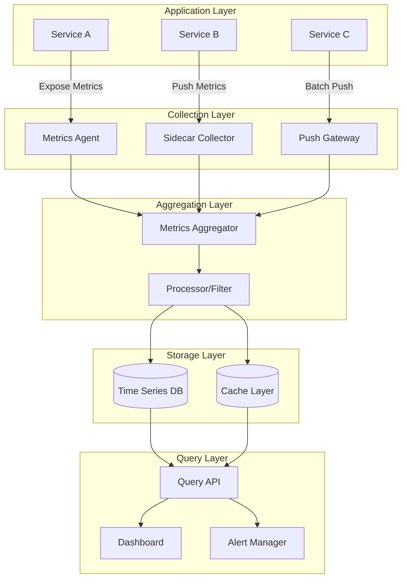

### Component Responsibilities

**Application Layer**: Instruments code and exposes metrics endpoints

**Collection Layer**: Gathers metrics from various sources using different collection patterns

**Aggregation Layer**: Combines, filters, and preprocesses raw metrics before storage

**Storage Layer**: Persists metrics in optimized time-series databases

**Query Layer**: Provides interfaces for visualization and alerting (see [09-visualization-dashboards.md](09-visualization-dashboards.md))

## Collection Methods

### 1. Pull-Based Collection (Scraping)

The collector actively polls metrics endpoints at regular intervals.

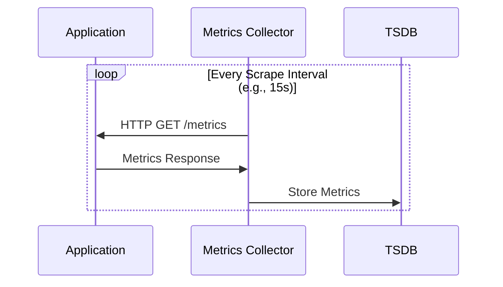

**Advantages:**
- Simple service discovery
- Centralized control over collection frequency
- Easy to detect silent failures (missing scrapes)
- Lower resource usage on application side

**Disadvantages:**
- Network overhead from frequent polling
- Potential data loss between scrape intervals
- Requires exposed endpoints (firewall considerations)

**Use Cases:**
- Prometheus-style monitoring
- Container orchestration platforms (Kubernetes)
- Microservices architectures

### 2. Push-Based Collection

Applications actively send metrics to collectors or gateways.

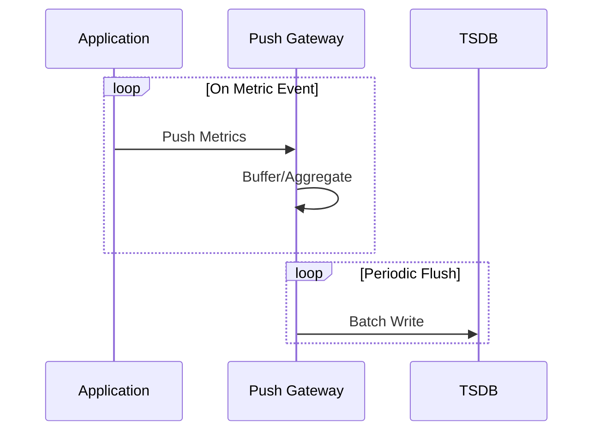

**Advantages:**
- Real-time metric delivery
- Works with short-lived jobs/serverless
- No need for exposed endpoints
- Application controls when metrics are sent

**Disadvantages:**
- Higher application complexity
- Network failures require retry logic
- Potential metric loss if gateway unavailable
- Higher resource usage on application side

**Use Cases:**
- Batch jobs and cron tasks
- Serverless functions (AWS Lambda, Cloud Functions)
- Edge computing scenarios
- High-frequency events requiring immediate capture

### 3. Agent-Based Collection

Dedicated agents run alongside applications to collect system and application metrics.

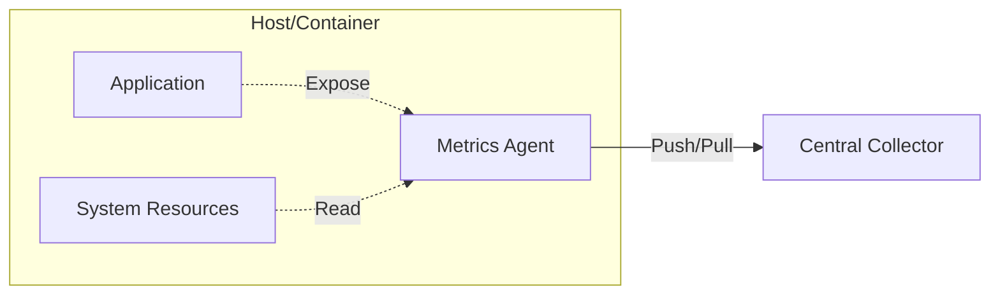

**Advantages:**
- Offloads collection logic from application
- Can collect system-level metrics (CPU, memory, disk)
- Centralized agent configuration
- Protocol translation capabilities

**Disadvantages:**
- Additional resource overhead per host
- Requires agent deployment and management
- Version compatibility concerns
- Potential single point of failure per host

**Use Cases:**
- Infrastructure monitoring (node_exporter, Telegraf)
- Multi-tenant environments
- Legacy application monitoring

### 4. Service Mesh Collection

Sidecar proxies intercept traffic and collect metrics transparently.

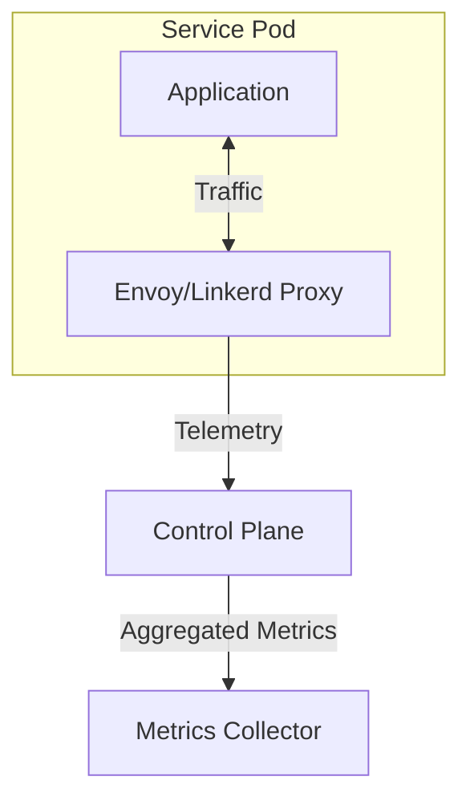

**Advantages:**
- Zero application instrumentation required
- Consistent metrics across all services
- Automatic protocol detection
- Integrated with distributed tracing (see [07-distributed-tracing.md](07-distributed-tracing.md))

**Disadvantages:**
- Requires service mesh infrastructure
- Limited visibility into application internals
- Additional latency from proxy
- Complex troubleshooting

**Use Cases:**
- Kubernetes microservices (Istio, Linkerd)
- Multi-language environments
- Protocol-level metrics (HTTP, gRPC)

## Metrics Formats and Protocols

### Prometheus Exposition Format

The de facto standard for metrics exposition in cloud-native environments.

**Format Structure:**
```
# HELP metric_name Description of the metric
# TYPE metric_name counter
metric_name{label1="value1",label2="value2"} 42.0 1633024800000

# Counter example
http_requests_total{method="GET",endpoint="/api/users",status="200"} 12847

# Gauge example
memory_usage_bytes{service="api-gateway",pod="api-gw-5f7b8"} 524288000

# Histogram example
http_request_duration_seconds_bucket{le="0.1"} 5000
http_request_duration_seconds_bucket{le="0.5"} 7500
http_request_duration_seconds_bucket{le="1.0"} 8900
http_request_duration_seconds_bucket{le="+Inf"} 9000
http_request_duration_seconds_sum 4250.5
http_request_duration_seconds_count 9000
```

**Characteristics:**
- Human-readable text format
- Self-documenting with HELP and TYPE comments
- Efficient parsing
- Label-based dimensionality

### StatsD Protocol

A simple UDP-based protocol for metric aggregation.

**Format Structure:**
```
metric_name:value|type|@sample_rate|#tags

# Counter
api.requests:1|c|@0.5|#endpoint:/users,method:GET

# Gauge
system.memory.usage:524288000|g

# Histogram
api.request.duration:245|h|#service:api-gateway

# Timer (special histogram)
database.query.time:123.45|ms
```

**Characteristics:**
- Fire-and-forget UDP (low overhead)
- Aggregation at collector level
- Simple client implementation
- Optional sampling support

### OpenTelemetry Protocol (OTLP)

Modern protocol supporting metrics, traces, and logs in a unified format.

**Key Features:**
- Protocol Buffers for efficient serialization
- HTTP/gRPC transport options
- Unified instrumentation across telemetry signals
- Rich semantic conventions
- Backward compatible with Prometheus

**Resource Model:**
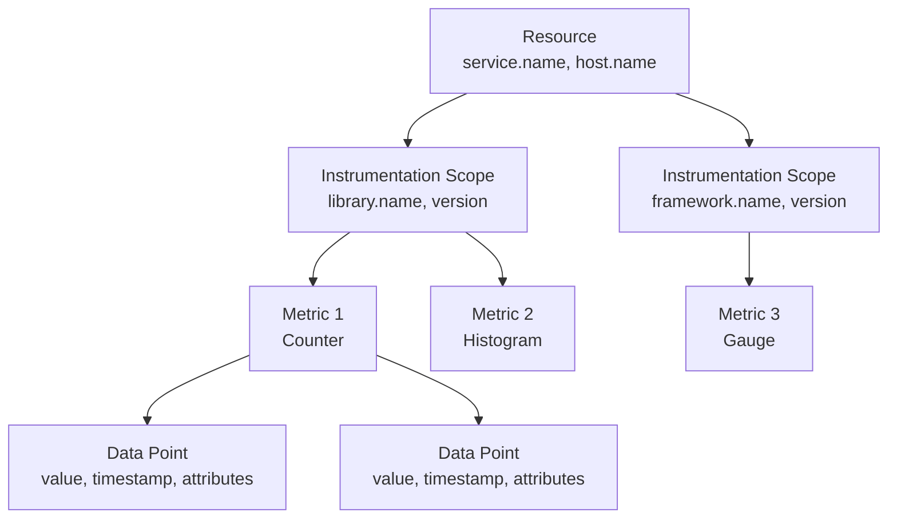

### Comparison Matrix

| Feature | Prometheus | StatsD | OTLP |
|---------|-----------|--------|------|
| Transport | Pull (HTTP) | Push (UDP/TCP) | Push (HTTP/gRPC) |
| Serialization | Text | Text | Protocol Buffers |
| Cardinality | High | Medium | High |
| Integration | Cloud Native | Universal | Emerging Standard |
| Sampling | Client-side | Server-side | Both |
| Ecosystem | Mature | Mature | Growing |

## Sampling Strategies

Sampling reduces collection overhead while maintaining statistical validity.

### 1. Time-Based Sampling

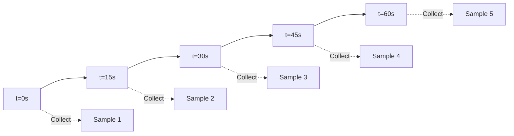

**Scrape Interval Selection:**
- **High-frequency (1-5s)**: Critical services, real-time dashboards
- **Standard (15-30s)**: Most production services
- **Low-frequency (1-5m)**: Batch jobs, infrastructure metrics
- **Very low (15m-1h)**: Cost optimization, historical trends

**Trade-offs:**
- Shorter intervals: Higher resolution, more storage, increased load
- Longer intervals: Data loss risk, delayed anomaly detection

### 2. Probabilistic Sampling

Randomly sample a percentage of events.

```python
# Example: 10% sampling rate
import random

def should_record_metric():
    return random.random() < 0.1  # 10% chance

if should_record_metric():
    metrics.increment("event.count", 10)  # Scale up by 1/sample_rate
```

**Application:**
- High-volume counters (requests per second > 10k)
- Distributed tracing integration
- Cost reduction for low-priority metrics

### 3. Adaptive Sampling

Dynamically adjust sampling based on system conditions.

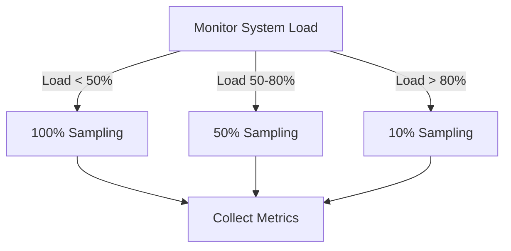

**Benefits:**
- Automatic resource protection
- Maintains data quality when possible
- Prevents collection overhead from causing cascading failures

### 4. Aggregation Sampling

Pre-aggregate high-cardinality metrics before storage.

**Example: Request latency per endpoint**
```
Raw (high cardinality):
  http_duration{endpoint="/users/1"} 45ms
  http_duration{endpoint="/users/2"} 50ms
  http_duration{endpoint="/users/3"} 48ms
  ... (thousands of user IDs)

Aggregated (low cardinality):
  http_duration_bucket{endpoint="/users/:id",le="50"} 2
  http_duration_bucket{endpoint="/users/:id",le="100"} 3
  http_duration_sum{endpoint="/users/:id"} 143
  http_duration_count{endpoint="/users/:id"} 3
```

## Storage Considerations

### Time-Series Database Requirements

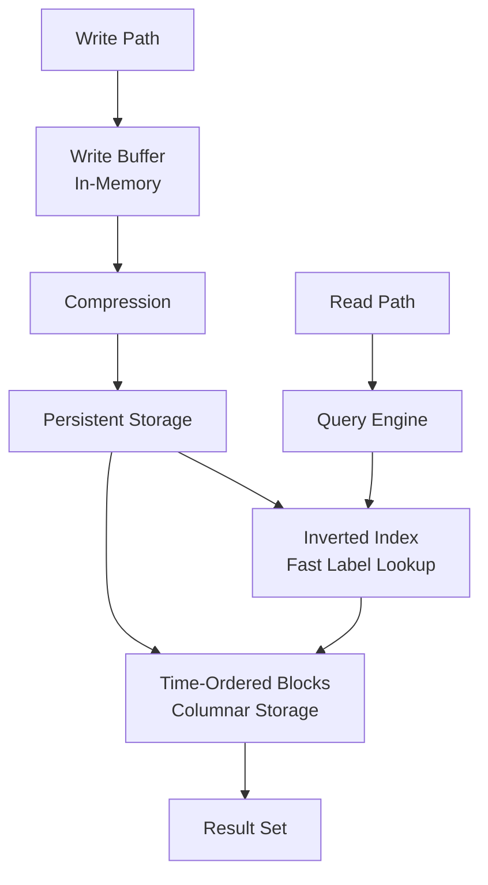

### Storage Optimization Techniques

**1. Downsampling**
Reduce resolution for older data:
- Last 1 hour: 15-second intervals
- Last 24 hours: 1-minute intervals
- Last 7 days: 5-minute intervals
- Last 30 days: 15-minute intervals
- Older than 30 days: 1-hour intervals

**2. Retention Policies**
```
High-resolution data: 7 days
Medium-resolution data: 30 days
Low-resolution data: 1 year
Aggregated summaries: 5 years
```

**3. Compression**
- Delta encoding for sequential values
- Dictionary encoding for repeated labels
- Gorilla compression for floating-point values
- Typical compression ratio: 10:1 to 40:1

### Cardinality Management

High cardinality is the primary challenge in metrics storage.

**Cardinality Calculation:**
```
Total Time Series = Product of all unique label values

Example:
  metric_name{
    service: 10 values,
    endpoint: 100 values,
    status_code: 10 values,
    region: 5 values
  }
  
  Cardinality = 10 × 100 × 10 × 5 = 50,000 time series
```

**Cardinality Explosion Prevention:**
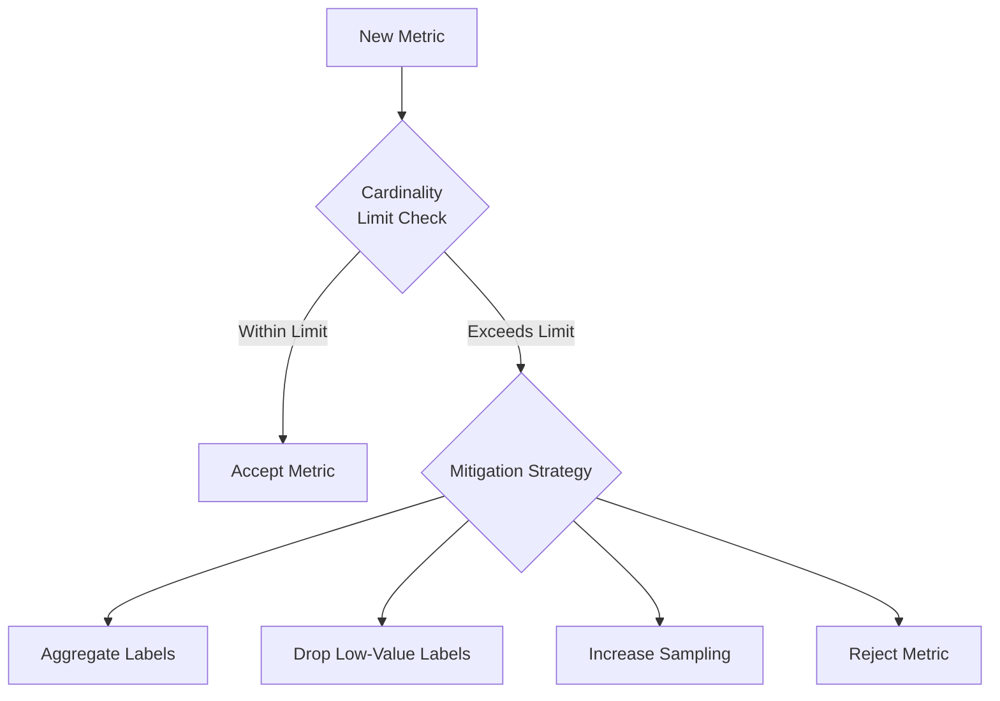

**Anti-patterns to Avoid:**
- User IDs in labels (use aggregation)
- Timestamps in labels (time is a dimension, not a label)
- High-cardinality status messages (categorize errors)
- Full URLs (parameterize routes)
- Unbounded label values

## Performance and Optimization

### Collection Pipeline Performance

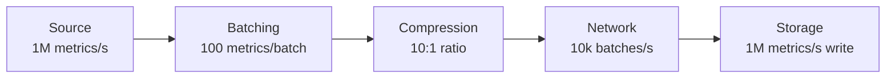

### Optimization Strategies

**1. Batching**
- Collect multiple metrics before transmission
- Typical batch sizes: 100-1000 metrics
- Balance between latency and throughput
- Reduces network overhead by 90%+

**2. Local Aggregation**
```
Before aggregation:
  1000 requests/sec × 60 sec = 60,000 data points

After aggregation:
  Sum, count, min, max per minute = 4 data points
  Reduction: 99.99%
```

**3. Metric Buffering**
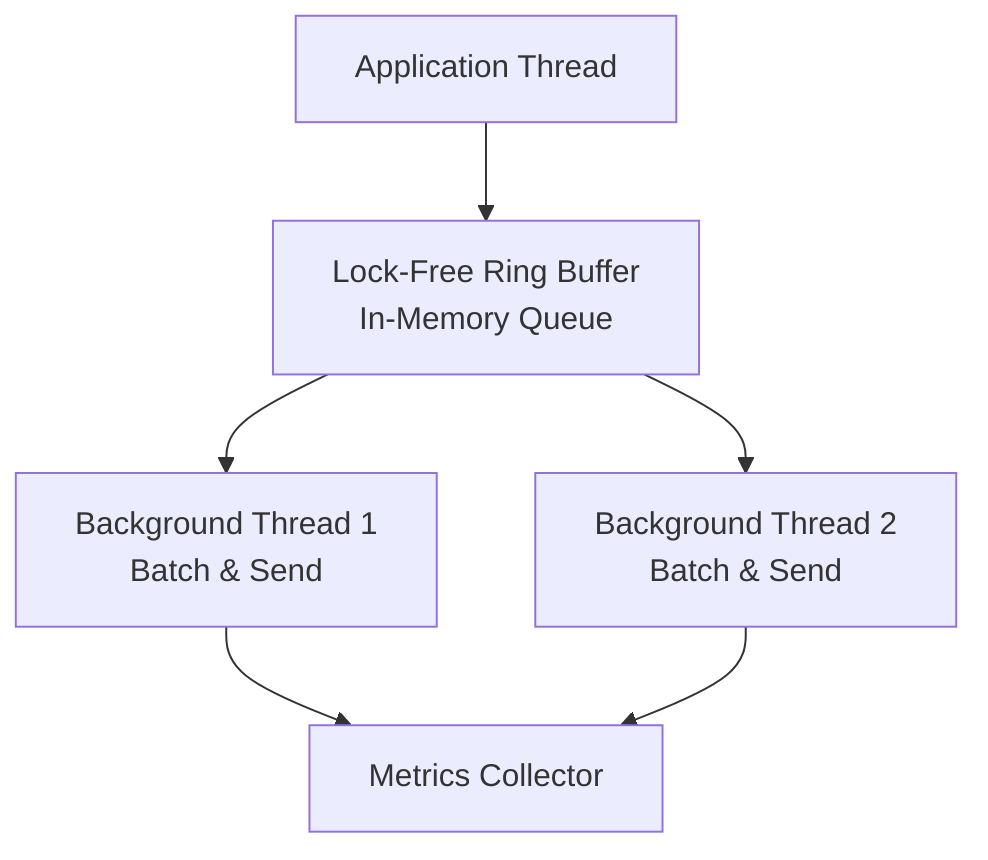

**Benefits:**
- Non-blocking metric recording
- Isolated network failures from application
- Smooth traffic to collectors

**4. Protocol Selection**
- **gRPC**: Best for high throughput (binary, streaming)
- **HTTP/2**: Good balance (multiplexing, compression)
- **UDP**: Lowest overhead (no reliability guarantees)

### Resource Limits and Backpressure

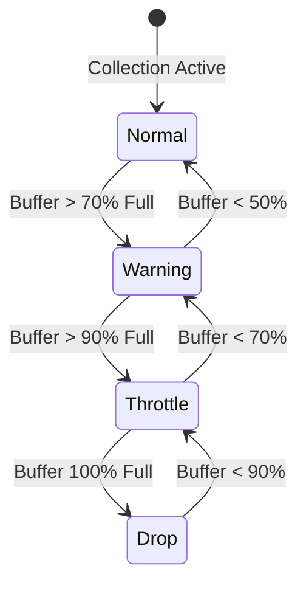

**Backpressure Strategies:**
1. **Circuit Breaker**: Stop collection temporarily if downstream fails
2. **Rate Limiting**: Cap collection rate per service
3. **Priority Queue**: Preserve critical metrics, drop low-priority
4. **Sampling Increase**: Automatically reduce collection density

## Best Practices

### 1. Metric Naming Conventions

```
# Pattern: <namespace>_<subsystem>_<name>_<unit>

# Good examples
http_requests_total
http_request_duration_seconds
database_connection_pool_size
cache_hit_ratio

# Bad examples (avoid)
HttpRequestsTotal  # Use snake_case, not PascalCase
requests  # Too generic, missing context
request_time  # Ambiguous unit
db_connections_  # Trailing underscore
```

**Consistency with Metric Types:**
- Counters: suffix with `_total` or `_count`
- Gauges: use present tense (`current_`, `active_`)
- Histograms: suffix with unit (`_seconds`, `_bytes`)

### 2. Label Design Principles

**DO:**
```
# Low cardinality, high value
http_requests_total{
  service="user-api",
  endpoint="/api/users",
  method="GET",
  status="200"
}
```

**DON'T:**
```
# High cardinality, low value
http_requests_total{
  user_id="12345",      # Unbounded
  timestamp="1633024800",  # Redundant with time dimension
  request_id="abc123",  # Unique per request
  full_url="/api/users?page=1&sort=asc"  # Unbounded
}
```

**Label Cardinality Targets:**
- Ideal: < 10 unique values per label
- Acceptable: 10-100 unique values
- Caution: 100-1000 unique values
- Dangerous: > 1000 unique values

### 3. Collection Interval Selection

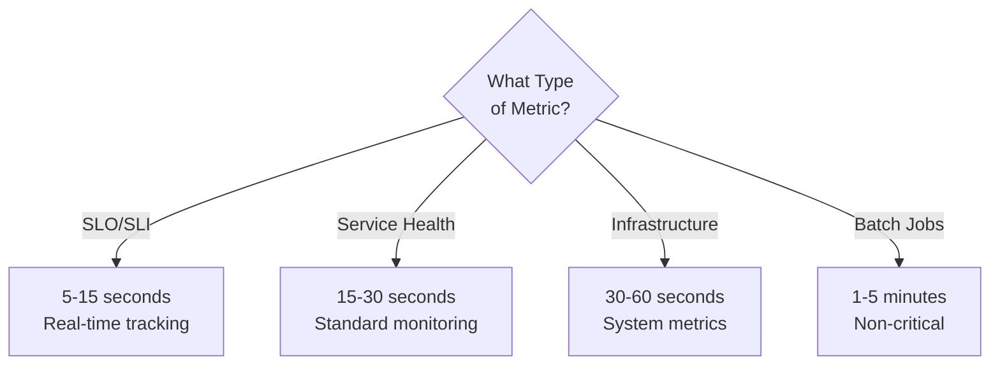

### 4. Error Handling and Reliability

**Collection Failures:**
```python
# Graceful degradation
try:
    collector.send_metrics(metrics_batch)
except NetworkError:
    local_cache.store(metrics_batch)  # Persist locally
    logger.warn("Metrics collection failed, cached locally")
except Exception as e:
    logger.error(f"Unexpected error: {e}")
    # Drop metrics but don't crash application
```

**Metric Validation:**
- Validate metric names and labels before collection
- Reject invalid metric types (negative counters)
- Set reasonable bounds (latency > 1 hour likely invalid)
- Log validation failures for debugging

### 5. Integration with Other Observability Signals

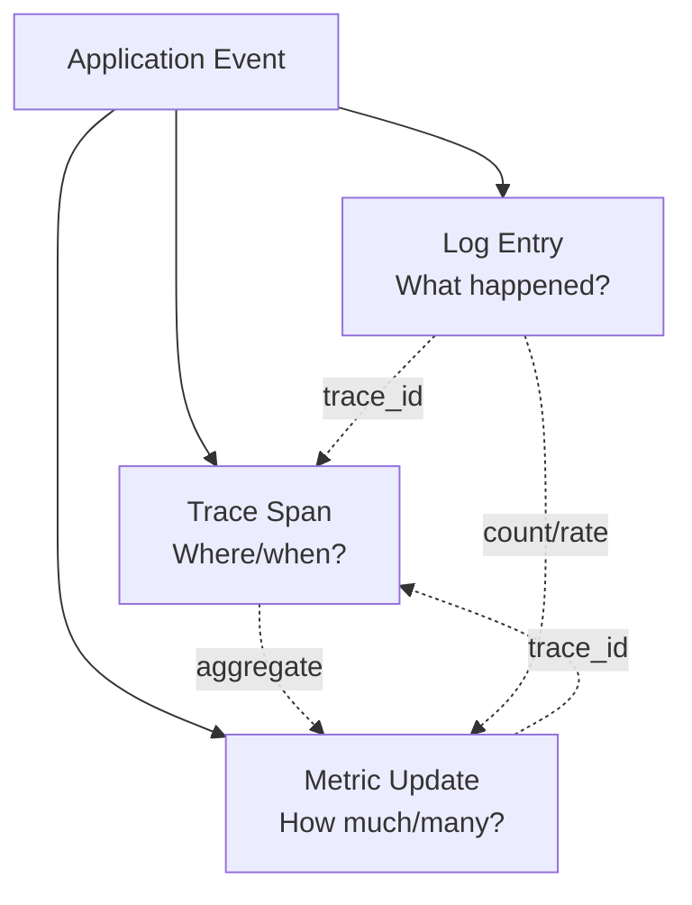

**Correlation Strategies:**
- Embed trace IDs in metric labels (use sampling!)
- Link metrics to log patterns for context
- Use exemplars to sample representative traces
- See [07-distributed-tracing.md](07-distributed-tracing.md) for details

### 6. Security and Privacy

**Sensitive Data Protection:**
- Never include PII in metric labels (names, emails, IDs)
- Sanitize error messages before recording
- Use aggregation to anonymize user behavior
- Implement metric access controls

**Authentication and Authorization:**
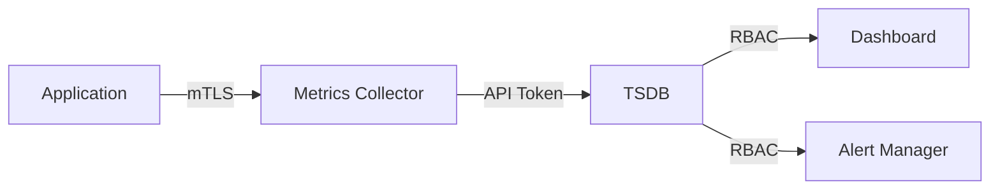

### 7. Testing and Validation

**Metrics Collection Testing:**
```python
# Unit test example
def test_counter_increment():
    counter = Counter("test_requests_total", "Test counter")
    counter.inc()
    counter.inc()
    
    assert counter.get() == 2
    
# Integration test
def test_metrics_endpoint():
    response = requests.get("http://localhost:9090/metrics")
    
    assert response.status_code == 200
    assert "test_requests_total 2" in response.text
```

**Load Testing:**
- Simulate high-volume metric generation
- Verify collector handles expected load
- Test graceful degradation under overload
- Validate storage performance

### 8. Cost Optimization

**Cost Drivers:**
1. Number of time series (cardinality)
2. Data retention duration
3. Query frequency and complexity
4. Data transfer (network egress)

**Optimization Strategies:**
```
High Priority (SLO metrics): Full resolution, 30-day retention
Medium Priority (Debugging): Sampled, 7-day retention
Low Priority (Nice-to-have): Heavily sampled, 1-day retention
```

**Cost Calculation Example:**
```
Time Series: 100,000
Scrape Interval: 15s
Data Points/Day: 100k × (86400/15) = 576M points/day
Storage (compressed): 576M × 2 bytes = 1.15 GB/day
Monthly Storage: ~35 GB

With downsampling and retention:
  Week 1: 35 GB (full resolution)
  Weeks 2-4: 7 GB (5-min resolution)
  Months 2-3: 2 GB (1-hour resolution)
  Total: ~46 GB for 90-day retention
```

## Summary

Effective metrics collection requires balancing:

- **Granularity vs. Cost**: Higher resolution provides better insights but increases storage costs
- **Cardinality vs. Dimensions**: More labels enable better filtering but explode storage requirements
- **Latency vs. Reliability**: Push provides real-time data but can lose metrics; pull is more reliable but delayed
- **Completeness vs. Performance**: Collecting everything is ideal but can overwhelm systems

**Key Takeaways:**

1. Choose collection method based on workload characteristics (long-running vs. batch)
2. Design labels carefully to avoid cardinality explosion
3. Implement sampling and aggregation for high-volume metrics
4. Use appropriate scrape intervals based on metric criticality
5. Plan retention and downsampling strategies early
6. Integrate metrics with logging and tracing for complete observability

**Related Documentation:**
- [03-metrics.md](03-metrics.md) - Metric types and instrumentation
- [08-alerting-and-monitoring.md](08-alerting-and-monitoring.md) - Using collected metrics for alerting
- [10-service-level-objectives.md](10-service-level-objectives.md) - SLO tracking with metrics
- [11-tools-ecosystem.md](11-tools-ecosystem.md) - Specific collection tools (Prometheus, Grafana Agent, etc.)