# Alerting and Monitoring

## Table of Contents
1. [Introduction](#introduction)
2. [Monitoring Fundamentals](#monitoring-fundamentals)
3. [Alert Design Principles](#alert-design-principles)
4. [Alert Types and Patterns](#alert-types-and-patterns)
5. [Alert Routing and Escalation](#alert-routing-and-escalation)
6. [Notification Channels](#notification-channels)
7. [Alert Fatigue Management](#alert-fatigue-management)
8. [Incident Response Integration](#incident-response-integration)
9. [Best Practices](#best-practices)

## Introduction

Alerting and monitoring form the reactive component of observability, enabling teams to detect, diagnose, and respond to system issues before they impact users. While monitoring provides visibility into system state, alerting automates the detection of anomalous conditions and triggers appropriate responses.

### Key Objectives

- **Early Detection**: Identify issues before customer impact
- **Actionable Notifications**: Provide context for rapid resolution
- **Minimize Noise**: Reduce false positives and alert fatigue
- **Enable Response**: Connect alerts to runbooks and remediation workflows

### Relationship to Other Observability Pillars

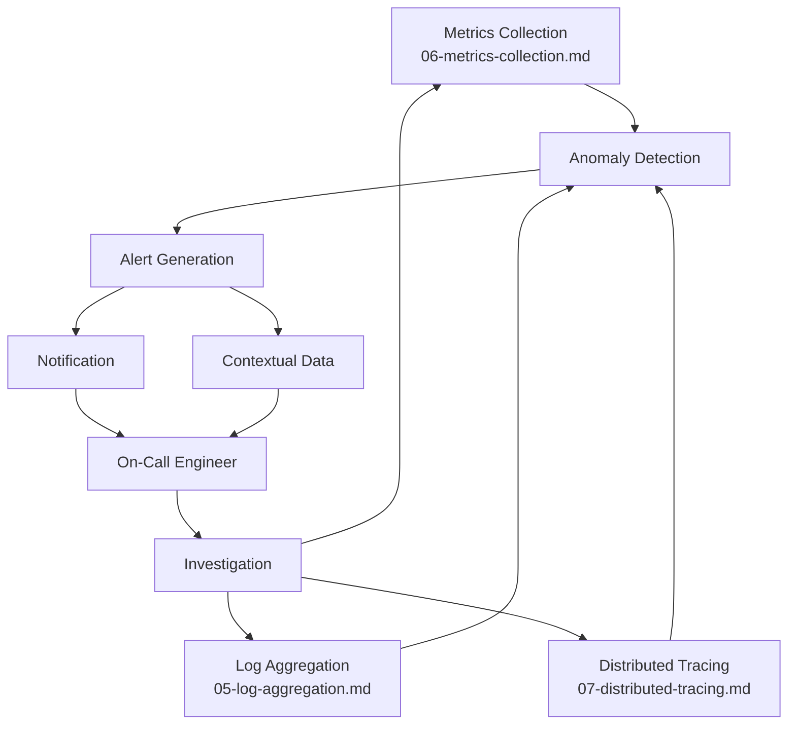
```mermaid
graph TB
    METRICS[Metrics Collection<br/>06-metrics-collection.md]
    LOGS[Log Aggregation<br/>05-log-aggregation.md]
    TRACES[Distributed Tracing<br/>07-distributed-tracing.md]
    
    METRICS --> DETECTION[Anomaly Detection]
    LOGS --> DETECTION
    TRACES --> DETECTION
    
    DETECTION --> ALERT[Alert Generation]
    
    ALERT --> NOTIFY[Notification]
    ALERT --> CONTEXT[Contextual Data]
    
    NOTIFY --> ONCALL[On-Call Engineer]
    CONTEXT --> ONCALL
    
    ONCALL --> INVESTIGATE[Investigation]
    
    INVESTIGATE --> METRICS
    INVESTIGATE --> LOGS
    INVESTIGATE --> TRACES
```

## Monitoring Fundamentals

### Monitoring Layers

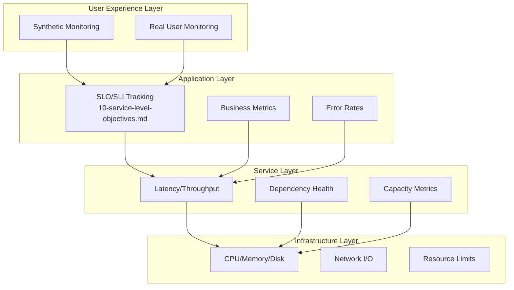
```mermaid
graph TB
    subgraph "User Experience Layer"
        SYNTH[Synthetic Monitoring]
        RUM[Real User Monitoring]
    end
    
    subgraph "Application Layer"
        SLO[SLO/SLI Tracking<br/>10-service-level-objectives.md]
        BUSINESS[Business Metrics]
        ERRORS[Error Rates]
    end
    
    subgraph "Service Layer"
        LATENCY[Latency/Throughput]
        DEPS[Dependency Health]
        CAPACITY[Capacity Metrics]
    end
    
    subgraph "Infrastructure Layer"
        COMPUTE[CPU/Memory/Disk]
        NETWORK[Network I/O]
        RESOURCES[Resource Limits]
    end
    
    SYNTH --> SLO
    RUM --> SLO
    
    SLO --> LATENCY
    BUSINESS --> LATENCY
    ERRORS --> LATENCY
    
    LATENCY --> COMPUTE
    DEPS --> COMPUTE
    CAPACITY --> COMPUTE
```

### The Four Golden Signals

Based on Google's SRE practices, these signals form the foundation of effective monitoring:

**1. Latency**
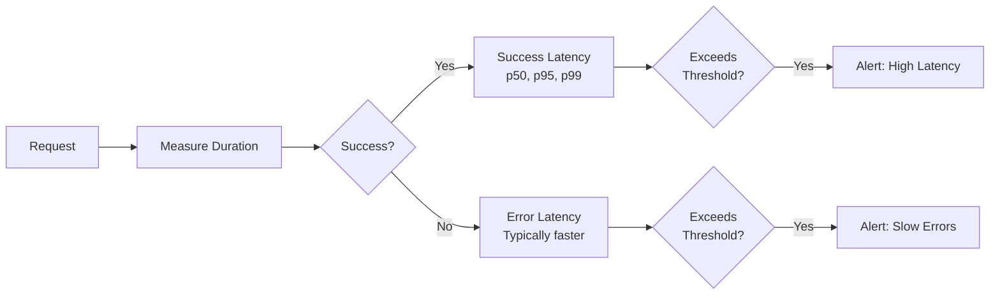
```mermaid
graph LR
    REQUEST[Request] --> MEASURE[Measure Duration]
    MEASURE --> SUCCESS{Success?}
    
    SUCCESS -->|Yes| SUCCESS_LAT[Success Latency<br/>p50, p95, p99]
    SUCCESS -->|No| ERROR_LAT[Error Latency<br/>Typically faster]
    
    SUCCESS_LAT --> ALERT1{Exceeds<br/>Threshold?}
    ERROR_LAT --> ALERT2{Exceeds<br/>Threshold?}
    
    ALERT1 -->|Yes| FIRE1[Alert: High Latency]
    ALERT2 -->|Yes| FIRE2[Alert: Slow Errors]
```

**Alert Thresholds:**
- p50 > 200ms (median user experience degraded)
- p95 > 500ms (5% of users affected)
- p99 > 1s (tail latency issues)

**2. Traffic**
```
Measures: Requests per second, transactions per second

Alert Conditions:
- Sudden spike (>200% increase in 5 minutes)
- Unexpected drop (>50% decrease in 5 minutes)
- Pattern deviation (weekday traffic on weekend)
```

**3. Errors**
```
Measures: Error rate, error ratio

Alert Conditions:
- Error rate > 1% (100 errors per 10k requests)
- Error rate increased 10x over baseline
- New error types appearing
- Critical dependency failures (5xx from database)
```

**4. Saturation**
```
Measures: Resource utilization (CPU, memory, disk, connections)

Alert Conditions:
- CPU > 80% sustained for 5 minutes
- Memory > 90% (approaching OOM)
- Disk > 85% (risk of full disk)
- Connection pool > 90% utilized
```

### The USE Method (Resources)

For infrastructure and resource monitoring:

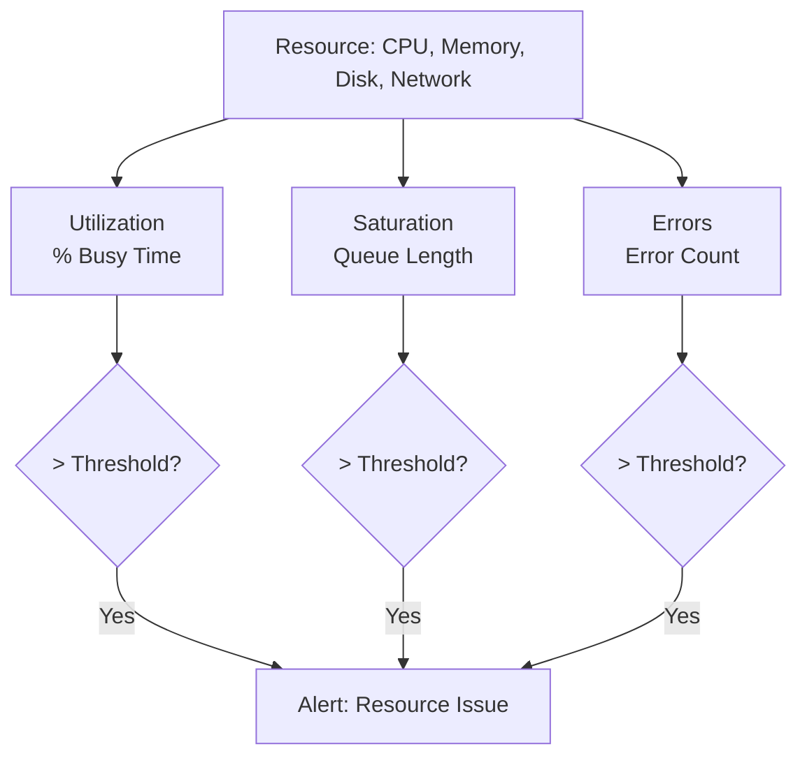
```mermaid
graph TD
    RESOURCE[Resource: CPU, Memory, Disk, Network]
    
    RESOURCE --> UTIL[Utilization<br/>% Busy Time]
    RESOURCE --> SAT[Saturation<br/>Queue Length]
    RESOURCE --> ERR[Errors<br/>Error Count]
    
    UTIL --> CHECK1{> Threshold?}
    SAT --> CHECK2{> Threshold?}
    ERR --> CHECK3{> Threshold?}
    
    CHECK1 -->|Yes| ALERT[Alert: Resource Issue]
    CHECK2 -->|Yes| ALERT
    CHECK3 -->|Yes| ALERT
```

**Utilization**: Percentage of time the resource is busy
- CPU: 80% sustained → investigate
- Memory: 90% → critical
- Disk I/O: 80% → approaching saturation

**Saturation**: Degree to which the resource has queued work
- CPU run queue > number of cores
- Memory swap activity
- Disk I/O wait time
- Network buffer overflows

**Errors**: Count of error events
- CPU cache errors
- Memory ECC errors
- Disk read/write errors
- Network packet loss

### The RED Method (Services)

For request-driven services:

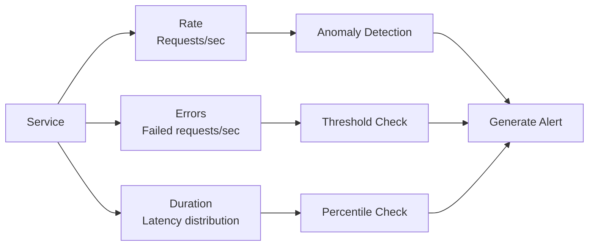
```mermaid
graph LR
    SERVICE[Service]
    
    SERVICE --> RATE[Rate<br/>Requests/sec]
    SERVICE --> ERRORS[Errors<br/>Failed requests/sec]
    SERVICE --> DURATION[Duration<br/>Latency distribution]
    
    RATE --> ANOM1[Anomaly Detection]
    ERRORS --> ANOM2[Threshold Check]
    DURATION --> ANOM3[Percentile Check]
    
    ANOM1 --> ALERT[Generate Alert]
    ANOM2 --> ALERT
    ANOM3 --> ALERT
```

## Alert Design Principles

### 1. Symptom-Based vs. Cause-Based Alerts

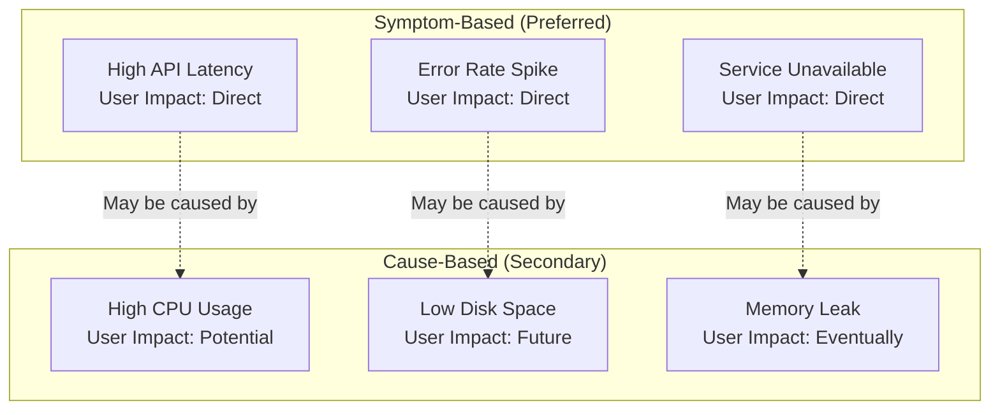
```mermaid
graph TB
    subgraph "Symptom-Based (Preferred)"
        SYMPTOM1[High API Latency<br/>User Impact: Direct]
        SYMPTOM2[Error Rate Spike<br/>User Impact: Direct]
        SYMPTOM3[Service Unavailable<br/>User Impact: Direct]
    end
    
    subgraph "Cause-Based (Secondary)"
        CAUSE1[High CPU Usage<br/>User Impact: Potential]
        CAUSE2[Low Disk Space<br/>User Impact: Future]
        CAUSE3[Memory Leak<br/>User Impact: Eventually]
    end
    
    SYMPTOM1 -.->|May be caused by| CAUSE1
    SYMPTOM2 -.->|May be caused by| CAUSE2
    SYMPTOM3 -.->|May be caused by| CAUSE3
```

**Symptom-Based Alerts (Priority)**
- Alert on what users experience
- High latency, errors, unavailability
- Directly tied to SLOs (see [10-service-level-objectives.md](10-service-level-objectives.md))
- Require immediate action

**Example:**
```yaml
# Good: Symptom-based
alert: HighAPILatency
expr: http_request_duration_seconds{quantile="0.95"} > 0.5
for: 5m
severity: critical
message: "95th percentile API latency is {{$value}}s, affecting user experience"

# Suboptimal: Cause-based
alert: HighCPUUsage
expr: node_cpu_utilization > 0.8
for: 5m
severity: warning
message: "CPU usage is {{$value}}%, may eventually impact performance"
```

### 2. Alert on Actionability

Every alert should answer: **"What action should I take right now?"**

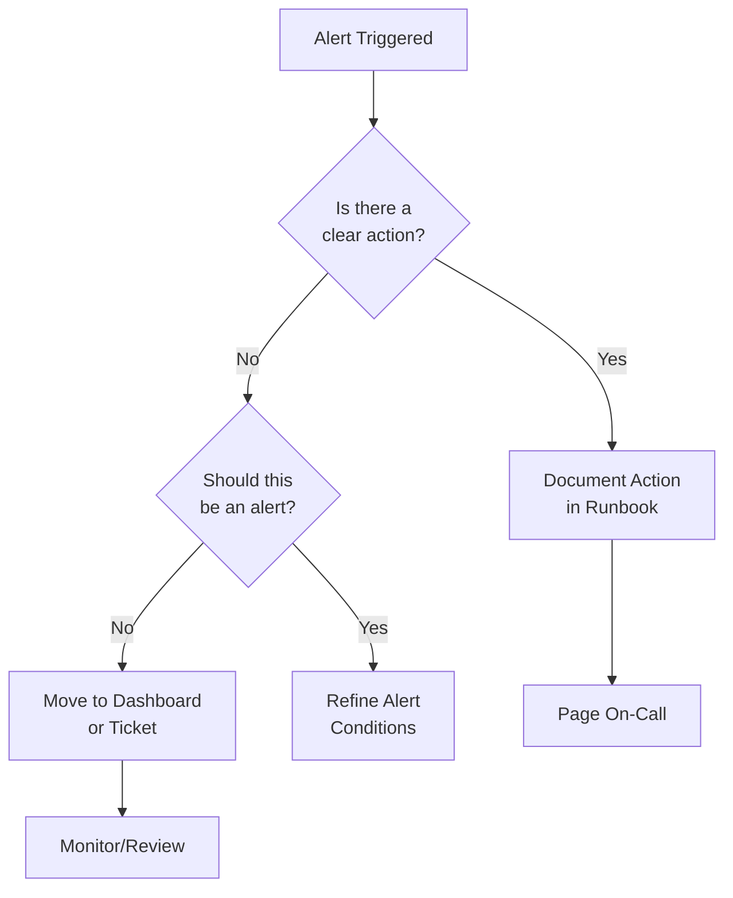
```mermaid
graph TD
    ALERT[Alert Triggered]
    
    ALERT --> CHECK{Is there a<br/>clear action?}
    
    CHECK -->|Yes| ACTION[Document Action<br/>in Runbook]
    CHECK -->|No| RETHINK{Should this<br/>be an alert?}
    
    RETHINK -->|No| DASHBOARD[Move to Dashboard<br/>or Ticket]
    RETHINK -->|Yes| REFINE[Refine Alert<br/>Conditions]
    
    ACTION --> PAGE[Page On-Call]
    DASHBOARD --> MONITOR[Monitor/Review]
```

**Actionable Alert Criteria:**
- **Urgent**: Requires immediate human intervention
- **Specific**: Clear problem statement
- **Documented**: Linked to runbook or playbook
- **Scoped**: Identified affected service/component

**Non-Actionable (Don't Alert):**
- Informational metrics that don't require action
- Predicted future issues without current impact
- Transient blips that auto-recover
- Metrics better suited for dashboards

### 3. Alert Severity Levels

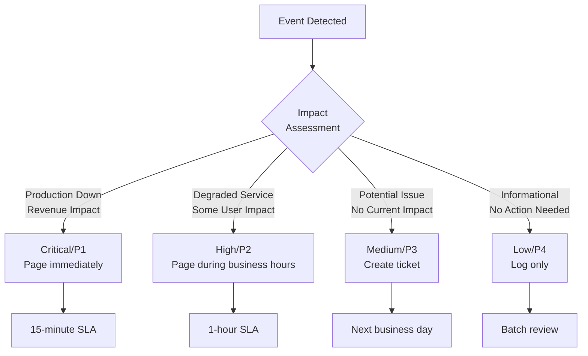
```mermaid
graph TB
    EVENT[Event Detected]
    
    EVENT --> ASSESS{Impact<br/>Assessment}
    
    ASSESS -->|Production Down<br/>Revenue Impact| CRITICAL[Critical/P1<br/>Page immediately]
    ASSESS -->|Degraded Service<br/>Some User Impact| HIGH[High/P2<br/>Page during business hours]
    ASSESS -->|Potential Issue<br/>No Current Impact| MEDIUM[Medium/P3<br/>Create ticket]
    ASSESS -->|Informational<br/>No Action Needed| LOW[Low/P4<br/>Log only]
    
    CRITICAL --> RESPONSE1[15-minute SLA]
    HIGH --> RESPONSE2[1-hour SLA]
    MEDIUM --> RESPONSE3[Next business day]
    LOW --> RESPONSE4[Batch review]
```

**Severity Definitions:**

| Severity | Impact | Response | Example |
|----------|--------|----------|---------|
| **Critical** | Service down, data loss, security breach | Immediate page, all hands | API returning 500s, database offline |
| **High** | Degraded performance, partial outage | Page during business hours | Latency 2x normal, error rate 5% |
| **Medium** | Potential issue, no user impact yet | Create ticket, investigate | Disk 80% full, memory slowly increasing |
| **Low** | Informational, long-term trend | Review in regular meetings | Gradual traffic increase, seasonal patterns |

### 4. Alert Threshold Selection

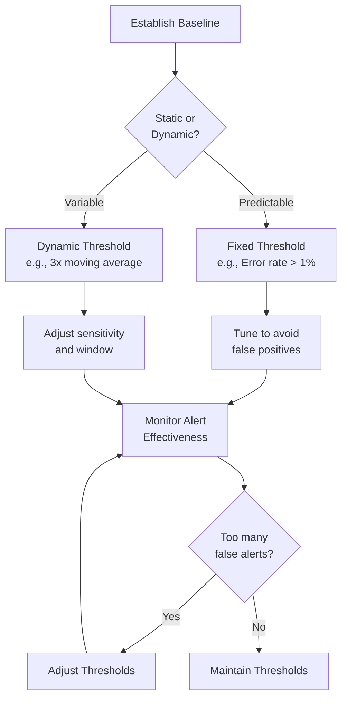
```mermaid
graph TD
    BASELINE[Establish Baseline]
    
    BASELINE --> STATIC{Static or<br/>Dynamic?}
    
    STATIC -->|Predictable| FIXED[Fixed Threshold<br/>e.g., Error rate > 1%]
    STATIC -->|Variable| DYNAMIC[Dynamic Threshold<br/>e.g., 3x moving average]
    
    FIXED --> TUNE1[Tune to avoid<br/>false positives]
    DYNAMIC --> TUNE2[Adjust sensitivity<br/>and window]
    
    TUNE1 --> MONITOR[Monitor Alert<br/>Effectiveness]
    TUNE2 --> MONITOR
    
    MONITOR --> ITERATE{Too many<br/>false alerts?}
    
    ITERATE -->|Yes| ADJUST[Adjust Thresholds]
    ITERATE -->|No| MAINTAIN[Maintain Thresholds]
    
    ADJUST --> MONITOR
```

**Static Thresholds:**
```yaml
# Use for well-understood limits
- CPU > 90% for 10 minutes
- Disk > 95%
- Error rate > 5%
- p99 latency > 1 second
```

**Dynamic Thresholds:**
```yaml
# Use for variable patterns
- Request rate > 2x 7-day average
- Error rate > 3 standard deviations from mean
- Latency > 1.5x daily baseline
```

**Percentile-Based:**
```yaml
# More robust than averages
- p95 latency > 500ms (5% of users affected)
- p99 latency > 1s (1% of users affected)
- p99.9 latency > 5s (0.1% of users affected)
```

## Alert Types and Patterns

### 1. Threshold Alerts

Simple comparison against a fixed or calculated value.

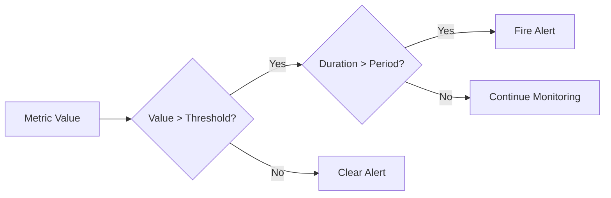
```mermaid
graph LR
    METRIC[Metric Value] --> COMPARE{Value > Threshold?}
    
    COMPARE -->|Yes| DURATION{Duration > Period?}
    COMPARE -->|No| CLEAR[Clear Alert]
    
    DURATION -->|Yes| FIRE[Fire Alert]
    DURATION -->|No| WAIT[Continue Monitoring]
```

**Example:**
```yaml
# Prometheus AlertManager format
groups:
- name: api_health
  interval: 30s
  rules:
  - alert: HighErrorRate
    expr: |
      rate(http_requests_total{status=~"5.."}[5m]) 
      / 
      rate(http_requests_total[5m]) > 0.05
    for: 5m
    labels:
      severity: critical
      component: api
    annotations:
      summary: "High error rate on {{ $labels.service }}"
      description: "Error rate is {{ $value | humanizePercentage }}"
      runbook: "https://wiki.company.com/runbooks/high-error-rate"
```

### 2. Rate of Change Alerts

Detect sudden changes in metrics.

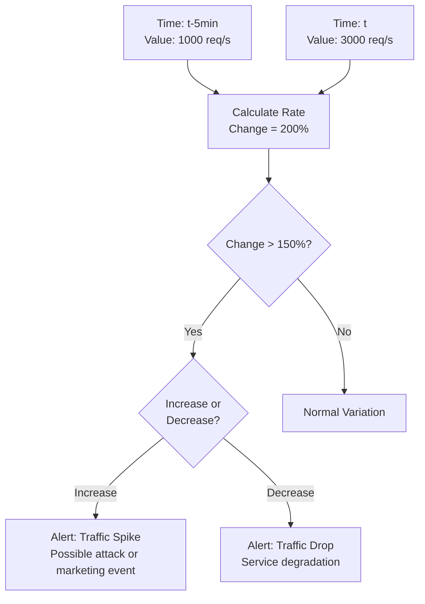
```mermaid
graph TD
    T0[Time: t-5min<br/>Value: 1000 req/s]
    T1[Time: t<br/>Value: 3000 req/s]
    
    T0 --> CALC[Calculate Rate<br/>Change = 200%]
    T1 --> CALC
    
    CALC --> CHECK{Change > 150%?}
    
    CHECK -->|Yes| ANALYZE{Increase or<br/>Decrease?}
    CHECK -->|No| NORMAL[Normal Variation]
    
    ANALYZE -->|Increase| SPIKE[Alert: Traffic Spike<br/>Possible attack or marketing event]
    ANALYZE -->|Decrease| DROP[Alert: Traffic Drop<br/>Service degradation]
```

**Example:**
```yaml
- alert: TrafficSpike
  expr: |
    rate(http_requests_total[5m]) 
    > 
    rate(http_requests_total[5m] offset 10m) * 2
  for: 2m
  labels:
    severity: warning
  annotations:
    summary: "Traffic increased 100% in 10 minutes"

- alert: TrafficDrop
  expr: |
    rate(http_requests_total[5m]) 
    < 
    rate(http_requests_total[5m] offset 10m) * 0.5
  for: 5m
  labels:
    severity: critical
  annotations:
    summary: "Traffic dropped 50% - possible outage"
```

### 3. Composite Alerts

Combine multiple conditions for context-aware alerting.

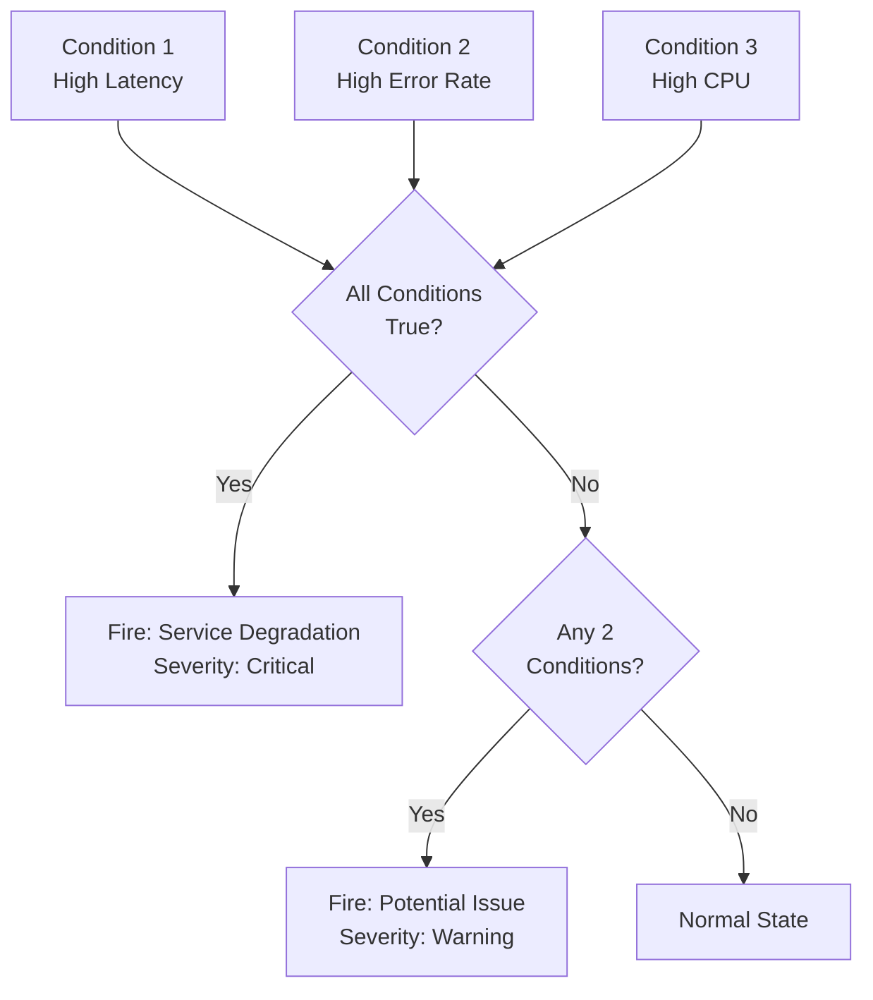
```mermaid
graph TB
    COND1[Condition 1<br/>High Latency]
    COND2[Condition 2<br/>High Error Rate]
    COND3[Condition 3<br/>High CPU]
    
    COND1 --> AND{All Conditions<br/>True?}
    COND2 --> AND
    COND3 --> AND
    
    AND -->|Yes| FIRE[Fire: Service Degradation<br/>Severity: Critical]
    AND -->|No| CHECK_PARTIAL{Any 2<br/>Conditions?}
    
    CHECK_PARTIAL -->|Yes| WARN[Fire: Potential Issue<br/>Severity: Warning]
    CHECK_PARTIAL -->|No| NORMAL[Normal State]
```

**Example:**
```yaml
- alert: ServiceDegraded
  expr: |
    (
      http_request_duration_seconds{quantile="0.95"} > 0.5
      and
      rate(http_requests_total{status=~"5.."}[5m]) > 10
      and
      node_cpu_utilization > 0.8
    )
  for: 5m
  labels:
    severity: critical
  annotations:
    summary: "Service experiencing multiple issues simultaneously"
    description: "High latency ({{ $value }}s), errors, and CPU usage"
```

### 4. Absence Alerts

Detect when expected metrics stop reporting.

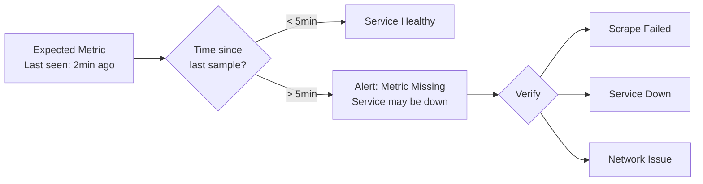
```mermaid
graph LR
    EXPECT[Expected Metric<br/>Last seen: 2min ago]
    
    EXPECT --> CHECK{Time since<br/>last sample?}
    
    CHECK -->|< 5min| HEALTHY[Service Healthy]
    CHECK -->|> 5min| ABSENT[Alert: Metric Missing<br/>Service may be down]
    
    ABSENT --> VERIFY{Verify}
    
    VERIFY --> SCRAPE_FAIL[Scrape Failed]
    VERIFY --> SERVICE_DOWN[Service Down]
    VERIFY --> NETWORK[Network Issue]
```

**Example:**
```yaml
- alert: ServiceDown
  expr: |
    absent(up{job="api-service"}) == 1
    or
    up{job="api-service"} == 0
  for: 2m
  labels:
    severity: critical
  annotations:
    summary: "API service is down or not reporting"

- alert: NoMetricsReceived
  expr: |
    time() - timestamp(http_requests_total{job="api"}) > 300
  for: 1m
  labels:
    severity: critical
  annotations:
    summary: "No metrics received from API for 5 minutes"
```

### 5. Anomaly Detection Alerts

Use statistical methods to detect unusual patterns.

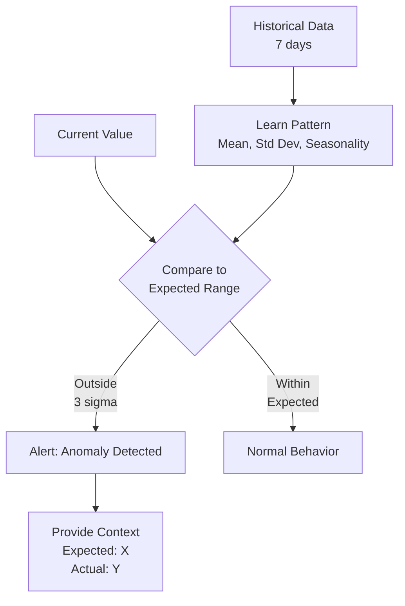
```mermaid
graph TD
    HISTORY[Historical Data<br/>7 days]
    
    HISTORY --> LEARN[Learn Pattern<br/>Mean, Std Dev, Seasonality]
    
    CURRENT[Current Value]
    
    CURRENT --> COMPARE{Compare to<br/>Expected Range}
    LEARN --> COMPARE
    
    COMPARE -->|Outside<br/>3 sigma| ANOMALY[Alert: Anomaly Detected]
    COMPARE -->|Within<br/>Expected| NORMAL[Normal Behavior]
    
    ANOMALY --> CONTEXT[Provide Context<br/>Expected: X<br/>Actual: Y]
```

**Techniques:**
- **Standard Deviation**: Alert if value > mean + 3σ
- **Moving Average**: Alert if value > 1.5x moving average
- **Seasonal Decomposition**: Separate trend, seasonal, residual components
- **Machine Learning**: ARIMA, Prophet, LSTM models

**Example:**
```python
# Pseudocode for anomaly detection
def detect_anomaly(current_value, historical_data):
    mean = historical_data.mean()
    std = historical_data.std()
    z_score = (current_value - mean) / std
    
    if abs(z_score) > 3:
        return True, f"Value {current_value} is {z_score:.2f} std devs from mean"
    return False, None
```

### 6. SLO-Based Alerts (Burn Rate)

Alert based on error budget consumption rate (see [10-service-level-objectives.md](10-service-level-objectives.md)).

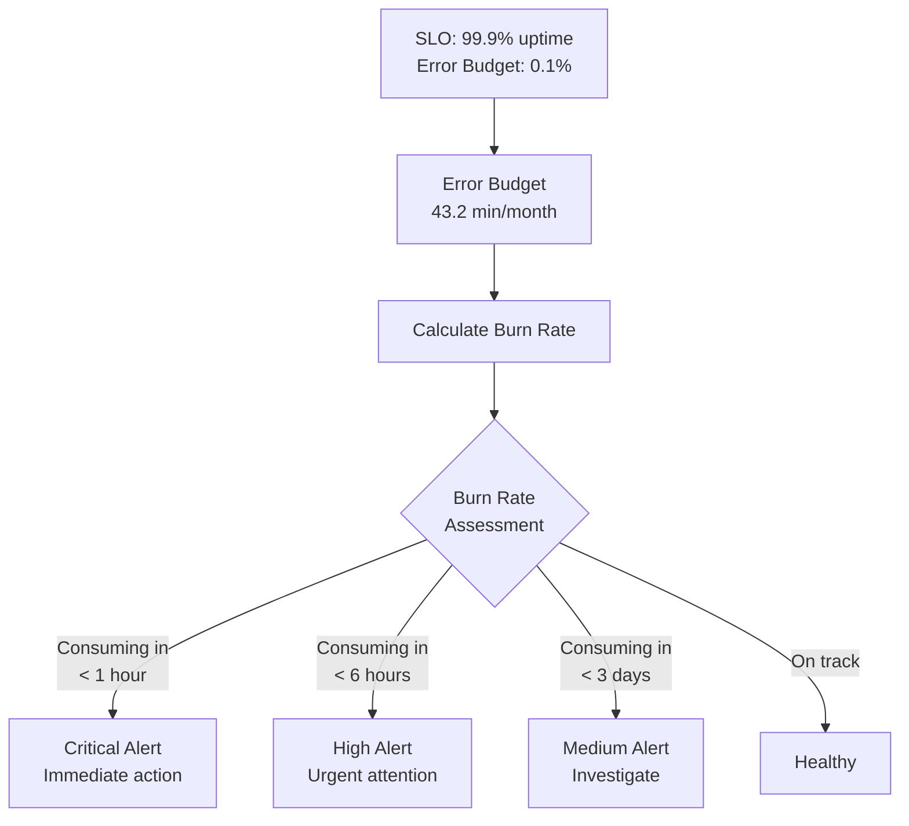
```mermaid
graph TB
    SLO[SLO: 99.9% uptime<br/>Error Budget: 0.1%]
    
    SLO --> BUDGET[Error Budget<br/>43.2 min/month]
    
    BUDGET --> BURN[Calculate Burn Rate]
    
    BURN --> CHECK{Burn Rate<br/>Assessment}
    
    CHECK -->|Consuming in<br/>< 1 hour| CRITICAL[Critical Alert<br/>Immediate action]
    CHECK -->|Consuming in<br/>< 6 hours| HIGH[High Alert<br/>Urgent attention]
    CHECK -->|Consuming in<br/>< 3 days| MEDIUM[Medium Alert<br/>Investigate]
    CHECK -->|On track| HEALTHY[Healthy]
```

**Multi-Window Burn Rate Alert:**
```yaml
# Fast burn rate (1 hour)
- alert: ErrorBudgetBurnRateCritical
  expr: |
    (
      1 - (
        sum(rate(http_requests_total{status=~"2.."}[1h]))
        /
        sum(rate(http_requests_total[1h]))
      )
    ) > (14.4 * 0.001)  # 14.4x the target error rate
  for: 2m
  labels:
    severity: critical
    slo: "api-availability"
  annotations:
    summary: "Burning through error budget in ~1 hour"

# Slow burn rate (6 hours)
- alert: ErrorBudgetBurnRateHigh
  expr: |
    (
      1 - (
        sum(rate(http_requests_total{status=~"2.."}[6h]))
        /
        sum(rate(http_requests_total[6h]))
      )
    ) > (6 * 0.001)  # 6x the target error rate
  for: 15m
  labels:
    severity: high
    slo: "api-availability"
  annotations:
    summary: "Burning through error budget in ~6 hours"
```

## Alert Routing and Escalation

### Routing Architecture

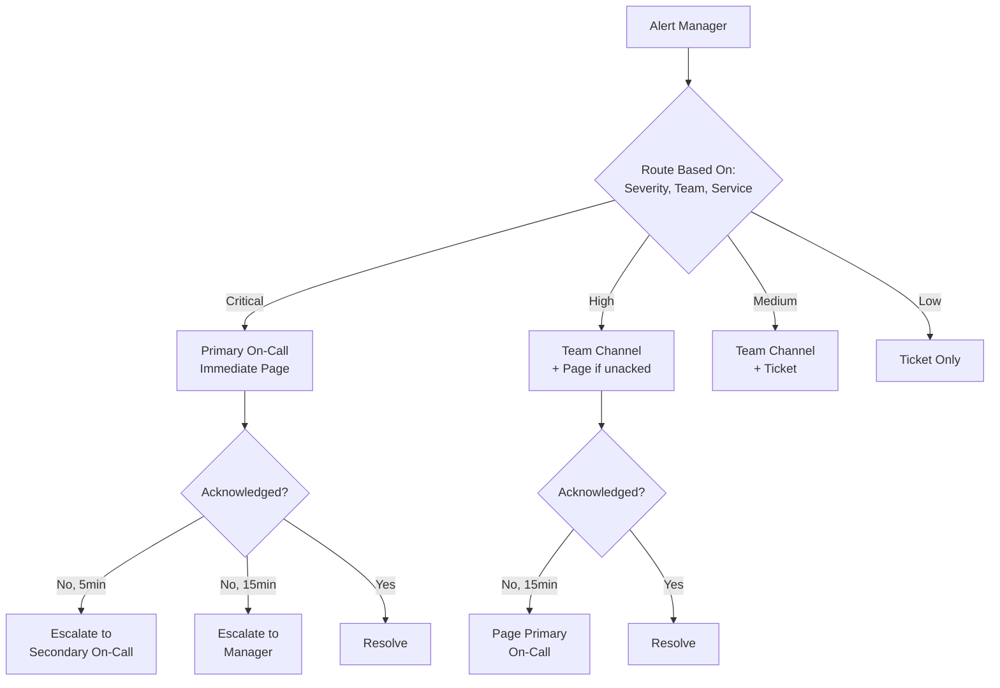
```mermaid
graph TB
    ALERTS[Alert Manager]
    
    ALERTS --> ROUTE{Route Based On:<br/>Severity, Team, Service}
    
    ROUTE -->|Critical| PATH1[Primary On-Call<br/>Immediate Page]
    ROUTE -->|High| PATH2[Team Channel<br/>+ Page if unacked]
    ROUTE -->|Medium| PATH3[Team Channel<br/>+ Ticket]
    ROUTE -->|Low| PATH4[Ticket Only]
    
    PATH1 --> ACK1{Acknowledged?}
    
    ACK1 -->|No, 5min| ESC1[Escalate to<br/>Secondary On-Call]
    ACK1 -->|No, 15min| ESC2[Escalate to<br/>Manager]
    ACK1 -->|Yes| RESOLVE1[Resolve]
    
    PATH2 --> ACK2{Acknowledged?}
    ACK2 -->|No, 15min| ESC3[Page Primary<br/>On-Call]
    ACK2 -->|Yes| RESOLVE2[Resolve]
```

### Routing Configuration Example

```yaml
# AlertManager routing configuration
route:
  receiver: 'default'
  group_by: ['alertname', 'cluster', 'service']
  group_wait: 30s        # Wait before sending initial notification
  group_interval: 5m     # Wait before sending batch of new alerts
  repeat_interval: 4h    # Re-send unresolved alerts
  
  routes:
  # Critical alerts - immediate page
  - match:
      severity: critical
    receiver: 'pagerduty-critical'
    continue: true        # Also send to other receivers
    group_wait: 10s       # Faster grouping for critical
    repeat_interval: 30m  # More frequent reminders
    
  - match:
      severity: critical
    receiver: 'slack-critical'
  
  # High severity - business hours page, always notify
  - match:
      severity: high
    receiver: 'slack-high'
    routes:
    - match:
        time_range: ['09:00', '18:00']  # Business hours
      receiver: 'pagerduty-high'
  
  # Medium severity - ticket and notify
  - match:
      severity: medium
    receiver: 'jira-ticket'
    continue: true
  - match:
      severity: medium
    receiver: 'slack-medium'
  
  # Team-specific routing
  - match:
      team: platform
    receiver: 'slack-platform'
    routes:
    - match:
        severity: critical
      receiver: 'pagerduty-platform'
  
  - match:
      team: data
    receiver: 'slack-data'
    routes:
    - match:
        severity: critical
      receiver: 'pagerduty-data'

# Receivers configuration
receivers:
- name: 'default'
  slack_configs:
  - channel: '#alerts-general'
    
- name: 'pagerduty-critical'
  pagerduty_configs:
  - service_key: '<service_key>'
    severity: 'critical'
    
- name: 'slack-critical'
  slack_configs:
  - channel: '#alerts-critical'
    color: 'danger'
    title: 'CRITICAL: {{ .GroupLabels.alertname }}'
    
- name: 'jira-ticket'
  webhook_configs:
  - url: 'https://jira.company.com/api/create-ticket'
```

### Escalation Policies

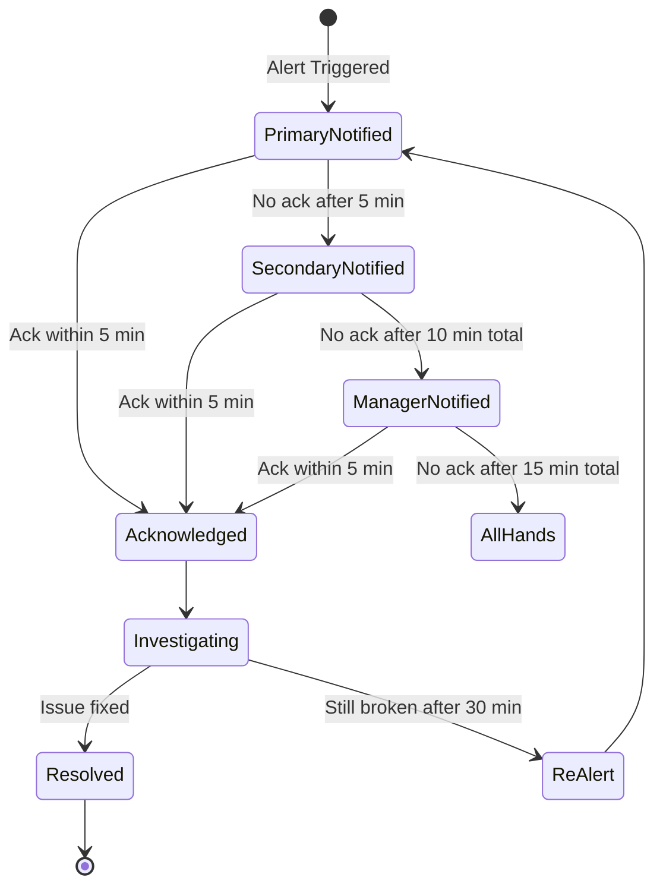
```mermaid
stateDiagram-v2
    [*] --> PrimaryNotified: Alert Triggered
    
    PrimaryNotified --> Acknowledged: Ack within 5 min
    PrimaryNotified --> SecondaryNotified: No ack after 5 min
    
    SecondaryNotified --> Acknowledged: Ack within 5 min
    SecondaryNotified --> ManagerNotified: No ack after 10 min total
    
    ManagerNotified --> Acknowledged: Ack within 5 min
    ManagerNotified --> AllHands: No ack after 15 min total
    
    Acknowledged --> Investigating
    
    Investigating --> Resolved: Issue fixed
    Investigating --> ReAlert: Still broken after 30 min
    
    ReAlert --> PrimaryNotified
    
    Resolved --> [*]
```

**Escalation Timing:**
- **Tier 1 (Primary On-Call)**: 0-5 minutes
- **Tier 2 (Secondary On-Call)**: 5-10 minutes
- **Tier 3 (Manager/Lead)**: 10-15 minutes
- **Tier 4 (All-Hands/Exec)**: 15+ minutes

### On-Call Rotation

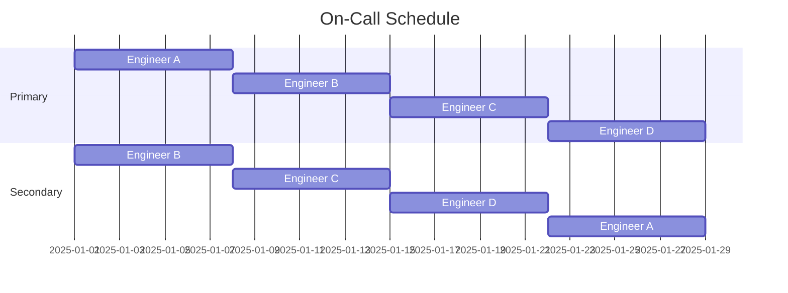
```mermaid
gantt
    title On-Call Schedule
    dateFormat YYYY-MM-DD
    section Primary
    Engineer A    :2025-01-01, 7d
    Engineer B    :2025-01-08, 7d
    Engineer C    :2025-01-15, 7d
    Engineer D    :2025-01-22, 7d
    
    section Secondary
    Engineer B    :2025-01-01, 7d
    Engineer C    :2025-01-08, 7d
    Engineer D    :2025-01-15, 7d
    Engineer A    :2025-01-22, 7d
```

**Best Practices:**
- **Rotation Length**: 1 week (balance between context and fatigue)
- **Handoff Process**: Formal handoff meeting at rotation boundary
- **Shadow Rotation**: New engineers shadow before primary rotation
- **Follow-the-Sun**: Distribute across time zones for 24/7 coverage
- **Load Balancing**: Track alert volume per person, adjust if imbalanced

## Notification Channels

### Channel Selection Matrix

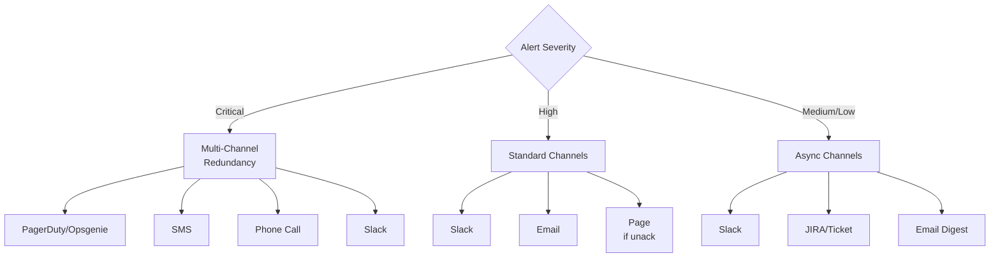
```mermaid
graph TB
    SEVERITY{Alert Severity}
    
    SEVERITY -->|Critical| MULTI[Multi-Channel<br/>Redundancy]
    SEVERITY -->|High| STANDARD[Standard Channels]
    SEVERITY -->|Medium/Low| ASYNC[Async Channels]
    
    MULTI --> PAGE[PagerDuty/Opsgenie]
    MULTI --> SMS[SMS]
    MULTI --> CALL[Phone Call]
    MULTI --> SLACK1[Slack]
    
    STANDARD --> SLACK2[Slack]
    STANDARD --> EMAIL[Email]
    STANDARD --> PAGE2[Page<br/>if unack]
    
    ASYNC --> SLACK3[Slack]
    ASYNC --> TICKET[JIRA/Ticket]
    ASYNC --> EMAIL2[Email Digest]
```

### 1. Paging Systems (PagerDuty, Opsgenie)

**Characteristics:**
- High urgency, immediate attention required
- Acknowledges receipt and tracks response
- Escalation policies built-in
- Integration with on-call schedules

**Configuration:**
```yaml
pagerduty_configs:
- service_key: 'production-critical'
  severity: '{{ .Labels.severity }}'
  description: '{{ .Annotations.summary }}'
  details:
    alert_name: '{{ .Labels.alertname }}'
    service: '{{ .Labels.service }}'
    runbook: '{{ .Annotations.runbook }}'
    query: '{{ .GeneratorURL }}'
  client: 'AlertManager'
  client_url: '{{ .ExternalURL }}'
```

### 2. Chat Platforms (Slack, Microsoft Teams)

**Characteristics:**
- Real-time but less intrusive than pages
- Team visibility and collaboration
- Rich formatting and links
- Thread-based discussion

**Slack Alert Template:**
```json
{
  "channel": "#alerts-production",
  "attachments": [{
    "color": "danger",
    "title": "🚨 {{ .GroupLabels.alertname }}",
    "title_link": "{{ .GeneratorURL }}",
    "text": "{{ .Annotations.description }}",
    "fields": [
      {
        "title": "Severity",
        "value": "{{ .Labels.severity }}",
        "short": true
      },
      {
        "title": "Service",
        "value": "{{ .Labels.service }}",
        "short": true
      },
      {
        "title": "Runbook",
        "value": "<{{ .Annotations.runbook }}|View Runbook>",
        "short": false
      }
    ],
    "footer": "AlertManager",
    "ts": {{ .StartsAt.Unix }}
  }]
}
```

### 3. Email

**Characteristics:**
- Asynchronous, non-urgent
- Detailed context possible
- Easy to filter and archive
- Suitable for medium/low severity

**Best Practices:**
- Use clear subject lines: `[CRITICAL] [API] High Error Rate`
- Include all context in email body
- Link to dashboards and runbooks
- Batch alerts to avoid flood (group_interval)

### 4. Ticketing Systems (JIRA, ServiceNow)

**Characteristics:**
- Creates trackable work items
- Integrates with workflow
- Historical record
- Priority and assignment

**Auto-Ticket Creation:**
```json
{
  "project": "OPS",
  "issuetype": "Incident",
  "summary": "[{{ .Labels.severity }}] {{ .GroupLabels.alertname }}",
  "description": {
    "content": [
      {
        "type": "paragraph",
        "text": "{{ .Annotations.description }}"
      },
      {
        "type": "paragraph",
        "text": "Started at: {{ .StartsAt }}"
      },
      {
        "type": "paragraph",
        "text": "Runbook: {{ .Annotations.runbook }}"
      }
    ]
  },
  "priority": {
    "name": "{{ if eq .Labels.severity \"critical\" }}Highest{{ else }}High{{ end }}"
  },
  "labels": ["alert", "{{ .Labels.service }}"]
}
```

### 5. Webhooks and Custom Integrations

**Use Cases:**
- Integration with custom tools
- ChatOps workflows
- Automated remediation
- Metrics tracking

**Example Webhook Handler:**
```python
# Flask webhook receiver
@app.route('/webhook/alerts', methods=['POST'])
def handle_alert():
    alert_data = request.json
    
    for alert in alert_data['alerts']:
        severity = alert['labels']['severity']
        alert_name = alert['labels']['alertname']
        
        # Custom logic
        if severity == 'critical' and 'database' in alert_name:
            # Trigger auto-scaling
            scale_database_instances()
            
            # Notify DBA team
            notify_team('dba', alert)
        
        # Log to metrics
        metrics.increment('alerts.received', tags=[
            f'severity:{severity}',
            f'alert:{alert_name}'
        ])
    
    return {'status': 'ok'}, 200
```

### Channel Grouping and Deduplication

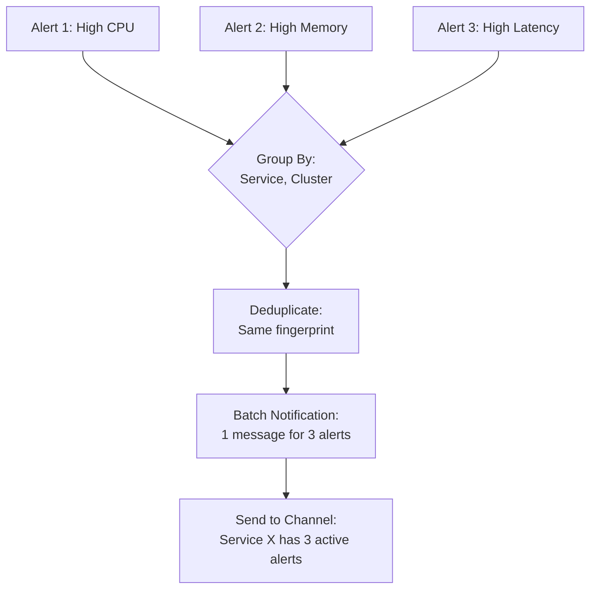
```mermaid
graph TB
    ALERT1[Alert 1: High CPU]
    ALERT2[Alert 2: High Memory]
    ALERT3[Alert 3: High Latency]
    
    ALERT1 --> GROUP{Group By:<br/>Service, Cluster}
    ALERT2 --> GROUP
    ALERT3 --> GROUP
    
    GROUP --> DEDUPE[Deduplicate:<br/>Same fingerprint]
    DEDUPE --> BATCH[Batch Notification:<br/>1 message for 3 alerts]
    
    BATCH --> SEND[Send to Channel:<br/>Service X has 3 active alerts]

```

**Configuration:**
```yaml
# Group alerts together
group_by: ['alertname', 'cluster', 'service']
group_wait: 30s        # Wait for similar alerts
group_interval: 5m     # Send updates for group

# Inhibition rules (suppress redundant alerts)
inhibit_rules:
- source_match:
    severity: 'critical'
  target_match:
    severity: 'warning'
  equal: ['alertname', 'service']  # Suppress warnings if critical exists
  
- source_match:
    alertname: 'ServiceDown'
  target_match_re:
    alertname: '.*'  # Suppress all alerts from this service
  equal: ['service']
```

## Alert Fatigue Management

Alert fatigue occurs when engineers receive too many alerts, leading to desensitization and missed critical issues.

### Causes and Solutions

```mermaid
graph TB
    FATIGUE[Alert Fatigue]
    
    FATIGUE --> CAUSE1[Too Many Alerts]
    FATIGUE --> CAUSE2[False Positives]
    FATIGUE --> CAUSE3[Unclear Actions]
    FATIGUE --> CAUSE4[Poor Context]
    
    CAUSE1 --> SOL1[Reduce Alert Count<br/>Consolidate, Increase thresholds]
    CAUSE2 --> SOL2[Tune Thresholds<br/>Add duration requirements]
    CAUSE3 --> SOL3[Link Runbooks<br/>Document actions]
    CAUSE4 --> SOL4[Enrich Metadata<br/>Add context links]
    
    SOL1 --> MONITOR[Monitor Alert<br/>Effectiveness]
    SOL2 --> MONITOR
    SOL3 --> MONITOR
    SOL4 --> MONITOR
```

### Alert Quality Metrics

Track these metrics to measure alert effectiveness:

```yaml
# Prometheus metrics for alert quality
alert_quality_metrics:
  - time_to_acknowledge: 
      target: < 5 minutes for critical
      measure: Time from alert fire to human ack
      
  - time_to_resolve:
      target: < 30 minutes for critical
      measure: Time from alert fire to resolution
      
  - false_positive_rate:
      target: < 10%
      measure: Alerts that resolve without action
      
  - alert_volume_per_shift:
      target: < 10 pages per shift
      measure: Total alerts per on-call shift
      
  - repeat_alert_rate:
      target: < 20%
      measure: Same alert firing multiple times
```

**Visualization:**
```mermaid
graph LR
    subgraph "Alert Quality Dashboard"
        A[Total Alerts: 1,247]
        B[Actionable: 85%]
        C[False Positive: 12%]
        D[Info Only: 3%]
        
        E[Avg TTAck: 3.2 min]
        F[Avg TTRes: 18 min]
        
        G[Top Noisy Alert:<br/>DiskSpace 47x]
    end
```

### Techniques to Reduce Fatigue

**1. Alert Consolidation**
```yaml
# Before: 5 separate alerts
- alert: HighCPU
- alert: HighMemory  
- alert: HighDiskIO
- alert: HighNetworkIO
- alert: HighSwap

# After: 1 composite alert
- alert: NodeUnderStress
  expr: |
    (node_cpu > 0.8) + 
    (node_memory > 0.9) + 
    (node_disk_io > 0.8) >= 2  # Any 2 conditions
  annotations:
    summary: "Node {{ $labels.instance }} under stress (multiple resources)"
```

**2. Duration Requirements**
```yaml
# Avoid transient spikes
- alert: HighLatency
  expr: http_latency_p95 > 500ms
  for: 10m  # Must persist for 10 minutes
  
# Different durations by severity
- alert: CriticalLatency
  expr: http_latency_p95 > 2s
  for: 2m  # Shorter for critical
  
- alert: WarningLatency  
  expr: http_latency_p95 > 500ms
  for: 15m  # Longer for warnings
```

**3. Self-Healing Integration**
```mermaid
graph TD
    ALERT[Alert: High Memory]
    
    ALERT --> AUTO{Auto-Remediation<br/>Available?}
    
    AUTO -->|Yes| ATTEMPT[Attempt Auto-Fix:<br/>Restart service]
    AUTO -->|No| PAGE[Page On-Call]
    
    ATTEMPT --> CHECK{Fixed?}
    
    CHECK -->|Yes| LOG[Log Resolution<br/>No human page]
    CHECK -->|No| PAGE
    CHECK -->|Uncertain| DELAY[Wait 5 min<br/>then page]
```

**4. Business Hours vs. After Hours**
```yaml
# Less critical alerts only during business hours
- alert: HighDiskUsage
  expr: disk_usage > 0.8
  for: 1h
  labels:
    severity: warning
    routing: business_hours_only
    
# Critical alerts always
- alert: DiskFull
  expr: disk_usage > 0.95
  for: 5m
  labels:
    severity: critical
    routing: always
```

**5. Alert Suppression During Maintenance**
```yaml
# Silence alerts during known maintenance
amtool silence add \
  --duration=2h \
  --author="ops-team" \
  --comment="Database maintenance window" \
  service="database" \
  alertname=~"Database.*"
```

### Alert Review Process

```mermaid
graph TB
    WEEKLY[Weekly Alert Review]
    
    WEEKLY --> ANALYZE[Analyze Past Week]
    
    ANALYZE --> METRICS[Review Metrics:<br/>Volume, TTAck, TTRes]
    
    METRICS --> IDENTIFY{Identify Issues}
    
    IDENTIFY --> NOISY[Top 5 Noisy Alerts]
    IDENTIFY --> MISSED[Missed Alerts]
    IDENTIFY --> FALSE[False Positives]
    
    NOISY --> ACTION1[Tune Thresholds<br/>Add duration<br/>Consolidate]
    MISSED --> ACTION2[Create Missing Alerts<br/>Adjust severity]
    FALSE --> ACTION3[Refine Conditions<br/>Remove if not actionable]
    
    ACTION1 --> IMPLEMENT[Implement Changes]
    ACTION2 --> IMPLEMENT
    ACTION3 --> IMPLEMENT
    
    IMPLEMENT --> MONITOR[Monitor Next Week]
    MONITOR --> WEEKLY
```

## Incident Response Integration

### Incident Lifecycle

```mermaid
stateDiagram-v2
    [*] --> Detected: Alert Fires
    
    Detected --> Triaged: On-Call Acknowledges
    
    Triaged --> Investigating: Assign to Engineer
    
    Investigating --> Mitigated: Issue Contained
    Investigating --> Escalated: Needs More Help
    
    Escalated --> Investigating: Additional Resources
    
    Mitigated --> Resolved: Full Fix Deployed
    
    Resolved --> PostMortem: Document & Learn
    
    PostMortem --> [*]
```

### Alert to Incident Workflow

```mermaid
graph TB
    ALERT[Alert Triggered]
    
    ALERT --> ACK{Acknowledged<br/>in 5 min?}
    
    ACK -->|Yes| ASSESS[Assess Severity]
    ACK -->|No| ESCALATE1[Auto-Escalate]
    
    ESCALATE1 --> ASSESS
    
    ASSESS --> INCIDENT{Create<br/>Incident?}
    
    INCIDENT -->|Yes, Major| MAJOR[P1 Incident<br/>War Room]
    INCIDENT -->|Yes, Minor| MINOR[P2 Incident<br/>Track & Fix]
    INCIDENT -->|No| RESOLVE[Direct Resolution]
    
    MAJOR --> WAR[Incident Commander<br/>Assemble Team]
    WAR --> COMMS[Status Updates<br/>Every 30 min]
    WAR --> RESOLVE_MAJOR[Resolve Incident]
    
    MINOR --> TRACK[Track in Ticket]
    TRACK --> RESOLVE_MINOR[Resolve]
    
    RESOLVE_MAJOR --> POSTMORTEM[Required Postmortem]
    RESOLVE_MINOR --> OPTIONAL[Optional Postmortem]
    RESOLVE --> OPTIONAL
```

### Runbook Integration

Every alert should link to a runbook with:

**Runbook Template:**
```markdown
# Alert: High API Latency

## Severity: Critical

## Impact
- Users experiencing slow response times
- Revenue impact: $XXX per minute
- Affects: All API endpoints

## Diagnostic Steps
1. Check dashboard: https://grafana.company.com/d/api-health
2. Verify error rates: Are they also elevated?
3. Check dependencies:
   - Database: https://grafana.company.com/d/database
   - Cache: https://grafana.company.com/d/redis
4. Review recent deployments: https://deploy.company.com/history

## Common Causes
1. **Database slow queries** (60% of cases)
   - Check slow query log
   - Look for missing indexes
   - Check for table locks
   
2. **Cache failure** (25% of cases)
   - Verify Redis is responding
   - Check cache hit rate
   - Restart cache if needed
   
3. **High traffic** (10% of cases)
   - Check traffic levels vs. normal
   - Scale up if needed
   - Enable rate limiting

## Remediation Steps

### Immediate (< 5 min)
- [ ] Scale API service to 2x capacity
- [ ] Enable cache warming
- [ ] Notify stakeholders in #incidents

### Short-term (< 30 min)
- [ ] Identify and kill slow queries
- [ ] Add missing database indexes
- [ ] Increase database connection pool

### Long-term
- [ ] Create postmortem
- [ ] Improve query optimization
- [ ] Add caching layer

## Escalation
- Primary: @api-team
- Secondary: @platform-team
- Manager: @engineering-manager

## Related Alerts
- HighErrorRate
- DatabaseSlowQueries
- CacheHitRateLow

## Recent Changes
Query recent deployments: 
```bash
kubectl rollout history deployment/api-service
```

## Useful Commands
```bash
# Check current latency
curl https://api.company.com/health

# View logs for errors
kubectl logs -f deployment/api-service --tail=100 | grep ERROR

# Scale up
kubectl scale deployment/api-service --replicas=10
```

## Historical Context
- Last occurred: 2 weeks ago
- Root cause: Database index missing on users table
- Resolution time: 45 minutes
- Postmortem: https://wiki.company.com/postmortems/2024-12-15
```

### Incident Communication

```mermaid
sequenceDiagram
    participant Alert as Alert System
    participant OnCall as On-Call Engineer
    participant IncidentMgr as Incident Manager
    participant StatusPage as Status Page
    participant Internal as Internal Stakeholders
    participant External as Customers
    
    Alert->>OnCall: Critical Alert
    OnCall->>OnCall: Assess Impact
    OnCall->>IncidentMgr: Declare Incident
    
    IncidentMgr->>Internal: Initial Notification<br/>"Investigating issue"
    IncidentMgr->>StatusPage: Post Initial Update
    StatusPage->>External: Notify Subscribers
    
    loop Every 15-30 minutes
        IncidentMgr->>Internal: Progress Update
        IncidentMgr->>StatusPage: Update Status
    end
    
    OnCall->>IncidentMgr: Issue Resolved
    IncidentMgr->>Internal: Resolution Notice
    IncidentMgr->>StatusPage: Mark Resolved
    StatusPage->>External: Resolution Notice
    
    IncidentMgr->>OnCall: Schedule Postmortem
```

## Best Practices

### 1. Alert Development Lifecycle

```mermaid
graph TB
    NEED[Identify Need<br/>Gap in monitoring]
    
    NEED --> DESIGN[Design Alert<br/>Define conditions]
    
    DESIGN --> TEST[Test in Staging<br/>Validate triggers]
    
    TEST --> SHADOW[Shadow Mode<br/>Alert without paging]
    
    SHADOW --> REVIEW[Review Results<br/>Check false positives]
    
    REVIEW --> DECISION{Ready for<br/>Production?}
    
    DECISION -->|No| TUNE[Tune Thresholds]
    DECISION -->|Yes| DEPLOY[Deploy to Production]
    
    TUNE --> SHADOW
    
    DEPLOY --> MONITOR[Monitor Effectiveness]
    
    MONITOR --> ITERATE[Iterate Based on<br/>Feedback]
    
    ITERATE --> MONITOR
```

### 2. Documentation Standards

**Every Alert Must Have:**
```yaml
alert: AlertName
annotations:
  # Required
  summary: "Short description (< 80 chars)"
  description: "Detailed description with context"
  runbook: "https://wiki.company.com/runbooks/alert-name"
  dashboard: "https://grafana.company.com/d/dashboard-id"
  
  # Recommended
  impact: "User-facing impact description"
  severity_reason: "Why this severity was chosen"
  query: "{{ .GeneratorURL }}"  # Link to metric query
  
  # Optional but valuable
  related_alerts: "OtherAlert1, OtherAlert2"
  last_incident: "https://postmortems.company.com/2024-12-15"
  owner_team: "platform-team"
  slack_channel: "#team-platform"
```

### 3. Alert Testing

**Synthetic Testing:**
```python
# Generate test scenarios
def test_alert_fires_correctly():
    # Simulate high error rate
    for i in range(1000):
        make_failing_request()
    
    # Wait for alert to fire
    time.sleep(60)
    
    # Verify alert was triggered
    alerts = get_firing_alerts()
    assert any(a['name'] == 'HighErrorRate' for a in alerts)

def test_alert_resolves():
    # Wait for error rate to normalize
    time.sleep(300)
    
    # Verify alert resolved
    alerts = get_firing_alerts()
    assert not any(a['name'] == 'HighErrorRate' for a in alerts)
```

**Alert Drills:**
```mermaid
graph LR
    SCHEDULE[Schedule Drill<br/>Monthly]
    
    SCHEDULE --> TRIGGER[Trigger Alert<br/>Manually]
    
    TRIGGER --> RESPOND[Team Responds<br/>Follow Runbook]
    
    RESPOND --> MEASURE[Measure:<br/>TTAck, TTRes]
    
    MEASURE --> REVIEW[Review Process<br/>Identify Gaps]
    
    REVIEW --> IMPROVE[Update Runbooks<br/>& Procedures]
```

### 4. Capacity Planning Alerts

```yaml
# Predictive alerting for capacity
- alert: HighDiskUsageProjection
  expr: |
    predict_linear(
      node_filesystem_avail_bytes[1h], 
      7 * 24 * 3600  # 7 days
    ) < 0
  for: 1h
  labels:
    severity: warning
  annotations:
    summary: "Disk will be full in ~7 days based on current growth"

- alert: TrafficGrowthAlert
  expr: |
    (
      rate(http_requests_total[7d])
      / 
      rate(http_requests_total[7d] offset 7d)
    ) > 1.5  # 50% growth week-over-week
  labels:
    severity: warning
  annotations:
    summary: "Traffic growing 50% week-over-week - review capacity"
```

### 5. Multi-Region Alerting

```mermaid
graph TB
    subgraph "Region: US-East"
        A1[Service A]
        M1[Metrics]
    end
    
    subgraph "Region: US-West"
        A2[Service A]
        M2[Metrics]
    end
    
    subgraph "Region: EU"
        A3[Service A]
        M3[Metrics]
    end
    
    M1 --> AGG[Global Aggregator]
    M2 --> AGG
    M3 --> AGG
    
    AGG --> REGIONAL{Regional<br/>vs Global?}
    
    REGIONAL -->|Regional Failure| ALERT1[Alert: Region Down<br/>Failover if needed]
    REGIONAL -->|Global Failure| ALERT2[Alert: Service Down<br/>Critical escalation]
```

**Configuration:**
```yaml
# Alert if single region fails
- alert: RegionDown
  expr: |
    count(up{job="api"}) by (region) == 0
  for: 2m
  labels:
    severity: high
  annotations:
    summary: "Region {{ $labels.region }} is completely down"

# Alert if majority of regions fail
- alert: GlobalOutage
  expr: |
    count(count(up{job="api"}) by (region) == 0) 
    >= 
    count(count(up{job="api"}) by (region)) / 2
  for: 1m
  labels:
    severity: critical
  annotations:
    summary: "Multiple regions down - global outage"
```

### 6. Machine Learning Integration

```mermaid
graph TB
    HISTORICAL[Historical Data<br/>Metrics, Logs, Traces]
    
    HISTORICAL --> TRAIN[Train ML Model<br/>Anomaly Detection]
    
    TRAIN --> MODEL[Deployed Model]
    
    CURRENT[Current Metrics]
    
    CURRENT --> MODEL
    
    MODEL --> PREDICT[Predict:<br/>Normal or Anomaly?]
    
    PREDICT --> THRESHOLD{Anomaly<br/>Score?}
    
    THRESHOLD -->|> 0.9| CRITICAL[Critical Alert]
    THRESHOLD -->|> 0.7| WARNING[Warning Alert]
    THRESHOLD -->|< 0.7| NORMAL[Normal]
    
    CRITICAL --> ENRICH[Enrich with<br/>Similar Past Incidents]
```

**Benefits:**
- Detect complex patterns missed by simple thresholds
- Adapt to seasonal trends automatically
- Reduce false positives over time
- Predict issues before they occur

### 7. Cost-Aware Alerting

```yaml
# Alert on unexpected cloud costs
- alert: UnexpectedCloudCosts
  expr: |
    increase(cloud_cost_dollars[1h]) 
    > 
    avg_over_time(cloud_cost_dollars[1h] offset 1d) * 2
  for: 15m
  labels:
    severity: high
    team: finops
  annotations:
    summary: "Cloud costs doubled compared to yesterday"
    description: "Current hourly cost: ${{ $value }}"

# Alert on resource waste
- alert: IdleResourcesWaste  
  expr: |
    sum(resource_cost{utilization="<10%"}) > 1000
  for: 24h
  labels:
    severity: medium
  annotations:
    summary: "Over $1000/day spent on idle resources"
```

### 8. Compliance and Audit Alerts

```yaml
# Security and compliance monitoring
- alert: UnauthorizedAccessAttempt
  expr: |
    rate(authentication_failures[5m]) > 10
  for: 2m
  labels:
    severity: high
    category: security
  annotations:
    summary: "High rate of authentication failures detected"

- alert: DataRetentionViolation
  expr: |
    data_retention_days{type="pii"} > 90
  labels:
    severity: critical
    category: compliance
  annotations:
    summary: "PII data retained beyond 90-day policy"

- alert: UnencryptedDataDetected
  expr: |
    data_encryption_status{encrypted="false"} > 0
  labels:
    severity: critical
    category: security
  annotations:
    summary: "Unencrypted sensitive data detected"
```

## Summary

Effective alerting and monitoring is an art that balances:

- **Signal vs. Noise**: Alert only on actionable, impactful issues
- **Urgency vs. Importance**: Route alerts based on true severity
- **Automation vs. Human Judgment**: Auto-remediate when safe, escalate when necessary
- **Context vs. Brevity**: Provide enough information without overwhelming

**Key Takeaways:**

1. **Design symptom-based alerts** that reflect user impact, not just system metrics
2. **Link every alert to a runbook** with clear diagnostic and remediation steps
3. **Implement proper routing** to get the right alert to the right person at the right time
4. **Fight alert fatigue** through consolidation, tuning, and regular review
5. **Integrate with incident response** for seamless escalation and communication
6. **Measure alert quality** and continuously improve based on data
7. **Test your alerts** through drills and synthetic scenarios
8. **Document everything** to enable effective response and knowledge transfer

**Related Documentation:**
- [03-metrics.md](03-metrics.md) - Metric types that feed into alerts
- [06-metrics-collection.md](06-metrics-collection.md) - Collecting metrics for alerting
- [09-visualization-dashboards.md](09-visualization-dashboards.md) - Visualizing alert data
- [10-service-level-objectives.md](10-service-level-objectives.md) - SLO-based alerting
- [11-tools-ecosystem.md](11-tools-ecosystem.md) - Alert management tools (AlertManager, PagerDuty, etc.)
- [12-best-practices.md](12-best--practises.md) - Overall observability best practices