# 09 - Visualization Dashboards

## Table of Contents
- [Introduction](#introduction)
- [Core Concepts](#core-concepts)
- [Dashboard Architecture](#dashboard-architecture)
- [Dashboard Design Principles](#dashboard-design-principles)
- [Types of Visualizations](#types-of-visualizations)
- [Dashboard Layers](#dashboard-layers)
- [Integration with Observability Pillars](#integration-with-observability-pillars)
- [Dashboard Patterns](#dashboard-patterns)
- [Query Optimization](#query-optimization)
- [Real-Time vs Historical Views](#real-time-vs-historical-views)
- [Dashboard Management](#dashboard-management)
- [Anti-Patterns](#anti-patterns)
- [References](#references)

## Introduction

Visualization dashboards are the primary interface for observability data, transforming raw metrics, logs, and traces into actionable insights. They serve as the central nervous system of your monitoring strategy, enabling teams to understand system behavior, detect anomalies, and make data-driven decisions.

### Why Dashboards Matter

**Context Synthesis**: Dashboards aggregate data from multiple sources (referenced in [01-introduction.md](01-introduction.md)) into unified views that tell a story about system health.

**Cognitive Load Reduction**: Well-designed dashboards reduce the mental effort required to understand complex systems by presenting information hierarchically and contextually.

**Shared Understanding**: Dashboards create a common visual language across teams, facilitating communication between developers, operations, SREs, and business stakeholders.

## Core Concepts

### The Dashboard Hierarchy

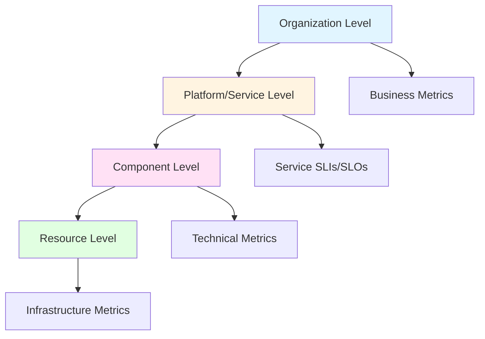

### Information Density vs Clarity

The fundamental tension in dashboard design:

**High Information Density**: More data visible at once, faster pattern recognition for experts, but higher cognitive load.

**High Clarity**: Simpler views, easier to understand, but may require navigation to see full picture.

**Optimal Balance**: Depends on:
- Audience expertise level
- Use case (troubleshooting vs monitoring)
- Screen real estate
- Update frequency requirements

### Dashboard Types by Purpose

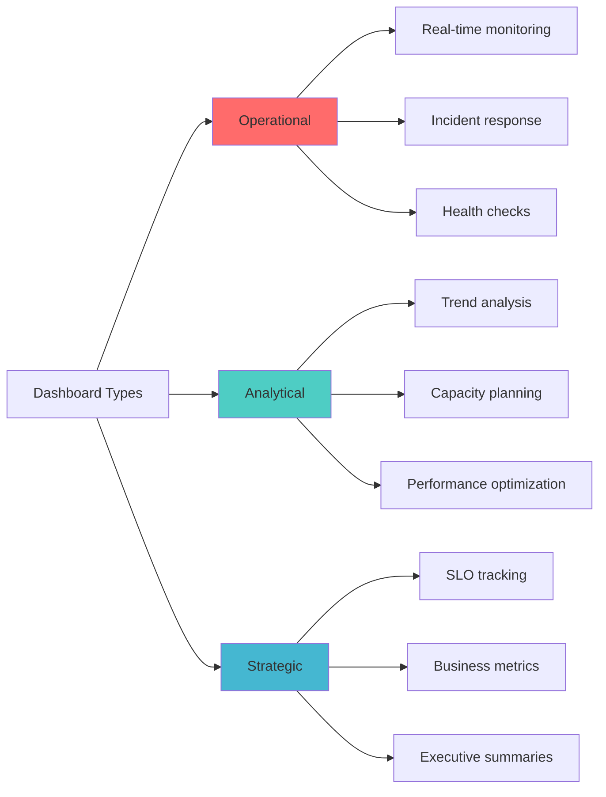

## Dashboard Architecture

### Data Flow Architecture

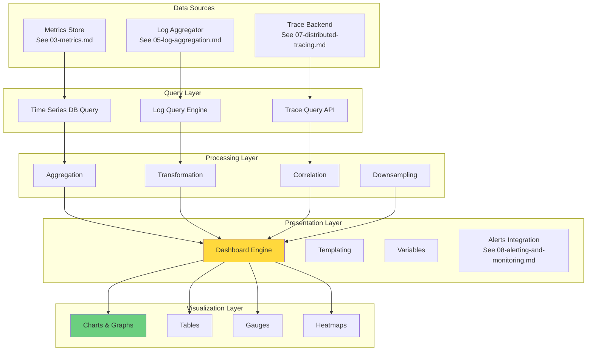

### Component Architecture

**Dashboard Server**: 
- Manages dashboard definitions (JSON/YAML)
- Handles user authentication and authorization
- Serves the web interface
- Manages plugins and extensions

**Query Proxy**:
- Routes queries to appropriate data sources
- Implements caching strategies
- Handles query timeouts and retries
- Provides query optimization

**Data Source Connectors**:
- Abstract backend-specific query languages
- Handle authentication to data stores
- Implement health checks
- Manage connection pools

## Dashboard Design Principles

### The USE Method (Utilization, Saturation, Errors)

Introduced by Brendan Gregg, this framework provides a systematic approach to monitoring resources:

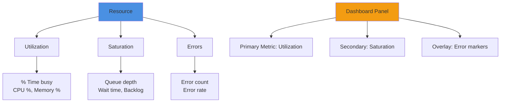

### The RED Method (Rate, Errors, Duration)

Focused on request-driven services (referenced with [03-metrics.md](03-metrics.md)):

**Rate**: Number of requests per second
- Shows traffic patterns
- Identifies anomalies in demand
- Helps with capacity planning

**Errors**: Number or rate of failed requests
- Immediate visibility into service health
- Correlates with user experience
- Triggers for investigation

**Duration**: Distribution of request latency
- Shows performance characteristics
- Reveals degradation before failures
- Indicates resource contention

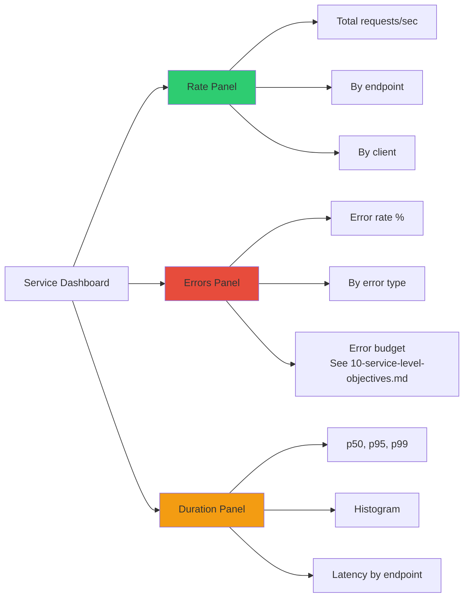

### The Four Golden Signals (Google SRE)

Extending RED with saturation:

1. **Latency**: Time to service a request
2. **Traffic**: Demand on your system
3. **Errors**: Rate of failed requests
4. **Saturation**: How "full" your service is

### Visual Hierarchy Principles

**F-Pattern Reading**: Users scan left-to-right, top-to-bottom
- Most critical metrics: Top-left
- Secondary metrics: Top-right
- Detailed/drill-down: Bottom sections

**Progressive Disclosure**: 
- Summary view first
- Details on demand
- Links to deeper analysis

**Gestalt Principles**:
- **Proximity**: Group related panels
- **Similarity**: Use consistent colors/styles for related metrics
- **Enclosure**: Use borders/backgrounds to create logical sections
- **Connection**: Show relationships with lines/arrows

## Types of Visualizations

### Time Series Graphs

**When to Use**: Trending data, pattern recognition, temporal correlation

**Types**:
- **Line graphs**: Standard for continuous metrics (CPU, memory, request rate)
- **Area graphs**: Show cumulative values or stack multiple series
- **Bar graphs**: Discrete time buckets, aggregated values

**Best Practices**:
- Use consistent time ranges across related panels
- Show multiple percentiles (p50, p95, p99) for latency
- Include reference lines for thresholds/SLOs (see [10-service-level-objectives.md](10-service-level-objectives.md))
- Use log scale for wide value ranges
- Label axes clearly with units

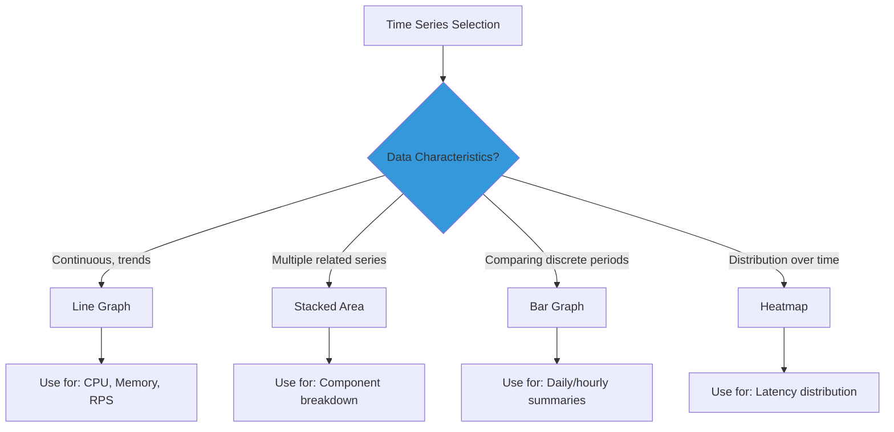

### Gauges and Single Stats

**When to Use**: Current state at a glance, thresholds, percentages

**Characteristics**:
- Immediate readability
- Clear threshold violations
- Limited historical context

**Best Practices**:
- Use color coding (green/yellow/red)
- Show trend indicator (up/down arrow)
- Include sparkline for mini-trend
- Display comparison to baseline or target

### Heatmaps

**When to Use**: Distribution visualization, pattern detection, anomaly identification

**Applications**:
- Latency percentiles over time
- Request distribution across servers
- Error patterns across services
- Resource utilization patterns

**Theory**: Heatmaps leverage pre-attentive processing—humans detect color variations before conscious thought, making patterns instantly visible.

### Tables

**When to Use**: Exact values needed, sorting/filtering required, multiple dimensions

**Best Practices**:
- Limit to 10-20 rows for dashboard views
- Use conditional formatting for thresholds
- Enable sorting on key columns
- Include pagination for larger datasets
- Link to detailed logs (see [02-logging.md](02-logging.md))

### Topology Graphs

**When to Use**: Service dependencies, traffic flow, distributed system visualization

**Integration with Tracing**: Reference [07-distributed-tracing.md](07-distributed-tracing.md) for service mesh visualization

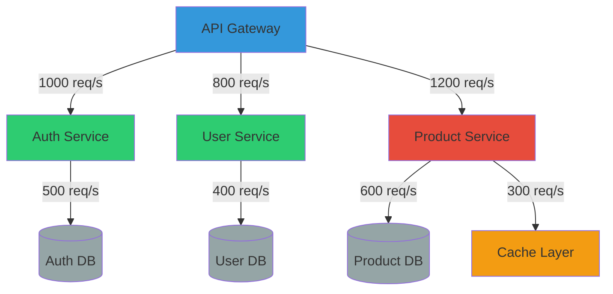

## Dashboard Layers

### Layer 1: Executive Summary

**Audience**: Leadership, non-technical stakeholders

**Content**:
- SLO compliance (see [10-service-level-objectives.md](10-service-level-objectives.md))
- Business KPIs (revenue, conversion rate, user satisfaction)
- Overall system health score
- Incident count and MTTR trends
- Cost metrics

**Update Frequency**: Minutes to hours

**Design**: High-level, simple visualizations, minimal technical jargon

### Layer 2: Service Health

**Audience**: SRE, Operations, Development Teams

**Content**:
- RED metrics per service
- Service dependencies and health
- Error rates and types
- Resource utilization (USE method)
- Recent deployments and changes

**Update Frequency**: Seconds to minutes

**Design**: Moderate detail, technical metrics, actionable information

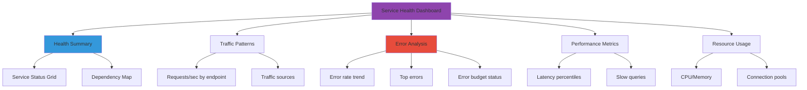

### Layer 3: Component Deep Dive

**Audience**: Developers, Database Admins, Platform Engineers

**Content**:
- Detailed metrics for specific components
- Query performance (logs from [05-log-aggregation.md](05-log-aggregation.md))
- Cache hit rates
- Message queue depths
- Database connection pools
- Trace analysis (see [04-tracing.md](04-tracing.md))

**Update Frequency**: Real-time to seconds

**Design**: High detail, technical depth, correlation views

### Layer 4: Infrastructure

**Audience**: Infrastructure team, Cloud ops

**Content**:
- Host-level metrics (CPU, memory, disk, network)
- Container/pod metrics (Kubernetes)
- Network throughput and errors
- Storage IOPS and latency
- Cloud provider metrics

**Update Frequency**: Seconds to minutes

**Design**: Resource-focused, capacity trending, anomaly detection

## Integration with Observability Pillars

### Unified Observability Dashboard

Combining all three pillars from [01-introduction.md](01-introduction.md):

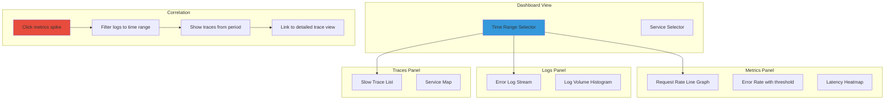

### Correlation Patterns

**Metric Anomaly → Log Investigation**:
1. Spike in error rate detected on metrics dashboard
2. Click timestamp to filter logs
3. Identify error messages and stack traces
4. Reference [02-logging.md](02-logging.md) for structured log parsing

**Log Error → Trace Analysis**:
1. High-severity error appears in logs
2. Extract trace ID from log entry
3. Open trace in visualization
4. Reference [07-distributed-tracing.md](07-distributed-tracing.md) for trace analysis

**Performance Degradation → Full Context**:
1. Latency increase visible in metrics
2. Correlate with deployment events
3. Examine logs for new errors
4. Analyze traces for bottleneck services
5. Check infrastructure metrics for resource constraints

## Dashboard Patterns

### The Golden Dashboard Pattern

One comprehensive dashboard that serves multiple use cases:

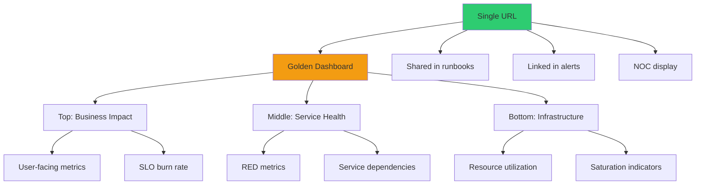

### The Drill-Down Pattern

Progressive detail revelation:

**Level 1**: All services overview
**Level 2**: Click service → Service dashboard
**Level 3**: Click metric → Detailed analysis
**Level 4**: Click time range → Log/trace context

Implementation: Use dashboard variables and URL parameters to maintain context across navigation.

### The Comparison Pattern

Side-by-side comparison for:
- Before/after deployment
- Different service versions
- Multiple environments (staging vs production)
- Different customer segments

**Implementation**: Use dashboard templating with repeated panels using different variable values.

### The Anomaly Pattern

Focus on deviations from normal:

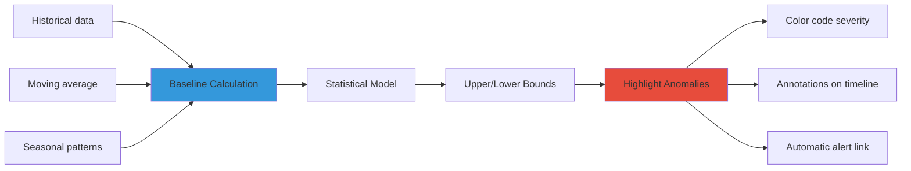

### The Context Panel Pattern

Persistent information across dashboard:
- Current deployment version
- Active incidents
- Recent changes (link to CI/CD)
- On-call contact info
- Links to runbooks
- SLO error budget remaining

## Query Optimization

### Query Design Principles

**Cardinality Awareness**: 
- High cardinality labels (user_id, request_id) create exponential metric growth
- Use sparingly in queries
- Consider pre-aggregation for common queries

**Time Range Optimization**:
- Longer ranges = more data = slower queries
- Use downsampling for long-term trends
- Implement query result caching

**Aggregation Strategy**:
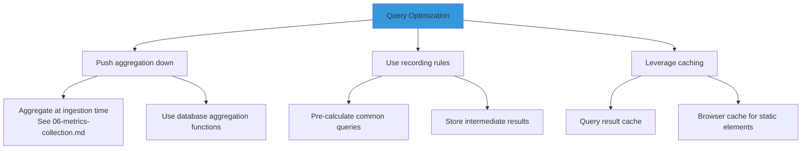

### Recording Rules

Pre-calculate expensive queries and store as new metrics:

**Benefits**:
- Faster dashboard load times
- Consistent calculations across dashboards
- Reduced query load on backend

**Trade-offs**:
- Additional storage overhead
- Latency in rule evaluation
- Less flexibility (fixed aggregation)

**When to Use**:
- Queries used across multiple dashboards
- Complex aggregations (multi-level grouping)
- Historical data analysis
- SLO calculations (reference [10-service-level-objectives.md](10-service-level-objectives.md))

### Query Timeout Strategies

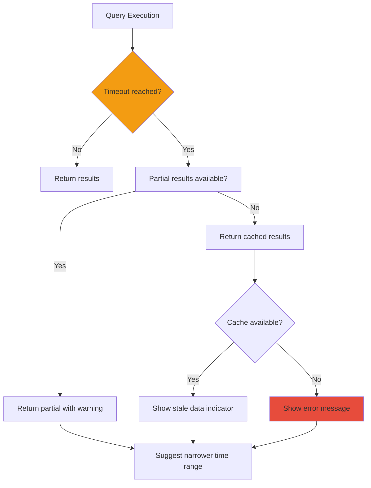

## Real-Time vs Historical Views

### Real-Time Dashboards

**Characteristics**:
- Update frequency: 1-10 seconds
- Data lag: Minimal (seconds)
- Use case: Active incident response, live operations

**Challenges**:
- High query load on backend
- Network bandwidth consumption
- Browser performance impact
- Data freshness vs system load trade-off

**Best Practices**:
- Use WebSocket connections for true push updates
- Implement client-side throttling
- Show data freshness indicator
- Provide pause/resume functionality
- Reference [08-alerting-and-monitoring.md](08-alerting-and-monitoring.md) for alert integration

### Historical Analysis Dashboards

**Characteristics**:
- Static time ranges or large windows
- Data from minutes to years old
- Use case: Trend analysis, capacity planning, post-mortems

**Optimizations**:
- Use downsampled data for long time ranges
- Pre-aggregate common calculations
- Enable aggressive caching
- Support CSV/JSON export

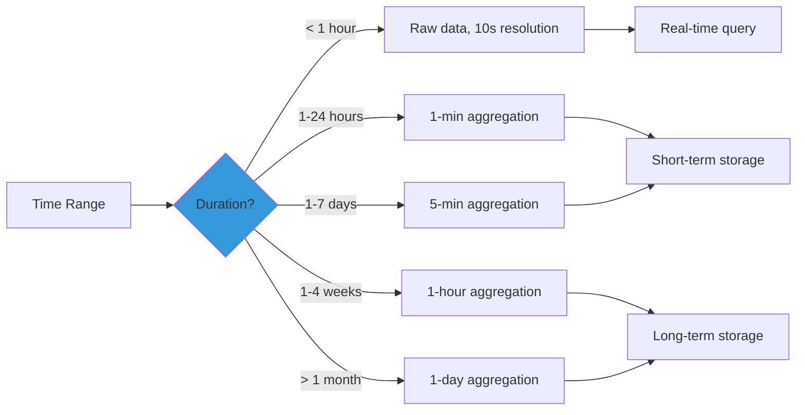

### Hybrid Approach

**Recent + Historical**: Show detailed recent data with historical context
- Last hour at 10s resolution
- Previous 24 hours at 1-min resolution
- Previous 7 days as reference line

## Dashboard Management

### Dashboard as Code

**Principles**:
- Store dashboard definitions in version control
- Treat dashboards like application code
- Enable code review process
- Support CI/CD for dashboard deployment

**Benefits**:
- Version history and rollback capability
- Collaboration through pull requests
- Consistency across environments
- Disaster recovery

**Implementation**:
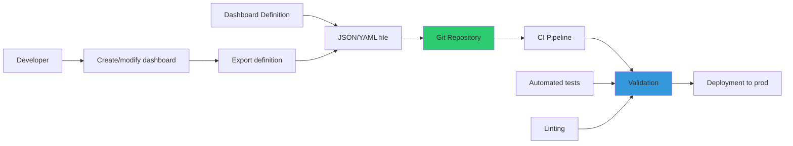

### Templating and Variables

**Dashboard Variables**:
- Environment (production, staging, dev)
- Service name
- Region/datacenter
- Time range
- Host/container ID

**Benefits**:
- One dashboard serves multiple contexts
- Reduced duplication
- Consistent layouts across services

**Example Pattern**:
```
Dashboard: Service Health
Variables:
  - $service: dropdown (api, web, worker)
  - $environment: dropdown (prod, staging)
  - $region: multi-select (us-east, us-west, eu-central)

Panel queries automatically use: {service="$service", env="$environment", region=~"$region"}
```

### Dashboard Organization

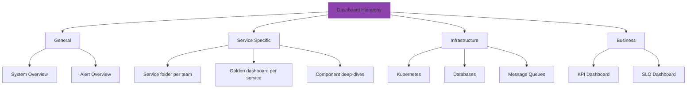

**Folder Structure**:
- **General**: Cross-cutting dashboards
- **Team Folders**: Organized by service ownership
- **Platform**: Infrastructure and shared services
- **Archived**: Old dashboards kept for reference

### Dashboard Lifecycle

**Creation**:
1. Identify monitoring need
2. Define audience and use case
3. Select metrics from [03-metrics.md](03-metrics.md)
4. Design layout
5. Implement queries
6. Peer review
7. Deploy to production

**Maintenance**:
- Regular review (quarterly)
- Remove unused panels
- Update for service changes
- Optimize slow queries
- Refresh visual design

**Deprecation**:
- Mark as deprecated with annotation
- Set expiration date
- Archive after grace period
- Document replacement dashboard

### Access Control

**Role-Based Access**:
- **Viewers**: Read-only access, most users
- **Editors**: Can create/modify dashboards
- **Admins**: Full control, manage permissions

**Dashboard Sharing**:
- Public links (read-only, no auth)
- Snapshots (point-in-time captures)
- Embedded dashboards (iframes in other tools)
- API access for programmatic retrieval

## Anti-Patterns

### The Vanity Dashboard

**Problem**: Dashboards showing metrics that look impressive but provide no actionable insights.

**Examples**:
- Total requests ever (monotonically increasing)
- Uptime percentage without SLO context
- Metrics that are always green

**Solution**: Every panel should answer "what action would I take if this looks wrong?"

### The Kitchen Sink Dashboard

**Problem**: Too many panels, too much information, no clear story.

**Symptoms**:
- 50+ panels on one dashboard
- Requires excessive scrolling
- Unrelated metrics grouped together
- No clear target audience

**Solution**: Split into multiple focused dashboards using the layer approach above.

### The Stale Dashboard

**Problem**: Dashboard exists but nobody uses it or maintains it.

**Symptoms**:
- Queries return no data
- References deleted services
- Last modified > 1 year ago

**Solution**: Regular dashboard audits, usage tracking, deprecation process.

### The Mystery Query

**Problem**: Complex queries with no documentation, unclear what they measure.

**Symptoms**:
- No panel descriptions
- Unclear units or labels
- Nested subqueries without comments

**Solution**: 
- Add panel descriptions explaining what is measured
- Include query explanation in dashboard documentation
- Use meaningful legend names
- Link to metric definitions from [06-metrics-collection.md](06-metrics-collection.md)

### The Alert-as-Dashboard

**Problem**: Using dashboards for alerting instead of proper alert rules (see [08-alerting-and-monitoring.md](08-alerting-and-monitoring.md)).

**Why It Fails**:
- Requires human to watch dashboard
- No notification on threshold breach
- Delayed response to incidents

**Solution**: Create proper alerts, use dashboards for context and investigation.

### The Oversampled Dashboard

**Problem**: Queries returning too much data too frequently.

**Symptoms**:
- Browser performance issues
- High backend load
- Slow dashboard load times
- Unnecessary precision (showing milliseconds for day-long trends)

**Solution**:
- Use appropriate resolution for time range
- Implement downsampling
- Limit series cardinality
- Use recording rules for complex queries

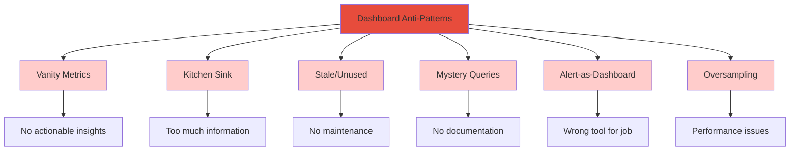

## Best Practices Summary

### Design
1. **Follow visual hierarchy**: Most important metrics top-left
2. **Use consistent colors**: Green = good, Red = bad, Yellow = warning
3. **Limit panels**: 6-12 panels per screen, max 20
4. **Group related metrics**: Use visual containers
5. **Provide context**: Include annotations for deploys, incidents

### Performance
6. **Optimize queries**: Use recording rules, appropriate time ranges
7. **Implement caching**: Query results, dashboard definitions
8. **Use downsampling**: Long time ranges don't need full resolution
9. **Limit cardinality**: Avoid high-cardinality labels in queries

### Maintenance
10. **Version control**: Store dashboards as code
11. **Document queries**: Explain what complex queries measure
12. **Regular reviews**: Quarterly dashboard audit
13. **Track usage**: Remove unused dashboards
14. **Maintain naming conventions**: Consistent titles and labels

### Integration
15. **Link to runbooks**: Provide troubleshooting context
16. **Connect to alerts**: Reference [08-alerting-and-monitoring.md](08-alerting-and-monitoring.md)
17. **Cross-link dashboards**: Build navigation hierarchy
18. **Embed trace links**: Connect to [07-distributed-tracing.md](07-distributed-tracing.md)
19. **Support log correlation**: Link to [05-log-aggregation.md](05-log-aggregation.md)

### Governance
20. **Define ownership**: Each dashboard has a maintainer
21. **Implement approval**: Peer review before production
22. **Control access**: Role-based permissions
23. **Support multi-tenancy**: Separate customer/team data

## References

### Internal Documentation
- [01-introduction.md](01-introduction.md) - Observability fundamentals and pillars
- [02-logging.md](02-logging.md) - Structured logging for dashboard integration
- [03-metrics.md](03-metrics.md) - Metric types and collection
- [04-tracing.md](04-tracing.md) - Distributed tracing concepts
- [05-log-aggregation.md](05-log-aggregation.md) - Log processing and querying
- [06-metrics-collection.md](06-metrics-collection.md) - Metrics instrumentation
- [07-distributed-tracing.md](07-distributed-tracing.md) - Trace analysis and visualization
- [08-alerting-and-monitoring.md](08-alerting-and-monitoring.md) - Alert integration
- [10-service-level-objectives.md](10-service-level-objectives.md) - SLO tracking in dashboards
- [11-tools-ecosystem.md](11-tools-ecosystem.md) - Dashboard tooling options
- [12-best-practices.md](12-best-practices.md) - Overall observability best practices

### Key Concepts
- **USE Method**: Framework for resource monitoring (Utilization, Saturation, Errors)
- **RED Method**: Service monitoring framework (Rate, Errors, Duration)
- **Four Golden Signals**: Google SRE monitoring principles
- **Information Architecture**: Organizing dashboards hierarchically
- **Progressive Disclosure**: Showing detail as needed
- **Correlation**: Linking metrics, logs, and traces

### Frameworks
- Visual hierarchy and Gestalt principles
- Dashboard as Code methodology
- Query optimization strategies
- Multi-layered dashboard architecture

---

## Advanced Topics

### Dynamic Dashboards

**Adaptive Layouts**: Dashboards that adjust based on context

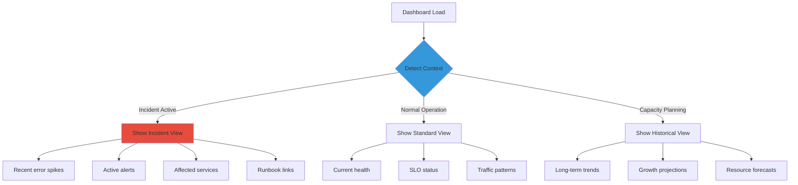

**Context-Aware Panels**:
- Show different metrics based on service state
- Adjust time ranges during incidents
- Highlight anomalies automatically
- Surface relevant logs dynamically

### Machine Learning Integration

**Anomaly Detection Visualization**:

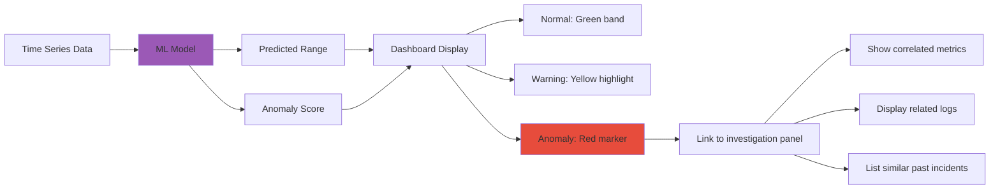

**Predictive Dashboards**:
- Forecast resource exhaustion
- Predict traffic patterns
- Estimate error budget depletion
- Project capacity needs

**Implementation Considerations**:
- Model training latency vs prediction freshness
- Confidence intervals and uncertainty visualization
- False positive management
- Explainability (why did the model flag this?)

### Multi-Cluster and Multi-Region Dashboards

**Global View Architecture**:

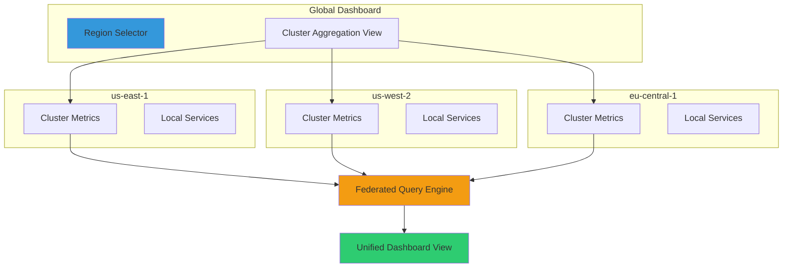

**Challenges**:
- Cross-region query latency
- Data federation complexity
- Time zone handling
- Inconsistent metric availability

**Solutions**:
- Regional data aggregation at source
- Asynchronous dashboard loading
- Cached global summaries
- Geo-distributed dashboard replicas

### Cost Visibility Dashboards

**Cloud Cost Attribution**:

```mermaid
graph TD
    A[Cost Dashboard] --> B[Total Cloud Spend]
    A --> C[Cost by Service]
    A --> D[Cost by Team]
    A --> E[Cost Efficiency Metrics]
    
    B --> B1[Trend over time]
    B --> B2[Budget vs actual]
    B --> B3[Forecast]
    
    C --> C1[Compute costs]
    C --> C2[Storage costs]
    C --> C3[Network egress]
    C --> C4[Observability costs]
    
    D --> D1[Team allocation]
    D --> D2[Showback/chargeback]
    
    E --> E1[Cost per request]
    E --> E2[Cost per user]
    E --> E3[Efficiency ratio]
    
    style A fill:#2ecc71
    style E fill:#f39c12
```

**Observability-Specific Costs**:
- Metrics ingestion volume
- Log storage costs
- Trace sampling overhead
- Dashboard query costs
- Retention policy impacts

**Optimization Strategies**:
- Identify high-cardinality metrics
- Review log verbosity levels
- Adjust sampling rates (see [04-tracing.md](04-tracing.md))
- Archive unused dashboards
- Implement data lifecycle policies

### Mobile and On-Call Dashboards

**Design Constraints**:
- Limited screen real estate
- Touch-based interaction
- Intermittent connectivity
- Battery/performance considerations

**Mobile-First Principles**:

```mermaid
graph LR
    A[Mobile Dashboard] --> B[Critical Only]
    A --> C[Large Touch Targets]
    A --> D[Offline Capable]
    A --> E[Quick Actions]
    
    B --> B1[Top 3-5 metrics]
    B --> B2[Current incident status]
    B --> B3[Recent alerts]
    
    C --> C1[Big buttons/links]
    C --> C2[Collapsible sections]
    
    D --> D1[Cache recent data]
    D --> D2[Show last refresh time]
    
    E --> E1[Acknowledge alert]
    E --> E2[Link to runbook]
    E --> E3[Escalate]
    
    style A fill:#3498db
```

**On-Call Specific Features**:
- Push notifications integration
- One-tap drill-downs
- Voice/chat integration
- Incident timeline view
- Quick escalation paths

### Collaborative Dashboards

**Shared Investigation Sessions**:

```mermaid
graph TD
    A[User 1 navigates dashboard] --> B[Cursor position shared]
    B --> C[User 2 sees cursor]
    
    A --> D[Time range selection]
    D --> E[All viewers updated]
    
    A --> F[Annotation added]
    F --> G[Visible to all]
    
    H[Chat integrated] --> I[Discussion panel]
    I --> J[Link to specific metrics]
    
    K[Session recording] --> L[Playback for post-mortem]
    
    style A fill:#3498db
    style E fill:#2ecc71
```

**Features**:
- Real-time cursor tracking
- Synchronized time ranges
- Collaborative annotations
- Built-in chat/comments
- Session replay
- Shareable investigation links

**Use Cases**:
- Incident war rooms
- Training sessions
- Post-mortem analysis
- Cross-team collaboration

## Industry-Specific Dashboard Patterns

### E-commerce Platform

**Business-Critical Metrics**:
```mermaid
graph TB
    A[E-commerce Dashboard] --> B[Revenue Metrics]
    A --> C[User Experience]
    A --> D[Conversion Funnel]
    A --> E[Inventory Systems]
    
    B --> B1[Orders per second]
    B --> B2[Average order value]
    B --> B3[Payment success rate]
    
    C --> C1[Page load time]
    C --> C2[Search latency]
    C --> C3[Checkout errors]
    
    D --> D1[Browse → Cart rate]
    D --> D2[Cart → Checkout rate]
    D --> D3[Checkout → Purchase rate]
    D --> D4[Abandon rate]
    
    E --> E1[Stock sync lag]
    E --> E2[Out of stock errors]
    
    style A fill:#2ecc71
    style B fill:#f39c12
```

**Key Correlations**:
- Payment latency vs conversion rate
- Search performance vs browse rate
- Checkout errors vs abandon rate

### Financial Services

**Regulatory and Compliance Focus**:

```mermaid
graph TD
    A[Financial Dashboard] --> B[Transaction Metrics]
    A --> C[Security Monitoring]
    A --> D[Compliance]
    A --> E[Availability SLAs]
    
    B --> B1[Transaction volume]
    B --> B2[Processing time]
    B --> B3[Failed transactions]
    B --> B4[Reconciliation status]
    
    C --> C1[Authentication failures]
    C --> C2[Suspicious patterns]
    C --> C3[Data access audit]
    
    D --> D1[Data retention compliance]
    D --> D2[Encryption status]
    D --> D3[Audit log completeness]
    
    E --> E1[Core banking uptime]
    E --> E2[API availability]
    E --> E3[Recovery time objectives]
    
    style A fill:#e74c3c
    style C fill:#f39c12
```

**Special Requirements**:
- Immutable audit trails
- Data residency visualization
- Regulatory report generation
- Incident documentation for compliance

### IoT and Edge Computing

**Distributed Device Monitoring**:

```mermaid
graph TB
    A[IoT Dashboard] --> B[Device Health]
    A --> C[Data Pipeline]
    A --> D[Edge Processing]
    A --> E[Connectivity]
    
    B --> B1[Online device count]
    B --> B2[Battery levels]
    B --> B3[Sensor accuracy]
    B --> B4[Firmware versions]
    
    C --> C1[Message throughput]
    C --> C2[Processing lag]
    C --> C3[Data loss rate]
    
    D --> D1[Edge CPU/memory]
    D --> D2[Local cache hit rate]
    D --> D3[Sync conflicts]
    
    E --> E1[Connection drops]
    E --> E2[Latency by region]
    E --> E3[Protocol errors]
    
    style A fill:#9b59b6
```

**Unique Challenges**:
- High device count (millions)
- Intermittent connectivity
- Firmware version fragmentation
- Geographic distribution
- Battery-constrained devices

### Media Streaming

**Quality of Experience (QoE)**:

```mermaid
graph TD
    A[Streaming Dashboard] --> B[Playback Quality]
    A --> C[CDN Performance]
    A --> D[Encoding Pipeline]
    A --> E[User Engagement]
    
    B --> B1[Buffering ratio]
    B --> B2[Startup time]
    B --> B3[Bitrate distribution]
    B --> B4[Error rate]
    
    C --> C1[Cache hit ratio]
    C --> C2[Origin requests]
    C --> C3[Bandwidth by region]
    
    D --> D1[Encoding queue depth]
    D --> D2[Transcode time]
    D --> D3[Storage costs]
    
    E --> E1[Concurrent viewers]
    E --> E2[Average watch time]
    E --> E3[Abandonment rate]
    
    style A fill:#e91e63
    style B fill:#f39c12
```

**Critical Metrics**:
- Video start failures (VSF)
- Rebuffering percentage
- Quality switches per session
- CDN efficiency

## Dashboard Testing and Validation

### Pre-Deployment Testing

**Query Validation**:

```mermaid
graph TD
    A[Dashboard Testing] --> B[Query Syntax Check]
    A --> C[Data Availability Check]
    A --> D[Performance Test]
    A --> E[Visual Regression]
    
    B --> B1[Parse query]
    B --> B2[Validate functions]
    B --> B3[Check label selectors]
    
    C --> C1[Verify metrics exist]
    C --> C2[Check data freshness]
    C --> C3[Validate time ranges]
    
    D --> D1[Measure query time]
    D --> D2[Check result size]
    D --> D3[Test different time ranges]
    
    E --> E1[Screenshot comparison]
    E --> E2[Layout validation]
    E --> E3[Responsive design check]
    
    style A fill:#3498db
    style D fill:#f39c12
```

**Automated Testing**:
- Synthetic dashboard loads
- Query performance benchmarks
- Data completeness checks
- Alert rule validation
- Cross-browser testing

### Post-Deployment Validation

**Health Checks**:
1. All panels load successfully
2. No query timeouts
3. Data freshness within SLA
4. No broken links
5. Access control working
6. Variables populate correctly

**Usage Monitoring**:
- Track dashboard views
- Identify unused panels
- Measure load times
- Monitor query costs
- Analyze user interactions

```mermaid
graph LR
    A[Dashboard Usage] --> B[View Count]
    A --> C[Load Performance]
    A --> D[Query Patterns]
    
    B --> E[Popular dashboards]
    B --> F[Unused dashboards]
    
    C --> G[Slow panels]
    C --> H[Timeout frequency]
    
    D --> I[Expensive queries]
    D --> J[Common filters]
    
    E --> K[Prioritize optimization]
    F --> L[Consider deprecation]
    G --> K
    I --> K
    
    style K fill:#2ecc71
    style L fill:#e74c3c
```

## Future Trends in Dashboard Technology

### Natural Language Querying

**Conversational Dashboards**:

```mermaid
graph TD
    A[User Question] --> B[NLP Engine]
    B --> C[Intent Recognition]
    
    C --> D[Query Generation]
    D --> E[Data Retrieval]
    E --> F[Visualization Selection]
    F --> G[Dashboard Panel]
    
    H["Show me API errors in the last hour"] --> B
    I["Compare CPU usage between prod and staging"] --> B
    J["What caused the latency spike at 2pm?"] --> B
    
    G --> K[Follow-up questions]
    K --> L["Why did this happen?"]
    K --> M["Show me related logs"]
    
    style B fill:#9b59b6
    style G fill:#2ecc71
```

**Capabilities**:
- Text-to-query translation
- Automatic visualization selection
- Context-aware follow-ups
- Natural language alerts

### AI-Assisted Root Cause Analysis

**Automated Investigation Workflows**:

```mermaid
graph TD
    A[Anomaly Detected] --> B[AI Analysis Engine]
    
    B --> C[Correlate metrics]
    B --> D[Analyze logs]
    B --> E[Examine traces]
    
    C --> F[Find similar patterns]
    D --> F
    E --> F
    
    F --> G[Rank probable causes]
    G --> H[Generate hypothesis]
    
    H --> I[Create investigation dashboard]
    I --> J[Suggest remediation]
    
    K[Historical incidents] --> B
    L[System topology] --> B
    M[Change events] --> B
    
    style B fill:#9b59b6
    style I fill:#2ecc71
```

### Augmented Reality Dashboards

**Spatial Computing Interfaces**:
- 3D service topology visualization
- Immersive data exploration
- Gesture-based interaction
- Holographic metric displays
- Virtual war rooms

**Use Cases**:
- Data center physical infrastructure monitoring
- Large-scale system visualization
- Collaborative incident response
- Training and demonstrations

### Edge-Native Dashboards

**Distributed Dashboard Architecture**:

```mermaid
graph TB
    subgraph "Edge Locations"
        A1[Edge Dashboard Instance]
        A2[Edge Dashboard Instance]
        A3[Edge Dashboard Instance]
    end
    
    subgraph "Central"
        B[Dashboard Definition Sync]
        C[Federated Query Router]
    end
    
    A1 --> D[Local Metrics Store]
    A2 --> E[Local Metrics Store]
    A3 --> F[Local Metrics Store]
    
    B --> A1
    B --> A2
    B --> A3
    
    G[User Query] --> C
    C --> A1
    C --> A2
    C --> A3
    
    A1 --> H[Aggregated Result]
    A2 --> H
    A3 --> H
    
    style C fill:#3498db
    style H fill:#2ecc71
```

**Benefits**:
- Reduced latency for regional teams
- Local data sovereignty compliance
- Resilience to network partitions
- Lower bandwidth costs

## Conclusion

Visualization dashboards are the lens through which we understand complex distributed systems. They transform the three pillars of observability—metrics (see [03-metrics.md](03-metrics.md)), logs (see [02-logging.md](02-logging.md)), and traces (see [04-tracing.md](04-tracing.md))—into actionable insights that drive operational excellence.

### Key Takeaways

1. **Design for Your Audience**: Different stakeholders need different views—executives need business context, engineers need technical depth

2. **Optimize Relentlessly**: Query performance directly impacts decision-making speed during incidents

3. **Embrace Hierarchy**: Layer your dashboards from high-level summaries to detailed diagnostics

4. **Automate Everything**: Dashboard definitions should be code, tested and versioned like any other software

5. **Integrate Deeply**: Connect dashboards to alerts ([08-alerting-and-monitoring.md](08-alerting-and-monitoring.md)), runbooks, and SLOs ([10-service-level-objectives.md](10-service-level-objectives.md))

6. **Maintain Rigorously**: Dashboards decay without regular review and updates

7. **Correlate Continuously**: The power of observability comes from connecting metrics, logs, and traces

### The Path Forward

As systems grow more complex and distributed, dashboards must evolve from static displays to intelligent assistants that:
- Predict problems before they occur
- Suggest remediation steps automatically
- Adapt to context and user intent
- Reduce cognitive load through smart aggregation

The future of dashboards lies not just in displaying data, but in transforming it into understanding—making the invisible visible, the complex comprehensible, and the actionable obvious.

---

**Next Steps**: 
- Review [10-service-level-objectives.md](10-service-level-objectives.md) to understand how dashboards support SLO tracking
- Explore [11-tools-ecosystem.md](11-tools-ecosystem.md) for specific dashboard platform options
- Reference [12-best-practices.md](12-best-practices.md) for holistic observability implementation guidance

**Related Reading**:
- [01-introduction.md](01-introduction.md) - Foundation concepts
- [06-metrics-collection.md](06-metrics-collection.md) - Instrumenting applications for dashboard metrics
- [07-distributed-tracing.md](07-distributed-tracing.md) - Visualizing request flows