# 10 - Service Level Objectives (SLOs)

## Table of Contents
- [Introduction](#introduction)
- [Core Concepts and Definitions](#core-concepts-and-definitions)
- [The SLO Framework](#the-slo-framework)
- [Service Level Indicators (SLIs)](#service-level-indicators-slis)
- [Defining Effective SLOs](#defining-effective-slos)
- [Error Budgets](#error-budgets)
- [SLO Implementation](#slo-implementation)
- [Measuring and Monitoring SLOs](#measuring-and-monitoring-slos)
- [SLO-Driven Alerting](#slo-driven-alerting)
- [Multi-Window Multi-Burn-Rate Alerts](#multi-window-multi-burn-rate-alerts)
- [SLO Dashboards](#slo-dashboards)
- [Error Budget Policies](#error-budget-policies)
- [SLOs for Different Service Types](#slos-for-different-service-types)
- [Common Pitfalls and Anti-Patterns](#common-pitfalls-and-anti-patterns)
- [SLO Lifecycle Management](#slo-lifecycle-management)
- [Advanced Topics](#advanced-topics)
- [References](#references)

## Introduction

Service Level Objectives (SLOs) represent the bridge between technical operations and business outcomes. They define the target level of reliability that a service should provide to its users, creating a shared language between engineering teams, product managers, and business stakeholders.

### Why SLOs Matter

**Customer-Centric Reliability**: SLOs shift focus from internal metrics (like "five nines uptime") to user-experienced reliability. A service can have 99.9% uptime but still deliver a poor user experience if requests are slow or return errors.

**Risk Management**: SLOs provide a framework for making informed trade-offs between reliability investments and feature development. They answer the critical question: "How much reliability is enough?"

**Decision Framework**: When engineers must choose between fixing a bug, building a new feature, or improving infrastructure, SLOs provide objective criteria for prioritization.

**Organizational Alignment**: SLOs create shared accountability and understanding across teams, reducing conflicts between "move fast" and "don't break things" philosophies.

### The Reliability Hierarchy

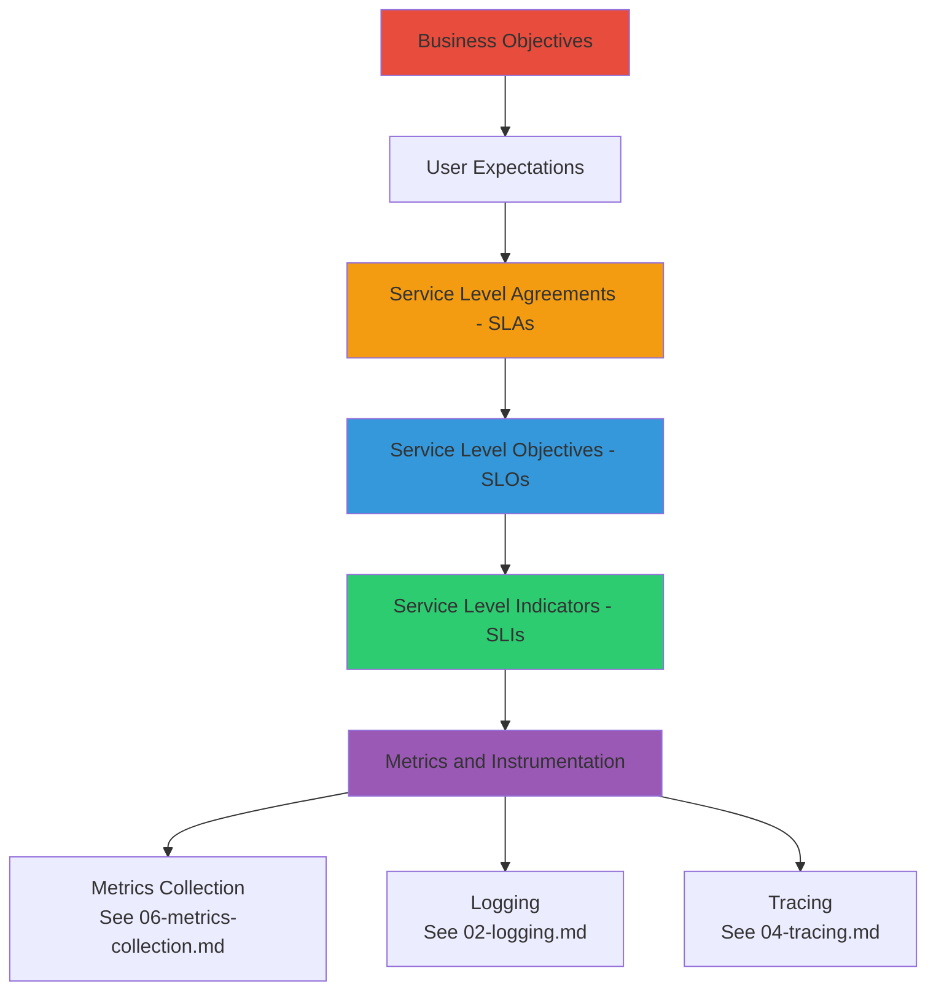

## Core Concepts and Definitions

### Service Level Indicator (SLI)

**Definition**: A carefully chosen quantitative measure of a service's behavior, expressed as a ratio of good events to total events.

**Mathematical Form**:
```
SLI = (Good Events / Total Events) × 100%
```

**Characteristics**:
- **Measurable**: Can be objectively calculated from data
- **User-Centric**: Reflects actual user experience
- **Actionable**: Clear when service is meeting/missing targets
- **Proportional**: Linear relationship with user satisfaction

**Example SLIs**:
- Request Success Rate: `successful_requests / total_requests`
- Request Latency: `requests_under_threshold / total_requests`
- Data Freshness: `fresh_data_reads / total_reads`
- Throughput: `completed_operations / requested_operations`

### Service Level Objective (SLO)

**Definition**: A target value or range for an SLI over a specific time window.

**Structure**: `SLI ≥ Target % over Time Window`

**Example SLOs**:
- 99.9% of requests succeed over a rolling 28-day window
- 95% of requests complete in < 200ms over the last 7 days
- 99.5% of data reads return fresh data (< 5 minutes old) per day

**Key Properties**:
- **Specific**: Clearly defined threshold
- **Measurable**: Based on quantifiable SLI
- **Time-Bound**: Explicit measurement window
- **Achievable**: Realistic given system constraints
- **User-Meaningful**: Correlates with user satisfaction

### Service Level Agreement (SLA)

**Definition**: A contractual agreement between service provider and customer that includes consequences (usually financial) for missing service level targets.

**Relationship to SLO**:
```
SLA Target < SLO Target < Internal Target
```

**Example**: 
- SLA: 99.5% availability (customer gets refund if missed)
- SLO: 99.9% availability (internal goal with error budget)
- Internal Target: 99.95% (engineering aspiration with buffer)

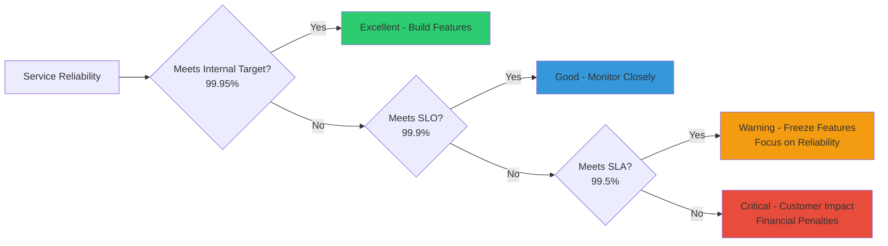

### Error Budget

**Definition**: The maximum amount of unreliability permitted by an SLO, expressed as the complement of the target.

**Calculation**:
```
Error Budget = 100% - SLO Target
```

**Example**:
- SLO: 99.9% success rate
- Error Budget: 0.1% (100% - 99.9%)
- Over 30 days: ~43 minutes of downtime allowed

**Philosophy**: Error budgets transform reliability from a binary "always up" requirement into a quantifiable resource that can be:
- **Spent** on risky deployments, experiments, or maintenance
- **Saved** by conservative operations
- **Invested** in reliability improvements
- **Monitored** to inform decision-making

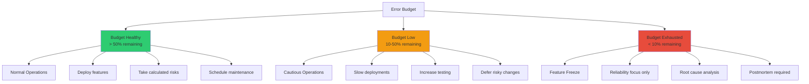

## The SLO Framework

### Google's SRE Approach

The Site Reliability Engineering (SRE) model pioneered by Google provides the foundational framework for modern SLO practice.

**Core Principles**:

1. **100% is the Wrong Target**: Perfect reliability is impossible and, more importantly, undesirable. Users cannot distinguish between 99.99% and 100% availability, but the engineering cost difference is enormous.

2. **Error Budgets Enable Innovation**: By accepting that some failure is acceptable, teams can move faster and take calculated risks.

3. **SLOs Drive Prioritization**: When error budget is healthy, build features. When exhausted, improve reliability. Clear, objective decision-making.

4. **Measure What Users Care About**: Internal metrics like CPU usage matter only insofar as they affect user-visible behavior.

### The SLO Development Process

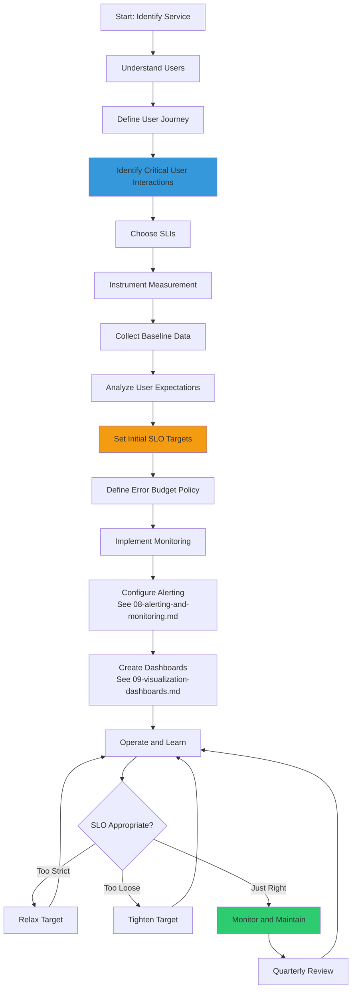

## Service Level Indicators (SLIs)

### Types of SLIs

#### 1. Request/Response SLIs

**Availability SLI**:
```
Availability = successful_requests / total_requests
```

**What counts as "successful"**:
- HTTP 2xx, 3xx status codes (not 4xx, 5xx)
- Completed within timeout
- Returned valid data
- No internal errors

**Latency SLI**:
```
Latency = requests_under_threshold / total_requests
```

**Threshold Selection**:
- Based on user perception thresholds
- Different thresholds for different operations
- Example: 200ms for API calls, 2s for page loads

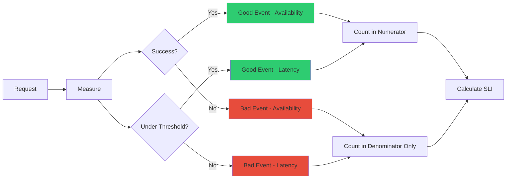

#### 2. Data Processing SLIs

**Freshness SLI**:
```
Freshness = records_processed_on_time / total_records
```

**Use Cases**:
- Batch processing pipelines
- Data analytics systems
- Cache update processes
- Search index updates

**Throughput SLI**:
```
Throughput = actual_processing_rate / expected_processing_rate
```

**Correctness SLI**:
```
Correctness = correct_output_records / total_output_records
```

#### 3. Storage SLIs

**Durability SLI**:
```
Durability = (total_writes - data_loss_events) / total_writes
```

**Read Availability**:
```
Read_Availability = successful_reads / total_read_requests
```

**Write Availability**:
```
Write_Availability = successful_writes / total_write_requests
```

### SLI Specification Template

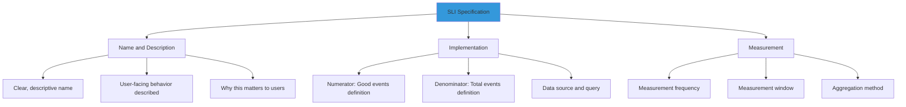

**Example Specification**:

**Name**: API Request Availability  
**Description**: The proportion of API requests that complete successfully without server errors  
**User Impact**: Failed requests prevent users from accessing their data  

**Numerator**: Count of HTTP requests with status code 2xx or 3xx  
**Denominator**: Count of all HTTP requests received  
**Data Source**: Application metrics (see [03-metrics.md](03-metrics.md))  
**Query**: `sum(rate(http_requests_total{status=~"2..|3.."}[5m])) / sum(rate(http_requests_total[5m]))`

**Measurement Frequency**: Every 5 minutes  
**Measurement Window**: Rolling 28 days  
**Aggregation**: Time-weighted average

## Defining Effective SLOs

### Setting Initial Targets

#### The Baseline Approach

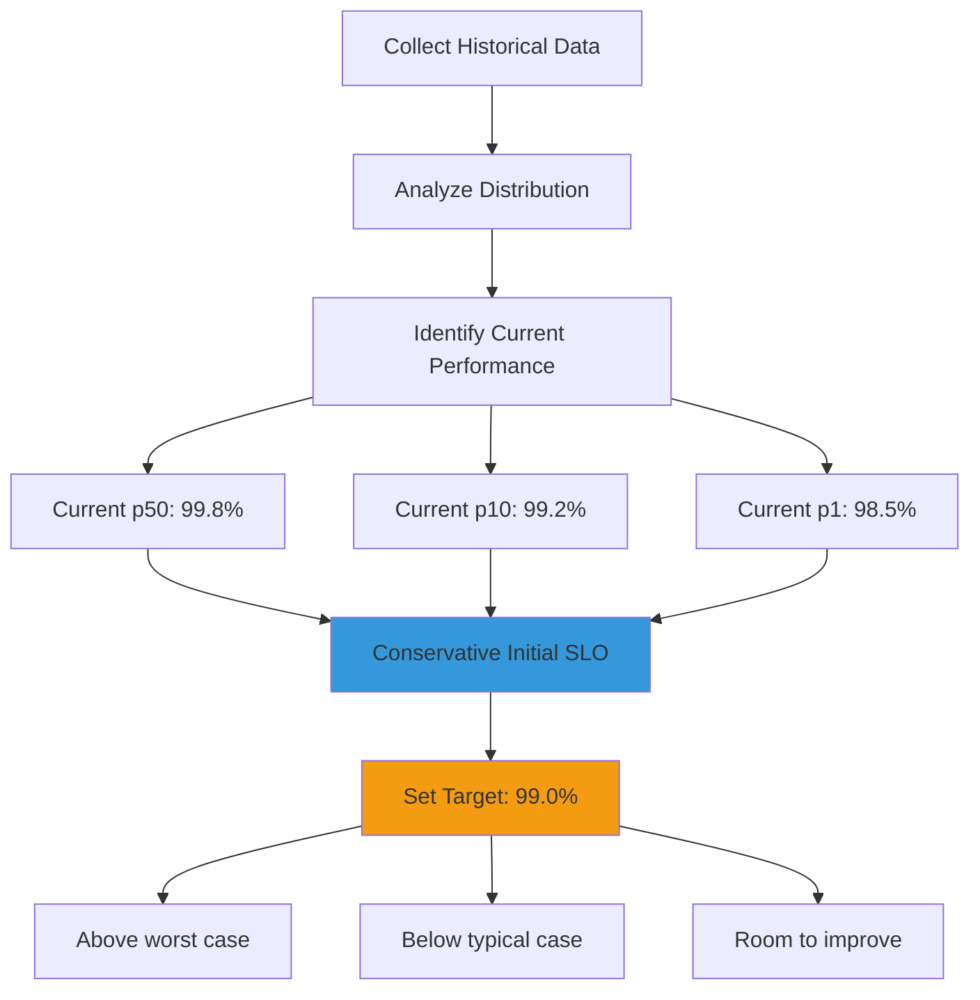

**Process**:
1. Measure current performance for 2-4 weeks
2. Calculate percentiles (p50, p90, p99)
3. Set initial SLO between p10 and p50
4. Provides buffer for variability
5. Iterate based on learning

#### The User Research Approach

**Steps**:
1. Conduct user satisfaction surveys
2. Correlate satisfaction with service metrics
3. Identify inflection points where satisfaction drops
4. Set SLO at these thresholds

**Example Finding**:
- Users satisfied when latency < 200ms: 95% happy
- Latency 200-400ms: 75% happy
- Latency > 400ms: 30% happy
- **Conclusion**: Set SLO at 95% of requests < 200ms

#### The Competitive Analysis Approach

Research industry standards and competitor SLAs:
- AWS S3: 99.9% availability SLA
- Google Cloud Storage: 99.95% availability SLA
- Azure Storage: 99.9% availability SLA

Set internal SLO above industry SLA standards to maintain competitive advantage.

### SLO Target Selection Criteria

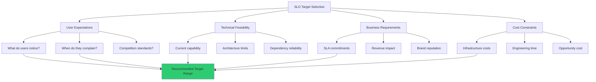

### Time Windows

**Short Windows (1-7 days)**:
- **Pros**: Fast feedback, quick detection of issues
- **Cons**: Sensitive to short outages, may trigger false urgency
- **Best For**: User-facing services, rapid iteration environments

**Medium Windows (28-30 days)**:
- **Pros**: Balanced sensitivity, standard monthly reporting
- **Cons**: Slower feedback on degradation
- **Best For**: Production services, SLA alignment

**Long Windows (90 days)**:
- **Pros**: Smooths short-term variance, strategic view
- **Cons**: Very slow feedback, masks recent problems
- **Best For**: Infrastructure services, capacity planning

**Rolling vs Calendar Windows**:

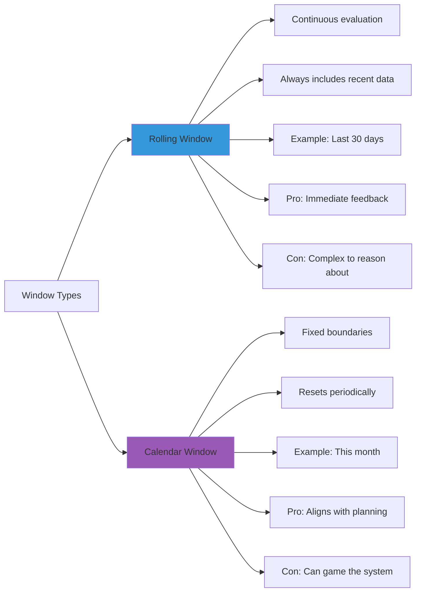

### Multiple SLOs for One Service

**Why Multiple SLOs**:
- Different aspects of reliability (availability, latency, correctness)
- Different user journeys (read path, write path, search)
- Different critical levels (critical, important, nice-to-have)

**Example: E-commerce Service**:

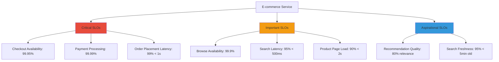

## Error Budgets

### Error Budget Calculation

**For Availability SLO**:

```
Monthly Error Budget = (1 - SLO) × Time Period
```

**Example (99.9% SLO over 30 days)**:
```
Error Budget = (1 - 0.999) × 30 days
            = 0.001 × 43,200 minutes
            = 43.2 minutes of downtime allowed
```

**For Request-Based SLO (1M requests/day)**:
```
Daily Error Budget = 1,000,000 × (1 - 0.999)
                   = 1,000 failed requests allowed
```

### Error Budget Consumption

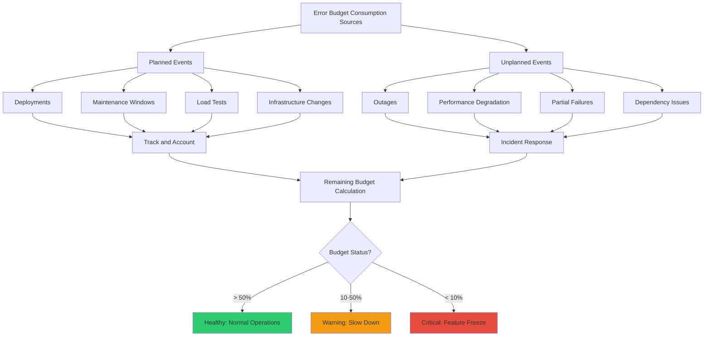

### Burn Rate

**Definition**: The rate at which error budget is being consumed, expressed as a multiple of the acceptable rate.

**Calculation**:
```
Burn Rate = (Actual Error Rate) / (SLO Error Rate)
```

**Example**:
- SLO: 99.9% (0.1% error budget)
- Current Error Rate: 1% (10× the budget)
- Burn Rate: 10×

**Interpretation**:
- Burn Rate = 1: Consuming budget at exactly the right pace
- Burn Rate < 1: Under budget, room for risk-taking
- Burn Rate > 1: Over budget, reliability work needed

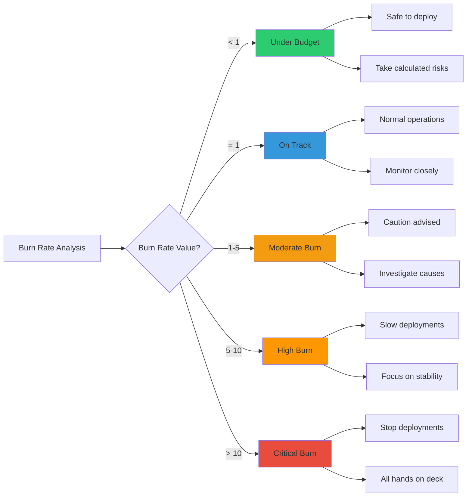

### Error Budget Policies

Explicit rules for how teams respond to error budget status:

**Example Policy**:

| Error Budget Remaining | Action Required |
|------------------------|-----------------|
| > 75% | Normal velocity, take risks, experiment |
| 50-75% | Normal velocity, standard testing |
| 25-50% | Reduce deployment frequency, increase testing |
| 10-25% | Feature freeze, reliability work only, executive approval for deploys |
| < 10% | Complete feature freeze, 24/7 on-call, mandatory postmortems |

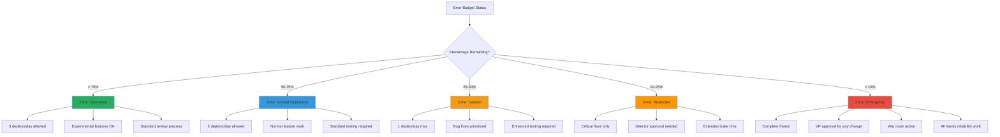

## SLO Implementation

### Implementation Architecture

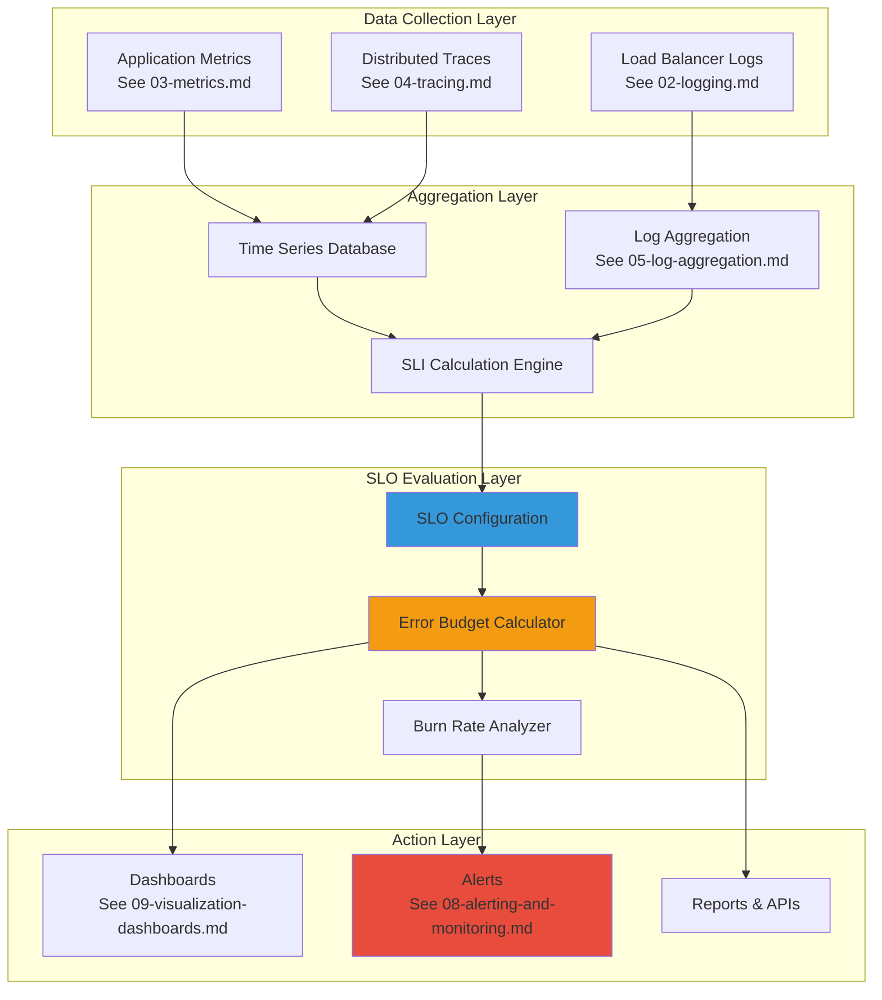

### SLI Implementation Patterns

#### Client-Side Measurement

**Advantages**:
- True user experience
- Includes network latency
- Captures client-side errors

**Disadvantages**:
- Requires client instrumentation
- Sampling bias (only successful connections)
- Privacy considerations

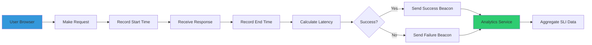

#### Server-Side Measurement

**Advantages**:
- Complete visibility
- No sampling bias
- Easier to implement

**Disadvantages**:
- Doesn't capture network issues
- Misses client-side failures
- May not reflect user experience

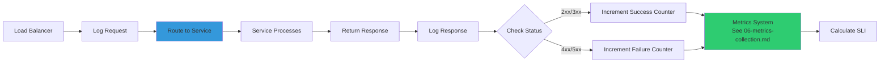

#### Synthetic Monitoring

**Use Case**: Proactive SLI measurement

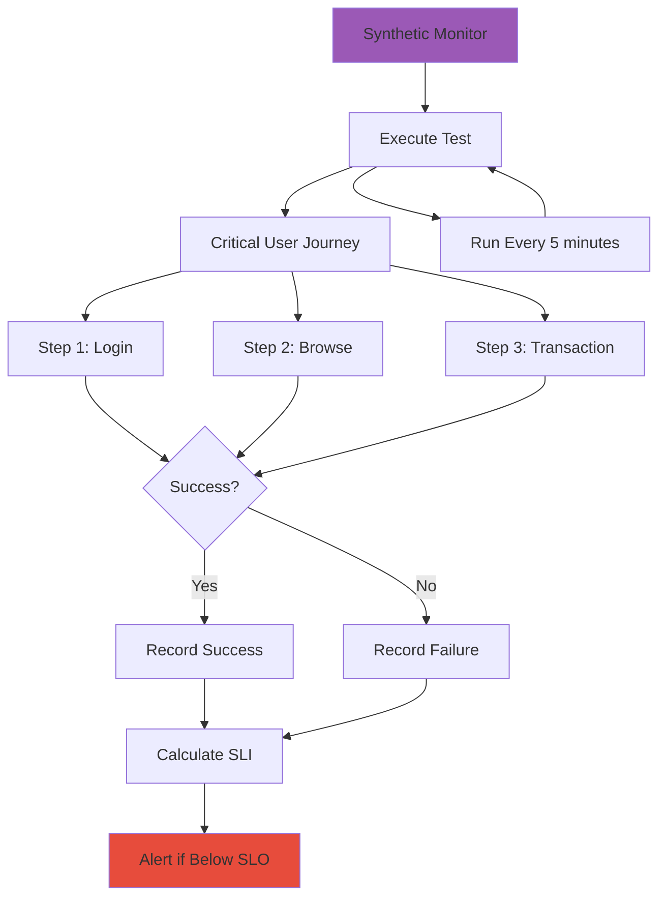

### Configuration Management

**SLO as Code Example** (YAML):

```yaml
slos:
  - name: api-availability
    description: API requests succeed without server errors
    service: user-api
    sli:
      type: availability
      numerator: http_requests_total{status=~"2..|3.."}
      denominator: http_requests_total
      data_source: prometheus
    objective:
      target: 99.9
      window: 28d
    error_budget_policy:
      - threshold: 75%
        action: normal_operations
      - threshold: 50%
        action: increase_caution
      - threshold: 25%
        action: feature_freeze
  
  - name: api-latency
    description: API requests complete within 200ms
    service: user-api
    sli:
      type: latency
      threshold_ms: 200
      numerator: http_request_duration_seconds_bucket{le="0.2"}
      denominator: http_request_duration_seconds_count
      data_source: prometheus
    objective:
      target: 95.0
      window: 28d
```

## Measuring and Monitoring SLOs

### SLI Query Patterns

#### Prometheus Examples

**Availability SLI**:
```promql
sum(rate(http_requests_total{status=~"2..|3.."}[5m]))
/
sum(rate(http_requests_total[5m]))
```

**Latency SLI (using histogram)**:
```promql
histogram_quantile(0.95, 
  sum(rate(http_request_duration_seconds_bucket[5m])) by (le)
) < 0.2
```

**Latency SLI (using buckets)**:
```promql
sum(rate(http_request_duration_seconds_bucket{le="0.2"}[5m]))
/
sum(rate(http_request_duration_seconds_count[5m]))
```

#### Error Budget Remaining

```promql
1 - (
  (1 - avg_over_time(sli_availability[28d]))
  /
  (1 - slo_target)
)
```

### Compliance Tracking

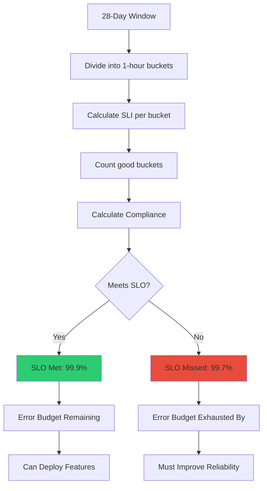

## SLO-Driven Alerting

### Traditional vs SLO-Based Alerting

**Traditional Alerting Problems**:
- Alert on symptoms, not user impact
- Too many false positives (alert fatigue)
- Threshold-based, not context-aware
- No connection to business objectives

**SLO-Based Alerting Benefits**:
- Alerts tied directly to user experience
- Reduced false positives
- Clear prioritization
- Actionable with business context

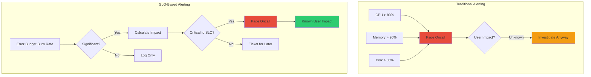

### Alerting on Burn Rate

**Single Window Alert** (Simple but Flawed):
```
Alert: IF burn_rate > threshold FOR duration
```

**Problem**: Cannot distinguish between:
- Short, severe outage (needs immediate attention)
- Long, slow degradation (needs investigation)

### Multi-Window Strategy

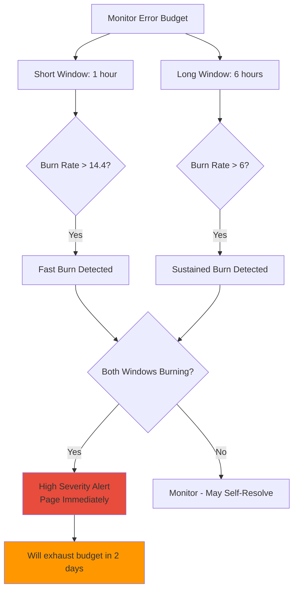

**Rationale**:
- **Short Window**: Catches sudden, severe issues
- **Long Window**: Confirms sustained problem
- **Both Required**: Reduces false positives

## Multi-Window Multi-Burn-Rate Alerts

### The Google SRE Model

**Four Alert Tiers** based on urgency and budget consumption:

```mermaid
graph TB
    A[Alert Tiers] --> B[Tier 1: Critical<br/>Page Immediately]
    A --> C[Tier 2: High<br/>Page Business Hours]
    A --> D[Tier 3: Medium<br/>Ticket]
    A --> E[Tier 4: Low<br/>Log Only]
    
    B --> B1[1h window: 14.4x burn]
    B --> B2[6h window: 6x burn]
    B --> B3[Budget exhausted in: 2 days]
    
    C --> C1[6h window: 6x burn]
    C --> C2[24h window: 3x burn]
    C --> C3[Budget exhausted in: 5 days]
    
    D --> D1[24h window: 3x burn]
    D --> D2[3d window: 1x burn]
    D --> D3[Budget exhausted in: 10 days]
    
    E --> E1[3d window: 1x burn]
    E --> E2[Information only]
    
    style B fill:#e74c3c
    style C fill:#ff9800
    style D fill:#f39c12
    style E fill:#3498db
```

### Burn Rate Calculation

**For 28-day SLO Window**:

```
Budget Consumption Rate = (Current Error Rate) / (SLO Error Rate)

Acceptable Burn Rate = 1.0 (consume budget evenly over 28 days)

Critical Burn Rate = 14.4
- Means: Will exhaust budget in 28/14.4 ≈ 2 days
- Action: Immediate page

High Burn Rate = 6.0
- Means: Will exhaust budget in 28/6 ≈ 5 days
- Action: Page during business hours

Medium Burn Rate = 3.0
- Means: Will exhaust budget in 28/3 ≈ 9 days
- Action: Create ticket
```

### Alert Configuration Example

**Tier 1: Critical (Page Immediately)**:
```yaml
alert: SLOBurnRateCritical
expr: |
  (
    (1 - (sum(rate(http_requests_total{status=~"2..|3.."}[1h])) / 
          sum(rate(http_requests_total[1h])))) > 14.4 * (1 - 0.999)
  )
  and
  (
    (1 - (sum(rate(http_requests_total{status=~"2..|3.."}[6h])) / 
          sum(rate(http_requests_total[6h])))) > 6 * (1 - 0.999)
  )
for: 5m
severity: critical
message: "Critical burn rate detected. Error budget will exhaust in 2 days."
```

**Tier 2: High (Page Business Hours)**:
```yaml
alert: SLOBurnRateHigh
expr: |
  (
    (1 - (sum(rate(http_requests_total{status=~"2..|3.."}[6h])) / 
          sum(rate(http_requests_total[6h])))) > 6 * (1 - 0.999)
  )
  and
  (
    (1 - (sum(rate(http_requests_total{status=~"2..|3.."}[24h])) / 
          sum(rate(http_requests_total[24h])))) > 3 * (1 - 0.999)
  )
for: 15m
severity: warning
message: "High burn rate detected. Error budget will exhaust in 5 days."
```

### Reset and Recovery

```mermaid
graph LR
    A[Incident Occurs] --> B[Burn Rate Spikes]
    B --> C[Alert Fires]
    C --> D[Team Responds]
    
    D --> E[Issue Resolved]
    E --> F[Error Rate Returns to Normal]
    
    F --> G{Short Window Recovered?}
    G -->|Yes| H[Alert Pending]
    
    H --> I{Long Window Recovered?}
    I -->|Yes| J[Alert Resolves]
    I -->|No| K[Continue Monitoring]
    
    K --> L[Wait for Long Window]
    L --> I
    
    style C fill:#e74c3c
    style J fill:#2ecc71
```

**Reset Time Considerations**:
- Short windows reset quickly (good for rapid feedback)
- Long windows take time (prevents premature "all clear")
- Both must recover for alert to clear

## SLO Dashboards

### Essential Dashboard Components

```mermaid
graph TB
    A[SLO Dashboard] --> B[Summary Section]
    A --> C[Detailed Metrics]
    A --> D[Historical View]
    A --> E[Diagnostic Tools]
    
    B --> B1[Current SLI Value]
    B --> B2[SLO Target with Visual Indicator]
    B --> B3[Error Budget Remaining %]
    B --> B4[Error Budget Consumption Rate]
    B --> B5[Time to Budget Exhaustion]
    
    C --> C1[SLI Over Time Graph]
    C --> C2[Good vs Bad Events]
    C --> C3[Burn Rate Chart]
    C --> C4[Recent Incidents]
    
    D --> D1[28-Day Trend]
    D --> D2[Month-over-Month Comparison]
    D --> D3[SLO Compliance History]
    
    E --> E1[Link to Related Logs<br/>See 05-log-aggregation.md]
    E --> E2[Link to Traces<br/>See 07-distributed-tracing.md]
    E --> E3[Recent Deployments]
    E --> E4[Active Alerts]
    
    style B fill:#3498db
    style E1 fill:#2ecc71
```

### Visual Design Patterns

**Status Indicators**:

```mermaid
graph LR
    A[Error Budget Status] --> B{Remaining %?}
    
    B -->|> 75%| C[Green: Healthy]
    B -->|50-75%| D[Blue: Normal]
    B -->|25-50%| E[Yellow: Caution]
    B -->|10-25%| F[Orange: Warning]
    B -->|< 10%| G[Red: Critical]
    
    C --> H[Large checkmark icon]
    D --> I[Progress bar - good]
    E --> J[Warning triangle]
    F --> K[Alert icon]
    G --> L[Error icon + blinking]
    
    style C fill:#27ae60
    style D fill:#3498db
    style E fill:#f1c40f
    style F fill:#ff9800
    style G fill:#e74c3c
```

**Burn Rate Visualization**:

```mermaid
graph TB
    A[Burn Rate Chart] --> B[Time Series Graph]
    B --> C[1x Burn Rate Line - Green]
    B --> D[3x Burn Rate Line - Yellow]
    B --> E[6x Burn Rate Line - Orange]
    B --> F[14x Burn Rate Line - Red]
    
    B --> G[Actual Burn Rate]
    
    G --> H{Current Rate?}
    H -->|< 1x| I[Under budget - Green area]
    H -->|1-3x| J[Normal - Blue area]
    H -->|3-6x| K[Elevated - Yellow area]
    H -->|6-14x| L[High - Orange area]
    H -->|> 14x| M[Critical - Red area]
    
    style I fill:#27ae60
    style J fill:#3498db
    style K fill:#f1c40f
    style L fill:#ff9800
    style M fill:#e74c3c
```

### Example Dashboard Layout

**Top Row - Status Summary**:
- Current SLI: 99.87% (Green)
- SLO Target: 99.9%
- Error Budget: 30% remaining (Yellow)
- Projected Exhaustion: 12 days

**Middle Row - Time Series**:
- SLI over 28 days with SLO threshold line
- Error budget consumption over time
- Burn rate with threshold bands

**Bottom Row - Context**:
- Top error types from logs
- Slow requests from traces  
- Recent deployments timeline
- Active alerts list

Reference [09-visualization-dashboards.md](09-visualization-dashboards.md) for detailed dashboard design patterns.

## Error Budget Policies

### Policy Framework

**Purpose**: Define clear, agreed-upon actions based on error budget status.

**Key Stakeholders**:
- Engineering (implements policy)
- Product (affected by feature freeze)
- SRE (enforces policy)
- Leadership (approves exceptions)

```mermaid
graph TD
    A[Error Budget Policy] --> B[Measurement]
    A --> C[Thresholds]
    A --> D[Actions]
    A --> E[Exceptions]
    A --> F[Review Process]
    
    B --> B1[How is budget calculated?]
    B --> B2[What time window?]
    B --> B3[How often evaluated?]
    
    C --> C1[Normal operations: > 50%]
    C --> C2[Caution: 25-50%]
    C --> C3[Restricted: 10-25%]
    C --> C4[Emergency: < 10%]
    
    D --> D1[Normal: Standard velocity]
    D --> D2[Caution: Slow down deploys]
    D --> D3[Restricted: Feature freeze]
    D --> D4[Emergency: All-hands reliability]
    
    E --> E1[Who can approve?]
    E --> E2[What justification required?]
    E --> E3[How is exception tracked?]
    
    F --> F1[When to review policy?]
    F --> F2[How to update thresholds?]
    
    style A fill:#3498db
    style D fill:#f39c12
```

### Sample Error Budget Policy

**Service: User Authentication API**  
**SLO: 99.9% availability over 28 days**  
**Error Budget: 43.2 minutes per month**

| Budget Remaining | Development Velocity | Deployment Frequency | Required Approvals | On-Call Level |
|------------------|---------------------|----------------------|-------------------|---------------|
| 75-100% | Normal | Up to 5/day | Engineering Lead | Standard rotation |
| 50-75% | Normal | Up to 3/day | Engineering Lead | Standard rotation |
| 25-50% | Reduced | Up to 1/day | Engineering Lead + SRE | Enhanced on-call |
| 10-25% | Minimal | Only critical fixes | Director + VP Engineering | 24/7 coverage |
| 0-10% | Zero | Complete freeze | VP Engineering only | All-hands war room |

**Automatic Actions**:
- Budget < 25%: Automated notification to leadership
- Budget < 10%: Automated CI/CD pipeline restriction
- Budget exhausted: Automated deploy block (manual override required)

### Policy Enforcement Mechanisms

```mermaid
graph TB
    A[Code Commit] --> B[CI Pipeline]
    B --> C{Check Error Budget}
    
    C -->|> 50%| D[Standard Tests]
    C -->|25-50%| E[Enhanced Tests]
    C -->|10-25%| F[Extended Tests + Manual Approval]
    C -->|< 10%| G[Block: Feature Freeze Active]
    
    D --> H[Deploy to Staging]
    E --> H
    F --> I[Approval Required]
    
    I -->|Approved| H
    I -->|Rejected| J[Return to Development]
    
    H --> K{Production Deploy?}
    K --> L[Check Budget Again]
    L --> M{Still Safe?}
    
    M -->|Yes| N[Deploy to Production]
    M -->|No| O[Cancel Deploy]
    
    G --> P[Create Exception Request]
    P --> Q{Approved by VP?}
    Q -->|Yes| H
    Q -->|No| J
    
    style G fill:#e74c3c
    style N fill:#2ecc71
    style O fill:#ff9800
```

### Exception Process

**When Exceptions Are Appropriate**:
- Critical security patches
- Data loss prevention
- Regulatory compliance
- Revenue-impacting bugs

**Exception Request Template**:
```markdown
## Error Budget Exception Request

**Service**: [Service Name]
**Current Error Budget**: [X%] remaining
**Requested Action**: [Deploy/Change Description]
**Urgency**: [Critical/High/Medium]

**Business Justification**:
[Explain why this cannot wait for budget recovery]

**Risk Assessment**:
- Expected error budget impact: [X%]
- Rollback plan: [Description]
- Mitigation measures: [List]

**Approval Required From**:
- [ ] Engineering Manager
- [ ] SRE Lead
- [ ] Director of Engineering (if < 25% budget)
- [ ] VP Engineering (if < 10% budget)

**Tracking**:
- Exception granted: [Yes/No]
- Actual impact: [Measured post-deploy]
- Postmortem required: [Yes/No]
```

## SLOs for Different Service Types

### User-Facing Services

**Characteristics**:
- Direct user interaction
- Synchronous request/response
- Latency-sensitive

**Recommended SLIs**:
1. **Availability**: Request success rate
2. **Latency**: Request completion time (p95, p99)
3. **Correctness**: Proper response content

**Example SLOs**:
```yaml
service: web-frontend
slos:
  - name: availability
    target: 99.9%
    window: 28d
    
  - name: latency-p95
    target: 95%  # 95% of requests under 200ms
    threshold: 200ms
    window: 28d
    
  - name: latency-p99
    target: 99%  # 99% of requests under 1000ms
    threshold: 1000ms
    window: 28d
```

### Background Processing Services

**Characteristics**:
- Asynchronous processing
- Batch operations
- Throughput-focused

**Recommended SLIs**:
1. **Throughput**: Items processed per time unit
2. **Freshness**: Time from creation to processing
3. **Completeness**: Percentage of items processed

```mermaid
graph LR
    A[Data Pipeline SLIs] --> B[Freshness]
    A --> C[Throughput]
    A --> D[Correctness]
    
    B --> B1[95% processed within 5 minutes]
    C --> C1[10,000 items/second minimum]
    D --> D1[99.9% data validation passed]
    
    style A fill:#9b59b6
```

**Example SLOs**:
```yaml
service: email-processor
slos:
  - name: freshness
    target: 95%
    threshold: 300s  # 5 minutes
    window: 24h
    description: "95% of emails processed within 5 minutes of arrival"
    
  - name: throughput
    target: 99%
    threshold: 1000  # emails per minute
    window: 7d
    description: "Maintain minimum 1000 emails/min throughput 99% of the time"
```

### Data Storage Services

**Characteristics**:
- Read and write operations
- Different SLOs for reads vs writes
- Durability critical

**Recommended SLIs**:
1. **Read Availability**
2. **Write Availability**
3. **Read Latency**
4. **Write Latency**
5. **Durability**

```mermaid
graph TB
    A[Storage Service SLOs] --> B[Read Path]
    A --> C[Write Path]
    A --> D[Data Integrity]
    
    B --> B1[Availability: 99.99%]
    B --> B2[Latency p99: < 100ms]
    
    C --> C1[Availability: 99.9%]
    C --> C2[Latency p99: < 500ms]
    C --> C3[Durability: 99.999999999%]
    
    D --> D1[Correctness: 100%]
    D --> D2[Consistency checks pass]
    
    style A fill:#3498db
    style C3 fill:#e74c3c
```

### API Services

**Characteristics**:
- Third-party integrations
- Rate limiting
- Multiple client types

**Recommended SLIs**:
1. **Availability** (per endpoint)
2. **Latency** (per endpoint)
3. **Rate Limit Success**

**Example with Multi-Class SLOs**:
```yaml
service: public-api
slos:
  # Critical endpoints - stricter SLO
  - name: auth-availability
    target: 99.95%
    endpoints: ["/auth/login", "/auth/token"]
    window: 28d
    
  # Standard endpoints
  - name: data-availability
    target: 99.9%
    endpoints: ["/users/*", "/products/*"]
    window: 28d
    
  # Best-effort endpoints
  - name: analytics-availability
    target: 99%
    endpoints: ["/analytics/*", "/reports/*"]
    window: 28d
```

### Mobile Backend Services

**Characteristics**:
- Intermittent connectivity
- Background sync
- Push notifications

**Recommended SLIs**:
1. **API Availability**
2. **API Latency** (considering mobile networks)
3. **Push Notification Delivery**
4. **Sync Success Rate**

```mermaid
graph TD
    A[Mobile Backend SLOs] --> B[Online Operations]
    A --> C[Offline-First Features]
    A --> D[Push Notifications]
    
    B --> B1[API availability: 99.9%]
    B --> B2[Latency p95 < 1s on 3G]
    
    C --> C1[Sync success: 99%]
    C --> C2[Conflict resolution: 99.9%]
    
    D --> D1[Delivery rate: 98%]
    D --> D2[Delivery latency < 30s: 95%]
    
    style A fill:#3498db
```

## Common Pitfalls and Anti-Patterns

### Anti-Pattern 1: The Vanity SLO

**Problem**: Setting SLOs that look impressive but don't reflect user experience.

**Example**: "99.99% uptime" when users actually care about request success rate.

```mermaid
graph LR
    A[Server Uptime: 99.99%] --> B[Looks Great!]
    B --> C[But...]
    C --> D[50% of requests failing]
    C --> E[Latency 10 seconds]
    C --> F[Wrong data returned]
    
    D --> G[Users Unhappy]
    E --> G
    F --> G
    
    style A fill:#2ecc71
    style G fill:#e74c3c
```

**Solution**: Measure what users experience, not what makes metrics look good.

### Anti-Pattern 2: Too Many SLOs

**Problem**: Creating SLOs for every possible metric.

**Symptoms**:
- 20+ SLOs per service
- Constant error budget exhaustion
- Alert fatigue
- Unable to prioritize

**Solution**: 
- Start with 2-3 critical SLOs
- Focus on user-impacting metrics
- Consolidate related SLOs

```mermaid
graph TD
    A[Too Many SLOs] --> B[Developer Confusion]
    A --> C[Split Focus]
    A --> D[Alert Fatigue]
    
    B --> E[Which SLO matters most?]
    C --> F[Can't improve everything]
    D --> G[Ignore all alerts]
    
    E --> H[Bad Outcome]
    F --> H
    G --> H
    
    style A fill:#e74c3c
    style H fill:#95a5a6
```

### Anti-Pattern 3: The "Perfect" SLO

**Problem**: Setting 100% or 99.999% targets without justification.

**Why It Fails**:
- Mathematically impossible to achieve
- No error budget for safe deployment
- Expensive to maintain
- Users can't perceive the difference

```mermaid
graph LR
    A[100% SLO Target] --> B[No Error Budget]
    B --> C[Cannot Deploy Safely]
    C --> D[Innovation Halts]
    
    A --> E[Extremely Expensive]
    E --> F[Diminishing Returns]
    
    A --> G[Still Have Outages]
    G --> H[SLO Always Violated]
    H --> I[Metric Becomes Meaningless]
    
    style A fill:#e74c3c
    style D fill:#95a5a6
```

**Solution**: Set targets based on:
- User perception thresholds
- Current capability + improvement room
- Cost/benefit analysis
- Industry standards

### Anti-Pattern 4: The Unmeasurable SLO

**Problem**: Defining SLOs without ability to measure them accurately.

**Examples**:
- "System should be fast" (no definition of "fast")
- "Data should be correct" (no validation mechanism)
- "Users should be satisfied" (no satisfaction metric)

**Solution**: Only create SLOs with:
- Clear measurement methodology
- Instrumentation in place
- Automated calculation
- Real-time visibility

### Anti-Pattern 5: Ignoring Error Budget Policies

**Problem**: Having SLOs but not enforcing actions when budget exhausted.

```mermaid
graph TD
    A[Error Budget Exhausted] --> B{Policy Enforced?}
    
    B -->|No| C[Continue Normal Ops]
    C --> D[SLO Violated Again]
    D --> E[Continuous Budget Exhaustion]
    E --> F[SLO Becomes Irrelevant]
    
    B -->|Yes| G[Feature Freeze]
    G --> H[Focus on Reliability]
    H --> I[Budget Recovers]
    I --> J[Resume Normal Ops]
    
    style B fill:#f39c12
    style F fill:#e74c3c
    style J fill:#2ecc71
```

**Solution**: 
- Document clear policies
- Automate enforcement where possible
- Hold teams accountable
- Review and update policies regularly

### Anti-Pattern 6: SLO Without Context

**Problem**: Tracking SLO compliance without understanding why violations occur.

**Missing Elements**:
- No link to logs (see [02-logging.md](02-logging.md))
- No trace integration (see [04-tracing.md](04-tracing.md))
- No correlation with deployments
- No incident tracking

**Solution**: Build comprehensive SLO dashboards with diagnostic tools (reference [09-visualization-dashboards.md](09-visualization-dashboards.md)).

### Anti-Pattern 7: Static SLOs

**Problem**: Setting SLOs once and never revising them.

**Why It's Wrong**:
- Services evolve
- User expectations change
- Architecture improvements
- Business priorities shift

**Solution**: Quarterly SLO review process.

## SLO Lifecycle Management

### Initial Setup Phase

```mermaid
graph TD
    A[SLO Lifecycle] --> B[Phase 1: Discovery]
    B --> C[Phase 2: Implementation]
    C --> D[Phase 3: Operation]
    D --> E[Phase 4: Optimization]
    E --> F[Phase 5: Retirement]
    
    B --> B1[Identify users]
    B --> B2[Map user journeys]
    B --> B3[Select SLIs]
    
    C --> C1[Instrument code]
    C --> C2[Deploy metrics]
    C --> C3[Create dashboards]
    
    D --> D1[Monitor compliance]
    D --> D2[Respond to violations]
    D --> D3[Adjust as needed]
    
    E --> E1[Tighten targets]
    E --> E2[Add new SLOs]
    E --> E3[Refine measurements]
    
    F --> F1[Service deprecated]
    F --> F2[SLO replaced]
    F --> F3[Archive data]
    
    style B fill:#3498db
    style D fill:#2ecc71
```

### Quarterly Review Process

**Review Agenda**:
1. **Performance Analysis**
   - SLO compliance rate
   - Error budget consumption patterns
   - Alert frequency and accuracy

2. **User Feedback**
   - Satisfaction surveys
   - Support ticket analysis
   - Usage patterns

3. **Technical Changes**
   - Architecture updates
   - Dependency changes
   - Capacity improvements

4. **Business Alignment**
   - Product strategy
   - Competitive landscape
   - Cost implications

5. **SLO Adjustments**
   - Tighten or relax targets
   - Add/remove SLOs
   - Update error budget policies

### SLO Evolution Patterns

```mermaid
graph LR
    A[SLO Maturity Journey] --> B[Level 1: Reactive]
    B --> C[Level 2: Defined]
    C --> D[Level 3: Managed]
    D --> E[Level 4: Optimized]
    
    B --> B1[Ad-hoc monitoring]
    B --> B2[Incident-driven]
    
    C --> C1[SLOs documented]
    C --> C2[Basic dashboards]
    
    D --> D1[Automated alerts]
    D --> D2[Error budget policy]
    D --> D3[Regular reviews]
    
    E --> E1[Predictive monitoring]
    E --> E2[Auto-remediation]
    E --> E3[Continuous optimization]
    
    style B fill:#e74c3c
    style C fill:#f39c12
    style D fill:#3498db
    style E fill:#2ecc71
```

## Advanced Topics

### Composite SLOs

**Definition**: SLOs that combine multiple SLIs to represent complex user journeys.

**Example: E-commerce Checkout**:
```
Checkout Success = 
  (Browse Availability × 0.2) +
  (Cart Availability × 0.3) +
  (Payment Availability × 0.4) +
  (Confirmation Availability × 0.1)
```

**Weights** reflect criticality of each step.

```mermaid
graph TD
    A[Composite SLO:<br/>Checkout Success] --> B[Browse: 99.9%<br/>Weight: 20%]
    A --> C[Add to Cart: 99.95%<br/>Weight: 30%]
    A --> D[Payment: 99.99%<br/>Weight: 40%]
    A --> E[Confirmation: 99.9%<br/>Weight: 10%]
    
    B --> F[Calculate Weighted Average]
    C --> F
    D --> F
    E --> F
    
    F --> G[Overall Score: 99.94%]
    G --> H{Meets 99.9% SLO?}
    H -->|Yes| I[SLO Met]
    H -->|No| J[SLO Violated]
    
    style D fill:#f39c12
    style I fill:#2ecc71
```

### User Journey SLOs

**Concept**: Measure end-to-end user experience across multiple services.

**Example: Video Streaming**:
1. Discover content (search/browse)
2. Select video
3. Video starts playing
4. Playback continues without buffering
5. Quality adapts to network

**SLO**: 95% of viewing sessions complete without significant issues.

```mermaid
graph LR
    A[User Opens App] --> B[Search/Browse]
    B --> C[Select Video]
    C --> D[Video Start]
    D --> E[Playback]
    
    B --> F{Success?}
    C --> F
    D --> F
    E --> F
    
    F -->|All Steps OK| G[Good Session]
    F -->|Any Step Failed| H[Bad Session]
    
    G --> I[Count towards SLI numerator]
    H --> J[Count in denominator only]
    
    style G fill:#2ecc71
    style H fill:#e74c3c
```

### Dependency-Aware SLOs

**Challenge**: Your service depends on external services with their own SLOs.

**Math**:
```
Your Maximum SLO ≤ (Your Availability) × (Dependency 1 SLO) × (Dependency 2 SLO) × ...
```

**Example**:
- Your service: 99.95% internal availability
- Depends on Auth Service: 99.9% SLO
- Depends on Database: 99.95% SLO

Maximum achievable: 99.95% × 99.9% × 99.95% = **99.8%**

```mermaid
graph TD
    A[Your Service<br/>Target: 99.9%] --> B[Internal Capability:<br/>99.95%]
    A --> C[Dependency 1:<br/>99.9% SLO]
    A --> D[Dependency 2:<br/>99.95% SLO]
    
    B --> E[Combined Maximum]
    C --> E
    D --> E
    
    E --> F[99.95% × 99.9% × 99.95%]
    F --> G[Maximum: 99.8%]
    
    G --> H{Target Achievable?}
    H -->|No - 99.9% > 99.8%| I[Adjust Target or<br/>Improve Dependencies]
    H -->|Yes - 99.9% ≤ 99.8%| J[Target Realistic]
    
    style I fill:#e74c3c
    style J fill:#2ecc71
```

**Strategies for Dependency Management**:

1. **Circuit Breakers**: Fail fast when dependencies unavailable
2. **Caching**: Reduce dependency on real-time availability
3. **Graceful Degradation**: Continue with reduced functionality
4. **Service Credits**: Negotiate dependency SLOs that support your needs

### Multi-Region SLOs

**Complexity**: Different regions have different characteristics.

**Approaches**:

**Option 1: Global Aggregate SLO**
```
Global SLI = (Total Successful Requests Worldwide) / (Total Requests Worldwide)
```

**Pros**: Simple, reflects overall user experience  
**Cons**: Masks regional issues, may hide critical problems

**Option 2: Per-Region SLOs**
```
Each region has independent SLO targets
```

**Pros**: Regional accountability, detailed visibility  
**Cons**: Complex to manage, requires regional teams

**Option 3: Weighted Regional SLOs**
```
Global SLO = Σ(Regional SLI × Traffic Weight)
```

```mermaid
graph TB
    A[Global SLO Calculation] --> B[US-East: 99.95%]
    A --> C[US-West: 99.92%]
    A --> D[EU-Central: 99.88%]
    A --> E[Asia-Pacific: 99.90%]
    
    B --> F[Traffic: 40%]
    C --> G[Traffic: 25%]
    D --> H[Traffic: 20%]
    E --> I[Traffic: 15%]
    
    F --> J[Weighted SLI]
    G --> J
    H --> J
    I --> J
    
    J --> K[99.95×0.4 + 99.92×0.25<br/>+ 99.88×0.2 + 99.90×0.15]
    K --> L[Global SLI: 99.92%]
    
    style L fill:#3498db
```

### Customer-Specific SLOs (Multi-Tenancy)

**Challenge**: Different customers have different SLA requirements.

**Tiers**:

```mermaid
graph TD
    A[Customer Tiers] --> B[Enterprise Tier]
    A --> C[Business Tier]
    A --> D[Standard Tier]
    
    B --> B1[SLO: 99.95%]
    B --> B2[Dedicated resources]
    B --> B3[Priority support]
    B --> B4[Individual error budget]
    
    C --> C1[SLO: 99.9%]
    C --> C2[Shared resources]
    C --> C3[Business hours support]
    C --> C4[Pooled error budget]
    
    D --> D1[SLO: 99%]
    D --> D2[Shared resources]
    D --> D3[Community support]
    D --> D4[Best effort]
    
    style B fill:#f39c12
    style C fill:#3498db
    style D fill:#95a5a6
```

**Implementation Considerations**:
- Track SLIs per customer/tenant
- Separate error budgets per tier
- Different alert thresholds
- Resource allocation policies

### Machine Learning for SLO Prediction

**Use Cases**:
1. **Predict SLO Violations**: Alert before SLO is breached
2. **Forecast Error Budget**: Estimate remaining runway
3. **Capacity Planning**: Predict when SLO will become unachievable
4. **Anomaly Detection**: Identify unusual patterns early

```mermaid
graph TB
    A[ML-Enhanced SLO Monitoring] --> B[Historical Data]
    B --> C[Feature Engineering]
    
    C --> D[Time of day]
    C --> E[Day of week]
    C --> F[Recent trends]
    C --> G[Deployment events]
    C --> H[Traffic patterns]
    
    D --> I[ML Model]
    E --> I
    F --> I
    G --> I
    H --> I
    
    I --> J[Predictions]
    
    J --> K[SLI forecast next 24h]
    J --> L[Error budget exhaustion ETA]
    J --> M[Anomaly likelihood]
    
    K --> N[Proactive Alerting]
    L --> N
    M --> N
    
    style I fill:#9b59b6
    style N fill:#e74c3c
```

**Example Prediction**:
```
Current SLI: 99.91% (meeting 99.9% SLO)
ML Model: "Based on current trends, SLI will drop to 99.87% in 6 hours"
Action: Proactive investigation before SLO violation
```

### Cost-Aware SLOs

**Principle**: Balance reliability against infrastructure costs.

**Analysis**:
```mermaid
graph LR
    A[Reliability vs Cost] --> B[99% SLO]
    A --> C[99.9% SLO]
    A --> D[99.99% SLO]
    
    B --> B1[Cost: $10K/month]
    C --> C1[Cost: $25K/month]
    D --> D1[Cost: $100K/month]
    
    B --> B2[Revenue Impact: -$5K]
    C --> C2[Revenue Impact: -$1K]
    D --> D2[Revenue Impact: -$0.1K]
    
    B1 --> E[Calculate ROI]
    B2 --> E
    C1 --> E
    C2 --> E
    D1 --> E
    D2 --> E
    
    E --> F[Optimal: 99.9% SLO]
    
    style F fill:#2ecc71
```

**Formula**:
```
Total Cost = Infrastructure Cost + (Downtime Cost × Failure Rate)
Optimal SLO = Minimize Total Cost
```

### SLO Inheritance and Propagation

**Concept**: Parent service SLO influences child service requirements.

```mermaid
graph TD
    A[Frontend Service<br/>SLO: 99.9%] --> B[Backend API<br/>Required: 99.95%]
    
    B --> C[Auth Service<br/>Required: 99.97%]
    B --> D[Data Service<br/>Required: 99.97%]
    B --> E[Cache Service<br/>Required: 99.97%]
    
    C --> F[User DB<br/>Required: 99.98%]
    D --> G[Product DB<br/>Required: 99.98%]
    
    style A fill:#e74c3c
    style B fill:#f39c12
    style C fill:#3498db
    style F fill:#2ecc71
```

**Calculation**:
```
Child SLO Requirement = Parent SLO / (# of Dependencies)^(1/2)

Example:
Parent: 99.9%
3 dependencies
Child Required: 99.9% / sqrt(3) ≈ 99.967%
```

## SLO Reporting and Communication

### Executive Reporting

**Key Metrics for Leadership**:

```mermaid
graph TD
    A[Executive SLO Report] --> B[Overall Health Score]
    A --> C[Business Impact]
    A --> D[Financial Implications]
    A --> E[Strategic Actions]
    
    B --> B1[% Services Meeting SLO]
    B --> B2[Trend: Improving/Degrading]
    
    C --> C1[Customer-facing issues]
    C --> C2[Revenue impact of outages]
    
    D --> D1[SLA credits issued]
    D --> D2[Infrastructure costs]
    
    E --> E1[Reliability investments needed]
    E --> E2[Feature velocity status]
    
    style A fill:#3498db
```

**Monthly Report Template**:

```markdown
# SLO Health Report - [Month Year]

## Executive Summary
- 12 of 15 services met SLOs (80% compliance)
- 3 services in feature freeze due to error budget exhaustion
- Total customer impact: 45 minutes across all services
- $2,500 in SLA credits issued

## Key Highlights
✅ Payment Service: 99.97% (target: 99.95%)
✅ User Authentication: 99.94% (target: 99.9%)
⚠️ Search Service: 99.87% (target: 99.9% - MISSED)
❌ Recommendation Engine: 99.1% (target: 99.5% - MISSED)

## Root Causes
1. Search Service: Database performance degradation
2. Recommendation Engine: Third-party ML service outages

## Actions Taken
- Search: Database optimization sprint initiated
- Recommendations: Evaluating alternative ML providers

## Forecast
- Expected compliance next month: 90%
- Recommended investment: $50K for database scaling
```

### Team-Level Dashboards

Reference [09-visualization-dashboards.md](09-visualization-dashboards.md) for detailed visualization strategies.

**Essential Panels**:
1. SLO compliance status (current and historical)
2. Error budget burn rate with forecasting
3. Recent incidents and impact
4. Deployment frequency vs error budget
5. Links to detailed metrics ([03-metrics.md](03-metrics.md))

### Stakeholder Communication

```mermaid
graph LR
    A[SLO Status Change] --> B{Severity?}
    
    B -->|Green to Yellow| C[Email to Team]
    B -->|Yellow to Orange| D[Email to Management]
    B -->|Orange to Red| E[Emergency Notification]
    
    C --> F[Weekly Summary]
    D --> G[Daily Updates]
    E --> H[Hourly Updates]
    
    E --> I[War Room Created]
    I --> J[All Stakeholders Join]
    
    style E fill:#e74c3c
    style I fill:#ff9800
```

### Postmortem Integration

**SLO Impact Analysis in Postmortems**:

```markdown
## Incident Impact on SLOs

**Affected Services**: Payment Processing API
**Duration**: 45 minutes
**Error Budget Consumed**: 3.2% of monthly budget

### SLO Status Before Incident
- Error Budget Remaining: 67%
- Status: Normal Operations

### SLO Status After Incident
- Error Budget Remaining: 63.8%
- Status: Normal Operations (but closer to caution threshold)

### Error Budget Forecast
- At current burn rate: Budget exhausted in 21 days
- Recommendation: Defer non-critical deployments for 3 days

### Long-term Trends
- 3rd incident this quarter impacting this SLO
- Pattern identified: Database connection pool exhaustion
- Action: Increase connection pool investigation priority
```

## SLO Best Practices

### Start Simple

```mermaid
graph TD
    A[SLO Journey] --> B[Week 1-2:<br/>Choose 1-2 SLIs]
    B --> C[Week 3-4:<br/>Instrument & Measure]
    C --> D[Week 5-8:<br/>Collect Baseline Data]
    D --> E[Week 9-10:<br/>Set Initial SLOs]
    E --> F[Week 11-12:<br/>Create Dashboards]
    F --> G[Month 4+:<br/>Refine & Expand]
    
    style A fill:#3498db
    style G fill:#2ecc71
```

**Don't**:
- Create 20 SLOs on day 1
- Set arbitrary targets without data
- Over-engineer before understanding needs

**Do**:
- Start with availability and latency
- Measure for at least 2 weeks before setting targets
- Iterate based on learning

### Make SLOs Visible

**Transparency Builds Trust**:
- Public dashboards for service status
- Regular SLO reviews in team meetings
- Share postmortem SLO impacts
- Celebrate SLO achievements

### Automate Everything

**Automation Opportunities**:

```mermaid
graph TD
    A[SLO Automation] --> B[Data Collection]
    A --> C[Calculation]
    A --> D[Alerting]
    A --> E[Enforcement]
    A --> F[Reporting]
    
    B --> B1[Metrics ingestion<br/>See 06-metrics-collection.md]
    C --> C1[Scheduled queries]
    D --> D1[Burn rate alerts<br/>See 08-alerting-and-monitoring.md]
    E --> E1[CI/CD gates]
    F --> F1[Weekly email summaries]
    
    style A fill:#9b59b6
```

### Document Everything

**SLO Documentation Should Include**:
- Rationale for each SLO
- Measurement methodology
- Historical context
- Error budget policy
- Escalation procedures
- Review schedule

### Foster SLO Culture

**Cultural Elements**:
1. **Shared Ownership**: SLOs are team goals, not individual metrics
2. **Blameless Response**: Focus on system improvement, not blame
3. **Data-Driven Decisions**: Use SLOs to inform trade-offs
4. **Celebrate Success**: Acknowledge when SLOs are met
5. **Learn from Misses**: Treat violations as learning opportunities

```mermaid
graph LR
    A[SLO Culture] --> B[Psychological Safety]
    A --> C[Clear Accountability]
    A --> D[Continuous Learning]
    
    B --> E[Safe to report issues]
    B --> F[No blame for incidents]
    
    C --> G[Everyone understands role]
    C --> H[Clear escalation paths]
    
    D --> I[Regular retrospectives]
    D --> J[Knowledge sharing]
    
    style A fill:#2ecc71
```

## Integration with Other Practices

### SLOs and Feature Development

**Decision Framework**:

```mermaid
graph TD
    A[New Feature Request] --> B{Check Error Budget}
    
    B -->|Healthy: > 50%| C[Standard Process]
    B -->|Caution: 25-50%| D[Risk Assessment Required]
    B -->|Critical: < 25%| E[Defer Unless Critical]
    
    C --> F[Normal Development Velocity]
    D --> G[Enhanced Testing]
    D --> H[Phased Rollout]
    E --> I[Focus on Reliability]
    
    F --> J[Deploy to Production]
    G --> J
    H --> J
    
    I --> K[Feature Backlog]
    K --> L[Wait for Budget Recovery]
    
    style B fill:#3498db
    style E fill:#e74c3c
```

### SLOs and Incident Response

**Incident Severity Based on SLO Impact**:

| Severity | SLO Impact | Response Time | Escalation |
|----------|------------|---------------|------------|
| P0 - Critical | > 5% error budget burn in 1 hour | Immediate | All hands |
| P1 - High | 2-5% error budget burn in 1 hour | 15 minutes | On-call team |
| P2 - Medium | 1-2% error budget burn in 1 hour | 1 hour | Primary on-call |
| P3 - Low | < 1% error budget burn | Next business day | Ticket |

### SLOs and Capacity Planning

**SLO-Driven Capacity Decisions**:

```mermaid
graph TD
    A[Capacity Planning] --> B[Current SLO Performance]
    B --> C{Meeting SLO?}
    
    C -->|Yes, Comfortably| D[Current Capacity Sufficient]
    C -->|Yes, Barely| E[Plan for Growth]
    C -->|No| F[Urgent Capacity Need]
    
    D --> G[Monitor Trends]
    E --> H[Budget for Scaling]
    F --> I[Immediate Investment]
    
    G --> J[Quarterly Review]
    H --> K[Procurement Process]
    I --> L[Emergency Scaling]
    
    style F fill:#e74c3c
    style I fill:#ff9800
```

**Forecasting**:
```
When will current capacity violate SLO?

Given:
- Current traffic growth: 10% per month
- Current SLI at 75% capacity: 99.95%
- SLO target: 99.9%

Forecast: SLO at risk when traffic grows 30% (3 months)
Action: Begin capacity scaling in month 2
```

### SLOs and Change Management

**Change Risk Assessment**:

```mermaid
graph LR
    A[Proposed Change] --> B[Assess Risk]
    
    B --> C[Change Type]
    B --> D[Error Budget Status]
    B --> E[Blast Radius]
    
    C --> F{Risk Score}
    D --> F
    E --> F
    
    F -->|Low Risk| G[Standard Approval]
    F -->|Medium Risk| H[Enhanced Review]
    F -->|High Risk| I[Director Approval]
    
    G --> J[Proceed with Change]
    H --> K[Phased Rollout]
    I --> L[Wait for Budget Recovery]
    
    style I fill:#e74c3c
```

## Tools and Ecosystem

Reference [11-tools-ecosystem.md](11-tools-ecosystem.md) for detailed tool analysis.

### Popular SLO Tools

**Open Source**:
- **Prometheus + Alertmanager**: SLI calculation and alerting
- **Grafana**: SLO dashboards and visualization
- **Sloth**: SLO generator for Prometheus
- **Pyrra**: SLO framework for Kubernetes

**Commercial**:
- **Google Cloud Operations (formerly Stackdriver)**: Native SLO support
- **Datadog**: SLO tracking and monitoring
- **New Relic**: Service level management
- **Nobl9**: SLO platform
- **Lightstep**: Observability with SLO features

### SLO Implementation Stack

```mermaid
graph TB
    subgraph "Monitoring Layer"
        A1[Prometheus]
        A2[Grafana]
    end
    
    subgraph "SLO Definition"
        B1[Sloth: Generate Rules]
        B2[YAML Config Files]
    end
    
    subgraph "Alerting Layer"
        C1[Alertmanager]
        C2[PagerDuty]
    end
    
    subgraph "Visualization"
        D1[Grafana Dashboards]
        D2[Custom Reports]
    end
    
    subgraph "Automation"
        E1[CI/CD Integration]
        E2[Error Budget Gates]
    end
    
    B2 --> B1
    B1 --> A1
    A1 --> C1
    C1 --> C2
    A1 --> A2
    A2 --> D1
    E1 --> E2
    E2 --> A1
    
    style B1 fill:#3498db
```

## Conclusion

Service Level Objectives represent a fundamental shift in how we think about reliability. Rather than pursuing perfect uptime at any cost, SLOs provide a framework for making informed trade-offs between reliability, feature velocity, and operational costs.

### Key Principles Recap

1. **User-Centric**: Measure what users experience, not internal metrics
2. **Realistic**: Perfect reliability is neither achievable nor necessary
3. **Actionable**: Error budgets provide clear decision criteria
4. **Balanced**: Enable both innovation and reliability
5. **Transparent**: Shared visibility creates alignment
6. **Iterative**: Continuously refine based on learning

### The SLO Mindset

```mermaid
graph TD
    A[Traditional Mindset] --> B[Uptime is everything]
    A --> C[Never break production]
    A --> D[More nines = better]
    
    E[SLO Mindset] --> F[User experience is everything]
    E --> G[Calculated risks are OK]
    E --> H[Right reliability for the use case]
    
    B --> I[Feature velocity suffers]
    C --> I
    D --> I
    
    F --> J[Balanced innovation & reliability]
    G --> J
    H --> J
    
    style A fill:#e74c3c
    style E fill:#2ecc71
    style J fill:#3498db
```

### Getting Started Checklist

- [ ] Identify your most critical user journey
- [ ] Define 1-2 SLIs that measure user experience
- [ ] Instrument your application (see [06-metrics-collection.md](06-metrics-collection.md))
- [ ] Collect 2-4 weeks of baseline data
- [ ] Set initial SLO targets based on data
- [ ] Create basic dashboard (see [09-visualization-dashboards.md](09-visualization-dashboards.md))
- [ ] Define error budget policy
- [ ] Configure alerts (see [08-alerting-and-monitoring.md](08-alerting-and-monitoring.md))
- [ ] Communicate SLOs to stakeholders
- [ ] Schedule quarterly review

### Further Learning

**Recommended Reading**:
- "Site Reliability Engineering" (Google)
- "The Site Reliability Workbook" (Google)
- "Implementing Service Level Objectives" (Alex Hidalgo)

**Key Concepts to Master**:
- Error budget mathematics
- Burn rate calculations
- Multi-window alerting
- SLI specification
- User journey mapping

### Integration Points

This document connects to the broader observability ecosystem:

- **Foundation**: [01-introduction.md](01-introduction.md) - Core observability concepts
- **Data Collection**: [06-metrics-collection.md](06-metrics-collection.md) - Instrumenting for SLIs
- **Monitoring**: [03-metrics.md](03-metrics.md) - Understanding metrics
- **Alerting**: [08-alerting-and-monitoring.md](08-alerting-and-monitoring.md) - SLO-driven alerts
- **Visualization**: [09-visualization-dashboards.md](09-visualization-dashboards.md) - SLO dashboards
- **Debugging**: [07-distributed-tracing.md](07-distributed-tracing.md) - Investigating SLO violations
- **Tools**: [11-tools-ecosystem.md](11-tools-ecosystem.md) - SLO platforms
- **Best Practices**: [12-best-practices.md](12-best-practices.md) - Holistic approach

---

**Remember**: SLOs are not about achieving perfection. They're about achieving the right level of reliability to meet user needs while maintaining sustainable development velocity. Start simple, measure honestly, and iterate based on real-world feedback.

## References

### Internal Documentation
- [01-introduction.md](01-introduction.md) - Observability fundamentals
- [02-logging.md](02-logging.md) - Structured logging for SLO investigation
- [03-metrics.md](03-metrics.md) - Metric types and collection
- [04-tracing.md](04-tracing.md) - Distributed tracing concepts
- [05-log-aggregation.md](05-log-aggregation.md) - Log analysis for SLO debugging
- [06-metrics-collection.md](06-metrics-collection.md) - Instrumenting SLI measurements
- [07-distributed-tracing.md](07-distributed-tracing.md) - Trace-based SLO analysis
- [08-alerting-and-monitoring.md](08-alerting-and-monitoring.md) - SLO-driven alerting
- [09-visualization-dashboards.md](09-visualization-dashboards.md) - SLO dashboard design
- [11-tools-ecosystem.md](11-tools-ecosystem.md) - SLO tooling options
- [12-best-practices.md](12-best-practices.md) - Overall observability strategy

### External Resources
- Google SRE Book: SLO chapter
- Google SRE Workbook: Implementing SLOs
- Alex Hidalgo: "Implementing Service Level Objectives"
- Sloth SLO generator documentation
- Prometheus recording rules for SLO calculation