# Observability Tools Ecosystem

## Overview

The observability ecosystem consists of specialized tools for logging, metrics, tracing, and monitoring. This guide covers the most popular tools and how they integrate to provide comprehensive system visibility.

**Related Documentation:**
- [Introduction to Observability](01-introduction.md)
- [Logging](02-logging.md)
- [Metrics](03-metrics.md)
- [Tracing](04-tracing.md)
- [Log Aggregation](05-log-aggregation.md)
- [Metrics Collection](06-metrics-collection.md)
- [Distributed Tracing](07-distributed-tracing.md)
- [Alerting and Monitoring](08-alerting-and-monitoring.md)
- [Visualization Dashboards](09-visualization-dashboards.md)
- [Service Level Objectives](10-service-level-objectives.md)
- [Best Practices](12-best-practices.md)

---

## Table of Contents

1. [Observability Pillars Overview](#observability-pillars-overview)
2. [Logging Tools](#logging-tools)
3. [Metrics Tools](#metrics-tools)
4. [Tracing Tools](#tracing-tools)
5. [All-in-One Platforms](#all-in-one-platforms)
6. [Visualization Tools](#visualization-tools)
7. [Alerting Tools](#alerting-tools)
8. [Storage Solutions](#storage-solutions)
9. [Tool Comparison Matrix](#tool-comparison-matrix)
10. [Architecture Patterns](#architecture-patterns)
11. [Tool Selection Criteria](#tool-selection-criteria)

---

## Observability Pillars Overview

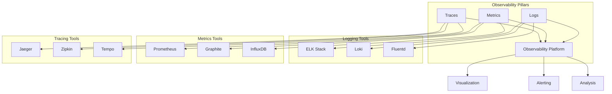
```mermaid
graph TB
    subgraph "Observability Pillars"
        A[Logs] --> D[Observability Platform]
        B[Metrics] --> D
        C[Traces] --> D
    end
    
    subgraph "Logging Tools"
        A --> E[ELK Stack]
        A --> F[Loki]
        A --> G[Fluentd]
    end
    
    subgraph "Metrics Tools"
        B --> H[Prometheus]
        B --> I[Graphite]
        B --> J[InfluxDB]
    end
    
    subgraph "Tracing Tools"
        C --> K[Jaeger]
        C --> L[Zipkin]
        C --> M[Tempo]
    end
    
    D --> N[Visualization]
    D --> O[Alerting]
    D --> P[Analysis]
    
```

---

## Logging Tools

### ELK Stack (Elasticsearch, Logstash, Kibana)

**Purpose:** Log aggregation, search, and visualization

**Components:**
- **Elasticsearch:** Search and analytics engine
- **Logstash:** Log processing pipeline
- **Kibana:** Visualization and dashboards

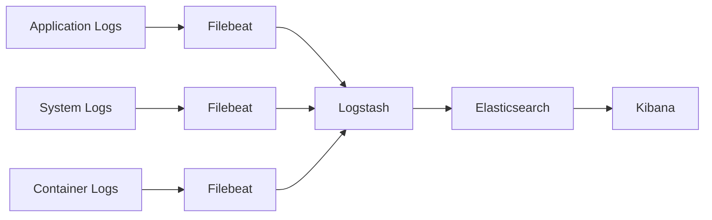
```mermaid
graph LR
    A[Application Logs] --> B[Filebeat]
    B --> C[Logstash]
    C --> D[Elasticsearch]
    D --> E[Kibana]
    
    F[System Logs] --> G[Filebeat]
    G --> C
    
    H[Container Logs] --> I[Filebeat]
    I --> C
    

```

**Pros:**
- Powerful full-text search
- Highly scalable
- Rich visualization capabilities
- Large community and plugin ecosystem

**Cons:**
- Resource intensive (high CPU and memory)
- Complex to configure and tune
- High operational overhead

**Use Cases:**
- Large-scale log aggregation
- Complex search queries
- Security information and event management (SIEM)

**Reference:** [Log Aggregation](05-log-aggregation.md)

```yaml
# Example Logstash configuration
input {
  beats {
    port => 5044
  }
}

filter {
  grok {
    match => { "message" => "%{COMBINEDAPACHELOG}" }
  }
  date {
    match => [ "timestamp", "dd/MMM/yyyy:HH:mm:ss Z" ]
  }
  geoip {
    source => "clientip"
  }
}

output {
  elasticsearch {
    hosts => ["localhost:9200"]
    index => "logs-%{+YYYY.MM.dd}"
  }
}
```

### Loki (by Grafana Labs)

**Purpose:** Horizontally scalable log aggregation system

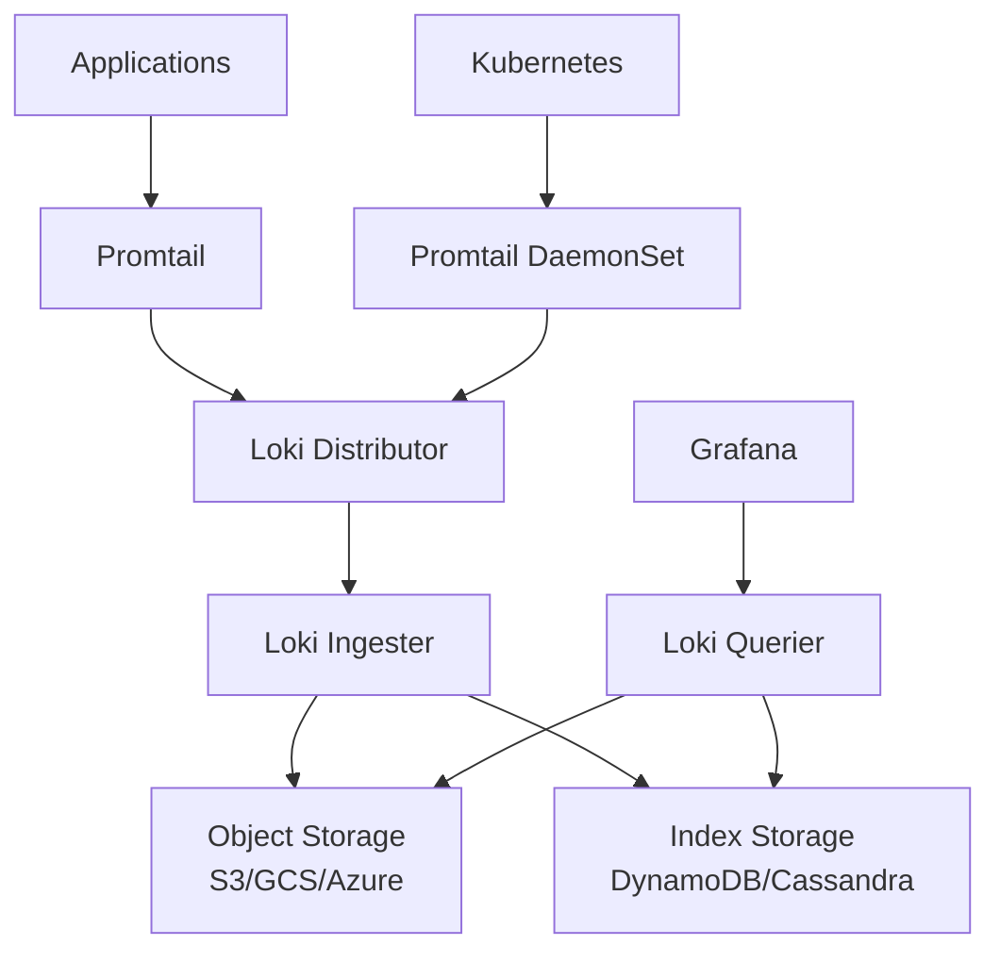
```mermaid
graph TB
    A[Applications] --> B[Promtail]
    C[Kubernetes] --> D[Promtail DaemonSet]
    
    B --> E[Loki Distributor]
    D --> E
    
    E --> F[Loki Ingester]
    F --> G[Object Storage<br/>S3/GCS/Azure]
    F --> H[Index Storage<br/>DynamoDB/Cassandra]
    
    I[Grafana] --> J[Loki Querier]
    J --> G
    J --> H
    
    
```

**Pros:**
- Cost-effective (indexes labels, not content)
- Easy integration with Grafana
- Lightweight compared to ELK
- Excellent for cloud-native environments

**Cons:**
- Limited full-text search capabilities
- Requires good label design upfront
- Fewer features than Elasticsearch

**Use Cases:**
- Kubernetes logging
- Cost-conscious deployments
- Grafana-centric observability stacks

**Reference:** [Logging](02-logging.md), [Visualization Dashboards](09-visualization-dashboards.md)

```yaml
# Loki configuration
auth_enabled: false

server:
  http_listen_port: 3100

ingester:
  lifecycler:
    ring:
      kvstore:
        store: inmemory
      replication_factor: 1
  chunk_idle_period: 5m
  chunk_retain_period: 30s

schema_config:
  configs:
    - from: 2020-10-24
      store: boltdb-shipper
      object_store: filesystem
      schema: v11
      index:
        prefix: index_
        period: 24h

storage_config:
  boltdb_shipper:
    active_index_directory: /loki/index
    cache_location: /loki/cache
    shared_store: filesystem
  filesystem:
    directory: /loki/chunks

limits_config:
  enforce_metric_name: false
  reject_old_samples: true
  reject_old_samples_max_age: 168h
```

### Fluentd / Fluent Bit

**Purpose:** Unified logging layer for data collection and forwarding

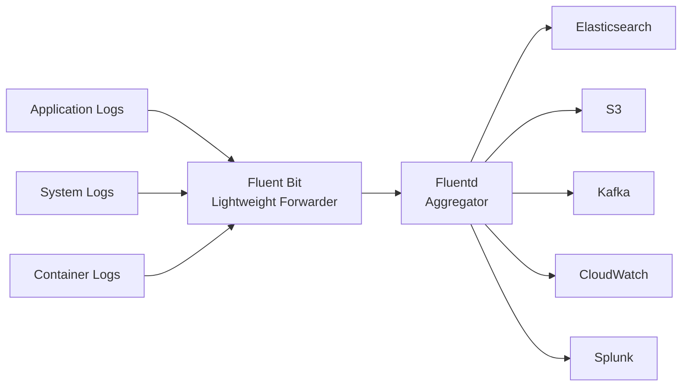
```mermaid
graph LR
    A[Application Logs] --> B[Fluent Bit<br/>Lightweight Forwarder]
    C[System Logs] --> B
    D[Container Logs] --> B
    
    B --> E[Fluentd<br/>Aggregator]
    
    E --> F[Elasticsearch]
    E --> G[S3]
    E --> H[Kafka]
    E --> I[CloudWatch]
    E --> J[Splunk]
    
  
```

**Fluentd:**
- Ruby-based
- Rich plugin ecosystem (1000+ plugins)
- Higher resource usage
- Better for aggregation

**Fluent Bit:**
- C-based
- Lightweight (~450KB binary)
- Lower memory footprint (650KB)
- Ideal for edge/embedded systems

**Use Cases:**
- Kubernetes log collection (sidecar pattern)
- Multi-destination log forwarding
- Log enrichment and filtering
- Vendor-neutral logging

**Reference:** [Log Aggregation](05-log-aggregation.md)

```conf
# Fluent Bit configuration
[SERVICE]
    Flush        5
    Daemon       Off
    Log_Level    info
    Parsers_File parsers.conf

[INPUT]
    Name              tail
    Path              /var/log/containers/*.log
    Parser            docker
    Tag               kube.*
    Refresh_Interval  5
    Mem_Buf_Limit     5MB

[FILTER]
    Name                kubernetes
    Match               kube.*
    Kube_URL            https://kubernetes.default.svc:443
    Kube_CA_File        /var/run/secrets/kubernetes.io/serviceaccount/ca.crt
    Kube_Token_File     /var/run/secrets/kubernetes.io/serviceaccount/token
    Merge_Log           On
    K8S-Logging.Parser  On
    K8S-Logging.Exclude On

[OUTPUT]
    Name   es
    Match  *
    Host   elasticsearch
    Port   9200
    Index  kubernetes_cluster
    Type   _doc
```

### Splunk

**Purpose:** Enterprise log management and SIEM

**Pros:**
- Powerful search processing language (SPL)
- Enterprise features and support
- Strong security analytics
- Compliance and reporting tools

**Cons:**
- Expensive licensing model
- Resource intensive
- Steep learning curve
- Vendor lock-in

**Use Cases:**
- Enterprise environments
- Security operations centers (SOC)
- Compliance requirements
- Business analytics

---

## Metrics Tools

### Prometheus

**Purpose:** Open-source monitoring and alerting toolkit

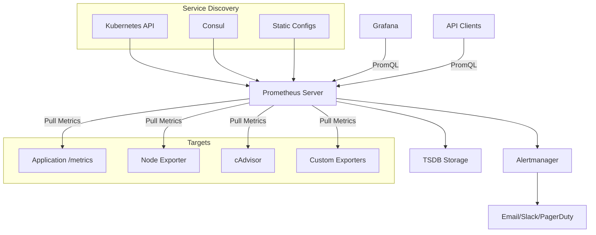
```mermaid
graph TB
    subgraph "Service Discovery"
        A[Kubernetes API]
        B[Consul]
        C[Static Configs]
    end
    
    A --> D[Prometheus Server]
    B --> D
    C --> D
    
    subgraph "Targets"
        E[Application /metrics]
        F[Node Exporter]
        G[cAdvisor]
        H[Custom Exporters]
    end
    
    D -->|Pull Metrics| E
    D -->|Pull Metrics| F
    D -->|Pull Metrics| G
    D -->|Pull Metrics| H
    
    D --> I[TSDB Storage]
    D --> J[Alertmanager]
    
    K[Grafana] -->|PromQL| D
    L[API Clients] -->|PromQL| D
    
    J --> M[Email/Slack/PagerDuty]

```

**Architecture:**
- Pull-based model
- Time-series database (TSDB)
- PromQL query language
- Built-in alerting with Alertmanager

**Pros:**
- Cloud-native standard (CNCF graduated)
- Excellent Kubernetes integration
- Powerful query language
- Service discovery
- Active community

**Cons:**
- Pull model limitations for ephemeral jobs
- No built-in horizontal scalability
- Limited long-term storage
- No built-in authentication

**Use Cases:**
- Microservices monitoring
- Kubernetes cluster monitoring
- Infrastructure monitoring
- Application performance monitoring

**Reference:** [Metrics Collection](06-metrics-collection.md), [Metrics](03-metrics.md)

```yaml
# Prometheus configuration
global:
  scrape_interval: 15s
  evaluation_interval: 15s
  external_labels:
    cluster: 'production'
    region: 'us-east-1'

alerting:
  alertmanagers:
    - static_configs:
        - targets:
          - alertmanager:9093

rule_files:
  - "alerts/*.yml"

scrape_configs:
  - job_name: 'prometheus'
    static_configs:
    - targets: ['localhost:9090']

  - job_name: 'kubernetes-apiservers'
    kubernetes_sd_configs:
    - role: endpoints
    scheme: https
    tls_config:
      ca_file: /var/run/secrets/kubernetes.io/serviceaccount/ca.crt
    bearer_token_file: /var/run/secrets/kubernetes.io/serviceaccount/token
    relabel_configs:
    - source_labels: [__meta_kubernetes_namespace, __meta_kubernetes_service_name, __meta_kubernetes_endpoint_port_name]
      action: keep
      regex: default;kubernetes;https

  - job_name: 'kubernetes-nodes'
    kubernetes_sd_configs:
    - role: node
    relabel_configs:
    - action: labelmap
      regex: __meta_kubernetes_node_label_(.+)

  - job_name: 'kubernetes-pods'
    kubernetes_sd_configs:
    - role: pod
    relabel_configs:
    - source_labels: [__meta_kubernetes_pod_annotation_prometheus_io_scrape]
      action: keep
      regex: true
    - source_labels: [__meta_kubernetes_pod_annotation_prometheus_io_path]
      action: replace
      target_label: __metrics_path__
      regex: (.+)
```

### Graphite

**Purpose:** Enterprise-ready monitoring tool for time-series data

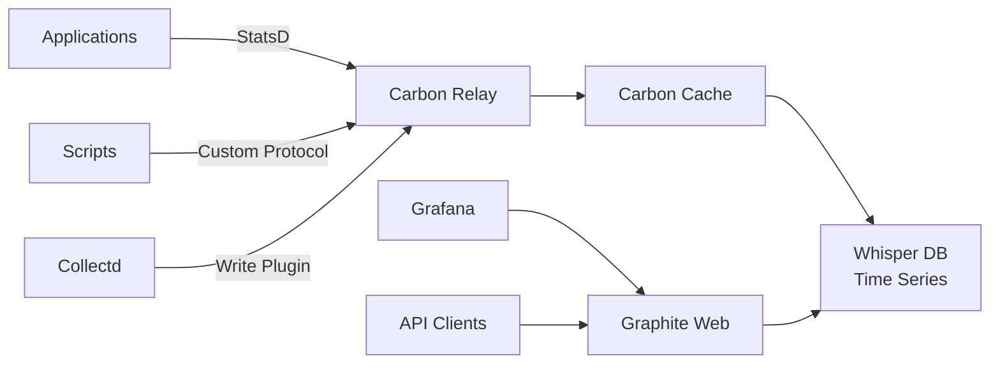
```mermaid
graph LR
    A[Applications] -->|StatsD| B[Carbon Relay]
    C[Scripts] -->|Custom Protocol| B
    D[Collectd] -->|Write Plugin| B
    
    B --> E[Carbon Cache]
    E --> F[Whisper DB<br/>Time Series]
    
    G[Graphite Web] --> F
    H[Grafana] --> G
    I[API Clients] --> G
    
 
```

**Pros:**
- Simple data model (metric paths)
- Flexible storage with Whisper
- Long history and stability
- Easy to get started

**Cons:**
- Limited query language
- Requires external collectors
- Basic visualization
- Scaling challenges

**Use Cases:**
- Simple metrics collection
- Legacy system integration
- Custom business metrics

**Reference:** [Metrics](03-metrics.md)

### InfluxDB

**Purpose:** Time-series database optimized for fast, high-availability storage

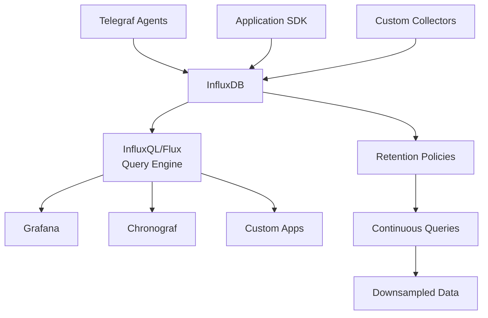
```mermaid
graph TB
    A[Telegraf Agents] --> B[InfluxDB]
    C[Application SDK] --> B
    D[Custom Collectors] --> B
    
    B --> E[InfluxQL/Flux<br/>Query Engine]
    E --> F[Grafana]
    E --> G[Chronograf]
    E --> H[Custom Apps]
    
    B --> I[Retention Policies]
    I --> J[Continuous Queries]
    J --> K[Downsampled Data]
    
```

**Pros:**
- SQL-like query language (InfluxQL) and Flux
- Built-in retention policies
- High write throughput
- Native HTTP API
- Continuous queries for downsampling

**Cons:**
- Clustering only in enterprise version
- Limited free version features
- Memory usage can be high

**Use Cases:**
- IoT metrics and sensor data
- Real-time analytics
- High-volume metrics collection
- DevOps monitoring

**Reference:** [Metrics Collection](06-metrics-collection.md)

```sql
-- InfluxQL Examples
-- Query average CPU usage
SELECT mean("cpu_usage") 
FROM "system_metrics" 
WHERE time > now() - 1h 
GROUP BY time(5m), "hostname"

-- Create retention policy
CREATE RETENTION POLICY "one_week" 
ON "mydb" 
DURATION 7d 
REPLICATION 1 
DEFAULT

-- Create continuous query for downsampling
CREATE CONTINUOUS QUERY "cq_30m" 
ON "mydb"
BEGIN
  SELECT mean("cpu_usage") 
  INTO "average_cpu_30m"
  FROM "system_metrics"
  GROUP BY time(30m), *
END
```

### Datadog

**Purpose:** Commercial SaaS monitoring and analytics platform

**Pros:**
- Easy setup and onboarding
- Beautiful, intuitive dashboards
- Integrated APM and tracing
- ML-based anomaly detection
- Over 450+ integrations

**Cons:**
- Expensive at scale
- Vendor lock-in
- Data residency concerns
- Cost unpredictability

**Use Cases:**
- Fast-growing startups
- Multi-cloud environments
- Teams wanting managed solutions
- Organizations with budget for premium tools

---

## Tracing Tools

### Jaeger

**Purpose:** End-to-end distributed tracing system

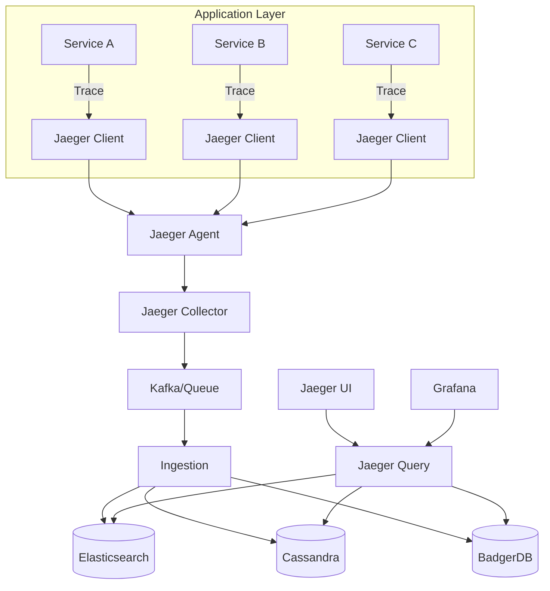
```mermaid
graph TB
    subgraph "Application Layer"
        A[Service A] -->|Trace| B[Jaeger Client]
        C[Service B] -->|Trace| D[Jaeger Client]
        E[Service C] -->|Trace| F[Jaeger Client]
    end
    
    B --> G[Jaeger Agent]
    D --> G
    F --> G
    
    G --> H[Jaeger Collector]
    
    H --> I[Kafka/Queue]
    I --> J[Ingestion]
    
    J --> K[(Elasticsearch)]
    J --> L[(Cassandra)]
    J --> M[(BadgerDB)]
    
    N[Jaeger Query] --> K
    N --> L
    N --> M
    
    O[Jaeger UI] --> N
    P[Grafana] --> N
   
```

**Architecture:**
- OpenTelemetry compatible
- Multiple storage backends (Elasticsearch, Cassandra, Badger)
- Sampling strategies
- Service dependency graphs

**Pros:**
- CNCF graduated project
- Native Kubernetes support
- Multiple storage options
- Adaptive sampling
- Root cause analysis features

**Cons:**
- Requires instrumentation
- Storage can be expensive
- Complex deployment

**Use Cases:**
- Microservices troubleshooting
- Performance optimization
- Service dependency analysis
- Root cause analysis

**Reference:** [Distributed Tracing](07-distributed-tracing.md), [Tracing](04-tracing.md)

```go
// Jaeger client initialization example (Go)
import (
    "github.com/uber/jaeger-client-go"
    "github.com/uber/jaeger-client-go/config"
)

func initJaeger(serviceName string) (opentracing.Tracer, io.Closer) {
    cfg := config.Configuration{
        ServiceName: serviceName,
        Sampler: &config.SamplerConfig{
            Type:  jaeger.SamplerTypeConst,
            Param: 1,
        },
        Reporter: &config.ReporterConfig{
            LogSpans:           true,
            LocalAgentHostPort: "jaeger-agent:6831",
        },
    }
    
    tracer, closer, err := cfg.NewTracer()
    if err != nil {
        panic(fmt.Sprintf("ERROR: cannot init Jaeger: %v\n", err))
    }
    return tracer, closer
}
```

### Zipkin

**Purpose:** Distributed tracing system

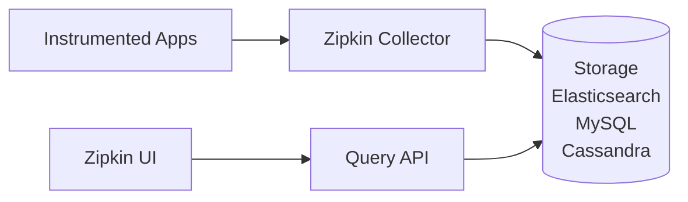
```mermaid
graph LR
    A[Instrumented Apps] --> B[Zipkin Collector]
    B --> C[(Storage<br/>Elasticsearch<br/>MySQL<br/>Cassandra)]
    
    D[Zipkin UI] --> E[Query API]
    E --> C
  
```

**Pros:**
- Simple architecture
- Multiple language support
- Lightweight
- Easy to deploy

**Cons:**
- Less feature-rich than Jaeger
- Limited sampling options
- Basic UI

**Use Cases:**
- Simple tracing needs
- Legacy system integration
- Learning distributed tracing

**Reference:** [Distributed Tracing](07-distributed-tracing.md)

### Grafana Tempo

**Purpose:** High-volume distributed tracing backend

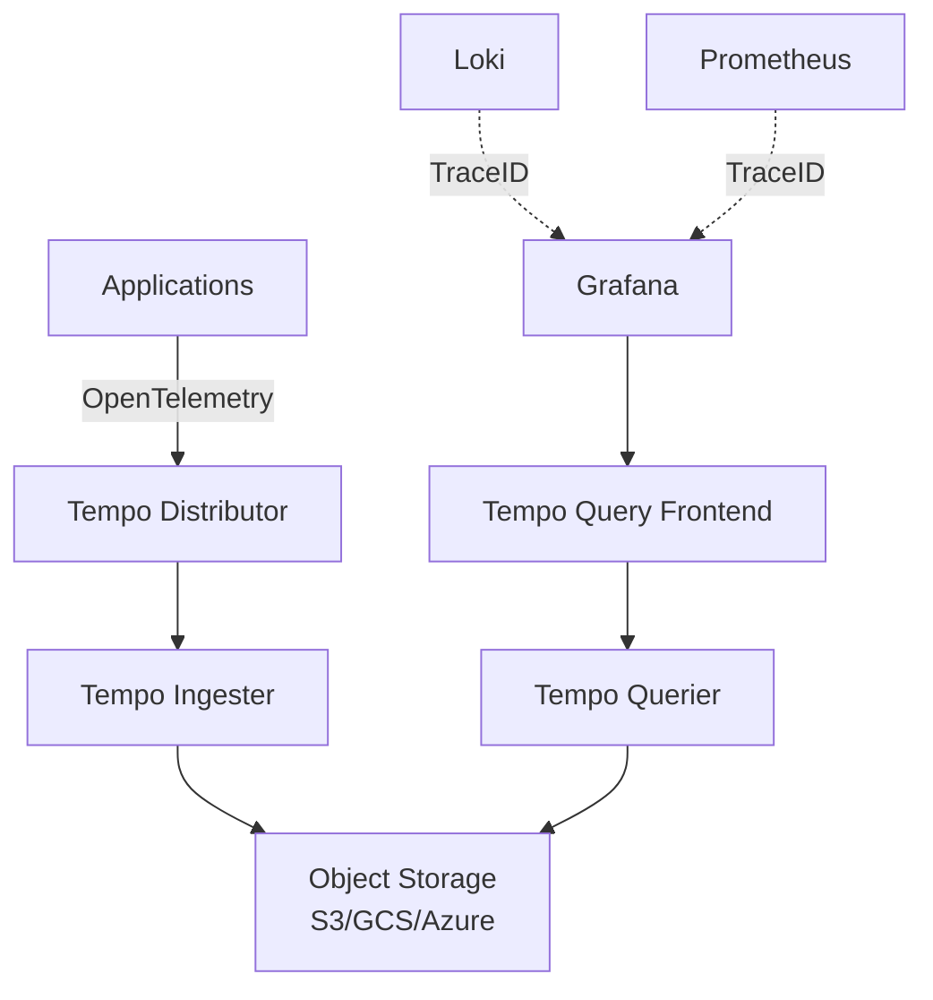
```mermaid
graph TB
    A[Applications] -->|OpenTelemetry| B[Tempo Distributor]
    B --> C[Tempo Ingester]
    C --> D[Object Storage<br/>S3/GCS/Azure]
    
    E[Grafana] --> F[Tempo Query Frontend]
    F --> G[Tempo Querier]
    G --> D
    
    H[Loki] -.->|TraceID| E
    I[Prometheus] -.->|TraceID| E
    
```

**Pros:**
- Cost-effective (object storage)
- No indexes required
- Grafana integration
- OpenTelemetry native

**Cons:**
- Requires TraceID for queries
- No sampling configuration
- Limited search capabilities

**Use Cases:**
- High-volume tracing
- Cost-sensitive environments
- Grafana-based observability

**Reference:** [Distributed Tracing](07-distributed-tracing.md)

---

## All-in-One Platforms

### Elastic Observability

**Components:** Elasticsearch, Kibana, APM Server, Beats

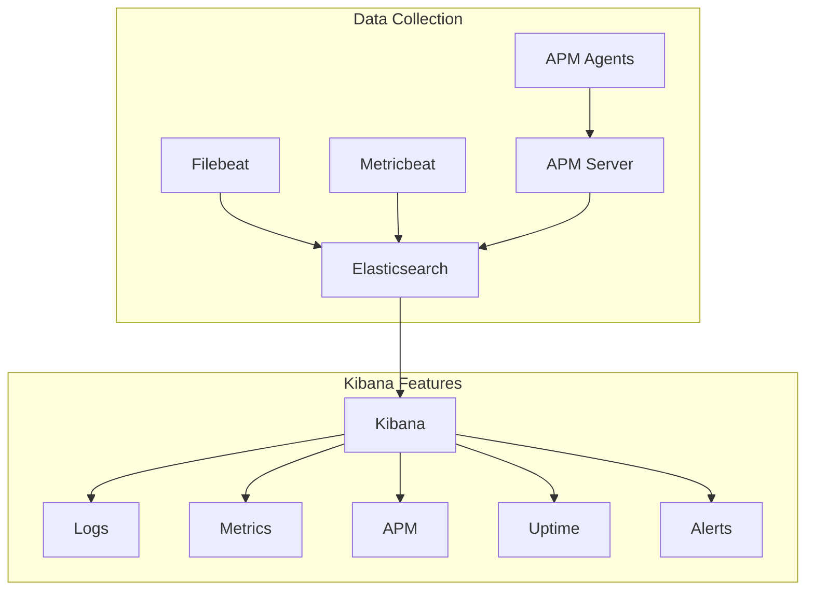
```mermaid
graph TB
    subgraph "Data Collection"
        A[Filebeat] --> E[Elasticsearch]
        B[Metricbeat] --> E
        C[APM Agents] --> D[APM Server]
        D --> E
    end
    
    E --> F[Kibana]
    
    subgraph "Kibana Features"
        F --> G[Logs]
        F --> H[Metrics]
        F --> I[APM]
        F --> J[Uptime]
        F --> K[Alerts]
    end
   
```

**Features:**
- Unified logs, metrics, and traces
- Machine learning capabilities
- SIEM integration
- Alerting and anomaly detection

**Reference:** [Log Aggregation](05-log-aggregation.md), [Alerting and Monitoring](08-alerting-and-monitoring.md)

### Grafana Stack (LGTM)

**Components:** Loki, Grafana, Tempo, Mimir/Prometheus

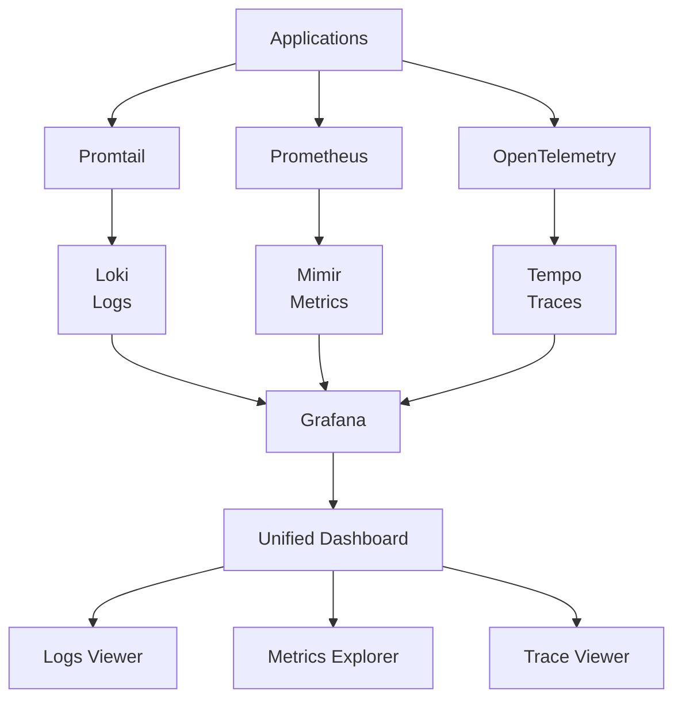
```mermaid
graph TB
    A[Applications] --> B[Promtail]
    A --> C[Prometheus]
    A --> D[OpenTelemetry]
    
    B --> E[Loki<br/>Logs]
    C --> F[Mimir<br/>Metrics]
    D --> G[Tempo<br/>Traces]
    
    E --> H[Grafana]
    F --> H
    G --> H
    
    H --> I[Unified Dashboard]
    I --> J[Logs Viewer]
    I --> K[Metrics Explorer]
    I --> L[Trace Viewer]

```

**Features:**
- Cost-effective
- Unified visualization
- Strong correlation between signals
- Open source option

**Reference:** [Visualization Dashboards](09-visualization-dashboards.md)

### Datadog

**All-in-one SaaS platform**

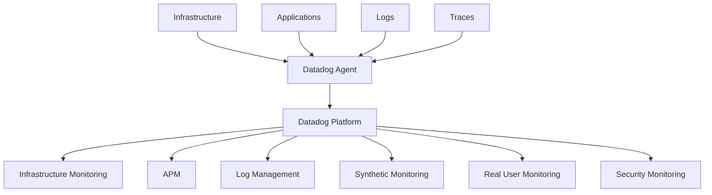
```mermaid
graph TB
    A[Infrastructure] --> B[Datadog Agent]
    C[Applications] --> B
    D[Logs] --> B
    E[Traces] --> B
    
    B --> F[Datadog Platform]
    
    F --> G[Infrastructure Monitoring]
    F --> H[APM]
    F --> I[Log Management]
    F --> J[Synthetic Monitoring]
    F --> K[Real User Monitoring]
    F --> L[Security Monitoring]
    

```

**Features:**
- Complete observability
- AI/ML features
- Easy setup
- 450+ integrations

### New Relic

**Full-stack observability platform**

**Features:**
- APM and infrastructure
- Real user monitoring
- Synthetic monitoring
- Distributed tracing

### Dynatrace

**AI-powered observability**

**Features:**
- Auto-instrumentation
- Davis AI engine
- Full-stack monitoring
- Business analytics

---

## Visualization Tools

### Grafana

**Purpose:** Multi-source data visualization and dashboards

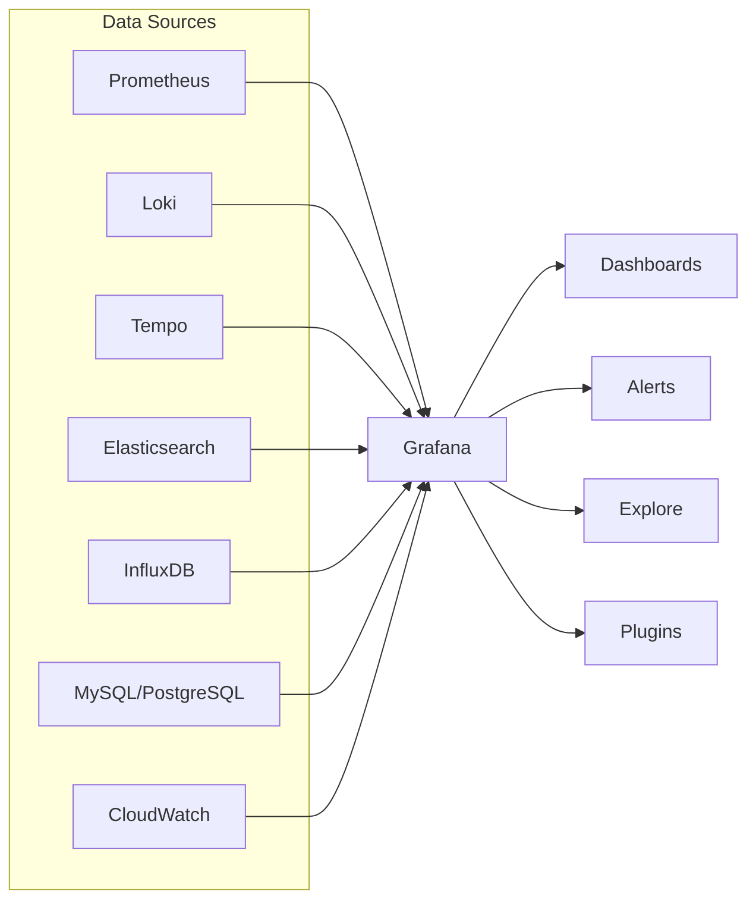
```mermaid
graph LR
    subgraph "Data Sources"
        A[Prometheus]
        B[Loki]
        C[Tempo]
        D[Elasticsearch]
        E[InfluxDB]
        F[MySQL/PostgreSQL]
        G[CloudWatch]
    end
    
    A --> H[Grafana]
    B --> H
    C --> H
    D --> H
    E --> H
    F --> H
    G --> H
    
    H --> I[Dashboards]
    H --> J[Alerts]
    H --> K[Explore]
    H --> L[Plugins]
    
```

**Pros:**
- Support for multiple data sources
- Rich visualization options
- Template variables
- Alerting
- Large plugin ecosystem

**Cons:**
- Can be complex to configure
- Dashboard management at scale
- Alert rule limitations

**Reference:** [Visualization Dashboards](09-visualization-dashboards.md)

```json
// Example Grafana dashboard panel
{
  "dashboard": {
    "title": "Application Metrics",
    "panels": [
      {
        "id": 1,
        "type": "graph",
        "title": "Request Rate",
        "targets": [
          {
            "expr": "rate(http_requests_total[5m])",
            "legendFormat": "{{method}} {{status}}"
          }
        ]
      }
    ]
  }
}
```

### Kibana

**Purpose:** Elasticsearch visualization

**Features:**
- Log exploration
- Dashboard creation
- Machine learning
- Canvas and maps

**Reference:** [Visualization Dashboards](09-visualization-dashboards.md)

### Chronograf

**Purpose:** InfluxDB visualization

**Features:**
- Time-series visualization
- Alert management
- Data exploration

---

## Alerting Tools

### Alertmanager (Prometheus)

**Purpose:** Alert routing and deduplication

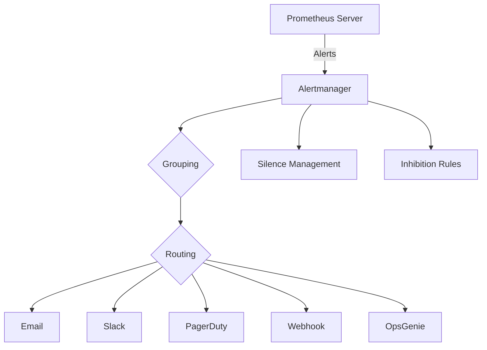
```mermaid
graph TB
    A[Prometheus Server] -->|Alerts| B[Alertmanager]
    
    B --> C{Grouping}
    C --> D{Routing}
    
    D --> E[Email]
    D --> F[Slack]
    D --> G[PagerDuty]
    D --> H[Webhook]
    D --> I[OpsGenie]
    
    B --> J[Silence Management]
    B --> K[Inhibition Rules]

```

**Features:**
- Grouping and deduplication
- Silencing and inhibition
- Multiple receivers
- High availability

**Reference:** [Alerting and Monitoring](08-alerting-and-monitoring.md)

```yaml
# Alertmanager configuration
global:
  resolve_timeout: 5m
  slack_api_url: 'https://hooks.slack.com/services/XXX'

route:
  group_by: ['alertname', 'cluster', 'service']
  group_wait: 10s
  group_interval: 10s
  repeat_interval: 12h
  receiver: 'default'
  routes:
  - match:
      severity: critical
    receiver: pagerduty
  - match:
      severity: warning
    receiver: slack

receivers:
- name: 'default'
  email_configs:
  - to: 'team@example.com'

- name: 'slack'
  slack_configs:
  - channel: '#alerts'
    title: 'Alert: {{ .GroupLabels.alertname }}'
    text: '{{ range .Alerts }}{{ .Annotations.description }}{{ end }}'

- name: 'pagerduty'
  pagerduty_configs:
  - service_key: 'YOUR_SERVICE_KEY'
    description: '{{ .GroupLabels.alertname }}'

inhibit_rules:
- source_match:
    severity: 'critical'
  target_match:
    severity: 'warning'
  equal: ['alertname', 'cluster', 'service']
```

### PagerDuty

**Purpose:** Incident management platform

**Features:**
- On-call scheduling
- Escalation policies
- Incident response
- Integration hub

### Opsgenie

**Purpose:** Alert and on-call management

**Features:**
- Alert routing
- On-call scheduling
- Incident tracking
- ChatOps integration

---

## Storage Solutions

### Time-Series Databases

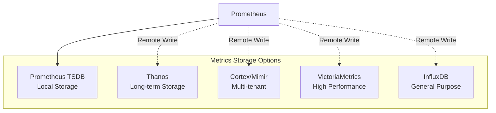
```mermaid
graph TB
    subgraph "Metrics Storage Options"
        A[Prometheus TSDB<br/>Local Storage]
        B[Thanos<br/>Long-term Storage]
        C[Cortex/Mimir<br/>Multi-tenant]
        D[VictoriaMetrics<br/>High Performance]
        E[InfluxDB<br/>General Purpose]
    end
    
    F[Prometheus] --> A
    F -.->|Remote Write| B
    F -.->|Remote Write| C
    F -.->|Remote Write| D
    F -.->|Remote Write| E
```

### Thanos

**Purpose:** Highly available Prometheus with long-term storage

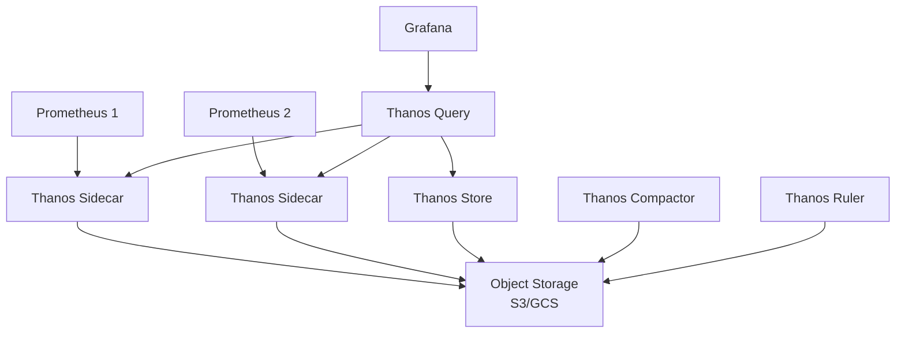
```mermaid
graph TB
    A[Prometheus 1] --> B[Thanos Sidecar]
    C[Prometheus 2] --> D[Thanos Sidecar]
    
    B --> E[Object Storage<br/>S3/GCS]
    D --> E
    
    F[Thanos Query] --> B
    F --> D
    F --> G[Thanos Store]
    
    G --> E
    
    H[Grafana] --> F
    
    I[Thanos Compactor] --> E
    J[Thanos Ruler] --> E

```

**Features:**
- Unlimited retention
- Global query view
- Downsampling
- Multi-tenancy support

### Cortex / Mimir

**Purpose:** Horizontally scalable Prometheus

**Features:**
- Multi-tenancy
- High availability
- Long-term storage
- Query federation

### VictoriaMetrics

**Purpose:** Fast, cost-effective time-series database

**Features:**
- High performance
- Low resource usage
- PromQL support
- Downsampling

---

## Tool Comparison Matrix

### Logging Tools Comparison

| Feature | ELK Stack | Loki | Fluentd | Splunk |
|---------|-----------|------|---------|--------|
| **Cost** | Free (OSS) | Free (OSS) | Free (OSS) | Expensive |
| **Scalability** | High | High | High | Very High |
| **Resource Usage** | High | Medium | Low-Medium | High |
| **Search Capability** | Excellent | Limited | N/A | Excellent |
| **Setup Complexity** | High | Medium | Low | Medium |
| **Cloud Native** | Good | Excellent | Excellent | Good |
| **Best For** | Full-text search | K8s logging | Log routing | Enterprise |

**Reference:** [Logging](02-logging.md), [Log Aggregation](05-log-aggregation.md)

### Metrics Tools Comparison

| Feature | Prometheus | InfluxDB | Graphite | Datadog |
|---------|------------|----------|----------|---------|
| **Cost** | Free (OSS) | Free/Paid | Free (OSS) | Expensive |
| **Query Language** | PromQL | InfluxQL/Flux | Limited | Custom |
| **Scalability** | Medium | High | Medium | Very High |
| **Data Model** | Pull-based | Push-based | Push-based | Push-based |
| **Retention** | Limited | Built-in | Manual | Managed |
| **Learning Curve** | Medium | Low | Low | Low |
| **K8s Integration** | Excellent | Good | Limited | Excellent |
| **Best For** | Cloud-native | IoT/Real-time | Legacy systems | Managed solution |

**Reference:** [Metrics](03-metrics.md), [Metrics Collection](06-metrics-collection.md)

### Tracing Tools Comparison

| Feature | Jaeger | Zipkin | Tempo | Datadog APM |
|---------|--------|--------|-------|-------------|
| **Cost** | Free (OSS) | Free (OSS) | Free (OSS) | Expensive |
| **Storage Options** | Multiple | Multiple | Object Storage | Managed |
| **Sampling** | Advanced | Basic | N/A | Advanced |
| **UI Features** | Rich | Basic | Basic | Excellent |
| **OpenTelemetry** | Native | Compatible | Native | Compatible |
| **Setup Complexity** | High | Medium | Medium | Low |
| **Best For** | Microservices | Simple tracing | High volume | Full-stack APM |

**Reference:** [Distributed Tracing](07-distributed-tracing.md), [Tracing](04-tracing.md)

---

## Architecture Patterns

### Pattern 1: Cloud-Native Open Source Stack

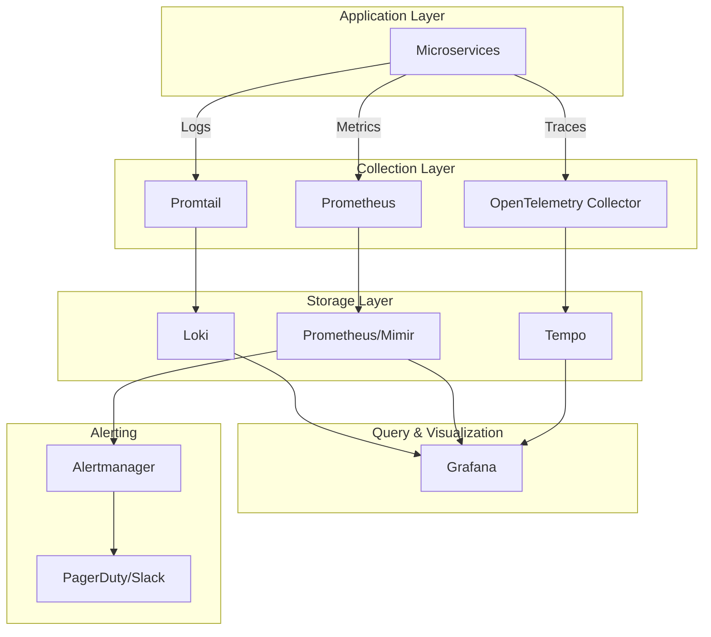
```mermaid
graph TB
    subgraph "Application Layer"
        A[Microservices]
    end
    
    subgraph "Collection Layer"
        A -->|Logs| B[Promtail]
        A -->|Metrics| C[Prometheus]
        A -->|Traces| D[OpenTelemetry Collector]
    end
    
    subgraph "Storage Layer"
        B --> E[Loki]
        C --> F[Prometheus/Mimir]
        D --> G[Tempo]
    end
    
    subgraph "Query & Visualization"
        E --> H[Grafana]
        F --> H
        G --> H
    end
    
    subgraph "Alerting"
        F --> I[Alertmanager]
        I --> J[PagerDuty/Slack]
    end
```

**Components:**
- **Logs:** Promtail → Loki
- **Metrics:** Prometheus → Mimir (long-term)
- **Traces:** OpenTelemetry → Tempo
- **Visualization:** Grafana
- **Alerting:** Alertmanager

**Pros:**
- Cost-effective
- No vendor lock-in
- Full control
- Cloud-native

**Cons:**
- Self-managed
- Requires expertise
- Operational overhead

**Reference:** [Introduction to Observability](01-introduction.md)

### Pattern 2: ELK-Based Stack

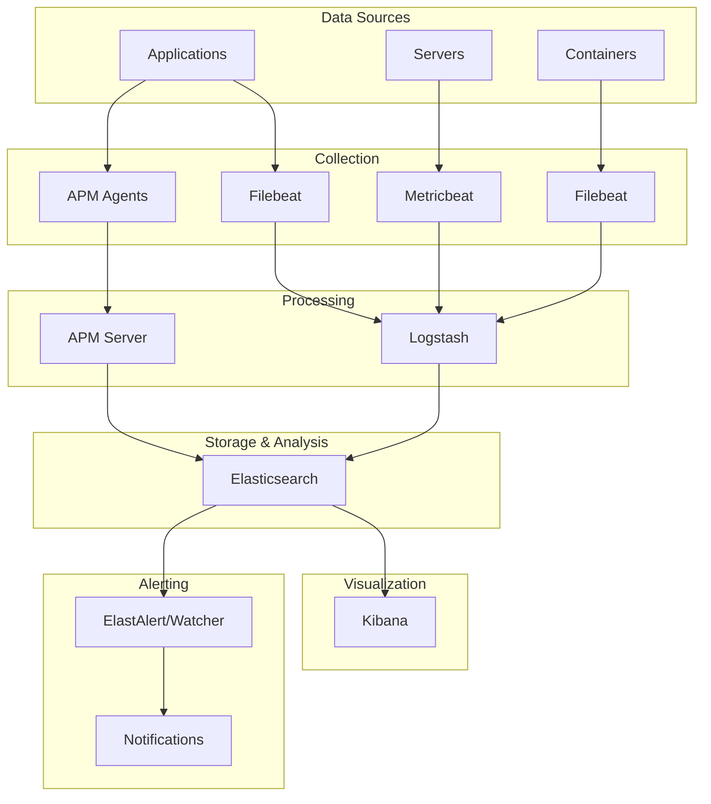
```mermaid
graph TB
    subgraph "Data Sources"
        A[Applications]
        B[Servers]
        C[Containers]
    end
    
    subgraph "Collection"
        A --> D[Filebeat]
        B --> E[Metricbeat]
        C --> F[Filebeat]
        A --> G[APM Agents]
    end
    
    subgraph "Processing"
        D --> H[Logstash]
        E --> H
        F --> H
        G --> I[APM Server]
    end
    
    subgraph "Storage & Analysis"
        H --> J[Elasticsearch]
        I --> J
    end
    
    subgraph "Visualization"
        J --> K[Kibana]
    end
    
    subgraph "Alerting"
        J --> L[ElastAlert/Watcher]
        L --> M[Notifications]
    end
    
```

**Components:**
- **Collection:** Beats family
- **Processing:** Logstash
- **Storage:** Elasticsearch
- **Visualization:** Kibana
- **APM:** Elastic APM

**Pros:**
- All-in-one solution
- Powerful search
- Mature ecosystem
- Good documentation

**Cons:**
- Resource intensive
- Complex setup
- High operational cost

**Reference:** [Log Aggregation](05-log-aggregation.md)

### Pattern 3: Hybrid Cloud/SaaS

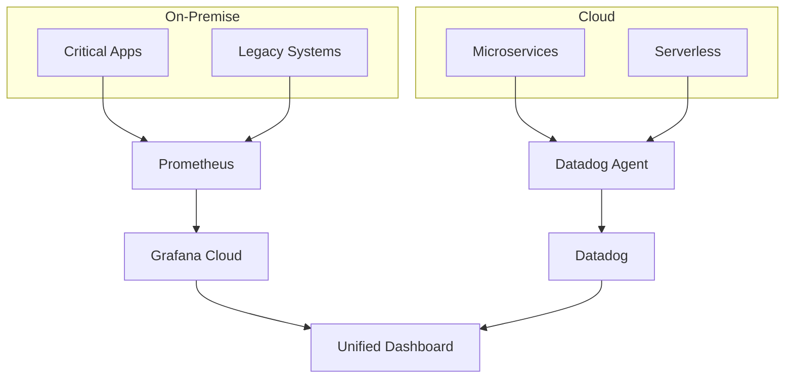
```mermaid
graph TB
    subgraph "On-Premise"
        A[Critical Apps]
        B[Legacy Systems]
    end
    
    subgraph "Cloud"
        C[Microservices]
        D[Serverless]
    end
    
    A --> E[Prometheus]
    B --> E
    C --> F[Datadog Agent]
    D --> F
    
    E --> G[Grafana Cloud]
    F --> H[Datadog]
    
    G --> I[Unified Dashboard]
    H --> I
```

**Components:**
- **On-premise:** Prometheus + Grafana
- **Cloud:** Datadog/New Relic
- **Integration:** Grafana Cloud or custom

**Pros:**
- Flexibility
- Gradual migration
- Best of both worlds

**Cons:**
- Complex management
- Multiple tools to learn
- Cost can be high

### Pattern 4: Enterprise Stack

```mermaid
graph TB
    subgraph "Data Collection"
        A[Applications] --> B[Agents]
        C[Infrastructure] --> B
        D[Network] --> B
    end
    
    subgraph "Enterprise Platform"
        B --> E[Datadog/Dynatrace/New Relic]
    end
    
    subgraph "Capabilities"
        E --> F[APM]
        E --> G[Infrastructure]
        E --> H[Logs]
        E --> I[RUM]
        E --> J[Synthetics]
        E --> K[Security]
    end
    
    subgraph "Integrations"
        E --> L[ServiceNow]
        E --> M[Jira]
        E --> N[Slack]
        E --> O[PagerDuty]
    end

```

**Components:**
- **Platform:** Datadog/Dynatrace/New Relic
- **All signals:** Logs, metrics, traces, RUM
- **Integrations:** ITSM, ChatOps, incident management

**Pros:**
- Fully managed
- Easy to use
- Advanced features
- Great support

**Cons:**
- Expensive
- Vendor lock-in
- Data privacy concerns

---

## Tool Selection Criteria

### Decision Framework

```mermaid
graph TD
    A[Start] --> B{Budget?}
    B -->|Limited| C{Team Expertise?}
    B -->|Flexible| D{Managed vs Self-hosted?}
    
    C -->|High| E[Prometheus + Grafana Stack]
    C -->|Low| F[Elastic Stack]
    
    D -->|Managed| G{Scale?}
    D -->|Self-hosted| H{Cloud-native?}
    
    G -->|Small/Medium| I[Datadog]
    G -->|Large| J[Dynatrace/New Relic]
    
    H -->|Yes| K[LGTM Stack]
    H -->|No| L[ELK Stack]
    
  
```

### Key Considerations

#### 1. **Scale and Volume**

```mermaid
graph LR
    A[Scale Considerations] --> B[Data Volume<br/>GB/day]
    A --> C[Retention Period<br/>Days/Months]
    A --> D[Query Frequency<br/>QPS]
    A --> E[Growth Rate<br/>% per month]
    
    B --> F{Decision}
    C --> F
    D --> F
    E --> F
    
    F -->|Low Volume| G[Single-node solutions]
    F -->|Medium Volume| H[Clustered OSS]
    F -->|High Volume| I[SaaS or Enterprise]
    
```

**Small Scale (< 100 GB/day):**
- Prometheus + Grafana
- ELK on single cluster
- Loki + Tempo

**Medium Scale (100 GB - 1 TB/day):**
- ELK cluster
- Prometheus + Thanos
- Grafana Cloud

**Large Scale (> 1 TB/day):**
- Datadog/New Relic
- Enterprise Elastic
- Splunk

**Reference:** [Introduction to Observability](01-introduction.md)

#### 2. **Team Expertise**

| Tool Stack | Required Skills | Learning Curve | Operational Complexity |
|------------|----------------|----------------|------------------------|
| **Prometheus + Grafana** | PromQL, YAML, K8s | Medium | Medium |
| **ELK Stack** | Elasticsearch DSL, JVM tuning | High | High |
| **Loki + Tempo** | LogQL, Object storage | Medium | Low-Medium |
| **Datadog/New Relic** | Platform-specific | Low | Very Low |
| **Splunk** | SPL, Administration | High | Medium |

#### 3. **Cost Analysis**

```mermaid
graph TB
    A[Total Cost of Ownership] --> B[Licensing Costs]
    A --> C[Infrastructure Costs]
    A --> D[Personnel Costs]
    A --> E[Training Costs]
    
    B --> F[OSS: Free]
    B --> G[SaaS: Per GB/host]
    B --> H[Enterprise: Volume-based]
    
    C --> I[Compute]
    C --> J[Storage]
    C --> K[Network]
    
    D --> L[Engineers]
    D --> M[On-call]
 
```

**Open Source Stack:**
- License: $0
- Infrastructure: Moderate-High
- Personnel: High
- **Total:** Medium (depends on scale)

**SaaS Solutions:**
- License: High (per GB/host)
- Infrastructure: Low
- Personnel: Low
- **Total:** High for large volumes

**Reference:** [Best Practices](12-best-practices.md)

#### 4. **Feature Requirements**

```mermaid
graph TD
    A[Feature Requirements] --> B{Need APM?}
    A --> C{Need SIEM?}
    A --> D{Need RUM?}
    A --> E{Need Synthetics?}
    
    B -->|Yes| F[Elastic APM or<br/>Commercial APM]
    B -->|No| G[Basic Tracing<br/>Jaeger/Zipkin]
    
    C -->|Yes| H[Elastic Security or<br/>Splunk]
    C -->|No| I[Standard Logging]
    
    D -->|Yes| J[Commercial APM<br/>Datadog/New Relic]
    D -->|No| K[Basic Observability]
    
    E -->|Yes| L[Commercial Solution]
    E -->|No| M[OSS Stack]

```

**Reference:** [Introduction to Observability](01-introduction.md)

#### 5. **Compliance and Security**

**Considerations:**
- Data residency requirements
- Retention policies
- Access controls
- Audit logging
- Encryption (in-transit and at-rest)

**Tools with Strong Compliance:**
- Splunk Enterprise
- Elastic with Security
- Self-hosted solutions (full control)

**Reference:** [Best Practices](12-best-practices.md)

#### 6. **Integration Requirements**

```mermaid
graph LR
    A[Integration Needs] --> B[Existing Tools]
    A --> C[Cloud Providers]
    A --> D[Incident Management]
    A --> E[CI/CD Pipeline]
    
    B --> F[Jira]
    B --> G[ServiceNow]
    
    C --> H[AWS]
    C --> I[Azure]
    C --> J[GCP]
    
    D --> K[PagerDuty]
    D --> L[OpsGenie]
    
    E --> M[Jenkins]
    E --> N[GitLab CI]
    

```

---

## Tool Selection Guide by Use Case

### Use Case 1: Kubernetes-Native Stack

**Recommended Stack:**
```mermaid
graph TB
    A[Kubernetes Cluster] --> B[Promtail DaemonSet]
    A --> C[Prometheus Operator]
    A --> D[OpenTelemetry Collector]
    
    B --> E[Loki]
    C --> F[Prometheus/Mimir]
    D --> G[Tempo]
    
    E --> H[Grafana]
    F --> H
    G --> H

```

**Tools:**
- **Logs:** Promtail → Loki
- **Metrics:** Prometheus with Operator
- **Traces:** OpenTelemetry → Tempo
- **Dashboards:** Grafana

**Why:**
- Cloud-native architecture
- Excellent K8s integration
- Cost-effective
- Scalable

**Reference:** [Introduction to Observability](01-introduction.md), [Best Practices](12-best-practices.md)

### Use Case 2: Enterprise Compliance

**Recommended Stack:**
```mermaid
graph TB
    A[Applications] --> B[Splunk Forwarders]
    C[Security Events] --> B
    D[Audit Logs] --> B
    
    B --> E[Splunk Enterprise]
    
    E --> F[SIEM Dashboards]
    E --> G[Compliance Reports]
    E --> H[Incident Response]
    E --> I[Threat Intelligence]
    
```

**Tools:**
- **Primary:** Splunk Enterprise
- **SIEM:** Splunk Security
- **Compliance:** Built-in reporting

**Why:**
- Strong compliance features
- Audit capabilities
- Enterprise support
- Regulatory approval

**Reference:** [Log Aggregation](05-log-aggregation.md)

### Use Case 3: High-Traffic Web Application

**Recommended Stack:**
```mermaid
graph TB
    A[Web Application] --> B[Datadog Agent]
    C[CDN] --> D[RUM SDK]
    E[APIs] --> B
    F[Databases] --> B
    
    B --> G[Datadog Platform]
    D --> G
    
    G --> H[APM]
    G --> I[Infrastructure]
    G --> J[RUM]
    G --> K[Synthetics]
    G --> L[Log Management]
    
```

**Tools:**
- **Platform:** Datadog or New Relic
- **RUM:** Built-in
- **Synthetics:** Built-in
- **APM:** Built-in

**Why:**
- Comprehensive visibility
- User experience monitoring
- Easy setup
- Scalable

**Reference:** [Distributed Tracing](07-distributed-tracing.md)

### Use Case 4: Startup/Small Team

**Recommended Stack:**
```mermaid
graph TB
    A[Applications] --> B[Grafana Cloud Agent]
    
    B --> C[Grafana Cloud]
    
    C --> D[Logs]
    C --> E[Metrics]
    C --> F[Traces]
    C --> G[Alerts]
    
    style C fill:#ff6,stroke:#333,stroke-width:4px
```

**Tools:**
- **Platform:** Grafana Cloud (free tier)
- **Alternative:** Datadog (small scale)

**Why:**
- Minimal setup
- Low operational overhead
- Free tier available
- Easy to scale

**Reference:** [Introduction to Observability](01-introduction.md)

### Use Case 5: Hybrid Cloud

**Recommended Stack:**
```mermaid
graph TB
    subgraph "On-Premise"
        A[Legacy Apps] --> B[Prometheus]
        C[Databases] --> B
    end
    
    subgraph "AWS"
        D[Microservices] --> E[CloudWatch]
        E --> F[Grafana Cloud]
    end
    
    subgraph "Azure"
        G[Functions] --> H[App Insights]
        H --> F
    end
    
    B --> F
    
    F --> I[Unified Dashboard]
    
```

**Tools:**
- **On-premise:** Prometheus
- **AWS:** CloudWatch
- **Azure:** Application Insights
- **Unified:** Grafana Cloud

**Why:**
- Multi-cloud support
- Unified view
- Native integrations

**Reference:** [Visualization Dashboards](09-visualization-dashboards.md)

---

## Best Practices for Tool Selection

### 1. Start Simple, Scale Later

```mermaid
graph LR
    A[Phase 1<br/>Simple Stack] --> B[Phase 2<br/>Add Features]
    B --> C[Phase 3<br/>Scale Out]
    C --> D[Phase 4<br/>Optimize]
    
    A -.->|Prometheus<br/>+ Grafana| A1[Basic Monitoring]
    B -.->|Add Loki| B1[Log Aggregation]
    C -.->|Add Tempo<br/>+ Mimir| C1[Full Observability]
    D -.->|Tune & Optimize| D1[Production Ready]
    
```

**Reference:** [Best Practices](12-best-practices.md)

### 2. Evaluate with POC

**POC Checklist:**
- [ ] Deploy in test environment
- [ ] Generate realistic load
- [ ] Test query performance
- [ ] Verify alerting
- [ ] Check resource usage
- [ ] Assess operational complexity
- [ ] Calculate total cost

### 3. Consider OpenTelemetry

```mermaid
graph TB
    A[Application] --> B[OpenTelemetry SDK]
    
    B --> C[OTLP Exporter]
    
    C --> D[OpenTelemetry Collector]
    
    D --> E[Jaeger]
    D --> F[Prometheus]
    D --> G[Loki]
    D --> H[Datadog]
    D --> I[Any Backend]
    
```

**Benefits:**
- Vendor-neutral instrumentation
- Switch backends without code changes
- Future-proof architecture
- Industry standard

**Reference:** [Distributed Tracing](07-distributed-tracing.md)

### 4. Plan for Growth

**Capacity Planning:**

| Metric | Small | Medium | Large |
|--------|-------|--------|-------|
| **Logs (GB/day)** | < 10 | 10-100 | > 100 |
| **Metrics (series)** | < 100K | 100K-1M | > 1M |
| **Traces (spans/sec)** | < 1K | 1K-10K | > 10K |
| **Retention** | 7-30 days | 30-90 days | 90+ days |
| **Cost** | Free-$500/mo | $500-5K/mo | > $5K/mo |

**Reference:** [Service Level Objectives](10-service-level-objectives.md)

### 5. Don't Over-Engineer

**Anti-patterns to Avoid:**
- Running all tools from day one
- Collecting every possible metric
- Infinite retention periods
- Over-complicated dashboards
- Too many alerts

**Reference:** [Best Practices](12-best-practices.md)

---

## Migration Strategies

### From Monolith to Microservices Observability

```mermaid
graph TB
    A[Legacy Monitoring] --> B{Migration Strategy}
    
    B --> C[Parallel Run]
    B --> D[Gradual Migration]
    B --> E[Big Bang]
    
    C --> F[Run old and new<br/>simultaneously]
    D --> G[Migrate service<br/>by service]
    E --> H[Switch all at once]
    
    F --> I[New Observability Stack]
    G --> I
    H --> I
    

```

**Recommended Approach: Gradual Migration**

1. **Setup new stack in parallel**
2. **Instrument new services with OpenTelemetry**
3. **Migrate high-value services first**
4. **Validate and compare data**
5. **Deprecate old tools gradually**

**Reference:** [Introduction to Observability](01-introduction.md)

---

## Conclusion

Choosing the right observability tools depends on:

1. **Scale and budget**
2. **Team expertise**
3. **Feature requirements**
4. **Existing infrastructure**
5. **Compliance needs**

**Recommended Starting Points:**

| Scenario | Recommended Stack | Reason |
|----------|------------------|--------|
| **Kubernetes-native** | Prometheus + Loki + Tempo + Grafana | Best K8s integration |
| **Startup/Small team** | Grafana Cloud or Datadog | Low operational overhead |
| **Enterprise** | Elastic Stack or Datadog | Feature-rich, enterprise support |
| **Cost-conscious** | LGTM Stack (self-hosted) | Open source, no licensing |
| **High compliance** | Splunk Enterprise | Audit and compliance features |

**Key Takeaways:**
- Start with open-source tools when possible
- Use OpenTelemetry for vendor neutrality
- Plan for scale from the beginning
- Don't over-engineer initially
- Consider managed solutions for faster time-to-value

**Reference:** [Best Practices](12-best-practices.md)

---

## Additional Resources

- **Official Documentation:**
  - [Prometheus Docs](https://prometheus.io/docs/)
  - [Grafana Docs](https://grafana.com/docs/)
  - [OpenTelemetry](https://opentelemetry.io/)
  - [Jaeger Docs](https://www.jaegertracing.io/docs/)
  
- **Related Documentation in this Repository:**
  - [Introduction to Observability](01-introduction.md)
  - [Logging Best Practices](02-logging.md)
  - [Metrics Collection](06-metrics-collection.md)
  - [Distributed Tracing](07-distributed-tracing.md)
  - [Alerting and Monitoring](08-alerting-and-monitoring.md)
  - [Visualization Dashboards](09-visualization-dashboards.md)
  - [Service Level Objectives](10-service-level-objectives.md)
  - [Best Practices](12-best-practices.md)
|