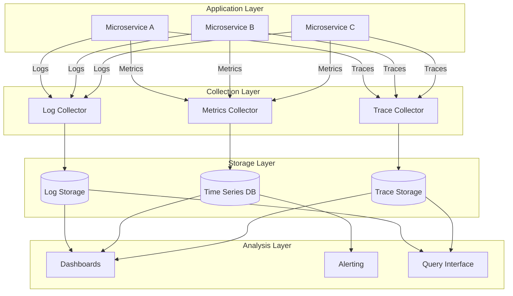
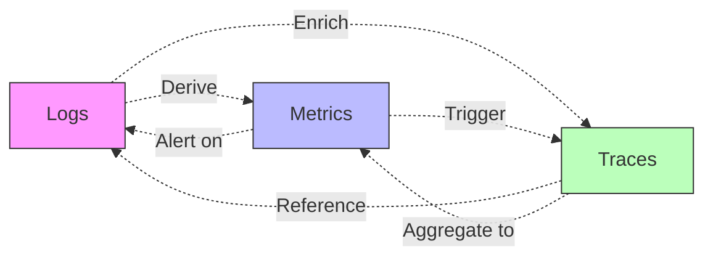
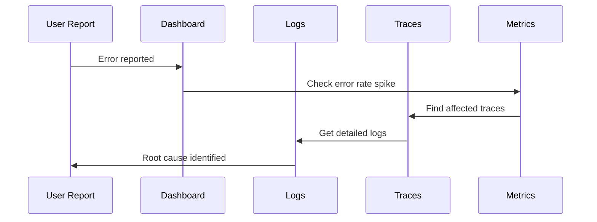

# Observability

## Overview

Observability is the ability to understand the internal state of a system by examining its external outputs. In modern distributed systems, observability is critical for maintaining reliability, debugging issues, and ensuring optimal performance.

This directory contains comprehensive guides on implementing observability in distributed systems, covering the three pillars of observability: **Logs**, **Metrics**, and **Traces**.

## Table of Contents

### Core Concepts

1. **[Introduction to Observability](./01-introduction.md)**
   - What is observability vs monitoring
   - The three pillars: Logs, Metrics, Traces
   - Why observability matters in distributed systems
   - Observability vs debugging

2. **[Logging](./02-logging.md)**
   - Structured logging best practices
   - Log levels and when to use them
   - Context propagation in logs
   - Log sampling strategies

3. **[Metrics](./03-metrics.md)**
   - Types of metrics (Counter, Gauge, Histogram, Summary)
   - RED method (Rate, Errors, Duration)
   - USE method (Utilization, Saturation, Errors)
   - Cardinality considerations

4. **[Tracing](./04-tracing.md)**
   - Distributed tracing fundamentals
   - Spans and traces
   - Context propagation
   - Sampling strategies

### Implementation Patterns

5. **[Log Aggregation](./05-log-aggregation.md)**
   - Centralized logging architecture
   - Log shipping patterns
   - Parsing and indexing strategies
   - Retention policies

6. **[Metrics Collection](./06-metrics-collection.md)**
   - Push vs Pull models
   - Time series databases
   - Metric aggregation patterns
   - Client libraries and instrumentation

7. **[Distributed Tracing](./07-distributed-tracing.md)**
   - OpenTelemetry and OpenTracing
   - Trace context propagation
   - Span relationships and dependencies
   - Performance overhead considerations

### Operational Practices

8. **[Alerting and Monitoring](./08-alerting-and-monitoring.md)**
   - Alert design principles
   - Symptom-based vs cause-based alerts
   - Alert fatigue prevention
   - On-call runbooks

9. **[Visualization and Dashboards](./09-visualization-dashboards.md)**
   - Dashboard design principles
   - Key metrics to visualize
   - Real-time vs historical views
   - Custom vs pre-built dashboards

10. **[Service Level Objectives (SLOs)](./10-service-level-objectives.md)**
    - SLI, SLO, SLA definitions
    - Error budgets
    - Defining meaningful SLOs
    - SLO monitoring and alerting

### Tools and Best Practices

11. **[Tools Ecosystem](./11-tools-ecosystem.md)**
    - Popular observability platforms
    - Open source vs commercial solutions
    - Tool selection criteria
    - Integration patterns

12. **[Best Practices](./12-best-practises.md)**
    - Observability-driven development
    - Cost optimization strategies
    - Security and compliance
    - Common pitfalls to avoid

## Quick Start Guide

### Basic Logging Example

```javascript
// Structured logging with context
const logger = require('pino')();

function processOrder(orderId, userId) {
  logger.info({
    event: 'order_processing_started',
    orderId,
    userId,
    timestamp: Date.now()
  });
  
  try {
    // Process order logic
    logger.info({
      event: 'order_processing_completed',
      orderId,
      duration: 150
    });
  } catch (error) {
    logger.error({
      event: 'order_processing_failed',
      orderId,
      error: error.message,
      stack: error.stack
    });
  }
}
```

### Basic Metrics Example

```javascript
// Using Prometheus client
const client = require('prom-client');

// Counter: Tracks total number of events
const orderCounter = new client.Counter({
  name: 'orders_total',
  help: 'Total number of orders processed',
  labelNames: ['status']
});

// Histogram: Tracks distribution of values
const orderDuration = new client.Histogram({
  name: 'order_processing_duration_seconds',
  help: 'Duration of order processing',
  buckets: [0.1, 0.5, 1, 2, 5]
});

function processOrder(orderId) {
  const end = orderDuration.startTimer();
  
  try {
    // Process order
    orderCounter.inc({ status: 'success' });
  } catch (error) {
    orderCounter.inc({ status: 'failed' });
  } finally {
    end();
  }
}
```

### Basic Tracing Example

```javascript
// Using OpenTelemetry
const { trace } = require('@opentelemetry/api');

async function processOrder(orderId) {
  const tracer = trace.getTracer('order-service');
  
  const span = tracer.startSpan('process_order', {
    attributes: {
      'order.id': orderId
    }
  });
  
  try {
    // Create child span for database operation
    const dbSpan = tracer.startSpan('database.query', {
      parent: span
    });
    await fetchOrderFromDb(orderId);
    dbSpan.end();
    
    // Create child span for payment processing
    const paymentSpan = tracer.startSpan('payment.process', {
      parent: span
    });
    await processPayment(orderId);
    paymentSpan.end();
    
    span.setStatus({ code: 0 }); // Success
  } catch (error) {
    span.setStatus({ 
      code: 2, // Error
      message: error.message 
    });
    throw error;
  } finally {
    span.end();
  }
}
```

## Observability Architecture



## The Three Pillars Relationship



## Key Concepts

### The Three Pillars

1. **Logs**: Discrete events that happened at a specific point in time
   - Best for: Debugging, audit trails, detailed context
   - Example: "User 123 logged in at 2025-10-06T10:30:00Z"

2. **Metrics**: Numerical measurements aggregated over time
   - Best for: Dashboards, alerts, trend analysis
   - Example: "Average response time: 250ms"

3. **Traces**: Request paths through distributed systems
   - Best for: Understanding service dependencies, latency analysis
   - Example: "API request → Auth Service → Database → Cache"

### Common Patterns

- **Correlation**: Link logs, metrics, and traces using trace IDs and span IDs
- **Sampling**: Reduce data volume while maintaining statistical significance
- **Aggregation**: Combine metrics from multiple sources for system-wide views
- **Alerting**: Define thresholds and anomalies that require human attention

## Integration with Other Topics

### Related Documentation

- **[API Gateways](../api-gateways/)**: Implement observability at the gateway level
- **[Microservices](../microservices/)**: Observability patterns for distributed services
- **[Scalability](../scalability/)**: Monitor performance metrics during scaling
- **[Security](../security/)**: Audit logging and security event monitoring
- **[DevOps Deployment](../devops-deployment/)**: CI/CD pipeline observability
- **[Infrastructure](../infrastructure/)**: Infrastructure-level metrics and logging

## Getting Started

1. Start with **[Introduction](./01-introduction.md)** to understand core concepts
2. Review **[Logging](./02-logging.md)** and **[Metrics](./03-metrics.md)** for the fundamentals
3. Explore **[Tools Ecosystem](./11-tools-ecosystem.md)** to choose your observability stack
4. Implement using **[Best Practices](./12-best-practises.md)** guidelines
5. Set up **[Service Level Objectives](./10-service-level-objectives.md)** for your services

## Common Use Cases

### Debugging Production Issues


### Performance Optimization
- Use metrics to identify slow endpoints
- Use traces to find bottlenecks in request path
- Use logs to understand specific slow requests
- Set SLOs and monitor against them

### Capacity Planning
- Monitor resource utilization metrics
- Analyze traffic patterns and trends
- Predict future resource needs
- Set alerts for capacity thresholds

## Tools Overview

| Category | Open Source | Commercial |
|----------|-------------|------------|
| **Logging** | ELK Stack, Loki, Fluentd | Splunk, Datadog, Sumo Logic |
| **Metrics** | Prometheus, Graphite | Datadog, New Relic, AppDynamics |
| **Tracing** | Jaeger, Zipkin | Datadog APM, New Relic, Lightstep |
| **All-in-One** | Grafana Stack | Datadog, New Relic, Dynatrace |

## Contributing

When adding new documentation:
- Use clear, practical examples
- Include code samples in JavaScript
- Add diagrams using Mermaid
- Cross-reference related topics
- Follow the existing structure

## Additional Resources

- [OpenTelemetry Documentation](https://opentelemetry.io/docs/)
- [Prometheus Best Practices](https://prometheus.io/docs/practices/)
- [Google SRE Book - Monitoring](https://sre.google/sre-book/monitoring-distributed-systems/)
- [The Twelve-Factor App - Logs](https://12factor.net/logs)

---

**Next Steps**: Begin with [01-introduction.md](./01-introduction.md) to dive deep into observability concepts.