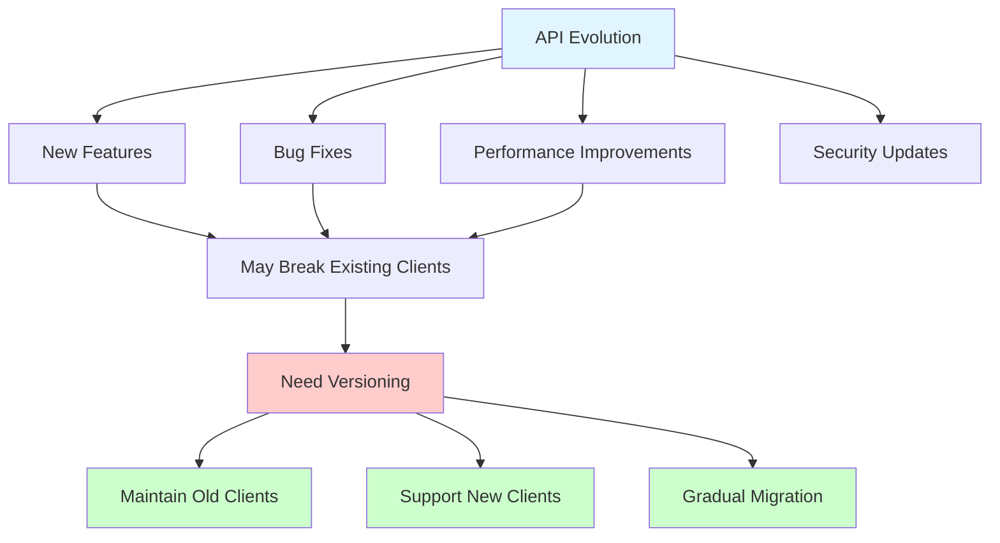
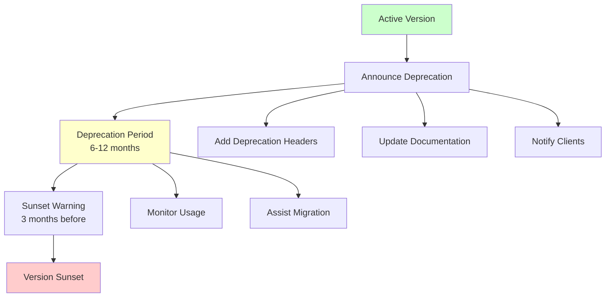

# API Versioning - Complete Guide

## Table of Contents
- [Introduction](#introduction)
- [Why API Versioning](#why-api-versioning)
- [Versioning Strategies](#versioning-strategies)
- [Version Number Schemes](#version-number-schemes)
- [Breaking vs Non-Breaking Changes](#breaking-vs-non-breaking-changes)
- [Implementation Patterns](#implementation-patterns)
- [Migration Strategies](#migration-strategies)
- [Deprecation Process](#deprecation-process)
- [Version Compatibility](#version-compatibility)
- [Best Practices](#best-practices)
- [Real-World Examples](#real-world-examples)

## Introduction

API versioning is the practice of managing changes to your API in a way that allows clients to continue using older versions while new versions are developed. Proper versioning ensures backward compatibility and smooth transitions for API consumers.

## Why API Versioning

### The Need for Versioning



**Key Reasons:**
- Prevent breaking existing client applications
- Allow time for client migration
- Support multiple client versions simultaneously
- Enable rapid innovation without disrupting users
- Provide clear communication about API changes

## Versioning Strategies

### 1. URI Path Versioning (Most Common)

Version number in the URL path.

```javascript
// Implementation
const express = require('express');
const app = express();

// Version 1 routes
app.use('/api/v1', v1Router);

// Version 2 routes
app.use('/api/v2', v2Router);

// Version 3 routes
app.use('/api/v3', v3Router);

// V1 Router
const v1Router = express.Router();
v1Router.get('/users', (req, res) => {
    res.json({
        version: 'v1',
        users: [
            { id: 1, fullName: 'John Doe', emailAddress: 'john@example.com' }
        ]
    });
});

// V2 Router (Breaking changes)
const v2Router = express.Router();
v2Router.get('/users', (req, res) => {
    res.json({
        version: 'v2',
        data: [
            { 
                id: 1, 
                name: 'John Doe',  // Changed from fullName
                email: 'john@example.com'  // Changed from emailAddress
            }
        ]
    });
});

// V3 Router (More changes)
const v3Router = express.Router();
v3Router.get('/users', (req, res) => {
    res.json({
        version: 'v3',
        data: [
            {
                id: 1,
                profile: {
                    firstName: 'John',  // Split name
                    lastName: 'Doe'
                },
                contact: {
                    email: 'john@example.com'
                }
            }
        ]
    });
});
```

**Pros:**
- Most explicit and visible
- Easy to route and cache
- Clear in logs and monitoring
- Simple to understand

**Cons:**
- Duplicates URL structure
- Can lead to code duplication
- More routes to maintain

### 2. Query Parameter Versioning

Version specified as query parameter.

```javascript
// Implementation
app.get('/api/users', (req, res) => {
    const version = req.query.version || 'v1';
    
    switch(version) {
        case 'v1':
            return handleV1Users(req, res);
        case 'v2':
            return handleV2Users(req, res);
        case 'v3':
            return handleV3Users(req, res);
        default:
            return res.status(400).json({
                error: 'Unsupported API version',
                supportedVersions: ['v1', 'v2', 'v3']
            });
    }
});

// Usage
// GET /api/users?version=v2
// GET /api/users?version=v3
```

**Pros:**
- Keeps URL structure clean
- Easy to add version parameter
- Can default to latest version

**Cons:**
- Less visible than path versioning
- Harder to cache
- Can be forgotten by developers
- Not RESTful

### 3. Header Versioning (Custom Header)

Version in custom HTTP header.

```javascript
// Implementation
const versionMiddleware = (req, res, next) => {
    const version = req.headers['api-version'] || 
                    req.headers['x-api-version'] || 
                    'v1';
    
    req.apiVersion = version;
    next();
};

app.use(versionMiddleware);

app.get('/api/users', (req, res) => {
    const handler = versionHandlers[req.apiVersion];
    
    if (!handler) {
        return res.status(400).json({
            error: 'Unsupported API version',
            received: req.apiVersion,
            supported: Object.keys(versionHandlers)
        });
    }
    
    handler(req, res);
});

const versionHandlers = {
    'v1': handleV1Users,
    'v2': handleV2Users,
    'v3': handleV3Users
};

// Client usage
// curl -H "API-Version: v2" https://api.example.com/users
```

**Pros:**
- Clean URLs
- Doesn't pollute query parameters
- Flexible and extensible

**Cons:**
- Less visible (hidden in headers)
- Harder to test (can't just click links)
- Caching complexity
- Not beginner-friendly

### 4. Content Negotiation (Accept Header)

Version specified in Accept header using media types.

```javascript
// Implementation
app.get('/api/users', (req, res) => {
    const accept = req.headers.accept;
    
    // Parse Accept header
    if (accept.includes('application/vnd.myapi.v3+json')) {
        return handleV3Users(req, res);
    } else if (accept.includes('application/vnd.myapi.v2+json')) {
        return handleV2Users(req, res);
    } else if (accept.includes('application/vnd.myapi.v1+json') || 
               accept.includes('application/json')) {
        return handleV1Users(req, res);
    }
    
    res.status(406).json({
        error: 'Not Acceptable',
        message: 'Unsupported media type',
        supported: [
            'application/vnd.myapi.v1+json',
            'application/vnd.myapi.v2+json',
            'application/vnd.myapi.v3+json'
        ]
    });
});

// Client usage
// curl -H "Accept: application/vnd.myapi.v2+json" https://api.example.com/users
```

**Pros:**
- Most RESTful approach
- Standard HTTP mechanism
- Clean URLs

**Cons:**
- Complex to implement
- Hard to test manually
- Unfamiliar to many developers
- Caching complications

### 5. Subdomain Versioning

Version in subdomain.

```javascript
// Implementation (using vhost middleware)
const vhost = require('vhost');

// V1 on subdomain
app.use(vhost('v1.api.example.com', v1App));

// V2 on subdomain
app.use(vhost('v2.api.example.com', v2App));

// Latest on main domain
app.use(vhost('api.example.com', latestApp));

// Client usage
// https://v1.api.example.com/users
// https://v2.api.example.com/users
```

**Pros:**
- Very clear separation
- Easy to deploy different versions separately
- Can use different infrastructure per version

**Cons:**
- Requires DNS management
- More complex deployment
- SSL certificate management
- Potential CORS issues

## Version Number Schemes

### Semantic Versioning

```javascript
// Semantic Versioning: MAJOR.MINOR.PATCH
const versionInfo = {
    version: '2.3.1',
    major: 2,  // Breaking changes
    minor: 3,  // New features (backward compatible)
    patch: 1   // Bug fixes (backward compatible)
};

// Version comparison
class SemanticVersion {
    constructor(versionString) {
        const [major, minor, patch] = versionString.split('.').map(Number);
        this.major = major;
        this.minor = minor;
        this.patch = patch || 0;
    }
    
    isBreakingChange(other) {
        return this.major !== other.major;
    }
    
    isNewFeature(other) {
        return this.major === other.major && this.minor > other.minor;
    }
    
    isBugFix(other) {
        return this.major === other.major && 
               this.minor === other.minor && 
               this.patch > other.patch;
    }
    
    toString() {
        return `${this.major}.${this.minor}.${this.patch}`;
    }
}

// Usage
const v1 = new SemanticVersion('2.3.1');
const v2 = new SemanticVersion('3.0.0');

console.log(v2.isBreakingChange(v1)); // true
```

### Simple Integer Versioning

```javascript
// Simple: v1, v2, v3
const versions = {
    v1: { released: '2022-01-01', deprecated: '2024-01-01', sunset: '2025-01-01' },
    v2: { released: '2023-01-01', deprecated: null, sunset: null },
    v3: { released: '2024-01-01', deprecated: null, sunset: null }
};

// Version management
class VersionManager {
    constructor() {
        this.versions = new Map();
    }
    
    registerVersion(version, config) {
        this.versions.set(version, {
            ...config,
            handlers: new Map()
        });
    }
    
    addHandler(version, endpoint, handler) {
        const versionInfo = this.versions.get(version);
        if (!versionInfo) {
            throw new Error(`Version ${version} not registered`);
        }
        versionInfo.handlers.set(endpoint, handler);
    }
    
    getHandler(version, endpoint) {
        const versionInfo = this.versions.get(version);
        if (!versionInfo) {
            return null;
        }
        return versionInfo.handlers.get(endpoint);
    }
    
    isDeprecated(version) {
        const versionInfo = this.versions.get(version);
        if (!versionInfo || !versionInfo.deprecated) {
            return false;
        }
        return new Date() >= new Date(versionInfo.deprecated);
    }
    
    isSunset(version) {
        const versionInfo = this.versions.get(version);
        if (!versionInfo || !versionInfo.sunset) {
            return false;
        }
        return new Date() >= new Date(versionInfo.sunset);
    }
}
```

### Date-based Versioning

```javascript
// Date-based: 2024-01, 2024-02, etc.
const dateBased = {
    '2024-01': { released: '2024-01-01', changes: ['Initial release'] },
    '2024-02': { released: '2024-02-01', changes: ['Added user filters'] },
    '2024-03': { released: '2024-03-01', changes: ['Breaking: Changed response format'] }
};

// Parse date version
class DateVersion {
    constructor(versionString) {
        const [year, month] = versionString.split('-').map(Number);
        this.year = year;
        this.month = month;
        this.date = new Date(year, month - 1);
    }
    
    isNewer(other) {
        return this.date > other.date;
    }
    
    monthsSince(other) {
        return (this.year - other.year) * 12 + (this.month - other.month);
    }
    
    toString() {
        return `${this.year}-${String(this.month).padStart(2, '0')}`;
    }
}
```

## Breaking vs Non-Breaking Changes

### Breaking Changes (Require New Version)

```javascript
// Examples of breaking changes
const breakingChanges = {
    // 1. Removing fields
    v1Response: {
        id: 1,
        name: 'John',
        age: 30,
        deprecated_field: 'value'  // Removed in v2
    },
    v2Response: {
        id: 1,
        name: 'John',
        age: 30
        // deprecated_field removed - BREAKING
    },
    
    // 2. Renaming fields
    v1User: {
        user_id: 1,
        full_name: 'John Doe'
    },
    v2User: {
        id: 1,              // renamed from user_id - BREAKING
        name: 'John Doe'    // renamed from full_name - BREAKING
    },
    
    // 3. Changing field types
    v1Product: {
        price: '19.99'  // string
    },
    v2Product: {
        price: 19.99    // number - BREAKING
    },
    
    // 4. Changing response structure
    v1List: [
        { id: 1, name: 'Item 1' }
    ],
    v2List: {
        data: [
            { id: 1, name: 'Item 1' }
        ],
        meta: { total: 1 }
        // Wrapped in object - BREAKING
    },
    
    // 5. Removing endpoints
    // DELETE /api/v1/users/:id  (existed)
    // DELETE /api/v2/users/:id  (removed) - BREAKING
    
    // 6. Changing HTTP methods
    // POST /api/v1/users/:id/activate
    // PATCH /api/v2/users/:id { status: 'active' } - BREAKING
    
    // 7. Changing required fields
    v1CreateUser: {
        required: ['email']
    },
    v2CreateUser: {
        required: ['email', 'name']  // Added required field - BREAKING
    }
};
```

### Non-Breaking Changes (Same Version)

```javascript
// Examples of non-breaking changes
const nonBreakingChanges = {
    // 1. Adding optional fields
    v1Response: {
        id: 1,
        name: 'John'
    },
    v1_1Response: {
        id: 1,
        name: 'John',
        email: 'john@example.com'  // Added optional field - OK
    },
    
    // 2. Adding new endpoints
    // GET /api/v1/users/:id (existed)
    // GET /api/v1/users/:id/posts (added) - OK
    
    // 3. Adding optional query parameters
    // GET /api/v1/users (existed)
    // GET /api/v1/users?role=admin (added filter) - OK
    
    // 4. Making required fields optional
    v1CreatePost: {
        required: ['title', 'content', 'author']
    },
    v1_1CreatePost: {
        required: ['title', 'content']  // Made author optional - OK
    },
    
    // 5. Adding values to enums
    v1Status: ['active', 'inactive'],
    v1_1Status: ['active', 'inactive', 'pending']  // Added value - OK (usually)
    
    // 6. Improving error messages
    v1Error: { error: 'Invalid input' },
    v1_1Error: { 
        error: 'Invalid input',
        details: 'Email format is invalid'  // More detail - OK
    }
};
```

### Change Detection System

```javascript
class APIChangeDetector {
    detectBreakingChanges(oldSchema, newSchema) {
        const breakingChanges = [];
        
        // Check for removed fields
        for (const field of Object.keys(oldSchema.properties)) {
            if (!newSchema.properties[field]) {
                breakingChanges.push({
                    type: 'FIELD_REMOVED',
                    field,
                    severity: 'BREAKING'
                });
            }
        }
        
        // Check for renamed fields
        for (const field of Object.keys(newSchema.properties)) {
            const oldField = oldSchema.properties[field];
            const newField = newSchema.properties[field];
            
            if (oldField && oldField.type !== newField.type) {
                breakingChanges.push({
                    type: 'TYPE_CHANGED',
                    field,
                    oldType: oldField.type,
                    newType: newField.type,
                    severity: 'BREAKING'
                });
            }
        }
        
        // Check for new required fields
        const oldRequired = new Set(oldSchema.required || []);
        const newRequired = new Set(newSchema.required || []);
        
        for (const field of newRequired) {
            if (!oldRequired.has(field)) {
                breakingChanges.push({
                    type: 'REQUIRED_FIELD_ADDED',
                    field,
                    severity: 'BREAKING'
                });
            }
        }
        
        return breakingChanges;
    }
    
    recommendVersion(currentVersion, changes) {
        const hasBreaking = changes.some(c => c.severity === 'BREAKING');
        
        if (hasBreaking) {
            return this.bumpMajor(currentVersion);
        }
        
        const hasNewFeatures = changes.some(c => c.type === 'FIELD_ADDED');
        if (hasNewFeatures) {
            return this.bumpMinor(currentVersion);
        }
        
        return this.bumpPatch(currentVersion);
    }
    
    bumpMajor(version) {
        const [major] = version.split('.').map(Number);
        return `${major + 1}.0.0`;
    }
    
    bumpMinor(version) {
        const [major, minor] = version.split('.').map(Number);
        return `${major}.${minor + 1}.0`;
    }
    
    bumpPatch(version) {
        const [major, minor, patch] = version.split('.').map(Number);
        return `${major}.${minor}.${patch + 1}`;
    }
}
```

## Implementation Patterns

### Version Router Pattern

```javascript
class VersionRouter {
    constructor() {
        this.versions = new Map();
        this.defaultVersion = null;
    }
    
    register(version, routes) {
        this.versions.set(version, routes);
        if (!this.defaultVersion) {
            this.defaultVersion = version;
        }
    }
    
    setDefault(version) {
        if (!this.versions.has(version)) {
            throw new Error(`Version ${version} not registered`);
        }
        this.defaultVersion = version;
    }
    
    route(version = null) {
        version = version || this.defaultVersion;
        const routes = this.versions.get(version);
        
        if (!routes) {
            throw new Error(`Version ${version} not found`);
        }
        
        return routes;
    }
    
    middleware() {
        return (req, res, next) => {
            // Extract version from URL
            const match = req.path.match(/^\/api\/v(\d+)/);
            const version = match ? `v${match[1]}` : this.defaultVersion;
            
            req.apiVersion = version;
            
            // Check if version exists
            if (!this.versions.has(version)) {
                return res.status(400).json({
                    error: 'Unsupported API version',
                    version,
                    supported: Array.from(this.versions.keys())
                });
            }
            
            next();
        };
    }
}

// Usage
const versionRouter = new VersionRouter();

// Register V1
versionRouter.register('v1', v1Routes);

// Register V2
versionRouter.register('v2', v2Routes);

// Register V3
versionRouter.register('v3', v3Routes);

// Set default
versionRouter.setDefault('v3');

// Use middleware
app.use(versionRouter.middleware());
```

### Adapter Pattern for Version Compatibility

```javascript
// Transform between versions
class VersionAdapter {
    // Convert V1 to V2
    adaptV1ToV2(v1Data) {
        return {
            id: v1Data.user_id,
            email: v1Data.emailAddress,
            name: v1Data.fullName,
            status: v1Data.active ? 'active' : 'inactive',
            createdAt: v1Data.created_date
        };
    }
    
    // Convert V2 to V1
    adaptV2ToV1(v2Data) {
        return {
            user_id: v2Data.id,
            emailAddress: v2Data.email,
            fullName: v2Data.name,
            active: v2Data.status === 'active',
            created_date: v2Data.createdAt
        };
    }
    
    // Convert V2 to V3
    adaptV2ToV3(v2Data) {
        const [firstName, ...lastNameParts] = v2Data.name.split(' ');
        
        return {
            id: v2Data.id,
            profile: {
                firstName,
                lastName: lastNameParts.join(' ')
            },
            contact: {
                email: v2Data.email
            },
            status: v2Data.status,
            timestamps: {
                created: v2Data.createdAt,
                updated: v2Data.updatedAt
            }
        };
    }
    
    // Generic adapter
    adapt(data, fromVersion, toVersion) {
        const methodName = `adapt${fromVersion}To${toVersion}`;
        
        if (typeof this[methodName] !== 'function') {
            throw new Error(`Adapter from ${fromVersion} to ${toVersion} not found`);
        }
        
        return this[methodName](data);
    }
}

// Usage in endpoint
app.get('/api/:version/users/:id', async (req, res) => {
    const { version, id } = req.params;
    
    // Always fetch in latest format (V3)
    const userData = await userService.getUser(id);
    
    // Adapt to requested version
    let response = userData;
    if (version !== 'v3') {
        const adapter = new VersionAdapter();
        response = adapter.adapt(userData, 'V3', version.toUpperCase());
    }
    
    res.json({ data: response });
});
```

### Strategy Pattern for Version Handlers

```javascript
class VersionStrategy {
    constructor(version) {
        this.version = version;
    }
    
    handle(req, res) {
        throw new Error('handle() must be implemented');
    }
}

class V1UserStrategy extends VersionStrategy {
    async handle(req, res) {
        const users = await db.users.find();
        
        // V1 format
        res.json({
            users: users.map(u => ({
                user_id: u.id,
                fullName: u.name,
                emailAddress: u.email
            }))
        });
    }
}

class V2UserStrategy extends VersionStrategy {
    async handle(req, res) {
        const users = await db.users.find();
        
        // V2 format
        res.json({
            data: users.map(u => ({
                id: u.id,
                name: u.name,
                email: u.email,
                status: u.status
            })),
            meta: {
                total: users.length,
                version: 'v2'
            }
        });
    }
}

class V3UserStrategy extends VersionStrategy {
    async handle(req, res) {
        const users = await db.users.find();
        
        // V3 format with nested structure
        res.json({
            data: users.map(u => ({
                id: u.id,
                profile: {
                    firstName: u.firstName,
                    lastName: u.lastName
                },
                contact: {
                    email: u.email
                },
                status: u.status
            })),
            pagination: {
                total: users.length,
                page: 1,
                limit: users.length
            }
        });
    }
}

// Strategy factory
class VersionStrategyFactory {
    static create(version, resource) {
        const strategies = {
            v1: { users: V1UserStrategy },
            v2: { users: V2UserStrategy },
            v3: { users: V3UserStrategy }
        };
        
        const Strategy = strategies[version]?.[resource];
        
        if (!Strategy) {
            throw new Error(`No strategy for ${version}/${resource}`);
        }
        
        return new Strategy(version);
    }
}

// Usage
app.get('/api/:version/users', async (req, res, next) => {
    try {
        const strategy = VersionStrategyFactory.create(
            req.params.version,
            'users'
        );
        await strategy.handle(req, res);
    } catch (error) {
        next(error);
    }
});
```

## Migration Strategies

### Gradual Migration with Feature Flags

```javascript
class MigrationManager {
    constructor() {
        this.features = new Map();
    }
    
    registerFeature(name, config) {
        this.features.set(name, {
            enabled: config.enabled || false,
            rolloutPercentage: config.rolloutPercentage || 0,
            users: new Set(config.users || []),
            version: config.version
        });
    }
    
    isEnabled(featureName, userId = null) {
        const feature = this.features.get(featureName);
        
        if (!feature) {
            return false;
        }
        
        // Fully enabled
        if (feature.enabled) {
            return true;
        }
        
        // Specific users
        if (userId && feature.users.has(userId)) {
            return true;
        }
        
        // Percentage rollout
        if (userId && feature.rolloutPercentage > 0) {
            const hash = this.hashUserId(userId);
            return hash < feature.rolloutPercentage;
        }
        
        return false;
    }
    
    hashUserId(userId) {
        let hash = 0;
        for (let i = 0; i < userId.length; i++) {
            hash = ((hash << 5) - hash) + userId.charCodeAt(i);
        }
        return Math.abs(hash % 100);
    }
    
    middleware() {
        return (req, res, next) => {
            req.features = {
                isEnabled: (feature) => this.isEnabled(feature, req.user?.id)
            };
            next();
        };
    }
}

// Usage
const migrationManager = new MigrationManager();

// Register v2 features with gradual rollout
migrationManager.registerFeature('v2-user-api', {
    enabled: false,
    rolloutPercentage: 10,  // 10% of users
    version: 'v2'
});

app.use(migrationManager.middleware());

app.get('/api/users', async (req, res) => {
    if (req.features.isEnabled('v2-user-api')) {
        // Use V2 handler
        return handleV2Users(req, res);
    }
    
    // Use V1 handler
    return handleV1Users(req, res);
});
```

### Dual-Write Pattern

```javascript
// Write to both old and new versions during migration
class DualWriteService {
    constructor(oldService, newService) {
        this.oldService = oldService;
        this.newService = newService;
        this.writeToNew = true;
        this.readFromNew = false;
    }
    
    async create(data) {
        // Always write to old (primary)
        const oldResult = await this.oldService.create(data);
        
        // Optionally write to new
        if (this.writeToNew) {
            try {
                await this.newService.create(this.transformData(data));
            } catch (error) {
                console.error('Dual write to new service failed:', error);
                // Don't fail the request
            }
        }
        
        return oldResult;
    }
    
    async get(id) {
        if (this.readFromNew) {
            try {
                return await this.newService.get(id);
            } catch (error) {
                console.error('Read from new service failed, falling back:', error);
            }
        }
        
        return await this.oldService.get(id);
    }
    
    transformData(data) {
        // Transform between old and new formats
        return data;
    }
    
    // Migration phases
    enableDualWrite() {
        this.writeToNew = true;
    }
    
    enableReadFromNew() {
        this.readFromNew = true;
    }
    
    completeMyration() {
        this.writeToNew = false;
        this.readFromNew = true;
    }
}
```

## Deprecation Process

### Deprecation Workflow



### Implementation

```javascript
class DeprecationManager {
    constructor() {
        this.deprecations = new Map();
    }
    
    deprecate(version, config) {
        this.deprecations.set(version, {
            deprecatedDate: config.deprecatedDate || new Date(),
            sunsetDate: config.sunsetDate,
            reason: config.reason,
            migrationGuide: config.migrationGuide,
            successor: config.successor
        });
    }
    
    getDeprecationInfo(version) {
        return this.deprecations.get(version);
    }
    
    isDeprecated(version) {
        const info = this.deprecations.get(version);
        return info !== undefined;
    }
    
    isSunset(version) {
        const info = this.deprecations.get(version);
        if (!info || !info.sunsetDate) {
            return false;
        }
        return new Date() >= new Date(info.sunsetDate);
    }
    
    daysUntilSunset(version) {
        const info = this.deprecations.get(version);
        if (!info || !info.sunsetDate) {
            return null;
        }
        const now = new Date();
        const sunset = new Date(info.sunsetDate);
        const diffTime = sunset - now;
        const diffDays = Math.ceil(diffTime / (1000 * 60 * 60 * 24));
        return diffDays;
    }
    
    middleware() {
        return (req, res, next) => {
            const version = req.apiVersion || 'v1';
            
            // Check if version is sunset
            if (this.isSunset(version)) {
                const info = this.getDeprecationInfo(version);
                return res.status(410).json({
                    error: 'API version no longer available',
                    code: 'VERSION_SUNSET',
                    version,
                    sunsetDate: info.sunsetDate,
                    successor: info.successor,
                    migrationGuide: info.migrationGuide
                });
            }
            
            // Add deprecation headers
            if (this.isDeprecated(version)) {
                const info = this.getDeprecationInfo(version);
                const daysLeft = this.daysUntilSunset(version);
                
                res.set({
                    'X-API-Deprecated': 'true',
                    'X-API-Deprecation-Date': info.deprecatedDate.toISOString(),
                    'X-API-Sunset-Date': info.sunsetDate?.toISOString(),
                    'X-API-Successor-Version': info.successor,
                    'Link': `<${info.migrationGuide}>; rel="deprecation"`,
                    'Warning': `299 - "API version ${version} is deprecated. ${daysLeft ? `Sunset in ${daysLeft} days.` : ''} Please migrate to ${info.successor}."`
                });
            }
            
            next();
        };
    }
}

// Usage
const deprecationManager = new DeprecationManager();

// Deprecate V1
deprecationManager.deprecate('v1', {
    deprecatedDate: new Date('2024-01-01'),
    sunsetDate: new Date('2025-01-01'),
    reason: 'Replaced by V2 with improved features',
    migrationGuide: 'https://docs.api.com/migration/v1-to-v2',
    successor: 'v2'
});

app.use(deprecationManager.middleware());

// Client notification system
class ClientNotificationService {
    async notifyDeprecation(version, info) {
        // Get all clients using this version
        const clients = await this.getClientsUsingVersion(version);
        
        for (const client of clients) {
            await this.sendEmail({
                to: client.email,
                subject: `API Version ${version} Deprecation Notice`,
                body: this.generateDeprecationEmail(version, info)
            });
            
            // Log notification
            await this.logNotification({
                clientId: client.id,
                version,
                type: 'deprecation',
                sentAt: new Date()
            });
        }
    }
    
    generateDeprecationEmail(version, info) {
        return `
Dear API User,

We're writing to inform you that API version ${version} has been deprecated
and will be sunset on ${info.sunsetDate.toISOString().split('T')[0]}.

Reason: ${info.reason}

Please migrate to ${info.successor} before the sunset date.

Migration guide: ${info.migrationGuide}

If you need assistance, please contact our support team.

Best regards,
API Team
        `.trim();
    }
}
```

## Version Compatibility

### Backward Compatibility Layer

```javascript
class BackwardCompatibilityLayer {
    constructor() {
        this.transformers = new Map();
    }
    
    registerTransformer(fromVersion, toVersion, transformer) {
        const key = `${fromVersion}->${toVersion}`;
        this.transformers.set(key, transformer);
    }
    
    async transform(data, fromVersion, toVersion) {
        const key = `${fromVersion}->${toVersion}`;
        const transformer = this.transformers.get(key);
        
        if (!transformer) {
            // Try to find path through intermediate versions
            return await this.findPath(data, fromVersion, toVersion);
        }
        
        return transformer(data);
    }
    
    async findPath(data, fromVersion, toVersion) {
        // Simple BFS to find transformation path
        const queue = [[fromVersion, data]];
        const visited = new Set([fromVersion]);
        
        while (queue.length > 0) {
            const [currentVersion, currentData] = queue.shift();
            
            if (currentVersion === toVersion) {
                return currentData;
            }
            
            // Try all possible transformations
            for (const [key, transformer] of this.transformers.entries()) {
                const [from, to] = key.split('->');
                
                if (from === currentVersion && !visited.has(to)) {
                    visited.add(to);
                    const transformed = await transformer(currentData);
                    queue.push([to, transformed]);
                }
            }
        }
        
        throw new Error(`No transformation path from ${fromVersion} to ${toVersion}`);
    }
}

// Register transformers
const compatibility = new BackwardCompatibilityLayer();

compatibility.registerTransformer('v1', 'v2', (data) => ({
    id: data.user_id,
    email: data.emailAddress,
    name: data.fullName,
    status: data.active ? 'active' : 'inactive'
}));

compatibility.registerTransformer('v2', 'v3', (data) => {
    const [firstName, ...rest] = data.name.split(' ');
    return {
        id: data.id,
        profile: {
            firstName,
            lastName: rest.join(' ')
        },
        contact: {
            email: data.email
        },
        status: data.status
    };
});

compatibility.registerTransformer('v3', 'v2', (data) => ({
    id: data.id,
    email: data.contact.email,
    name: `${data.profile.firstName} ${data.profile.lastName}`,
    status: data.status
}));
```

### Version Negotiation

```javascript
class VersionNegotiator {
    constructor() {
        this.supportedVersions = ['v1', 'v2', 'v3'];
        this.defaultVersion = 'v3';
    }
    
    negotiate(requestedVersion, clientMinVersion = null) {
        // Client requests specific version
        if (requestedVersion) {
            if (this.isSupported(requestedVersion)) {
                return {
                    version: requestedVersion,
                    negotiated: false
                };
            }
            
            // Try to find compatible version
            const compatible = this.findCompatibleVersion(requestedVersion);
            if (compatible) {
                return {
                    version: compatible,
                    negotiated: true,
                    original: requestedVersion
                };
            }
            
            throw new Error(`Version ${requestedVersion} not supported`);
        }
        
        // Client specifies minimum version
        if (clientMinVersion) {
            const suitable = this.findSuitableVersion(clientMinVersion);
            return {
                version: suitable,
                negotiated: true
            };
        }
        
        // Use default
        return {
            version: this.defaultVersion,
            negotiated: false
        };
    }
    
    isSupported(version) {
        return this.supportedVersions.includes(version);
    }
    
    findCompatibleVersion(requestedVersion) {
        const versionNumber = parseInt(requestedVersion.replace('v', ''));
        
        // Find closest higher version
        for (const supported of this.supportedVersions) {
            const supportedNumber = parseInt(supported.replace('v', ''));
            if (supportedNumber >= versionNumber) {
                return supported;
            }
        }
        
        return null;
    }
    
    findSuitableVersion(minVersion) {
        const minNumber = parseInt(minVersion.replace('v', ''));
        
        // Find highest version >= minimum
        return this.supportedVersions
            .filter(v => parseInt(v.replace('v', '')) >= minNumber)
            .pop();
    }
    
    middleware() {
        return (req, res, next) => {
            const requested = req.headers['api-version'] || 
                            req.query.version;
            const minimum = req.headers['api-minimum-version'];
            
            try {
                const result = this.negotiate(requested, minimum);
                
                req.apiVersion = result.version;
                
                if (result.negotiated) {
                    res.set('X-API-Version-Negotiated', 'true');
                    res.set('X-API-Version-Provided', result.version);
                    if (result.original) {
                        res.set('X-API-Version-Requested', result.original);
                    }
                }
                
                next();
            } catch (error) {
                res.status(400).json({
                    error: error.message,
                    supported: this.supportedVersions
                });
            }
        };
    }
}
```

## Best Practices

### Version Lifecycle Management

```javascript
class VersionLifecycle {
    constructor() {
        this.versions = new Map();
    }
    
    addVersion(version, config) {
        this.versions.set(version, {
            status: 'active',
            released: config.released || new Date(),
            deprecated: null,
            sunset: null,
            usage: 0,
            lastUsed: null
        });
    }
    
    deprecateVersion(version, sunsetDate) {
        const info = this.versions.get(version);
        if (!info) {
            throw new Error(`Version ${version} not found`);
        }
        
        info.status = 'deprecated';
        info.deprecated = new Date();
        info.sunset = sunsetDate;
        
        // Notify stakeholders
        this.notifyDeprecation(version, info);
    }
    
    sunsetVersion(version) {
        const info = this.versions.get(version);
        if (!info) {
            throw new Error(`Version ${version} not found`);
        }
        
        info.status = 'sunset';
        
        // Final notification
        this.notifySunset(version, info);
    }
    
    trackUsage(version) {
        const info = this.versions.get(version);
        if (info) {
            info.usage++;
            info.lastUsed = new Date();
        }
    }
    
    getUsageStats() {
        const stats = {};
        
        for (const [version, info] of this.versions.entries()) {
            stats[version] = {
                status: info.status,
                usage: info.usage,
                lastUsed: info.lastUsed,
                age: this.calculateAge(info.released)
            };
        }
        
        return stats;
    }
    
    calculateAge(releaseDate) {
        const now = new Date();
        const age = now - new Date(releaseDate);
        return Math.floor(age / (1000 * 60 * 60 * 24)); // days
    }
    
    shouldDeprecate(version) {
        const info = this.versions.get(version);
        if (!info || info.status !== 'active') {
            return false;
        }
        
        // Deprecate if very low usage and old
        const usage = info.usage;
        const age = this.calculateAge(info.released);
        
        return usage < 100 && age > 365; // < 100 requests and > 1 year old
    }
}
```

### Version Documentation

```javascript
// Automated documentation generator
class VersionDocGenerator {
    generateChangelog(versions) {
        let changelog = '# API Changelog\n\n';
        
        for (const [version, info] of Object.entries(versions).reverse()) {
            changelog += `## ${version} - ${info.released}\n\n`;
            
            if (info.deprecated) {
                changelog += `> **Deprecated**: ${info.deprecated}\n`;
                changelog += `> **Sunset Date**: ${info.sunset}\n\n`;
            }
            
            changelog += '### Changes\n\n';
            
            for (const change of info.changes) {
                const emoji = this.getChangeEmoji(change.type);
                changelog += `- ${emoji} ${change.description}\n`;
            }
            
            if (info.breaking.length > 0) {
                changelog += '\n### Breaking Changes\n\n';
                for (const breaking of info.breaking) {
                    changelog += `- ⚠️ ${breaking}\n`;
                }
            }
            
            changelog += '\n---\n\n';
        }
        
        return changelog;
    }
    
    getChangeEmoji(type) {
        const emojis = {
            'feature': '✨',
            'fix': '🐛',
            'performance': '⚡',
            'security': '🔒',
            'deprecation': '⚠️',
            'breaking': '💥'
        };
        return emojis[type] || '📝';
    }
    
    generateMigrationGuide(fromVersion, toVersion, changes) {
        return `
# Migration Guide: ${fromVersion} → ${toVersion}

## Overview

This guide helps you migrate from API ${fromVersion} to ${toVersion}.

## Breaking Changes

${changes.breaking.map(c => `### ${c.title}

**Before (${fromVersion}):**
\`\`\`json
${JSON.stringify(c.before, null, 2)}
\`\`\`

**After (${toVersion}):**
\`\`\`json
${JSON.stringify(c.after, null, 2)}
\`\`\`

**Migration Steps:**
${c.steps.map((s, i) => `${i + 1}. ${s}`).join('\n')}
`).join('\n\n')}

## New Features

${changes.features.map(f => `- ${f.description}`).join('\n')}

## Deprecated Features

${changes.deprecated.map(d => `- ${d.name}: ${d.alternative}`).join('\n')}

## Timeline

- Deprecation announced: ${changes.deprecationDate}
- Sunset date: ${changes.sunsetDate}
- Recommended migration deadline: ${changes.recommendedDeadline}

## Support

If you need help with migration, please contact: support@example.com
        `.trim();
    }
}
```

### Testing Across Versions

```javascript
// Version compatibility testing
class VersionTester {
    constructor() {
        this.versions = ['v1', 'v2', 'v3'];
        this.testCases = new Map();
    }
    
    addTestCase(name, versions, test) {
        this.testCases.set(name, { versions, test });
    }
    
    async runTests() {
        const results = {
            passed: 0,
            failed: 0,
            tests: []
        };
        
        for (const [name, testCase] of this.testCases.entries()) {
            for (const version of testCase.versions) {
                const result = await this.runTest(name, version, testCase.test);
                results.tests.push(result);
                
                if (result.passed) {
                    results.passed++;
                } else {
                    results.failed++;
                }
            }
        }
        
        return results;
    }
    
    async runTest(name, version, test) {
        try {
            await test(version);
            return {
                name,
                version,
                passed: true
            };
        } catch (error) {
            return {
                name,
                version,
                passed: false,
                error: error.message
            };
        }
    }
}

// Usage
const tester = new VersionTester();

tester.addTestCase('Create User', ['v1', 'v2', 'v3'], async (version) => {
    const response = await fetch(`https://api.example.com/${version}/users`, {
        method: 'POST',
        headers: { 'Content-Type': 'application/json' },
        body: JSON.stringify({
            email: 'test@example.com',
            name: 'Test User',
            password: 'password123'
        })
    });
    
    if (!response.ok) {
        throw new Error(`Expected 201, got ${response.status}`);
    }
    
    const data = await response.json();
    if (!data.id && !data.data?.id) {
        throw new Error('Response missing user ID');
    }
});

// Run tests
const results = await tester.runTests();
console.log(`Tests: ${results.passed} passed, ${results.failed} failed`);
```

## Real-World Examples

### Example 1: Stripe API Versioning

```javascript
// Stripe uses date-based versioning
const stripeExample = {
    versions: {
        '2024-01-01': {
            changes: [
                'Added payment_method_options parameter',
                'Deprecated card parameter'
            ]
        },
        '2023-10-16': {
            changes: [
                'Updated charge object structure',
                'Added automatic_payment_methods'
            ]
        }
    },
    
    // Version selection
    headers: {
        'Stripe-Version': '2024-01-01'
    },
    
    // Pinned version per account
    accountVersion: '2023-10-16',
    
    // Gradual rollout
    upgradeProcess: [
        'Test in development with new version',
        'Update code for breaking changes',
        'Test in staging',
        'Pin account to new version',
        'Monitor for issues'
    ]
};
```

### Example 2: GitHub API Versioning

```javascript
// GitHub uses Accept header versioning
const githubExample = {
    // V3 (current)
    headers: {
        'Accept': 'application/vnd.github.v3+json'
    },
    
    // Beta features
    betaHeaders: {
        'Accept': 'application/vnd.github.v3+json; charset=utf-8',
        'X-GitHub-Api-Version': '2024-01-01'
    },
    
    // Version in URL for GraphQL
    graphqlUrl: 'https://api.github.com/graphql',
    
    // Deprecation warnings in response headers
    deprecationHeaders: {
        'X-GitHub-Deprecation-Notice': 'This endpoint is deprecated',
        'Link': '<https://docs.github.com/migration>; rel="deprecation"'
    }
};
```

### Example 3: AWS API Versioning

```javascript
// AWS uses target header versioning
const awsExample = {
    // DynamoDB
    dynamoDBHeaders: {
        'X-Amz-Target': 'DynamoDB_20120810.GetItem',
        'Content-Type': 'application/x-amz-json-1.0'
    },
    
    // Multiple services can have different versions
    services: {
        'DynamoDB': '20120810',
        'EC2': '2016-11-15',
        'S3': '2006-03-01'
    },
    
    // Version in query parameters for some services
    ec2Request: {
        url: 'https://ec2.amazonaws.com/',
        params: {
            'Action': 'DescribeInstances',
            'Version': '2016-11-15'
        }
    }
};
```

## Summary

### Key Takeaways

✅ **Choose the Right Strategy**
- URI path versioning for simplicity and visibility
- Header versioning for clean URLs
- Consider your API consumers and use cases

✅ **Plan for Evolution**
- Document all breaking changes
- Provide clear migration guides
- Give adequate deprecation notice (6-12 months)

✅ **Maintain Backward Compatibility**
- Avoid breaking changes when possible
- Use adapters for compatibility
- Support multiple versions during transition

✅ **Communicate Clearly**
- Announce deprecations early
- Provide migration assistance
- Use deprecation headers

✅ **Monitor Usage**
- Track version adoption
- Identify clients needing migration help
- Make data-driven sunset decisions

✅ **Test Thoroughly**
- Test across all supported versions
- Ensure compatibility layers work
- Validate migration paths

### Versioning Checklist

- [ ] Choose versioning strategy
- [ ] Define version number scheme
- [ ] Document breaking vs non-breaking changes
- [ ] Implement version routing
- [ ] Add deprecation warnings
- [ ] Create migration guides
- [ ] Set up usage tracking
- [ ] Plan deprecation timeline
- [ ] Notify affected clients
- [ ] Support during transition
- [ ] Monitor migration progress
- [ ] Sunset old versions safely

## Related Resources

- [api.md](./api.md) - Complete API design guide
- [best_practises.md](./best_practises.md) - System design best practices
- [Semantic Versioning](https://semver.org/) - Version numbering standard
- [API Evolution Patterns](https://martinfowler.com/articles/enterpriseREST.html)

---

*Last updated: January 2025*