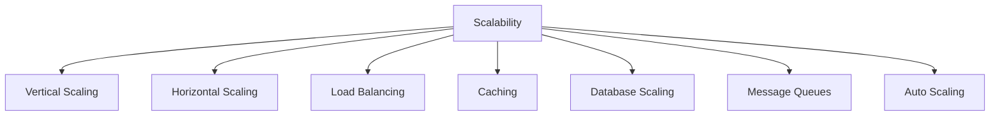
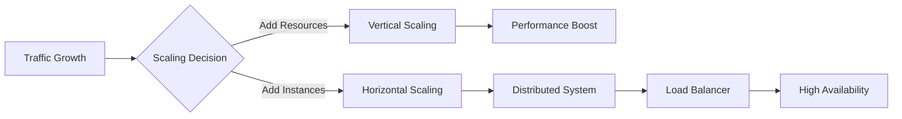
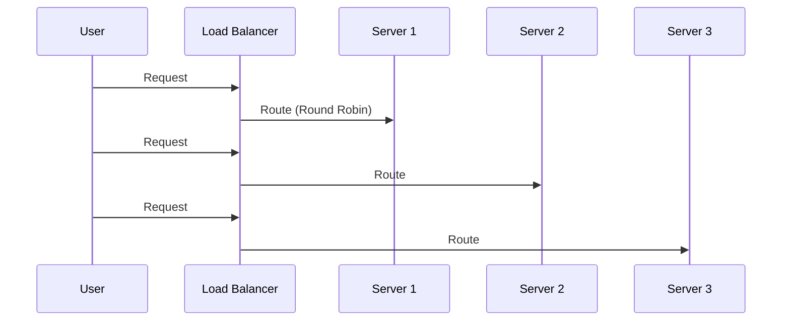
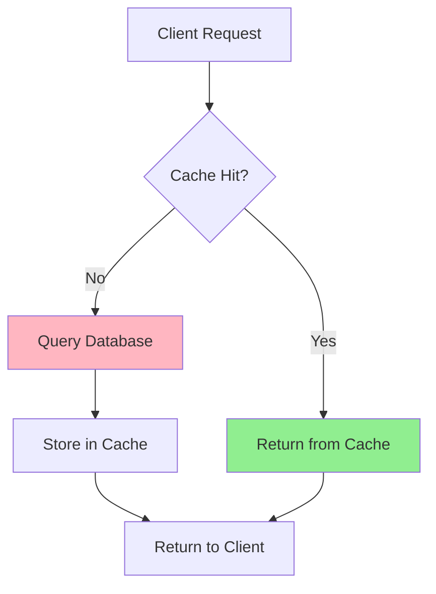
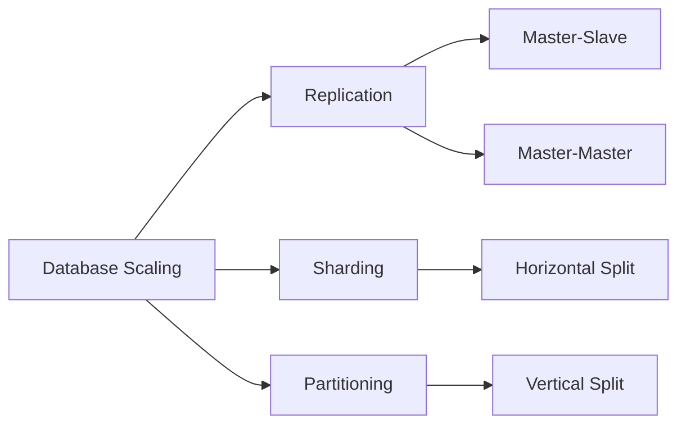
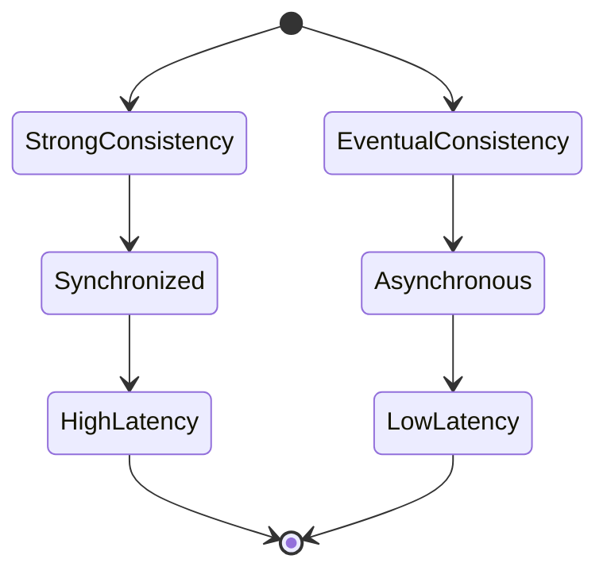
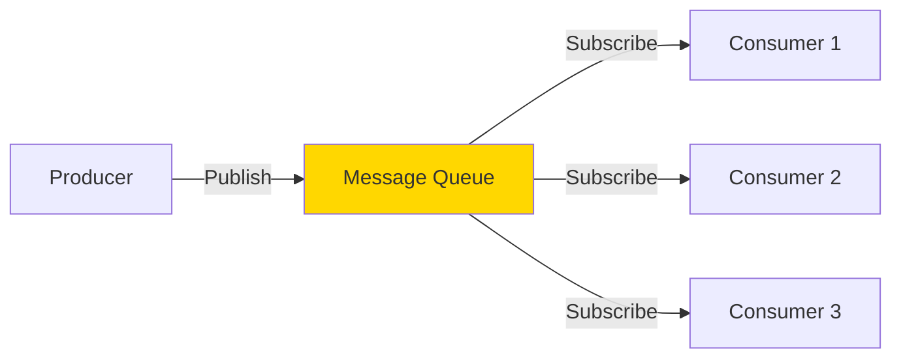
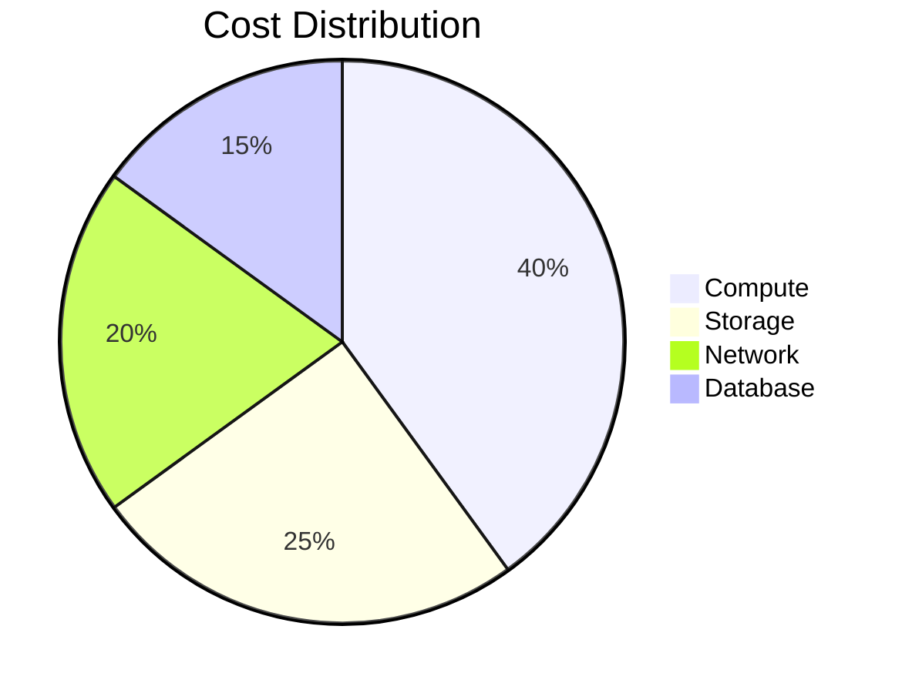
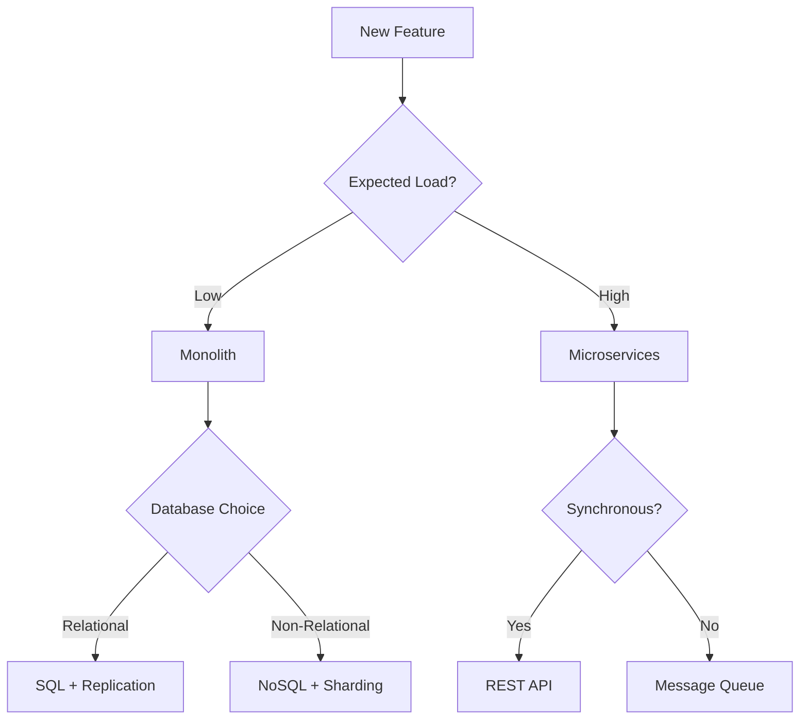

# System Design: Scalability

## Overview

This repository contains comprehensive guides on building scalable systems. Scalability is the capability of a system to handle growing amounts of work by adding resources to the system.



## Core Concepts

### Scaling Strategies



**📚 Learn more:**
- [Vertical Scaling](vertical_scaling.md) - Scaling up with more powerful hardware
- [Horizontal Scaling](horizontal_scaling.md) - Scaling out with more instances
- [Auto Scaling](auto_scaling.md) - Dynamic resource allocation

### Load Distribution



**📚 Learn more:** [Load Balancing](load_balancing.md)

## Architecture Patterns

### Caching Strategy



**📚 Learn more:** [Caching Strategies](caching_strategies.md)

### Database Scaling



**📚 Learn more:** [Database Scaling](database_scaling.md)

## Quick Start Example

Simple load balancer implementation:

```javascript
class LoadBalancer {
  constructor(servers) {
    this.servers = servers;
    this.current = 0;
  }

  getServer() {
    const server = this.servers[this.current];
    this.current = (this.current + 1) % this.servers.length;
    return server;
  }
}

// Usage
const lb = new LoadBalancer(['server1', 'server2', 'server3']);
console.log(lb.getServer()); // server1
console.log(lb.getServer()); // server2
```

## Data Consistency



**📚 Learn more:** [Eventual Consistency](eventual_consistency.md)

## Message Queue Pattern



**📚 Learn more:** [Message Queues](message_queues.md)

## Cost Optimization



**📚 Learn more:** [Cost Scaling](cost_scaling.md)

## Best Practices Checklist

- ✅ Monitor system metrics continuously
- ✅ Implement caching at multiple levels
- ✅ Use horizontal scaling for flexibility
- ✅ Design for failure and redundancy
- ✅ Optimize database queries
- ✅ Implement proper load balancing
- ✅ Use asynchronous processing where possible
- ✅ Plan for auto-scaling based on demand

**📚 Learn more:** [Best Practices](best_practises.md)

## Real-World Applications

Explore how major companies implement these patterns:

**📚 See examples:** [Case Studies](case-studies/)

## System Health Monitoring

```javascript
class HealthMonitor {
  checkHealth(servers) {
    return servers.map(s => ({
      name: s.name,
      status: s.responseTime < 200 ? 'healthy' : 'degraded',
      load: s.connections / s.maxConnections
    }));
  }
}
```

## Architecture Decision Flow



## Getting Started

1. Start with [Vertical Scaling](vertical_scaling.md) for simple applications
2. Move to [Horizontal Scaling](horizontal_scaling.md) as traffic grows
3. Implement [Load Balancing](load_balancing.md) for distribution
4. Add [Caching Strategies](caching_strategies.md) to reduce load
5. Scale your [Database](database_scaling.md) appropriately
6. Use [Message Queues](message_queues.md) for async processing
7. Enable [Auto Scaling](auto_scaling.md) for dynamic workloads
8. Follow [Best Practices](best_practises.md) throughout

## Contributing

Review our [Best Practices](best_practises.md) guide before contributing to ensure consistency.

---

**💡 Tip:** Start small, measure everything, and scale incrementally based on actual needs rather than anticipated ones.