# Auto Scaling for API Gateways

## Overview

Auto scaling automatically adjusts the number of API gateway instances based on real-time metrics and predefined policies. It eliminates manual intervention, optimizes resource utilization, and ensures consistent performance during traffic fluctuations.

## Theory and Concepts

### What is Auto Scaling?

Auto scaling is a dynamic resource management strategy that:
- **Monitors system metrics**: CPU, memory, request rate, latency
- **Evaluates policies**: Determines when to scale up or down
- **Executes actions**: Adds or removes instances automatically
- **Optimizes costs**: Matches capacity to actual demand

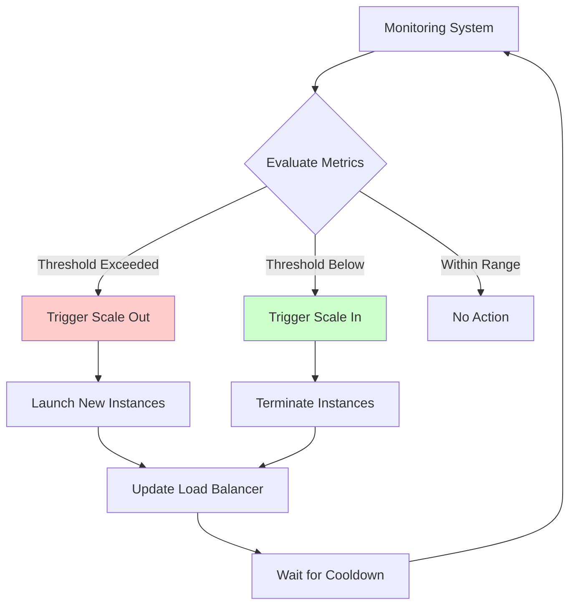

### Core Components

1. **Metrics Source**: Where data comes from (CloudWatch, Prometheus, Datadog)
2. **Scaling Policy**: Rules defining when and how to scale
3. **Scaling Actions**: Adding or removing instances
4. **Cooldown Period**: Time to wait before next scaling action
5. **Health Checks**: Ensuring new instances are ready (see [monitoring.md](./monitoring.md))

## Scaling Policies

### 1. Target Tracking Scaling

Maintains a specific metric at target value.

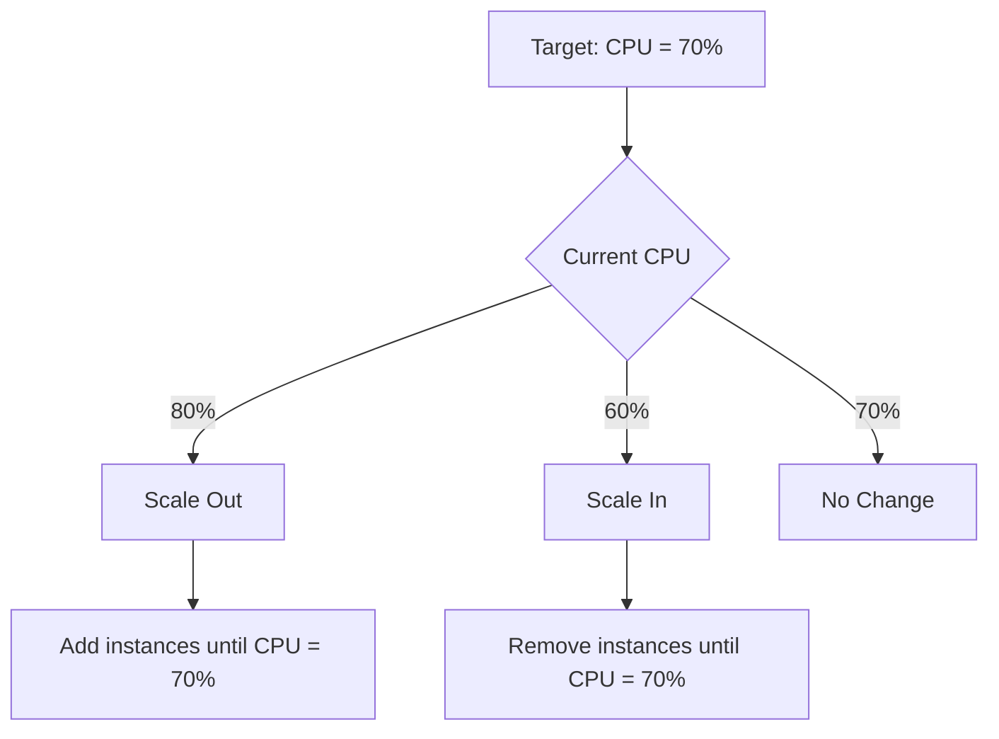

**Example Policy**:
```javascript
// Conceptual target tracking configuration
const targetTrackingPolicy = {
  targetValue: 70.0,
  metric: 'CPUUtilization',
  scaleOutCooldown: 180, // seconds
  scaleInCooldown: 300
};
```

**Use Case**: Most common for general workloads. Simple to configure and understand.

**Advantages**:
- Automatic calculation of scaling amount
- Handles gradual changes well
- Most intuitive policy type

**Disadvantages**:
- May not respond quickly to sudden spikes
- Can oscillate if cooldown too short

### 2. Step Scaling

Different scaling amounts based on alarm severity.

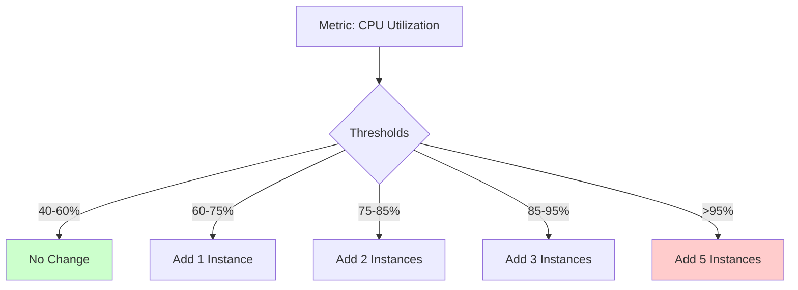

**Example Policy**:
```javascript
// Conceptual step scaling configuration
const stepScalingPolicy = {
  metric: 'CPUUtilization',
  steps: [
    { lowerBound: 60, upperBound: 75, adjustment: 1 },
    { lowerBound: 75, upperBound: 85, adjustment: 2 },
    { lowerBound: 85, upperBound: 95, adjustment: 3 },
    { lowerBound: 95, upperBound: null, adjustment: 5 }
  ]
};
```

**Use Case**: When you need aggressive scaling for severe threshold breaches.

**Advantages**:
- Fine-grained control
- Faster response to critical situations
- Prevents under-provisioning

**Disadvantages**:
- More complex to configure
- Can over-provision if not tuned properly

### 3. Scheduled Scaling

Proactive scaling based on known patterns.

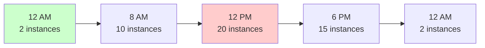

**Example Policy**:
```javascript
// Conceptual scheduled scaling configuration
const scheduledActions = [
  { cron: '0 8 * * MON-FRI', minSize: 10, maxSize: 50 },
  { cron: '0 12 * * *', minSize: 20, maxSize: 100 },
  { cron: '0 18 * * *', minSize: 15, maxSize: 50 },
  { cron: '0 0 * * *', minSize: 2, maxSize: 10 }
];
```

**Use Case**: Predictable traffic patterns (business hours, weekly cycles, seasonal events).

**Advantages**:
- Proactive rather than reactive
- Instances ready before traffic arrives
- Prevents cold start issues

**Disadvantages**:
- Requires historical data analysis
- Doesn't adapt to unexpected changes
- May waste resources if patterns change

### 4. Predictive Scaling

Uses machine learning to forecast demand.

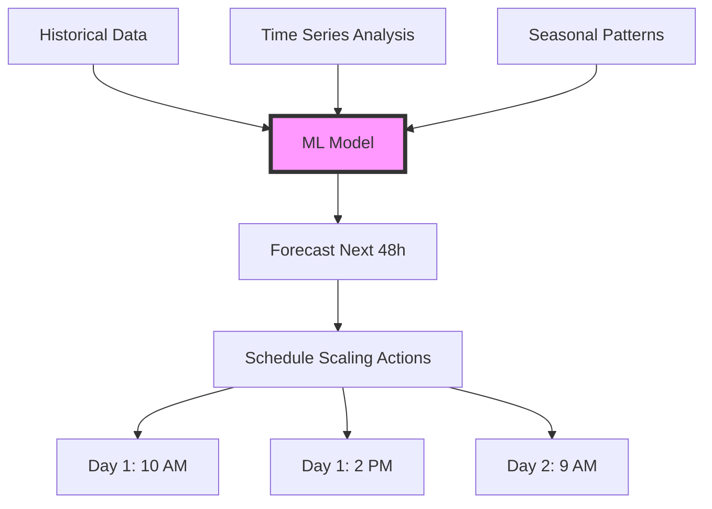

**Theory**: Analyzes weeks of historical data to predict future load.

**Example Pattern**:
```javascript
// Conceptual predictive scaling workflow
async function generatePredictiveSchedule() {
  const historicalData = await fetchMetrics({ days: 30 });
  const forecast = await mlModel.predict(historicalData);
  
  return forecast.map(prediction => ({
    timestamp: prediction.time,
    desiredCapacity: calculateCapacity(prediction.load)
  }));
}
```

**Use Case**: Complex patterns with multiple influencing factors.

**Advantages**:
- Most proactive approach
- Adapts to evolving patterns
- Combines historical trends with anomaly detection

**Disadvantages**:
- Requires significant historical data
- More complex setup and tuning
- Predictions can be wrong for unprecedented events

## Scaling Metrics

### Primary Metrics

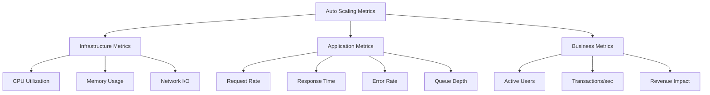

### Metric Selection Guidelines

**CPU Utilization**:
- **When to use**: CPU-bound workloads (routing, transformation, encryption)
- **Target**: 60-70% for steady state
- **Warning**: May not reflect actual load for I/O-bound workloads

**Memory Utilization**:
- **When to use**: Memory-intensive caching, large request/response bodies
- **Target**: 70-80% for steady state
- **Warning**: Watch for memory leaks

**Request Rate**:
- **When to use**: Traffic-driven scaling, clear capacity per instance
- **Target**: 70% of maximum throughput per instance
- **Advantage**: Direct correlation with load

**Response Time / Latency**:
- **When to use**: User experience is critical
- **Target**: P95 latency below SLA threshold
- **Advantage**: Focuses on actual user impact

**Custom Metrics**:
```javascript
// Conceptual custom metric for queue depth
async function publishQueueDepthMetric() {
  const queueDepth = await getQueueDepth();
  const capacity = getCurrentCapacity();
  const queuePerInstance = queueDepth / capacity;
  
  await cloudwatch.putMetric({
    namespace: 'APIGateway',
    metricName: 'QueueDepthPerInstance',
    value: queuePerInstance
  });
}
```

## Scaling Boundaries

### Min and Max Capacity

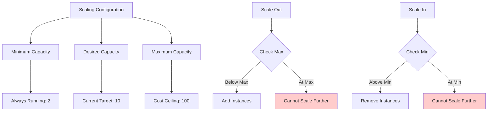

**Best Practices**:
- **Minimum**: Enough for base load + high availability (typically 2-3)
- **Maximum**: Cost constraint + backend capacity limits
- **Desired**: Calculated by auto scaling policies

### Scaling Limits

```javascript
// Conceptual scaling configuration
const autoScalingConfig = {
  minSize: 2,              // High availability baseline
  maxSize: 50,             // Cost protection + backend limits
  desiredCapacity: 10,     // Current optimal
  defaultCooldown: 300,    // 5 minutes between scaling actions
  healthCheckGracePeriod: 180, // 3 minutes for instance warmup
  terminationPolicies: ['OldestInstance', 'Default']
};
```

## Cooldown Periods

### Why Cooldown Matters

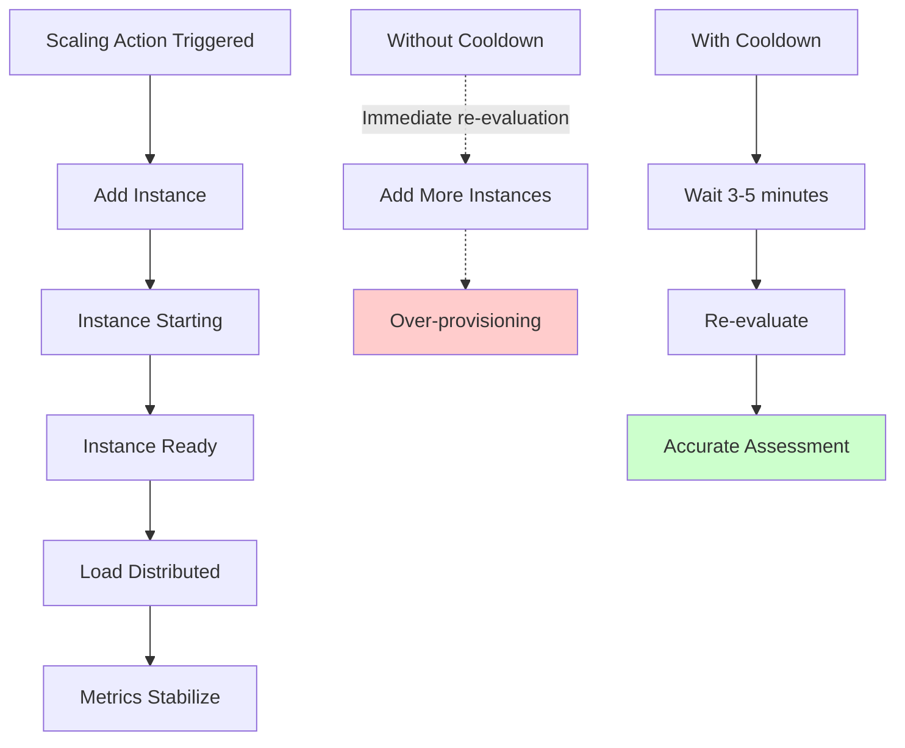

**Cooldown Duration Guidelines**:
- **Scale Out**: 180-300 seconds (allow metrics to reflect new capacity)
- **Scale In**: 300-600 seconds (be conservative, avoid thrashing)
- **High-traffic periods**: Longer cooldowns to prevent oscillation
- **Low-traffic periods**: Shorter cooldowns for cost optimization

## Scaling Velocity

### Scaling Speed vs Stability

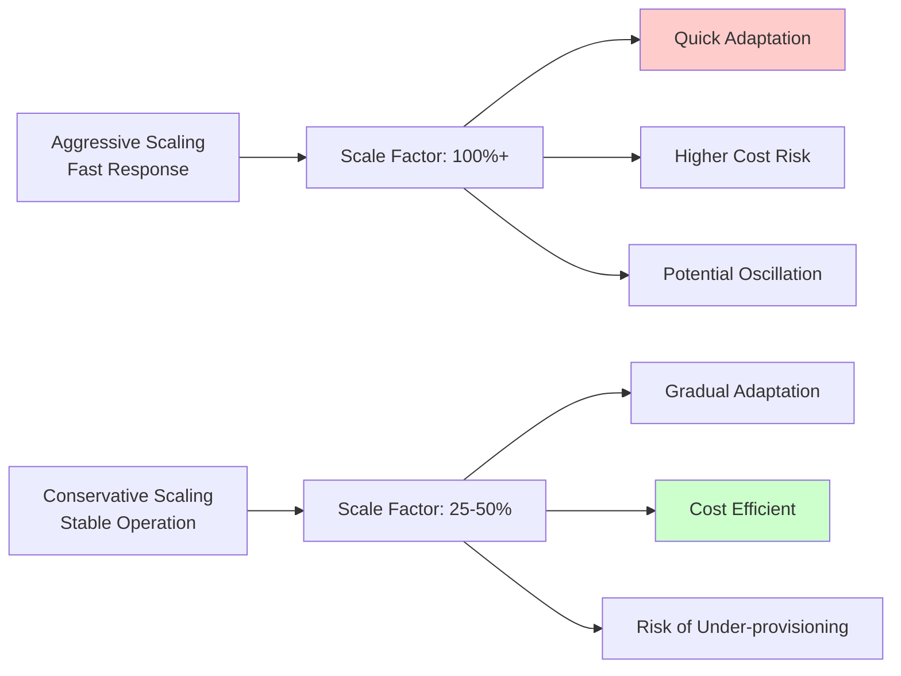

**Scaling Factor Calculation**:
```javascript
// Conceptual scaling calculation
function calculateScalingAmount(currentCapacity, targetMetric, currentMetric) {
  const utilizationRatio = currentMetric / targetMetric;
  const requiredCapacity = currentCapacity * utilizationRatio;
  const scalingAmount = Math.ceil(requiredCapacity - currentCapacity);
  
  // Apply scaling velocity limits
  const maxScaleOut = Math.ceil(currentCapacity * 0.5); // 50% max increase
  const maxScaleIn = Math.floor(currentCapacity * 0.25); // 25% max decrease
  
  return Math.min(scalingAmount, maxScaleOut);
}
```

## Health Checks and Lifecycle Hooks

### Instance Lifecycle

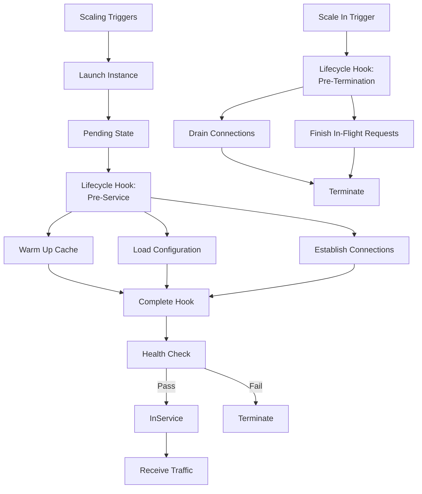

**Lifecycle Hook Example**:
```javascript
// Conceptual pre-service hook handler
async function handleLaunchingHook(instanceId) {
  // Warm up cache
  await warmUpCache();
  
  // Pre-fetch configuration
  await loadRemoteConfig();
  
  // Establish backend connections
  await initializeConnectionPools();
  
  // Signal completion
  await autoScaling.completeLifecycleAction({
    instanceId,
    lifecycleHookName: 'launching-hook',
    lifecycleActionResult: 'CONTINUE'
  });
}
```

### Health Check Strategy

Integrate with load balancer health checks:
- **Initial delay**: 60-120 seconds for application startup
- **Interval**: 30 seconds for active monitoring
- **Unhealthy threshold**: 2-3 consecutive failures
- **Healthy threshold**: 2 consecutive successes

See [monitoring.md](./monitoring.md) for comprehensive health check patterns.

## Integration with Load Balancers

### Dynamic Registration

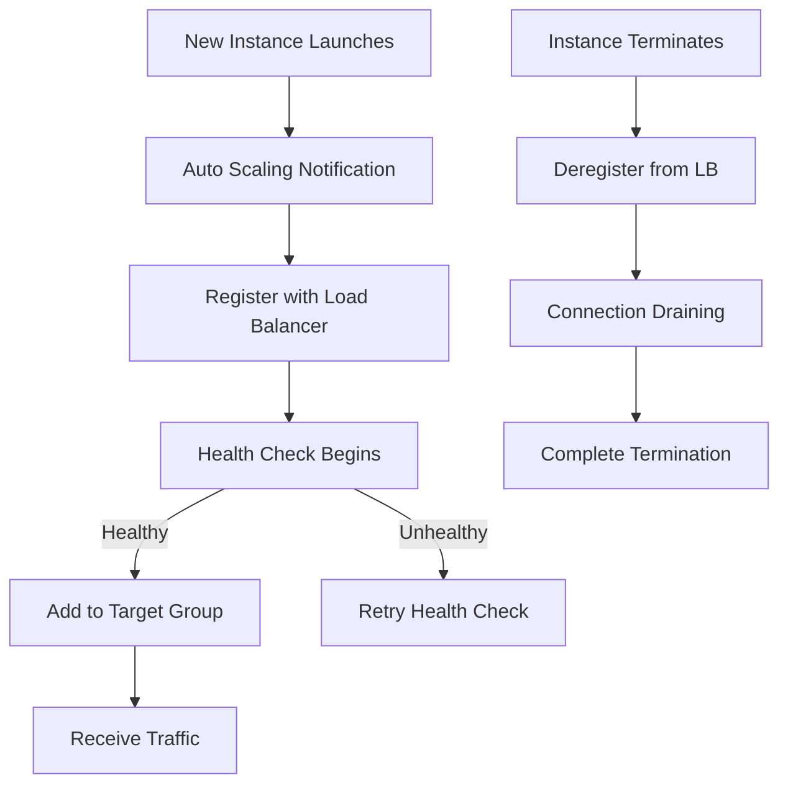

**Theory**: Auto scaling group automatically manages load balancer target registration.

### Connection Draining

```javascript
// Conceptual connection draining configuration
const drainingConfig = {
  enabled: true,
  timeout: 300, // 5 minutes
  
  // Handler for graceful shutdown
  async handleTermination() {
    // Stop accepting new connections
    await stopAcceptingConnections();
    
    // Wait for in-flight requests
    await waitForActiveRequests(this.timeout);
    
    // Force close remaining after timeout
    await forceCloseConnections();
  }
};
```

**Best Practice**: Set draining timeout longer than longest expected request duration.

## Cost Optimization Strategies

### Right-Sizing Instances

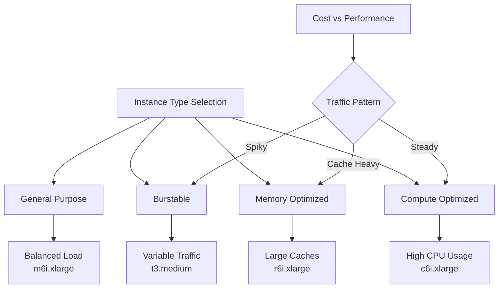

**Selection Criteria**:
```javascript
// Conceptual instance type selector
function selectInstanceType(workloadProfile) {
  const { cpuIntensive, memoryIntensive, trafficPattern } = workloadProfile;
  
  if (cpuIntensive && trafficPattern === 'steady') {
    return 'c6i.xlarge'; // Compute optimized
  }
  
  if (memoryIntensive) {
    return 'r6i.xlarge'; // Memory optimized
  }
  
  if (trafficPattern === 'bursty') {
    return 't3.medium'; // Burstable with credits
  }
  
  return 'm6i.xlarge'; // General purpose default
}
```

### Mixed Instance Policies

Combine instance types for cost optimization:

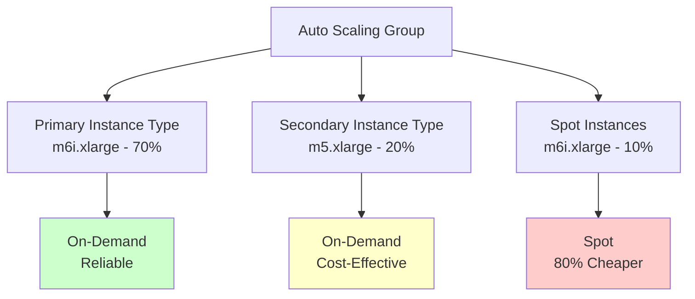

**Benefits**:
- Diversification reduces spot interruption risk
- Leverage newer generation instances when available
- Balance cost and performance

### Spot Instance Integration

```javascript
// Conceptual spot instance configuration
const spotConfig = {
  maxSpotPercentage: 30, // Maximum 30% spot instances
  spotAllocationStrategy: 'capacity-optimized',
  onDemandBaseCapacity: 2, // Always 2 on-demand instances
  onDemandPercentageAboveBase: 70,
  
  spotInstancePools: [
    { instanceType: 'm6i.xlarge', weight: 1 },
    { instanceType: 'm5.xlarge', weight: 1 },
    { instanceType: 'm5a.xlarge', weight: 1 }
  ]
};
```

**Best Practices**:
- Keep critical base capacity on on-demand
- Use multiple spot pools for diversification
- Implement graceful handling of spot interruptions

## Scaling Across Regions

### Multi-Region Auto Scaling

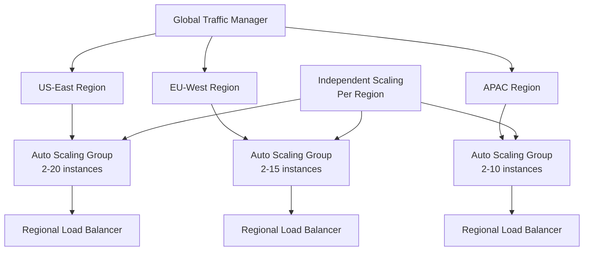

**Theory**: Each region scales independently based on local traffic patterns.

**Advantages**:
- Optimized for regional demand
- Reduced latency for users
- Compliance with data residency requirements

**Challenges**:
- More complex monitoring (see [monitoring.md](./monitoring.md))
- Regional capacity planning
- Cross-region state synchronization

## Advanced Patterns

### Predictive Auto Scaling with ML

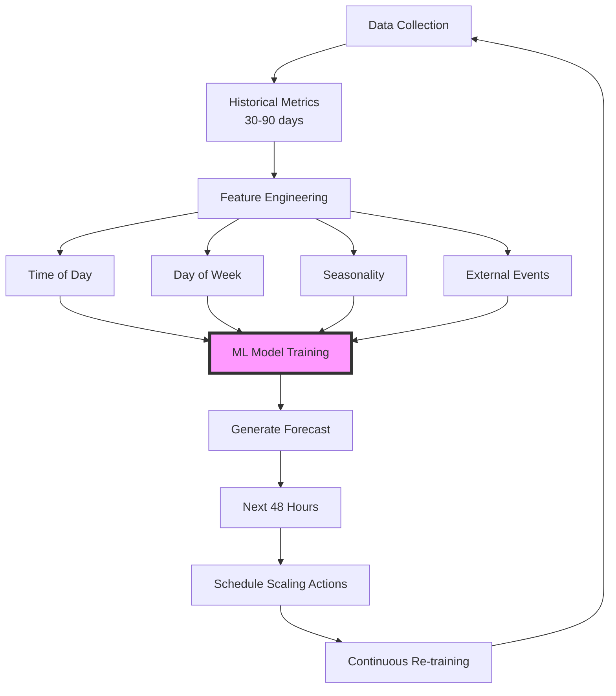

**Implementation Approach**:
```javascript
// Conceptual predictive scaling workflow
class PredictiveScaling {
  async generateSchedule() {
    // Fetch historical data
    const metrics = await this.fetchHistoricalMetrics({ days: 30 });
    
    // Extract features
    const features = this.extractFeatures(metrics);
    
    // Generate predictions
    const predictions = await this.mlModel.predict(features);
    
    // Create scaling schedule
    return predictions.map(p => ({
      timestamp: p.time,
      desiredCapacity: this.calculateCapacity(p.predictedLoad),
      confidence: p.confidence
    }));
  }
  
  calculateCapacity(predictedLoad) {
    const capacityPerInstance = 1000; // requests per second
    return Math.ceil(predictedLoad / capacityPerInstance);
  }
}
```

### Custom Metric-Based Scaling

Scale based on application-specific metrics:

```javascript
// Conceptual custom metric publisher
async function publishCustomMetrics() {
  // Business metric: API calls per authenticated user
  const activeUsers = await getActiveUserCount();
  const requestRate = await getRequestRate();
  const requestsPerUser = requestRate / activeUsers;
  
  await cloudwatch.putMetric({
    namespace: 'APIGateway/Custom',
    metricName: 'RequestsPerUser',
    value: requestsPerUser,
    unit: 'Count'
  });
  
  // Scale based on this metric
  if (requestsPerUser > targetRequestsPerUser) {
    // Need more capacity per user
    triggerScaleOut();
  }
}
```

**Use Cases**:
- Business-driven scaling (orders/sec, transactions/sec)
- Queue-based scaling (message backlog)
- External API quota utilization

### Proactive Scaling for Events

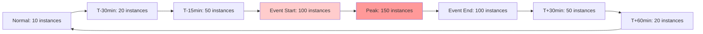

**Configuration Example**:
```javascript
// Conceptual event-based scaling
const eventScalingPlan = {
  eventName: 'Product Launch',
  startTime: '2025-03-15T18:00:00Z',
  
  schedule: [
    { offset: -1800, capacity: 20 },  // 30 min before
    { offset: -900, capacity: 50 },   // 15 min before
    { offset: 0, capacity: 100 },     // Event start
    { offset: 1800, capacity: 50 },   // 30 min after
    { offset: 3600, capacity: 20 }    // 1 hour after
  ]
};
```

## Monitoring and Alerting

### Key Metrics to Track

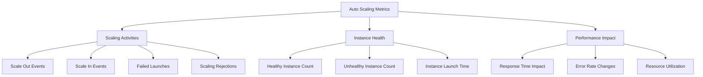

### Critical Alerts

```javascript
// Conceptual alerting rules
const autoScalingAlerts = [
  {
    name: 'MaxCapacityReached',
    condition: 'instances >= maxCapacity',
    severity: 'critical',
    action: 'Investigate capacity limits'
  },
  {
    name: 'HighScalingFrequency',
    condition: 'scalingEventsPerHour > 10',
    severity: 'warning',
    action: 'Review cooldown and thresholds'
  },
  {
    name: 'InstanceLaunchFailures',
    condition: 'failedLaunches > 3',
    severity: 'critical',
    action: 'Check quotas and AMI health'
  },
  {
    name: 'ScalingLag',
    condition: 'timeToScale > 300',
    severity: 'warning',
    action: 'Optimize launch time'
  }
];
```

See [monitoring.md](./monitoring.md) for comprehensive observability strategies.

## Testing Auto Scaling

### Load Testing Approach

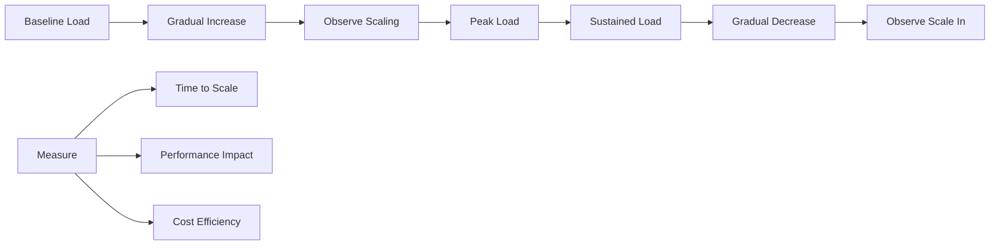

**Test Scenarios**:
1. **Gradual traffic increase**: Verify smooth scaling
2. **Sudden spike**: Test rapid scale-out response
3. **Sustained high load**: Ensure stability at max capacity
4. **Traffic drop**: Verify cost-effective scale-in
5. **Oscillating load**: Check for scaling thrashing

### Simulation Framework

```javascript
// Conceptual load testing for auto scaling
class AutoScalingTest {
  async runScalingTest() {
    // Phase 1: Baseline
    await this.generateLoad(100); // 100 req/s
    await this.waitAndObserve(300);
    
    // Phase 2: Ramp up
    for (let load = 200; load <= 2000; load += 200) {
      await this.generateLoad(load);
      await this.waitAndObserve(180); // Observe scaling
    }
    
    // Phase 3: Sustained peak
    await this.generateLoad(2000);
    await this.waitAndObserve(600);
    
    // Phase 4: Ramp down
    for (let load = 1800; load >= 100; load -= 200) {
      await this.generateLoad(load);
      await this.waitAndObserve(300); // Observe scale-in
    }
    
    // Analyze results
    return this.analyzeScalingBehavior();
  }
}
```

## Best Practices

### 1. Start Conservative, Tune Aggressively

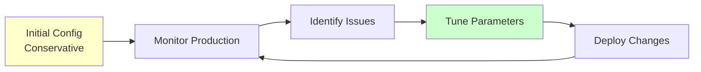

**Initial Settings**:
- Higher target values (75% CPU vs 60%)
- Longer cooldowns (5 min vs 3 min)
- Smaller scaling increments (25% vs 50%)

### 2. Multiple Metrics for Scaling

Don't rely on a single metric:

```javascript
// Conceptual composite scaling decision
function shouldScaleOut(metrics) {
  const cpuHigh = metrics.cpu > 70;
  const memoryHigh = metrics.memory > 80;
  const latencyHigh = metrics.p95Latency > 500;
  const requestRateHigh = metrics.requestRate > 1000;
  
  // Scale if any two metrics are breached
  const breaches = [cpuHigh, memoryHigh, latencyHigh, requestRateHigh]
    .filter(Boolean).length;
  
  return breaches >= 2;
}
```

### 3. Implement Circuit Breakers

Protect against scaling storms (see [patterns.md](./patterns.md)):

```javascript
// Conceptual scaling circuit breaker
class ScalingCircuitBreaker {
  constructor() {
    this.maxScalingEventsPerHour = 10;
    this.recentEvents = [];
  }
  
  canScale() {
    const oneHourAgo = Date.now() - 3600000;
    this.recentEvents = this.recentEvents.filter(t => t > oneHourAgo);
    
    if (this.recentEvents.length >= this.maxScalingEventsPerHour) {
      console.warn('Scaling circuit breaker triggered');
      return false;
    }
    
    return true;
  }
  
  recordScalingEvent() {
    this.recentEvents.push(Date.now());
  }
}
```

### 4. Graceful Shutdown Handling

```javascript
// Conceptual graceful shutdown
process.on('SIGTERM', async () => {
  console.log('Received SIGTERM, starting graceful shutdown');
  
  // Stop accepting new requests
  await server.stopAcceptingConnections();
  
  // Wait for in-flight requests to complete
  await server.waitForActiveRequests({ timeout: 30000 });
  
  // Close database connections
  await database.close();
  
  // Signal completion
  process.exit(0);
});
```

### 5. Cost Awareness

```javascript
// Conceptual cost monitoring
async function monitorScalingCost() {
  const currentCost = await calculateHourlyCost();
  const optimalCost = await calculateOptimalCost();
  
  const efficiency = optimalCost / currentCost;
  
  if (efficiency < 0.7) {
    // Over-provisioned by more than 30%
    await adjustScalingPolicies({ scaleInMore: true });
  }
}
```

## Troubleshooting Common Issues

### Issue 1: Scaling Thrashing

**Symptoms**: Frequent scale out/in cycles

**Causes**:
- Cooldown period too short
- Metric threshold too sensitive
- Instance startup time not accounted for

**Solutions**:
- Increase cooldown periods
- Widen threshold bands
- Use step scaling with wider ranges

### Issue 2: Slow Response to Traffic Spikes

**Symptoms**: Performance degradation before scaling activates

**Causes**:
- Alarm evaluation period too long
- Insufficient scaling velocity
- Instance launch time too slow

**Solutions**:
- Reduce evaluation periods
- Increase scaling increment
- Optimize instance AMI (see [architecture.md](./architecture.md))

### Issue 3: Reaching Max Capacity

**Symptoms**: Instances at maximum, performance still degrading

**Causes**:
- Backend bottlenecks
- Database connection exhaustion
- Insufficient max capacity

**Solutions**:
- Scale backend services
- Implement caching (see [caching.md](./caching.md))
- Increase max capacity
- Add circuit breakers to protect backends (see [patterns.md](./patterns.md))

### Issue 4: Cost Overruns

**Symptoms**: Scaling costs exceed budget

**Causes**:
- Aggressive scaling policies
- Slow scale-in
- Not using spot instances
- Over-provisioned instance types

**Solutions**:
```javascript
// Conceptual cost control measures
const costOptimization = {
  // More conservative scaling
  scaleOutThreshold: 80,      // Higher threshold
  scaleInThreshold: 40,       // Lower threshold
  scaleInCooldown: 600,       // Longer cooldown for scale-in
  
  // Use smaller increments
  scalingIncrement: 1,        // Add 1 at a time
  
  // Mixed instance strategy
  spotPercentage: 30,
  instanceTypes: ['t3.medium', 't3.large']
};
```

### Issue 5: Uneven Load Distribution

**Symptoms**: Some instances overloaded while others idle

**Causes**:
- Sticky sessions without proper handling
- Inefficient load balancer algorithm
- Connection draining issues

**Solutions**:
- Use connection-based load balancing
- Implement proper session management (see [security.md](./security.md))
- Adjust connection draining timeout

## Integration with Other Components

### Caching Strategy

Auto scaling affects cache performance:

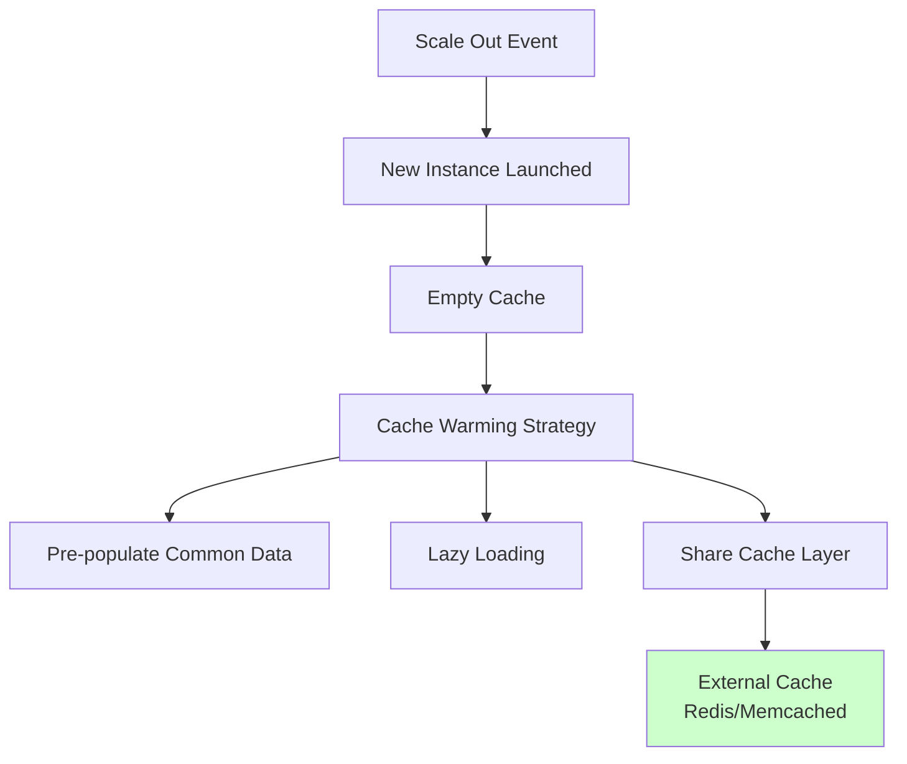

**Best Practice**: Use external distributed cache (see [caching.md](./caching.md)) to avoid cache stampede during scaling events.

### Rate Limiting

Coordinate rate limiting with auto scaling:

```javascript
// Conceptual adaptive rate limiting
function calculateRateLimit(currentInstances) {
  const baseRatePerInstance = 1000; // req/s per instance
  const totalCapacity = currentInstances * baseRatePerInstance;
  
  // Set global rate limit slightly below capacity
  return Math.floor(totalCapacity * 0.9);
}
```

See [security.md](./security.md) for comprehensive rate limiting strategies.

### Routing Logic

Complex routing may affect scaling decisions (see [routing.md](./routing.md)):

```mermaid
graph TD
    A[Request] --> B{Route Type}
    
    B -->|Public API| C[General Pool<br/>Auto Scaled]
    B -->|Premium API| D[Premium Pool<br/>Reserved Capacity]
    B -->|Internal API| E[Internal Pool<br/>Fixed Size]
    
    C --> C1[Scales 2-50]
    D --> D1[Fixed 10 instances]
    E --> E1[Fixed 5 instances]
```

### Service Discovery

Auto scaling instances must register dynamically:

```javascript
// Conceptual service registration
async function registerWithServiceDiscovery() {
  const instanceMetadata = {
    id: process.env.INSTANCE_ID,
    ip: await getPrivateIP(),
    port: 8080,
    region: process.env.AWS_REGION,
    availabilityZone: await getAZ()
  };
  
  await serviceRegistry.register('api-gateway', instanceMetadata);
  
  // Deregister on shutdown
  process.on('SIGTERM', async () => {
    await serviceRegistry.deregister('api-gateway', instanceMetadata.id);
  });
}
```

## Compliance and Governance

### Capacity Planning

```mermaid
graph TD
    A[Capacity Planning] --> B[Historical Analysis]
    A --> C[Growth Projections]
    A --> D[Quota Management]
    
    B --> B1[Peak Usage Patterns]
    B --> B2[Seasonal Trends]
    
    C --> C1[Business Growth Rate]
    C --> C2[New Features Impact]
    
    D --> D1[AWS Service Quotas]
    D --> D2[Instance Limits]
    D --> D3[IP Address Availability]
```

**Planning Process**:
```javascript
// Conceptual capacity planning
function planCapacity(projections) {
  const currentPeak = 1000; // req/s
  const growthRate = 0.20; // 20% annual growth
  const timeHorizon = 12; // months
  
  const projectedPeak = currentPeak * Math.pow(1 + growthRate, timeHorizon / 12);
  const requiredInstances = Math.ceil(projectedPeak / CAPACITY_PER_INSTANCE);
  
  // Check against quotas
  if (requiredInstances > AWS_QUOTA_LIMIT) {
    console.warn('Need to request quota increase');
  }
  
  return {
    projectedPeak,
    requiredInstances,
    recommendedMaxCapacity: Math.ceil(requiredInstances * 1.3) // 30% buffer
  };
}
```

### Cost Controls

Implement guardrails to prevent runaway costs:

```javascript
// Conceptual cost control policies
const costGovernance = {
  // Hard limits
  absoluteMaxInstances: 100,
  monthlyBudgetLimit: 10000, // USD
  
  // Alerts
  alerts: [
    { threshold: 0.5, action: 'notify-team' },
    { threshold: 0.75, action: 'notify-management' },
    { threshold: 0.9, action: 'restrict-scaling' }
  ],
  
  // Automatic actions
  async enforceLimit(currentCost, projectedCost) {
    const budgetUsage = projectedCost / this.monthlyBudgetLimit;
    
    if (budgetUsage > 0.9) {
      // Restrict scaling to prevent overspend
      await updateAutoScalingGroup({
        maxSize: getCurrentCapacity() // No further scale out
      });
      
      await notifyEmergency('Budget limit approaching');
    }
  }
};
```

### Audit and Compliance

Track all scaling activities for compliance:

```javascript
// Conceptual audit logging
async function logScalingEvent(event) {
  await auditLog.write({
    timestamp: new Date().toISOString(),
    eventType: event.type, // 'scale-out' or 'scale-in'
    trigger: event.trigger, // 'cpu-threshold', 'schedule', etc.
    oldCapacity: event.oldCapacity,
    newCapacity: event.newCapacity,
    reason: event.reason,
    user: event.initiatedBy || 'auto-scaling-system'
  });
}
```

## Real-World Patterns

### E-commerce Pattern

Handle predictable daily and seasonal cycles:

```mermaid
graph LR
    A[3 AM<br/>5 instances] --> B[9 AM<br/>20 instances]
    B --> C[12 PM<br/>50 instances]
    C --> D[3 PM<br/>40 instances]
    D --> E[8 PM<br/>30 instances]
    E --> F[11 PM<br/>15 instances]
    F --> A
    
    G[Black Friday] -.->|Override| H[200 instances]
```

**Configuration**:
- Scheduled scaling for daily patterns
- Predictive scaling for weekly trends
- Manual override for major events
- Aggressive scale-out, conservative scale-in

### SaaS Platform Pattern

Handle multi-tenant variable workloads:

```mermaid
graph TD
    A[Total Load] --> B[Tenant 1: 30%]
    A --> C[Tenant 2: 25%]
    A --> D[Tenant 3: 20%]
    A --> E[Others: 25%]
    
    F[Scaling Strategy] --> G[Request Rate Based]
    F --> H[Latency Based]
    F --> I[Per-Tenant Limits]
```

**Configuration**:
- Request rate as primary metric
- P95 latency as secondary trigger
- Per-tenant rate limiting to prevent noisy neighbors
- Circuit breakers for tenant isolation (see [patterns.md](./patterns.md))

### Media Streaming Pattern

Handle highly unpredictable viral content spikes:

```mermaid
graph LR
    A[Normal: 10 instances] -.->|Viral Event| B[Spike: 200 instances]
    B --> C[30 min later: 150 instances]
    C --> D[1 hour later: 100 instances]
    D --> E[2 hours later: 50 instances]
    E --> F[Back to normal: 10 instances]
    
    style B fill:#ff9999
```

**Configuration**:
- Very aggressive scale-out (100%+ increases)
- Multiple concurrent scaling policies
- Short evaluation periods (1 minute)
- Predictive scaling disabled (too unpredictable)
- High max capacity with spot instances

### Financial Services Pattern

Prioritize stability over cost:

```mermaid
graph TD
    A[Trading Hours] --> B[Reserved Capacity<br/>50 instances]
    A --> C[Auto Scaling<br/>50-100 range]
    
    D[After Hours] --> E[Reduced Capacity<br/>10 instances]
    
    F[Always Running] --> G[Minimum 10 instances<br/>2 per AZ]
    
    style B fill:#ccffcc
```

**Configuration**:
- Conservative scaling (prevent disruption)
- Higher baseline capacity
- Longer cooldown periods
- No spot instances (reliability priority)
- Multi-AZ mandatory

## Kubernetes-Based Auto Scaling

### Horizontal Pod Autoscaler (HPA)

```mermaid
graph TD
    A[Metrics Server] --> B[HPA Controller]
    B --> C{Check Metrics}
    
    C -->|CPU > 70%| D[Scale Up Pods]
    C -->|CPU < 30%| E[Scale Down Pods]
    
    D --> F[Update Deployment]
    E --> F
    
    F --> G[Kubernetes Scheduler]
    G --> H[Schedule Pods]
    
    I[Cluster Autoscaler] --> J{Pods Pending?}
    J -->|Yes| K[Add Nodes]
    J -->|No| L{Nodes Underutilized?}
    L -->|Yes| M[Remove Nodes]
```

**HPA Configuration Example**:
```javascript
// Conceptual HPA manifest structure
const hpaConfig = {
  minReplicas: 2,
  maxReplicas: 50,
  metrics: [
    {
      type: 'Resource',
      resource: { name: 'cpu', target: { averageUtilization: 70 } }
    },
    {
      type: 'Pods',
      pods: { metric: { name: 'http_requests_per_second' }, target: { averageValue: 1000 } }
    }
  ],
  behavior: {
    scaleUp: {
      stabilizationWindowSeconds: 60,
      policies: [
        { type: 'Percent', value: 50, periodSeconds: 60 },
        { type: 'Pods', value: 2, periodSeconds: 60 }
      ]
    },
    scaleDown: {
      stabilizationWindowSeconds: 300,
      policies: [
        { type: 'Percent', value: 25, periodSeconds: 60 }
      ]
    }
  }
};
```

**Theory**: HPA scales pods within a node cluster, while Cluster Autoscaler manages the node count.

## Serverless Auto Scaling

### Lambda-Based API Gateway

```mermaid
graph LR
    A[API Gateway] --> B[Lambda Invocations]
    B --> C[Automatic Scaling]
    
    C --> C1[Cold Start: 1-3s]
    C --> C2[Warm: <100ms]
    C --> C3[Concurrent Limit: 1000]
    
    D[Provisioned Concurrency] --> E[Pre-warmed Instances]
    E --> F[Consistent Performance]
    
    style D fill:#ccffcc
```

**Characteristics**:
- Zero configuration scaling
- Pay-per-request pricing
- Cold start latency trade-off
- Concurrency limits to manage

**When to Use**: Variable traffic, minimal operations overhead, acceptable cold start latency

## Performance Benchmarks

### Scaling Response Times

Expected time from trigger to instances in service:

```mermaid
graph LR
    A[Trigger] --> B[Decision: 60s]
    B --> C[Launch: 30s]
    C --> D[Boot: 45s]
    D --> E[Health Check: 30s]
    E --> F[In Service]
    
    G[Total: ~165s] --> F
    
    H[Optimized] -.->|90s total| F
```

**Optimization Targets**:
- Decision time: < 30s (faster metric evaluation)
- Launch time: < 20s (instance quota pre-allocation)
- Boot time: < 30s (optimized AMI)
- Health check: < 20s (faster health endpoint)
- **Target total: < 100s**

### Scaling Efficiency Metrics

```javascript
// Conceptual efficiency tracking
class ScalingEfficiency {
  calculateMetrics(scalingEvents, performanceData) {
    return {
      // Time from need to capacity available
      averageResponseTime: this.avgTime(scalingEvents),
      
      // How well capacity matches demand
      utilizationEfficiency: this.avgUtilization(performanceData),
      
      // Cost per unit of work
      costEfficiency: this.costPerRequest(scalingEvents),
      
      // Accuracy of predictive scaling
      forecastAccuracy: this.predictionError(scalingEvents)
    };
  }
}
```

## Future Trends

### AI-Driven Auto Scaling

```mermaid
graph TD
    A[Multi-Source Data] --> B[ML Model]
    
    C[Infrastructure Metrics] --> A
    D[Application Logs] --> A
    E[Business Events] --> A
    F[External Signals] --> A
    
    B --> G[Scaling Recommendations]
    G --> H[Confidence Score]
    
    H -->|>90%| I[Auto Execute]
    H -->|70-90%| J[Suggest to Operator]
    H -->|<70%| K[Monitor Only]
    
    style B fill:#f9f,stroke:#333,stroke-width:4px
```

**Emerging Capabilities**:
- Anomaly detection for unusual patterns
- Multi-variable optimization (cost, performance, availability)
- Self-tuning policies
- Adaptive learning from operator overrides

### Edge Computing Integration

Auto scaling at the edge for global applications:

```mermaid
graph TD
    A[Central Control Plane] --> B[Edge Location 1]
    A --> C[Edge Location 2]
    A --> D[Edge Location N]
    
    B --> B1[Micro Auto Scaling<br/>1-10 instances]
    C --> C1[Micro Auto Scaling<br/>1-10 instances]
    D --> D1[Micro Auto Scaling<br/>1-10 instances]
    
    E[User Traffic] --> F{Nearest Edge}
    F --> B
    F --> C
    F --> D
```

**Benefits**: Ultra-low latency, regional optimization, reduced backhaul costs

## Summary

Auto scaling is a critical capability for modern API gateways, enabling:
- **Automatic capacity management**: Match resources to demand
- **Cost optimization**: Pay only for what you need
- **Performance consistency**: Maintain SLAs during traffic fluctuations
- **Operational efficiency**: Reduce manual intervention

**Key Success Factors**:
1. Choose appropriate metrics and policies
2. Test thoroughly under realistic conditions
3. Monitor continuously and tune iteratively
4. Plan for failure scenarios
5. Balance cost and performance objectives

**Integration Requirements**:
- Stateless architecture mandatory (see [architecture.md](./architecture.md))
- External state management (see [caching.md](./caching.md))
- Robust health checks (see [monitoring.md](./monitoring.md))
- Graceful shutdown handling
- Load balancer integration

**Trade-offs**:
- Complexity vs automation benefits
- Scaling speed vs stability
- Cost optimization vs performance guarantees
- Predictive vs reactive approaches

Start with simple policies and gradually increase sophistication as you understand your traffic patterns. Auto scaling is not "set and forget"—it requires ongoing monitoring, testing, and tuning to achieve optimal results.

## References

- [scaling.md](./scaling.md) - Overall scaling strategies
- [architecture.md](./architecture.md) - System design principles  
- [monitoring.md](./monitoring.md) - Observability and health checks
- [caching.md](./caching.md) - Cache strategies during scaling
- [security.md](./security.md) - Rate limiting and authentication
- [patterns.md](./patterns.md) - Circuit breakers and resilience patterns
- [routing.md](./routing.md) - Traffic routing considerations
- [pros-cons.md](./pros-cons.md) - Decision framework