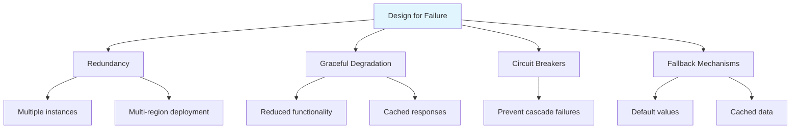
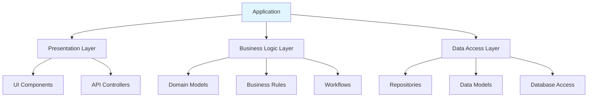
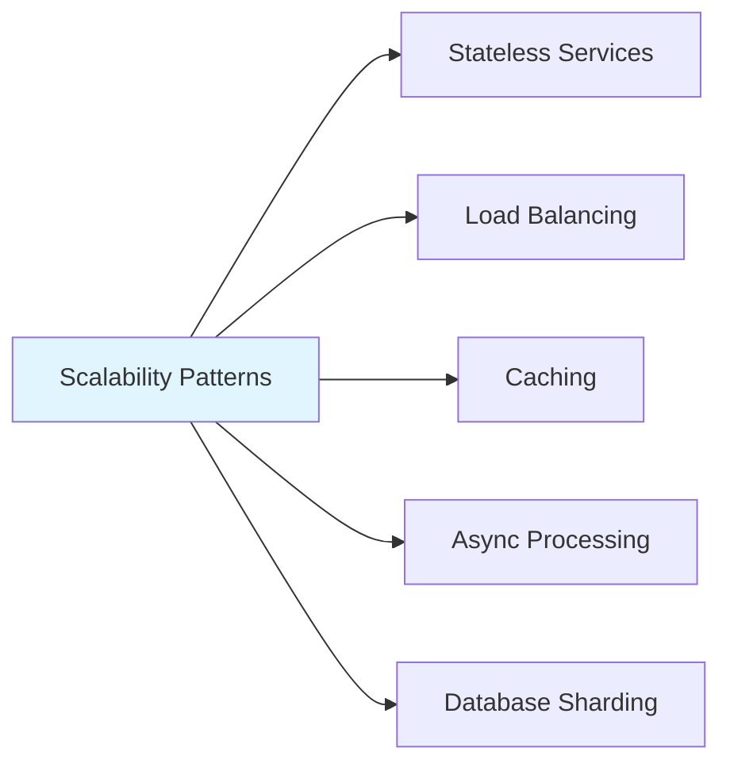
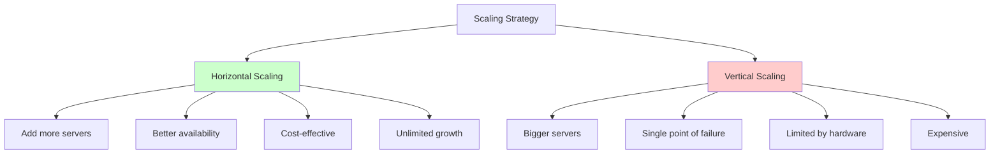
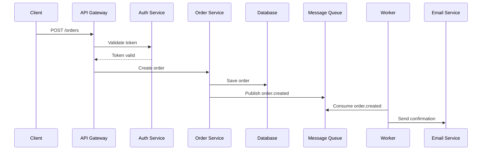
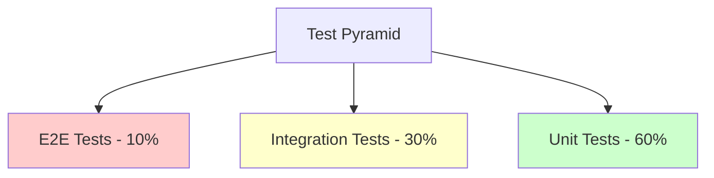

# System Design Best Practices

## Table of Contents
- [Introduction](#introduction)
- [Architecture Principles](#architecture-principles)
- [Scalability Best Practices](#scalability-best-practices)
- [Reliability and Availability](#reliability-and-availability)
- [Performance Optimization](#performance-optimization)
- [Security Best Practices](#security-best-practices)
- [Monitoring and Observability](#monitoring-and-observability)
- [Data Management](#data-management)
- [Code Quality and Development](#code-quality-and-development)
- [Operational Excellence](#operational-excellence)
- [Cost Optimization](#cost-optimization)
- [Documentation](#documentation)
- [Testing Strategies](#testing-strategies)

## Introduction

Best practices in system design represent accumulated wisdom from building and operating large-scale systems. Following these practices helps you build systems that are scalable, reliable, maintainable, and cost-effective.

**Why Best Practices Matter:**
- Avoid common pitfalls and mistakes
- Build on proven patterns and solutions
- Reduce technical debt
- Improve team collaboration
- Accelerate development
- Minimize production issues

## Architecture Principles

### 1. Design for Failure

Everything fails eventually. Design systems that continue to work even when components fail.



**Implementation:**
```javascript
// Circuit breaker pattern
class CircuitBreaker {
    constructor(options = {}) {
        this.failureThreshold = options.failureThreshold || 5;
        this.resetTimeout = options.resetTimeout || 60000;
        this.state = 'CLOSED'; // CLOSED, OPEN, HALF_OPEN
        this.failures = 0;
        this.nextAttempt = Date.now();
    }
    
    async execute(operation) {
        if (this.state === 'OPEN') {
            if (Date.now() < this.nextAttempt) {
                throw new Error('Circuit breaker is OPEN');
            }
            this.state = 'HALF_OPEN';
        }
        
        try {
            const result = await operation();
            this.onSuccess();
            return result;
        } catch (error) {
            this.onFailure();
            throw error;
        }
    }
    
    onSuccess() {
        this.failures = 0;
        this.state = 'CLOSED';
    }
    
    onFailure() {
        this.failures++;
        if (this.failures >= this.failureThreshold) {
            this.state = 'OPEN';
            this.nextAttempt = Date.now() + this.resetTimeout;
        }
    }
}

// Usage with fallback
async function fetchUserData(userId) {
    const breaker = new CircuitBreaker();
    
    try {
        return await breaker.execute(() => api.getUser(userId));
    } catch (error) {
        // Fallback to cached data
        return cache.get(`user:${userId}`) || getDefaultUser();
    }
}
```

### 2. Keep It Simple (KISS)

Complexity is the enemy of scalability and reliability. Simple systems are easier to understand, maintain, and debug.

**Guidelines:**
- Avoid premature optimization
- Use proven technologies and patterns
- Minimize dependencies
- Clear and consistent naming
- Straightforward logic flow

```javascript
// Bad: Overly complex
class UserService {
    async getUser(id, options = {}) {
        const cachingStrategy = options.cache?.strategy || 'default';
        const cacheImplementation = this.cacheFactory.create(cachingStrategy);
        const dataSource = options.source || this.primaryDataSource;
        
        return await this.executeWithMiddleware(
            this.createQuery(id, options),
            this.getMiddlewareChain(options),
            cacheImplementation
        );
    }
}

// Good: Simple and clear
class UserService {
    async getUser(id) {
        // Check cache first
        const cached = await cache.get(`user:${id}`);
        if (cached) return cached;
        
        // Fetch from database
        const user = await db.users.findById(id);
        
        // Cache for next time
        await cache.set(`user:${id}`, user, 3600);
        
        return user;
    }
}
```

### 3. Separation of Concerns

Divide your system into distinct features with minimal overlap.



**Example:**
```javascript
// Presentation Layer
class UserController {
    async getUser(req, res) {
        try {
            const user = await userService.getUser(req.params.id);
            res.json(user);
        } catch (error) {
            res.status(500).json({ error: error.message });
        }
    }
}

// Business Logic Layer
class UserService {
    async getUser(id) {
        const user = await userRepository.findById(id);
        
        if (!user) {
            throw new Error('User not found');
        }
        
        // Business logic: Check if user is active
        if (!user.isActive) {
            throw new Error('User is inactive');
        }
        
        return user;
    }
}

// Data Access Layer
class UserRepository {
    async findById(id) {
        return await db.users.findOne({ _id: id });
    }
}
```

### 4. Loose Coupling, High Cohesion

Components should be independent (loose coupling) but related functionality should be grouped together (high cohesion).

```javascript
// Bad: Tight coupling
class OrderService {
    async createOrder(orderData) {
        // Directly accessing database
        const order = await db.orders.insert(orderData);
        
        // Directly sending email
        await emailClient.send({
            to: orderData.customerEmail,
            subject: 'Order Confirmation',
            body: `Order ${order.id} created`
        });
        
        // Directly updating inventory
        await db.inventory.update(
            { productId: orderData.productId },
            { $inc: { quantity: -orderData.quantity } }
        );
        
        return order;
    }
}

// Good: Loose coupling with dependency injection
class OrderService {
    constructor(orderRepository, notificationService, inventoryService) {
        this.orderRepository = orderRepository;
        this.notificationService = notificationService;
        this.inventoryService = inventoryService;
    }
    
    async createOrder(orderData) {
        const order = await this.orderRepository.create(orderData);
        
        // Each service handles its own responsibility
        await this.notificationService.sendOrderConfirmation(order);
        await this.inventoryService.decrementStock(
            orderData.productId, 
            orderData.quantity
        );
        
        return order;
    }
}
```

### 5. Design for Scalability from the Start

Build systems that can scale horizontally rather than vertically.



**Stateless Design:**
```javascript
// Bad: Stateful service (doesn't scale)
class SessionService {
    constructor() {
        this.sessions = {}; // In-memory storage
    }
    
    createSession(userId) {
        const sessionId = generateId();
        this.sessions[sessionId] = { userId, createdAt: Date.now() };
        return sessionId;
    }
    
    getSession(sessionId) {
        return this.sessions[sessionId];
    }
}

// Good: Stateless service (scales horizontally)
class SessionService {
    constructor(redisClient) {
        this.redis = redisClient;
    }
    
    async createSession(userId) {
        const sessionId = generateId();
        await this.redis.setex(
            `session:${sessionId}`,
            3600,
            JSON.stringify({ userId, createdAt: Date.now() })
        );
        return sessionId;
    }
    
    async getSession(sessionId) {
        const data = await this.redis.get(`session:${sessionId}`);
        return JSON.parse(data);
    }
}
```

## Scalability Best Practices

### 1. Horizontal Scaling Over Vertical



### 2. Use Caching Effectively

Implement caching at multiple levels to reduce load and improve performance.

```javascript
// Multi-level caching strategy
class CachingService {
    constructor(l1Cache, l2Cache, database) {
        this.l1 = l1Cache;  // In-memory (fast, small)
        this.l2 = l2Cache;  // Redis (medium, larger)
        this.db = database;  // Database (slow, largest)
    }
    
    async get(key) {
        // Level 1: Memory cache
        let value = this.l1.get(key);
        if (value) return value;
        
        // Level 2: Redis cache
        value = await this.l2.get(key);
        if (value) {
            this.l1.set(key, value);
            return value;
        }
        
        // Level 3: Database
        value = await this.db.get(key);
        if (value) {
            await this.l2.set(key, value, 3600);
            this.l1.set(key, value);
        }
        
        return value;
    }
}
```

### 3. Implement Asynchronous Processing

Use message queues for long-running or non-critical operations.

```javascript
// Async processing with queue
class OrderProcessor {
    constructor(queue) {
        this.queue = queue;
    }
    
    async createOrder(orderData) {
        // Quick synchronous operations
        const order = await this.validateAndCreateOrder(orderData);
        
        // Async operations (don't block response)
        await this.queue.publish('order.created', {
            orderId: order.id,
            tasks: [
                'send_confirmation_email',
                'update_inventory',
                'notify_warehouse',
                'update_analytics'
            ]
        });
        
        return order;
    }
}

// Background worker
class OrderWorker {
    async processOrderCreated(event) {
        const { orderId, tasks } = event;
        
        for (const task of tasks) {
            try {
                await this.executeTask(task, orderId);
            } catch (error) {
                // Log error but continue processing
                logger.error(`Task ${task} failed for order ${orderId}`, error);
            }
        }
    }
}
```

### 4. Database Optimization

```javascript
// Database best practices
class UserRepository {
    // Use indexes for frequently queried fields
    async createIndexes() {
        await db.users.createIndex({ email: 1 }, { unique: true });
        await db.users.createIndex({ createdAt: -1 });
        await db.users.createIndex({ status: 1, role: 1 });
    }
    
    // Use pagination for large result sets
    async findUsers(filters, page = 1, limit = 20) {
        const skip = (page - 1) * limit;
        
        const [users, total] = await Promise.all([
            db.users.find(filters).skip(skip).limit(limit),
            db.users.countDocuments(filters)
        ]);
        
        return {
            users,
            pagination: {
                page,
                limit,
                total,
                pages: Math.ceil(total / limit)
            }
        };
    }
    
    // Use projection to return only needed fields
    async findUserProfile(userId) {
        return await db.users.findOne(
            { _id: userId },
            { projection: { name: 1, email: 1, avatar: 1 } }
        );
    }
    
    // Use bulk operations for multiple writes
    async updateMultipleUsers(updates) {
        const bulkOps = updates.map(update => ({
            updateOne: {
                filter: { _id: update.id },
                update: { $set: update.data }
            }
        }));
        
        return await db.users.bulkWrite(bulkOps);
    }
}
```

## Reliability and Availability

### 1. Implement Health Checks

```javascript
// Comprehensive health check
class HealthCheck {
    constructor(dependencies) {
        this.dependencies = dependencies;
    }
    
    async check() {
        const checks = {
            timestamp: new Date().toISOString(),
            status: 'healthy',
            checks: {}
        };
        
        // Check database
        try {
            await this.dependencies.db.ping();
            checks.checks.database = { status: 'up' };
        } catch (error) {
            checks.checks.database = { status: 'down', error: error.message };
            checks.status = 'unhealthy';
        }
        
        // Check cache
        try {
            await this.dependencies.cache.ping();
            checks.checks.cache = { status: 'up' };
        } catch (error) {
            checks.checks.cache = { status: 'down', error: error.message };
            checks.status = 'degraded';
        }
        
        // Check message queue
        try {
            await this.dependencies.queue.ping();
            checks.checks.queue = { status: 'up' };
        } catch (error) {
            checks.checks.queue = { status: 'down', error: error.message };
            checks.status = 'degraded';
        }
        
        return checks;
    }
}
```

### 2. Implement Retry Logic with Exponential Backoff

```javascript
// Robust retry mechanism
class RetryHandler {
    async executeWithRetry(operation, options = {}) {
        const maxRetries = options.maxRetries || 3;
        const baseDelay = options.baseDelay || 1000;
        const maxDelay = options.maxDelay || 30000;
        
        let lastError;
        
        for (let attempt = 0; attempt <= maxRetries; attempt++) {
            try {
                return await operation();
            } catch (error) {
                lastError = error;
                
                // Don't retry on certain errors
                if (this.isNonRetryable(error)) {
                    throw error;
                }
                
                // Calculate delay with exponential backoff
                if (attempt < maxRetries) {
                    const delay = Math.min(
                        baseDelay * Math.pow(2, attempt),
                        maxDelay
                    );
                    
                    // Add jitter to prevent thundering herd
                    const jitter = Math.random() * delay * 0.1;
                    await this.sleep(delay + jitter);
                }
            }
        }
        
        throw lastError;
    }
    
    isNonRetryable(error) {
        const nonRetryableCodes = [400, 401, 403, 404];
        return nonRetryableCodes.includes(error.statusCode);
    }
    
    sleep(ms) {
        return new Promise(resolve => setTimeout(resolve, ms));
    }
}
```

### 3. Rate Limiting

```javascript
// Token bucket rate limiter
class RateLimiter {
    constructor(redis) {
        this.redis = redis;
    }
    
    async checkLimit(key, maxRequests, windowSeconds) {
        const now = Date.now();
        const windowKey = `ratelimit:${key}:${Math.floor(now / (windowSeconds * 1000))}`;
        
        const requests = await this.redis.incr(windowKey);
        
        if (requests === 1) {
            await this.redis.expire(windowKey, windowSeconds);
        }
        
        return {
            allowed: requests <= maxRequests,
            remaining: Math.max(0, maxRequests - requests),
            resetAt: Math.ceil(now / (windowSeconds * 1000)) * windowSeconds * 1000
        };
    }
}

// Usage in API
async function apiHandler(req, res) {
    const userId = req.user.id;
    const limit = await rateLimiter.checkLimit(userId, 100, 60);
    
    if (!limit.allowed) {
        return res.status(429).json({
            error: 'Rate limit exceeded',
            retryAfter: limit.resetAt
        });
    }
    
    // Process request
    const result = await processRequest(req);
    
    res.set('X-RateLimit-Remaining', limit.remaining);
    res.json(result);
}
```

## Performance Optimization

### 1. Database Query Optimization

```javascript
// Query optimization examples
class OptimizedQueries {
    // Bad: N+1 query problem
    async getUsersWithPostsBad() {
        const users = await db.users.find();
        
        for (const user of users) {
            user.posts = await db.posts.find({ userId: user.id });
        }
        
        return users;
    }
    
    // Good: Use joins or aggregation
    async getUsersWithPostsGood() {
        return await db.users.aggregate([
            {
                $lookup: {
                    from: 'posts',
                    localField: '_id',
                    foreignField: 'userId',
                    as: 'posts'
                }
            }
        ]);
    }
    
    // Use indexes for better performance
    async findActiveUsersWithPosts() {
        // Ensure index exists: { status: 1, createdAt: -1 }
        return await db.users.find({
            status: 'active',
            createdAt: { $gte: new Date('2024-01-01') }
        }).hint({ status: 1, createdAt: -1 });
    }
}
```

### 2. API Response Optimization

```javascript
// Optimize API responses
class APIOptimization {
    // Implement field filtering
    async getUser(userId, fields) {
        const projection = fields ? 
            fields.split(',').reduce((acc, field) => {
                acc[field] = 1;
                return acc;
            }, {}) : 
            null;
        
        return await db.users.findOne({ _id: userId }, { projection });
    }
    
    // Implement response compression
    configureCompression(app) {
        app.use(compression({
            filter: (req, res) => {
                if (req.headers['x-no-compression']) {
                    return false;
                }
                return compression.filter(req, res);
            },
            level: 6
        }));
    }
    
    // Implement HTTP caching
    async getPublicData(req, res) {
        const data = await cache.get('public-data');
        
        if (!data) {
            data = await db.getPublicData();
            await cache.set('public-data', data, 3600);
        }
        
        res.set('Cache-Control', 'public, max-age=3600');
        res.set('ETag', generateETag(data));
        
        // Check if client has cached version
        if (req.headers['if-none-match'] === res.get('ETag')) {
            return res.status(304).end();
        }
        
        res.json(data);
    }
}
```

### 3. Connection Pooling

```javascript
// Database connection pooling
const dbConfig = {
    host: 'localhost',
    database: 'myapp',
    pool: {
        min: 2,
        max: 10,
        idleTimeoutMillis: 30000,
        connectionTimeoutMillis: 2000
    }
};

// HTTP connection pooling
const axios = require('axios');
const http = require('http');
const https = require('https');

const httpClient = axios.create({
    timeout: 5000,
    httpAgent: new http.Agent({ keepAlive: true, maxSockets: 50 }),
    httpsAgent: new https.Agent({ keepAlive: true, maxSockets: 50 })
});
```

## Security Best Practices

### 1. Authentication and Authorization

```javascript
// JWT-based authentication
class AuthService {
    generateToken(user) {
        return jwt.sign(
            { 
                id: user.id, 
                email: user.email,
                role: user.role 
            },
            process.env.JWT_SECRET,
            { 
                expiresIn: '24h',
                issuer: 'myapp',
                audience: 'myapp-client'
            }
        );
    }
    
    verifyToken(token) {
        try {
            return jwt.verify(token, process.env.JWT_SECRET);
        } catch (error) {
            throw new Error('Invalid token');
        }
    }
}

// Role-based access control
class AuthorizationMiddleware {
    requireRole(...allowedRoles) {
        return (req, res, next) => {
            if (!req.user) {
                return res.status(401).json({ error: 'Unauthorized' });
            }
            
            if (!allowedRoles.includes(req.user.role)) {
                return res.status(403).json({ error: 'Forbidden' });
            }
            
            next();
        };
    }
}

// Usage
app.post('/admin/users', 
    authMiddleware,
    authz.requireRole('admin'),
    adminController.createUser
);
```

### 2. Input Validation and Sanitization

```javascript
// Input validation
const Joi = require('joi');

class ValidationService {
    validateCreateUser(data) {
        const schema = Joi.object({
            email: Joi.string().email().required(),
            password: Joi.string().min(8).required(),
            name: Joi.string().min(2).max(100).required(),
            age: Joi.number().integer().min(18).max(120)
        });
        
        return schema.validate(data);
    }
}

// SQL injection prevention
class SecureQueries {
    // Bad: SQL injection vulnerable
    async getUserBad(email) {
        const query = `SELECT * FROM users WHERE email = '${email}'`;
        return await db.query(query);
    }
    
    // Good: Parameterized query
    async getUserGood(email) {
        const query = 'SELECT * FROM users WHERE email = $1';
        return await db.query(query, [email]);
    }
}

// XSS prevention
function sanitizeHTML(input) {
    return input
        .replace(/&/g, '&amp;')
        .replace(/</g, '&lt;')
        .replace(/>/g, '&gt;')
        .replace(/"/g, '&quot;')
        .replace(/'/g, '&#x27;');
}
```

### 3. Secrets Management

```javascript
// Environment-based configuration
class ConfigService {
    constructor() {
        this.config = {
            database: {
                host: process.env.DB_HOST,
                password: process.env.DB_PASSWORD,
                port: parseInt(process.env.DB_PORT)
            },
            redis: {
                url: process.env.REDIS_URL
            },
            jwt: {
                secret: process.env.JWT_SECRET
            },
            aws: {
                accessKey: process.env.AWS_ACCESS_KEY_ID,
                secretKey: process.env.AWS_SECRET_ACCESS_KEY
            }
        };
    }
    
    get(key) {
        return this.config[key];
    }
}

// Never commit secrets to code
// Bad
const apiKey = 'sk-1234567890abcdef';  // DON'T DO THIS

// Good
const apiKey = process.env.API_KEY;
```

## Monitoring and Observability

### 1. Structured Logging

```javascript
// Structured logging
class Logger {
    log(level, message, metadata = {}) {
        const logEntry = {
            timestamp: new Date().toISOString(),
            level,
            message,
            service: 'user-service',
            environment: process.env.NODE_ENV,
            ...metadata
        };
        
        console.log(JSON.stringify(logEntry));
    }
    
    info(message, metadata) {
        this.log('INFO', message, metadata);
    }
    
    error(message, error, metadata) {
        this.log('ERROR', message, {
            ...metadata,
            error: {
                message: error.message,
                stack: error.stack,
                code: error.code
            }
        });
    }
}

// Usage
logger.info('User created', { userId: user.id, email: user.email });
logger.error('Database connection failed', error, { attempt: 3 });
```

### 2. Metrics and Tracing

```javascript
// Application metrics
class MetricsService {
    constructor(metricsClient) {
        this.client = metricsClient;
    }
    
    recordRequestDuration(route, duration) {
        this.client.histogram('http_request_duration_ms', duration, {
            route,
            method: 'GET'
        });
    }
    
    incrementRequestCount(route, status) {
        this.client.increment('http_requests_total', {
            route,
            status
        });
    }
    
    recordDatabaseQuery(operation, duration) {
        this.client.histogram('db_query_duration_ms', duration, {
            operation
        });
    }
}

// Request tracing middleware
function tracingMiddleware(req, res, next) {
    const traceId = req.headers['x-trace-id'] || generateTraceId();
    const startTime = Date.now();
    
    req.traceId = traceId;
    res.setHeader('X-Trace-Id', traceId);
    
    res.on('finish', () => {
        const duration = Date.now() - startTime;
        
        logger.info('Request completed', {
            traceId,
            method: req.method,
            path: req.path,
            status: res.statusCode,
            duration
        });
        
        metrics.recordRequestDuration(req.path, duration);
        metrics.incrementRequestCount(req.path, res.statusCode);
    });
    
    next();
}
```

### 3. Alerting

```javascript
// Alert configuration
const alerts = {
    highErrorRate: {
        condition: 'error_rate > 5%',
        window: '5 minutes',
        severity: 'critical',
        notification: ['pagerduty', 'slack']
    },
    slowResponses: {
        condition: 'p95_response_time > 1000ms',
        window: '10 minutes',
        severity: 'warning',
        notification: ['slack']
    },
    highMemoryUsage: {
        condition: 'memory_usage > 85%',
        window: '5 minutes',
        severity: 'warning',
        notification: ['slack', 'email']
    }
};
```

## Data Management

### 1. Data Validation

```javascript
// Data model with validation
class User {
    constructor(data) {
        this.validate(data);
        Object.assign(this, data);
    }
    
    validate(data) {
        if (!data.email || !this.isValidEmail(data.email)) {
            throw new Error('Invalid email');
        }
        
        if (!data.password || data.password.length < 8) {
            throw new Error('Password must be at least 8 characters');
        }
    }
    
    isValidEmail(email) {
        return /^[^\s@]+@[^\s@]+\.[^\s@]+$/.test(email);
    }
}
```

### 2. Data Consistency

```javascript
// Transaction handling
class OrderService {
    async createOrder(orderData) {
        const session = await db.startSession();
        session.startTransaction();
        
        try {
            // Create order
            const order = await db.orders.create([orderData], { session });
            
            // Update inventory
            await db.inventory.updateOne(
                { productId: orderData.productId },
                { $inc: { quantity: -orderData.quantity } },
                { session }
            );
            
            // Record payment
            await db.payments.create([{
                orderId: order[0]._id,
                amount: orderData.total
            }], { session });
            
            await session.commitTransaction();
            return order[0];
        } catch (error) {
            await session.abortTransaction();
            throw error;
        } finally {
            session.endSession();
        }
    }
}
```

### 3. Data Migration

```javascript
// Database migration example
class Migration {
    async up() {
        // Add new field to existing documents
        await db.users.updateMany(
            { role: { $exists: false } },
            { $set: { role: 'user', createdAt: new Date() } }
        );
        
        // Create new index
        await db.users.createIndex({ role: 1, status: 1 });
    }
    
    async down() {
        // Rollback changes
        await db.users.updateMany(
            {},
            { $unset: { role: '', createdAt: '' } }
        );
        
        await db.users.dropIndex({ role: 1, status: 1 });
    }
}
```

## Code Quality and Development

### 1. Error Handling

```javascript
// Comprehensive error handling
class AppError extends Error {
    constructor(message, statusCode, code) {
        super(message);
        this.statusCode = statusCode;
        this.code = code;
        this.isOperational = true;
        Error.captureStackTrace(this, this.constructor);
    }
}

// Error handling middleware
function errorHandler(err, req, res, next) {
    if (err.isOperational) {
        return res.status(err.statusCode).json({
            status: 'error',
            message: err.message,
            code: err.code
        });
    }
    
    // Unexpected errors
    logger.error('Unexpected error', err);
    
    return res.status(500).json({
        status: 'error',
        message: 'Internal server error'
    });
}

// Usage in code
async function createUser(userData) {
    const existingUser = await db.users.findOne({ email: userData.email });
    
    if (existingUser) {
        throw new AppError('User already exists', 409, 'USER_EXISTS');
    }
    
    return await db.users.create(userData);
}

// Graceful error recovery
async function fetchWithFallback(url, fallbackData) {
    try {
        const response = await fetch(url);
        return await response.json();
    } catch (error) {
        logger.warn('Primary fetch failed, using fallback', { url, error });
        return fallbackData;
    }
}
```

### 2. Code Documentation

```javascript
/**
 * Creates a new user account with the provided information.
 * 
 * @param {Object} userData - The user data object
 * @param {string} userData.email - User's email address (must be unique)
 * @param {string} userData.password - User's password (min 8 characters)
 * @param {string} userData.name - User's full name
 * @param {string} [userData.role='user'] - User's role (optional, defaults to 'user')
 * 
 * @returns {Promise<Object>} The created user object (without password)
 * 
 * @throws {AppError} USER_EXISTS (409) if email already registered
 * @throws {AppError} VALIDATION_ERROR (400) if data is invalid
 * 
 * @example
 * const user = await createUser({
 *   email: 'john@example.com',
 *   password: 'securepass123',
 *   name: 'John Doe'
 * });
 */
async function createUser(userData) {
    // Validate input
    const validation = validateUserData(userData);
    if (!validation.valid) {
        throw new AppError('Invalid user data', 400, 'VALIDATION_ERROR');
    }
    
    // Check for existing user
    const existingUser = await db.users.findOne({ email: userData.email });
    if (existingUser) {
        throw new AppError('User already exists', 409, 'USER_EXISTS');
    }
    
    // Hash password
    const hashedPassword = await bcrypt.hash(userData.password, 10);
    
    // Create user
    const user = await db.users.create({
        ...userData,
        password: hashedPassword,
        role: userData.role || 'user',
        createdAt: new Date()
    });
    
    // Remove sensitive data
    delete user.password;
    
    return user;
}
```

### 3. Testing Strategy

```javascript
// Unit tests
describe('UserService', () => {
    let userService;
    let mockDb;
    
    beforeEach(() => {
        mockDb = {
            users: {
                findOne: jest.fn(),
                create: jest.fn()
            }
        };
        userService = new UserService(mockDb);
    });
    
    describe('createUser', () => {
        it('should create a new user successfully', async () => {
            mockDb.users.findOne.mockResolvedValue(null);
            mockDb.users.create.mockResolvedValue({
                id: '123',
                email: 'test@example.com',
                name: 'Test User'
            });
            
            const result = await userService.createUser({
                email: 'test@example.com',
                password: 'password123',
                name: 'Test User'
            });
            
            expect(result).toHaveProperty('id');
            expect(result.email).toBe('test@example.com');
        });
        
        it('should throw error if user already exists', async () => {
            mockDb.users.findOne.mockResolvedValue({ email: 'test@example.com' });
            
            await expect(
                userService.createUser({
                    email: 'test@example.com',
                    password: 'password123'
                })
            ).rejects.toThrow('User already exists');
        });
    });
});

// Integration tests
describe('User API Integration', () => {
    it('should create user via API', async () => {
        const response = await request(app)
            .post('/api/users')
            .send({
                email: 'newuser@example.com',
                password: 'password123',
                name: 'New User'
            });
        
        expect(response.status).toBe(201);
        expect(response.body).toHaveProperty('id');
    });
});

// Load tests (using k6 or similar)
/*
import http from 'k6/http';
import { check, sleep } from 'k6';

export let options = {
    stages: [
        { duration: '2m', target: 100 },  // Ramp up
        { duration: '5m', target: 100 },  // Stay at 100 users
        { duration: '2m', target: 0 },    // Ramp down
    ],
    thresholds: {
        http_req_duration: ['p(95)<500'], // 95% of requests under 500ms
        http_req_failed: ['rate<0.01'],   // Less than 1% errors
    },
};

export default function () {
    const response = http.get('https://api.example.com/users');
    check(response, {
        'status is 200': (r) => r.status === 200,
    });
    sleep(1);
}
*/
```

## Operational Excellence

### 1. Deployment Strategies

```javascript
// Blue-Green Deployment Configuration
const deploymentConfig = {
    blueGreen: {
        blue: {
            version: 'v1.0',
            instances: 5,
            weight: 100  // 100% traffic
        },
        green: {
            version: 'v1.1',
            instances: 5,
            weight: 0    // 0% traffic initially
        }
    },
    
    // Canary deployment
    canary: {
        stages: [
            { percentage: 5, duration: '10m' },
            { percentage: 25, duration: '20m' },
            { percentage: 50, duration: '30m' },
            { percentage: 100, duration: 'complete' }
        ],
        rollbackOnError: true,
        errorThreshold: 0.01  // 1% error rate
    },
    
    // Rolling update
    rolling: {
        maxSurge: '25%',
        maxUnavailable: '10%',
        minReadySeconds: 30,
        progressDeadlineSeconds: 600
    }
};

// Deployment automation
class DeploymentManager {
    async deployCanary(newVersion) {
        for (const stage of deploymentConfig.canary.stages) {
            logger.info('Starting canary stage', { 
                percentage: stage.percentage 
            });
            
            // Route traffic
            await this.updateTrafficWeights(newVersion, stage.percentage);
            
            // Monitor for errors
            const metrics = await this.monitorDeployment(stage.duration);
            
            if (metrics.errorRate > deploymentConfig.canary.errorThreshold) {
                logger.error('Error threshold exceeded, rolling back');
                await this.rollback();
                return { success: false, reason: 'high_error_rate' };
            }
        }
        
        return { success: true };
    }
}
```

### 2. Disaster Recovery

```javascript
// Backup and recovery strategy
class BackupManager {
    async performBackup() {
        const timestamp = new Date().toISOString();
        
        return {
            database: await this.backupDatabase(timestamp),
            files: await this.backupFiles(timestamp),
            configuration: await this.backupConfiguration(timestamp)
        };
    }
    
    async backupDatabase(timestamp) {
        // Full backup
        await db.backup({
            destination: `s3://backups/db/${timestamp}/full`,
            compression: true,
            encryption: true
        });
        
        // Point-in-time recovery setup
        await db.enablePITR({
            retentionDays: 7
        });
        
        return { status: 'completed', timestamp };
    }
    
    async restoreFromBackup(backupId) {
        logger.info('Starting restore', { backupId });
        
        try {
            // Stop application
            await this.stopApplication();
            
            // Restore database
            await db.restore({
                source: `s3://backups/db/${backupId}`,
                pointInTime: backupId.timestamp
            });
            
            // Restore files
            await this.restoreFiles(backupId);
            
            // Verify integrity
            const verified = await this.verifyRestore();
            
            if (!verified) {
                throw new Error('Restore verification failed');
            }
            
            // Start application
            await this.startApplication();
            
            return { success: true };
        } catch (error) {
            logger.error('Restore failed', error);
            return { success: false, error: error.message };
        }
    }
}

// Disaster recovery plan
const drPlan = {
    rto: '4 hours',  // Recovery Time Objective
    rpo: '1 hour',   // Recovery Point Objective
    
    procedures: {
        databaseFailure: {
            detection: 'Automated monitoring alerts',
            steps: [
                'Verify primary database is down',
                'Promote read replica to primary',
                'Update DNS/connection strings',
                'Verify application connectivity',
                'Monitor for issues'
            ],
            estimatedTime: '30 minutes'
        },
        
        regionFailure: {
            detection: 'Multiple service failures',
            steps: [
                'Activate disaster recovery site',
                'Restore from latest backup',
                'Update DNS to DR region',
                'Verify all services operational',
                'Communicate to stakeholders'
            ],
            estimatedTime: '2-4 hours'
        }
    }
};
```

### 3. Configuration Management

```javascript
// Configuration management
class ConfigManager {
    constructor() {
        this.config = this.loadConfig();
        this.watchers = [];
    }
    
    loadConfig() {
        const env = process.env.NODE_ENV || 'development';
        
        return {
            environment: env,
            server: {
                port: parseInt(process.env.PORT) || 3000,
                host: process.env.HOST || 'localhost'
            },
            database: {
                url: process.env.DATABASE_URL,
                pool: {
                    min: parseInt(process.env.DB_POOL_MIN) || 2,
                    max: parseInt(process.env.DB_POOL_MAX) || 10
                }
            },
            cache: {
                url: process.env.REDIS_URL,
                ttl: parseInt(process.env.CACHE_TTL) || 3600
            },
            features: {
                newUI: process.env.FEATURE_NEW_UI === 'true',
                betaFeatures: process.env.FEATURE_BETA === 'true'
            },
            monitoring: {
                enabled: process.env.MONITORING_ENABLED !== 'false',
                sampleRate: parseFloat(process.env.MONITORING_SAMPLE_RATE) || 1.0
            }
        };
    }
    
    // Hot reload configuration
    watchConfig(callback) {
        this.watchers.push(callback);
        
        // Poll for config changes (in production, use proper config service)
        setInterval(async () => {
            const newConfig = await this.fetchRemoteConfig();
            if (this.hasConfigChanged(newConfig)) {
                this.config = newConfig;
                this.watchers.forEach(cb => cb(newConfig));
            }
        }, 60000); // Check every minute
    }
    
    get(path) {
        return path.split('.').reduce((obj, key) => obj?.[key], this.config);
    }
}

// Feature flags
class FeatureFlags {
    constructor(configManager) {
        this.config = configManager;
    }
    
    isEnabled(feature, userId = null) {
        const flag = this.config.get(`features.${feature}`);
        
        // Simple boolean flag
        if (typeof flag === 'boolean') {
            return flag;
        }
        
        // Percentage rollout
        if (flag.percentage && userId) {
            const hash = this.hashUserId(userId);
            return hash < flag.percentage;
        }
        
        // User-specific
        if (flag.users && userId) {
            return flag.users.includes(userId);
        }
        
        return false;
    }
    
    hashUserId(userId) {
        // Simple hash for demonstration
        let hash = 0;
        for (let i = 0; i < userId.length; i++) {
            hash = ((hash << 5) - hash) + userId.charCodeAt(i);
        }
        return Math.abs(hash % 100);
    }
}
```

## Cost Optimization

### 1. Resource Right-Sizing

```javascript
// Monitor and optimize resource usage
class ResourceOptimizer {
    async analyzeUsage(resourceId, days = 30) {
        const metrics = await this.getMetrics(resourceId, days);
        
        const analysis = {
            cpu: {
                avg: metrics.cpu.average,
                max: metrics.cpu.max,
                p95: metrics.cpu.percentile95
            },
            memory: {
                avg: metrics.memory.average,
                max: metrics.memory.max,
                p95: metrics.memory.percentile95
            },
            recommendation: null,
            potentialSavings: 0
        };
        
        // Analyze and recommend
        if (analysis.cpu.p95 < 30 && analysis.memory.p95 < 40) {
            analysis.recommendation = 'DOWNSIZE';
            analysis.suggestedSize = this.getSmallerSize(metrics.currentSize);
            analysis.potentialSavings = this.calculateSavings(
                metrics.currentSize,
                analysis.suggestedSize
            );
        } else if (analysis.cpu.p95 > 80 || analysis.memory.p95 > 85) {
            analysis.recommendation = 'UPSIZE';
            analysis.suggestedSize = this.getLargerSize(metrics.currentSize);
        } else {
            analysis.recommendation = 'OPTIMAL';
        }
        
        return analysis;
    }
    
    async autoScale(resourceId) {
        const analysis = await this.analyzeUsage(resourceId);
        
        if (analysis.recommendation === 'DOWNSIZE' && 
            analysis.potentialSavings > 50) {
            await this.resizeResource(resourceId, analysis.suggestedSize);
            return { 
                action: 'resized', 
                savings: analysis.potentialSavings 
            };
        }
        
        return { action: 'no_change' };
    }
}
```

### 2. Cost Monitoring

```javascript
// Cost tracking and alerting
class CostMonitor {
    async trackDailyCosts() {
        const today = new Date();
        const costs = await this.getCosts(today);
        
        const analysis = {
            total: costs.total,
            byService: costs.breakdown,
            trend: await this.analyzeTrend(costs),
            alerts: []
        };
        
        // Check budget
        const budget = await this.getBudget(today.getMonth());
        const projectedCost = (costs.total / today.getDate()) * 30;
        
        if (projectedCost > budget * 0.9) {
            analysis.alerts.push({
                type: 'BUDGET_WARNING',
                message: 'Projected to exceed 90% of budget',
                projected: projectedCost,
                budget: budget
            });
        }
        
        // Check for anomalies
        const anomalies = await this.detectAnomalies(costs);
        analysis.alerts.push(...anomalies);
        
        return analysis;
    }
    
    async detectAnomalies(costs) {
        const historical = await this.getHistoricalCosts(30);
        const baseline = this.calculateBaseline(historical);
        
        const anomalies = [];
        
        for (const [service, cost] of Object.entries(costs.breakdown)) {
            const expectedCost = baseline[service] || 0;
            const deviation = (cost - expectedCost) / expectedCost;
            
            if (deviation > 0.5) {  // 50% increase
                anomalies.push({
                    type: 'COST_SPIKE',
                    service,
                    current: cost,
                    expected: expectedCost,
                    increase: `${(deviation * 100).toFixed(0)}%`
                });
            }
        }
        
        return anomalies;
    }
}
```

## Documentation

### 1. API Documentation

```javascript
/**
 * @api {post} /api/users Create User
 * @apiName CreateUser
 * @apiGroup Users
 * @apiVersion 1.0.0
 * 
 * @apiDescription Creates a new user account
 * 
 * @apiParam {String} email User's email address
 * @apiParam {String} password User's password (min 8 characters)
 * @apiParam {String} name User's full name
 * @apiParam {String} [role=user] User's role
 * 
 * @apiSuccess {String} id User ID
 * @apiSuccess {String} email User's email
 * @apiSuccess {String} name User's name
 * @apiSuccess {String} role User's role
 * @apiSuccess {Date} createdAt Account creation timestamp
 * 
 * @apiSuccessExample Success Response:
 *     HTTP/1.1 201 Created
 *     {
 *       "id": "507f1f77bcf86cd799439011",
 *       "email": "john@example.com",
 *       "name": "John Doe",
 *       "role": "user",
 *       "createdAt": "2024-01-15T10:30:00Z"
 *     }
 * 
 * @apiError (400) ValidationError Invalid input data
 * @apiError (409) UserExists Email already registered
 * 
 * @apiErrorExample Error Response:
 *     HTTP/1.1 409 Conflict
 *     {
 *       "error": "User already exists",
 *       "code": "USER_EXISTS"
 *     }
 */
```

## Data Flow



## Infrastructure

- Cloud Provider: AWS
- Container Orchestration: Kubernetes
- CI/CD: GitHub Actions
- Monitoring: Prometheus + Grafana

## Security

- Authentication: JWT tokens
- Authorization: Role-based access control
- Encryption: TLS 1.3, AES-256
- Secrets: AWS Secrets Manager


## Testing Strategies

### 1. Test Pyramid



### 2. Testing Best Practices

```javascript
// Good test structure
describe('UserService', () => {
    // Setup
    beforeEach(() => {
        // Initialize clean state
    });
    
    // Cleanup
    afterEach(() => {
        // Clean up resources
    });
    
    // Clear test names
    it('should create user with valid data', async () => {
        // Arrange
        const userData = {
            email: 'test@example.com',
            password: 'password123',
            name: 'Test User'
        };
        
        // Act
        const result = await userService.createUser(userData);
        
        // Assert
        expect(result).toHaveProperty('id');
        expect(result.email).toBe(userData.email);
    });
    
    // Test edge cases
    it('should handle missing required fields', async () => {
        await expect(
            userService.createUser({ email: 'test@example.com' })
        ).rejects.toThrow('Password is required');
    });
    
    // Test error scenarios
    it('should throw error for duplicate email', async () => {
        await userService.createUser({
            email: 'test@example.com',
            password: 'pass123',
            name: 'User 1'
        });
        
        await expect(
            userService.createUser({
                email: 'test@example.com',
                password: 'pass456',
                name: 'User 2'
            })
        ).rejects.toThrow('User already exists');
    });
});
```

## Summary

Following these best practices helps you build systems that are:

✅ **Scalable** - Handle growth efficiently
✅ **Reliable** - Minimize downtime and failures  
✅ **Maintainable** - Easy to update and debug
✅ **Secure** - Protected against common threats
✅ **Observable** - Easy to monitor and troubleshoot
✅ **Cost-Effective** - Optimized resource usage
✅ **Well-Documented** - Easy for teams to understand

## Key Takeaways

1. **Design for failure** - Everything will fail eventually
2. **Keep it simple** - Complexity is the enemy
3. **Separate concerns** - Modular, independent components
4. **Monitor everything** - You can't fix what you can't see
5. **Test thoroughly** - Catch bugs before production
6. **Document well** - Help your future self and team
7. **Optimize continuously** - Regular reviews and improvements
8. **Security first** - Build it in from the start

## Related Documents

- [auto_scaling.md](./auto_scaling.md) - Auto-scaling strategies
- [horizontal_scaling.md](./horizontal_scaling.md) - Horizontal scaling patterns
- [vertical_scaling.md](./vertical_scaling.md) - Vertical scaling approaches
- [caching_strategies.md](./caching_strategies.md) - Caching patterns
- [database_scaling.md](./database_scaling.md) - Database optimization
- [load_balancing.md](./load_balancing.md) - Load balancing techniques
- [cost_scaling.md](./cost_scaling.md) - Cost optimization strategies
- [message_queues.md](./message_queues.md) - Async communication patterns
- [eventual_consistency.md](./eventual_consistency.md) - Distributed data consistency