# Caching Strategies

## Table of Contents
- [Introduction](#introduction)
- [What is Caching?](#what-is-caching)
- [Why Caching Matters](#why-caching-matters)
- [Cache Hierarchy](#cache-hierarchy)
- [Caching Patterns](#caching-patterns)
- [Cache Invalidation Strategies](#cache-invalidation-strategies)
- [Cache Eviction Policies](#cache-eviction-policies)
- [Distributed Caching](#distributed-caching)
- [Cache Consistency](#cache-consistency)
- [Common Cache Use Cases](#common-cache-use-cases)
- [Integration with Other Patterns](#integration-with-other-patterns)
- [Performance Optimization](#performance-optimization)
- [Common Pitfalls and Best Practices](#common-pitfalls-and-best-practices)

## Introduction

Caching is one of the most effective techniques for improving system performance and scalability. By storing frequently accessed data in fast-access storage layers, caching reduces latency, decreases load on backend systems, and enables systems to handle more traffic. Combined with [load_balancing.md](load_balancing.md) and [horizontal_scaling.md](horizontal_scaling.md), caching forms the foundation of high-performance distributed systems.

## What is Caching?

A **cache** is a high-speed data storage layer that stores a subset of data, typically transient in nature, so that future requests for that data are served faster than accessing the data's primary storage location.

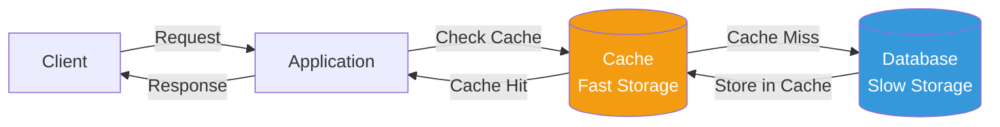

### Key Characteristics

1. **Fast access** - Typically in-memory (RAM) storage
2. **Limited capacity** - Smaller than primary storage
3. **Temporary data** - Can be rebuilt from source
4. **Stale data possible** - May not always be up-to-date

## Why Caching Matters

### Performance Impact

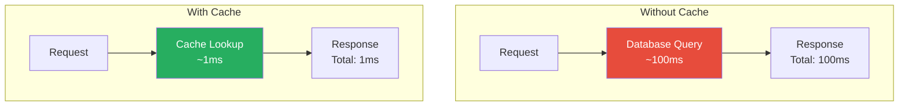

**Typical latency comparison:**
- RAM (Cache): 1-10ms
- SSD Database: 50-100ms
- HDD Database: 100-500ms
- Network Database: 100-1000ms+

### Scalability Benefits

```javascript
// Without caching
requests = 10000 // per second
databaseLoad = 10000 // queries per second
// Database becomes bottleneck

// With 90% cache hit rate
cacheHits = 9000 // served from cache
databaseLoad = 1000 // only 10% hit database
// 10x reduction in database load
```

This reduction in database load is crucial for [database_scaling.md](database_scaling.md) and overall system capacity.

### Cost Reduction

Caching reduces infrastructure costs (see [cost_scaling.md](cost_scaling.md)):
- Fewer database servers needed
- Lower database instance sizes
- Reduced network bandwidth
- Better resource utilization

## Cache Hierarchy

Modern systems use multiple cache layers, each optimized for different access patterns.

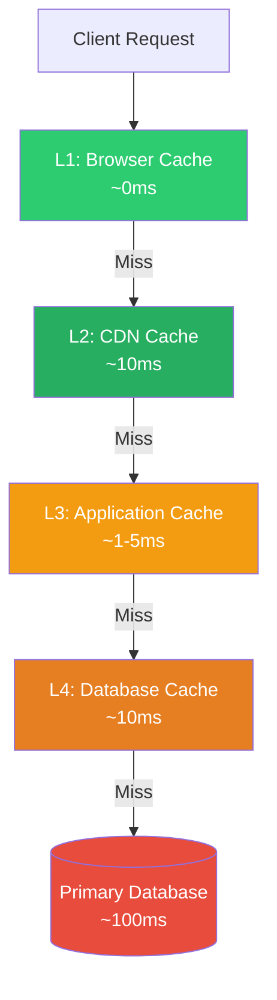

### 1. Client-Side Cache

**Location:** User's browser or application

**What to cache:**
- Static assets (CSS, JS, images)
- API responses (with proper headers)
- Application state

**Theory:**
```javascript
// HTTP cache headers
response.headers = {
  'Cache-Control': 'public, max-age=3600',  // Cache for 1 hour
  'ETag': 'abc123',                          // Version identifier
  'Last-Modified': 'Wed, 21 Oct 2025 07:28:00 GMT'
}

// On subsequent request:
// Browser sends: If-None-Match: abc123
// Server returns: 304 Not Modified (if unchanged)
```

**Pros:**
- Zero server load
- Fastest possible response
- Reduces bandwidth

**Cons:**
- No control after deployment
- Limited storage
- Per-user cache (no sharing)

### 2. CDN Cache

**Location:** Edge servers distributed globally

**What to cache:**
- Static content (images, videos, CSS, JS)
- API responses (carefully selected)
- Entire pages (for static sites)

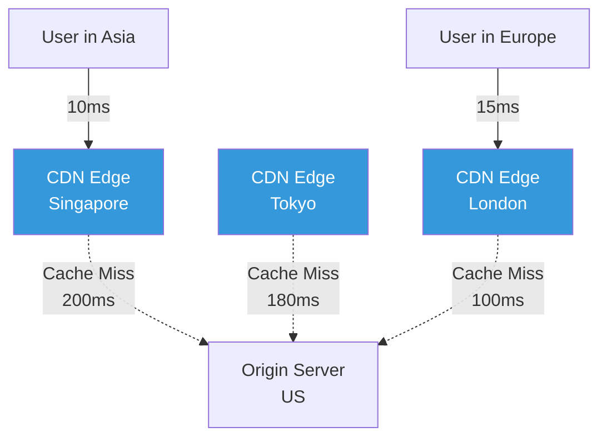

**Pros:**
- Geographic proximity
- Massive scale
- Reduced origin load

**Cons:**
- Invalidation complexity
- Cost per GB transferred
- Stale content risk

### 3. Application-Level Cache

**Location:** In-memory cache within application servers

**Technologies:** Redis, Memcached, in-process cache

**What to cache:**
- Database query results
- Computed values
- Session data
- API responses

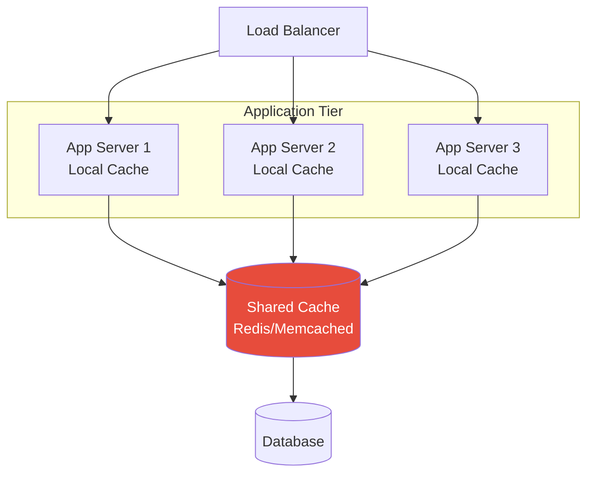

### 4. Database Cache

**Location:** Within the database system

**What it caches:**
- Query results
- Indexes
- Frequently accessed rows

**Note:** Usually managed automatically by the database. See [database_scaling.md](database_scaling.md) for database-specific optimizations.

## Caching Patterns

### 1. Cache-Aside (Lazy Loading)

The application manages the cache explicitly. Most common pattern.

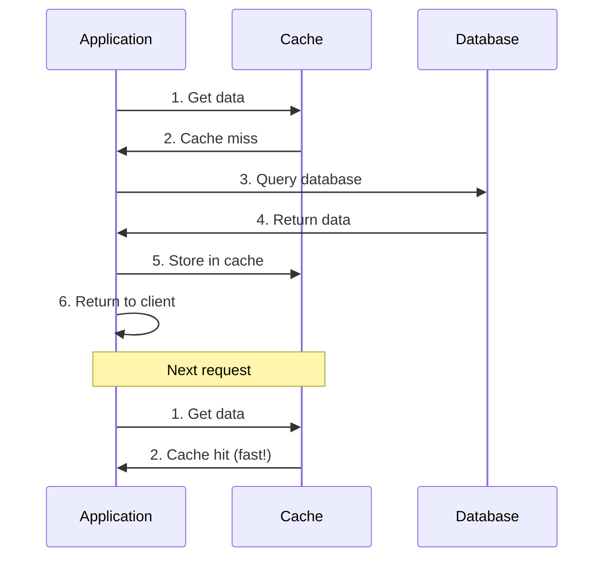

**Theory:**
```javascript
// Cache-aside implementation pattern
async function getData(key) {
  // Try cache first
  let data = await cache.get(key)
  
  if (data) {
    return data  // Cache hit
  }
  
  // Cache miss - fetch from database
  data = await database.query(key)
  
  // Store in cache for next time
  await cache.set(key, data, ttl = 3600)
  
  return data
}
```

**Pros:**
- Application has full control
- Cache failures don't break the system
- Only requested data is cached
- Works with any storage

**Cons:**
- Each cache miss incurs 3 operations (check cache, query DB, update cache)
- Potential for stale data
- Cold start problem

**Use case:** General-purpose caching, most web applications

### 2. Read-Through Cache

Cache sits between application and database, automatically loading data on miss.

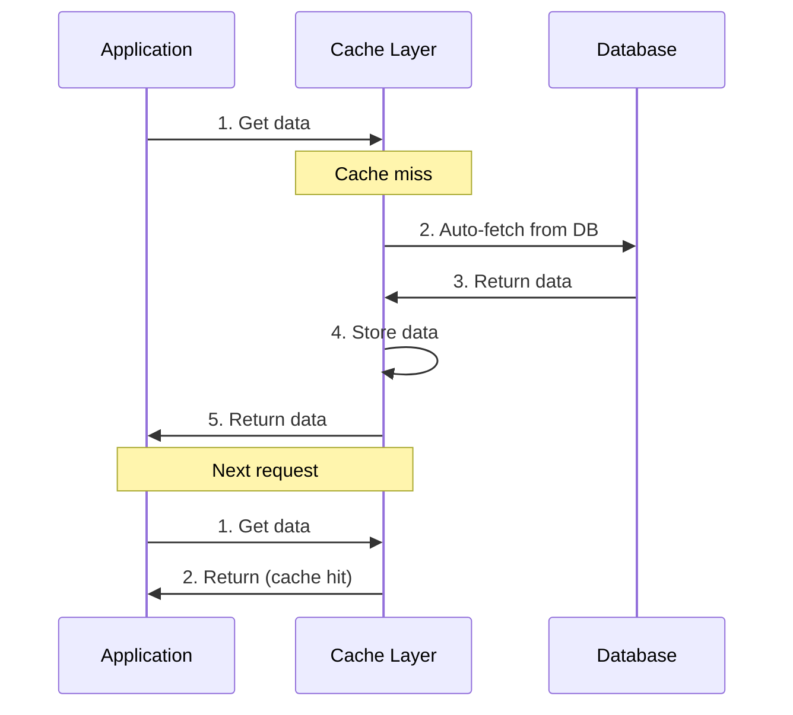

**Theory:**
```javascript
// Conceptual read-through cache
class ReadThroughCache {
  constructor(database) {
    this.cache = new Map()
    this.database = database
  }
  
  async get(key) {
    // Check cache
    if (this.cache.has(key)) {
      return this.cache.get(key)
    }
    
    // Automatically fetch from database
    const data = await this.database.query(key)
    
    // Store in cache
    this.cache.set(key, data)
    
    return data
  }
}

// Application code is simpler
const data = await cache.get(key)  // Cache handles everything
```

**Pros:**
- Simpler application code
- Consistent caching logic
- Transparent to application

**Cons:**
- Tighter coupling
- Cache becomes critical path
- Less flexible

**Use case:** Systems where cache abstraction is valuable, libraries that provide read-through caching

### 3. Write-Through Cache

Data is written to cache and database synchronously.

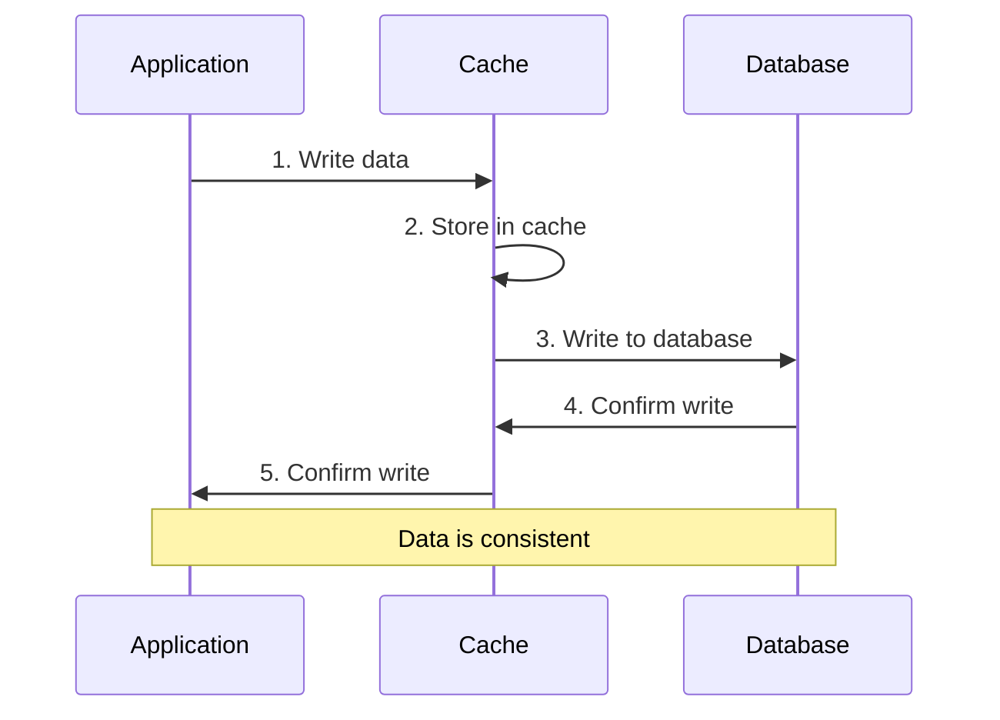

**Theory:**
```javascript
// Write-through pattern
async function setData(key, value) {
  // Write to cache first
  await cache.set(key, value)
  
  // Then write to database (synchronous)
  await database.write(key, value)
  
  // Both complete before returning
  return success
}

// Read is simple - always check cache first
async function getData(key) {
  return await cache.get(key)  // Always fresh!
}
```

**Pros:**
- Cache always consistent with database
- Read performance excellent
- No stale data

**Cons:**
- Higher write latency (two operations)
- Cache churn for infrequently read data
- Wastes cache space

**Use case:** Read-heavy workloads, data that must be consistent

### 4. Write-Behind (Write-Back) Cache

Data is written to cache immediately, database updated asynchronously.

```mermaid
sequenceDiagram
    participant App as Application
    participant Cache as Cache
    participant Queue as Write Queue
    participant DB as Database
    
    App->>Cache: 1. Write data
    Cache->>Cache: 2. Store in cache
    Cache->>App: 3. Immediate response
    
    Cache->>Queue: 4. Queue for DB write
    
    Note over Queue,DB: Async process
    Queue->>DB: 5. Batch write later
    DB->>Queue: 6. Confirm
    
    style Queue fill:#f39c12,color:#fff
```

**Theory:**
```javascript
// Write-behind pattern
async function setData(key, value) {
  // Write to cache immediately
  await cache.set(key, value)
  
  // Queue for async database write
  await writeQueue.add({ key, value })
  
  // Return immediately (fast!)
  return success
}

// Background worker
async function processWriteQueue() {
  const batch = await writeQueue.getBatch(100)
  
  // Batch write to database
  await database.batchWrite(batch)
  
  // Clear from queue
  await writeQueue.clear(batch)
}
```

**Pros:**
- Excellent write performance
- Can batch database writes
- Reduces database load
- Better for write-heavy workloads

**Cons:**
- Data loss risk if cache fails
- Complex error handling
- Eventual consistency (see [eventual_consistency.md](eventual_consistency.md))

**Use case:** High write throughput systems, analytics, logging (where data loss is acceptable)

### 5. Refresh-Ahead Cache

Automatically refresh cached data before expiration.

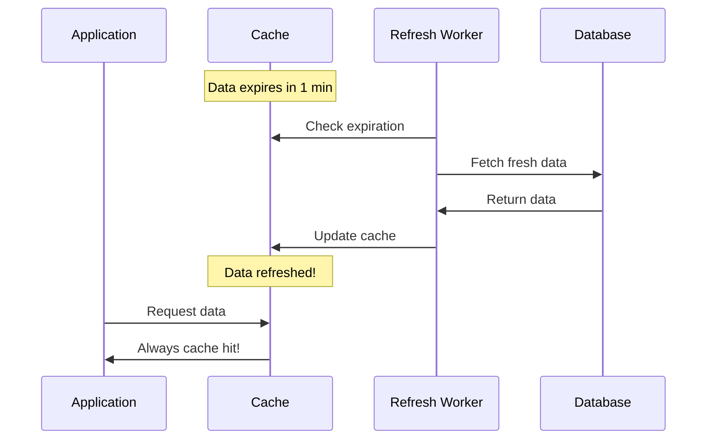

**Theory:**
```javascript
// Refresh-ahead pattern
class RefreshAheadCache {
  constructor(database, refreshThreshold = 0.8) {
    this.cache = new Map()
    this.database = database
    this.refreshThreshold = refreshThreshold
  }
  
  async get(key) {
    const entry = this.cache.get(key)
    
    if (!entry) {
      return this.loadAndCache(key)
    }
    
    // Check if nearing expiration
    const timeRemaining = entry.expiresAt - Date.now()
    const totalTTL = entry.expiresAt - entry.createdAt
    
    if (timeRemaining / totalTTL < this.refreshThreshold) {
      // Refresh in background (don't wait)
      this.loadAndCache(key)
    }
    
    return entry.data
  }
  
  async loadAndCache(key) {
    const data = await this.database.query(key)
    this.cache.set(key, {
      data,
      createdAt: Date.now(),
      expiresAt: Date.now() + 3600000  // 1 hour
    })
    return data
  }
}
```

**Pros:**
- Predictable performance (no sudden cache miss latency)
- Cache always fresh
- Good for frequently accessed data

**Cons:**
- Wastes resources on unused data
- Complex implementation
- Requires prediction of access patterns

**Use case:** Hot data that is frequently accessed, real-time dashboards

## Cache Invalidation Strategies

> "There are only two hard things in Computer Science: cache invalidation and naming things." - Phil Karlton

### 1. Time-To-Live (TTL)

Data expires after a fixed time period.

```javascript
// Simple TTL
cache.set(key, value, { ttl: 3600 })  // Expire in 1 hour

// Dynamic TTL based on data type
ttlStrategy = {
  userProfile: 3600,      // 1 hour
  productCatalog: 300,    // 5 minutes
  sessionData: 1800,      // 30 minutes
  staticContent: 86400    // 24 hours
}
```

**Pros:**
- Simple to implement
- Automatic cleanup
- Predictable behavior

**Cons:**
- Stale data until expiration
- Cache stampede risk (many requests hit DB when cache expires)
- Wastes cache space if data doesn't change

**Use case:** Data with predictable change patterns

### 2. Event-Based Invalidation

Invalidate cache when data changes.

```mermaid
sequenceDiagram
    participant User as User
    participant App as Application
    participant Cache as Cache
    participant DB as Database
    participant Event as Event Bus
    
    User->>App: Update product price
    App->>DB: Update database
    DB->>App: Success
    App->>Event: Publish "product.updated"
    Event->>Cache: Invalidate product cache
    Cache->>Cache: Delete cached data
    App->>User: Success
    
    style Event fill:#9b59b6,color:#fff
```

**Theory:**
```javascript
// Event-based invalidation
async function updateProduct(productId, newData) {
  // Update database
  await database.update(productId, newData)
  
  // Invalidate cache
  await cache.delete(`product:${productId}`)
  
  // Also invalidate related caches
  await cache.delete(`product-list`)
  await cache.delete(`featured-products`)
  
  // Publish event for other systems
  await eventBus.publish('product.updated', { productId })
}
```

**Pros:**
- Cache always fresh after updates
- No stale data
- Precise control

**Cons:**
- Complex implementation
- Must track all cache dependencies
- Can miss invalidations if events fail

**Use case:** Data consistency is critical

### 3. Write-Through Invalidation

Update cache when writing data.

```javascript
// Write-through invalidation
async function updateUser(userId, newData) {
  // Update database
  await database.update(userId, newData)
  
  // Update cache with fresh data
  await cache.set(`user:${userId}`, newData, { ttl: 3600 })
  
  return newData
}
```

**Pros:**
- Cache immediately consistent
- No stale reads after write

**Cons:**
- Requires updating all cache entries
- Tightly couples write logic with caching

### 4. Cache Stampede Prevention

Prevent multiple requests from hitting database when cache expires.

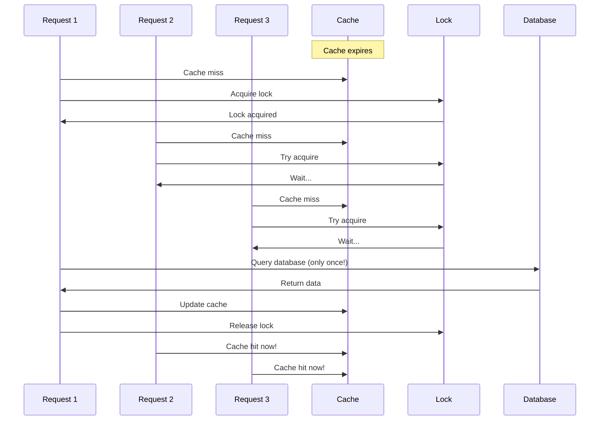

**Theory:**
```javascript
// Cache stampede prevention with locking
async function getData(key) {
  // Check cache
  let data = await cache.get(key)
  if (data) return data
  
  // Try to acquire lock for this key
  const lockKey = `lock:${key}`
  const lockAcquired = await cache.setNX(lockKey, 'locked', { ttl: 10 })
  
  if (lockAcquired) {
    try {
      // We got the lock - fetch from DB
      data = await database.query(key)
      await cache.set(key, data, { ttl: 3600 })
      return data
    } finally {
      // Release lock
      await cache.delete(lockKey)
    }
  } else {
    // Someone else is fetching - wait a bit and retry
    await sleep(100)
    return getData(key)  // Retry
  }
}

// Alternative: Probabilistic early expiration
async function getDataWithProbabilisticRefresh(key) {
  const entry = await cache.get(key)
  
  if (!entry) {
    return fetchAndCache(key)
  }
  
  // Calculate probability of early refresh
  const age = Date.now() - entry.timestamp
  const ttl = entry.ttl
  const xfetch = 1.0  // Multiplication factor
  const beta = 1.0    // Shape parameter
  
  const probability = xfetch * beta * Math.log(Math.random()) * -1
  
  if (age * probability >= ttl) {
    // Probabilistically refresh before expiration
    fetchAndCache(key)  // Async, don't wait
  }
  
  return entry.data
}
```

### 5. Cache Tags/Versioning

Group related cache entries for bulk invalidation.

```javascript
// Cache tagging
await cache.set('product:1', data, { tags: ['products', 'category:electronics'] })
await cache.set('product:2', data, { tags: ['products', 'category:electronics'] })
await cache.set('product:3', data, { tags: ['products', 'category:books'] })

// Invalidate all electronics
await cache.invalidateTag('category:electronics')

// Cache versioning
const version = await cache.get('products:version') || 1
const key = `products:list:v${version}`
const data = await cache.get(key)

// When products change
await cache.incr('products:version')  // All old version caches now invalid
```

## Cache Eviction Policies

When cache is full, determine which entries to remove.

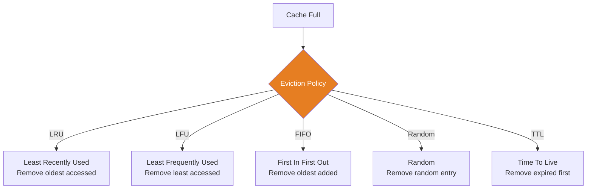

### 1. LRU (Least Recently Used)

Remove the entry that hasn't been accessed for the longest time.

**Theory:**
```javascript
// LRU conceptual implementation
class LRUCache {
  constructor(capacity) {
    this.capacity = capacity
    this.cache = new Map()  // Insertion order maintained
  }
  
  get(key) {
    if (!this.cache.has(key)) return null
    
    // Move to end (most recently used)
    const value = this.cache.get(key)
    this.cache.delete(key)
    this.cache.set(key, value)
    
    return value
  }
  
  set(key, value) {
    // Remove if exists (to update position)
    if (this.cache.has(key)) {
      this.cache.delete(key)
    }
    
    // Add to end (most recently used)
    this.cache.set(key, value)
    
    // Evict oldest if over capacity
    if (this.cache.size > this.capacity) {
      const firstKey = this.cache.keys().next().value
      this.cache.delete(firstKey)
    }
  }
}
```

**Pros:**
- Good for time-based locality
- Most commonly used
- Intuitive behavior

**Cons:**
- Doesn't consider frequency
- Can evict frequently used items

**Use case:** General purpose caching (default for Redis, Memcached)

### 2. LFU (Least Frequently Used)

Remove the entry accessed least frequently.

**Theory:**
```javascript
// LFU conceptual implementation
class LFUCache {
  constructor(capacity) {
    this.capacity = capacity
    this.cache = new Map()
    this.frequency = new Map()
  }
  
  get(key) {
    if (!this.cache.has(key)) return null
    
    // Increment frequency
    const freq = this.frequency.get(key) || 0
    this.frequency.set(key, freq + 1)
    
    return this.cache.get(key)
  }
  
  set(key, value) {
    if (this.cache.size >= this.capacity && !this.cache.has(key)) {
      // Find least frequently used
      let minFreq = Infinity
      let minKey = null
      
      for (const [k, freq] of this.frequency) {
        if (freq < minFreq) {
          minFreq = freq
          minKey = k
        }
      }
      
      // Evict least frequently used
      this.cache.delete(minKey)
      this.frequency.delete(minKey)
    }
    
    this.cache.set(key, value)
    this.frequency.set(key, 1)
  }
}
```

**Pros:**
- Keeps frequently accessed data
- Good for skewed access patterns

**Cons:**
- New items easily evicted
- Old items stick around
- More complex

**Use case:** When access frequency is more important than recency

### 3. FIFO (First In First Out)

Remove oldest entry by insertion time.

**Pros:**
- Simple implementation
- Predictable

**Cons:**
- Ignores access patterns
- Poor cache hit rate

**Use case:** Rarely used; mainly for simplicity

### 4. Random Eviction

Remove random entry.

**Pros:**
- Extremely simple
- Fast
- Works reasonably well in practice

**Cons:**
- Unpredictable
- May evict hot data

**Use case:** When simplicity is paramount (Redis supports this)

### Choosing an Eviction Policy

```javascript
// Decision framework
evictionPolicy = (useCase) => {
  if (useCase === "general") {
    return "LRU"  // Most versatile
  }
  
  if (useCase === "frequently-accessed-data") {
    return "LFU"  // Keep popular items
  }
  
  if (useCase === "time-series") {
    return "FIFO" || "TTL"  // Older data less relevant
  }
  
  if (useCase === "simplicity") {
    return "Random"  // Good enough, simple
  }
  
  return "LRU"  // Default
}
```

## Distributed Caching

As systems scale with [horizontal_scaling.md](horizontal_scaling.md) and [load_balancing.md](load_balancing.md), caching must scale too.

### Centralized Cache

Single cache server shared by all application servers.

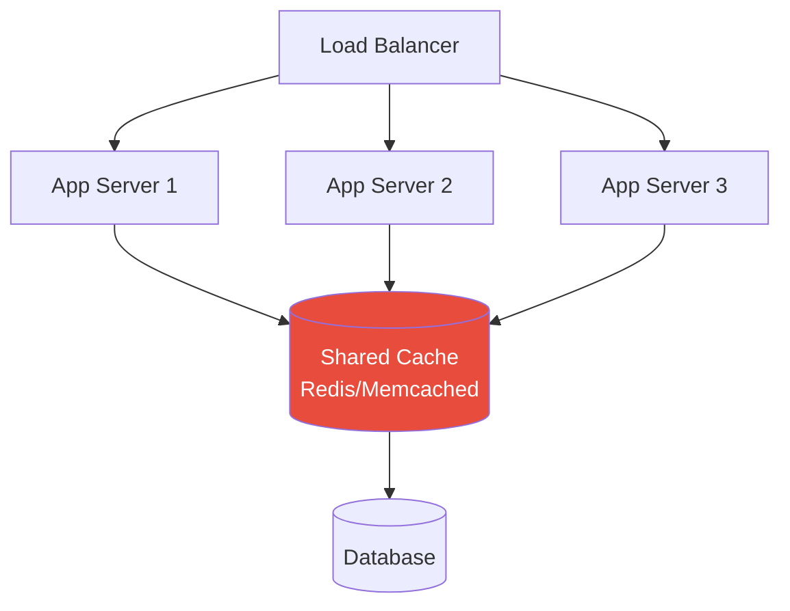

**Pros:**
- Consistent cache across all servers
- Simple to reason about
- No cache duplication

**Cons:**
- Single point of failure
- Network latency for every cache access
- Limited by single server capacity

**Use case:** Small to medium deployments, session storage

### Distributed Cache Cluster

Multiple cache servers working together.

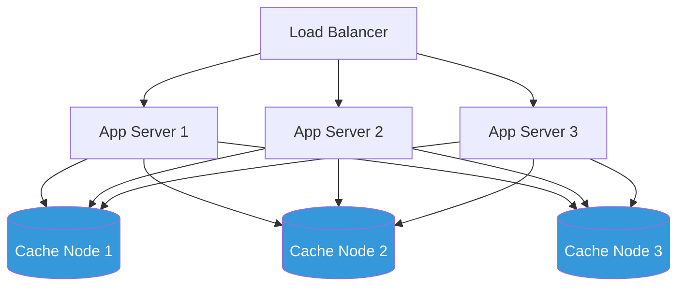

**Data distribution strategies:**

#### 1. Consistent Hashing

Distributes keys evenly across nodes, minimizes redistribution when nodes change.

```javascript
// Consistent hashing theory
function getNode(key, nodes) {
  const hash = hashFunction(key)
  
  // Find node responsible for this hash
  // Using virtual nodes for better distribution
  const virtualNodeCount = 150
  const ring = createHashRing(nodes, virtualNodeCount)
  
  // Find first node >= hash value
  return ring.findNode(hash)
}

// When adding/removing nodes:
// Only ~1/N keys need to move (N = number of nodes)
// vs simple modulo: ~(N-1)/N keys need to move
```

See [load_balancing.md](load_balancing.md) for detailed consistent hashing explanation.

#### 2. Range-Based Partitioning

```javascript
// Partition by key ranges
partitions = [
  { range: 'A-F', node: 'cache1' },
  { range: 'G-M', node: 'cache2' },
  { range: 'N-Z', node: 'cache3' }
]

function getNode(key) {
  const firstChar = key[0].toUpperCase()
  return partitions.find(p => inRange(firstChar, p.range)).node
}
```

**Pros:**
- Range queries possible
- Predictable placement

**Cons:**
- Hot spots if keys not evenly distributed
- Rebalancing complex

#### 3. Replication

Store copies of data across multiple nodes for redundancy.

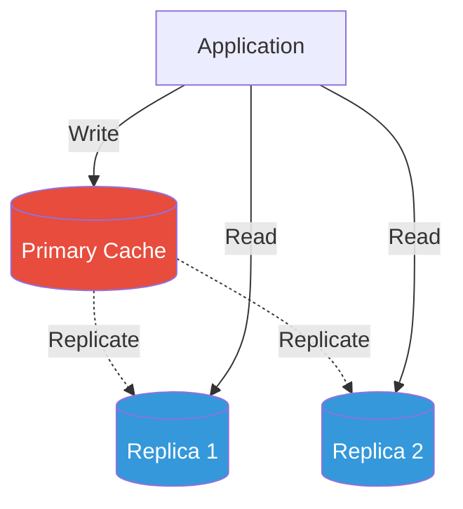

**Theory:**
```javascript
// Replication strategy
replication = {
  factor: 3,  // 3 copies of each key
  
  write: async (key, value) => {
    const nodes = selectNodes(key, factor = 3)
    await Promise.all(
      nodes.map(node => node.set(key, value))
    )
  },
  
  read: async (key) => {
    const nodes = selectNodes(key, factor = 3)
    // Read from any replica (fastest wins)
    return await Promise.race(
      nodes.map(node => node.get(key))
    )
  }
}
```

**Pros:**
- High availability
- Better read performance
- Fault tolerance

**Cons:**
- More storage required
- Consistency challenges (see [eventual_consistency.md](eventual_consistency.md))
- Higher write cost

### Cache Topology Patterns

#### 1. Cache-Per-Node (Local Cache)

Each application server has its own local cache.

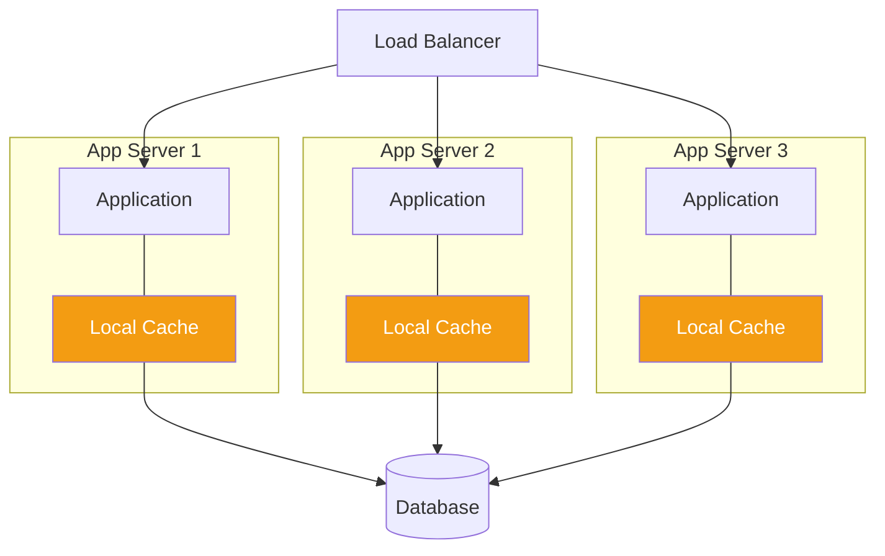

**Pros:**
- No network latency
- No single point of failure
- Extremely fast

**Cons:**
- Cache duplication
- Inconsistency across nodes
- Memory overhead per server

**Use case:** Read-heavy data that rarely changes, with [load_balancing.md](load_balancing.md)

#### 2. Two-Tier Cache (L1 + L2)

Combine local cache (L1) with shared cache (L2).

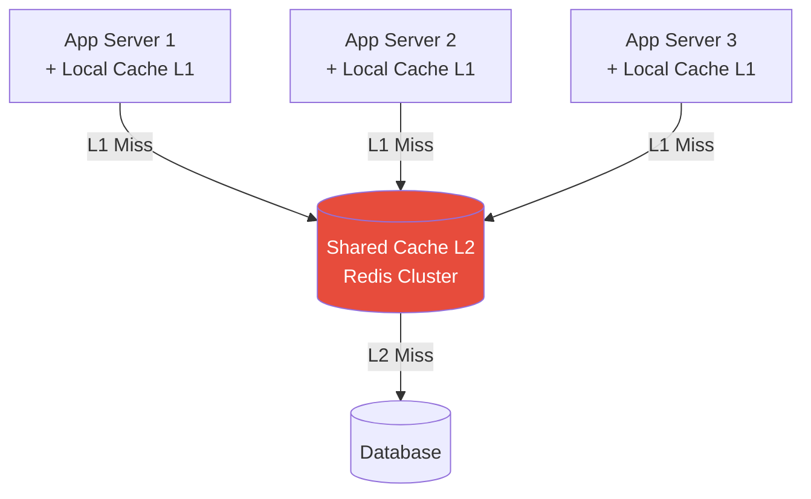

**Access pattern:**
```javascript
// Two-tier cache lookup
async function getData(key) {
  // L1: Check local cache (fastest)
  let data = localCache.get(key)
  if (data) return data
  
  // L2: Check shared cache
  data = await redisCache.get(key)
  if (data) {
    localCache.set(key, data)  // Populate L1
    return data
  }
  
  // L3: Database
  data = await database.query(key)
  
  // Populate both levels
  await redisCache.set(key, data)
  localCache.set(key, data)
  
  return data
}
```

**Pros:**
- Best of both worlds
- Extremely fast L1 hits
- Consistent L2 cache
- Reduced network calls

**Cons:**
- Complex invalidation
- More memory usage
- Potential inconsistency

**Use case:** High-performance systems with [horizontal_scaling.md](horizontal_scaling.md)

## Cache Consistency

Managing consistency between cache and database is challenging, especially with distributed systems and [eventual_consistency.md](eventual_consistency.md).

### The Consistency Problem

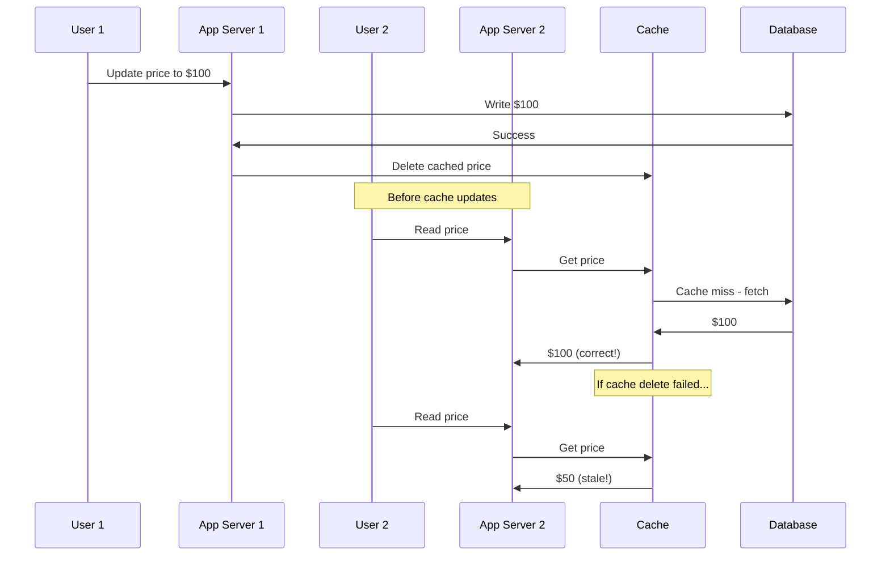

### Consistency Strategies

#### 1. Cache-Aside with Delete

Delete cache entry when data changes (most common).

```javascript
// Update pattern
async function updateProduct(id, newData) {
  // Update database first
  await database.update(id, newData)
  
  // Delete from cache
  await cache.delete(`product:${id}`)
  
  // Next read will fetch fresh data
}
```

**Why delete instead of update?**
- Simpler (no need to transform DB data to cache format)
- Safer (no risk of race conditions between update and cache write)
- Lazy loading (only cache what's actually accessed)

#### 2. Cache-Aside with Update

Update cache when data changes.

```javascript
async function updateProduct(id, newData) {
  // Update database first
  await database.update(id, newData)
  
  // Update cache
  await cache.set(`product:${id}`, newData, { ttl: 3600 })
}
```

**Race condition risk:**
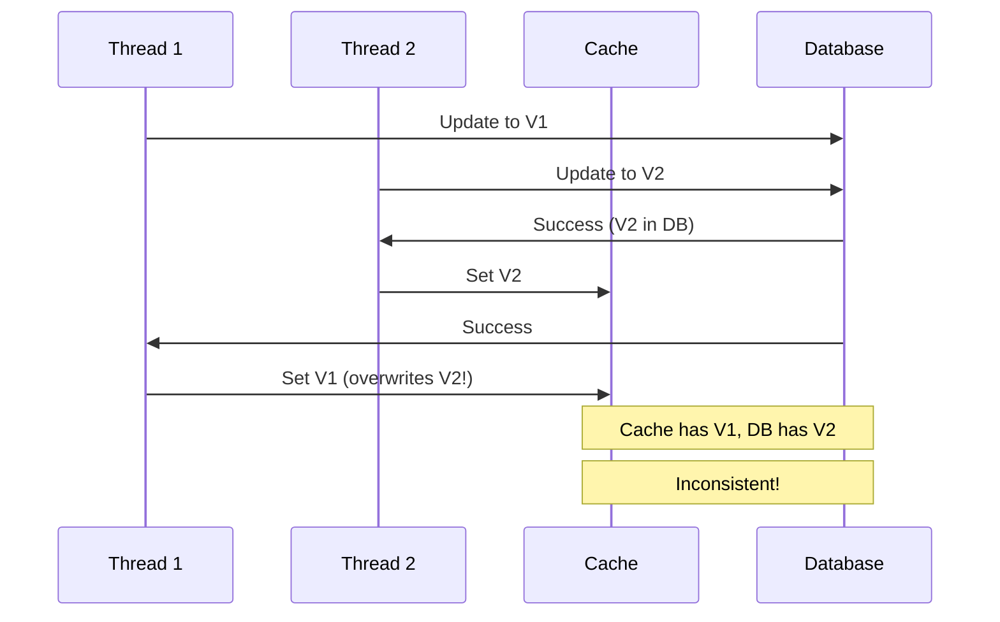

**Solution:** Use TTL to eventually converge, or use versioning.

#### 3. Write-Through with Locks

Ensure atomic updates using locks.

```javascript
async function updateProduct(id, newData) {
  const lockKey = `lock:product:${id}`
  
  // Acquire lock
  const lock = await cache.acquireLock(lockKey, ttl = 5)
  
  try {
    // Update database
    await database.update(id, newData)
    
    // Update cache
    await cache.set(`product:${id}`, newData)
  } finally {
    // Release lock
    await cache.releaseLock(lockKey, lock)
  }
}
```

#### 4. Versioning/Compare-and-Set

Use version numbers to detect conflicts.

```javascript
// Optimistic locking with versioning
async function updateProduct(id, newData) {
  const current = await cache.get(`product:${id}`)
  const currentVersion = current?.version || 0
  
  // Update database with version check
  const result = await database.updateWithVersion(
    id, 
    newData, 
    expectedVersion = currentVersion
  )
  
  if (!result.success) {
    throw new Error("Version conflict")
  }
  
  // Update cache with new version
  await cache.set(`product:${id}`, {
    ...newData,
    version: currentVersion + 1
  })
}
```

#### 5. Event-Driven Invalidation

Use message queues for cache invalidation (see [message_queues.md](message_queues.md)).

```mermaid
graph LR
    App1[App Server 1] -->|Update| DB[(Database)]
    DB -->|Publish event| Queue[Message Queue]
    
    Queue -->|Invalidate| Cache1[Cache Instance 1]
    Queue -->|Invalidate| Cache2[Cache Instance 2]
    Queue -->|Invalidate| Cache3[Cache Instance 3]
    
    style Queue fill:#9b59b6,color:#fff
```

**Theory:**
```javascript
// Publisher
async function updateProduct(id, newData) {
  await database.update(id, newData)
  
  // Publish invalidation event
  await messageQueue.publish('cache.invalidate', {
    type: 'product',
    id: id
  })
}

// Subscriber (on each cache instance)
messageQueue.subscribe('cache.invalidate', async (event) => {
  if (event.type === 'product') {
    await cache.delete(`product:${event.id}`)
  }
})
```

**Pros:**
- Decoupled invalidation
- Works across distributed systems
- Reliable delivery (with proper queue)

**Cons:**
- Eventual consistency
- Added complexity
- Requires message queue infrastructure

## Common Cache Use Cases

### 1. Database Query Results

Most common use case - cache expensive database queries.

```javascript
// Cache query results
async function getUserById(userId) {
  const cacheKey = `user:${userId}`
  
  // Try cache
  let user = await cache.get(cacheKey)
  if (user) return user
  
  // Query database
  user = await database.query(
    'SELECT * FROM users WHERE id = ?', 
    [userId]
  )
  
  // Cache for 1 hour
  await cache.set(cacheKey, user, { ttl: 3600 })
  
  return user
}

// Cache complex queries
async function getPopularProducts(limit = 10) {
  const cacheKey = `products:popular:${limit}`
  
  let products = await cache.get(cacheKey)
  if (products) return products
  
  // Expensive query with joins and aggregations
  products = await database.query(`
    SELECT p.*, COUNT(o.id) as order_count
    FROM products p
    JOIN order_items oi ON p.id = oi.product_id
    JOIN orders o ON oi.order_id = o.id
    WHERE o.created_at > NOW() - INTERVAL 30 DAY
    GROUP BY p.id
    ORDER BY order_count DESC
    LIMIT ?
  `, [limit])
  
  // Cache for 5 minutes
  await cache.set(cacheKey, products, { ttl: 300 })
  
  return products
}
```

See [database_scaling.md](database_scaling.md) for more query optimization patterns.

### 2. Session Storage

Store user session data for fast access across requests.

```javascript
// Session cache
async function getSession(sessionId) {
  return await cache.get(`session:${sessionId}`)
}

async function saveSession(sessionId, sessionData) {
  // Sessions expire after 24 hours of inactivity
  await cache.set(`session:${sessionId}`, sessionData, { ttl: 86400 })
}

async function updateSessionActivity(sessionId) {
  const session = await getSession(sessionId)
  if (session) {
    // Extend TTL on activity
    await cache.expire(`session:${sessionId}`, 86400)
  }
}
```

**Why cache sessions?**
- Fast access (no DB query on every request)
- Automatic expiration (TTL handles cleanup)
- Scalable (works with [load_balancing.md](load_balancing.md))
- Reduces database load dramatically

### 3. API Response Caching

Cache external API calls to reduce latency and costs.

```javascript
// Cache external API responses
async function getWeatherData(city) {
  const cacheKey = `weather:${city}`
  
  let weather = await cache.get(cacheKey)
  if (weather) return weather
  
  // Call external API (slow, costs money)
  weather = await externalWeatherAPI.get(city)
  
  // Cache for 30 minutes (weather doesn't change that fast)
  await cache.set(cacheKey, weather, { ttl: 1800 })
  
  return weather
}

// Cache with fallback for API failures
async function getExchangeRates() {
  const cacheKey = 'exchange-rates'
  
  let rates = await cache.get(cacheKey)
  if (rates) return rates
  
  try {
    rates = await currencyAPI.getRates()
    await cache.set(cacheKey, rates, { ttl: 3600 })
    
    // Also store as backup with longer TTL
    await cache.set(`${cacheKey}:backup`, rates, { ttl: 86400 })
    
    return rates
  } catch (error) {
    // API failed - return backup if available
    const backup = await cache.get(`${cacheKey}:backup`)
    if (backup) return backup
    
    throw error
  }
}
```

### 4. Computed/Aggregated Data

Cache expensive computations.

```javascript
// Cache aggregations
async function getDashboardStats(userId) {
  const cacheKey = `dashboard:stats:${userId}`
  
  let stats = await cache.get(cacheKey)
  if (stats) return stats
  
  // Expensive aggregations
  stats = {
    totalOrders: await database.count('orders', { userId }),
    totalSpent: await database.sum('orders', 'total', { userId }),
    avgOrderValue: await database.avg('orders', 'total', { userId }),
    topProducts: await database.query(/* complex query */),
    recentActivity: await database.query(/* another query */)
  }
  
  // Cache for 15 minutes
  await cache.set(cacheKey, stats, { ttl: 900 })
  
  return stats
}

// Cache expensive computations
async function getRecommendations(userId) {
  const cacheKey = `recommendations:${userId}`
  
  let recommendations = await cache.get(cacheKey)
  if (recommendations) return recommendations
  
  // ML model inference (expensive)
  recommendations = await recommendationEngine.compute(userId)
  
  // Cache for 1 hour
  await cache.set(cacheKey, recommendations, { ttl: 3600 })
  
  return recommendations
}
```

### 5. Rate Limiting

Use cache for tracking request rates.

```javascript
// Rate limiting with cache
async function checkRateLimit(userId, limit = 100, window = 60) {
  const key = `ratelimit:${userId}`
  
  // Increment counter
  const count = await cache.incr(key)
  
  // Set expiration on first request
  if (count === 1) {
    await cache.expire(key, window)
  }
  
  if (count > limit) {
    throw new Error('Rate limit exceeded')
  }
  
  return {
    allowed: true,
    remaining: limit - count
  }
}

// Sliding window rate limiter
async function slidingWindowRateLimit(userId, limit, windowSeconds) {
  const key = `ratelimit:sliding:${userId}`
  const now = Date.now()
  const windowStart = now - (windowSeconds * 1000)
  
  // Add current request timestamp
  await cache.zAdd(key, now, `${now}-${Math.random()}`)
  
  // Remove old entries outside window
  await cache.zRemRangeByScore(key, 0, windowStart)
  
  // Count requests in window
  const count = await cache.zCard(key)
  
  // Set expiration
  await cache.expire(key, windowSeconds)
  
  if (count > limit) {
    throw new Error('Rate limit exceeded')
  }
  
  return {
    allowed: true,
    remaining: limit - count
  }
}
```

### 6. Full-Page Caching

Cache entire HTML responses for static or semi-static pages.

```javascript
// Full page cache
async function handleRequest(req, res) {
  const cacheKey = `page:${req.url}`
  
  // Check cache
  const cachedPage = await cache.get(cacheKey)
  if (cachedPage) {
    res.setHeader('X-Cache', 'HIT')
    return res.send(cachedPage)
  }
  
  // Generate page
  const html = await renderPage(req)
  
  // Cache for 5 minutes
  await cache.set(cacheKey, html, { ttl: 300 })
  
  res.setHeader('X-Cache', 'MISS')
  res.send(html)
}

// Personalized page cache with fragments
async function renderDashboard(userId) {
  const cacheKey = `dashboard:${userId}`
  
  let page = await cache.get(cacheKey)
  if (page) return page
  
  // Cache shared components separately
  const header = await cache.getOrSet(
    'fragment:header',
    () => renderHeader(),
    { ttl: 3600 }
  )
  
  const sidebar = await cache.getOrSet(
    `fragment:sidebar:${userId}`,
    () => renderSidebar(userId),
    { ttl: 900 }
  )
  
  // Always fetch dynamic parts
  const content = await renderContent(userId)
  
  page = assembleLayout({ header, sidebar, content })
  
  // Cache complete page for 1 minute
  await cache.set(cacheKey, page, { ttl: 60 })
  
  return page
}
```

### 7. Object/Entity Caching

Cache domain objects and entities.

```javascript
// Cache entire objects
class UserRepository {
  async getById(id) {
    const cacheKey = `user:${id}`
    
    let user = await cache.get(cacheKey)
    if (user) return this.deserialize(user)
    
    user = await database.findUser(id)
    
    await cache.set(cacheKey, this.serialize(user), { ttl: 3600 })
    
    return user
  }
  
  async update(id, data) {
    await database.updateUser(id, data)
    
    // Invalidate cache
    await cache.delete(`user:${id}`)
    
    // Invalidate related caches
    await cache.delete(`user:${id}:profile`)
    await cache.delete(`user:${id}:orders`)
  }
  
  serialize(user) {
    return JSON.stringify(user)
  }
  
  deserialize(data) {
    return JSON.parse(data)
  }
}
```

## Integration with Other Patterns

### Caching + Load Balancing

Caching reduces backend load, enabling better [load_balancing.md](load_balancing.md) distribution.

```mermaid
graph TD
    LB[Load Balancer]
    
    LB --> App1[App Server 1]
    LB --> App2[App Server 2]
    LB --> App3[App Server 3]
    
    App1 --> Cache[(Shared Cache<br/>90% hit rate)]
    App2 --> Cache
    App3 --> Cache
    
    Cache -->|10% miss| DB[(Database<br/>Light load)]
    
    style Cache fill:#27ae60,color:#fff
    style DB fill:#3498db,color:#fff
```

**Impact:**
- 90% cache hit rate = 10x reduction in database queries
- Better load distribution
- More predictable performance

### Caching + Database Scaling

Cache reduces need for read replicas (see [database_scaling.md](database_scaling.md)).

```javascript
// Without cache: Need many read replicas
readReplicas = 10  // For 10k reads/sec

// With 95% cache hit: Much fewer replicas needed
cacheHitRate = 0.95
databaseReads = 10000 * (1 - cacheHitRate)  // 500 reads/sec
readReplicas = 1  // Single replica can handle this

// Cost savings significant (see cost_scaling.md)
```

### Caching + Auto Scaling

Proper caching reduces need for aggressive [auto_scaling.md](auto_scaling.md).

```mermaid
graph TD
    subgraph "Without Cache"
    W1[High DB Load] --> W2[Trigger Auto-scale]
    W2 --> W3[Add 10 Servers]
    W3 --> W4[High Cost]
    end
    
    subgraph "With Cache"
    C1[Cache Absorbs Load] --> C2[Stable Metrics]
    C2 --> C3[Minimal Scaling]
    C3 --> C4[Lower Cost]
    end
    
    style W4 fill:#e74c3c,color:#fff
    style C4 fill:#27ae60,color:#fff
```

### Caching + Message Queues

Cache results of async processing (see [message_queues.md](message_queues.md)).

```javascript
// Cache expensive async job results
async function processReport(reportId) {
  const cacheKey = `report:${reportId}`
  
  // Check if already processed
  let result = await cache.get(cacheKey)
  if (result) return result
  
  // Queue for processing
  await messageQueue.publish('process-report', { reportId })
  
  return { status: 'processing' }
}

// Worker processes and caches result
messageQueue.subscribe('process-report', async (job) => {
  const result = await generateReport(job.reportId)
  
  // Cache result for 24 hours
  await cache.set(
    `report:${job.reportId}`,
    result,
    { ttl: 86400 }
  )
})
```

### Caching + Eventual Consistency

Caching naturally introduces eventual consistency (see [eventual_consistency.md](eventual_consistency.md)).

```javascript
// Accept eventual consistency for better performance
async function getProductPrice(productId) {
  const cacheKey = `price:${productId}`
  
  let price = await cache.get(cacheKey)
  if (price) return price  // May be slightly stale
  
  price = await database.getPrice(productId)
  
  // Cache for 5 minutes - prices don't change often
  await cache.set(cacheKey, price, { ttl: 300 })
  
  return price
}

// For critical operations, bypass cache
async function checkout(cartId) {
  // Always get fresh prices for checkout
  const prices = await database.getPrices(cartId, { bypassCache: true })
  
  // Process order with guaranteed fresh data
  return processOrder(prices)
}
```

## Performance Optimization

### Monitoring Cache Performance

```javascript
// Key metrics to track
metrics = {
  hitRate: "cacheHits / (cacheHits + cacheMisses)",
  missRate: "cacheMisses / (cacheHits + cacheMisses)",
  evictionRate: "evictionsPerSecond",
  memoryUsage: "usedMemory / totalMemory",
  avgResponseTime: "average cache operation latency",
  
  // Per-key metrics
  hotKeys: "most frequently accessed keys",
  largeKeys: "keys consuming most memory",
  slowQueries: "slowest cache operations"
}

// Alert thresholds
alerts = {
  hitRateLow: hitRate < 0.80,      // Below 80% hit rate
  memoryHigh: memoryUsage > 0.90,  // Above 90% memory
  evictionHigh: evictionRate > 100 // Too many evictions
}
```

### Optimizing Cache Hit Rate

```javascript
// Strategies to improve hit rate

// 1. Increase TTL for stable data
cache.set('config', data, { ttl: 86400 })  // 24 hours

// 2. Warm cache on startup
async function warmCache() {
  const popularProducts = await database.getPopularProducts(100)
  for (const product of popularProducts) {
    await cache.set(`product:${product.id}`, product, { ttl: 3600 })
  }
}

// 3. Predictive caching (pre-fetch related data)
async function getProduct(id) {
  const product = await cache.getOrFetch(`product:${id}`)
  
  // Pre-fetch related products
  if (product.relatedIds) {
    product.relatedIds.forEach(async (relatedId) => {
      cache.getOrFetch(`product:${relatedId}`)  // Don't await
    })
  }
  
  return product
}

// 4. Cache negative results
async function userExists(email) {
  const cacheKey = `user:exists:${email}`
  
  let exists = await cache.get(cacheKey)
  if (exists !== null) return exists
  
  exists = await database.userExists(email)
  
  // Cache both positive and negative results
  await cache.set(cacheKey, exists, { ttl: 300 })
  
  return exists
}
```

### Reducing Cache Memory Usage

```javascript
// Memory optimization techniques

// 1. Compression for large values
async function setCached(key, value) {
  const serialized = JSON.stringify(value)
  
  if (serialized.length > 1024) {
    // Compress large values
    const compressed = await compress(serialized)
    await cache.set(key, compressed, { compressed: true })
  } else {
    await cache.set(key, serialized)
  }
}

// 2. Store references instead of duplicates
// Bad: Store full user object everywhere
await cache.set(`order:${orderId}`, { ...order, user: fullUserObject })

// Good: Store user ID, fetch user separately (cached)
await cache.set(`order:${orderId}`, { ...order, userId })
const user = await cache.getOrFetch(`user:${order.userId}`)

// 3. Use appropriate data structures
// Bad: Store list as JSON string
await cache.set('recent-items', JSON.stringify([1,2,3,4,5]))

// Good: Use native list operations
await cache.lPush('recent-items', 1)
await cache.lTrim('recent-items', 0, 99)  // Keep last 100

// 4. Selective field caching
// Bad: Cache entire huge object
await cache.set(`product:${id}`, entireProductWithAllFields)

// Good: Cache only needed fields
await cache.set(`product:${id}:summary`, {
  id, name, price, image  // Only what's needed for listing
})
```

### Batch Operations

```javascript
// Optimize multiple cache operations

// Bad: Multiple round trips
for (const id of userIds) {
  users.push(await cache.get(`user:${id}`))
}

// Good: Single batch operation
const keys = userIds.map(id => `user:${id}`)
const users = await cache.mGet(keys)

// Batch write
const pairs = products.map(p => [`product:${p.id}`, p])
await cache.mSet(pairs)
```

## Common Pitfalls and Best Practices

### Pitfalls to Avoid

#### 1. Cache Stampede

Multiple requests hit database when cache expires.

```mermaid
sequenceDiagram
    participant C1 as Request 1
    participant C2 as Request 2
    participant C3 as Request 3
    participant Cache as Cache
    participant DB as Database
    
    Note over Cache: Cache expires
    
    C1->>Cache: Get data (miss)
    C2->>Cache: Get data (miss)
    C3->>Cache: Get data (miss)
    
    C1->>DB: Query
    C2->>DB: Query (redundant!)
    C3->>DB: Query (redundant!)
    
    Note over DB: Database overwhelmed!
```

**Solution:** Use locking or probabilistic expiration (see [Cache Stampede Prevention](#4-cache-stampede-prevention)).

#### 2. Caching Everything

```javascript
// Bad: Cache everything indiscriminately
await cache.set(`user:${id}:timestamp`, Date.now())  // Changes constantly
await cache.set(`random:${uuid}`, data)  // Never accessed again
await cache.set(`one-time:${token}`, data)  // Single use

// Good: Cache selectively
// - Frequently accessed data
// - Expensive to compute/fetch
// - Relatively stable
```

#### 3. Ignoring Cache Failures

```javascript
// Bad: Let cache failures break the app
const data = await cache.get(key)  // Throws error if cache down
return data

// Good: Graceful degradation
async function getData(key) {
  try {
    const cached = await cache.get(key)
    if (cached) return cached
  } catch (error) {
    logger.error('Cache error:', error)
    // Fall through to database
  }
  
  // Database as fallback
  return await database.query(key)
}
```

#### 4. Not Monitoring Cache

```javascript
// Bad: Deploy and forget

// Good: Monitor and alert
monitoring = {
  metrics: ['hitRate', 'memoryUsage', 'latency'],
  alerts: {
    lowHitRate: hitRate < 0.80,
    highMemory: memoryUsage > 0.90,
    highLatency: p95Latency > 10  // ms
  },
  dashboard: 'cache-performance'
}
```

#### 5. Inappropriate TTL

```javascript
// Bad: One size fits all
const DEFAULT_TTL = 3600  // Everything cached for 1 hour

// Good: TTL based on data characteristics
ttlStrategy = {
  staticContent: 86400,     // 24 hours (rarely changes)
  userProfile: 3600,        // 1 hour (changes occasionally)
  productPrice: 300,        // 5 minutes (changes frequently)
  realTimeData: 10,         // 10 seconds (very dynamic)
  sessionData: 1800         // 30 minutes (user activity)
}
```

#### 6. Large Cache Keys

```javascript
// Bad: Huge cache keys waste memory
const key = `user:${userId}:profile:with:all:details:including:preferences:and:settings`

// Good: Concise but meaningful
const key = `user:${userId}:profile`
```

#### 7. Not Handling Serialization

```javascript
// Bad: Assume cache stores objects
cache.set('user', userObject)  // May store [Object object]
const user = cache.get('user')
console.log(user.name)  // Error!

// Good: Explicit serialization
cache.set('user', JSON.stringify(userObject))
const user = JSON.parse(cache.get('user'))
```

### Best Practices

#### 1. Cache Keys Naming Convention

```javascript
// Consistent naming pattern
keyPatterns = {
  entity: "{type}:{id}",                    // user:123
  list: "{type}:list:{filter}",             // products:list:electronics
  relationship: "{type}:{id}:{relation}",   // user:123:orders
  aggregation: "{type}:stats:{period}",     // sales:stats:daily
  session: "session:{sessionId}",           // session:abc123
  lock: "lock:{resource}",                  // lock:product:123
}

// Use namespaces for multi-tenancy
const key = `tenant:${tenantId}:user:${userId}`
```

#### 2. Implement Cache Warming

```javascript
// Warm critical caches on startup/deployment
async function warmCache() {
  console.log('Warming cache...')
  
  // Popular products
  const products = await database.getPopularProducts(100)
  await Promise.all(
    products.map(p => 
      cache.set(`product:${p.id}`, p, { ttl: 3600 })
    )
  )
  
  // Config/settings
  const config = await database.getConfig()
  await cache.set('app:config', config, { ttl: 86400 })
  
  // Static/reference data
  const categories = await database.getCategories()
  await cache.set('categories:all', categories, { ttl: 86400 })
  
  console.log('Cache warming complete')
}

// Call during application startup
await warmCache()
```

#### 3. Graceful Cache Degradation

```javascript
// Cache wrapper with fallback
class CacheWithFallback {
  constructor(cache, fallback, options = {}) {
    this.cache = cache
    this.fallback = fallback
    this.timeout = options.timeout || 100  // ms
  }
  
  async get(key) {
    try {
      // Try cache with timeout
      const result = await Promise.race([
        this.cache.get(key),
        this.timeoutPromise()
      ])
      
      if (result !== null) return result
    } catch (error) {
      logger.warn('Cache failure, using fallback:', error)
      metrics.increment('cache.errors')
    }
    
    // Fallback to source
    return await this.fallback(key)
  }
  
  timeoutPromise() {
    return new Promise((_, reject) => {
      setTimeout(() => reject(new Error('Cache timeout')), this.timeout)
    })
  }
}

// Usage
const cache = new CacheWithFallback(
  redisCache,
  (key) => database.query(key)
)
```

#### 4. Use Cache Hierarchy

```javascript
// Multi-level cache strategy
class HierarchicalCache {
  constructor() {
    this.l1 = new Map()  // In-process cache (fastest)
    this.l2 = redisClient  // Distributed cache (fast)
    this.l3 = database  // Source of truth (slow)
  }
  
  async get(key) {
    // L1: Check in-process cache
    if (this.l1.has(key)) {
      metrics.increment('cache.l1.hit')
      return this.l1.get(key)
    }
    
    // L2: Check distributed cache
    try {
      const value = await this.l2.get(key)
      if (value) {
        metrics.increment('cache.l2.hit')
        this.l1.set(key, value)  // Populate L1
        return value
      }
    } catch (error) {
      logger.warn('L2 cache error:', error)
    }
    
    // L3: Database
    metrics.increment('cache.miss')
    const value = await this.l3.query(key)
    
    // Populate both levels
    this.l1.set(key, value)
    await this.l2.set(key, value, { ttl: 3600 })
    
    return value
  }
  
  async invalidate(key) {
    this.l1.delete(key)
    await this.l2.del(key)
  }
}
```

#### 5. Implement Cache Versioning

```javascript
// Version-based cache invalidation
class VersionedCache {
  constructor(cache) {
    this.cache = cache
  }
  
  async get(type, id) {
    const version = await this.getVersion(type)
    const key = this.versionedKey(type, id, version)
    return await this.cache.get(key)
  }
  
  async set(type, id, value, ttl) {
    const version = await this.getVersion(type)
    const key = this.versionedKey(type, id, version)
    await this.cache.set(key, value, { ttl })
  }
  
  async invalidateType(type) {
    // Increment version - all old caches now invalid
    await this.cache.incr(`version:${type}`)
  }
  
  async getVersion(type) {
    let version = await this.cache.get(`version:${type}`)
    if (!version) {
      version = 1
      await this.cache.set(`version:${type}`, version)
    }
    return version
  }
  
  versionedKey(type, id, version) {
    return `${type}:${id}:v${version}`
  }
}

// Usage
const cache = new VersionedCache(redisClient)

// When products change
await cache.invalidateType('product')
// All product:*:v1 caches now effectively invalid
// New requests use product:*:v2
```

#### 6. Monitor and Tune

```javascript
// Comprehensive cache monitoring
class MonitoredCache {
  constructor(cache) {
    this.cache = cache
    this.stats = {
      hits: 0,
      misses: 0,
      errors: 0,
      totalLatency: 0,
      operations: 0
    }
  }
  
  async get(key) {
    const start = Date.now()
    
    try {
      const value = await this.cache.get(key)
      const latency = Date.now() - start
      
      this.stats.operations++
      this.stats.totalLatency += latency
      
      if (value !== null) {
        this.stats.hits++
        metrics.histogram('cache.latency.hit', latency)
      } else {
        this.stats.misses++
        metrics.histogram('cache.latency.miss', latency)
      }
      
      return value
    } catch (error) {
      this.stats.errors++
      metrics.increment('cache.errors')
      throw error
    }
  }
  
  getStats() {
    const hitRate = this.stats.hits / this.stats.operations
    const avgLatency = this.stats.totalLatency / this.stats.operations
    
    return {
      hitRate: (hitRate * 100).toFixed(2) + '%',
      avgLatency: avgLatency.toFixed(2) + 'ms',
      totalOps: this.stats.operations,
      errors: this.stats.errors
    }
  }
}
```

#### 7. Document Cache Strategy

```javascript
// Document your cache strategy
const cacheStrategy = {
  // What we cache
  cached: {
    userProfiles: {
      key: "user:{id}",
      ttl: 3600,
      invalidation: "on user update",
      rationale: "Frequently accessed, rarely changes"
    },
    
    productCatalog: {
      key: "product:{id}",
      ttl: 300,
      invalidation: "on product update",
      rationale: "Very frequent reads, periodic price changes"
    },
    
    searchResults: {
      key: "search:{query}",
      ttl: 600,
      invalidation: "TTL only",
      rationale: "Expensive to compute, can tolerate staleness"
    }
  },
  
  // What we DON'T cache
  notCached: {
    orderCheckout: "Real-time pricing required",
    userPassword: "Security sensitive",
    oneTimeTokens: "Single use only"
  },
  
  // Performance targets
  targets: {
    hitRate: ">90%",
    p95Latency: "<5ms",
    memoryUsage: "<80%"
  }
}
```

#### 8. Test Cache Behavior

```javascript
// Unit tests for cache logic
describe('User Cache', () => {
  it('should cache user on first fetch', async () => {
    const user = await userService.getById(123)
    const cached = await cache.get('user:123')
    expect(cached).toEqual(user)
  })
  
  it('should invalidate cache on update', async () => {
    await userService.update(123, { name: 'New Name' })
    const cached = await cache.get('user:123')
    expect(cached).toBeNull()
  })
  
  it('should handle cache failures gracefully', async () => {
    cache.simulateFailure()
    const user = await userService.getById(123)
    expect(user).toBeDefined()  // Should still work
  })
  
  it('should prevent cache stampede', async () => {
    cache.clear()
    
    // Simulate 100 concurrent requests
    const requests = Array(100).fill().map(() => 
      userService.getById(123)
    )
    
    await Promise.all(requests)
    
    // Should only query database once
    expect(database.queryCount).toBe(1)
  })
})

// Load tests
describe('Cache Performance', () => {
  it('should maintain >90% hit rate under load', async () => {
    // Simulate realistic traffic
    for (let i = 0; i < 10000; i++) {
      await userService.getById(randomUserId())
    }
    
    const hitRate = cache.getHitRate()
    expect(hitRate).toBeGreaterThan(0.90)
  })
})
```

#### 9. Use Appropriate Data Structures

```javascript
// Choose right Redis data structure for use case

// Strings (most common)
await cache.set('user:123', JSON.stringify(user))

// Hashes (for object fields)
await cache.hSet('user:123', 'name', 'John')
await cache.hSet('user:123', 'email', 'john@example.com')
await cache.hGetAll('user:123')  // Get entire object

// Lists (ordered collections)
await cache.lPush('recent-orders', orderId)  // Add to front
await cache.lTrim('recent-orders', 0, 99)    // Keep last 100
await cache.lRange('recent-orders', 0, 9)    // Get first 10

// Sets (unique collections)
await cache.sAdd('user:123:favorites', productId)
await cache.sIsMember('user:123:favorites', productId)
await cache.sInter('user:123:favorites', 'user:456:favorites')  // Common favorites

// Sorted Sets (scored collections)
await cache.zAdd('leaderboard', score, userId)
await cache.zRevRange('leaderboard', 0, 9)  // Top 10
await cache.zRank('leaderboard', userId)    // User's rank

// Bitmaps (flags/boolean arrays)
await cache.setBit('daily-active:2025-10-03', userId, 1)
await cache.bitCount('daily-active:2025-10-03')  // Count active users

// HyperLogLog (approximate counts)
await cache.pfAdd('unique-visitors', visitorId)
await cache.pfCount('unique-visitors')  // Approximate unique count
```

#### 10. Handle Cache Failures

```javascript
// Circuit breaker for cache
class CacheCircuitBreaker {
  constructor(cache, options = {}) {
    this.cache = cache
    this.failureThreshold = options.failureThreshold || 5
    this.resetTimeout = options.resetTimeout || 60000  // 1 minute
    this.state = 'CLOSED'  // CLOSED, OPEN, HALF_OPEN
    this.failures = 0
    this.lastFailureTime = null
  }
  
  async get(key) {
    if (this.state === 'OPEN') {
      if (Date.now() - this.lastFailureTime > this.resetTimeout) {
        this.state = 'HALF_OPEN'
      } else {
        throw new Error('Circuit breaker is OPEN')
      }
    }
    
    try {
      const result = await this.cache.get(key)
      
      if (this.state === 'HALF_OPEN') {
        this.state = 'CLOSED'
        this.failures = 0
      }
      
      return result
    } catch (error) {
      this.failures++
      this.lastFailureTime = Date.now()
      
      if (this.failures >= this.failureThreshold) {
        this.state = 'OPEN'
        logger.error('Cache circuit breaker opened')
      }
      
      throw error
    }
  }
}

// Usage with fallback
async function getData(key) {
  try {
    return await cacheWithCircuitBreaker.get(key)
  } catch (error) {
    logger.warn('Cache unavailable, using database')
    return await database.query(key)
  }
}
```

## Advanced Caching Patterns

### 1. Cache-Aside with Background Refresh

Combine cache-aside with automatic background refresh for hot data.

```javascript
class RefreshingCache {
  constructor(cache, dataSource, refreshInterval = 300000) {
    this.cache = cache
    this.dataSource = dataSource
    this.refreshInterval = refreshInterval
    this.refreshers = new Map()
  }
  
  async get(key) {
    let value = await this.cache.get(key)
    
    if (!value) {
      value = await this.dataSource(key)
      await this.cache.set(key, value, { ttl: this.refreshInterval / 1000 })
      this.scheduleRefresh(key)
    }
    
    return value
  }
  
  scheduleRefresh(key) {
    if (this.refreshers.has(key)) return
    
    const refresher = setInterval(async () => {
      try {
        const value = await this.dataSource(key)
        await this.cache.set(key, value, { ttl: this.refreshInterval / 1000 })
      } catch (error) {
        logger.error(`Failed to refresh cache for ${key}:`, error)
      }
    }, this.refreshInterval)
    
    this.refreshers.set(key, refresher)
  }
  
  stopRefresh(key) {
    const refresher = this.refreshers.get(key)
    if (refresher) {
      clearInterval(refresher)
      this.refreshers.delete(key)
    }
  }
}
```

### 2. Write-Coalescing

Batch multiple writes together to reduce database load.

```javascript
class WriteCoalescingCache {
  constructor(cache, database) {
    this.cache = cache
    this.database = database
    this.writeQueue = new Map()
    this.flushInterval = 5000  // Flush every 5 seconds
    
    setInterval(() => this.flush(), this.flushInterval)
  }
  
  async set(key, value) {
    // Write to cache immediately
    await this.cache.set(key, value)
    
    // Queue for database write
    this.writeQueue.set(key, {
      value,
      timestamp: Date.now()
    })
  }
  
  async flush() {
    if (this.writeQueue.size === 0) return
    
    const entries = Array.from(this.writeQueue.entries())
    this.writeQueue.clear()
    
    // Batch write to database
    try {
      await this.database.batchWrite(entries)
      logger.info(`Flushed ${entries.length} writes to database`)
    } catch (error) {
      logger.error('Failed to flush writes:', error)
      
      // Re-queue failed writes
      entries.forEach(([key, data]) => {
        this.writeQueue.set(key, data)
      })
    }
  }
}
```

### 3. Adaptive TTL

Dynamically adjust TTL based on access patterns.

```javascript
class AdaptiveTTLCache {
  constructor(cache) {
    this.cache = cache
    this.accessStats = new Map()
    this.baseTTL = 3600
  }
  
  async get(key) {
    // Track access
    this.recordAccess(key)
    
    return await this.cache.get(key)
  }
  
  async set(key, value) {
    // Calculate optimal TTL based on access pattern
    const ttl = this.calculateTTL(key)
    await this.cache.set(key, value, { ttl })
  }
  
  recordAccess(key) {
    const stats = this.accessStats.get(key) || { count: 0, lastAccess: 0 }
    const now = Date.now()
    
    stats.count++
    stats.frequency = stats.count / ((now - stats.firstAccess) / 1000 || 1)
    stats.lastAccess = now
    
    if (!stats.firstAccess) {
      stats.firstAccess = now
    }
    
    this.accessStats.set(key, stats)
  }
  
  calculateTTL(key) {
    const stats = this.accessStats.get(key)
    if (!stats) return this.baseTTL
    
    // Higher frequency = longer TTL
    if (stats.frequency > 10) return this.baseTTL * 4      // 4 hours
    if (stats.frequency > 5) return this.baseTTL * 2       // 2 hours
    if (stats.frequency > 1) return this.baseTTL           // 1 hour
    return this.baseTTL / 2                                // 30 minutes
  }
}
```

### 4. Partial/Delta Caching

Cache only changed parts of large objects.

```javascript
// Delta caching for large objects
class DeltaCache {
  async get(key, version) {
    // Get base version
    const base = await this.cache.get(`${key}:base`)
    
    if (!version || !base) {
      return base
    }
    
    // Apply deltas up to requested version
    const current = JSON.parse(base)
    for (let v = base.version + 1; v <= version; v++) {
      const delta = await this.cache.get(`${key}:delta:${v}`)
      if (delta) {
        Object.assign(current, JSON.parse(delta))
      }
    }
    
    return current
  }
  
  async set(key, value, previousVersion) {
    if (!previousVersion) {
      // Store as base
      await this.cache.set(`${key}:base`, JSON.stringify({
        ...value,
        version: 1
      }))
      return
    }
    
    // Calculate delta
    const previous = await this.get(key, previousVersion)
    const delta = this.calculateDelta(previous, value)
    
    // Store delta
    await this.cache.set(
      `${key}:delta:${previousVersion + 1}`,
      JSON.stringify(delta)
    )
  }
  
  calculateDelta(previous, current) {
    const delta = {}
    
    for (const [key, value] of Object.entries(current)) {
      if (previous[key] !== value) {
        delta[key] = value
      }
    }
    
    return delta
  }
}
```

### 5. Probabilistic Caching

Use Bloom filters to avoid caching rarely accessed data.

```javascript
// Bloom filter to track access patterns
class ProbabilisticCache {
  constructor(cache) {
    this.cache = cache
    this.bloomFilter = new BloomFilter(10000, 0.01)  // Size, false positive rate
    this.accessThreshold = 3
  }
  
  async get(key) {
    // Check if we've seen this key enough times
    const accessCount = this.bloomFilter.count(key)
    
    if (accessCount < this.accessThreshold) {
      // Don't cache yet - not accessed enough
      this.bloomFilter.add(key)
      return await this.database.query(key)
    }
    
    // Frequently accessed - use cache
    let value = await this.cache.get(key)
    
    if (!value) {
      value = await this.database.query(key)
      await this.cache.set(key, value)
    }
    
    return value
  }
}
```

## Real-World Architecture Examples

### E-Commerce Product Catalog

```javascript
// Multi-layer caching for e-commerce
class ProductCatalogCache {
  constructor() {
    this.l1 = new Map()              // In-memory (hot products)
    this.l2 = redisClient            // Distributed (all products)
    this.cdn = cdnClient             // Edge (images, static)
    this.db = database               // Source of truth
  }
  
  async getProduct(productId) {
    // L1: Hot products in-memory
    if (this.l1.has(productId)) {
      return this.l1.get(productId)
    }
    
    // L2: All products in Redis
    let product = await this.l2.get(`product:${productId}`)
    
    if (!product) {
      product = await this.db.getProduct(productId)
      
      // Cache in Redis for 5 minutes
      await this.l2.set(`product:${productId}`, product, { ttl: 300 })
      
      // Track if this becomes a hot product
      await this.trackAccess(productId)
    }
    
    // Promote to L1 if frequently accessed
    if (await this.isHotProduct(productId)) {
      this.l1.set(productId, product)
    }
    
    return product
  }
  
  async updateProduct(productId, data) {
    await this.db.updateProduct(productId, data)
    
    // Invalidate all cache layers
    this.l1.delete(productId)
    await this.l2.del(`product:${productId}`)
    
    // Invalidate related caches
    await this.invalidateRelatedCaches(productId)
  }
  
  async invalidateRelatedCaches(productId) {
    const product = await this.db.getProduct(productId)
    
    // Invalidate category listings
    await this.l2.del(`category:${product.categoryId}:products`)
    
    // Invalidate search results (version bump)
    await this.l2.incr('search:version')
    
    // Invalidate recommendations
    await this.l2.del(`recommendations:*`)  // Or more targeted
  }
}
```

### Social Media Feed

```javascript
// Feed caching with real-time updates
class FeedCache {
  async getUserFeed(userId, page = 0, limit = 20) {
    const cacheKey = `feed:${userId}`
    
    // Try to get from cache
    let feed = await cache.lRange(cacheKey, page * limit, (page + 1) * limit - 1)
    
    if (feed.length > 0) {
      return feed.map(JSON.parse)
    }
    
    // Generate feed (expensive)
    feed = await this.generateFeed(userId)
    
    // Cache as list (maintains order)
    await cache.del(cacheKey)
    await cache.rPush(cacheKey, ...feed.map(JSON.stringify))
    await cache.expire(cacheKey, 300)  // 5 minutes
    
    return feed.slice(page * limit, (page + 1) * limit)
  }
  
  async onNewPost(post) {
    // Get followers
    const followers = await database.getFollowers(post.authorId)
    
    // Invalidate feed cache for all followers
    await Promise.all(
      followers.map(followerId =>
        cache.del(`feed:${followerId}`)
      )
    )
    
    // Or: Inject post into cached feeds (more complex but faster)
    await Promise.all(
      followers.map(async followerId => {
        const key = `feed:${followerId}`
        if (await cache.exists(key)) {
          await cache.lPush(key, JSON.stringify(post))
          await cache.lTrim(key, 0, 99)  // Keep last 100
        }
      })
    )
  }
}
```

### API Gateway with Caching

```javascript
// API response caching
class APIGatewayCache {
  async handleRequest(req) {
    // Generate cache key from request
    const cacheKey = this.getCacheKey(req)
    
    // Check if cacheable
    if (!this.isCacheable(req)) {
      return await this.forwardRequest(req)
    }
    
    // Try cache
    const cached = await cache.get(cacheKey)
    if (cached) {
      return {
        ...cached,
        headers: { 'X-Cache': 'HIT' }
      }
    }
    
    // Forward to backend
    const response = await this.forwardRequest(req)
    
    // Cache successful responses
    if (response.status === 200) {
      const ttl = this.getTTL(req, response)
      await cache.set(cacheKey, response, { ttl })
    }
    
    return {
      ...response,
      headers: { ...response.headers, 'X-Cache': 'MISS' }
    }
  }
  
  getCacheKey(req) {
    // Include relevant parts of request
    return `api:${req.method}:${req.path}:${JSON.stringify(req.query)}`
  }
  
  isCacheable(req) {
    // Only cache GET requests
    if (req.method !== 'GET') return false
    
    // Don't cache authenticated requests (or use user-specific keys)
    if (req.headers.authorization) return false
    
    // Check cache-control headers
    if (req.headers['cache-control']?.includes('no-cache')) return false
    
    return true
  }
  
  getTTL(req, response) {
    // Respect cache-control from backend
    const cacheControl = response.headers['cache-control']
    if (cacheControl) {
      const match = cacheControl.match(/max-age=(\d+)/)
      if (match) return parseInt(match[1])
    }
    
    // Default TTLs by endpoint
    const ttlMap = {
      '/api/config': 3600,
      '/api/products': 300,
      '/api/users': 600
    }
    
    return ttlMap[req.path] || 60
  }
}
```

## Conclusion

Caching is a critical component of scalable system design. Key takeaways:

1. **Choose the right pattern** - Cache-aside for flexibility, read-through for simplicity, write-through for consistency
2. **Use appropriate TTLs** - Balance freshness with performance based on data characteristics
3. **Monitor continuously** - Track hit rates, latency, memory usage, and adjust accordingly
4. **Handle failures gracefully** - Cache should improve performance, not create new failure modes
5. **Invalidate strategically** - Use events, versions, or TTLs based on consistency requirements
6. **Layer caches** - Combine browser, CDN, application, and database caches for optimal performance
7. **Consider consistency** - Understand trade-offs between performance and consistency (see [eventual_consistency.md](eventual_consistency.md))

Caching provides:
- **Performance** - 10-100x faster data access
- **Scalability** - Reduces backend load dramatically (see [database_scaling.md](database_scaling.md))
- **Availability** - Can serve stale data during outages
- **Cost savings** - Fewer database queries and servers needed (see [cost_scaling.md](cost_scaling.md))

Effective caching strategy is essential for:
- [horizontal_scaling.md](horizontal_scaling.md) - Distribute load across servers
- [load_balancing.md](load_balancing.md) - Reduce per-server load
- [auto_scaling.md](auto_scaling.md) - Reduce scaling triggers
- [database_scaling.md](database_scaling.md) - Minimize database queries

## Further Reading

- [load_balancing.md](load_balancing.md) - Distribute traffic with caching layers
- [horizontal_scaling.md](horizontal_scaling.md) - Scale application tier with distributed caching
- [database_scaling.md](database_scaling.md) - Reduce database load with query caching
- [message_queues.md](message_queues.md) - Async processing with result caching
- [eventual_consistency.md](eventual_consistency.md) - Consistency implications of caching
- [auto_scaling.md](auto_scaling.md) - Reduce need for scaling with caching
- [cost_scaling.md](cost_scaling.md) - Cost optimization through caching
- [best_practises.md](best_practises.md) - Operational best practices