# Case Study 1: Twitter's Scalability Architecture

## Overview

Twitter handles over **500 million tweets per day** with approximately **400 million monthly active users**. The platform faces unique scalability challenges due to its real-time nature, celebrity accounts with millions of followers, and the viral spread of content.

## Key Scalability Challenges

### 1. **The Fan-Out Problem**
When a user with millions of followers posts a tweet, the system must deliver it to all followers' timelines efficiently. This is Twitter's most significant scalability challenge.

**Two Approaches:**
- **Fan-out on Write**: Pre-compute timelines when tweet is posted
- **Fan-out on Read**: Compute timeline when user requests it

### 2. **Read-Heavy Workload**
- **Read:Write ratio** is approximately 100:1
- Users consume far more content than they create
- Timeline requests are the most common operation

### 3. **Real-Time Delivery**
- Tweets must appear in timelines within milliseconds
- Trending topics need real-time computation
- Search results must be current

## Architecture Evolution

### Phase 1: Monolithic Architecture (2006-2008)

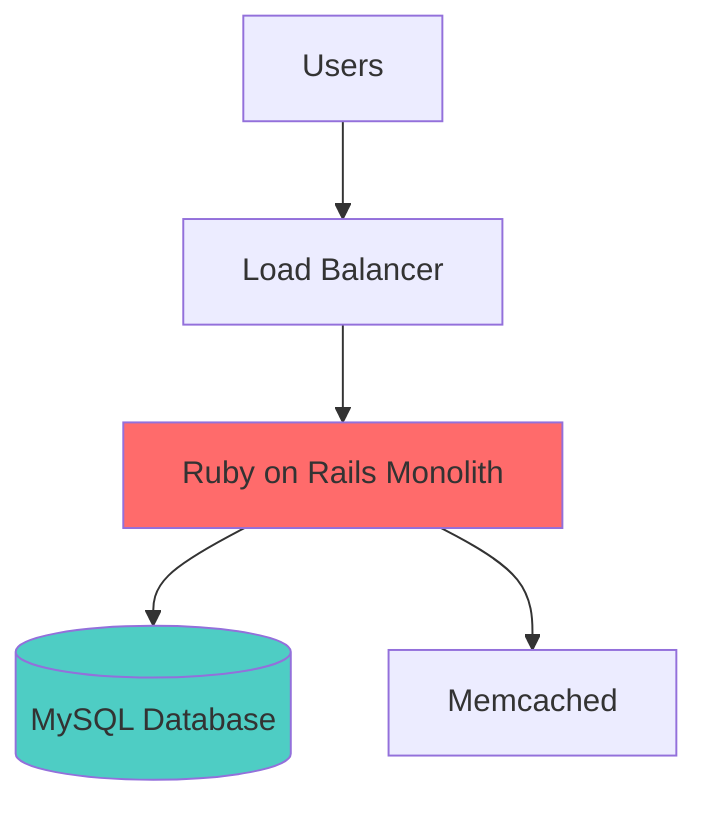

**Problems:**
- Frequent downtime during peak events
- "Fail Whale" became infamous
- Single points of failure
- Difficult to scale specific components

### Phase 2: Service-Oriented Architecture (2009-2012)

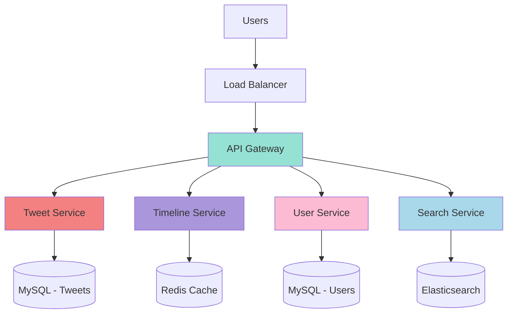

**Improvements:**
- Services can scale independently
- Better failure isolation
- Technology choices per service
- Easier to maintain and deploy

### Phase 3: Current Distributed Architecture (2013-Present)

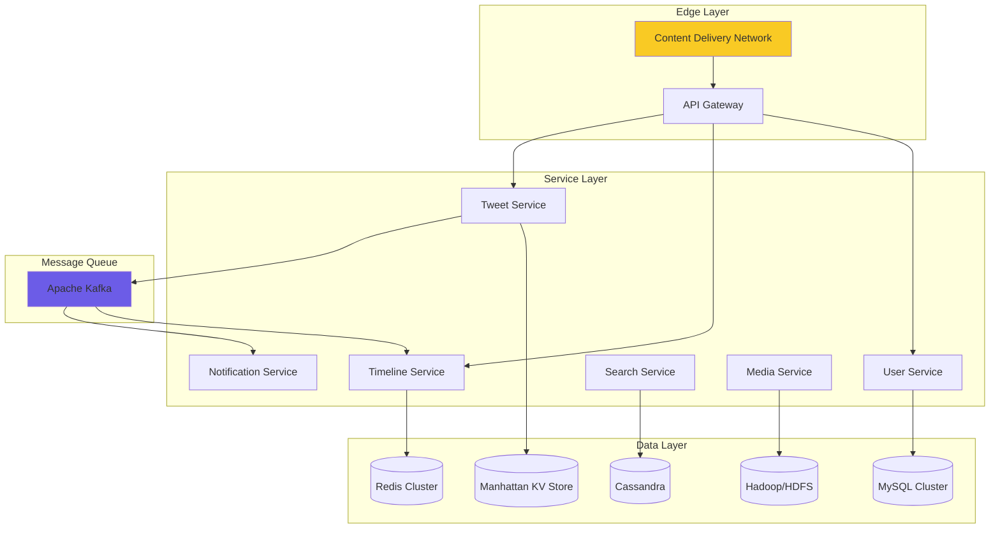

## Core Scalability Strategies

### 1. Timeline Generation Strategy

Twitter uses a **hybrid approach** combining fan-out on write and fan-out on read:

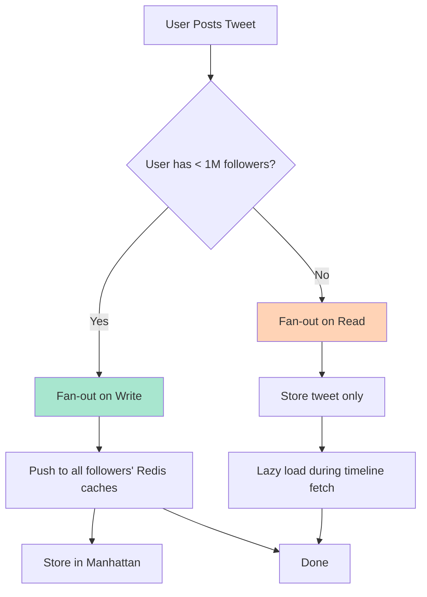

**Fan-out on Write** (For regular users):
- Immediately write tweet to followers' timeline caches
- Fast read performance
- Higher write complexity
- Used for users with < 1M followers

**Fan-out on Read** (For celebrities):
- Store tweet in user's timeline only
- Merge celebrity tweets during timeline fetch
- Lower write load
- Slightly slower reads
- Used for users with > 1M followers

### 2. Caching Strategy

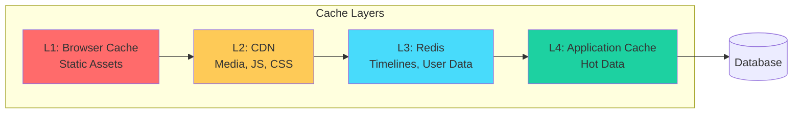

**Cache Hierarchy:**
- **Timeline Cache (Redis)**: Stores pre-computed timelines (hundreds of tweets per user)
- **Tweet Cache**: Individual tweets cached for quick retrieval
- **User Graph Cache**: Following/follower relationships
- **Hot Tweets Cache**: Trending and viral content

**Cache Invalidation:**
- Time-based expiration (TTL)
- Event-driven invalidation via Kafka
- Eventual consistency model

### 3. Database Sharding

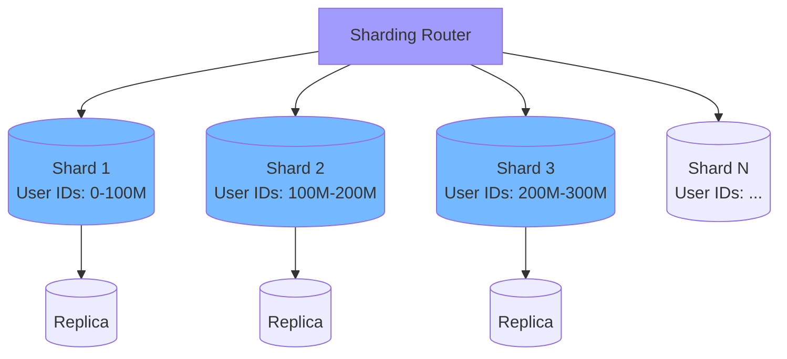

**Sharding Strategy:**
- **User ID-based sharding**: Tweets and user data sharded by user ID
- **Temporal sharding**: Recent tweets in hot storage, old tweets in cold storage
- **Geographic sharding**: Data centers in multiple regions

**Manhattan (Twitter's Distributed Database):**
- Custom-built key-value store
- AP system (Availability and Partition tolerance)
- Optimized for Twitter's access patterns
- Multi-datacenter replication

### 4. Load Balancing

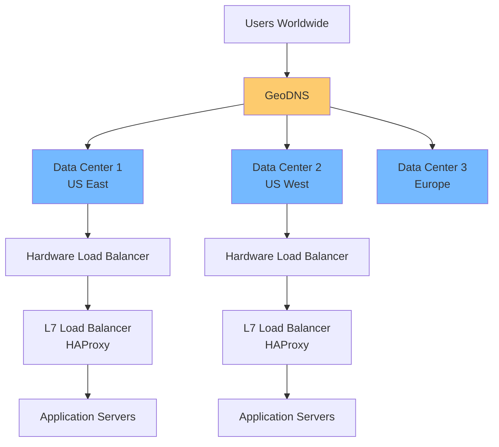

**Load Balancing Layers:**
- **DNS-level**: Routes users to nearest data center
- **Hardware Load Balancers**: Distribute across server pools
- **Software Load Balancers (HAProxy)**: Application-aware routing
- **Client-side Load Balancing**: Service discovery with Finagle

### 5. Message Queue Architecture

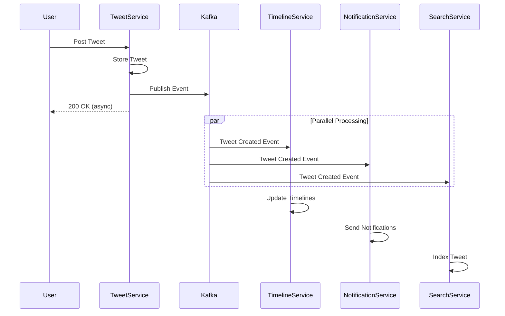

**Kafka Usage:**
- **Event streaming**: All system events flow through Kafka
- **Decoupling**: Services don't directly depend on each other
- **Replay capability**: Can replay events for recovery
- **Multiple consumers**: Each service processes events independently

## Performance Optimizations

### 1. Tweet ID Generation (Snowflake)

Twitter's Snowflake generates unique 64-bit IDs:

```
| 1 bit unused | 41 bits: timestamp | 10 bits: machine ID | 12 bits: sequence |
```

**Benefits:**
- Time-ordered IDs (sortable)
- No coordination between machines
- Embeds timestamp for time-based queries
- 4096 IDs per millisecond per machine

### 2. Timeline Serving

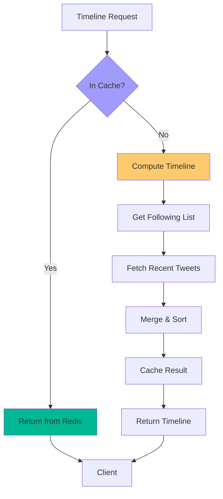

**Optimization Techniques:**
- Pre-compute timelines for active users
- Cache most recent 800 tweets per timeline
- Lazy-load older content on scroll
- Merge celebrity tweets on-demand

### 3. Hot Tweet Detection

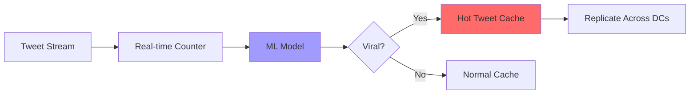

**Viral Content Handling:**
- Real-time engagement metrics
- Machine learning predictions
- Aggressive caching of hot content
- Preemptive replication across data centers

## Failure Handling & Reliability

### 1. Circuit Breaker Pattern

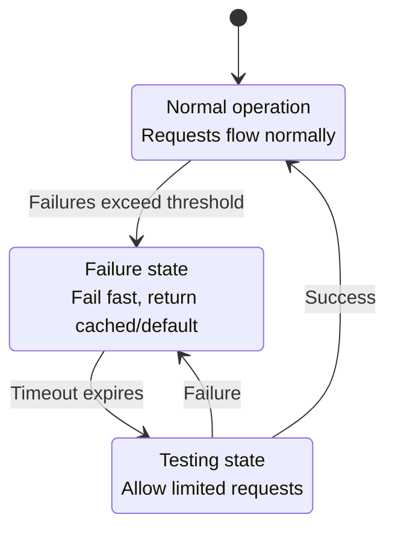

**Implementation:**
- Prevents cascade failures
- Fast failure for degraded services
- Automatic recovery testing
- Graceful degradation

### 2. Rate Limiting

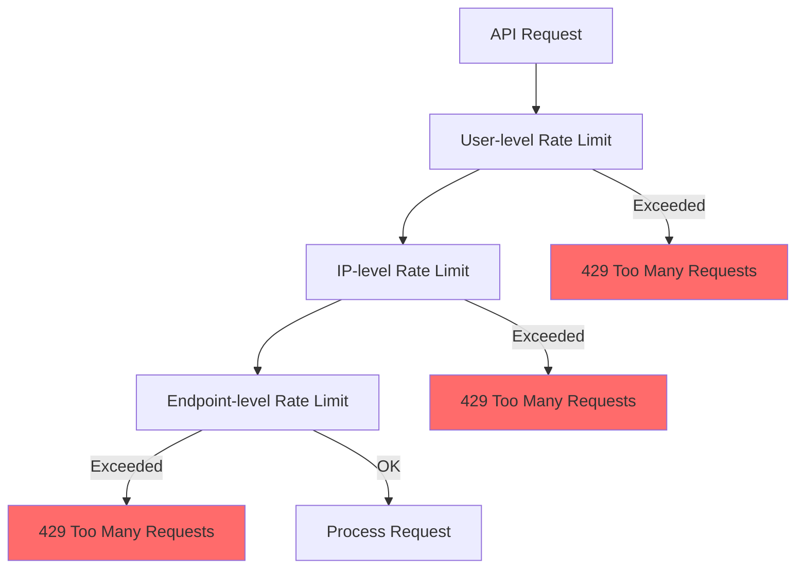

**Rate Limiting Strategy:**
- **Per user**: Prevents single user abuse
- **Per IP**: Prevents bot attacks
- **Per endpoint**: Protects expensive operations
- **Token bucket algorithm**: Allows burst traffic

### 3. Data Replication

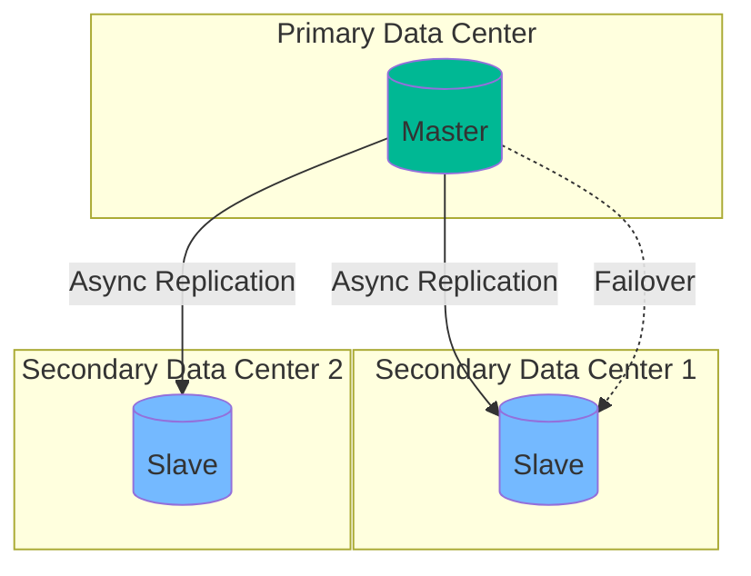

**Replication Strategy:**
- Multi-datacenter replication
- Asynchronous replication for performance
- Eventual consistency acceptable
- Geographic diversity for disaster recovery

## Monitoring & Observability

### Key Metrics Tracked

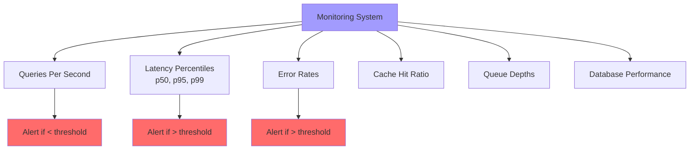

**Observability Tools:**
- Distributed tracing (Zipkin)
- Log aggregation
- Real-time dashboards
- Anomaly detection

## Key Scalability Lessons

### 1. **Trade-offs Are Essential**
- Eventual consistency over strong consistency
- Denormalization for read performance
- Complexity for scalability

### 2. **Cache Aggressively**
- Multiple cache layers
- Different TTLs for different data
- Cache invalidation is hard but necessary

### 3. **Embrace Asynchrony**
- Message queues decouple services
- Background processing for heavy operations
- Non-blocking operations where possible

### 4. **Plan for Failure**
- Circuit breakers everywhere
- Graceful degradation
- Multiple layers of redundancy

### 5. **Measure Everything**
- Real-time metrics
- Performance budgets
- A/B testing for optimizations

## Cost Optimization

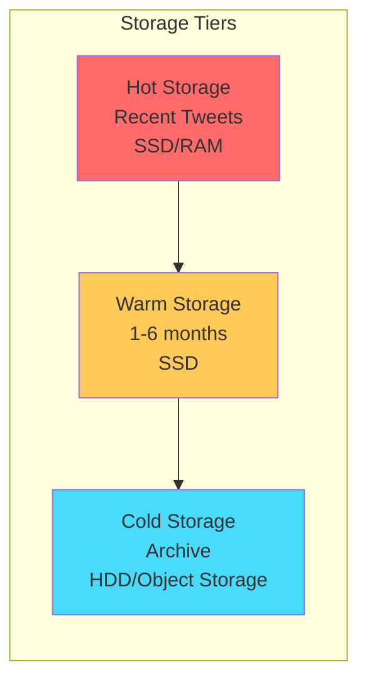

**Cost Strategies:**
- Tiered storage based on access patterns
- Compression for older data
- Auto-scaling during off-peak hours
- Reserved capacity for baseline load

## Conclusion

Twitter's scalability journey demonstrates that:

1. **Architecture must evolve** with scale
2. **No silver bullet** - multiple strategies needed
3. **Fan-out problem** requires hybrid solutions
4. **Caching is critical** but invalidation is complex
5. **Eventual consistency** is acceptable for social media
6. **Monitoring and observability** are non-negotiable
7. **Graceful degradation** better than complete failure

The platform's ability to handle **6,000 tweets per second** during peak events while maintaining sub-second latency for timeline fetches showcases world-class distributed systems engineering.