# Case Study 2: Netflix's Scalability Architecture

## Overview

Netflix serves over **230 million subscribers** across 190+ countries, streaming more than **1 billion hours of content per week**. During peak hours, Netflix accounts for up to **15% of global internet bandwidth**. The platform handles massive scale while maintaining 99.99% availability and delivering personalized experiences to each user.

## Key Scalability Challenges

### 1. **Global Content Delivery at Scale**
- Petabytes of video content
- Peak traffic during evening hours (8 PM - 11 PM)
- 4K and HDR content requiring high bandwidth
- Simultaneous streams per household

### 2. **Personalization at Scale**
- Unique homepage for each of 230M+ users
- Real-time recommendations
- A/B testing on millions of users
- Artwork personalization per user

### 3. **High Availability Requirements**
- Video playback cannot buffer or fail
- Zero tolerance for downtime
- Global disaster recovery
- Graceful degradation under failure

### 4. **Predictable Unpredictability**
- New season releases cause traffic spikes
- Regional viewing patterns vary
- Weekend vs. weekday traffic differences
- Live events and trending content

## Architecture Overview

### Complete System Architecture

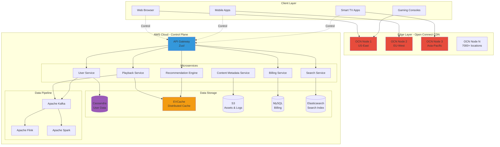
```mermaid
graph TB
    subgraph "Client Layer"
        WebClient[Web Browser]
        MobileApp[Mobile Apps]
        SmartTV[Smart TV Apps]
        GameConsole[Gaming Consoles]
    end
    
    subgraph "Edge Layer - Open Connect CDN"
        OCN1[OCN Node 1<br/>US-East]
        OCN2[OCN Node 2<br/>EU-West]
        OCN3[OCN Node 3<br/>Asia-Pacific]
        OCN4[OCN Node N<br/>7000+ locations]
    end
    
    subgraph "AWS Cloud - Control Plane"
        APIGateway[API Gateway<br/>Zuul]
        
        subgraph "Microservices"
            UserService[User Service]
            PlaybackService[Playback Service]
            RecommendationService[Recommendation Engine]
            SearchService[Search Service]
            BillingService[Billing Service]
            ContentService[Content Metadata Service]
        end
        
        subgraph "Data Storage"
            Cassandra[(Cassandra<br/>User Data)]
            EVCache[EVCache<br/>Distributed Cache]
            S3[(S3<br/>Assets & Logs)]
            MySQL[(MySQL<br/>Billing)]
            Elasticsearch[(Elasticsearch<br/>Search Index)]
        end
        
        subgraph "Data Pipeline"
            Kafka[Apache Kafka]
            Flink[Apache Flink]
            Spark[Apache Spark]
        end
    end
    
    WebClient --> OCN1
    MobileApp --> OCN2
    SmartTV --> OCN3
    GameConsole --> OCN1
    
    WebClient -.Control.-> APIGateway
    MobileApp -.Control.-> APIGateway
    SmartTV -.Control.-> APIGateway
    
    APIGateway --> UserService
    APIGateway --> PlaybackService
    APIGateway --> RecommendationService
    APIGateway --> SearchService
    APIGateway --> BillingService
    
    UserService --> Cassandra
    PlaybackService --> EVCache
    RecommendationService --> EVCache
    SearchService --> Elasticsearch
    BillingService --> MySQL
    ContentService --> S3
    
    PlaybackService --> Kafka
    UserService --> Kafka
    Kafka --> Flink
    Kafka --> Spark
    
    style OCN1 fill:#e74c3c
    style OCN2 fill:#e74c3c
    style OCN3 fill:#e74c3c
    style APIGateway fill:#3498db
    style Cassandra fill:#9b59b6
    style EVCache fill:#f39c12
```

## Core Architecture Principles

### 1. **Separation of Concerns: Control Plane vs Data Plane**

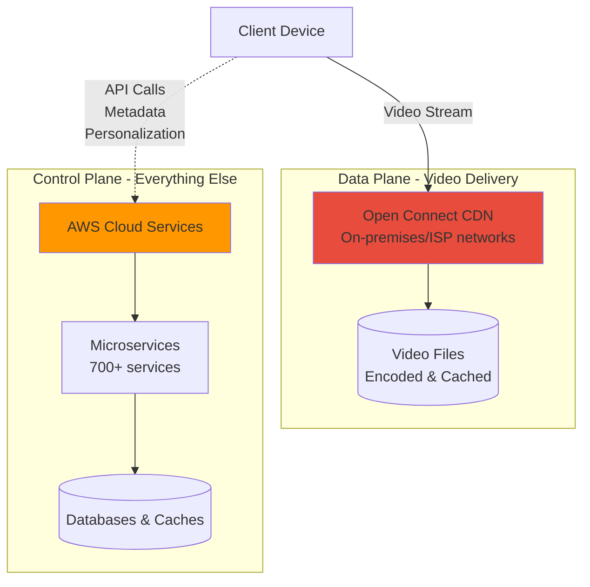
```mermaid
graph TB
    subgraph "Data Plane - Video Delivery"
        OCN[Open Connect CDN<br/>On-premises/ISP networks]
        VideoContent[(Video Files<br/>Encoded & Cached)]
        OCN --> VideoContent
    end
    
    subgraph "Control Plane - Everything Else"
        AWS[AWS Cloud Services]
        Services[Microservices<br/>700+ services]
        Data[(Databases & Caches)]
        AWS --> Services
        Services --> Data
    end
    
    Client[Client Device] -->|Video Stream| OCN
    Client -.->|API Calls<br/>Metadata<br/>Personalization| AWS
    
    style OCN fill:#e74c3c
    style AWS fill:#ff9800
```

**Why This Split?**
- **Data Plane (Open Connect)**: 
  - Optimized for bandwidth and throughput
  - Located close to users (ISP networks)
  - Handles 100% of video streaming
  - Cost-effective for massive data transfer

- **Control Plane (AWS)**:
  - Flexible and scalable compute
  - Complex business logic
  - Rapid development and deployment
  - Handles everything except video delivery

### 2. **Open Connect CDN Architecture**

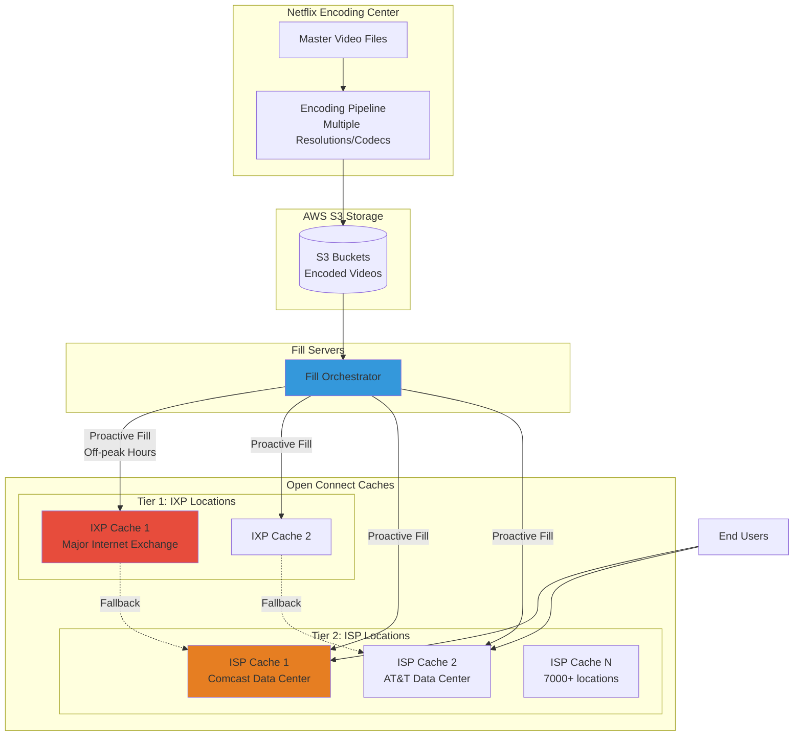
```mermaid
graph TB
    subgraph "Netflix Encoding Center"
        Master[Master Video Files]
        Encoder[Encoding Pipeline<br/>Multiple Resolutions/Codecs]
        Master --> Encoder
    end
    
    subgraph "AWS S3 Storage"
        S3Store[(S3 Buckets<br/>Encoded Videos)]
        Encoder --> S3Store
    end
    
    subgraph "Open Connect Caches"
        subgraph "Tier 1: IXP Locations"
            IXP1[IXP Cache 1<br/>Major Internet Exchange]
            IXP2[IXP Cache 2]
        end
        
        subgraph "Tier 2: ISP Locations"
            ISP1[ISP Cache 1<br/>Comcast Data Center]
            ISP2[ISP Cache 2<br/>AT&T Data Center]
            ISP3[ISP Cache N<br/>7000+ locations]
        end
    end
    
    subgraph "Fill Servers"
        Fill[Fill Orchestrator]
    end
    
    S3Store --> Fill
    Fill -->|Proactive Fill<br/>Off-peak Hours| IXP1
    Fill -->|Proactive Fill| IXP2
    Fill -->|Proactive Fill| ISP1
    Fill -->|Proactive Fill| ISP2
    
    IXP1 -.->|Fallback| ISP1
    IXP2 -.->|Fallback| ISP2
    
    Users[End Users] --> ISP1
    Users --> ISP2
    
    style IXP1 fill:#e74c3c
    style ISP1 fill:#e67e22
    style Fill fill:#3498db
```

**Open Connect Strategy:**

1. **Proactive Caching**:
   - Predict what users will watch
   - Pre-fill caches during off-peak hours (2 AM - 6 AM)
   - Cache hit rate: >95%
   - Reduces ISP backbone traffic

2. **Cache Hierarchy**:
   - **Tier 1**: Major internet exchange points (IXPs)
   - **Tier 2**: Inside ISP networks (embedded caches)
   - Tier 2 caches serve 90%+ of requests

3. **Benefits**:
   - Lower latency (content physically closer)
   - Reduced ISP costs (less transit traffic)
   - Better quality (fewer network hops)
   - Works even if AWS fails

### 3. **Microservices Architecture**

Netflix operates over **700 microservices** in production. Here's a view of key service categories:

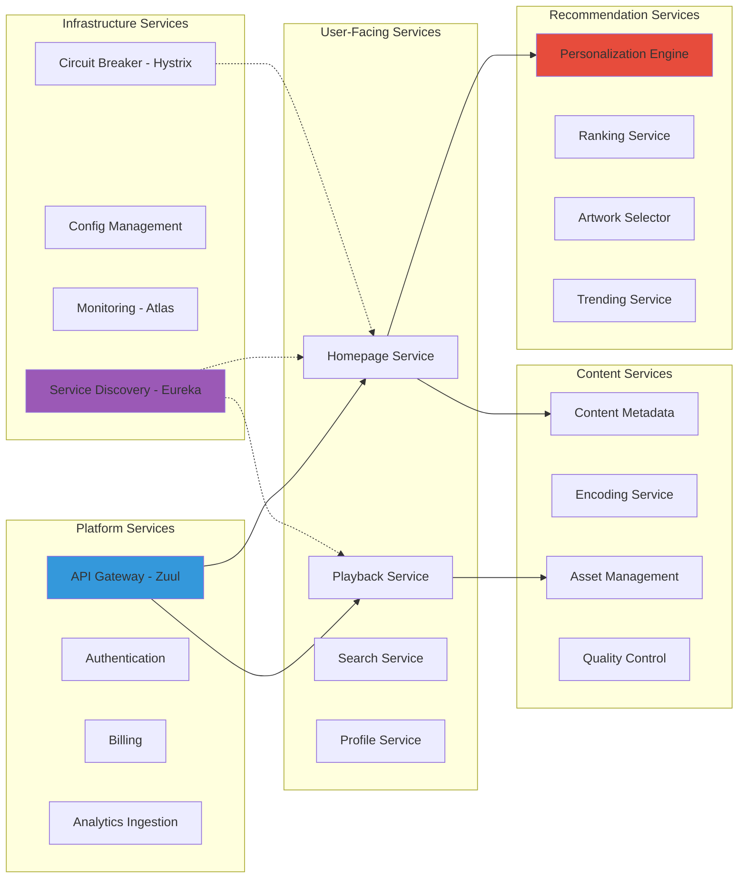
```mermaid
graph LR
    subgraph "User-Facing Services"
        Homepage[Homepage Service]
        Player[Playback Service]
        Search[Search Service]
        Profiles[Profile Service]
    end
    
    subgraph "Content Services"
        Metadata[Content Metadata]
        Encoding[Encoding Service]
        Assets[Asset Management]
        Quality[Quality Control]
    end
    
    subgraph "Recommendation Services"
        Personalization[Personalization Engine]
        Ranking[Ranking Service]
        Artwork[Artwork Selector]
        Trending[Trending Service]
    end
    
    subgraph "Platform Services"
        Gateway[API Gateway - Zuul]
        Auth[Authentication]
        Billing[Billing]
        Analytics[Analytics Ingestion]
    end
    
    subgraph "Infrastructure Services"
        Discovery[Service Discovery - Eureka]
        Config[Config Management]
        Monitoring[Monitoring - Atlas]
        Circuit[Circuit Breaker - Hystrix]
    end
    
    Gateway --> Homepage
    Gateway --> Player
    Homepage --> Personalization
    Homepage --> Metadata
    Player --> Assets
    
    Discovery -.-> Homepage
    Discovery -.-> Player
    Circuit -.-> Homepage
    
    style Gateway fill:#3498db
    style Discovery fill:#9b59b6
    style Personalization fill:#e74c3c
```

**Service Design Principles:**

- **Single Responsibility**: Each service does one thing well
- **Isolated Datastores**: No shared databases between services
- **API-First**: All communication via REST APIs
- **Stateless**: Services don't maintain session state
- **Independent Deployment**: Deploy without coordinating with other teams

### 4. **Video Encoding Pipeline**

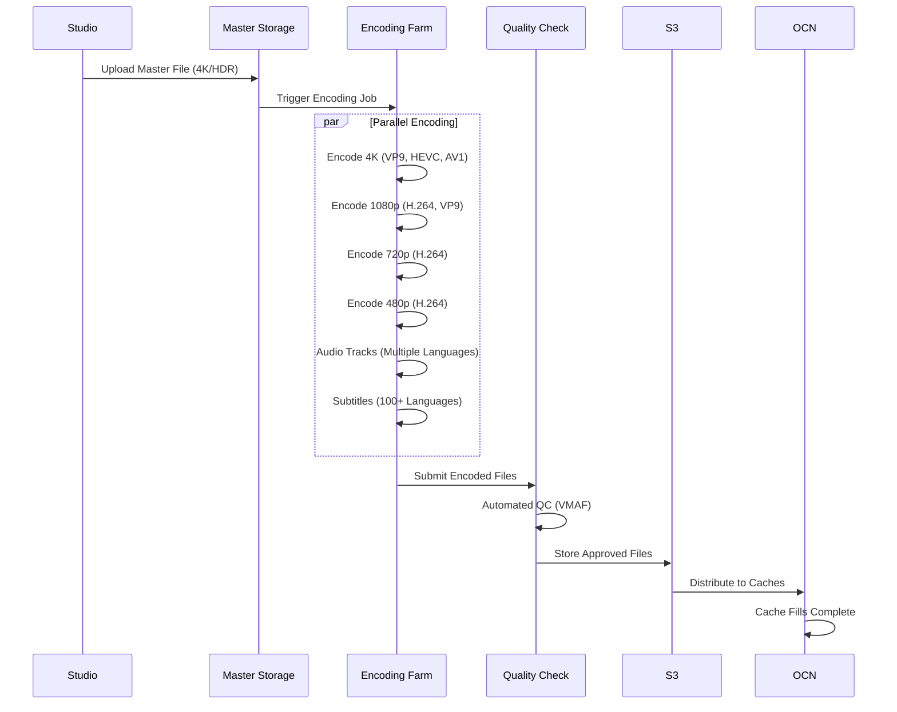
```mermaid
sequenceDiagram
    participant Studio
    participant Master Storage
    participant Encoding Farm
    participant Quality Check
    participant S3
    participant OCN
    
    Studio->>Master Storage: Upload Master File (4K/HDR)
    Master Storage->>Encoding Farm: Trigger Encoding Job
    
    par Parallel Encoding
        Encoding Farm->>Encoding Farm: Encode 4K (VP9, HEVC, AV1)
        Encoding Farm->>Encoding Farm: Encode 1080p (H.264, VP9)
        Encoding Farm->>Encoding Farm: Encode 720p (H.264)
        Encoding Farm->>Encoding Farm: Encode 480p (H.264)
        Encoding Farm->>Encoding Farm: Audio Tracks (Multiple Languages)
        Encoding Farm->>Encoding Farm: Subtitles (100+ Languages)
    end
    
    Encoding Farm->>Quality Check: Submit Encoded Files
    Quality Check->>Quality Check: Automated QC (VMAF)
    Quality Check->>S3: Store Approved Files
    
    S3->>OCN: Distribute to Caches
    OCN->>OCN: Cache Fills Complete
```

**Encoding Strategy:**

- **120+ versions per title**: Different resolutions, bitrates, codecs
- **Adaptive bitrate streaming**: Automatically adjusts to network conditions
- **Per-title encoding**: Optimal settings for each piece of content
- **Codec innovation**: Early adopter of VP9, HEVC, AV1
- **Quality metrics**: VMAF (Video Multimethod Assessment Fusion)

**Encoding Optimizations:**

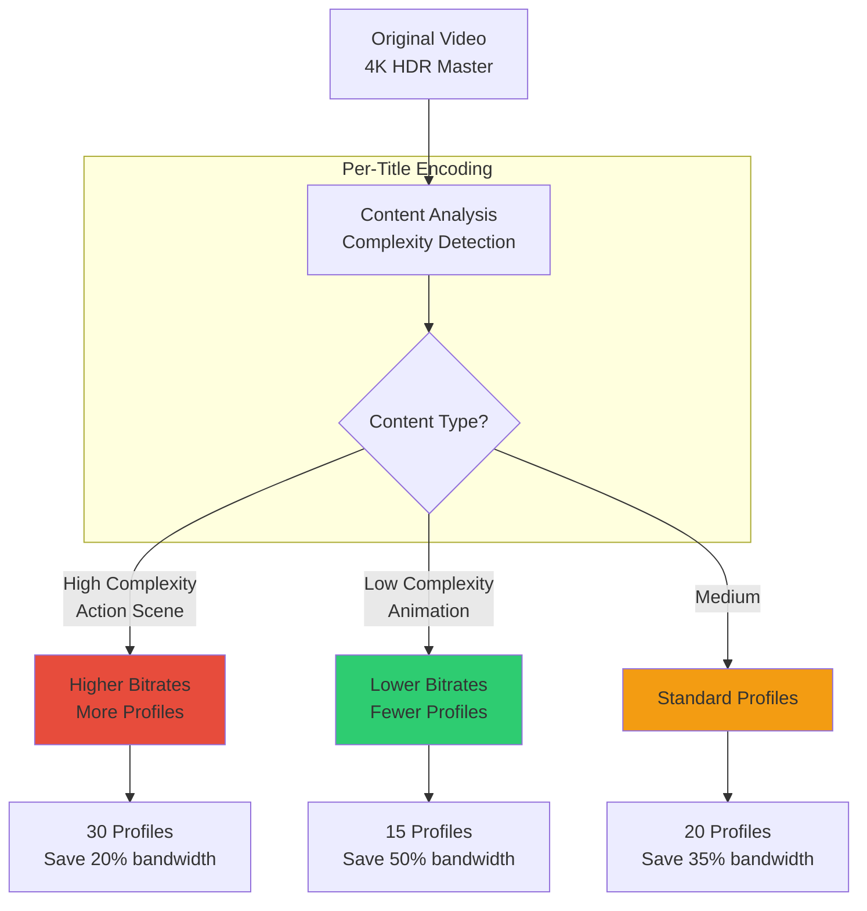
```mermaid
graph TB
    Original[Original Video<br/>4K HDR Master]
    
    subgraph "Per-Title Encoding"
        Analysis[Content Analysis<br/>Complexity Detection]
        Decision{Content Type?}
    end
    
    Original --> Analysis
    Analysis --> Decision
    
    Decision -->|High Complexity<br/>Action Scene| High[Higher Bitrates<br/>More Profiles]
    Decision -->|Low Complexity<br/>Animation| Low[Lower Bitrates<br/>Fewer Profiles]
    Decision -->|Medium| Medium[Standard Profiles]
    
    High --> Encode1[30 Profiles<br/>Save 20% bandwidth]
    Low --> Encode2[15 Profiles<br/>Save 50% bandwidth]
    Medium --> Encode3[20 Profiles<br/>Save 35% bandwidth]
    
    style High fill:#e74c3c
    style Low fill:#2ecc71
    style Medium fill:#f39c12
```

### 5. **Data Storage Strategy**

Netflix uses a polyglot persistence approach:

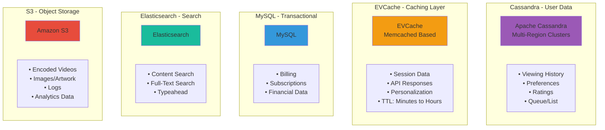
```mermaid
graph TB
    subgraph "Cassandra - User Data"
        Cass[Apache Cassandra<br/>Multi-Region Clusters]
        CassData[• Viewing History<br/>• Preferences<br/>• Ratings<br/>• Queue/List]
    end
    
    subgraph "EVCache - Caching Layer"
        EV[EVCache<br/>Memcached Based]
        EVData[• Session Data<br/>• API Responses<br/>• Personalization<br/>• TTL: Minutes to Hours]
    end
    
    subgraph "MySQL - Transactional"
        MySQL[MySQL]
        MySQLData[• Billing<br/>• Subscriptions<br/>• Financial Data]
    end
    
    subgraph "Elasticsearch - Search"
        ES[Elasticsearch]
        ESData[• Content Search<br/>• Full-Text Search<br/>• Typeahead]
    end
    
    subgraph "S3 - Object Storage"
        S3[Amazon S3]
        S3Data[• Encoded Videos<br/>• Images/Artwork<br/>• Logs<br/>• Analytics Data]
    end
    
    style Cass fill:#9b59b6
    style EV fill:#f39c12
    style MySQL fill:#3498db
    style ES fill:#1abc9c
    style S3 fill:#e74c3c
```

**Why Cassandra for Netflix?**

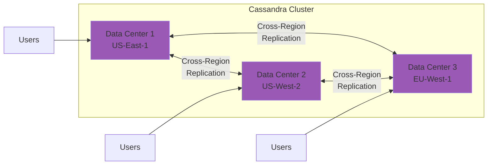
```mermaid
graph LR
    subgraph "Cassandra Cluster"
        DC1[Data Center 1<br/>US-East-1]
        DC2[Data Center 2<br/>US-West-2]
        DC3[Data Center 3<br/>EU-West-1]
    end
    
    DC1 <-->|Cross-Region<br/>Replication| DC2
    DC2 <-->|Cross-Region<br/>Replication| DC3
    DC3 <-->|Cross-Region<br/>Replication| DC1
    
    Users1[Users] --> DC1
    Users2[Users] --> DC2
    Users3[Users] --> DC3
    
    style DC1 fill:#9b59b6
    style DC2 fill:#9b59b6
    style DC3 fill:#9b59b6
```

**Cassandra Benefits:**
- Linear scalability (add nodes without downtime)
- Multi-datacenter replication
- Always available (AP system)
- High write throughput
- No single point of failure

**Trade-offs:**
- Eventual consistency (acceptable for viewing history)
- No complex joins (denormalize data)
- Data modeling complexity

### 6. **Caching Strategy: EVCache**

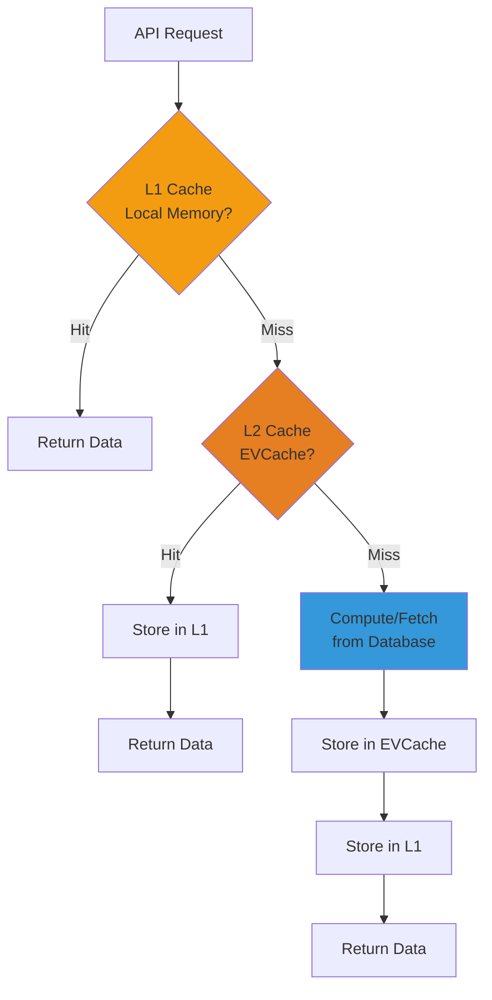
```mermaid
graph TB
    Request[API Request] --> L1{L1 Cache<br/>Local Memory?}
    
    L1 -->|Hit| Return1[Return Data]
    L1 -->|Miss| L2{L2 Cache<br/>EVCache?}
    
    L2 -->|Hit| Store1[Store in L1]
    L2 -->|Miss| Compute[Compute/Fetch<br/>from Database]
    
    Store1 --> Return2[Return Data]
    Compute --> Store2[Store in EVCache]
    Store2 --> Store3[Store in L1]
    Store3 --> Return3[Return Data]
    
    style L1 fill:#f39c12
    style L2 fill:#e67e22
    style Compute fill:#3498db
```

**EVCache Architecture:**

- Built on Memcached with Netflix enhancements
- Multi-zone replication for availability
- Consistent hashing for data distribution
- Automatic failover and recovery
- TTL-based expiration
- Cache warming strategies

**Cache Hit Rates:**
- Homepage data: 99%+ hit rate
- User preferences: 95%+ hit rate
- Recommendation results: 90%+ hit rate

### 7. **Resilience Patterns**

#### Circuit Breaker Pattern (Hystrix)

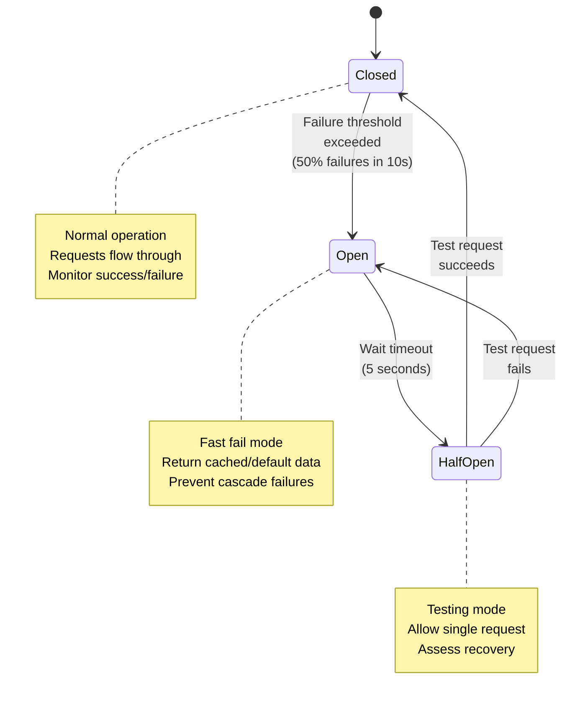
```mermaid
stateDiagram-v2
    [*] --> Closed
    
    Closed --> Open: Failure threshold<br/>exceeded<br/>(50% failures in 10s)
    
    Open --> HalfOpen: Wait timeout<br/>(5 seconds)
    
    HalfOpen --> Closed: Test request<br/>succeeds
    HalfOpen --> Open: Test request<br/>fails
    
    note right of Closed
        Normal operation
        Requests flow through
        Monitor success/failure
    end note
    
    note right of Open
        Fast fail mode
        Return cached/default data
        Prevent cascade failures
    end note
    
    note right of HalfOpen
        Testing mode
        Allow single request
        Assess recovery
    end note
```

**Hystrix Features:**
- Fallback mechanisms for every service call
- Request timeout enforcement
- Bulkhead pattern (thread pool isolation)
- Real-time metrics dashboard

#### Chaos Engineering: Chaos Monkey

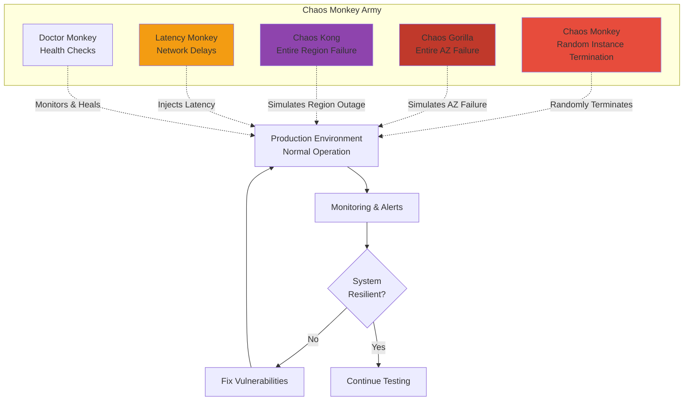
```mermaid
graph TB
    Production[Production Environment<br/>Normal Operation]
    
    subgraph "Chaos Monkey Army"
        CM[Chaos Monkey<br/>Random Instance Termination]
        CG[Chaos Gorilla<br/>Entire AZ Failure]
        CK[Chaos Kong<br/>Entire Region Failure]
        LM[Latency Monkey<br/>Network Delays]
        DR[Doctor Monkey<br/>Health Checks]
    end
    
    CM -.Randomly Terminates.-> Production
    CG -.Simulates AZ Failure.-> Production
    CK -.Simulates Region Outage.-> Production
    LM -.Injects Latency.-> Production
    DR -.Monitors & Heals.-> Production
    
    Production --> Monitor[Monitoring & Alerts]
    Monitor --> Verify{System<br/>Resilient?}
    
    Verify -->|No| Fix[Fix Vulnerabilities]
    Verify -->|Yes| Continue[Continue Testing]
    
    Fix --> Production
    
    style CM fill:#e74c3c
    style CG fill:#c0392b
    style CK fill:#8e44ad
    style LM fill:#f39c12
```

**Chaos Engineering Philosophy:**
- Test failure scenarios in production
- Build confidence in system resilience
- Discover weaknesses before customers do
- Culture of embracing failure

### 8. **API Gateway: Zuul**

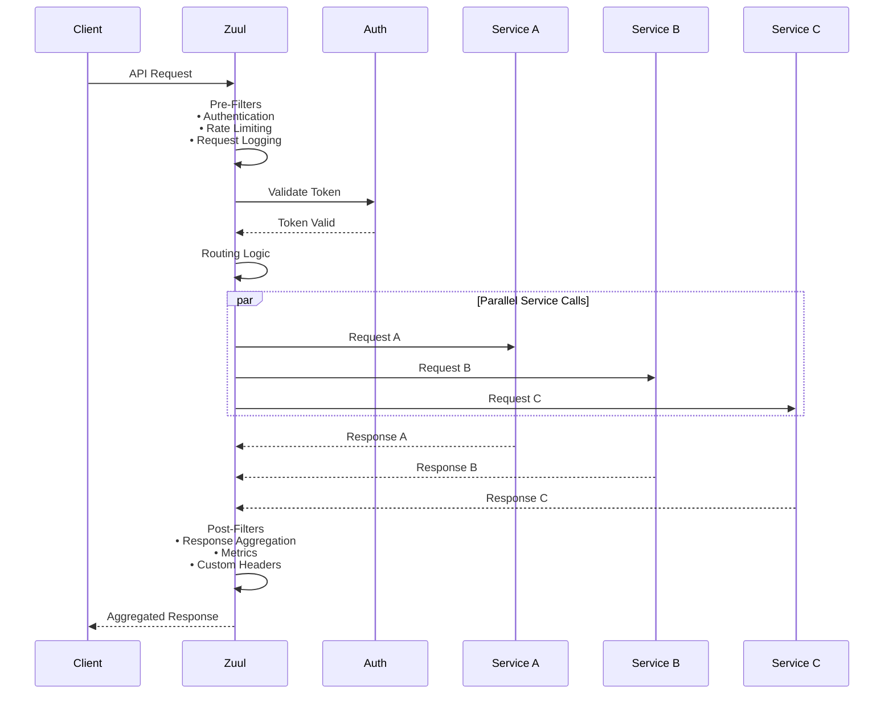
```mermaid
sequenceDiagram
    participant Client
    participant Zuul
    participant Auth
    participant Service A
    participant Service B
    participant Service C
    
    Client->>Zuul: API Request
    
    Zuul->>Zuul: Pre-Filters<br/>• Authentication<br/>• Rate Limiting<br/>• Request Logging
    
    Zuul->>Auth: Validate Token
    Auth-->>Zuul: Token Valid
    
    Zuul->>Zuul: Routing Logic
    
    par Parallel Service Calls
        Zuul->>Service A: Request A
        Zuul->>Service B: Request B
        Zuul->>Service C: Request C
    end
    
    Service A-->>Zuul: Response A
    Service B-->>Zuul: Response B
    Service C-->>Zuul: Response C
    
    Zuul->>Zuul: Post-Filters<br/>• Response Aggregation<br/>• Metrics<br/>• Custom Headers
    
    Zuul-->>Client: Aggregated Response
```

**Zuul Capabilities:**
- Dynamic routing
- Load balancing
- Authentication & authorization
- Request/response transformation
- Rate limiting
- Metrics collection
- A/B testing support

### 9. **Personalization Engine**

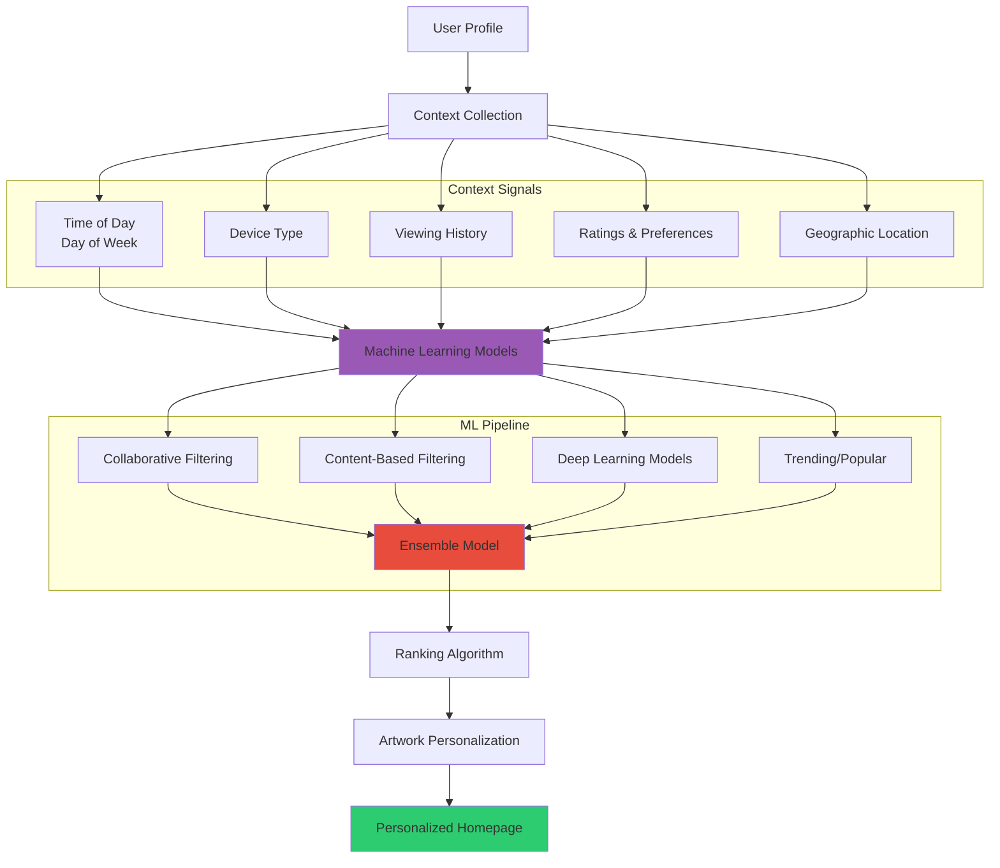
```mermaid
flowchart TB
    User[User Profile] --> Context[Context Collection]
    
    subgraph "Context Signals"
        Time[Time of Day<br/>Day of Week]
        Device[Device Type]
        History[Viewing History]
        Ratings[Ratings & Preferences]
        Location[Geographic Location]
    end
    
    Context --> Time
    Context --> Device
    Context --> History
    Context --> Ratings
    Context --> Location
    
    Time --> ML[Machine Learning Models]
    Device --> ML
    History --> ML
    Ratings --> ML
    Location --> ML
    
    subgraph "ML Pipeline"
        Model1[Collaborative Filtering]
        Model2[Content-Based Filtering]
        Model3[Deep Learning Models]
        Model4[Trending/Popular]
        Ensemble[Ensemble Model]
    end
    
    ML --> Model1
    ML --> Model2
    ML --> Model3
    ML --> Model4
    
    Model1 --> Ensemble
    Model2 --> Ensemble
    Model3 --> Ensemble
    Model4 --> Ensemble
    
    Ensemble --> Ranking[Ranking Algorithm]
    Ranking --> Artwork[Artwork Personalization]
    Artwork --> Homepage[Personalized Homepage]
    
    style ML fill:#9b59b6
    style Ensemble fill:#e74c3c
    style Homepage fill:#2ecc71
```

**Personalization Components:**

1. **Row Generation**: Which categories/genres to show
2. **Title Selection**: Which titles within each row
3. **Ranking**: Order of titles within rows
4. **Artwork Selection**: Which image to show per title
5. **Preview Selection**: Which preview video to auto-play

**Artwork Personalization Example:**

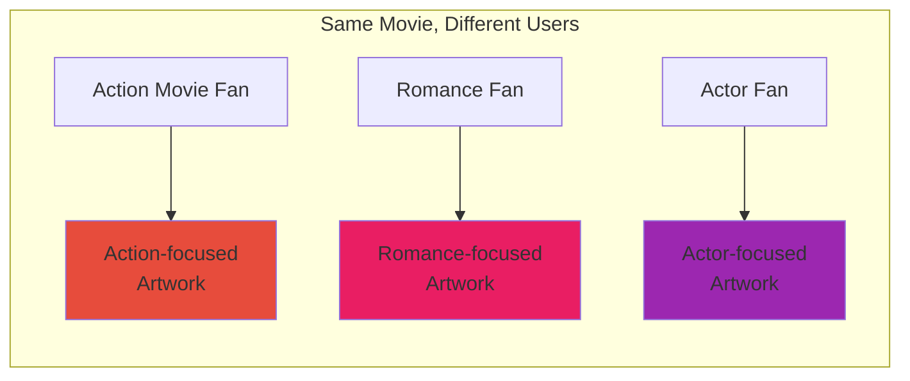
```mermaid
graph LR
    subgraph "Same Movie, Different Users"
        User1[Action Movie Fan] --> Art1[Action-focused<br/>Artwork]
        User2[Romance Fan] --> Art2[Romance-focused<br/>Artwork]
        User3[Actor Fan] --> Art3[Actor-focused<br/>Artwork]
    end
    
    style Art1 fill:#e74c3c
    style Art2 fill:#e91e63
    style Art3 fill:#9c27b0
```

**A/B Testing at Scale:**
- Thousands of experiments running simultaneously
- Statistical significance calculation
- Gradual rollout (1% → 10% → 50% → 100%)
- Multi-armed bandit algorithms

### 10. **Data Pipeline & Analytics**

```mermaid
graph TB
    subgraph "Event Generation"
        Client1[Client Apps] --> Events1[Playback Events]
        Client1 --> Events2[UI Events]
        Client1 --> Events3[Error Events]
        Services[Backend Services] --> Events4[Service Events]
    end
    
    Events1 --> Kafka[Apache Kafka<br/>Event Streaming]
    Events2 --> Kafka
    Events3 --> Kafka
    Events4 --> Kafka
    
    subgraph "Real-Time Processing"
        Kafka --> Flink[Apache Flink]
        Flink --> Metrics[Real-Time Metrics]
        Flink --> Alerts[Alerting System]
        Flink --> Dashboard[Live Dashboards]
    end
    
    subgraph "Batch Processing"
        Kafka --> S3Sink[S3 Data Lake]
        S3Sink --> Spark[Apache Spark]
        Spark --> ML[ML Training]
        Spark --> Reports[Analytics Reports]
        Spark --> DWH[Data Warehouse]
    end
    
    ML --> Models[Recommendation Models]
    Models -.Deploy.-> Services
    
    style Kafka fill:#000000
    style Flink fill:#e74c3c
    style Spark fill:#e25a1c
```

**Event Volume:**
- Billions of events per day
- Terabytes of data daily
- Real-time and batch processing
- Lambda architecture pattern

### 11. **Global Traffic Management**

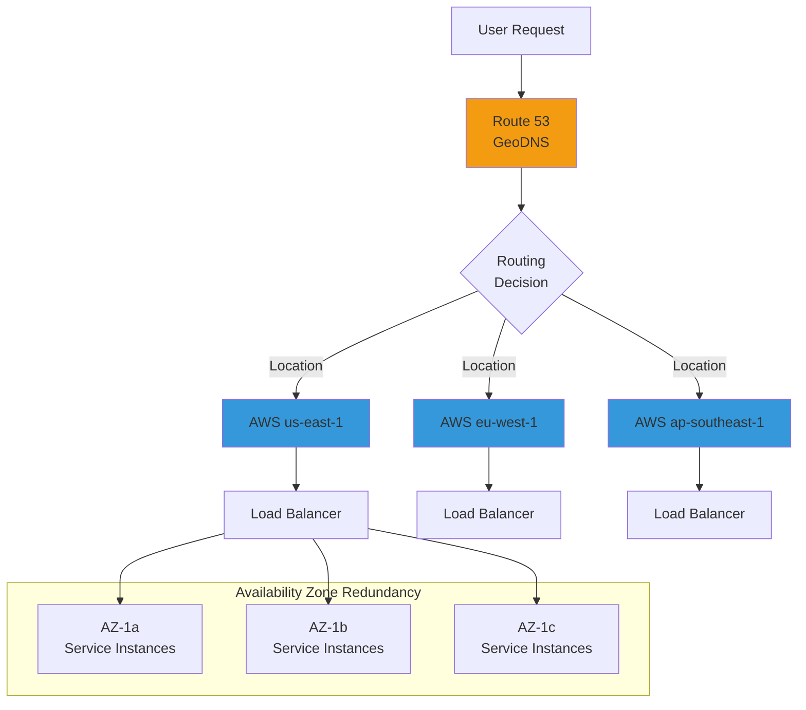
```mermaid
graph TB
    User[User Request] --> DNS[Route 53<br/>GeoDNS]
    
    DNS --> Decision{Routing<br/>Decision}
    
    Decision -->|Location| Region1[AWS us-east-1]
    Decision -->|Location| Region2[AWS eu-west-1]
    Decision -->|Location| Region3[AWS ap-southeast-1]
    
    Region1 --> LB1[Load Balancer]
    Region2 --> LB2[Load Balancer]
    Region3 --> LB3[Load Balancer]
    
    LB1 --> AZ1A[AZ-1a<br/>Service Instances]
    LB1 --> AZ1B[AZ-1b<br/>Service Instances]
    LB1 --> AZ1C[AZ-1c<br/>Service Instances]
    
    subgraph "Availability Zone Redundancy"
        AZ1A
        AZ1B
        AZ1C
    end
    
    style DNS fill:#f39c12
    style Region1 fill:#3498db
    style Region2 fill:#3498db
    style Region3 fill:#3498db
```

**Traffic Management Strategy:**
- DNS-based geographic routing
- Multiple AWS regions (3+ per service)
- Multiple availability zones per region
- Active-active configuration
- Automatic failover

### 12. **Video Playback Optimization**

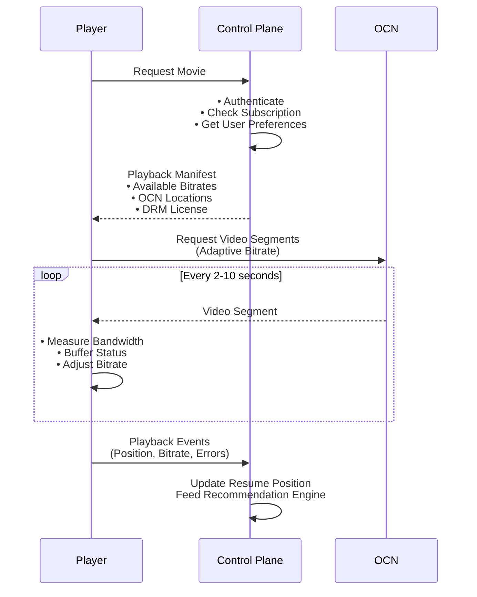
```mermaid
sequenceDiagram
    participant Player
    participant Control Plane
    participant OCN
    
    Player->>Control Plane: Request Movie
    Control Plane->>Control Plane: • Authenticate<br/>• Check Subscription<br/>• Get User Preferences
    
    Control Plane-->>Player: Playback Manifest<br/>• Available Bitrates<br/>• OCN Locations<br/>• DRM License
    
    Player->>OCN: Request Video Segments<br/>(Adaptive Bitrate)
    
    loop Every 2-10 seconds
        OCN-->>Player: Video Segment
        Player->>Player: • Measure Bandwidth<br/>• Buffer Status<br/>• Adjust Bitrate
    end
    
    Player->>Control Plane: Playback Events<br/>(Position, Bitrate, Errors)
    
    Control Plane->>Control Plane: Update Resume Position<br/>Feed Recommendation Engine
```

**Adaptive Streaming Algorithm:**

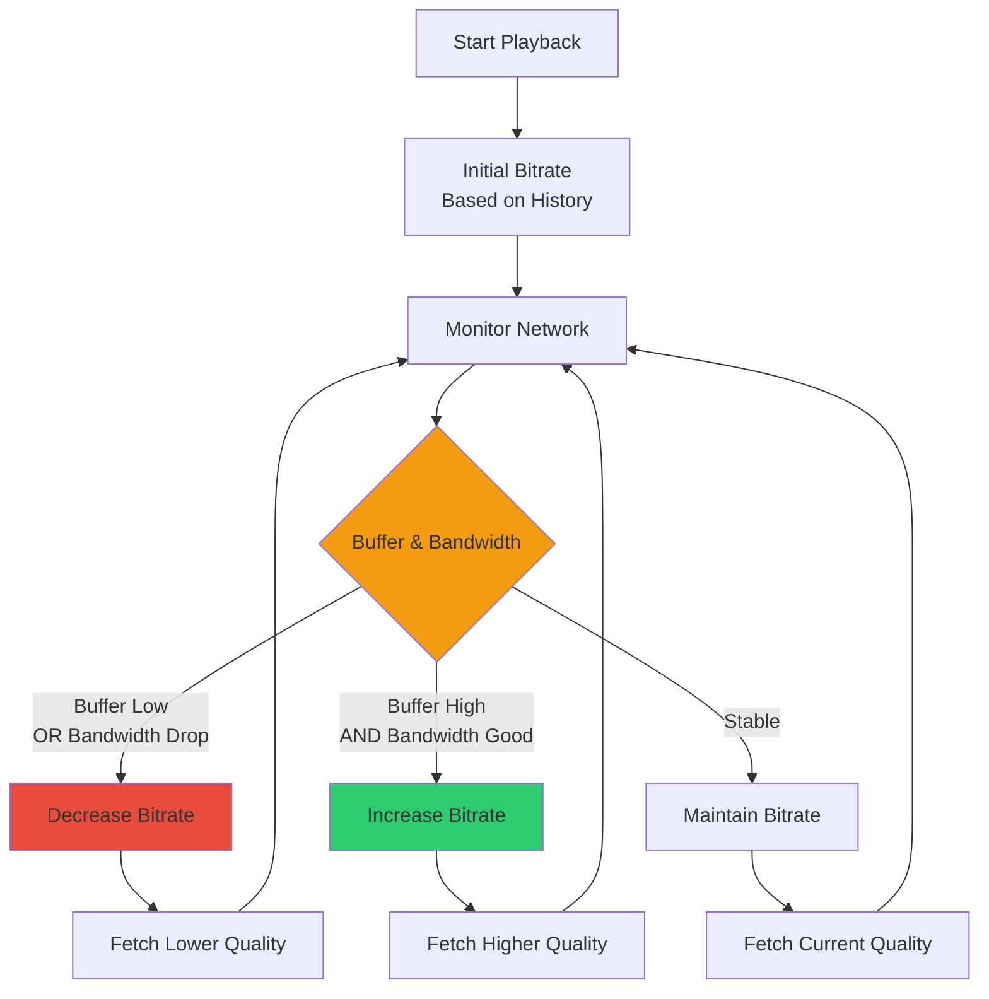
```mermaid
flowchart TD
    Start[Start Playback] --> InitBitrate[Initial Bitrate<br/>Based on History]
    
    InitBitrate --> Monitor[Monitor Network]
    
    Monitor --> Check{Buffer & Bandwidth}
    
    Check -->|Buffer Low<br/>OR Bandwidth Drop| Decrease[Decrease Bitrate]
    Check -->|Buffer High<br/>AND Bandwidth Good| Increase[Increase Bitrate]
    Check -->|Stable| Maintain[Maintain Bitrate]
    
    Decrease --> FetchLower[Fetch Lower Quality]
    Increase --> FetchHigher[Fetch Higher Quality]
    Maintain --> FetchCurrent[Fetch Current Quality]
    
    FetchLower --> Monitor
    FetchHigher --> Monitor
    FetchCurrent --> Monitor
    
    style Check fill:#f39c12
    style Decrease fill:#e74c3c
    style Increase fill:#2ecc71
```

**Optimization Techniques:**
- Predictive buffering
- Pre-fetch next episode
- Optimistic bitrate selection
- Network-aware caching
- Client-side intelligence

## Cost Optimization Strategies

### 1. **Spot Instances & Reserved Capacity**

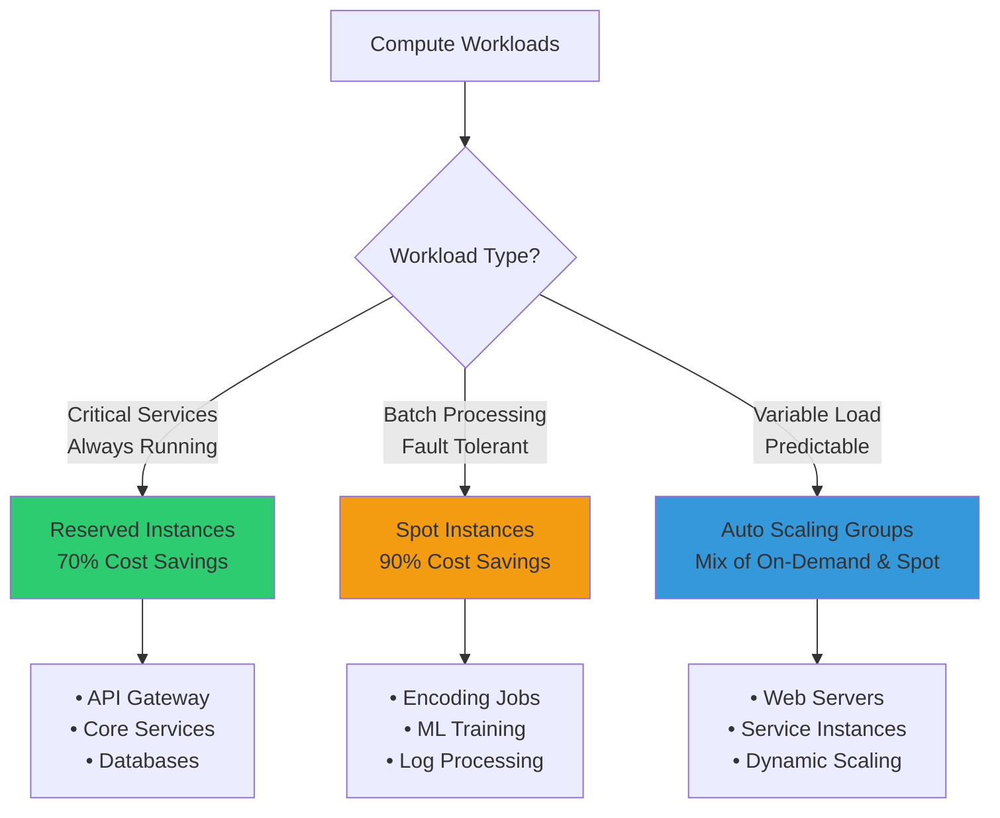
```mermaid
graph TB
    Workload[Compute Workloads] --> Decision{Workload Type?}
    
    Decision -->|Critical Services<br/>Always Running| Reserved[Reserved Instances<br/>70% Cost Savings]
    
    Decision -->|Batch Processing<br/>Fault Tolerant| Spot[Spot Instances<br/>90% Cost Savings]
    
    Decision -->|Variable Load<br/>Predictable| ASG[Auto Scaling Groups<br/>Mix of On-Demand & Spot]
    
    Reserved --> Examples1[• API Gateway<br/>• Core Services<br/>• Databases]
    Spot --> Examples2[• Encoding Jobs<br/>• ML Training<br/>• Log Processing]
    ASG --> Examples3[• Web Servers<br/>• Service Instances<br/>• Dynamic Scaling]
    
    style Reserved fill:#2ecc71
    style Spot fill:#f39c12
    style ASG fill:#3498db
```

### 2. **Content Encoding Optimization**

**Per-Title Encoding Savings:**
- Analyzes each video's complexity
- Generates optimal ladder for each title
- Result: 20-50% bandwidth reduction
- Cost savings: Millions in CDN costs

### 3. **Open Connect ROI**

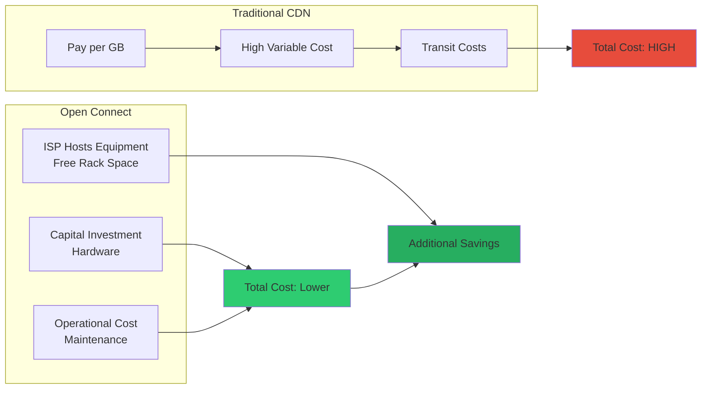
```mermaid
graph LR
    subgraph "Traditional CDN"
        Pay1[Pay per GB]
        Cost1[High Variable Cost]
        Transit1[Transit Costs]
    end
    
    subgraph "Open Connect"
        CapEx[Capital Investment<br/>Hardware]
        OpEx[Operational Cost<br/>Maintenance]
        ISPHost[ISP Hosts Equipment<br/>Free Rack Space]
    end
    
    Pay1 --> Cost1
    Cost1 --> Transit1
    Transit1 --> Total1[Total Cost: HIGH]
    
    CapEx --> Total2[Total Cost: Lower]
    OpEx --> Total2
    ISPHost --> Savings[Additional Savings]
    Total2 --> Savings
    
    style Total1 fill:#e74c3c
    style Total2 fill:#2ecc71
    style Savings fill:#27ae60
```

**Open Connect Benefits:**
- **No transit costs**: Content stays within ISP networks
- **Shared costs**: ISPs provide power, cooling, space
- **Scale economics**: Hardware costs amortized over years
- **Better quality**: Lower latency, fewer hops

## Performance Metrics

### Key Performance Indicators

```mermaid
graph TB
    Metrics[Netflix KPIs] --> SPS[Streams Per Second<br/>Target: Millions]
    Metrics --> StartTime[Playback Start Time<br/>Target: <2 seconds]
    Metrics --> BufferRatio[Rebuffer Ratio<br/>Target: <0.1%]
    Metrics --> API[API Latency<br/>Target: p99 <100ms]
    Metrics --> Availability[Availability<br/>Target: 99.99%]
    Metrics --> CacheHit[CDN Cache Hit Rate<br/>Target: >95%]
    
    style SPS fill:#2ecc71
    style StartTime fill:#3498db
    style BufferRatio fill:#9b59b6
```

**Monitoring Strategy:**
- Real-time dashboards
- Percentile-based SLOs (p50, p95, p99, p99.9)
- Customer-centric metrics (hours streamed, errors)
- Regional breakdowns
- Device-type segmentation

## Deployment Strategy

### Continuous Delivery Pipeline

```mermaid
sequenceDiagram
    participant Dev
    participant Git
    participant CI
    participant Test
    participant Canary
    participant Production
    
    Dev->>Git: Push Code
    Git->>CI: Trigger Build
    CI->>CI: • Compile<br/>• Unit Tests<br/>• Static Analysis
    
    CI->>Test: Deploy to Test<br/>Environment
    Test->>Test: • Integration Tests<br/>• Performance Tests<br/>• Security Scans
    
    Test->>Canary: Deploy to 1% Traffic
    Canary->>Canary: Monitor for 1 hour<br/>• Error Rates<br/>• Latency<br/>• Business Metrics
    
    alt Success
        Canary->>Production: Gradual Rollout<br/>10% → 25% → 50% → 100%
        Production-->>Dev: Deployment Complete
    else Failure Detected
        Canary->>Canary: Automatic Rollback
        Canary-->>Dev: Alert & Stop
    end
```

**Deployment Characteristics:**
- Thousands of deployments per day
- Canary releases with automatic rollback
- Feature flags for gradual activation
- A/B testing integrated into deployment
- Blue-green deployment for zero-downtime

### Red/Black Deployment Pattern

```mermaid
graph TB
    subgraph "Current Production - Red"
        Red1[Service v1.0<br/>100% Traffic]
    end
    
    subgraph "New Version - Black"
        Black1[Service v2.0<br/>0% Traffic]
    end
    
    LB[Load Balancer] --> Red1
    LB -.Standby.-> Black1
    
    Deploy[Deploy v2.0] --> Black1
    Test[Run Tests] --> Black1
    
    Validate{Tests Pass?} -.->|Yes| Switch[Switch Traffic]
    Validate -.->|No| Rollback1[Destroy Black]
    
    Switch --> Red2[v1.0 - 0% Traffic<br/>Standby]
    Switch --> Black2[v2.0 - 100% Traffic<br/>Active]
    
    Monitor{Monitor<br/>30 min} --> Black2
    Monitor -->|Issues| Rollback2[Instant Switch Back]
    Monitor -->|Success| Decommission[Decommission Red]
    
    Rollback2 --> Red2
    
    style Red1 fill:#e74c3c
    style Black1 fill:#34495e
    style Black2 fill:#2ecc71
    style Rollback2 fill:#f39c12
```

## Security & DRM

### Content Protection Architecture

```mermaid
graph TB
    subgraph "Client Side"
        Player[Video Player]
        CDM[Content Decryption Module<br/>Widevine/PlayReady/FairPlay]
    end
    
    subgraph "DRM License Server"
        Auth[Authentication]
        License[License Generator]
        Policy[Playback Policy]
    end
    
    subgraph "Content Storage"
        OCN[Open Connect]
        Encrypted[Encrypted Video<br/>AES-128]
    end
    
    Player -->|1. Request License| Auth
    Auth -->|2. Verify Subscription| License
    License -->|3. Check Policy| Policy
    Policy -->|4. Generate Keys| License
    License -->|5. Return License| CDM
    
    CDM -->|6. Request Encrypted Content| OCN
    OCN -->|7. Stream Encrypted Video| CDM
    CDM -->|8. Decrypt & Render| Player
    
    style Encrypted fill:#e74c3c
    style CDM fill:#9b59b6
    style License fill:#3498db
```

**Security Layers:**

1. **Transport Security**: TLS 1.3 for all communications
2. **Content Encryption**: AES-128 encryption for video files
3. **DRM Protection**: Multiple DRM systems (Widevine, PlayReady, FairPlay)
4. **License Management**: Time-bound licenses, device limits
5. **Forensic Watermarking**: Track content leaks
6. **Account Security**: Multi-factor authentication, anomaly detection

### Account Sharing Detection

```mermaid
flowchart TD
    Activity[User Activity] --> Collect[Collect Signals]
    
    subgraph "Signal Collection"
        IP[IP Addresses]
        Device[Device IDs]
        Location[Geographic Location]
        Pattern[Viewing Patterns]
        Time[Time Zones]
    end
    
    Collect --> IP
    Collect --> Device
    Collect --> Location
    Collect --> Pattern
    Collect --> Time
    
    IP --> ML[ML Model]
    Device --> ML
    Location --> ML
    Pattern --> ML
    Time --> ML
    
    ML --> Score{Sharing<br/>Probability}
    
    Score -->|Low| Normal[Normal Access]
    Score -->|Medium| Monitor[Monitor]
    Score -->|High| Action[Enforcement Action]
    
    Action --> Verify[Verification Challenge]
    Action --> Upgrade[Suggest Upgrade Plan]
    
    style ML fill:#9b59b6
    style Score fill:#f39c12
    style Action fill:#e74c3c
```

## Observability & Monitoring

### Monitoring Stack

```mermaid
graph TB
    subgraph "Data Collection"
        App[Application Metrics]
        System[System Metrics]
        Logs[Log Aggregation]
        Traces[Distributed Tracing]
    end
    
    subgraph "Storage & Processing"
        Atlas[Atlas - Time Series DB]
        ES[Elasticsearch - Logs]
        Mantis[Mantis - Stream Processing]
    end
    
    subgraph "Visualization & Alerting"
        Grafana[Grafana Dashboards]
        Alerts[Alert Manager]
        PagerDuty[PagerDuty Integration]
    end
    
    App --> Atlas
    System --> Atlas
    Logs --> ES
    Traces --> Mantis
    
    Atlas --> Grafana
    Atlas --> Alerts
    ES --> Grafana
    Mantis --> Alerts
    
    Alerts --> PagerDuty
    
    style Atlas fill:#e74c3c
    style Mantis fill:#f39c12
    style Grafana fill:#3498db
```

**Atlas Time-Series Database:**
- Custom-built for Netflix scale
- Billions of metrics per day
- Sub-second query latency
- Dimensional data model
- Automatic anomaly detection

**Key Metrics Monitored:**

```mermaid
graph LR
    subgraph "Business Metrics"
        SPS[Streams Per Second]
        SignUps[Sign-ups Per Hour]
        Churn[Churn Rate]
        Watch[Watch Time]
    end
    
    subgraph "Technical Metrics"
        Latency[API Latency<br/>p50, p95, p99]
        Errors[Error Rates]
        CPU[CPU/Memory Usage]
        Requests[Request Volume]
    end
    
    subgraph "Customer Experience"
        PSBR[Playback Start<br/>Buffer Ratio]
        Rebuffer[Rebuffer Events]
        Quality[Video Quality<br/>Distribution]
        Crashes[App Crashes]
    end
    
    style SPS fill:#2ecc71
    style Latency fill:#3498db
    style PSBR fill:#9b59b6
```

## Disaster Recovery

### Multi-Region Failover Strategy

```mermaid
sequenceDiagram
    participant Users
    participant DNS
    participant Region1 as Region 1 (Primary)
    participant Region2 as Region 2 (Standby)
    participant Region3 as Region 3 (Standby)
    
    Users->>DNS: Request service.netflix.com
    DNS->>Region1: Route to Primary
    Region1-->>Users: Serve Traffic
    
    Note over Region1: Region 1 Fails
    
    Users->>DNS: Request service.netflix.com
    DNS->>DNS: Health Check Fails<br/>for Region 1
    DNS->>Region2: Route to Standby
    Region2->>Region2: Promote to Primary
    Region2-->>Users: Serve Traffic
    
    Note over Region1: Region 1 Recovers
    
    Region1->>Region1: Self-Heal & Rejoin
    DNS->>DNS: Add Region 1 back<br/>to rotation
```

**Disaster Recovery Principles:**

1. **No Single Point of Failure**
   - Multiple regions always active
   - Data replicated across regions
   - Stateless services enable quick recovery

2. **Automated Failover**
   - Health checks every 10 seconds
   - DNS TTL: 60 seconds
   - Automatic traffic rerouting

3. **Data Consistency**
   - Cassandra multi-DC replication
   - Eventual consistency acceptable
   - Critical data (billing) uses stronger consistency

4. **Testing**
   - Chaos Kong: Simulate entire region failure
   - Regular DR drills
   - Failover time target: < 5 minutes

## Cost & Scale Numbers

### Infrastructure Scale

```mermaid
graph TB
    Scale[Netflix Infrastructure Scale] --> Servers[200,000+<br/>Server Instances]
    Scale --> Storage[Petabytes<br/>of Content]
    Scale --> Bandwidth[200+ Gbps<br/>Peak Bandwidth]
    Scale --> Events[500+ Billion<br/>Events/Day]
    Scale --> Services[700+<br/>Microservices]
    Scale --> Regions[3<br/>AWS Regions]
    Scale --> OCN[15,000+<br/>CDN Servers]
    
    style Scale fill:#e74c3c
    style Servers fill:#3498db
    style OCN fill:#e74c3c
```

### Cost Breakdown (Estimated)

```mermaid
pie title Netflix Infrastructure Cost Distribution
    "Content Acquisition" : 45
    "Technology & Development" : 20
    "AWS Cloud Costs" : 15
    "Open Connect CDN" : 10
    "Marketing" : 10
```

**AWS Cloud Costs:**
- Compute (EC2): ~40%
- Storage (S3): ~30%
- Data Transfer: ~15%
- Databases & Caches: ~10%
- Other Services: ~5%

**Cost Optimization Wins:**
- Open Connect saves ~$1B annually vs traditional CDN
- Per-title encoding saves 20-50% bandwidth
- Spot instances reduce compute costs by 70%
- Reserved instances for baseline capacity

## Lessons Learned & Best Practices

### 1. **Embrace Cloud Native**

```mermaid
graph LR
    Old[Old Way:<br/>Own Data Centers] -->|Migration| Cloud[Cloud-First Strategy]
    
    Cloud --> Benefits1[Elastic Scaling]
    Cloud --> Benefits2[Global Reach]
    Cloud --> Benefits3[Innovation Speed]
    Cloud --> Benefits4[Cost Efficiency]
    
    style Old fill:#e74c3c
    style Cloud fill:#2ecc71
```

**Key Decisions:**
- Move to AWS in 2008-2015
- Close all data centers
- Exception: Open Connect (strategic cost decision)
- Leverage managed services where possible

### 2. **Optimize for Time to Recovery, Not Time Between Failures**

```mermaid
graph TB
    Philosophy[Design Philosophy] --> Expect[Expect Failures]
    Expect --> Fast[Fast Recovery > Prevention]
    
    Fast --> Auto[Automated Healing]
    Fast --> Stateless[Stateless Services]
    Fast --> Multi[Multi-Region Redundancy]
    
    Auto --> Example1[Circuit Breakers]
    Stateless --> Example2[Quick Instance Replacement]
    Multi --> Example3[Instant Failover]
    
    style Expect fill:#f39c12
    style Fast fill:#2ecc71
```

**Implementation:**
- Services recover in seconds, not minutes
- Automatic instance replacement
- No manual intervention needed
- Chaos engineering validates recovery

### 3. **Data-Driven Decision Making**

```mermaid
flowchart LR
    Idea[New Feature Idea] --> Hypothesis[Form Hypothesis]
    Hypothesis --> AB[A/B Test]
    
    AB --> Group1[Control Group<br/>Existing Experience]
    AB --> Group2[Test Group<br/>New Experience]
    
    Group1 --> Metrics1[Collect Metrics]
    Group2 --> Metrics2[Collect Metrics]
    
    Metrics1 --> Analysis[Statistical Analysis]
    Metrics2 --> Analysis
    
    Analysis --> Decision{Significant<br/>Improvement?}
    
    Decision -->|Yes| Rollout[Gradual Rollout]
    Decision -->|No| Discard[Discard/Iterate]
    
    Rollout --> Monitor[Monitor Impact]
    
    style AB fill:#9b59b6
    style Decision fill:#f39c12
    style Rollout fill:#2ecc71
```

**Testing Culture:**
- Thousands of A/B tests running simultaneously
- Every feature change is tested
- Measure impact on key metrics (retention, engagement)
- Data overrides opinions

### 4. **Microservices Benefits & Challenges**

**Benefits:**
```mermaid
graph TB
    Micro[Microservices Architecture]
    
    Micro --> B1[Independent Deployment<br/>Ship faster, less coordination]
    Micro --> B2[Technology Diversity<br/>Best tool per service]
    Micro --> B3[Fault Isolation<br/>Failures contained]
    Micro --> B4[Team Autonomy<br/>Ownership & accountability]
    Micro --> B5[Scalability<br/>Scale services independently]
    
    style Micro fill:#2ecc71
```

**Challenges:**
```mermaid
graph TB
    Challenges[Microservices Challenges]
    
    Challenges --> C1[Complexity<br/>700+ services to manage]
    Challenges --> C2[Debugging<br/>Distributed tracing required]
    Challenges --> C3[Network Latency<br/>Inter-service calls]
    Challenges --> C4[Data Consistency<br/>No ACID transactions]
    Challenges --> C5[Operational Overhead<br/>Deployment, monitoring]
    
    style Challenges fill:#e74c3c
```

**Netflix's Solutions:**
- Strong DevOps culture
- Excellent tooling (Spinnaker, Atlas, etc.)
- Service mesh for reliability
- Clear service contracts
- Comprehensive documentation

### 5. **Customer Experience is Paramount**

```mermaid
graph TB
    CX[Customer Experience] --> P1[Playback Start Time<br/>< 2 seconds]
    CX --> P2[Zero Buffering<br/>< 0.1% rebuffer ratio]
    CX --> P3[High Availability<br/>99.99% uptime]
    CX --> P4[Personalization<br/>Relevant content]
    CX --> P5[Quality<br/>Adaptive streaming]
    
    P1 --> Invest1[CDN Investment]
    P2 --> Invest2[Adaptive Bitrate Algorithm]
    P3 --> Invest3[Multi-Region Architecture]
    P4 --> Invest4[ML Infrastructure]
    P5 --> Invest5[Per-Title Encoding]
    
    style CX fill:#2ecc71
```

**Obsession with Metrics:**
- Every decision evaluated against customer impact
- SPS (Seconds of Play Started) is key metric
- Rebuffer events tracked religiously
- Constant optimization of playback experience

### 6. **Build vs Buy Decisions**

```mermaid
graph LR
    Decision{Build or Buy?}
    
    Decision -->|Core Differentiator| Build[Build Custom]
    Decision -->|Commodity| Buy[Use Existing]
    
    Build --> Examples1[• Open Connect CDN<br/>• Personalization Engine<br/>• Atlas Monitoring<br/>• Encoding Pipeline]
    
    Buy --> Examples2[• AWS Infrastructure<br/>• Databases<br/>• Message Queues<br/>• Standard Tools]
    
    style Build fill:#e74c3c
    style Buy fill:#3498db
```

**Build Custom When:**
- Critical competitive advantage
- Unique requirements at scale
- No suitable alternatives exist
- ROI justifies investment

**Use Existing When:**
- Commodity functionality
- Time-to-market is critical
- Maintenance burden not worth it
- Community support valuable

## Evolution Timeline

```mermaid
timeline
    title Netflix Scalability Evolution
    2007 : Streaming Launch
         : Single Data Center
         : Monolithic Application
    2008 : Database Outage (3 days)
         : Decision to Move to Cloud
         : Begin AWS Migration
    2009 : Start Cloud Migration
         : Microservices Architecture
         : First Services in AWS
    2010 : Chaos Monkey Introduced
         : Cassandra Adoption
         : International Expansion
    2012 : Open Connect CDN Launch
         : Hystrix Circuit Breaker
         : Complete AWS Migration
    2013 : House of Cards Launch
         : Global Expansion Accelerated
         : Per-Title Encoding
    2015 : All Data Centers Closed
         : 100% AWS Cloud
         : Global Presence
    2016 : Artwork Personalization
         : 130+ Countries
         : Offline Downloads
    2020 : 200M+ Subscribers
         : AV1 Codec Support
         : 4K HDR Standard
    2024 : 230M+ Subscribers
         : AI-Powered Recommendations
         : Live Streaming Capability
```

## Key Takeaways

### Technical Principles

1. **Separation of Control and Data Planes**
   - Control plane: AWS Cloud (flexibility, rapid development)
   - Data plane: Open Connect (cost efficiency, performance)

2. **Eventual Consistency is Acceptable**
   - Social media features don't need strong consistency
   - Viewing history can be eventually consistent
   - Billing requires stronger guarantees

3. **Cache Everything Possible**
   - Multiple cache layers
   - 95%+ cache hit rates
   - Reduces database load dramatically

4. **Design for Failure**
   - Chaos engineering in production
   - Circuit breakers everywhere
   - Graceful degradation always

5. **Data-Driven Culture**
   - A/B test everything
   - Metrics guide decisions
   - Measure customer impact

### Organizational Principles

1. **Freedom & Responsibility**
   - Teams own their services end-to-end
   - Autonomy in technology choices
   - Accountable for reliability

2. **Innovation Through Experimentation**
   - Safe to fail
   - Learn from failures
   - Iterate rapidly

3. **Open Source Contribution**
   - Share tools with community
   - Benefit from ecosystem
   - Attract talent

### Business Impact

```mermaid
graph LR
    Tech[Technical Excellence] --> Scale[Massive Scale]
    Scale --> Cost[Cost Efficiency]
    Cost --> Margins[Better Margins]
    
    Tech --> CX[Superior Customer Experience]
    CX --> Retention[High Retention]
    Retention --> Growth[Business Growth]
    
    Tech --> Innovation[Fast Innovation]
    Innovation --> Features[New Features]
    Features --> Competition[Competitive Advantage]
    
    style Tech fill:#3498db
    style CX fill:#2ecc71
    style Growth fill:#e74c3c
```

**Bottom Line Results:**
- **Availability**: 99.99% uptime
- **Scale**: 230M+ subscribers globally
- **Performance**: Sub-2-second playback start
- **Cost**: Open Connect saves ~$1B annually
- **Innovation**: Thousands of A/B tests and deployments daily

## Conclusion

Netflix's scalability success stems from:

1. **Right Architecture for the Problem**
   - Microservices for control plane complexity
   - Custom CDN for data plane economics
   - Polyglot persistence for different data needs

2. **Continuous Evolution**
   - Started monolithic, evolved to microservices
   - Migrated from data centers to cloud
   - Built custom solutions where justified

3. **Culture of Reliability**
   - Chaos engineering validates resilience
   - Automated failure recovery
   - Obsessive monitoring

4. **Customer-Centric Decisions**
   - Every technical decision serves customer experience
   - Measure impact on engagement and retention
   - Never compromise on quality

5. **Pragmatic Trade-offs**
   - Eventual consistency over strong consistency
   - Complexity for scale and performance
   - Build vs buy based on strategic value

Netflix demonstrates that scaling to global proportions requires not just technical solutions, but also organizational culture, continuous innovation, and unwavering focus on customer experience. Their journey from a single data center to serving 230M+ subscribers across the globe showcases world-class distributed systems engineering and operational excellence.