# Case Study 3: Airbnb's Scalability Architecture

## Overview

Airbnb is a global marketplace connecting **150+ million users** with over **7 million listings** across 220+ countries and regions. The platform handles **2+ million check-ins per night** at peak, processes billions of search queries annually, and manages a complex two-sided marketplace with hosts and guests.

## Unique Scalability Challenges

### 1. **Two-Sided Marketplace Complexity**
- Balance supply (hosts) and demand (guests)
- Real-time availability management
- Dynamic pricing algorithms
- Trust and safety at scale

### 2. **Global Search & Discovery**
- Geospatial queries across millions of listings
- Personalized ranking for each user
- Multiple filters (price, amenities, dates, location)
- Sub-second search response times

### 3. **Payment Complexity**
- 190+ currencies
- Multiple payment methods per region
- Split payments (host payout, service fees)
- Payment fraud prevention
- Regulatory compliance per country

### 4. **Data Consistency Challenges**
- Double-booking prevention (critical)
- Inventory synchronization
- Pricing updates
- Calendar availability
- Review and rating integrity

### 5. **Peak Traffic Patterns**
- Seasonal spikes (summer, holidays)
- Geographic event-driven traffic (Olympics, festivals)
- Launch of new products/markets
- Different peak times per region

## Architecture Evolution

### Phase 1: Monolithic Rails Application (2008-2012)

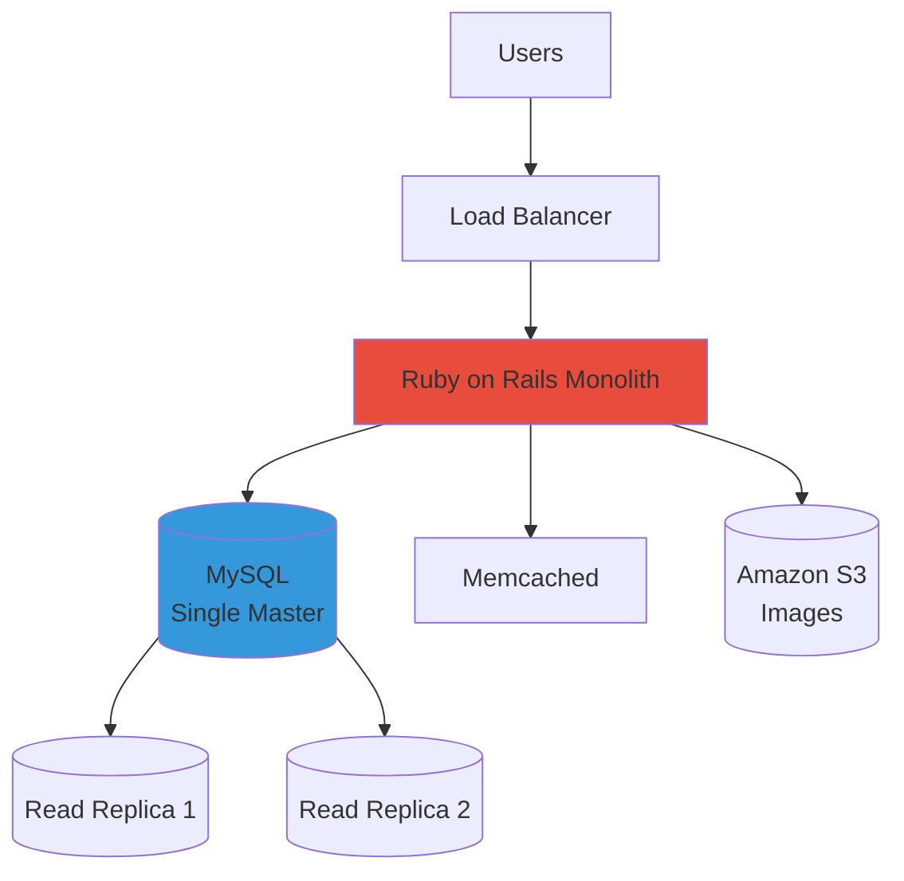
```mermaid
graph TB
    Users[Users] --> LB[Load Balancer]
    LB --> Rails[Ruby on Rails Monolith]
    
    Rails --> MySQL[(MySQL<br/>Single Master)]
    Rails --> Memcached[Memcached]
    Rails --> S3[(Amazon S3<br/>Images)]
    
    MySQL --> Slave1[(Read Replica 1)]
    MySQL --> Slave2[(Read Replica 2)]
    
    style Rails fill:#e74c3c
    style MySQL fill:#3498db
```

**Problems at Scale:**
- Slow deployments (hours)
- Tight coupling between features
- Database bottlenecks
- Hard to scale teams
- Difficult to test
- Performance degradation

### Phase 2: Service-Oriented Architecture (2013-2016)

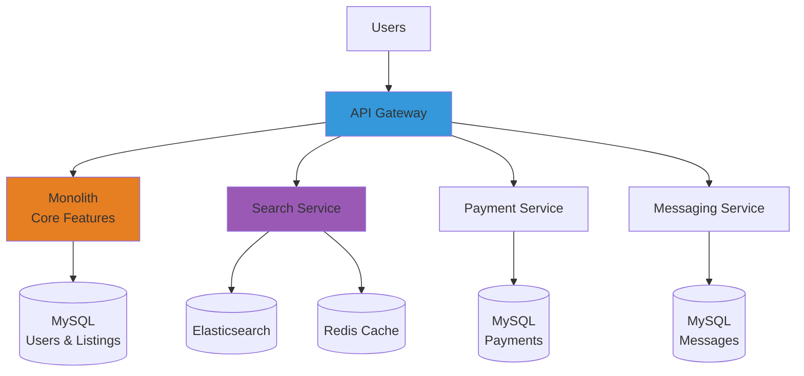
```mermaid
graph TB
    Users[Users] --> Gateway[API Gateway]
    
    Gateway --> Monolith[Monolith<br/>Core Features]
    Gateway --> SearchService[Search Service]
    Gateway --> PaymentService[Payment Service]
    Gateway --> MessagingService[Messaging Service]
    
    Monolith --> MySQL1[(MySQL<br/>Users & Listings)]
    SearchService --> Elastic[(Elasticsearch)]
    PaymentService --> MySQL2[(MySQL<br/>Payments)]
    MessagingService --> MySQL3[(MySQL<br/>Messages)]
    
    SearchService --> Redis1[(Redis Cache)]
    
    style Gateway fill:#3498db
    style Monolith fill:#e67e22
    style SearchService fill:#9b59b6
```

**Improvements:**
- Critical services extracted
- Independent scaling
- Better team boundaries
- Faster deployments for new services
- Monolith still exists for core features

### Phase 3: Microservices Architecture (2017-Present)

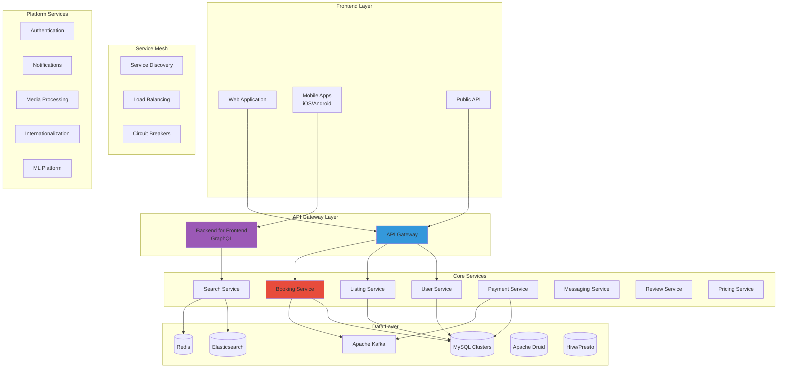
```mermaid
graph TB
    subgraph "Frontend Layer"
        Web[Web Application]
        Mobile[Mobile Apps<br/>iOS/Android]
        API[Public API]
    end
    
    subgraph "API Gateway Layer"
        Gateway[API Gateway]
        BFF[Backend for Frontend<br/>GraphQL]
    end
    
    subgraph "Service Mesh"
        Discovery[Service Discovery]
        LB[Load Balancing]
        CircuitBreaker[Circuit Breakers]
    end
    
    subgraph "Core Services"
        UserService[User Service]
        ListingService[Listing Service]
        BookingService[Booking Service]
        SearchService[Search Service]
        PaymentService[Payment Service]
        MessagingService[Messaging Service]
        ReviewService[Review Service]
        PricingService[Pricing Service]
    end
    
    subgraph "Platform Services"
        AuthService[Authentication]
        NotificationService[Notifications]
        MediaService[Media Processing]
        i18nService[Internationalization]
        MLPlatform[ML Platform]
    end
    
    subgraph "Data Layer"
        MySQL[(MySQL Clusters)]
        Redis[(Redis)]
        Elasticsearch[(Elasticsearch)]
        Kafka[Apache Kafka]
        Druid[(Apache Druid)]
        Hive[(Hive/Presto)]
    end
    
    Web --> Gateway
    Mobile --> BFF
    API --> Gateway
    
    Gateway --> UserService
    Gateway --> ListingService
    Gateway --> BookingService
    BFF --> SearchService
    
    UserService --> MySQL
    ListingService --> MySQL
    BookingService --> MySQL
    SearchService --> Elasticsearch
    PaymentService --> MySQL
    
    SearchService --> Redis
    BookingService --> Kafka
    PaymentService --> Kafka
    
    style Gateway fill:#3498db
    style BFF fill:#9b59b6
    style BookingService fill:#e74c3c
```

## Core Scalability Solutions

### 1. **Search Architecture**

Search is one of Airbnb's most critical and complex features, handling billions of queries annually.

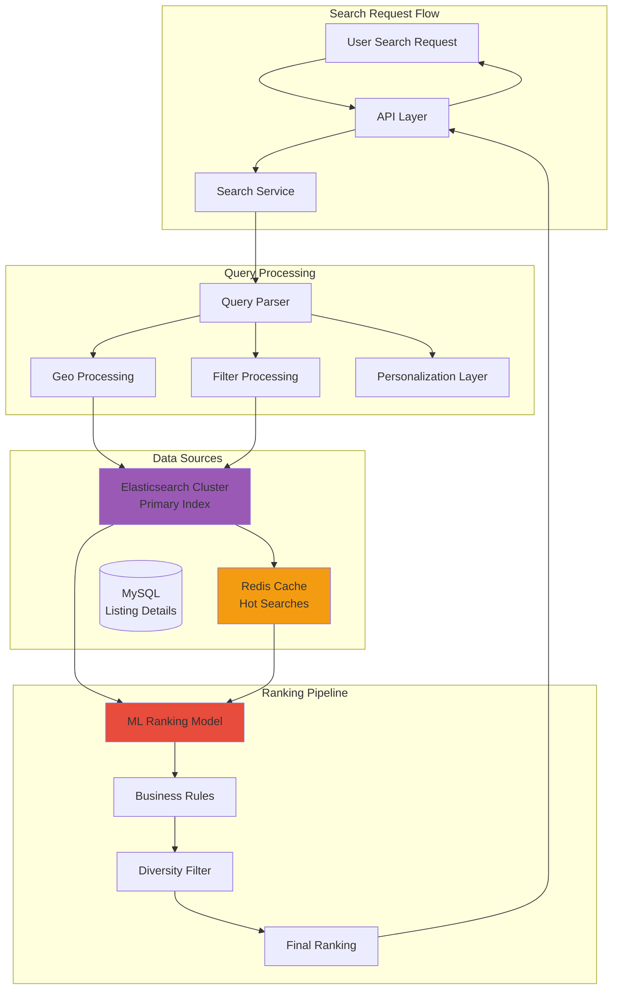
```mermaid
graph TB
    subgraph "Search Request Flow"
        User[User Search Request]
        API[API Layer]
        SearchService[Search Service]
    end
    
    subgraph "Query Processing"
        Parser[Query Parser]
        Geo[Geo Processing]
        Filters[Filter Processing]
        Personalization[Personalization Layer]
    end
    
    subgraph "Data Sources"
        ES[Elasticsearch Cluster<br/>Primary Index]
        Cache[Redis Cache<br/>Hot Searches]
        DB[(MySQL<br/>Listing Details)]
    end
    
    subgraph "Ranking Pipeline"
        ML[ML Ranking Model]
        Business[Business Rules]
        Diversity[Diversity Filter]
        Final[Final Ranking]
    end
    
    User --> API
    API --> SearchService
    SearchService --> Parser
    
    Parser --> Geo
    Parser --> Filters
    Parser --> Personalization
    
    Geo --> ES
    Filters --> ES
    ES --> Cache
    
    ES --> ML
    Cache --> ML
    ML --> Business
    Business --> Diversity
    Diversity --> Final
    
    Final --> API
    API --> User
    
    style ES fill:#9b59b6
    style ML fill:#e74c3c
    style Cache fill:#f39c12
```

**Search Optimization Strategies:**

#### Elasticsearch Index Design

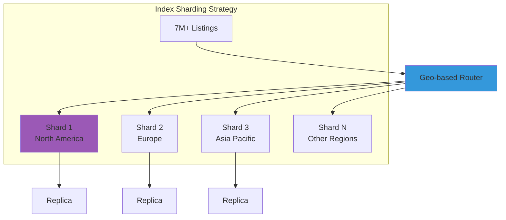
```mermaid
graph TB
    subgraph "Index Sharding Strategy"
        Listings[7M+ Listings]
        
        Shard1[Shard 1<br/>North America]
        Shard2[Shard 2<br/>Europe]
        Shard3[Shard 3<br/>Asia Pacific]
        Shard4[Shard N<br/>Other Regions]
    end
    
    Listings --> Router[Geo-based Router]
    Router --> Shard1
    Router --> Shard2
    Router --> Shard3
    Router --> Shard4
    
    Shard1 --> Replica1[Replica]
    Shard2 --> Replica2[Replica]
    Shard3 --> Replica3[Replica]
    
    style Router fill:#3498db
    style Shard1 fill:#9b59b6
```

**Index Structure:**
- **Geographic sharding**: Listings sharded by region
- **Hot/Cold data**: Recent listings in faster storage
- **Denormalized data**: Everything needed for search in one document
- **Regular reindexing**: Nightly full reindex, real-time updates

#### Multi-Stage Search Pipeline

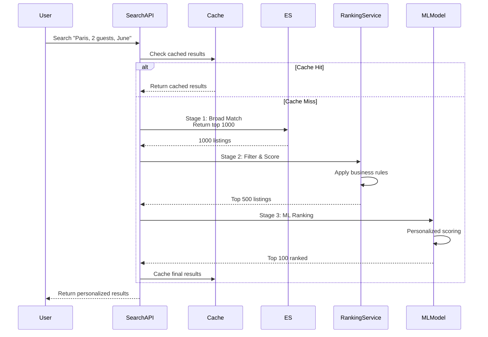
```mermaid
sequenceDiagram
    participant User
    participant SearchAPI
    participant Cache
    participant ES
    participant RankingService
    participant MLModel
    
    User->>SearchAPI: Search "Paris, 2 guests, June"
    SearchAPI->>Cache: Check cached results
    
    alt Cache Hit
        Cache-->>SearchAPI: Return cached results
    else Cache Miss
        SearchAPI->>ES: Stage 1: Broad Match<br/>Return top 1000
        ES-->>SearchAPI: 1000 listings
        
        SearchAPI->>RankingService: Stage 2: Filter & Score
        RankingService->>RankingService: Apply business rules
        RankingService-->>SearchAPI: Top 500 listings
        
        SearchAPI->>MLModel: Stage 3: ML Ranking
        MLModel->>MLModel: Personalized scoring
        MLModel-->>SearchAPI: Top 100 ranked
        
        SearchAPI->>Cache: Cache final results
    end
    
    SearchAPI-->>User: Return personalized results
```

**Three-Stage Approach:**
1. **Broad Match (Elasticsearch)**: Fast retrieval of ~1000 candidates
2. **Business Rules**: Filter by availability, apply business logic
3. **ML Ranking**: Personalized ranking using ML models

#### Search Ranking Factors


```mermaid
graph TB
    Ranking[Search Ranking Algorithm]
    
    subgraph "Location Factors"
        Distance[Distance from Search Center]
        Neighborhood[Neighborhood Quality]
        Transit[Transit Accessibility]
    end
    
    subgraph "Quality Signals"
        Reviews[Review Score]
        ResponseRate[Host Response Rate]
        Cancellation[Cancellation History]
        Superhost[Superhost Status]
    end
    
    subgraph "Personalization"
        History[User Search History]
        Bookings[Past Bookings]
        Preferences[Stated Preferences]
        Similar[Similar Users' Behavior]
    end
    
    subgraph "Business Metrics"
        BookingRate[Booking Conversion Rate]
        Revenue[Revenue Potential]
        Availability[Calendar Availability]
    end
    
    Ranking --> Distance
    Ranking --> Reviews
    Ranking --> History
    Ranking --> BookingRate
    
    Distance --> Score[Final Score]
    Reviews --> Score
    History --> Score
    BookingRate --> Score
    
    style Ranking fill:#e74c3c
    style Score fill:#2ecc71
```

**Ranking Model Evolution:**

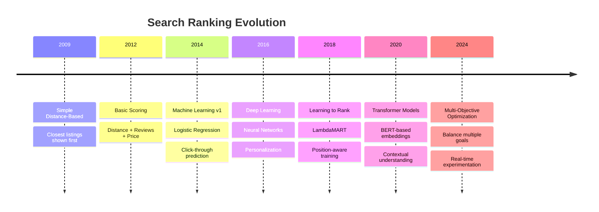
```mermaid
timeline
    title Search Ranking Evolution
    2009 : Simple Distance-Based
         : Closest listings shown first
    2012 : Basic Scoring
         : Distance + Reviews + Price
    2014 : Machine Learning v1
         : Logistic Regression
         : Click-through prediction
    2016 : Deep Learning
         : Neural Networks
         : Personalization
    2018 : Learning to Rank
         : LambdaMART
         : Position-aware training
    2020 : Transformer Models
         : BERT-based embeddings
         : Contextual understanding
    2024 : Multi-Objective Optimization
         : Balance multiple goals
         : Real-time experimentation
```

### 2. **Booking System Architecture**

The booking system is the most critical component - preventing double bookings while maintaining high availability.

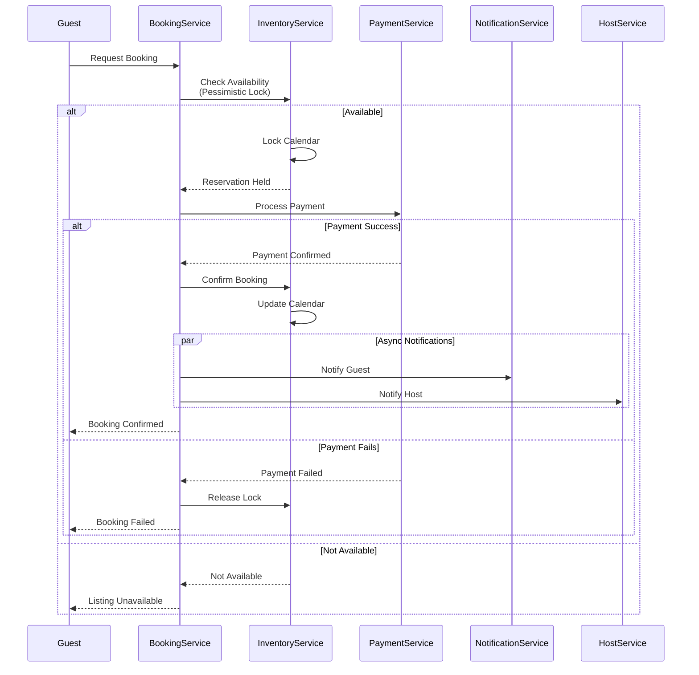
```mermaid
sequenceDiagram
    participant Guest
    participant BookingService
    participant InventoryService
    participant PaymentService
    participant NotificationService
    participant HostService
    
    Guest->>BookingService: Request Booking
    BookingService->>InventoryService: Check Availability<br/>(Pessimistic Lock)
    
    alt Available
        InventoryService->>InventoryService: Lock Calendar
        InventoryService-->>BookingService: Reservation Held
        
        BookingService->>PaymentService: Process Payment
        
        alt Payment Success
            PaymentService-->>BookingService: Payment Confirmed
            BookingService->>InventoryService: Confirm Booking
            InventoryService->>InventoryService: Update Calendar
            
            par Async Notifications
                BookingService->>NotificationService: Notify Guest
                BookingService->>HostService: Notify Host
            end
            
            BookingService-->>Guest: Booking Confirmed
        else Payment Fails
            PaymentService-->>BookingService: Payment Failed
            BookingService->>InventoryService: Release Lock
            BookingService-->>Guest: Booking Failed
        end
    else Not Available
        InventoryService-->>BookingService: Not Available
        BookingService-->>Guest: Listing Unavailable
    end
```

#### Double-Booking Prevention Strategy

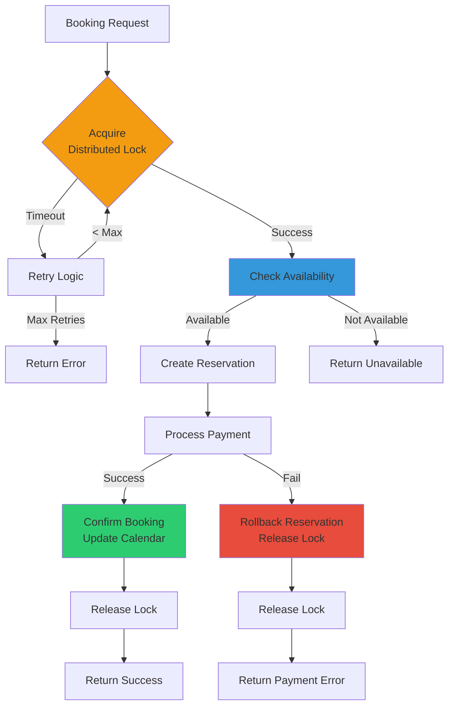
```mermaid
graph TB
    Request[Booking Request] --> Lock{Acquire<br/>Distributed Lock}
    
    Lock -->|Success| Check[Check Availability]
    Lock -->|Timeout| Retry[Retry Logic]
    
    Retry -->|Max Retries| Fail1[Return Error]
    Retry -->|< Max| Lock
    
    Check -->|Available| Reserve[Create Reservation]
    Check -->|Not Available| Fail2[Return Unavailable]
    
    Reserve --> Payment[Process Payment]
    
    Payment -->|Success| Confirm[Confirm Booking<br/>Update Calendar]
    Payment -->|Fail| Rollback[Rollback Reservation<br/>Release Lock]
    
    Confirm --> Release1[Release Lock]
    Rollback --> Release2[Release Lock]
    
    Release1 --> Success[Return Success]
    Release2 --> Fail3[Return Payment Error]
    
    style Lock fill:#f39c12
    style Check fill:#3498db
    style Confirm fill:#2ecc71
    style Rollback fill:#e74c3c
```

**Lock Implementation:**

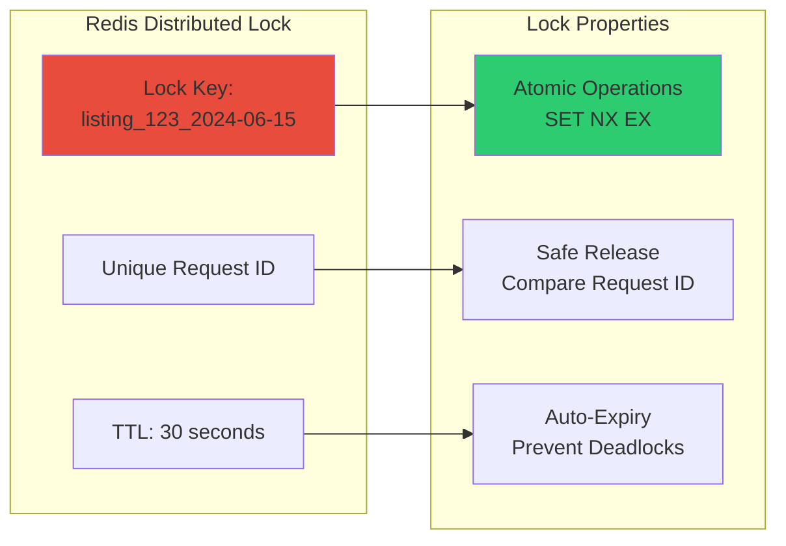
```mermaid
graph LR
    subgraph "Redis Distributed Lock"
        Key[Lock Key:<br/>listing_123_2024-06-15]
        Value[Unique Request ID]
        TTL[TTL: 30 seconds]
    end
    
    subgraph "Lock Properties"
        Atomic[Atomic Operations<br/>SET NX EX]
        Safe[Safe Release<br/>Compare Request ID]
        Auto[Auto-Expiry<br/>Prevent Deadlocks]
    end
    
    Key --> Atomic
    Value --> Safe
    TTL --> Auto
    
    style Key fill:#e74c3c
    style Atomic fill:#2ecc71
```

**Key Features:**
- **Pessimistic locking**: Lock before checking availability
- **Distributed locks**: Redis-based with automatic expiration
- **Idempotency**: Same request ID won't create duplicate bookings
- **Timeouts**: Prevent indefinite holds
- **Rollback mechanisms**: Automatic cleanup on failures

### 3. **Payment Processing Architecture**

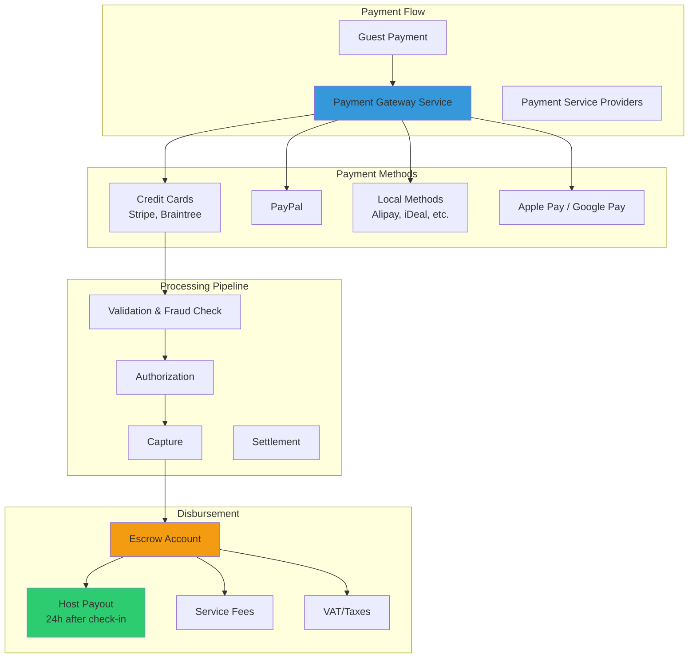
```mermaid
graph TB
    subgraph "Payment Flow"
        Guest[Guest Payment]
        Gateway[Payment Gateway Service]
        PSP[Payment Service Providers]
    end
    
    subgraph "Payment Methods"
        CreditCard[Credit Cards<br/>Stripe, Braintree]
        PayPal[PayPal]
        Local[Local Methods<br/>Alipay, iDeal, etc.]
        ApplePay[Apple Pay / Google Pay]
    end
    
    subgraph "Processing Pipeline"
        Validation[Validation & Fraud Check]
        Authorization[Authorization]
        Capture[Capture]
        Settlement[Settlement]
    end
    
    subgraph "Disbursement"
        Escrow[Escrow Account]
        HostPayout[Host Payout<br/>24h after check-in]
        Fees[Service Fees]
        VAT[VAT/Taxes]
    end
    
    Guest --> Gateway
    Gateway --> CreditCard
    Gateway --> PayPal
    Gateway --> Local
    Gateway --> ApplePay
    
    CreditCard --> Validation
    Validation --> Authorization
    Authorization --> Capture
    Capture --> Escrow
    
    Escrow --> HostPayout
    Escrow --> Fees
    Escrow --> VAT
    
    style Gateway fill:#3498db
    style Escrow fill:#f39c12
    style HostPayout fill:#2ecc71
```

**Payment Complexity Challenges:**

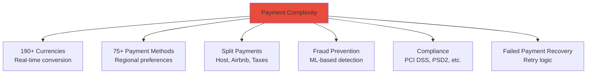
```mermaid
graph TB
    Complexity[Payment Complexity]
    
    Complexity --> C1[190+ Currencies<br/>Real-time conversion]
    Complexity --> C2[75+ Payment Methods<br/>Regional preferences]
    Complexity --> C3[Split Payments<br/>Host, Airbnb, Taxes]
    Complexity --> C4[Fraud Prevention<br/>ML-based detection]
    Complexity --> C5[Compliance<br/>PCI DSS, PSD2, etc.]
    Complexity --> C6[Failed Payment Recovery<br/>Retry logic]
    
    style Complexity fill:#e74c3c
```

#### Fraud Detection Pipeline

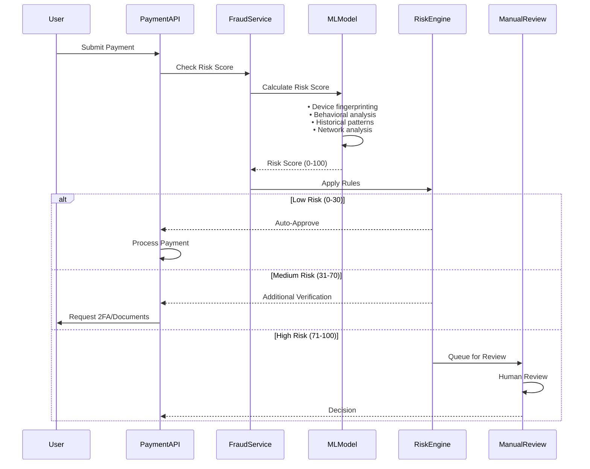
```mermaid
sequenceDiagram
    participant User
    participant PaymentAPI
    participant FraudService
    participant MLModel
    participant RiskEngine
    participant ManualReview
    
    User->>PaymentAPI: Submit Payment
    PaymentAPI->>FraudService: Check Risk Score
    
    FraudService->>MLModel: Calculate Risk Score
    MLModel->>MLModel: • Device fingerprinting<br/>• Behavioral analysis<br/>• Historical patterns<br/>• Network analysis
    
    MLModel-->>FraudService: Risk Score (0-100)
    
    FraudService->>RiskEngine: Apply Rules
    
    alt Low Risk (0-30)
        RiskEngine-->>PaymentAPI: Auto-Approve
        PaymentAPI->>PaymentAPI: Process Payment
    else Medium Risk (31-70)
        RiskEngine-->>PaymentAPI: Additional Verification
        PaymentAPI->>User: Request 2FA/Documents
    else High Risk (71-100)
        RiskEngine->>ManualReview: Queue for Review
        ManualReview->>ManualReview: Human Review
        ManualReview-->>PaymentAPI: Decision
    end
```

### 4. **Data Consistency & CAP Theorem Trade-offs**

Airbnb makes different consistency choices for different use cases:

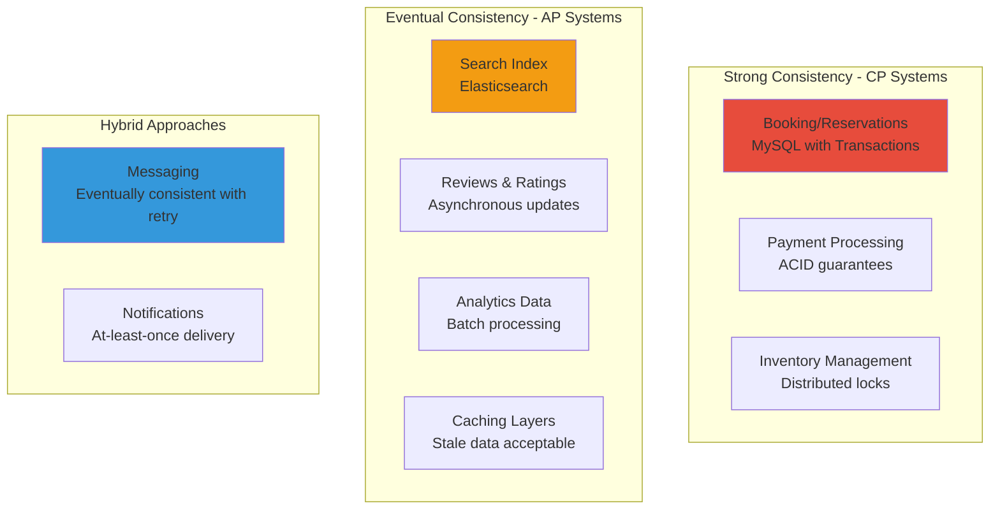
```mermaid
graph TB
    subgraph "Strong Consistency - CP Systems"
        Booking[Booking/Reservations<br/>MySQL with Transactions]
        Payment[Payment Processing<br/>ACID guarantees]
        Inventory[Inventory Management<br/>Distributed locks]
    end
    
    subgraph "Eventual Consistency - AP Systems"
        Search[Search Index<br/>Elasticsearch]
        Reviews[Reviews & Ratings<br/>Asynchronous updates]
        Analytics[Analytics Data<br/>Batch processing]
        Cache[Caching Layers<br/>Stale data acceptable]
    end
    
    subgraph "Hybrid Approaches"
        Messages[Messaging<br/>Eventually consistent with retry]
        Notifications[Notifications<br/>At-least-once delivery]
    end
    
    style Booking fill:#e74c3c
    style Search fill:#f39c12
    style Messages fill:#3498db
```

**Consistency Strategies:**

#### Bookings: Strong Consistency

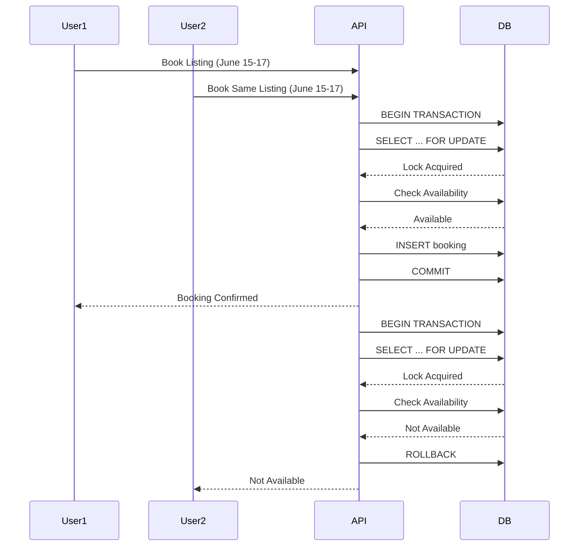
```mermaid
sequenceDiagram
    participant User1
    participant User2
    participant API
    participant DB
    
    User1->>API: Book Listing (June 15-17)
    User2->>API: Book Same Listing (June 15-17)
    
    API->>DB: BEGIN TRANSACTION
    API->>DB: SELECT ... FOR UPDATE
    DB-->>API: Lock Acquired
    
    API->>DB: Check Availability
    DB-->>API: Available
    
    API->>DB: INSERT booking
    API->>DB: COMMIT
    
    API-->>User1: Booking Confirmed
    
    API->>DB: BEGIN TRANSACTION
    API->>DB: SELECT ... FOR UPDATE
    DB-->>API: Lock Acquired
    
    API->>DB: Check Availability
    DB-->>API: Not Available
    
    API->>DB: ROLLBACK
    API-->>User2: Not Available
```

#### Search: Eventual Consistency

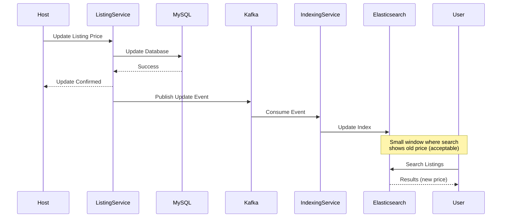
```mermaid
sequenceDiagram
    participant Host
    participant ListingService
    participant MySQL
    participant Kafka
    participant IndexingService
    participant Elasticsearch
    participant User
    
    Host->>ListingService: Update Listing Price
    ListingService->>MySQL: Update Database
    MySQL-->>ListingService: Success
    ListingService-->>Host: Update Confirmed
    
    ListingService->>Kafka: Publish Update Event
    
    Kafka->>IndexingService: Consume Event
    IndexingService->>Elasticsearch: Update Index
    
    Note over User,Elasticsearch: Small window where search<br/>shows old price (acceptable)
    
    User->>Elasticsearch: Search Listings
    Elasticsearch-->>User: Results (new price)
```

### 5. **Database Scaling Strategy**

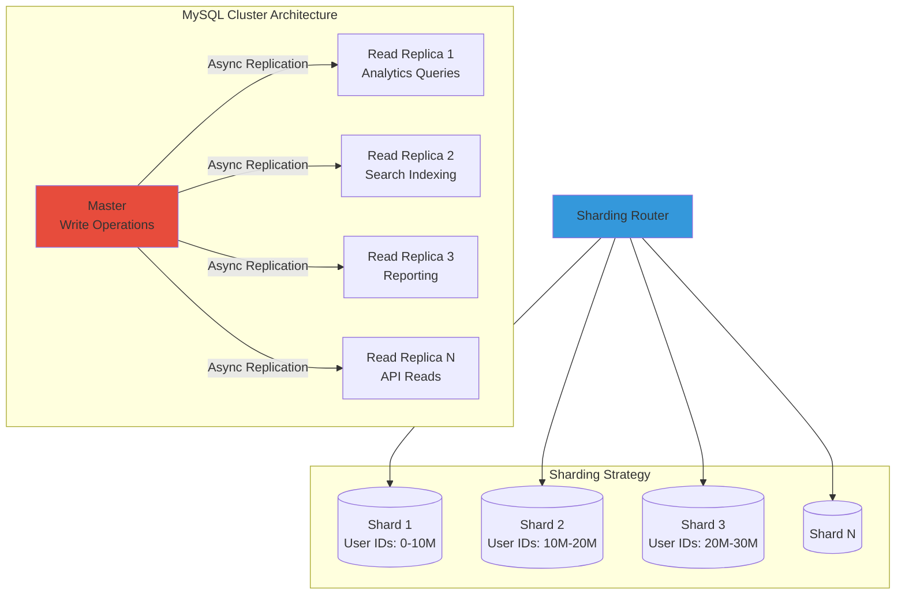
```mermaid
graph TB
    subgraph "MySQL Cluster Architecture"
        Master[Master<br/>Write Operations]
        
        Replica1[Read Replica 1<br/>Analytics Queries]
        Replica2[Read Replica 2<br/>Search Indexing]
        Replica3[Read Replica 3<br/>Reporting]
        ReplicaN[Read Replica N<br/>API Reads]
    end
    
    subgraph "Sharding Strategy"
        Shard1[(Shard 1<br/>User IDs: 0-10M)]
        Shard2[(Shard 2<br/>User IDs: 10M-20M)]
        Shard3[(Shard 3<br/>User IDs: 20M-30M)]
        ShardN[(Shard N)]
    end
    
    Master -->|Async Replication| Replica1
    Master -->|Async Replication| Replica2
    Master -->|Async Replication| Replica3
    Master -->|Async Replication| ReplicaN
    
    Router[Sharding Router] --> Shard1
    Router --> Shard2
    Router --> Shard3
    Router --> ShardN
    
    style Master fill:#e74c3c
    style Router fill:#3498db
```

**Sharding Strategies:**

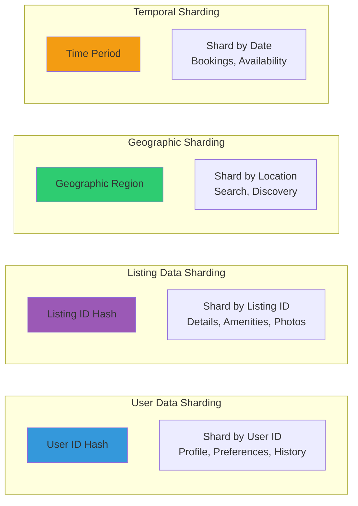
```mermaid
graph LR
    subgraph "User Data Sharding"
        UserShard[User ID Hash]
        US1[Shard by User ID<br/>Profile, Preferences, History]
    end
    
    subgraph "Listing Data Sharding"
        ListingShard[Listing ID Hash]
        LS1[Shard by Listing ID<br/>Details, Amenities, Photos]
    end
    
    subgraph "Geographic Sharding"
        GeoShard[Geographic Region]
        GS1[Shard by Location<br/>Search, Discovery]
    end
    
    subgraph "Temporal Sharding"
        TimeShard[Time Period]
        TS1[Shard by Date<br/>Bookings, Availability]
    end
    
    style UserShard fill:#3498db
    style ListingShard fill:#9b59b6
    style GeoShard fill:#2ecc71
    style TimeShard fill:#f39c12
```

### 6. **Caching Strategy**

Airbnb uses a multi-layered caching approach:

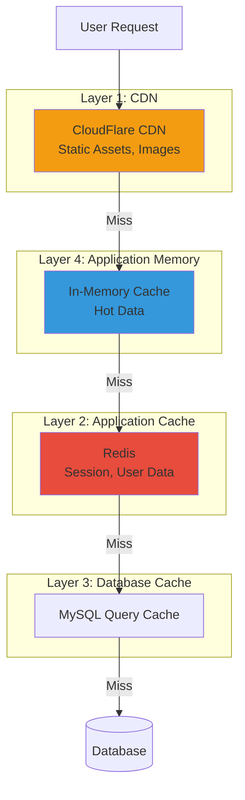
```mermaid
graph TB
    Request[User Request]
    
    subgraph "Layer 1: CDN"
        CDN[CloudFlare CDN<br/>Static Assets, Images]
    end
    
    subgraph "Layer 2: Application Cache"
        Redis[Redis<br/>Session, User Data]
    end
    
    subgraph "Layer 3: Database Cache"
        QueryCache[MySQL Query Cache]
    end
    
    subgraph "Layer 4: Application Memory"
        LocalCache[In-Memory Cache<br/>Hot Data]
    end
    
    Request --> CDN
    CDN -->|Miss| LocalCache
    LocalCache -->|Miss| Redis
    Redis -->|Miss| QueryCache
    QueryCache -->|Miss| Database[(Database)]
    
    style CDN fill:#f39c12
    style Redis fill:#e74c3c
    style LocalCache fill:#3498db
```

**Cache Invalidation Strategies:**

```mermaid
flowchart TD
    Update[Data Update] --> Decision{Invalidation<br/>Strategy}
    
    Decision -->|Critical Data| WriteThrough[Write-Through<br/>Update cache immediately]
    Decision -->|Moderate Priority| TTL[TTL-Based<br/>Expire after N seconds]
    Decision -->|Low Priority| Lazy[Lazy Loading<br/>Invalidate on next read]
    
    WriteThrough --> Example1[Booking Status<br/>Inventory]
    TTL --> Example2[Listing Details<br/>Reviews]
    Lazy --> Example3[User Preferences<br/>Search History]
    
    style WriteThrough fill:#e74c3c
    style TTL fill:#f39c12
    style Lazy fill:#3498db
```

**Caching Patterns:**

- **Listing Details**: 1-hour TTL, updated on host changes
- **Search Results**: 5-minute TTL, geo-specific
- **User Sessions**: Redis with 30-day expiration
- **Availability Calendar**: Write-through cache
- **Images**: CDN with 1-year expiration

### 7. **Internationalization (i18n) Architecture**

```mermaid
graph TB
    subgraph "Translation Pipeline"
        Source[Source Text<br/>English]
        Extract[Extract Strings]
        TranslationService[Translation Service]
        Review[Human Review]
        Deploy[Deploy Translations]
    end
    
    subgraph "Supported Languages"
        Lang1[62 Languages]
        Lang2[190+ Countries]
        Lang3[20+ Currency Formats]
        Lang4[Multiple Date Formats]
    end
    
    subgraph "Runtime Translation"
        User[User Request]
        Locale[Detect Locale]
        Fetch[Fetch Translations<br/>from CDN]
        Render[Render Content]
    end
    
    Source --> Extract
    Extract --> TranslationService
    TranslationService --> Review
    Review --> Deploy
    
    User --> Locale
    Locale --> Fetch
    Fetch --> Render
    
    style TranslationService fill:#3498db
    style Locale fill:#9b59b6
```

**i18n Challenges:**

```mermaid
graph TB
    Challenges[i18n Challenges]
    
    Challenges --> C1[Text Expansion<br/>German 30% longer than English]
    Challenges --> C2[RTL Languages<br/>Arabic, Hebrew layout]
    Challenges --> C3[Cultural Sensitivity<br/>Local customs, imagery]
    Challenges --> C4[Currency Conversion<br/>Real-time exchange rates]
    Challenges --> C5[Legal Compliance<br/>Local regulations]
    Challenges --> C6[Payment Methods<br/>Regional preferences]
    
    C1 --> Solution1[Responsive Design<br/>Flexible layouts]
    C2 --> Solution2[CSS Direction Support<br/>Bidirectional UI]
    C3 --> Solution3[Localized Content<br/>Regional imagery]
    C4 --> Solution4[Real-time FX Service<br/>Cached rates]
    C5 --> Solution5[Legal Service<br/>Per-country rules]
    C6 --> Solution6[Payment Gateway<br/>Local integrations]
    
    style Challenges fill:#e74c3c
```

### 8. **Machine Learning Infrastructure**

```mermaid
graph TB
    subgraph "ML Pipeline"
        Data[Data Collection]
        Processing[Data Processing<br/>Airflow/Spark]
        Training[Model Training<br/>Distributed TensorFlow]
        Validation[Model Validation]
        Deploy[Model Deployment]
    end
    
    subgraph "ML Applications"
        Search[Search Ranking]
        Pricing[Smart Pricing]
        Fraud[Fraud Detection]
        Photos[Photo Quality]
        Matching[Host-Guest Matching]
        Translation[Neural Translation]
    end
    
    subgraph "Serving Infrastructure"
        API[ML Serving API]
        Cache[Model Cache]
        AB[A/B Testing]
        Monitor[Model Monitoring]
    end
    
    Data --> Processing
    Processing --> Training
    Training --> Validation
    Validation --> Deploy
    
    Deploy --> API
    API --> Search
    API --> Pricing
    API --> Fraud
    
    API --> Cache
    API --> AB
    API --> Monitor
    
    style Training fill:#9b59b6
    style API fill:#3498db
    style Monitor fill:#f39c12
```

**ML Use Cases:**

#### Smart Pricing Algorithm

```mermaid
flowchart LR
    Input[Input Signals] --> Features[Feature Engineering]
    
    subgraph "Features"
        Location[Location Quality]
        Season[Seasonal Demand]
        Events[Local Events]
        Historical[Historical Bookings]
        Competitive[Competitive Prices]
        Amenities[Amenities]
    end
    
    Features --> Model[ML Model<br/>Gradient Boosting]
    Model --> Prediction[Price Recommendation]
    
    Prediction --> Host[Host Decision]
    Host -->|Accept| Update[Update Listing]
    Host -->|Adjust| Manual[Manual Override]
    
    style Model fill:#9b59b6
    style Prediction fill:#2ecc71
```

**Dynamic Pricing Factors:**
- Supply and demand in area
- Booking lead time
- Day of week / seasonality
- Local events (concerts, conferences)
- Listing quality metrics
- Host pricing history

#### Photo Quality Scoring

```mermaid
graph TB
    Upload[Host Uploads Photo] --> CV[Computer Vision Model]
    
    CV --> Quality{Quality<br/>Checks}
    
    Quality --> Brightness[Brightness]
    Quality --> Focus[Focus/Sharpness]
    Quality --> Composition[Composition]
    Quality --> Content[Content Detection]
    
    Brightness --> Score[Quality Score]
    Focus --> Score
    Composition --> Score
    Content --> Score
    
    Score --> Decision{Score > 80?}
    
    Decision -->|Yes| Approve[Auto-Approve]
    Decision -->|No| Suggest[Suggest Improvements]
    
    Approve --> Primary{Professional<br/>Quality?}
    Primary -->|Yes| Featured[Featured Photo]
    Primary -->|No| Standard[Standard Display]
    
    style CV fill:#9b59b6
    style Score fill:#f39c12
    style Featured fill:#2ecc71
```

### 9. **Trust & Safety System**

```mermaid
graph TB
    subgraph "User Verification"
        ID[ID Verification]
        Email[Email Verification]
        Phone[Phone Verification]
        Social[Social Media Linking]
        Selfie[Selfie Verification]
    end
    
    subgraph "Automated Screening"
        Watchlist[Watchlist Screening]
        Fraud[Fraud Detection]
        Risk[Risk Scoring]
        Pattern[Pattern Analysis]
    end
    
    subgraph "Content Moderation"
        TextMod[Text Moderation<br/>ML + Rules]
        ImageMod[Image Moderation<br/>Computer Vision]
        VideoMod[Video Screening]
    end
    
    subgraph "Community Reporting"
        Report[User Reports]
        Review[Review System]
        Rating[Rating System]
        Response[Host Response Rate]
    end
    
    subgraph "Manual Review"
        Queue[Review Queue]
        Agent[Trust & Safety Agents]
        Escalation[Escalation]
        Actions[Actions<br/>Warn, Suspend, Ban]
    end
    
    ID --> Risk
    Watchlist --> Risk
    TextMod --> Risk
    Report --> Queue
    
    Risk --> Decision{Risk Level}
    Decision -->|Low| AutoApprove[Auto-Approve]
    Decision -->|Medium| Queue
    Decision -->|High| AutoBlock[Auto-Block]
    
    Queue --> Agent
    Agent --> Actions
    
    style Risk fill:#f39c12
    style AutoBlock fill:#e74c3c
    style AutoApprove fill:#2ecc71
```

**Trust & Safety Metrics:**
- 99%+ of listings pass automated checks
- Response time: <2 hours for critical issues
- False positive rate: <1%
- Host verification rate: 95%+

### 10. **Messaging System Architecture**

```mermaid
sequenceDiagram
    participant Guest
    participant MessageAPI
    participant Kafka
    participant MessageService
    participant NotificationService
    participant Host
    participant DB
    
    Guest->>MessageAPI: Send Message
    MessageAPI->>MessageAPI: • Spam detection<br/>• Content moderation<br/>• Rate limiting
    
    MessageAPI->>DB: Store Message
    DB-->>MessageAPI: Stored
    
    MessageAPI->>Kafka: Publish Event
    MessageAPI-->>Guest: Message Sent
    
    par Parallel Processing
        Kafka->>MessageService: Message Event
        MessageService->>Host: WebSocket Push
        
        Kafka->>NotificationService: Message Event
        NotificationService->>NotificationService: Check Preferences
        NotificationService->>Host: Email/SMS/Push
    end
    
    Host->>MessageAPI: Read Message
    MessageAPI->>DB: Update Read Status
    MessageAPI->>Kafka: Publish Read Event
```

**Messaging Features:**

```mermaid
graph TB
    Features[Messaging Features]
    
    Features --> F1[Real-time Delivery<br/>WebSocket connections]
    Features --> F2[Translation<br/>62 languages]
    Features --> F3[Smart Replies<br/>ML-suggested responses]
    Features --> F4[Spam Detection<br/>Pattern recognition]
    Features --> F5[Scheduled Messages<br/>Automated responses]
    Features --> F6[Multi-device Sync<br/>Read receipts]
    
    F1 --> Tech1[Socket.IO<br/>Fallback to polling]
    F2 --> Tech2[Neural Translation<br/>Cached translations]
    F3 --> Tech3[NLP Model<br/>Context-aware]
    F4 --> Tech4[ML Classifier<br/>99% accuracy]
    
    style Features fill:#3498db
    style Tech1 fill:#9b59b6
```

**Scalability Challenges:**

- **Connection Management**: 1M+ concurrent WebSocket connections
- **Message Ordering**: Guaranteed delivery order per conversation
- **Translation Latency**: Sub-second translation for 62 languages
- **Storage**: Billions of messages, 7-year retention
- **Search**: Full-text search across message history

### 11. **Event-Driven Architecture**

```mermaid
graph TB
    subgraph "Event Producers"
        UserService[User Service]
        BookingService[Booking Service]
        PaymentService[Payment Service]
        ListingService[Listing Service]
    end
    
    subgraph "Event Bus - Apache Kafka"
        Topic1[user.events]
        Topic2[booking.events]
        Topic3[payment.events]
        Topic4[listing.events]
    end
    
    subgraph "Event Consumers"
        Analytics[Analytics Pipeline]
        Search[Search Indexer]
        Notification[Notification Service]
        Audit[Audit Log]
        ML[ML Training Pipeline]
        Reporting[Reporting Service]
    end
    
    UserService --> Topic1
    BookingService --> Topic2
    PaymentService --> Topic3
    ListingService --> Topic4
    
    Topic1 --> Analytics
    Topic2 --> Search
    Topic2 --> Notification
    Topic3 --> Audit
    Topic4 --> ML
    Topic2 --> Reporting
    
    style Topic1 fill:#000000
    style Topic2 fill:#000000
    style Topic3 fill:#000000
    style Topic4 fill:#000000
```

**Event Types:**

```mermaid
graph LR
    subgraph "User Events"
        UE1[user.registered]
        UE2[user.verified]
        UE3[user.profile_updated]
    end
    
    subgraph "Booking Events"
        BE1[booking.requested]
        BE2[booking.confirmed]
        BE3[booking.cancelled]
        BE4[booking.completed]
    end
    
    subgraph "Payment Events"
        PE1[payment.authorized]
        PE2[payment.captured]
        PE3[payment.failed]
        PE4[payout.processed]
    end
    
    subgraph "Listing Events"
        LE1[listing.created]
        LE2[listing.updated]
        LE3[listing.activated]
        LE4[listing.deactivated]
    end
    
    style UE1 fill:#3498db
    style BE1 fill:#e74c3c
    style PE1 fill:#2ecc71
    style LE1 fill:#f39c12
```

**Event Schema Evolution:**

```mermaid
sequenceDiagram
    participant Producer
    participant SchemaRegistry
    participant Kafka
    participant Consumer
    
    Producer->>SchemaRegistry: Register Schema v1
    SchemaRegistry-->>Producer: Schema ID: 1
    
    Producer->>Kafka: Publish Event<br/>(Schema ID: 1)
    
    Note over Producer: Time passes...<br/>Need to add field
    
    Producer->>SchemaRegistry: Register Schema v2<br/>(backward compatible)
    SchemaRegistry-->>Producer: Schema ID: 2
    
    Producer->>Kafka: Publish Event<br/>(Schema ID: 2)
    
    Consumer->>SchemaRegistry: Get Schema ID: 1
    Consumer->>Kafka: Read Old Events
    
    Consumer->>SchemaRegistry: Get Schema ID: 2
    Consumer->>Kafka: Read New Events
    
    Note over Consumer: Handles both versions<br/>gracefully
```

### 12. **API Architecture: GraphQL**

Airbnb migrated from REST to GraphQL to improve mobile app performance and developer experience.

```mermaid
graph TB
    subgraph "Client Layer"
        iOS[iOS App]
        Android[Android App]
        Web[Web App]
    end
    
    subgraph "GraphQL Gateway"
        Gateway[Apollo Gateway]
        Schema[Unified Schema]
        DataLoader[DataLoader<br/>Batching & Caching]
    end
    
    subgraph "Backend Services (REST APIs)"
        UserAPI[User Service]
        ListingAPI[Listing Service]
        BookingAPI[Booking Service]
        SearchAPI[Search Service]
    end
    
    iOS --> Gateway
    Android --> Gateway
    Web --> Gateway
    
    Gateway --> Schema
    Schema --> DataLoader
    
    DataLoader --> UserAPI
    DataLoader --> ListingAPI
    DataLoader --> BookingAPI
    DataLoader --> SearchAPI
    
    style Gateway fill:#e535ab
    style DataLoader fill:#3498db
```

**GraphQL Benefits:**

```mermaid
graph LR
    Benefits[GraphQL Benefits]
    
    Benefits --> B1[Single Request<br/>Multiple Resources]
    Benefits --> B2[Client-Specified Fields<br/>No over-fetching]
    Benefits --> B3[Strong Typing<br/>Schema validation]
    Benefits --> B4[Real-time Updates<br/>Subscriptions]
    Benefits --> B5[Introspection<br/>Self-documenting]
    
    B1 --> Impact1[Reduced Network Calls<br/>Faster mobile apps]
    B2 --> Impact2[Lower Bandwidth<br/>Cost savings]
    B3 --> Impact3[Fewer Bugs<br/>Better DX]
    B4 --> Impact4[Live Updates<br/>Better UX]
    
    style Benefits fill:#e535ab
    style Impact1 fill:#2ecc71
```

**Example Query:**

```graphql
query GetListingDetails($id: ID!) {
  listing(id: $id) {
    id
    title
    photos {
      url
      caption
    }
    host {
      id
      name
      responseRate
      superhost
    }
    pricing {
      basePrice
      currency
      cleaningFee
    }
    reviews(first: 5) {
      rating
      comment
      guest {
        name
      }
    }
    availability(
      checkIn: "2024-06-15"
      checkOut: "2024-06-17"
    ) {
      available
      price
    }
  }
}
```

**N+1 Query Problem Solution:**

```mermaid
sequenceDiagram
    participant Client
    participant GraphQL
    participant DataLoader
    participant UserService
    participant ListingService
    
    Client->>GraphQL: Query 10 listings with host info
    
    GraphQL->>DataLoader: Request Listing 1
    GraphQL->>DataLoader: Request Listing 2
    GraphQL->>DataLoader: ...
    GraphQL->>DataLoader: Request Listing 10
    
    Note over DataLoader: Batch & Dedupe
    
    DataLoader->>ListingService: GET /listings?ids=1,2,...,10
    ListingService-->>DataLoader: 10 Listings
    
    DataLoader->>DataLoader: Extract Host IDs: [5, 7, 5, 9, ...]
    DataLoader->>DataLoader: Dedupe: [5, 7, 9]
    
    DataLoader->>UserService: GET /users?ids=5,7,9
    UserService-->>DataLoader: 3 Users
    
    DataLoader-->>GraphQL: Combined Results
    GraphQL-->>Client: Complete Response
    
    Note over Client,UserService: 2 requests instead of 11!
```

### 13. **Performance Optimization Strategies**

#### Image Optimization Pipeline

```mermaid
graph TB
    Upload[Host Uploads Photo<br/>Original: 5MB, 4000x3000] --> Processing[Image Processing Pipeline]
    
    subgraph "Processing Steps"
        Resize[Generate Multiple Sizes]
        Compress[Compress with Quality Loss]
        Format[Convert Formats<br/>JPEG, WebP, AVIF]
        Meta[Extract Metadata]
        Quality[Quality Check]
    end
    
    Processing --> Resize
    Resize --> Compress
    Compress --> Format
    Format --> Meta
    Meta --> Quality
    
    Quality --> Storage[Store in S3]
    
    subgraph "Generated Variants"
        Thumb[Thumbnail: 50x50, 2KB]
        Small[Small: 240x180, 15KB]
        Medium[Medium: 720x540, 80KB]
        Large[Large: 1440x1080, 200KB]
        Original2[Original: Compressed to 1MB]
    end
    
    Storage --> Thumb
    Storage --> Small
    Storage --> Medium
    Storage --> Large
    Storage --> Original2
    
    Thumb --> CDN[CloudFlare CDN]
    Small --> CDN
    Medium --> CDN
    Large --> CDN
    
    style Processing fill:#9b59b6
    style CDN fill:#f39c12
```

**Image Serving Strategy:**

```mermaid
flowchart TD
    Request[Image Request] --> Check{Device &<br/>Network}
    
    Check -->|High-end Phone<br/>WiFi| AVIF[Serve AVIF<br/>Best quality/size]
    Check -->|Mid-range Phone<br/>4G| WebP[Serve WebP<br/>Good quality/size]
    Check -->|Old Browser<br/>Slow Network| JPEG[Serve JPEG<br/>Universal support]
    
    AVIF --> Lazy[Lazy Loading<br/>IntersectionObserver]
    WebP --> Lazy
    JPEG --> Lazy
    
    Lazy --> Progressive[Progressive Loading<br/>Blur-up technique]
    
    style Check fill:#3498db
    style Progressive fill:#2ecc71
```

**Performance Gains:**
- 60% bandwidth reduction (WebP vs JPEG)
- 30% additional savings (AVIF vs WebP)
- Lazy loading: 40% faster initial page load
- CDN caching: 95%+ hit rate

#### Database Query Optimization

```mermaid
graph TB
    Problem[Slow Query:<br/>Find available listings<br/>in Paris, June 15-17]
    
    subgraph "Before Optimization"
        Query1[Scan ALL listings<br/>Filter by location<br/>Check each date]
        Time1[Query Time: 5000ms]
    end
    
    subgraph "After Optimization"
        Index[Composite Index:<br/>location + date]
        Cache[Redis Cache:<br/>Hot locations]
        Denorm[Denormalized Data:<br/>Availability bitmap]
        Query2[Optimized Query]
        Time2[Query Time: 50ms]
    end
    
    Problem --> Query1
    Query1 --> Time1
    
    Problem --> Index
    Index --> Query2
    Cache --> Query2
    Denorm --> Query2
    Query2 --> Time2
    
    style Time1 fill:#e74c3c
    style Time2 fill:#2ecc71
```

**Optimization Techniques:**

1. **Indexing Strategy**:
   - Composite indexes on frequently queried columns
   - Covering indexes to avoid table lookups
   - Partial indexes for specific conditions

2. **Query Patterns**:
   - SELECT only needed columns
   - Pagination with cursor-based approach
   - Query result caching

3. **Denormalization**:
   - Availability stored as bitmap (32 bits = 32 days)
   - Review summaries pre-calculated
   - Search-specific tables

### 14. **Disaster Recovery & Business Continuity**

```mermaid
graph TB
    subgraph "Multi-Region Setup"
        Primary[Primary Region<br/>US-East-1]
        Secondary[Secondary Region<br/>US-West-2]
        DR[DR Region<br/>EU-West-1]
    end
    
    subgraph "Data Replication"
        DB1[(Primary DB)]
        DB2[(Secondary DB)]
        DB3[(DR DB)]
    end
    
    subgraph "Traffic Management"
        DNS[Route53<br/>Health Checks]
        LB[Load Balancers]
    end
    
    Primary --> DB1
    Secondary --> DB2
    DR --> DB3
    
    DB1 -->|Real-time Replication| DB2
    DB1 -->|Async Replication| DB3
    
    DNS --> Primary
    DNS -.Failover.-> Secondary
    DNS -.Disaster.-> DR
    
    style Primary fill:#2ecc71
    style Secondary fill:#f39c12
    style DR fill:#e74c3c
```

**RTO & RPO Targets:**

```mermaid
graph LR
    subgraph "Recovery Objectives"
        RTO[RTO: Recovery Time Objective<br/>Target: <15 minutes]
        RPO[RPO: Recovery Point Objective<br/>Target: <1 minute data loss]
    end
    
    subgraph "Critical Services"
        Booking[Booking System<br/>RTO: 5 min, RPO: 0]
        Payment[Payment System<br/>RTO: 10 min, RPO: 0]
        Search[Search<br/>RTO: 30 min, RPO: 5 min]
        Messaging[Messaging<br/>RTO: 20 min, RPO: 1 min]
    end
    
    RTO --> Booking
    RTO --> Payment
    RPO --> Booking
    RPO --> Payment
    
    style Booking fill:#e74c3c
    style Payment fill:#e74c3c
```

**Disaster Recovery Procedures:**

```mermaid
sequenceDiagram
    participant Monitor
    participant OnCall
    participant Runbook
    participant Systems
    participant Comms
    
    Monitor->>Monitor: Detect Region Failure
    Monitor->>OnCall: Alert: Primary Region Down
    
    OnCall->>Runbook: Execute DR Playbook
    
    par Parallel Actions
        Runbook->>Systems: 1. Promote Secondary to Primary
        Runbook->>Systems: 2. Update DNS Records
        Runbook->>Systems: 3. Scale Up Secondary
        Runbook->>Systems: 4. Verify Data Integrity
    end
    
    Systems-->>Runbook: Systems Operational
    
    Runbook->>Comms: Notify Stakeholders
    Comms->>Comms: Internal Alert
    Comms->>Comms: Status Page Update
    
    Note over Monitor,Comms: Target: <15 minutes
```

### 15. **Monitoring & Observability**

```mermaid
graph TB
    subgraph "Metrics Collection"
        App[Application Metrics<br/>Datadog]
        Infra[Infrastructure Metrics<br/>CloudWatch]
        Custom[Custom Business Metrics]
        RUM[Real User Monitoring]
    end
    
    subgraph "Logging"
        AppLogs[Application Logs]
        AccessLogs[Access Logs]
        AuditLogs[Audit Logs]
        Splunk[Splunk/ELK Stack]
    end
    
    subgraph "Tracing"
        DistTracing[Distributed Tracing<br/>Jaeger/Zipkin]
        APM[Application Performance<br/>New Relic]
    end
    
    subgraph "Alerting"
        PagerDuty[PagerDuty<br/>On-call rotation]
        Slack[Slack Integration]
        Email[Email Alerts]
    end
    
    subgraph "Dashboards"
        Grafana[Grafana Dashboards]
        Kibana[Kibana Logs]
        Custom2[Custom Dashboards]
    end
    
    App --> Grafana
    Infra --> Grafana
    RUM --> Grafana
    
    AppLogs --> Splunk
    AccessLogs --> Splunk
    AuditLogs --> Splunk
    
    DistTracing --> APM
    
    App --> PagerDuty
    Infra --> Slack
    
    style PagerDuty fill:#e74c3c
    style Grafana fill:#f39c12
```

**Key Metrics Monitored:**

```mermaid
graph TB
    Metrics[Monitoring Metrics]
    
    subgraph "Business Metrics"
        BM1[Bookings per Hour]
        BM2[Search Conversion Rate]
        BM3[Payment Success Rate]
        BM4[Host Response Time]
    end
    
    subgraph "Technical Metrics"
        TM1[API Latency p95, p99]
        TM2[Error Rates 4xx, 5xx]
        TM3[Database Query Time]
        TM4[Cache Hit Ratio]
    end
    
    subgraph "Infrastructure Metrics"
        IM1[CPU/Memory Usage]
        IM2[Network Throughput]
        IM3[Disk I/O]
        IM4[Instance Health]
    end
    
    subgraph "User Experience"
        UX1[Page Load Time]
        UX2[Time to Interactive]
        UX3[Search Result Time]
        UX4[Booking Flow Completion]
    end
    
    Metrics --> BM1
    Metrics --> TM1
    Metrics --> IM1
    Metrics --> UX1
    
    style Metrics fill:#3498db
```

**Alerting Strategy:**

```mermaid
flowchart TD
    Metric[Metric Threshold Breach] --> Severity{Severity<br/>Level}
    
    Severity -->|P0 - Critical| Page[Page On-Call<br/>Immediate Response]
    Severity -->|P1 - High| Slack1[Slack Alert<br/>15 min response]
    Severity -->|P2 - Medium| Slack2[Slack Alert<br/>1 hour response]
    Severity -->|P3 - Low| Ticket[Create Ticket<br/>Next business day]
    
    Page --> Runbook1[Execute Runbook]
    Slack1 --> Investigate[Investigate]
    
    Runbook1 --> Resolve{Resolved?}
    Investigate --> Resolve
    
    Resolve -->|Yes| PostMortem[Post-Mortem]
    Resolve -->|No| Escalate[Escalate]
    
    Escalate --> Page
    
    style Page fill:#e74c3c
    style PostMortem fill:#2ecc71
```

### 16. **Cost Optimization**

```mermaid
graph TB
    CostOpt[Cost Optimization Strategy]
    
    subgraph "Compute"
        C1[Auto-Scaling<br/>Scale down off-peak]
        C2[Spot Instances<br/>70% savings for batch]
        C3[Reserved Instances<br/>40% savings for baseline]
        C4[Right-Sizing<br/>Match instance to workload]
    end
    
    subgraph "Storage"
        S1[Lifecycle Policies<br/>Move to cheaper tiers]
        S2[Compression<br/>Reduce storage size]
        S3[Image Optimization<br/>60% bandwidth savings]
        S4[S3 Intelligent Tiering<br/>Automatic optimization]
    end
    
    subgraph "Database"
        D1[Read Replicas<br/>Offload read traffic]
        D2[Caching<br/>Reduce DB load 80%]
        D3[Query Optimization<br/>Faster, cheaper queries]
        D4[Archive Old Data<br/>Cold storage]
    end
    
    subgraph "Network"
        N1[CDN Caching<br/>95% hit rate]
        N2[Data Transfer<br/>Regional routing]
        N3[Compression<br/>Gzip/Brotli]
    end
    
    CostOpt --> C1
    CostOpt --> S1
    CostOpt --> D1
    CostOpt --> N1
    
    style CostOpt fill:#2ecc71
```

**Cost Breakdown (Estimated):**

```mermaid
pie title Airbnb Infrastructure Cost Distribution
    "Compute (EC2, ECS)" : 35
    "Database (RDS, DynamoDB)" : 20
    "Storage (S3, EBS)" : 15
    "Data Transfer & CDN" : 15
    "ML & Analytics" : 10
    "Other Services" : 5
```

**Savings Initiatives:**

- **Auto-scaling**: 30% cost reduction during off-peak
- **Spot instances**: $5M annual savings on batch workloads
- **Image optimization**: $10M annual bandwidth savings
- **Database caching**: 80% load reduction, smaller instances
- **Reserved capacity**: $20M annual savings

### 17. **Mobile App Architecture**

```mermaid
graph TB
    subgraph "Mobile Apps"
        iOS[iOS App<br/>Swift]
        Android[Android App<br/>Kotlin]
    end
    
    subgraph "Backend for Frontend"
        BFF[GraphQL BFF]
        Aggregation[Response Aggregation]
        Caching[Mobile-Specific Cache]
    end
    
    subgraph "Offline Support"
        LocalDB[Local Database<br/>Realm/SQLite]
        SyncEngine[Sync Engine]
        Conflict[Conflict Resolution]
    end
    
    subgraph "Performance"
        Prefetch[Prefetching]
        LazyLoad[Lazy Loading]
        ImageCache[Image Cache]
        CodePush[Over-the-Air Updates]
    end
    
    iOS --> BFF
    Android --> BFF
    
    BFF --> Aggregation
    Aggregation --> Caching
    
    iOS --> LocalDB
    Android --> LocalDB
    LocalDB --> SyncEngine
    SyncEngine --> Conflict
    
    iOS --> Prefetch
    Android --> LazyLoad
    
    style BFF fill:#e535ab
    style LocalDB fill:#3498db
```

**Mobile-Specific Optimizations:**

```mermaid
graph LR
    Optimizations[Mobile Optimizations]
    
    Optimizations --> O1[Bundle Size<br/>Code splitting, tree shaking]
    Optimizations --> O2[Network Efficiency<br/>Request batching, compression]
    Optimizations --> O3[Battery Life<br/>Efficient polling, background sync]
    Optimizations --> O4[Offline Mode<br/>Local data, sync on connect]
    Optimizations --> O5[Startup Time<br/>Lazy loading, pre-compilation]
    
    O1 --> Impact1[App Size: <50MB]
    O2 --> Impact2[Data Usage: -40%]
    O3 --> Impact3[Battery Impact: Minimal]
    O4 --> Impact4[Works Offline: Yes]
    O5 --> Impact5[Launch: <2s]
    
    style Optimizations fill:#3498db
    style Impact1 fill:#2ecc71
```

### 18. **Security Architecture**

```mermaid
graph TB
    subgraph "Application Security"
        WAF[Web Application Firewall<br/>CloudFlare]
        DDOS[DDoS Protection]
        RateLimit[Rate Limiting]
        InputVal[Input Validation]
    end
    
    subgraph "Authentication & Authorization"
        OAuth[OAuth 2.0]
        JWT[JWT Tokens]
        MFA[Multi-Factor Auth]
        RBAC[Role-Based Access Control]
    end
    
    subgraph "Data Security"
        Encryption[Encryption at Rest<br/>AES-256]
        TLS[TLS 1.3 in Transit]
        Tokenization[PCI Tokenization<br/>Payment data]
        Masking[Data Masking]
    end
    
    subgraph "Infrastructure Security"
        VPC[VPC Isolation]
        SecurityGroups[Security Groups]
        IAM[IAM Policies]
        Secrets[Secrets Management<br/>Vault]
    end
    
    subgraph "Compliance"
        PCI[PCI DSS]
        GDPR[GDPR]
        SOC2[SOC 2]
        ISO[ISO 27001]
    end
    
    WAF --> OAuth
    OAuth --> Encryption
    Encryption --> VPC
    VPC --> PCI
    
    style WAF fill:#e74c3c
    style Encryption fill:#9b59b6
    style PCI fill:#f39c12
```

**Security Layers:**

```mermaid
flowchart TD
    Request[Incoming Request] --> Layer1{WAF}
    
    Layer1 -->|Malicious| Block1[Block Request]
    Layer1 -->|Clean| Layer2{Rate Limit}
    
    Layer2 -->|Exceeded| Block2[429 Too Many Requests]
    Layer2 -->|OK| Layer3{Authentication}
    
    Layer3 -->|Invalid| Block3[401 Unauthorized]
    Layer3 -->|Valid| Layer4{Authorization}
    
    Layer4 -->|Forbidden| Block4[403 Forbidden]
    Layer4 -->|Allowed| Layer5{Input Validation}
    
    Layer5 -->|Invalid| Block5[400 Bad Request]
    Layer5 -->|Valid| Process[Process Request]
    
    Process --> Audit[Audit Log]
    
    style Block1 fill:#e74c3c
    style Block2 fill:#e74c3c
    style Process fill:#2ecc71
```

## Key Lessons Learned

### 1. **Start Monolith, Then Microservices**

```mermaid
timeline
    title Airbnb's Architecture Journey
    2008 : Monolithic Rails App
         : Fast development
         : Quick market fit
    2013 : Extract Critical Services
         : Search, Payments
         : Keep monolith for core
    2017 : Full Microservices
         : 700+ services
         : Complete independence
    2024 : Optimized Architecture
         : Right-sized services
         : Balance complexity vs benefits
```

**Key Insight**: Don't start with microservices. Build monolith first, understand domain, then extract services when needed.

### 2. **Prevent Double-Bookings at All Costs**

```mermaid
graph TB
    Priority[Engineering Priorities]
    
    Priority --> P1[1. Data Consistency<br/>No double-bookings ever]
    Priority --> P2[2. Payment Integrity<br/>No lost transactions]
    Priority --> P3[3. Trust & Safety<br/>User protection]
    Priority --> P4[4. Performance<br/>Fast experience]
    
    P1 --> Solution1[Distributed locks<br/>Pessimistic locking<br/>ACID transactions]
    
    style P1 fill:#e74c3c
    style Solution1 fill:#2ecc71
```

**Trade-off**: Accept slightly slower booking flow (pessimistic locking) to guarantee consistency.

### 3. **Search is the Heart of Marketplace**

```mermaid
graph LR
    Search[Search Quality] --> Discovery[Better Discovery]
    Discovery --> Bookings[More Bookings]
    Bookings --> Revenue[Higher Revenue]
    Revenue --> Investment[More Investment]
    Investment --> Search
    
    style Search fill:#9b59b6
    style Bookings fill:#2ecc71
```

**Investment Areas:**
- ML ranking models (continuous improvement)
- Sub-second response times
- Personalization for each user
- A/B testing every change
- 95%+ search result relevance

### 4. **Trust Enables Scale**

Without trust, marketplace collapses:

```mermaid
graph TB
    Trust[Trust & Safety]
    
    Trust --> Verification[Identity Verification<br/>Host & Guest]
    Trust --> Reviews[Authentic Reviews<br/>Two-way feedback]
    Trust --> Insurance[Host Protection<br/>$1M coverage]
    Trust --> Support[24/7 Support<br/>Quick resolution]
    
    Verification --> Platform[Platform Growth]
    Reviews --> Platform
    Insurance --> Platform
    Support --> Platform
    
    Platform --> Network[Network Effects]
    Network --> Value[More Value]
    
    style Trust fill:#e74c3c
    style Platform fill:#2ecc71
```

### 5. **Optimize for Host & Guest Experience**

```mermaid
graph TB
    subgraph "Host Experience"
        H1[Easy Listing Creation]
        H2[Smart Pricing Tools]
        H3[Calendar Management]
        H4[Fast Payouts]
        H5[Support & Education]
    end
    
    subgraph "Guest Experience"
        G1[Fast Search]
        G2[Personalized Results]
        G3[Easy Booking]
        G4[Secure Payment]
        G5[Instant Confirmation]
    end
    
    H1 --> Supply[More Supply]
    H2 --> Supply
    H3 --> Supply
    
    G1 --> Demand[More Demand]
    G2 --> Demand
    G3 --> Demand
    
    Supply --> Marketplace[Thriving Marketplace]
    Demand --> Marketplace
    
    style Marketplace fill:#2ecc71
```

### 6. **Data-Driven Everything**

```mermaid
graph LR
    Decision[Every Decision] --> Data[Based on Data]
    Data --> AB[A/B Testing]
    AB --> Measure[Measure Impact]
    Measure --> Learn[Learn & Iterate]
    Learn --> Decision
    
    style Data fill:#9b59b6
    style Learn fill:#2ecc71
```

**Examples:**
- Search ranking: 1000+ experiments/year
- Pricing algorithm: Continuous optimization
- Photo quality: ML-driven improvements
- User flows: Constant A/B testing

## Scale & Performance Numbers

```mermaid
graph TB
    Scale[Airbnb Scale 2024]
    
    Scale --> Users[150M+ Users]
    Scale --> Listings[7M+ Listings]
    Scale --> Countries[220+ Countries]
    Scale --> Nights[2M+ Nights Booked/Night]
    Scale --> GMV[$73B+ Gross Booking Value]
    Scale --> Searches[Billions of Searches/Year]
    
    style Scale fill:#e74c3c
    style GMV fill:#2ecc71
```

**Performance Benchmarks:**

```mermaid
graph TB
    Performance[Performance Targets]
    
    Performance --> P1[Search Results: <500ms p95]
    Performance --> P2[Booking Confirmation: <2s]
    Performance --> P3[Page Load Time: <3s]
    Performance --> P4[API Latency: <100ms p95]
    Performance --> P5[Payment Processing: <5s]
    Performance --> P6[Image Load: <1s]
    
    P1 --> Actual1[Actual: 350ms ✓]
    P2 --> Actual2[Actual: 1.5s ✓]
    P3 --> Actual3[Actual: 2.8s ✓]
    P4 --> Actual4[Actual: 85ms ✓]
    P5 --> Actual5[Actual: 3.2s ✓]
    P6 --> Actual6[Actual: 800ms ✓]
    
    style Performance fill:#3498db
    style Actual1 fill:#2ecc71
```

## Technical Stack Summary

```mermaid
graph TB
    subgraph "Frontend"
        React[React.js]
        Native[React Native]
        Next[Next.js]
    end
    
    subgraph "Backend"
        Ruby[Ruby on Rails]
        Java[Java Services]
        Node[Node.js]
    end
    
    subgraph "Data Stores"
        MySQL2[MySQL]
        Redis2[Redis]
        ES2[Elasticsearch]
        S32[Amazon S3]
    end
    
    subgraph "Infrastructure"
        AWS2[AWS Cloud]
        Kubernetes[Kubernetes]
        Docker[Docker]
    end
    
    subgraph "Data Pipeline"
        Kafka2[Apache Kafka]
        Spark2[Apache Spark]
        Airflow[Apache Airflow]
        Druid2[Apache Druid]
    end
    
    subgraph "Monitoring"
        Datadog[Datadog]
        NewRelic[New Relic]
        Splunk2[Splunk]
    end
    
    React --> Ruby
    Native --> Java
    
    Ruby --> MySQL2
    Java --> Redis2
    Node --> ES2
    
    Ruby --> Kafka2
    Kafka2 --> Spark2
    Spark2 --> Airflow
    
    style AWS2 fill:#ff9900
    style Kafka2 fill:#000000
```

## Scaling Timeline & Milestones

```mermaid
timeline
    title Airbnb Scaling Journey
    2008 : Launch
         : 3 Founders, 1 Server
         : Monolithic Rails App
    2010 : 100K Users
         : MySQL Replication
         : Memcached Caching
    2012 : 10M Users
         : Database Sharding
         : Elasticsearch for Search
    2014 : 25M Users
         : Microservices Begin
         : Apache Kafka
         : Multi-Region AWS
    2016 : 100M Users
         : Machine Learning Platform
         : GraphQL Gateway
         : 500+ Microservices
    2018 : 150M Users
         : Kubernetes Adoption
         : Real-time Pricing
         : Advanced Personalization
    2020 : COVID-19 Impact
         : Dramatic Scale Down
         : Cost Optimization
         : Flexible Architecture
    2022 : Recovery & Growth
         : New Features
         : Experiences Expansion
         : AI/ML Everywhere
    2024 : 150M+ Users
         : 7M+ Listings
         : 220+ Countries
         : Mature Platform
```

## Architecture Principles Summary

### 1. **Consistency Where It Matters**

```mermaid
graph LR
    Data[Data Types] --> Strong{Needs Strong<br/>Consistency?}
    
    Strong -->|Yes| CP[CP System<br/>MySQL with ACID]
    Strong -->|No| AP[AP System<br/>Eventual Consistency]
    
    CP --> Examples1[• Bookings<br/>• Payments<br/>• Inventory]
    AP --> Examples2[• Search Index<br/>• Reviews<br/>• Analytics]
    
    style CP fill:#e74c3c
    style AP fill:#2ecc71
```

### 2. **Scale Horizontally**

```mermaid
graph TB
    Horizontal[Horizontal Scaling Strategy]
    
    Horizontal --> H1[Stateless Services<br/>Easy to replicate]
    Horizontal --> H2[Database Sharding<br/>Distribute data]
    Horizontal --> H3[Caching Layers<br/>Reduce database load]
    Horizontal --> H4[Load Balancing<br/>Distribute traffic]
    Horizontal --> H5[Async Processing<br/>Queue-based work]
    
    H1 --> Benefit1[Add servers without limit]
    H2 --> Benefit2[No single DB bottleneck]
    H3 --> Benefit3[Sub-second responses]
    H4 --> Benefit4[High availability]
    H5 --> Benefit5[Handle traffic spikes]
    
    style Horizontal fill:#3498db
    style Benefit1 fill:#2ecc71
```

### 3. **Optimize the Critical Path**

```mermaid
graph TB
    CriticalPath[Critical User Paths]
    
    CriticalPath --> Search[Search Flow]
    CriticalPath --> Booking[Booking Flow]
    CriticalPath --> Payment[Payment Flow]
    
    Search --> SO1[< 500ms response]
    Search --> SO2[Personalized results]
    Search --> SO3[95% relevance]
    
    Booking --> BO1[< 2s confirmation]
    Booking --> BO2[Zero double-bookings]
    Booking --> BO3[High success rate]
    
    Payment --> PO1[< 5s processing]
    Payment --> PO2[Multiple methods]
    Payment --> PO3[Fraud detection]
    
    style CriticalPath fill:#e74c3c
    style SO1 fill:#2ecc71
    style BO1 fill:#2ecc71
    style PO1 fill:#2ecc71
```

### 4. **Embrace Asynchronous Processing**

```mermaid
sequenceDiagram
    participant User
    participant API
    participant Queue
    participant Worker
    participant Notification
    
    User->>API: Request (e.g., Upload Photo)
    API->>Queue: Enqueue Job
    API-->>User: 202 Accepted<br/>Processing...
    
    Queue->>Worker: Dequeue Job
    Worker->>Worker: Process<br/>(Resize, Compress, etc.)
    
    alt Success
        Worker->>Notification: Send Success Event
        Notification->>User: Push Notification<br/>"Photo ready!"
    else Failure
        Worker->>Queue: Re-enqueue with Backoff
        Note over Worker,Queue: Retry up to 3 times
    end
```

**Async Use Cases:**
- Image processing
- Email/SMS notifications
- Analytics processing
- ML model training
- Report generation
- Search index updates

### 5. **Fail Gracefully**

```mermaid
graph TB
    Failure[Service Failure] --> Strategy{Graceful<br/>Degradation}
    
    Strategy --> S1[Circuit Breaker<br/>Fail fast]
    Strategy --> S2[Fallback Values<br/>Cached data]
    Strategy --> S3[Retry Logic<br/>With backoff]
    Strategy --> S4[Partial Response<br/>Show what works]
    
    S1 --> Example1[Search unavailable?<br/>Show popular listings]
    S2 --> Example2[Reviews unavailable?<br/>Show cached average]
    S3 --> Example3[Payment failed?<br/>Retry 3x automatically]
    S4 --> Example4[Some photos missing?<br/>Show available photos]
    
    style Failure fill:#e74c3c
    style Example1 fill:#f39c12
```

## Real-World Scenarios & Solutions

### Scenario 1: New Year's Eve Traffic Spike

```mermaid
graph TB
    Problem[Problem: 10x Normal Traffic<br/>New Year's Eve searches]
    
    subgraph "Solutions Deployed"
        S1[Auto-Scaling<br/>3x compute capacity]
        S2[Cache Warming<br/>Pre-cache popular destinations]
        S3[Read Replicas<br/>Add 5 additional replicas]
        S4[CDN<br/>Serve more from edge]
        S5[Rate Limiting<br/>Protect backend services]
    end
    
    subgraph "Results"
        R1[Search Latency: <500ms maintained]
        R2[Zero Downtime]
        R3[99.99% Success Rate]
        R4[Cost: +200% but temporary]
    end
    
    Problem --> S1
    Problem --> S2
    Problem --> S3
    Problem --> S4
    Problem --> S5
    
    S1 --> R1
    S2 --> R1
    S3 --> R2
    S4 --> R3
    S5 --> R4
    
    style Problem fill:#e74c3c
    style R1 fill:#2ecc71
```

### Scenario 2: Database Shard Hotspot

```mermaid
sequenceDiagram
    participant Monitor
    participant Team
    participant Analysis
    participant Solution
    
    Monitor->>Team: Alert: Shard 5 at 95% CPU
    Team->>Analysis: Investigate
    
    Analysis->>Analysis: Root Cause:<br/>Popular city (Paris)<br/>concentrated in one shard
    
    Analysis->>Solution: Implement Fix
    
    par Immediate (Hour 1)
        Solution->>Solution: Add read replicas for Shard 5
        Solution->>Solution: Aggressive caching for Paris
    end
    
    par Short-term (Week 1)
        Solution->>Solution: Rebalance sharding strategy
        Solution->>Solution: Geographic distribution
    end
    
    par Long-term (Month 1)
        Solution->>Solution: Consistent hashing
        Solution->>Solution: Dynamic shard splitting
    end
    
    Solution->>Monitor: Problem Resolved
```

### Scenario 3: Payment Gateway Failure

```mermaid
flowchart TD
    Payment[Payment Request] --> Primary{Primary Gateway<br/>Stripe}
    
    Primary -->|Success| Success[Payment Complete]
    Primary -->|Timeout/Error| Retry[Retry Logic<br/>3 attempts]
    
    Retry -->|Still Failing| Secondary{Secondary Gateway<br/>Braintree}
    
    Secondary -->|Success| Success
    Secondary -->|Failing| Tertiary{Tertiary Gateway<br/>Adyen}
    
    Tertiary -->|Success| Success
    Tertiary -->|All Failed| Queue[Queue for Manual Review]
    
    Success --> Confirm[Confirm Booking]
    Queue --> Notify[Notify User<br/>Processing payment]
    
    style Primary fill:#3498db
    style Secondary fill:#f39c12
    style Queue fill:#e74c3c
    style Success fill:#2ecc71
```

**Resilience Strategy:**
- Multiple payment gateways
- Automatic failover
- Retry with exponential backoff
- Manual review queue for edge cases
- Communication with users throughout

### Scenario 4: Search Relevance Degradation

```mermaid
graph TB
    Detection[ML Model Monitoring<br/>Detects Relevance Drop]
    
    Detection --> Analysis[Root Cause Analysis]
    
    Analysis --> Cause1[Model Drift<br/>User behavior changed]
    Analysis --> Cause2[Data Quality<br/>Bad training data]
    Analysis --> Cause3[Feature Drift<br/>New listing patterns]
    
    Cause1 --> Solution1[Retrain Model<br/>With recent data]
    Cause2 --> Solution2[Data Validation<br/>Pipeline fixes]
    Cause3 --> Solution3[Feature Engineering<br/>Add new signals]
    
    Solution1 --> ABTest[A/B Test New Model]
    Solution2 --> ABTest
    Solution3 --> ABTest
    
    ABTest --> Decision{Improvement?}
    
    Decision -->|Yes| Deploy[Gradual Rollout<br/>1% → 10% → 100%]
    Decision -->|No| Iterate[Iterate & Retry]
    
    Deploy --> Monitor[Continuous Monitoring]
    Iterate --> Solution1
    
    style Detection fill:#f39c12
    style Deploy fill:#2ecc71
    style Iterate fill:#e74c3c
```

## Future Scalability Challenges

```mermaid
graph TB
    Future[Future Challenges]
    
    Future --> F1[Emerging Markets<br/>India, Southeast Asia]
    Future --> F2[New Product Lines<br/>Experiences, Long-term stays]
    Future --> F3[Regulatory Complexity<br/>Local laws, taxes]
    Future --> F4[AI/ML Adoption<br/>Generative AI for discovery]
    Future --> F5[Sustainability<br/>Carbon footprint tracking]
    
    F1 --> Prep1[Edge computing<br/>Regional data centers]
    F2 --> Prep2[Flexible architecture<br/>Product-agnostic services]
    F3 --> Prep3[Rules engine<br/>Per-market customization]
    F4 --> Prep4[ML infrastructure<br/>Real-time inference]
    F5 --> Prep5[Carbon tracking<br/>Green hosting options]
    
    style Future fill:#9b59b6
```

## Key Takeaways for Building Marketplaces

### 1. **Trust is Fundamental**

```mermaid
graph LR
    Trust[Trust & Safety] --> Supply[More Hosts]
    Trust --> Demand[More Guests]
    Supply --> Liquidity[Marketplace Liquidity]
    Demand --> Liquidity
    Liquidity --> Value[Platform Value]
    Value --> Growth[Business Growth]
    Growth --> Trust
    
    style Trust fill:#e74c3c
    style Liquidity fill:#2ecc71
```

Without trust, marketplace fails regardless of technical excellence.

### 2. **Balance Supply & Demand**

```mermaid
graph TB
    Balance[Marketplace Balance]
    
    Balance --> Monitor1[Monitor Supply/Demand Ratio]
    Balance --> Optimize1[Optimize Search & Discovery]
    Balance --> Price1[Dynamic Pricing]
    Balance --> Market1[Marketing to Right Side]
    
    Monitor1 --> Action1[Data-driven decisions]
    Optimize1 --> Action2[Better matching]
    Price1 --> Action3[Market equilibrium]
    Market1 --> Action4[Targeted growth]
    
    style Balance fill:#3498db
    style Action2 fill:#2ecc71
```

### 3. **Invest in Search & Discovery**

Best technical investment for marketplace:

```mermaid
graph LR
    Investment[Search Investment] --> Better[Better Discovery]
    Better --> Bookings[More Bookings]
    Bookings --> Revenue[Higher Revenue]
    Revenue --> Investment
    
    Better --> Satisfaction[User Satisfaction]
    Satisfaction --> Retention[Higher Retention]
    Retention --> Network[Network Effects]
    Network --> Investment
    
    style Investment fill:#9b59b6
    style Revenue fill:#2ecc71
    style Network fill:#2ecc71
```

### 4. **Design for Global from Day One**

```mermaid
graph TB
    Global[Global Design Principles]
    
    Global --> G1[i18n/l10n Built-in<br/>Easy to add languages]
    Global --> G2[Multi-Currency<br/>Local payment methods]
    Global --> G3[Legal Framework<br/>Per-country rules]
    Global --> G4[Cultural Sensitivity<br/>Localized content]
    Global --> G5[Performance<br/>Low latency globally]
    
    G1 --> Benefit1[62 languages supported]
    G2 --> Benefit2[190+ currencies]
    G3 --> Benefit3[Regulatory compliance]
    G4 --> Benefit4[Better conversion]
    G5 --> Benefit5[CDN & edge computing]
    
    style Global fill:#3498db
    style Benefit1 fill:#2ecc71
```

### 5. **Measure Everything**

```mermaid
graph TB
    Metrics[Key Metrics to Track]
    
    subgraph "Business Metrics"
        B1[Gross Booking Value]
        B2[Take Rate]
        B3[Host/Guest Retention]
        B4[Booking Conversion Rate]
    end
    
    subgraph "Technical Metrics"
        T1[Search Latency]
        T2[Booking Success Rate]
        T3[Payment Success Rate]
        T4[Uptime/Availability]
    end
    
    subgraph "User Experience"
        U1[Search Relevance]
        U2[Page Load Time]
        U3[Mobile App Rating]
        U4[Customer Satisfaction]
    end
    
    Metrics --> B1
    Metrics --> T1
    Metrics --> U1
    
    B1 --> Dashboard[Executive Dashboard]
    T1 --> Dashboard
    U1 --> Dashboard
    
    Dashboard --> Decisions[Data-Driven Decisions]
    
    style Metrics fill:#3498db
    style Decisions fill:#2ecc71
```

## Conclusion

Airbnb's journey from a simple Rails monolith to a globally distributed microservices architecture demonstrates several key principles:

### Technical Excellence

1. **Pragmatic Architecture Evolution**
   - Started simple (monolith)
   - Evolved based on pain points
   - Microservices when needed, not sooner

2. **Consistency Trade-offs**
   - Strong consistency for bookings and payments
   - Eventual consistency for search and analytics
   - Right tool for each use case

3. **Performance at Scale**
   - Multi-layer caching strategy
   - Database sharding and replication
   - CDN for global content delivery
   - 95%+ cache hit rates

4. **Resilience Patterns**
   - Circuit breakers everywhere
   - Multiple payment gateway fallbacks
   - Graceful degradation
   - Chaos engineering testing

### Business-Driven Decisions

1. **Trust & Safety First**
   - ID verification, reviews, insurance
   - Enables marketplace growth
   - Non-negotiable investment

2. **Search is Critical**
   - Billions invested in ML models
   - Sub-second response times
   - Continuous A/B testing
   - Direct impact on revenue

3. **Global Operations**
   - 62 languages, 190+ currencies
   - Local payment methods
   - Regulatory compliance per country
   - Cultural sensitivity

4. **Data-Driven Culture**
   - A/B test everything
   - Measure impact on key metrics
   - Learn and iterate quickly
   - No opinions, only data

### Scale Achieved

```mermaid
graph LR
    Scale[Airbnb Scale] --> S1[150M+ Users]
    Scale --> S2[7M+ Listings]
    Scale --> S3[220+ Countries]
    Scale --> S4[2M+ Nights/Night]
    Scale --> S5[$73B+ GMV]
    
    S1 --> Achievement[World's Largest<br/>Accommodation Platform]
    S2 --> Achievement
    S3 --> Achievement
    S4 --> Achievement
    S5 --> Achievement
    
    style Scale fill:#e74c3c
    style Achievement fill:#2ecc71
```

### Final Lessons

**For Marketplace Builders:**
- Trust and safety are not optional
- Invest heavily in search and discovery
- Balance supply and demand actively
- Design for global from day one
- Two-sided marketplaces have unique challenges

**For Engineers:**
- Start simple, evolve based on need
- Consistency trade-offs are unavoidable
- Cache aggressively, invalidate intelligently
- Design for failure
- Optimize critical paths ruthlessly

**For Product Teams:**
- A/B test everything
- Measure what matters
- User experience drives growth
- Personalization increases conversion
- Global requires localization

Airbnb's scalability success stems from balancing technical excellence with business needs, maintaining trust at scale, and continuously iterating based on data. Their architecture demonstrates that sustainable scale requires not just great technology, but also great product thinking, operational discipline, and cultural alignment.