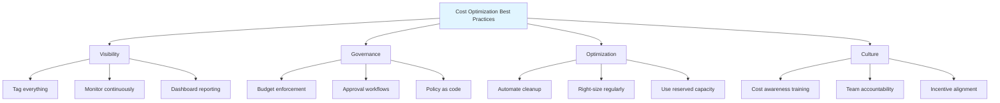
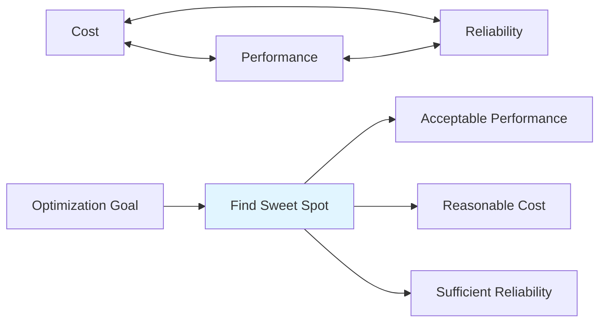

# Cost Scaling - Missing Sections

## Introduction (Completion)

Cost scaling refers to managing and optimizing infrastructure costs while scaling systems to handle growing demands. As systems grow, costs can escalate exponentially if not properly managed. Without careful attention to cost optimization, what starts as a manageable monthly bill can quickly balloon into unsustainable spending that threatens the viability of the entire project.

## FinOps Practices (Completion)

### Cost Optimization Workflow

```javascript
// Complete FinOps workflow
class FinOpsWorkflow {
    async monthlyReview() {
        // 1. Collect cost data
        const costs = await this.collectCostData();
        
        // 2. Analyze and attribute
        const attribution = this.attributeCosts(costs);
        
        // 3. Identify opportunities
        const opportunities = await this.findOptimizations(costs);
        
        // 4. Prioritize by impact
        const prioritized = this.prioritizeByROI(opportunities);
        
        // 5. Create action plan
        const actionPlan = this.createActionPlan(prioritized);
        
        // 6. Assign ownership
        await this.assignTasks(actionPlan);
        
        // 7. Track implementation
        await this.trackProgress(actionPlan);
        
        return {
            totalCost: costs.total,
            breakdown: attribution,
            opportunities: prioritized,
            actionPlan: actionPlan,
            estimatedSavings: this.calculatePotentialSavings(opportunities)
        };
    }
    
    prioritizeByROI(opportunities) {
        return opportunities
            .map(opp => ({
                ...opp,
                roi: opp.savings / (opp.implementationEffort || 1),
                paybackPeriod: (opp.implementationCost || 0) / (opp.savings / 12)
            }))
            .sort((a, b) => b.roi - a.roi);
    }
    
    createActionPlan(opportunities) {
        const quickWins = opportunities.filter(opp => 
            opp.implementationEffort < 5 && opp.savings > 100
        );
        
        const strategicInitiatives = opportunities.filter(opp =>
            opp.savings > 1000
        );
        
        return {
            immediate: quickWins.slice(0, 5),
            shortTerm: opportunities.slice(0, 10),
            longTerm: strategicInitiatives,
            timeline: this.generateTimeline(opportunities)
        };
    }
}
```

## Best Practices

### Comprehensive Cost Optimization Checklist



### 1. Implement Cost Awareness Early

```javascript
// Cost-aware development practices
class CostAwareDevelopment {
    // Estimate cost impact of new features
    async estimateFeatureCost(feature) {
        const resourceRequirements = this.calculateResources(feature);
        
        return {
            compute: this.estimateComputeCost(resourceRequirements),
            storage: this.estimateStorageCost(resourceRequirements),
            network: this.estimateNetworkCost(resourceRequirements),
            database: this.estimateDatabaseCost(resourceRequirements),
            total: this.calculateTotal(resourceRequirements),
            projectedGrowth: this.projectCostGrowth(feature.expectedUsers)
        };
    }
    
    // Review architecture decisions for cost impact
    async reviewArchitecture(design) {
        const alternatives = this.generateAlternatives(design);
        
        const costComparison = alternatives.map(alt => ({
            design: alt,
            estimatedCost: this.estimateCost(alt),
            performance: this.estimatePerformance(alt),
            costPerformanceRatio: this.calculateRatio(alt)
        }));
        
        return costComparison.sort((a, b) => 
            a.costPerformanceRatio - b.costPerformanceRatio
        );
    }
}
```

### 2. Automate Cost Optimization

```javascript
// Automated cost optimization
class AutomatedCostOptimization {
    async runDailyOptimizations() {
        const tasks = [
            this.stopIdleDevInstances(),
            this.deleteUnattachedVolumes(),
            this.cleanupOldSnapshots(),
            this.removeUnusedLoadBalancers(),
            this.optimizeStorageClasses(),
            this.resizeOverProvisionedResources()
        ];
        
        const results = await Promise.all(tasks);
        
        return {
            tasksCompleted: results.length,
            totalSavings: results.reduce((sum, r) => sum + r.savings, 0),
            details: results
        };
    }
    
    async stopIdleDevInstances() {
        const now = new Date();
        const isBusinessHours = now.getHours() >= 9 && now.getHours() < 18;
        const isWeekday = now.getDay() >= 1 && now.getDay() <= 5;
        
        if (!isBusinessHours || !isWeekday) {
            const devInstances = await this.getDevInstances();
            const stopped = await this.stopInstances(devInstances);
            
            return {
                action: 'stop_dev_instances',
                instancesStopped: stopped.length,
                savings: stopped.length * 0.10 * 12 // Assuming $0.10/hour
            };
        }
        
        return { action: 'skip', reason: 'business_hours' };
    }
}
```

### 3. Regular Cost Reviews

```javascript
// Structured cost review process
class CostReviewProcess {
    async weeklyReview() {
        return {
            anomalies: await this.detectAnomalies(),
            trends: await this.analyzeTrends(),
            alerts: await this.checkBudgets(),
            recommendations: await this.generateRecommendations()
        };
    }
    
    async monthlyReview() {
        return {
            summary: await this.getMonthlySummary(),
            variance: await this.analyzeVariance(),
            optimization: await this.identifyOptimizations(),
            forecast: await this.forecastNextMonth(),
            actionItems: await this.createActionItems()
        };
    }
    
    async quarterlyReview() {
        return {
            trends: await this.getQuarterlyTrends(),
            efficiency: await this.calculateEfficiencyMetrics(),
            benchmarking: await this.benchmarkAgainstIndustry(),
            strategy: await this.updateCostStrategy(),
            commitments: await this.reviewCommitments()
        };
    }
}
```

### 4. Cost Allocation and Chargeback

```javascript
// Cost allocation system
class CostAllocation {
    async allocateCosts(month) {
        // Get all resources with tags
        const resources = await this.getTaggedResources();
        
        // Allocate costs by tag dimensions
        const allocation = {
            byTeam: this.allocateByTag(resources, 'Team'),
            byProject: this.allocateByTag(resources, 'Project'),
            byEnvironment: this.allocateByTag(resources, 'Environment'),
            byApplication: this.allocateByTag(resources, 'Application'),
            unallocated: this.findUntaggedCosts(resources)
        };
        
        // Generate chargeback reports
        const chargebacks = this.generateChargebacks(allocation);
        
        return {
            allocation,
            chargebacks,
            unallocatedPercentage: allocation.unallocated / this.getTotalCost(resources)
        };
    }
    
    generateChargebacks(allocation) {
        return allocation.byTeam.map(team => ({
            team: team.name,
            totalCost: team.cost,
            breakdown: {
                compute: team.compute,
                storage: team.storage,
                network: team.network,
                database: team.database
            },
            budget: team.budget,
            variance: team.cost - team.budget,
            trend: this.calculateTrend(team)
        }));
    }
}
```

### 5. Implement Cost Policies

```javascript
// Cost governance policies
class CostPolicies {
    policies = {
        // Require approval for expensive resources
        expensiveResources: {
            threshold: 100, // $100/month
            requiresApproval: true,
            approvers: ['team-lead', 'engineering-manager']
        },
        
        // Auto-shutdown policies
        devEnvironments: {
            shutdownTime: '18:00',
            startupTime: '09:00',
            weekendsOff: true
        },
        
        // Tagging requirements
        requiredTags: ['Environment', 'Team', 'Project', 'Owner'],
        
        // Budget limits
        budgets: {
            dev: { monthly: 5000, alert: 0.8 },
            staging: { monthly: 2000, alert: 0.8 },
            production: { monthly: 20000, alert: 0.9 }
        },
        
        // Instance restrictions
        allowedInstanceTypes: {
            dev: ['t3.micro', 't3.small', 't3.medium'],
            staging: ['t3.medium', 't3.large', 'm5.large'],
            production: ['t3.large', 'm5.large', 'm5.xlarge', 'c5.large']
        }
    };
    
    async enforcePolicy(resource, action) {
        // Check if resource meets policy requirements
        const violations = [];
        
        if (resource.estimatedMonthlyCost > this.policies.expensiveResources.threshold) {
            if (!resource.approval) {
                violations.push('REQUIRES_APPROVAL');
            }
        }
        
        if (!this.hasRequiredTags(resource)) {
            violations.push('MISSING_TAGS');
        }
        
        if (!this.isAllowedInstanceType(resource)) {
            violations.push('INSTANCE_TYPE_NOT_ALLOWED');
        }
        
        if (violations.length > 0) {
            return {
                allowed: false,
                violations,
                message: this.formatViolations(violations)
            };
        }
        
        return { allowed: true };
    }
}
```

## Cost vs Performance Trade-offs

### Understanding the Balance



### Trade-off Analysis Framework

```javascript
// Cost vs Performance analysis
class TradeoffAnalysis {
    async analyzeTradeoffs(options) {
        const scored = options.map(option => {
            const costScore = this.normalizeCost(option.cost);
            const perfScore = this.normalizePerformance(option.performance);
            const reliabilityScore = this.normalizeReliability(option.reliability);
            
            // Weighted score based on business priorities
            const weights = {
                cost: 0.4,
                performance: 0.4,
                reliability: 0.2
            };
            
            const totalScore = 
                (1 - costScore) * weights.cost + // Lower cost is better
                perfScore * weights.performance +
                reliabilityScore * weights.reliability;
            
            return {
                ...option,
                scores: { cost: costScore, performance: perfScore, reliability: reliabilityScore },
                totalScore,
                costPerformanceRatio: option.cost / option.performance,
                recommendation: this.generateRecommendation(option, totalScore)
            };
        });
        
        return scored.sort((a, b) => b.totalScore - a.totalScore);
    }
    
    generateRecommendation(option, score) {
        if (score > 0.8) {
            return 'HIGHLY_RECOMMENDED';
        } else if (score > 0.6) {
            return 'RECOMMENDED';
        } else if (score > 0.4) {
            return 'ACCEPTABLE';
        } else {
            return 'NOT_RECOMMENDED';
        }
    }
}
```

### Common Trade-off Scenarios

```javascript
// Real-world trade-off examples
const tradeoffScenarios = {
    caching: {
        withoutCache: {
            cost: 500, // Database queries
            latency: 200,
            reliability: 0.95
        },
        withCache: {
            cost: 600, // DB + Cache
            latency: 10,
            reliability: 0.98
        },
        decision: 'Cache improves performance significantly for small cost increase'
    },
    
    database: {
        singleInstance: {
            cost: 200,
            availability: 0.99,
            performance: 100
        },
        multiAZ: {
            cost: 400,
            availability: 0.999,
            performance: 100
        },
        readReplicas: {
            cost: 600,
            availability: 0.999,
            performance: 300
        },
        decision: 'Multi-AZ for production, single for dev/test'
    },
    
    compute: {
        onDemand: {
            cost: 1000,
            flexibility: 'HIGH',
            commitment: 'NONE'
        },
        reserved: {
            cost: 400,
            flexibility: 'LOW',
            commitment: '1-3 years'
        },
        spot: {
            cost: 150,
            flexibility: 'MEDIUM',
            commitment: 'NONE',
            risk: 'Interruption possible'
        },
        decision: 'Mix: Reserved for baseline, on-demand for burst, spot for batch'
    }
};
```

### Decision Matrix

```javascript
// Cost optimization decision matrix
class CostDecisionMatrix {
    makeDecision(scenario) {
        const priorities = this.getBusinessPriorities();
        
        // High-priority, customer-facing
        if (scenario.customerFacing && priorities.customerExperience === 'HIGH') {
            return {
                decision: 'OPTIMIZE_FOR_PERFORMANCE',
                reasoning: 'Customer experience is critical',
                acceptableCostIncrease: '50%'
            };
        }
        
        // Internal tools, cost-sensitive
        if (!scenario.customerFacing && priorities.costControl === 'HIGH') {
            return {
                decision: 'OPTIMIZE_FOR_COST',
                reasoning: 'Internal tool, cost savings prioritized',
                acceptablePerformanceDegradation: '30%'
            };
        }
        
        // Production systems
        if (scenario.environment === 'production') {
            return {
                decision: 'BALANCED_APPROACH',
                reasoning: 'Balance cost and reliability for production',
                costLimit: priorities.productionBudget,
                minReliability: 0.999
            };
        }
        
        // Development/Test
        if (scenario.environment !== 'production') {
            return {
                decision: 'MINIMIZE_COST',
                reasoning: 'Non-production environment',
                strategies: ['Use spot instances', 'Auto-shutdown', 'Smaller instances']
            };
        }
        
        return { decision: 'EVALUATE_CASE_BY_CASE' };
    }
}
```

### Cost Optimization ROI Calculator

```javascript
// Calculate ROI of optimization efforts
class OptimizationROI {
    calculateROI(optimization) {
        const implementation = {
            timeHours: optimization.implementationTime,
            engineerCost: 150, // $/hour
            totalCost: optimization.implementationTime * 150
        };
        
        const savings = {
            monthly: optimization.monthlySavings,
            annual: optimization.monthlySavings * 12,
            threeYear: optimization.monthlySavings * 36
        };
        
        const payback = {
            months: implementation.totalCost / savings.monthly,
            breakEven: new Date(Date.now() + (payback.months * 30 * 24 * 60 * 60 * 1000))
        };
        
        const roi = {
            oneYear: ((savings.annual - implementation.totalCost) / implementation.totalCost) * 100,
            threeYear: ((savings.threeYear - implementation.totalCost) / implementation.totalCost) * 100
        };
        
        return {
            implementation,
            savings,
            payback,
            roi,
            recommendation: this.getRecommendation(roi, payback)
        };
    }
    
    getRecommendation(roi, payback) {
        if (payback.months < 3 && roi.oneYear > 100) {
            return 'IMPLEMENT_IMMEDIATELY';
        } else if (payback.months < 6 && roi.oneYear > 50) {
            return 'HIGH_PRIORITY';
        } else if (payback.months < 12) {
            return 'MEDIUM_PRIORITY';
        } else {
            return 'LOW_PRIORITY_OR_SKIP';
        }
    }
}
```

## Summary

Cost scaling is not a one-time activity but a continuous practice that requires:

1. **Visibility** - Know where your money is going
2. **Measurement** - Track metrics and trends
3. **Optimization** - Continuously improve efficiency
4. **Culture** - Make everyone cost-aware
5. **Automation** - Enforce policies automatically
6. **Balance** - Find the right cost/performance trade-off

By following the strategies outlined in this document, you can build scalable systems that grow efficiently without breaking the budget.

**Key Takeaways:**
- Start with visibility and tagging
- Automate cost optimization tasks
- Use the right pricing models for each workload
- Regular reviews and continuous improvement
- Balance cost with performance and reliability
- Make cost optimization part of your culture

**References:**
- [auto_scaling.md](./auto_scaling.md) - Dynamic resource management
- [horizontal_scaling.md](./horizontal_scaling.md) - Cost-effective scaling patterns
- [database_scaling.md](./database_scaling.md) - Database optimization
- [caching_strategies.md](./caching_strategies.md) - Reduce compute costs
- [best_practises.md](./best_practises.md) - General best practices