# Database Scaling

## Table of Contents
- [Introduction](#introduction)
- [Vertical Scaling (Scale-Up)](#vertical-scaling-scale-up)
- [Horizontal Scaling (Scale-Out)](#horizontal-scaling-scale-out)
- [Replication Strategies](#replication-strategies)
- [Sharding (Partitioning)](#sharding-partitioning)
- [Database Clustering](#database-clustering)
- [Caching Layer](#caching-layer)
- [Read/Write Splitting](#readwrite-splitting)
- [Connection Pooling](#connection-pooling)
- [Data Denormalization](#data-denormalization)
- [NoSQL vs SQL for Scaling](#nosql-vs-sql-for-scaling)
- [Best Practices](#best-practices)
- [Trade-offs and Considerations](#trade-offs-and-considerations)

## Introduction

Database scaling is the process of increasing a database's capacity to handle more data, transactions, and concurrent users. As applications grow, databases often become the bottleneck. This document explores various strategies to scale databases effectively.

**Why Database Scaling Matters:**
- Applications can handle increased load
- Improved response times and user experience
- Better fault tolerance and availability
- Support for business growth

**Related Documents:**
- See [vertical_scaling.md](./vertical_scaling.md) for hardware-based scaling approaches
- See [horizontal_scaling.md](./horizontal_scaling.md) for distributed system patterns
- See [caching_strategies.md](./caching_strategies.md) for reducing database load
- See [eventual_consistency.md](./eventual_consistency.md) for consistency models in distributed databases

## Vertical Scaling (Scale-Up)

Vertical scaling involves increasing the capacity of a single database server by adding more resources.

### Approach
- Increase CPU cores and processing power
- Add more RAM for larger in-memory operations
- Upgrade to faster storage (SSD, NVMe)
- Optimize network bandwidth

### Advantages
- Simple to implement (no application changes)
- Maintains ACID properties
- No data distribution complexity
- Consistent data model

### Limitations
- Hardware limits (physical constraints)
- Single point of failure
- Downtime during upgrades
- Diminishing returns on cost
- Eventually hits a ceiling

### When to Use
- Small to medium-sized applications
- When strong consistency is critical
- As a first step before horizontal scaling
- For workloads that benefit from single-machine optimization

**Reference:** See [vertical_scaling.md](./vertical_scaling.md) for detailed vertical scaling strategies.

## Horizontal Scaling (Scale-Out)

Horizontal scaling distributes data and load across multiple database servers.

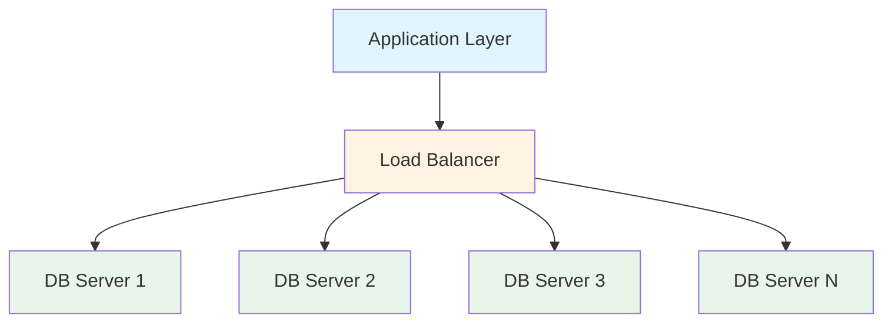

### Key Concepts
- **Shared-Nothing Architecture:** Each node operates independently
- **Data Distribution:** Data is spread across multiple nodes
- **Parallel Processing:** Multiple servers handle requests simultaneously
- **Elastic Scaling:** Add/remove nodes based on demand

### Advantages
- Near-infinite scalability
- Improved fault tolerance
- No single point of failure
- Cost-effective (commodity hardware)
- Flexible capacity management

### Challenges
- Complex data distribution
- Consistency management
- Cross-shard queries are expensive
- Increased operational complexity
- Network latency between nodes

**Reference:** See [horizontal_scaling.md](./horizontal_scaling.md) for distributed system architectures.

## Replication Strategies

Replication creates copies of data across multiple database servers for redundancy and read scaling.

### Master-Slave Replication (Primary-Replica)

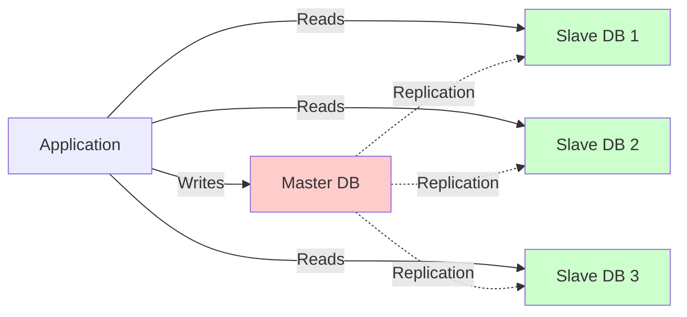

**Characteristics:**
- Single master handles all writes
- Multiple slaves handle reads
- Asynchronous or synchronous replication
- Reduces read load on master

**Use Cases:**
- Read-heavy workloads (90% reads, 10% writes)
- Reporting and analytics queries
- Geographic distribution for read performance

### Master-Master Replication (Multi-Master)

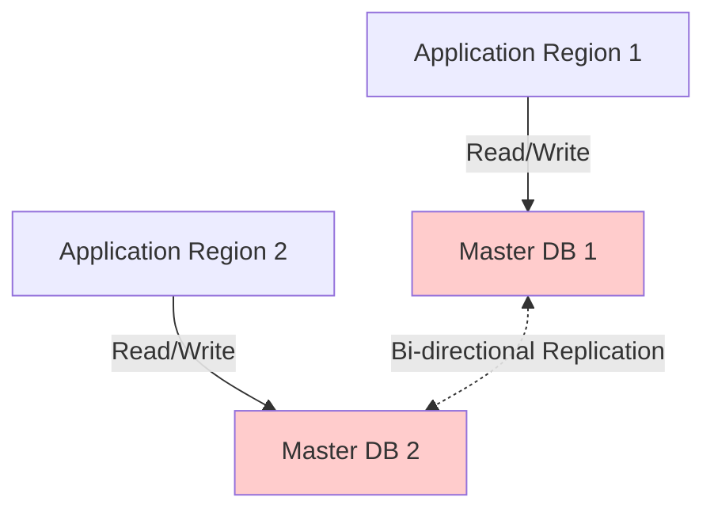

**Characteristics:**
- Multiple masters accept writes
- Bi-directional replication
- Requires conflict resolution
- Higher availability

**Challenges:**
- Write conflicts
- Complex conflict resolution logic
- Eventual consistency issues
- Data consistency guarantees

### Synchronous vs Asynchronous Replication

**Synchronous:**
- Write confirmed after all replicas update
- Strong consistency
- Higher latency
- Risk of availability issues if replica is down

**Asynchronous:**
- Write confirmed immediately
- Lower latency
- Risk of data loss if master fails
- Eventual consistency

**Reference:** See [eventual_consistency.md](./eventual_consistency.md) for consistency models.

## Sharding (Partitioning)

Sharding divides data across multiple databases, with each shard containing a subset of the total data.

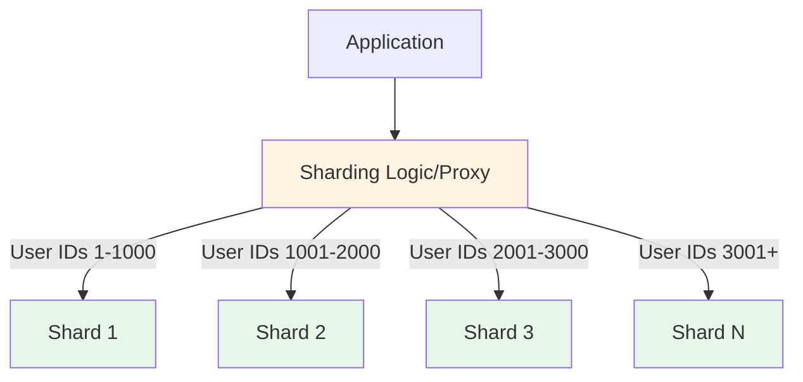

### Sharding Strategies

#### 1. Range-Based Sharding
- Data divided by ranges (e.g., A-M in Shard 1, N-Z in Shard 2)
- Simple to implement
- Risk of uneven distribution (hot shards)

#### 2. Hash-Based Sharding
- Apply hash function to shard key
- Even distribution
- Difficult to perform range queries
- Resharding requires data movement

```javascript
// Hash-based shard determination (conceptual)
function getShardId(userId, totalShards) {
    return hash(userId) % totalShards;
}
```

#### 3. Geographic Sharding
- Data stored based on user location
- Low latency for regional users
- Regulatory compliance (data residency)

#### 4. Directory-Based Sharding
- Lookup table maps keys to shards
- Flexible shard assignment
- Directory becomes a potential bottleneck

### Choosing a Shard Key

**Good Shard Key Characteristics:**
- High cardinality (many unique values)
- Even distribution
- Minimizes cross-shard queries
- Aligns with access patterns

**Common Shard Keys:**
- User ID
- Tenant ID (multi-tenant apps)
- Geographic region
- Time/Date (for time-series data)

### Challenges with Sharding

**1. Cross-Shard Queries:**
- Queries spanning multiple shards are expensive
- Requires aggregation logic in application layer
- Increased latency

**2. Rebalancing:**
- Adding/removing shards requires data migration
- Consistent hashing can minimize resharding
- Downtime or performance impact during rebalancing

**3. Referential Integrity:**
- Foreign keys across shards are difficult
- Application-level integrity checks
- Denormalization may be necessary

**4. Operational Complexity:**
- Multiple databases to manage
- Backup and recovery complexity
- Monitoring and alerting

## Database Clustering

Database clustering groups multiple servers to work as a single system.

### Shared-Disk Clustering

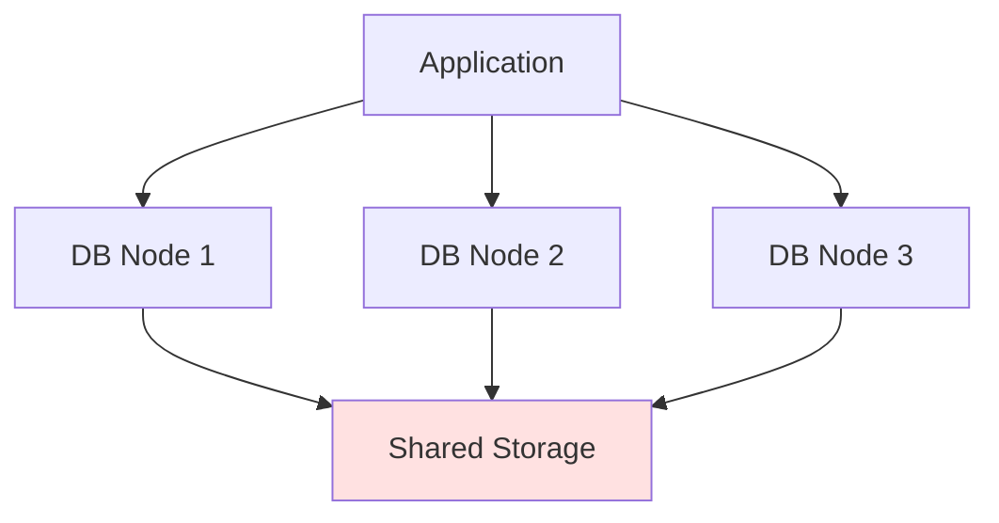

- Multiple nodes access same storage
- Active-active or active-passive configuration
- High availability
- Storage can be a bottleneck

### Shared-Nothing Clustering

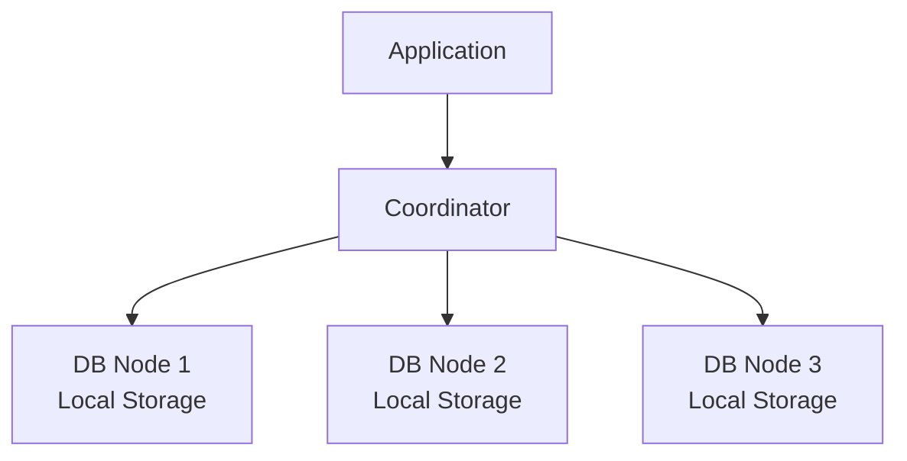

- Each node has independent storage
- Data distributed across nodes
- Better scalability
- More complex data management

## Caching Layer

Implementing a cache layer reduces database load significantly.

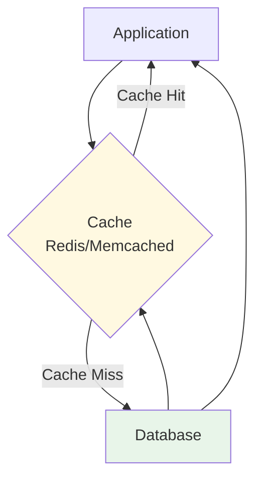

### Caching Strategies

**1. Cache-Aside (Lazy Loading):**
- Application checks cache first
- On miss, loads from DB and populates cache
- Good for read-heavy workloads

**2. Write-Through:**
- Write to cache and DB simultaneously
- Strong consistency
- Higher write latency

**3. Write-Behind (Write-Back):**
- Write to cache immediately
- Async write to DB
- Lower write latency
- Risk of data loss

**4. Refresh-Ahead:**
- Automatically refresh cache before expiration
- Reduced cache misses
- Requires predictable access patterns

**What to Cache:**
- Frequently accessed data
- Expensive query results
- Session data
- User profiles
- Static content

**Cache Invalidation:**
- Time-based expiration (TTL)
- Event-driven invalidation
- Write-through invalidation
- Manual purging

**Reference:** See [caching_strategies.md](./caching_strategies.md) for comprehensive caching patterns.

## Read/Write Splitting

Separating read and write operations optimizes database performance.

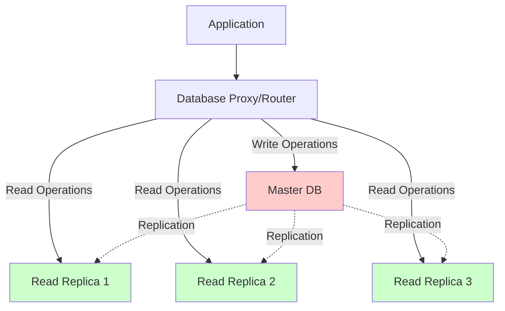

### Implementation Approaches

**1. Application-Level:**
- Application logic routes queries
- Full control over routing logic
- Increased application complexity

**2. Proxy-Level:**
- Database proxy handles routing (ProxySQL, MaxScale)
- Transparent to application
- Single point of failure (use HA proxy)

**3. Driver-Level:**
- Database driver handles routing
- No additional infrastructure
- Limited to supported languages/frameworks

### Considerations

**Replication Lag:**
- Replicas may be slightly behind master
- Can cause "read your own write" issues
- Solutions: Read from master for recent writes, sticky sessions

**Load Distribution:**
- Distribute reads across multiple replicas
- Monitor replica lag
- Remove slow replicas from pool

**Reference:** See [load_balancing.md](./load_balancing.md) for traffic distribution strategies.

## Connection Pooling

Connection pooling reuses database connections to reduce overhead.

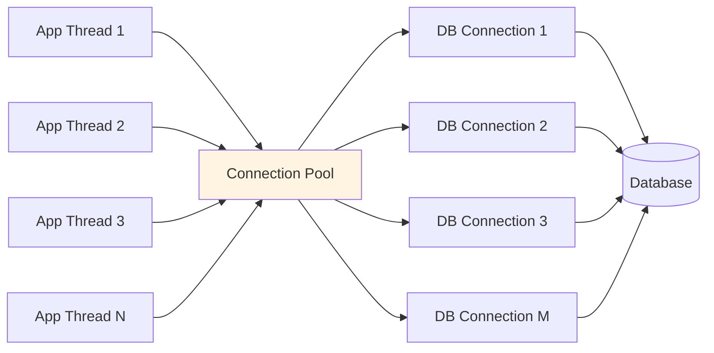

### Benefits
- Reduced connection overhead
- Better resource utilization
- Controlled concurrency
- Improved response times

### Configuration Parameters

**Pool Size:**
- Min connections: Always available
- Max connections: Upper limit
- Formula: `connections = (core_count * 2) + effective_spindle_count`

**Connection Lifecycle:**
- Max lifetime: Prevent stale connections
- Idle timeout: Close unused connections
- Connection validation: Test before use

**Wait Policy:**
- Queue requests when pool exhausted
- Timeout after specified duration
- Reject immediately vs wait

### Popular Connection Poolers
- **HikariCP** (Java)
- **PgBouncer** (PostgreSQL)
- **ProxySQL** (MySQL)
- **Connection pooling libraries** in frameworks (Django, Rails, etc.)

## Data Denormalization

Denormalization trades storage and update complexity for read performance.

### When to Denormalize

**Read Performance Critical:**
- Frequently accessed data
- Complex joins are expensive
- Read-heavy workloads

**Acceptable Trade-offs:**
- Some data redundancy is okay
- Eventual consistency acceptable
- Write performance less critical

### Denormalization Techniques

**1. Duplicate Data:**
- Store computed values
- Avoid expensive aggregations
- Example: Store `order_total` instead of calculating from line items

**2. Materialized Views:**
- Pre-computed query results
- Refresh periodically or on-demand
- Great for reporting and analytics

**3. Aggregate Tables:**
- Pre-aggregate metrics
- Daily/hourly summaries
- Reduces real-time computation

**4. Embedded Documents (NoSQL):**
- Store related data together
- Eliminates joins
- Example: Embed user address in user document

### Maintaining Consistency

**Application-Level:**
- Update all denormalized copies
- Use transactions where possible
- Handle failures gracefully

**Event-Driven:**
- Publish events on data changes
- Async updates to denormalized data
- Eventual consistency

**Reference:** See [eventual_consistency.md](./eventual_consistency.md) for consistency patterns.

## NoSQL vs SQL for Scaling

### SQL Databases (Relational)

**Strengths:**
- Strong ACID guarantees
- Complex queries and joins
- Mature tooling and ecosystem
- Data integrity constraints

**Scaling Approaches:**
- Vertical scaling (easiest)
- Read replicas
- Sharding (complex)
- Clustering solutions

**Best For:**
- Financial transactions
- Complex relationships
- Strong consistency requirements
- Structured data

### NoSQL Databases

**Types:**
1. **Document (MongoDB, CouchDB)**
   - Flexible schema
   - Horizontal scaling built-in
   - Good for hierarchical data

2. **Key-Value (Redis, DynamoDB)**
   - Simple data model
   - Extremely fast reads/writes
   - Great for caching and sessions

3. **Column-Family (Cassandra, HBase)**
   - Wide column storage
   - Time-series data
   - Write-optimized

4. **Graph (Neo4j, Amazon Neptune)**
   - Relationship-focused
   - Complex network queries
   - Social networks, recommendations

**Strengths:**
- Designed for horizontal scaling
- High write throughput
- Flexible schemas
- Eventual consistency models

**Scaling Approaches:**
- Automatic sharding
- Built-in replication
- Multi-datacenter support
- Linear scalability

**Best For:**
- High-volume writes
- Flexible/evolving schemas
- Geographic distribution
- Big data applications

### Polyglot Persistence

Using multiple database types in one system:

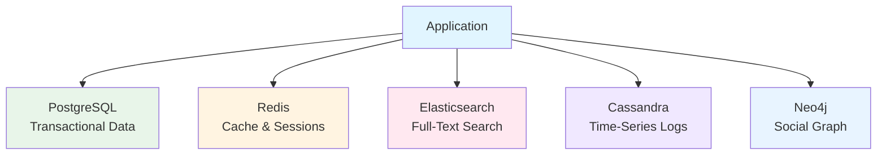

**Benefits:**
- Use best tool for each use case
- Optimize for specific access patterns
- Better performance and scalability

**Challenges:**
- Increased complexity
- Data synchronization
- Multiple technologies to maintain
- Consistency across systems

## Best Practices

### 1. Measure Before Scaling
- Profile queries and identify bottlenecks
- Monitor key metrics (QPS, latency, error rate)
- Use APM tools
- Understand access patterns

### 2. Index Optimization
- Create indexes for frequently queried columns
- Avoid over-indexing (slows writes)
- Monitor index usage
- Regular index maintenance

### 3. Query Optimization
- Analyze slow query logs
- Use EXPLAIN plans
- Avoid N+1 queries
- Batch operations when possible
- Limit result sets

### 4. Schema Design
- Design for access patterns
- Consider denormalization for read-heavy tables
- Use appropriate data types
- Partition large tables

### 5. Monitoring and Alerting
- Track database metrics (CPU, memory, I/O)
- Monitor replication lag
- Set up alerts for anomalies
- Regular performance reviews

### 6. Backup and Recovery
- Automate backups
- Test restore procedures
- Consider point-in-time recovery
- Geographic backup distribution

### 7. Gradual Migration
- Start with vertical scaling
- Add caching layer
- Implement read replicas
- Shard when necessary
- Incremental approach reduces risk

### 8. Use Auto-Scaling
- Cloud databases with auto-scaling
- Scale based on metrics
- Cost optimization
- Handle traffic spikes

**Reference:** See [auto_scaling.md](./auto_scaling.md) for dynamic scaling strategies.

### 9. Connection Management
- Use connection pooling
- Set appropriate timeouts
- Monitor connection count
- Implement circuit breakers

### 10. Security Considerations
- Encrypt data at rest and in transit
- Least privilege access
- Regular security audits
- Compliance requirements (GDPR, HIPAA)

**Reference:** See [best_practises.md](./best_practises.md) for comprehensive best practices.

## Trade-offs and Considerations

### Consistency vs Availability

**CAP Theorem:**
- **C**onsistency: All nodes see same data
- **A**vailability: Every request receives a response
- **P**artition Tolerance: System works despite network failures

**Reality:** Can only guarantee 2 of 3

**CP Systems (Consistency + Partition Tolerance):**
- Strong consistency
- May become unavailable
- Example: Traditional RDBMS with strict ACID

**AP Systems (Availability + Partition Tolerance):**
- Always available
- Eventual consistency
- Example: Cassandra, DynamoDB

**Reference:** See [eventual_consistency.md](./eventual_consistency.md) for detailed consistency models.

### Latency vs Throughput

**Optimize for Latency:**
- Caching
- Read replicas
- Connection pooling
- Query optimization

**Optimize for Throughput:**
- Batch operations
- Async processing
- Horizontal scaling
- Write buffering

### Cost vs Performance

**Cost Considerations:**
- Hardware/cloud costs
- Operational complexity
- Development time
- Maintenance overhead

**Optimization Strategies:**
- Start simple, scale as needed
- Use managed services (RDS, Aurora, etc.)
- Monitor and optimize continuously
- Consider total cost of ownership

**Reference:** See [cost_scaling.md](./cost_scaling.md) for cost optimization strategies.

### Complexity vs Flexibility

**Simple Architecture:**
- Single database
- Easy to understand
- Lower operational overhead
- Limited scalability

**Complex Architecture:**
- Multiple databases/shards
- Higher operational burden
- Better scalability
- Requires skilled team

### Data Consistency Requirements

**Strong Consistency:**
- Financial transactions
- Inventory management
- Booking systems

**Eventual Consistency:**
- Social media feeds
- Analytics
- Recommendation systems
- Non-critical features

## Real-World Scaling Journey

A typical database scaling progression:

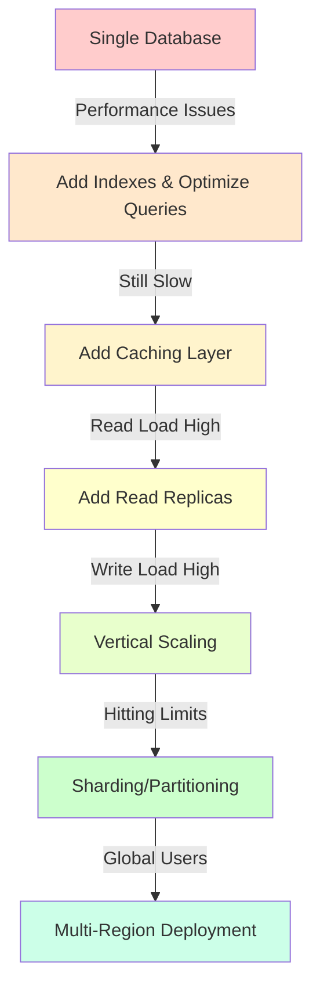

### Stage 1: Single Database (0-10K users)
- Vertical scaling
- Query optimization
- Basic indexes

### Stage 2: Caching + Optimization (10K-100K users)
- Add Redis/Memcached
- Connection pooling
- Query tuning

### Stage 3: Read Replicas (100K-1M users)
- Master-slave replication
- Read/write splitting
- Load balancing

### Stage 4: Sharding (1M+ users)
- Horizontal partitioning
- Distributed queries
- Complex operations

### Stage 5: Multi-Region (Global Scale)
- Geographic distribution
- Cross-region replication
- Edge caching

**Reference:** See case studies in [case-studies/](./case-studies/) folder.

## Conclusion

Database scaling is not a one-size-fits-all solution. The right approach depends on:

- **Application requirements:** Read vs write heavy, consistency needs
- **Growth trajectory:** Current and projected scale
- **Budget constraints:** Infrastructure and operational costs
- **Team expertise:** Available skills and resources
- **Technology stack:** Existing tools and frameworks

**Key Takeaways:**

1. **Start simple:** Vertical scaling and optimization first
2. **Measure everything:** Data-driven scaling decisions
3. **Layer your approach:** Caching → Replication → Sharding
4. **Plan for failure:** Build redundancy and failover mechanisms
5. **Consider managed services:** RDS, Aurora, Cloud SQL reduce operational burden
6. **Monitor continuously:** Proactive scaling beats reactive firefighting

**Related Resources:**
- [vertical_scaling.md](./vertical_scaling.md) - Hardware-based scaling
- [horizontal_scaling.md](./horizontal_scaling.md) - Distributed systems
- [caching_strategies.md](./caching_strategies.md) - Reduce database load
- [load_balancing.md](./load_balancing.md) - Traffic distribution
- [eventual_consistency.md](./eventual_consistency.md) - Consistency models
- [auto_scaling.md](./auto_scaling.md) - Dynamic resource management
- [message_queues.md](./message_queues.md) - Async processing patterns
- [cost_scaling.md](./cost_scaling.md) - Cost optimization
- [best_practises.md](./best_practises.md) - General best practices

Database scaling is a journey, not a destination. Stay flexible, keep learning, and scale intelligently!